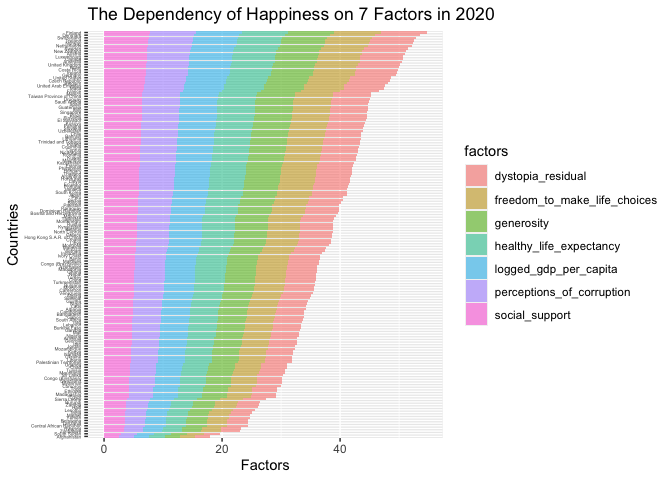
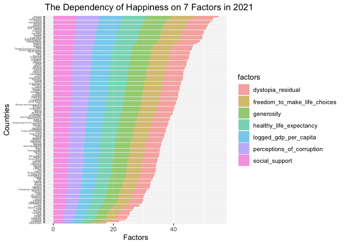
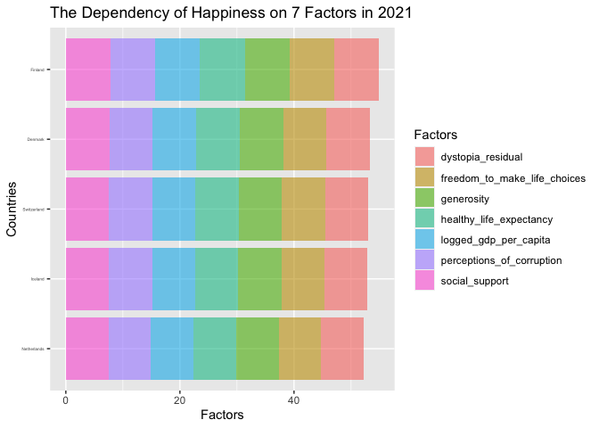

# Load New Package

```r
#install.packages("shiny")
#install.packages("shinydashboard")
```


#Load Programs

```r
library(tidyverse)
```

```
## ── Attaching packages ─────────────────────────────────────── tidyverse 1.3.2 ──
## ✔ ggplot2 3.4.0      ✔ purrr   1.0.1 
## ✔ tibble  3.1.8      ✔ dplyr   1.0.10
## ✔ tidyr   1.2.1      ✔ stringr 1.5.0 
## ✔ readr   2.1.3      ✔ forcats 0.5.2 
## ── Conflicts ────────────────────────────────────────── tidyverse_conflicts() ──
## ✖ dplyr::filter() masks stats::filter()
## ✖ dplyr::lag()    masks stats::lag()
```

```r
library(naniar)
library(janitor)
```

```
## 
## Attaching package: 'janitor'
## 
## The following objects are masked from 'package:stats':
## 
##     chisq.test, fisher.test
```

```r
library(here)
```

```
## here() starts at /Users/harikakovvuri/Desktop/happy-main/happiness_finder/happy_project
```

```r
library(shiny)
library(shinydashboard)
```

```
## 
## Attaching package: 'shinydashboard'
## 
## The following object is masked from 'package:graphics':
## 
##     box
```

```r
library(ggplot2)
```


#Load 2021 Data

```r
happy_2021 <-read.csv(here("happiness_data", "2021.csv")) %>% clean_names()
happy_2021
```

```
##                  country_name                 regional_indicator ladder_score
## 1                     Finland                     Western Europe        7.842
## 2                     Denmark                     Western Europe        7.620
## 3                 Switzerland                     Western Europe        7.571
## 4                     Iceland                     Western Europe        7.554
## 5                 Netherlands                     Western Europe        7.464
## 6                      Norway                     Western Europe        7.392
## 7                      Sweden                     Western Europe        7.363
## 8                  Luxembourg                     Western Europe        7.324
## 9                 New Zealand              North America and ANZ        7.277
## 10                    Austria                     Western Europe        7.268
## 11                  Australia              North America and ANZ        7.183
## 12                     Israel       Middle East and North Africa        7.157
## 13                    Germany                     Western Europe        7.155
## 14                     Canada              North America and ANZ        7.103
## 15                    Ireland                     Western Europe        7.085
## 16                 Costa Rica        Latin America and Caribbean        7.069
## 17             United Kingdom                     Western Europe        7.064
## 18             Czech Republic         Central and Eastern Europe        6.965
## 19              United States              North America and ANZ        6.951
## 20                    Belgium                     Western Europe        6.834
## 21                     France                     Western Europe        6.690
## 22                    Bahrain       Middle East and North Africa        6.647
## 23                      Malta                     Western Europe        6.602
## 24   Taiwan Province of China                          East Asia        6.584
## 25       United Arab Emirates       Middle East and North Africa        6.561
## 26               Saudi Arabia       Middle East and North Africa        6.494
## 27                      Spain                     Western Europe        6.491
## 28                      Italy                     Western Europe        6.483
## 29                   Slovenia         Central and Eastern Europe        6.461
## 30                  Guatemala        Latin America and Caribbean        6.435
## 31                    Uruguay        Latin America and Caribbean        6.431
## 32                  Singapore                     Southeast Asia        6.377
## 33                     Kosovo         Central and Eastern Europe        6.372
## 34                   Slovakia         Central and Eastern Europe        6.331
## 35                     Brazil        Latin America and Caribbean        6.330
## 36                     Mexico        Latin America and Caribbean        6.317
## 37                    Jamaica        Latin America and Caribbean        6.309
## 38                  Lithuania         Central and Eastern Europe        6.255
## 39                     Cyprus                     Western Europe        6.223
## 40                    Estonia         Central and Eastern Europe        6.189
## 41                     Panama        Latin America and Caribbean        6.180
## 42                 Uzbekistan Commonwealth of Independent States        6.179
## 43                      Chile        Latin America and Caribbean        6.172
## 44                     Poland         Central and Eastern Europe        6.166
## 45                 Kazakhstan Commonwealth of Independent States        6.152
## 46                    Romania         Central and Eastern Europe        6.140
## 47                     Kuwait       Middle East and North Africa        6.106
## 48                     Serbia         Central and Eastern Europe        6.078
## 49                El Salvador        Latin America and Caribbean        6.061
## 50                  Mauritius                 Sub-Saharan Africa        6.049
## 51                     Latvia         Central and Eastern Europe        6.032
## 52                   Colombia        Latin America and Caribbean        6.012
## 53                    Hungary         Central and Eastern Europe        5.992
## 54                   Thailand                     Southeast Asia        5.985
## 55                  Nicaragua        Latin America and Caribbean        5.972
## 56                      Japan                          East Asia        5.940
## 57                  Argentina        Latin America and Caribbean        5.929
## 58                   Portugal                     Western Europe        5.929
## 59                   Honduras        Latin America and Caribbean        5.919
## 60                    Croatia         Central and Eastern Europe        5.882
## 61                Philippines                     Southeast Asia        5.880
## 62                South Korea                          East Asia        5.845
## 63                       Peru        Latin America and Caribbean        5.840
## 64     Bosnia and Herzegovina         Central and Eastern Europe        5.813
## 65                    Moldova Commonwealth of Independent States        5.766
## 66                    Ecuador        Latin America and Caribbean        5.764
## 67                 Kyrgyzstan Commonwealth of Independent States        5.744
## 68                     Greece                     Western Europe        5.723
## 69                    Bolivia        Latin America and Caribbean        5.716
## 70                   Mongolia                          East Asia        5.677
## 71                   Paraguay        Latin America and Caribbean        5.653
## 72                 Montenegro         Central and Eastern Europe        5.581
## 73         Dominican Republic        Latin America and Caribbean        5.545
## 74               North Cyprus                     Western Europe        5.536
## 75                    Belarus Commonwealth of Independent States        5.534
## 76                     Russia Commonwealth of Independent States        5.477
## 77  Hong Kong S.A.R. of China                          East Asia        5.477
## 78                 Tajikistan Commonwealth of Independent States        5.466
## 79                    Vietnam                     Southeast Asia        5.411
## 80                      Libya       Middle East and North Africa        5.410
## 81                   Malaysia                     Southeast Asia        5.384
## 82                  Indonesia                     Southeast Asia        5.345
## 83        Congo (Brazzaville)                 Sub-Saharan Africa        5.342
## 84                      China                          East Asia        5.339
## 85                Ivory Coast                 Sub-Saharan Africa        5.306
## 86                    Armenia Commonwealth of Independent States        5.283
## 87                      Nepal                         South Asia        5.269
## 88                   Bulgaria         Central and Eastern Europe        5.266
## 89                   Maldives                         South Asia        5.198
## 90                 Azerbaijan Commonwealth of Independent States        5.171
## 91                   Cameroon                 Sub-Saharan Africa        5.142
## 92                    Senegal                 Sub-Saharan Africa        5.132
## 93                    Albania         Central and Eastern Europe        5.117
## 94            North Macedonia         Central and Eastern Europe        5.101
## 95                      Ghana                 Sub-Saharan Africa        5.088
## 96                      Niger                 Sub-Saharan Africa        5.074
## 97               Turkmenistan Commonwealth of Independent States        5.066
## 98                     Gambia                 Sub-Saharan Africa        5.051
## 99                      Benin                 Sub-Saharan Africa        5.045
## 100                      Laos                     Southeast Asia        5.030
## 101                Bangladesh                         South Asia        5.025
## 102                    Guinea                 Sub-Saharan Africa        4.984
## 103              South Africa                 Sub-Saharan Africa        4.956
## 104                    Turkey       Middle East and North Africa        4.948
## 105                  Pakistan                         South Asia        4.934
## 106                   Morocco       Middle East and North Africa        4.918
## 107                 Venezuela        Latin America and Caribbean        4.892
## 108                   Georgia Commonwealth of Independent States        4.891
## 109                   Algeria       Middle East and North Africa        4.887
## 110                   Ukraine Commonwealth of Independent States        4.875
## 111                      Iraq       Middle East and North Africa        4.854
## 112                     Gabon                 Sub-Saharan Africa        4.852
## 113              Burkina Faso                 Sub-Saharan Africa        4.834
## 114                  Cambodia                     Southeast Asia        4.830
## 115                Mozambique                 Sub-Saharan Africa        4.794
## 116                   Nigeria                 Sub-Saharan Africa        4.759
## 117                      Mali                 Sub-Saharan Africa        4.723
## 118                      Iran       Middle East and North Africa        4.721
## 119                    Uganda                 Sub-Saharan Africa        4.636
## 120                   Liberia                 Sub-Saharan Africa        4.625
## 121                     Kenya                 Sub-Saharan Africa        4.607
## 122                   Tunisia       Middle East and North Africa        4.596
## 123                   Lebanon       Middle East and North Africa        4.584
## 124                   Namibia                 Sub-Saharan Africa        4.574
## 125   Palestinian Territories       Middle East and North Africa        4.517
## 126                   Myanmar                     Southeast Asia        4.426
## 127                    Jordan       Middle East and North Africa        4.395
## 128                      Chad                 Sub-Saharan Africa        4.355
## 129                 Sri Lanka                         South Asia        4.325
## 130                 Swaziland                 Sub-Saharan Africa        4.308
## 131                   Comoros                 Sub-Saharan Africa        4.289
## 132                     Egypt       Middle East and North Africa        4.283
## 133                  Ethiopia                 Sub-Saharan Africa        4.275
## 134                Mauritania                 Sub-Saharan Africa        4.227
## 135                Madagascar                 Sub-Saharan Africa        4.208
## 136                      Togo                 Sub-Saharan Africa        4.107
## 137                    Zambia                 Sub-Saharan Africa        4.073
## 138              Sierra Leone                 Sub-Saharan Africa        3.849
## 139                     India                         South Asia        3.819
## 140                   Burundi                 Sub-Saharan Africa        3.775
## 141                     Yemen       Middle East and North Africa        3.658
## 142                  Tanzania                 Sub-Saharan Africa        3.623
## 143                     Haiti        Latin America and Caribbean        3.615
## 144                    Malawi                 Sub-Saharan Africa        3.600
## 145                   Lesotho                 Sub-Saharan Africa        3.512
## 146                  Botswana                 Sub-Saharan Africa        3.467
## 147                    Rwanda                 Sub-Saharan Africa        3.415
## 148                  Zimbabwe                 Sub-Saharan Africa        3.145
## 149               Afghanistan                         South Asia        2.523
##     standard_error_of_ladder_score upperwhisker lowerwhisker
## 1                            0.032        7.904        7.780
## 2                            0.035        7.687        7.552
## 3                            0.036        7.643        7.500
## 4                            0.059        7.670        7.438
## 5                            0.027        7.518        7.410
## 6                            0.035        7.462        7.323
## 7                            0.036        7.433        7.293
## 8                            0.037        7.396        7.252
## 9                            0.040        7.355        7.198
## 10                           0.036        7.337        7.198
## 11                           0.041        7.265        7.102
## 12                           0.034        7.224        7.090
## 13                           0.040        7.232        7.077
## 14                           0.042        7.185        7.021
## 15                           0.040        7.164        7.006
## 16                           0.056        7.179        6.960
## 17                           0.038        7.138        6.990
## 18                           0.049        7.062        6.868
## 19                           0.049        7.047        6.856
## 20                           0.034        6.901        6.767
## 21                           0.037        6.762        6.618
## 22                           0.068        6.779        6.514
## 23                           0.044        6.688        6.516
## 24                           0.038        6.659        6.510
## 25                           0.039        6.637        6.484
## 26                           0.056        6.604        6.384
## 27                           0.042        6.574        6.408
## 28                           0.045        6.572        6.395
## 29                           0.043        6.546        6.376
## 30                           0.073        6.577        6.292
## 31                           0.046        6.521        6.341
## 32                           0.043        6.460        6.293
## 33                           0.059        6.487        6.257
## 34                           0.041        6.411        6.251
## 35                           0.043        6.415        6.245
## 36                           0.053        6.420        6.213
## 37                           0.156        6.615        6.004
## 38                           0.045        6.344        6.167
## 39                           0.049        6.319        6.128
## 40                           0.038        6.263        6.115
## 41                           0.073        6.323        6.036
## 42                           0.068        6.312        6.045
## 43                           0.046        6.262        6.081
## 44                           0.040        6.245        6.087
## 45                           0.047        6.243        6.060
## 46                           0.057        6.253        6.027
## 47                           0.066        6.235        5.977
## 48                           0.053        6.181        5.974
## 49                           0.065        6.188        5.933
## 50                           0.059        6.165        5.933
## 51                           0.036        6.103        5.961
## 52                           0.061        6.132        5.892
## 53                           0.047        6.085        5.899
## 54                           0.047        6.077        5.893
## 55                           0.083        6.134        5.810
## 56                           0.040        6.020        5.861
## 57                           0.056        6.040        5.819
## 58                           0.055        6.037        5.821
## 59                           0.082        6.081        5.758
## 60                           0.048        5.975        5.788
## 61                           0.052        5.982        5.778
## 62                           0.042        5.928        5.763
## 63                           0.075        5.988        5.692
## 64                           0.050        5.911        5.715
## 65                           0.046        5.856        5.677
## 66                           0.057        5.875        5.653
## 67                           0.046        5.834        5.653
## 68                           0.046        5.813        5.632
## 69                           0.053        5.819        5.613
## 70                           0.042        5.760        5.595
## 71                           0.092        5.832        5.473
## 72                           0.054        5.686        5.475
## 73                           0.071        5.685        5.405
## 74                           0.051        5.636        5.435
## 75                           0.047        5.625        5.442
## 76                           0.033        5.541        5.413
## 77                           0.049        5.573        5.380
## 78                           0.034        5.532        5.400
## 79                           0.039        5.488        5.334
## 80                           0.076        5.558        5.262
## 81                           0.049        5.480        5.289
## 82                           0.056        5.454        5.235
## 83                           0.097        5.533        5.151
## 84                           0.029        5.397        5.281
## 85                           0.078        5.460        5.152
## 86                           0.058        5.397        5.168
## 87                           0.070        5.406        5.132
## 88                           0.054        5.371        5.160
## 89                           0.072        5.339        5.057
## 90                           0.040        5.250        5.091
## 91                           0.074        5.288        4.996
## 92                           0.068        5.266        4.998
## 93                           0.059        5.234        5.001
## 94                           0.051        5.202        5.001
## 95                           0.067        5.219        4.958
## 96                           0.102        5.273        4.875
## 97                           0.036        5.136        4.996
## 98                           0.089        5.225        4.877
## 99                           0.073        5.189        4.901
## 100                          0.045        5.119        4.941
## 101                          0.046        5.115        4.934
## 102                          0.090        5.160        4.808
## 103                          0.060        5.074        4.839
## 104                          0.046        5.038        4.857
## 105                          0.068        5.066        4.802
## 106                          0.060        5.036        4.800
## 107                          0.064        5.017        4.767
## 108                          0.054        4.998        4.785
## 109                          0.053        4.991        4.783
## 110                          0.052        4.977        4.773
## 111                          0.059        4.970        4.738
## 112                          0.075        4.998        4.706
## 113                          0.081        4.993        4.675
## 114                          0.067        4.963        4.698
## 115                          0.103        4.997        4.592
## 116                          0.052        4.861        4.658
## 117                          0.082        4.884        4.563
## 118                          0.055        4.828        4.614
## 119                          0.073        4.780        4.493
## 120                          0.106        4.833        4.417
## 121                          0.072        4.747        4.466
## 122                          0.058        4.709        4.484
## 123                          0.055        4.691        4.477
## 124                          0.064        4.700        4.448
## 125                          0.067        4.649        4.384
## 126                          0.052        4.527        4.324
## 127                          0.062        4.516        4.273
## 128                          0.094        4.540        4.171
## 129                          0.066        4.454        4.196
## 130                          0.071        4.448        4.168
## 131                          0.084        4.454        4.123
## 132                          0.045        4.371        4.195
## 133                          0.051        4.374        4.175
## 134                          0.070        4.365        4.090
## 135                          0.072        4.349        4.068
## 136                          0.077        4.258        3.956
## 137                          0.069        4.209        3.938
## 138                          0.077        4.001        3.698
## 139                          0.026        3.869        3.769
## 140                          0.107        3.985        3.565
## 141                          0.070        3.794        3.521
## 142                          0.071        3.762        3.485
## 143                          0.173        3.953        3.276
## 144                          0.092        3.781        3.419
## 145                          0.120        3.748        3.276
## 146                          0.074        3.611        3.322
## 147                          0.068        3.548        3.282
## 148                          0.058        3.259        3.030
## 149                          0.038        2.596        2.449
##     logged_gdp_per_capita social_support healthy_life_expectancy
## 1                  10.775          0.954                  72.000
## 2                  10.933          0.954                  72.700
## 3                  11.117          0.942                  74.400
## 4                  10.878          0.983                  73.000
## 5                  10.932          0.942                  72.400
## 6                  11.053          0.954                  73.300
## 7                  10.867          0.934                  72.700
## 8                  11.647          0.908                  72.600
## 9                  10.643          0.948                  73.400
## 10                 10.906          0.934                  73.300
## 11                 10.796          0.940                  73.900
## 12                 10.575          0.939                  73.503
## 13                 10.873          0.903                  72.500
## 14                 10.776          0.926                  73.800
## 15                 11.342          0.947                  72.400
## 16                  9.880          0.891                  71.400
## 17                 10.707          0.934                  72.500
## 18                 10.556          0.947                  70.807
## 19                 11.023          0.920                  68.200
## 20                 10.823          0.906                  72.199
## 21                 10.704          0.942                  74.000
## 22                 10.669          0.862                  69.495
## 23                 10.674          0.931                  72.200
## 24                 10.871          0.898                  69.600
## 25                 11.085          0.844                  67.333
## 26                 10.743          0.891                  66.603
## 27                 10.571          0.932                  74.700
## 28                 10.623          0.880                  73.800
## 29                 10.529          0.948                  71.400
## 30                  9.053          0.813                  64.958
## 31                  9.966          0.925                  69.100
## 32                 11.488          0.915                  76.953
## 33                  9.318          0.821                  63.813
## 34                 10.369          0.936                  69.201
## 35                  9.577          0.882                  66.601
## 36                  9.859          0.831                  68.597
## 37                  9.186          0.877                  67.500
## 38                 10.499          0.935                  67.906
## 39                 10.576          0.802                  73.898
## 40                 10.481          0.941                  68.800
## 41                 10.350          0.896                  69.652
## 42                  8.836          0.918                  65.255
## 43                 10.071          0.882                  70.000
## 44                 10.382          0.898                  69.702
## 45                 10.155          0.952                  65.200
## 46                 10.284          0.832                  67.355
## 47                 10.817          0.843                  66.900
## 48                  9.787          0.873                  68.600
## 49                  9.054          0.762                  66.402
## 50                 10.008          0.905                  66.701
## 51                 10.315          0.927                  67.100
## 52                  9.557          0.847                  68.001
## 53                 10.358          0.943                  68.000
## 54                  9.805          0.888                  67.401
## 55                  8.620          0.864                  67.657
## 56                 10.611          0.884                  75.100
## 57                  9.962          0.898                  69.000
## 58                 10.421          0.879                  72.600
## 59                  8.648          0.812                  67.300
## 60                 10.217          0.924                  70.799
## 61                  9.076          0.830                  62.000
## 62                 10.651          0.799                  73.900
## 63                  9.458          0.832                  68.250
## 64                  9.590          0.870                  68.098
## 65                  9.454          0.857                  65.699
## 66                  9.313          0.821                  68.800
## 67                  8.538          0.893                  64.401
## 68                 10.279          0.823                  72.600
## 69                  9.046          0.810                  63.901
## 70                  9.400          0.935                  62.500
## 71                  9.448          0.893                  65.900
## 72                  9.940          0.858                  68.699
## 73                  9.802          0.853                  66.102
## 74                 10.576          0.820                  73.898
## 75                  9.853          0.910                  66.253
## 76                 10.189          0.903                  64.703
## 77                 11.000          0.836                  76.820
## 78                  8.091          0.860                  64.281
## 79                  8.973          0.850                  68.034
## 80                  9.622          0.827                  62.300
## 81                 10.238          0.817                  67.102
## 82                  9.365          0.811                  62.236
## 83                  8.117          0.636                  58.221
## 84                  9.673          0.811                  69.593
## 85                  8.551          0.644                  50.114
## 86                  9.487          0.799                  67.055
## 87                  8.120          0.774                  64.233
## 88                 10.016          0.931                  67.000
## 89                  9.826          0.913                  70.600
## 90                  9.569          0.836                  65.656
## 91                  8.189          0.710                  53.515
## 92                  8.118          0.710                  59.802
## 93                  9.520          0.697                  68.999
## 94                  9.693          0.805                  65.474
## 95                  8.580          0.727                  57.586
## 96                  7.098          0.641                  53.780
## 97                  9.629          0.983                  62.409
## 98                  7.686          0.690                  55.160
## 99                  8.087          0.489                  54.713
## 100                 8.947          0.728                  58.968
## 101                 8.454          0.693                  64.800
## 102                 7.838          0.639                  55.008
## 103                 9.403          0.860                  56.904
## 104                10.240          0.822                  67.199
## 105                 8.458          0.651                  58.709
## 106                 8.903          0.560                  66.208
## 107                 9.073          0.861                  66.700
## 108                 9.585          0.671                  64.300
## 109                 9.342          0.802                  66.005
## 110                 9.436          0.888                  64.902
## 111                 9.240          0.746                  60.583
## 112                 9.603          0.776                  59.962
## 113                 7.678          0.672                  54.151
## 114                 8.360          0.765                  62.000
## 115                 7.158          0.744                  54.706
## 116                 8.533          0.740                  50.102
## 117                 7.744          0.724                  51.969
## 118                 9.584          0.710                  66.300
## 119                 7.677          0.781                  56.101
## 120                 7.288          0.720                  56.498
## 121                 8.361          0.688                  60.704
## 122                 9.266          0.691                  67.201
## 123                 9.626          0.848                  67.355
## 124                 9.161          0.818                  56.799
## 125                 8.485          0.826                  62.250
## 126                 8.541          0.779                  59.302
## 127                 9.182          0.767                  67.000
## 128                 7.364          0.619                  48.478
## 129                 9.470          0.827                  67.299
## 130                 9.065          0.770                  50.833
## 131                 8.031          0.626                  57.349
## 132                 9.367          0.750                  61.998
## 133                 7.694          0.764                  59.000
## 134                 8.542          0.795                  57.161
## 135                 7.396          0.686                  59.305
## 136                 7.362          0.569                  54.914
## 137                 8.145          0.708                  55.809
## 138                 7.434          0.630                  51.651
## 139                 8.755          0.603                  60.633
## 140                 6.635          0.490                  53.400
## 141                 7.578          0.832                  57.122
## 142                 7.876          0.702                  57.999
## 143                 7.477          0.540                  55.700
## 144                 6.958          0.537                  57.948
## 145                 7.926          0.787                  48.700
## 146                 9.782          0.784                  59.269
## 147                 7.676          0.552                  61.400
## 148                 7.943          0.750                  56.201
## 149                 7.695          0.463                  52.493
##     freedom_to_make_life_choices generosity perceptions_of_corruption
## 1                          0.949     -0.098                     0.186
## 2                          0.946      0.030                     0.179
## 3                          0.919      0.025                     0.292
## 4                          0.955      0.160                     0.673
## 5                          0.913      0.175                     0.338
## 6                          0.960      0.093                     0.270
## 7                          0.945      0.086                     0.237
## 8                          0.907     -0.034                     0.386
## 9                          0.929      0.134                     0.242
## 10                         0.908      0.042                     0.481
## 11                         0.914      0.159                     0.442
## 12                         0.800      0.031                     0.753
## 13                         0.875      0.011                     0.460
## 14                         0.915      0.089                     0.415
## 15                         0.879      0.077                     0.363
## 16                         0.934     -0.126                     0.809
## 17                         0.859      0.233                     0.459
## 18                         0.858     -0.208                     0.868
## 19                         0.837      0.098                     0.698
## 20                         0.783     -0.153                     0.646
## 21                         0.822     -0.147                     0.571
## 22                         0.925      0.089                     0.722
## 23                         0.927      0.133                     0.653
## 24                         0.784     -0.070                     0.721
## 25                         0.932      0.074                     0.589
## 26                         0.877     -0.149                     0.684
## 27                         0.761     -0.081                     0.745
## 28                         0.693     -0.084                     0.866
## 29                         0.949     -0.101                     0.806
## 30                         0.906     -0.038                     0.775
## 31                         0.896     -0.092                     0.590
## 32                         0.927     -0.018                     0.082
## 33                         0.869      0.257                     0.917
## 34                         0.766     -0.124                     0.911
## 35                         0.804     -0.071                     0.756
## 36                         0.862     -0.147                     0.799
## 37                         0.890     -0.137                     0.884
## 38                         0.773     -0.203                     0.826
## 39                         0.763     -0.015                     0.844
## 40                         0.909     -0.106                     0.527
## 41                         0.872     -0.166                     0.856
## 42                         0.970      0.311                     0.515
## 43                         0.742     -0.044                     0.830
## 44                         0.841     -0.165                     0.735
## 45                         0.853     -0.069                     0.733
## 46                         0.845     -0.219                     0.938
## 47                         0.867     -0.104                     0.736
## 48                         0.778      0.002                     0.835
## 49                         0.888     -0.110                     0.688
## 50                         0.867     -0.054                     0.789
## 51                         0.715     -0.162                     0.800
## 52                         0.837     -0.135                     0.841
## 53                         0.755     -0.186                     0.876
## 54                         0.884      0.287                     0.895
## 55                         0.836      0.020                     0.664
## 56                         0.796     -0.258                     0.638
## 57                         0.828     -0.182                     0.834
## 58                         0.892     -0.244                     0.887
## 59                         0.857      0.081                     0.809
## 60                         0.754     -0.118                     0.939
## 61                         0.917     -0.097                     0.742
## 62                         0.672     -0.083                     0.727
## 63                         0.822     -0.154                     0.891
## 64                         0.706      0.113                     0.931
## 65                         0.822     -0.079                     0.918
## 66                         0.842     -0.124                     0.843
## 67                         0.935      0.119                     0.908
## 68                         0.582     -0.288                     0.823
## 69                         0.875     -0.077                     0.839
## 70                         0.708      0.116                     0.856
## 71                         0.876      0.028                     0.882
## 72                         0.708     -0.034                     0.812
## 73                         0.860     -0.133                     0.714
## 74                         0.795      0.012                     0.626
## 75                         0.650     -0.180                     0.627
## 76                         0.718     -0.111                     0.845
## 77                         0.717      0.067                     0.403
## 78                         0.832     -0.056                     0.553
## 79                         0.940     -0.098                     0.796
## 80                         0.771     -0.087                     0.667
## 81                         0.895      0.125                     0.839
## 82                         0.873      0.542                     0.867
## 83                         0.695     -0.068                     0.745
## 84                         0.904     -0.146                     0.755
## 85                         0.741     -0.016                     0.794
## 86                         0.825     -0.168                     0.629
## 87                         0.782      0.152                     0.727
## 88                         0.788     -0.096                     0.932
## 89                         0.854      0.024                     0.825
## 90                         0.814     -0.223                     0.506
## 91                         0.731      0.026                     0.848
## 92                         0.695     -0.046                     0.801
## 93                         0.785     -0.030                     0.901
## 94                         0.751      0.038                     0.905
## 95                         0.807      0.123                     0.848
## 96                         0.806      0.018                     0.693
## 97                         0.877      0.273                     0.888
## 98                         0.697      0.424                     0.746
## 99                         0.757     -0.034                     0.661
## 100                        0.910      0.123                     0.658
## 101                        0.877     -0.041                     0.682
## 102                        0.697      0.095                     0.766
## 103                        0.749     -0.067                     0.860
## 104                        0.576     -0.139                     0.776
## 105                        0.726      0.098                     0.787
## 106                        0.774     -0.236                     0.801
## 107                        0.615     -0.169                     0.827
## 108                        0.783     -0.238                     0.655
## 109                        0.480     -0.067                     0.752
## 110                        0.724     -0.011                     0.924
## 111                        0.630     -0.053                     0.875
## 112                        0.731     -0.200                     0.840
## 113                        0.695     -0.009                     0.748
## 114                        0.959      0.034                     0.843
## 115                        0.882      0.061                     0.684
## 116                        0.737      0.037                     0.878
## 117                        0.697     -0.036                     0.827
## 118                        0.608      0.218                     0.714
## 119                        0.709      0.122                     0.855
## 120                        0.735      0.050                     0.850
## 121                        0.779      0.287                     0.825
## 122                        0.656     -0.201                     0.870
## 123                        0.525     -0.073                     0.898
## 124                        0.719     -0.149                     0.847
## 125                        0.653     -0.163                     0.821
## 126                        0.876      0.509                     0.660
## 127                        0.755     -0.167                     0.705
## 128                        0.579      0.041                     0.807
## 129                        0.841      0.079                     0.863
## 130                        0.647     -0.185                     0.708
## 131                        0.548      0.082                     0.781
## 132                        0.749     -0.182                     0.795
## 133                        0.752      0.082                     0.761
## 134                        0.561     -0.106                     0.731
## 135                        0.552     -0.005                     0.803
## 136                        0.619      0.032                     0.772
## 137                        0.782      0.061                     0.823
## 138                        0.717      0.084                     0.866
## 139                        0.893      0.089                     0.774
## 140                        0.626     -0.024                     0.607
## 141                        0.602     -0.147                     0.800
## 142                        0.833      0.183                     0.577
## 143                        0.593      0.422                     0.721
## 144                        0.780      0.038                     0.729
## 145                        0.715     -0.131                     0.915
## 146                        0.824     -0.246                     0.801
## 147                        0.897      0.061                     0.167
## 148                        0.677     -0.047                     0.821
## 149                        0.382     -0.102                     0.924
##     ladder_score_in_dystopia explained_by_log_gdp_per_capita
## 1                       2.43                           1.446
## 2                       2.43                           1.502
## 3                       2.43                           1.566
## 4                       2.43                           1.482
## 5                       2.43                           1.501
## 6                       2.43                           1.543
## 7                       2.43                           1.478
## 8                       2.43                           1.751
## 9                       2.43                           1.400
## 10                      2.43                           1.492
## 11                      2.43                           1.453
## 12                      2.43                           1.376
## 13                      2.43                           1.480
## 14                      2.43                           1.447
## 15                      2.43                           1.644
## 16                      2.43                           1.134
## 17                      2.43                           1.423
## 18                      2.43                           1.370
## 19                      2.43                           1.533
## 20                      2.43                           1.463
## 21                      2.43                           1.421
## 22                      2.43                           1.409
## 23                      2.43                           1.411
## 24                      2.43                           1.480
## 25                      2.43                           1.555
## 26                      2.43                           1.435
## 27                      2.43                           1.375
## 28                      2.43                           1.393
## 29                      2.43                           1.360
## 30                      2.43                           0.845
## 31                      2.43                           1.164
## 32                      2.43                           1.695
## 33                      2.43                           0.937
## 34                      2.43                           1.304
## 35                      2.43                           1.028
## 36                      2.43                           1.126
## 37                      2.43                           0.891
## 38                      2.43                           1.350
## 39                      2.43                           1.377
## 40                      2.43                           1.344
## 41                      2.43                           1.298
## 42                      2.43                           0.769
## 43                      2.43                           1.200
## 44                      2.43                           1.309
## 45                      2.43                           1.230
## 46                      2.43                           1.275
## 47                      2.43                           1.461
## 48                      2.43                           1.101
## 49                      2.43                           0.845
## 50                      2.43                           1.178
## 51                      2.43                           1.285
## 52                      2.43                           1.021
## 53                      2.43                           1.301
## 54                      2.43                           1.107
## 55                      2.43                           0.693
## 56                      2.43                           1.389
## 57                      2.43                           1.162
## 58                      2.43                           1.323
## 59                      2.43                           0.703
## 60                      2.43                           1.251
## 61                      2.43                           0.853
## 62                      2.43                           1.403
## 63                      2.43                           0.986
## 64                      2.43                           1.032
## 65                      2.43                           0.985
## 66                      2.43                           0.935
## 67                      2.43                           0.665
## 68                      2.43                           1.273
## 69                      2.43                           0.842
## 70                      2.43                           0.966
## 71                      2.43                           0.983
## 72                      2.43                           1.155
## 73                      2.43                           1.106
## 74                      2.43                           1.377
## 75                      2.43                           1.124
## 76                      2.43                           1.241
## 77                      2.43                           1.525
## 78                      2.43                           0.508
## 79                      2.43                           0.817
## 80                      2.43                           1.044
## 81                      2.43                           1.259
## 82                      2.43                           0.954
## 83                      2.43                           0.518
## 84                      2.43                           1.061
## 85                      2.43                           0.669
## 86                      2.43                           0.996
## 87                      2.43                           0.519
## 88                      2.43                           1.181
## 89                      2.43                           1.115
## 90                      2.43                           1.025
## 91                      2.43                           0.543
## 92                      2.43                           0.518
## 93                      2.43                           1.008
## 94                      2.43                           1.068
## 95                      2.43                           0.680
## 96                      2.43                           0.162
## 97                      2.43                           1.046
## 98                      2.43                           0.367
## 99                      2.43                           0.507
## 100                     2.43                           0.808
## 101                     2.43                           0.635
## 102                     2.43                           0.420
## 103                     2.43                           0.967
## 104                     2.43                           1.260
## 105                     2.43                           0.637
## 106                     2.43                           0.792
## 107                     2.43                           0.852
## 108                     2.43                           1.030
## 109                     2.43                           0.946
## 110                     2.43                           0.979
## 111                     2.43                           0.910
## 112                     2.43                           1.037
## 113                     2.43                           0.364
## 114                     2.43                           0.603
## 115                     2.43                           0.183
## 116                     2.43                           0.663
## 117                     2.43                           0.387
## 118                     2.43                           1.030
## 119                     2.43                           0.364
## 120                     2.43                           0.228
## 121                     2.43                           0.603
## 122                     2.43                           0.919
## 123                     2.43                           1.045
## 124                     2.43                           0.882
## 125                     2.43                           0.646
## 126                     2.43                           0.666
## 127                     2.43                           0.890
## 128                     2.43                           0.255
## 129                     2.43                           0.990
## 130                     2.43                           0.849
## 131                     2.43                           0.488
## 132                     2.43                           0.954
## 133                     2.43                           0.370
## 134                     2.43                           0.666
## 135                     2.43                           0.266
## 136                     2.43                           0.254
## 137                     2.43                           0.528
## 138                     2.43                           0.279
## 139                     2.43                           0.741
## 140                     2.43                           0.000
## 141                     2.43                           0.329
## 142                     2.43                           0.433
## 143                     2.43                           0.294
## 144                     2.43                           0.113
## 145                     2.43                           0.451
## 146                     2.43                           1.099
## 147                     2.43                           0.364
## 148                     2.43                           0.457
## 149                     2.43                           0.370
##     explained_by_social_support explained_by_healthy_life_expectancy
## 1                         1.106                                0.741
## 2                         1.108                                0.763
## 3                         1.079                                0.816
## 4                         1.172                                0.772
## 5                         1.079                                0.753
## 6                         1.108                                0.782
## 7                         1.062                                0.763
## 8                         1.003                                0.760
## 9                         1.094                                0.785
## 10                        1.062                                0.782
## 11                        1.076                                0.801
## 12                        1.074                                0.788
## 13                        0.993                                0.757
## 14                        1.044                                0.798
## 15                        1.092                                0.753
## 16                        0.966                                0.722
## 17                        1.062                                0.757
## 18                        1.090                                0.703
## 19                        1.030                                0.621
## 20                        0.998                                0.747
## 21                        1.081                                0.804
## 22                        0.899                                0.662
## 23                        1.055                                0.747
## 24                        0.982                                0.665
## 25                        0.860                                0.594
## 26                        0.964                                0.571
## 27                        1.057                                0.826
## 28                        0.940                                0.798
## 29                        1.093                                0.722
## 30                        0.790                                0.519
## 31                        1.042                                0.649
## 32                        1.019                                0.897
## 33                        0.807                                0.483
## 34                        1.066                                0.653
## 35                        0.944                                0.571
## 36                        0.830                                0.634
## 37                        0.932                                0.599
## 38                        1.065                                0.612
## 39                        0.765                                0.801
## 40                        1.079                                0.640
## 41                        0.976                                0.667
## 42                        1.027                                0.528
## 43                        0.946                                0.678
## 44                        0.982                                0.668
## 45                        1.103                                0.527
## 46                        0.832                                0.595
## 47                        0.857                                0.580
## 48                        0.924                                0.634
## 49                        0.675                                0.565
## 50                        0.996                                0.574
## 51                        1.047                                0.587
## 52                        0.866                                0.615
## 53                        1.083                                0.615
## 54                        0.957                                0.596
## 55                        0.904                                0.604
## 56                        0.949                                0.838
## 57                        0.980                                0.646
## 58                        0.939                                0.760
## 59                        0.787                                0.593
## 60                        1.039                                0.703
## 61                        0.828                                0.426
## 62                        0.758                                0.801
## 63                        0.833                                0.623
## 64                        0.919                                0.618
## 65                        0.888                                0.542
## 66                        0.806                                0.640
## 67                        0.971                                0.501
## 68                        0.811                                0.760
## 69                        0.782                                0.486
## 70                        1.065                                0.442
## 71                        0.970                                0.549
## 72                        0.891                                0.637
## 73                        0.879                                0.555
## 74                        0.806                                0.801
## 75                        1.007                                0.560
## 76                        0.992                                0.511
## 77                        0.841                                0.893
## 78                        0.895                                0.498
## 79                        0.873                                0.616
## 80                        0.821                                0.435
## 81                        0.797                                0.587
## 82                        0.786                                0.433
## 83                        0.392                                0.307
## 84                        0.785                                0.665
## 85                        0.409                                0.052
## 86                        0.758                                0.585
## 87                        0.702                                0.496
## 88                        1.055                                0.583
## 89                        1.015                                0.697
## 90                        0.841                                0.541
## 91                        0.556                                0.159
## 92                        0.558                                0.357
## 93                        0.529                                0.646
## 94                        0.772                                0.535
## 95                        0.595                                0.287
## 96                        0.402                                0.167
## 97                        1.172                                0.439
## 98                        0.511                                0.210
## 99                        0.058                                0.196
## 100                       0.598                                0.330
## 101                       0.520                                0.514
## 102                       0.399                                0.206
## 103                       0.895                                0.265
## 104                       0.809                                0.590
## 105                       0.423                                0.322
## 106                       0.219                                0.558
## 107                       0.897                                0.574
## 108                       0.470                                0.498
## 109                       0.765                                0.552
## 110                       0.958                                0.517
## 111                       0.638                                0.381
## 112                       0.707                                0.362
## 113                       0.472                                0.179
## 114                       0.680                                0.426
## 115                       0.634                                0.196
## 116                       0.625                                0.051
## 117                       0.590                                0.110
## 118                       0.557                                0.561
## 119                       0.718                                0.240
## 120                       0.580                                0.253
## 121                       0.508                                0.385
## 122                       0.515                                0.590
## 123                       0.868                                0.595
## 124                       0.801                                0.262
## 125                       0.819                                0.434
## 126                       0.713                                0.341
## 127                       0.685                                0.583
## 128                       0.353                                0.000
## 129                       0.820                                0.593
## 130                       0.693                                0.074
## 131                       0.367                                0.279
## 132                       0.647                                0.426
## 133                       0.679                                0.331
## 134                       0.749                                0.273
## 135                       0.503                                0.341
## 136                       0.239                                0.203
## 137                       0.552                                0.231
## 138                       0.377                                0.100
## 139                       0.316                                0.383
## 140                       0.062                                0.155
## 141                       0.831                                0.272
## 142                       0.540                                0.300
## 143                       0.173                                0.227
## 144                       0.168                                0.298
## 145                       0.731                                0.007
## 146                       0.724                                0.340
## 147                       0.202                                0.407
## 148                       0.649                                0.243
## 149                       0.000                                0.126
##     explained_by_freedom_to_make_life_choices explained_by_generosity
## 1                                       0.691                   0.124
## 2                                       0.686                   0.208
## 3                                       0.653                   0.204
## 4                                       0.698                   0.293
## 5                                       0.647                   0.302
## 6                                       0.703                   0.249
## 7                                       0.685                   0.244
## 8                                       0.639                   0.166
## 9                                       0.665                   0.276
## 10                                      0.640                   0.215
## 11                                      0.647                   0.291
## 12                                      0.509                   0.208
## 13                                      0.600                   0.195
## 14                                      0.648                   0.246
## 15                                      0.606                   0.238
## 16                                      0.673                   0.105
## 17                                      0.580                   0.340
## 18                                      0.580                   0.052
## 19                                      0.554                   0.252
## 20                                      0.489                   0.088
## 21                                      0.536                   0.092
## 22                                      0.661                   0.246
## 23                                      0.664                   0.275
## 24                                      0.490                   0.142
## 25                                      0.670                   0.236
## 26                                      0.603                   0.090
## 27                                      0.462                   0.135
## 28                                      0.379                   0.133
## 29                                      0.690                   0.122
## 30                                      0.638                   0.163
## 31                                      0.625                   0.128
## 32                                      0.664                   0.176
## 33                                      0.593                   0.356
## 34                                      0.468                   0.107
## 35                                      0.514                   0.142
## 36                                      0.585                   0.092
## 37                                      0.618                   0.099
## 38                                      0.476                   0.056
## 39                                      0.464                   0.178
## 40                                      0.641                   0.119
## 41                                      0.596                   0.079
## 42                                      0.716                   0.391
## 43                                      0.438                   0.159
## 44                                      0.558                   0.080
## 45                                      0.573                   0.143
## 46                                      0.564                   0.045
## 47                                      0.591                   0.120
## 48                                      0.482                   0.189
## 49                                      0.615                   0.116
## 50                                      0.590                   0.153
## 51                                      0.405                   0.082
## 52                                      0.554                   0.100
## 53                                      0.454                   0.067
## 54                                      0.611                   0.375
## 55                                      0.553                   0.201
## 56                                      0.504                   0.020
## 57                                      0.544                   0.069
## 58                                      0.621                   0.029
## 59                                      0.578                   0.241
## 60                                      0.453                   0.111
## 61                                      0.651                   0.125
## 62                                      0.353                   0.134
## 63                                      0.536                   0.087
## 64                                      0.395                   0.261
## 65                                      0.536                   0.137
## 66                                      0.560                   0.107
## 67                                      0.673                   0.266
## 68                                      0.243                   0.000
## 69                                      0.600                   0.138
## 70                                      0.397                   0.263
## 71                                      0.602                   0.206
## 72                                      0.397                   0.166
## 73                                      0.581                   0.101
## 74                                      0.503                   0.196
## 75                                      0.326                   0.070
## 76                                      0.409                   0.115
## 77                                      0.408                   0.232
## 78                                      0.548                   0.152
## 79                                      0.679                   0.124
## 80                                      0.474                   0.131
## 81                                      0.624                   0.270
## 82                                      0.598                   0.541
## 83                                      0.381                   0.144
## 84                                      0.636                   0.093
## 85                                      0.438                   0.177
## 86                                      0.540                   0.079
## 87                                      0.488                   0.287
## 88                                      0.494                   0.125
## 89                                      0.575                   0.204
## 90                                      0.526                   0.043
## 91                                      0.425                   0.205
## 92                                      0.381                   0.158
## 93                                      0.491                   0.168
## 94                                      0.450                   0.212
## 95                                      0.517                   0.268
## 96                                      0.516                   0.200
## 97                                      0.602                   0.366
## 98                                      0.384                   0.465
## 99                                      0.457                   0.166
## 100                                     0.643                   0.268
## 101                                     0.603                   0.161
## 102                                     0.384                   0.250
## 103                                     0.447                   0.144
## 104                                     0.236                   0.097
## 105                                     0.418                   0.252
## 106                                     0.477                   0.034
## 107                                     0.284                   0.078
## 108                                     0.488                   0.032
## 109                                     0.119                   0.144
## 110                                     0.417                   0.181
## 111                                     0.302                   0.153
## 112                                     0.424                   0.058
## 113                                     0.381                   0.182
## 114                                     0.702                   0.210
## 115                                     0.608                   0.228
## 116                                     0.433                   0.212
## 117                                     0.384                   0.164
## 118                                     0.275                   0.330
## 119                                     0.398                   0.267
## 120                                     0.430                   0.221
## 121                                     0.483                   0.375
## 122                                     0.334                   0.057
## 123                                     0.175                   0.140
## 124                                     0.411                   0.091
## 125                                     0.330                   0.082
## 126                                     0.601                   0.520
## 127                                     0.455                   0.079
## 128                                     0.240                   0.215
## 129                                     0.559                   0.239
## 130                                     0.323                   0.067
## 131                                     0.202                   0.241
## 132                                     0.446                   0.069
## 133                                     0.451                   0.241
## 134                                     0.218                   0.119
## 135                                     0.207                   0.185
## 136                                     0.289                   0.209
## 137                                     0.487                   0.227
## 138                                     0.408                   0.243
## 139                                     0.622                   0.246
## 140                                     0.298                   0.172
## 141                                     0.268                   0.092
## 142                                     0.549                   0.307
## 143                                     0.257                   0.463
## 144                                     0.484                   0.213
## 145                                     0.405                   0.103
## 146                                     0.539                   0.027
## 147                                     0.627                   0.227
## 148                                     0.359                   0.157
## 149                                     0.000                   0.122
##     explained_by_perceptions_of_corruption dystopia_residual
## 1                                    0.481             3.253
## 2                                    0.485             2.868
## 3                                    0.413             2.839
## 4                                    0.170             2.967
## 5                                    0.384             2.798
## 6                                    0.427             2.580
## 7                                    0.448             2.683
## 8                                    0.353             2.653
## 9                                    0.445             2.612
## 10                                   0.292             2.784
## 11                                   0.317             2.598
## 12                                   0.119             3.083
## 13                                   0.306             2.824
## 14                                   0.335             2.585
## 15                                   0.367             2.384
## 16                                   0.083             3.387
## 17                                   0.306             2.596
## 18                                   0.046             3.124
## 19                                   0.154             2.807
## 20                                   0.187             2.862
## 21                                   0.235             2.521
## 22                                   0.139             2.631
## 23                                   0.183             2.268
## 24                                   0.139             2.687
## 25                                   0.223             2.422
## 26                                   0.163             2.668
## 27                                   0.124             2.513
## 28                                   0.047             2.794
## 29                                   0.085             2.388
## 30                                   0.105             3.375
## 31                                   0.223             2.600
## 32                                   0.547             1.379
## 33                                   0.014             3.182
## 34                                   0.018             2.714
## 35                                   0.117             3.015
## 36                                   0.089             2.961
## 37                                   0.035             3.135
## 38                                   0.073             2.624
## 39                                   0.061             2.578
## 40                                   0.263             2.103
## 41                                   0.053             2.509
## 42                                   0.271             2.477
## 43                                   0.070             2.682
## 44                                   0.130             2.438
## 45                                   0.132             2.446
## 46                                   0.001             2.830
## 47                                   0.130             2.368
## 48                                   0.066             2.682
## 49                                   0.160             3.085
## 50                                   0.096             2.462
## 51                                   0.089             2.536
## 52                                   0.063             2.794
## 53                                   0.040             2.432
## 54                                   0.028             2.309
## 55                                   0.176             2.841
## 56                                   0.192             2.048
## 57                                   0.067             2.461
## 58                                   0.033             2.225
## 59                                   0.083             2.934
## 60                                   0.000             2.325
## 61                                   0.126             2.872
## 62                                   0.135             2.262
## 63                                   0.031             2.744
## 64                                   0.005             2.583
## 65                                   0.013             2.665
## 66                                   0.062             2.653
## 67                                   0.020             2.648
## 68                                   0.074             2.561
## 69                                   0.064             2.805
## 70                                   0.053             2.492
## 71                                   0.037             2.306
## 72                                   0.081             2.254
## 73                                   0.144             2.178
## 74                                   0.200             1.653
## 75                                   0.199             2.247
## 76                                   0.060             2.148
## 77                                   0.342             1.236
## 78                                   0.247             2.619
## 79                                   0.091             2.211
## 80                                   0.174             2.331
## 81                                   0.064             1.784
## 82                                   0.046             1.987
## 83                                   0.124             3.476
## 84                                   0.117             1.982
## 85                                   0.092             3.469
## 86                                   0.198             2.127
## 87                                   0.135             2.642
## 88                                   0.005             1.823
## 89                                   0.073             1.520
## 90                                   0.276             1.919
## 91                                   0.058             3.195
## 92                                   0.088             3.071
## 93                                   0.024             2.250
## 94                                   0.022             2.042
## 95                                   0.058             2.684
## 96                                   0.157             3.470
## 97                                   0.033             1.409
## 98                                   0.123             2.990
## 99                                   0.178             3.482
## 100                                  0.179             2.204
## 101                                  0.164             2.427
## 102                                  0.111             3.216
## 103                                  0.051             2.187
## 104                                  0.104             1.852
## 105                                  0.097             2.784
## 106                                  0.088             2.749
## 107                                  0.072             2.135
## 108                                  0.181             2.191
## 109                                  0.120             2.242
## 110                                  0.010             1.813
## 111                                  0.041             2.429
## 112                                  0.064             2.201
## 113                                  0.122             3.133
## 114                                  0.061             2.148
## 115                                  0.163             2.783
## 116                                  0.039             2.736
## 117                                  0.072             3.016
## 118                                  0.144             1.823
## 119                                  0.054             2.596
## 120                                  0.057             2.857
## 121                                  0.073             2.180
## 122                                  0.044             2.138
## 123                                  0.026             1.736
## 124                                  0.059             2.068
## 125                                  0.075             2.131
## 126                                  0.178             1.407
## 127                                  0.150             1.553
## 128                                  0.084             3.209
## 129                                  0.049             1.075
## 130                                  0.147             2.155
## 131                                  0.101             2.610
## 132                                  0.092             1.648
## 133                                  0.114             2.089
## 134                                  0.133             2.069
## 135                                  0.087             2.620
## 136                                  0.107             2.806
## 137                                  0.074             1.975
## 138                                  0.047             2.396
## 139                                  0.106             1.405
## 140                                  0.212             2.876
## 141                                  0.089             1.776
## 142                                  0.231             1.263
## 143                                  0.139             2.060
## 144                                  0.134             2.190
## 145                                  0.015             1.800
## 146                                  0.088             0.648
## 147                                  0.493             1.095
## 148                                  0.075             1.205
## 149                                  0.010             1.895
```

#Add 2021 Year Column

```r
happy_2021$year <- "2021"
happy_2021
```

```
##                  country_name                 regional_indicator ladder_score
## 1                     Finland                     Western Europe        7.842
## 2                     Denmark                     Western Europe        7.620
## 3                 Switzerland                     Western Europe        7.571
## 4                     Iceland                     Western Europe        7.554
## 5                 Netherlands                     Western Europe        7.464
## 6                      Norway                     Western Europe        7.392
## 7                      Sweden                     Western Europe        7.363
## 8                  Luxembourg                     Western Europe        7.324
## 9                 New Zealand              North America and ANZ        7.277
## 10                    Austria                     Western Europe        7.268
## 11                  Australia              North America and ANZ        7.183
## 12                     Israel       Middle East and North Africa        7.157
## 13                    Germany                     Western Europe        7.155
## 14                     Canada              North America and ANZ        7.103
## 15                    Ireland                     Western Europe        7.085
## 16                 Costa Rica        Latin America and Caribbean        7.069
## 17             United Kingdom                     Western Europe        7.064
## 18             Czech Republic         Central and Eastern Europe        6.965
## 19              United States              North America and ANZ        6.951
## 20                    Belgium                     Western Europe        6.834
## 21                     France                     Western Europe        6.690
## 22                    Bahrain       Middle East and North Africa        6.647
## 23                      Malta                     Western Europe        6.602
## 24   Taiwan Province of China                          East Asia        6.584
## 25       United Arab Emirates       Middle East and North Africa        6.561
## 26               Saudi Arabia       Middle East and North Africa        6.494
## 27                      Spain                     Western Europe        6.491
## 28                      Italy                     Western Europe        6.483
## 29                   Slovenia         Central and Eastern Europe        6.461
## 30                  Guatemala        Latin America and Caribbean        6.435
## 31                    Uruguay        Latin America and Caribbean        6.431
## 32                  Singapore                     Southeast Asia        6.377
## 33                     Kosovo         Central and Eastern Europe        6.372
## 34                   Slovakia         Central and Eastern Europe        6.331
## 35                     Brazil        Latin America and Caribbean        6.330
## 36                     Mexico        Latin America and Caribbean        6.317
## 37                    Jamaica        Latin America and Caribbean        6.309
## 38                  Lithuania         Central and Eastern Europe        6.255
## 39                     Cyprus                     Western Europe        6.223
## 40                    Estonia         Central and Eastern Europe        6.189
## 41                     Panama        Latin America and Caribbean        6.180
## 42                 Uzbekistan Commonwealth of Independent States        6.179
## 43                      Chile        Latin America and Caribbean        6.172
## 44                     Poland         Central and Eastern Europe        6.166
## 45                 Kazakhstan Commonwealth of Independent States        6.152
## 46                    Romania         Central and Eastern Europe        6.140
## 47                     Kuwait       Middle East and North Africa        6.106
## 48                     Serbia         Central and Eastern Europe        6.078
## 49                El Salvador        Latin America and Caribbean        6.061
## 50                  Mauritius                 Sub-Saharan Africa        6.049
## 51                     Latvia         Central and Eastern Europe        6.032
## 52                   Colombia        Latin America and Caribbean        6.012
## 53                    Hungary         Central and Eastern Europe        5.992
## 54                   Thailand                     Southeast Asia        5.985
## 55                  Nicaragua        Latin America and Caribbean        5.972
## 56                      Japan                          East Asia        5.940
## 57                  Argentina        Latin America and Caribbean        5.929
## 58                   Portugal                     Western Europe        5.929
## 59                   Honduras        Latin America and Caribbean        5.919
## 60                    Croatia         Central and Eastern Europe        5.882
## 61                Philippines                     Southeast Asia        5.880
## 62                South Korea                          East Asia        5.845
## 63                       Peru        Latin America and Caribbean        5.840
## 64     Bosnia and Herzegovina         Central and Eastern Europe        5.813
## 65                    Moldova Commonwealth of Independent States        5.766
## 66                    Ecuador        Latin America and Caribbean        5.764
## 67                 Kyrgyzstan Commonwealth of Independent States        5.744
## 68                     Greece                     Western Europe        5.723
## 69                    Bolivia        Latin America and Caribbean        5.716
## 70                   Mongolia                          East Asia        5.677
## 71                   Paraguay        Latin America and Caribbean        5.653
## 72                 Montenegro         Central and Eastern Europe        5.581
## 73         Dominican Republic        Latin America and Caribbean        5.545
## 74               North Cyprus                     Western Europe        5.536
## 75                    Belarus Commonwealth of Independent States        5.534
## 76                     Russia Commonwealth of Independent States        5.477
## 77  Hong Kong S.A.R. of China                          East Asia        5.477
## 78                 Tajikistan Commonwealth of Independent States        5.466
## 79                    Vietnam                     Southeast Asia        5.411
## 80                      Libya       Middle East and North Africa        5.410
## 81                   Malaysia                     Southeast Asia        5.384
## 82                  Indonesia                     Southeast Asia        5.345
## 83        Congo (Brazzaville)                 Sub-Saharan Africa        5.342
## 84                      China                          East Asia        5.339
## 85                Ivory Coast                 Sub-Saharan Africa        5.306
## 86                    Armenia Commonwealth of Independent States        5.283
## 87                      Nepal                         South Asia        5.269
## 88                   Bulgaria         Central and Eastern Europe        5.266
## 89                   Maldives                         South Asia        5.198
## 90                 Azerbaijan Commonwealth of Independent States        5.171
## 91                   Cameroon                 Sub-Saharan Africa        5.142
## 92                    Senegal                 Sub-Saharan Africa        5.132
## 93                    Albania         Central and Eastern Europe        5.117
## 94            North Macedonia         Central and Eastern Europe        5.101
## 95                      Ghana                 Sub-Saharan Africa        5.088
## 96                      Niger                 Sub-Saharan Africa        5.074
## 97               Turkmenistan Commonwealth of Independent States        5.066
## 98                     Gambia                 Sub-Saharan Africa        5.051
## 99                      Benin                 Sub-Saharan Africa        5.045
## 100                      Laos                     Southeast Asia        5.030
## 101                Bangladesh                         South Asia        5.025
## 102                    Guinea                 Sub-Saharan Africa        4.984
## 103              South Africa                 Sub-Saharan Africa        4.956
## 104                    Turkey       Middle East and North Africa        4.948
## 105                  Pakistan                         South Asia        4.934
## 106                   Morocco       Middle East and North Africa        4.918
## 107                 Venezuela        Latin America and Caribbean        4.892
## 108                   Georgia Commonwealth of Independent States        4.891
## 109                   Algeria       Middle East and North Africa        4.887
## 110                   Ukraine Commonwealth of Independent States        4.875
## 111                      Iraq       Middle East and North Africa        4.854
## 112                     Gabon                 Sub-Saharan Africa        4.852
## 113              Burkina Faso                 Sub-Saharan Africa        4.834
## 114                  Cambodia                     Southeast Asia        4.830
## 115                Mozambique                 Sub-Saharan Africa        4.794
## 116                   Nigeria                 Sub-Saharan Africa        4.759
## 117                      Mali                 Sub-Saharan Africa        4.723
## 118                      Iran       Middle East and North Africa        4.721
## 119                    Uganda                 Sub-Saharan Africa        4.636
## 120                   Liberia                 Sub-Saharan Africa        4.625
## 121                     Kenya                 Sub-Saharan Africa        4.607
## 122                   Tunisia       Middle East and North Africa        4.596
## 123                   Lebanon       Middle East and North Africa        4.584
## 124                   Namibia                 Sub-Saharan Africa        4.574
## 125   Palestinian Territories       Middle East and North Africa        4.517
## 126                   Myanmar                     Southeast Asia        4.426
## 127                    Jordan       Middle East and North Africa        4.395
## 128                      Chad                 Sub-Saharan Africa        4.355
## 129                 Sri Lanka                         South Asia        4.325
## 130                 Swaziland                 Sub-Saharan Africa        4.308
## 131                   Comoros                 Sub-Saharan Africa        4.289
## 132                     Egypt       Middle East and North Africa        4.283
## 133                  Ethiopia                 Sub-Saharan Africa        4.275
## 134                Mauritania                 Sub-Saharan Africa        4.227
## 135                Madagascar                 Sub-Saharan Africa        4.208
## 136                      Togo                 Sub-Saharan Africa        4.107
## 137                    Zambia                 Sub-Saharan Africa        4.073
## 138              Sierra Leone                 Sub-Saharan Africa        3.849
## 139                     India                         South Asia        3.819
## 140                   Burundi                 Sub-Saharan Africa        3.775
## 141                     Yemen       Middle East and North Africa        3.658
## 142                  Tanzania                 Sub-Saharan Africa        3.623
## 143                     Haiti        Latin America and Caribbean        3.615
## 144                    Malawi                 Sub-Saharan Africa        3.600
## 145                   Lesotho                 Sub-Saharan Africa        3.512
## 146                  Botswana                 Sub-Saharan Africa        3.467
## 147                    Rwanda                 Sub-Saharan Africa        3.415
## 148                  Zimbabwe                 Sub-Saharan Africa        3.145
## 149               Afghanistan                         South Asia        2.523
##     standard_error_of_ladder_score upperwhisker lowerwhisker
## 1                            0.032        7.904        7.780
## 2                            0.035        7.687        7.552
## 3                            0.036        7.643        7.500
## 4                            0.059        7.670        7.438
## 5                            0.027        7.518        7.410
## 6                            0.035        7.462        7.323
## 7                            0.036        7.433        7.293
## 8                            0.037        7.396        7.252
## 9                            0.040        7.355        7.198
## 10                           0.036        7.337        7.198
## 11                           0.041        7.265        7.102
## 12                           0.034        7.224        7.090
## 13                           0.040        7.232        7.077
## 14                           0.042        7.185        7.021
## 15                           0.040        7.164        7.006
## 16                           0.056        7.179        6.960
## 17                           0.038        7.138        6.990
## 18                           0.049        7.062        6.868
## 19                           0.049        7.047        6.856
## 20                           0.034        6.901        6.767
## 21                           0.037        6.762        6.618
## 22                           0.068        6.779        6.514
## 23                           0.044        6.688        6.516
## 24                           0.038        6.659        6.510
## 25                           0.039        6.637        6.484
## 26                           0.056        6.604        6.384
## 27                           0.042        6.574        6.408
## 28                           0.045        6.572        6.395
## 29                           0.043        6.546        6.376
## 30                           0.073        6.577        6.292
## 31                           0.046        6.521        6.341
## 32                           0.043        6.460        6.293
## 33                           0.059        6.487        6.257
## 34                           0.041        6.411        6.251
## 35                           0.043        6.415        6.245
## 36                           0.053        6.420        6.213
## 37                           0.156        6.615        6.004
## 38                           0.045        6.344        6.167
## 39                           0.049        6.319        6.128
## 40                           0.038        6.263        6.115
## 41                           0.073        6.323        6.036
## 42                           0.068        6.312        6.045
## 43                           0.046        6.262        6.081
## 44                           0.040        6.245        6.087
## 45                           0.047        6.243        6.060
## 46                           0.057        6.253        6.027
## 47                           0.066        6.235        5.977
## 48                           0.053        6.181        5.974
## 49                           0.065        6.188        5.933
## 50                           0.059        6.165        5.933
## 51                           0.036        6.103        5.961
## 52                           0.061        6.132        5.892
## 53                           0.047        6.085        5.899
## 54                           0.047        6.077        5.893
## 55                           0.083        6.134        5.810
## 56                           0.040        6.020        5.861
## 57                           0.056        6.040        5.819
## 58                           0.055        6.037        5.821
## 59                           0.082        6.081        5.758
## 60                           0.048        5.975        5.788
## 61                           0.052        5.982        5.778
## 62                           0.042        5.928        5.763
## 63                           0.075        5.988        5.692
## 64                           0.050        5.911        5.715
## 65                           0.046        5.856        5.677
## 66                           0.057        5.875        5.653
## 67                           0.046        5.834        5.653
## 68                           0.046        5.813        5.632
## 69                           0.053        5.819        5.613
## 70                           0.042        5.760        5.595
## 71                           0.092        5.832        5.473
## 72                           0.054        5.686        5.475
## 73                           0.071        5.685        5.405
## 74                           0.051        5.636        5.435
## 75                           0.047        5.625        5.442
## 76                           0.033        5.541        5.413
## 77                           0.049        5.573        5.380
## 78                           0.034        5.532        5.400
## 79                           0.039        5.488        5.334
## 80                           0.076        5.558        5.262
## 81                           0.049        5.480        5.289
## 82                           0.056        5.454        5.235
## 83                           0.097        5.533        5.151
## 84                           0.029        5.397        5.281
## 85                           0.078        5.460        5.152
## 86                           0.058        5.397        5.168
## 87                           0.070        5.406        5.132
## 88                           0.054        5.371        5.160
## 89                           0.072        5.339        5.057
## 90                           0.040        5.250        5.091
## 91                           0.074        5.288        4.996
## 92                           0.068        5.266        4.998
## 93                           0.059        5.234        5.001
## 94                           0.051        5.202        5.001
## 95                           0.067        5.219        4.958
## 96                           0.102        5.273        4.875
## 97                           0.036        5.136        4.996
## 98                           0.089        5.225        4.877
## 99                           0.073        5.189        4.901
## 100                          0.045        5.119        4.941
## 101                          0.046        5.115        4.934
## 102                          0.090        5.160        4.808
## 103                          0.060        5.074        4.839
## 104                          0.046        5.038        4.857
## 105                          0.068        5.066        4.802
## 106                          0.060        5.036        4.800
## 107                          0.064        5.017        4.767
## 108                          0.054        4.998        4.785
## 109                          0.053        4.991        4.783
## 110                          0.052        4.977        4.773
## 111                          0.059        4.970        4.738
## 112                          0.075        4.998        4.706
## 113                          0.081        4.993        4.675
## 114                          0.067        4.963        4.698
## 115                          0.103        4.997        4.592
## 116                          0.052        4.861        4.658
## 117                          0.082        4.884        4.563
## 118                          0.055        4.828        4.614
## 119                          0.073        4.780        4.493
## 120                          0.106        4.833        4.417
## 121                          0.072        4.747        4.466
## 122                          0.058        4.709        4.484
## 123                          0.055        4.691        4.477
## 124                          0.064        4.700        4.448
## 125                          0.067        4.649        4.384
## 126                          0.052        4.527        4.324
## 127                          0.062        4.516        4.273
## 128                          0.094        4.540        4.171
## 129                          0.066        4.454        4.196
## 130                          0.071        4.448        4.168
## 131                          0.084        4.454        4.123
## 132                          0.045        4.371        4.195
## 133                          0.051        4.374        4.175
## 134                          0.070        4.365        4.090
## 135                          0.072        4.349        4.068
## 136                          0.077        4.258        3.956
## 137                          0.069        4.209        3.938
## 138                          0.077        4.001        3.698
## 139                          0.026        3.869        3.769
## 140                          0.107        3.985        3.565
## 141                          0.070        3.794        3.521
## 142                          0.071        3.762        3.485
## 143                          0.173        3.953        3.276
## 144                          0.092        3.781        3.419
## 145                          0.120        3.748        3.276
## 146                          0.074        3.611        3.322
## 147                          0.068        3.548        3.282
## 148                          0.058        3.259        3.030
## 149                          0.038        2.596        2.449
##     logged_gdp_per_capita social_support healthy_life_expectancy
## 1                  10.775          0.954                  72.000
## 2                  10.933          0.954                  72.700
## 3                  11.117          0.942                  74.400
## 4                  10.878          0.983                  73.000
## 5                  10.932          0.942                  72.400
## 6                  11.053          0.954                  73.300
## 7                  10.867          0.934                  72.700
## 8                  11.647          0.908                  72.600
## 9                  10.643          0.948                  73.400
## 10                 10.906          0.934                  73.300
## 11                 10.796          0.940                  73.900
## 12                 10.575          0.939                  73.503
## 13                 10.873          0.903                  72.500
## 14                 10.776          0.926                  73.800
## 15                 11.342          0.947                  72.400
## 16                  9.880          0.891                  71.400
## 17                 10.707          0.934                  72.500
## 18                 10.556          0.947                  70.807
## 19                 11.023          0.920                  68.200
## 20                 10.823          0.906                  72.199
## 21                 10.704          0.942                  74.000
## 22                 10.669          0.862                  69.495
## 23                 10.674          0.931                  72.200
## 24                 10.871          0.898                  69.600
## 25                 11.085          0.844                  67.333
## 26                 10.743          0.891                  66.603
## 27                 10.571          0.932                  74.700
## 28                 10.623          0.880                  73.800
## 29                 10.529          0.948                  71.400
## 30                  9.053          0.813                  64.958
## 31                  9.966          0.925                  69.100
## 32                 11.488          0.915                  76.953
## 33                  9.318          0.821                  63.813
## 34                 10.369          0.936                  69.201
## 35                  9.577          0.882                  66.601
## 36                  9.859          0.831                  68.597
## 37                  9.186          0.877                  67.500
## 38                 10.499          0.935                  67.906
## 39                 10.576          0.802                  73.898
## 40                 10.481          0.941                  68.800
## 41                 10.350          0.896                  69.652
## 42                  8.836          0.918                  65.255
## 43                 10.071          0.882                  70.000
## 44                 10.382          0.898                  69.702
## 45                 10.155          0.952                  65.200
## 46                 10.284          0.832                  67.355
## 47                 10.817          0.843                  66.900
## 48                  9.787          0.873                  68.600
## 49                  9.054          0.762                  66.402
## 50                 10.008          0.905                  66.701
## 51                 10.315          0.927                  67.100
## 52                  9.557          0.847                  68.001
## 53                 10.358          0.943                  68.000
## 54                  9.805          0.888                  67.401
## 55                  8.620          0.864                  67.657
## 56                 10.611          0.884                  75.100
## 57                  9.962          0.898                  69.000
## 58                 10.421          0.879                  72.600
## 59                  8.648          0.812                  67.300
## 60                 10.217          0.924                  70.799
## 61                  9.076          0.830                  62.000
## 62                 10.651          0.799                  73.900
## 63                  9.458          0.832                  68.250
## 64                  9.590          0.870                  68.098
## 65                  9.454          0.857                  65.699
## 66                  9.313          0.821                  68.800
## 67                  8.538          0.893                  64.401
## 68                 10.279          0.823                  72.600
## 69                  9.046          0.810                  63.901
## 70                  9.400          0.935                  62.500
## 71                  9.448          0.893                  65.900
## 72                  9.940          0.858                  68.699
## 73                  9.802          0.853                  66.102
## 74                 10.576          0.820                  73.898
## 75                  9.853          0.910                  66.253
## 76                 10.189          0.903                  64.703
## 77                 11.000          0.836                  76.820
## 78                  8.091          0.860                  64.281
## 79                  8.973          0.850                  68.034
## 80                  9.622          0.827                  62.300
## 81                 10.238          0.817                  67.102
## 82                  9.365          0.811                  62.236
## 83                  8.117          0.636                  58.221
## 84                  9.673          0.811                  69.593
## 85                  8.551          0.644                  50.114
## 86                  9.487          0.799                  67.055
## 87                  8.120          0.774                  64.233
## 88                 10.016          0.931                  67.000
## 89                  9.826          0.913                  70.600
## 90                  9.569          0.836                  65.656
## 91                  8.189          0.710                  53.515
## 92                  8.118          0.710                  59.802
## 93                  9.520          0.697                  68.999
## 94                  9.693          0.805                  65.474
## 95                  8.580          0.727                  57.586
## 96                  7.098          0.641                  53.780
## 97                  9.629          0.983                  62.409
## 98                  7.686          0.690                  55.160
## 99                  8.087          0.489                  54.713
## 100                 8.947          0.728                  58.968
## 101                 8.454          0.693                  64.800
## 102                 7.838          0.639                  55.008
## 103                 9.403          0.860                  56.904
## 104                10.240          0.822                  67.199
## 105                 8.458          0.651                  58.709
## 106                 8.903          0.560                  66.208
## 107                 9.073          0.861                  66.700
## 108                 9.585          0.671                  64.300
## 109                 9.342          0.802                  66.005
## 110                 9.436          0.888                  64.902
## 111                 9.240          0.746                  60.583
## 112                 9.603          0.776                  59.962
## 113                 7.678          0.672                  54.151
## 114                 8.360          0.765                  62.000
## 115                 7.158          0.744                  54.706
## 116                 8.533          0.740                  50.102
## 117                 7.744          0.724                  51.969
## 118                 9.584          0.710                  66.300
## 119                 7.677          0.781                  56.101
## 120                 7.288          0.720                  56.498
## 121                 8.361          0.688                  60.704
## 122                 9.266          0.691                  67.201
## 123                 9.626          0.848                  67.355
## 124                 9.161          0.818                  56.799
## 125                 8.485          0.826                  62.250
## 126                 8.541          0.779                  59.302
## 127                 9.182          0.767                  67.000
## 128                 7.364          0.619                  48.478
## 129                 9.470          0.827                  67.299
## 130                 9.065          0.770                  50.833
## 131                 8.031          0.626                  57.349
## 132                 9.367          0.750                  61.998
## 133                 7.694          0.764                  59.000
## 134                 8.542          0.795                  57.161
## 135                 7.396          0.686                  59.305
## 136                 7.362          0.569                  54.914
## 137                 8.145          0.708                  55.809
## 138                 7.434          0.630                  51.651
## 139                 8.755          0.603                  60.633
## 140                 6.635          0.490                  53.400
## 141                 7.578          0.832                  57.122
## 142                 7.876          0.702                  57.999
## 143                 7.477          0.540                  55.700
## 144                 6.958          0.537                  57.948
## 145                 7.926          0.787                  48.700
## 146                 9.782          0.784                  59.269
## 147                 7.676          0.552                  61.400
## 148                 7.943          0.750                  56.201
## 149                 7.695          0.463                  52.493
##     freedom_to_make_life_choices generosity perceptions_of_corruption
## 1                          0.949     -0.098                     0.186
## 2                          0.946      0.030                     0.179
## 3                          0.919      0.025                     0.292
## 4                          0.955      0.160                     0.673
## 5                          0.913      0.175                     0.338
## 6                          0.960      0.093                     0.270
## 7                          0.945      0.086                     0.237
## 8                          0.907     -0.034                     0.386
## 9                          0.929      0.134                     0.242
## 10                         0.908      0.042                     0.481
## 11                         0.914      0.159                     0.442
## 12                         0.800      0.031                     0.753
## 13                         0.875      0.011                     0.460
## 14                         0.915      0.089                     0.415
## 15                         0.879      0.077                     0.363
## 16                         0.934     -0.126                     0.809
## 17                         0.859      0.233                     0.459
## 18                         0.858     -0.208                     0.868
## 19                         0.837      0.098                     0.698
## 20                         0.783     -0.153                     0.646
## 21                         0.822     -0.147                     0.571
## 22                         0.925      0.089                     0.722
## 23                         0.927      0.133                     0.653
## 24                         0.784     -0.070                     0.721
## 25                         0.932      0.074                     0.589
## 26                         0.877     -0.149                     0.684
## 27                         0.761     -0.081                     0.745
## 28                         0.693     -0.084                     0.866
## 29                         0.949     -0.101                     0.806
## 30                         0.906     -0.038                     0.775
## 31                         0.896     -0.092                     0.590
## 32                         0.927     -0.018                     0.082
## 33                         0.869      0.257                     0.917
## 34                         0.766     -0.124                     0.911
## 35                         0.804     -0.071                     0.756
## 36                         0.862     -0.147                     0.799
## 37                         0.890     -0.137                     0.884
## 38                         0.773     -0.203                     0.826
## 39                         0.763     -0.015                     0.844
## 40                         0.909     -0.106                     0.527
## 41                         0.872     -0.166                     0.856
## 42                         0.970      0.311                     0.515
## 43                         0.742     -0.044                     0.830
## 44                         0.841     -0.165                     0.735
## 45                         0.853     -0.069                     0.733
## 46                         0.845     -0.219                     0.938
## 47                         0.867     -0.104                     0.736
## 48                         0.778      0.002                     0.835
## 49                         0.888     -0.110                     0.688
## 50                         0.867     -0.054                     0.789
## 51                         0.715     -0.162                     0.800
## 52                         0.837     -0.135                     0.841
## 53                         0.755     -0.186                     0.876
## 54                         0.884      0.287                     0.895
## 55                         0.836      0.020                     0.664
## 56                         0.796     -0.258                     0.638
## 57                         0.828     -0.182                     0.834
## 58                         0.892     -0.244                     0.887
## 59                         0.857      0.081                     0.809
## 60                         0.754     -0.118                     0.939
## 61                         0.917     -0.097                     0.742
## 62                         0.672     -0.083                     0.727
## 63                         0.822     -0.154                     0.891
## 64                         0.706      0.113                     0.931
## 65                         0.822     -0.079                     0.918
## 66                         0.842     -0.124                     0.843
## 67                         0.935      0.119                     0.908
## 68                         0.582     -0.288                     0.823
## 69                         0.875     -0.077                     0.839
## 70                         0.708      0.116                     0.856
## 71                         0.876      0.028                     0.882
## 72                         0.708     -0.034                     0.812
## 73                         0.860     -0.133                     0.714
## 74                         0.795      0.012                     0.626
## 75                         0.650     -0.180                     0.627
## 76                         0.718     -0.111                     0.845
## 77                         0.717      0.067                     0.403
## 78                         0.832     -0.056                     0.553
## 79                         0.940     -0.098                     0.796
## 80                         0.771     -0.087                     0.667
## 81                         0.895      0.125                     0.839
## 82                         0.873      0.542                     0.867
## 83                         0.695     -0.068                     0.745
## 84                         0.904     -0.146                     0.755
## 85                         0.741     -0.016                     0.794
## 86                         0.825     -0.168                     0.629
## 87                         0.782      0.152                     0.727
## 88                         0.788     -0.096                     0.932
## 89                         0.854      0.024                     0.825
## 90                         0.814     -0.223                     0.506
## 91                         0.731      0.026                     0.848
## 92                         0.695     -0.046                     0.801
## 93                         0.785     -0.030                     0.901
## 94                         0.751      0.038                     0.905
## 95                         0.807      0.123                     0.848
## 96                         0.806      0.018                     0.693
## 97                         0.877      0.273                     0.888
## 98                         0.697      0.424                     0.746
## 99                         0.757     -0.034                     0.661
## 100                        0.910      0.123                     0.658
## 101                        0.877     -0.041                     0.682
## 102                        0.697      0.095                     0.766
## 103                        0.749     -0.067                     0.860
## 104                        0.576     -0.139                     0.776
## 105                        0.726      0.098                     0.787
## 106                        0.774     -0.236                     0.801
## 107                        0.615     -0.169                     0.827
## 108                        0.783     -0.238                     0.655
## 109                        0.480     -0.067                     0.752
## 110                        0.724     -0.011                     0.924
## 111                        0.630     -0.053                     0.875
## 112                        0.731     -0.200                     0.840
## 113                        0.695     -0.009                     0.748
## 114                        0.959      0.034                     0.843
## 115                        0.882      0.061                     0.684
## 116                        0.737      0.037                     0.878
## 117                        0.697     -0.036                     0.827
## 118                        0.608      0.218                     0.714
## 119                        0.709      0.122                     0.855
## 120                        0.735      0.050                     0.850
## 121                        0.779      0.287                     0.825
## 122                        0.656     -0.201                     0.870
## 123                        0.525     -0.073                     0.898
## 124                        0.719     -0.149                     0.847
## 125                        0.653     -0.163                     0.821
## 126                        0.876      0.509                     0.660
## 127                        0.755     -0.167                     0.705
## 128                        0.579      0.041                     0.807
## 129                        0.841      0.079                     0.863
## 130                        0.647     -0.185                     0.708
## 131                        0.548      0.082                     0.781
## 132                        0.749     -0.182                     0.795
## 133                        0.752      0.082                     0.761
## 134                        0.561     -0.106                     0.731
## 135                        0.552     -0.005                     0.803
## 136                        0.619      0.032                     0.772
## 137                        0.782      0.061                     0.823
## 138                        0.717      0.084                     0.866
## 139                        0.893      0.089                     0.774
## 140                        0.626     -0.024                     0.607
## 141                        0.602     -0.147                     0.800
## 142                        0.833      0.183                     0.577
## 143                        0.593      0.422                     0.721
## 144                        0.780      0.038                     0.729
## 145                        0.715     -0.131                     0.915
## 146                        0.824     -0.246                     0.801
## 147                        0.897      0.061                     0.167
## 148                        0.677     -0.047                     0.821
## 149                        0.382     -0.102                     0.924
##     ladder_score_in_dystopia explained_by_log_gdp_per_capita
## 1                       2.43                           1.446
## 2                       2.43                           1.502
## 3                       2.43                           1.566
## 4                       2.43                           1.482
## 5                       2.43                           1.501
## 6                       2.43                           1.543
## 7                       2.43                           1.478
## 8                       2.43                           1.751
## 9                       2.43                           1.400
## 10                      2.43                           1.492
## 11                      2.43                           1.453
## 12                      2.43                           1.376
## 13                      2.43                           1.480
## 14                      2.43                           1.447
## 15                      2.43                           1.644
## 16                      2.43                           1.134
## 17                      2.43                           1.423
## 18                      2.43                           1.370
## 19                      2.43                           1.533
## 20                      2.43                           1.463
## 21                      2.43                           1.421
## 22                      2.43                           1.409
## 23                      2.43                           1.411
## 24                      2.43                           1.480
## 25                      2.43                           1.555
## 26                      2.43                           1.435
## 27                      2.43                           1.375
## 28                      2.43                           1.393
## 29                      2.43                           1.360
## 30                      2.43                           0.845
## 31                      2.43                           1.164
## 32                      2.43                           1.695
## 33                      2.43                           0.937
## 34                      2.43                           1.304
## 35                      2.43                           1.028
## 36                      2.43                           1.126
## 37                      2.43                           0.891
## 38                      2.43                           1.350
## 39                      2.43                           1.377
## 40                      2.43                           1.344
## 41                      2.43                           1.298
## 42                      2.43                           0.769
## 43                      2.43                           1.200
## 44                      2.43                           1.309
## 45                      2.43                           1.230
## 46                      2.43                           1.275
## 47                      2.43                           1.461
## 48                      2.43                           1.101
## 49                      2.43                           0.845
## 50                      2.43                           1.178
## 51                      2.43                           1.285
## 52                      2.43                           1.021
## 53                      2.43                           1.301
## 54                      2.43                           1.107
## 55                      2.43                           0.693
## 56                      2.43                           1.389
## 57                      2.43                           1.162
## 58                      2.43                           1.323
## 59                      2.43                           0.703
## 60                      2.43                           1.251
## 61                      2.43                           0.853
## 62                      2.43                           1.403
## 63                      2.43                           0.986
## 64                      2.43                           1.032
## 65                      2.43                           0.985
## 66                      2.43                           0.935
## 67                      2.43                           0.665
## 68                      2.43                           1.273
## 69                      2.43                           0.842
## 70                      2.43                           0.966
## 71                      2.43                           0.983
## 72                      2.43                           1.155
## 73                      2.43                           1.106
## 74                      2.43                           1.377
## 75                      2.43                           1.124
## 76                      2.43                           1.241
## 77                      2.43                           1.525
## 78                      2.43                           0.508
## 79                      2.43                           0.817
## 80                      2.43                           1.044
## 81                      2.43                           1.259
## 82                      2.43                           0.954
## 83                      2.43                           0.518
## 84                      2.43                           1.061
## 85                      2.43                           0.669
## 86                      2.43                           0.996
## 87                      2.43                           0.519
## 88                      2.43                           1.181
## 89                      2.43                           1.115
## 90                      2.43                           1.025
## 91                      2.43                           0.543
## 92                      2.43                           0.518
## 93                      2.43                           1.008
## 94                      2.43                           1.068
## 95                      2.43                           0.680
## 96                      2.43                           0.162
## 97                      2.43                           1.046
## 98                      2.43                           0.367
## 99                      2.43                           0.507
## 100                     2.43                           0.808
## 101                     2.43                           0.635
## 102                     2.43                           0.420
## 103                     2.43                           0.967
## 104                     2.43                           1.260
## 105                     2.43                           0.637
## 106                     2.43                           0.792
## 107                     2.43                           0.852
## 108                     2.43                           1.030
## 109                     2.43                           0.946
## 110                     2.43                           0.979
## 111                     2.43                           0.910
## 112                     2.43                           1.037
## 113                     2.43                           0.364
## 114                     2.43                           0.603
## 115                     2.43                           0.183
## 116                     2.43                           0.663
## 117                     2.43                           0.387
## 118                     2.43                           1.030
## 119                     2.43                           0.364
## 120                     2.43                           0.228
## 121                     2.43                           0.603
## 122                     2.43                           0.919
## 123                     2.43                           1.045
## 124                     2.43                           0.882
## 125                     2.43                           0.646
## 126                     2.43                           0.666
## 127                     2.43                           0.890
## 128                     2.43                           0.255
## 129                     2.43                           0.990
## 130                     2.43                           0.849
## 131                     2.43                           0.488
## 132                     2.43                           0.954
## 133                     2.43                           0.370
## 134                     2.43                           0.666
## 135                     2.43                           0.266
## 136                     2.43                           0.254
## 137                     2.43                           0.528
## 138                     2.43                           0.279
## 139                     2.43                           0.741
## 140                     2.43                           0.000
## 141                     2.43                           0.329
## 142                     2.43                           0.433
## 143                     2.43                           0.294
## 144                     2.43                           0.113
## 145                     2.43                           0.451
## 146                     2.43                           1.099
## 147                     2.43                           0.364
## 148                     2.43                           0.457
## 149                     2.43                           0.370
##     explained_by_social_support explained_by_healthy_life_expectancy
## 1                         1.106                                0.741
## 2                         1.108                                0.763
## 3                         1.079                                0.816
## 4                         1.172                                0.772
## 5                         1.079                                0.753
## 6                         1.108                                0.782
## 7                         1.062                                0.763
## 8                         1.003                                0.760
## 9                         1.094                                0.785
## 10                        1.062                                0.782
## 11                        1.076                                0.801
## 12                        1.074                                0.788
## 13                        0.993                                0.757
## 14                        1.044                                0.798
## 15                        1.092                                0.753
## 16                        0.966                                0.722
## 17                        1.062                                0.757
## 18                        1.090                                0.703
## 19                        1.030                                0.621
## 20                        0.998                                0.747
## 21                        1.081                                0.804
## 22                        0.899                                0.662
## 23                        1.055                                0.747
## 24                        0.982                                0.665
## 25                        0.860                                0.594
## 26                        0.964                                0.571
## 27                        1.057                                0.826
## 28                        0.940                                0.798
## 29                        1.093                                0.722
## 30                        0.790                                0.519
## 31                        1.042                                0.649
## 32                        1.019                                0.897
## 33                        0.807                                0.483
## 34                        1.066                                0.653
## 35                        0.944                                0.571
## 36                        0.830                                0.634
## 37                        0.932                                0.599
## 38                        1.065                                0.612
## 39                        0.765                                0.801
## 40                        1.079                                0.640
## 41                        0.976                                0.667
## 42                        1.027                                0.528
## 43                        0.946                                0.678
## 44                        0.982                                0.668
## 45                        1.103                                0.527
## 46                        0.832                                0.595
## 47                        0.857                                0.580
## 48                        0.924                                0.634
## 49                        0.675                                0.565
## 50                        0.996                                0.574
## 51                        1.047                                0.587
## 52                        0.866                                0.615
## 53                        1.083                                0.615
## 54                        0.957                                0.596
## 55                        0.904                                0.604
## 56                        0.949                                0.838
## 57                        0.980                                0.646
## 58                        0.939                                0.760
## 59                        0.787                                0.593
## 60                        1.039                                0.703
## 61                        0.828                                0.426
## 62                        0.758                                0.801
## 63                        0.833                                0.623
## 64                        0.919                                0.618
## 65                        0.888                                0.542
## 66                        0.806                                0.640
## 67                        0.971                                0.501
## 68                        0.811                                0.760
## 69                        0.782                                0.486
## 70                        1.065                                0.442
## 71                        0.970                                0.549
## 72                        0.891                                0.637
## 73                        0.879                                0.555
## 74                        0.806                                0.801
## 75                        1.007                                0.560
## 76                        0.992                                0.511
## 77                        0.841                                0.893
## 78                        0.895                                0.498
## 79                        0.873                                0.616
## 80                        0.821                                0.435
## 81                        0.797                                0.587
## 82                        0.786                                0.433
## 83                        0.392                                0.307
## 84                        0.785                                0.665
## 85                        0.409                                0.052
## 86                        0.758                                0.585
## 87                        0.702                                0.496
## 88                        1.055                                0.583
## 89                        1.015                                0.697
## 90                        0.841                                0.541
## 91                        0.556                                0.159
## 92                        0.558                                0.357
## 93                        0.529                                0.646
## 94                        0.772                                0.535
## 95                        0.595                                0.287
## 96                        0.402                                0.167
## 97                        1.172                                0.439
## 98                        0.511                                0.210
## 99                        0.058                                0.196
## 100                       0.598                                0.330
## 101                       0.520                                0.514
## 102                       0.399                                0.206
## 103                       0.895                                0.265
## 104                       0.809                                0.590
## 105                       0.423                                0.322
## 106                       0.219                                0.558
## 107                       0.897                                0.574
## 108                       0.470                                0.498
## 109                       0.765                                0.552
## 110                       0.958                                0.517
## 111                       0.638                                0.381
## 112                       0.707                                0.362
## 113                       0.472                                0.179
## 114                       0.680                                0.426
## 115                       0.634                                0.196
## 116                       0.625                                0.051
## 117                       0.590                                0.110
## 118                       0.557                                0.561
## 119                       0.718                                0.240
## 120                       0.580                                0.253
## 121                       0.508                                0.385
## 122                       0.515                                0.590
## 123                       0.868                                0.595
## 124                       0.801                                0.262
## 125                       0.819                                0.434
## 126                       0.713                                0.341
## 127                       0.685                                0.583
## 128                       0.353                                0.000
## 129                       0.820                                0.593
## 130                       0.693                                0.074
## 131                       0.367                                0.279
## 132                       0.647                                0.426
## 133                       0.679                                0.331
## 134                       0.749                                0.273
## 135                       0.503                                0.341
## 136                       0.239                                0.203
## 137                       0.552                                0.231
## 138                       0.377                                0.100
## 139                       0.316                                0.383
## 140                       0.062                                0.155
## 141                       0.831                                0.272
## 142                       0.540                                0.300
## 143                       0.173                                0.227
## 144                       0.168                                0.298
## 145                       0.731                                0.007
## 146                       0.724                                0.340
## 147                       0.202                                0.407
## 148                       0.649                                0.243
## 149                       0.000                                0.126
##     explained_by_freedom_to_make_life_choices explained_by_generosity
## 1                                       0.691                   0.124
## 2                                       0.686                   0.208
## 3                                       0.653                   0.204
## 4                                       0.698                   0.293
## 5                                       0.647                   0.302
## 6                                       0.703                   0.249
## 7                                       0.685                   0.244
## 8                                       0.639                   0.166
## 9                                       0.665                   0.276
## 10                                      0.640                   0.215
## 11                                      0.647                   0.291
## 12                                      0.509                   0.208
## 13                                      0.600                   0.195
## 14                                      0.648                   0.246
## 15                                      0.606                   0.238
## 16                                      0.673                   0.105
## 17                                      0.580                   0.340
## 18                                      0.580                   0.052
## 19                                      0.554                   0.252
## 20                                      0.489                   0.088
## 21                                      0.536                   0.092
## 22                                      0.661                   0.246
## 23                                      0.664                   0.275
## 24                                      0.490                   0.142
## 25                                      0.670                   0.236
## 26                                      0.603                   0.090
## 27                                      0.462                   0.135
## 28                                      0.379                   0.133
## 29                                      0.690                   0.122
## 30                                      0.638                   0.163
## 31                                      0.625                   0.128
## 32                                      0.664                   0.176
## 33                                      0.593                   0.356
## 34                                      0.468                   0.107
## 35                                      0.514                   0.142
## 36                                      0.585                   0.092
## 37                                      0.618                   0.099
## 38                                      0.476                   0.056
## 39                                      0.464                   0.178
## 40                                      0.641                   0.119
## 41                                      0.596                   0.079
## 42                                      0.716                   0.391
## 43                                      0.438                   0.159
## 44                                      0.558                   0.080
## 45                                      0.573                   0.143
## 46                                      0.564                   0.045
## 47                                      0.591                   0.120
## 48                                      0.482                   0.189
## 49                                      0.615                   0.116
## 50                                      0.590                   0.153
## 51                                      0.405                   0.082
## 52                                      0.554                   0.100
## 53                                      0.454                   0.067
## 54                                      0.611                   0.375
## 55                                      0.553                   0.201
## 56                                      0.504                   0.020
## 57                                      0.544                   0.069
## 58                                      0.621                   0.029
## 59                                      0.578                   0.241
## 60                                      0.453                   0.111
## 61                                      0.651                   0.125
## 62                                      0.353                   0.134
## 63                                      0.536                   0.087
## 64                                      0.395                   0.261
## 65                                      0.536                   0.137
## 66                                      0.560                   0.107
## 67                                      0.673                   0.266
## 68                                      0.243                   0.000
## 69                                      0.600                   0.138
## 70                                      0.397                   0.263
## 71                                      0.602                   0.206
## 72                                      0.397                   0.166
## 73                                      0.581                   0.101
## 74                                      0.503                   0.196
## 75                                      0.326                   0.070
## 76                                      0.409                   0.115
## 77                                      0.408                   0.232
## 78                                      0.548                   0.152
## 79                                      0.679                   0.124
## 80                                      0.474                   0.131
## 81                                      0.624                   0.270
## 82                                      0.598                   0.541
## 83                                      0.381                   0.144
## 84                                      0.636                   0.093
## 85                                      0.438                   0.177
## 86                                      0.540                   0.079
## 87                                      0.488                   0.287
## 88                                      0.494                   0.125
## 89                                      0.575                   0.204
## 90                                      0.526                   0.043
## 91                                      0.425                   0.205
## 92                                      0.381                   0.158
## 93                                      0.491                   0.168
## 94                                      0.450                   0.212
## 95                                      0.517                   0.268
## 96                                      0.516                   0.200
## 97                                      0.602                   0.366
## 98                                      0.384                   0.465
## 99                                      0.457                   0.166
## 100                                     0.643                   0.268
## 101                                     0.603                   0.161
## 102                                     0.384                   0.250
## 103                                     0.447                   0.144
## 104                                     0.236                   0.097
## 105                                     0.418                   0.252
## 106                                     0.477                   0.034
## 107                                     0.284                   0.078
## 108                                     0.488                   0.032
## 109                                     0.119                   0.144
## 110                                     0.417                   0.181
## 111                                     0.302                   0.153
## 112                                     0.424                   0.058
## 113                                     0.381                   0.182
## 114                                     0.702                   0.210
## 115                                     0.608                   0.228
## 116                                     0.433                   0.212
## 117                                     0.384                   0.164
## 118                                     0.275                   0.330
## 119                                     0.398                   0.267
## 120                                     0.430                   0.221
## 121                                     0.483                   0.375
## 122                                     0.334                   0.057
## 123                                     0.175                   0.140
## 124                                     0.411                   0.091
## 125                                     0.330                   0.082
## 126                                     0.601                   0.520
## 127                                     0.455                   0.079
## 128                                     0.240                   0.215
## 129                                     0.559                   0.239
## 130                                     0.323                   0.067
## 131                                     0.202                   0.241
## 132                                     0.446                   0.069
## 133                                     0.451                   0.241
## 134                                     0.218                   0.119
## 135                                     0.207                   0.185
## 136                                     0.289                   0.209
## 137                                     0.487                   0.227
## 138                                     0.408                   0.243
## 139                                     0.622                   0.246
## 140                                     0.298                   0.172
## 141                                     0.268                   0.092
## 142                                     0.549                   0.307
## 143                                     0.257                   0.463
## 144                                     0.484                   0.213
## 145                                     0.405                   0.103
## 146                                     0.539                   0.027
## 147                                     0.627                   0.227
## 148                                     0.359                   0.157
## 149                                     0.000                   0.122
##     explained_by_perceptions_of_corruption dystopia_residual year
## 1                                    0.481             3.253 2021
## 2                                    0.485             2.868 2021
## 3                                    0.413             2.839 2021
## 4                                    0.170             2.967 2021
## 5                                    0.384             2.798 2021
## 6                                    0.427             2.580 2021
## 7                                    0.448             2.683 2021
## 8                                    0.353             2.653 2021
## 9                                    0.445             2.612 2021
## 10                                   0.292             2.784 2021
## 11                                   0.317             2.598 2021
## 12                                   0.119             3.083 2021
## 13                                   0.306             2.824 2021
## 14                                   0.335             2.585 2021
## 15                                   0.367             2.384 2021
## 16                                   0.083             3.387 2021
## 17                                   0.306             2.596 2021
## 18                                   0.046             3.124 2021
## 19                                   0.154             2.807 2021
## 20                                   0.187             2.862 2021
## 21                                   0.235             2.521 2021
## 22                                   0.139             2.631 2021
## 23                                   0.183             2.268 2021
## 24                                   0.139             2.687 2021
## 25                                   0.223             2.422 2021
## 26                                   0.163             2.668 2021
## 27                                   0.124             2.513 2021
## 28                                   0.047             2.794 2021
## 29                                   0.085             2.388 2021
## 30                                   0.105             3.375 2021
## 31                                   0.223             2.600 2021
## 32                                   0.547             1.379 2021
## 33                                   0.014             3.182 2021
## 34                                   0.018             2.714 2021
## 35                                   0.117             3.015 2021
## 36                                   0.089             2.961 2021
## 37                                   0.035             3.135 2021
## 38                                   0.073             2.624 2021
## 39                                   0.061             2.578 2021
## 40                                   0.263             2.103 2021
## 41                                   0.053             2.509 2021
## 42                                   0.271             2.477 2021
## 43                                   0.070             2.682 2021
## 44                                   0.130             2.438 2021
## 45                                   0.132             2.446 2021
## 46                                   0.001             2.830 2021
## 47                                   0.130             2.368 2021
## 48                                   0.066             2.682 2021
## 49                                   0.160             3.085 2021
## 50                                   0.096             2.462 2021
## 51                                   0.089             2.536 2021
## 52                                   0.063             2.794 2021
## 53                                   0.040             2.432 2021
## 54                                   0.028             2.309 2021
## 55                                   0.176             2.841 2021
## 56                                   0.192             2.048 2021
## 57                                   0.067             2.461 2021
## 58                                   0.033             2.225 2021
## 59                                   0.083             2.934 2021
## 60                                   0.000             2.325 2021
## 61                                   0.126             2.872 2021
## 62                                   0.135             2.262 2021
## 63                                   0.031             2.744 2021
## 64                                   0.005             2.583 2021
## 65                                   0.013             2.665 2021
## 66                                   0.062             2.653 2021
## 67                                   0.020             2.648 2021
## 68                                   0.074             2.561 2021
## 69                                   0.064             2.805 2021
## 70                                   0.053             2.492 2021
## 71                                   0.037             2.306 2021
## 72                                   0.081             2.254 2021
## 73                                   0.144             2.178 2021
## 74                                   0.200             1.653 2021
## 75                                   0.199             2.247 2021
## 76                                   0.060             2.148 2021
## 77                                   0.342             1.236 2021
## 78                                   0.247             2.619 2021
## 79                                   0.091             2.211 2021
## 80                                   0.174             2.331 2021
## 81                                   0.064             1.784 2021
## 82                                   0.046             1.987 2021
## 83                                   0.124             3.476 2021
## 84                                   0.117             1.982 2021
## 85                                   0.092             3.469 2021
## 86                                   0.198             2.127 2021
## 87                                   0.135             2.642 2021
## 88                                   0.005             1.823 2021
## 89                                   0.073             1.520 2021
## 90                                   0.276             1.919 2021
## 91                                   0.058             3.195 2021
## 92                                   0.088             3.071 2021
## 93                                   0.024             2.250 2021
## 94                                   0.022             2.042 2021
## 95                                   0.058             2.684 2021
## 96                                   0.157             3.470 2021
## 97                                   0.033             1.409 2021
## 98                                   0.123             2.990 2021
## 99                                   0.178             3.482 2021
## 100                                  0.179             2.204 2021
## 101                                  0.164             2.427 2021
## 102                                  0.111             3.216 2021
## 103                                  0.051             2.187 2021
## 104                                  0.104             1.852 2021
## 105                                  0.097             2.784 2021
## 106                                  0.088             2.749 2021
## 107                                  0.072             2.135 2021
## 108                                  0.181             2.191 2021
## 109                                  0.120             2.242 2021
## 110                                  0.010             1.813 2021
## 111                                  0.041             2.429 2021
## 112                                  0.064             2.201 2021
## 113                                  0.122             3.133 2021
## 114                                  0.061             2.148 2021
## 115                                  0.163             2.783 2021
## 116                                  0.039             2.736 2021
## 117                                  0.072             3.016 2021
## 118                                  0.144             1.823 2021
## 119                                  0.054             2.596 2021
## 120                                  0.057             2.857 2021
## 121                                  0.073             2.180 2021
## 122                                  0.044             2.138 2021
## 123                                  0.026             1.736 2021
## 124                                  0.059             2.068 2021
## 125                                  0.075             2.131 2021
## 126                                  0.178             1.407 2021
## 127                                  0.150             1.553 2021
## 128                                  0.084             3.209 2021
## 129                                  0.049             1.075 2021
## 130                                  0.147             2.155 2021
## 131                                  0.101             2.610 2021
## 132                                  0.092             1.648 2021
## 133                                  0.114             2.089 2021
## 134                                  0.133             2.069 2021
## 135                                  0.087             2.620 2021
## 136                                  0.107             2.806 2021
## 137                                  0.074             1.975 2021
## 138                                  0.047             2.396 2021
## 139                                  0.106             1.405 2021
## 140                                  0.212             2.876 2021
## 141                                  0.089             1.776 2021
## 142                                  0.231             1.263 2021
## 143                                  0.139             2.060 2021
## 144                                  0.134             2.190 2021
## 145                                  0.015             1.800 2021
## 146                                  0.088             0.648 2021
## 147                                  0.493             1.095 2021
## 148                                  0.075             1.205 2021
## 149                                  0.010             1.895 2021
```


#Load 2020 Data

```r
happy_2020 <-read.csv(here("happiness_data", "2020.csv")) %>% clean_names()
happy_2020
```

```
##                  country_name                 regional_indicator ladder_score
## 1                     Finland                     Western Europe       7.8087
## 2                     Denmark                     Western Europe       7.6456
## 3                 Switzerland                     Western Europe       7.5599
## 4                     Iceland                     Western Europe       7.5045
## 5                      Norway                     Western Europe       7.4880
## 6                 Netherlands                     Western Europe       7.4489
## 7                      Sweden                     Western Europe       7.3535
## 8                 New Zealand              North America and ANZ       7.2996
## 9                     Austria                     Western Europe       7.2942
## 10                 Luxembourg                     Western Europe       7.2375
## 11                     Canada              North America and ANZ       7.2321
## 12                  Australia              North America and ANZ       7.2228
## 13             United Kingdom                     Western Europe       7.1645
## 14                     Israel       Middle East and North Africa       7.1286
## 15                 Costa Rica        Latin America and Caribbean       7.1214
## 16                    Ireland                     Western Europe       7.0937
## 17                    Germany                     Western Europe       7.0758
## 18              United States              North America and ANZ       6.9396
## 19             Czech Republic         Central and Eastern Europe       6.9109
## 20                    Belgium                     Western Europe       6.8635
## 21       United Arab Emirates       Middle East and North Africa       6.7908
## 22                      Malta                     Western Europe       6.7728
## 23                     France                     Western Europe       6.6638
## 24                     Mexico        Latin America and Caribbean       6.4650
## 25   Taiwan Province of China                          East Asia       6.4554
## 26                    Uruguay        Latin America and Caribbean       6.4401
## 27               Saudi Arabia       Middle East and North Africa       6.4065
## 28                      Spain                     Western Europe       6.4009
## 29                  Guatemala        Latin America and Caribbean       6.3989
## 30                      Italy                     Western Europe       6.3874
## 31                  Singapore                     Southeast Asia       6.3771
## 32                     Brazil        Latin America and Caribbean       6.3756
## 33                   Slovenia         Central and Eastern Europe       6.3634
## 34                El Salvador        Latin America and Caribbean       6.3483
## 35                     Kosovo         Central and Eastern Europe       6.3252
## 36                     Panama        Latin America and Caribbean       6.3048
## 37                   Slovakia         Central and Eastern Europe       6.2806
## 38                 Uzbekistan Commonwealth of Independent States       6.2576
## 39                      Chile        Latin America and Caribbean       6.2285
## 40                    Bahrain       Middle East and North Africa       6.2273
## 41                  Lithuania         Central and Eastern Europe       6.2155
## 42        Trinidad and Tobago        Latin America and Caribbean       6.1919
## 43                     Poland         Central and Eastern Europe       6.1863
## 44                   Colombia        Latin America and Caribbean       6.1634
## 45                     Cyprus                     Western Europe       6.1590
## 46                  Nicaragua        Latin America and Caribbean       6.1371
## 47                    Romania         Central and Eastern Europe       6.1237
## 48                     Kuwait       Middle East and North Africa       6.1021
## 49                  Mauritius                 Sub-Saharan Africa       6.1013
## 50                 Kazakhstan Commonwealth of Independent States       6.0579
## 51                    Estonia         Central and Eastern Europe       6.0218
## 52                Philippines                     Southeast Asia       6.0060
## 53                    Hungary         Central and Eastern Europe       6.0004
## 54                   Thailand                     Southeast Asia       5.9988
## 55                  Argentina        Latin America and Caribbean       5.9747
## 56                   Honduras        Latin America and Caribbean       5.9532
## 57                     Latvia         Central and Eastern Europe       5.9500
## 58                    Ecuador        Latin America and Caribbean       5.9252
## 59                   Portugal                     Western Europe       5.9109
## 60                    Jamaica        Latin America and Caribbean       5.8898
## 61                South Korea                          East Asia       5.8724
## 62                      Japan                          East Asia       5.8708
## 63                       Peru        Latin America and Caribbean       5.7968
## 64                     Serbia         Central and Eastern Europe       5.7782
## 65                    Bolivia        Latin America and Caribbean       5.7475
## 66                   Pakistan                         South Asia       5.6933
## 67                   Paraguay        Latin America and Caribbean       5.6921
## 68         Dominican Republic        Latin America and Caribbean       5.6892
## 69     Bosnia and Herzegovina         Central and Eastern Europe       5.6741
## 70                    Moldova Commonwealth of Independent States       5.6075
## 71                 Tajikistan Commonwealth of Independent States       5.5557
## 72                 Montenegro         Central and Eastern Europe       5.5461
## 73                     Russia Commonwealth of Independent States       5.5460
## 74                 Kyrgyzstan Commonwealth of Independent States       5.5415
## 75                    Belarus Commonwealth of Independent States       5.5399
## 76               North Cyprus                     Western Europe       5.5355
## 77                     Greece                     Western Europe       5.5150
## 78  Hong Kong S.A.R. of China                          East Asia       5.5104
## 79                    Croatia         Central and Eastern Europe       5.5047
## 80                      Libya       Middle East and North Africa       5.4888
## 81                   Mongolia                          East Asia       5.4562
## 82                   Malaysia                     Southeast Asia       5.3843
## 83                    Vietnam                     Southeast Asia       5.3535
## 84                  Indonesia                     Southeast Asia       5.2856
## 85                Ivory Coast                 Sub-Saharan Africa       5.2333
## 86                      Benin                 Sub-Saharan Africa       5.2160
## 87                   Maldives                         South Asia       5.1976
## 88        Congo (Brazzaville)                 Sub-Saharan Africa       5.1944
## 89                 Azerbaijan Commonwealth of Independent States       5.1648
## 90                  Macedonia         Central and Eastern Europe       5.1598
## 91                      Ghana                 Sub-Saharan Africa       5.1480
## 92                      Nepal                         South Asia       5.1372
## 93                     Turkey       Middle East and North Africa       5.1318
## 94                      China                          East Asia       5.1239
## 95               Turkmenistan Commonwealth of Independent States       5.1191
## 96                   Bulgaria         Central and Eastern Europe       5.1015
## 97                    Morocco       Middle East and North Africa       5.0948
## 98                   Cameroon                 Sub-Saharan Africa       5.0849
## 99                  Venezuela        Latin America and Caribbean       5.0532
## 100                   Algeria       Middle East and North Africa       5.0051
## 101                   Senegal                 Sub-Saharan Africa       4.9808
## 102                    Guinea                 Sub-Saharan Africa       4.9493
## 103                     Niger                 Sub-Saharan Africa       4.9096
## 104                      Laos                     Southeast Asia       4.8886
## 105                   Albania         Central and Eastern Europe       4.8827
## 106                  Cambodia                     Southeast Asia       4.8484
## 107                Bangladesh                         South Asia       4.8328
## 108                     Gabon                 Sub-Saharan Africa       4.8293
## 109              South Africa                 Sub-Saharan Africa       4.8141
## 110                      Iraq       Middle East and North Africa       4.7848
## 111                   Lebanon       Middle East and North Africa       4.7715
## 112              Burkina Faso                 Sub-Saharan Africa       4.7687
## 113                    Gambia                 Sub-Saharan Africa       4.7506
## 114                      Mali                 Sub-Saharan Africa       4.7293
## 115                   Nigeria                 Sub-Saharan Africa       4.7241
## 116                   Armenia Commonwealth of Independent States       4.6768
## 117                   Georgia Commonwealth of Independent States       4.6726
## 118                      Iran       Middle East and North Africa       4.6724
## 119                    Jordan       Middle East and North Africa       4.6334
## 120                Mozambique                 Sub-Saharan Africa       4.6236
## 121                     Kenya                 Sub-Saharan Africa       4.5830
## 122                   Namibia                 Sub-Saharan Africa       4.5711
## 123                   Ukraine Commonwealth of Independent States       4.5607
## 124                   Liberia                 Sub-Saharan Africa       4.5579
## 125   Palestinian Territories       Middle East and North Africa       4.5528
## 126                    Uganda                 Sub-Saharan Africa       4.4320
## 127                      Chad                 Sub-Saharan Africa       4.4227
## 128                   Tunisia       Middle East and North Africa       4.3922
## 129                Mauritania                 Sub-Saharan Africa       4.3746
## 130                 Sri Lanka                         South Asia       4.3270
## 131          Congo (Kinshasa)                 Sub-Saharan Africa       4.3110
## 132                 Swaziland                 Sub-Saharan Africa       4.3081
## 133                   Myanmar                     Southeast Asia       4.3080
## 134                   Comoros                 Sub-Saharan Africa       4.2886
## 135                      Togo                 Sub-Saharan Africa       4.1872
## 136                  Ethiopia                 Sub-Saharan Africa       4.1862
## 137                Madagascar                 Sub-Saharan Africa       4.1656
## 138                     Egypt       Middle East and North Africa       4.1514
## 139              Sierra Leone                 Sub-Saharan Africa       3.9264
## 140                   Burundi                 Sub-Saharan Africa       3.7753
## 141                    Zambia                 Sub-Saharan Africa       3.7594
## 142                     Haiti        Latin America and Caribbean       3.7208
## 143                   Lesotho                 Sub-Saharan Africa       3.6528
## 144                     India                         South Asia       3.5733
## 145                    Malawi                 Sub-Saharan Africa       3.5380
## 146                     Yemen       Middle East and North Africa       3.5274
## 147                  Botswana                 Sub-Saharan Africa       3.4789
## 148                  Tanzania                 Sub-Saharan Africa       3.4762
## 149  Central African Republic                 Sub-Saharan Africa       3.4759
## 150                    Rwanda                 Sub-Saharan Africa       3.3123
## 151                  Zimbabwe                 Sub-Saharan Africa       3.2992
## 152               South Sudan                 Sub-Saharan Africa       2.8166
## 153               Afghanistan                         South Asia       2.5669
##     standard_error_of_ladder_score upperwhisker lowerwhisker
## 1                       0.03115630     7.869766     7.747634
## 2                       0.03349229     7.711245     7.579955
## 3                       0.03501417     7.628528     7.491272
## 4                       0.05961586     7.621347     7.387653
## 5                       0.03483738     7.556281     7.419719
## 6                       0.02779175     7.503372     7.394428
## 7                       0.03623420     7.424519     7.282481
## 8                       0.03946547     7.376953     7.222248
## 9                       0.03336516     7.359596     7.228804
## 10                      0.03085179     7.297970     7.177031
## 11                      0.04040546     7.311295     7.152905
## 12                      0.04184112     7.304808     7.140791
## 13                      0.03716191     7.237338     7.091663
## 14                      0.04251518     7.211930     7.045270
## 15                      0.04481612     7.209239     7.033560
## 16                      0.03986345     7.171832     7.015568
## 17                      0.03560980     7.145595     7.006005
## 18                      0.04731617     7.032340     6.846860
## 19                      0.04289130     6.994967     6.826833
## 20                      0.03437035     6.930866     6.796134
## 21                      0.04069838     6.870569     6.711031
## 22                      0.04295810     6.856998     6.688602
## 23                      0.03757679     6.737450     6.590149
## 24                      0.04812247     6.559320     6.370680
## 25                      0.03913958     6.532114     6.378686
## 26                      0.04541908     6.529121     6.351079
## 27                      0.05653361     6.517306     6.295694
## 28                      0.04230037     6.483809     6.317991
## 29                      0.05839830     6.513361     6.284440
## 30                      0.04328807     6.472245     6.302556
## 31                      0.03325897     6.442287     6.311913
## 32                      0.04079069     6.455550     6.295650
## 33                      0.04384131     6.449329     6.277471
## 34                      0.05824844     6.462467     6.234133
## 35                      0.05221628     6.427544     6.222856
## 36                      0.05972493     6.421861     6.187739
## 37                      0.03889757     6.356839     6.204361
## 38                      0.05422755     6.363886     6.151314
## 39                      0.04572389     6.318119     6.138881
## 40                      0.08188226     6.387789     6.066811
## 41                      0.04419311     6.302118     6.128881
## 42                      0.11444846     6.416219     5.967581
## 43                      0.03550017     6.255880     6.116719
## 44                      0.05648087     6.274103     6.052698
## 45                      0.05060594     6.258188     6.059812
## 46                      0.06388696     6.262319     6.011882
## 47                      0.04743256     6.216668     6.030732
## 48                      0.05329773     6.206563     5.997636
## 49                      0.05722649     6.213464     5.989136
## 50                      0.04322978     6.142630     5.973170
## 51                      0.03598519     6.092331     5.951269
## 52                      0.04985840     6.103723     5.908278
## 53                      0.03947322     6.077767     5.923033
## 54                      0.04259629     6.082289     5.915311
## 55                      0.05344176     6.079446     5.869954
## 56                      0.06573159     6.082034     5.824366
## 57                      0.03483814     6.018282     5.881717
## 58                      0.05288063     6.028846     5.821554
## 59                      0.05315820     6.015090     5.806710
## 60                      0.12059043     6.126157     5.653443
## 61                      0.04408501     5.958807     5.785993
## 62                      0.04139167     5.951928     5.789672
## 63                      0.06131120     5.916970     5.676630
## 64                      0.05071233     5.877596     5.678804
## 65                      0.05064542     5.846765     5.648235
## 66                      0.04821622     5.787804     5.598796
## 67                      0.05195786     5.793938     5.590262
## 68                      0.06983130     5.826069     5.552330
## 69                      0.04638596     5.765017     5.583183
## 70                      0.04227558     5.690360     5.524640
## 71                      0.03232158     5.619050     5.492350
## 72                      0.04898582     5.642112     5.450088
## 73                      0.03960967     5.623635     5.468365
## 74                      0.04367747     5.627108     5.455892
## 75                      0.03706004     5.612537     5.467262
## 76                      0.05103724     5.635533     5.435467
## 77                      0.04693183     5.606986     5.423014
## 78                      0.04601903     5.600597     5.420203
## 79                      0.03778364     5.578756     5.430644
## 80                      0.06067720     5.607728     5.369873
## 81                      0.04031324     5.535214     5.377186
## 82                      0.04880270     5.479953     5.288647
## 83                      0.03380076     5.419749     5.287251
## 84                      0.04769238     5.379077     5.192123
## 85                      0.07309551     5.376567     5.090033
## 86                      0.07775924     5.368408     5.063592
## 87                      0.07198540     5.338691     5.056509
## 88                      0.07702897     5.345376     5.043423
## 89                      0.03419724     5.231827     5.097774
## 90                      0.04676153     5.251452     5.068148
## 91                      0.05863461     5.262924     5.033076
## 92                      0.05769208     5.250277     5.024123
## 93                      0.03983846     5.209884     5.053717
## 94                      0.02590166     5.174667     5.073133
## 95                      0.02937982     5.176684     5.061516
## 96                      0.04422117     5.188173     5.014827
## 97                      0.05565045     5.203875     4.985725
## 98                      0.06729607     5.216800     4.953000
## 99                      0.06428051     5.179190     4.927210
## 100                     0.04423601     5.091802     4.918397
## 101                     0.05276908     5.084228     4.877373
## 102                     0.07304223     5.092463     4.806137
## 103                     0.07720828     5.060928     4.758272
## 104                     0.04026862     4.967526     4.809673
## 105                     0.05611573     4.992687     4.772713
## 106                     0.05800687     4.962093     4.734707
## 107                     0.04012419     4.911443     4.754157
## 108                     0.06026824     4.947426     4.711174
## 109                     0.06002359     4.931746     4.696454
## 110                     0.07779188     4.937272     4.632328
## 111                     0.04375399     4.857258     4.685742
## 112                     0.06206727     4.890352     4.647048
## 113                     0.06716365     4.882241     4.618959
## 114                     0.06436276     4.855451     4.603149
## 115                     0.05211626     4.826248     4.621952
## 116                     0.05859536     4.791646     4.561953
## 117                     0.04341741     4.757698     4.587502
## 118                     0.05587802     4.781921     4.562879
## 119                     0.05875122     4.748552     4.518248
## 120                     0.07928409     4.778997     4.468203
## 121                     0.06780498     4.715898     4.450102
## 122                     0.06098348     4.690628     4.451572
## 123                     0.04968389     4.658081     4.463319
## 124                     0.08195636     4.718534     4.397265
## 125                     0.05587482     4.662315     4.443285
## 126                     0.06849545     4.566251     4.297749
## 127                     0.07523132     4.570153     4.275247
## 128                     0.04967053     4.489554     4.294846
## 129                     0.05509334     4.482583     4.266617
## 130                     0.05308553     4.431048     4.222952
## 131                     0.10899823     4.524636     4.097363
## 132                     0.07145194     4.448146     4.168055
## 133                     0.04294921     4.392180     4.223820
## 134                     0.08434019     4.453907     4.123293
## 135                     0.06250677     4.309713     4.064687
## 136                     0.03891509     4.262474     4.109927
## 137                     0.05754210     4.278382     4.052817
## 138                     0.03597942     4.221920     4.080881
## 139                     0.06115079     4.046256     3.806544
## 140                     0.10712238     3.985260     3.565340
## 141                     0.06067669     3.878326     3.640474
## 142                     0.10146300     3.919667     3.521932
## 143                     0.08212098     3.813757     3.491843
## 144                     0.02770223     3.627596     3.519003
## 145                     0.07026052     3.675711     3.400290
## 146                     0.05415808     3.633550     3.421250
## 147                     0.06054269     3.597564     3.360236
## 148                     0.06320975     3.600091     3.352309
## 149                     0.11518295     3.701658     3.250141
## 150                     0.05242521     3.415053     3.209547
## 151                     0.05867446     3.414202     3.184198
## 152                     0.10761040     3.027516     2.605684
## 153                     0.03131143     2.628270     2.505530
##     logged_gdp_per_capita social_support healthy_life_expectancy
## 1               10.639267      0.9543297                71.90083
## 2               10.774001      0.9559908                72.40250
## 3               10.979933      0.9428466                74.10245
## 4               10.772559      0.9746696                73.00000
## 5               11.087804      0.9524866                73.20078
## 6               10.812712      0.9391388                72.30092
## 7               10.758794      0.9263112                72.60077
## 8               10.500943      0.9491190                73.20263
## 9               10.742824      0.9280459                73.00250
## 10              11.450681      0.9069122                72.60000
## 11              10.692369      0.9271767                73.60160
## 12              10.720596      0.9448546                73.60454
## 13              10.600135      0.9366828                72.30161
## 14              10.417525      0.9135712                73.20026
## 15               9.658156      0.9015459                71.29985
## 16              11.160978      0.9420816                72.30079
## 17              10.732819      0.8988745                72.20202
## 18              10.925769      0.9142190                68.29950
## 19              10.404163      0.9144307                70.04794
## 20              10.673639      0.9116325                72.00165
## 21              11.109999      0.8491811                67.08279
## 22              10.533838      0.9303795                72.20000
## 23              10.584223      0.9371037                73.80193
## 24               9.797797      0.8386654                68.29903
## 25              10.775685      0.8943091                69.60000
## 26               9.948193      0.9228113                69.00255
## 27              10.797812      0.8740671                66.30515
## 28              10.462927      0.9211254                74.40271
## 29               8.924806      0.8166215                64.80894
## 30              10.481836      0.8898786                73.60168
## 31              11.395521      0.9102690                76.80458
## 32               9.566435      0.8967238                66.48016
## 33              10.392323      0.9395757                71.10299
## 34               8.909076      0.8060923                66.10826
## 35               9.204430      0.8207265                63.88556
## 36              10.034234      0.9020945                69.60301
## 37              10.347750      0.9224938                68.90634
## 38               8.740372      0.9265958                65.10757
## 39              10.032055      0.8797136                69.90062
## 40              10.676380      0.8763421                68.50000
## 41              10.343626      0.9261071                67.29408
## 42              10.260002      0.9152942                63.50000
## 43              10.265124      0.8742574                69.31113
## 44               9.500369      0.8844402                67.69958
## 45              10.405703      0.8059962                73.70222
## 46               8.493160      0.8574970                67.50718
## 47              10.107584      0.8251615                67.20724
## 48              11.089825      0.8464752                66.76765
## 49               9.956786      0.9103578                66.40434
## 50              10.114658      0.9347449                64.60996
## 51              10.340017      0.9347300                68.60496
## 52               8.993546      0.8467301                61.92676
## 53              10.249244      0.9219341                67.60997
## 54               9.741792      0.8899732                67.25060
## 55               9.810955      0.9005679                68.80380
## 56               8.424535      0.8218701                67.19877
## 57              10.175320      0.9182886                66.80746
## 58               9.246058      0.8364190                68.50004
## 59              10.263742      0.8865907                72.40202
## 60               9.006250      0.9157019                67.10000
## 61              10.510567      0.7993872                73.60273
## 62              10.579689      0.8835459                75.00097
## 63               9.456313      0.8310753                68.10023
## 64               9.680981      0.8814757                68.21021
## 65               8.851115      0.8031087                63.60047
## 66               8.482727      0.6890623                58.25314
## 67               9.389982      0.8987279                65.63994
## 68               9.664881      0.8820854                65.80749
## 69               9.455817      0.8292041                67.80814
## 70               8.776714      0.8433136                65.01302
## 71               8.024811      0.8352971                64.10459
## 72               9.751861      0.8553146                68.50535
## 73              10.128872      0.9031507                64.10046
## 74               8.148405      0.8872285                64.10601
## 75               9.779945      0.9067475                66.10433
## 76              10.405703      0.8203566                73.70222
## 77              10.132326      0.8143803                72.40526
## 78              10.934671      0.8459691                76.77171
## 79              10.070875      0.8746237                70.21490
## 80               9.789816      0.8259429                62.30000
## 81               9.412187      0.9371425                62.30449
## 82              10.262519      0.8165094                67.10216
## 83               8.809546      0.8499871                67.95274
## 84               9.369752      0.8083799                62.15585
## 85               8.225561      0.6580487                49.50377
## 86               7.674320      0.4686711                54.31247
## 87               9.518633      0.9131609                70.60000
## 88               8.536987      0.6402281                57.92448
## 89               9.687727      0.8193083                65.50840
## 90               9.510592      0.8203923                67.50443
## 91               8.350645      0.7286011                57.20399
## 92               7.925357      0.7855124                63.77918
## 93              10.129419      0.8263136                66.90282
## 94               9.688568      0.7987606                69.28919
## 95               9.748033      0.9589662                62.21171
## 96               9.869319      0.9378403                66.80398
## 97               8.940313      0.5926285                65.89624
## 98               8.118648      0.7003864                52.70494
## 99               8.977794      0.8904082                66.50534
## 100              9.537965      0.8033851                65.90517
## 101              8.118982      0.7236160                59.59915
## 102              7.750990      0.6375735                54.46780
## 103              6.842167      0.6174350                53.50010
## 104              8.798580      0.7375022                58.70992
## 105              9.417931      0.6710705                68.70814
## 106              8.249890      0.7730806                61.52997
## 107              8.287064      0.6872930                64.50307
## 108              9.680537      0.7878869                59.71534
## 109              9.403371      0.8525323                56.50601
## 110              9.661096      0.7476950                59.90355
## 111              9.361724      0.8243381                67.10658
## 112              7.468545      0.7129436                53.88945
## 113              7.321815      0.6931687                55.01202
## 114              7.629852      0.7314690                51.72698
## 115              8.576625      0.7372169                49.86191
## 116              9.100476      0.7574794                66.75066
## 117              9.226101      0.6290330                64.49521
## 118              9.813720      0.6946897                66.00615
## 119              9.025999      0.8021637                66.79975
## 120              7.069346      0.7238740                54.20582
## 121              8.029776      0.7026520                60.09693
## 122              9.203141      0.8468810                56.50149
## 123              9.010691      0.8788794                64.60678
## 124              7.054380      0.7092806                56.09631
## 125              8.389223      0.8252959                62.25000
## 126              7.500390      0.7649946                55.70820
## 127              7.467964      0.6323881                48.22054
## 128              9.314973      0.6887186                66.89786
## 129              8.233919      0.7908192                57.01018
## 130              9.389970      0.8253741                67.20007
## 131              6.694256      0.6721590                52.90000
## 132              9.162674      0.7702902                51.18824
## 133              8.680482      0.7844070                58.96171
## 134              7.833630      0.6256624                57.34901
## 135              7.357711      0.5513126                54.71990
## 136              7.509386      0.7433074                58.63959
## 137              7.281686      0.6681959                59.10543
## 138              9.316542      0.7354478                61.78015
## 139              7.268803      0.6361420                50.86514
## 140              6.492642      0.4903257                53.40000
## 141              8.224720      0.6988245                55.29938
## 142              7.411329      0.5932478                55.59863
## 143              7.960488      0.7804957                48.00362
## 144              8.849824      0.5922009                60.21519
## 145              7.062226      0.5440073                57.59289
## 146              7.759683      0.8179806                56.72728
## 147              9.711204      0.7791218                58.92445
## 148              7.967665      0.6889332                57.49607
## 149              6.625160      0.3194599                45.20000
## 150              7.600104      0.5408354                61.09885
## 151              7.865712      0.7630928                55.61726
## 152              7.425360      0.5537071                51.00000
## 153              7.462861      0.4703670                52.59000
##     freedom_to_make_life_choices   generosity perceptions_of_corruption
## 1                      0.9491722 -0.059482019                 0.1954446
## 2                      0.9514443  0.066201776                 0.1684895
## 3                      0.9213367  0.105911039                 0.3037284
## 4                      0.9488919  0.246944219                 0.7117097
## 5                      0.9557503  0.134532630                 0.2632182
## 6                      0.9085478  0.207612440                 0.3647171
## 7                      0.9391442  0.111614622                 0.2508802
## 8                      0.9362175  0.191598073                 0.2211388
## 9                      0.8999895  0.085429221                 0.4999549
## 10                     0.9056364 -0.004620588                 0.3670843
## 11                     0.9339132  0.124770768                 0.3908434
## 12                     0.9154317  0.190460160                 0.4151691
## 13                     0.8347437  0.263732493                 0.4359159
## 14                     0.7475806  0.102593720                 0.7808551
## 15                     0.9347389 -0.102429710                 0.7863324
## 16                     0.8869830  0.145784974                 0.3571842
## 17                     0.8673711  0.080179386                 0.4564220
## 18                     0.8426195  0.149891734                 0.6997153
## 19                     0.8185374 -0.230861515                 0.8584462
## 20                     0.8135821 -0.078691199                 0.6122980
## 21                     0.9413455  0.123450845                 0.5945022
## 22                     0.9249114  0.214965805                 0.6585473
## 23                     0.8254676 -0.130641967                 0.5835211
## 24                     0.8587093 -0.175266623                 0.8068216
## 25                     0.7715303 -0.073198698                 0.7318829
## 26                     0.8923954 -0.101103112                 0.6359941
## 27                     0.8541912 -0.168695062                 0.6826195
## 28                     0.7519895 -0.050961714                 0.7658599
## 29                     0.9081476 -0.042938665                 0.7832375
## 30                     0.6646520 -0.043460999                 0.8734047
## 31                     0.9266453  0.029879224                 0.1097842
## 32                     0.7998048 -0.101812392                 0.7706013
## 33                     0.9361426 -0.080603383                 0.8170710
## 34                     0.8338053 -0.121072978                 0.7543199
## 35                     0.8615359  0.190933764                 0.9223283
## 36                     0.8803665 -0.153927714                 0.8515889
## 37                     0.7499527 -0.124409303                 0.9180961
## 38                     0.9749981  0.248427153                 0.5014974
## 39                     0.7448963 -0.065668367                 0.8382394
## 40                     0.9058558  0.133729190                 0.7393471
## 41                     0.7473814 -0.219725296                 0.8095838
## 42                     0.8579071  0.000526841                 0.9122306
## 43                     0.8620558 -0.205084071                 0.6869270
## 44                     0.8361799 -0.161235645                 0.8645718
## 45                     0.7798583  0.043731496                 0.8562717
## 46                     0.8639029  0.020959141                 0.6659501
## 47                     0.8428232 -0.197815210                 0.9343002
## 48                     0.8723665 -0.100184701                 0.7608491
## 49                     0.8895345 -0.018318573                 0.8053431
## 50                     0.8116019 -0.068488635                 0.7644908
## 51                     0.8777092 -0.111697771                 0.6230738
## 52                     0.9154634 -0.105463006                 0.7336341
## 53                     0.7189646 -0.194323018                 0.8929165
## 54                     0.9050630  0.268685192                 0.8862723
## 55                     0.8311324 -0.194913864                 0.8420098
## 56                     0.8706033  0.086969115                 0.8011319
## 57                     0.6712376 -0.186888844                 0.7955801
## 58                     0.8598289 -0.127014965                 0.8012151
## 59                     0.8887478 -0.220714301                 0.8926295
## 60                     0.8580685 -0.125106767                 0.8888900
## 61                     0.6129651 -0.043404032                 0.7890674
## 62                     0.8099614 -0.246910349                 0.6545581
## 63                     0.8247661 -0.162388220                 0.8937150
## 64                     0.7264959 -0.073676221                 0.8435090
## 65                     0.8758733 -0.091681130                 0.8226062
## 66                     0.7348337  0.044899870                 0.7457054
## 67                     0.8859234  0.007997713                 0.8347885
## 68                     0.8662028 -0.131263286                 0.7559999
## 69                     0.6513527  0.098274559                 0.9337691
## 70                     0.7216092 -0.037741039                 0.9133143
## 71                     0.8313834 -0.025088511                 0.5920761
## 72                     0.6495656 -0.075600356                 0.7831216
## 73                     0.7298926 -0.151153743                 0.8648026
## 74                     0.9093749  0.154772058                 0.8883961
## 75                     0.6391631 -0.164926544                 0.6357117
## 76                     0.7952935  0.000227159                 0.6261157
## 77                     0.5413451 -0.300907373                 0.8599314
## 78                     0.7798338  0.134979904                 0.4206072
## 79                     0.7148388 -0.128538325                 0.9164953
## 80                     0.7731570 -0.085054487                 0.6687791
## 81                     0.6933513  0.098093867                 0.8635112
## 82                     0.8946269  0.114726797                 0.8393023
## 83                     0.9395930 -0.094533332                 0.7964212
## 84                     0.8706144  0.519586504                 0.8762964
## 85                     0.7279093 -0.043991156                 0.7907720
## 86                     0.7351826 -0.003537213                 0.7405326
## 87                     0.8539628  0.038085498                 0.8242111
## 88                     0.7190585 -0.123674095                 0.7517791
## 89                     0.7868241 -0.240255281                 0.5525376
## 90                     0.7388409 -0.019877451                 0.8974905
## 91                     0.7947965  0.094170853                 0.8479648
## 92                     0.7975650  0.154168829                 0.7380992
## 93                     0.6088305 -0.171046436                 0.7481974
## 94                     0.8985179 -0.181425750                 0.7539711
## 95                     0.8264570  0.187671542                 0.8836918
## 96                     0.7451782 -0.143908441                 0.9355851
## 97                     0.7720724 -0.240377247                 0.8157246
## 98                     0.7630518 -0.001496450                 0.8513366
## 99                     0.6232783 -0.169090509                 0.8370384
## 100                    0.4666109 -0.121105164                 0.7354851
## 101                    0.6905962 -0.052335154                 0.8087851
## 102                    0.7068468  0.076328471                 0.7617944
## 103                    0.7597721  0.013860817                 0.7225302
## 104                    0.9072136  0.111371480                 0.6346793
## 105                    0.7819942 -0.042309489                 0.8963037
## 106                    0.9597046  0.051911179                 0.8227690
## 107                    0.9006250 -0.033664726                 0.6618435
## 108                    0.7048292 -0.222261623                 0.8491510
## 109                    0.7593301 -0.109777324                 0.8434238
## 110                    0.6331826 -0.069564760                 0.8222618
## 111                    0.5513575 -0.061215270                 0.9022562
## 112                    0.6655636 -0.019080516                 0.7397950
## 113                    0.7331632  0.343198717                 0.6907178
## 114                    0.7115662 -0.044366926                 0.8393284
## 115                    0.7595784  0.033745807                 0.8618743
## 116                    0.7120178 -0.138779610                 0.7735448
## 117                    0.8016415 -0.228920370                 0.6659447
## 118                    0.6478733  0.117891103                 0.7146360
## 119                    0.7510478 -0.162565202                 0.7003443
## 120                    0.8644519  0.032375868                 0.6830191
## 121                    0.8297476  0.294681519                 0.8314992
## 122                    0.7675210 -0.185306460                 0.8514498
## 123                    0.6630819 -0.030933706                 0.9206367
## 124                    0.7352687  0.042273220                 0.8563759
## 125                    0.6457918 -0.162079096                 0.8242000
## 126                    0.7317140  0.099487431                 0.8367378
## 127                    0.5873052  0.017834719                 0.8027608
## 128                    0.5933616 -0.216413811                 0.8675902
## 129                    0.5515226 -0.106008142                 0.7462235
## 130                    0.8376337  0.081129618                 0.8590018
## 131                    0.7007936  0.083637655                 0.8094036
## 132                    0.6468223 -0.199201420                 0.7082633
## 133                    0.8950752  0.560663998                 0.6451243
## 134                    0.5476126  0.090008408                 0.7806226
## 135                    0.6498286  0.002667875                 0.7577335
## 136                    0.7407952  0.043377332                 0.7536900
## 137                    0.5575741 -0.011823639                 0.8174856
## 138                    0.7083542 -0.196878314                 0.7877269
## 139                    0.7153150  0.088660747                 0.8613307
## 140                    0.6263502 -0.017551597                 0.6069345
## 141                    0.8065003  0.078037128                 0.8012897
## 142                    0.5378252  0.400534570                 0.6847672
## 143                    0.7381259 -0.145732045                 0.8573921
## 144                    0.8814449  0.057551607                 0.7720427
## 145                    0.8032232  0.021433279                 0.7317008
## 146                    0.5999203 -0.157735437                 0.8002877
## 147                    0.8213281 -0.250394493                 0.7779309
## 148                    0.8215398  0.109668687                 0.6197994
## 149                    0.6408806  0.082410358                 0.8918067
## 150                    0.9005894  0.055483952                 0.1835412
## 151                    0.7114579 -0.072063953                 0.8102370
## 152                    0.4513136  0.016518548                 0.7634173
## 153                    0.3965730 -0.096429400                 0.9336866
##     ladder_score_in_dystopia explained_by_log_gdp_per_capita
## 1                   1.972317                      1.28518951
## 2                   1.972317                      1.32694852
## 3                   1.972317                      1.39077425
## 4                   1.972317                      1.32650161
## 5                   1.972317                      1.42420733
## 6                   1.972317                      1.33894634
## 7                   1.972317                      1.32223523
## 8                   1.972317                      1.24231792
## 9                   1.972317                      1.31728554
## 10                  1.972317                      1.53667605
## 11                  1.972317                      1.30164766
## 12                  1.972317                      1.31039643
## 13                  1.972317                      1.27306104
## 14                  1.972317                      1.21646368
## 15                  1.972317                      0.98110771
## 16                  1.972317                      1.44688678
## 17                  1.972317                      1.31418455
## 18                  1.972317                      1.37398684
## 19                  1.972317                      1.21232235
## 20                  1.972317                      1.29584277
## 21                  1.972317                      1.43108642
## 22                  1.972317                      1.25251329
## 23                  1.972317                      1.26812935
## 24                  1.972317                      1.02438748
## 25                  1.972317                      1.32747054
## 26                  1.972317                      1.07100046
## 27                  1.972317                      1.33432853
## 28                  1.972317                      1.23053527
## 29                  1.972317                      0.75381571
## 30                  1.972317                      1.23639607
## 31                  1.972317                      1.51958013
## 32                  1.972317                      0.95267987
## 33                  1.972317                      1.20865250
## 34                  1.972317                      0.74894041
## 35                  1.972317                      0.84048134
## 36                  1.972317                      1.09766781
## 37                  1.972317                      1.19483769
## 38                  1.972317                      0.69665295
## 39                  1.972317                      1.09699249
## 40                  1.972317                      1.29669225
## 41                  1.972317                      1.19355965
## 42                  1.972317                      1.16764152
## 43                  1.972317                      1.16922915
## 44                  1.972317                      0.93220371
## 45                  1.972317                      1.21279943
## 46                  1.972317                      0.62003314
## 47                  1.972317                      1.12040162
## 48                  1.972317                      1.42483366
## 49                  1.972317                      1.07366395
## 50                  1.972317                      1.12259424
## 51                  1.972317                      1.19244123
## 52                  1.972317                      0.77512068
## 53                  1.972317                      1.16430712
## 54                  1.972317                      1.00702929
## 55                  1.972317                      1.02846563
## 56                  1.972317                      0.59876359
## 57                  1.972317                      1.14139545
## 58                  1.972317                      0.85338360
## 59                  1.972317                      1.16880083
## 60                  1.972317                      0.77905840
## 61                  1.972317                      1.24530065
## 62                  1.972317                      1.26672411
## 63                  1.972317                      0.91854918
## 64                  1.972317                      0.98818183
## 65                  1.972317                      0.73097634
## 66                  1.972317                      0.61679947
## 67                  1.972317                      0.89799082
## 68                  1.972317                      0.98319185
## 69                  1.972317                      0.91839546
## 70                  1.972317                      0.70791680
## 71                  1.972317                      0.47487462
## 72                  1.972317                      1.01015008
## 73                  1.972317                      1.12699962
## 74                  1.972317                      0.51318097
## 75                  1.972317                      1.01885450
## 76                  1.972317                      1.21279943
## 77                  1.972317                      1.12807012
## 78                  1.972317                      1.37674606
## 79                  1.972317                      1.10902429
## 80                  1.972317                      1.02191377
## 81                  1.972317                      0.90487277
## 82                  1.972317                      1.16842163
## 83                  1.972317                      0.71809238
## 84                  1.972317                      0.89172071
## 85                  1.972317                      0.53709441
## 86                  1.972317                      0.36624470
## 87                  1.972317                      0.93786430
## 88                  1.972317                      0.63361674
## 89                  1.972317                      0.99027270
## 90                  1.972317                      0.93537200
## 91                  1.972317                      0.57586247
## 92                  1.972317                      0.44405037
## 93                  1.972317                      1.12716925
## 94                  1.972317                      0.99053341
## 95                  1.972317                      1.00896359
## 96                  1.972317                      1.04655469
## 97                  1.972317                      0.75862211
## 98                  1.972317                      0.50395805
## 99                  1.972317                      0.77023864
## 100                 1.972317                      0.94385600
## 101                 1.972317                      0.50406182
## 102                 1.972317                      0.39000773
## 103                 1.972317                      0.10833033
## 104                 1.972317                      0.71469384
## 105                 1.972317                      0.90665305
## 106                 1.972317                      0.54463494
## 107                 1.972317                      0.55615628
## 108                 1.972317                      0.98804438
## 109                 1.972317                      0.90214044
## 110                 1.972317                      0.98201871
## 111                 1.972317                      0.88923252
## 112                 1.972317                      0.30246764
## 113                 1.972317                      0.25699055
## 114                 1.972317                      0.35246265
## 115                 1.972317                      0.64590186
## 116                 1.972317                      0.80826241
## 117                 1.972317                      0.84719807
## 118                 1.972317                      1.02932251
## 119                 1.972317                      0.78517920
## 120                 1.972317                      0.17874137
## 121                 1.972317                      0.47641340
## 122                 1.972317                      0.84008199
## 123                 1.972317                      0.78043461
## 124                 1.972317                      0.17410301
## 125                 1.972317                      0.58781922
## 126                 1.972317                      0.31233743
## 127                 1.972317                      0.30228749
## 128                 1.972317                      0.87474269
## 129                 1.972317                      0.53968489
## 130                 1.972317                      0.89798695
## 131                 1.972317                      0.06248747
## 132                 1.972317                      0.82753974
## 133                 1.972317                      0.67809093
## 134                 1.972317                      0.41562077
## 135                 1.972317                      0.26811627
## 136                 1.972317                      0.31512564
## 137                 1.972317                      0.24455321
## 138                 1.972317                      0.87522894
## 139                 1.972317                      0.24056038
## 140                 1.972317                      0.00000000
## 141                 1.972317                      0.53683376
## 142                 1.972317                      0.28473443
## 143                 1.972317                      0.45493874
## 144                 1.972317                      0.73057616
## 145                 1.972317                      0.17653473
## 146                 1.972317                      0.39270177
## 147                 1.972317                      0.99754900
## 148                 1.972317                      0.45716313
## 149                 1.972317                      0.04107208
## 150                 1.972317                      0.34324267
## 151                 1.972317                      0.42556402
## 152                 1.972317                      0.28908297
## 153                 1.972317                      0.30070585
##     explained_by_social_support explained_by_healthy_life_expectancy
## 1                     1.4995259                            0.9612714
## 2                     1.5034492                            0.9793326
## 3                     1.4724034                            1.0405332
## 4                     1.5475675                            1.0008434
## 5                     1.4951725                            1.0080719
## 6                     1.4636459                            0.9756753
## 7                     1.4333477                            0.9864705
## 8                     1.4872184                            1.0081383
## 9                     1.4374449                            1.0009335
## 10                    1.3875284                            0.9864427
## 11                    1.4353919                            1.0225019
## 12                    1.4771463                            1.0226077
## 13                    1.4578450                            0.9757001
## 14                    1.4032568                            1.0080529
## 15                    1.3748536                            0.9396353
## 16                    1.4705964                            0.9756707
## 17                    1.3685437                            0.9721148
## 18                    1.4047867                            0.8316180
## 19                    1.4052867                            0.8945644
## 20                    1.3986776                            0.9649011
## 21                    1.2511710                            0.7878144
## 22                    1.4429569                            0.9720420
## 23                    1.4588392                            1.0297142
## 24                    1.2263335                            0.8316010
## 25                    1.3577607                            0.8784380
## 26                    1.4250811                            0.8569289
## 27                    1.3099501                            0.7598181
## 28                    1.4210992                            1.0513431
## 29                    1.1742671                            0.7059526
## 30                    1.3472960                            1.0225049
## 31                    1.3954569                            1.1378143
## 32                    1.3634641                            0.7661191
## 33                    1.4646777                            0.9325480
## 34                    1.1493976                            0.7527300
## 35                    1.1839628                            0.6727092
## 36                    1.3761493                            0.8785465
## 37                    1.4243312                            0.8534653
## 38                    1.4340200                            0.7167037
## 39                    1.3232869                            0.8892608
## 40                    1.3153237                            0.8388364
## 41                    1.4328657                            0.7954212
## 42                    1.4073262                            0.6588286
## 43                    1.3103998                            0.8680385
## 44                    1.3344510                            0.8100201
## 45                    1.1491708                            1.0261246
## 46                    1.2708127                            0.8030933
## 47                    1.1944381                            0.7922949
## 48                    1.2447798                            0.7764689
## 49                    1.3956668                            0.7633894
## 50                    1.4532677                            0.6987889
## 51                    1.4532325                            0.8426150
## 52                    1.2453817                            0.6021895
## 53                    1.4230094                            0.8067939
## 54                    1.3475195                            0.7938558
## 55                    1.3725437                            0.8497737
## 56                    1.1866641                            0.7919900
## 57                    1.4143988                            0.7779024
## 58                    1.2210276                            0.8388377
## 59                    1.3395303                            0.9793153
## 60                    1.4082892                            0.7884341
## 61                    1.1335605                            1.0225426
## 62                    1.3323387                            1.0728813
## 63                    1.2084060                            0.8244442
## 64                    1.3274490                            0.8284033
## 65                    1.1423506                            0.6624457
## 66                    0.8729796                            0.4699332
## 67                    1.3681976                            0.7358696
## 68                    1.3288889                            0.7419017
## 69                    1.2039865                            0.8139282
## 70                    1.2373122                            0.7132995
## 71                    1.2183777                            0.6805948
## 72                    1.2656579                            0.8390289
## 73                    1.3786441                            0.6804459
## 74                    1.3410367                            0.6806459
## 75                    1.3871393                            0.7525886
## 76                    1.1830891                            1.0261246
## 77                    1.1689736                            0.9794317
## 78                    1.2435843                            1.1366307
## 79                    1.3112649                            0.9005756
## 80                    1.1962837                            0.6156266
## 81                    1.4589306                            0.6157882
## 82                    1.1740023                            0.7885119
## 83                    1.2530748                            0.8191340
## 84                    1.1548009                            0.6104370
## 85                    0.7997273                            0.1549425
## 86                    0.3524284                            0.3280630
## 87                    1.4022876                            0.9144396
## 88                    0.7576360                            0.4581011
## 89                    1.1806130                            0.7311341
## 90                    1.1831735                            0.8029941
## 91                    0.9663680                            0.4321623
## 92                    1.1007893                            0.6688794
## 93                    1.1971592                            0.7813353
## 94                    1.1320807                            0.8672485
## 95                    1.5104769                            0.6124480
## 96                    1.4605789                            0.7777769
## 97                    0.6452085                            0.7450969
## 98                    0.8997264                            0.2701896
## 99                    1.3485469                            0.7670255
## 100                   1.1430036                            0.7454185
## 101                   0.9545934                            0.5183919
## 102                   0.7513660                            0.3336552
## 103                   0.7038001                            0.2988164
## 104                   0.9873919                            0.4863783
## 105                   0.8304839                            0.8463296
## 106                   1.0714260                            0.5879043
## 107                   0.8688006                            0.6949405
## 108                   1.1063975                            0.5225748
## 109                   1.2590863                            0.4070341
## 110                   1.0114666                            0.5293507
## 111                   1.1924933                            0.7886711
## 112                   0.9293859                            0.3128339
## 113                   0.8826787                            0.3532479
## 114                   0.9731417                            0.2349815
## 115                   0.9867179                            0.1678359
## 116                   1.0345769                            0.7758573
## 117                   0.7311939                            0.6946576
## 118                   0.8862712                            0.7490538
## 119                   1.1401186                            0.7776247
## 120                   0.9552029                            0.3242236
## 121                   0.9050778                            0.5363128
## 122                   1.2457381                            0.4068712
## 123                   1.3213165                            0.6986744
## 124                   0.9207339                            0.3922843
## 125                   1.1947556                            0.6138266
## 126                   1.0523274                            0.3783117
## 127                   0.7391183                            0.1087441
## 128                   0.8721677                            0.7811567
## 129                   1.1133236                            0.4251848
## 130                   1.1949401                            0.7920367
## 131                   0.8330550                            0.2772121
## 132                   1.0648352                            0.2155858
## 133                   1.0981783                            0.4954431
## 134                   0.7232328                            0.4373833
## 135                   0.5476229                            0.3427312
## 136                   1.0011033                            0.4838462
## 137                   0.8236943                            0.5006170
## 138                   0.9825395                            0.5969113
## 139                   0.7479849                            0.2039540
## 140                   0.4035753                            0.2952128
## 141                   0.8960373                            0.3635933
## 142                   0.6466714                            0.3743667
## 143                   1.0889400                            0.1009348
## 144                   0.6441987                            0.5405701
## 145                   0.5303681                            0.4461633
## 146                   1.1774771                            0.4150002
## 147                   1.0856948                            0.4941017
## 148                   0.8726746                            0.4426779
## 149                   0.0000000                            0.0000000
## 150                   0.5228763                            0.5723833
## 151                   1.0478352                            0.3750376
## 152                   0.5532785                            0.2088090
## 153                   0.3564338                            0.2660515
##     explained_by_freedom_to_make_life_choices explained_by_generosity
## 1                                  0.66231674              0.15967044
## 2                                  0.66503990              0.24279340
## 3                                  0.62895447              0.26905575
## 4                                  0.66198075              0.36233023
## 5                                  0.67020088              0.28798509
## 6                                  0.61362648              0.33631757
## 7                                  0.65029770              0.27282789
## 8                                  0.64678991              0.32572621
## 9                                  0.60336888              0.25550976
## 10                                 0.61013704              0.19595392
## 11                                 0.64402813              0.28152892
## 12                                 0.62187719              0.32497361
## 13                                 0.52516866              0.37343344
## 14                                 0.42069948              0.26686180
## 15                                 0.64501774              0.13126631
## 16                                 0.58777994              0.29542700
## 17                                 0.56427413              0.25203770
## 18                                 0.53460825              0.29814306
## 19                                 0.50574458              0.04632593
## 20                                 0.49980542              0.14696616
## 21                                 0.65293610              0.28065598
## 22                                 0.63323903              0.34118083
## 23                                 0.51405090              0.11260770
## 24                                 0.55389255              0.08309448
## 25                                 0.44940439              0.15059870
## 26                                 0.59426707              0.13214369
## 27                                 0.54847747              0.08744068
## 28                                 0.42598382              0.16530548
## 29                                 0.61314672              0.17061166
## 30                                 0.32130557              0.17026621
## 31                                 0.63531721              0.21877091
## 32                                 0.48329273              0.13167459
## 33                                 0.64670014              0.14570150
## 34                                 0.52404392              0.11893630
## 35                                 0.55728042              0.32528686
## 36                                 0.57984978              0.09720731
## 37                                 0.42354253              0.11672977
## 38                                 0.69327033              0.36331102
## 39                                 0.41748223              0.15557900
## 40                                 0.61039990              0.28745371
## 41                                 0.42046079              0.05369104
## 42                                 0.55293113              0.19935826
## 43                                 0.55790353              0.06337424
## 44                                 0.52689004              0.09237409
## 45                                 0.45938587              0.22793233
## 46                                 0.56011730              0.21287148
## 47                                 0.53485233              0.06818162
## 48                                 0.57026142              0.13275109
## 49                                 0.59083813              0.18689455
## 50                                 0.49743214              0.15371379
## 51                                 0.57666480              0.12513675
## 52                                 0.62191516              0.12926021
## 53                                 0.38640180              0.07049124
## 54                                 0.60944980              0.37670901
## 55                                 0.52084035              0.07010047
## 56                                 0.56814808              0.25652820
## 57                                 0.32919881              0.07540795
## 58                                 0.55523455              0.11500648
## 59                                 0.58989519              0.05303695
## 60                                 0.55312461              0.11626849
## 61                                 0.25935635              0.17030387
## 62                                 0.49546588              0.03571178
## 63                                 0.51321006              0.09161182
## 64                                 0.39542842              0.15028289
## 65                                 0.57446450              0.13837507
## 66                                 0.40542173              0.22870506
## 67                                 0.58651006              0.20429924
## 68                                 0.56287390              0.11219678
## 69                                 0.30536574              0.26400524
## 70                                 0.38957149              0.17404918
## 71                                 0.52114117              0.18241713
## 72                                 0.30322385              0.14901033
## 73                                 0.39949959              0.09904192
## 74                                 0.61461776              0.30137074
## 75                                 0.29075587              0.08993306
## 76                                 0.47788572              0.19916005
## 77                                 0.17351635              0.00000000
## 78                                 0.45935652              0.28828090
## 79                                 0.38145688              0.11399898
## 80                                 0.45135406              0.14275770
## 81                                 0.35570312              0.26388574
## 82                                 0.59694153              0.27488616
## 83                                 0.65083557              0.13648872
## 84                                 0.56816143              0.54264653
## 85                                 0.39712253              0.16991559
## 86                                 0.40583989              0.19667043
## 87                                 0.54820365              0.22419825
## 88                                 0.38651440              0.11721601
## 89                                 0.46773472              0.04011321
## 90                                 0.41022459              0.18586354
## 91                                 0.47729006              0.26129121
## 92                                 0.48060825              0.30097181
## 93                                 0.25440076              0.08588557
## 94                                 0.60160512              0.07902104
## 95                                 0.51523668              0.32312933
## 96                                 0.41782007              0.10383371
## 97                                 0.45005414              0.04003255
## 98                                 0.43924248              0.19802010
## 99                                 0.27171722              0.08717915
## 100                                0.08394380              0.11891501
## 101                                0.35240090              0.16439713
## 102                                0.37187806              0.24949084
## 103                                0.43531161              0.20817690
## 104                                0.61202729              0.27266711
## 105                                0.46194589              0.17102776
## 106                                0.67494035              0.23334208
## 107                                0.60413057              0.17674512
## 108                                0.36945990              0.05201360
## 109                                0.43478182              0.12640685
## 110                                0.28358805              0.15300207
## 111                                0.18551667              0.15852414
## 112                                0.32239816              0.18639061
## 113                                0.40341952              0.42598969
## 114                                0.37753445              0.16966705
## 115                                0.43507946              0.22132812
## 116                                0.37807581              0.10722574
## 117                                0.48549411              0.04760974
## 118                                0.30119547              0.27697894
## 119                                0.42485508              0.09149477
## 120                                0.56077534              0.22042210
## 121                                0.51918054              0.39390209
## 122                                0.44459897              0.07645448
## 123                                0.31942371              0.17855132
## 124                                0.40594310              0.22696787
## 125                                0.29870075              0.09181626
## 126                                0.40168256              0.26480737
## 127                                0.22860177              0.21080509
## 128                                0.23586056              0.05588114
## 129                                0.18571448              0.12889966
## 130                                0.52863246              0.25266615
## 131                                0.36462298              0.25432488
## 132                                0.29993579              0.06726483
## 133                                0.59747887              0.56981373
## 134                                0.18102823              0.25853828
## 135                                0.30353904              0.20077425
## 136                                0.41256687              0.22769810
## 137                                0.19296755              0.19119006
## 138                                0.37368473              0.06880125
## 139                                0.38202769              0.25764701
## 140                                0.27539906              0.18740179
## 141                                0.49131754              0.25062090
## 142                                0.16929752              0.46390966
## 143                                0.40936753              0.10262764
## 144                                0.58114225              0.23707248
## 145                                0.48738983              0.21318506
## 146                                0.24372148              0.09468901
## 147                                0.50908941              0.03340749
## 148                                0.50934309              0.27154091
## 149                                0.29281446              0.25351322
## 150                                0.60408789              0.23570499
## 151                                0.37740472              0.15134919
## 152                                0.06560925              0.20993461
## 153                                0.00000000              0.13523471
##     explained_by_perceptions_of_corruption dystopia_residual
## 1                              0.477857262         2.7628350
## 2                              0.495260328         2.4327407
## 3                              0.407945901         2.3502674
## 4                              0.144540772         2.4606881
## 5                              0.434100568         2.1682663
## 6                              0.368569762         2.3521171
## 7                              0.442066371         2.2462993
## 8                              0.461268276         2.1281080
## 9                              0.281256139         2.3984461
## 10                             0.367041469         2.1537004
## 11                             0.351701856         2.1952691
## 12                             0.335996419         2.1298041
## 13                             0.322601646         2.2367220
## 14                             0.099898450         2.7133584
## 15                             0.096362092         2.9531350
## 16                             0.373433262         1.9438782
## 17                             0.309362292         2.2952495
## 18                             0.152284741         2.3441248
## 19                             0.049803223         2.7968082
## 20                             0.208724052         2.3486266
## 21                             0.220213518         2.1669660
## 22                             0.178864077         1.9520121
## 23                             0.227303237         2.0531983
## 24                             0.083133668         2.6625402
## 25                             0.131516352         2.1602387
## 26                             0.193425074         2.1672764
## 27                             0.163322315         2.2031188
## 28                             0.109579779         1.9970884
## 29                             0.098360300         2.8827231
## 30                             0.040145598         2.2495060
## 31                             0.533162236         0.9370317
## 32                             0.106518604         2.5718603
## 33                             0.076516323         1.8885865
## 34                             0.117030352         2.9371917
## 35                             0.008559024         2.7369027
## 36                             0.054230526         2.2211761
## 37                             0.011291441         2.2564220
## 38                             0.280260265         2.0733466
## 39                             0.062849350         2.2830129
## 40                             0.126697257         1.7519174
## 41                             0.081350274         2.2381461
## 42                             0.015078396         2.1906958
## 43                             0.160541251         2.0567980
## 44                             0.045848370         2.4216566
## 45                             0.051207144         2.0323348
## 46                             0.174084574         2.4960811
## 47                             0.000829569         2.4127498
## 48                             0.112814933         1.8401680
## 49                             0.084088229         2.0067205
## 50                             0.110463686         2.0216026
## 51                             0.201766819         1.6299281
## 52                             0.130385727         2.5017419
## 53                             0.027548173         2.1218457
## 54                             0.031837862         1.8323841
## 55                             0.060415059         2.0725410
## 56                             0.086807102         2.4642954
## 57                             0.090391524         2.1212831
## 58                             0.086753383         2.2549338
## 59                             0.027733466         1.7525587
## 60                             0.030147785         2.2144365
## 61                             0.094596282         1.9467571
## 62                             0.181439638         1.4862003
## 63                             0.027032660         2.2134995
## 64                             0.059447147         2.0290401
## 65                             0.072942637         2.4259286
## 66                             0.122592121         2.9768767
## 67                             0.065077379         1.8341253
## 68                             0.115945682         1.8442469
## 69                             0.001172487         2.1672421
## 70                             0.014378744         2.3709683
## 71                             0.221779913         2.2565083
## 72                             0.098435111         1.8805659
## 73                             0.045699362         1.8157167
## 74                             0.030466691         2.0602067
## 75                             0.193607435         1.8069911
## 76                             0.199802905         1.2366877
## 77                             0.048844352         2.0161791
## 78                             0.332485437         0.6732931
## 79                             0.012325006         1.6760292
## 80                             0.172258079         1.8885632
## 81                             0.046533126         1.8105276
## 82                             0.062163133         1.3194208
## 83                             0.089848459         1.6859779
## 84                             0.038278613         1.4795735
## 85                             0.093495794         3.0810225
## 86                             0.125931874         3.4408097
## 87                             0.071906492         1.0986748
## 88                             0.118670784         2.7226195
## 89                             0.247307181         1.5076330
## 90                             0.024595059         1.6175950
## 91                             0.056570381         2.3784373
## 92                             0.127502963         2.0143869
## 93                             0.120983243         1.5648167
## 94                             0.117255554         1.3361819
## 95                             0.033503890         1.1153374
## 96                             0.000000000         1.2949615
## 97                             0.077385604         2.3784025
## 98                             0.054393422         2.7193708
## 99                             0.063624777         1.7448409
## 100                            0.129190654         1.8408117
## 101                            0.081865937         2.4051239
## 102                            0.112204559         2.7407298
## 103                            0.137554765         3.0176306
## 104                            0.194273964         1.6211526
## 105                            0.025361285         1.6408970
## 106                            0.072837502         1.6633000
## 107                            0.176735908         1.7552619
## 108                            0.055804539         1.7350276
## 109                            0.059502140         1.6251173
## 110                            0.073164992         1.7521737
## 111                            0.021518147         1.5355422
## 112                            0.126408055         2.5888264
## 113                            0.158093795         2.2702165
## 114                            0.062146276         2.5593352
## 115                            0.047589935         2.2196355
## 116                            0.104618184         1.4681616
## 117                            0.174088076         1.6923983
## 118                            0.142651513         1.2869694
## 119                            0.151878625         1.2622581
## 120                            0.163064316         2.2212162
## 121                            0.067201078         1.6849046
## 122                            0.054320343         1.5030332
## 123                            0.009651160         1.2526693
## 124                            0.051139876         2.3867579
## 125                            0.071913652         1.6939857
## 126                            0.063818842         1.9586711
## 127                            0.085755408         2.7474265
## 128                            0.043899573         1.5284967
## 129                            0.122257635         1.8595574
## 130                            0.049444564         0.6112885
## 131                            0.081466645         2.4378643
## 132                            0.146765873         1.6862073
## 133                            0.187530354         0.6814625
## 134                            0.100048535         2.1727691
## 135                            0.114826456         2.4095953
## 136                            0.117437035         1.6284592
## 137                            0.076248638         2.1362984
## 138                            0.095461793         1.1588182
## 139                            0.047940936         2.0462718
## 140                            0.212186828         2.4015074
## 141                            0.086705238         1.1343393
## 142                            0.161935672         1.6199169
## 143                            0.050483823         1.4455140
## 144                            0.105587982         0.7341309
## 145                            0.131633952         1.5527183
## 146                            0.087352127         1.1164727
## 147                            0.101786368         0.2572405
## 148                            0.203880861         0.7189634
## 149                            0.028264718         2.8601975
## 150                            0.485542476         0.5484450
## 151                            0.080928579         0.8410311
## 152                            0.111156799         1.3787513
## 153                            0.001225785         1.5072356
```

#Add 2020 Year Column

```r
happy_2020$year <-"2020"
happy_2020
```

```
##                  country_name                 regional_indicator ladder_score
## 1                     Finland                     Western Europe       7.8087
## 2                     Denmark                     Western Europe       7.6456
## 3                 Switzerland                     Western Europe       7.5599
## 4                     Iceland                     Western Europe       7.5045
## 5                      Norway                     Western Europe       7.4880
## 6                 Netherlands                     Western Europe       7.4489
## 7                      Sweden                     Western Europe       7.3535
## 8                 New Zealand              North America and ANZ       7.2996
## 9                     Austria                     Western Europe       7.2942
## 10                 Luxembourg                     Western Europe       7.2375
## 11                     Canada              North America and ANZ       7.2321
## 12                  Australia              North America and ANZ       7.2228
## 13             United Kingdom                     Western Europe       7.1645
## 14                     Israel       Middle East and North Africa       7.1286
## 15                 Costa Rica        Latin America and Caribbean       7.1214
## 16                    Ireland                     Western Europe       7.0937
## 17                    Germany                     Western Europe       7.0758
## 18              United States              North America and ANZ       6.9396
## 19             Czech Republic         Central and Eastern Europe       6.9109
## 20                    Belgium                     Western Europe       6.8635
## 21       United Arab Emirates       Middle East and North Africa       6.7908
## 22                      Malta                     Western Europe       6.7728
## 23                     France                     Western Europe       6.6638
## 24                     Mexico        Latin America and Caribbean       6.4650
## 25   Taiwan Province of China                          East Asia       6.4554
## 26                    Uruguay        Latin America and Caribbean       6.4401
## 27               Saudi Arabia       Middle East and North Africa       6.4065
## 28                      Spain                     Western Europe       6.4009
## 29                  Guatemala        Latin America and Caribbean       6.3989
## 30                      Italy                     Western Europe       6.3874
## 31                  Singapore                     Southeast Asia       6.3771
## 32                     Brazil        Latin America and Caribbean       6.3756
## 33                   Slovenia         Central and Eastern Europe       6.3634
## 34                El Salvador        Latin America and Caribbean       6.3483
## 35                     Kosovo         Central and Eastern Europe       6.3252
## 36                     Panama        Latin America and Caribbean       6.3048
## 37                   Slovakia         Central and Eastern Europe       6.2806
## 38                 Uzbekistan Commonwealth of Independent States       6.2576
## 39                      Chile        Latin America and Caribbean       6.2285
## 40                    Bahrain       Middle East and North Africa       6.2273
## 41                  Lithuania         Central and Eastern Europe       6.2155
## 42        Trinidad and Tobago        Latin America and Caribbean       6.1919
## 43                     Poland         Central and Eastern Europe       6.1863
## 44                   Colombia        Latin America and Caribbean       6.1634
## 45                     Cyprus                     Western Europe       6.1590
## 46                  Nicaragua        Latin America and Caribbean       6.1371
## 47                    Romania         Central and Eastern Europe       6.1237
## 48                     Kuwait       Middle East and North Africa       6.1021
## 49                  Mauritius                 Sub-Saharan Africa       6.1013
## 50                 Kazakhstan Commonwealth of Independent States       6.0579
## 51                    Estonia         Central and Eastern Europe       6.0218
## 52                Philippines                     Southeast Asia       6.0060
## 53                    Hungary         Central and Eastern Europe       6.0004
## 54                   Thailand                     Southeast Asia       5.9988
## 55                  Argentina        Latin America and Caribbean       5.9747
## 56                   Honduras        Latin America and Caribbean       5.9532
## 57                     Latvia         Central and Eastern Europe       5.9500
## 58                    Ecuador        Latin America and Caribbean       5.9252
## 59                   Portugal                     Western Europe       5.9109
## 60                    Jamaica        Latin America and Caribbean       5.8898
## 61                South Korea                          East Asia       5.8724
## 62                      Japan                          East Asia       5.8708
## 63                       Peru        Latin America and Caribbean       5.7968
## 64                     Serbia         Central and Eastern Europe       5.7782
## 65                    Bolivia        Latin America and Caribbean       5.7475
## 66                   Pakistan                         South Asia       5.6933
## 67                   Paraguay        Latin America and Caribbean       5.6921
## 68         Dominican Republic        Latin America and Caribbean       5.6892
## 69     Bosnia and Herzegovina         Central and Eastern Europe       5.6741
## 70                    Moldova Commonwealth of Independent States       5.6075
## 71                 Tajikistan Commonwealth of Independent States       5.5557
## 72                 Montenegro         Central and Eastern Europe       5.5461
## 73                     Russia Commonwealth of Independent States       5.5460
## 74                 Kyrgyzstan Commonwealth of Independent States       5.5415
## 75                    Belarus Commonwealth of Independent States       5.5399
## 76               North Cyprus                     Western Europe       5.5355
## 77                     Greece                     Western Europe       5.5150
## 78  Hong Kong S.A.R. of China                          East Asia       5.5104
## 79                    Croatia         Central and Eastern Europe       5.5047
## 80                      Libya       Middle East and North Africa       5.4888
## 81                   Mongolia                          East Asia       5.4562
## 82                   Malaysia                     Southeast Asia       5.3843
## 83                    Vietnam                     Southeast Asia       5.3535
## 84                  Indonesia                     Southeast Asia       5.2856
## 85                Ivory Coast                 Sub-Saharan Africa       5.2333
## 86                      Benin                 Sub-Saharan Africa       5.2160
## 87                   Maldives                         South Asia       5.1976
## 88        Congo (Brazzaville)                 Sub-Saharan Africa       5.1944
## 89                 Azerbaijan Commonwealth of Independent States       5.1648
## 90                  Macedonia         Central and Eastern Europe       5.1598
## 91                      Ghana                 Sub-Saharan Africa       5.1480
## 92                      Nepal                         South Asia       5.1372
## 93                     Turkey       Middle East and North Africa       5.1318
## 94                      China                          East Asia       5.1239
## 95               Turkmenistan Commonwealth of Independent States       5.1191
## 96                   Bulgaria         Central and Eastern Europe       5.1015
## 97                    Morocco       Middle East and North Africa       5.0948
## 98                   Cameroon                 Sub-Saharan Africa       5.0849
## 99                  Venezuela        Latin America and Caribbean       5.0532
## 100                   Algeria       Middle East and North Africa       5.0051
## 101                   Senegal                 Sub-Saharan Africa       4.9808
## 102                    Guinea                 Sub-Saharan Africa       4.9493
## 103                     Niger                 Sub-Saharan Africa       4.9096
## 104                      Laos                     Southeast Asia       4.8886
## 105                   Albania         Central and Eastern Europe       4.8827
## 106                  Cambodia                     Southeast Asia       4.8484
## 107                Bangladesh                         South Asia       4.8328
## 108                     Gabon                 Sub-Saharan Africa       4.8293
## 109              South Africa                 Sub-Saharan Africa       4.8141
## 110                      Iraq       Middle East and North Africa       4.7848
## 111                   Lebanon       Middle East and North Africa       4.7715
## 112              Burkina Faso                 Sub-Saharan Africa       4.7687
## 113                    Gambia                 Sub-Saharan Africa       4.7506
## 114                      Mali                 Sub-Saharan Africa       4.7293
## 115                   Nigeria                 Sub-Saharan Africa       4.7241
## 116                   Armenia Commonwealth of Independent States       4.6768
## 117                   Georgia Commonwealth of Independent States       4.6726
## 118                      Iran       Middle East and North Africa       4.6724
## 119                    Jordan       Middle East and North Africa       4.6334
## 120                Mozambique                 Sub-Saharan Africa       4.6236
## 121                     Kenya                 Sub-Saharan Africa       4.5830
## 122                   Namibia                 Sub-Saharan Africa       4.5711
## 123                   Ukraine Commonwealth of Independent States       4.5607
## 124                   Liberia                 Sub-Saharan Africa       4.5579
## 125   Palestinian Territories       Middle East and North Africa       4.5528
## 126                    Uganda                 Sub-Saharan Africa       4.4320
## 127                      Chad                 Sub-Saharan Africa       4.4227
## 128                   Tunisia       Middle East and North Africa       4.3922
## 129                Mauritania                 Sub-Saharan Africa       4.3746
## 130                 Sri Lanka                         South Asia       4.3270
## 131          Congo (Kinshasa)                 Sub-Saharan Africa       4.3110
## 132                 Swaziland                 Sub-Saharan Africa       4.3081
## 133                   Myanmar                     Southeast Asia       4.3080
## 134                   Comoros                 Sub-Saharan Africa       4.2886
## 135                      Togo                 Sub-Saharan Africa       4.1872
## 136                  Ethiopia                 Sub-Saharan Africa       4.1862
## 137                Madagascar                 Sub-Saharan Africa       4.1656
## 138                     Egypt       Middle East and North Africa       4.1514
## 139              Sierra Leone                 Sub-Saharan Africa       3.9264
## 140                   Burundi                 Sub-Saharan Africa       3.7753
## 141                    Zambia                 Sub-Saharan Africa       3.7594
## 142                     Haiti        Latin America and Caribbean       3.7208
## 143                   Lesotho                 Sub-Saharan Africa       3.6528
## 144                     India                         South Asia       3.5733
## 145                    Malawi                 Sub-Saharan Africa       3.5380
## 146                     Yemen       Middle East and North Africa       3.5274
## 147                  Botswana                 Sub-Saharan Africa       3.4789
## 148                  Tanzania                 Sub-Saharan Africa       3.4762
## 149  Central African Republic                 Sub-Saharan Africa       3.4759
## 150                    Rwanda                 Sub-Saharan Africa       3.3123
## 151                  Zimbabwe                 Sub-Saharan Africa       3.2992
## 152               South Sudan                 Sub-Saharan Africa       2.8166
## 153               Afghanistan                         South Asia       2.5669
##     standard_error_of_ladder_score upperwhisker lowerwhisker
## 1                       0.03115630     7.869766     7.747634
## 2                       0.03349229     7.711245     7.579955
## 3                       0.03501417     7.628528     7.491272
## 4                       0.05961586     7.621347     7.387653
## 5                       0.03483738     7.556281     7.419719
## 6                       0.02779175     7.503372     7.394428
## 7                       0.03623420     7.424519     7.282481
## 8                       0.03946547     7.376953     7.222248
## 9                       0.03336516     7.359596     7.228804
## 10                      0.03085179     7.297970     7.177031
## 11                      0.04040546     7.311295     7.152905
## 12                      0.04184112     7.304808     7.140791
## 13                      0.03716191     7.237338     7.091663
## 14                      0.04251518     7.211930     7.045270
## 15                      0.04481612     7.209239     7.033560
## 16                      0.03986345     7.171832     7.015568
## 17                      0.03560980     7.145595     7.006005
## 18                      0.04731617     7.032340     6.846860
## 19                      0.04289130     6.994967     6.826833
## 20                      0.03437035     6.930866     6.796134
## 21                      0.04069838     6.870569     6.711031
## 22                      0.04295810     6.856998     6.688602
## 23                      0.03757679     6.737450     6.590149
## 24                      0.04812247     6.559320     6.370680
## 25                      0.03913958     6.532114     6.378686
## 26                      0.04541908     6.529121     6.351079
## 27                      0.05653361     6.517306     6.295694
## 28                      0.04230037     6.483809     6.317991
## 29                      0.05839830     6.513361     6.284440
## 30                      0.04328807     6.472245     6.302556
## 31                      0.03325897     6.442287     6.311913
## 32                      0.04079069     6.455550     6.295650
## 33                      0.04384131     6.449329     6.277471
## 34                      0.05824844     6.462467     6.234133
## 35                      0.05221628     6.427544     6.222856
## 36                      0.05972493     6.421861     6.187739
## 37                      0.03889757     6.356839     6.204361
## 38                      0.05422755     6.363886     6.151314
## 39                      0.04572389     6.318119     6.138881
## 40                      0.08188226     6.387789     6.066811
## 41                      0.04419311     6.302118     6.128881
## 42                      0.11444846     6.416219     5.967581
## 43                      0.03550017     6.255880     6.116719
## 44                      0.05648087     6.274103     6.052698
## 45                      0.05060594     6.258188     6.059812
## 46                      0.06388696     6.262319     6.011882
## 47                      0.04743256     6.216668     6.030732
## 48                      0.05329773     6.206563     5.997636
## 49                      0.05722649     6.213464     5.989136
## 50                      0.04322978     6.142630     5.973170
## 51                      0.03598519     6.092331     5.951269
## 52                      0.04985840     6.103723     5.908278
## 53                      0.03947322     6.077767     5.923033
## 54                      0.04259629     6.082289     5.915311
## 55                      0.05344176     6.079446     5.869954
## 56                      0.06573159     6.082034     5.824366
## 57                      0.03483814     6.018282     5.881717
## 58                      0.05288063     6.028846     5.821554
## 59                      0.05315820     6.015090     5.806710
## 60                      0.12059043     6.126157     5.653443
## 61                      0.04408501     5.958807     5.785993
## 62                      0.04139167     5.951928     5.789672
## 63                      0.06131120     5.916970     5.676630
## 64                      0.05071233     5.877596     5.678804
## 65                      0.05064542     5.846765     5.648235
## 66                      0.04821622     5.787804     5.598796
## 67                      0.05195786     5.793938     5.590262
## 68                      0.06983130     5.826069     5.552330
## 69                      0.04638596     5.765017     5.583183
## 70                      0.04227558     5.690360     5.524640
## 71                      0.03232158     5.619050     5.492350
## 72                      0.04898582     5.642112     5.450088
## 73                      0.03960967     5.623635     5.468365
## 74                      0.04367747     5.627108     5.455892
## 75                      0.03706004     5.612537     5.467262
## 76                      0.05103724     5.635533     5.435467
## 77                      0.04693183     5.606986     5.423014
## 78                      0.04601903     5.600597     5.420203
## 79                      0.03778364     5.578756     5.430644
## 80                      0.06067720     5.607728     5.369873
## 81                      0.04031324     5.535214     5.377186
## 82                      0.04880270     5.479953     5.288647
## 83                      0.03380076     5.419749     5.287251
## 84                      0.04769238     5.379077     5.192123
## 85                      0.07309551     5.376567     5.090033
## 86                      0.07775924     5.368408     5.063592
## 87                      0.07198540     5.338691     5.056509
## 88                      0.07702897     5.345376     5.043423
## 89                      0.03419724     5.231827     5.097774
## 90                      0.04676153     5.251452     5.068148
## 91                      0.05863461     5.262924     5.033076
## 92                      0.05769208     5.250277     5.024123
## 93                      0.03983846     5.209884     5.053717
## 94                      0.02590166     5.174667     5.073133
## 95                      0.02937982     5.176684     5.061516
## 96                      0.04422117     5.188173     5.014827
## 97                      0.05565045     5.203875     4.985725
## 98                      0.06729607     5.216800     4.953000
## 99                      0.06428051     5.179190     4.927210
## 100                     0.04423601     5.091802     4.918397
## 101                     0.05276908     5.084228     4.877373
## 102                     0.07304223     5.092463     4.806137
## 103                     0.07720828     5.060928     4.758272
## 104                     0.04026862     4.967526     4.809673
## 105                     0.05611573     4.992687     4.772713
## 106                     0.05800687     4.962093     4.734707
## 107                     0.04012419     4.911443     4.754157
## 108                     0.06026824     4.947426     4.711174
## 109                     0.06002359     4.931746     4.696454
## 110                     0.07779188     4.937272     4.632328
## 111                     0.04375399     4.857258     4.685742
## 112                     0.06206727     4.890352     4.647048
## 113                     0.06716365     4.882241     4.618959
## 114                     0.06436276     4.855451     4.603149
## 115                     0.05211626     4.826248     4.621952
## 116                     0.05859536     4.791646     4.561953
## 117                     0.04341741     4.757698     4.587502
## 118                     0.05587802     4.781921     4.562879
## 119                     0.05875122     4.748552     4.518248
## 120                     0.07928409     4.778997     4.468203
## 121                     0.06780498     4.715898     4.450102
## 122                     0.06098348     4.690628     4.451572
## 123                     0.04968389     4.658081     4.463319
## 124                     0.08195636     4.718534     4.397265
## 125                     0.05587482     4.662315     4.443285
## 126                     0.06849545     4.566251     4.297749
## 127                     0.07523132     4.570153     4.275247
## 128                     0.04967053     4.489554     4.294846
## 129                     0.05509334     4.482583     4.266617
## 130                     0.05308553     4.431048     4.222952
## 131                     0.10899823     4.524636     4.097363
## 132                     0.07145194     4.448146     4.168055
## 133                     0.04294921     4.392180     4.223820
## 134                     0.08434019     4.453907     4.123293
## 135                     0.06250677     4.309713     4.064687
## 136                     0.03891509     4.262474     4.109927
## 137                     0.05754210     4.278382     4.052817
## 138                     0.03597942     4.221920     4.080881
## 139                     0.06115079     4.046256     3.806544
## 140                     0.10712238     3.985260     3.565340
## 141                     0.06067669     3.878326     3.640474
## 142                     0.10146300     3.919667     3.521932
## 143                     0.08212098     3.813757     3.491843
## 144                     0.02770223     3.627596     3.519003
## 145                     0.07026052     3.675711     3.400290
## 146                     0.05415808     3.633550     3.421250
## 147                     0.06054269     3.597564     3.360236
## 148                     0.06320975     3.600091     3.352309
## 149                     0.11518295     3.701658     3.250141
## 150                     0.05242521     3.415053     3.209547
## 151                     0.05867446     3.414202     3.184198
## 152                     0.10761040     3.027516     2.605684
## 153                     0.03131143     2.628270     2.505530
##     logged_gdp_per_capita social_support healthy_life_expectancy
## 1               10.639267      0.9543297                71.90083
## 2               10.774001      0.9559908                72.40250
## 3               10.979933      0.9428466                74.10245
## 4               10.772559      0.9746696                73.00000
## 5               11.087804      0.9524866                73.20078
## 6               10.812712      0.9391388                72.30092
## 7               10.758794      0.9263112                72.60077
## 8               10.500943      0.9491190                73.20263
## 9               10.742824      0.9280459                73.00250
## 10              11.450681      0.9069122                72.60000
## 11              10.692369      0.9271767                73.60160
## 12              10.720596      0.9448546                73.60454
## 13              10.600135      0.9366828                72.30161
## 14              10.417525      0.9135712                73.20026
## 15               9.658156      0.9015459                71.29985
## 16              11.160978      0.9420816                72.30079
## 17              10.732819      0.8988745                72.20202
## 18              10.925769      0.9142190                68.29950
## 19              10.404163      0.9144307                70.04794
## 20              10.673639      0.9116325                72.00165
## 21              11.109999      0.8491811                67.08279
## 22              10.533838      0.9303795                72.20000
## 23              10.584223      0.9371037                73.80193
## 24               9.797797      0.8386654                68.29903
## 25              10.775685      0.8943091                69.60000
## 26               9.948193      0.9228113                69.00255
## 27              10.797812      0.8740671                66.30515
## 28              10.462927      0.9211254                74.40271
## 29               8.924806      0.8166215                64.80894
## 30              10.481836      0.8898786                73.60168
## 31              11.395521      0.9102690                76.80458
## 32               9.566435      0.8967238                66.48016
## 33              10.392323      0.9395757                71.10299
## 34               8.909076      0.8060923                66.10826
## 35               9.204430      0.8207265                63.88556
## 36              10.034234      0.9020945                69.60301
## 37              10.347750      0.9224938                68.90634
## 38               8.740372      0.9265958                65.10757
## 39              10.032055      0.8797136                69.90062
## 40              10.676380      0.8763421                68.50000
## 41              10.343626      0.9261071                67.29408
## 42              10.260002      0.9152942                63.50000
## 43              10.265124      0.8742574                69.31113
## 44               9.500369      0.8844402                67.69958
## 45              10.405703      0.8059962                73.70222
## 46               8.493160      0.8574970                67.50718
## 47              10.107584      0.8251615                67.20724
## 48              11.089825      0.8464752                66.76765
## 49               9.956786      0.9103578                66.40434
## 50              10.114658      0.9347449                64.60996
## 51              10.340017      0.9347300                68.60496
## 52               8.993546      0.8467301                61.92676
## 53              10.249244      0.9219341                67.60997
## 54               9.741792      0.8899732                67.25060
## 55               9.810955      0.9005679                68.80380
## 56               8.424535      0.8218701                67.19877
## 57              10.175320      0.9182886                66.80746
## 58               9.246058      0.8364190                68.50004
## 59              10.263742      0.8865907                72.40202
## 60               9.006250      0.9157019                67.10000
## 61              10.510567      0.7993872                73.60273
## 62              10.579689      0.8835459                75.00097
## 63               9.456313      0.8310753                68.10023
## 64               9.680981      0.8814757                68.21021
## 65               8.851115      0.8031087                63.60047
## 66               8.482727      0.6890623                58.25314
## 67               9.389982      0.8987279                65.63994
## 68               9.664881      0.8820854                65.80749
## 69               9.455817      0.8292041                67.80814
## 70               8.776714      0.8433136                65.01302
## 71               8.024811      0.8352971                64.10459
## 72               9.751861      0.8553146                68.50535
## 73              10.128872      0.9031507                64.10046
## 74               8.148405      0.8872285                64.10601
## 75               9.779945      0.9067475                66.10433
## 76              10.405703      0.8203566                73.70222
## 77              10.132326      0.8143803                72.40526
## 78              10.934671      0.8459691                76.77171
## 79              10.070875      0.8746237                70.21490
## 80               9.789816      0.8259429                62.30000
## 81               9.412187      0.9371425                62.30449
## 82              10.262519      0.8165094                67.10216
## 83               8.809546      0.8499871                67.95274
## 84               9.369752      0.8083799                62.15585
## 85               8.225561      0.6580487                49.50377
## 86               7.674320      0.4686711                54.31247
## 87               9.518633      0.9131609                70.60000
## 88               8.536987      0.6402281                57.92448
## 89               9.687727      0.8193083                65.50840
## 90               9.510592      0.8203923                67.50443
## 91               8.350645      0.7286011                57.20399
## 92               7.925357      0.7855124                63.77918
## 93              10.129419      0.8263136                66.90282
## 94               9.688568      0.7987606                69.28919
## 95               9.748033      0.9589662                62.21171
## 96               9.869319      0.9378403                66.80398
## 97               8.940313      0.5926285                65.89624
## 98               8.118648      0.7003864                52.70494
## 99               8.977794      0.8904082                66.50534
## 100              9.537965      0.8033851                65.90517
## 101              8.118982      0.7236160                59.59915
## 102              7.750990      0.6375735                54.46780
## 103              6.842167      0.6174350                53.50010
## 104              8.798580      0.7375022                58.70992
## 105              9.417931      0.6710705                68.70814
## 106              8.249890      0.7730806                61.52997
## 107              8.287064      0.6872930                64.50307
## 108              9.680537      0.7878869                59.71534
## 109              9.403371      0.8525323                56.50601
## 110              9.661096      0.7476950                59.90355
## 111              9.361724      0.8243381                67.10658
## 112              7.468545      0.7129436                53.88945
## 113              7.321815      0.6931687                55.01202
## 114              7.629852      0.7314690                51.72698
## 115              8.576625      0.7372169                49.86191
## 116              9.100476      0.7574794                66.75066
## 117              9.226101      0.6290330                64.49521
## 118              9.813720      0.6946897                66.00615
## 119              9.025999      0.8021637                66.79975
## 120              7.069346      0.7238740                54.20582
## 121              8.029776      0.7026520                60.09693
## 122              9.203141      0.8468810                56.50149
## 123              9.010691      0.8788794                64.60678
## 124              7.054380      0.7092806                56.09631
## 125              8.389223      0.8252959                62.25000
## 126              7.500390      0.7649946                55.70820
## 127              7.467964      0.6323881                48.22054
## 128              9.314973      0.6887186                66.89786
## 129              8.233919      0.7908192                57.01018
## 130              9.389970      0.8253741                67.20007
## 131              6.694256      0.6721590                52.90000
## 132              9.162674      0.7702902                51.18824
## 133              8.680482      0.7844070                58.96171
## 134              7.833630      0.6256624                57.34901
## 135              7.357711      0.5513126                54.71990
## 136              7.509386      0.7433074                58.63959
## 137              7.281686      0.6681959                59.10543
## 138              9.316542      0.7354478                61.78015
## 139              7.268803      0.6361420                50.86514
## 140              6.492642      0.4903257                53.40000
## 141              8.224720      0.6988245                55.29938
## 142              7.411329      0.5932478                55.59863
## 143              7.960488      0.7804957                48.00362
## 144              8.849824      0.5922009                60.21519
## 145              7.062226      0.5440073                57.59289
## 146              7.759683      0.8179806                56.72728
## 147              9.711204      0.7791218                58.92445
## 148              7.967665      0.6889332                57.49607
## 149              6.625160      0.3194599                45.20000
## 150              7.600104      0.5408354                61.09885
## 151              7.865712      0.7630928                55.61726
## 152              7.425360      0.5537071                51.00000
## 153              7.462861      0.4703670                52.59000
##     freedom_to_make_life_choices   generosity perceptions_of_corruption
## 1                      0.9491722 -0.059482019                 0.1954446
## 2                      0.9514443  0.066201776                 0.1684895
## 3                      0.9213367  0.105911039                 0.3037284
## 4                      0.9488919  0.246944219                 0.7117097
## 5                      0.9557503  0.134532630                 0.2632182
## 6                      0.9085478  0.207612440                 0.3647171
## 7                      0.9391442  0.111614622                 0.2508802
## 8                      0.9362175  0.191598073                 0.2211388
## 9                      0.8999895  0.085429221                 0.4999549
## 10                     0.9056364 -0.004620588                 0.3670843
## 11                     0.9339132  0.124770768                 0.3908434
## 12                     0.9154317  0.190460160                 0.4151691
## 13                     0.8347437  0.263732493                 0.4359159
## 14                     0.7475806  0.102593720                 0.7808551
## 15                     0.9347389 -0.102429710                 0.7863324
## 16                     0.8869830  0.145784974                 0.3571842
## 17                     0.8673711  0.080179386                 0.4564220
## 18                     0.8426195  0.149891734                 0.6997153
## 19                     0.8185374 -0.230861515                 0.8584462
## 20                     0.8135821 -0.078691199                 0.6122980
## 21                     0.9413455  0.123450845                 0.5945022
## 22                     0.9249114  0.214965805                 0.6585473
## 23                     0.8254676 -0.130641967                 0.5835211
## 24                     0.8587093 -0.175266623                 0.8068216
## 25                     0.7715303 -0.073198698                 0.7318829
## 26                     0.8923954 -0.101103112                 0.6359941
## 27                     0.8541912 -0.168695062                 0.6826195
## 28                     0.7519895 -0.050961714                 0.7658599
## 29                     0.9081476 -0.042938665                 0.7832375
## 30                     0.6646520 -0.043460999                 0.8734047
## 31                     0.9266453  0.029879224                 0.1097842
## 32                     0.7998048 -0.101812392                 0.7706013
## 33                     0.9361426 -0.080603383                 0.8170710
## 34                     0.8338053 -0.121072978                 0.7543199
## 35                     0.8615359  0.190933764                 0.9223283
## 36                     0.8803665 -0.153927714                 0.8515889
## 37                     0.7499527 -0.124409303                 0.9180961
## 38                     0.9749981  0.248427153                 0.5014974
## 39                     0.7448963 -0.065668367                 0.8382394
## 40                     0.9058558  0.133729190                 0.7393471
## 41                     0.7473814 -0.219725296                 0.8095838
## 42                     0.8579071  0.000526841                 0.9122306
## 43                     0.8620558 -0.205084071                 0.6869270
## 44                     0.8361799 -0.161235645                 0.8645718
## 45                     0.7798583  0.043731496                 0.8562717
## 46                     0.8639029  0.020959141                 0.6659501
## 47                     0.8428232 -0.197815210                 0.9343002
## 48                     0.8723665 -0.100184701                 0.7608491
## 49                     0.8895345 -0.018318573                 0.8053431
## 50                     0.8116019 -0.068488635                 0.7644908
## 51                     0.8777092 -0.111697771                 0.6230738
## 52                     0.9154634 -0.105463006                 0.7336341
## 53                     0.7189646 -0.194323018                 0.8929165
## 54                     0.9050630  0.268685192                 0.8862723
## 55                     0.8311324 -0.194913864                 0.8420098
## 56                     0.8706033  0.086969115                 0.8011319
## 57                     0.6712376 -0.186888844                 0.7955801
## 58                     0.8598289 -0.127014965                 0.8012151
## 59                     0.8887478 -0.220714301                 0.8926295
## 60                     0.8580685 -0.125106767                 0.8888900
## 61                     0.6129651 -0.043404032                 0.7890674
## 62                     0.8099614 -0.246910349                 0.6545581
## 63                     0.8247661 -0.162388220                 0.8937150
## 64                     0.7264959 -0.073676221                 0.8435090
## 65                     0.8758733 -0.091681130                 0.8226062
## 66                     0.7348337  0.044899870                 0.7457054
## 67                     0.8859234  0.007997713                 0.8347885
## 68                     0.8662028 -0.131263286                 0.7559999
## 69                     0.6513527  0.098274559                 0.9337691
## 70                     0.7216092 -0.037741039                 0.9133143
## 71                     0.8313834 -0.025088511                 0.5920761
## 72                     0.6495656 -0.075600356                 0.7831216
## 73                     0.7298926 -0.151153743                 0.8648026
## 74                     0.9093749  0.154772058                 0.8883961
## 75                     0.6391631 -0.164926544                 0.6357117
## 76                     0.7952935  0.000227159                 0.6261157
## 77                     0.5413451 -0.300907373                 0.8599314
## 78                     0.7798338  0.134979904                 0.4206072
## 79                     0.7148388 -0.128538325                 0.9164953
## 80                     0.7731570 -0.085054487                 0.6687791
## 81                     0.6933513  0.098093867                 0.8635112
## 82                     0.8946269  0.114726797                 0.8393023
## 83                     0.9395930 -0.094533332                 0.7964212
## 84                     0.8706144  0.519586504                 0.8762964
## 85                     0.7279093 -0.043991156                 0.7907720
## 86                     0.7351826 -0.003537213                 0.7405326
## 87                     0.8539628  0.038085498                 0.8242111
## 88                     0.7190585 -0.123674095                 0.7517791
## 89                     0.7868241 -0.240255281                 0.5525376
## 90                     0.7388409 -0.019877451                 0.8974905
## 91                     0.7947965  0.094170853                 0.8479648
## 92                     0.7975650  0.154168829                 0.7380992
## 93                     0.6088305 -0.171046436                 0.7481974
## 94                     0.8985179 -0.181425750                 0.7539711
## 95                     0.8264570  0.187671542                 0.8836918
## 96                     0.7451782 -0.143908441                 0.9355851
## 97                     0.7720724 -0.240377247                 0.8157246
## 98                     0.7630518 -0.001496450                 0.8513366
## 99                     0.6232783 -0.169090509                 0.8370384
## 100                    0.4666109 -0.121105164                 0.7354851
## 101                    0.6905962 -0.052335154                 0.8087851
## 102                    0.7068468  0.076328471                 0.7617944
## 103                    0.7597721  0.013860817                 0.7225302
## 104                    0.9072136  0.111371480                 0.6346793
## 105                    0.7819942 -0.042309489                 0.8963037
## 106                    0.9597046  0.051911179                 0.8227690
## 107                    0.9006250 -0.033664726                 0.6618435
## 108                    0.7048292 -0.222261623                 0.8491510
## 109                    0.7593301 -0.109777324                 0.8434238
## 110                    0.6331826 -0.069564760                 0.8222618
## 111                    0.5513575 -0.061215270                 0.9022562
## 112                    0.6655636 -0.019080516                 0.7397950
## 113                    0.7331632  0.343198717                 0.6907178
## 114                    0.7115662 -0.044366926                 0.8393284
## 115                    0.7595784  0.033745807                 0.8618743
## 116                    0.7120178 -0.138779610                 0.7735448
## 117                    0.8016415 -0.228920370                 0.6659447
## 118                    0.6478733  0.117891103                 0.7146360
## 119                    0.7510478 -0.162565202                 0.7003443
## 120                    0.8644519  0.032375868                 0.6830191
## 121                    0.8297476  0.294681519                 0.8314992
## 122                    0.7675210 -0.185306460                 0.8514498
## 123                    0.6630819 -0.030933706                 0.9206367
## 124                    0.7352687  0.042273220                 0.8563759
## 125                    0.6457918 -0.162079096                 0.8242000
## 126                    0.7317140  0.099487431                 0.8367378
## 127                    0.5873052  0.017834719                 0.8027608
## 128                    0.5933616 -0.216413811                 0.8675902
## 129                    0.5515226 -0.106008142                 0.7462235
## 130                    0.8376337  0.081129618                 0.8590018
## 131                    0.7007936  0.083637655                 0.8094036
## 132                    0.6468223 -0.199201420                 0.7082633
## 133                    0.8950752  0.560663998                 0.6451243
## 134                    0.5476126  0.090008408                 0.7806226
## 135                    0.6498286  0.002667875                 0.7577335
## 136                    0.7407952  0.043377332                 0.7536900
## 137                    0.5575741 -0.011823639                 0.8174856
## 138                    0.7083542 -0.196878314                 0.7877269
## 139                    0.7153150  0.088660747                 0.8613307
## 140                    0.6263502 -0.017551597                 0.6069345
## 141                    0.8065003  0.078037128                 0.8012897
## 142                    0.5378252  0.400534570                 0.6847672
## 143                    0.7381259 -0.145732045                 0.8573921
## 144                    0.8814449  0.057551607                 0.7720427
## 145                    0.8032232  0.021433279                 0.7317008
## 146                    0.5999203 -0.157735437                 0.8002877
## 147                    0.8213281 -0.250394493                 0.7779309
## 148                    0.8215398  0.109668687                 0.6197994
## 149                    0.6408806  0.082410358                 0.8918067
## 150                    0.9005894  0.055483952                 0.1835412
## 151                    0.7114579 -0.072063953                 0.8102370
## 152                    0.4513136  0.016518548                 0.7634173
## 153                    0.3965730 -0.096429400                 0.9336866
##     ladder_score_in_dystopia explained_by_log_gdp_per_capita
## 1                   1.972317                      1.28518951
## 2                   1.972317                      1.32694852
## 3                   1.972317                      1.39077425
## 4                   1.972317                      1.32650161
## 5                   1.972317                      1.42420733
## 6                   1.972317                      1.33894634
## 7                   1.972317                      1.32223523
## 8                   1.972317                      1.24231792
## 9                   1.972317                      1.31728554
## 10                  1.972317                      1.53667605
## 11                  1.972317                      1.30164766
## 12                  1.972317                      1.31039643
## 13                  1.972317                      1.27306104
## 14                  1.972317                      1.21646368
## 15                  1.972317                      0.98110771
## 16                  1.972317                      1.44688678
## 17                  1.972317                      1.31418455
## 18                  1.972317                      1.37398684
## 19                  1.972317                      1.21232235
## 20                  1.972317                      1.29584277
## 21                  1.972317                      1.43108642
## 22                  1.972317                      1.25251329
## 23                  1.972317                      1.26812935
## 24                  1.972317                      1.02438748
## 25                  1.972317                      1.32747054
## 26                  1.972317                      1.07100046
## 27                  1.972317                      1.33432853
## 28                  1.972317                      1.23053527
## 29                  1.972317                      0.75381571
## 30                  1.972317                      1.23639607
## 31                  1.972317                      1.51958013
## 32                  1.972317                      0.95267987
## 33                  1.972317                      1.20865250
## 34                  1.972317                      0.74894041
## 35                  1.972317                      0.84048134
## 36                  1.972317                      1.09766781
## 37                  1.972317                      1.19483769
## 38                  1.972317                      0.69665295
## 39                  1.972317                      1.09699249
## 40                  1.972317                      1.29669225
## 41                  1.972317                      1.19355965
## 42                  1.972317                      1.16764152
## 43                  1.972317                      1.16922915
## 44                  1.972317                      0.93220371
## 45                  1.972317                      1.21279943
## 46                  1.972317                      0.62003314
## 47                  1.972317                      1.12040162
## 48                  1.972317                      1.42483366
## 49                  1.972317                      1.07366395
## 50                  1.972317                      1.12259424
## 51                  1.972317                      1.19244123
## 52                  1.972317                      0.77512068
## 53                  1.972317                      1.16430712
## 54                  1.972317                      1.00702929
## 55                  1.972317                      1.02846563
## 56                  1.972317                      0.59876359
## 57                  1.972317                      1.14139545
## 58                  1.972317                      0.85338360
## 59                  1.972317                      1.16880083
## 60                  1.972317                      0.77905840
## 61                  1.972317                      1.24530065
## 62                  1.972317                      1.26672411
## 63                  1.972317                      0.91854918
## 64                  1.972317                      0.98818183
## 65                  1.972317                      0.73097634
## 66                  1.972317                      0.61679947
## 67                  1.972317                      0.89799082
## 68                  1.972317                      0.98319185
## 69                  1.972317                      0.91839546
## 70                  1.972317                      0.70791680
## 71                  1.972317                      0.47487462
## 72                  1.972317                      1.01015008
## 73                  1.972317                      1.12699962
## 74                  1.972317                      0.51318097
## 75                  1.972317                      1.01885450
## 76                  1.972317                      1.21279943
## 77                  1.972317                      1.12807012
## 78                  1.972317                      1.37674606
## 79                  1.972317                      1.10902429
## 80                  1.972317                      1.02191377
## 81                  1.972317                      0.90487277
## 82                  1.972317                      1.16842163
## 83                  1.972317                      0.71809238
## 84                  1.972317                      0.89172071
## 85                  1.972317                      0.53709441
## 86                  1.972317                      0.36624470
## 87                  1.972317                      0.93786430
## 88                  1.972317                      0.63361674
## 89                  1.972317                      0.99027270
## 90                  1.972317                      0.93537200
## 91                  1.972317                      0.57586247
## 92                  1.972317                      0.44405037
## 93                  1.972317                      1.12716925
## 94                  1.972317                      0.99053341
## 95                  1.972317                      1.00896359
## 96                  1.972317                      1.04655469
## 97                  1.972317                      0.75862211
## 98                  1.972317                      0.50395805
## 99                  1.972317                      0.77023864
## 100                 1.972317                      0.94385600
## 101                 1.972317                      0.50406182
## 102                 1.972317                      0.39000773
## 103                 1.972317                      0.10833033
## 104                 1.972317                      0.71469384
## 105                 1.972317                      0.90665305
## 106                 1.972317                      0.54463494
## 107                 1.972317                      0.55615628
## 108                 1.972317                      0.98804438
## 109                 1.972317                      0.90214044
## 110                 1.972317                      0.98201871
## 111                 1.972317                      0.88923252
## 112                 1.972317                      0.30246764
## 113                 1.972317                      0.25699055
## 114                 1.972317                      0.35246265
## 115                 1.972317                      0.64590186
## 116                 1.972317                      0.80826241
## 117                 1.972317                      0.84719807
## 118                 1.972317                      1.02932251
## 119                 1.972317                      0.78517920
## 120                 1.972317                      0.17874137
## 121                 1.972317                      0.47641340
## 122                 1.972317                      0.84008199
## 123                 1.972317                      0.78043461
## 124                 1.972317                      0.17410301
## 125                 1.972317                      0.58781922
## 126                 1.972317                      0.31233743
## 127                 1.972317                      0.30228749
## 128                 1.972317                      0.87474269
## 129                 1.972317                      0.53968489
## 130                 1.972317                      0.89798695
## 131                 1.972317                      0.06248747
## 132                 1.972317                      0.82753974
## 133                 1.972317                      0.67809093
## 134                 1.972317                      0.41562077
## 135                 1.972317                      0.26811627
## 136                 1.972317                      0.31512564
## 137                 1.972317                      0.24455321
## 138                 1.972317                      0.87522894
## 139                 1.972317                      0.24056038
## 140                 1.972317                      0.00000000
## 141                 1.972317                      0.53683376
## 142                 1.972317                      0.28473443
## 143                 1.972317                      0.45493874
## 144                 1.972317                      0.73057616
## 145                 1.972317                      0.17653473
## 146                 1.972317                      0.39270177
## 147                 1.972317                      0.99754900
## 148                 1.972317                      0.45716313
## 149                 1.972317                      0.04107208
## 150                 1.972317                      0.34324267
## 151                 1.972317                      0.42556402
## 152                 1.972317                      0.28908297
## 153                 1.972317                      0.30070585
##     explained_by_social_support explained_by_healthy_life_expectancy
## 1                     1.4995259                            0.9612714
## 2                     1.5034492                            0.9793326
## 3                     1.4724034                            1.0405332
## 4                     1.5475675                            1.0008434
## 5                     1.4951725                            1.0080719
## 6                     1.4636459                            0.9756753
## 7                     1.4333477                            0.9864705
## 8                     1.4872184                            1.0081383
## 9                     1.4374449                            1.0009335
## 10                    1.3875284                            0.9864427
## 11                    1.4353919                            1.0225019
## 12                    1.4771463                            1.0226077
## 13                    1.4578450                            0.9757001
## 14                    1.4032568                            1.0080529
## 15                    1.3748536                            0.9396353
## 16                    1.4705964                            0.9756707
## 17                    1.3685437                            0.9721148
## 18                    1.4047867                            0.8316180
## 19                    1.4052867                            0.8945644
## 20                    1.3986776                            0.9649011
## 21                    1.2511710                            0.7878144
## 22                    1.4429569                            0.9720420
## 23                    1.4588392                            1.0297142
## 24                    1.2263335                            0.8316010
## 25                    1.3577607                            0.8784380
## 26                    1.4250811                            0.8569289
## 27                    1.3099501                            0.7598181
## 28                    1.4210992                            1.0513431
## 29                    1.1742671                            0.7059526
## 30                    1.3472960                            1.0225049
## 31                    1.3954569                            1.1378143
## 32                    1.3634641                            0.7661191
## 33                    1.4646777                            0.9325480
## 34                    1.1493976                            0.7527300
## 35                    1.1839628                            0.6727092
## 36                    1.3761493                            0.8785465
## 37                    1.4243312                            0.8534653
## 38                    1.4340200                            0.7167037
## 39                    1.3232869                            0.8892608
## 40                    1.3153237                            0.8388364
## 41                    1.4328657                            0.7954212
## 42                    1.4073262                            0.6588286
## 43                    1.3103998                            0.8680385
## 44                    1.3344510                            0.8100201
## 45                    1.1491708                            1.0261246
## 46                    1.2708127                            0.8030933
## 47                    1.1944381                            0.7922949
## 48                    1.2447798                            0.7764689
## 49                    1.3956668                            0.7633894
## 50                    1.4532677                            0.6987889
## 51                    1.4532325                            0.8426150
## 52                    1.2453817                            0.6021895
## 53                    1.4230094                            0.8067939
## 54                    1.3475195                            0.7938558
## 55                    1.3725437                            0.8497737
## 56                    1.1866641                            0.7919900
## 57                    1.4143988                            0.7779024
## 58                    1.2210276                            0.8388377
## 59                    1.3395303                            0.9793153
## 60                    1.4082892                            0.7884341
## 61                    1.1335605                            1.0225426
## 62                    1.3323387                            1.0728813
## 63                    1.2084060                            0.8244442
## 64                    1.3274490                            0.8284033
## 65                    1.1423506                            0.6624457
## 66                    0.8729796                            0.4699332
## 67                    1.3681976                            0.7358696
## 68                    1.3288889                            0.7419017
## 69                    1.2039865                            0.8139282
## 70                    1.2373122                            0.7132995
## 71                    1.2183777                            0.6805948
## 72                    1.2656579                            0.8390289
## 73                    1.3786441                            0.6804459
## 74                    1.3410367                            0.6806459
## 75                    1.3871393                            0.7525886
## 76                    1.1830891                            1.0261246
## 77                    1.1689736                            0.9794317
## 78                    1.2435843                            1.1366307
## 79                    1.3112649                            0.9005756
## 80                    1.1962837                            0.6156266
## 81                    1.4589306                            0.6157882
## 82                    1.1740023                            0.7885119
## 83                    1.2530748                            0.8191340
## 84                    1.1548009                            0.6104370
## 85                    0.7997273                            0.1549425
## 86                    0.3524284                            0.3280630
## 87                    1.4022876                            0.9144396
## 88                    0.7576360                            0.4581011
## 89                    1.1806130                            0.7311341
## 90                    1.1831735                            0.8029941
## 91                    0.9663680                            0.4321623
## 92                    1.1007893                            0.6688794
## 93                    1.1971592                            0.7813353
## 94                    1.1320807                            0.8672485
## 95                    1.5104769                            0.6124480
## 96                    1.4605789                            0.7777769
## 97                    0.6452085                            0.7450969
## 98                    0.8997264                            0.2701896
## 99                    1.3485469                            0.7670255
## 100                   1.1430036                            0.7454185
## 101                   0.9545934                            0.5183919
## 102                   0.7513660                            0.3336552
## 103                   0.7038001                            0.2988164
## 104                   0.9873919                            0.4863783
## 105                   0.8304839                            0.8463296
## 106                   1.0714260                            0.5879043
## 107                   0.8688006                            0.6949405
## 108                   1.1063975                            0.5225748
## 109                   1.2590863                            0.4070341
## 110                   1.0114666                            0.5293507
## 111                   1.1924933                            0.7886711
## 112                   0.9293859                            0.3128339
## 113                   0.8826787                            0.3532479
## 114                   0.9731417                            0.2349815
## 115                   0.9867179                            0.1678359
## 116                   1.0345769                            0.7758573
## 117                   0.7311939                            0.6946576
## 118                   0.8862712                            0.7490538
## 119                   1.1401186                            0.7776247
## 120                   0.9552029                            0.3242236
## 121                   0.9050778                            0.5363128
## 122                   1.2457381                            0.4068712
## 123                   1.3213165                            0.6986744
## 124                   0.9207339                            0.3922843
## 125                   1.1947556                            0.6138266
## 126                   1.0523274                            0.3783117
## 127                   0.7391183                            0.1087441
## 128                   0.8721677                            0.7811567
## 129                   1.1133236                            0.4251848
## 130                   1.1949401                            0.7920367
## 131                   0.8330550                            0.2772121
## 132                   1.0648352                            0.2155858
## 133                   1.0981783                            0.4954431
## 134                   0.7232328                            0.4373833
## 135                   0.5476229                            0.3427312
## 136                   1.0011033                            0.4838462
## 137                   0.8236943                            0.5006170
## 138                   0.9825395                            0.5969113
## 139                   0.7479849                            0.2039540
## 140                   0.4035753                            0.2952128
## 141                   0.8960373                            0.3635933
## 142                   0.6466714                            0.3743667
## 143                   1.0889400                            0.1009348
## 144                   0.6441987                            0.5405701
## 145                   0.5303681                            0.4461633
## 146                   1.1774771                            0.4150002
## 147                   1.0856948                            0.4941017
## 148                   0.8726746                            0.4426779
## 149                   0.0000000                            0.0000000
## 150                   0.5228763                            0.5723833
## 151                   1.0478352                            0.3750376
## 152                   0.5532785                            0.2088090
## 153                   0.3564338                            0.2660515
##     explained_by_freedom_to_make_life_choices explained_by_generosity
## 1                                  0.66231674              0.15967044
## 2                                  0.66503990              0.24279340
## 3                                  0.62895447              0.26905575
## 4                                  0.66198075              0.36233023
## 5                                  0.67020088              0.28798509
## 6                                  0.61362648              0.33631757
## 7                                  0.65029770              0.27282789
## 8                                  0.64678991              0.32572621
## 9                                  0.60336888              0.25550976
## 10                                 0.61013704              0.19595392
## 11                                 0.64402813              0.28152892
## 12                                 0.62187719              0.32497361
## 13                                 0.52516866              0.37343344
## 14                                 0.42069948              0.26686180
## 15                                 0.64501774              0.13126631
## 16                                 0.58777994              0.29542700
## 17                                 0.56427413              0.25203770
## 18                                 0.53460825              0.29814306
## 19                                 0.50574458              0.04632593
## 20                                 0.49980542              0.14696616
## 21                                 0.65293610              0.28065598
## 22                                 0.63323903              0.34118083
## 23                                 0.51405090              0.11260770
## 24                                 0.55389255              0.08309448
## 25                                 0.44940439              0.15059870
## 26                                 0.59426707              0.13214369
## 27                                 0.54847747              0.08744068
## 28                                 0.42598382              0.16530548
## 29                                 0.61314672              0.17061166
## 30                                 0.32130557              0.17026621
## 31                                 0.63531721              0.21877091
## 32                                 0.48329273              0.13167459
## 33                                 0.64670014              0.14570150
## 34                                 0.52404392              0.11893630
## 35                                 0.55728042              0.32528686
## 36                                 0.57984978              0.09720731
## 37                                 0.42354253              0.11672977
## 38                                 0.69327033              0.36331102
## 39                                 0.41748223              0.15557900
## 40                                 0.61039990              0.28745371
## 41                                 0.42046079              0.05369104
## 42                                 0.55293113              0.19935826
## 43                                 0.55790353              0.06337424
## 44                                 0.52689004              0.09237409
## 45                                 0.45938587              0.22793233
## 46                                 0.56011730              0.21287148
## 47                                 0.53485233              0.06818162
## 48                                 0.57026142              0.13275109
## 49                                 0.59083813              0.18689455
## 50                                 0.49743214              0.15371379
## 51                                 0.57666480              0.12513675
## 52                                 0.62191516              0.12926021
## 53                                 0.38640180              0.07049124
## 54                                 0.60944980              0.37670901
## 55                                 0.52084035              0.07010047
## 56                                 0.56814808              0.25652820
## 57                                 0.32919881              0.07540795
## 58                                 0.55523455              0.11500648
## 59                                 0.58989519              0.05303695
## 60                                 0.55312461              0.11626849
## 61                                 0.25935635              0.17030387
## 62                                 0.49546588              0.03571178
## 63                                 0.51321006              0.09161182
## 64                                 0.39542842              0.15028289
## 65                                 0.57446450              0.13837507
## 66                                 0.40542173              0.22870506
## 67                                 0.58651006              0.20429924
## 68                                 0.56287390              0.11219678
## 69                                 0.30536574              0.26400524
## 70                                 0.38957149              0.17404918
## 71                                 0.52114117              0.18241713
## 72                                 0.30322385              0.14901033
## 73                                 0.39949959              0.09904192
## 74                                 0.61461776              0.30137074
## 75                                 0.29075587              0.08993306
## 76                                 0.47788572              0.19916005
## 77                                 0.17351635              0.00000000
## 78                                 0.45935652              0.28828090
## 79                                 0.38145688              0.11399898
## 80                                 0.45135406              0.14275770
## 81                                 0.35570312              0.26388574
## 82                                 0.59694153              0.27488616
## 83                                 0.65083557              0.13648872
## 84                                 0.56816143              0.54264653
## 85                                 0.39712253              0.16991559
## 86                                 0.40583989              0.19667043
## 87                                 0.54820365              0.22419825
## 88                                 0.38651440              0.11721601
## 89                                 0.46773472              0.04011321
## 90                                 0.41022459              0.18586354
## 91                                 0.47729006              0.26129121
## 92                                 0.48060825              0.30097181
## 93                                 0.25440076              0.08588557
## 94                                 0.60160512              0.07902104
## 95                                 0.51523668              0.32312933
## 96                                 0.41782007              0.10383371
## 97                                 0.45005414              0.04003255
## 98                                 0.43924248              0.19802010
## 99                                 0.27171722              0.08717915
## 100                                0.08394380              0.11891501
## 101                                0.35240090              0.16439713
## 102                                0.37187806              0.24949084
## 103                                0.43531161              0.20817690
## 104                                0.61202729              0.27266711
## 105                                0.46194589              0.17102776
## 106                                0.67494035              0.23334208
## 107                                0.60413057              0.17674512
## 108                                0.36945990              0.05201360
## 109                                0.43478182              0.12640685
## 110                                0.28358805              0.15300207
## 111                                0.18551667              0.15852414
## 112                                0.32239816              0.18639061
## 113                                0.40341952              0.42598969
## 114                                0.37753445              0.16966705
## 115                                0.43507946              0.22132812
## 116                                0.37807581              0.10722574
## 117                                0.48549411              0.04760974
## 118                                0.30119547              0.27697894
## 119                                0.42485508              0.09149477
## 120                                0.56077534              0.22042210
## 121                                0.51918054              0.39390209
## 122                                0.44459897              0.07645448
## 123                                0.31942371              0.17855132
## 124                                0.40594310              0.22696787
## 125                                0.29870075              0.09181626
## 126                                0.40168256              0.26480737
## 127                                0.22860177              0.21080509
## 128                                0.23586056              0.05588114
## 129                                0.18571448              0.12889966
## 130                                0.52863246              0.25266615
## 131                                0.36462298              0.25432488
## 132                                0.29993579              0.06726483
## 133                                0.59747887              0.56981373
## 134                                0.18102823              0.25853828
## 135                                0.30353904              0.20077425
## 136                                0.41256687              0.22769810
## 137                                0.19296755              0.19119006
## 138                                0.37368473              0.06880125
## 139                                0.38202769              0.25764701
## 140                                0.27539906              0.18740179
## 141                                0.49131754              0.25062090
## 142                                0.16929752              0.46390966
## 143                                0.40936753              0.10262764
## 144                                0.58114225              0.23707248
## 145                                0.48738983              0.21318506
## 146                                0.24372148              0.09468901
## 147                                0.50908941              0.03340749
## 148                                0.50934309              0.27154091
## 149                                0.29281446              0.25351322
## 150                                0.60408789              0.23570499
## 151                                0.37740472              0.15134919
## 152                                0.06560925              0.20993461
## 153                                0.00000000              0.13523471
##     explained_by_perceptions_of_corruption dystopia_residual year
## 1                              0.477857262         2.7628350 2020
## 2                              0.495260328         2.4327407 2020
## 3                              0.407945901         2.3502674 2020
## 4                              0.144540772         2.4606881 2020
## 5                              0.434100568         2.1682663 2020
## 6                              0.368569762         2.3521171 2020
## 7                              0.442066371         2.2462993 2020
## 8                              0.461268276         2.1281080 2020
## 9                              0.281256139         2.3984461 2020
## 10                             0.367041469         2.1537004 2020
## 11                             0.351701856         2.1952691 2020
## 12                             0.335996419         2.1298041 2020
## 13                             0.322601646         2.2367220 2020
## 14                             0.099898450         2.7133584 2020
## 15                             0.096362092         2.9531350 2020
## 16                             0.373433262         1.9438782 2020
## 17                             0.309362292         2.2952495 2020
## 18                             0.152284741         2.3441248 2020
## 19                             0.049803223         2.7968082 2020
## 20                             0.208724052         2.3486266 2020
## 21                             0.220213518         2.1669660 2020
## 22                             0.178864077         1.9520121 2020
## 23                             0.227303237         2.0531983 2020
## 24                             0.083133668         2.6625402 2020
## 25                             0.131516352         2.1602387 2020
## 26                             0.193425074         2.1672764 2020
## 27                             0.163322315         2.2031188 2020
## 28                             0.109579779         1.9970884 2020
## 29                             0.098360300         2.8827231 2020
## 30                             0.040145598         2.2495060 2020
## 31                             0.533162236         0.9370317 2020
## 32                             0.106518604         2.5718603 2020
## 33                             0.076516323         1.8885865 2020
## 34                             0.117030352         2.9371917 2020
## 35                             0.008559024         2.7369027 2020
## 36                             0.054230526         2.2211761 2020
## 37                             0.011291441         2.2564220 2020
## 38                             0.280260265         2.0733466 2020
## 39                             0.062849350         2.2830129 2020
## 40                             0.126697257         1.7519174 2020
## 41                             0.081350274         2.2381461 2020
## 42                             0.015078396         2.1906958 2020
## 43                             0.160541251         2.0567980 2020
## 44                             0.045848370         2.4216566 2020
## 45                             0.051207144         2.0323348 2020
## 46                             0.174084574         2.4960811 2020
## 47                             0.000829569         2.4127498 2020
## 48                             0.112814933         1.8401680 2020
## 49                             0.084088229         2.0067205 2020
## 50                             0.110463686         2.0216026 2020
## 51                             0.201766819         1.6299281 2020
## 52                             0.130385727         2.5017419 2020
## 53                             0.027548173         2.1218457 2020
## 54                             0.031837862         1.8323841 2020
## 55                             0.060415059         2.0725410 2020
## 56                             0.086807102         2.4642954 2020
## 57                             0.090391524         2.1212831 2020
## 58                             0.086753383         2.2549338 2020
## 59                             0.027733466         1.7525587 2020
## 60                             0.030147785         2.2144365 2020
## 61                             0.094596282         1.9467571 2020
## 62                             0.181439638         1.4862003 2020
## 63                             0.027032660         2.2134995 2020
## 64                             0.059447147         2.0290401 2020
## 65                             0.072942637         2.4259286 2020
## 66                             0.122592121         2.9768767 2020
## 67                             0.065077379         1.8341253 2020
## 68                             0.115945682         1.8442469 2020
## 69                             0.001172487         2.1672421 2020
## 70                             0.014378744         2.3709683 2020
## 71                             0.221779913         2.2565083 2020
## 72                             0.098435111         1.8805659 2020
## 73                             0.045699362         1.8157167 2020
## 74                             0.030466691         2.0602067 2020
## 75                             0.193607435         1.8069911 2020
## 76                             0.199802905         1.2366877 2020
## 77                             0.048844352         2.0161791 2020
## 78                             0.332485437         0.6732931 2020
## 79                             0.012325006         1.6760292 2020
## 80                             0.172258079         1.8885632 2020
## 81                             0.046533126         1.8105276 2020
## 82                             0.062163133         1.3194208 2020
## 83                             0.089848459         1.6859779 2020
## 84                             0.038278613         1.4795735 2020
## 85                             0.093495794         3.0810225 2020
## 86                             0.125931874         3.4408097 2020
## 87                             0.071906492         1.0986748 2020
## 88                             0.118670784         2.7226195 2020
## 89                             0.247307181         1.5076330 2020
## 90                             0.024595059         1.6175950 2020
## 91                             0.056570381         2.3784373 2020
## 92                             0.127502963         2.0143869 2020
## 93                             0.120983243         1.5648167 2020
## 94                             0.117255554         1.3361819 2020
## 95                             0.033503890         1.1153374 2020
## 96                             0.000000000         1.2949615 2020
## 97                             0.077385604         2.3784025 2020
## 98                             0.054393422         2.7193708 2020
## 99                             0.063624777         1.7448409 2020
## 100                            0.129190654         1.8408117 2020
## 101                            0.081865937         2.4051239 2020
## 102                            0.112204559         2.7407298 2020
## 103                            0.137554765         3.0176306 2020
## 104                            0.194273964         1.6211526 2020
## 105                            0.025361285         1.6408970 2020
## 106                            0.072837502         1.6633000 2020
## 107                            0.176735908         1.7552619 2020
## 108                            0.055804539         1.7350276 2020
## 109                            0.059502140         1.6251173 2020
## 110                            0.073164992         1.7521737 2020
## 111                            0.021518147         1.5355422 2020
## 112                            0.126408055         2.5888264 2020
## 113                            0.158093795         2.2702165 2020
## 114                            0.062146276         2.5593352 2020
## 115                            0.047589935         2.2196355 2020
## 116                            0.104618184         1.4681616 2020
## 117                            0.174088076         1.6923983 2020
## 118                            0.142651513         1.2869694 2020
## 119                            0.151878625         1.2622581 2020
## 120                            0.163064316         2.2212162 2020
## 121                            0.067201078         1.6849046 2020
## 122                            0.054320343         1.5030332 2020
## 123                            0.009651160         1.2526693 2020
## 124                            0.051139876         2.3867579 2020
## 125                            0.071913652         1.6939857 2020
## 126                            0.063818842         1.9586711 2020
## 127                            0.085755408         2.7474265 2020
## 128                            0.043899573         1.5284967 2020
## 129                            0.122257635         1.8595574 2020
## 130                            0.049444564         0.6112885 2020
## 131                            0.081466645         2.4378643 2020
## 132                            0.146765873         1.6862073 2020
## 133                            0.187530354         0.6814625 2020
## 134                            0.100048535         2.1727691 2020
## 135                            0.114826456         2.4095953 2020
## 136                            0.117437035         1.6284592 2020
## 137                            0.076248638         2.1362984 2020
## 138                            0.095461793         1.1588182 2020
## 139                            0.047940936         2.0462718 2020
## 140                            0.212186828         2.4015074 2020
## 141                            0.086705238         1.1343393 2020
## 142                            0.161935672         1.6199169 2020
## 143                            0.050483823         1.4455140 2020
## 144                            0.105587982         0.7341309 2020
## 145                            0.131633952         1.5527183 2020
## 146                            0.087352127         1.1164727 2020
## 147                            0.101786368         0.2572405 2020
## 148                            0.203880861         0.7189634 2020
## 149                            0.028264718         2.8601975 2020
## 150                            0.485542476         0.5484450 2020
## 151                            0.080928579         0.8410311 2020
## 152                            0.111156799         1.3787513 2020
## 153                            0.001225785         1.5072356 2020
```

#Retrieve Names

```r
names(happy_2020)
```

```
##  [1] "country_name"                             
##  [2] "regional_indicator"                       
##  [3] "ladder_score"                             
##  [4] "standard_error_of_ladder_score"           
##  [5] "upperwhisker"                             
##  [6] "lowerwhisker"                             
##  [7] "logged_gdp_per_capita"                    
##  [8] "social_support"                           
##  [9] "healthy_life_expectancy"                  
## [10] "freedom_to_make_life_choices"             
## [11] "generosity"                               
## [12] "perceptions_of_corruption"                
## [13] "ladder_score_in_dystopia"                 
## [14] "explained_by_log_gdp_per_capita"          
## [15] "explained_by_social_support"              
## [16] "explained_by_healthy_life_expectancy"     
## [17] "explained_by_freedom_to_make_life_choices"
## [18] "explained_by_generosity"                  
## [19] "explained_by_perceptions_of_corruption"   
## [20] "dystopia_residual"                        
## [21] "year"
```

```r
names(happy_2021)
```

```
##  [1] "country_name"                             
##  [2] "regional_indicator"                       
##  [3] "ladder_score"                             
##  [4] "standard_error_of_ladder_score"           
##  [5] "upperwhisker"                             
##  [6] "lowerwhisker"                             
##  [7] "logged_gdp_per_capita"                    
##  [8] "social_support"                           
##  [9] "healthy_life_expectancy"                  
## [10] "freedom_to_make_life_choices"             
## [11] "generosity"                               
## [12] "perceptions_of_corruption"                
## [13] "ladder_score_in_dystopia"                 
## [14] "explained_by_log_gdp_per_capita"          
## [15] "explained_by_social_support"              
## [16] "explained_by_healthy_life_expectancy"     
## [17] "explained_by_freedom_to_make_life_choices"
## [18] "explained_by_generosity"                  
## [19] "explained_by_perceptions_of_corruption"   
## [20] "dystopia_residual"                        
## [21] "year"
```

#Merge Data Sets

```r
merged_happy <-rbind(happy_2021,happy_2020)
```


```r
merged_happy
```

```
##                  country_name                 regional_indicator ladder_score
## 1                     Finland                     Western Europe       7.8420
## 2                     Denmark                     Western Europe       7.6200
## 3                 Switzerland                     Western Europe       7.5710
## 4                     Iceland                     Western Europe       7.5540
## 5                 Netherlands                     Western Europe       7.4640
## 6                      Norway                     Western Europe       7.3920
## 7                      Sweden                     Western Europe       7.3630
## 8                  Luxembourg                     Western Europe       7.3240
## 9                 New Zealand              North America and ANZ       7.2770
## 10                    Austria                     Western Europe       7.2680
## 11                  Australia              North America and ANZ       7.1830
## 12                     Israel       Middle East and North Africa       7.1570
## 13                    Germany                     Western Europe       7.1550
## 14                     Canada              North America and ANZ       7.1030
## 15                    Ireland                     Western Europe       7.0850
## 16                 Costa Rica        Latin America and Caribbean       7.0690
## 17             United Kingdom                     Western Europe       7.0640
## 18             Czech Republic         Central and Eastern Europe       6.9650
## 19              United States              North America and ANZ       6.9510
## 20                    Belgium                     Western Europe       6.8340
## 21                     France                     Western Europe       6.6900
## 22                    Bahrain       Middle East and North Africa       6.6470
## 23                      Malta                     Western Europe       6.6020
## 24   Taiwan Province of China                          East Asia       6.5840
## 25       United Arab Emirates       Middle East and North Africa       6.5610
## 26               Saudi Arabia       Middle East and North Africa       6.4940
## 27                      Spain                     Western Europe       6.4910
## 28                      Italy                     Western Europe       6.4830
## 29                   Slovenia         Central and Eastern Europe       6.4610
## 30                  Guatemala        Latin America and Caribbean       6.4350
## 31                    Uruguay        Latin America and Caribbean       6.4310
## 32                  Singapore                     Southeast Asia       6.3770
## 33                     Kosovo         Central and Eastern Europe       6.3720
## 34                   Slovakia         Central and Eastern Europe       6.3310
## 35                     Brazil        Latin America and Caribbean       6.3300
## 36                     Mexico        Latin America and Caribbean       6.3170
## 37                    Jamaica        Latin America and Caribbean       6.3090
## 38                  Lithuania         Central and Eastern Europe       6.2550
## 39                     Cyprus                     Western Europe       6.2230
## 40                    Estonia         Central and Eastern Europe       6.1890
## 41                     Panama        Latin America and Caribbean       6.1800
## 42                 Uzbekistan Commonwealth of Independent States       6.1790
## 43                      Chile        Latin America and Caribbean       6.1720
## 44                     Poland         Central and Eastern Europe       6.1660
## 45                 Kazakhstan Commonwealth of Independent States       6.1520
## 46                    Romania         Central and Eastern Europe       6.1400
## 47                     Kuwait       Middle East and North Africa       6.1060
## 48                     Serbia         Central and Eastern Europe       6.0780
## 49                El Salvador        Latin America and Caribbean       6.0610
## 50                  Mauritius                 Sub-Saharan Africa       6.0490
## 51                     Latvia         Central and Eastern Europe       6.0320
## 52                   Colombia        Latin America and Caribbean       6.0120
## 53                    Hungary         Central and Eastern Europe       5.9920
## 54                   Thailand                     Southeast Asia       5.9850
## 55                  Nicaragua        Latin America and Caribbean       5.9720
## 56                      Japan                          East Asia       5.9400
## 57                  Argentina        Latin America and Caribbean       5.9290
## 58                   Portugal                     Western Europe       5.9290
## 59                   Honduras        Latin America and Caribbean       5.9190
## 60                    Croatia         Central and Eastern Europe       5.8820
## 61                Philippines                     Southeast Asia       5.8800
## 62                South Korea                          East Asia       5.8450
## 63                       Peru        Latin America and Caribbean       5.8400
## 64     Bosnia and Herzegovina         Central and Eastern Europe       5.8130
## 65                    Moldova Commonwealth of Independent States       5.7660
## 66                    Ecuador        Latin America and Caribbean       5.7640
## 67                 Kyrgyzstan Commonwealth of Independent States       5.7440
## 68                     Greece                     Western Europe       5.7230
## 69                    Bolivia        Latin America and Caribbean       5.7160
## 70                   Mongolia                          East Asia       5.6770
## 71                   Paraguay        Latin America and Caribbean       5.6530
## 72                 Montenegro         Central and Eastern Europe       5.5810
## 73         Dominican Republic        Latin America and Caribbean       5.5450
## 74               North Cyprus                     Western Europe       5.5360
## 75                    Belarus Commonwealth of Independent States       5.5340
## 76                     Russia Commonwealth of Independent States       5.4770
## 77  Hong Kong S.A.R. of China                          East Asia       5.4770
## 78                 Tajikistan Commonwealth of Independent States       5.4660
## 79                    Vietnam                     Southeast Asia       5.4110
## 80                      Libya       Middle East and North Africa       5.4100
## 81                   Malaysia                     Southeast Asia       5.3840
## 82                  Indonesia                     Southeast Asia       5.3450
## 83        Congo (Brazzaville)                 Sub-Saharan Africa       5.3420
## 84                      China                          East Asia       5.3390
## 85                Ivory Coast                 Sub-Saharan Africa       5.3060
## 86                    Armenia Commonwealth of Independent States       5.2830
## 87                      Nepal                         South Asia       5.2690
## 88                   Bulgaria         Central and Eastern Europe       5.2660
## 89                   Maldives                         South Asia       5.1980
## 90                 Azerbaijan Commonwealth of Independent States       5.1710
## 91                   Cameroon                 Sub-Saharan Africa       5.1420
## 92                    Senegal                 Sub-Saharan Africa       5.1320
## 93                    Albania         Central and Eastern Europe       5.1170
## 94            North Macedonia         Central and Eastern Europe       5.1010
## 95                      Ghana                 Sub-Saharan Africa       5.0880
## 96                      Niger                 Sub-Saharan Africa       5.0740
## 97               Turkmenistan Commonwealth of Independent States       5.0660
## 98                     Gambia                 Sub-Saharan Africa       5.0510
## 99                      Benin                 Sub-Saharan Africa       5.0450
## 100                      Laos                     Southeast Asia       5.0300
## 101                Bangladesh                         South Asia       5.0250
## 102                    Guinea                 Sub-Saharan Africa       4.9840
## 103              South Africa                 Sub-Saharan Africa       4.9560
## 104                    Turkey       Middle East and North Africa       4.9480
## 105                  Pakistan                         South Asia       4.9340
## 106                   Morocco       Middle East and North Africa       4.9180
## 107                 Venezuela        Latin America and Caribbean       4.8920
## 108                   Georgia Commonwealth of Independent States       4.8910
## 109                   Algeria       Middle East and North Africa       4.8870
## 110                   Ukraine Commonwealth of Independent States       4.8750
## 111                      Iraq       Middle East and North Africa       4.8540
## 112                     Gabon                 Sub-Saharan Africa       4.8520
## 113              Burkina Faso                 Sub-Saharan Africa       4.8340
## 114                  Cambodia                     Southeast Asia       4.8300
## 115                Mozambique                 Sub-Saharan Africa       4.7940
## 116                   Nigeria                 Sub-Saharan Africa       4.7590
## 117                      Mali                 Sub-Saharan Africa       4.7230
## 118                      Iran       Middle East and North Africa       4.7210
## 119                    Uganda                 Sub-Saharan Africa       4.6360
## 120                   Liberia                 Sub-Saharan Africa       4.6250
## 121                     Kenya                 Sub-Saharan Africa       4.6070
## 122                   Tunisia       Middle East and North Africa       4.5960
## 123                   Lebanon       Middle East and North Africa       4.5840
## 124                   Namibia                 Sub-Saharan Africa       4.5740
## 125   Palestinian Territories       Middle East and North Africa       4.5170
## 126                   Myanmar                     Southeast Asia       4.4260
## 127                    Jordan       Middle East and North Africa       4.3950
## 128                      Chad                 Sub-Saharan Africa       4.3550
## 129                 Sri Lanka                         South Asia       4.3250
## 130                 Swaziland                 Sub-Saharan Africa       4.3080
## 131                   Comoros                 Sub-Saharan Africa       4.2890
## 132                     Egypt       Middle East and North Africa       4.2830
## 133                  Ethiopia                 Sub-Saharan Africa       4.2750
## 134                Mauritania                 Sub-Saharan Africa       4.2270
## 135                Madagascar                 Sub-Saharan Africa       4.2080
## 136                      Togo                 Sub-Saharan Africa       4.1070
## 137                    Zambia                 Sub-Saharan Africa       4.0730
## 138              Sierra Leone                 Sub-Saharan Africa       3.8490
## 139                     India                         South Asia       3.8190
## 140                   Burundi                 Sub-Saharan Africa       3.7750
## 141                     Yemen       Middle East and North Africa       3.6580
## 142                  Tanzania                 Sub-Saharan Africa       3.6230
## 143                     Haiti        Latin America and Caribbean       3.6150
## 144                    Malawi                 Sub-Saharan Africa       3.6000
## 145                   Lesotho                 Sub-Saharan Africa       3.5120
## 146                  Botswana                 Sub-Saharan Africa       3.4670
## 147                    Rwanda                 Sub-Saharan Africa       3.4150
## 148                  Zimbabwe                 Sub-Saharan Africa       3.1450
## 149               Afghanistan                         South Asia       2.5230
## 150                   Finland                     Western Europe       7.8087
## 151                   Denmark                     Western Europe       7.6456
## 152               Switzerland                     Western Europe       7.5599
## 153                   Iceland                     Western Europe       7.5045
## 154                    Norway                     Western Europe       7.4880
## 155               Netherlands                     Western Europe       7.4489
## 156                    Sweden                     Western Europe       7.3535
## 157               New Zealand              North America and ANZ       7.2996
## 158                   Austria                     Western Europe       7.2942
## 159                Luxembourg                     Western Europe       7.2375
## 160                    Canada              North America and ANZ       7.2321
## 161                 Australia              North America and ANZ       7.2228
## 162            United Kingdom                     Western Europe       7.1645
## 163                    Israel       Middle East and North Africa       7.1286
## 164                Costa Rica        Latin America and Caribbean       7.1214
## 165                   Ireland                     Western Europe       7.0937
## 166                   Germany                     Western Europe       7.0758
## 167             United States              North America and ANZ       6.9396
## 168            Czech Republic         Central and Eastern Europe       6.9109
## 169                   Belgium                     Western Europe       6.8635
## 170      United Arab Emirates       Middle East and North Africa       6.7908
## 171                     Malta                     Western Europe       6.7728
## 172                    France                     Western Europe       6.6638
## 173                    Mexico        Latin America and Caribbean       6.4650
## 174  Taiwan Province of China                          East Asia       6.4554
## 175                   Uruguay        Latin America and Caribbean       6.4401
## 176              Saudi Arabia       Middle East and North Africa       6.4065
## 177                     Spain                     Western Europe       6.4009
## 178                 Guatemala        Latin America and Caribbean       6.3989
## 179                     Italy                     Western Europe       6.3874
## 180                 Singapore                     Southeast Asia       6.3771
## 181                    Brazil        Latin America and Caribbean       6.3756
## 182                  Slovenia         Central and Eastern Europe       6.3634
## 183               El Salvador        Latin America and Caribbean       6.3483
## 184                    Kosovo         Central and Eastern Europe       6.3252
## 185                    Panama        Latin America and Caribbean       6.3048
## 186                  Slovakia         Central and Eastern Europe       6.2806
## 187                Uzbekistan Commonwealth of Independent States       6.2576
## 188                     Chile        Latin America and Caribbean       6.2285
## 189                   Bahrain       Middle East and North Africa       6.2273
## 190                 Lithuania         Central and Eastern Europe       6.2155
## 191       Trinidad and Tobago        Latin America and Caribbean       6.1919
## 192                    Poland         Central and Eastern Europe       6.1863
## 193                  Colombia        Latin America and Caribbean       6.1634
## 194                    Cyprus                     Western Europe       6.1590
## 195                 Nicaragua        Latin America and Caribbean       6.1371
## 196                   Romania         Central and Eastern Europe       6.1237
## 197                    Kuwait       Middle East and North Africa       6.1021
## 198                 Mauritius                 Sub-Saharan Africa       6.1013
## 199                Kazakhstan Commonwealth of Independent States       6.0579
## 200                   Estonia         Central and Eastern Europe       6.0218
## 201               Philippines                     Southeast Asia       6.0060
## 202                   Hungary         Central and Eastern Europe       6.0004
## 203                  Thailand                     Southeast Asia       5.9988
## 204                 Argentina        Latin America and Caribbean       5.9747
## 205                  Honduras        Latin America and Caribbean       5.9532
## 206                    Latvia         Central and Eastern Europe       5.9500
## 207                   Ecuador        Latin America and Caribbean       5.9252
## 208                  Portugal                     Western Europe       5.9109
## 209                   Jamaica        Latin America and Caribbean       5.8898
## 210               South Korea                          East Asia       5.8724
## 211                     Japan                          East Asia       5.8708
## 212                      Peru        Latin America and Caribbean       5.7968
## 213                    Serbia         Central and Eastern Europe       5.7782
## 214                   Bolivia        Latin America and Caribbean       5.7475
## 215                  Pakistan                         South Asia       5.6933
## 216                  Paraguay        Latin America and Caribbean       5.6921
## 217        Dominican Republic        Latin America and Caribbean       5.6892
## 218    Bosnia and Herzegovina         Central and Eastern Europe       5.6741
## 219                   Moldova Commonwealth of Independent States       5.6075
## 220                Tajikistan Commonwealth of Independent States       5.5557
## 221                Montenegro         Central and Eastern Europe       5.5461
## 222                    Russia Commonwealth of Independent States       5.5460
## 223                Kyrgyzstan Commonwealth of Independent States       5.5415
## 224                   Belarus Commonwealth of Independent States       5.5399
## 225              North Cyprus                     Western Europe       5.5355
## 226                    Greece                     Western Europe       5.5150
## 227 Hong Kong S.A.R. of China                          East Asia       5.5104
## 228                   Croatia         Central and Eastern Europe       5.5047
## 229                     Libya       Middle East and North Africa       5.4888
## 230                  Mongolia                          East Asia       5.4562
## 231                  Malaysia                     Southeast Asia       5.3843
## 232                   Vietnam                     Southeast Asia       5.3535
## 233                 Indonesia                     Southeast Asia       5.2856
## 234               Ivory Coast                 Sub-Saharan Africa       5.2333
## 235                     Benin                 Sub-Saharan Africa       5.2160
## 236                  Maldives                         South Asia       5.1976
## 237       Congo (Brazzaville)                 Sub-Saharan Africa       5.1944
## 238                Azerbaijan Commonwealth of Independent States       5.1648
## 239                 Macedonia         Central and Eastern Europe       5.1598
## 240                     Ghana                 Sub-Saharan Africa       5.1480
## 241                     Nepal                         South Asia       5.1372
## 242                    Turkey       Middle East and North Africa       5.1318
## 243                     China                          East Asia       5.1239
## 244              Turkmenistan Commonwealth of Independent States       5.1191
## 245                  Bulgaria         Central and Eastern Europe       5.1015
## 246                   Morocco       Middle East and North Africa       5.0948
## 247                  Cameroon                 Sub-Saharan Africa       5.0849
## 248                 Venezuela        Latin America and Caribbean       5.0532
## 249                   Algeria       Middle East and North Africa       5.0051
## 250                   Senegal                 Sub-Saharan Africa       4.9808
## 251                    Guinea                 Sub-Saharan Africa       4.9493
## 252                     Niger                 Sub-Saharan Africa       4.9096
## 253                      Laos                     Southeast Asia       4.8886
## 254                   Albania         Central and Eastern Europe       4.8827
## 255                  Cambodia                     Southeast Asia       4.8484
## 256                Bangladesh                         South Asia       4.8328
## 257                     Gabon                 Sub-Saharan Africa       4.8293
## 258              South Africa                 Sub-Saharan Africa       4.8141
## 259                      Iraq       Middle East and North Africa       4.7848
## 260                   Lebanon       Middle East and North Africa       4.7715
## 261              Burkina Faso                 Sub-Saharan Africa       4.7687
## 262                    Gambia                 Sub-Saharan Africa       4.7506
## 263                      Mali                 Sub-Saharan Africa       4.7293
## 264                   Nigeria                 Sub-Saharan Africa       4.7241
## 265                   Armenia Commonwealth of Independent States       4.6768
## 266                   Georgia Commonwealth of Independent States       4.6726
## 267                      Iran       Middle East and North Africa       4.6724
## 268                    Jordan       Middle East and North Africa       4.6334
## 269                Mozambique                 Sub-Saharan Africa       4.6236
## 270                     Kenya                 Sub-Saharan Africa       4.5830
## 271                   Namibia                 Sub-Saharan Africa       4.5711
## 272                   Ukraine Commonwealth of Independent States       4.5607
## 273                   Liberia                 Sub-Saharan Africa       4.5579
## 274   Palestinian Territories       Middle East and North Africa       4.5528
## 275                    Uganda                 Sub-Saharan Africa       4.4320
## 276                      Chad                 Sub-Saharan Africa       4.4227
## 277                   Tunisia       Middle East and North Africa       4.3922
## 278                Mauritania                 Sub-Saharan Africa       4.3746
## 279                 Sri Lanka                         South Asia       4.3270
## 280          Congo (Kinshasa)                 Sub-Saharan Africa       4.3110
## 281                 Swaziland                 Sub-Saharan Africa       4.3081
## 282                   Myanmar                     Southeast Asia       4.3080
## 283                   Comoros                 Sub-Saharan Africa       4.2886
## 284                      Togo                 Sub-Saharan Africa       4.1872
## 285                  Ethiopia                 Sub-Saharan Africa       4.1862
## 286                Madagascar                 Sub-Saharan Africa       4.1656
## 287                     Egypt       Middle East and North Africa       4.1514
## 288              Sierra Leone                 Sub-Saharan Africa       3.9264
## 289                   Burundi                 Sub-Saharan Africa       3.7753
## 290                    Zambia                 Sub-Saharan Africa       3.7594
## 291                     Haiti        Latin America and Caribbean       3.7208
## 292                   Lesotho                 Sub-Saharan Africa       3.6528
## 293                     India                         South Asia       3.5733
## 294                    Malawi                 Sub-Saharan Africa       3.5380
## 295                     Yemen       Middle East and North Africa       3.5274
## 296                  Botswana                 Sub-Saharan Africa       3.4789
## 297                  Tanzania                 Sub-Saharan Africa       3.4762
## 298  Central African Republic                 Sub-Saharan Africa       3.4759
## 299                    Rwanda                 Sub-Saharan Africa       3.3123
## 300                  Zimbabwe                 Sub-Saharan Africa       3.2992
## 301               South Sudan                 Sub-Saharan Africa       2.8166
## 302               Afghanistan                         South Asia       2.5669
##     standard_error_of_ladder_score upperwhisker lowerwhisker
## 1                       0.03200000     7.904000     7.780000
## 2                       0.03500000     7.687000     7.552000
## 3                       0.03600000     7.643000     7.500000
## 4                       0.05900000     7.670000     7.438000
## 5                       0.02700000     7.518000     7.410000
## 6                       0.03500000     7.462000     7.323000
## 7                       0.03600000     7.433000     7.293000
## 8                       0.03700000     7.396000     7.252000
## 9                       0.04000000     7.355000     7.198000
## 10                      0.03600000     7.337000     7.198000
## 11                      0.04100000     7.265000     7.102000
## 12                      0.03400000     7.224000     7.090000
## 13                      0.04000000     7.232000     7.077000
## 14                      0.04200000     7.185000     7.021000
## 15                      0.04000000     7.164000     7.006000
## 16                      0.05600000     7.179000     6.960000
## 17                      0.03800000     7.138000     6.990000
## 18                      0.04900000     7.062000     6.868000
## 19                      0.04900000     7.047000     6.856000
## 20                      0.03400000     6.901000     6.767000
## 21                      0.03700000     6.762000     6.618000
## 22                      0.06800000     6.779000     6.514000
## 23                      0.04400000     6.688000     6.516000
## 24                      0.03800000     6.659000     6.510000
## 25                      0.03900000     6.637000     6.484000
## 26                      0.05600000     6.604000     6.384000
## 27                      0.04200000     6.574000     6.408000
## 28                      0.04500000     6.572000     6.395000
## 29                      0.04300000     6.546000     6.376000
## 30                      0.07300000     6.577000     6.292000
## 31                      0.04600000     6.521000     6.341000
## 32                      0.04300000     6.460000     6.293000
## 33                      0.05900000     6.487000     6.257000
## 34                      0.04100000     6.411000     6.251000
## 35                      0.04300000     6.415000     6.245000
## 36                      0.05300000     6.420000     6.213000
## 37                      0.15600000     6.615000     6.004000
## 38                      0.04500000     6.344000     6.167000
## 39                      0.04900000     6.319000     6.128000
## 40                      0.03800000     6.263000     6.115000
## 41                      0.07300000     6.323000     6.036000
## 42                      0.06800000     6.312000     6.045000
## 43                      0.04600000     6.262000     6.081000
## 44                      0.04000000     6.245000     6.087000
## 45                      0.04700000     6.243000     6.060000
## 46                      0.05700000     6.253000     6.027000
## 47                      0.06600000     6.235000     5.977000
## 48                      0.05300000     6.181000     5.974000
## 49                      0.06500000     6.188000     5.933000
## 50                      0.05900000     6.165000     5.933000
## 51                      0.03600000     6.103000     5.961000
## 52                      0.06100000     6.132000     5.892000
## 53                      0.04700000     6.085000     5.899000
## 54                      0.04700000     6.077000     5.893000
## 55                      0.08300000     6.134000     5.810000
## 56                      0.04000000     6.020000     5.861000
## 57                      0.05600000     6.040000     5.819000
## 58                      0.05500000     6.037000     5.821000
## 59                      0.08200000     6.081000     5.758000
## 60                      0.04800000     5.975000     5.788000
## 61                      0.05200000     5.982000     5.778000
## 62                      0.04200000     5.928000     5.763000
## 63                      0.07500000     5.988000     5.692000
## 64                      0.05000000     5.911000     5.715000
## 65                      0.04600000     5.856000     5.677000
## 66                      0.05700000     5.875000     5.653000
## 67                      0.04600000     5.834000     5.653000
## 68                      0.04600000     5.813000     5.632000
## 69                      0.05300000     5.819000     5.613000
## 70                      0.04200000     5.760000     5.595000
## 71                      0.09200000     5.832000     5.473000
## 72                      0.05400000     5.686000     5.475000
## 73                      0.07100000     5.685000     5.405000
## 74                      0.05100000     5.636000     5.435000
## 75                      0.04700000     5.625000     5.442000
## 76                      0.03300000     5.541000     5.413000
## 77                      0.04900000     5.573000     5.380000
## 78                      0.03400000     5.532000     5.400000
## 79                      0.03900000     5.488000     5.334000
## 80                      0.07600000     5.558000     5.262000
## 81                      0.04900000     5.480000     5.289000
## 82                      0.05600000     5.454000     5.235000
## 83                      0.09700000     5.533000     5.151000
## 84                      0.02900000     5.397000     5.281000
## 85                      0.07800000     5.460000     5.152000
## 86                      0.05800000     5.397000     5.168000
## 87                      0.07000000     5.406000     5.132000
## 88                      0.05400000     5.371000     5.160000
## 89                      0.07200000     5.339000     5.057000
## 90                      0.04000000     5.250000     5.091000
## 91                      0.07400000     5.288000     4.996000
## 92                      0.06800000     5.266000     4.998000
## 93                      0.05900000     5.234000     5.001000
## 94                      0.05100000     5.202000     5.001000
## 95                      0.06700000     5.219000     4.958000
## 96                      0.10200000     5.273000     4.875000
## 97                      0.03600000     5.136000     4.996000
## 98                      0.08900000     5.225000     4.877000
## 99                      0.07300000     5.189000     4.901000
## 100                     0.04500000     5.119000     4.941000
## 101                     0.04600000     5.115000     4.934000
## 102                     0.09000000     5.160000     4.808000
## 103                     0.06000000     5.074000     4.839000
## 104                     0.04600000     5.038000     4.857000
## 105                     0.06800000     5.066000     4.802000
## 106                     0.06000000     5.036000     4.800000
## 107                     0.06400000     5.017000     4.767000
## 108                     0.05400000     4.998000     4.785000
## 109                     0.05300000     4.991000     4.783000
## 110                     0.05200000     4.977000     4.773000
## 111                     0.05900000     4.970000     4.738000
## 112                     0.07500000     4.998000     4.706000
## 113                     0.08100000     4.993000     4.675000
## 114                     0.06700000     4.963000     4.698000
## 115                     0.10300000     4.997000     4.592000
## 116                     0.05200000     4.861000     4.658000
## 117                     0.08200000     4.884000     4.563000
## 118                     0.05500000     4.828000     4.614000
## 119                     0.07300000     4.780000     4.493000
## 120                     0.10600000     4.833000     4.417000
## 121                     0.07200000     4.747000     4.466000
## 122                     0.05800000     4.709000     4.484000
## 123                     0.05500000     4.691000     4.477000
## 124                     0.06400000     4.700000     4.448000
## 125                     0.06700000     4.649000     4.384000
## 126                     0.05200000     4.527000     4.324000
## 127                     0.06200000     4.516000     4.273000
## 128                     0.09400000     4.540000     4.171000
## 129                     0.06600000     4.454000     4.196000
## 130                     0.07100000     4.448000     4.168000
## 131                     0.08400000     4.454000     4.123000
## 132                     0.04500000     4.371000     4.195000
## 133                     0.05100000     4.374000     4.175000
## 134                     0.07000000     4.365000     4.090000
## 135                     0.07200000     4.349000     4.068000
## 136                     0.07700000     4.258000     3.956000
## 137                     0.06900000     4.209000     3.938000
## 138                     0.07700000     4.001000     3.698000
## 139                     0.02600000     3.869000     3.769000
## 140                     0.10700000     3.985000     3.565000
## 141                     0.07000000     3.794000     3.521000
## 142                     0.07100000     3.762000     3.485000
## 143                     0.17300000     3.953000     3.276000
## 144                     0.09200000     3.781000     3.419000
## 145                     0.12000000     3.748000     3.276000
## 146                     0.07400000     3.611000     3.322000
## 147                     0.06800000     3.548000     3.282000
## 148                     0.05800000     3.259000     3.030000
## 149                     0.03800000     2.596000     2.449000
## 150                     0.03115630     7.869766     7.747634
## 151                     0.03349229     7.711245     7.579955
## 152                     0.03501417     7.628528     7.491272
## 153                     0.05961586     7.621347     7.387653
## 154                     0.03483738     7.556281     7.419719
## 155                     0.02779175     7.503372     7.394428
## 156                     0.03623420     7.424519     7.282481
## 157                     0.03946547     7.376953     7.222248
## 158                     0.03336516     7.359596     7.228804
## 159                     0.03085179     7.297970     7.177031
## 160                     0.04040546     7.311295     7.152905
## 161                     0.04184112     7.304808     7.140791
## 162                     0.03716191     7.237338     7.091663
## 163                     0.04251518     7.211930     7.045270
## 164                     0.04481612     7.209239     7.033560
## 165                     0.03986345     7.171832     7.015568
## 166                     0.03560980     7.145595     7.006005
## 167                     0.04731617     7.032340     6.846860
## 168                     0.04289130     6.994967     6.826833
## 169                     0.03437035     6.930866     6.796134
## 170                     0.04069838     6.870569     6.711031
## 171                     0.04295810     6.856998     6.688602
## 172                     0.03757679     6.737450     6.590149
## 173                     0.04812247     6.559320     6.370680
## 174                     0.03913958     6.532114     6.378686
## 175                     0.04541908     6.529121     6.351079
## 176                     0.05653361     6.517306     6.295694
## 177                     0.04230037     6.483809     6.317991
## 178                     0.05839830     6.513361     6.284440
## 179                     0.04328807     6.472245     6.302556
## 180                     0.03325897     6.442287     6.311913
## 181                     0.04079069     6.455550     6.295650
## 182                     0.04384131     6.449329     6.277471
## 183                     0.05824844     6.462467     6.234133
## 184                     0.05221628     6.427544     6.222856
## 185                     0.05972493     6.421861     6.187739
## 186                     0.03889757     6.356839     6.204361
## 187                     0.05422755     6.363886     6.151314
## 188                     0.04572389     6.318119     6.138881
## 189                     0.08188226     6.387789     6.066811
## 190                     0.04419311     6.302118     6.128881
## 191                     0.11444846     6.416219     5.967581
## 192                     0.03550017     6.255880     6.116719
## 193                     0.05648087     6.274103     6.052698
## 194                     0.05060594     6.258188     6.059812
## 195                     0.06388696     6.262319     6.011882
## 196                     0.04743256     6.216668     6.030732
## 197                     0.05329773     6.206563     5.997636
## 198                     0.05722649     6.213464     5.989136
## 199                     0.04322978     6.142630     5.973170
## 200                     0.03598519     6.092331     5.951269
## 201                     0.04985840     6.103723     5.908278
## 202                     0.03947322     6.077767     5.923033
## 203                     0.04259629     6.082289     5.915311
## 204                     0.05344176     6.079446     5.869954
## 205                     0.06573159     6.082034     5.824366
## 206                     0.03483814     6.018282     5.881717
## 207                     0.05288063     6.028846     5.821554
## 208                     0.05315820     6.015090     5.806710
## 209                     0.12059043     6.126157     5.653443
## 210                     0.04408501     5.958807     5.785993
## 211                     0.04139167     5.951928     5.789672
## 212                     0.06131120     5.916970     5.676630
## 213                     0.05071233     5.877596     5.678804
## 214                     0.05064542     5.846765     5.648235
## 215                     0.04821622     5.787804     5.598796
## 216                     0.05195786     5.793938     5.590262
## 217                     0.06983130     5.826069     5.552330
## 218                     0.04638596     5.765017     5.583183
## 219                     0.04227558     5.690360     5.524640
## 220                     0.03232158     5.619050     5.492350
## 221                     0.04898582     5.642112     5.450088
## 222                     0.03960967     5.623635     5.468365
## 223                     0.04367747     5.627108     5.455892
## 224                     0.03706004     5.612537     5.467262
## 225                     0.05103724     5.635533     5.435467
## 226                     0.04693183     5.606986     5.423014
## 227                     0.04601903     5.600597     5.420203
## 228                     0.03778364     5.578756     5.430644
## 229                     0.06067720     5.607728     5.369873
## 230                     0.04031324     5.535214     5.377186
## 231                     0.04880270     5.479953     5.288647
## 232                     0.03380076     5.419749     5.287251
## 233                     0.04769238     5.379077     5.192123
## 234                     0.07309551     5.376567     5.090033
## 235                     0.07775924     5.368408     5.063592
## 236                     0.07198540     5.338691     5.056509
## 237                     0.07702897     5.345376     5.043423
## 238                     0.03419724     5.231827     5.097774
## 239                     0.04676153     5.251452     5.068148
## 240                     0.05863461     5.262924     5.033076
## 241                     0.05769208     5.250277     5.024123
## 242                     0.03983846     5.209884     5.053717
## 243                     0.02590166     5.174667     5.073133
## 244                     0.02937982     5.176684     5.061516
## 245                     0.04422117     5.188173     5.014827
## 246                     0.05565045     5.203875     4.985725
## 247                     0.06729607     5.216800     4.953000
## 248                     0.06428051     5.179190     4.927210
## 249                     0.04423601     5.091802     4.918397
## 250                     0.05276908     5.084228     4.877373
## 251                     0.07304223     5.092463     4.806137
## 252                     0.07720828     5.060928     4.758272
## 253                     0.04026862     4.967526     4.809673
## 254                     0.05611573     4.992687     4.772713
## 255                     0.05800687     4.962093     4.734707
## 256                     0.04012419     4.911443     4.754157
## 257                     0.06026824     4.947426     4.711174
## 258                     0.06002359     4.931746     4.696454
## 259                     0.07779188     4.937272     4.632328
## 260                     0.04375399     4.857258     4.685742
## 261                     0.06206727     4.890352     4.647048
## 262                     0.06716365     4.882241     4.618959
## 263                     0.06436276     4.855451     4.603149
## 264                     0.05211626     4.826248     4.621952
## 265                     0.05859536     4.791646     4.561953
## 266                     0.04341741     4.757698     4.587502
## 267                     0.05587802     4.781921     4.562879
## 268                     0.05875122     4.748552     4.518248
## 269                     0.07928409     4.778997     4.468203
## 270                     0.06780498     4.715898     4.450102
## 271                     0.06098348     4.690628     4.451572
## 272                     0.04968389     4.658081     4.463319
## 273                     0.08195636     4.718534     4.397265
## 274                     0.05587482     4.662315     4.443285
## 275                     0.06849545     4.566251     4.297749
## 276                     0.07523132     4.570153     4.275247
## 277                     0.04967053     4.489554     4.294846
## 278                     0.05509334     4.482583     4.266617
## 279                     0.05308553     4.431048     4.222952
## 280                     0.10899823     4.524636     4.097363
## 281                     0.07145194     4.448146     4.168055
## 282                     0.04294921     4.392180     4.223820
## 283                     0.08434019     4.453907     4.123293
## 284                     0.06250677     4.309713     4.064687
## 285                     0.03891509     4.262474     4.109927
## 286                     0.05754210     4.278382     4.052817
## 287                     0.03597942     4.221920     4.080881
## 288                     0.06115079     4.046256     3.806544
## 289                     0.10712238     3.985260     3.565340
## 290                     0.06067669     3.878326     3.640474
## 291                     0.10146300     3.919667     3.521932
## 292                     0.08212098     3.813757     3.491843
## 293                     0.02770223     3.627596     3.519003
## 294                     0.07026052     3.675711     3.400290
## 295                     0.05415808     3.633550     3.421250
## 296                     0.06054269     3.597564     3.360236
## 297                     0.06320975     3.600091     3.352309
## 298                     0.11518295     3.701658     3.250141
## 299                     0.05242521     3.415053     3.209547
## 300                     0.05867446     3.414202     3.184198
## 301                     0.10761040     3.027516     2.605684
## 302                     0.03131143     2.628270     2.505530
##     logged_gdp_per_capita social_support healthy_life_expectancy
## 1               10.775000      0.9540000                72.00000
## 2               10.933000      0.9540000                72.70000
## 3               11.117000      0.9420000                74.40000
## 4               10.878000      0.9830000                73.00000
## 5               10.932000      0.9420000                72.40000
## 6               11.053000      0.9540000                73.30000
## 7               10.867000      0.9340000                72.70000
## 8               11.647000      0.9080000                72.60000
## 9               10.643000      0.9480000                73.40000
## 10              10.906000      0.9340000                73.30000
## 11              10.796000      0.9400000                73.90000
## 12              10.575000      0.9390000                73.50300
## 13              10.873000      0.9030000                72.50000
## 14              10.776000      0.9260000                73.80000
## 15              11.342000      0.9470000                72.40000
## 16               9.880000      0.8910000                71.40000
## 17              10.707000      0.9340000                72.50000
## 18              10.556000      0.9470000                70.80700
## 19              11.023000      0.9200000                68.20000
## 20              10.823000      0.9060000                72.19900
## 21              10.704000      0.9420000                74.00000
## 22              10.669000      0.8620000                69.49500
## 23              10.674000      0.9310000                72.20000
## 24              10.871000      0.8980000                69.60000
## 25              11.085000      0.8440000                67.33300
## 26              10.743000      0.8910000                66.60300
## 27              10.571000      0.9320000                74.70000
## 28              10.623000      0.8800000                73.80000
## 29              10.529000      0.9480000                71.40000
## 30               9.053000      0.8130000                64.95800
## 31               9.966000      0.9250000                69.10000
## 32              11.488000      0.9150000                76.95300
## 33               9.318000      0.8210000                63.81300
## 34              10.369000      0.9360000                69.20100
## 35               9.577000      0.8820000                66.60100
## 36               9.859000      0.8310000                68.59700
## 37               9.186000      0.8770000                67.50000
## 38              10.499000      0.9350000                67.90600
## 39              10.576000      0.8020000                73.89800
## 40              10.481000      0.9410000                68.80000
## 41              10.350000      0.8960000                69.65200
## 42               8.836000      0.9180000                65.25500
## 43              10.071000      0.8820000                70.00000
## 44              10.382000      0.8980000                69.70200
## 45              10.155000      0.9520000                65.20000
## 46              10.284000      0.8320000                67.35500
## 47              10.817000      0.8430000                66.90000
## 48               9.787000      0.8730000                68.60000
## 49               9.054000      0.7620000                66.40200
## 50              10.008000      0.9050000                66.70100
## 51              10.315000      0.9270000                67.10000
## 52               9.557000      0.8470000                68.00100
## 53              10.358000      0.9430000                68.00000
## 54               9.805000      0.8880000                67.40100
## 55               8.620000      0.8640000                67.65700
## 56              10.611000      0.8840000                75.10000
## 57               9.962000      0.8980000                69.00000
## 58              10.421000      0.8790000                72.60000
## 59               8.648000      0.8120000                67.30000
## 60              10.217000      0.9240000                70.79900
## 61               9.076000      0.8300000                62.00000
## 62              10.651000      0.7990000                73.90000
## 63               9.458000      0.8320000                68.25000
## 64               9.590000      0.8700000                68.09800
## 65               9.454000      0.8570000                65.69900
## 66               9.313000      0.8210000                68.80000
## 67               8.538000      0.8930000                64.40100
## 68              10.279000      0.8230000                72.60000
## 69               9.046000      0.8100000                63.90100
## 70               9.400000      0.9350000                62.50000
## 71               9.448000      0.8930000                65.90000
## 72               9.940000      0.8580000                68.69900
## 73               9.802000      0.8530000                66.10200
## 74              10.576000      0.8200000                73.89800
## 75               9.853000      0.9100000                66.25300
## 76              10.189000      0.9030000                64.70300
## 77              11.000000      0.8360000                76.82000
## 78               8.091000      0.8600000                64.28100
## 79               8.973000      0.8500000                68.03400
## 80               9.622000      0.8270000                62.30000
## 81              10.238000      0.8170000                67.10200
## 82               9.365000      0.8110000                62.23600
## 83               8.117000      0.6360000                58.22100
## 84               9.673000      0.8110000                69.59300
## 85               8.551000      0.6440000                50.11400
## 86               9.487000      0.7990000                67.05500
## 87               8.120000      0.7740000                64.23300
## 88              10.016000      0.9310000                67.00000
## 89               9.826000      0.9130000                70.60000
## 90               9.569000      0.8360000                65.65600
## 91               8.189000      0.7100000                53.51500
## 92               8.118000      0.7100000                59.80200
## 93               9.520000      0.6970000                68.99900
## 94               9.693000      0.8050000                65.47400
## 95               8.580000      0.7270000                57.58600
## 96               7.098000      0.6410000                53.78000
## 97               9.629000      0.9830000                62.40900
## 98               7.686000      0.6900000                55.16000
## 99               8.087000      0.4890000                54.71300
## 100              8.947000      0.7280000                58.96800
## 101              8.454000      0.6930000                64.80000
## 102              7.838000      0.6390000                55.00800
## 103              9.403000      0.8600000                56.90400
## 104             10.240000      0.8220000                67.19900
## 105              8.458000      0.6510000                58.70900
## 106              8.903000      0.5600000                66.20800
## 107              9.073000      0.8610000                66.70000
## 108              9.585000      0.6710000                64.30000
## 109              9.342000      0.8020000                66.00500
## 110              9.436000      0.8880000                64.90200
## 111              9.240000      0.7460000                60.58300
## 112              9.603000      0.7760000                59.96200
## 113              7.678000      0.6720000                54.15100
## 114              8.360000      0.7650000                62.00000
## 115              7.158000      0.7440000                54.70600
## 116              8.533000      0.7400000                50.10200
## 117              7.744000      0.7240000                51.96900
## 118              9.584000      0.7100000                66.30000
## 119              7.677000      0.7810000                56.10100
## 120              7.288000      0.7200000                56.49800
## 121              8.361000      0.6880000                60.70400
## 122              9.266000      0.6910000                67.20100
## 123              9.626000      0.8480000                67.35500
## 124              9.161000      0.8180000                56.79900
## 125              8.485000      0.8260000                62.25000
## 126              8.541000      0.7790000                59.30200
## 127              9.182000      0.7670000                67.00000
## 128              7.364000      0.6190000                48.47800
## 129              9.470000      0.8270000                67.29900
## 130              9.065000      0.7700000                50.83300
## 131              8.031000      0.6260000                57.34900
## 132              9.367000      0.7500000                61.99800
## 133              7.694000      0.7640000                59.00000
## 134              8.542000      0.7950000                57.16100
## 135              7.396000      0.6860000                59.30500
## 136              7.362000      0.5690000                54.91400
## 137              8.145000      0.7080000                55.80900
## 138              7.434000      0.6300000                51.65100
## 139              8.755000      0.6030000                60.63300
## 140              6.635000      0.4900000                53.40000
## 141              7.578000      0.8320000                57.12200
## 142              7.876000      0.7020000                57.99900
## 143              7.477000      0.5400000                55.70000
## 144              6.958000      0.5370000                57.94800
## 145              7.926000      0.7870000                48.70000
## 146              9.782000      0.7840000                59.26900
## 147              7.676000      0.5520000                61.40000
## 148              7.943000      0.7500000                56.20100
## 149              7.695000      0.4630000                52.49300
## 150             10.639267      0.9543297                71.90083
## 151             10.774001      0.9559908                72.40250
## 152             10.979933      0.9428466                74.10245
## 153             10.772559      0.9746696                73.00000
## 154             11.087804      0.9524866                73.20078
## 155             10.812712      0.9391388                72.30092
## 156             10.758794      0.9263112                72.60077
## 157             10.500943      0.9491190                73.20263
## 158             10.742824      0.9280459                73.00250
## 159             11.450681      0.9069122                72.60000
## 160             10.692369      0.9271767                73.60160
## 161             10.720596      0.9448546                73.60454
## 162             10.600135      0.9366828                72.30161
## 163             10.417525      0.9135712                73.20026
## 164              9.658156      0.9015459                71.29985
## 165             11.160978      0.9420816                72.30079
## 166             10.732819      0.8988745                72.20202
## 167             10.925769      0.9142190                68.29950
## 168             10.404163      0.9144307                70.04794
## 169             10.673639      0.9116325                72.00165
## 170             11.109999      0.8491811                67.08279
## 171             10.533838      0.9303795                72.20000
## 172             10.584223      0.9371037                73.80193
## 173              9.797797      0.8386654                68.29903
## 174             10.775685      0.8943091                69.60000
## 175              9.948193      0.9228113                69.00255
## 176             10.797812      0.8740671                66.30515
## 177             10.462927      0.9211254                74.40271
## 178              8.924806      0.8166215                64.80894
## 179             10.481836      0.8898786                73.60168
## 180             11.395521      0.9102690                76.80458
## 181              9.566435      0.8967238                66.48016
## 182             10.392323      0.9395757                71.10299
## 183              8.909076      0.8060923                66.10826
## 184              9.204430      0.8207265                63.88556
## 185             10.034234      0.9020945                69.60301
## 186             10.347750      0.9224938                68.90634
## 187              8.740372      0.9265958                65.10757
## 188             10.032055      0.8797136                69.90062
## 189             10.676380      0.8763421                68.50000
## 190             10.343626      0.9261071                67.29408
## 191             10.260002      0.9152942                63.50000
## 192             10.265124      0.8742574                69.31113
## 193              9.500369      0.8844402                67.69958
## 194             10.405703      0.8059962                73.70222
## 195              8.493160      0.8574970                67.50718
## 196             10.107584      0.8251615                67.20724
## 197             11.089825      0.8464752                66.76765
## 198              9.956786      0.9103578                66.40434
## 199             10.114658      0.9347449                64.60996
## 200             10.340017      0.9347300                68.60496
## 201              8.993546      0.8467301                61.92676
## 202             10.249244      0.9219341                67.60997
## 203              9.741792      0.8899732                67.25060
## 204              9.810955      0.9005679                68.80380
## 205              8.424535      0.8218701                67.19877
## 206             10.175320      0.9182886                66.80746
## 207              9.246058      0.8364190                68.50004
## 208             10.263742      0.8865907                72.40202
## 209              9.006250      0.9157019                67.10000
## 210             10.510567      0.7993872                73.60273
## 211             10.579689      0.8835459                75.00097
## 212              9.456313      0.8310753                68.10023
## 213              9.680981      0.8814757                68.21021
## 214              8.851115      0.8031087                63.60047
## 215              8.482727      0.6890623                58.25314
## 216              9.389982      0.8987279                65.63994
## 217              9.664881      0.8820854                65.80749
## 218              9.455817      0.8292041                67.80814
## 219              8.776714      0.8433136                65.01302
## 220              8.024811      0.8352971                64.10459
## 221              9.751861      0.8553146                68.50535
## 222             10.128872      0.9031507                64.10046
## 223              8.148405      0.8872285                64.10601
## 224              9.779945      0.9067475                66.10433
## 225             10.405703      0.8203566                73.70222
## 226             10.132326      0.8143803                72.40526
## 227             10.934671      0.8459691                76.77171
## 228             10.070875      0.8746237                70.21490
## 229              9.789816      0.8259429                62.30000
## 230              9.412187      0.9371425                62.30449
## 231             10.262519      0.8165094                67.10216
## 232              8.809546      0.8499871                67.95274
## 233              9.369752      0.8083799                62.15585
## 234              8.225561      0.6580487                49.50377
## 235              7.674320      0.4686711                54.31247
## 236              9.518633      0.9131609                70.60000
## 237              8.536987      0.6402281                57.92448
## 238              9.687727      0.8193083                65.50840
## 239              9.510592      0.8203923                67.50443
## 240              8.350645      0.7286011                57.20399
## 241              7.925357      0.7855124                63.77918
## 242             10.129419      0.8263136                66.90282
## 243              9.688568      0.7987606                69.28919
## 244              9.748033      0.9589662                62.21171
## 245              9.869319      0.9378403                66.80398
## 246              8.940313      0.5926285                65.89624
## 247              8.118648      0.7003864                52.70494
## 248              8.977794      0.8904082                66.50534
## 249              9.537965      0.8033851                65.90517
## 250              8.118982      0.7236160                59.59915
## 251              7.750990      0.6375735                54.46780
## 252              6.842167      0.6174350                53.50010
## 253              8.798580      0.7375022                58.70992
## 254              9.417931      0.6710705                68.70814
## 255              8.249890      0.7730806                61.52997
## 256              8.287064      0.6872930                64.50307
## 257              9.680537      0.7878869                59.71534
## 258              9.403371      0.8525323                56.50601
## 259              9.661096      0.7476950                59.90355
## 260              9.361724      0.8243381                67.10658
## 261              7.468545      0.7129436                53.88945
## 262              7.321815      0.6931687                55.01202
## 263              7.629852      0.7314690                51.72698
## 264              8.576625      0.7372169                49.86191
## 265              9.100476      0.7574794                66.75066
## 266              9.226101      0.6290330                64.49521
## 267              9.813720      0.6946897                66.00615
## 268              9.025999      0.8021637                66.79975
## 269              7.069346      0.7238740                54.20582
## 270              8.029776      0.7026520                60.09693
## 271              9.203141      0.8468810                56.50149
## 272              9.010691      0.8788794                64.60678
## 273              7.054380      0.7092806                56.09631
## 274              8.389223      0.8252959                62.25000
## 275              7.500390      0.7649946                55.70820
## 276              7.467964      0.6323881                48.22054
## 277              9.314973      0.6887186                66.89786
## 278              8.233919      0.7908192                57.01018
## 279              9.389970      0.8253741                67.20007
## 280              6.694256      0.6721590                52.90000
## 281              9.162674      0.7702902                51.18824
## 282              8.680482      0.7844070                58.96171
## 283              7.833630      0.6256624                57.34901
## 284              7.357711      0.5513126                54.71990
## 285              7.509386      0.7433074                58.63959
## 286              7.281686      0.6681959                59.10543
## 287              9.316542      0.7354478                61.78015
## 288              7.268803      0.6361420                50.86514
## 289              6.492642      0.4903257                53.40000
## 290              8.224720      0.6988245                55.29938
## 291              7.411329      0.5932478                55.59863
## 292              7.960488      0.7804957                48.00362
## 293              8.849824      0.5922009                60.21519
## 294              7.062226      0.5440073                57.59289
## 295              7.759683      0.8179806                56.72728
## 296              9.711204      0.7791218                58.92445
## 297              7.967665      0.6889332                57.49607
## 298              6.625160      0.3194599                45.20000
## 299              7.600104      0.5408354                61.09885
## 300              7.865712      0.7630928                55.61726
## 301              7.425360      0.5537071                51.00000
## 302              7.462861      0.4703670                52.59000
##     freedom_to_make_life_choices   generosity perceptions_of_corruption
## 1                      0.9490000 -0.098000000                 0.1860000
## 2                      0.9460000  0.030000000                 0.1790000
## 3                      0.9190000  0.025000000                 0.2920000
## 4                      0.9550000  0.160000000                 0.6730000
## 5                      0.9130000  0.175000000                 0.3380000
## 6                      0.9600000  0.093000000                 0.2700000
## 7                      0.9450000  0.086000000                 0.2370000
## 8                      0.9070000 -0.034000000                 0.3860000
## 9                      0.9290000  0.134000000                 0.2420000
## 10                     0.9080000  0.042000000                 0.4810000
## 11                     0.9140000  0.159000000                 0.4420000
## 12                     0.8000000  0.031000000                 0.7530000
## 13                     0.8750000  0.011000000                 0.4600000
## 14                     0.9150000  0.089000000                 0.4150000
## 15                     0.8790000  0.077000000                 0.3630000
## 16                     0.9340000 -0.126000000                 0.8090000
## 17                     0.8590000  0.233000000                 0.4590000
## 18                     0.8580000 -0.208000000                 0.8680000
## 19                     0.8370000  0.098000000                 0.6980000
## 20                     0.7830000 -0.153000000                 0.6460000
## 21                     0.8220000 -0.147000000                 0.5710000
## 22                     0.9250000  0.089000000                 0.7220000
## 23                     0.9270000  0.133000000                 0.6530000
## 24                     0.7840000 -0.070000000                 0.7210000
## 25                     0.9320000  0.074000000                 0.5890000
## 26                     0.8770000 -0.149000000                 0.6840000
## 27                     0.7610000 -0.081000000                 0.7450000
## 28                     0.6930000 -0.084000000                 0.8660000
## 29                     0.9490000 -0.101000000                 0.8060000
## 30                     0.9060000 -0.038000000                 0.7750000
## 31                     0.8960000 -0.092000000                 0.5900000
## 32                     0.9270000 -0.018000000                 0.0820000
## 33                     0.8690000  0.257000000                 0.9170000
## 34                     0.7660000 -0.124000000                 0.9110000
## 35                     0.8040000 -0.071000000                 0.7560000
## 36                     0.8620000 -0.147000000                 0.7990000
## 37                     0.8900000 -0.137000000                 0.8840000
## 38                     0.7730000 -0.203000000                 0.8260000
## 39                     0.7630000 -0.015000000                 0.8440000
## 40                     0.9090000 -0.106000000                 0.5270000
## 41                     0.8720000 -0.166000000                 0.8560000
## 42                     0.9700000  0.311000000                 0.5150000
## 43                     0.7420000 -0.044000000                 0.8300000
## 44                     0.8410000 -0.165000000                 0.7350000
## 45                     0.8530000 -0.069000000                 0.7330000
## 46                     0.8450000 -0.219000000                 0.9380000
## 47                     0.8670000 -0.104000000                 0.7360000
## 48                     0.7780000  0.002000000                 0.8350000
## 49                     0.8880000 -0.110000000                 0.6880000
## 50                     0.8670000 -0.054000000                 0.7890000
## 51                     0.7150000 -0.162000000                 0.8000000
## 52                     0.8370000 -0.135000000                 0.8410000
## 53                     0.7550000 -0.186000000                 0.8760000
## 54                     0.8840000  0.287000000                 0.8950000
## 55                     0.8360000  0.020000000                 0.6640000
## 56                     0.7960000 -0.258000000                 0.6380000
## 57                     0.8280000 -0.182000000                 0.8340000
## 58                     0.8920000 -0.244000000                 0.8870000
## 59                     0.8570000  0.081000000                 0.8090000
## 60                     0.7540000 -0.118000000                 0.9390000
## 61                     0.9170000 -0.097000000                 0.7420000
## 62                     0.6720000 -0.083000000                 0.7270000
## 63                     0.8220000 -0.154000000                 0.8910000
## 64                     0.7060000  0.113000000                 0.9310000
## 65                     0.8220000 -0.079000000                 0.9180000
## 66                     0.8420000 -0.124000000                 0.8430000
## 67                     0.9350000  0.119000000                 0.9080000
## 68                     0.5820000 -0.288000000                 0.8230000
## 69                     0.8750000 -0.077000000                 0.8390000
## 70                     0.7080000  0.116000000                 0.8560000
## 71                     0.8760000  0.028000000                 0.8820000
## 72                     0.7080000 -0.034000000                 0.8120000
## 73                     0.8600000 -0.133000000                 0.7140000
## 74                     0.7950000  0.012000000                 0.6260000
## 75                     0.6500000 -0.180000000                 0.6270000
## 76                     0.7180000 -0.111000000                 0.8450000
## 77                     0.7170000  0.067000000                 0.4030000
## 78                     0.8320000 -0.056000000                 0.5530000
## 79                     0.9400000 -0.098000000                 0.7960000
## 80                     0.7710000 -0.087000000                 0.6670000
## 81                     0.8950000  0.125000000                 0.8390000
## 82                     0.8730000  0.542000000                 0.8670000
## 83                     0.6950000 -0.068000000                 0.7450000
## 84                     0.9040000 -0.146000000                 0.7550000
## 85                     0.7410000 -0.016000000                 0.7940000
## 86                     0.8250000 -0.168000000                 0.6290000
## 87                     0.7820000  0.152000000                 0.7270000
## 88                     0.7880000 -0.096000000                 0.9320000
## 89                     0.8540000  0.024000000                 0.8250000
## 90                     0.8140000 -0.223000000                 0.5060000
## 91                     0.7310000  0.026000000                 0.8480000
## 92                     0.6950000 -0.046000000                 0.8010000
## 93                     0.7850000 -0.030000000                 0.9010000
## 94                     0.7510000  0.038000000                 0.9050000
## 95                     0.8070000  0.123000000                 0.8480000
## 96                     0.8060000  0.018000000                 0.6930000
## 97                     0.8770000  0.273000000                 0.8880000
## 98                     0.6970000  0.424000000                 0.7460000
## 99                     0.7570000 -0.034000000                 0.6610000
## 100                    0.9100000  0.123000000                 0.6580000
## 101                    0.8770000 -0.041000000                 0.6820000
## 102                    0.6970000  0.095000000                 0.7660000
## 103                    0.7490000 -0.067000000                 0.8600000
## 104                    0.5760000 -0.139000000                 0.7760000
## 105                    0.7260000  0.098000000                 0.7870000
## 106                    0.7740000 -0.236000000                 0.8010000
## 107                    0.6150000 -0.169000000                 0.8270000
## 108                    0.7830000 -0.238000000                 0.6550000
## 109                    0.4800000 -0.067000000                 0.7520000
## 110                    0.7240000 -0.011000000                 0.9240000
## 111                    0.6300000 -0.053000000                 0.8750000
## 112                    0.7310000 -0.200000000                 0.8400000
## 113                    0.6950000 -0.009000000                 0.7480000
## 114                    0.9590000  0.034000000                 0.8430000
## 115                    0.8820000  0.061000000                 0.6840000
## 116                    0.7370000  0.037000000                 0.8780000
## 117                    0.6970000 -0.036000000                 0.8270000
## 118                    0.6080000  0.218000000                 0.7140000
## 119                    0.7090000  0.122000000                 0.8550000
## 120                    0.7350000  0.050000000                 0.8500000
## 121                    0.7790000  0.287000000                 0.8250000
## 122                    0.6560000 -0.201000000                 0.8700000
## 123                    0.5250000 -0.073000000                 0.8980000
## 124                    0.7190000 -0.149000000                 0.8470000
## 125                    0.6530000 -0.163000000                 0.8210000
## 126                    0.8760000  0.509000000                 0.6600000
## 127                    0.7550000 -0.167000000                 0.7050000
## 128                    0.5790000  0.041000000                 0.8070000
## 129                    0.8410000  0.079000000                 0.8630000
## 130                    0.6470000 -0.185000000                 0.7080000
## 131                    0.5480000  0.082000000                 0.7810000
## 132                    0.7490000 -0.182000000                 0.7950000
## 133                    0.7520000  0.082000000                 0.7610000
## 134                    0.5610000 -0.106000000                 0.7310000
## 135                    0.5520000 -0.005000000                 0.8030000
## 136                    0.6190000  0.032000000                 0.7720000
## 137                    0.7820000  0.061000000                 0.8230000
## 138                    0.7170000  0.084000000                 0.8660000
## 139                    0.8930000  0.089000000                 0.7740000
## 140                    0.6260000 -0.024000000                 0.6070000
## 141                    0.6020000 -0.147000000                 0.8000000
## 142                    0.8330000  0.183000000                 0.5770000
## 143                    0.5930000  0.422000000                 0.7210000
## 144                    0.7800000  0.038000000                 0.7290000
## 145                    0.7150000 -0.131000000                 0.9150000
## 146                    0.8240000 -0.246000000                 0.8010000
## 147                    0.8970000  0.061000000                 0.1670000
## 148                    0.6770000 -0.047000000                 0.8210000
## 149                    0.3820000 -0.102000000                 0.9240000
## 150                    0.9491722 -0.059482019                 0.1954446
## 151                    0.9514443  0.066201776                 0.1684895
## 152                    0.9213367  0.105911039                 0.3037284
## 153                    0.9488919  0.246944219                 0.7117097
## 154                    0.9557503  0.134532630                 0.2632182
## 155                    0.9085478  0.207612440                 0.3647171
## 156                    0.9391442  0.111614622                 0.2508802
## 157                    0.9362175  0.191598073                 0.2211388
## 158                    0.8999895  0.085429221                 0.4999549
## 159                    0.9056364 -0.004620588                 0.3670843
## 160                    0.9339132  0.124770768                 0.3908434
## 161                    0.9154317  0.190460160                 0.4151691
## 162                    0.8347437  0.263732493                 0.4359159
## 163                    0.7475806  0.102593720                 0.7808551
## 164                    0.9347389 -0.102429710                 0.7863324
## 165                    0.8869830  0.145784974                 0.3571842
## 166                    0.8673711  0.080179386                 0.4564220
## 167                    0.8426195  0.149891734                 0.6997153
## 168                    0.8185374 -0.230861515                 0.8584462
## 169                    0.8135821 -0.078691199                 0.6122980
## 170                    0.9413455  0.123450845                 0.5945022
## 171                    0.9249114  0.214965805                 0.6585473
## 172                    0.8254676 -0.130641967                 0.5835211
## 173                    0.8587093 -0.175266623                 0.8068216
## 174                    0.7715303 -0.073198698                 0.7318829
## 175                    0.8923954 -0.101103112                 0.6359941
## 176                    0.8541912 -0.168695062                 0.6826195
## 177                    0.7519895 -0.050961714                 0.7658599
## 178                    0.9081476 -0.042938665                 0.7832375
## 179                    0.6646520 -0.043460999                 0.8734047
## 180                    0.9266453  0.029879224                 0.1097842
## 181                    0.7998048 -0.101812392                 0.7706013
## 182                    0.9361426 -0.080603383                 0.8170710
## 183                    0.8338053 -0.121072978                 0.7543199
## 184                    0.8615359  0.190933764                 0.9223283
## 185                    0.8803665 -0.153927714                 0.8515889
## 186                    0.7499527 -0.124409303                 0.9180961
## 187                    0.9749981  0.248427153                 0.5014974
## 188                    0.7448963 -0.065668367                 0.8382394
## 189                    0.9058558  0.133729190                 0.7393471
## 190                    0.7473814 -0.219725296                 0.8095838
## 191                    0.8579071  0.000526841                 0.9122306
## 192                    0.8620558 -0.205084071                 0.6869270
## 193                    0.8361799 -0.161235645                 0.8645718
## 194                    0.7798583  0.043731496                 0.8562717
## 195                    0.8639029  0.020959141                 0.6659501
## 196                    0.8428232 -0.197815210                 0.9343002
## 197                    0.8723665 -0.100184701                 0.7608491
## 198                    0.8895345 -0.018318573                 0.8053431
## 199                    0.8116019 -0.068488635                 0.7644908
## 200                    0.8777092 -0.111697771                 0.6230738
## 201                    0.9154634 -0.105463006                 0.7336341
## 202                    0.7189646 -0.194323018                 0.8929165
## 203                    0.9050630  0.268685192                 0.8862723
## 204                    0.8311324 -0.194913864                 0.8420098
## 205                    0.8706033  0.086969115                 0.8011319
## 206                    0.6712376 -0.186888844                 0.7955801
## 207                    0.8598289 -0.127014965                 0.8012151
## 208                    0.8887478 -0.220714301                 0.8926295
## 209                    0.8580685 -0.125106767                 0.8888900
## 210                    0.6129651 -0.043404032                 0.7890674
## 211                    0.8099614 -0.246910349                 0.6545581
## 212                    0.8247661 -0.162388220                 0.8937150
## 213                    0.7264959 -0.073676221                 0.8435090
## 214                    0.8758733 -0.091681130                 0.8226062
## 215                    0.7348337  0.044899870                 0.7457054
## 216                    0.8859234  0.007997713                 0.8347885
## 217                    0.8662028 -0.131263286                 0.7559999
## 218                    0.6513527  0.098274559                 0.9337691
## 219                    0.7216092 -0.037741039                 0.9133143
## 220                    0.8313834 -0.025088511                 0.5920761
## 221                    0.6495656 -0.075600356                 0.7831216
## 222                    0.7298926 -0.151153743                 0.8648026
## 223                    0.9093749  0.154772058                 0.8883961
## 224                    0.6391631 -0.164926544                 0.6357117
## 225                    0.7952935  0.000227159                 0.6261157
## 226                    0.5413451 -0.300907373                 0.8599314
## 227                    0.7798338  0.134979904                 0.4206072
## 228                    0.7148388 -0.128538325                 0.9164953
## 229                    0.7731570 -0.085054487                 0.6687791
## 230                    0.6933513  0.098093867                 0.8635112
## 231                    0.8946269  0.114726797                 0.8393023
## 232                    0.9395930 -0.094533332                 0.7964212
## 233                    0.8706144  0.519586504                 0.8762964
## 234                    0.7279093 -0.043991156                 0.7907720
## 235                    0.7351826 -0.003537213                 0.7405326
## 236                    0.8539628  0.038085498                 0.8242111
## 237                    0.7190585 -0.123674095                 0.7517791
## 238                    0.7868241 -0.240255281                 0.5525376
## 239                    0.7388409 -0.019877451                 0.8974905
## 240                    0.7947965  0.094170853                 0.8479648
## 241                    0.7975650  0.154168829                 0.7380992
## 242                    0.6088305 -0.171046436                 0.7481974
## 243                    0.8985179 -0.181425750                 0.7539711
## 244                    0.8264570  0.187671542                 0.8836918
## 245                    0.7451782 -0.143908441                 0.9355851
## 246                    0.7720724 -0.240377247                 0.8157246
## 247                    0.7630518 -0.001496450                 0.8513366
## 248                    0.6232783 -0.169090509                 0.8370384
## 249                    0.4666109 -0.121105164                 0.7354851
## 250                    0.6905962 -0.052335154                 0.8087851
## 251                    0.7068468  0.076328471                 0.7617944
## 252                    0.7597721  0.013860817                 0.7225302
## 253                    0.9072136  0.111371480                 0.6346793
## 254                    0.7819942 -0.042309489                 0.8963037
## 255                    0.9597046  0.051911179                 0.8227690
## 256                    0.9006250 -0.033664726                 0.6618435
## 257                    0.7048292 -0.222261623                 0.8491510
## 258                    0.7593301 -0.109777324                 0.8434238
## 259                    0.6331826 -0.069564760                 0.8222618
## 260                    0.5513575 -0.061215270                 0.9022562
## 261                    0.6655636 -0.019080516                 0.7397950
## 262                    0.7331632  0.343198717                 0.6907178
## 263                    0.7115662 -0.044366926                 0.8393284
## 264                    0.7595784  0.033745807                 0.8618743
## 265                    0.7120178 -0.138779610                 0.7735448
## 266                    0.8016415 -0.228920370                 0.6659447
## 267                    0.6478733  0.117891103                 0.7146360
## 268                    0.7510478 -0.162565202                 0.7003443
## 269                    0.8644519  0.032375868                 0.6830191
## 270                    0.8297476  0.294681519                 0.8314992
## 271                    0.7675210 -0.185306460                 0.8514498
## 272                    0.6630819 -0.030933706                 0.9206367
## 273                    0.7352687  0.042273220                 0.8563759
## 274                    0.6457918 -0.162079096                 0.8242000
## 275                    0.7317140  0.099487431                 0.8367378
## 276                    0.5873052  0.017834719                 0.8027608
## 277                    0.5933616 -0.216413811                 0.8675902
## 278                    0.5515226 -0.106008142                 0.7462235
## 279                    0.8376337  0.081129618                 0.8590018
## 280                    0.7007936  0.083637655                 0.8094036
## 281                    0.6468223 -0.199201420                 0.7082633
## 282                    0.8950752  0.560663998                 0.6451243
## 283                    0.5476126  0.090008408                 0.7806226
## 284                    0.6498286  0.002667875                 0.7577335
## 285                    0.7407952  0.043377332                 0.7536900
## 286                    0.5575741 -0.011823639                 0.8174856
## 287                    0.7083542 -0.196878314                 0.7877269
## 288                    0.7153150  0.088660747                 0.8613307
## 289                    0.6263502 -0.017551597                 0.6069345
## 290                    0.8065003  0.078037128                 0.8012897
## 291                    0.5378252  0.400534570                 0.6847672
## 292                    0.7381259 -0.145732045                 0.8573921
## 293                    0.8814449  0.057551607                 0.7720427
## 294                    0.8032232  0.021433279                 0.7317008
## 295                    0.5999203 -0.157735437                 0.8002877
## 296                    0.8213281 -0.250394493                 0.7779309
## 297                    0.8215398  0.109668687                 0.6197994
## 298                    0.6408806  0.082410358                 0.8918067
## 299                    0.9005894  0.055483952                 0.1835412
## 300                    0.7114579 -0.072063953                 0.8102370
## 301                    0.4513136  0.016518548                 0.7634173
## 302                    0.3965730 -0.096429400                 0.9336866
##     ladder_score_in_dystopia explained_by_log_gdp_per_capita
## 1                   2.430000                      1.44600000
## 2                   2.430000                      1.50200000
## 3                   2.430000                      1.56600000
## 4                   2.430000                      1.48200000
## 5                   2.430000                      1.50100000
## 6                   2.430000                      1.54300000
## 7                   2.430000                      1.47800000
## 8                   2.430000                      1.75100000
## 9                   2.430000                      1.40000000
## 10                  2.430000                      1.49200000
## 11                  2.430000                      1.45300000
## 12                  2.430000                      1.37600000
## 13                  2.430000                      1.48000000
## 14                  2.430000                      1.44700000
## 15                  2.430000                      1.64400000
## 16                  2.430000                      1.13400000
## 17                  2.430000                      1.42300000
## 18                  2.430000                      1.37000000
## 19                  2.430000                      1.53300000
## 20                  2.430000                      1.46300000
## 21                  2.430000                      1.42100000
## 22                  2.430000                      1.40900000
## 23                  2.430000                      1.41100000
## 24                  2.430000                      1.48000000
## 25                  2.430000                      1.55500000
## 26                  2.430000                      1.43500000
## 27                  2.430000                      1.37500000
## 28                  2.430000                      1.39300000
## 29                  2.430000                      1.36000000
## 30                  2.430000                      0.84500000
## 31                  2.430000                      1.16400000
## 32                  2.430000                      1.69500000
## 33                  2.430000                      0.93700000
## 34                  2.430000                      1.30400000
## 35                  2.430000                      1.02800000
## 36                  2.430000                      1.12600000
## 37                  2.430000                      0.89100000
## 38                  2.430000                      1.35000000
## 39                  2.430000                      1.37700000
## 40                  2.430000                      1.34400000
## 41                  2.430000                      1.29800000
## 42                  2.430000                      0.76900000
## 43                  2.430000                      1.20000000
## 44                  2.430000                      1.30900000
## 45                  2.430000                      1.23000000
## 46                  2.430000                      1.27500000
## 47                  2.430000                      1.46100000
## 48                  2.430000                      1.10100000
## 49                  2.430000                      0.84500000
## 50                  2.430000                      1.17800000
## 51                  2.430000                      1.28500000
## 52                  2.430000                      1.02100000
## 53                  2.430000                      1.30100000
## 54                  2.430000                      1.10700000
## 55                  2.430000                      0.69300000
## 56                  2.430000                      1.38900000
## 57                  2.430000                      1.16200000
## 58                  2.430000                      1.32300000
## 59                  2.430000                      0.70300000
## 60                  2.430000                      1.25100000
## 61                  2.430000                      0.85300000
## 62                  2.430000                      1.40300000
## 63                  2.430000                      0.98600000
## 64                  2.430000                      1.03200000
## 65                  2.430000                      0.98500000
## 66                  2.430000                      0.93500000
## 67                  2.430000                      0.66500000
## 68                  2.430000                      1.27300000
## 69                  2.430000                      0.84200000
## 70                  2.430000                      0.96600000
## 71                  2.430000                      0.98300000
## 72                  2.430000                      1.15500000
## 73                  2.430000                      1.10600000
## 74                  2.430000                      1.37700000
## 75                  2.430000                      1.12400000
## 76                  2.430000                      1.24100000
## 77                  2.430000                      1.52500000
## 78                  2.430000                      0.50800000
## 79                  2.430000                      0.81700000
## 80                  2.430000                      1.04400000
## 81                  2.430000                      1.25900000
## 82                  2.430000                      0.95400000
## 83                  2.430000                      0.51800000
## 84                  2.430000                      1.06100000
## 85                  2.430000                      0.66900000
## 86                  2.430000                      0.99600000
## 87                  2.430000                      0.51900000
## 88                  2.430000                      1.18100000
## 89                  2.430000                      1.11500000
## 90                  2.430000                      1.02500000
## 91                  2.430000                      0.54300000
## 92                  2.430000                      0.51800000
## 93                  2.430000                      1.00800000
## 94                  2.430000                      1.06800000
## 95                  2.430000                      0.68000000
## 96                  2.430000                      0.16200000
## 97                  2.430000                      1.04600000
## 98                  2.430000                      0.36700000
## 99                  2.430000                      0.50700000
## 100                 2.430000                      0.80800000
## 101                 2.430000                      0.63500000
## 102                 2.430000                      0.42000000
## 103                 2.430000                      0.96700000
## 104                 2.430000                      1.26000000
## 105                 2.430000                      0.63700000
## 106                 2.430000                      0.79200000
## 107                 2.430000                      0.85200000
## 108                 2.430000                      1.03000000
## 109                 2.430000                      0.94600000
## 110                 2.430000                      0.97900000
## 111                 2.430000                      0.91000000
## 112                 2.430000                      1.03700000
## 113                 2.430000                      0.36400000
## 114                 2.430000                      0.60300000
## 115                 2.430000                      0.18300000
## 116                 2.430000                      0.66300000
## 117                 2.430000                      0.38700000
## 118                 2.430000                      1.03000000
## 119                 2.430000                      0.36400000
## 120                 2.430000                      0.22800000
## 121                 2.430000                      0.60300000
## 122                 2.430000                      0.91900000
## 123                 2.430000                      1.04500000
## 124                 2.430000                      0.88200000
## 125                 2.430000                      0.64600000
## 126                 2.430000                      0.66600000
## 127                 2.430000                      0.89000000
## 128                 2.430000                      0.25500000
## 129                 2.430000                      0.99000000
## 130                 2.430000                      0.84900000
## 131                 2.430000                      0.48800000
## 132                 2.430000                      0.95400000
## 133                 2.430000                      0.37000000
## 134                 2.430000                      0.66600000
## 135                 2.430000                      0.26600000
## 136                 2.430000                      0.25400000
## 137                 2.430000                      0.52800000
## 138                 2.430000                      0.27900000
## 139                 2.430000                      0.74100000
## 140                 2.430000                      0.00000000
## 141                 2.430000                      0.32900000
## 142                 2.430000                      0.43300000
## 143                 2.430000                      0.29400000
## 144                 2.430000                      0.11300000
## 145                 2.430000                      0.45100000
## 146                 2.430000                      1.09900000
## 147                 2.430000                      0.36400000
## 148                 2.430000                      0.45700000
## 149                 2.430000                      0.37000000
## 150                 1.972317                      1.28518951
## 151                 1.972317                      1.32694852
## 152                 1.972317                      1.39077425
## 153                 1.972317                      1.32650161
## 154                 1.972317                      1.42420733
## 155                 1.972317                      1.33894634
## 156                 1.972317                      1.32223523
## 157                 1.972317                      1.24231792
## 158                 1.972317                      1.31728554
## 159                 1.972317                      1.53667605
## 160                 1.972317                      1.30164766
## 161                 1.972317                      1.31039643
## 162                 1.972317                      1.27306104
## 163                 1.972317                      1.21646368
## 164                 1.972317                      0.98110771
## 165                 1.972317                      1.44688678
## 166                 1.972317                      1.31418455
## 167                 1.972317                      1.37398684
## 168                 1.972317                      1.21232235
## 169                 1.972317                      1.29584277
## 170                 1.972317                      1.43108642
## 171                 1.972317                      1.25251329
## 172                 1.972317                      1.26812935
## 173                 1.972317                      1.02438748
## 174                 1.972317                      1.32747054
## 175                 1.972317                      1.07100046
## 176                 1.972317                      1.33432853
## 177                 1.972317                      1.23053527
## 178                 1.972317                      0.75381571
## 179                 1.972317                      1.23639607
## 180                 1.972317                      1.51958013
## 181                 1.972317                      0.95267987
## 182                 1.972317                      1.20865250
## 183                 1.972317                      0.74894041
## 184                 1.972317                      0.84048134
## 185                 1.972317                      1.09766781
## 186                 1.972317                      1.19483769
## 187                 1.972317                      0.69665295
## 188                 1.972317                      1.09699249
## 189                 1.972317                      1.29669225
## 190                 1.972317                      1.19355965
## 191                 1.972317                      1.16764152
## 192                 1.972317                      1.16922915
## 193                 1.972317                      0.93220371
## 194                 1.972317                      1.21279943
## 195                 1.972317                      0.62003314
## 196                 1.972317                      1.12040162
## 197                 1.972317                      1.42483366
## 198                 1.972317                      1.07366395
## 199                 1.972317                      1.12259424
## 200                 1.972317                      1.19244123
## 201                 1.972317                      0.77512068
## 202                 1.972317                      1.16430712
## 203                 1.972317                      1.00702929
## 204                 1.972317                      1.02846563
## 205                 1.972317                      0.59876359
## 206                 1.972317                      1.14139545
## 207                 1.972317                      0.85338360
## 208                 1.972317                      1.16880083
## 209                 1.972317                      0.77905840
## 210                 1.972317                      1.24530065
## 211                 1.972317                      1.26672411
## 212                 1.972317                      0.91854918
## 213                 1.972317                      0.98818183
## 214                 1.972317                      0.73097634
## 215                 1.972317                      0.61679947
## 216                 1.972317                      0.89799082
## 217                 1.972317                      0.98319185
## 218                 1.972317                      0.91839546
## 219                 1.972317                      0.70791680
## 220                 1.972317                      0.47487462
## 221                 1.972317                      1.01015008
## 222                 1.972317                      1.12699962
## 223                 1.972317                      0.51318097
## 224                 1.972317                      1.01885450
## 225                 1.972317                      1.21279943
## 226                 1.972317                      1.12807012
## 227                 1.972317                      1.37674606
## 228                 1.972317                      1.10902429
## 229                 1.972317                      1.02191377
## 230                 1.972317                      0.90487277
## 231                 1.972317                      1.16842163
## 232                 1.972317                      0.71809238
## 233                 1.972317                      0.89172071
## 234                 1.972317                      0.53709441
## 235                 1.972317                      0.36624470
## 236                 1.972317                      0.93786430
## 237                 1.972317                      0.63361674
## 238                 1.972317                      0.99027270
## 239                 1.972317                      0.93537200
## 240                 1.972317                      0.57586247
## 241                 1.972317                      0.44405037
## 242                 1.972317                      1.12716925
## 243                 1.972317                      0.99053341
## 244                 1.972317                      1.00896359
## 245                 1.972317                      1.04655469
## 246                 1.972317                      0.75862211
## 247                 1.972317                      0.50395805
## 248                 1.972317                      0.77023864
## 249                 1.972317                      0.94385600
## 250                 1.972317                      0.50406182
## 251                 1.972317                      0.39000773
## 252                 1.972317                      0.10833033
## 253                 1.972317                      0.71469384
## 254                 1.972317                      0.90665305
## 255                 1.972317                      0.54463494
## 256                 1.972317                      0.55615628
## 257                 1.972317                      0.98804438
## 258                 1.972317                      0.90214044
## 259                 1.972317                      0.98201871
## 260                 1.972317                      0.88923252
## 261                 1.972317                      0.30246764
## 262                 1.972317                      0.25699055
## 263                 1.972317                      0.35246265
## 264                 1.972317                      0.64590186
## 265                 1.972317                      0.80826241
## 266                 1.972317                      0.84719807
## 267                 1.972317                      1.02932251
## 268                 1.972317                      0.78517920
## 269                 1.972317                      0.17874137
## 270                 1.972317                      0.47641340
## 271                 1.972317                      0.84008199
## 272                 1.972317                      0.78043461
## 273                 1.972317                      0.17410301
## 274                 1.972317                      0.58781922
## 275                 1.972317                      0.31233743
## 276                 1.972317                      0.30228749
## 277                 1.972317                      0.87474269
## 278                 1.972317                      0.53968489
## 279                 1.972317                      0.89798695
## 280                 1.972317                      0.06248747
## 281                 1.972317                      0.82753974
## 282                 1.972317                      0.67809093
## 283                 1.972317                      0.41562077
## 284                 1.972317                      0.26811627
## 285                 1.972317                      0.31512564
## 286                 1.972317                      0.24455321
## 287                 1.972317                      0.87522894
## 288                 1.972317                      0.24056038
## 289                 1.972317                      0.00000000
## 290                 1.972317                      0.53683376
## 291                 1.972317                      0.28473443
## 292                 1.972317                      0.45493874
## 293                 1.972317                      0.73057616
## 294                 1.972317                      0.17653473
## 295                 1.972317                      0.39270177
## 296                 1.972317                      0.99754900
## 297                 1.972317                      0.45716313
## 298                 1.972317                      0.04107208
## 299                 1.972317                      0.34324267
## 300                 1.972317                      0.42556402
## 301                 1.972317                      0.28908297
## 302                 1.972317                      0.30070585
##     explained_by_social_support explained_by_healthy_life_expectancy
## 1                     1.1060000                            0.7410000
## 2                     1.1080000                            0.7630000
## 3                     1.0790000                            0.8160000
## 4                     1.1720000                            0.7720000
## 5                     1.0790000                            0.7530000
## 6                     1.1080000                            0.7820000
## 7                     1.0620000                            0.7630000
## 8                     1.0030000                            0.7600000
## 9                     1.0940000                            0.7850000
## 10                    1.0620000                            0.7820000
## 11                    1.0760000                            0.8010000
## 12                    1.0740000                            0.7880000
## 13                    0.9930000                            0.7570000
## 14                    1.0440000                            0.7980000
## 15                    1.0920000                            0.7530000
## 16                    0.9660000                            0.7220000
## 17                    1.0620000                            0.7570000
## 18                    1.0900000                            0.7030000
## 19                    1.0300000                            0.6210000
## 20                    0.9980000                            0.7470000
## 21                    1.0810000                            0.8040000
## 22                    0.8990000                            0.6620000
## 23                    1.0550000                            0.7470000
## 24                    0.9820000                            0.6650000
## 25                    0.8600000                            0.5940000
## 26                    0.9640000                            0.5710000
## 27                    1.0570000                            0.8260000
## 28                    0.9400000                            0.7980000
## 29                    1.0930000                            0.7220000
## 30                    0.7900000                            0.5190000
## 31                    1.0420000                            0.6490000
## 32                    1.0190000                            0.8970000
## 33                    0.8070000                            0.4830000
## 34                    1.0660000                            0.6530000
## 35                    0.9440000                            0.5710000
## 36                    0.8300000                            0.6340000
## 37                    0.9320000                            0.5990000
## 38                    1.0650000                            0.6120000
## 39                    0.7650000                            0.8010000
## 40                    1.0790000                            0.6400000
## 41                    0.9760000                            0.6670000
## 42                    1.0270000                            0.5280000
## 43                    0.9460000                            0.6780000
## 44                    0.9820000                            0.6680000
## 45                    1.1030000                            0.5270000
## 46                    0.8320000                            0.5950000
## 47                    0.8570000                            0.5800000
## 48                    0.9240000                            0.6340000
## 49                    0.6750000                            0.5650000
## 50                    0.9960000                            0.5740000
## 51                    1.0470000                            0.5870000
## 52                    0.8660000                            0.6150000
## 53                    1.0830000                            0.6150000
## 54                    0.9570000                            0.5960000
## 55                    0.9040000                            0.6040000
## 56                    0.9490000                            0.8380000
## 57                    0.9800000                            0.6460000
## 58                    0.9390000                            0.7600000
## 59                    0.7870000                            0.5930000
## 60                    1.0390000                            0.7030000
## 61                    0.8280000                            0.4260000
## 62                    0.7580000                            0.8010000
## 63                    0.8330000                            0.6230000
## 64                    0.9190000                            0.6180000
## 65                    0.8880000                            0.5420000
## 66                    0.8060000                            0.6400000
## 67                    0.9710000                            0.5010000
## 68                    0.8110000                            0.7600000
## 69                    0.7820000                            0.4860000
## 70                    1.0650000                            0.4420000
## 71                    0.9700000                            0.5490000
## 72                    0.8910000                            0.6370000
## 73                    0.8790000                            0.5550000
## 74                    0.8060000                            0.8010000
## 75                    1.0070000                            0.5600000
## 76                    0.9920000                            0.5110000
## 77                    0.8410000                            0.8930000
## 78                    0.8950000                            0.4980000
## 79                    0.8730000                            0.6160000
## 80                    0.8210000                            0.4350000
## 81                    0.7970000                            0.5870000
## 82                    0.7860000                            0.4330000
## 83                    0.3920000                            0.3070000
## 84                    0.7850000                            0.6650000
## 85                    0.4090000                            0.0520000
## 86                    0.7580000                            0.5850000
## 87                    0.7020000                            0.4960000
## 88                    1.0550000                            0.5830000
## 89                    1.0150000                            0.6970000
## 90                    0.8410000                            0.5410000
## 91                    0.5560000                            0.1590000
## 92                    0.5580000                            0.3570000
## 93                    0.5290000                            0.6460000
## 94                    0.7720000                            0.5350000
## 95                    0.5950000                            0.2870000
## 96                    0.4020000                            0.1670000
## 97                    1.1720000                            0.4390000
## 98                    0.5110000                            0.2100000
## 99                    0.0580000                            0.1960000
## 100                   0.5980000                            0.3300000
## 101                   0.5200000                            0.5140000
## 102                   0.3990000                            0.2060000
## 103                   0.8950000                            0.2650000
## 104                   0.8090000                            0.5900000
## 105                   0.4230000                            0.3220000
## 106                   0.2190000                            0.5580000
## 107                   0.8970000                            0.5740000
## 108                   0.4700000                            0.4980000
## 109                   0.7650000                            0.5520000
## 110                   0.9580000                            0.5170000
## 111                   0.6380000                            0.3810000
## 112                   0.7070000                            0.3620000
## 113                   0.4720000                            0.1790000
## 114                   0.6800000                            0.4260000
## 115                   0.6340000                            0.1960000
## 116                   0.6250000                            0.0510000
## 117                   0.5900000                            0.1100000
## 118                   0.5570000                            0.5610000
## 119                   0.7180000                            0.2400000
## 120                   0.5800000                            0.2530000
## 121                   0.5080000                            0.3850000
## 122                   0.5150000                            0.5900000
## 123                   0.8680000                            0.5950000
## 124                   0.8010000                            0.2620000
## 125                   0.8190000                            0.4340000
## 126                   0.7130000                            0.3410000
## 127                   0.6850000                            0.5830000
## 128                   0.3530000                            0.0000000
## 129                   0.8200000                            0.5930000
## 130                   0.6930000                            0.0740000
## 131                   0.3670000                            0.2790000
## 132                   0.6470000                            0.4260000
## 133                   0.6790000                            0.3310000
## 134                   0.7490000                            0.2730000
## 135                   0.5030000                            0.3410000
## 136                   0.2390000                            0.2030000
## 137                   0.5520000                            0.2310000
## 138                   0.3770000                            0.1000000
## 139                   0.3160000                            0.3830000
## 140                   0.0620000                            0.1550000
## 141                   0.8310000                            0.2720000
## 142                   0.5400000                            0.3000000
## 143                   0.1730000                            0.2270000
## 144                   0.1680000                            0.2980000
## 145                   0.7310000                            0.0070000
## 146                   0.7240000                            0.3400000
## 147                   0.2020000                            0.4070000
## 148                   0.6490000                            0.2430000
## 149                   0.0000000                            0.1260000
## 150                   1.4995259                            0.9612714
## 151                   1.5034492                            0.9793326
## 152                   1.4724034                            1.0405332
## 153                   1.5475675                            1.0008434
## 154                   1.4951725                            1.0080719
## 155                   1.4636459                            0.9756753
## 156                   1.4333477                            0.9864705
## 157                   1.4872184                            1.0081383
## 158                   1.4374449                            1.0009335
## 159                   1.3875284                            0.9864427
## 160                   1.4353919                            1.0225019
## 161                   1.4771463                            1.0226077
## 162                   1.4578450                            0.9757001
## 163                   1.4032568                            1.0080529
## 164                   1.3748536                            0.9396353
## 165                   1.4705964                            0.9756707
## 166                   1.3685437                            0.9721148
## 167                   1.4047867                            0.8316180
## 168                   1.4052867                            0.8945644
## 169                   1.3986776                            0.9649011
## 170                   1.2511710                            0.7878144
## 171                   1.4429569                            0.9720420
## 172                   1.4588392                            1.0297142
## 173                   1.2263335                            0.8316010
## 174                   1.3577607                            0.8784380
## 175                   1.4250811                            0.8569289
## 176                   1.3099501                            0.7598181
## 177                   1.4210992                            1.0513431
## 178                   1.1742671                            0.7059526
## 179                   1.3472960                            1.0225049
## 180                   1.3954569                            1.1378143
## 181                   1.3634641                            0.7661191
## 182                   1.4646777                            0.9325480
## 183                   1.1493976                            0.7527300
## 184                   1.1839628                            0.6727092
## 185                   1.3761493                            0.8785465
## 186                   1.4243312                            0.8534653
## 187                   1.4340200                            0.7167037
## 188                   1.3232869                            0.8892608
## 189                   1.3153237                            0.8388364
## 190                   1.4328657                            0.7954212
## 191                   1.4073262                            0.6588286
## 192                   1.3103998                            0.8680385
## 193                   1.3344510                            0.8100201
## 194                   1.1491708                            1.0261246
## 195                   1.2708127                            0.8030933
## 196                   1.1944381                            0.7922949
## 197                   1.2447798                            0.7764689
## 198                   1.3956668                            0.7633894
## 199                   1.4532677                            0.6987889
## 200                   1.4532325                            0.8426150
## 201                   1.2453817                            0.6021895
## 202                   1.4230094                            0.8067939
## 203                   1.3475195                            0.7938558
## 204                   1.3725437                            0.8497737
## 205                   1.1866641                            0.7919900
## 206                   1.4143988                            0.7779024
## 207                   1.2210276                            0.8388377
## 208                   1.3395303                            0.9793153
## 209                   1.4082892                            0.7884341
## 210                   1.1335605                            1.0225426
## 211                   1.3323387                            1.0728813
## 212                   1.2084060                            0.8244442
## 213                   1.3274490                            0.8284033
## 214                   1.1423506                            0.6624457
## 215                   0.8729796                            0.4699332
## 216                   1.3681976                            0.7358696
## 217                   1.3288889                            0.7419017
## 218                   1.2039865                            0.8139282
## 219                   1.2373122                            0.7132995
## 220                   1.2183777                            0.6805948
## 221                   1.2656579                            0.8390289
## 222                   1.3786441                            0.6804459
## 223                   1.3410367                            0.6806459
## 224                   1.3871393                            0.7525886
## 225                   1.1830891                            1.0261246
## 226                   1.1689736                            0.9794317
## 227                   1.2435843                            1.1366307
## 228                   1.3112649                            0.9005756
## 229                   1.1962837                            0.6156266
## 230                   1.4589306                            0.6157882
## 231                   1.1740023                            0.7885119
## 232                   1.2530748                            0.8191340
## 233                   1.1548009                            0.6104370
## 234                   0.7997273                            0.1549425
## 235                   0.3524284                            0.3280630
## 236                   1.4022876                            0.9144396
## 237                   0.7576360                            0.4581011
## 238                   1.1806130                            0.7311341
## 239                   1.1831735                            0.8029941
## 240                   0.9663680                            0.4321623
## 241                   1.1007893                            0.6688794
## 242                   1.1971592                            0.7813353
## 243                   1.1320807                            0.8672485
## 244                   1.5104769                            0.6124480
## 245                   1.4605789                            0.7777769
## 246                   0.6452085                            0.7450969
## 247                   0.8997264                            0.2701896
## 248                   1.3485469                            0.7670255
## 249                   1.1430036                            0.7454185
## 250                   0.9545934                            0.5183919
## 251                   0.7513660                            0.3336552
## 252                   0.7038001                            0.2988164
## 253                   0.9873919                            0.4863783
## 254                   0.8304839                            0.8463296
## 255                   1.0714260                            0.5879043
## 256                   0.8688006                            0.6949405
## 257                   1.1063975                            0.5225748
## 258                   1.2590863                            0.4070341
## 259                   1.0114666                            0.5293507
## 260                   1.1924933                            0.7886711
## 261                   0.9293859                            0.3128339
## 262                   0.8826787                            0.3532479
## 263                   0.9731417                            0.2349815
## 264                   0.9867179                            0.1678359
## 265                   1.0345769                            0.7758573
## 266                   0.7311939                            0.6946576
## 267                   0.8862712                            0.7490538
## 268                   1.1401186                            0.7776247
## 269                   0.9552029                            0.3242236
## 270                   0.9050778                            0.5363128
## 271                   1.2457381                            0.4068712
## 272                   1.3213165                            0.6986744
## 273                   0.9207339                            0.3922843
## 274                   1.1947556                            0.6138266
## 275                   1.0523274                            0.3783117
## 276                   0.7391183                            0.1087441
## 277                   0.8721677                            0.7811567
## 278                   1.1133236                            0.4251848
## 279                   1.1949401                            0.7920367
## 280                   0.8330550                            0.2772121
## 281                   1.0648352                            0.2155858
## 282                   1.0981783                            0.4954431
## 283                   0.7232328                            0.4373833
## 284                   0.5476229                            0.3427312
## 285                   1.0011033                            0.4838462
## 286                   0.8236943                            0.5006170
## 287                   0.9825395                            0.5969113
## 288                   0.7479849                            0.2039540
## 289                   0.4035753                            0.2952128
## 290                   0.8960373                            0.3635933
## 291                   0.6466714                            0.3743667
## 292                   1.0889400                            0.1009348
## 293                   0.6441987                            0.5405701
## 294                   0.5303681                            0.4461633
## 295                   1.1774771                            0.4150002
## 296                   1.0856948                            0.4941017
## 297                   0.8726746                            0.4426779
## 298                   0.0000000                            0.0000000
## 299                   0.5228763                            0.5723833
## 300                   1.0478352                            0.3750376
## 301                   0.5532785                            0.2088090
## 302                   0.3564338                            0.2660515
##     explained_by_freedom_to_make_life_choices explained_by_generosity
## 1                                  0.69100000              0.12400000
## 2                                  0.68600000              0.20800000
## 3                                  0.65300000              0.20400000
## 4                                  0.69800000              0.29300000
## 5                                  0.64700000              0.30200000
## 6                                  0.70300000              0.24900000
## 7                                  0.68500000              0.24400000
## 8                                  0.63900000              0.16600000
## 9                                  0.66500000              0.27600000
## 10                                 0.64000000              0.21500000
## 11                                 0.64700000              0.29100000
## 12                                 0.50900000              0.20800000
## 13                                 0.60000000              0.19500000
## 14                                 0.64800000              0.24600000
## 15                                 0.60600000              0.23800000
## 16                                 0.67300000              0.10500000
## 17                                 0.58000000              0.34000000
## 18                                 0.58000000              0.05200000
## 19                                 0.55400000              0.25200000
## 20                                 0.48900000              0.08800000
## 21                                 0.53600000              0.09200000
## 22                                 0.66100000              0.24600000
## 23                                 0.66400000              0.27500000
## 24                                 0.49000000              0.14200000
## 25                                 0.67000000              0.23600000
## 26                                 0.60300000              0.09000000
## 27                                 0.46200000              0.13500000
## 28                                 0.37900000              0.13300000
## 29                                 0.69000000              0.12200000
## 30                                 0.63800000              0.16300000
## 31                                 0.62500000              0.12800000
## 32                                 0.66400000              0.17600000
## 33                                 0.59300000              0.35600000
## 34                                 0.46800000              0.10700000
## 35                                 0.51400000              0.14200000
## 36                                 0.58500000              0.09200000
## 37                                 0.61800000              0.09900000
## 38                                 0.47600000              0.05600000
## 39                                 0.46400000              0.17800000
## 40                                 0.64100000              0.11900000
## 41                                 0.59600000              0.07900000
## 42                                 0.71600000              0.39100000
## 43                                 0.43800000              0.15900000
## 44                                 0.55800000              0.08000000
## 45                                 0.57300000              0.14300000
## 46                                 0.56400000              0.04500000
## 47                                 0.59100000              0.12000000
## 48                                 0.48200000              0.18900000
## 49                                 0.61500000              0.11600000
## 50                                 0.59000000              0.15300000
## 51                                 0.40500000              0.08200000
## 52                                 0.55400000              0.10000000
## 53                                 0.45400000              0.06700000
## 54                                 0.61100000              0.37500000
## 55                                 0.55300000              0.20100000
## 56                                 0.50400000              0.02000000
## 57                                 0.54400000              0.06900000
## 58                                 0.62100000              0.02900000
## 59                                 0.57800000              0.24100000
## 60                                 0.45300000              0.11100000
## 61                                 0.65100000              0.12500000
## 62                                 0.35300000              0.13400000
## 63                                 0.53600000              0.08700000
## 64                                 0.39500000              0.26100000
## 65                                 0.53600000              0.13700000
## 66                                 0.56000000              0.10700000
## 67                                 0.67300000              0.26600000
## 68                                 0.24300000              0.00000000
## 69                                 0.60000000              0.13800000
## 70                                 0.39700000              0.26300000
## 71                                 0.60200000              0.20600000
## 72                                 0.39700000              0.16600000
## 73                                 0.58100000              0.10100000
## 74                                 0.50300000              0.19600000
## 75                                 0.32600000              0.07000000
## 76                                 0.40900000              0.11500000
## 77                                 0.40800000              0.23200000
## 78                                 0.54800000              0.15200000
## 79                                 0.67900000              0.12400000
## 80                                 0.47400000              0.13100000
## 81                                 0.62400000              0.27000000
## 82                                 0.59800000              0.54100000
## 83                                 0.38100000              0.14400000
## 84                                 0.63600000              0.09300000
## 85                                 0.43800000              0.17700000
## 86                                 0.54000000              0.07900000
## 87                                 0.48800000              0.28700000
## 88                                 0.49400000              0.12500000
## 89                                 0.57500000              0.20400000
## 90                                 0.52600000              0.04300000
## 91                                 0.42500000              0.20500000
## 92                                 0.38100000              0.15800000
## 93                                 0.49100000              0.16800000
## 94                                 0.45000000              0.21200000
## 95                                 0.51700000              0.26800000
## 96                                 0.51600000              0.20000000
## 97                                 0.60200000              0.36600000
## 98                                 0.38400000              0.46500000
## 99                                 0.45700000              0.16600000
## 100                                0.64300000              0.26800000
## 101                                0.60300000              0.16100000
## 102                                0.38400000              0.25000000
## 103                                0.44700000              0.14400000
## 104                                0.23600000              0.09700000
## 105                                0.41800000              0.25200000
## 106                                0.47700000              0.03400000
## 107                                0.28400000              0.07800000
## 108                                0.48800000              0.03200000
## 109                                0.11900000              0.14400000
## 110                                0.41700000              0.18100000
## 111                                0.30200000              0.15300000
## 112                                0.42400000              0.05800000
## 113                                0.38100000              0.18200000
## 114                                0.70200000              0.21000000
## 115                                0.60800000              0.22800000
## 116                                0.43300000              0.21200000
## 117                                0.38400000              0.16400000
## 118                                0.27500000              0.33000000
## 119                                0.39800000              0.26700000
## 120                                0.43000000              0.22100000
## 121                                0.48300000              0.37500000
## 122                                0.33400000              0.05700000
## 123                                0.17500000              0.14000000
## 124                                0.41100000              0.09100000
## 125                                0.33000000              0.08200000
## 126                                0.60100000              0.52000000
## 127                                0.45500000              0.07900000
## 128                                0.24000000              0.21500000
## 129                                0.55900000              0.23900000
## 130                                0.32300000              0.06700000
## 131                                0.20200000              0.24100000
## 132                                0.44600000              0.06900000
## 133                                0.45100000              0.24100000
## 134                                0.21800000              0.11900000
## 135                                0.20700000              0.18500000
## 136                                0.28900000              0.20900000
## 137                                0.48700000              0.22700000
## 138                                0.40800000              0.24300000
## 139                                0.62200000              0.24600000
## 140                                0.29800000              0.17200000
## 141                                0.26800000              0.09200000
## 142                                0.54900000              0.30700000
## 143                                0.25700000              0.46300000
## 144                                0.48400000              0.21300000
## 145                                0.40500000              0.10300000
## 146                                0.53900000              0.02700000
## 147                                0.62700000              0.22700000
## 148                                0.35900000              0.15700000
## 149                                0.00000000              0.12200000
## 150                                0.66231674              0.15967044
## 151                                0.66503990              0.24279340
## 152                                0.62895447              0.26905575
## 153                                0.66198075              0.36233023
## 154                                0.67020088              0.28798509
## 155                                0.61362648              0.33631757
## 156                                0.65029770              0.27282789
## 157                                0.64678991              0.32572621
## 158                                0.60336888              0.25550976
## 159                                0.61013704              0.19595392
## 160                                0.64402813              0.28152892
## 161                                0.62187719              0.32497361
## 162                                0.52516866              0.37343344
## 163                                0.42069948              0.26686180
## 164                                0.64501774              0.13126631
## 165                                0.58777994              0.29542700
## 166                                0.56427413              0.25203770
## 167                                0.53460825              0.29814306
## 168                                0.50574458              0.04632593
## 169                                0.49980542              0.14696616
## 170                                0.65293610              0.28065598
## 171                                0.63323903              0.34118083
## 172                                0.51405090              0.11260770
## 173                                0.55389255              0.08309448
## 174                                0.44940439              0.15059870
## 175                                0.59426707              0.13214369
## 176                                0.54847747              0.08744068
## 177                                0.42598382              0.16530548
## 178                                0.61314672              0.17061166
## 179                                0.32130557              0.17026621
## 180                                0.63531721              0.21877091
## 181                                0.48329273              0.13167459
## 182                                0.64670014              0.14570150
## 183                                0.52404392              0.11893630
## 184                                0.55728042              0.32528686
## 185                                0.57984978              0.09720731
## 186                                0.42354253              0.11672977
## 187                                0.69327033              0.36331102
## 188                                0.41748223              0.15557900
## 189                                0.61039990              0.28745371
## 190                                0.42046079              0.05369104
## 191                                0.55293113              0.19935826
## 192                                0.55790353              0.06337424
## 193                                0.52689004              0.09237409
## 194                                0.45938587              0.22793233
## 195                                0.56011730              0.21287148
## 196                                0.53485233              0.06818162
## 197                                0.57026142              0.13275109
## 198                                0.59083813              0.18689455
## 199                                0.49743214              0.15371379
## 200                                0.57666480              0.12513675
## 201                                0.62191516              0.12926021
## 202                                0.38640180              0.07049124
## 203                                0.60944980              0.37670901
## 204                                0.52084035              0.07010047
## 205                                0.56814808              0.25652820
## 206                                0.32919881              0.07540795
## 207                                0.55523455              0.11500648
## 208                                0.58989519              0.05303695
## 209                                0.55312461              0.11626849
## 210                                0.25935635              0.17030387
## 211                                0.49546588              0.03571178
## 212                                0.51321006              0.09161182
## 213                                0.39542842              0.15028289
## 214                                0.57446450              0.13837507
## 215                                0.40542173              0.22870506
## 216                                0.58651006              0.20429924
## 217                                0.56287390              0.11219678
## 218                                0.30536574              0.26400524
## 219                                0.38957149              0.17404918
## 220                                0.52114117              0.18241713
## 221                                0.30322385              0.14901033
## 222                                0.39949959              0.09904192
## 223                                0.61461776              0.30137074
## 224                                0.29075587              0.08993306
## 225                                0.47788572              0.19916005
## 226                                0.17351635              0.00000000
## 227                                0.45935652              0.28828090
## 228                                0.38145688              0.11399898
## 229                                0.45135406              0.14275770
## 230                                0.35570312              0.26388574
## 231                                0.59694153              0.27488616
## 232                                0.65083557              0.13648872
## 233                                0.56816143              0.54264653
## 234                                0.39712253              0.16991559
## 235                                0.40583989              0.19667043
## 236                                0.54820365              0.22419825
## 237                                0.38651440              0.11721601
## 238                                0.46773472              0.04011321
## 239                                0.41022459              0.18586354
## 240                                0.47729006              0.26129121
## 241                                0.48060825              0.30097181
## 242                                0.25440076              0.08588557
## 243                                0.60160512              0.07902104
## 244                                0.51523668              0.32312933
## 245                                0.41782007              0.10383371
## 246                                0.45005414              0.04003255
## 247                                0.43924248              0.19802010
## 248                                0.27171722              0.08717915
## 249                                0.08394380              0.11891501
## 250                                0.35240090              0.16439713
## 251                                0.37187806              0.24949084
## 252                                0.43531161              0.20817690
## 253                                0.61202729              0.27266711
## 254                                0.46194589              0.17102776
## 255                                0.67494035              0.23334208
## 256                                0.60413057              0.17674512
## 257                                0.36945990              0.05201360
## 258                                0.43478182              0.12640685
## 259                                0.28358805              0.15300207
## 260                                0.18551667              0.15852414
## 261                                0.32239816              0.18639061
## 262                                0.40341952              0.42598969
## 263                                0.37753445              0.16966705
## 264                                0.43507946              0.22132812
## 265                                0.37807581              0.10722574
## 266                                0.48549411              0.04760974
## 267                                0.30119547              0.27697894
## 268                                0.42485508              0.09149477
## 269                                0.56077534              0.22042210
## 270                                0.51918054              0.39390209
## 271                                0.44459897              0.07645448
## 272                                0.31942371              0.17855132
## 273                                0.40594310              0.22696787
## 274                                0.29870075              0.09181626
## 275                                0.40168256              0.26480737
## 276                                0.22860177              0.21080509
## 277                                0.23586056              0.05588114
## 278                                0.18571448              0.12889966
## 279                                0.52863246              0.25266615
## 280                                0.36462298              0.25432488
## 281                                0.29993579              0.06726483
## 282                                0.59747887              0.56981373
## 283                                0.18102823              0.25853828
## 284                                0.30353904              0.20077425
## 285                                0.41256687              0.22769810
## 286                                0.19296755              0.19119006
## 287                                0.37368473              0.06880125
## 288                                0.38202769              0.25764701
## 289                                0.27539906              0.18740179
## 290                                0.49131754              0.25062090
## 291                                0.16929752              0.46390966
## 292                                0.40936753              0.10262764
## 293                                0.58114225              0.23707248
## 294                                0.48738983              0.21318506
## 295                                0.24372148              0.09468901
## 296                                0.50908941              0.03340749
## 297                                0.50934309              0.27154091
## 298                                0.29281446              0.25351322
## 299                                0.60408789              0.23570499
## 300                                0.37740472              0.15134919
## 301                                0.06560925              0.20993461
## 302                                0.00000000              0.13523471
##     explained_by_perceptions_of_corruption dystopia_residual year
## 1                              0.481000000         3.2530000 2021
## 2                              0.485000000         2.8680000 2021
## 3                              0.413000000         2.8390000 2021
## 4                              0.170000000         2.9670000 2021
## 5                              0.384000000         2.7980000 2021
## 6                              0.427000000         2.5800000 2021
## 7                              0.448000000         2.6830000 2021
## 8                              0.353000000         2.6530000 2021
## 9                              0.445000000         2.6120000 2021
## 10                             0.292000000         2.7840000 2021
## 11                             0.317000000         2.5980000 2021
## 12                             0.119000000         3.0830000 2021
## 13                             0.306000000         2.8240000 2021
## 14                             0.335000000         2.5850000 2021
## 15                             0.367000000         2.3840000 2021
## 16                             0.083000000         3.3870000 2021
## 17                             0.306000000         2.5960000 2021
## 18                             0.046000000         3.1240000 2021
## 19                             0.154000000         2.8070000 2021
## 20                             0.187000000         2.8620000 2021
## 21                             0.235000000         2.5210000 2021
## 22                             0.139000000         2.6310000 2021
## 23                             0.183000000         2.2680000 2021
## 24                             0.139000000         2.6870000 2021
## 25                             0.223000000         2.4220000 2021
## 26                             0.163000000         2.6680000 2021
## 27                             0.124000000         2.5130000 2021
## 28                             0.047000000         2.7940000 2021
## 29                             0.085000000         2.3880000 2021
## 30                             0.105000000         3.3750000 2021
## 31                             0.223000000         2.6000000 2021
## 32                             0.547000000         1.3790000 2021
## 33                             0.014000000         3.1820000 2021
## 34                             0.018000000         2.7140000 2021
## 35                             0.117000000         3.0150000 2021
## 36                             0.089000000         2.9610000 2021
## 37                             0.035000000         3.1350000 2021
## 38                             0.073000000         2.6240000 2021
## 39                             0.061000000         2.5780000 2021
## 40                             0.263000000         2.1030000 2021
## 41                             0.053000000         2.5090000 2021
## 42                             0.271000000         2.4770000 2021
## 43                             0.070000000         2.6820000 2021
## 44                             0.130000000         2.4380000 2021
## 45                             0.132000000         2.4460000 2021
## 46                             0.001000000         2.8300000 2021
## 47                             0.130000000         2.3680000 2021
## 48                             0.066000000         2.6820000 2021
## 49                             0.160000000         3.0850000 2021
## 50                             0.096000000         2.4620000 2021
## 51                             0.089000000         2.5360000 2021
## 52                             0.063000000         2.7940000 2021
## 53                             0.040000000         2.4320000 2021
## 54                             0.028000000         2.3090000 2021
## 55                             0.176000000         2.8410000 2021
## 56                             0.192000000         2.0480000 2021
## 57                             0.067000000         2.4610000 2021
## 58                             0.033000000         2.2250000 2021
## 59                             0.083000000         2.9340000 2021
## 60                             0.000000000         2.3250000 2021
## 61                             0.126000000         2.8720000 2021
## 62                             0.135000000         2.2620000 2021
## 63                             0.031000000         2.7440000 2021
## 64                             0.005000000         2.5830000 2021
## 65                             0.013000000         2.6650000 2021
## 66                             0.062000000         2.6530000 2021
## 67                             0.020000000         2.6480000 2021
## 68                             0.074000000         2.5610000 2021
## 69                             0.064000000         2.8050000 2021
## 70                             0.053000000         2.4920000 2021
## 71                             0.037000000         2.3060000 2021
## 72                             0.081000000         2.2540000 2021
## 73                             0.144000000         2.1780000 2021
## 74                             0.200000000         1.6530000 2021
## 75                             0.199000000         2.2470000 2021
## 76                             0.060000000         2.1480000 2021
## 77                             0.342000000         1.2360000 2021
## 78                             0.247000000         2.6190000 2021
## 79                             0.091000000         2.2110000 2021
## 80                             0.174000000         2.3310000 2021
## 81                             0.064000000         1.7840000 2021
## 82                             0.046000000         1.9870000 2021
## 83                             0.124000000         3.4760000 2021
## 84                             0.117000000         1.9820000 2021
## 85                             0.092000000         3.4690000 2021
## 86                             0.198000000         2.1270000 2021
## 87                             0.135000000         2.6420000 2021
## 88                             0.005000000         1.8230000 2021
## 89                             0.073000000         1.5200000 2021
## 90                             0.276000000         1.9190000 2021
## 91                             0.058000000         3.1950000 2021
## 92                             0.088000000         3.0710000 2021
## 93                             0.024000000         2.2500000 2021
## 94                             0.022000000         2.0420000 2021
## 95                             0.058000000         2.6840000 2021
## 96                             0.157000000         3.4700000 2021
## 97                             0.033000000         1.4090000 2021
## 98                             0.123000000         2.9900000 2021
## 99                             0.178000000         3.4820000 2021
## 100                            0.179000000         2.2040000 2021
## 101                            0.164000000         2.4270000 2021
## 102                            0.111000000         3.2160000 2021
## 103                            0.051000000         2.1870000 2021
## 104                            0.104000000         1.8520000 2021
## 105                            0.097000000         2.7840000 2021
## 106                            0.088000000         2.7490000 2021
## 107                            0.072000000         2.1350000 2021
## 108                            0.181000000         2.1910000 2021
## 109                            0.120000000         2.2420000 2021
## 110                            0.010000000         1.8130000 2021
## 111                            0.041000000         2.4290000 2021
## 112                            0.064000000         2.2010000 2021
## 113                            0.122000000         3.1330000 2021
## 114                            0.061000000         2.1480000 2021
## 115                            0.163000000         2.7830000 2021
## 116                            0.039000000         2.7360000 2021
## 117                            0.072000000         3.0160000 2021
## 118                            0.144000000         1.8230000 2021
## 119                            0.054000000         2.5960000 2021
## 120                            0.057000000         2.8570000 2021
## 121                            0.073000000         2.1800000 2021
## 122                            0.044000000         2.1380000 2021
## 123                            0.026000000         1.7360000 2021
## 124                            0.059000000         2.0680000 2021
## 125                            0.075000000         2.1310000 2021
## 126                            0.178000000         1.4070000 2021
## 127                            0.150000000         1.5530000 2021
## 128                            0.084000000         3.2090000 2021
## 129                            0.049000000         1.0750000 2021
## 130                            0.147000000         2.1550000 2021
## 131                            0.101000000         2.6100000 2021
## 132                            0.092000000         1.6480000 2021
## 133                            0.114000000         2.0890000 2021
## 134                            0.133000000         2.0690000 2021
## 135                            0.087000000         2.6200000 2021
## 136                            0.107000000         2.8060000 2021
## 137                            0.074000000         1.9750000 2021
## 138                            0.047000000         2.3960000 2021
## 139                            0.106000000         1.4050000 2021
## 140                            0.212000000         2.8760000 2021
## 141                            0.089000000         1.7760000 2021
## 142                            0.231000000         1.2630000 2021
## 143                            0.139000000         2.0600000 2021
## 144                            0.134000000         2.1900000 2021
## 145                            0.015000000         1.8000000 2021
## 146                            0.088000000         0.6480000 2021
## 147                            0.493000000         1.0950000 2021
## 148                            0.075000000         1.2050000 2021
## 149                            0.010000000         1.8950000 2021
## 150                            0.477857262         2.7628350 2020
## 151                            0.495260328         2.4327407 2020
## 152                            0.407945901         2.3502674 2020
## 153                            0.144540772         2.4606881 2020
## 154                            0.434100568         2.1682663 2020
## 155                            0.368569762         2.3521171 2020
## 156                            0.442066371         2.2462993 2020
## 157                            0.461268276         2.1281080 2020
## 158                            0.281256139         2.3984461 2020
## 159                            0.367041469         2.1537004 2020
## 160                            0.351701856         2.1952691 2020
## 161                            0.335996419         2.1298041 2020
## 162                            0.322601646         2.2367220 2020
## 163                            0.099898450         2.7133584 2020
## 164                            0.096362092         2.9531350 2020
## 165                            0.373433262         1.9438782 2020
## 166                            0.309362292         2.2952495 2020
## 167                            0.152284741         2.3441248 2020
## 168                            0.049803223         2.7968082 2020
## 169                            0.208724052         2.3486266 2020
## 170                            0.220213518         2.1669660 2020
## 171                            0.178864077         1.9520121 2020
## 172                            0.227303237         2.0531983 2020
## 173                            0.083133668         2.6625402 2020
## 174                            0.131516352         2.1602387 2020
## 175                            0.193425074         2.1672764 2020
## 176                            0.163322315         2.2031188 2020
## 177                            0.109579779         1.9970884 2020
## 178                            0.098360300         2.8827231 2020
## 179                            0.040145598         2.2495060 2020
## 180                            0.533162236         0.9370317 2020
## 181                            0.106518604         2.5718603 2020
## 182                            0.076516323         1.8885865 2020
## 183                            0.117030352         2.9371917 2020
## 184                            0.008559024         2.7369027 2020
## 185                            0.054230526         2.2211761 2020
## 186                            0.011291441         2.2564220 2020
## 187                            0.280260265         2.0733466 2020
## 188                            0.062849350         2.2830129 2020
## 189                            0.126697257         1.7519174 2020
## 190                            0.081350274         2.2381461 2020
## 191                            0.015078396         2.1906958 2020
## 192                            0.160541251         2.0567980 2020
## 193                            0.045848370         2.4216566 2020
## 194                            0.051207144         2.0323348 2020
## 195                            0.174084574         2.4960811 2020
## 196                            0.000829569         2.4127498 2020
## 197                            0.112814933         1.8401680 2020
## 198                            0.084088229         2.0067205 2020
## 199                            0.110463686         2.0216026 2020
## 200                            0.201766819         1.6299281 2020
## 201                            0.130385727         2.5017419 2020
## 202                            0.027548173         2.1218457 2020
## 203                            0.031837862         1.8323841 2020
## 204                            0.060415059         2.0725410 2020
## 205                            0.086807102         2.4642954 2020
## 206                            0.090391524         2.1212831 2020
## 207                            0.086753383         2.2549338 2020
## 208                            0.027733466         1.7525587 2020
## 209                            0.030147785         2.2144365 2020
## 210                            0.094596282         1.9467571 2020
## 211                            0.181439638         1.4862003 2020
## 212                            0.027032660         2.2134995 2020
## 213                            0.059447147         2.0290401 2020
## 214                            0.072942637         2.4259286 2020
## 215                            0.122592121         2.9768767 2020
## 216                            0.065077379         1.8341253 2020
## 217                            0.115945682         1.8442469 2020
## 218                            0.001172487         2.1672421 2020
## 219                            0.014378744         2.3709683 2020
## 220                            0.221779913         2.2565083 2020
## 221                            0.098435111         1.8805659 2020
## 222                            0.045699362         1.8157167 2020
## 223                            0.030466691         2.0602067 2020
## 224                            0.193607435         1.8069911 2020
## 225                            0.199802905         1.2366877 2020
## 226                            0.048844352         2.0161791 2020
## 227                            0.332485437         0.6732931 2020
## 228                            0.012325006         1.6760292 2020
## 229                            0.172258079         1.8885632 2020
## 230                            0.046533126         1.8105276 2020
## 231                            0.062163133         1.3194208 2020
## 232                            0.089848459         1.6859779 2020
## 233                            0.038278613         1.4795735 2020
## 234                            0.093495794         3.0810225 2020
## 235                            0.125931874         3.4408097 2020
## 236                            0.071906492         1.0986748 2020
## 237                            0.118670784         2.7226195 2020
## 238                            0.247307181         1.5076330 2020
## 239                            0.024595059         1.6175950 2020
## 240                            0.056570381         2.3784373 2020
## 241                            0.127502963         2.0143869 2020
## 242                            0.120983243         1.5648167 2020
## 243                            0.117255554         1.3361819 2020
## 244                            0.033503890         1.1153374 2020
## 245                            0.000000000         1.2949615 2020
## 246                            0.077385604         2.3784025 2020
## 247                            0.054393422         2.7193708 2020
## 248                            0.063624777         1.7448409 2020
## 249                            0.129190654         1.8408117 2020
## 250                            0.081865937         2.4051239 2020
## 251                            0.112204559         2.7407298 2020
## 252                            0.137554765         3.0176306 2020
## 253                            0.194273964         1.6211526 2020
## 254                            0.025361285         1.6408970 2020
## 255                            0.072837502         1.6633000 2020
## 256                            0.176735908         1.7552619 2020
## 257                            0.055804539         1.7350276 2020
## 258                            0.059502140         1.6251173 2020
## 259                            0.073164992         1.7521737 2020
## 260                            0.021518147         1.5355422 2020
## 261                            0.126408055         2.5888264 2020
## 262                            0.158093795         2.2702165 2020
## 263                            0.062146276         2.5593352 2020
## 264                            0.047589935         2.2196355 2020
## 265                            0.104618184         1.4681616 2020
## 266                            0.174088076         1.6923983 2020
## 267                            0.142651513         1.2869694 2020
## 268                            0.151878625         1.2622581 2020
## 269                            0.163064316         2.2212162 2020
## 270                            0.067201078         1.6849046 2020
## 271                            0.054320343         1.5030332 2020
## 272                            0.009651160         1.2526693 2020
## 273                            0.051139876         2.3867579 2020
## 274                            0.071913652         1.6939857 2020
## 275                            0.063818842         1.9586711 2020
## 276                            0.085755408         2.7474265 2020
## 277                            0.043899573         1.5284967 2020
## 278                            0.122257635         1.8595574 2020
## 279                            0.049444564         0.6112885 2020
## 280                            0.081466645         2.4378643 2020
## 281                            0.146765873         1.6862073 2020
## 282                            0.187530354         0.6814625 2020
## 283                            0.100048535         2.1727691 2020
## 284                            0.114826456         2.4095953 2020
## 285                            0.117437035         1.6284592 2020
## 286                            0.076248638         2.1362984 2020
## 287                            0.095461793         1.1588182 2020
## 288                            0.047940936         2.0462718 2020
## 289                            0.212186828         2.4015074 2020
## 290                            0.086705238         1.1343393 2020
## 291                            0.161935672         1.6199169 2020
## 292                            0.050483823         1.4455140 2020
## 293                            0.105587982         0.7341309 2020
## 294                            0.131633952         1.5527183 2020
## 295                            0.087352127         1.1164727 2020
## 296                            0.101786368         0.2572405 2020
## 297                            0.203880861         0.7189634 2020
## 298                            0.028264718         2.8601975 2020
## 299                            0.485542476         0.5484450 2020
## 300                            0.080928579         0.8410311 2020
## 301                            0.111156799         1.3787513 2020
## 302                            0.001225785         1.5072356 2020
```

#Make New CSV File

```r
write.csv(merged_happy,"merged_happy.csv",row.names = F)
```

#Retrieve Newly Merged Data

```r
n_happy <- read.csv(here("happiness_data","merged_happy.csv"))
n_happy
```

```
##                  country_name                 regional_indicator ladder_score
## 1                     Finland                     Western Europe       7.8420
## 2                     Denmark                     Western Europe       7.6200
## 3                 Switzerland                     Western Europe       7.5710
## 4                     Iceland                     Western Europe       7.5540
## 5                 Netherlands                     Western Europe       7.4640
## 6                      Norway                     Western Europe       7.3920
## 7                      Sweden                     Western Europe       7.3630
## 8                  Luxembourg                     Western Europe       7.3240
## 9                 New Zealand              North America and ANZ       7.2770
## 10                    Austria                     Western Europe       7.2680
## 11                  Australia              North America and ANZ       7.1830
## 12                     Israel       Middle East and North Africa       7.1570
## 13                    Germany                     Western Europe       7.1550
## 14                     Canada              North America and ANZ       7.1030
## 15                    Ireland                     Western Europe       7.0850
## 16                 Costa Rica        Latin America and Caribbean       7.0690
## 17             United Kingdom                     Western Europe       7.0640
## 18             Czech Republic         Central and Eastern Europe       6.9650
## 19              United States              North America and ANZ       6.9510
## 20                    Belgium                     Western Europe       6.8340
## 21                     France                     Western Europe       6.6900
## 22                    Bahrain       Middle East and North Africa       6.6470
## 23                      Malta                     Western Europe       6.6020
## 24   Taiwan Province of China                          East Asia       6.5840
## 25       United Arab Emirates       Middle East and North Africa       6.5610
## 26               Saudi Arabia       Middle East and North Africa       6.4940
## 27                      Spain                     Western Europe       6.4910
## 28                      Italy                     Western Europe       6.4830
## 29                   Slovenia         Central and Eastern Europe       6.4610
## 30                  Guatemala        Latin America and Caribbean       6.4350
## 31                    Uruguay        Latin America and Caribbean       6.4310
## 32                  Singapore                     Southeast Asia       6.3770
## 33                     Kosovo         Central and Eastern Europe       6.3720
## 34                   Slovakia         Central and Eastern Europe       6.3310
## 35                     Brazil        Latin America and Caribbean       6.3300
## 36                     Mexico        Latin America and Caribbean       6.3170
## 37                    Jamaica        Latin America and Caribbean       6.3090
## 38                  Lithuania         Central and Eastern Europe       6.2550
## 39                     Cyprus                     Western Europe       6.2230
## 40                    Estonia         Central and Eastern Europe       6.1890
## 41                     Panama        Latin America and Caribbean       6.1800
## 42                 Uzbekistan Commonwealth of Independent States       6.1790
## 43                      Chile        Latin America and Caribbean       6.1720
## 44                     Poland         Central and Eastern Europe       6.1660
## 45                 Kazakhstan Commonwealth of Independent States       6.1520
## 46                    Romania         Central and Eastern Europe       6.1400
## 47                     Kuwait       Middle East and North Africa       6.1060
## 48                     Serbia         Central and Eastern Europe       6.0780
## 49                El Salvador        Latin America and Caribbean       6.0610
## 50                  Mauritius                 Sub-Saharan Africa       6.0490
## 51                     Latvia         Central and Eastern Europe       6.0320
## 52                   Colombia        Latin America and Caribbean       6.0120
## 53                    Hungary         Central and Eastern Europe       5.9920
## 54                   Thailand                     Southeast Asia       5.9850
## 55                  Nicaragua        Latin America and Caribbean       5.9720
## 56                      Japan                          East Asia       5.9400
## 57                  Argentina        Latin America and Caribbean       5.9290
## 58                   Portugal                     Western Europe       5.9290
## 59                   Honduras        Latin America and Caribbean       5.9190
## 60                    Croatia         Central and Eastern Europe       5.8820
## 61                Philippines                     Southeast Asia       5.8800
## 62                South Korea                          East Asia       5.8450
## 63                       Peru        Latin America and Caribbean       5.8400
## 64     Bosnia and Herzegovina         Central and Eastern Europe       5.8130
## 65                    Moldova Commonwealth of Independent States       5.7660
## 66                    Ecuador        Latin America and Caribbean       5.7640
## 67                 Kyrgyzstan Commonwealth of Independent States       5.7440
## 68                     Greece                     Western Europe       5.7230
## 69                    Bolivia        Latin America and Caribbean       5.7160
## 70                   Mongolia                          East Asia       5.6770
## 71                   Paraguay        Latin America and Caribbean       5.6530
## 72                 Montenegro         Central and Eastern Europe       5.5810
## 73         Dominican Republic        Latin America and Caribbean       5.5450
## 74               North Cyprus                     Western Europe       5.5360
## 75                    Belarus Commonwealth of Independent States       5.5340
## 76                     Russia Commonwealth of Independent States       5.4770
## 77  Hong Kong S.A.R. of China                          East Asia       5.4770
## 78                 Tajikistan Commonwealth of Independent States       5.4660
## 79                    Vietnam                     Southeast Asia       5.4110
## 80                      Libya       Middle East and North Africa       5.4100
## 81                   Malaysia                     Southeast Asia       5.3840
## 82                  Indonesia                     Southeast Asia       5.3450
## 83        Congo (Brazzaville)                 Sub-Saharan Africa       5.3420
## 84                      China                          East Asia       5.3390
## 85                Ivory Coast                 Sub-Saharan Africa       5.3060
## 86                    Armenia Commonwealth of Independent States       5.2830
## 87                      Nepal                         South Asia       5.2690
## 88                   Bulgaria         Central and Eastern Europe       5.2660
## 89                   Maldives                         South Asia       5.1980
## 90                 Azerbaijan Commonwealth of Independent States       5.1710
## 91                   Cameroon                 Sub-Saharan Africa       5.1420
## 92                    Senegal                 Sub-Saharan Africa       5.1320
## 93                    Albania         Central and Eastern Europe       5.1170
## 94            North Macedonia         Central and Eastern Europe       5.1010
## 95                      Ghana                 Sub-Saharan Africa       5.0880
## 96                      Niger                 Sub-Saharan Africa       5.0740
## 97               Turkmenistan Commonwealth of Independent States       5.0660
## 98                     Gambia                 Sub-Saharan Africa       5.0510
## 99                      Benin                 Sub-Saharan Africa       5.0450
## 100                      Laos                     Southeast Asia       5.0300
## 101                Bangladesh                         South Asia       5.0250
## 102                    Guinea                 Sub-Saharan Africa       4.9840
## 103              South Africa                 Sub-Saharan Africa       4.9560
## 104                    Turkey       Middle East and North Africa       4.9480
## 105                  Pakistan                         South Asia       4.9340
## 106                   Morocco       Middle East and North Africa       4.9180
## 107                 Venezuela        Latin America and Caribbean       4.8920
## 108                   Georgia Commonwealth of Independent States       4.8910
## 109                   Algeria       Middle East and North Africa       4.8870
## 110                   Ukraine Commonwealth of Independent States       4.8750
## 111                      Iraq       Middle East and North Africa       4.8540
## 112                     Gabon                 Sub-Saharan Africa       4.8520
## 113              Burkina Faso                 Sub-Saharan Africa       4.8340
## 114                  Cambodia                     Southeast Asia       4.8300
## 115                Mozambique                 Sub-Saharan Africa       4.7940
## 116                   Nigeria                 Sub-Saharan Africa       4.7590
## 117                      Mali                 Sub-Saharan Africa       4.7230
## 118                      Iran       Middle East and North Africa       4.7210
## 119                    Uganda                 Sub-Saharan Africa       4.6360
## 120                   Liberia                 Sub-Saharan Africa       4.6250
## 121                     Kenya                 Sub-Saharan Africa       4.6070
## 122                   Tunisia       Middle East and North Africa       4.5960
## 123                   Lebanon       Middle East and North Africa       4.5840
## 124                   Namibia                 Sub-Saharan Africa       4.5740
## 125   Palestinian Territories       Middle East and North Africa       4.5170
## 126                   Myanmar                     Southeast Asia       4.4260
## 127                    Jordan       Middle East and North Africa       4.3950
## 128                      Chad                 Sub-Saharan Africa       4.3550
## 129                 Sri Lanka                         South Asia       4.3250
## 130                 Swaziland                 Sub-Saharan Africa       4.3080
## 131                   Comoros                 Sub-Saharan Africa       4.2890
## 132                     Egypt       Middle East and North Africa       4.2830
## 133                  Ethiopia                 Sub-Saharan Africa       4.2750
## 134                Mauritania                 Sub-Saharan Africa       4.2270
## 135                Madagascar                 Sub-Saharan Africa       4.2080
## 136                      Togo                 Sub-Saharan Africa       4.1070
## 137                    Zambia                 Sub-Saharan Africa       4.0730
## 138              Sierra Leone                 Sub-Saharan Africa       3.8490
## 139                     India                         South Asia       3.8190
## 140                   Burundi                 Sub-Saharan Africa       3.7750
## 141                     Yemen       Middle East and North Africa       3.6580
## 142                  Tanzania                 Sub-Saharan Africa       3.6230
## 143                     Haiti        Latin America and Caribbean       3.6150
## 144                    Malawi                 Sub-Saharan Africa       3.6000
## 145                   Lesotho                 Sub-Saharan Africa       3.5120
## 146                  Botswana                 Sub-Saharan Africa       3.4670
## 147                    Rwanda                 Sub-Saharan Africa       3.4150
## 148                  Zimbabwe                 Sub-Saharan Africa       3.1450
## 149               Afghanistan                         South Asia       2.5230
## 150                   Finland                     Western Europe       7.8087
## 151                   Denmark                     Western Europe       7.6456
## 152               Switzerland                     Western Europe       7.5599
## 153                   Iceland                     Western Europe       7.5045
## 154                    Norway                     Western Europe       7.4880
## 155               Netherlands                     Western Europe       7.4489
## 156                    Sweden                     Western Europe       7.3535
## 157               New Zealand              North America and ANZ       7.2996
## 158                   Austria                     Western Europe       7.2942
## 159                Luxembourg                     Western Europe       7.2375
## 160                    Canada              North America and ANZ       7.2321
## 161                 Australia              North America and ANZ       7.2228
## 162            United Kingdom                     Western Europe       7.1645
## 163                    Israel       Middle East and North Africa       7.1286
## 164                Costa Rica        Latin America and Caribbean       7.1214
## 165                   Ireland                     Western Europe       7.0937
## 166                   Germany                     Western Europe       7.0758
## 167             United States              North America and ANZ       6.9396
## 168            Czech Republic         Central and Eastern Europe       6.9109
## 169                   Belgium                     Western Europe       6.8635
## 170      United Arab Emirates       Middle East and North Africa       6.7908
## 171                     Malta                     Western Europe       6.7728
## 172                    France                     Western Europe       6.6638
## 173                    Mexico        Latin America and Caribbean       6.4650
## 174  Taiwan Province of China                          East Asia       6.4554
## 175                   Uruguay        Latin America and Caribbean       6.4401
## 176              Saudi Arabia       Middle East and North Africa       6.4065
## 177                     Spain                     Western Europe       6.4009
## 178                 Guatemala        Latin America and Caribbean       6.3989
## 179                     Italy                     Western Europe       6.3874
## 180                 Singapore                     Southeast Asia       6.3771
## 181                    Brazil        Latin America and Caribbean       6.3756
## 182                  Slovenia         Central and Eastern Europe       6.3634
## 183               El Salvador        Latin America and Caribbean       6.3483
## 184                    Kosovo         Central and Eastern Europe       6.3252
## 185                    Panama        Latin America and Caribbean       6.3048
## 186                  Slovakia         Central and Eastern Europe       6.2806
## 187                Uzbekistan Commonwealth of Independent States       6.2576
## 188                     Chile        Latin America and Caribbean       6.2285
## 189                   Bahrain       Middle East and North Africa       6.2273
## 190                 Lithuania         Central and Eastern Europe       6.2155
## 191       Trinidad and Tobago        Latin America and Caribbean       6.1919
## 192                    Poland         Central and Eastern Europe       6.1863
## 193                  Colombia        Latin America and Caribbean       6.1634
## 194                    Cyprus                     Western Europe       6.1590
## 195                 Nicaragua        Latin America and Caribbean       6.1371
## 196                   Romania         Central and Eastern Europe       6.1237
## 197                    Kuwait       Middle East and North Africa       6.1021
## 198                 Mauritius                 Sub-Saharan Africa       6.1013
## 199                Kazakhstan Commonwealth of Independent States       6.0579
## 200                   Estonia         Central and Eastern Europe       6.0218
## 201               Philippines                     Southeast Asia       6.0060
## 202                   Hungary         Central and Eastern Europe       6.0004
## 203                  Thailand                     Southeast Asia       5.9988
## 204                 Argentina        Latin America and Caribbean       5.9747
## 205                  Honduras        Latin America and Caribbean       5.9532
## 206                    Latvia         Central and Eastern Europe       5.9500
## 207                   Ecuador        Latin America and Caribbean       5.9252
## 208                  Portugal                     Western Europe       5.9109
## 209                   Jamaica        Latin America and Caribbean       5.8898
## 210               South Korea                          East Asia       5.8724
## 211                     Japan                          East Asia       5.8708
## 212                      Peru        Latin America and Caribbean       5.7968
## 213                    Serbia         Central and Eastern Europe       5.7782
## 214                   Bolivia        Latin America and Caribbean       5.7475
## 215                  Pakistan                         South Asia       5.6933
## 216                  Paraguay        Latin America and Caribbean       5.6921
## 217        Dominican Republic        Latin America and Caribbean       5.6892
## 218    Bosnia and Herzegovina         Central and Eastern Europe       5.6741
## 219                   Moldova Commonwealth of Independent States       5.6075
## 220                Tajikistan Commonwealth of Independent States       5.5557
## 221                Montenegro         Central and Eastern Europe       5.5461
## 222                    Russia Commonwealth of Independent States       5.5460
## 223                Kyrgyzstan Commonwealth of Independent States       5.5415
## 224                   Belarus Commonwealth of Independent States       5.5399
## 225              North Cyprus                     Western Europe       5.5355
## 226                    Greece                     Western Europe       5.5150
## 227 Hong Kong S.A.R. of China                          East Asia       5.5104
## 228                   Croatia         Central and Eastern Europe       5.5047
## 229                     Libya       Middle East and North Africa       5.4888
## 230                  Mongolia                          East Asia       5.4562
## 231                  Malaysia                     Southeast Asia       5.3843
## 232                   Vietnam                     Southeast Asia       5.3535
## 233                 Indonesia                     Southeast Asia       5.2856
## 234               Ivory Coast                 Sub-Saharan Africa       5.2333
## 235                     Benin                 Sub-Saharan Africa       5.2160
## 236                  Maldives                         South Asia       5.1976
## 237       Congo (Brazzaville)                 Sub-Saharan Africa       5.1944
## 238                Azerbaijan Commonwealth of Independent States       5.1648
## 239                 Macedonia         Central and Eastern Europe       5.1598
## 240                     Ghana                 Sub-Saharan Africa       5.1480
## 241                     Nepal                         South Asia       5.1372
## 242                    Turkey       Middle East and North Africa       5.1318
## 243                     China                          East Asia       5.1239
## 244              Turkmenistan Commonwealth of Independent States       5.1191
## 245                  Bulgaria         Central and Eastern Europe       5.1015
## 246                   Morocco       Middle East and North Africa       5.0948
## 247                  Cameroon                 Sub-Saharan Africa       5.0849
## 248                 Venezuela        Latin America and Caribbean       5.0532
## 249                   Algeria       Middle East and North Africa       5.0051
## 250                   Senegal                 Sub-Saharan Africa       4.9808
## 251                    Guinea                 Sub-Saharan Africa       4.9493
## 252                     Niger                 Sub-Saharan Africa       4.9096
## 253                      Laos                     Southeast Asia       4.8886
## 254                   Albania         Central and Eastern Europe       4.8827
## 255                  Cambodia                     Southeast Asia       4.8484
## 256                Bangladesh                         South Asia       4.8328
## 257                     Gabon                 Sub-Saharan Africa       4.8293
## 258              South Africa                 Sub-Saharan Africa       4.8141
## 259                      Iraq       Middle East and North Africa       4.7848
## 260                   Lebanon       Middle East and North Africa       4.7715
## 261              Burkina Faso                 Sub-Saharan Africa       4.7687
## 262                    Gambia                 Sub-Saharan Africa       4.7506
## 263                      Mali                 Sub-Saharan Africa       4.7293
## 264                   Nigeria                 Sub-Saharan Africa       4.7241
## 265                   Armenia Commonwealth of Independent States       4.6768
## 266                   Georgia Commonwealth of Independent States       4.6726
## 267                      Iran       Middle East and North Africa       4.6724
## 268                    Jordan       Middle East and North Africa       4.6334
## 269                Mozambique                 Sub-Saharan Africa       4.6236
## 270                     Kenya                 Sub-Saharan Africa       4.5830
## 271                   Namibia                 Sub-Saharan Africa       4.5711
## 272                   Ukraine Commonwealth of Independent States       4.5607
## 273                   Liberia                 Sub-Saharan Africa       4.5579
## 274   Palestinian Territories       Middle East and North Africa       4.5528
## 275                    Uganda                 Sub-Saharan Africa       4.4320
## 276                      Chad                 Sub-Saharan Africa       4.4227
## 277                   Tunisia       Middle East and North Africa       4.3922
## 278                Mauritania                 Sub-Saharan Africa       4.3746
## 279                 Sri Lanka                         South Asia       4.3270
## 280          Congo (Kinshasa)                 Sub-Saharan Africa       4.3110
## 281                 Swaziland                 Sub-Saharan Africa       4.3081
## 282                   Myanmar                     Southeast Asia       4.3080
## 283                   Comoros                 Sub-Saharan Africa       4.2886
## 284                      Togo                 Sub-Saharan Africa       4.1872
## 285                  Ethiopia                 Sub-Saharan Africa       4.1862
## 286                Madagascar                 Sub-Saharan Africa       4.1656
## 287                     Egypt       Middle East and North Africa       4.1514
## 288              Sierra Leone                 Sub-Saharan Africa       3.9264
## 289                   Burundi                 Sub-Saharan Africa       3.7753
## 290                    Zambia                 Sub-Saharan Africa       3.7594
## 291                     Haiti        Latin America and Caribbean       3.7208
## 292                   Lesotho                 Sub-Saharan Africa       3.6528
## 293                     India                         South Asia       3.5733
## 294                    Malawi                 Sub-Saharan Africa       3.5380
## 295                     Yemen       Middle East and North Africa       3.5274
## 296                  Botswana                 Sub-Saharan Africa       3.4789
## 297                  Tanzania                 Sub-Saharan Africa       3.4762
## 298  Central African Republic                 Sub-Saharan Africa       3.4759
## 299                    Rwanda                 Sub-Saharan Africa       3.3123
## 300                  Zimbabwe                 Sub-Saharan Africa       3.2992
## 301               South Sudan                 Sub-Saharan Africa       2.8166
## 302               Afghanistan                         South Asia       2.5669
##     standard_error_of_ladder_score upperwhisker lowerwhisker
## 1                       0.03200000     7.904000     7.780000
## 2                       0.03500000     7.687000     7.552000
## 3                       0.03600000     7.643000     7.500000
## 4                       0.05900000     7.670000     7.438000
## 5                       0.02700000     7.518000     7.410000
## 6                       0.03500000     7.462000     7.323000
## 7                       0.03600000     7.433000     7.293000
## 8                       0.03700000     7.396000     7.252000
## 9                       0.04000000     7.355000     7.198000
## 10                      0.03600000     7.337000     7.198000
## 11                      0.04100000     7.265000     7.102000
## 12                      0.03400000     7.224000     7.090000
## 13                      0.04000000     7.232000     7.077000
## 14                      0.04200000     7.185000     7.021000
## 15                      0.04000000     7.164000     7.006000
## 16                      0.05600000     7.179000     6.960000
## 17                      0.03800000     7.138000     6.990000
## 18                      0.04900000     7.062000     6.868000
## 19                      0.04900000     7.047000     6.856000
## 20                      0.03400000     6.901000     6.767000
## 21                      0.03700000     6.762000     6.618000
## 22                      0.06800000     6.779000     6.514000
## 23                      0.04400000     6.688000     6.516000
## 24                      0.03800000     6.659000     6.510000
## 25                      0.03900000     6.637000     6.484000
## 26                      0.05600000     6.604000     6.384000
## 27                      0.04200000     6.574000     6.408000
## 28                      0.04500000     6.572000     6.395000
## 29                      0.04300000     6.546000     6.376000
## 30                      0.07300000     6.577000     6.292000
## 31                      0.04600000     6.521000     6.341000
## 32                      0.04300000     6.460000     6.293000
## 33                      0.05900000     6.487000     6.257000
## 34                      0.04100000     6.411000     6.251000
## 35                      0.04300000     6.415000     6.245000
## 36                      0.05300000     6.420000     6.213000
## 37                      0.15600000     6.615000     6.004000
## 38                      0.04500000     6.344000     6.167000
## 39                      0.04900000     6.319000     6.128000
## 40                      0.03800000     6.263000     6.115000
## 41                      0.07300000     6.323000     6.036000
## 42                      0.06800000     6.312000     6.045000
## 43                      0.04600000     6.262000     6.081000
## 44                      0.04000000     6.245000     6.087000
## 45                      0.04700000     6.243000     6.060000
## 46                      0.05700000     6.253000     6.027000
## 47                      0.06600000     6.235000     5.977000
## 48                      0.05300000     6.181000     5.974000
## 49                      0.06500000     6.188000     5.933000
## 50                      0.05900000     6.165000     5.933000
## 51                      0.03600000     6.103000     5.961000
## 52                      0.06100000     6.132000     5.892000
## 53                      0.04700000     6.085000     5.899000
## 54                      0.04700000     6.077000     5.893000
## 55                      0.08300000     6.134000     5.810000
## 56                      0.04000000     6.020000     5.861000
## 57                      0.05600000     6.040000     5.819000
## 58                      0.05500000     6.037000     5.821000
## 59                      0.08200000     6.081000     5.758000
## 60                      0.04800000     5.975000     5.788000
## 61                      0.05200000     5.982000     5.778000
## 62                      0.04200000     5.928000     5.763000
## 63                      0.07500000     5.988000     5.692000
## 64                      0.05000000     5.911000     5.715000
## 65                      0.04600000     5.856000     5.677000
## 66                      0.05700000     5.875000     5.653000
## 67                      0.04600000     5.834000     5.653000
## 68                      0.04600000     5.813000     5.632000
## 69                      0.05300000     5.819000     5.613000
## 70                      0.04200000     5.760000     5.595000
## 71                      0.09200000     5.832000     5.473000
## 72                      0.05400000     5.686000     5.475000
## 73                      0.07100000     5.685000     5.405000
## 74                      0.05100000     5.636000     5.435000
## 75                      0.04700000     5.625000     5.442000
## 76                      0.03300000     5.541000     5.413000
## 77                      0.04900000     5.573000     5.380000
## 78                      0.03400000     5.532000     5.400000
## 79                      0.03900000     5.488000     5.334000
## 80                      0.07600000     5.558000     5.262000
## 81                      0.04900000     5.480000     5.289000
## 82                      0.05600000     5.454000     5.235000
## 83                      0.09700000     5.533000     5.151000
## 84                      0.02900000     5.397000     5.281000
## 85                      0.07800000     5.460000     5.152000
## 86                      0.05800000     5.397000     5.168000
## 87                      0.07000000     5.406000     5.132000
## 88                      0.05400000     5.371000     5.160000
## 89                      0.07200000     5.339000     5.057000
## 90                      0.04000000     5.250000     5.091000
## 91                      0.07400000     5.288000     4.996000
## 92                      0.06800000     5.266000     4.998000
## 93                      0.05900000     5.234000     5.001000
## 94                      0.05100000     5.202000     5.001000
## 95                      0.06700000     5.219000     4.958000
## 96                      0.10200000     5.273000     4.875000
## 97                      0.03600000     5.136000     4.996000
## 98                      0.08900000     5.225000     4.877000
## 99                      0.07300000     5.189000     4.901000
## 100                     0.04500000     5.119000     4.941000
## 101                     0.04600000     5.115000     4.934000
## 102                     0.09000000     5.160000     4.808000
## 103                     0.06000000     5.074000     4.839000
## 104                     0.04600000     5.038000     4.857000
## 105                     0.06800000     5.066000     4.802000
## 106                     0.06000000     5.036000     4.800000
## 107                     0.06400000     5.017000     4.767000
## 108                     0.05400000     4.998000     4.785000
## 109                     0.05300000     4.991000     4.783000
## 110                     0.05200000     4.977000     4.773000
## 111                     0.05900000     4.970000     4.738000
## 112                     0.07500000     4.998000     4.706000
## 113                     0.08100000     4.993000     4.675000
## 114                     0.06700000     4.963000     4.698000
## 115                     0.10300000     4.997000     4.592000
## 116                     0.05200000     4.861000     4.658000
## 117                     0.08200000     4.884000     4.563000
## 118                     0.05500000     4.828000     4.614000
## 119                     0.07300000     4.780000     4.493000
## 120                     0.10600000     4.833000     4.417000
## 121                     0.07200000     4.747000     4.466000
## 122                     0.05800000     4.709000     4.484000
## 123                     0.05500000     4.691000     4.477000
## 124                     0.06400000     4.700000     4.448000
## 125                     0.06700000     4.649000     4.384000
## 126                     0.05200000     4.527000     4.324000
## 127                     0.06200000     4.516000     4.273000
## 128                     0.09400000     4.540000     4.171000
## 129                     0.06600000     4.454000     4.196000
## 130                     0.07100000     4.448000     4.168000
## 131                     0.08400000     4.454000     4.123000
## 132                     0.04500000     4.371000     4.195000
## 133                     0.05100000     4.374000     4.175000
## 134                     0.07000000     4.365000     4.090000
## 135                     0.07200000     4.349000     4.068000
## 136                     0.07700000     4.258000     3.956000
## 137                     0.06900000     4.209000     3.938000
## 138                     0.07700000     4.001000     3.698000
## 139                     0.02600000     3.869000     3.769000
## 140                     0.10700000     3.985000     3.565000
## 141                     0.07000000     3.794000     3.521000
## 142                     0.07100000     3.762000     3.485000
## 143                     0.17300000     3.953000     3.276000
## 144                     0.09200000     3.781000     3.419000
## 145                     0.12000000     3.748000     3.276000
## 146                     0.07400000     3.611000     3.322000
## 147                     0.06800000     3.548000     3.282000
## 148                     0.05800000     3.259000     3.030000
## 149                     0.03800000     2.596000     2.449000
## 150                     0.03115630     7.869766     7.747634
## 151                     0.03349229     7.711245     7.579955
## 152                     0.03501417     7.628528     7.491272
## 153                     0.05961586     7.621347     7.387653
## 154                     0.03483738     7.556281     7.419719
## 155                     0.02779175     7.503372     7.394428
## 156                     0.03623420     7.424519     7.282481
## 157                     0.03946547     7.376953     7.222248
## 158                     0.03336516     7.359596     7.228804
## 159                     0.03085179     7.297970     7.177031
## 160                     0.04040546     7.311295     7.152905
## 161                     0.04184112     7.304808     7.140791
## 162                     0.03716191     7.237338     7.091663
## 163                     0.04251518     7.211930     7.045270
## 164                     0.04481612     7.209239     7.033560
## 165                     0.03986345     7.171832     7.015568
## 166                     0.03560980     7.145595     7.006005
## 167                     0.04731617     7.032340     6.846860
## 168                     0.04289130     6.994967     6.826833
## 169                     0.03437035     6.930866     6.796134
## 170                     0.04069838     6.870569     6.711031
## 171                     0.04295810     6.856998     6.688602
## 172                     0.03757679     6.737450     6.590149
## 173                     0.04812247     6.559320     6.370680
## 174                     0.03913958     6.532114     6.378686
## 175                     0.04541908     6.529121     6.351079
## 176                     0.05653361     6.517306     6.295694
## 177                     0.04230037     6.483809     6.317991
## 178                     0.05839830     6.513361     6.284440
## 179                     0.04328807     6.472245     6.302556
## 180                     0.03325897     6.442287     6.311913
## 181                     0.04079069     6.455550     6.295650
## 182                     0.04384131     6.449329     6.277471
## 183                     0.05824844     6.462467     6.234133
## 184                     0.05221628     6.427544     6.222856
## 185                     0.05972493     6.421861     6.187739
## 186                     0.03889757     6.356839     6.204361
## 187                     0.05422755     6.363886     6.151314
## 188                     0.04572389     6.318119     6.138881
## 189                     0.08188226     6.387789     6.066811
## 190                     0.04419311     6.302118     6.128881
## 191                     0.11444846     6.416219     5.967581
## 192                     0.03550017     6.255880     6.116719
## 193                     0.05648087     6.274103     6.052698
## 194                     0.05060594     6.258188     6.059812
## 195                     0.06388696     6.262319     6.011882
## 196                     0.04743256     6.216668     6.030732
## 197                     0.05329773     6.206563     5.997636
## 198                     0.05722649     6.213464     5.989136
## 199                     0.04322978     6.142630     5.973170
## 200                     0.03598519     6.092331     5.951269
## 201                     0.04985840     6.103723     5.908278
## 202                     0.03947322     6.077767     5.923033
## 203                     0.04259629     6.082289     5.915311
## 204                     0.05344176     6.079446     5.869954
## 205                     0.06573159     6.082034     5.824366
## 206                     0.03483814     6.018282     5.881717
## 207                     0.05288063     6.028846     5.821554
## 208                     0.05315820     6.015090     5.806710
## 209                     0.12059043     6.126157     5.653443
## 210                     0.04408501     5.958807     5.785993
## 211                     0.04139167     5.951928     5.789672
## 212                     0.06131120     5.916970     5.676630
## 213                     0.05071233     5.877596     5.678804
## 214                     0.05064542     5.846765     5.648235
## 215                     0.04821622     5.787804     5.598796
## 216                     0.05195786     5.793938     5.590262
## 217                     0.06983130     5.826069     5.552330
## 218                     0.04638596     5.765017     5.583183
## 219                     0.04227558     5.690360     5.524640
## 220                     0.03232158     5.619050     5.492350
## 221                     0.04898582     5.642112     5.450088
## 222                     0.03960967     5.623635     5.468365
## 223                     0.04367747     5.627108     5.455892
## 224                     0.03706004     5.612537     5.467262
## 225                     0.05103724     5.635533     5.435467
## 226                     0.04693183     5.606986     5.423014
## 227                     0.04601903     5.600597     5.420203
## 228                     0.03778364     5.578756     5.430644
## 229                     0.06067720     5.607728     5.369873
## 230                     0.04031324     5.535214     5.377186
## 231                     0.04880270     5.479953     5.288647
## 232                     0.03380076     5.419749     5.287251
## 233                     0.04769238     5.379077     5.192123
## 234                     0.07309551     5.376567     5.090033
## 235                     0.07775924     5.368408     5.063592
## 236                     0.07198540     5.338691     5.056509
## 237                     0.07702897     5.345376     5.043423
## 238                     0.03419724     5.231827     5.097774
## 239                     0.04676153     5.251452     5.068148
## 240                     0.05863461     5.262924     5.033076
## 241                     0.05769208     5.250277     5.024123
## 242                     0.03983846     5.209884     5.053717
## 243                     0.02590166     5.174667     5.073133
## 244                     0.02937982     5.176684     5.061516
## 245                     0.04422117     5.188173     5.014827
## 246                     0.05565045     5.203875     4.985725
## 247                     0.06729607     5.216800     4.953000
## 248                     0.06428051     5.179190     4.927210
## 249                     0.04423601     5.091802     4.918397
## 250                     0.05276908     5.084228     4.877373
## 251                     0.07304223     5.092463     4.806137
## 252                     0.07720828     5.060928     4.758272
## 253                     0.04026862     4.967526     4.809673
## 254                     0.05611573     4.992687     4.772713
## 255                     0.05800687     4.962093     4.734707
## 256                     0.04012419     4.911443     4.754157
## 257                     0.06026824     4.947426     4.711174
## 258                     0.06002359     4.931746     4.696454
## 259                     0.07779188     4.937272     4.632328
## 260                     0.04375399     4.857258     4.685742
## 261                     0.06206727     4.890352     4.647048
## 262                     0.06716365     4.882241     4.618959
## 263                     0.06436276     4.855451     4.603149
## 264                     0.05211626     4.826248     4.621952
## 265                     0.05859536     4.791646     4.561953
## 266                     0.04341741     4.757698     4.587502
## 267                     0.05587802     4.781921     4.562879
## 268                     0.05875122     4.748552     4.518248
## 269                     0.07928409     4.778997     4.468203
## 270                     0.06780498     4.715898     4.450102
## 271                     0.06098348     4.690628     4.451572
## 272                     0.04968389     4.658081     4.463319
## 273                     0.08195636     4.718534     4.397265
## 274                     0.05587482     4.662315     4.443285
## 275                     0.06849545     4.566251     4.297749
## 276                     0.07523132     4.570153     4.275247
## 277                     0.04967053     4.489554     4.294846
## 278                     0.05509334     4.482583     4.266617
## 279                     0.05308553     4.431048     4.222952
## 280                     0.10899823     4.524636     4.097363
## 281                     0.07145194     4.448146     4.168055
## 282                     0.04294921     4.392180     4.223820
## 283                     0.08434019     4.453907     4.123293
## 284                     0.06250677     4.309713     4.064687
## 285                     0.03891509     4.262474     4.109927
## 286                     0.05754210     4.278382     4.052817
## 287                     0.03597942     4.221920     4.080881
## 288                     0.06115079     4.046256     3.806544
## 289                     0.10712238     3.985260     3.565340
## 290                     0.06067669     3.878326     3.640474
## 291                     0.10146300     3.919667     3.521932
## 292                     0.08212098     3.813757     3.491843
## 293                     0.02770223     3.627596     3.519003
## 294                     0.07026052     3.675711     3.400290
## 295                     0.05415808     3.633550     3.421250
## 296                     0.06054269     3.597564     3.360236
## 297                     0.06320975     3.600091     3.352309
## 298                     0.11518295     3.701658     3.250141
## 299                     0.05242521     3.415053     3.209547
## 300                     0.05867446     3.414202     3.184198
## 301                     0.10761040     3.027516     2.605684
## 302                     0.03131143     2.628270     2.505530
##     logged_gdp_per_capita social_support healthy_life_expectancy
## 1               10.775000      0.9540000                72.00000
## 2               10.933000      0.9540000                72.70000
## 3               11.117000      0.9420000                74.40000
## 4               10.878000      0.9830000                73.00000
## 5               10.932000      0.9420000                72.40000
## 6               11.053000      0.9540000                73.30000
## 7               10.867000      0.9340000                72.70000
## 8               11.647000      0.9080000                72.60000
## 9               10.643000      0.9480000                73.40000
## 10              10.906000      0.9340000                73.30000
## 11              10.796000      0.9400000                73.90000
## 12              10.575000      0.9390000                73.50300
## 13              10.873000      0.9030000                72.50000
## 14              10.776000      0.9260000                73.80000
## 15              11.342000      0.9470000                72.40000
## 16               9.880000      0.8910000                71.40000
## 17              10.707000      0.9340000                72.50000
## 18              10.556000      0.9470000                70.80700
## 19              11.023000      0.9200000                68.20000
## 20              10.823000      0.9060000                72.19900
## 21              10.704000      0.9420000                74.00000
## 22              10.669000      0.8620000                69.49500
## 23              10.674000      0.9310000                72.20000
## 24              10.871000      0.8980000                69.60000
## 25              11.085000      0.8440000                67.33300
## 26              10.743000      0.8910000                66.60300
## 27              10.571000      0.9320000                74.70000
## 28              10.623000      0.8800000                73.80000
## 29              10.529000      0.9480000                71.40000
## 30               9.053000      0.8130000                64.95800
## 31               9.966000      0.9250000                69.10000
## 32              11.488000      0.9150000                76.95300
## 33               9.318000      0.8210000                63.81300
## 34              10.369000      0.9360000                69.20100
## 35               9.577000      0.8820000                66.60100
## 36               9.859000      0.8310000                68.59700
## 37               9.186000      0.8770000                67.50000
## 38              10.499000      0.9350000                67.90600
## 39              10.576000      0.8020000                73.89800
## 40              10.481000      0.9410000                68.80000
## 41              10.350000      0.8960000                69.65200
## 42               8.836000      0.9180000                65.25500
## 43              10.071000      0.8820000                70.00000
## 44              10.382000      0.8980000                69.70200
## 45              10.155000      0.9520000                65.20000
## 46              10.284000      0.8320000                67.35500
## 47              10.817000      0.8430000                66.90000
## 48               9.787000      0.8730000                68.60000
## 49               9.054000      0.7620000                66.40200
## 50              10.008000      0.9050000                66.70100
## 51              10.315000      0.9270000                67.10000
## 52               9.557000      0.8470000                68.00100
## 53              10.358000      0.9430000                68.00000
## 54               9.805000      0.8880000                67.40100
## 55               8.620000      0.8640000                67.65700
## 56              10.611000      0.8840000                75.10000
## 57               9.962000      0.8980000                69.00000
## 58              10.421000      0.8790000                72.60000
## 59               8.648000      0.8120000                67.30000
## 60              10.217000      0.9240000                70.79900
## 61               9.076000      0.8300000                62.00000
## 62              10.651000      0.7990000                73.90000
## 63               9.458000      0.8320000                68.25000
## 64               9.590000      0.8700000                68.09800
## 65               9.454000      0.8570000                65.69900
## 66               9.313000      0.8210000                68.80000
## 67               8.538000      0.8930000                64.40100
## 68              10.279000      0.8230000                72.60000
## 69               9.046000      0.8100000                63.90100
## 70               9.400000      0.9350000                62.50000
## 71               9.448000      0.8930000                65.90000
## 72               9.940000      0.8580000                68.69900
## 73               9.802000      0.8530000                66.10200
## 74              10.576000      0.8200000                73.89800
## 75               9.853000      0.9100000                66.25300
## 76              10.189000      0.9030000                64.70300
## 77              11.000000      0.8360000                76.82000
## 78               8.091000      0.8600000                64.28100
## 79               8.973000      0.8500000                68.03400
## 80               9.622000      0.8270000                62.30000
## 81              10.238000      0.8170000                67.10200
## 82               9.365000      0.8110000                62.23600
## 83               8.117000      0.6360000                58.22100
## 84               9.673000      0.8110000                69.59300
## 85               8.551000      0.6440000                50.11400
## 86               9.487000      0.7990000                67.05500
## 87               8.120000      0.7740000                64.23300
## 88              10.016000      0.9310000                67.00000
## 89               9.826000      0.9130000                70.60000
## 90               9.569000      0.8360000                65.65600
## 91               8.189000      0.7100000                53.51500
## 92               8.118000      0.7100000                59.80200
## 93               9.520000      0.6970000                68.99900
## 94               9.693000      0.8050000                65.47400
## 95               8.580000      0.7270000                57.58600
## 96               7.098000      0.6410000                53.78000
## 97               9.629000      0.9830000                62.40900
## 98               7.686000      0.6900000                55.16000
## 99               8.087000      0.4890000                54.71300
## 100              8.947000      0.7280000                58.96800
## 101              8.454000      0.6930000                64.80000
## 102              7.838000      0.6390000                55.00800
## 103              9.403000      0.8600000                56.90400
## 104             10.240000      0.8220000                67.19900
## 105              8.458000      0.6510000                58.70900
## 106              8.903000      0.5600000                66.20800
## 107              9.073000      0.8610000                66.70000
## 108              9.585000      0.6710000                64.30000
## 109              9.342000      0.8020000                66.00500
## 110              9.436000      0.8880000                64.90200
## 111              9.240000      0.7460000                60.58300
## 112              9.603000      0.7760000                59.96200
## 113              7.678000      0.6720000                54.15100
## 114              8.360000      0.7650000                62.00000
## 115              7.158000      0.7440000                54.70600
## 116              8.533000      0.7400000                50.10200
## 117              7.744000      0.7240000                51.96900
## 118              9.584000      0.7100000                66.30000
## 119              7.677000      0.7810000                56.10100
## 120              7.288000      0.7200000                56.49800
## 121              8.361000      0.6880000                60.70400
## 122              9.266000      0.6910000                67.20100
## 123              9.626000      0.8480000                67.35500
## 124              9.161000      0.8180000                56.79900
## 125              8.485000      0.8260000                62.25000
## 126              8.541000      0.7790000                59.30200
## 127              9.182000      0.7670000                67.00000
## 128              7.364000      0.6190000                48.47800
## 129              9.470000      0.8270000                67.29900
## 130              9.065000      0.7700000                50.83300
## 131              8.031000      0.6260000                57.34900
## 132              9.367000      0.7500000                61.99800
## 133              7.694000      0.7640000                59.00000
## 134              8.542000      0.7950000                57.16100
## 135              7.396000      0.6860000                59.30500
## 136              7.362000      0.5690000                54.91400
## 137              8.145000      0.7080000                55.80900
## 138              7.434000      0.6300000                51.65100
## 139              8.755000      0.6030000                60.63300
## 140              6.635000      0.4900000                53.40000
## 141              7.578000      0.8320000                57.12200
## 142              7.876000      0.7020000                57.99900
## 143              7.477000      0.5400000                55.70000
## 144              6.958000      0.5370000                57.94800
## 145              7.926000      0.7870000                48.70000
## 146              9.782000      0.7840000                59.26900
## 147              7.676000      0.5520000                61.40000
## 148              7.943000      0.7500000                56.20100
## 149              7.695000      0.4630000                52.49300
## 150             10.639267      0.9543297                71.90083
## 151             10.774001      0.9559908                72.40250
## 152             10.979933      0.9428466                74.10245
## 153             10.772559      0.9746696                73.00000
## 154             11.087804      0.9524866                73.20078
## 155             10.812712      0.9391388                72.30092
## 156             10.758794      0.9263112                72.60077
## 157             10.500943      0.9491190                73.20263
## 158             10.742824      0.9280459                73.00250
## 159             11.450681      0.9069122                72.60000
## 160             10.692369      0.9271767                73.60160
## 161             10.720596      0.9448546                73.60454
## 162             10.600135      0.9366828                72.30161
## 163             10.417525      0.9135712                73.20026
## 164              9.658156      0.9015459                71.29985
## 165             11.160978      0.9420816                72.30079
## 166             10.732819      0.8988745                72.20202
## 167             10.925769      0.9142190                68.29950
## 168             10.404163      0.9144307                70.04794
## 169             10.673639      0.9116325                72.00165
## 170             11.109999      0.8491811                67.08279
## 171             10.533838      0.9303795                72.20000
## 172             10.584223      0.9371037                73.80193
## 173              9.797797      0.8386654                68.29903
## 174             10.775685      0.8943091                69.60000
## 175              9.948193      0.9228113                69.00255
## 176             10.797812      0.8740671                66.30515
## 177             10.462927      0.9211254                74.40271
## 178              8.924806      0.8166215                64.80894
## 179             10.481836      0.8898786                73.60168
## 180             11.395521      0.9102690                76.80458
## 181              9.566435      0.8967238                66.48016
## 182             10.392323      0.9395757                71.10299
## 183              8.909076      0.8060923                66.10826
## 184              9.204430      0.8207265                63.88556
## 185             10.034234      0.9020945                69.60301
## 186             10.347750      0.9224938                68.90634
## 187              8.740372      0.9265958                65.10757
## 188             10.032055      0.8797136                69.90062
## 189             10.676380      0.8763421                68.50000
## 190             10.343626      0.9261071                67.29408
## 191             10.260002      0.9152942                63.50000
## 192             10.265124      0.8742574                69.31113
## 193              9.500369      0.8844402                67.69958
## 194             10.405703      0.8059962                73.70222
## 195              8.493160      0.8574970                67.50718
## 196             10.107584      0.8251615                67.20724
## 197             11.089825      0.8464752                66.76765
## 198              9.956786      0.9103578                66.40434
## 199             10.114658      0.9347449                64.60996
## 200             10.340017      0.9347300                68.60496
## 201              8.993546      0.8467301                61.92676
## 202             10.249244      0.9219341                67.60997
## 203              9.741792      0.8899732                67.25060
## 204              9.810955      0.9005679                68.80380
## 205              8.424535      0.8218701                67.19877
## 206             10.175320      0.9182886                66.80746
## 207              9.246058      0.8364190                68.50004
## 208             10.263742      0.8865907                72.40202
## 209              9.006250      0.9157019                67.10000
## 210             10.510567      0.7993872                73.60273
## 211             10.579689      0.8835459                75.00097
## 212              9.456313      0.8310753                68.10023
## 213              9.680981      0.8814757                68.21021
## 214              8.851115      0.8031087                63.60047
## 215              8.482727      0.6890623                58.25314
## 216              9.389982      0.8987279                65.63994
## 217              9.664881      0.8820854                65.80749
## 218              9.455817      0.8292041                67.80814
## 219              8.776714      0.8433136                65.01302
## 220              8.024811      0.8352971                64.10459
## 221              9.751861      0.8553146                68.50535
## 222             10.128872      0.9031507                64.10046
## 223              8.148405      0.8872285                64.10601
## 224              9.779945      0.9067475                66.10433
## 225             10.405703      0.8203566                73.70222
## 226             10.132326      0.8143803                72.40526
## 227             10.934671      0.8459691                76.77171
## 228             10.070875      0.8746237                70.21490
## 229              9.789816      0.8259429                62.30000
## 230              9.412187      0.9371425                62.30449
## 231             10.262519      0.8165094                67.10216
## 232              8.809546      0.8499871                67.95274
## 233              9.369752      0.8083799                62.15585
## 234              8.225561      0.6580487                49.50377
## 235              7.674320      0.4686711                54.31247
## 236              9.518633      0.9131609                70.60000
## 237              8.536987      0.6402281                57.92448
## 238              9.687727      0.8193083                65.50840
## 239              9.510592      0.8203923                67.50443
## 240              8.350645      0.7286011                57.20399
## 241              7.925357      0.7855124                63.77918
## 242             10.129419      0.8263136                66.90282
## 243              9.688568      0.7987606                69.28919
## 244              9.748033      0.9589662                62.21171
## 245              9.869319      0.9378403                66.80398
## 246              8.940313      0.5926285                65.89624
## 247              8.118648      0.7003864                52.70494
## 248              8.977794      0.8904082                66.50534
## 249              9.537965      0.8033851                65.90517
## 250              8.118982      0.7236160                59.59915
## 251              7.750990      0.6375735                54.46780
## 252              6.842167      0.6174350                53.50010
## 253              8.798580      0.7375022                58.70992
## 254              9.417931      0.6710705                68.70814
## 255              8.249890      0.7730806                61.52997
## 256              8.287064      0.6872930                64.50307
## 257              9.680537      0.7878869                59.71534
## 258              9.403371      0.8525323                56.50601
## 259              9.661096      0.7476950                59.90355
## 260              9.361724      0.8243381                67.10658
## 261              7.468545      0.7129436                53.88945
## 262              7.321815      0.6931687                55.01202
## 263              7.629852      0.7314690                51.72698
## 264              8.576625      0.7372169                49.86191
## 265              9.100476      0.7574794                66.75066
## 266              9.226101      0.6290330                64.49521
## 267              9.813720      0.6946897                66.00615
## 268              9.025999      0.8021637                66.79975
## 269              7.069346      0.7238740                54.20582
## 270              8.029776      0.7026520                60.09693
## 271              9.203141      0.8468810                56.50149
## 272              9.010691      0.8788794                64.60678
## 273              7.054380      0.7092806                56.09631
## 274              8.389223      0.8252959                62.25000
## 275              7.500390      0.7649946                55.70820
## 276              7.467964      0.6323881                48.22054
## 277              9.314973      0.6887186                66.89786
## 278              8.233919      0.7908192                57.01018
## 279              9.389970      0.8253741                67.20007
## 280              6.694256      0.6721590                52.90000
## 281              9.162674      0.7702902                51.18824
## 282              8.680482      0.7844070                58.96171
## 283              7.833630      0.6256624                57.34901
## 284              7.357711      0.5513126                54.71990
## 285              7.509386      0.7433074                58.63959
## 286              7.281686      0.6681959                59.10543
## 287              9.316542      0.7354478                61.78015
## 288              7.268803      0.6361420                50.86514
## 289              6.492642      0.4903257                53.40000
## 290              8.224720      0.6988245                55.29938
## 291              7.411329      0.5932478                55.59863
## 292              7.960488      0.7804957                48.00362
## 293              8.849824      0.5922009                60.21519
## 294              7.062226      0.5440073                57.59289
## 295              7.759683      0.8179806                56.72728
## 296              9.711204      0.7791218                58.92445
## 297              7.967665      0.6889332                57.49607
## 298              6.625160      0.3194599                45.20000
## 299              7.600104      0.5408354                61.09885
## 300              7.865712      0.7630928                55.61726
## 301              7.425360      0.5537071                51.00000
## 302              7.462861      0.4703670                52.59000
##     freedom_to_make_life_choices   generosity perceptions_of_corruption
## 1                      0.9490000 -0.098000000                 0.1860000
## 2                      0.9460000  0.030000000                 0.1790000
## 3                      0.9190000  0.025000000                 0.2920000
## 4                      0.9550000  0.160000000                 0.6730000
## 5                      0.9130000  0.175000000                 0.3380000
## 6                      0.9600000  0.093000000                 0.2700000
## 7                      0.9450000  0.086000000                 0.2370000
## 8                      0.9070000 -0.034000000                 0.3860000
## 9                      0.9290000  0.134000000                 0.2420000
## 10                     0.9080000  0.042000000                 0.4810000
## 11                     0.9140000  0.159000000                 0.4420000
## 12                     0.8000000  0.031000000                 0.7530000
## 13                     0.8750000  0.011000000                 0.4600000
## 14                     0.9150000  0.089000000                 0.4150000
## 15                     0.8790000  0.077000000                 0.3630000
## 16                     0.9340000 -0.126000000                 0.8090000
## 17                     0.8590000  0.233000000                 0.4590000
## 18                     0.8580000 -0.208000000                 0.8680000
## 19                     0.8370000  0.098000000                 0.6980000
## 20                     0.7830000 -0.153000000                 0.6460000
## 21                     0.8220000 -0.147000000                 0.5710000
## 22                     0.9250000  0.089000000                 0.7220000
## 23                     0.9270000  0.133000000                 0.6530000
## 24                     0.7840000 -0.070000000                 0.7210000
## 25                     0.9320000  0.074000000                 0.5890000
## 26                     0.8770000 -0.149000000                 0.6840000
## 27                     0.7610000 -0.081000000                 0.7450000
## 28                     0.6930000 -0.084000000                 0.8660000
## 29                     0.9490000 -0.101000000                 0.8060000
## 30                     0.9060000 -0.038000000                 0.7750000
## 31                     0.8960000 -0.092000000                 0.5900000
## 32                     0.9270000 -0.018000000                 0.0820000
## 33                     0.8690000  0.257000000                 0.9170000
## 34                     0.7660000 -0.124000000                 0.9110000
## 35                     0.8040000 -0.071000000                 0.7560000
## 36                     0.8620000 -0.147000000                 0.7990000
## 37                     0.8900000 -0.137000000                 0.8840000
## 38                     0.7730000 -0.203000000                 0.8260000
## 39                     0.7630000 -0.015000000                 0.8440000
## 40                     0.9090000 -0.106000000                 0.5270000
## 41                     0.8720000 -0.166000000                 0.8560000
## 42                     0.9700000  0.311000000                 0.5150000
## 43                     0.7420000 -0.044000000                 0.8300000
## 44                     0.8410000 -0.165000000                 0.7350000
## 45                     0.8530000 -0.069000000                 0.7330000
## 46                     0.8450000 -0.219000000                 0.9380000
## 47                     0.8670000 -0.104000000                 0.7360000
## 48                     0.7780000  0.002000000                 0.8350000
## 49                     0.8880000 -0.110000000                 0.6880000
## 50                     0.8670000 -0.054000000                 0.7890000
## 51                     0.7150000 -0.162000000                 0.8000000
## 52                     0.8370000 -0.135000000                 0.8410000
## 53                     0.7550000 -0.186000000                 0.8760000
## 54                     0.8840000  0.287000000                 0.8950000
## 55                     0.8360000  0.020000000                 0.6640000
## 56                     0.7960000 -0.258000000                 0.6380000
## 57                     0.8280000 -0.182000000                 0.8340000
## 58                     0.8920000 -0.244000000                 0.8870000
## 59                     0.8570000  0.081000000                 0.8090000
## 60                     0.7540000 -0.118000000                 0.9390000
## 61                     0.9170000 -0.097000000                 0.7420000
## 62                     0.6720000 -0.083000000                 0.7270000
## 63                     0.8220000 -0.154000000                 0.8910000
## 64                     0.7060000  0.113000000                 0.9310000
## 65                     0.8220000 -0.079000000                 0.9180000
## 66                     0.8420000 -0.124000000                 0.8430000
## 67                     0.9350000  0.119000000                 0.9080000
## 68                     0.5820000 -0.288000000                 0.8230000
## 69                     0.8750000 -0.077000000                 0.8390000
## 70                     0.7080000  0.116000000                 0.8560000
## 71                     0.8760000  0.028000000                 0.8820000
## 72                     0.7080000 -0.034000000                 0.8120000
## 73                     0.8600000 -0.133000000                 0.7140000
## 74                     0.7950000  0.012000000                 0.6260000
## 75                     0.6500000 -0.180000000                 0.6270000
## 76                     0.7180000 -0.111000000                 0.8450000
## 77                     0.7170000  0.067000000                 0.4030000
## 78                     0.8320000 -0.056000000                 0.5530000
## 79                     0.9400000 -0.098000000                 0.7960000
## 80                     0.7710000 -0.087000000                 0.6670000
## 81                     0.8950000  0.125000000                 0.8390000
## 82                     0.8730000  0.542000000                 0.8670000
## 83                     0.6950000 -0.068000000                 0.7450000
## 84                     0.9040000 -0.146000000                 0.7550000
## 85                     0.7410000 -0.016000000                 0.7940000
## 86                     0.8250000 -0.168000000                 0.6290000
## 87                     0.7820000  0.152000000                 0.7270000
## 88                     0.7880000 -0.096000000                 0.9320000
## 89                     0.8540000  0.024000000                 0.8250000
## 90                     0.8140000 -0.223000000                 0.5060000
## 91                     0.7310000  0.026000000                 0.8480000
## 92                     0.6950000 -0.046000000                 0.8010000
## 93                     0.7850000 -0.030000000                 0.9010000
## 94                     0.7510000  0.038000000                 0.9050000
## 95                     0.8070000  0.123000000                 0.8480000
## 96                     0.8060000  0.018000000                 0.6930000
## 97                     0.8770000  0.273000000                 0.8880000
## 98                     0.6970000  0.424000000                 0.7460000
## 99                     0.7570000 -0.034000000                 0.6610000
## 100                    0.9100000  0.123000000                 0.6580000
## 101                    0.8770000 -0.041000000                 0.6820000
## 102                    0.6970000  0.095000000                 0.7660000
## 103                    0.7490000 -0.067000000                 0.8600000
## 104                    0.5760000 -0.139000000                 0.7760000
## 105                    0.7260000  0.098000000                 0.7870000
## 106                    0.7740000 -0.236000000                 0.8010000
## 107                    0.6150000 -0.169000000                 0.8270000
## 108                    0.7830000 -0.238000000                 0.6550000
## 109                    0.4800000 -0.067000000                 0.7520000
## 110                    0.7240000 -0.011000000                 0.9240000
## 111                    0.6300000 -0.053000000                 0.8750000
## 112                    0.7310000 -0.200000000                 0.8400000
## 113                    0.6950000 -0.009000000                 0.7480000
## 114                    0.9590000  0.034000000                 0.8430000
## 115                    0.8820000  0.061000000                 0.6840000
## 116                    0.7370000  0.037000000                 0.8780000
## 117                    0.6970000 -0.036000000                 0.8270000
## 118                    0.6080000  0.218000000                 0.7140000
## 119                    0.7090000  0.122000000                 0.8550000
## 120                    0.7350000  0.050000000                 0.8500000
## 121                    0.7790000  0.287000000                 0.8250000
## 122                    0.6560000 -0.201000000                 0.8700000
## 123                    0.5250000 -0.073000000                 0.8980000
## 124                    0.7190000 -0.149000000                 0.8470000
## 125                    0.6530000 -0.163000000                 0.8210000
## 126                    0.8760000  0.509000000                 0.6600000
## 127                    0.7550000 -0.167000000                 0.7050000
## 128                    0.5790000  0.041000000                 0.8070000
## 129                    0.8410000  0.079000000                 0.8630000
## 130                    0.6470000 -0.185000000                 0.7080000
## 131                    0.5480000  0.082000000                 0.7810000
## 132                    0.7490000 -0.182000000                 0.7950000
## 133                    0.7520000  0.082000000                 0.7610000
## 134                    0.5610000 -0.106000000                 0.7310000
## 135                    0.5520000 -0.005000000                 0.8030000
## 136                    0.6190000  0.032000000                 0.7720000
## 137                    0.7820000  0.061000000                 0.8230000
## 138                    0.7170000  0.084000000                 0.8660000
## 139                    0.8930000  0.089000000                 0.7740000
## 140                    0.6260000 -0.024000000                 0.6070000
## 141                    0.6020000 -0.147000000                 0.8000000
## 142                    0.8330000  0.183000000                 0.5770000
## 143                    0.5930000  0.422000000                 0.7210000
## 144                    0.7800000  0.038000000                 0.7290000
## 145                    0.7150000 -0.131000000                 0.9150000
## 146                    0.8240000 -0.246000000                 0.8010000
## 147                    0.8970000  0.061000000                 0.1670000
## 148                    0.6770000 -0.047000000                 0.8210000
## 149                    0.3820000 -0.102000000                 0.9240000
## 150                    0.9491722 -0.059482019                 0.1954446
## 151                    0.9514443  0.066201776                 0.1684895
## 152                    0.9213367  0.105911039                 0.3037284
## 153                    0.9488919  0.246944219                 0.7117097
## 154                    0.9557503  0.134532630                 0.2632182
## 155                    0.9085478  0.207612440                 0.3647171
## 156                    0.9391442  0.111614622                 0.2508802
## 157                    0.9362175  0.191598073                 0.2211388
## 158                    0.8999895  0.085429221                 0.4999549
## 159                    0.9056364 -0.004620588                 0.3670843
## 160                    0.9339132  0.124770768                 0.3908434
## 161                    0.9154317  0.190460160                 0.4151691
## 162                    0.8347437  0.263732493                 0.4359159
## 163                    0.7475806  0.102593720                 0.7808551
## 164                    0.9347389 -0.102429710                 0.7863324
## 165                    0.8869830  0.145784974                 0.3571842
## 166                    0.8673711  0.080179386                 0.4564220
## 167                    0.8426195  0.149891734                 0.6997153
## 168                    0.8185374 -0.230861515                 0.8584462
## 169                    0.8135821 -0.078691199                 0.6122980
## 170                    0.9413455  0.123450845                 0.5945022
## 171                    0.9249114  0.214965805                 0.6585473
## 172                    0.8254676 -0.130641967                 0.5835211
## 173                    0.8587093 -0.175266623                 0.8068216
## 174                    0.7715303 -0.073198698                 0.7318829
## 175                    0.8923954 -0.101103112                 0.6359941
## 176                    0.8541912 -0.168695062                 0.6826195
## 177                    0.7519895 -0.050961714                 0.7658599
## 178                    0.9081476 -0.042938665                 0.7832375
## 179                    0.6646520 -0.043460999                 0.8734047
## 180                    0.9266453  0.029879224                 0.1097842
## 181                    0.7998048 -0.101812392                 0.7706013
## 182                    0.9361426 -0.080603383                 0.8170710
## 183                    0.8338053 -0.121072978                 0.7543199
## 184                    0.8615359  0.190933764                 0.9223283
## 185                    0.8803665 -0.153927714                 0.8515889
## 186                    0.7499527 -0.124409303                 0.9180961
## 187                    0.9749981  0.248427153                 0.5014974
## 188                    0.7448963 -0.065668367                 0.8382394
## 189                    0.9058558  0.133729190                 0.7393471
## 190                    0.7473814 -0.219725296                 0.8095838
## 191                    0.8579071  0.000526841                 0.9122306
## 192                    0.8620558 -0.205084071                 0.6869270
## 193                    0.8361799 -0.161235645                 0.8645718
## 194                    0.7798583  0.043731496                 0.8562717
## 195                    0.8639029  0.020959141                 0.6659501
## 196                    0.8428232 -0.197815210                 0.9343002
## 197                    0.8723665 -0.100184701                 0.7608491
## 198                    0.8895345 -0.018318573                 0.8053431
## 199                    0.8116019 -0.068488635                 0.7644908
## 200                    0.8777092 -0.111697771                 0.6230738
## 201                    0.9154634 -0.105463006                 0.7336341
## 202                    0.7189646 -0.194323018                 0.8929165
## 203                    0.9050630  0.268685192                 0.8862723
## 204                    0.8311324 -0.194913864                 0.8420098
## 205                    0.8706033  0.086969115                 0.8011319
## 206                    0.6712376 -0.186888844                 0.7955801
## 207                    0.8598289 -0.127014965                 0.8012151
## 208                    0.8887478 -0.220714301                 0.8926295
## 209                    0.8580685 -0.125106767                 0.8888900
## 210                    0.6129651 -0.043404032                 0.7890674
## 211                    0.8099614 -0.246910349                 0.6545581
## 212                    0.8247661 -0.162388220                 0.8937150
## 213                    0.7264959 -0.073676221                 0.8435090
## 214                    0.8758733 -0.091681130                 0.8226062
## 215                    0.7348337  0.044899870                 0.7457054
## 216                    0.8859234  0.007997713                 0.8347885
## 217                    0.8662028 -0.131263286                 0.7559999
## 218                    0.6513527  0.098274559                 0.9337691
## 219                    0.7216092 -0.037741039                 0.9133143
## 220                    0.8313834 -0.025088511                 0.5920761
## 221                    0.6495656 -0.075600356                 0.7831216
## 222                    0.7298926 -0.151153743                 0.8648026
## 223                    0.9093749  0.154772058                 0.8883961
## 224                    0.6391631 -0.164926544                 0.6357117
## 225                    0.7952935  0.000227159                 0.6261157
## 226                    0.5413451 -0.300907373                 0.8599314
## 227                    0.7798338  0.134979904                 0.4206072
## 228                    0.7148388 -0.128538325                 0.9164953
## 229                    0.7731570 -0.085054487                 0.6687791
## 230                    0.6933513  0.098093867                 0.8635112
## 231                    0.8946269  0.114726797                 0.8393023
## 232                    0.9395930 -0.094533332                 0.7964212
## 233                    0.8706144  0.519586504                 0.8762964
## 234                    0.7279093 -0.043991156                 0.7907720
## 235                    0.7351826 -0.003537213                 0.7405326
## 236                    0.8539628  0.038085498                 0.8242111
## 237                    0.7190585 -0.123674095                 0.7517791
## 238                    0.7868241 -0.240255281                 0.5525376
## 239                    0.7388409 -0.019877451                 0.8974905
## 240                    0.7947965  0.094170853                 0.8479648
## 241                    0.7975650  0.154168829                 0.7380992
## 242                    0.6088305 -0.171046436                 0.7481974
## 243                    0.8985179 -0.181425750                 0.7539711
## 244                    0.8264570  0.187671542                 0.8836918
## 245                    0.7451782 -0.143908441                 0.9355851
## 246                    0.7720724 -0.240377247                 0.8157246
## 247                    0.7630518 -0.001496450                 0.8513366
## 248                    0.6232783 -0.169090509                 0.8370384
## 249                    0.4666109 -0.121105164                 0.7354851
## 250                    0.6905962 -0.052335154                 0.8087851
## 251                    0.7068468  0.076328471                 0.7617944
## 252                    0.7597721  0.013860817                 0.7225302
## 253                    0.9072136  0.111371480                 0.6346793
## 254                    0.7819942 -0.042309489                 0.8963037
## 255                    0.9597046  0.051911179                 0.8227690
## 256                    0.9006250 -0.033664726                 0.6618435
## 257                    0.7048292 -0.222261623                 0.8491510
## 258                    0.7593301 -0.109777324                 0.8434238
## 259                    0.6331826 -0.069564760                 0.8222618
## 260                    0.5513575 -0.061215270                 0.9022562
## 261                    0.6655636 -0.019080516                 0.7397950
## 262                    0.7331632  0.343198717                 0.6907178
## 263                    0.7115662 -0.044366926                 0.8393284
## 264                    0.7595784  0.033745807                 0.8618743
## 265                    0.7120178 -0.138779610                 0.7735448
## 266                    0.8016415 -0.228920370                 0.6659447
## 267                    0.6478733  0.117891103                 0.7146360
## 268                    0.7510478 -0.162565202                 0.7003443
## 269                    0.8644519  0.032375868                 0.6830191
## 270                    0.8297476  0.294681519                 0.8314992
## 271                    0.7675210 -0.185306460                 0.8514498
## 272                    0.6630819 -0.030933706                 0.9206367
## 273                    0.7352687  0.042273220                 0.8563759
## 274                    0.6457918 -0.162079096                 0.8242000
## 275                    0.7317140  0.099487431                 0.8367378
## 276                    0.5873052  0.017834719                 0.8027608
## 277                    0.5933616 -0.216413811                 0.8675902
## 278                    0.5515226 -0.106008142                 0.7462235
## 279                    0.8376337  0.081129618                 0.8590018
## 280                    0.7007936  0.083637655                 0.8094036
## 281                    0.6468223 -0.199201420                 0.7082633
## 282                    0.8950752  0.560663998                 0.6451243
## 283                    0.5476126  0.090008408                 0.7806226
## 284                    0.6498286  0.002667875                 0.7577335
## 285                    0.7407952  0.043377332                 0.7536900
## 286                    0.5575741 -0.011823639                 0.8174856
## 287                    0.7083542 -0.196878314                 0.7877269
## 288                    0.7153150  0.088660747                 0.8613307
## 289                    0.6263502 -0.017551597                 0.6069345
## 290                    0.8065003  0.078037128                 0.8012897
## 291                    0.5378252  0.400534570                 0.6847672
## 292                    0.7381259 -0.145732045                 0.8573921
## 293                    0.8814449  0.057551607                 0.7720427
## 294                    0.8032232  0.021433279                 0.7317008
## 295                    0.5999203 -0.157735437                 0.8002877
## 296                    0.8213281 -0.250394493                 0.7779309
## 297                    0.8215398  0.109668687                 0.6197994
## 298                    0.6408806  0.082410358                 0.8918067
## 299                    0.9005894  0.055483952                 0.1835412
## 300                    0.7114579 -0.072063953                 0.8102370
## 301                    0.4513136  0.016518548                 0.7634173
## 302                    0.3965730 -0.096429400                 0.9336866
##     ladder_score_in_dystopia explained_by_log_gdp_per_capita
## 1                   2.430000                      1.44600000
## 2                   2.430000                      1.50200000
## 3                   2.430000                      1.56600000
## 4                   2.430000                      1.48200000
## 5                   2.430000                      1.50100000
## 6                   2.430000                      1.54300000
## 7                   2.430000                      1.47800000
## 8                   2.430000                      1.75100000
## 9                   2.430000                      1.40000000
## 10                  2.430000                      1.49200000
## 11                  2.430000                      1.45300000
## 12                  2.430000                      1.37600000
## 13                  2.430000                      1.48000000
## 14                  2.430000                      1.44700000
## 15                  2.430000                      1.64400000
## 16                  2.430000                      1.13400000
## 17                  2.430000                      1.42300000
## 18                  2.430000                      1.37000000
## 19                  2.430000                      1.53300000
## 20                  2.430000                      1.46300000
## 21                  2.430000                      1.42100000
## 22                  2.430000                      1.40900000
## 23                  2.430000                      1.41100000
## 24                  2.430000                      1.48000000
## 25                  2.430000                      1.55500000
## 26                  2.430000                      1.43500000
## 27                  2.430000                      1.37500000
## 28                  2.430000                      1.39300000
## 29                  2.430000                      1.36000000
## 30                  2.430000                      0.84500000
## 31                  2.430000                      1.16400000
## 32                  2.430000                      1.69500000
## 33                  2.430000                      0.93700000
## 34                  2.430000                      1.30400000
## 35                  2.430000                      1.02800000
## 36                  2.430000                      1.12600000
## 37                  2.430000                      0.89100000
## 38                  2.430000                      1.35000000
## 39                  2.430000                      1.37700000
## 40                  2.430000                      1.34400000
## 41                  2.430000                      1.29800000
## 42                  2.430000                      0.76900000
## 43                  2.430000                      1.20000000
## 44                  2.430000                      1.30900000
## 45                  2.430000                      1.23000000
## 46                  2.430000                      1.27500000
## 47                  2.430000                      1.46100000
## 48                  2.430000                      1.10100000
## 49                  2.430000                      0.84500000
## 50                  2.430000                      1.17800000
## 51                  2.430000                      1.28500000
## 52                  2.430000                      1.02100000
## 53                  2.430000                      1.30100000
## 54                  2.430000                      1.10700000
## 55                  2.430000                      0.69300000
## 56                  2.430000                      1.38900000
## 57                  2.430000                      1.16200000
## 58                  2.430000                      1.32300000
## 59                  2.430000                      0.70300000
## 60                  2.430000                      1.25100000
## 61                  2.430000                      0.85300000
## 62                  2.430000                      1.40300000
## 63                  2.430000                      0.98600000
## 64                  2.430000                      1.03200000
## 65                  2.430000                      0.98500000
## 66                  2.430000                      0.93500000
## 67                  2.430000                      0.66500000
## 68                  2.430000                      1.27300000
## 69                  2.430000                      0.84200000
## 70                  2.430000                      0.96600000
## 71                  2.430000                      0.98300000
## 72                  2.430000                      1.15500000
## 73                  2.430000                      1.10600000
## 74                  2.430000                      1.37700000
## 75                  2.430000                      1.12400000
## 76                  2.430000                      1.24100000
## 77                  2.430000                      1.52500000
## 78                  2.430000                      0.50800000
## 79                  2.430000                      0.81700000
## 80                  2.430000                      1.04400000
## 81                  2.430000                      1.25900000
## 82                  2.430000                      0.95400000
## 83                  2.430000                      0.51800000
## 84                  2.430000                      1.06100000
## 85                  2.430000                      0.66900000
## 86                  2.430000                      0.99600000
## 87                  2.430000                      0.51900000
## 88                  2.430000                      1.18100000
## 89                  2.430000                      1.11500000
## 90                  2.430000                      1.02500000
## 91                  2.430000                      0.54300000
## 92                  2.430000                      0.51800000
## 93                  2.430000                      1.00800000
## 94                  2.430000                      1.06800000
## 95                  2.430000                      0.68000000
## 96                  2.430000                      0.16200000
## 97                  2.430000                      1.04600000
## 98                  2.430000                      0.36700000
## 99                  2.430000                      0.50700000
## 100                 2.430000                      0.80800000
## 101                 2.430000                      0.63500000
## 102                 2.430000                      0.42000000
## 103                 2.430000                      0.96700000
## 104                 2.430000                      1.26000000
## 105                 2.430000                      0.63700000
## 106                 2.430000                      0.79200000
## 107                 2.430000                      0.85200000
## 108                 2.430000                      1.03000000
## 109                 2.430000                      0.94600000
## 110                 2.430000                      0.97900000
## 111                 2.430000                      0.91000000
## 112                 2.430000                      1.03700000
## 113                 2.430000                      0.36400000
## 114                 2.430000                      0.60300000
## 115                 2.430000                      0.18300000
## 116                 2.430000                      0.66300000
## 117                 2.430000                      0.38700000
## 118                 2.430000                      1.03000000
## 119                 2.430000                      0.36400000
## 120                 2.430000                      0.22800000
## 121                 2.430000                      0.60300000
## 122                 2.430000                      0.91900000
## 123                 2.430000                      1.04500000
## 124                 2.430000                      0.88200000
## 125                 2.430000                      0.64600000
## 126                 2.430000                      0.66600000
## 127                 2.430000                      0.89000000
## 128                 2.430000                      0.25500000
## 129                 2.430000                      0.99000000
## 130                 2.430000                      0.84900000
## 131                 2.430000                      0.48800000
## 132                 2.430000                      0.95400000
## 133                 2.430000                      0.37000000
## 134                 2.430000                      0.66600000
## 135                 2.430000                      0.26600000
## 136                 2.430000                      0.25400000
## 137                 2.430000                      0.52800000
## 138                 2.430000                      0.27900000
## 139                 2.430000                      0.74100000
## 140                 2.430000                      0.00000000
## 141                 2.430000                      0.32900000
## 142                 2.430000                      0.43300000
## 143                 2.430000                      0.29400000
## 144                 2.430000                      0.11300000
## 145                 2.430000                      0.45100000
## 146                 2.430000                      1.09900000
## 147                 2.430000                      0.36400000
## 148                 2.430000                      0.45700000
## 149                 2.430000                      0.37000000
## 150                 1.972317                      1.28518951
## 151                 1.972317                      1.32694852
## 152                 1.972317                      1.39077425
## 153                 1.972317                      1.32650161
## 154                 1.972317                      1.42420733
## 155                 1.972317                      1.33894634
## 156                 1.972317                      1.32223523
## 157                 1.972317                      1.24231792
## 158                 1.972317                      1.31728554
## 159                 1.972317                      1.53667605
## 160                 1.972317                      1.30164766
## 161                 1.972317                      1.31039643
## 162                 1.972317                      1.27306104
## 163                 1.972317                      1.21646368
## 164                 1.972317                      0.98110771
## 165                 1.972317                      1.44688678
## 166                 1.972317                      1.31418455
## 167                 1.972317                      1.37398684
## 168                 1.972317                      1.21232235
## 169                 1.972317                      1.29584277
## 170                 1.972317                      1.43108642
## 171                 1.972317                      1.25251329
## 172                 1.972317                      1.26812935
## 173                 1.972317                      1.02438748
## 174                 1.972317                      1.32747054
## 175                 1.972317                      1.07100046
## 176                 1.972317                      1.33432853
## 177                 1.972317                      1.23053527
## 178                 1.972317                      0.75381571
## 179                 1.972317                      1.23639607
## 180                 1.972317                      1.51958013
## 181                 1.972317                      0.95267987
## 182                 1.972317                      1.20865250
## 183                 1.972317                      0.74894041
## 184                 1.972317                      0.84048134
## 185                 1.972317                      1.09766781
## 186                 1.972317                      1.19483769
## 187                 1.972317                      0.69665295
## 188                 1.972317                      1.09699249
## 189                 1.972317                      1.29669225
## 190                 1.972317                      1.19355965
## 191                 1.972317                      1.16764152
## 192                 1.972317                      1.16922915
## 193                 1.972317                      0.93220371
## 194                 1.972317                      1.21279943
## 195                 1.972317                      0.62003314
## 196                 1.972317                      1.12040162
## 197                 1.972317                      1.42483366
## 198                 1.972317                      1.07366395
## 199                 1.972317                      1.12259424
## 200                 1.972317                      1.19244123
## 201                 1.972317                      0.77512068
## 202                 1.972317                      1.16430712
## 203                 1.972317                      1.00702929
## 204                 1.972317                      1.02846563
## 205                 1.972317                      0.59876359
## 206                 1.972317                      1.14139545
## 207                 1.972317                      0.85338360
## 208                 1.972317                      1.16880083
## 209                 1.972317                      0.77905840
## 210                 1.972317                      1.24530065
## 211                 1.972317                      1.26672411
## 212                 1.972317                      0.91854918
## 213                 1.972317                      0.98818183
## 214                 1.972317                      0.73097634
## 215                 1.972317                      0.61679947
## 216                 1.972317                      0.89799082
## 217                 1.972317                      0.98319185
## 218                 1.972317                      0.91839546
## 219                 1.972317                      0.70791680
## 220                 1.972317                      0.47487462
## 221                 1.972317                      1.01015008
## 222                 1.972317                      1.12699962
## 223                 1.972317                      0.51318097
## 224                 1.972317                      1.01885450
## 225                 1.972317                      1.21279943
## 226                 1.972317                      1.12807012
## 227                 1.972317                      1.37674606
## 228                 1.972317                      1.10902429
## 229                 1.972317                      1.02191377
## 230                 1.972317                      0.90487277
## 231                 1.972317                      1.16842163
## 232                 1.972317                      0.71809238
## 233                 1.972317                      0.89172071
## 234                 1.972317                      0.53709441
## 235                 1.972317                      0.36624470
## 236                 1.972317                      0.93786430
## 237                 1.972317                      0.63361674
## 238                 1.972317                      0.99027270
## 239                 1.972317                      0.93537200
## 240                 1.972317                      0.57586247
## 241                 1.972317                      0.44405037
## 242                 1.972317                      1.12716925
## 243                 1.972317                      0.99053341
## 244                 1.972317                      1.00896359
## 245                 1.972317                      1.04655469
## 246                 1.972317                      0.75862211
## 247                 1.972317                      0.50395805
## 248                 1.972317                      0.77023864
## 249                 1.972317                      0.94385600
## 250                 1.972317                      0.50406182
## 251                 1.972317                      0.39000773
## 252                 1.972317                      0.10833033
## 253                 1.972317                      0.71469384
## 254                 1.972317                      0.90665305
## 255                 1.972317                      0.54463494
## 256                 1.972317                      0.55615628
## 257                 1.972317                      0.98804438
## 258                 1.972317                      0.90214044
## 259                 1.972317                      0.98201871
## 260                 1.972317                      0.88923252
## 261                 1.972317                      0.30246764
## 262                 1.972317                      0.25699055
## 263                 1.972317                      0.35246265
## 264                 1.972317                      0.64590186
## 265                 1.972317                      0.80826241
## 266                 1.972317                      0.84719807
## 267                 1.972317                      1.02932251
## 268                 1.972317                      0.78517920
## 269                 1.972317                      0.17874137
## 270                 1.972317                      0.47641340
## 271                 1.972317                      0.84008199
## 272                 1.972317                      0.78043461
## 273                 1.972317                      0.17410301
## 274                 1.972317                      0.58781922
## 275                 1.972317                      0.31233743
## 276                 1.972317                      0.30228749
## 277                 1.972317                      0.87474269
## 278                 1.972317                      0.53968489
## 279                 1.972317                      0.89798695
## 280                 1.972317                      0.06248747
## 281                 1.972317                      0.82753974
## 282                 1.972317                      0.67809093
## 283                 1.972317                      0.41562077
## 284                 1.972317                      0.26811627
## 285                 1.972317                      0.31512564
## 286                 1.972317                      0.24455321
## 287                 1.972317                      0.87522894
## 288                 1.972317                      0.24056038
## 289                 1.972317                      0.00000000
## 290                 1.972317                      0.53683376
## 291                 1.972317                      0.28473443
## 292                 1.972317                      0.45493874
## 293                 1.972317                      0.73057616
## 294                 1.972317                      0.17653473
## 295                 1.972317                      0.39270177
## 296                 1.972317                      0.99754900
## 297                 1.972317                      0.45716313
## 298                 1.972317                      0.04107208
## 299                 1.972317                      0.34324267
## 300                 1.972317                      0.42556402
## 301                 1.972317                      0.28908297
## 302                 1.972317                      0.30070585
##     explained_by_social_support explained_by_healthy_life_expectancy
## 1                     1.1060000                            0.7410000
## 2                     1.1080000                            0.7630000
## 3                     1.0790000                            0.8160000
## 4                     1.1720000                            0.7720000
## 5                     1.0790000                            0.7530000
## 6                     1.1080000                            0.7820000
## 7                     1.0620000                            0.7630000
## 8                     1.0030000                            0.7600000
## 9                     1.0940000                            0.7850000
## 10                    1.0620000                            0.7820000
## 11                    1.0760000                            0.8010000
## 12                    1.0740000                            0.7880000
## 13                    0.9930000                            0.7570000
## 14                    1.0440000                            0.7980000
## 15                    1.0920000                            0.7530000
## 16                    0.9660000                            0.7220000
## 17                    1.0620000                            0.7570000
## 18                    1.0900000                            0.7030000
## 19                    1.0300000                            0.6210000
## 20                    0.9980000                            0.7470000
## 21                    1.0810000                            0.8040000
## 22                    0.8990000                            0.6620000
## 23                    1.0550000                            0.7470000
## 24                    0.9820000                            0.6650000
## 25                    0.8600000                            0.5940000
## 26                    0.9640000                            0.5710000
## 27                    1.0570000                            0.8260000
## 28                    0.9400000                            0.7980000
## 29                    1.0930000                            0.7220000
## 30                    0.7900000                            0.5190000
## 31                    1.0420000                            0.6490000
## 32                    1.0190000                            0.8970000
## 33                    0.8070000                            0.4830000
## 34                    1.0660000                            0.6530000
## 35                    0.9440000                            0.5710000
## 36                    0.8300000                            0.6340000
## 37                    0.9320000                            0.5990000
## 38                    1.0650000                            0.6120000
## 39                    0.7650000                            0.8010000
## 40                    1.0790000                            0.6400000
## 41                    0.9760000                            0.6670000
## 42                    1.0270000                            0.5280000
## 43                    0.9460000                            0.6780000
## 44                    0.9820000                            0.6680000
## 45                    1.1030000                            0.5270000
## 46                    0.8320000                            0.5950000
## 47                    0.8570000                            0.5800000
## 48                    0.9240000                            0.6340000
## 49                    0.6750000                            0.5650000
## 50                    0.9960000                            0.5740000
## 51                    1.0470000                            0.5870000
## 52                    0.8660000                            0.6150000
## 53                    1.0830000                            0.6150000
## 54                    0.9570000                            0.5960000
## 55                    0.9040000                            0.6040000
## 56                    0.9490000                            0.8380000
## 57                    0.9800000                            0.6460000
## 58                    0.9390000                            0.7600000
## 59                    0.7870000                            0.5930000
## 60                    1.0390000                            0.7030000
## 61                    0.8280000                            0.4260000
## 62                    0.7580000                            0.8010000
## 63                    0.8330000                            0.6230000
## 64                    0.9190000                            0.6180000
## 65                    0.8880000                            0.5420000
## 66                    0.8060000                            0.6400000
## 67                    0.9710000                            0.5010000
## 68                    0.8110000                            0.7600000
## 69                    0.7820000                            0.4860000
## 70                    1.0650000                            0.4420000
## 71                    0.9700000                            0.5490000
## 72                    0.8910000                            0.6370000
## 73                    0.8790000                            0.5550000
## 74                    0.8060000                            0.8010000
## 75                    1.0070000                            0.5600000
## 76                    0.9920000                            0.5110000
## 77                    0.8410000                            0.8930000
## 78                    0.8950000                            0.4980000
## 79                    0.8730000                            0.6160000
## 80                    0.8210000                            0.4350000
## 81                    0.7970000                            0.5870000
## 82                    0.7860000                            0.4330000
## 83                    0.3920000                            0.3070000
## 84                    0.7850000                            0.6650000
## 85                    0.4090000                            0.0520000
## 86                    0.7580000                            0.5850000
## 87                    0.7020000                            0.4960000
## 88                    1.0550000                            0.5830000
## 89                    1.0150000                            0.6970000
## 90                    0.8410000                            0.5410000
## 91                    0.5560000                            0.1590000
## 92                    0.5580000                            0.3570000
## 93                    0.5290000                            0.6460000
## 94                    0.7720000                            0.5350000
## 95                    0.5950000                            0.2870000
## 96                    0.4020000                            0.1670000
## 97                    1.1720000                            0.4390000
## 98                    0.5110000                            0.2100000
## 99                    0.0580000                            0.1960000
## 100                   0.5980000                            0.3300000
## 101                   0.5200000                            0.5140000
## 102                   0.3990000                            0.2060000
## 103                   0.8950000                            0.2650000
## 104                   0.8090000                            0.5900000
## 105                   0.4230000                            0.3220000
## 106                   0.2190000                            0.5580000
## 107                   0.8970000                            0.5740000
## 108                   0.4700000                            0.4980000
## 109                   0.7650000                            0.5520000
## 110                   0.9580000                            0.5170000
## 111                   0.6380000                            0.3810000
## 112                   0.7070000                            0.3620000
## 113                   0.4720000                            0.1790000
## 114                   0.6800000                            0.4260000
## 115                   0.6340000                            0.1960000
## 116                   0.6250000                            0.0510000
## 117                   0.5900000                            0.1100000
## 118                   0.5570000                            0.5610000
## 119                   0.7180000                            0.2400000
## 120                   0.5800000                            0.2530000
## 121                   0.5080000                            0.3850000
## 122                   0.5150000                            0.5900000
## 123                   0.8680000                            0.5950000
## 124                   0.8010000                            0.2620000
## 125                   0.8190000                            0.4340000
## 126                   0.7130000                            0.3410000
## 127                   0.6850000                            0.5830000
## 128                   0.3530000                            0.0000000
## 129                   0.8200000                            0.5930000
## 130                   0.6930000                            0.0740000
## 131                   0.3670000                            0.2790000
## 132                   0.6470000                            0.4260000
## 133                   0.6790000                            0.3310000
## 134                   0.7490000                            0.2730000
## 135                   0.5030000                            0.3410000
## 136                   0.2390000                            0.2030000
## 137                   0.5520000                            0.2310000
## 138                   0.3770000                            0.1000000
## 139                   0.3160000                            0.3830000
## 140                   0.0620000                            0.1550000
## 141                   0.8310000                            0.2720000
## 142                   0.5400000                            0.3000000
## 143                   0.1730000                            0.2270000
## 144                   0.1680000                            0.2980000
## 145                   0.7310000                            0.0070000
## 146                   0.7240000                            0.3400000
## 147                   0.2020000                            0.4070000
## 148                   0.6490000                            0.2430000
## 149                   0.0000000                            0.1260000
## 150                   1.4995259                            0.9612714
## 151                   1.5034492                            0.9793326
## 152                   1.4724034                            1.0405332
## 153                   1.5475675                            1.0008434
## 154                   1.4951725                            1.0080719
## 155                   1.4636459                            0.9756753
## 156                   1.4333477                            0.9864705
## 157                   1.4872184                            1.0081383
## 158                   1.4374449                            1.0009335
## 159                   1.3875284                            0.9864427
## 160                   1.4353919                            1.0225019
## 161                   1.4771463                            1.0226077
## 162                   1.4578450                            0.9757001
## 163                   1.4032568                            1.0080529
## 164                   1.3748536                            0.9396353
## 165                   1.4705964                            0.9756707
## 166                   1.3685437                            0.9721148
## 167                   1.4047867                            0.8316180
## 168                   1.4052867                            0.8945644
## 169                   1.3986776                            0.9649011
## 170                   1.2511710                            0.7878144
## 171                   1.4429569                            0.9720420
## 172                   1.4588392                            1.0297142
## 173                   1.2263335                            0.8316010
## 174                   1.3577607                            0.8784380
## 175                   1.4250811                            0.8569289
## 176                   1.3099501                            0.7598181
## 177                   1.4210992                            1.0513431
## 178                   1.1742671                            0.7059526
## 179                   1.3472960                            1.0225049
## 180                   1.3954569                            1.1378143
## 181                   1.3634641                            0.7661191
## 182                   1.4646777                            0.9325480
## 183                   1.1493976                            0.7527300
## 184                   1.1839628                            0.6727092
## 185                   1.3761493                            0.8785465
## 186                   1.4243312                            0.8534653
## 187                   1.4340200                            0.7167037
## 188                   1.3232869                            0.8892608
## 189                   1.3153237                            0.8388364
## 190                   1.4328657                            0.7954212
## 191                   1.4073262                            0.6588286
## 192                   1.3103998                            0.8680385
## 193                   1.3344510                            0.8100201
## 194                   1.1491708                            1.0261246
## 195                   1.2708127                            0.8030933
## 196                   1.1944381                            0.7922949
## 197                   1.2447798                            0.7764689
## 198                   1.3956668                            0.7633894
## 199                   1.4532677                            0.6987889
## 200                   1.4532325                            0.8426150
## 201                   1.2453817                            0.6021895
## 202                   1.4230094                            0.8067939
## 203                   1.3475195                            0.7938558
## 204                   1.3725437                            0.8497737
## 205                   1.1866641                            0.7919900
## 206                   1.4143988                            0.7779024
## 207                   1.2210276                            0.8388377
## 208                   1.3395303                            0.9793153
## 209                   1.4082892                            0.7884341
## 210                   1.1335605                            1.0225426
## 211                   1.3323387                            1.0728813
## 212                   1.2084060                            0.8244442
## 213                   1.3274490                            0.8284033
## 214                   1.1423506                            0.6624457
## 215                   0.8729796                            0.4699332
## 216                   1.3681976                            0.7358696
## 217                   1.3288889                            0.7419017
## 218                   1.2039865                            0.8139282
## 219                   1.2373122                            0.7132995
## 220                   1.2183777                            0.6805948
## 221                   1.2656579                            0.8390289
## 222                   1.3786441                            0.6804459
## 223                   1.3410367                            0.6806459
## 224                   1.3871393                            0.7525886
## 225                   1.1830891                            1.0261246
## 226                   1.1689736                            0.9794317
## 227                   1.2435843                            1.1366307
## 228                   1.3112649                            0.9005756
## 229                   1.1962837                            0.6156266
## 230                   1.4589306                            0.6157882
## 231                   1.1740023                            0.7885119
## 232                   1.2530748                            0.8191340
## 233                   1.1548009                            0.6104370
## 234                   0.7997273                            0.1549425
## 235                   0.3524284                            0.3280630
## 236                   1.4022876                            0.9144396
## 237                   0.7576360                            0.4581011
## 238                   1.1806130                            0.7311341
## 239                   1.1831735                            0.8029941
## 240                   0.9663680                            0.4321623
## 241                   1.1007893                            0.6688794
## 242                   1.1971592                            0.7813353
## 243                   1.1320807                            0.8672485
## 244                   1.5104769                            0.6124480
## 245                   1.4605789                            0.7777769
## 246                   0.6452085                            0.7450969
## 247                   0.8997264                            0.2701896
## 248                   1.3485469                            0.7670255
## 249                   1.1430036                            0.7454185
## 250                   0.9545934                            0.5183919
## 251                   0.7513660                            0.3336552
## 252                   0.7038001                            0.2988164
## 253                   0.9873919                            0.4863783
## 254                   0.8304839                            0.8463296
## 255                   1.0714260                            0.5879043
## 256                   0.8688006                            0.6949405
## 257                   1.1063975                            0.5225748
## 258                   1.2590863                            0.4070341
## 259                   1.0114666                            0.5293507
## 260                   1.1924933                            0.7886711
## 261                   0.9293859                            0.3128339
## 262                   0.8826787                            0.3532479
## 263                   0.9731417                            0.2349815
## 264                   0.9867179                            0.1678359
## 265                   1.0345769                            0.7758573
## 266                   0.7311939                            0.6946576
## 267                   0.8862712                            0.7490538
## 268                   1.1401186                            0.7776247
## 269                   0.9552029                            0.3242236
## 270                   0.9050778                            0.5363128
## 271                   1.2457381                            0.4068712
## 272                   1.3213165                            0.6986744
## 273                   0.9207339                            0.3922843
## 274                   1.1947556                            0.6138266
## 275                   1.0523274                            0.3783117
## 276                   0.7391183                            0.1087441
## 277                   0.8721677                            0.7811567
## 278                   1.1133236                            0.4251848
## 279                   1.1949401                            0.7920367
## 280                   0.8330550                            0.2772121
## 281                   1.0648352                            0.2155858
## 282                   1.0981783                            0.4954431
## 283                   0.7232328                            0.4373833
## 284                   0.5476229                            0.3427312
## 285                   1.0011033                            0.4838462
## 286                   0.8236943                            0.5006170
## 287                   0.9825395                            0.5969113
## 288                   0.7479849                            0.2039540
## 289                   0.4035753                            0.2952128
## 290                   0.8960373                            0.3635933
## 291                   0.6466714                            0.3743667
## 292                   1.0889400                            0.1009348
## 293                   0.6441987                            0.5405701
## 294                   0.5303681                            0.4461633
## 295                   1.1774771                            0.4150002
## 296                   1.0856948                            0.4941017
## 297                   0.8726746                            0.4426779
## 298                   0.0000000                            0.0000000
## 299                   0.5228763                            0.5723833
## 300                   1.0478352                            0.3750376
## 301                   0.5532785                            0.2088090
## 302                   0.3564338                            0.2660515
##     explained_by_freedom_to_make_life_choices explained_by_generosity
## 1                                  0.69100000              0.12400000
## 2                                  0.68600000              0.20800000
## 3                                  0.65300000              0.20400000
## 4                                  0.69800000              0.29300000
## 5                                  0.64700000              0.30200000
## 6                                  0.70300000              0.24900000
## 7                                  0.68500000              0.24400000
## 8                                  0.63900000              0.16600000
## 9                                  0.66500000              0.27600000
## 10                                 0.64000000              0.21500000
## 11                                 0.64700000              0.29100000
## 12                                 0.50900000              0.20800000
## 13                                 0.60000000              0.19500000
## 14                                 0.64800000              0.24600000
## 15                                 0.60600000              0.23800000
## 16                                 0.67300000              0.10500000
## 17                                 0.58000000              0.34000000
## 18                                 0.58000000              0.05200000
## 19                                 0.55400000              0.25200000
## 20                                 0.48900000              0.08800000
## 21                                 0.53600000              0.09200000
## 22                                 0.66100000              0.24600000
## 23                                 0.66400000              0.27500000
## 24                                 0.49000000              0.14200000
## 25                                 0.67000000              0.23600000
## 26                                 0.60300000              0.09000000
## 27                                 0.46200000              0.13500000
## 28                                 0.37900000              0.13300000
## 29                                 0.69000000              0.12200000
## 30                                 0.63800000              0.16300000
## 31                                 0.62500000              0.12800000
## 32                                 0.66400000              0.17600000
## 33                                 0.59300000              0.35600000
## 34                                 0.46800000              0.10700000
## 35                                 0.51400000              0.14200000
## 36                                 0.58500000              0.09200000
## 37                                 0.61800000              0.09900000
## 38                                 0.47600000              0.05600000
## 39                                 0.46400000              0.17800000
## 40                                 0.64100000              0.11900000
## 41                                 0.59600000              0.07900000
## 42                                 0.71600000              0.39100000
## 43                                 0.43800000              0.15900000
## 44                                 0.55800000              0.08000000
## 45                                 0.57300000              0.14300000
## 46                                 0.56400000              0.04500000
## 47                                 0.59100000              0.12000000
## 48                                 0.48200000              0.18900000
## 49                                 0.61500000              0.11600000
## 50                                 0.59000000              0.15300000
## 51                                 0.40500000              0.08200000
## 52                                 0.55400000              0.10000000
## 53                                 0.45400000              0.06700000
## 54                                 0.61100000              0.37500000
## 55                                 0.55300000              0.20100000
## 56                                 0.50400000              0.02000000
## 57                                 0.54400000              0.06900000
## 58                                 0.62100000              0.02900000
## 59                                 0.57800000              0.24100000
## 60                                 0.45300000              0.11100000
## 61                                 0.65100000              0.12500000
## 62                                 0.35300000              0.13400000
## 63                                 0.53600000              0.08700000
## 64                                 0.39500000              0.26100000
## 65                                 0.53600000              0.13700000
## 66                                 0.56000000              0.10700000
## 67                                 0.67300000              0.26600000
## 68                                 0.24300000              0.00000000
## 69                                 0.60000000              0.13800000
## 70                                 0.39700000              0.26300000
## 71                                 0.60200000              0.20600000
## 72                                 0.39700000              0.16600000
## 73                                 0.58100000              0.10100000
## 74                                 0.50300000              0.19600000
## 75                                 0.32600000              0.07000000
## 76                                 0.40900000              0.11500000
## 77                                 0.40800000              0.23200000
## 78                                 0.54800000              0.15200000
## 79                                 0.67900000              0.12400000
## 80                                 0.47400000              0.13100000
## 81                                 0.62400000              0.27000000
## 82                                 0.59800000              0.54100000
## 83                                 0.38100000              0.14400000
## 84                                 0.63600000              0.09300000
## 85                                 0.43800000              0.17700000
## 86                                 0.54000000              0.07900000
## 87                                 0.48800000              0.28700000
## 88                                 0.49400000              0.12500000
## 89                                 0.57500000              0.20400000
## 90                                 0.52600000              0.04300000
## 91                                 0.42500000              0.20500000
## 92                                 0.38100000              0.15800000
## 93                                 0.49100000              0.16800000
## 94                                 0.45000000              0.21200000
## 95                                 0.51700000              0.26800000
## 96                                 0.51600000              0.20000000
## 97                                 0.60200000              0.36600000
## 98                                 0.38400000              0.46500000
## 99                                 0.45700000              0.16600000
## 100                                0.64300000              0.26800000
## 101                                0.60300000              0.16100000
## 102                                0.38400000              0.25000000
## 103                                0.44700000              0.14400000
## 104                                0.23600000              0.09700000
## 105                                0.41800000              0.25200000
## 106                                0.47700000              0.03400000
## 107                                0.28400000              0.07800000
## 108                                0.48800000              0.03200000
## 109                                0.11900000              0.14400000
## 110                                0.41700000              0.18100000
## 111                                0.30200000              0.15300000
## 112                                0.42400000              0.05800000
## 113                                0.38100000              0.18200000
## 114                                0.70200000              0.21000000
## 115                                0.60800000              0.22800000
## 116                                0.43300000              0.21200000
## 117                                0.38400000              0.16400000
## 118                                0.27500000              0.33000000
## 119                                0.39800000              0.26700000
## 120                                0.43000000              0.22100000
## 121                                0.48300000              0.37500000
## 122                                0.33400000              0.05700000
## 123                                0.17500000              0.14000000
## 124                                0.41100000              0.09100000
## 125                                0.33000000              0.08200000
## 126                                0.60100000              0.52000000
## 127                                0.45500000              0.07900000
## 128                                0.24000000              0.21500000
## 129                                0.55900000              0.23900000
## 130                                0.32300000              0.06700000
## 131                                0.20200000              0.24100000
## 132                                0.44600000              0.06900000
## 133                                0.45100000              0.24100000
## 134                                0.21800000              0.11900000
## 135                                0.20700000              0.18500000
## 136                                0.28900000              0.20900000
## 137                                0.48700000              0.22700000
## 138                                0.40800000              0.24300000
## 139                                0.62200000              0.24600000
## 140                                0.29800000              0.17200000
## 141                                0.26800000              0.09200000
## 142                                0.54900000              0.30700000
## 143                                0.25700000              0.46300000
## 144                                0.48400000              0.21300000
## 145                                0.40500000              0.10300000
## 146                                0.53900000              0.02700000
## 147                                0.62700000              0.22700000
## 148                                0.35900000              0.15700000
## 149                                0.00000000              0.12200000
## 150                                0.66231674              0.15967044
## 151                                0.66503990              0.24279340
## 152                                0.62895447              0.26905575
## 153                                0.66198075              0.36233023
## 154                                0.67020088              0.28798509
## 155                                0.61362648              0.33631757
## 156                                0.65029770              0.27282789
## 157                                0.64678991              0.32572621
## 158                                0.60336888              0.25550976
## 159                                0.61013704              0.19595392
## 160                                0.64402813              0.28152892
## 161                                0.62187719              0.32497361
## 162                                0.52516866              0.37343344
## 163                                0.42069948              0.26686180
## 164                                0.64501774              0.13126631
## 165                                0.58777994              0.29542700
## 166                                0.56427413              0.25203770
## 167                                0.53460825              0.29814306
## 168                                0.50574458              0.04632593
## 169                                0.49980542              0.14696616
## 170                                0.65293610              0.28065598
## 171                                0.63323903              0.34118083
## 172                                0.51405090              0.11260770
## 173                                0.55389255              0.08309448
## 174                                0.44940439              0.15059870
## 175                                0.59426707              0.13214369
## 176                                0.54847747              0.08744068
## 177                                0.42598382              0.16530548
## 178                                0.61314672              0.17061166
## 179                                0.32130557              0.17026621
## 180                                0.63531721              0.21877091
## 181                                0.48329273              0.13167459
## 182                                0.64670014              0.14570150
## 183                                0.52404392              0.11893630
## 184                                0.55728042              0.32528686
## 185                                0.57984978              0.09720731
## 186                                0.42354253              0.11672977
## 187                                0.69327033              0.36331102
## 188                                0.41748223              0.15557900
## 189                                0.61039990              0.28745371
## 190                                0.42046079              0.05369104
## 191                                0.55293113              0.19935826
## 192                                0.55790353              0.06337424
## 193                                0.52689004              0.09237409
## 194                                0.45938587              0.22793233
## 195                                0.56011730              0.21287148
## 196                                0.53485233              0.06818162
## 197                                0.57026142              0.13275109
## 198                                0.59083813              0.18689455
## 199                                0.49743214              0.15371379
## 200                                0.57666480              0.12513675
## 201                                0.62191516              0.12926021
## 202                                0.38640180              0.07049124
## 203                                0.60944980              0.37670901
## 204                                0.52084035              0.07010047
## 205                                0.56814808              0.25652820
## 206                                0.32919881              0.07540795
## 207                                0.55523455              0.11500648
## 208                                0.58989519              0.05303695
## 209                                0.55312461              0.11626849
## 210                                0.25935635              0.17030387
## 211                                0.49546588              0.03571178
## 212                                0.51321006              0.09161182
## 213                                0.39542842              0.15028289
## 214                                0.57446450              0.13837507
## 215                                0.40542173              0.22870506
## 216                                0.58651006              0.20429924
## 217                                0.56287390              0.11219678
## 218                                0.30536574              0.26400524
## 219                                0.38957149              0.17404918
## 220                                0.52114117              0.18241713
## 221                                0.30322385              0.14901033
## 222                                0.39949959              0.09904192
## 223                                0.61461776              0.30137074
## 224                                0.29075587              0.08993306
## 225                                0.47788572              0.19916005
## 226                                0.17351635              0.00000000
## 227                                0.45935652              0.28828090
## 228                                0.38145688              0.11399898
## 229                                0.45135406              0.14275770
## 230                                0.35570312              0.26388574
## 231                                0.59694153              0.27488616
## 232                                0.65083557              0.13648872
## 233                                0.56816143              0.54264653
## 234                                0.39712253              0.16991559
## 235                                0.40583989              0.19667043
## 236                                0.54820365              0.22419825
## 237                                0.38651440              0.11721601
## 238                                0.46773472              0.04011321
## 239                                0.41022459              0.18586354
## 240                                0.47729006              0.26129121
## 241                                0.48060825              0.30097181
## 242                                0.25440076              0.08588557
## 243                                0.60160512              0.07902104
## 244                                0.51523668              0.32312933
## 245                                0.41782007              0.10383371
## 246                                0.45005414              0.04003255
## 247                                0.43924248              0.19802010
## 248                                0.27171722              0.08717915
## 249                                0.08394380              0.11891501
## 250                                0.35240090              0.16439713
## 251                                0.37187806              0.24949084
## 252                                0.43531161              0.20817690
## 253                                0.61202729              0.27266711
## 254                                0.46194589              0.17102776
## 255                                0.67494035              0.23334208
## 256                                0.60413057              0.17674512
## 257                                0.36945990              0.05201360
## 258                                0.43478182              0.12640685
## 259                                0.28358805              0.15300207
## 260                                0.18551667              0.15852414
## 261                                0.32239816              0.18639061
## 262                                0.40341952              0.42598969
## 263                                0.37753445              0.16966705
## 264                                0.43507946              0.22132812
## 265                                0.37807581              0.10722574
## 266                                0.48549411              0.04760974
## 267                                0.30119547              0.27697894
## 268                                0.42485508              0.09149477
## 269                                0.56077534              0.22042210
## 270                                0.51918054              0.39390209
## 271                                0.44459897              0.07645448
## 272                                0.31942371              0.17855132
## 273                                0.40594310              0.22696787
## 274                                0.29870075              0.09181626
## 275                                0.40168256              0.26480737
## 276                                0.22860177              0.21080509
## 277                                0.23586056              0.05588114
## 278                                0.18571448              0.12889966
## 279                                0.52863246              0.25266615
## 280                                0.36462298              0.25432488
## 281                                0.29993579              0.06726483
## 282                                0.59747887              0.56981373
## 283                                0.18102823              0.25853828
## 284                                0.30353904              0.20077425
## 285                                0.41256687              0.22769810
## 286                                0.19296755              0.19119006
## 287                                0.37368473              0.06880125
## 288                                0.38202769              0.25764701
## 289                                0.27539906              0.18740179
## 290                                0.49131754              0.25062090
## 291                                0.16929752              0.46390966
## 292                                0.40936753              0.10262764
## 293                                0.58114225              0.23707248
## 294                                0.48738983              0.21318506
## 295                                0.24372148              0.09468901
## 296                                0.50908941              0.03340749
## 297                                0.50934309              0.27154091
## 298                                0.29281446              0.25351322
## 299                                0.60408789              0.23570499
## 300                                0.37740472              0.15134919
## 301                                0.06560925              0.20993461
## 302                                0.00000000              0.13523471
##     explained_by_perceptions_of_corruption dystopia_residual year
## 1                              0.481000000         3.2530000 2021
## 2                              0.485000000         2.8680000 2021
## 3                              0.413000000         2.8390000 2021
## 4                              0.170000000         2.9670000 2021
## 5                              0.384000000         2.7980000 2021
## 6                              0.427000000         2.5800000 2021
## 7                              0.448000000         2.6830000 2021
## 8                              0.353000000         2.6530000 2021
## 9                              0.445000000         2.6120000 2021
## 10                             0.292000000         2.7840000 2021
## 11                             0.317000000         2.5980000 2021
## 12                             0.119000000         3.0830000 2021
## 13                             0.306000000         2.8240000 2021
## 14                             0.335000000         2.5850000 2021
## 15                             0.367000000         2.3840000 2021
## 16                             0.083000000         3.3870000 2021
## 17                             0.306000000         2.5960000 2021
## 18                             0.046000000         3.1240000 2021
## 19                             0.154000000         2.8070000 2021
## 20                             0.187000000         2.8620000 2021
## 21                             0.235000000         2.5210000 2021
## 22                             0.139000000         2.6310000 2021
## 23                             0.183000000         2.2680000 2021
## 24                             0.139000000         2.6870000 2021
## 25                             0.223000000         2.4220000 2021
## 26                             0.163000000         2.6680000 2021
## 27                             0.124000000         2.5130000 2021
## 28                             0.047000000         2.7940000 2021
## 29                             0.085000000         2.3880000 2021
## 30                             0.105000000         3.3750000 2021
## 31                             0.223000000         2.6000000 2021
## 32                             0.547000000         1.3790000 2021
## 33                             0.014000000         3.1820000 2021
## 34                             0.018000000         2.7140000 2021
## 35                             0.117000000         3.0150000 2021
## 36                             0.089000000         2.9610000 2021
## 37                             0.035000000         3.1350000 2021
## 38                             0.073000000         2.6240000 2021
## 39                             0.061000000         2.5780000 2021
## 40                             0.263000000         2.1030000 2021
## 41                             0.053000000         2.5090000 2021
## 42                             0.271000000         2.4770000 2021
## 43                             0.070000000         2.6820000 2021
## 44                             0.130000000         2.4380000 2021
## 45                             0.132000000         2.4460000 2021
## 46                             0.001000000         2.8300000 2021
## 47                             0.130000000         2.3680000 2021
## 48                             0.066000000         2.6820000 2021
## 49                             0.160000000         3.0850000 2021
## 50                             0.096000000         2.4620000 2021
## 51                             0.089000000         2.5360000 2021
## 52                             0.063000000         2.7940000 2021
## 53                             0.040000000         2.4320000 2021
## 54                             0.028000000         2.3090000 2021
## 55                             0.176000000         2.8410000 2021
## 56                             0.192000000         2.0480000 2021
## 57                             0.067000000         2.4610000 2021
## 58                             0.033000000         2.2250000 2021
## 59                             0.083000000         2.9340000 2021
## 60                             0.000000000         2.3250000 2021
## 61                             0.126000000         2.8720000 2021
## 62                             0.135000000         2.2620000 2021
## 63                             0.031000000         2.7440000 2021
## 64                             0.005000000         2.5830000 2021
## 65                             0.013000000         2.6650000 2021
## 66                             0.062000000         2.6530000 2021
## 67                             0.020000000         2.6480000 2021
## 68                             0.074000000         2.5610000 2021
## 69                             0.064000000         2.8050000 2021
## 70                             0.053000000         2.4920000 2021
## 71                             0.037000000         2.3060000 2021
## 72                             0.081000000         2.2540000 2021
## 73                             0.144000000         2.1780000 2021
## 74                             0.200000000         1.6530000 2021
## 75                             0.199000000         2.2470000 2021
## 76                             0.060000000         2.1480000 2021
## 77                             0.342000000         1.2360000 2021
## 78                             0.247000000         2.6190000 2021
## 79                             0.091000000         2.2110000 2021
## 80                             0.174000000         2.3310000 2021
## 81                             0.064000000         1.7840000 2021
## 82                             0.046000000         1.9870000 2021
## 83                             0.124000000         3.4760000 2021
## 84                             0.117000000         1.9820000 2021
## 85                             0.092000000         3.4690000 2021
## 86                             0.198000000         2.1270000 2021
## 87                             0.135000000         2.6420000 2021
## 88                             0.005000000         1.8230000 2021
## 89                             0.073000000         1.5200000 2021
## 90                             0.276000000         1.9190000 2021
## 91                             0.058000000         3.1950000 2021
## 92                             0.088000000         3.0710000 2021
## 93                             0.024000000         2.2500000 2021
## 94                             0.022000000         2.0420000 2021
## 95                             0.058000000         2.6840000 2021
## 96                             0.157000000         3.4700000 2021
## 97                             0.033000000         1.4090000 2021
## 98                             0.123000000         2.9900000 2021
## 99                             0.178000000         3.4820000 2021
## 100                            0.179000000         2.2040000 2021
## 101                            0.164000000         2.4270000 2021
## 102                            0.111000000         3.2160000 2021
## 103                            0.051000000         2.1870000 2021
## 104                            0.104000000         1.8520000 2021
## 105                            0.097000000         2.7840000 2021
## 106                            0.088000000         2.7490000 2021
## 107                            0.072000000         2.1350000 2021
## 108                            0.181000000         2.1910000 2021
## 109                            0.120000000         2.2420000 2021
## 110                            0.010000000         1.8130000 2021
## 111                            0.041000000         2.4290000 2021
## 112                            0.064000000         2.2010000 2021
## 113                            0.122000000         3.1330000 2021
## 114                            0.061000000         2.1480000 2021
## 115                            0.163000000         2.7830000 2021
## 116                            0.039000000         2.7360000 2021
## 117                            0.072000000         3.0160000 2021
## 118                            0.144000000         1.8230000 2021
## 119                            0.054000000         2.5960000 2021
## 120                            0.057000000         2.8570000 2021
## 121                            0.073000000         2.1800000 2021
## 122                            0.044000000         2.1380000 2021
## 123                            0.026000000         1.7360000 2021
## 124                            0.059000000         2.0680000 2021
## 125                            0.075000000         2.1310000 2021
## 126                            0.178000000         1.4070000 2021
## 127                            0.150000000         1.5530000 2021
## 128                            0.084000000         3.2090000 2021
## 129                            0.049000000         1.0750000 2021
## 130                            0.147000000         2.1550000 2021
## 131                            0.101000000         2.6100000 2021
## 132                            0.092000000         1.6480000 2021
## 133                            0.114000000         2.0890000 2021
## 134                            0.133000000         2.0690000 2021
## 135                            0.087000000         2.6200000 2021
## 136                            0.107000000         2.8060000 2021
## 137                            0.074000000         1.9750000 2021
## 138                            0.047000000         2.3960000 2021
## 139                            0.106000000         1.4050000 2021
## 140                            0.212000000         2.8760000 2021
## 141                            0.089000000         1.7760000 2021
## 142                            0.231000000         1.2630000 2021
## 143                            0.139000000         2.0600000 2021
## 144                            0.134000000         2.1900000 2021
## 145                            0.015000000         1.8000000 2021
## 146                            0.088000000         0.6480000 2021
## 147                            0.493000000         1.0950000 2021
## 148                            0.075000000         1.2050000 2021
## 149                            0.010000000         1.8950000 2021
## 150                            0.477857262         2.7628350 2020
## 151                            0.495260328         2.4327407 2020
## 152                            0.407945901         2.3502674 2020
## 153                            0.144540772         2.4606881 2020
## 154                            0.434100568         2.1682663 2020
## 155                            0.368569762         2.3521171 2020
## 156                            0.442066371         2.2462993 2020
## 157                            0.461268276         2.1281080 2020
## 158                            0.281256139         2.3984461 2020
## 159                            0.367041469         2.1537004 2020
## 160                            0.351701856         2.1952691 2020
## 161                            0.335996419         2.1298041 2020
## 162                            0.322601646         2.2367220 2020
## 163                            0.099898450         2.7133584 2020
## 164                            0.096362092         2.9531350 2020
## 165                            0.373433262         1.9438782 2020
## 166                            0.309362292         2.2952495 2020
## 167                            0.152284741         2.3441248 2020
## 168                            0.049803223         2.7968082 2020
## 169                            0.208724052         2.3486266 2020
## 170                            0.220213518         2.1669660 2020
## 171                            0.178864077         1.9520121 2020
## 172                            0.227303237         2.0531983 2020
## 173                            0.083133668         2.6625402 2020
## 174                            0.131516352         2.1602387 2020
## 175                            0.193425074         2.1672764 2020
## 176                            0.163322315         2.2031188 2020
## 177                            0.109579779         1.9970884 2020
## 178                            0.098360300         2.8827231 2020
## 179                            0.040145598         2.2495060 2020
## 180                            0.533162236         0.9370317 2020
## 181                            0.106518604         2.5718603 2020
## 182                            0.076516323         1.8885865 2020
## 183                            0.117030352         2.9371917 2020
## 184                            0.008559024         2.7369027 2020
## 185                            0.054230526         2.2211761 2020
## 186                            0.011291441         2.2564220 2020
## 187                            0.280260265         2.0733466 2020
## 188                            0.062849350         2.2830129 2020
## 189                            0.126697257         1.7519174 2020
## 190                            0.081350274         2.2381461 2020
## 191                            0.015078396         2.1906958 2020
## 192                            0.160541251         2.0567980 2020
## 193                            0.045848370         2.4216566 2020
## 194                            0.051207144         2.0323348 2020
## 195                            0.174084574         2.4960811 2020
## 196                            0.000829569         2.4127498 2020
## 197                            0.112814933         1.8401680 2020
## 198                            0.084088229         2.0067205 2020
## 199                            0.110463686         2.0216026 2020
## 200                            0.201766819         1.6299281 2020
## 201                            0.130385727         2.5017419 2020
## 202                            0.027548173         2.1218457 2020
## 203                            0.031837862         1.8323841 2020
## 204                            0.060415059         2.0725410 2020
## 205                            0.086807102         2.4642954 2020
## 206                            0.090391524         2.1212831 2020
## 207                            0.086753383         2.2549338 2020
## 208                            0.027733466         1.7525587 2020
## 209                            0.030147785         2.2144365 2020
## 210                            0.094596282         1.9467571 2020
## 211                            0.181439638         1.4862003 2020
## 212                            0.027032660         2.2134995 2020
## 213                            0.059447147         2.0290401 2020
## 214                            0.072942637         2.4259286 2020
## 215                            0.122592121         2.9768767 2020
## 216                            0.065077379         1.8341253 2020
## 217                            0.115945682         1.8442469 2020
## 218                            0.001172487         2.1672421 2020
## 219                            0.014378744         2.3709683 2020
## 220                            0.221779913         2.2565083 2020
## 221                            0.098435111         1.8805659 2020
## 222                            0.045699362         1.8157167 2020
## 223                            0.030466691         2.0602067 2020
## 224                            0.193607435         1.8069911 2020
## 225                            0.199802905         1.2366877 2020
## 226                            0.048844352         2.0161791 2020
## 227                            0.332485437         0.6732931 2020
## 228                            0.012325006         1.6760292 2020
## 229                            0.172258079         1.8885632 2020
## 230                            0.046533126         1.8105276 2020
## 231                            0.062163133         1.3194208 2020
## 232                            0.089848459         1.6859779 2020
## 233                            0.038278613         1.4795735 2020
## 234                            0.093495794         3.0810225 2020
## 235                            0.125931874         3.4408097 2020
## 236                            0.071906492         1.0986748 2020
## 237                            0.118670784         2.7226195 2020
## 238                            0.247307181         1.5076330 2020
## 239                            0.024595059         1.6175950 2020
## 240                            0.056570381         2.3784373 2020
## 241                            0.127502963         2.0143869 2020
## 242                            0.120983243         1.5648167 2020
## 243                            0.117255554         1.3361819 2020
## 244                            0.033503890         1.1153374 2020
## 245                            0.000000000         1.2949615 2020
## 246                            0.077385604         2.3784025 2020
## 247                            0.054393422         2.7193708 2020
## 248                            0.063624777         1.7448409 2020
## 249                            0.129190654         1.8408117 2020
## 250                            0.081865937         2.4051239 2020
## 251                            0.112204559         2.7407298 2020
## 252                            0.137554765         3.0176306 2020
## 253                            0.194273964         1.6211526 2020
## 254                            0.025361285         1.6408970 2020
## 255                            0.072837502         1.6633000 2020
## 256                            0.176735908         1.7552619 2020
## 257                            0.055804539         1.7350276 2020
## 258                            0.059502140         1.6251173 2020
## 259                            0.073164992         1.7521737 2020
## 260                            0.021518147         1.5355422 2020
## 261                            0.126408055         2.5888264 2020
## 262                            0.158093795         2.2702165 2020
## 263                            0.062146276         2.5593352 2020
## 264                            0.047589935         2.2196355 2020
## 265                            0.104618184         1.4681616 2020
## 266                            0.174088076         1.6923983 2020
## 267                            0.142651513         1.2869694 2020
## 268                            0.151878625         1.2622581 2020
## 269                            0.163064316         2.2212162 2020
## 270                            0.067201078         1.6849046 2020
## 271                            0.054320343         1.5030332 2020
## 272                            0.009651160         1.2526693 2020
## 273                            0.051139876         2.3867579 2020
## 274                            0.071913652         1.6939857 2020
## 275                            0.063818842         1.9586711 2020
## 276                            0.085755408         2.7474265 2020
## 277                            0.043899573         1.5284967 2020
## 278                            0.122257635         1.8595574 2020
## 279                            0.049444564         0.6112885 2020
## 280                            0.081466645         2.4378643 2020
## 281                            0.146765873         1.6862073 2020
## 282                            0.187530354         0.6814625 2020
## 283                            0.100048535         2.1727691 2020
## 284                            0.114826456         2.4095953 2020
## 285                            0.117437035         1.6284592 2020
## 286                            0.076248638         2.1362984 2020
## 287                            0.095461793         1.1588182 2020
## 288                            0.047940936         2.0462718 2020
## 289                            0.212186828         2.4015074 2020
## 290                            0.086705238         1.1343393 2020
## 291                            0.161935672         1.6199169 2020
## 292                            0.050483823         1.4455140 2020
## 293                            0.105587982         0.7341309 2020
## 294                            0.131633952         1.5527183 2020
## 295                            0.087352127         1.1164727 2020
## 296                            0.101786368         0.2572405 2020
## 297                            0.203880861         0.7189634 2020
## 298                            0.028264718         2.8601975 2020
## 299                            0.485542476         0.5484450 2020
## 300                            0.080928579         0.8410311 2020
## 301                            0.111156799         1.3787513 2020
## 302                            0.001225785         1.5072356 2020
```

#Structural Analysis of New Data


```r
names(n_happy)
```

```
##  [1] "country_name"                             
##  [2] "regional_indicator"                       
##  [3] "ladder_score"                             
##  [4] "standard_error_of_ladder_score"           
##  [5] "upperwhisker"                             
##  [6] "lowerwhisker"                             
##  [7] "logged_gdp_per_capita"                    
##  [8] "social_support"                           
##  [9] "healthy_life_expectancy"                  
## [10] "freedom_to_make_life_choices"             
## [11] "generosity"                               
## [12] "perceptions_of_corruption"                
## [13] "ladder_score_in_dystopia"                 
## [14] "explained_by_log_gdp_per_capita"          
## [15] "explained_by_social_support"              
## [16] "explained_by_healthy_life_expectancy"     
## [17] "explained_by_freedom_to_make_life_choices"
## [18] "explained_by_generosity"                  
## [19] "explained_by_perceptions_of_corruption"   
## [20] "dystopia_residual"                        
## [21] "year"
```


```r
glimpse(n_happy)
```

```
## Rows: 302
## Columns: 21
## $ country_name                              <chr> "Finland", "Denmark", "Switz…
## $ regional_indicator                        <chr> "Western Europe", "Western E…
## $ ladder_score                              <dbl> 7.842, 7.620, 7.571, 7.554, …
## $ standard_error_of_ladder_score            <dbl> 0.032, 0.035, 0.036, 0.059, …
## $ upperwhisker                              <dbl> 7.904, 7.687, 7.643, 7.670, …
## $ lowerwhisker                              <dbl> 7.780, 7.552, 7.500, 7.438, …
## $ logged_gdp_per_capita                     <dbl> 10.775, 10.933, 11.117, 10.8…
## $ social_support                            <dbl> 0.954, 0.954, 0.942, 0.983, …
## $ healthy_life_expectancy                   <dbl> 72.000, 72.700, 74.400, 73.0…
## $ freedom_to_make_life_choices              <dbl> 0.949, 0.946, 0.919, 0.955, …
## $ generosity                                <dbl> -0.098, 0.030, 0.025, 0.160,…
## $ perceptions_of_corruption                 <dbl> 0.186, 0.179, 0.292, 0.673, …
## $ ladder_score_in_dystopia                  <dbl> 2.43, 2.43, 2.43, 2.43, 2.43…
## $ explained_by_log_gdp_per_capita           <dbl> 1.446, 1.502, 1.566, 1.482, …
## $ explained_by_social_support               <dbl> 1.106, 1.108, 1.079, 1.172, …
## $ explained_by_healthy_life_expectancy      <dbl> 0.741, 0.763, 0.816, 0.772, …
## $ explained_by_freedom_to_make_life_choices <dbl> 0.691, 0.686, 0.653, 0.698, …
## $ explained_by_generosity                   <dbl> 0.124, 0.208, 0.204, 0.293, …
## $ explained_by_perceptions_of_corruption    <dbl> 0.481, 0.485, 0.413, 0.170, …
## $ dystopia_residual                         <dbl> 3.253, 2.868, 2.839, 2.967, …
## $ year                                      <int> 2021, 2021, 2021, 2021, 2021…
```

#NA Summary

```r
naniar::miss_var_summary(n_happy)
```

```
## # A tibble: 21 × 3
##    variable                       n_miss pct_miss
##    <chr>                           <int>    <dbl>
##  1 country_name                        0        0
##  2 regional_indicator                  0        0
##  3 ladder_score                        0        0
##  4 standard_error_of_ladder_score      0        0
##  5 upperwhisker                        0        0
##  6 lowerwhisker                        0        0
##  7 logged_gdp_per_capita               0        0
##  8 social_support                      0        0
##  9 healthy_life_expectancy             0        0
## 10 freedom_to_make_life_choices        0        0
## # … with 11 more rows
```


# Create New Data Frame(Specified the Factors We Want to Analyze)

```r
narrow <- n_happy %>% 
  select(country_name,ladder_score,year,social_support,healthy_life_expectancy,freedom_to_make_life_choices,generosity,perceptions_of_corruption,logged_gdp_per_capita, dystopia_residual)
narrow
```

```
##                  country_name ladder_score year social_support
## 1                     Finland       7.8420 2021      0.9540000
## 2                     Denmark       7.6200 2021      0.9540000
## 3                 Switzerland       7.5710 2021      0.9420000
## 4                     Iceland       7.5540 2021      0.9830000
## 5                 Netherlands       7.4640 2021      0.9420000
## 6                      Norway       7.3920 2021      0.9540000
## 7                      Sweden       7.3630 2021      0.9340000
## 8                  Luxembourg       7.3240 2021      0.9080000
## 9                 New Zealand       7.2770 2021      0.9480000
## 10                    Austria       7.2680 2021      0.9340000
## 11                  Australia       7.1830 2021      0.9400000
## 12                     Israel       7.1570 2021      0.9390000
## 13                    Germany       7.1550 2021      0.9030000
## 14                     Canada       7.1030 2021      0.9260000
## 15                    Ireland       7.0850 2021      0.9470000
## 16                 Costa Rica       7.0690 2021      0.8910000
## 17             United Kingdom       7.0640 2021      0.9340000
## 18             Czech Republic       6.9650 2021      0.9470000
## 19              United States       6.9510 2021      0.9200000
## 20                    Belgium       6.8340 2021      0.9060000
## 21                     France       6.6900 2021      0.9420000
## 22                    Bahrain       6.6470 2021      0.8620000
## 23                      Malta       6.6020 2021      0.9310000
## 24   Taiwan Province of China       6.5840 2021      0.8980000
## 25       United Arab Emirates       6.5610 2021      0.8440000
## 26               Saudi Arabia       6.4940 2021      0.8910000
## 27                      Spain       6.4910 2021      0.9320000
## 28                      Italy       6.4830 2021      0.8800000
## 29                   Slovenia       6.4610 2021      0.9480000
## 30                  Guatemala       6.4350 2021      0.8130000
## 31                    Uruguay       6.4310 2021      0.9250000
## 32                  Singapore       6.3770 2021      0.9150000
## 33                     Kosovo       6.3720 2021      0.8210000
## 34                   Slovakia       6.3310 2021      0.9360000
## 35                     Brazil       6.3300 2021      0.8820000
## 36                     Mexico       6.3170 2021      0.8310000
## 37                    Jamaica       6.3090 2021      0.8770000
## 38                  Lithuania       6.2550 2021      0.9350000
## 39                     Cyprus       6.2230 2021      0.8020000
## 40                    Estonia       6.1890 2021      0.9410000
## 41                     Panama       6.1800 2021      0.8960000
## 42                 Uzbekistan       6.1790 2021      0.9180000
## 43                      Chile       6.1720 2021      0.8820000
## 44                     Poland       6.1660 2021      0.8980000
## 45                 Kazakhstan       6.1520 2021      0.9520000
## 46                    Romania       6.1400 2021      0.8320000
## 47                     Kuwait       6.1060 2021      0.8430000
## 48                     Serbia       6.0780 2021      0.8730000
## 49                El Salvador       6.0610 2021      0.7620000
## 50                  Mauritius       6.0490 2021      0.9050000
## 51                     Latvia       6.0320 2021      0.9270000
## 52                   Colombia       6.0120 2021      0.8470000
## 53                    Hungary       5.9920 2021      0.9430000
## 54                   Thailand       5.9850 2021      0.8880000
## 55                  Nicaragua       5.9720 2021      0.8640000
## 56                      Japan       5.9400 2021      0.8840000
## 57                  Argentina       5.9290 2021      0.8980000
## 58                   Portugal       5.9290 2021      0.8790000
## 59                   Honduras       5.9190 2021      0.8120000
## 60                    Croatia       5.8820 2021      0.9240000
## 61                Philippines       5.8800 2021      0.8300000
## 62                South Korea       5.8450 2021      0.7990000
## 63                       Peru       5.8400 2021      0.8320000
## 64     Bosnia and Herzegovina       5.8130 2021      0.8700000
## 65                    Moldova       5.7660 2021      0.8570000
## 66                    Ecuador       5.7640 2021      0.8210000
## 67                 Kyrgyzstan       5.7440 2021      0.8930000
## 68                     Greece       5.7230 2021      0.8230000
## 69                    Bolivia       5.7160 2021      0.8100000
## 70                   Mongolia       5.6770 2021      0.9350000
## 71                   Paraguay       5.6530 2021      0.8930000
## 72                 Montenegro       5.5810 2021      0.8580000
## 73         Dominican Republic       5.5450 2021      0.8530000
## 74               North Cyprus       5.5360 2021      0.8200000
## 75                    Belarus       5.5340 2021      0.9100000
## 76                     Russia       5.4770 2021      0.9030000
## 77  Hong Kong S.A.R. of China       5.4770 2021      0.8360000
## 78                 Tajikistan       5.4660 2021      0.8600000
## 79                    Vietnam       5.4110 2021      0.8500000
## 80                      Libya       5.4100 2021      0.8270000
## 81                   Malaysia       5.3840 2021      0.8170000
## 82                  Indonesia       5.3450 2021      0.8110000
## 83        Congo (Brazzaville)       5.3420 2021      0.6360000
## 84                      China       5.3390 2021      0.8110000
## 85                Ivory Coast       5.3060 2021      0.6440000
## 86                    Armenia       5.2830 2021      0.7990000
## 87                      Nepal       5.2690 2021      0.7740000
## 88                   Bulgaria       5.2660 2021      0.9310000
## 89                   Maldives       5.1980 2021      0.9130000
## 90                 Azerbaijan       5.1710 2021      0.8360000
## 91                   Cameroon       5.1420 2021      0.7100000
## 92                    Senegal       5.1320 2021      0.7100000
## 93                    Albania       5.1170 2021      0.6970000
## 94            North Macedonia       5.1010 2021      0.8050000
## 95                      Ghana       5.0880 2021      0.7270000
## 96                      Niger       5.0740 2021      0.6410000
## 97               Turkmenistan       5.0660 2021      0.9830000
## 98                     Gambia       5.0510 2021      0.6900000
## 99                      Benin       5.0450 2021      0.4890000
## 100                      Laos       5.0300 2021      0.7280000
## 101                Bangladesh       5.0250 2021      0.6930000
## 102                    Guinea       4.9840 2021      0.6390000
## 103              South Africa       4.9560 2021      0.8600000
## 104                    Turkey       4.9480 2021      0.8220000
## 105                  Pakistan       4.9340 2021      0.6510000
## 106                   Morocco       4.9180 2021      0.5600000
## 107                 Venezuela       4.8920 2021      0.8610000
## 108                   Georgia       4.8910 2021      0.6710000
## 109                   Algeria       4.8870 2021      0.8020000
## 110                   Ukraine       4.8750 2021      0.8880000
## 111                      Iraq       4.8540 2021      0.7460000
## 112                     Gabon       4.8520 2021      0.7760000
## 113              Burkina Faso       4.8340 2021      0.6720000
## 114                  Cambodia       4.8300 2021      0.7650000
## 115                Mozambique       4.7940 2021      0.7440000
## 116                   Nigeria       4.7590 2021      0.7400000
## 117                      Mali       4.7230 2021      0.7240000
## 118                      Iran       4.7210 2021      0.7100000
## 119                    Uganda       4.6360 2021      0.7810000
## 120                   Liberia       4.6250 2021      0.7200000
## 121                     Kenya       4.6070 2021      0.6880000
## 122                   Tunisia       4.5960 2021      0.6910000
## 123                   Lebanon       4.5840 2021      0.8480000
## 124                   Namibia       4.5740 2021      0.8180000
## 125   Palestinian Territories       4.5170 2021      0.8260000
## 126                   Myanmar       4.4260 2021      0.7790000
## 127                    Jordan       4.3950 2021      0.7670000
## 128                      Chad       4.3550 2021      0.6190000
## 129                 Sri Lanka       4.3250 2021      0.8270000
## 130                 Swaziland       4.3080 2021      0.7700000
## 131                   Comoros       4.2890 2021      0.6260000
## 132                     Egypt       4.2830 2021      0.7500000
## 133                  Ethiopia       4.2750 2021      0.7640000
## 134                Mauritania       4.2270 2021      0.7950000
## 135                Madagascar       4.2080 2021      0.6860000
## 136                      Togo       4.1070 2021      0.5690000
## 137                    Zambia       4.0730 2021      0.7080000
## 138              Sierra Leone       3.8490 2021      0.6300000
## 139                     India       3.8190 2021      0.6030000
## 140                   Burundi       3.7750 2021      0.4900000
## 141                     Yemen       3.6580 2021      0.8320000
## 142                  Tanzania       3.6230 2021      0.7020000
## 143                     Haiti       3.6150 2021      0.5400000
## 144                    Malawi       3.6000 2021      0.5370000
## 145                   Lesotho       3.5120 2021      0.7870000
## 146                  Botswana       3.4670 2021      0.7840000
## 147                    Rwanda       3.4150 2021      0.5520000
## 148                  Zimbabwe       3.1450 2021      0.7500000
## 149               Afghanistan       2.5230 2021      0.4630000
## 150                   Finland       7.8087 2020      0.9543297
## 151                   Denmark       7.6456 2020      0.9559908
## 152               Switzerland       7.5599 2020      0.9428466
## 153                   Iceland       7.5045 2020      0.9746696
## 154                    Norway       7.4880 2020      0.9524866
## 155               Netherlands       7.4489 2020      0.9391388
## 156                    Sweden       7.3535 2020      0.9263112
## 157               New Zealand       7.2996 2020      0.9491190
## 158                   Austria       7.2942 2020      0.9280459
## 159                Luxembourg       7.2375 2020      0.9069122
## 160                    Canada       7.2321 2020      0.9271767
## 161                 Australia       7.2228 2020      0.9448546
## 162            United Kingdom       7.1645 2020      0.9366828
## 163                    Israel       7.1286 2020      0.9135712
## 164                Costa Rica       7.1214 2020      0.9015459
## 165                   Ireland       7.0937 2020      0.9420816
## 166                   Germany       7.0758 2020      0.8988745
## 167             United States       6.9396 2020      0.9142190
## 168            Czech Republic       6.9109 2020      0.9144307
## 169                   Belgium       6.8635 2020      0.9116325
## 170      United Arab Emirates       6.7908 2020      0.8491811
## 171                     Malta       6.7728 2020      0.9303795
## 172                    France       6.6638 2020      0.9371037
## 173                    Mexico       6.4650 2020      0.8386654
## 174  Taiwan Province of China       6.4554 2020      0.8943091
## 175                   Uruguay       6.4401 2020      0.9228113
## 176              Saudi Arabia       6.4065 2020      0.8740671
## 177                     Spain       6.4009 2020      0.9211254
## 178                 Guatemala       6.3989 2020      0.8166215
## 179                     Italy       6.3874 2020      0.8898786
## 180                 Singapore       6.3771 2020      0.9102690
## 181                    Brazil       6.3756 2020      0.8967238
## 182                  Slovenia       6.3634 2020      0.9395757
## 183               El Salvador       6.3483 2020      0.8060923
## 184                    Kosovo       6.3252 2020      0.8207265
## 185                    Panama       6.3048 2020      0.9020945
## 186                  Slovakia       6.2806 2020      0.9224938
## 187                Uzbekistan       6.2576 2020      0.9265958
## 188                     Chile       6.2285 2020      0.8797136
## 189                   Bahrain       6.2273 2020      0.8763421
## 190                 Lithuania       6.2155 2020      0.9261071
## 191       Trinidad and Tobago       6.1919 2020      0.9152942
## 192                    Poland       6.1863 2020      0.8742574
## 193                  Colombia       6.1634 2020      0.8844402
## 194                    Cyprus       6.1590 2020      0.8059962
## 195                 Nicaragua       6.1371 2020      0.8574970
## 196                   Romania       6.1237 2020      0.8251615
## 197                    Kuwait       6.1021 2020      0.8464752
## 198                 Mauritius       6.1013 2020      0.9103578
## 199                Kazakhstan       6.0579 2020      0.9347449
## 200                   Estonia       6.0218 2020      0.9347300
## 201               Philippines       6.0060 2020      0.8467301
## 202                   Hungary       6.0004 2020      0.9219341
## 203                  Thailand       5.9988 2020      0.8899732
## 204                 Argentina       5.9747 2020      0.9005679
## 205                  Honduras       5.9532 2020      0.8218701
## 206                    Latvia       5.9500 2020      0.9182886
## 207                   Ecuador       5.9252 2020      0.8364190
## 208                  Portugal       5.9109 2020      0.8865907
## 209                   Jamaica       5.8898 2020      0.9157019
## 210               South Korea       5.8724 2020      0.7993872
## 211                     Japan       5.8708 2020      0.8835459
## 212                      Peru       5.7968 2020      0.8310753
## 213                    Serbia       5.7782 2020      0.8814757
## 214                   Bolivia       5.7475 2020      0.8031087
## 215                  Pakistan       5.6933 2020      0.6890623
## 216                  Paraguay       5.6921 2020      0.8987279
## 217        Dominican Republic       5.6892 2020      0.8820854
## 218    Bosnia and Herzegovina       5.6741 2020      0.8292041
## 219                   Moldova       5.6075 2020      0.8433136
## 220                Tajikistan       5.5557 2020      0.8352971
## 221                Montenegro       5.5461 2020      0.8553146
## 222                    Russia       5.5460 2020      0.9031507
## 223                Kyrgyzstan       5.5415 2020      0.8872285
## 224                   Belarus       5.5399 2020      0.9067475
## 225              North Cyprus       5.5355 2020      0.8203566
## 226                    Greece       5.5150 2020      0.8143803
## 227 Hong Kong S.A.R. of China       5.5104 2020      0.8459691
## 228                   Croatia       5.5047 2020      0.8746237
## 229                     Libya       5.4888 2020      0.8259429
## 230                  Mongolia       5.4562 2020      0.9371425
## 231                  Malaysia       5.3843 2020      0.8165094
## 232                   Vietnam       5.3535 2020      0.8499871
## 233                 Indonesia       5.2856 2020      0.8083799
## 234               Ivory Coast       5.2333 2020      0.6580487
## 235                     Benin       5.2160 2020      0.4686711
## 236                  Maldives       5.1976 2020      0.9131609
## 237       Congo (Brazzaville)       5.1944 2020      0.6402281
## 238                Azerbaijan       5.1648 2020      0.8193083
## 239                 Macedonia       5.1598 2020      0.8203923
## 240                     Ghana       5.1480 2020      0.7286011
## 241                     Nepal       5.1372 2020      0.7855124
## 242                    Turkey       5.1318 2020      0.8263136
## 243                     China       5.1239 2020      0.7987606
## 244              Turkmenistan       5.1191 2020      0.9589662
## 245                  Bulgaria       5.1015 2020      0.9378403
## 246                   Morocco       5.0948 2020      0.5926285
## 247                  Cameroon       5.0849 2020      0.7003864
## 248                 Venezuela       5.0532 2020      0.8904082
## 249                   Algeria       5.0051 2020      0.8033851
## 250                   Senegal       4.9808 2020      0.7236160
## 251                    Guinea       4.9493 2020      0.6375735
## 252                     Niger       4.9096 2020      0.6174350
## 253                      Laos       4.8886 2020      0.7375022
## 254                   Albania       4.8827 2020      0.6710705
## 255                  Cambodia       4.8484 2020      0.7730806
## 256                Bangladesh       4.8328 2020      0.6872930
## 257                     Gabon       4.8293 2020      0.7878869
## 258              South Africa       4.8141 2020      0.8525323
## 259                      Iraq       4.7848 2020      0.7476950
## 260                   Lebanon       4.7715 2020      0.8243381
## 261              Burkina Faso       4.7687 2020      0.7129436
## 262                    Gambia       4.7506 2020      0.6931687
## 263                      Mali       4.7293 2020      0.7314690
## 264                   Nigeria       4.7241 2020      0.7372169
## 265                   Armenia       4.6768 2020      0.7574794
## 266                   Georgia       4.6726 2020      0.6290330
## 267                      Iran       4.6724 2020      0.6946897
## 268                    Jordan       4.6334 2020      0.8021637
## 269                Mozambique       4.6236 2020      0.7238740
## 270                     Kenya       4.5830 2020      0.7026520
## 271                   Namibia       4.5711 2020      0.8468810
## 272                   Ukraine       4.5607 2020      0.8788794
## 273                   Liberia       4.5579 2020      0.7092806
## 274   Palestinian Territories       4.5528 2020      0.8252959
## 275                    Uganda       4.4320 2020      0.7649946
## 276                      Chad       4.4227 2020      0.6323881
## 277                   Tunisia       4.3922 2020      0.6887186
## 278                Mauritania       4.3746 2020      0.7908192
## 279                 Sri Lanka       4.3270 2020      0.8253741
## 280          Congo (Kinshasa)       4.3110 2020      0.6721590
## 281                 Swaziland       4.3081 2020      0.7702902
## 282                   Myanmar       4.3080 2020      0.7844070
## 283                   Comoros       4.2886 2020      0.6256624
## 284                      Togo       4.1872 2020      0.5513126
## 285                  Ethiopia       4.1862 2020      0.7433074
## 286                Madagascar       4.1656 2020      0.6681959
## 287                     Egypt       4.1514 2020      0.7354478
## 288              Sierra Leone       3.9264 2020      0.6361420
## 289                   Burundi       3.7753 2020      0.4903257
## 290                    Zambia       3.7594 2020      0.6988245
## 291                     Haiti       3.7208 2020      0.5932478
## 292                   Lesotho       3.6528 2020      0.7804957
## 293                     India       3.5733 2020      0.5922009
## 294                    Malawi       3.5380 2020      0.5440073
## 295                     Yemen       3.5274 2020      0.8179806
## 296                  Botswana       3.4789 2020      0.7791218
## 297                  Tanzania       3.4762 2020      0.6889332
## 298  Central African Republic       3.4759 2020      0.3194599
## 299                    Rwanda       3.3123 2020      0.5408354
## 300                  Zimbabwe       3.2992 2020      0.7630928
## 301               South Sudan       2.8166 2020      0.5537071
## 302               Afghanistan       2.5669 2020      0.4703670
##     healthy_life_expectancy freedom_to_make_life_choices   generosity
## 1                  72.00000                    0.9490000 -0.098000000
## 2                  72.70000                    0.9460000  0.030000000
## 3                  74.40000                    0.9190000  0.025000000
## 4                  73.00000                    0.9550000  0.160000000
## 5                  72.40000                    0.9130000  0.175000000
## 6                  73.30000                    0.9600000  0.093000000
## 7                  72.70000                    0.9450000  0.086000000
## 8                  72.60000                    0.9070000 -0.034000000
## 9                  73.40000                    0.9290000  0.134000000
## 10                 73.30000                    0.9080000  0.042000000
## 11                 73.90000                    0.9140000  0.159000000
## 12                 73.50300                    0.8000000  0.031000000
## 13                 72.50000                    0.8750000  0.011000000
## 14                 73.80000                    0.9150000  0.089000000
## 15                 72.40000                    0.8790000  0.077000000
## 16                 71.40000                    0.9340000 -0.126000000
## 17                 72.50000                    0.8590000  0.233000000
## 18                 70.80700                    0.8580000 -0.208000000
## 19                 68.20000                    0.8370000  0.098000000
## 20                 72.19900                    0.7830000 -0.153000000
## 21                 74.00000                    0.8220000 -0.147000000
## 22                 69.49500                    0.9250000  0.089000000
## 23                 72.20000                    0.9270000  0.133000000
## 24                 69.60000                    0.7840000 -0.070000000
## 25                 67.33300                    0.9320000  0.074000000
## 26                 66.60300                    0.8770000 -0.149000000
## 27                 74.70000                    0.7610000 -0.081000000
## 28                 73.80000                    0.6930000 -0.084000000
## 29                 71.40000                    0.9490000 -0.101000000
## 30                 64.95800                    0.9060000 -0.038000000
## 31                 69.10000                    0.8960000 -0.092000000
## 32                 76.95300                    0.9270000 -0.018000000
## 33                 63.81300                    0.8690000  0.257000000
## 34                 69.20100                    0.7660000 -0.124000000
## 35                 66.60100                    0.8040000 -0.071000000
## 36                 68.59700                    0.8620000 -0.147000000
## 37                 67.50000                    0.8900000 -0.137000000
## 38                 67.90600                    0.7730000 -0.203000000
## 39                 73.89800                    0.7630000 -0.015000000
## 40                 68.80000                    0.9090000 -0.106000000
## 41                 69.65200                    0.8720000 -0.166000000
## 42                 65.25500                    0.9700000  0.311000000
## 43                 70.00000                    0.7420000 -0.044000000
## 44                 69.70200                    0.8410000 -0.165000000
## 45                 65.20000                    0.8530000 -0.069000000
## 46                 67.35500                    0.8450000 -0.219000000
## 47                 66.90000                    0.8670000 -0.104000000
## 48                 68.60000                    0.7780000  0.002000000
## 49                 66.40200                    0.8880000 -0.110000000
## 50                 66.70100                    0.8670000 -0.054000000
## 51                 67.10000                    0.7150000 -0.162000000
## 52                 68.00100                    0.8370000 -0.135000000
## 53                 68.00000                    0.7550000 -0.186000000
## 54                 67.40100                    0.8840000  0.287000000
## 55                 67.65700                    0.8360000  0.020000000
## 56                 75.10000                    0.7960000 -0.258000000
## 57                 69.00000                    0.8280000 -0.182000000
## 58                 72.60000                    0.8920000 -0.244000000
## 59                 67.30000                    0.8570000  0.081000000
## 60                 70.79900                    0.7540000 -0.118000000
## 61                 62.00000                    0.9170000 -0.097000000
## 62                 73.90000                    0.6720000 -0.083000000
## 63                 68.25000                    0.8220000 -0.154000000
## 64                 68.09800                    0.7060000  0.113000000
## 65                 65.69900                    0.8220000 -0.079000000
## 66                 68.80000                    0.8420000 -0.124000000
## 67                 64.40100                    0.9350000  0.119000000
## 68                 72.60000                    0.5820000 -0.288000000
## 69                 63.90100                    0.8750000 -0.077000000
## 70                 62.50000                    0.7080000  0.116000000
## 71                 65.90000                    0.8760000  0.028000000
## 72                 68.69900                    0.7080000 -0.034000000
## 73                 66.10200                    0.8600000 -0.133000000
## 74                 73.89800                    0.7950000  0.012000000
## 75                 66.25300                    0.6500000 -0.180000000
## 76                 64.70300                    0.7180000 -0.111000000
## 77                 76.82000                    0.7170000  0.067000000
## 78                 64.28100                    0.8320000 -0.056000000
## 79                 68.03400                    0.9400000 -0.098000000
## 80                 62.30000                    0.7710000 -0.087000000
## 81                 67.10200                    0.8950000  0.125000000
## 82                 62.23600                    0.8730000  0.542000000
## 83                 58.22100                    0.6950000 -0.068000000
## 84                 69.59300                    0.9040000 -0.146000000
## 85                 50.11400                    0.7410000 -0.016000000
## 86                 67.05500                    0.8250000 -0.168000000
## 87                 64.23300                    0.7820000  0.152000000
## 88                 67.00000                    0.7880000 -0.096000000
## 89                 70.60000                    0.8540000  0.024000000
## 90                 65.65600                    0.8140000 -0.223000000
## 91                 53.51500                    0.7310000  0.026000000
## 92                 59.80200                    0.6950000 -0.046000000
## 93                 68.99900                    0.7850000 -0.030000000
## 94                 65.47400                    0.7510000  0.038000000
## 95                 57.58600                    0.8070000  0.123000000
## 96                 53.78000                    0.8060000  0.018000000
## 97                 62.40900                    0.8770000  0.273000000
## 98                 55.16000                    0.6970000  0.424000000
## 99                 54.71300                    0.7570000 -0.034000000
## 100                58.96800                    0.9100000  0.123000000
## 101                64.80000                    0.8770000 -0.041000000
## 102                55.00800                    0.6970000  0.095000000
## 103                56.90400                    0.7490000 -0.067000000
## 104                67.19900                    0.5760000 -0.139000000
## 105                58.70900                    0.7260000  0.098000000
## 106                66.20800                    0.7740000 -0.236000000
## 107                66.70000                    0.6150000 -0.169000000
## 108                64.30000                    0.7830000 -0.238000000
## 109                66.00500                    0.4800000 -0.067000000
## 110                64.90200                    0.7240000 -0.011000000
## 111                60.58300                    0.6300000 -0.053000000
## 112                59.96200                    0.7310000 -0.200000000
## 113                54.15100                    0.6950000 -0.009000000
## 114                62.00000                    0.9590000  0.034000000
## 115                54.70600                    0.8820000  0.061000000
## 116                50.10200                    0.7370000  0.037000000
## 117                51.96900                    0.6970000 -0.036000000
## 118                66.30000                    0.6080000  0.218000000
## 119                56.10100                    0.7090000  0.122000000
## 120                56.49800                    0.7350000  0.050000000
## 121                60.70400                    0.7790000  0.287000000
## 122                67.20100                    0.6560000 -0.201000000
## 123                67.35500                    0.5250000 -0.073000000
## 124                56.79900                    0.7190000 -0.149000000
## 125                62.25000                    0.6530000 -0.163000000
## 126                59.30200                    0.8760000  0.509000000
## 127                67.00000                    0.7550000 -0.167000000
## 128                48.47800                    0.5790000  0.041000000
## 129                67.29900                    0.8410000  0.079000000
## 130                50.83300                    0.6470000 -0.185000000
## 131                57.34900                    0.5480000  0.082000000
## 132                61.99800                    0.7490000 -0.182000000
## 133                59.00000                    0.7520000  0.082000000
## 134                57.16100                    0.5610000 -0.106000000
## 135                59.30500                    0.5520000 -0.005000000
## 136                54.91400                    0.6190000  0.032000000
## 137                55.80900                    0.7820000  0.061000000
## 138                51.65100                    0.7170000  0.084000000
## 139                60.63300                    0.8930000  0.089000000
## 140                53.40000                    0.6260000 -0.024000000
## 141                57.12200                    0.6020000 -0.147000000
## 142                57.99900                    0.8330000  0.183000000
## 143                55.70000                    0.5930000  0.422000000
## 144                57.94800                    0.7800000  0.038000000
## 145                48.70000                    0.7150000 -0.131000000
## 146                59.26900                    0.8240000 -0.246000000
## 147                61.40000                    0.8970000  0.061000000
## 148                56.20100                    0.6770000 -0.047000000
## 149                52.49300                    0.3820000 -0.102000000
## 150                71.90083                    0.9491722 -0.059482019
## 151                72.40250                    0.9514443  0.066201776
## 152                74.10245                    0.9213367  0.105911039
## 153                73.00000                    0.9488919  0.246944219
## 154                73.20078                    0.9557503  0.134532630
## 155                72.30092                    0.9085478  0.207612440
## 156                72.60077                    0.9391442  0.111614622
## 157                73.20263                    0.9362175  0.191598073
## 158                73.00250                    0.8999895  0.085429221
## 159                72.60000                    0.9056364 -0.004620588
## 160                73.60160                    0.9339132  0.124770768
## 161                73.60454                    0.9154317  0.190460160
## 162                72.30161                    0.8347437  0.263732493
## 163                73.20026                    0.7475806  0.102593720
## 164                71.29985                    0.9347389 -0.102429710
## 165                72.30079                    0.8869830  0.145784974
## 166                72.20202                    0.8673711  0.080179386
## 167                68.29950                    0.8426195  0.149891734
## 168                70.04794                    0.8185374 -0.230861515
## 169                72.00165                    0.8135821 -0.078691199
## 170                67.08279                    0.9413455  0.123450845
## 171                72.20000                    0.9249114  0.214965805
## 172                73.80193                    0.8254676 -0.130641967
## 173                68.29903                    0.8587093 -0.175266623
## 174                69.60000                    0.7715303 -0.073198698
## 175                69.00255                    0.8923954 -0.101103112
## 176                66.30515                    0.8541912 -0.168695062
## 177                74.40271                    0.7519895 -0.050961714
## 178                64.80894                    0.9081476 -0.042938665
## 179                73.60168                    0.6646520 -0.043460999
## 180                76.80458                    0.9266453  0.029879224
## 181                66.48016                    0.7998048 -0.101812392
## 182                71.10299                    0.9361426 -0.080603383
## 183                66.10826                    0.8338053 -0.121072978
## 184                63.88556                    0.8615359  0.190933764
## 185                69.60301                    0.8803665 -0.153927714
## 186                68.90634                    0.7499527 -0.124409303
## 187                65.10757                    0.9749981  0.248427153
## 188                69.90062                    0.7448963 -0.065668367
## 189                68.50000                    0.9058558  0.133729190
## 190                67.29408                    0.7473814 -0.219725296
## 191                63.50000                    0.8579071  0.000526841
## 192                69.31113                    0.8620558 -0.205084071
## 193                67.69958                    0.8361799 -0.161235645
## 194                73.70222                    0.7798583  0.043731496
## 195                67.50718                    0.8639029  0.020959141
## 196                67.20724                    0.8428232 -0.197815210
## 197                66.76765                    0.8723665 -0.100184701
## 198                66.40434                    0.8895345 -0.018318573
## 199                64.60996                    0.8116019 -0.068488635
## 200                68.60496                    0.8777092 -0.111697771
## 201                61.92676                    0.9154634 -0.105463006
## 202                67.60997                    0.7189646 -0.194323018
## 203                67.25060                    0.9050630  0.268685192
## 204                68.80380                    0.8311324 -0.194913864
## 205                67.19877                    0.8706033  0.086969115
## 206                66.80746                    0.6712376 -0.186888844
## 207                68.50004                    0.8598289 -0.127014965
## 208                72.40202                    0.8887478 -0.220714301
## 209                67.10000                    0.8580685 -0.125106767
## 210                73.60273                    0.6129651 -0.043404032
## 211                75.00097                    0.8099614 -0.246910349
## 212                68.10023                    0.8247661 -0.162388220
## 213                68.21021                    0.7264959 -0.073676221
## 214                63.60047                    0.8758733 -0.091681130
## 215                58.25314                    0.7348337  0.044899870
## 216                65.63994                    0.8859234  0.007997713
## 217                65.80749                    0.8662028 -0.131263286
## 218                67.80814                    0.6513527  0.098274559
## 219                65.01302                    0.7216092 -0.037741039
## 220                64.10459                    0.8313834 -0.025088511
## 221                68.50535                    0.6495656 -0.075600356
## 222                64.10046                    0.7298926 -0.151153743
## 223                64.10601                    0.9093749  0.154772058
## 224                66.10433                    0.6391631 -0.164926544
## 225                73.70222                    0.7952935  0.000227159
## 226                72.40526                    0.5413451 -0.300907373
## 227                76.77171                    0.7798338  0.134979904
## 228                70.21490                    0.7148388 -0.128538325
## 229                62.30000                    0.7731570 -0.085054487
## 230                62.30449                    0.6933513  0.098093867
## 231                67.10216                    0.8946269  0.114726797
## 232                67.95274                    0.9395930 -0.094533332
## 233                62.15585                    0.8706144  0.519586504
## 234                49.50377                    0.7279093 -0.043991156
## 235                54.31247                    0.7351826 -0.003537213
## 236                70.60000                    0.8539628  0.038085498
## 237                57.92448                    0.7190585 -0.123674095
## 238                65.50840                    0.7868241 -0.240255281
## 239                67.50443                    0.7388409 -0.019877451
## 240                57.20399                    0.7947965  0.094170853
## 241                63.77918                    0.7975650  0.154168829
## 242                66.90282                    0.6088305 -0.171046436
## 243                69.28919                    0.8985179 -0.181425750
## 244                62.21171                    0.8264570  0.187671542
## 245                66.80398                    0.7451782 -0.143908441
## 246                65.89624                    0.7720724 -0.240377247
## 247                52.70494                    0.7630518 -0.001496450
## 248                66.50534                    0.6232783 -0.169090509
## 249                65.90517                    0.4666109 -0.121105164
## 250                59.59915                    0.6905962 -0.052335154
## 251                54.46780                    0.7068468  0.076328471
## 252                53.50010                    0.7597721  0.013860817
## 253                58.70992                    0.9072136  0.111371480
## 254                68.70814                    0.7819942 -0.042309489
## 255                61.52997                    0.9597046  0.051911179
## 256                64.50307                    0.9006250 -0.033664726
## 257                59.71534                    0.7048292 -0.222261623
## 258                56.50601                    0.7593301 -0.109777324
## 259                59.90355                    0.6331826 -0.069564760
## 260                67.10658                    0.5513575 -0.061215270
## 261                53.88945                    0.6655636 -0.019080516
## 262                55.01202                    0.7331632  0.343198717
## 263                51.72698                    0.7115662 -0.044366926
## 264                49.86191                    0.7595784  0.033745807
## 265                66.75066                    0.7120178 -0.138779610
## 266                64.49521                    0.8016415 -0.228920370
## 267                66.00615                    0.6478733  0.117891103
## 268                66.79975                    0.7510478 -0.162565202
## 269                54.20582                    0.8644519  0.032375868
## 270                60.09693                    0.8297476  0.294681519
## 271                56.50149                    0.7675210 -0.185306460
## 272                64.60678                    0.6630819 -0.030933706
## 273                56.09631                    0.7352687  0.042273220
## 274                62.25000                    0.6457918 -0.162079096
## 275                55.70820                    0.7317140  0.099487431
## 276                48.22054                    0.5873052  0.017834719
## 277                66.89786                    0.5933616 -0.216413811
## 278                57.01018                    0.5515226 -0.106008142
## 279                67.20007                    0.8376337  0.081129618
## 280                52.90000                    0.7007936  0.083637655
## 281                51.18824                    0.6468223 -0.199201420
## 282                58.96171                    0.8950752  0.560663998
## 283                57.34901                    0.5476126  0.090008408
## 284                54.71990                    0.6498286  0.002667875
## 285                58.63959                    0.7407952  0.043377332
## 286                59.10543                    0.5575741 -0.011823639
## 287                61.78015                    0.7083542 -0.196878314
## 288                50.86514                    0.7153150  0.088660747
## 289                53.40000                    0.6263502 -0.017551597
## 290                55.29938                    0.8065003  0.078037128
## 291                55.59863                    0.5378252  0.400534570
## 292                48.00362                    0.7381259 -0.145732045
## 293                60.21519                    0.8814449  0.057551607
## 294                57.59289                    0.8032232  0.021433279
## 295                56.72728                    0.5999203 -0.157735437
## 296                58.92445                    0.8213281 -0.250394493
## 297                57.49607                    0.8215398  0.109668687
## 298                45.20000                    0.6408806  0.082410358
## 299                61.09885                    0.9005894  0.055483952
## 300                55.61726                    0.7114579 -0.072063953
## 301                51.00000                    0.4513136  0.016518548
## 302                52.59000                    0.3965730 -0.096429400
##     perceptions_of_corruption logged_gdp_per_capita dystopia_residual
## 1                   0.1860000             10.775000         3.2530000
## 2                   0.1790000             10.933000         2.8680000
## 3                   0.2920000             11.117000         2.8390000
## 4                   0.6730000             10.878000         2.9670000
## 5                   0.3380000             10.932000         2.7980000
## 6                   0.2700000             11.053000         2.5800000
## 7                   0.2370000             10.867000         2.6830000
## 8                   0.3860000             11.647000         2.6530000
## 9                   0.2420000             10.643000         2.6120000
## 10                  0.4810000             10.906000         2.7840000
## 11                  0.4420000             10.796000         2.5980000
## 12                  0.7530000             10.575000         3.0830000
## 13                  0.4600000             10.873000         2.8240000
## 14                  0.4150000             10.776000         2.5850000
## 15                  0.3630000             11.342000         2.3840000
## 16                  0.8090000              9.880000         3.3870000
## 17                  0.4590000             10.707000         2.5960000
## 18                  0.8680000             10.556000         3.1240000
## 19                  0.6980000             11.023000         2.8070000
## 20                  0.6460000             10.823000         2.8620000
## 21                  0.5710000             10.704000         2.5210000
## 22                  0.7220000             10.669000         2.6310000
## 23                  0.6530000             10.674000         2.2680000
## 24                  0.7210000             10.871000         2.6870000
## 25                  0.5890000             11.085000         2.4220000
## 26                  0.6840000             10.743000         2.6680000
## 27                  0.7450000             10.571000         2.5130000
## 28                  0.8660000             10.623000         2.7940000
## 29                  0.8060000             10.529000         2.3880000
## 30                  0.7750000              9.053000         3.3750000
## 31                  0.5900000              9.966000         2.6000000
## 32                  0.0820000             11.488000         1.3790000
## 33                  0.9170000              9.318000         3.1820000
## 34                  0.9110000             10.369000         2.7140000
## 35                  0.7560000              9.577000         3.0150000
## 36                  0.7990000              9.859000         2.9610000
## 37                  0.8840000              9.186000         3.1350000
## 38                  0.8260000             10.499000         2.6240000
## 39                  0.8440000             10.576000         2.5780000
## 40                  0.5270000             10.481000         2.1030000
## 41                  0.8560000             10.350000         2.5090000
## 42                  0.5150000              8.836000         2.4770000
## 43                  0.8300000             10.071000         2.6820000
## 44                  0.7350000             10.382000         2.4380000
## 45                  0.7330000             10.155000         2.4460000
## 46                  0.9380000             10.284000         2.8300000
## 47                  0.7360000             10.817000         2.3680000
## 48                  0.8350000              9.787000         2.6820000
## 49                  0.6880000              9.054000         3.0850000
## 50                  0.7890000             10.008000         2.4620000
## 51                  0.8000000             10.315000         2.5360000
## 52                  0.8410000              9.557000         2.7940000
## 53                  0.8760000             10.358000         2.4320000
## 54                  0.8950000              9.805000         2.3090000
## 55                  0.6640000              8.620000         2.8410000
## 56                  0.6380000             10.611000         2.0480000
## 57                  0.8340000              9.962000         2.4610000
## 58                  0.8870000             10.421000         2.2250000
## 59                  0.8090000              8.648000         2.9340000
## 60                  0.9390000             10.217000         2.3250000
## 61                  0.7420000              9.076000         2.8720000
## 62                  0.7270000             10.651000         2.2620000
## 63                  0.8910000              9.458000         2.7440000
## 64                  0.9310000              9.590000         2.5830000
## 65                  0.9180000              9.454000         2.6650000
## 66                  0.8430000              9.313000         2.6530000
## 67                  0.9080000              8.538000         2.6480000
## 68                  0.8230000             10.279000         2.5610000
## 69                  0.8390000              9.046000         2.8050000
## 70                  0.8560000              9.400000         2.4920000
## 71                  0.8820000              9.448000         2.3060000
## 72                  0.8120000              9.940000         2.2540000
## 73                  0.7140000              9.802000         2.1780000
## 74                  0.6260000             10.576000         1.6530000
## 75                  0.6270000              9.853000         2.2470000
## 76                  0.8450000             10.189000         2.1480000
## 77                  0.4030000             11.000000         1.2360000
## 78                  0.5530000              8.091000         2.6190000
## 79                  0.7960000              8.973000         2.2110000
## 80                  0.6670000              9.622000         2.3310000
## 81                  0.8390000             10.238000         1.7840000
## 82                  0.8670000              9.365000         1.9870000
## 83                  0.7450000              8.117000         3.4760000
## 84                  0.7550000              9.673000         1.9820000
## 85                  0.7940000              8.551000         3.4690000
## 86                  0.6290000              9.487000         2.1270000
## 87                  0.7270000              8.120000         2.6420000
## 88                  0.9320000             10.016000         1.8230000
## 89                  0.8250000              9.826000         1.5200000
## 90                  0.5060000              9.569000         1.9190000
## 91                  0.8480000              8.189000         3.1950000
## 92                  0.8010000              8.118000         3.0710000
## 93                  0.9010000              9.520000         2.2500000
## 94                  0.9050000              9.693000         2.0420000
## 95                  0.8480000              8.580000         2.6840000
## 96                  0.6930000              7.098000         3.4700000
## 97                  0.8880000              9.629000         1.4090000
## 98                  0.7460000              7.686000         2.9900000
## 99                  0.6610000              8.087000         3.4820000
## 100                 0.6580000              8.947000         2.2040000
## 101                 0.6820000              8.454000         2.4270000
## 102                 0.7660000              7.838000         3.2160000
## 103                 0.8600000              9.403000         2.1870000
## 104                 0.7760000             10.240000         1.8520000
## 105                 0.7870000              8.458000         2.7840000
## 106                 0.8010000              8.903000         2.7490000
## 107                 0.8270000              9.073000         2.1350000
## 108                 0.6550000              9.585000         2.1910000
## 109                 0.7520000              9.342000         2.2420000
## 110                 0.9240000              9.436000         1.8130000
## 111                 0.8750000              9.240000         2.4290000
## 112                 0.8400000              9.603000         2.2010000
## 113                 0.7480000              7.678000         3.1330000
## 114                 0.8430000              8.360000         2.1480000
## 115                 0.6840000              7.158000         2.7830000
## 116                 0.8780000              8.533000         2.7360000
## 117                 0.8270000              7.744000         3.0160000
## 118                 0.7140000              9.584000         1.8230000
## 119                 0.8550000              7.677000         2.5960000
## 120                 0.8500000              7.288000         2.8570000
## 121                 0.8250000              8.361000         2.1800000
## 122                 0.8700000              9.266000         2.1380000
## 123                 0.8980000              9.626000         1.7360000
## 124                 0.8470000              9.161000         2.0680000
## 125                 0.8210000              8.485000         2.1310000
## 126                 0.6600000              8.541000         1.4070000
## 127                 0.7050000              9.182000         1.5530000
## 128                 0.8070000              7.364000         3.2090000
## 129                 0.8630000              9.470000         1.0750000
## 130                 0.7080000              9.065000         2.1550000
## 131                 0.7810000              8.031000         2.6100000
## 132                 0.7950000              9.367000         1.6480000
## 133                 0.7610000              7.694000         2.0890000
## 134                 0.7310000              8.542000         2.0690000
## 135                 0.8030000              7.396000         2.6200000
## 136                 0.7720000              7.362000         2.8060000
## 137                 0.8230000              8.145000         1.9750000
## 138                 0.8660000              7.434000         2.3960000
## 139                 0.7740000              8.755000         1.4050000
## 140                 0.6070000              6.635000         2.8760000
## 141                 0.8000000              7.578000         1.7760000
## 142                 0.5770000              7.876000         1.2630000
## 143                 0.7210000              7.477000         2.0600000
## 144                 0.7290000              6.958000         2.1900000
## 145                 0.9150000              7.926000         1.8000000
## 146                 0.8010000              9.782000         0.6480000
## 147                 0.1670000              7.676000         1.0950000
## 148                 0.8210000              7.943000         1.2050000
## 149                 0.9240000              7.695000         1.8950000
## 150                 0.1954446             10.639267         2.7628350
## 151                 0.1684895             10.774001         2.4327407
## 152                 0.3037284             10.979933         2.3502674
## 153                 0.7117097             10.772559         2.4606881
## 154                 0.2632182             11.087804         2.1682663
## 155                 0.3647171             10.812712         2.3521171
## 156                 0.2508802             10.758794         2.2462993
## 157                 0.2211388             10.500943         2.1281080
## 158                 0.4999549             10.742824         2.3984461
## 159                 0.3670843             11.450681         2.1537004
## 160                 0.3908434             10.692369         2.1952691
## 161                 0.4151691             10.720596         2.1298041
## 162                 0.4359159             10.600135         2.2367220
## 163                 0.7808551             10.417525         2.7133584
## 164                 0.7863324              9.658156         2.9531350
## 165                 0.3571842             11.160978         1.9438782
## 166                 0.4564220             10.732819         2.2952495
## 167                 0.6997153             10.925769         2.3441248
## 168                 0.8584462             10.404163         2.7968082
## 169                 0.6122980             10.673639         2.3486266
## 170                 0.5945022             11.109999         2.1669660
## 171                 0.6585473             10.533838         1.9520121
## 172                 0.5835211             10.584223         2.0531983
## 173                 0.8068216              9.797797         2.6625402
## 174                 0.7318829             10.775685         2.1602387
## 175                 0.6359941              9.948193         2.1672764
## 176                 0.6826195             10.797812         2.2031188
## 177                 0.7658599             10.462927         1.9970884
## 178                 0.7832375              8.924806         2.8827231
## 179                 0.8734047             10.481836         2.2495060
## 180                 0.1097842             11.395521         0.9370317
## 181                 0.7706013              9.566435         2.5718603
## 182                 0.8170710             10.392323         1.8885865
## 183                 0.7543199              8.909076         2.9371917
## 184                 0.9223283              9.204430         2.7369027
## 185                 0.8515889             10.034234         2.2211761
## 186                 0.9180961             10.347750         2.2564220
## 187                 0.5014974              8.740372         2.0733466
## 188                 0.8382394             10.032055         2.2830129
## 189                 0.7393471             10.676380         1.7519174
## 190                 0.8095838             10.343626         2.2381461
## 191                 0.9122306             10.260002         2.1906958
## 192                 0.6869270             10.265124         2.0567980
## 193                 0.8645718              9.500369         2.4216566
## 194                 0.8562717             10.405703         2.0323348
## 195                 0.6659501              8.493160         2.4960811
## 196                 0.9343002             10.107584         2.4127498
## 197                 0.7608491             11.089825         1.8401680
## 198                 0.8053431              9.956786         2.0067205
## 199                 0.7644908             10.114658         2.0216026
## 200                 0.6230738             10.340017         1.6299281
## 201                 0.7336341              8.993546         2.5017419
## 202                 0.8929165             10.249244         2.1218457
## 203                 0.8862723              9.741792         1.8323841
## 204                 0.8420098              9.810955         2.0725410
## 205                 0.8011319              8.424535         2.4642954
## 206                 0.7955801             10.175320         2.1212831
## 207                 0.8012151              9.246058         2.2549338
## 208                 0.8926295             10.263742         1.7525587
## 209                 0.8888900              9.006250         2.2144365
## 210                 0.7890674             10.510567         1.9467571
## 211                 0.6545581             10.579689         1.4862003
## 212                 0.8937150              9.456313         2.2134995
## 213                 0.8435090              9.680981         2.0290401
## 214                 0.8226062              8.851115         2.4259286
## 215                 0.7457054              8.482727         2.9768767
## 216                 0.8347885              9.389982         1.8341253
## 217                 0.7559999              9.664881         1.8442469
## 218                 0.9337691              9.455817         2.1672421
## 219                 0.9133143              8.776714         2.3709683
## 220                 0.5920761              8.024811         2.2565083
## 221                 0.7831216              9.751861         1.8805659
## 222                 0.8648026             10.128872         1.8157167
## 223                 0.8883961              8.148405         2.0602067
## 224                 0.6357117              9.779945         1.8069911
## 225                 0.6261157             10.405703         1.2366877
## 226                 0.8599314             10.132326         2.0161791
## 227                 0.4206072             10.934671         0.6732931
## 228                 0.9164953             10.070875         1.6760292
## 229                 0.6687791              9.789816         1.8885632
## 230                 0.8635112              9.412187         1.8105276
## 231                 0.8393023             10.262519         1.3194208
## 232                 0.7964212              8.809546         1.6859779
## 233                 0.8762964              9.369752         1.4795735
## 234                 0.7907720              8.225561         3.0810225
## 235                 0.7405326              7.674320         3.4408097
## 236                 0.8242111              9.518633         1.0986748
## 237                 0.7517791              8.536987         2.7226195
## 238                 0.5525376              9.687727         1.5076330
## 239                 0.8974905              9.510592         1.6175950
## 240                 0.8479648              8.350645         2.3784373
## 241                 0.7380992              7.925357         2.0143869
## 242                 0.7481974             10.129419         1.5648167
## 243                 0.7539711              9.688568         1.3361819
## 244                 0.8836918              9.748033         1.1153374
## 245                 0.9355851              9.869319         1.2949615
## 246                 0.8157246              8.940313         2.3784025
## 247                 0.8513366              8.118648         2.7193708
## 248                 0.8370384              8.977794         1.7448409
## 249                 0.7354851              9.537965         1.8408117
## 250                 0.8087851              8.118982         2.4051239
## 251                 0.7617944              7.750990         2.7407298
## 252                 0.7225302              6.842167         3.0176306
## 253                 0.6346793              8.798580         1.6211526
## 254                 0.8963037              9.417931         1.6408970
## 255                 0.8227690              8.249890         1.6633000
## 256                 0.6618435              8.287064         1.7552619
## 257                 0.8491510              9.680537         1.7350276
## 258                 0.8434238              9.403371         1.6251173
## 259                 0.8222618              9.661096         1.7521737
## 260                 0.9022562              9.361724         1.5355422
## 261                 0.7397950              7.468545         2.5888264
## 262                 0.6907178              7.321815         2.2702165
## 263                 0.8393284              7.629852         2.5593352
## 264                 0.8618743              8.576625         2.2196355
## 265                 0.7735448              9.100476         1.4681616
## 266                 0.6659447              9.226101         1.6923983
## 267                 0.7146360              9.813720         1.2869694
## 268                 0.7003443              9.025999         1.2622581
## 269                 0.6830191              7.069346         2.2212162
## 270                 0.8314992              8.029776         1.6849046
## 271                 0.8514498              9.203141         1.5030332
## 272                 0.9206367              9.010691         1.2526693
## 273                 0.8563759              7.054380         2.3867579
## 274                 0.8242000              8.389223         1.6939857
## 275                 0.8367378              7.500390         1.9586711
## 276                 0.8027608              7.467964         2.7474265
## 277                 0.8675902              9.314973         1.5284967
## 278                 0.7462235              8.233919         1.8595574
## 279                 0.8590018              9.389970         0.6112885
## 280                 0.8094036              6.694256         2.4378643
## 281                 0.7082633              9.162674         1.6862073
## 282                 0.6451243              8.680482         0.6814625
## 283                 0.7806226              7.833630         2.1727691
## 284                 0.7577335              7.357711         2.4095953
## 285                 0.7536900              7.509386         1.6284592
## 286                 0.8174856              7.281686         2.1362984
## 287                 0.7877269              9.316542         1.1588182
## 288                 0.8613307              7.268803         2.0462718
## 289                 0.6069345              6.492642         2.4015074
## 290                 0.8012897              8.224720         1.1343393
## 291                 0.6847672              7.411329         1.6199169
## 292                 0.8573921              7.960488         1.4455140
## 293                 0.7720427              8.849824         0.7341309
## 294                 0.7317008              7.062226         1.5527183
## 295                 0.8002877              7.759683         1.1164727
## 296                 0.7779309              9.711204         0.2572405
## 297                 0.6197994              7.967665         0.7189634
## 298                 0.8918067              6.625160         2.8601975
## 299                 0.1835412              7.600104         0.5484450
## 300                 0.8102370              7.865712         0.8410311
## 301                 0.7634173              7.425360         1.3787513
## 302                 0.9336866              7.462861         1.5072356
```

#2020 Narrow(Puts more focus on the stats from 2020)

```r
tw_narrow<-
  narrow%>% 
  filter(year=="2020")
tw_narrow
```

```
##                  country_name ladder_score year social_support
## 1                     Finland       7.8087 2020      0.9543297
## 2                     Denmark       7.6456 2020      0.9559908
## 3                 Switzerland       7.5599 2020      0.9428466
## 4                     Iceland       7.5045 2020      0.9746696
## 5                      Norway       7.4880 2020      0.9524866
## 6                 Netherlands       7.4489 2020      0.9391388
## 7                      Sweden       7.3535 2020      0.9263112
## 8                 New Zealand       7.2996 2020      0.9491190
## 9                     Austria       7.2942 2020      0.9280459
## 10                 Luxembourg       7.2375 2020      0.9069122
## 11                     Canada       7.2321 2020      0.9271767
## 12                  Australia       7.2228 2020      0.9448546
## 13             United Kingdom       7.1645 2020      0.9366828
## 14                     Israel       7.1286 2020      0.9135712
## 15                 Costa Rica       7.1214 2020      0.9015459
## 16                    Ireland       7.0937 2020      0.9420816
## 17                    Germany       7.0758 2020      0.8988745
## 18              United States       6.9396 2020      0.9142190
## 19             Czech Republic       6.9109 2020      0.9144307
## 20                    Belgium       6.8635 2020      0.9116325
## 21       United Arab Emirates       6.7908 2020      0.8491811
## 22                      Malta       6.7728 2020      0.9303795
## 23                     France       6.6638 2020      0.9371037
## 24                     Mexico       6.4650 2020      0.8386654
## 25   Taiwan Province of China       6.4554 2020      0.8943091
## 26                    Uruguay       6.4401 2020      0.9228113
## 27               Saudi Arabia       6.4065 2020      0.8740671
## 28                      Spain       6.4009 2020      0.9211254
## 29                  Guatemala       6.3989 2020      0.8166215
## 30                      Italy       6.3874 2020      0.8898786
## 31                  Singapore       6.3771 2020      0.9102690
## 32                     Brazil       6.3756 2020      0.8967238
## 33                   Slovenia       6.3634 2020      0.9395757
## 34                El Salvador       6.3483 2020      0.8060923
## 35                     Kosovo       6.3252 2020      0.8207265
## 36                     Panama       6.3048 2020      0.9020945
## 37                   Slovakia       6.2806 2020      0.9224938
## 38                 Uzbekistan       6.2576 2020      0.9265958
## 39                      Chile       6.2285 2020      0.8797136
## 40                    Bahrain       6.2273 2020      0.8763421
## 41                  Lithuania       6.2155 2020      0.9261071
## 42        Trinidad and Tobago       6.1919 2020      0.9152942
## 43                     Poland       6.1863 2020      0.8742574
## 44                   Colombia       6.1634 2020      0.8844402
## 45                     Cyprus       6.1590 2020      0.8059962
## 46                  Nicaragua       6.1371 2020      0.8574970
## 47                    Romania       6.1237 2020      0.8251615
## 48                     Kuwait       6.1021 2020      0.8464752
## 49                  Mauritius       6.1013 2020      0.9103578
## 50                 Kazakhstan       6.0579 2020      0.9347449
## 51                    Estonia       6.0218 2020      0.9347300
## 52                Philippines       6.0060 2020      0.8467301
## 53                    Hungary       6.0004 2020      0.9219341
## 54                   Thailand       5.9988 2020      0.8899732
## 55                  Argentina       5.9747 2020      0.9005679
## 56                   Honduras       5.9532 2020      0.8218701
## 57                     Latvia       5.9500 2020      0.9182886
## 58                    Ecuador       5.9252 2020      0.8364190
## 59                   Portugal       5.9109 2020      0.8865907
## 60                    Jamaica       5.8898 2020      0.9157019
## 61                South Korea       5.8724 2020      0.7993872
## 62                      Japan       5.8708 2020      0.8835459
## 63                       Peru       5.7968 2020      0.8310753
## 64                     Serbia       5.7782 2020      0.8814757
## 65                    Bolivia       5.7475 2020      0.8031087
## 66                   Pakistan       5.6933 2020      0.6890623
## 67                   Paraguay       5.6921 2020      0.8987279
## 68         Dominican Republic       5.6892 2020      0.8820854
## 69     Bosnia and Herzegovina       5.6741 2020      0.8292041
## 70                    Moldova       5.6075 2020      0.8433136
## 71                 Tajikistan       5.5557 2020      0.8352971
## 72                 Montenegro       5.5461 2020      0.8553146
## 73                     Russia       5.5460 2020      0.9031507
## 74                 Kyrgyzstan       5.5415 2020      0.8872285
## 75                    Belarus       5.5399 2020      0.9067475
## 76               North Cyprus       5.5355 2020      0.8203566
## 77                     Greece       5.5150 2020      0.8143803
## 78  Hong Kong S.A.R. of China       5.5104 2020      0.8459691
## 79                    Croatia       5.5047 2020      0.8746237
## 80                      Libya       5.4888 2020      0.8259429
## 81                   Mongolia       5.4562 2020      0.9371425
## 82                   Malaysia       5.3843 2020      0.8165094
## 83                    Vietnam       5.3535 2020      0.8499871
## 84                  Indonesia       5.2856 2020      0.8083799
## 85                Ivory Coast       5.2333 2020      0.6580487
## 86                      Benin       5.2160 2020      0.4686711
## 87                   Maldives       5.1976 2020      0.9131609
## 88        Congo (Brazzaville)       5.1944 2020      0.6402281
## 89                 Azerbaijan       5.1648 2020      0.8193083
## 90                  Macedonia       5.1598 2020      0.8203923
## 91                      Ghana       5.1480 2020      0.7286011
## 92                      Nepal       5.1372 2020      0.7855124
## 93                     Turkey       5.1318 2020      0.8263136
## 94                      China       5.1239 2020      0.7987606
## 95               Turkmenistan       5.1191 2020      0.9589662
## 96                   Bulgaria       5.1015 2020      0.9378403
## 97                    Morocco       5.0948 2020      0.5926285
## 98                   Cameroon       5.0849 2020      0.7003864
## 99                  Venezuela       5.0532 2020      0.8904082
## 100                   Algeria       5.0051 2020      0.8033851
## 101                   Senegal       4.9808 2020      0.7236160
## 102                    Guinea       4.9493 2020      0.6375735
## 103                     Niger       4.9096 2020      0.6174350
## 104                      Laos       4.8886 2020      0.7375022
## 105                   Albania       4.8827 2020      0.6710705
## 106                  Cambodia       4.8484 2020      0.7730806
## 107                Bangladesh       4.8328 2020      0.6872930
## 108                     Gabon       4.8293 2020      0.7878869
## 109              South Africa       4.8141 2020      0.8525323
## 110                      Iraq       4.7848 2020      0.7476950
## 111                   Lebanon       4.7715 2020      0.8243381
## 112              Burkina Faso       4.7687 2020      0.7129436
## 113                    Gambia       4.7506 2020      0.6931687
## 114                      Mali       4.7293 2020      0.7314690
## 115                   Nigeria       4.7241 2020      0.7372169
## 116                   Armenia       4.6768 2020      0.7574794
## 117                   Georgia       4.6726 2020      0.6290330
## 118                      Iran       4.6724 2020      0.6946897
## 119                    Jordan       4.6334 2020      0.8021637
## 120                Mozambique       4.6236 2020      0.7238740
## 121                     Kenya       4.5830 2020      0.7026520
## 122                   Namibia       4.5711 2020      0.8468810
## 123                   Ukraine       4.5607 2020      0.8788794
## 124                   Liberia       4.5579 2020      0.7092806
## 125   Palestinian Territories       4.5528 2020      0.8252959
## 126                    Uganda       4.4320 2020      0.7649946
## 127                      Chad       4.4227 2020      0.6323881
## 128                   Tunisia       4.3922 2020      0.6887186
## 129                Mauritania       4.3746 2020      0.7908192
## 130                 Sri Lanka       4.3270 2020      0.8253741
## 131          Congo (Kinshasa)       4.3110 2020      0.6721590
## 132                 Swaziland       4.3081 2020      0.7702902
## 133                   Myanmar       4.3080 2020      0.7844070
## 134                   Comoros       4.2886 2020      0.6256624
## 135                      Togo       4.1872 2020      0.5513126
## 136                  Ethiopia       4.1862 2020      0.7433074
## 137                Madagascar       4.1656 2020      0.6681959
## 138                     Egypt       4.1514 2020      0.7354478
## 139              Sierra Leone       3.9264 2020      0.6361420
## 140                   Burundi       3.7753 2020      0.4903257
## 141                    Zambia       3.7594 2020      0.6988245
## 142                     Haiti       3.7208 2020      0.5932478
## 143                   Lesotho       3.6528 2020      0.7804957
## 144                     India       3.5733 2020      0.5922009
## 145                    Malawi       3.5380 2020      0.5440073
## 146                     Yemen       3.5274 2020      0.8179806
## 147                  Botswana       3.4789 2020      0.7791218
## 148                  Tanzania       3.4762 2020      0.6889332
## 149  Central African Republic       3.4759 2020      0.3194599
## 150                    Rwanda       3.3123 2020      0.5408354
## 151                  Zimbabwe       3.2992 2020      0.7630928
## 152               South Sudan       2.8166 2020      0.5537071
## 153               Afghanistan       2.5669 2020      0.4703670
##     healthy_life_expectancy freedom_to_make_life_choices   generosity
## 1                  71.90083                    0.9491722 -0.059482019
## 2                  72.40250                    0.9514443  0.066201776
## 3                  74.10245                    0.9213367  0.105911039
## 4                  73.00000                    0.9488919  0.246944219
## 5                  73.20078                    0.9557503  0.134532630
## 6                  72.30092                    0.9085478  0.207612440
## 7                  72.60077                    0.9391442  0.111614622
## 8                  73.20263                    0.9362175  0.191598073
## 9                  73.00250                    0.8999895  0.085429221
## 10                 72.60000                    0.9056364 -0.004620588
## 11                 73.60160                    0.9339132  0.124770768
## 12                 73.60454                    0.9154317  0.190460160
## 13                 72.30161                    0.8347437  0.263732493
## 14                 73.20026                    0.7475806  0.102593720
## 15                 71.29985                    0.9347389 -0.102429710
## 16                 72.30079                    0.8869830  0.145784974
## 17                 72.20202                    0.8673711  0.080179386
## 18                 68.29950                    0.8426195  0.149891734
## 19                 70.04794                    0.8185374 -0.230861515
## 20                 72.00165                    0.8135821 -0.078691199
## 21                 67.08279                    0.9413455  0.123450845
## 22                 72.20000                    0.9249114  0.214965805
## 23                 73.80193                    0.8254676 -0.130641967
## 24                 68.29903                    0.8587093 -0.175266623
## 25                 69.60000                    0.7715303 -0.073198698
## 26                 69.00255                    0.8923954 -0.101103112
## 27                 66.30515                    0.8541912 -0.168695062
## 28                 74.40271                    0.7519895 -0.050961714
## 29                 64.80894                    0.9081476 -0.042938665
## 30                 73.60168                    0.6646520 -0.043460999
## 31                 76.80458                    0.9266453  0.029879224
## 32                 66.48016                    0.7998048 -0.101812392
## 33                 71.10299                    0.9361426 -0.080603383
## 34                 66.10826                    0.8338053 -0.121072978
## 35                 63.88556                    0.8615359  0.190933764
## 36                 69.60301                    0.8803665 -0.153927714
## 37                 68.90634                    0.7499527 -0.124409303
## 38                 65.10757                    0.9749981  0.248427153
## 39                 69.90062                    0.7448963 -0.065668367
## 40                 68.50000                    0.9058558  0.133729190
## 41                 67.29408                    0.7473814 -0.219725296
## 42                 63.50000                    0.8579071  0.000526841
## 43                 69.31113                    0.8620558 -0.205084071
## 44                 67.69958                    0.8361799 -0.161235645
## 45                 73.70222                    0.7798583  0.043731496
## 46                 67.50718                    0.8639029  0.020959141
## 47                 67.20724                    0.8428232 -0.197815210
## 48                 66.76765                    0.8723665 -0.100184701
## 49                 66.40434                    0.8895345 -0.018318573
## 50                 64.60996                    0.8116019 -0.068488635
## 51                 68.60496                    0.8777092 -0.111697771
## 52                 61.92676                    0.9154634 -0.105463006
## 53                 67.60997                    0.7189646 -0.194323018
## 54                 67.25060                    0.9050630  0.268685192
## 55                 68.80380                    0.8311324 -0.194913864
## 56                 67.19877                    0.8706033  0.086969115
## 57                 66.80746                    0.6712376 -0.186888844
## 58                 68.50004                    0.8598289 -0.127014965
## 59                 72.40202                    0.8887478 -0.220714301
## 60                 67.10000                    0.8580685 -0.125106767
## 61                 73.60273                    0.6129651 -0.043404032
## 62                 75.00097                    0.8099614 -0.246910349
## 63                 68.10023                    0.8247661 -0.162388220
## 64                 68.21021                    0.7264959 -0.073676221
## 65                 63.60047                    0.8758733 -0.091681130
## 66                 58.25314                    0.7348337  0.044899870
## 67                 65.63994                    0.8859234  0.007997713
## 68                 65.80749                    0.8662028 -0.131263286
## 69                 67.80814                    0.6513527  0.098274559
## 70                 65.01302                    0.7216092 -0.037741039
## 71                 64.10459                    0.8313834 -0.025088511
## 72                 68.50535                    0.6495656 -0.075600356
## 73                 64.10046                    0.7298926 -0.151153743
## 74                 64.10601                    0.9093749  0.154772058
## 75                 66.10433                    0.6391631 -0.164926544
## 76                 73.70222                    0.7952935  0.000227159
## 77                 72.40526                    0.5413451 -0.300907373
## 78                 76.77171                    0.7798338  0.134979904
## 79                 70.21490                    0.7148388 -0.128538325
## 80                 62.30000                    0.7731570 -0.085054487
## 81                 62.30449                    0.6933513  0.098093867
## 82                 67.10216                    0.8946269  0.114726797
## 83                 67.95274                    0.9395930 -0.094533332
## 84                 62.15585                    0.8706144  0.519586504
## 85                 49.50377                    0.7279093 -0.043991156
## 86                 54.31247                    0.7351826 -0.003537213
## 87                 70.60000                    0.8539628  0.038085498
## 88                 57.92448                    0.7190585 -0.123674095
## 89                 65.50840                    0.7868241 -0.240255281
## 90                 67.50443                    0.7388409 -0.019877451
## 91                 57.20399                    0.7947965  0.094170853
## 92                 63.77918                    0.7975650  0.154168829
## 93                 66.90282                    0.6088305 -0.171046436
## 94                 69.28919                    0.8985179 -0.181425750
## 95                 62.21171                    0.8264570  0.187671542
## 96                 66.80398                    0.7451782 -0.143908441
## 97                 65.89624                    0.7720724 -0.240377247
## 98                 52.70494                    0.7630518 -0.001496450
## 99                 66.50534                    0.6232783 -0.169090509
## 100                65.90517                    0.4666109 -0.121105164
## 101                59.59915                    0.6905962 -0.052335154
## 102                54.46780                    0.7068468  0.076328471
## 103                53.50010                    0.7597721  0.013860817
## 104                58.70992                    0.9072136  0.111371480
## 105                68.70814                    0.7819942 -0.042309489
## 106                61.52997                    0.9597046  0.051911179
## 107                64.50307                    0.9006250 -0.033664726
## 108                59.71534                    0.7048292 -0.222261623
## 109                56.50601                    0.7593301 -0.109777324
## 110                59.90355                    0.6331826 -0.069564760
## 111                67.10658                    0.5513575 -0.061215270
## 112                53.88945                    0.6655636 -0.019080516
## 113                55.01202                    0.7331632  0.343198717
## 114                51.72698                    0.7115662 -0.044366926
## 115                49.86191                    0.7595784  0.033745807
## 116                66.75066                    0.7120178 -0.138779610
## 117                64.49521                    0.8016415 -0.228920370
## 118                66.00615                    0.6478733  0.117891103
## 119                66.79975                    0.7510478 -0.162565202
## 120                54.20582                    0.8644519  0.032375868
## 121                60.09693                    0.8297476  0.294681519
## 122                56.50149                    0.7675210 -0.185306460
## 123                64.60678                    0.6630819 -0.030933706
## 124                56.09631                    0.7352687  0.042273220
## 125                62.25000                    0.6457918 -0.162079096
## 126                55.70820                    0.7317140  0.099487431
## 127                48.22054                    0.5873052  0.017834719
## 128                66.89786                    0.5933616 -0.216413811
## 129                57.01018                    0.5515226 -0.106008142
## 130                67.20007                    0.8376337  0.081129618
## 131                52.90000                    0.7007936  0.083637655
## 132                51.18824                    0.6468223 -0.199201420
## 133                58.96171                    0.8950752  0.560663998
## 134                57.34901                    0.5476126  0.090008408
## 135                54.71990                    0.6498286  0.002667875
## 136                58.63959                    0.7407952  0.043377332
## 137                59.10543                    0.5575741 -0.011823639
## 138                61.78015                    0.7083542 -0.196878314
## 139                50.86514                    0.7153150  0.088660747
## 140                53.40000                    0.6263502 -0.017551597
## 141                55.29938                    0.8065003  0.078037128
## 142                55.59863                    0.5378252  0.400534570
## 143                48.00362                    0.7381259 -0.145732045
## 144                60.21519                    0.8814449  0.057551607
## 145                57.59289                    0.8032232  0.021433279
## 146                56.72728                    0.5999203 -0.157735437
## 147                58.92445                    0.8213281 -0.250394493
## 148                57.49607                    0.8215398  0.109668687
## 149                45.20000                    0.6408806  0.082410358
## 150                61.09885                    0.9005894  0.055483952
## 151                55.61726                    0.7114579 -0.072063953
## 152                51.00000                    0.4513136  0.016518548
## 153                52.59000                    0.3965730 -0.096429400
##     perceptions_of_corruption logged_gdp_per_capita dystopia_residual
## 1                   0.1954446             10.639267         2.7628350
## 2                   0.1684895             10.774001         2.4327407
## 3                   0.3037284             10.979933         2.3502674
## 4                   0.7117097             10.772559         2.4606881
## 5                   0.2632182             11.087804         2.1682663
## 6                   0.3647171             10.812712         2.3521171
## 7                   0.2508802             10.758794         2.2462993
## 8                   0.2211388             10.500943         2.1281080
## 9                   0.4999549             10.742824         2.3984461
## 10                  0.3670843             11.450681         2.1537004
## 11                  0.3908434             10.692369         2.1952691
## 12                  0.4151691             10.720596         2.1298041
## 13                  0.4359159             10.600135         2.2367220
## 14                  0.7808551             10.417525         2.7133584
## 15                  0.7863324              9.658156         2.9531350
## 16                  0.3571842             11.160978         1.9438782
## 17                  0.4564220             10.732819         2.2952495
## 18                  0.6997153             10.925769         2.3441248
## 19                  0.8584462             10.404163         2.7968082
## 20                  0.6122980             10.673639         2.3486266
## 21                  0.5945022             11.109999         2.1669660
## 22                  0.6585473             10.533838         1.9520121
## 23                  0.5835211             10.584223         2.0531983
## 24                  0.8068216              9.797797         2.6625402
## 25                  0.7318829             10.775685         2.1602387
## 26                  0.6359941              9.948193         2.1672764
## 27                  0.6826195             10.797812         2.2031188
## 28                  0.7658599             10.462927         1.9970884
## 29                  0.7832375              8.924806         2.8827231
## 30                  0.8734047             10.481836         2.2495060
## 31                  0.1097842             11.395521         0.9370317
## 32                  0.7706013              9.566435         2.5718603
## 33                  0.8170710             10.392323         1.8885865
## 34                  0.7543199              8.909076         2.9371917
## 35                  0.9223283              9.204430         2.7369027
## 36                  0.8515889             10.034234         2.2211761
## 37                  0.9180961             10.347750         2.2564220
## 38                  0.5014974              8.740372         2.0733466
## 39                  0.8382394             10.032055         2.2830129
## 40                  0.7393471             10.676380         1.7519174
## 41                  0.8095838             10.343626         2.2381461
## 42                  0.9122306             10.260002         2.1906958
## 43                  0.6869270             10.265124         2.0567980
## 44                  0.8645718              9.500369         2.4216566
## 45                  0.8562717             10.405703         2.0323348
## 46                  0.6659501              8.493160         2.4960811
## 47                  0.9343002             10.107584         2.4127498
## 48                  0.7608491             11.089825         1.8401680
## 49                  0.8053431              9.956786         2.0067205
## 50                  0.7644908             10.114658         2.0216026
## 51                  0.6230738             10.340017         1.6299281
## 52                  0.7336341              8.993546         2.5017419
## 53                  0.8929165             10.249244         2.1218457
## 54                  0.8862723              9.741792         1.8323841
## 55                  0.8420098              9.810955         2.0725410
## 56                  0.8011319              8.424535         2.4642954
## 57                  0.7955801             10.175320         2.1212831
## 58                  0.8012151              9.246058         2.2549338
## 59                  0.8926295             10.263742         1.7525587
## 60                  0.8888900              9.006250         2.2144365
## 61                  0.7890674             10.510567         1.9467571
## 62                  0.6545581             10.579689         1.4862003
## 63                  0.8937150              9.456313         2.2134995
## 64                  0.8435090              9.680981         2.0290401
## 65                  0.8226062              8.851115         2.4259286
## 66                  0.7457054              8.482727         2.9768767
## 67                  0.8347885              9.389982         1.8341253
## 68                  0.7559999              9.664881         1.8442469
## 69                  0.9337691              9.455817         2.1672421
## 70                  0.9133143              8.776714         2.3709683
## 71                  0.5920761              8.024811         2.2565083
## 72                  0.7831216              9.751861         1.8805659
## 73                  0.8648026             10.128872         1.8157167
## 74                  0.8883961              8.148405         2.0602067
## 75                  0.6357117              9.779945         1.8069911
## 76                  0.6261157             10.405703         1.2366877
## 77                  0.8599314             10.132326         2.0161791
## 78                  0.4206072             10.934671         0.6732931
## 79                  0.9164953             10.070875         1.6760292
## 80                  0.6687791              9.789816         1.8885632
## 81                  0.8635112              9.412187         1.8105276
## 82                  0.8393023             10.262519         1.3194208
## 83                  0.7964212              8.809546         1.6859779
## 84                  0.8762964              9.369752         1.4795735
## 85                  0.7907720              8.225561         3.0810225
## 86                  0.7405326              7.674320         3.4408097
## 87                  0.8242111              9.518633         1.0986748
## 88                  0.7517791              8.536987         2.7226195
## 89                  0.5525376              9.687727         1.5076330
## 90                  0.8974905              9.510592         1.6175950
## 91                  0.8479648              8.350645         2.3784373
## 92                  0.7380992              7.925357         2.0143869
## 93                  0.7481974             10.129419         1.5648167
## 94                  0.7539711              9.688568         1.3361819
## 95                  0.8836918              9.748033         1.1153374
## 96                  0.9355851              9.869319         1.2949615
## 97                  0.8157246              8.940313         2.3784025
## 98                  0.8513366              8.118648         2.7193708
## 99                  0.8370384              8.977794         1.7448409
## 100                 0.7354851              9.537965         1.8408117
## 101                 0.8087851              8.118982         2.4051239
## 102                 0.7617944              7.750990         2.7407298
## 103                 0.7225302              6.842167         3.0176306
## 104                 0.6346793              8.798580         1.6211526
## 105                 0.8963037              9.417931         1.6408970
## 106                 0.8227690              8.249890         1.6633000
## 107                 0.6618435              8.287064         1.7552619
## 108                 0.8491510              9.680537         1.7350276
## 109                 0.8434238              9.403371         1.6251173
## 110                 0.8222618              9.661096         1.7521737
## 111                 0.9022562              9.361724         1.5355422
## 112                 0.7397950              7.468545         2.5888264
## 113                 0.6907178              7.321815         2.2702165
## 114                 0.8393284              7.629852         2.5593352
## 115                 0.8618743              8.576625         2.2196355
## 116                 0.7735448              9.100476         1.4681616
## 117                 0.6659447              9.226101         1.6923983
## 118                 0.7146360              9.813720         1.2869694
## 119                 0.7003443              9.025999         1.2622581
## 120                 0.6830191              7.069346         2.2212162
## 121                 0.8314992              8.029776         1.6849046
## 122                 0.8514498              9.203141         1.5030332
## 123                 0.9206367              9.010691         1.2526693
## 124                 0.8563759              7.054380         2.3867579
## 125                 0.8242000              8.389223         1.6939857
## 126                 0.8367378              7.500390         1.9586711
## 127                 0.8027608              7.467964         2.7474265
## 128                 0.8675902              9.314973         1.5284967
## 129                 0.7462235              8.233919         1.8595574
## 130                 0.8590018              9.389970         0.6112885
## 131                 0.8094036              6.694256         2.4378643
## 132                 0.7082633              9.162674         1.6862073
## 133                 0.6451243              8.680482         0.6814625
## 134                 0.7806226              7.833630         2.1727691
## 135                 0.7577335              7.357711         2.4095953
## 136                 0.7536900              7.509386         1.6284592
## 137                 0.8174856              7.281686         2.1362984
## 138                 0.7877269              9.316542         1.1588182
## 139                 0.8613307              7.268803         2.0462718
## 140                 0.6069345              6.492642         2.4015074
## 141                 0.8012897              8.224720         1.1343393
## 142                 0.6847672              7.411329         1.6199169
## 143                 0.8573921              7.960488         1.4455140
## 144                 0.7720427              8.849824         0.7341309
## 145                 0.7317008              7.062226         1.5527183
## 146                 0.8002877              7.759683         1.1164727
## 147                 0.7779309              9.711204         0.2572405
## 148                 0.6197994              7.967665         0.7189634
## 149                 0.8918067              6.625160         2.8601975
## 150                 0.1835412              7.600104         0.5484450
## 151                 0.8102370              7.865712         0.8410311
## 152                 0.7634173              7.425360         1.3787513
## 153                 0.9336866              7.462861         1.5072356
```


```r
names(tw_narrow)
```

```
##  [1] "country_name"                 "ladder_score"                
##  [3] "year"                         "social_support"              
##  [5] "healthy_life_expectancy"      "freedom_to_make_life_choices"
##  [7] "generosity"                   "perceptions_of_corruption"   
##  [9] "logged_gdp_per_capita"        "dystopia_residual"
```

#Create Stacked Bar Plot for 2020 Data


```r
names(tw_narrow)
```

```
##  [1] "country_name"                 "ladder_score"                
##  [3] "year"                         "social_support"              
##  [5] "healthy_life_expectancy"      "freedom_to_make_life_choices"
##  [7] "generosity"                   "perceptions_of_corruption"   
##  [9] "logged_gdp_per_capita"        "dystopia_residual"
```
#Reorder Dataframe involves pivoting longer for the 2020 data to create a bar plot.


```r
reorder <- tw_narrow %>% 
  group_by(country_name) %>% 
pivot_longer (-c(country_name,year,ladder_score),
  names_to= "Factors",
  values_to="Score") %>% 
  clean_names()
reorder
```

```
## # A tibble: 1,071 × 5
## # Groups:   country_name [153]
##    country_name ladder_score  year factors                        score
##    <chr>               <dbl> <int> <chr>                          <dbl>
##  1 Finland              7.81  2020 social_support                0.954 
##  2 Finland              7.81  2020 healthy_life_expectancy      71.9   
##  3 Finland              7.81  2020 freedom_to_make_life_choices  0.949 
##  4 Finland              7.81  2020 generosity                   -0.0595
##  5 Finland              7.81  2020 perceptions_of_corruption     0.195 
##  6 Finland              7.81  2020 logged_gdp_per_capita        10.6   
##  7 Finland              7.81  2020 dystopia_residual             2.76  
##  8 Denmark              7.65  2020 social_support                0.956 
##  9 Denmark              7.65  2020 healthy_life_expectancy      72.4   
## 10 Denmark              7.65  2020 freedom_to_make_life_choices  0.951 
## # … with 1,061 more rows
```

#Code for plot(this is specific to tw_narrow(2020 data))


```r
reorder %>% 
  group_by(country_name) %>% 
 ggplot(aes(x=reorder(country_name,ladder_score),country_name,y=ladder_score, fill=factors))+
   geom_col(alpha=0.55)+
  coord_flip()+
  labs(title = "The Dependency of Happiness on 7 Factors in 2020", x= "Countries", y="Factors")+
  theme(axis.text.y =element_text(size=3.5))
```

<!-- -->

#Code for plot(this is specific to tw_narrow(2020 data))

```r
t1_narrow<-
  narrow%>% 
  filter(year=="2021")
t1_narrow
```

```
##                  country_name ladder_score year social_support
## 1                     Finland        7.842 2021          0.954
## 2                     Denmark        7.620 2021          0.954
## 3                 Switzerland        7.571 2021          0.942
## 4                     Iceland        7.554 2021          0.983
## 5                 Netherlands        7.464 2021          0.942
## 6                      Norway        7.392 2021          0.954
## 7                      Sweden        7.363 2021          0.934
## 8                  Luxembourg        7.324 2021          0.908
## 9                 New Zealand        7.277 2021          0.948
## 10                    Austria        7.268 2021          0.934
## 11                  Australia        7.183 2021          0.940
## 12                     Israel        7.157 2021          0.939
## 13                    Germany        7.155 2021          0.903
## 14                     Canada        7.103 2021          0.926
## 15                    Ireland        7.085 2021          0.947
## 16                 Costa Rica        7.069 2021          0.891
## 17             United Kingdom        7.064 2021          0.934
## 18             Czech Republic        6.965 2021          0.947
## 19              United States        6.951 2021          0.920
## 20                    Belgium        6.834 2021          0.906
## 21                     France        6.690 2021          0.942
## 22                    Bahrain        6.647 2021          0.862
## 23                      Malta        6.602 2021          0.931
## 24   Taiwan Province of China        6.584 2021          0.898
## 25       United Arab Emirates        6.561 2021          0.844
## 26               Saudi Arabia        6.494 2021          0.891
## 27                      Spain        6.491 2021          0.932
## 28                      Italy        6.483 2021          0.880
## 29                   Slovenia        6.461 2021          0.948
## 30                  Guatemala        6.435 2021          0.813
## 31                    Uruguay        6.431 2021          0.925
## 32                  Singapore        6.377 2021          0.915
## 33                     Kosovo        6.372 2021          0.821
## 34                   Slovakia        6.331 2021          0.936
## 35                     Brazil        6.330 2021          0.882
## 36                     Mexico        6.317 2021          0.831
## 37                    Jamaica        6.309 2021          0.877
## 38                  Lithuania        6.255 2021          0.935
## 39                     Cyprus        6.223 2021          0.802
## 40                    Estonia        6.189 2021          0.941
## 41                     Panama        6.180 2021          0.896
## 42                 Uzbekistan        6.179 2021          0.918
## 43                      Chile        6.172 2021          0.882
## 44                     Poland        6.166 2021          0.898
## 45                 Kazakhstan        6.152 2021          0.952
## 46                    Romania        6.140 2021          0.832
## 47                     Kuwait        6.106 2021          0.843
## 48                     Serbia        6.078 2021          0.873
## 49                El Salvador        6.061 2021          0.762
## 50                  Mauritius        6.049 2021          0.905
## 51                     Latvia        6.032 2021          0.927
## 52                   Colombia        6.012 2021          0.847
## 53                    Hungary        5.992 2021          0.943
## 54                   Thailand        5.985 2021          0.888
## 55                  Nicaragua        5.972 2021          0.864
## 56                      Japan        5.940 2021          0.884
## 57                  Argentina        5.929 2021          0.898
## 58                   Portugal        5.929 2021          0.879
## 59                   Honduras        5.919 2021          0.812
## 60                    Croatia        5.882 2021          0.924
## 61                Philippines        5.880 2021          0.830
## 62                South Korea        5.845 2021          0.799
## 63                       Peru        5.840 2021          0.832
## 64     Bosnia and Herzegovina        5.813 2021          0.870
## 65                    Moldova        5.766 2021          0.857
## 66                    Ecuador        5.764 2021          0.821
## 67                 Kyrgyzstan        5.744 2021          0.893
## 68                     Greece        5.723 2021          0.823
## 69                    Bolivia        5.716 2021          0.810
## 70                   Mongolia        5.677 2021          0.935
## 71                   Paraguay        5.653 2021          0.893
## 72                 Montenegro        5.581 2021          0.858
## 73         Dominican Republic        5.545 2021          0.853
## 74               North Cyprus        5.536 2021          0.820
## 75                    Belarus        5.534 2021          0.910
## 76                     Russia        5.477 2021          0.903
## 77  Hong Kong S.A.R. of China        5.477 2021          0.836
## 78                 Tajikistan        5.466 2021          0.860
## 79                    Vietnam        5.411 2021          0.850
## 80                      Libya        5.410 2021          0.827
## 81                   Malaysia        5.384 2021          0.817
## 82                  Indonesia        5.345 2021          0.811
## 83        Congo (Brazzaville)        5.342 2021          0.636
## 84                      China        5.339 2021          0.811
## 85                Ivory Coast        5.306 2021          0.644
## 86                    Armenia        5.283 2021          0.799
## 87                      Nepal        5.269 2021          0.774
## 88                   Bulgaria        5.266 2021          0.931
## 89                   Maldives        5.198 2021          0.913
## 90                 Azerbaijan        5.171 2021          0.836
## 91                   Cameroon        5.142 2021          0.710
## 92                    Senegal        5.132 2021          0.710
## 93                    Albania        5.117 2021          0.697
## 94            North Macedonia        5.101 2021          0.805
## 95                      Ghana        5.088 2021          0.727
## 96                      Niger        5.074 2021          0.641
## 97               Turkmenistan        5.066 2021          0.983
## 98                     Gambia        5.051 2021          0.690
## 99                      Benin        5.045 2021          0.489
## 100                      Laos        5.030 2021          0.728
## 101                Bangladesh        5.025 2021          0.693
## 102                    Guinea        4.984 2021          0.639
## 103              South Africa        4.956 2021          0.860
## 104                    Turkey        4.948 2021          0.822
## 105                  Pakistan        4.934 2021          0.651
## 106                   Morocco        4.918 2021          0.560
## 107                 Venezuela        4.892 2021          0.861
## 108                   Georgia        4.891 2021          0.671
## 109                   Algeria        4.887 2021          0.802
## 110                   Ukraine        4.875 2021          0.888
## 111                      Iraq        4.854 2021          0.746
## 112                     Gabon        4.852 2021          0.776
## 113              Burkina Faso        4.834 2021          0.672
## 114                  Cambodia        4.830 2021          0.765
## 115                Mozambique        4.794 2021          0.744
## 116                   Nigeria        4.759 2021          0.740
## 117                      Mali        4.723 2021          0.724
## 118                      Iran        4.721 2021          0.710
## 119                    Uganda        4.636 2021          0.781
## 120                   Liberia        4.625 2021          0.720
## 121                     Kenya        4.607 2021          0.688
## 122                   Tunisia        4.596 2021          0.691
## 123                   Lebanon        4.584 2021          0.848
## 124                   Namibia        4.574 2021          0.818
## 125   Palestinian Territories        4.517 2021          0.826
## 126                   Myanmar        4.426 2021          0.779
## 127                    Jordan        4.395 2021          0.767
## 128                      Chad        4.355 2021          0.619
## 129                 Sri Lanka        4.325 2021          0.827
## 130                 Swaziland        4.308 2021          0.770
## 131                   Comoros        4.289 2021          0.626
## 132                     Egypt        4.283 2021          0.750
## 133                  Ethiopia        4.275 2021          0.764
## 134                Mauritania        4.227 2021          0.795
## 135                Madagascar        4.208 2021          0.686
## 136                      Togo        4.107 2021          0.569
## 137                    Zambia        4.073 2021          0.708
## 138              Sierra Leone        3.849 2021          0.630
## 139                     India        3.819 2021          0.603
## 140                   Burundi        3.775 2021          0.490
## 141                     Yemen        3.658 2021          0.832
## 142                  Tanzania        3.623 2021          0.702
## 143                     Haiti        3.615 2021          0.540
## 144                    Malawi        3.600 2021          0.537
## 145                   Lesotho        3.512 2021          0.787
## 146                  Botswana        3.467 2021          0.784
## 147                    Rwanda        3.415 2021          0.552
## 148                  Zimbabwe        3.145 2021          0.750
## 149               Afghanistan        2.523 2021          0.463
##     healthy_life_expectancy freedom_to_make_life_choices generosity
## 1                    72.000                        0.949     -0.098
## 2                    72.700                        0.946      0.030
## 3                    74.400                        0.919      0.025
## 4                    73.000                        0.955      0.160
## 5                    72.400                        0.913      0.175
## 6                    73.300                        0.960      0.093
## 7                    72.700                        0.945      0.086
## 8                    72.600                        0.907     -0.034
## 9                    73.400                        0.929      0.134
## 10                   73.300                        0.908      0.042
## 11                   73.900                        0.914      0.159
## 12                   73.503                        0.800      0.031
## 13                   72.500                        0.875      0.011
## 14                   73.800                        0.915      0.089
## 15                   72.400                        0.879      0.077
## 16                   71.400                        0.934     -0.126
## 17                   72.500                        0.859      0.233
## 18                   70.807                        0.858     -0.208
## 19                   68.200                        0.837      0.098
## 20                   72.199                        0.783     -0.153
## 21                   74.000                        0.822     -0.147
## 22                   69.495                        0.925      0.089
## 23                   72.200                        0.927      0.133
## 24                   69.600                        0.784     -0.070
## 25                   67.333                        0.932      0.074
## 26                   66.603                        0.877     -0.149
## 27                   74.700                        0.761     -0.081
## 28                   73.800                        0.693     -0.084
## 29                   71.400                        0.949     -0.101
## 30                   64.958                        0.906     -0.038
## 31                   69.100                        0.896     -0.092
## 32                   76.953                        0.927     -0.018
## 33                   63.813                        0.869      0.257
## 34                   69.201                        0.766     -0.124
## 35                   66.601                        0.804     -0.071
## 36                   68.597                        0.862     -0.147
## 37                   67.500                        0.890     -0.137
## 38                   67.906                        0.773     -0.203
## 39                   73.898                        0.763     -0.015
## 40                   68.800                        0.909     -0.106
## 41                   69.652                        0.872     -0.166
## 42                   65.255                        0.970      0.311
## 43                   70.000                        0.742     -0.044
## 44                   69.702                        0.841     -0.165
## 45                   65.200                        0.853     -0.069
## 46                   67.355                        0.845     -0.219
## 47                   66.900                        0.867     -0.104
## 48                   68.600                        0.778      0.002
## 49                   66.402                        0.888     -0.110
## 50                   66.701                        0.867     -0.054
## 51                   67.100                        0.715     -0.162
## 52                   68.001                        0.837     -0.135
## 53                   68.000                        0.755     -0.186
## 54                   67.401                        0.884      0.287
## 55                   67.657                        0.836      0.020
## 56                   75.100                        0.796     -0.258
## 57                   69.000                        0.828     -0.182
## 58                   72.600                        0.892     -0.244
## 59                   67.300                        0.857      0.081
## 60                   70.799                        0.754     -0.118
## 61                   62.000                        0.917     -0.097
## 62                   73.900                        0.672     -0.083
## 63                   68.250                        0.822     -0.154
## 64                   68.098                        0.706      0.113
## 65                   65.699                        0.822     -0.079
## 66                   68.800                        0.842     -0.124
## 67                   64.401                        0.935      0.119
## 68                   72.600                        0.582     -0.288
## 69                   63.901                        0.875     -0.077
## 70                   62.500                        0.708      0.116
## 71                   65.900                        0.876      0.028
## 72                   68.699                        0.708     -0.034
## 73                   66.102                        0.860     -0.133
## 74                   73.898                        0.795      0.012
## 75                   66.253                        0.650     -0.180
## 76                   64.703                        0.718     -0.111
## 77                   76.820                        0.717      0.067
## 78                   64.281                        0.832     -0.056
## 79                   68.034                        0.940     -0.098
## 80                   62.300                        0.771     -0.087
## 81                   67.102                        0.895      0.125
## 82                   62.236                        0.873      0.542
## 83                   58.221                        0.695     -0.068
## 84                   69.593                        0.904     -0.146
## 85                   50.114                        0.741     -0.016
## 86                   67.055                        0.825     -0.168
## 87                   64.233                        0.782      0.152
## 88                   67.000                        0.788     -0.096
## 89                   70.600                        0.854      0.024
## 90                   65.656                        0.814     -0.223
## 91                   53.515                        0.731      0.026
## 92                   59.802                        0.695     -0.046
## 93                   68.999                        0.785     -0.030
## 94                   65.474                        0.751      0.038
## 95                   57.586                        0.807      0.123
## 96                   53.780                        0.806      0.018
## 97                   62.409                        0.877      0.273
## 98                   55.160                        0.697      0.424
## 99                   54.713                        0.757     -0.034
## 100                  58.968                        0.910      0.123
## 101                  64.800                        0.877     -0.041
## 102                  55.008                        0.697      0.095
## 103                  56.904                        0.749     -0.067
## 104                  67.199                        0.576     -0.139
## 105                  58.709                        0.726      0.098
## 106                  66.208                        0.774     -0.236
## 107                  66.700                        0.615     -0.169
## 108                  64.300                        0.783     -0.238
## 109                  66.005                        0.480     -0.067
## 110                  64.902                        0.724     -0.011
## 111                  60.583                        0.630     -0.053
## 112                  59.962                        0.731     -0.200
## 113                  54.151                        0.695     -0.009
## 114                  62.000                        0.959      0.034
## 115                  54.706                        0.882      0.061
## 116                  50.102                        0.737      0.037
## 117                  51.969                        0.697     -0.036
## 118                  66.300                        0.608      0.218
## 119                  56.101                        0.709      0.122
## 120                  56.498                        0.735      0.050
## 121                  60.704                        0.779      0.287
## 122                  67.201                        0.656     -0.201
## 123                  67.355                        0.525     -0.073
## 124                  56.799                        0.719     -0.149
## 125                  62.250                        0.653     -0.163
## 126                  59.302                        0.876      0.509
## 127                  67.000                        0.755     -0.167
## 128                  48.478                        0.579      0.041
## 129                  67.299                        0.841      0.079
## 130                  50.833                        0.647     -0.185
## 131                  57.349                        0.548      0.082
## 132                  61.998                        0.749     -0.182
## 133                  59.000                        0.752      0.082
## 134                  57.161                        0.561     -0.106
## 135                  59.305                        0.552     -0.005
## 136                  54.914                        0.619      0.032
## 137                  55.809                        0.782      0.061
## 138                  51.651                        0.717      0.084
## 139                  60.633                        0.893      0.089
## 140                  53.400                        0.626     -0.024
## 141                  57.122                        0.602     -0.147
## 142                  57.999                        0.833      0.183
## 143                  55.700                        0.593      0.422
## 144                  57.948                        0.780      0.038
## 145                  48.700                        0.715     -0.131
## 146                  59.269                        0.824     -0.246
## 147                  61.400                        0.897      0.061
## 148                  56.201                        0.677     -0.047
## 149                  52.493                        0.382     -0.102
##     perceptions_of_corruption logged_gdp_per_capita dystopia_residual
## 1                       0.186                10.775             3.253
## 2                       0.179                10.933             2.868
## 3                       0.292                11.117             2.839
## 4                       0.673                10.878             2.967
## 5                       0.338                10.932             2.798
## 6                       0.270                11.053             2.580
## 7                       0.237                10.867             2.683
## 8                       0.386                11.647             2.653
## 9                       0.242                10.643             2.612
## 10                      0.481                10.906             2.784
## 11                      0.442                10.796             2.598
## 12                      0.753                10.575             3.083
## 13                      0.460                10.873             2.824
## 14                      0.415                10.776             2.585
## 15                      0.363                11.342             2.384
## 16                      0.809                 9.880             3.387
## 17                      0.459                10.707             2.596
## 18                      0.868                10.556             3.124
## 19                      0.698                11.023             2.807
## 20                      0.646                10.823             2.862
## 21                      0.571                10.704             2.521
## 22                      0.722                10.669             2.631
## 23                      0.653                10.674             2.268
## 24                      0.721                10.871             2.687
## 25                      0.589                11.085             2.422
## 26                      0.684                10.743             2.668
## 27                      0.745                10.571             2.513
## 28                      0.866                10.623             2.794
## 29                      0.806                10.529             2.388
## 30                      0.775                 9.053             3.375
## 31                      0.590                 9.966             2.600
## 32                      0.082                11.488             1.379
## 33                      0.917                 9.318             3.182
## 34                      0.911                10.369             2.714
## 35                      0.756                 9.577             3.015
## 36                      0.799                 9.859             2.961
## 37                      0.884                 9.186             3.135
## 38                      0.826                10.499             2.624
## 39                      0.844                10.576             2.578
## 40                      0.527                10.481             2.103
## 41                      0.856                10.350             2.509
## 42                      0.515                 8.836             2.477
## 43                      0.830                10.071             2.682
## 44                      0.735                10.382             2.438
## 45                      0.733                10.155             2.446
## 46                      0.938                10.284             2.830
## 47                      0.736                10.817             2.368
## 48                      0.835                 9.787             2.682
## 49                      0.688                 9.054             3.085
## 50                      0.789                10.008             2.462
## 51                      0.800                10.315             2.536
## 52                      0.841                 9.557             2.794
## 53                      0.876                10.358             2.432
## 54                      0.895                 9.805             2.309
## 55                      0.664                 8.620             2.841
## 56                      0.638                10.611             2.048
## 57                      0.834                 9.962             2.461
## 58                      0.887                10.421             2.225
## 59                      0.809                 8.648             2.934
## 60                      0.939                10.217             2.325
## 61                      0.742                 9.076             2.872
## 62                      0.727                10.651             2.262
## 63                      0.891                 9.458             2.744
## 64                      0.931                 9.590             2.583
## 65                      0.918                 9.454             2.665
## 66                      0.843                 9.313             2.653
## 67                      0.908                 8.538             2.648
## 68                      0.823                10.279             2.561
## 69                      0.839                 9.046             2.805
## 70                      0.856                 9.400             2.492
## 71                      0.882                 9.448             2.306
## 72                      0.812                 9.940             2.254
## 73                      0.714                 9.802             2.178
## 74                      0.626                10.576             1.653
## 75                      0.627                 9.853             2.247
## 76                      0.845                10.189             2.148
## 77                      0.403                11.000             1.236
## 78                      0.553                 8.091             2.619
## 79                      0.796                 8.973             2.211
## 80                      0.667                 9.622             2.331
## 81                      0.839                10.238             1.784
## 82                      0.867                 9.365             1.987
## 83                      0.745                 8.117             3.476
## 84                      0.755                 9.673             1.982
## 85                      0.794                 8.551             3.469
## 86                      0.629                 9.487             2.127
## 87                      0.727                 8.120             2.642
## 88                      0.932                10.016             1.823
## 89                      0.825                 9.826             1.520
## 90                      0.506                 9.569             1.919
## 91                      0.848                 8.189             3.195
## 92                      0.801                 8.118             3.071
## 93                      0.901                 9.520             2.250
## 94                      0.905                 9.693             2.042
## 95                      0.848                 8.580             2.684
## 96                      0.693                 7.098             3.470
## 97                      0.888                 9.629             1.409
## 98                      0.746                 7.686             2.990
## 99                      0.661                 8.087             3.482
## 100                     0.658                 8.947             2.204
## 101                     0.682                 8.454             2.427
## 102                     0.766                 7.838             3.216
## 103                     0.860                 9.403             2.187
## 104                     0.776                10.240             1.852
## 105                     0.787                 8.458             2.784
## 106                     0.801                 8.903             2.749
## 107                     0.827                 9.073             2.135
## 108                     0.655                 9.585             2.191
## 109                     0.752                 9.342             2.242
## 110                     0.924                 9.436             1.813
## 111                     0.875                 9.240             2.429
## 112                     0.840                 9.603             2.201
## 113                     0.748                 7.678             3.133
## 114                     0.843                 8.360             2.148
## 115                     0.684                 7.158             2.783
## 116                     0.878                 8.533             2.736
## 117                     0.827                 7.744             3.016
## 118                     0.714                 9.584             1.823
## 119                     0.855                 7.677             2.596
## 120                     0.850                 7.288             2.857
## 121                     0.825                 8.361             2.180
## 122                     0.870                 9.266             2.138
## 123                     0.898                 9.626             1.736
## 124                     0.847                 9.161             2.068
## 125                     0.821                 8.485             2.131
## 126                     0.660                 8.541             1.407
## 127                     0.705                 9.182             1.553
## 128                     0.807                 7.364             3.209
## 129                     0.863                 9.470             1.075
## 130                     0.708                 9.065             2.155
## 131                     0.781                 8.031             2.610
## 132                     0.795                 9.367             1.648
## 133                     0.761                 7.694             2.089
## 134                     0.731                 8.542             2.069
## 135                     0.803                 7.396             2.620
## 136                     0.772                 7.362             2.806
## 137                     0.823                 8.145             1.975
## 138                     0.866                 7.434             2.396
## 139                     0.774                 8.755             1.405
## 140                     0.607                 6.635             2.876
## 141                     0.800                 7.578             1.776
## 142                     0.577                 7.876             1.263
## 143                     0.721                 7.477             2.060
## 144                     0.729                 6.958             2.190
## 145                     0.915                 7.926             1.800
## 146                     0.801                 9.782             0.648
## 147                     0.167                 7.676             1.095
## 148                     0.821                 7.943             1.205
## 149                     0.924                 7.695             1.895
```


```r
revamp <- t1_narrow %>% 
  group_by(country_name) %>% 
pivot_longer (-c(country_name,year,ladder_score),
  names_to= "Factors",
  values_to="Score") %>% 
  clean_names()
revamp
```

```
## # A tibble: 1,043 × 5
## # Groups:   country_name [149]
##    country_name ladder_score  year factors                       score
##    <chr>               <dbl> <int> <chr>                         <dbl>
##  1 Finland              7.84  2021 social_support                0.954
##  2 Finland              7.84  2021 healthy_life_expectancy      72    
##  3 Finland              7.84  2021 freedom_to_make_life_choices  0.949
##  4 Finland              7.84  2021 generosity                   -0.098
##  5 Finland              7.84  2021 perceptions_of_corruption     0.186
##  6 Finland              7.84  2021 logged_gdp_per_capita        10.8  
##  7 Finland              7.84  2021 dystopia_residual             3.25 
##  8 Denmark              7.62  2021 social_support                0.954
##  9 Denmark              7.62  2021 healthy_life_expectancy      72.7  
## 10 Denmark              7.62  2021 freedom_to_make_life_choices  0.946
## # … with 1,033 more rows
```


```r
g2<-revamp %>% 
  group_by(country_name) %>% 
 ggplot(aes(x=reorder(country_name,ladder_score),country_name,y=ladder_score, fill=factors))+
   geom_col(alpha=0.55)+
  coord_flip()+
  labs(title = "The Dependency of Happiness on 7 Factors in 2021", x= "Countries", y="Factors")+
  theme(axis.text.y =element_text(size=3.5))
g2
```

<!-- -->

#Slice Max and Min for Revamp(2021) and Reorder(2020)
##Revamp 2021 Max

```r
revamp5 <- t1_narrow %>% 
  top_n(5,ladder_score) %>% 
  group_by(country_name) %>% 
pivot_longer (-c(country_name,year,ladder_score),
  names_to= "Factors",
  values_to="Score")

  revamp5 %>% 
  ggplot(aes(x=reorder(country_name,ladder_score),country_name,y=ladder_score, fill=Factors))+
   geom_col(alpha=0.59)+
  coord_flip()+
  labs(title = "The Dependency of Happiness on 7 Factors in 2021", x= "Countries", y="Factors")+
  theme(axis.text.y =element_text(size=3.5))
```

<!-- -->

```r
revamp5
```

```
## # A tibble: 35 × 5
## # Groups:   country_name [5]
##    country_name ladder_score  year Factors                       Score
##    <chr>               <dbl> <int> <chr>                         <dbl>
##  1 Finland              7.84  2021 social_support                0.954
##  2 Finland              7.84  2021 healthy_life_expectancy      72    
##  3 Finland              7.84  2021 freedom_to_make_life_choices  0.949
##  4 Finland              7.84  2021 generosity                   -0.098
##  5 Finland              7.84  2021 perceptions_of_corruption     0.186
##  6 Finland              7.84  2021 logged_gdp_per_capita        10.8  
##  7 Finland              7.84  2021 dystopia_residual             3.25 
##  8 Denmark              7.62  2021 social_support                0.954
##  9 Denmark              7.62  2021 healthy_life_expectancy      72.7  
## 10 Denmark              7.62  2021 freedom_to_make_life_choices  0.946
## # … with 25 more rows
```

