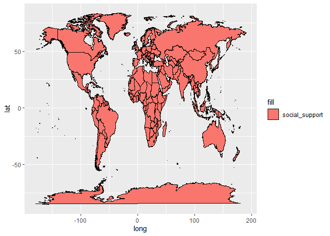

#installing package called maps 

```r
#install.packages("maps")
#install.packages("leaflet")
#install.packages("rgdal")
#install.packages("tmap")
```


```r
library(tidyverse)
```

```
## ── Attaching packages ─────────────────────────────────────── tidyverse 1.3.2 ──
## ✔ ggplot2 3.4.0      ✔ purrr   1.0.0 
## ✔ tibble  3.1.8      ✔ dplyr   1.0.10
## ✔ tidyr   1.2.1      ✔ stringr 1.5.0 
## ✔ readr   2.1.3      ✔ forcats 0.5.2 
## ── Conflicts ────────────────────────────────────────── tidyverse_conflicts() ──
## ✖ dplyr::filter() masks stats::filter()
## ✖ dplyr::lag()    masks stats::lag()
```

```r
library(naniar)
library(janitor)
```

```
## 
## Attaching package: 'janitor'
## 
## The following objects are masked from 'package:stats':
## 
##     chisq.test, fisher.test
```

```r
library(here)
```

```
## here() starts at C:/Users/merma/OneDrive/Desktop/happy
```

```r
library(shiny)
library(shinydashboard)
```

```
## 
## Attaching package: 'shinydashboard'
## 
## The following object is masked from 'package:graphics':
## 
##     box
```

```r
library(ggplot2)
library(maps)
```

```
## 
## Attaching package: 'maps'
## 
## The following object is masked from 'package:purrr':
## 
##     map
```

```r
library(leaflet)
library(magrittr)
```

```
## 
## Attaching package: 'magrittr'
## 
## The following object is masked from 'package:purrr':
## 
##     set_names
## 
## The following object is masked from 'package:tidyr':
## 
##     extract
```

```r
library(rvest)
```

```
## 
## Attaching package: 'rvest'
## 
## The following object is masked from 'package:readr':
## 
##     guess_encoding
```

```r
library(rgdal)
```

```
## Loading required package: sp
## Please note that rgdal will be retired during 2023,
## plan transition to sf/stars/terra functions using GDAL and PROJ
## at your earliest convenience.
## See https://r-spatial.org/r/2022/04/12/evolution.html and https://github.com/r-spatial/evolution
## rgdal: version: 1.6-5, (SVN revision 1199)
## Geospatial Data Abstraction Library extensions to R successfully loaded
## Loaded GDAL runtime: GDAL 3.5.2, released 2022/09/02
## Path to GDAL shared files: C:/Users/merma/AppData/Local/R/win-library/4.2/rgdal/gdal
## GDAL binary built with GEOS: TRUE 
## Loaded PROJ runtime: Rel. 8.2.1, January 1st, 2022, [PJ_VERSION: 821]
## Path to PROJ shared files: C:/Users/merma/AppData/Local/R/win-library/4.2/rgdal/proj
## PROJ CDN enabled: FALSE
## Linking to sp version:1.6-0
## To mute warnings of possible GDAL/OSR exportToProj4() degradation,
## use options("rgdal_show_exportToProj4_warnings"="none") before loading sp or rgdal.
```

```r
library(rworldmap)
```

```
## ### Welcome to rworldmap ###
## For a short introduction type : 	 vignette('rworldmap')
```

```r
library(tmap)
```

```r
getwd()
```

```
## [1] "C:/Users/merma/OneDrive/Desktop/happy/happiness_finder/happy_project/Kyra"
```

##loading in 2020 and 2021 data


```r
happy_2020 <- read_csv("/Users/merma/OneDrive/Desktop/happy/happiness_finder/happy_project/happiness_data/2020.csv") %>% clean_names()
```

```
## Rows: 153 Columns: 20
## ── Column specification ────────────────────────────────────────────────────────
## Delimiter: ","
## chr  (2): Country name, Regional indicator
## dbl (18): Ladder score, Standard error of ladder score, upperwhisker, lowerw...
## 
## ℹ Use `spec()` to retrieve the full column specification for this data.
## ℹ Specify the column types or set `show_col_types = FALSE` to quiet this message.
```


```r
happy_2021 <- read_csv("/Users/merma/OneDrive/Desktop/happy/happiness_finder/happy_project/happiness_data/2021.csv") %>% clean_names()
```

```
## Rows: 149 Columns: 20
## ── Column specification ────────────────────────────────────────────────────────
## Delimiter: ","
## chr  (2): Country name, Regional indicator
## dbl (18): Ladder score, Standard error of ladder score, upperwhisker, lowerw...
## 
## ℹ Use `spec()` to retrieve the full column specification for this data.
## ℹ Specify the column types or set `show_col_types = FALSE` to quiet this message.
```

```r
names(happy_2020)
```

```
##  [1] "country_name"                             
##  [2] "regional_indicator"                       
##  [3] "ladder_score"                             
##  [4] "standard_error_of_ladder_score"           
##  [5] "upperwhisker"                             
##  [6] "lowerwhisker"                             
##  [7] "logged_gdp_per_capita"                    
##  [8] "social_support"                           
##  [9] "healthy_life_expectancy"                  
## [10] "freedom_to_make_life_choices"             
## [11] "generosity"                               
## [12] "perceptions_of_corruption"                
## [13] "ladder_score_in_dystopia"                 
## [14] "explained_by_log_gdp_per_capita"          
## [15] "explained_by_social_support"              
## [16] "explained_by_healthy_life_expectancy"     
## [17] "explained_by_freedom_to_make_life_choices"
## [18] "explained_by_generosity"                  
## [19] "explained_by_perceptions_of_corruption"   
## [20] "dystopia_residual"
```

## adding year to data frames

```r
happy_2020$year <- "2020"
happy_2021$year <- "2021"
```

## getting coordinates for each country, renaming country as region to do so as well


```r
happy_2020<-happy_2020 %>% 
  rename(region = "country_name")
```


```r
happy_2021<-happy_2021 %>% 
  rename(region = "country_name")
```

```r
names(happy_2020)
```

```
##  [1] "region"                                   
##  [2] "regional_indicator"                       
##  [3] "ladder_score"                             
##  [4] "standard_error_of_ladder_score"           
##  [5] "upperwhisker"                             
##  [6] "lowerwhisker"                             
##  [7] "logged_gdp_per_capita"                    
##  [8] "social_support"                           
##  [9] "healthy_life_expectancy"                  
## [10] "freedom_to_make_life_choices"             
## [11] "generosity"                               
## [12] "perceptions_of_corruption"                
## [13] "ladder_score_in_dystopia"                 
## [14] "explained_by_log_gdp_per_capita"          
## [15] "explained_by_social_support"              
## [16] "explained_by_healthy_life_expectancy"     
## [17] "explained_by_freedom_to_make_life_choices"
## [18] "explained_by_generosity"                  
## [19] "explained_by_perceptions_of_corruption"   
## [20] "dystopia_residual"                        
## [21] "year"
```

```r
names(happy_2021)
```

```
##  [1] "region"                                   
##  [2] "regional_indicator"                       
##  [3] "ladder_score"                             
##  [4] "standard_error_of_ladder_score"           
##  [5] "upperwhisker"                             
##  [6] "lowerwhisker"                             
##  [7] "logged_gdp_per_capita"                    
##  [8] "social_support"                           
##  [9] "healthy_life_expectancy"                  
## [10] "freedom_to_make_life_choices"             
## [11] "generosity"                               
## [12] "perceptions_of_corruption"                
## [13] "ladder_score_in_dystopia"                 
## [14] "explained_by_log_gdp_per_capita"          
## [15] "explained_by_social_support"              
## [16] "explained_by_healthy_life_expectancy"     
## [17] "explained_by_freedom_to_make_life_choices"
## [18] "explained_by_generosity"                  
## [19] "explained_by_perceptions_of_corruption"   
## [20] "dystopia_residual"                        
## [21] "year"
```


```r
mapdata<-map_data("world")
view(mapdata)
```


```r
mapdata2020 <-map_data("world")
```


```r
mapdata2020<-left_join(mapdata2020,happy_2020, by="region")
```


```r
mapdata2021<-map_data("world")
view(mapdata2021)
```


```r
mapdata2021 <-left_join(mapdata2021, happy_2021, by="region")
View(mapdata2021)
```

```r
glimpse(mapdata2020)
```

```
## Rows: 99,338
## Columns: 26
## $ long                                      <dbl> -69.89912, -69.89571, -69.94…
## $ lat                                       <dbl> 12.45200, 12.42300, 12.43853…
## $ group                                     <dbl> 1, 1, 1, 1, 1, 1, 1, 1, 1, 1…
## $ order                                     <int> 1, 2, 3, 4, 5, 6, 7, 8, 9, 1…
## $ region                                    <chr> "Aruba", "Aruba", "Aruba", "…
## $ subregion                                 <chr> NA, NA, NA, NA, NA, NA, NA, …
## $ regional_indicator                        <chr> NA, NA, NA, NA, NA, NA, NA, …
## $ ladder_score                              <dbl> NA, NA, NA, NA, NA, NA, NA, …
## $ standard_error_of_ladder_score            <dbl> NA, NA, NA, NA, NA, NA, NA, …
## $ upperwhisker                              <dbl> NA, NA, NA, NA, NA, NA, NA, …
## $ lowerwhisker                              <dbl> NA, NA, NA, NA, NA, NA, NA, …
## $ logged_gdp_per_capita                     <dbl> NA, NA, NA, NA, NA, NA, NA, …
## $ social_support                            <dbl> NA, NA, NA, NA, NA, NA, NA, …
## $ healthy_life_expectancy                   <dbl> NA, NA, NA, NA, NA, NA, NA, …
## $ freedom_to_make_life_choices              <dbl> NA, NA, NA, NA, NA, NA, NA, …
## $ generosity                                <dbl> NA, NA, NA, NA, NA, NA, NA, …
## $ perceptions_of_corruption                 <dbl> NA, NA, NA, NA, NA, NA, NA, …
## $ ladder_score_in_dystopia                  <dbl> NA, NA, NA, NA, NA, NA, NA, …
## $ explained_by_log_gdp_per_capita           <dbl> NA, NA, NA, NA, NA, NA, NA, …
## $ explained_by_social_support               <dbl> NA, NA, NA, NA, NA, NA, NA, …
## $ explained_by_healthy_life_expectancy      <dbl> NA, NA, NA, NA, NA, NA, NA, …
## $ explained_by_freedom_to_make_life_choices <dbl> NA, NA, NA, NA, NA, NA, NA, …
## $ explained_by_generosity                   <dbl> NA, NA, NA, NA, NA, NA, NA, …
## $ explained_by_perceptions_of_corruption    <dbl> NA, NA, NA, NA, NA, NA, NA, …
## $ dystopia_residual                         <dbl> NA, NA, NA, NA, NA, NA, NA, …
## $ year                                      <chr> NA, NA, NA, NA, NA, NA, NA, …
```


## making maps for selected variables


```r
summary(mapdata2020$ladder_score)
```

```
##    Min. 1st Qu.  Median    Mean 3rd Qu.    Max.    NA's 
##   2.567   5.124   5.747   5.854   7.094   7.809   22475
```

```r
mapdata2020 <-mapdata2020 %>% 
  mutate(range_ladder_score= case_when(ladder_score < 2.567 ~ "very small",
                                       ladder_score >= 2.567 & ladder_score <=5.747 ~ "small",
                                       ladder_score >= 5.747 & ladder_score <7.809 ~"medium",
                                       ladder_score >= 7.809 ~ "large"))
```


```r
map_socialsupport<-ggplot(mapdata2020, aes(x = long, y= lat, group= group,))+
  geom_polygon(aes(fill="social_support"), color= "black")
map_socialsupport
```

<!-- -->


```r
map_ladderscore<-ggplot(mapdata2020, aes(x=long, lat, group=group))+
  geom_polygon(aes(fill="ladder_score"), color="black")
map_ladderscore
```

<!-- -->

