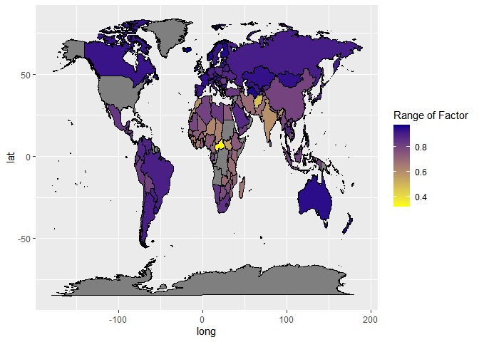
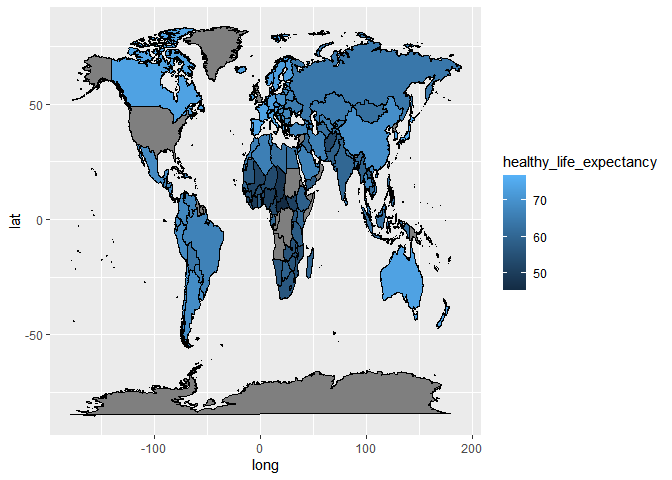
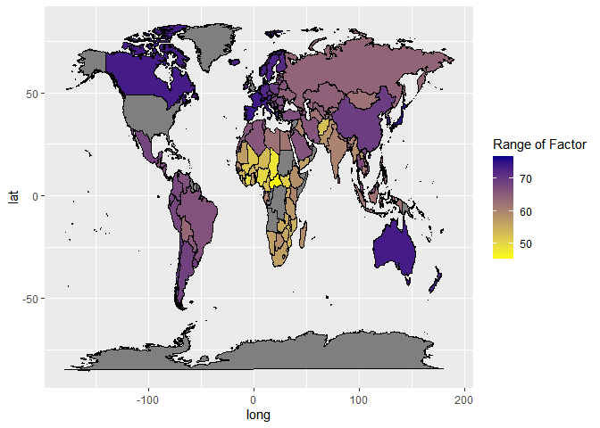

#installing package called maps 

```r
#install.packages("maps", repos = "http://cran.us.r-project.org")
#install.packages("leaflet", repos = "http://cran.us.r-project.org")
#install.packages("rgdal", repos = "http://cran.us.r-project.org")
#install.packages("raster")
#install.packages("tmap", repos = "http://cran.us.r-project.org")
#install.packages("mapproj", repos = "http://cran.us.r-project.org")
#install.packages("countrycode")
```


```r
library(tidyverse)
```

```
## ── Attaching packages ─────────────────────────────────────── tidyverse 1.3.2 ──
## ✔ ggplot2 3.4.0      ✔ purrr   1.0.0 
## ✔ tibble  3.1.8      ✔ dplyr   1.0.10
## ✔ tidyr   1.2.1      ✔ stringr 1.5.0 
## ✔ readr   2.1.3      ✔ forcats 0.5.2 
## ── Conflicts ────────────────────────────────────────── tidyverse_conflicts() ──
## ✖ dplyr::filter() masks stats::filter()
## ✖ dplyr::lag()    masks stats::lag()
```

```r
library(naniar)
library(janitor)
```

```
## 
## Attaching package: 'janitor'
## 
## The following objects are masked from 'package:stats':
## 
##     chisq.test, fisher.test
```

```r
library(here)
```

```
## here() starts at C:/Users/merma/OneDrive/Desktop/happy
```

```r
library(shiny)
library(shinydashboard)
```

```
## 
## Attaching package: 'shinydashboard'
## 
## The following object is masked from 'package:graphics':
## 
##     box
```

```r
library(ggplot2)
library(maps)
```

```
## 
## Attaching package: 'maps'
## 
## The following object is masked from 'package:purrr':
## 
##     map
```

```r
library(leaflet)
library(magrittr)
```

```
## 
## Attaching package: 'magrittr'
## 
## The following object is masked from 'package:purrr':
## 
##     set_names
## 
## The following object is masked from 'package:tidyr':
## 
##     extract
```

```r
library(rvest)
```

```
## 
## Attaching package: 'rvest'
## 
## The following object is masked from 'package:readr':
## 
##     guess_encoding
```

```r
library(rgdal)
```

```
## Loading required package: sp
## Please note that rgdal will be retired during 2023,
## plan transition to sf/stars/terra functions using GDAL and PROJ
## at your earliest convenience.
## See https://r-spatial.org/r/2022/04/12/evolution.html and https://github.com/r-spatial/evolution
## rgdal: version: 1.6-5, (SVN revision 1199)
## Geospatial Data Abstraction Library extensions to R successfully loaded
## Loaded GDAL runtime: GDAL 3.5.2, released 2022/09/02
## Path to GDAL shared files: C:/Users/merma/AppData/Local/R/win-library/4.2/rgdal/gdal
## GDAL binary built with GEOS: TRUE 
## Loaded PROJ runtime: Rel. 8.2.1, January 1st, 2022, [PJ_VERSION: 821]
## Path to PROJ shared files: C:/Users/merma/AppData/Local/R/win-library/4.2/rgdal/proj
## PROJ CDN enabled: FALSE
## Linking to sp version:1.6-0
## To mute warnings of possible GDAL/OSR exportToProj4() degradation,
## use options("rgdal_show_exportToProj4_warnings"="none") before loading sp or rgdal.
```

```r
library(rworldmap)
```

```
## ### Welcome to rworldmap ###
## For a short introduction type : 	 vignette('rworldmap')
```

```r
#library(tmap)
library(sf)
```

```
## Linking to GEOS 3.9.3, GDAL 3.5.2, PROJ 8.2.1; sf_use_s2() is TRUE
```

```r
library(mapproj)
```

```r
getwd()
```

```
## [1] "C:/Users/merma/OneDrive/Desktop/happy/happiness_finder/happy_project/Kyra"
```

##loading in 2020 and 2021 data


```r
happy_2020 <- read_csv("../happiness_data/2020.csv") %>% clean_names()
```

```
## Rows: 153 Columns: 20
## ── Column specification ────────────────────────────────────────────────────────
## Delimiter: ","
## chr  (2): Country name, Regional indicator
## dbl (18): Ladder score, Standard error of ladder score, upperwhisker, lowerw...
## 
## ℹ Use `spec()` to retrieve the full column specification for this data.
## ℹ Specify the column types or set `show_col_types = FALSE` to quiet this message.
```

```r
happy_2021 <- read_csv("../happiness_data/2021.csv") %>% clean_names()
```

```
## Rows: 149 Columns: 20
## ── Column specification ────────────────────────────────────────────────────────
## Delimiter: ","
## chr  (2): Country name, Regional indicator
## dbl (18): Ladder score, Standard error of ladder score, upperwhisker, lowerw...
## 
## ℹ Use `spec()` to retrieve the full column specification for this data.
## ℹ Specify the column types or set `show_col_types = FALSE` to quiet this message.
```


```r
names(happy_2020)
```

```
##  [1] "country_name"                             
##  [2] "regional_indicator"                       
##  [3] "ladder_score"                             
##  [4] "standard_error_of_ladder_score"           
##  [5] "upperwhisker"                             
##  [6] "lowerwhisker"                             
##  [7] "logged_gdp_per_capita"                    
##  [8] "social_support"                           
##  [9] "healthy_life_expectancy"                  
## [10] "freedom_to_make_life_choices"             
## [11] "generosity"                               
## [12] "perceptions_of_corruption"                
## [13] "ladder_score_in_dystopia"                 
## [14] "explained_by_log_gdp_per_capita"          
## [15] "explained_by_social_support"              
## [16] "explained_by_healthy_life_expectancy"     
## [17] "explained_by_freedom_to_make_life_choices"
## [18] "explained_by_generosity"                  
## [19] "explained_by_perceptions_of_corruption"   
## [20] "dystopia_residual"
```

## adding year to data frames

```r
happy_2020$year <- "2020"
happy_2021$year <- "2021"
```

## getting coordinates for each country, renaming country as region to do so as well


```r
happy_2020<-happy_2020 %>% 
  rename(region = "country_name")
```


```r
happy_2021<-happy_2021 %>% 
  rename(region = "country_name")
```

```r
names(happy_2020)
```

```
##  [1] "region"                                   
##  [2] "regional_indicator"                       
##  [3] "ladder_score"                             
##  [4] "standard_error_of_ladder_score"           
##  [5] "upperwhisker"                             
##  [6] "lowerwhisker"                             
##  [7] "logged_gdp_per_capita"                    
##  [8] "social_support"                           
##  [9] "healthy_life_expectancy"                  
## [10] "freedom_to_make_life_choices"             
## [11] "generosity"                               
## [12] "perceptions_of_corruption"                
## [13] "ladder_score_in_dystopia"                 
## [14] "explained_by_log_gdp_per_capita"          
## [15] "explained_by_social_support"              
## [16] "explained_by_healthy_life_expectancy"     
## [17] "explained_by_freedom_to_make_life_choices"
## [18] "explained_by_generosity"                  
## [19] "explained_by_perceptions_of_corruption"   
## [20] "dystopia_residual"                        
## [21] "year"
```

```r
names(happy_2021)
```

```
##  [1] "region"                                   
##  [2] "regional_indicator"                       
##  [3] "ladder_score"                             
##  [4] "standard_error_of_ladder_score"           
##  [5] "upperwhisker"                             
##  [6] "lowerwhisker"                             
##  [7] "logged_gdp_per_capita"                    
##  [8] "social_support"                           
##  [9] "healthy_life_expectancy"                  
## [10] "freedom_to_make_life_choices"             
## [11] "generosity"                               
## [12] "perceptions_of_corruption"                
## [13] "ladder_score_in_dystopia"                 
## [14] "explained_by_log_gdp_per_capita"          
## [15] "explained_by_social_support"              
## [16] "explained_by_healthy_life_expectancy"     
## [17] "explained_by_freedom_to_make_life_choices"
## [18] "explained_by_generosity"                  
## [19] "explained_by_perceptions_of_corruption"   
## [20] "dystopia_residual"                        
## [21] "year"
```


```r
mapdata<-map_data("world")
```


```r
mapdata2020 <-map_data("world")
```


```r
mapdata2020<-left_join(mapdata2020,happy_2020, by="region")
```


```r
mapdata2021<-map_data("world")
view(mapdata2021)
```


```r
mapdata2021 <-left_join(mapdata2021, happy_2021, by="region")
View(mapdata2021)
```

```r
glimpse(mapdata2020)
```

```
## Rows: 99,338
## Columns: 26
## $ long                                      <dbl> -69.89912, -69.89571, -69.94…
## $ lat                                       <dbl> 12.45200, 12.42300, 12.43853…
## $ group                                     <dbl> 1, 1, 1, 1, 1, 1, 1, 1, 1, 1…
## $ order                                     <int> 1, 2, 3, 4, 5, 6, 7, 8, 9, 1…
## $ region                                    <chr> "Aruba", "Aruba", "Aruba", "…
## $ subregion                                 <chr> NA, NA, NA, NA, NA, NA, NA, …
## $ regional_indicator                        <chr> NA, NA, NA, NA, NA, NA, NA, …
## $ ladder_score                              <dbl> NA, NA, NA, NA, NA, NA, NA, …
## $ standard_error_of_ladder_score            <dbl> NA, NA, NA, NA, NA, NA, NA, …
## $ upperwhisker                              <dbl> NA, NA, NA, NA, NA, NA, NA, …
## $ lowerwhisker                              <dbl> NA, NA, NA, NA, NA, NA, NA, …
## $ logged_gdp_per_capita                     <dbl> NA, NA, NA, NA, NA, NA, NA, …
## $ social_support                            <dbl> NA, NA, NA, NA, NA, NA, NA, …
## $ healthy_life_expectancy                   <dbl> NA, NA, NA, NA, NA, NA, NA, …
## $ freedom_to_make_life_choices              <dbl> NA, NA, NA, NA, NA, NA, NA, …
## $ generosity                                <dbl> NA, NA, NA, NA, NA, NA, NA, …
## $ perceptions_of_corruption                 <dbl> NA, NA, NA, NA, NA, NA, NA, …
## $ ladder_score_in_dystopia                  <dbl> NA, NA, NA, NA, NA, NA, NA, …
## $ explained_by_log_gdp_per_capita           <dbl> NA, NA, NA, NA, NA, NA, NA, …
## $ explained_by_social_support               <dbl> NA, NA, NA, NA, NA, NA, NA, …
## $ explained_by_healthy_life_expectancy      <dbl> NA, NA, NA, NA, NA, NA, NA, …
## $ explained_by_freedom_to_make_life_choices <dbl> NA, NA, NA, NA, NA, NA, NA, …
## $ explained_by_generosity                   <dbl> NA, NA, NA, NA, NA, NA, NA, …
## $ explained_by_perceptions_of_corruption    <dbl> NA, NA, NA, NA, NA, NA, NA, …
## $ dystopia_residual                         <dbl> NA, NA, NA, NA, NA, NA, NA, …
## $ year                                      <chr> NA, NA, NA, NA, NA, NA, NA, …
```


## making maps for selected variables


```r
summary(mapdata2020$ladder_score)
```

```
##    Min. 1st Qu.  Median    Mean 3rd Qu.    Max.    NA's 
##   2.567   5.124   5.747   5.854   7.094   7.809   22475
```

```r
mapdata2020 <-mapdata2020 %>% 
  mutate(range_ladder_score= case_when(ladder_score < 2.567 ~ "very small",
                                       ladder_score >= 2.567 & ladder_score <=5.747 ~ "small",
                                       ladder_score >= 5.747 & ladder_score <7.809 ~"medium",
                                       ladder_score >= 7.809 ~ "large"))
```

```r
summary(mapdata2020$social_support)
```

```
##    Min. 1st Qu.  Median    Mean 3rd Qu.    Max.    NA's 
##   0.319   0.808   0.890   0.848   0.927   0.975   22475
```


```r
mapdata2020 %>% 
  relocate(social_support) %>% 
  filter(!is.na(social_support))
```

```
##      social_support      long       lat group order               region
## 1         0.4703670  74.89131  37.23164     2    12          Afghanistan
## 2         0.4703670  74.84023  37.22505     2    13          Afghanistan
## 3         0.4703670  74.76738  37.24917     2    14          Afghanistan
## 4         0.4703670  74.73896  37.28564     2    15          Afghanistan
## 5         0.4703670  74.72666  37.29072     2    16          Afghanistan
## 6         0.4703670  74.66895  37.26670     2    17          Afghanistan
## 7         0.4703670  74.55899  37.23662     2    18          Afghanistan
## 8         0.4703670  74.37217  37.15771     2    19          Afghanistan
## 9         0.4703670  74.37617  37.13735     2    20          Afghanistan
## 10        0.4703670  74.49796  37.05722     2    21          Afghanistan
## 11        0.4703670  74.52646  37.03066     2    22          Afghanistan
## 12        0.4703670  74.54140  37.02217     2    23          Afghanistan
## 13        0.4703670  74.43106  36.98369     2    24          Afghanistan
## 14        0.4703670  74.19473  36.89688     2    25          Afghanistan
## 15        0.4703670  74.03887  36.82573     2    26          Afghanistan
## 16        0.4703670  74.00185  36.82310     2    27          Afghanistan
## 17        0.4703670  73.90781  36.85293     2    28          Afghanistan
## 18        0.4703670  73.76914  36.88848     2    29          Afghanistan
## 19        0.4703670  73.73183  36.88779     2    30          Afghanistan
## 20        0.4703670  73.41113  36.88169     2    31          Afghanistan
## 21        0.4703670  73.11680  36.86856     2    32          Afghanistan
## 22        0.4703670  72.99374  36.85161     2    33          Afghanistan
## 23        0.4703670  72.76621  36.83501     2    34          Afghanistan
## 24        0.4703670  72.62286  36.82959     2    35          Afghanistan
## 25        0.4703670  72.53135  36.80200     2    36          Afghanistan
## 26        0.4703670  72.43115  36.76582     2    37          Afghanistan
## 27        0.4703670  72.32696  36.74239     2    38          Afghanistan
## 28        0.4703670  72.24980  36.73472     2    39          Afghanistan
## 29        0.4703670  72.15674  36.70088     2    40          Afghanistan
## 30        0.4703670  72.09560  36.63374     2    41          Afghanistan
## 31        0.4703670  71.92070  36.53418     2    42          Afghanistan
## 32        0.4703670  71.82227  36.48608     2    43          Afghanistan
## 33        0.4703670  71.77266  36.43184     2    44          Afghanistan
## 34        0.4703670  71.71641  36.42656     2    45          Afghanistan
## 35        0.4703670  71.62051  36.43647     2    46          Afghanistan
## 36        0.4703670  71.54590  36.37769     2    47          Afghanistan
## 37        0.4703670  71.46328  36.29326     2    48          Afghanistan
## 38        0.4703670  71.31260  36.17119     2    49          Afghanistan
## 39        0.4703670  71.23291  36.12178     2    50          Afghanistan
## 40        0.4703670  71.18506  36.04209     2    51          Afghanistan
## 41        0.4703670  71.22021  36.00068     2    52          Afghanistan
## 42        0.4703670  71.34287  35.93853     2    53          Afghanistan
## 43        0.4703670  71.39756  35.88018     2    54          Afghanistan
## 44        0.4703670  71.42754  35.83374     2    55          Afghanistan
## 45        0.4703670  71.48359  35.71460     2    56          Afghanistan
## 46        0.4703670  71.51904  35.59751     2    57          Afghanistan
## 47        0.4703670  71.57198  35.54683     2    58          Afghanistan
## 48        0.4703670  71.58740  35.46084     2    59          Afghanistan
## 49        0.4703670  71.60059  35.40791     2    60          Afghanistan
## 50        0.4703670  71.57198  35.37041     2    61          Afghanistan
## 51        0.4703670  71.54551  35.32851     2    62          Afghanistan
## 52        0.4703670  71.54551  35.28886     2    63          Afghanistan
## 53        0.4703670  71.57725  35.24800     2    64          Afghanistan
## 54        0.4703670  71.60527  35.21177     2    65          Afghanistan
## 55        0.4703670  71.62051  35.18301     2    66          Afghanistan
## 56        0.4703670  71.60166  35.15068     2    67          Afghanistan
## 57        0.4703670  71.54551  35.10141     2    68          Afghanistan
## 58        0.4703670  71.51709  35.05112     2    69          Afghanistan
## 59        0.4703670  71.45508  34.96694     2    70          Afghanistan
## 60        0.4703670  71.35811  34.90962     2    71          Afghanistan
## 61        0.4703670  71.29414  34.86773     2    72          Afghanistan
## 62        0.4703670  71.22578  34.77954     2    73          Afghanistan
## 63        0.4703670  71.11328  34.68159     2    74          Afghanistan
## 64        0.4703670  71.06563  34.59961     2    75          Afghanistan
## 65        0.4703670  71.01631  34.55464     2    76          Afghanistan
## 66        0.4703670  70.96562  34.53037     2    77          Afghanistan
## 67        0.4703670  70.97891  34.48628     2    78          Afghanistan
## 68        0.4703670  71.02295  34.43115     2    79          Afghanistan
## 69        0.4703670  71.09570  34.36943     2    80          Afghanistan
## 70        0.4703670  71.09238  34.27324     2    81          Afghanistan
## 71        0.4703670  71.08906  34.20406     2    82          Afghanistan
## 72        0.4703670  71.09131  34.12027     2    83          Afghanistan
## 73        0.4703670  71.05156  34.04971     2    84          Afghanistan
## 74        0.4703670  70.84844  33.98188     2    85          Afghanistan
## 75        0.4703670  70.65401  33.95229     2    86          Afghanistan
## 76        0.4703670  70.41573  33.95044     2    87          Afghanistan
## 77        0.4703670  70.32568  33.96113     2    88          Afghanistan
## 78        0.4703670  70.25361  33.97598     2    89          Afghanistan
## 79        0.4703670  69.99473  34.05181     2    90          Afghanistan
## 80        0.4703670  69.88965  34.00727     2    91          Afghanistan
## 81        0.4703670  69.86806  33.89766     2    92          Afghanistan
## 82        0.4703670  70.05664  33.71987     2    93          Afghanistan
## 83        0.4703670  70.13418  33.62075     2    94          Afghanistan
## 84        0.4703670  70.21973  33.45469     2    95          Afghanistan
## 85        0.4703670  70.28418  33.36904     2    96          Afghanistan
## 86        0.4703670  70.26113  33.28901     2    97          Afghanistan
## 87        0.4703670  70.09023  33.19810     2    98          Afghanistan
## 88        0.4703670  69.92012  33.11250     2    99          Afghanistan
## 89        0.4703670  69.70371  33.09473     2   100          Afghanistan
## 90        0.4703670  69.56777  33.06416     2   101          Afghanistan
## 91        0.4703670  69.50156  33.02007     2   102          Afghanistan
## 92        0.4703670  69.45312  32.83281     2   103          Afghanistan
## 93        0.4703670  69.40459  32.76426     2   104          Afghanistan
## 94        0.4703670  69.40537  32.68272     2   105          Afghanistan
## 95        0.4703670  69.35947  32.59033     2   106          Afghanistan
## 96        0.4703670  69.28994  32.53057     2   107          Afghanistan
## 97        0.4703670  69.24140  32.43354     2   108          Afghanistan
## 98        0.4703670  69.25654  32.24946     2   109          Afghanistan
## 99        0.4703670  69.27930  31.93682     2   110          Afghanistan
## 100       0.4703670  69.18691  31.83809     2   111          Afghanistan
## 101       0.4703670  69.08311  31.73848     2   112          Afghanistan
## 102       0.4703670  68.97343  31.66738     2   113          Afghanistan
## 103       0.4703670  68.86895  31.63423     2   114          Afghanistan
## 104       0.4703670  68.78233  31.64643     2   115          Afghanistan
## 105       0.4703670  68.71367  31.70806     2   116          Afghanistan
## 106       0.4703670  68.67324  31.75972     2   117          Afghanistan
## 107       0.4703670  68.59766  31.80298     2   118          Afghanistan
## 108       0.4703670  68.52071  31.79414     2   119          Afghanistan
## 109       0.4703670  68.44326  31.75449     2   120          Afghanistan
## 110       0.4703670  68.31982  31.76767     2   121          Afghanistan
## 111       0.4703670  68.21397  31.80737     2   122          Afghanistan
## 112       0.4703670  68.16103  31.80298     2   123          Afghanistan
## 113       0.4703670  68.13017  31.76328     2   124          Afghanistan
## 114       0.4703670  68.01719  31.67798     2   125          Afghanistan
## 115       0.4703670  67.73985  31.54819     2   126          Afghanistan
## 116       0.4703670  67.62675  31.53877     2   127          Afghanistan
## 117       0.4703670  67.57822  31.50649     2   128          Afghanistan
## 118       0.4703670  67.59756  31.45332     2   129          Afghanistan
## 119       0.4703670  67.64706  31.40996     2   130          Afghanistan
## 120       0.4703670  67.73350  31.37925     2   131          Afghanistan
## 121       0.4703670  67.73789  31.34395     2   132          Afghanistan
## 122       0.4703670  67.66152  31.31299     2   133          Afghanistan
## 123       0.4703670  67.59639  31.27769     2   134          Afghanistan
## 124       0.4703670  67.45283  31.23462     2   135          Afghanistan
## 125       0.4703670  67.28730  31.21782     2   136          Afghanistan
## 126       0.4703670  67.11592  31.24292     2   137          Afghanistan
## 127       0.4703670  67.02773  31.30024     2   138          Afghanistan
## 128       0.4703670  66.92432  31.30561     2   139          Afghanistan
## 129       0.4703670  66.82929  31.26367     2   140          Afghanistan
## 130       0.4703670  66.73135  31.19453     2   141          Afghanistan
## 131       0.4703670  66.62422  31.04604     2   142          Afghanistan
## 132       0.4703670  66.59580  31.01997     2   143          Afghanistan
## 133       0.4703670  66.56680  30.99658     2   144          Afghanistan
## 134       0.4703670  66.49736  30.96455     2   145          Afghanistan
## 135       0.4703670  66.39717  30.91221     2   146          Afghanistan
## 136       0.4703670  66.34687  30.80278     2   147          Afghanistan
## 137       0.4703670  66.28691  30.60791     2   148          Afghanistan
## 138       0.4703670  66.30097  30.50298     2   149          Afghanistan
## 139       0.4703670  66.30547  30.32114     2   150          Afghanistan
## 140       0.4703670  66.28184  30.19346     2   151          Afghanistan
## 141       0.4703670  66.23848  30.10962     2   152          Afghanistan
## 142       0.4703670  66.24717  30.04351     2   153          Afghanistan
## 143       0.4703670  66.31338  29.96856     2   154          Afghanistan
## 144       0.4703670  66.28691  29.92002     2   155          Afghanistan
## 145       0.4703670  66.23125  29.86572     2   156          Afghanistan
## 146       0.4703670  66.17706  29.83559     2   157          Afghanistan
## 147       0.4703670  65.96162  29.77891     2   158          Afghanistan
## 148       0.4703670  65.66621  29.70132     2   159          Afghanistan
## 149       0.4703670  65.47099  29.65156     2   160          Afghanistan
## 150       0.4703670  65.18047  29.57763     2   161          Afghanistan
## 151       0.4703670  65.09550  29.55947     2   162          Afghanistan
## 152       0.4703670  64.91895  29.55278     2   163          Afghanistan
## 153       0.4703670  64.82734  29.56416     2   164          Afghanistan
## 154       0.4703670  64.70351  29.56714     2   165          Afghanistan
## 155       0.4703670  64.52110  29.56450     2   166          Afghanistan
## 156       0.4703670  64.39375  29.54433     2   167          Afghanistan
## 157       0.4703670  64.26611  29.50693     2   168          Afghanistan
## 158       0.4703670  64.17216  29.46035     2   169          Afghanistan
## 159       0.4703670  64.11797  29.41426     2   170          Afghanistan
## 160       0.4703670  64.09873  29.39194     2   171          Afghanistan
## 161       0.4703670  63.97100  29.43008     2   172          Afghanistan
## 162       0.4703670  63.56758  29.49800     2   173          Afghanistan
## 163       0.4703670  62.47656  29.40835     2   174          Afghanistan
## 164       0.4703670  62.37344  29.42539     2   175          Afghanistan
## 165       0.4703670  62.00097  29.53042     2   176          Afghanistan
## 166       0.4703670  61.52148  29.66567     2   177          Afghanistan
## 167       0.4703670  61.22441  29.74941     2   178          Afghanistan
## 168       0.4703670  60.84336  29.85869     2   179          Afghanistan
## 169       0.4703670  61.10410  30.12842     2   180          Afghanistan
## 170       0.4703670  61.33164  30.36372     2   181          Afghanistan
## 171       0.4703670  61.55947  30.59936     2   182          Afghanistan
## 172       0.4703670  61.78418  30.83194     2   183          Afghanistan
## 173       0.4703670  61.81084  30.91328     2   184          Afghanistan
## 174       0.4703670  61.81426  31.07256     2   185          Afghanistan
## 175       0.4703670  61.75508  31.28530     2   186          Afghanistan
## 176       0.4703670  61.66015  31.38242     2   187          Afghanistan
## 177       0.4703670  61.34649  31.42163     2   188          Afghanistan
## 178       0.4703670  61.11074  31.45112     2   189          Afghanistan
## 179       0.4703670  60.85410  31.48325     2   190          Afghanistan
## 180       0.4703670  60.82071  31.49517     2   191          Afghanistan
## 181       0.4703670  60.79160  31.66060     2   192          Afghanistan
## 182       0.4703670  60.80430  31.73447     2   193          Afghanistan
## 183       0.4703670  60.78750  31.87720     2   194          Afghanistan
## 184       0.4703670  60.78994  31.98711     2   195          Afghanistan
## 185       0.4703670  60.82725  32.16797     2   196          Afghanistan
## 186       0.4703670  60.82930  32.24941     2   197          Afghanistan
## 187       0.4703670  60.71045  32.60000     2   198          Afghanistan
## 188       0.4703670  60.64453  32.79438     2   199          Afghanistan
## 189       0.4703670  60.57656  32.99487     2   200          Afghanistan
## 190       0.4703670  60.56192  33.05879     2   201          Afghanistan
## 191       0.4703670  60.56055  33.13784     2   202          Afghanistan
## 192       0.4703670  60.71807  33.32354     2   203          Afghanistan
## 193       0.4703670  60.76690  33.36382     2   204          Afghanistan
## 194       0.4703670  60.85928  33.45625     2   205          Afghanistan
## 195       0.4703670  60.91699  33.50522     2   206          Afghanistan
## 196       0.4703670  60.90693  33.53896     2   207          Afghanistan
## 197       0.4703670  60.80644  33.55869     2   208          Afghanistan
## 198       0.4703670  60.65459  33.56040     2   209          Afghanistan
## 199       0.4703670  60.57383  33.58833     2   210          Afghanistan
## 200       0.4703670  60.51084  33.63892     2   211          Afghanistan
## 201       0.4703670  60.48594  33.71191     2   212          Afghanistan
## 202       0.4703670  60.52705  33.84199     2   213          Afghanistan
## 203       0.4703670  60.48574  34.09478     2   214          Afghanistan
## 204       0.4703670  60.57021  34.21963     2   215          Afghanistan
## 205       0.4703670  60.64267  34.30717     2   216          Afghanistan
## 206       0.4703670  60.88946  34.31943     2   217          Afghanistan
## 207       0.4703670  60.80391  34.41802     2   218          Afghanistan
## 208       0.4703670  60.76260  34.47524     2   219          Afghanistan
## 209       0.4703670  60.73613  34.49179     2   220          Afghanistan
## 210       0.4703670  60.72627  34.51826     2   221          Afghanistan
## 211       0.4703670  60.73945  34.54473     2   222          Afghanistan
## 212       0.4703670  60.80235  34.55464     2   223          Afghanistan
## 213       0.4703670  60.84531  34.58770     2   224          Afghanistan
## 214       0.4703670  60.91475  34.63398     2   225          Afghanistan
## 215       0.4703670  60.95118  34.65385     2   226          Afghanistan
## 216       0.4703670  60.95781  34.71006     2   227          Afghanistan
## 217       0.4703670  60.99082  34.74976     2   228          Afghanistan
## 218       0.4703670  61.04043  34.79937     2   229          Afghanistan
## 219       0.4703670  61.08008  34.85562     2   230          Afghanistan
## 220       0.4703670  61.07022  34.92173     2   231          Afghanistan
## 221       0.4703670  61.10664  35.00112     2   232          Afghanistan
## 222       0.4703670  61.12315  35.05073     2   233          Afghanistan
## 223       0.4703670  61.14961  35.09375     2   234          Afghanistan
## 224       0.4703670  61.12646  35.15654     2   235          Afghanistan
## 225       0.4703670  61.10664  35.20947     2   236          Afghanistan
## 226       0.4703670  61.10000  35.27231     2   237          Afghanistan
## 227       0.4703670  61.13964  35.28886     2   238          Afghanistan
## 228       0.4703670  61.18926  35.31201     2   239          Afghanistan
## 229       0.4703670  61.19922  35.36162     2   240          Afghanistan
## 230       0.4703670  61.22569  35.42446     2   241          Afghanistan
## 231       0.4703670  61.24551  35.47407     2   242          Afghanistan
## 232       0.4703670  61.27852  35.51377     2   243          Afghanistan
## 233       0.4703670  61.28184  35.55342     2   244          Afghanistan
## 234       0.4703670  61.26201  35.61958     2   245          Afghanistan
## 235       0.4703670  61.34473  35.62949     2   246          Afghanistan
## 236       0.4703670  61.37773  35.59312     2   247          Afghanistan
## 237       0.4703670  61.42178  35.54580     2   248          Afghanistan
## 238       0.4703670  61.54277  35.45786     2   249          Afghanistan
## 239       0.4703670  61.62100  35.43232     2   250          Afghanistan
## 240       0.4703670  61.71973  35.41943     2   251          Afghanistan
## 241       0.4703670  61.84102  35.43149     2   252          Afghanistan
## 242       0.4703670  61.93809  35.44790     2   253          Afghanistan
## 243       0.4703670  61.98388  35.44370     2   254          Afghanistan
## 244       0.4703670  62.08965  35.37969     2   255          Afghanistan
## 245       0.4703670  62.21309  35.28994     2   256          Afghanistan
## 246       0.4703670  62.25283  35.25024     2   257          Afghanistan
## 247       0.4703670  62.27119  35.18911     2   258          Afghanistan
## 248       0.4703670  62.30781  35.17080     2   259          Afghanistan
## 249       0.4703670  62.38662  35.23125     2   260          Afghanistan
## 250       0.4703670  62.46289  35.25137     2   261          Afghanistan
## 251       0.4703670  62.53311  35.23989     2   262          Afghanistan
## 252       0.4703670  62.61055  35.23315     2   263          Afghanistan
## 253       0.4703670  62.68808  35.25532     2   264          Afghanistan
## 254       0.4703670  62.72266  35.27134     2   265          Afghanistan
## 255       0.4703670  62.85801  35.34966     2   266          Afghanistan
## 256       0.4703670  62.98027  35.40918     2   267          Afghanistan
## 257       0.4703670  63.05664  35.44580     2   268          Afghanistan
## 258       0.4703670  63.08418  35.56807     2   269          Afghanistan
## 259       0.4703670  63.11934  35.63755     2   270          Afghanistan
## 260       0.4703670  63.16973  35.67812     2   271          Afghanistan
## 261       0.4703670  63.15078  35.72827     2   272          Afghanistan
## 262       0.4703670  63.12998  35.76675     2   273          Afghanistan
## 263       0.4703670  63.10859  35.81870     2   274          Afghanistan
## 264       0.4703670  63.12998  35.84619     2   275          Afghanistan
## 265       0.4703670  63.17891  35.85845     2   276          Afghanistan
## 266       0.4703670  63.30166  35.85840     2   277          Afghanistan
## 267       0.4703670  63.51699  35.91314     2   278          Afghanistan
## 268       0.4703670  63.69658  35.96782     2   279          Afghanistan
## 269       0.4703670  63.86250  36.01235     2   280          Afghanistan
## 270       0.4703670  63.93808  36.01973     2   281          Afghanistan
## 271       0.4703670  64.00967  36.01211     2   282          Afghanistan
## 272       0.4703670  64.04238  36.02510     2   283          Afghanistan
## 273       0.4703670  64.05137  36.06763     2   284          Afghanistan
## 274       0.4703670  64.09219  36.11270     2   285          Afghanistan
## 275       0.4703670  64.18437  36.14893     2   286          Afghanistan
## 276       0.4703670  64.35801  36.22607     2   287          Afghanistan
## 277       0.4703670  64.51103  36.34068     2   288          Afghanistan
## 278       0.4703670  64.56582  36.42759     2   289          Afghanistan
## 279       0.4703670  64.60254  36.55454     2   290          Afghanistan
## 280       0.4703670  64.67432  36.75019     2   291          Afghanistan
## 281       0.4703670  64.75312  36.96479     2   292          Afghanistan
## 282       0.4703670  64.78242  37.05928     2   293          Afghanistan
## 283       0.4703670  64.81631  37.13208     2   294          Afghanistan
## 284       0.4703670  64.95156  37.19356     2   295          Afghanistan
## 285       0.4703670  65.08965  37.23794     2   296          Afghanistan
## 286       0.4703670  65.30362  37.24678     2   297          Afghanistan
## 287       0.4703670  65.55498  37.25117     2   298          Afghanistan
## 288       0.4703670  65.60801  37.36841     2   299          Afghanistan
## 289       0.4703670  65.64121  37.46782     2   300          Afghanistan
## 290       0.4703670  65.68301  37.51914     2   301          Afghanistan
## 291       0.4703670  65.74385  37.56084     2   302          Afghanistan
## 292       0.4703670  65.76504  37.56914     2   303          Afghanistan
## 293       0.4703670  65.90068  37.50811     2   304          Afghanistan
## 294       0.4703670  66.10840  37.41475     2   305          Afghanistan
## 295       0.4703670  66.35030  37.36816     2   306          Afghanistan
## 296       0.4703670  66.47187  37.34473     2   307          Afghanistan
## 297       0.4703670  66.52226  37.34848     2   308          Afghanistan
## 298       0.4703670  66.82773  37.37129     2   309          Afghanistan
## 299       0.4703670  67.06885  37.33482     2   310          Afghanistan
## 300       0.4703670  67.19551  37.23521     2   311          Afghanistan
## 301       0.4703670  67.31973  37.20957     2   312          Afghanistan
## 302       0.4703670  67.44170  37.25801     2   313          Afghanistan
## 303       0.4703670  67.51729  37.26665     2   314          Afghanistan
## 304       0.4703670  67.54649  37.23565     2   315          Afghanistan
## 305       0.4703670  67.60742  37.22251     2   316          Afghanistan
## 306       0.4703670  67.70000  37.22725     2   317          Afghanistan
## 307       0.4703670  67.75293  37.19981     2   318          Afghanistan
## 308       0.4703670  67.75899  37.17221     2   319          Afghanistan
## 309       0.4703670  67.76601  37.14014     2   320          Afghanistan
## 310       0.4703670  67.83447  37.06421     2   321          Afghanistan
## 311       0.4703670  67.95801  36.97202     2   322          Afghanistan
## 312       0.4703670  68.06777  36.94980     2   323          Afghanistan
## 313       0.4703670  68.21211  37.02153     2   324          Afghanistan
## 314       0.4703670  68.26094  37.01308     2   325          Afghanistan
## 315       0.4703670  68.28477  37.03633     2   326          Afghanistan
## 316       0.4703670  68.29951  37.08843     2   327          Afghanistan
## 317       0.4703670  68.38692  37.13750     2   328          Afghanistan
## 318       0.4703670  68.54649  37.18345     2   329          Afghanistan
## 319       0.4703670  68.63702  37.22446     2   330          Afghanistan
## 320       0.4703670  68.66914  37.25840     2   331          Afghanistan
## 321       0.4703670  68.72324  37.26802     2   332          Afghanistan
## 322       0.4703670  68.78204  37.25801     2   333          Afghanistan
## 323       0.4703670  68.82373  37.27070     2   334          Afghanistan
## 324       0.4703670  68.83848  37.30283     2   335          Afghanistan
## 325       0.4703670  68.85537  37.31684     2   336          Afghanistan
## 326       0.4703670  68.88525  37.32808     2   337          Afghanistan
## 327       0.4703670  68.91181  37.33394     2   338          Afghanistan
## 328       0.4703670  68.96045  37.32505     2   339          Afghanistan
## 329       0.4703670  69.05000  37.26650     2   340          Afghanistan
## 330       0.4703670  69.18018  37.15830     2   341          Afghanistan
## 331       0.4703670  69.26485  37.10840     2   342          Afghanistan
## 332       0.4703670  69.30391  37.11694     2   343          Afghanistan
## 333       0.4703670  69.35381  37.15005     2   344          Afghanistan
## 334       0.4703670  69.41445  37.20776     2   345          Afghanistan
## 335       0.4703670  69.42969  37.29087     2   346          Afghanistan
## 336       0.4703670  69.39922  37.39931     2   347          Afghanistan
## 337       0.4703670  69.42012  37.48672     2   348          Afghanistan
## 338       0.4703670  69.49210  37.55308     2   349          Afghanistan
## 339       0.4703670  69.62578  37.59404     2   350          Afghanistan
## 340       0.4703670  69.82090  37.60957     2   351          Afghanistan
## 341       0.4703670  69.94063  37.60029     2   352          Afghanistan
## 342       0.4703670  69.98496  37.56616     2   353          Afghanistan
## 343       0.4703670  70.04472  37.54722     2   354          Afghanistan
## 344       0.4703670  70.11982  37.54350     2   355          Afghanistan
## 345       0.4703670  70.18867  37.58247     2   356          Afghanistan
## 346       0.4703670  70.25146  37.66416     2   357          Afghanistan
## 347       0.4703670  70.25497  37.76538     2   358          Afghanistan
## 348       0.4703670  70.19942  37.88604     2   359          Afghanistan
## 349       0.4703670  70.21465  37.92441     2   360          Afghanistan
## 350       0.4703670  70.23877  37.94121     2   361          Afghanistan
## 351       0.4703670  70.31328  37.98481     2   362          Afghanistan
## 352       0.4703670  70.41778  38.07544     2   363          Afghanistan
## 353       0.4703670  70.51855  38.19199     2   364          Afghanistan
## 354       0.4703670  70.61582  38.33442     2   365          Afghanistan
## 355       0.4703670  70.73594  38.42256     2   366          Afghanistan
## 356       0.4703670  70.87891  38.45640     2   367          Afghanistan
## 357       0.4703670  71.05215  38.41787     2   368          Afghanistan
## 358       0.4703670  71.25586  38.30698     2   369          Afghanistan
## 359       0.4703670  71.33271  38.17026     2   370          Afghanistan
## 360       0.4703670  71.28281  38.00791     2   371          Afghanistan
## 361       0.4703670  71.27852  37.91841     2   372          Afghanistan
## 362       0.4703670  71.31992  37.90186     2   373          Afghanistan
## 363       0.4703670  71.38965  37.90630     2   374          Afghanistan
## 364       0.4703670  71.48779  37.93188     2   375          Afghanistan
## 365       0.4703670  71.55196  37.93315     2   376          Afghanistan
## 366       0.4703670  71.58223  37.91011     2   377          Afghanistan
## 367       0.4703670  71.58037  37.86426     2   378          Afghanistan
## 368       0.4703670  71.54619  37.79565     2   379          Afghanistan
## 369       0.4703670  71.50508  37.60293     2   380          Afghanistan
## 370       0.4703670  71.47968  37.43604     2   381          Afghanistan
## 371       0.4703670  71.45478  37.27183     2   382          Afghanistan
## 372       0.4703670  71.43291  37.12754     2   383          Afghanistan
## 373       0.4703670  71.47188  37.01509     2   384          Afghanistan
## 374       0.4703670  71.53085  36.84512     2   385          Afghanistan
## 375       0.4703670  71.59746  36.73291     2   386          Afghanistan
## 376       0.4703670  71.66563  36.69692     2   387          Afghanistan
## 377       0.4703670  71.73379  36.68403     2   388          Afghanistan
## 378       0.4703670  71.80205  36.69429     2   389          Afghanistan
## 379       0.4703670  71.94199  36.76645     2   390          Afghanistan
## 380       0.4703670  72.15352  36.90054     2   391          Afghanistan
## 381       0.4703670  72.35880  36.98291     2   392          Afghanistan
## 382       0.4703670  72.65742  37.02905     2   393          Afghanistan
## 383       0.4703670  72.75703  37.17271     2   394          Afghanistan
## 384       0.4703670  72.89551  37.26753     2   395          Afghanistan
## 385       0.4703670  73.21113  37.40850     2   396          Afghanistan
## 386       0.4703670  73.38291  37.46226     2   397          Afghanistan
## 387       0.4703670  73.48135  37.47168     2   398          Afghanistan
## 388       0.4703670  73.60468  37.44604     2   399          Afghanistan
## 389       0.4703670  73.63261  37.43721     2   400          Afghanistan
## 390       0.4703670  73.65713  37.43047     2   401          Afghanistan
## 391       0.4703670  73.72061  37.41875     2   402          Afghanistan
## 392       0.4703670  73.73379  37.37578     2   403          Afghanistan
## 393       0.4703670  73.71729  37.32944     2   404          Afghanistan
## 394       0.4703670  73.64883  37.29121     2   405          Afghanistan
## 395       0.4703670  73.62754  37.26157     2   406          Afghanistan
## 396       0.4703670  73.65352  37.23936     2   407          Afghanistan
## 397       0.4703670  73.74961  37.23179     2   408          Afghanistan
## 398       0.4703670  73.94882  37.28315     2   409          Afghanistan
## 399       0.4703670  74.07773  37.31621     2   410          Afghanistan
## 400       0.4703670  74.16709  37.32944     2   411          Afghanistan
## 401       0.4703670  74.20351  37.37246     2   412          Afghanistan
## 402       0.4703670  74.25967  37.41543     2   413          Afghanistan
## 403       0.4703670  74.34902  37.41875     2   414          Afghanistan
## 404       0.4703670  74.44492  37.39561     2   415          Afghanistan
## 405       0.4703670  74.52422  37.38237     2   416          Afghanistan
## 406       0.4703670  74.65938  37.39448     2   417          Afghanistan
## 407       0.4703670  74.73057  37.35703     2   418          Afghanistan
## 408       0.4703670  74.83047  37.28594     2   419          Afghanistan
## 409       0.4703670  74.87539  37.24199     2   420          Afghanistan
## 410       0.4703670  74.89131  37.23164     2   421          Afghanistan
## 411       0.6710705  20.06396  42.54727     6   770              Albania
## 412       0.6710705  20.10352  42.52466     6   771              Albania
## 413       0.6710705  20.18574  42.42588     6   772              Albania
## 414       0.6710705  20.24053  42.33897     6   773              Albania
## 415       0.6710705  20.34824  42.30879     6   774              Albania
## 416       0.6710705  20.40830  42.27495     6   775              Albania
## 417       0.6710705  20.48545  42.22339     6   776              Albania
## 418       0.6710705  20.52285  42.17148     6   777              Albania
## 419       0.6710705  20.57539  42.01308     6   778              Albania
## 420       0.6710705  20.58145  41.91743     6   779              Albania
## 421       0.6710705  20.56621  41.87368     6   780              Albania
## 422       0.6710705  20.55313  41.86235     6   781              Albania
## 423       0.6710705  20.50517  41.70649     6   782              Albania
## 424       0.6710705  20.51660  41.62705     6   783              Albania
## 425       0.6710705  20.51621  41.57476     6   784              Albania
## 426       0.6710705  20.47559  41.55410     6   785              Albania
## 427       0.6710705  20.44863  41.52129     6   786              Albania
## 428       0.6710705  20.49238  41.39141     6   787              Albania
## 429       0.6710705  20.48701  41.33608     6   788              Albania
## 430       0.6710705  20.48897  41.27261     6   789              Albania
## 431       0.6710705  20.56787  41.12783     6   790              Albania
## 432       0.6710705  20.61445  41.08306     6   791              Albania
## 433       0.6710705  20.65605  41.06167     6   792              Albania
## 434       0.6710705  20.70928  40.92837     6   793              Albania
## 435       0.6710705  20.74082  40.90527     6   794              Albania
## 436       0.6710705  20.87021  40.91792     6   795              Albania
## 437       0.6710705  20.93350  40.90313     6   796              Albania
## 438       0.6710705  20.95859  40.87154     6   797              Albania
## 439       0.6710705  20.96426  40.84990     6   798              Albania
## 440       0.6710705  20.95576  40.77530     6   799              Albania
## 441       0.6710705  20.98789  40.71777     6   800              Albania
## 442       0.6710705  21.03105  40.65864     6   801              Albania
## 443       0.6710705  21.03086  40.62246     6   802              Albania
## 444       0.6710705  21.00195  40.56338     6   803              Albania
## 445       0.6710705  20.95020  40.49438     6   804              Albania
## 446       0.6710705  20.88164  40.46792     6   805              Albania
## 447       0.6710705  20.80605  40.44546     6   806              Albania
## 448       0.6710705  20.77002  40.39190     6   807              Albania
## 449       0.6710705  20.75166  40.33492     6   808              Albania
## 450       0.6710705  20.71787  40.29268     6   809              Albania
## 451       0.6710705  20.69697  40.24639     6   810              Albania
## 452       0.6710705  20.66494  40.15176     6   811              Albania
## 453       0.6710705  20.65742  40.11738     6   812              Albania
## 454       0.6710705  20.60625  40.08266     6   813              Albania
## 455       0.6710705  20.52705  40.06850     6   814              Albania
## 456       0.6710705  20.45605  40.06557     6   815              Albania
## 457       0.6710705  20.40801  40.04946     6   816              Albania
## 458       0.6710705  20.38369  40.01719     6   817              Albania
## 459       0.6710705  20.33848  39.99107     6   818              Albania
## 460       0.6710705  20.31113  39.97944     6   819              Albania
## 461       0.6710705  20.31133  39.95078     6   820              Albania
## 462       0.6710705  20.34424  39.89062     6   821              Albania
## 463       0.6710705  20.38164  39.84180     6   822              Albania
## 464       0.6710705  20.38242  39.80264     6   823              Albania
## 465       0.6710705  20.36406  39.79175     6   824              Albania
## 466       0.6710705  20.30615  39.79668     6   825              Albania
## 467       0.6710705  20.29385  39.78223     6   826              Albania
## 468       0.6710705  20.28760  39.73857     6   827              Albania
## 469       0.6710705  20.27207  39.70117     6   828              Albania
## 470       0.6710705  20.24824  39.67837     6   829              Albania
## 471       0.6710705  20.20684  39.65352     6   830              Albania
## 472       0.6710705  20.13106  39.66162     6   831              Albania
## 473       0.6710705  20.05976  39.69912     6   832              Albania
## 474       0.6710705  20.02256  39.71069     6   833              Albania
## 475       0.6710705  20.00127  39.70943     6   834              Albania
## 476       0.6710705  19.99561  39.80103     6   835              Albania
## 477       0.6710705  19.96484  39.87227     6   836              Albania
## 478       0.6710705  19.85186  40.04356     6   837              Albania
## 479       0.6710705  19.48457  40.20996     6   838              Albania
## 480       0.6710705  19.39814  40.28486     6   839              Albania
## 481       0.6710705  19.36016  40.34771     6   840              Albania
## 482       0.6710705  19.32227  40.40708     6   841              Albania
## 483       0.6710705  19.35859  40.40874     6   842              Albania
## 484       0.6710705  19.39453  40.39370     6   843              Albania
## 485       0.6710705  19.44053  40.37568     6   844              Albania
## 486       0.6710705  19.45918  40.40537     6   845              Albania
## 487       0.6710705  19.43926  40.47026     6   846              Albania
## 488       0.6710705  19.34463  40.62207     6   847              Albania
## 489       0.6710705  19.33750  40.66382     6   848              Albania
## 490       0.6710705  19.38389  40.79072     6   849              Albania
## 491       0.6710705  19.46123  40.93330     6   850              Albania
## 492       0.6710705  19.45605  41.10606     6   851              Albania
## 493       0.6710705  19.48008  41.23637     6   852              Albania
## 494       0.6710705  19.45342  41.32100     6   853              Albania
## 495       0.6710705  19.44062  41.42476     6   854              Albania
## 496       0.6710705  19.49736  41.56269     6   855              Albania
## 497       0.6710705  19.54580  41.59682     6   856              Albania
## 498       0.6710705  19.57568  41.64043     6   857              Albania
## 499       0.6710705  19.57754  41.78750     6   858              Albania
## 500       0.6710705  19.46826  41.85616     6   859              Albania
## 501       0.6710705  19.34238  41.86909     6   860              Albania
## 502       0.6710705  19.34551  41.91885     6   861              Albania
## 503       0.6710705  19.36113  41.99775     6   862              Albania
## 504       0.6710705  19.35215  42.02402     6   863              Albania
## 505       0.6710705  19.36143  42.06909     6   864              Albania
## 506       0.6710705  19.33086  42.12930     6   865              Albania
## 507       0.6710705  19.28066  42.17256     6   866              Albania
## 508       0.6710705  19.32900  42.24927     6   867              Albania
## 509       0.6710705  19.39961  42.34189     6   868              Albania
## 510       0.6710705  19.46514  42.41538     6   869              Albania
## 511       0.6710705  19.54453  42.49194     6   870              Albania
## 512       0.6710705  19.59746  42.56543     6   871              Albania
## 513       0.6710705  19.65449  42.62857     6   872              Albania
## 514       0.6710705  19.70342  42.64795     6   873              Albania
## 515       0.6710705  19.72783  42.63452     6   874              Albania
## 516       0.6710705  19.74072  42.60693     6   875              Albania
## 517       0.6710705  19.73779  42.52515     6   876              Albania
## 518       0.6710705  19.75449  42.49693     6   877              Albania
## 519       0.6710705  19.78828  42.47617     6   878              Albania
## 520       0.6710705  19.85977  42.48633     6   879              Albania
## 521       0.6710705  19.93906  42.50669     6   880              Albania
## 522       0.6710705  20.04570  42.54990     6   881              Albania
## 523       0.6710705  20.06396  42.54727     6   882              Albania
## 524       0.9543297  20.61133  60.04068     7   884              Finland
## 525       0.9543297  20.60342  60.01694     7   885              Finland
## 526       0.9543297  20.52178  60.01167     7   886              Finland
## 527       0.9543297  20.48750  60.03276     7   887              Finland
## 528       0.9543297  20.41123  60.03013     7   888              Finland
## 529       0.9543297  20.39795  60.04068     7   889              Finland
## 530       0.9543297  20.42959  60.06172     7   890              Finland
## 531       0.9543297  20.49014  60.07490     7   891              Finland
## 532       0.9543297  20.56914  60.06963     7   892              Finland
## 533       0.9543297  20.61133  60.04068     7   893              Finland
## 534       0.9543297  19.66230  60.18716     8   895              Finland
## 535       0.9543297  19.66748  60.16475     8   896              Finland
## 536       0.9543297  19.62920  60.17036     8   897              Finland
## 537       0.9543297  19.59981  60.16270     8   898              Finland
## 538       0.9543297  19.57988  60.13506     8   899              Finland
## 539       0.9543297  19.53652  60.14497     8   900              Finland
## 540       0.9543297  19.51904  60.18457     8   901              Finland
## 541       0.9543297  19.55137  60.24385     8   902              Finland
## 542       0.9543297  19.62881  60.24609     8   903              Finland
## 543       0.9543297  19.66230  60.18716     8   904              Finland
## 544       0.9543297  19.98955  60.35117     9   906              Finland
## 545       0.9543297  20.02022  60.35088     9   907              Finland
## 546       0.9543297  20.03389  60.35933     9   908              Finland
## 547       0.9543297  20.08740  60.35342     9   909              Finland
## 548       0.9543297  20.16787  60.31470     9   910              Finland
## 549       0.9543297  20.18408  60.29375     9   911              Finland
## 550       0.9543297  20.23955  60.28301     9   912              Finland
## 551       0.9543297  20.25889  60.26128     9   913              Finland
## 552       0.9543297  20.19473  60.19355     9   914              Finland
## 553       0.9543297  20.15508  60.19228     9   915              Finland
## 554       0.9543297  20.12549  60.20088     9   916              Finland
## 555       0.9543297  20.07324  60.19346     9   917              Finland
## 556       0.9543297  20.04258  60.18067     9   918              Finland
## 557       0.9543297  20.03232  60.15249     9   919              Finland
## 558       0.9543297  20.03399  60.09356     9   920              Finland
## 559       0.9543297  19.79980  60.08174     9   921              Finland
## 560       0.9543297  19.74600  60.09897     9   922              Finland
## 561       0.9543297  19.67227  60.23301     9   923              Finland
## 562       0.9543297  19.68691  60.26763     9   924              Finland
## 563       0.9543297  19.73652  60.28238     9   925              Finland
## 564       0.9543297  19.77900  60.28555     9   926              Finland
## 565       0.9543297  19.78525  60.21338     9   927              Finland
## 566       0.9543297  19.84766  60.22055     9   928              Finland
## 567       0.9543297  19.86719  60.26811     9   929              Finland
## 568       0.9543297  19.87158  60.30161     9   930              Finland
## 569       0.9543297  19.85469  60.31851     9   931              Finland
## 570       0.9543297  19.81230  60.33159     9   932              Finland
## 571       0.9543297  19.78779  60.35405     9   933              Finland
## 572       0.9543297  19.82305  60.39018     9   934              Finland
## 573       0.9543297  19.88828  60.40581     9   935              Finland
## 574       0.9543297  19.94453  60.35752     9   936              Finland
## 575       0.9543297  19.98955  60.35117     9   937              Finland
## 576       0.8491811  53.92783  24.17720    11   959 United Arab Emirates
## 577       0.8491811  53.92812  24.14336    11   960 United Arab Emirates
## 578       0.8491811  53.82637  24.15313    11   961 United Arab Emirates
## 579       0.8491811  53.79912  24.13555    11   962 United Arab Emirates
## 580       0.8491811  53.71582  24.14531    11   963 United Arab Emirates
## 581       0.8491811  53.63447  24.16978    11   964 United Arab Emirates
## 582       0.8491811  53.68965  24.21079    11   965 United Arab Emirates
## 583       0.8491811  53.83379  24.25893    11   966 United Arab Emirates
## 584       0.8491811  53.89375  24.21514    11   967 United Arab Emirates
## 585       0.8491811  53.92783  24.17720    11   968 United Arab Emirates
## 586       0.8491811  52.61689  24.28857    12   970 United Arab Emirates
## 587       0.8491811  52.60000  24.28130    12   971 United Arab Emirates
## 588       0.8491811  52.58223  24.33525    12   972 United Arab Emirates
## 589       0.8491811  52.58360  24.35234    12   973 United Arab Emirates
## 590       0.8491811  52.62939  24.37676    12   974 United Arab Emirates
## 591       0.8491811  52.65762  24.33262    12   975 United Arab Emirates
## 592       0.8491811  52.61689  24.28857    12   976 United Arab Emirates
## 593       0.8491811  53.33223  24.25859    13   978 United Arab Emirates
## 594       0.8491811  53.25830  24.25293    13   979 United Arab Emirates
## 595       0.8491811  53.19092  24.29092    13   980 United Arab Emirates
## 596       0.8491811  53.33252  24.34160    13   981 United Arab Emirates
## 597       0.8491811  53.37090  24.36445    13   982 United Arab Emirates
## 598       0.8491811  53.41240  24.41104    13   983 United Arab Emirates
## 599       0.8491811  53.44531  24.37119    13   984 United Arab Emirates
## 600       0.8491811  53.40899  24.30791    13   985 United Arab Emirates
## 601       0.8491811  53.38262  24.28086    13   986 United Arab Emirates
## 602       0.8491811  53.33223  24.25859    13   987 United Arab Emirates
## 603       0.8491811  54.46543  24.44277    14   989 United Arab Emirates
## 604       0.8491811  54.45664  24.42334    14   990 United Arab Emirates
## 605       0.8491811  54.42842  24.42510    14   991 United Arab Emirates
## 606       0.8491811  54.35772  24.44277    14   992 United Arab Emirates
## 607       0.8491811  54.33477  24.47104    14   993 United Arab Emirates
## 608       0.8491811  54.37891  24.50459    14   994 United Arab Emirates
## 609       0.8491811  54.39834  24.50635    14   995 United Arab Emirates
## 610       0.8491811  54.42656  24.47104    14   996 United Arab Emirates
## 611       0.8491811  54.46543  24.44277    14   997 United Arab Emirates
## 612       0.8491811  56.29785  25.65068    15   999 United Arab Emirates
## 613       0.8491811  56.36348  25.56939    15  1000 United Arab Emirates
## 614       0.8491811  56.37285  25.01831    15  1001 United Arab Emirates
## 615       0.8491811  56.38799  24.97920    15  1002 United Arab Emirates
## 616       0.8491811  56.35293  24.97329    15  1003 United Arab Emirates
## 617       0.8491811  56.31358  24.93130    15  1004 United Arab Emirates
## 618       0.8491811  56.26787  24.86670    15  1005 United Arab Emirates
## 619       0.8491811  56.20469  24.83330    15  1006 United Arab Emirates
## 620       0.8491811  56.15449  24.79551    15  1007 United Arab Emirates
## 621       0.8491811  56.10654  24.74868    15  1008 United Arab Emirates
## 622       0.8491811  56.06387  24.73877    15  1009 United Arab Emirates
## 623       0.8491811  56.00840  24.79824    15  1010 United Arab Emirates
## 624       0.8491811  55.97031  24.85893    15  1011 United Arab Emirates
## 625       0.8491811  55.97969  24.87207    15  1012 United Arab Emirates
## 626       0.8491811  56.00635  24.87642    15  1013 United Arab Emirates
## 627       0.8491811  56.01670  24.90771    15  1014 United Arab Emirates
## 628       0.8491811  56.00058  24.95322    15  1015 United Arab Emirates
## 629       0.8491811  55.96309  24.97026    15  1016 United Arab Emirates
## 630       0.8491811  55.91582  24.97178    15  1017 United Arab Emirates
## 631       0.8491811  55.87070  24.95142    15  1018 United Arab Emirates
## 632       0.8491811  55.82285  24.91128    15  1019 United Arab Emirates
## 633       0.8491811  55.79570  24.86812    15  1020 United Arab Emirates
## 634       0.8491811  55.79160  24.78130    15  1021 United Arab Emirates
## 635       0.8491811  55.80420  24.68359    15  1022 United Arab Emirates
## 636       0.8491811  55.80391  24.63623    15  1023 United Arab Emirates
## 637       0.8491811  55.77754  24.57734    15  1024 United Arab Emirates
## 638       0.8491811  55.76816  24.49063    15  1025 United Arab Emirates
## 639       0.8491811  55.78682  24.42354    15  1026 United Arab Emirates
## 640       0.8491811  55.80400  24.38354    15  1027 United Arab Emirates
## 641       0.8491811  55.80566  24.34980    15  1028 United Arab Emirates
## 642       0.8491811  55.76084  24.24268    15  1029 United Arab Emirates
## 643       0.8491811  55.79971  24.22266    15  1030 United Arab Emirates
## 644       0.8491811  55.92862  24.21514    15  1031 United Arab Emirates
## 645       0.8491811  55.96631  24.14263    15  1032 United Arab Emirates
## 646       0.8491811  55.99219  24.09297    15  1033 United Arab Emirates
## 647       0.8491811  55.98515  24.06338    15  1034 United Arab Emirates
## 648       0.8491811  55.89414  24.04141    15  1035 United Arab Emirates
## 649       0.8491811  55.77910  24.01709    15  1036 United Arab Emirates
## 650       0.8491811  55.69658  24.02412    15  1037 United Arab Emirates
## 651       0.8491811  55.54785  23.99136    15  1038 United Arab Emirates
## 652       0.8491811  55.46846  23.94111    15  1039 United Arab Emirates
## 653       0.8491811  55.49180  23.90967    15  1040 United Arab Emirates
## 654       0.8491811  55.51934  23.88550    15  1041 United Arab Emirates
## 655       0.8491811  55.53164  23.81904    15  1042 United Arab Emirates
## 656       0.8491811  55.50850  23.72461    15  1043 United Arab Emirates
## 657       0.8491811  55.46631  23.63291    15  1044 United Arab Emirates
## 658       0.8491811  55.41387  23.51875    15  1045 United Arab Emirates
## 659       0.8491811  55.35322  23.38745    15  1046 United Arab Emirates
## 660       0.8491811  55.27021  23.18994    15  1047 United Arab Emirates
## 661       0.8491811  55.19990  23.03477    15  1048 United Arab Emirates
## 662       0.8491811  55.19219  22.92295    15  1049 United Arab Emirates
## 663       0.8491811  55.19404  22.85000    15  1050 United Arab Emirates
## 664       0.8491811  55.18584  22.70410    15  1051 United Arab Emirates
## 665       0.8491811  55.11943  22.62393    15  1052 United Arab Emirates
## 666       0.8491811  55.10430  22.62148    15  1053 United Arab Emirates
## 667       0.8491811  55.02500  22.63115    15  1054 United Arab Emirates
## 668       0.8491811  54.99825  22.63437    15  1055 United Arab Emirates
## 669       0.8491811  54.92246  22.64365    15  1056 United Arab Emirates
## 670       0.8491811  54.80488  22.65801    15  1057 United Arab Emirates
## 671       0.8491811  54.65225  22.67666    15  1058 United Arab Emirates
## 672       0.8491811  54.47168  22.69873    15  1059 United Arab Emirates
## 673       0.8491811  54.27012  22.72334    15  1060 United Arab Emirates
## 674       0.8491811  54.05459  22.74966    15  1061 United Arab Emirates
## 675       0.8491811  53.83213  22.77681    15  1062 United Arab Emirates
## 676       0.8491811  53.60957  22.80400    15  1063 United Arab Emirates
## 677       0.8491811  53.39404  22.83032    15  1064 United Arab Emirates
## 678       0.8491811  53.19238  22.85493    15  1065 United Arab Emirates
## 679       0.8491811  53.01191  22.87700    15  1066 United Arab Emirates
## 680       0.8491811  52.85928  22.89561    15  1067 United Arab Emirates
## 681       0.8491811  52.74160  22.91001    15  1068 United Arab Emirates
## 682       0.8491811  52.66592  22.91929    15  1069 United Arab Emirates
## 683       0.8491811  52.63916  22.92251    15  1070 United Arab Emirates
## 684       0.8491811  52.55508  22.93281    15  1071 United Arab Emirates
## 685       0.8491811  52.50957  22.98696    15  1072 United Arab Emirates
## 686       0.8491811  52.45459  23.05244    15  1073 United Arab Emirates
## 687       0.8491811  52.39961  23.11797    15  1074 United Arab Emirates
## 688       0.8491811  52.34453  23.18350    15  1075 United Arab Emirates
## 689       0.8491811  52.28955  23.24897    15  1076 United Arab Emirates
## 690       0.8491811  52.23457  23.31445    15  1077 United Arab Emirates
## 691       0.8491811  52.17949  23.37998    15  1078 United Arab Emirates
## 692       0.8491811  52.12451  23.44546    15  1079 United Arab Emirates
## 693       0.8491811  52.06944  23.51099    15  1080 United Arab Emirates
## 694       0.8491811  52.01445  23.57647    15  1081 United Arab Emirates
## 695       0.8491811  51.95947  23.64199    15  1082 United Arab Emirates
## 696       0.8491811  51.90439  23.70752    15  1083 United Arab Emirates
## 697       0.8491811  51.84941  23.77300    15  1084 United Arab Emirates
## 698       0.8491811  51.79433  23.83848    15  1085 United Arab Emirates
## 699       0.8491811  51.73936  23.90400    15  1086 United Arab Emirates
## 700       0.8491811  51.68438  23.96953    15  1087 United Arab Emirates
## 701       0.8491811  51.62930  24.03501    15  1088 United Arab Emirates
## 702       0.8491811  51.59258  24.07886    15  1089 United Arab Emirates
## 703       0.8491811  51.57217  24.12832    15  1090 United Arab Emirates
## 704       0.8491811  51.56836  24.25791    15  1091 United Arab Emirates
## 705       0.8491811  51.56836  24.28618    15  1092 United Arab Emirates
## 706       0.8491811  51.60547  24.33843    15  1093 United Arab Emirates
## 707       0.8491811  51.62314  24.30107    15  1094 United Arab Emirates
## 708       0.8491811  51.66455  24.25044    15  1095 United Arab Emirates
## 709       0.8491811  51.73476  24.26279    15  1096 United Arab Emirates
## 710       0.8491811  51.76758  24.25439    15  1097 United Arab Emirates
## 711       0.8491811  51.79170  24.07475    15  1098 United Arab Emirates
## 712       0.8491811  51.84316  24.01089    15  1099 United Arab Emirates
## 713       0.8491811  51.90605  23.98535    15  1100 United Arab Emirates
## 714       0.8491811  52.11855  23.97109    15  1101 United Arab Emirates
## 715       0.8491811  52.25088  23.99521    15  1102 United Arab Emirates
## 716       0.8491811  52.51143  24.11250    15  1103 United Arab Emirates
## 717       0.8491811  52.64824  24.15464    15  1104 United Arab Emirates
## 718       0.8491811  53.02637  24.14731    15  1105 United Arab Emirates
## 719       0.8491811  53.32959  24.09844    15  1106 United Arab Emirates
## 720       0.8491811  53.80176  24.06948    15  1107 United Arab Emirates
## 721       0.8491811  53.89336  24.07705    15  1108 United Arab Emirates
## 722       0.8491811  54.14795  24.17119    15  1109 United Arab Emirates
## 723       0.8491811  54.30430  24.25430    15  1110 United Arab Emirates
## 724       0.8491811  54.39707  24.27817    15  1111 United Arab Emirates
## 725       0.8491811  54.45840  24.35825    15  1112 United Arab Emirates
## 726       0.8491811  54.49883  24.46269    15  1113 United Arab Emirates
## 727       0.8491811  54.53467  24.53096    15  1114 United Arab Emirates
## 728       0.8491811  54.58047  24.56353    15  1115 United Arab Emirates
## 729       0.8491811  54.62412  24.62129    15  1116 United Arab Emirates
## 730       0.8491811  54.65899  24.71553    15  1117 United Arab Emirates
## 731       0.8491811  54.74678  24.81045    15  1118 United Arab Emirates
## 732       0.8491811  55.09814  25.04160    15  1119 United Arab Emirates
## 733       0.8491811  55.30352  25.23682    15  1120 United Arab Emirates
## 734       0.8491811  55.32168  25.29980    15  1121 United Arab Emirates
## 735       0.8491811  55.43340  25.39448    15  1122 United Arab Emirates
## 736       0.8491811  55.52285  25.49814    15  1123 United Arab Emirates
## 737       0.8491811  55.94121  25.79399    15  1124 United Arab Emirates
## 738       0.8491811  56.02519  25.91602    15  1125 United Arab Emirates
## 739       0.8491811  56.07461  26.05278    15  1126 United Arab Emirates
## 740       0.8491811  56.08047  26.06265    15  1127 United Arab Emirates
## 741       0.8491811  56.11650  26.06816    15  1128 United Arab Emirates
## 742       0.8491811  56.16748  26.04746    15  1129 United Arab Emirates
## 743       0.8491811  56.17256  25.94517    15  1130 United Arab Emirates
## 744       0.8491811  56.15410  25.84849    15  1131 United Arab Emirates
## 745       0.8491811  56.15195  25.74609    15  1132 United Arab Emirates
## 746       0.8491811  56.14463  25.69053    15  1133 United Arab Emirates
## 747       0.8491811  56.18359  25.64492    15  1134 United Arab Emirates
## 748       0.8491811  56.24951  25.62539    15  1135 United Arab Emirates
## 749       0.8491811  56.27851  25.62773    15  1136 United Arab Emirates
## 750       0.8491811  56.29785  25.65068    15  1137 United Arab Emirates
## 751       0.8491811  56.21055  25.21328    16  1139 United Arab Emirates
## 752       0.8491811  56.24023  25.20884    16  1140 United Arab Emirates
## 753       0.8491811  56.28183  25.23555    16  1141 United Arab Emirates
## 754       0.8491811  56.28779  25.27861    16  1142 United Arab Emirates
## 755       0.8491811  56.27734  25.30088    16  1143 United Arab Emirates
## 756       0.8491811  56.23428  25.30381    16  1144 United Arab Emirates
## 757       0.8491811  56.21650  25.26670    16  1145 United Arab Emirates
## 758       0.8491811  56.21055  25.21328    16  1146 United Arab Emirates
## 759       0.9005679 -64.54916 -54.71621    17  1148            Argentina
## 760       0.9005679 -64.43882 -54.73936    17  1149            Argentina
## 761       0.9005679 -64.22050 -54.72197    17  1150            Argentina
## 762       0.9005679 -64.10532 -54.72168    17  1151            Argentina
## 763       0.9005679 -64.05493 -54.72988    17  1152            Argentina
## 764       0.9005679 -64.03242 -54.74238    17  1153            Argentina
## 765       0.9005679 -63.88193 -54.72295    17  1154            Argentina
## 766       0.9005679 -63.81543 -54.72510    17  1155            Argentina
## 767       0.9005679 -63.83257 -54.76797    17  1156            Argentina
## 768       0.9005679 -63.97124 -54.81065    17  1157            Argentina
## 769       0.9005679 -64.02832 -54.79258    17  1158            Argentina
## 770       0.9005679 -64.32291 -54.79648    17  1159            Argentina
## 771       0.9005679 -64.45327 -54.84033    17  1160            Argentina
## 772       0.9005679 -64.50869 -54.83994    17  1161            Argentina
## 773       0.9005679 -64.63735 -54.90254    17  1162            Argentina
## 774       0.9005679 -64.73145 -54.86299    17  1163            Argentina
## 775       0.9005679 -64.75732 -54.82656    17  1164            Argentina
## 776       0.9005679 -64.68921 -54.77470    17  1165            Argentina
## 777       0.9005679 -64.62510 -54.77363    17  1166            Argentina
## 778       0.9005679 -64.58134 -54.75273    17  1167            Argentina
## 779       0.9005679 -64.54916 -54.71621    17  1168            Argentina
## 780       0.9005679 -68.65322 -54.85361    18  1170            Argentina
## 781       0.9005679 -68.64751 -54.62783    18  1171            Argentina
## 782       0.9005679 -68.63979 -54.32402    18  1172            Argentina
## 783       0.9005679 -68.63823 -54.05293    18  1173            Argentina
## 784       0.9005679 -68.63667 -53.78887    18  1174            Argentina
## 785       0.9005679 -68.63506 -53.51543    18  1175            Argentina
## 786       0.9005679 -68.63345 -53.24189    18  1176            Argentina
## 787       0.9005679 -68.63169 -52.94951    18  1177            Argentina
## 788       0.9005679 -68.62993 -52.65264    18  1178            Argentina
## 789       0.9005679 -68.57119 -52.69492    18  1179            Argentina
## 790       0.9005679 -68.33877 -52.90010    18  1180            Argentina
## 791       0.9005679 -68.27823 -52.98398    18  1181            Argentina
## 792       0.9005679 -68.24014 -53.08184    18  1182            Argentina
## 793       0.9005679 -68.33301 -53.01963    18  1183            Argentina
## 794       0.9005679 -68.43115 -53.05527    18  1184            Argentina
## 795       0.9005679 -68.47949 -53.11377    18  1185            Argentina
## 796       0.9005679 -68.52080 -53.17725    18  1186            Argentina
## 797       0.9005679 -68.52051 -53.22187    18  1187            Argentina
## 798       0.9005679 -68.48853 -53.26094    18  1188            Argentina
## 799       0.9005679 -68.39311 -53.29492    18  1189            Argentina
## 800       0.9005679 -68.16113 -53.30644    18  1190            Argentina
## 801       0.9005679 -68.14410 -53.31904    18  1191            Argentina
## 802       0.9005679 -68.00849 -53.56406    18  1192            Argentina
## 803       0.9005679 -67.94028 -53.61875    18  1193            Argentina
## 804       0.9005679 -67.86108 -53.66221    18  1194            Argentina
## 805       0.9005679 -67.67812 -53.78711    18  1195            Argentina
## 806       0.9005679 -67.50259 -53.92197    18  1196            Argentina
## 807       0.9005679 -67.29424 -54.04980    18  1197            Argentina
## 808       0.9005679 -67.06948 -54.14804    18  1198            Argentina
## 809       0.9005679 -66.86514 -54.22256    18  1199            Argentina
## 810       0.9005679 -66.67007 -54.31358    18  1200            Argentina
## 811       0.9005679 -66.46201 -54.44102    18  1201            Argentina
## 812       0.9005679 -66.23564 -54.53350    18  1202            Argentina
## 813       0.9005679 -65.99258 -54.59893    18  1203            Argentina
## 814       0.9005679 -65.74707 -54.65342    18  1204            Argentina
## 815       0.9005679 -65.36929 -54.63213    18  1205            Argentina
## 816       0.9005679 -65.25195 -54.63808    18  1206            Argentina
## 817       0.9005679 -65.17901 -54.67813    18  1207            Argentina
## 818       0.9005679 -65.25234 -54.78887    18  1208            Argentina
## 819       0.9005679 -65.34600 -54.87793    18  1209            Argentina
## 820       0.9005679 -65.47114 -54.91465    18  1210            Argentina
## 821       0.9005679 -65.60332 -54.92812    18  1211            Argentina
## 822       0.9005679 -65.72275 -54.92636    18  1212            Argentina
## 823       0.9005679 -65.84200 -54.90996    18  1213            Argentina
## 824       0.9005679 -65.95376 -54.91933    18  1214            Argentina
## 825       0.9005679 -66.06065 -54.95674    18  1215            Argentina
## 826       0.9005679 -66.17202 -54.97530    18  1216            Argentina
## 827       0.9005679 -66.28677 -54.97773    18  1217            Argentina
## 828       0.9005679 -66.39868 -55.00937    18  1218            Argentina
## 829       0.9005679 -66.51113 -55.03213    18  1219            Argentina
## 830       0.9005679 -66.62769 -55.01328    18  1220            Argentina
## 831       0.9005679 -66.93047 -54.92490    18  1221            Argentina
## 832       0.9005679 -67.12710 -54.90381    18  1222            Argentina
## 833       0.9005679 -67.79326 -54.86865    18  1223            Argentina
## 834       0.9005679 -68.00713 -54.84844    18  1224            Argentina
## 835       0.9005679 -68.22012 -54.81758    18  1225            Argentina
## 836       0.9005679 -68.33170 -54.81631    18  1226            Argentina
## 837       0.9005679 -68.49101 -54.83623    18  1227            Argentina
## 838       0.9005679 -68.61865 -54.83379    18  1228            Argentina
## 839       0.9005679 -68.65322 -54.85361    18  1229            Argentina
## 840       0.9005679 -61.87578 -39.17188    19  1231            Argentina
## 841       0.9005679 -61.86597 -39.23486    19  1232            Argentina
## 842       0.9005679 -61.91801 -39.22744    19  1233            Argentina
## 843       0.9005679 -62.04160 -39.16689    19  1234            Argentina
## 844       0.9005679 -62.08330 -39.11015    19  1235            Argentina
## 845       0.9005679 -62.09302 -39.08623    19  1236            Argentina
## 846       0.9005679 -61.96665 -39.11221    19  1237            Argentina
## 847       0.9005679 -61.90713 -39.13565    19  1238            Argentina
## 848       0.9005679 -61.87578 -39.17188    19  1239            Argentina
## 849       0.9005679 -62.65097 -22.23369    20  1241            Argentina
## 850       0.9005679 -62.62568 -22.26152    20  1242            Argentina
## 851       0.9005679 -62.62598 -22.29043    20  1243            Argentina
## 852       0.9005679 -62.54155 -22.34961    20  1244            Argentina
## 853       0.9005679 -62.37251 -22.43916    20  1245            Argentina
## 854       0.9005679 -62.21416 -22.61240    20  1246            Argentina
## 855       0.9005679 -62.06660 -22.86943    20  1247            Argentina
## 856       0.9005679 -61.92803 -23.05928    20  1248            Argentina
## 857       0.9005679 -61.79853 -23.18203    20  1249            Argentina
## 858       0.9005679 -61.67949 -23.26875    20  1250            Argentina
## 859       0.9005679 -61.57099 -23.31943    20  1251            Argentina
## 860       0.9005679 -61.51304 -23.36045    20  1252            Argentina
## 861       0.9005679 -61.50552 -23.39199    20  1253            Argentina
## 862       0.9005679 -61.40395 -23.45752    20  1254            Argentina
## 863       0.9005679 -61.20840 -23.55703    20  1255            Argentina
## 864       0.9005679 -61.08472 -23.65645    20  1256            Argentina
## 865       0.9005679 -61.03291 -23.75566    20  1257            Argentina
## 866       0.9005679 -60.83984 -23.85810    20  1258            Argentina
## 867       0.9005679 -60.50537 -23.96357    20  1259            Argentina
## 868       0.9005679 -60.26221 -24.01397    20  1260            Argentina
## 869       0.9005679 -60.11030 -24.00918    20  1261            Argentina
## 870       0.9005679 -59.89248 -24.09356    20  1262            Argentina
## 871       0.9005679 -59.60859 -24.26680    20  1263            Argentina
## 872       0.9005679 -59.43540 -24.38701    20  1264            Argentina
## 873       0.9005679 -59.37295 -24.45391    20  1265            Argentina
## 874       0.9005679 -59.18726 -24.56231    20  1266            Argentina
## 875       0.9005679 -58.72403 -24.78662    20  1267            Argentina
## 876       0.9005679 -58.51963 -24.84287    20  1268            Argentina
## 877       0.9005679 -58.42280 -24.89414    20  1269            Argentina
## 878       0.9005679 -58.36538 -24.95928    20  1270            Argentina
## 879       0.9005679 -58.30869 -24.97910    20  1271            Argentina
## 880       0.9005679 -58.25278 -24.95381    20  1272            Argentina
## 881       0.9005679 -58.13647 -24.97715    20  1273            Argentina
## 882       0.9005679 -57.95982 -25.04922    20  1274            Argentina
## 883       0.9005679 -57.82168 -25.13643    20  1275            Argentina
## 884       0.9005679 -57.64389 -25.32842    20  1276            Argentina
## 885       0.9005679 -57.58715 -25.40508    20  1277            Argentina
## 886       0.9005679 -57.56313 -25.47373    20  1278            Argentina
## 887       0.9005679 -57.57168 -25.53418    20  1279            Argentina
## 888       0.9005679 -57.62583 -25.59873    20  1280            Argentina
## 889       0.9005679 -57.72549 -25.66719    20  1281            Argentina
## 890       0.9005679 -57.75478 -25.69707    20  1282            Argentina
## 891       0.9005679 -57.75708 -25.72598    20  1283            Argentina
## 892       0.9005679 -57.78247 -25.78369    20  1284            Argentina
## 893       0.9005679 -57.86523 -25.90693    20  1285            Argentina
## 894       0.9005679 -57.88623 -25.96426    20  1286            Argentina
## 895       0.9005679 -57.89063 -26.00654    20  1287            Argentina
## 896       0.9005679 -57.94312 -26.05293    20  1288            Argentina
## 897       0.9005679 -58.08242 -26.13857    20  1289            Argentina
## 898       0.9005679 -58.11113 -26.18018    20  1290            Argentina
## 899       0.9005679 -58.11806 -26.22490    20  1291            Argentina
## 900       0.9005679 -58.13565 -26.25146    20  1292            Argentina
## 901       0.9005679 -58.15469 -26.26260    20  1293            Argentina
## 902       0.9005679 -58.18149 -26.30742    20  1294            Argentina
## 903       0.9005679 -58.20303 -26.38144    20  1295            Argentina
## 904       0.9005679 -58.20518 -26.47656    20  1296            Argentina
## 905       0.9005679 -58.18794 -26.59258    20  1297            Argentina
## 906       0.9005679 -58.19131 -26.62998    20  1298            Argentina
## 907       0.9005679 -58.22207 -26.65000    20  1299            Argentina
## 908       0.9005679 -58.23936 -26.67686    20  1300            Argentina
## 909       0.9005679 -58.24556 -26.73105    20  1301            Argentina
## 910       0.9005679 -58.27168 -26.77070    20  1302            Argentina
## 911       0.9005679 -58.31768 -26.79590    20  1303            Argentina
## 912       0.9005679 -58.33466 -26.82490    20  1304            Argentina
## 913       0.9005679 -58.32256 -26.85762    20  1305            Argentina
## 914       0.9005679 -58.35645 -26.89004    20  1306            Argentina
## 915       0.9005679 -58.43633 -26.92197    20  1307            Argentina
## 916       0.9005679 -58.48526 -26.96846    20  1308            Argentina
## 917       0.9005679 -58.50322 -27.02949    20  1309            Argentina
## 918       0.9005679 -58.54771 -27.08398    20  1310            Argentina
## 919       0.9005679 -58.61860 -27.13213    20  1311            Argentina
## 920       0.9005679 -58.64175 -27.19609    20  1312            Argentina
## 921       0.9005679 -58.60483 -27.31436    20  1313            Argentina
## 922       0.9005679 -58.16826 -27.27344    20  1314            Argentina
## 923       0.9005679 -57.81221 -27.31660    20  1315            Argentina
## 924       0.9005679 -57.39126 -27.43047    20  1316            Argentina
## 925       0.9005679 -57.11182 -27.47012    20  1317            Argentina
## 926       0.9005679 -56.97398 -27.43574    20  1318            Argentina
## 927       0.9005679 -56.87173 -27.44062    20  1319            Argentina
## 928       0.9005679 -56.80518 -27.48467    20  1320            Argentina
## 929       0.9005679 -56.71572 -27.49375    20  1321            Argentina
## 930       0.9005679 -56.60337 -27.46787    20  1322            Argentina
## 931       0.9005679 -56.51055 -27.48789    20  1323            Argentina
## 932       0.9005679 -56.43716 -27.55381    20  1324            Argentina
## 933       0.9005679 -56.37051 -27.53740    20  1325            Argentina
## 934       0.9005679 -56.31055 -27.43877    20  1326            Argentina
## 935       0.9005679 -56.24170 -27.36680    20  1327            Argentina
## 936       0.9005679 -56.16406 -27.32148    20  1328            Argentina
## 937       0.9005679 -56.06733 -27.30771    20  1329            Argentina
## 938       0.9005679 -55.95147 -27.32568    20  1330            Argentina
## 939       0.9005679 -55.85903 -27.36191    20  1331            Argentina
## 940       0.9005679 -55.78999 -27.41641    20  1332            Argentina
## 941       0.9005679 -55.71465 -27.41484    20  1333            Argentina
## 942       0.9005679 -55.63291 -27.35713    20  1334            Argentina
## 943       0.9005679 -55.59380 -27.28809    20  1335            Argentina
## 944       0.9005679 -55.59726 -27.20762    20  1336            Argentina
## 945       0.9005679 -55.56489 -27.15000    20  1337            Argentina
## 946       0.9005679 -55.49673 -27.11533    20  1338            Argentina
## 947       0.9005679 -55.45063 -27.06836    20  1339            Argentina
## 948       0.9005679 -55.42666 -27.00928    20  1340            Argentina
## 949       0.9005679 -55.34580 -26.97314    20  1341            Argentina
## 950       0.9005679 -55.20801 -26.96016    20  1342            Argentina
## 951       0.9005679 -55.13594 -26.93115    20  1343            Argentina
## 952       0.9005679 -55.12964 -26.88604    20  1344            Argentina
## 953       0.9005679 -55.08887 -26.84453    20  1345            Argentina
## 954       0.9005679 -55.01362 -26.80664    20  1346            Argentina
## 955       0.9005679 -54.96216 -26.75937    20  1347            Argentina
## 956       0.9005679 -54.93447 -26.70254    20  1348            Argentina
## 957       0.9005679 -54.88892 -26.66680    20  1349            Argentina
## 958       0.9005679 -54.82549 -26.65225    20  1350            Argentina
## 959       0.9005679 -54.75508 -26.53291    20  1351            Argentina
## 960       0.9005679 -54.67773 -26.30879    20  1352            Argentina
## 961       0.9005679 -54.63194 -26.00576    20  1353            Argentina
## 962       0.9005679 -54.61587 -25.57607    20  1354            Argentina
## 963       0.9005679 -54.53784 -25.57647    20  1355            Argentina
## 964       0.9005679 -54.50151 -25.60830    20  1356            Argentina
## 965       0.9005679 -54.44395 -25.62500    20  1357            Argentina
## 966       0.9005679 -54.38335 -25.58867    20  1358            Argentina
## 967       0.9005679 -54.33188 -25.57187    20  1359            Argentina
## 968       0.9005679 -54.25010 -25.57041    20  1360            Argentina
## 969       0.9005679 -54.20615 -25.52959    20  1361            Argentina
## 970       0.9005679 -54.15459 -25.52305    20  1362            Argentina
## 971       0.9005679 -54.11924 -25.54522    20  1363            Argentina
## 972       0.9005679 -54.08501 -25.57187    20  1364            Argentina
## 973       0.9005679 -54.01231 -25.57793    20  1365            Argentina
## 974       0.9005679 -53.95478 -25.64766    20  1366            Argentina
## 975       0.9005679 -53.89116 -25.66885    20  1367            Argentina
## 976       0.9005679 -53.86421 -25.74883    20  1368            Argentina
## 977       0.9005679 -53.82324 -25.95957    20  1369            Argentina
## 978       0.9005679 -53.74692 -26.08369    20  1370            Argentina
## 979       0.9005679 -53.67129 -26.22510    20  1371            Argentina
## 980       0.9005679 -53.66855 -26.28818    20  1372            Argentina
## 981       0.9005679 -53.71094 -26.35185    20  1373            Argentina
## 982       0.9005679 -53.71816 -26.44316    20  1374            Argentina
## 983       0.9005679 -53.74458 -26.66650    20  1375            Argentina
## 984       0.9005679 -53.75332 -26.74863    20  1376            Argentina
## 985       0.9005679 -53.72715 -26.80469    20  1377            Argentina
## 986       0.9005679 -53.71729 -26.88281    20  1378            Argentina
## 987       0.9005679 -53.75850 -26.97832    20  1379            Argentina
## 988       0.9005679 -53.83818 -27.12109    20  1380            Argentina
## 989       0.9005679 -53.91563 -27.15957    20  1381            Argentina
## 990       0.9005679 -53.93535 -27.16113    20  1382            Argentina
## 991       0.9005679 -54.04013 -27.24375    20  1383            Argentina
## 992       0.9005679 -54.11382 -27.27471    20  1384            Argentina
## 993       0.9005679 -54.15644 -27.25381    20  1385            Argentina
## 994       0.9005679 -54.20522 -27.28965    20  1386            Argentina
## 995       0.9005679 -54.26015 -27.38203    20  1387            Argentina
## 996       0.9005679 -54.32700 -27.42354    20  1388            Argentina
## 997       0.9005679 -54.44814 -27.44649    20  1389            Argentina
## 998       0.9005679 -54.48433 -27.45732    20  1390            Argentina
## 999       0.9005679 -54.55493 -27.45410    20  1391            Argentina
## 1000      0.9005679 -54.61543 -27.47715    20  1392            Argentina
## 1001      0.9005679 -54.66587 -27.52656    20  1393            Argentina
## 1002      0.9005679 -54.71973 -27.54492    20  1394            Argentina
## 1003      0.9005679 -54.77710 -27.53252    20  1395            Argentina
## 1004      0.9005679 -54.82910 -27.55058    20  1396            Argentina
## 1005      0.9005679 -54.87573 -27.59922    20  1397            Argentina
## 1006      0.9005679 -54.90279 -27.65195    20  1398            Argentina
## 1007      0.9005679 -54.91021 -27.70859    20  1399            Argentina
## 1008      0.9005679 -54.95591 -27.74717    20  1400            Argentina
## 1009      0.9005679 -55.03994 -27.76777    20  1401            Argentina
## 1010      0.9005679 -55.06899 -27.79629    20  1402            Argentina
## 1011      0.9005679 -55.06387 -27.83594    20  1403            Argentina
## 1012      0.9005679 -55.10151 -27.86680    20  1404            Argentina
## 1013      0.9005679 -55.24375 -27.89883    20  1405            Argentina
## 1014      0.9005679 -55.34649 -27.95596    20  1406            Argentina
## 1015      0.9005679 -55.40981 -28.03779    20  1407            Argentina
## 1016      0.9005679 -55.47666 -28.08936    20  1408            Argentina
## 1017      0.9005679 -55.58237 -28.12099    20  1409            Argentina
## 1018      0.9005679 -55.72549 -28.20410    20  1410            Argentina
## 1019      0.9005679 -55.74599 -28.25547    20  1411            Argentina
## 1020      0.9005679 -55.69151 -28.30283    20  1412            Argentina
## 1021      0.9005679 -55.67197 -28.34492    20  1413            Argentina
## 1022      0.9005679 -55.68726 -28.38164    20  1414            Argentina
## 1023      0.9005679 -55.73198 -28.38662    20  1415            Argentina
## 1024      0.9005679 -55.80605 -28.35977    20  1416            Argentina
## 1025      0.9005679 -55.85889 -28.35420    20  1417            Argentina
## 1026      0.9005679 -55.89053 -28.37002    20  1418            Argentina
## 1027      0.9005679 -55.90542 -28.39961    20  1419            Argentina
## 1028      0.9005679 -55.90366 -28.44326    20  1420            Argentina
## 1029      0.9005679 -55.93018 -28.47285    20  1421            Argentina
## 1030      0.9005679 -55.98491 -28.48857    20  1422            Argentina
## 1031      0.9005679 -56.01963 -28.52461    20  1423            Argentina
## 1032      0.9005679 -56.03423 -28.58086    20  1424            Argentina
## 1033      0.9005679 -56.10288 -28.65176    20  1425            Argentina
## 1034      0.9005679 -56.22554 -28.73721    20  1426            Argentina
## 1035      0.9005679 -56.32236 -28.85244    20  1427            Argentina
## 1036      0.9005679 -56.39326 -28.99726    20  1428            Argentina
## 1037      0.9005679 -56.47598 -29.09248    20  1429            Argentina
## 1038      0.9005679 -56.57071 -29.13809    20  1430            Argentina
## 1039      0.9005679 -56.63584 -29.20303    20  1431            Argentina
## 1040      0.9005679 -56.67154 -29.28730    20  1432            Argentina
## 1041      0.9005679 -56.77246 -29.41787    20  1433            Argentina
## 1042      0.9005679 -56.93862 -29.59482    20  1434            Argentina
## 1043      0.9005679 -57.08936 -29.71621    20  1435            Argentina
## 1044      0.9005679 -57.22466 -29.78213    20  1436            Argentina
## 1045      0.9005679 -57.30068 -29.85654    20  1437            Argentina
## 1046      0.9005679 -57.31748 -29.93946    20  1438            Argentina
## 1047      0.9005679 -57.40523 -30.03389    20  1439            Argentina
## 1048      0.9005679 -57.56387 -30.13994    20  1440            Argentina
## 1049      0.9005679 -57.60889 -30.18779    20  1441            Argentina
## 1050      0.9005679 -57.64575 -30.22695    20  1442            Argentina
## 1051      0.9005679 -57.65088 -30.29502    20  1443            Argentina
## 1052      0.9005679 -57.71270 -30.38447    20  1444            Argentina
## 1053      0.9005679 -57.83120 -30.49521    20  1445            Argentina
## 1054      0.9005679 -57.87251 -30.59101    20  1446            Argentina
## 1055      0.9005679 -57.81855 -30.71201    20  1447            Argentina
## 1056      0.9005679 -57.81060 -30.85859    20  1448            Argentina
## 1057      0.9005679 -57.83408 -30.91748    20  1449            Argentina
## 1058      0.9005679 -57.88633 -30.93740    20  1450            Argentina
## 1059      0.9005679 -57.89829 -30.97519    20  1451            Argentina
## 1060      0.9005679 -57.87007 -31.03106    20  1452            Argentina
## 1061      0.9005679 -57.86841 -31.10439    20  1453            Argentina
## 1062      0.9005679 -57.89336 -31.19531    20  1454            Argentina
## 1063      0.9005679 -57.94834 -31.29941    20  1455            Argentina
## 1064      0.9005679 -58.03340 -31.41660    20  1456            Argentina
## 1065      0.9005679 -58.05386 -31.49492    20  1457            Argentina
## 1066      0.9005679 -58.00967 -31.53438    20  1458            Argentina
## 1067      0.9005679 -57.98798 -31.57617    20  1459            Argentina
## 1068      0.9005679 -57.98886 -31.62061    20  1460            Argentina
## 1069      0.9005679 -58.00698 -31.68496    20  1461            Argentina
## 1070      0.9005679 -58.04233 -31.76924    20  1462            Argentina
## 1071      0.9005679 -58.09585 -31.83184    20  1463            Argentina
## 1072      0.9005679 -58.16748 -31.87266    20  1464            Argentina
## 1073      0.9005679 -58.18901 -31.92422    20  1465            Argentina
## 1074      0.9005679 -58.16040 -31.98652    20  1466            Argentina
## 1075      0.9005679 -58.15635 -32.05156    20  1467            Argentina
## 1076      0.9005679 -58.17700 -32.11904    20  1468            Argentina
## 1077      0.9005679 -58.16480 -32.18486    20  1469            Argentina
## 1078      0.9005679 -58.11972 -32.24892    20  1470            Argentina
## 1079      0.9005679 -58.12305 -32.32188    20  1471            Argentina
## 1080      0.9005679 -58.20117 -32.47168    20  1472            Argentina
## 1081      0.9005679 -58.21997 -32.56396    20  1473            Argentina
## 1082      0.9005679 -58.17099 -32.95927    20  1474            Argentina
## 1083      0.9005679 -58.20078 -33.01465    20  1475            Argentina
## 1084      0.9005679 -58.25039 -33.07832    20  1476            Argentina
## 1085      0.9005679 -58.30889 -33.08291    20  1477            Argentina
## 1086      0.9005679 -58.37597 -33.07188    20  1478            Argentina
## 1087      0.9005679 -58.42446 -33.11152    20  1479            Argentina
## 1088      0.9005679 -58.45483 -33.28594    20  1480            Argentina
## 1089      0.9005679 -58.54721 -33.66348    20  1481            Argentina
## 1090      0.9005679 -58.53057 -33.75303    20  1482            Argentina
## 1091      0.9005679 -58.45659 -33.89834    20  1483            Argentina
## 1092      0.9005679 -58.42950 -33.99092    20  1484            Argentina
## 1093      0.9005679 -58.40903 -34.06074    20  1485            Argentina
## 1094      0.9005679 -58.39248 -34.19297    20  1486            Argentina
## 1095      0.9005679 -58.43550 -34.25254    20  1487            Argentina
## 1096      0.9005679 -58.47524 -34.26299    20  1488            Argentina
## 1097      0.9005679 -58.52549 -34.29619    20  1489            Argentina
## 1098      0.9005679 -58.46621 -34.45742    20  1490            Argentina
## 1099      0.9005679 -58.41894 -34.53164    20  1491            Argentina
## 1100      0.9005679 -58.28335 -34.68349    20  1492            Argentina
## 1101      0.9005679 -57.76357 -34.89453    20  1493            Argentina
## 1102      0.9005679 -57.54786 -35.01895    20  1494            Argentina
## 1103      0.9005679 -57.30366 -35.18848    20  1495            Argentina
## 1104      0.9005679 -57.17065 -35.36250    20  1496            Argentina
## 1105      0.9005679 -57.15889 -35.50595    20  1497            Argentina
## 1106      0.9005679 -57.35390 -35.72031    20  1498            Argentina
## 1107      0.9005679 -57.37549 -35.90030    20  1499            Argentina
## 1108      0.9005679 -57.33545 -36.02676    20  1500            Argentina
## 1109      0.9005679 -57.26499 -36.14414    20  1501            Argentina
## 1110      0.9005679 -57.07617 -36.29678    20  1502            Argentina
## 1111      0.9005679 -56.93716 -36.35254    20  1503            Argentina
## 1112      0.9005679 -56.74946 -36.34648    20  1504            Argentina
## 1113      0.9005679 -56.71738 -36.38906    20  1505            Argentina
## 1114      0.9005679 -56.69810 -36.42646    20  1506            Argentina
## 1115      0.9005679 -56.66826 -36.73525    20  1507            Argentina
## 1116      0.9005679 -56.67202 -36.85127    20  1508            Argentina
## 1117      0.9005679 -56.72715 -36.95772    20  1509            Argentina
## 1118      0.9005679 -57.08770 -37.44638    20  1510            Argentina
## 1119      0.9005679 -57.39575 -37.74463    20  1511            Argentina
## 1120      0.9005679 -57.50727 -37.90928    20  1512            Argentina
## 1121      0.9005679 -57.54697 -38.08564    20  1513            Argentina
## 1122      0.9005679 -57.64561 -38.16963    20  1514            Argentina
## 1123      0.9005679 -58.17920 -38.43584    20  1515            Argentina
## 1124      0.9005679 -59.00723 -38.67334    20  1516            Argentina
## 1125      0.9005679 -59.67627 -38.79668    20  1517            Argentina
## 1126      0.9005679 -59.82832 -38.83818    20  1518            Argentina
## 1127      0.9005679 -60.90396 -38.97393    20  1519            Argentina
## 1128      0.9005679 -61.11221 -38.99297    20  1520            Argentina
## 1129      0.9005679 -61.38286 -38.98086    20  1521            Argentina
## 1130      0.9005679 -61.60254 -38.99883    20  1522            Argentina
## 1131      0.9005679 -61.84790 -38.96182    20  1523            Argentina
## 1132      0.9005679 -62.06689 -38.91914    20  1524            Argentina
## 1133      0.9005679 -62.18925 -38.81328    20  1525            Argentina
## 1134      0.9005679 -62.33477 -38.80010    20  1526            Argentina
## 1135      0.9005679 -62.37446 -38.85293    20  1527            Argentina
## 1136      0.9005679 -62.30361 -38.98809    20  1528            Argentina
## 1137      0.9005679 -62.33809 -39.15059    20  1529            Argentina
## 1138      0.9005679 -62.29507 -39.24326    20  1530            Argentina
## 1139      0.9005679 -62.20908 -39.26181    20  1531            Argentina
## 1140      0.9005679 -62.12646 -39.30977    20  1532            Argentina
## 1141      0.9005679 -62.05366 -39.37383    20  1533            Argentina
## 1142      0.9005679 -62.17934 -39.38047    20  1534            Argentina
## 1143      0.9005679 -62.13056 -39.43154    20  1535            Argentina
## 1144      0.9005679 -62.07681 -39.46152    20  1536            Argentina
## 1145      0.9005679 -62.08276 -39.56836    20  1537            Argentina
## 1146      0.9005679 -62.13154 -39.82539    20  1538            Argentina
## 1147      0.9005679 -62.25396 -39.88047    20  1539            Argentina
## 1148      0.9005679 -62.28691 -39.89531    20  1540            Argentina
## 1149      0.9005679 -62.32397 -39.95068    20  1541            Argentina
## 1150      0.9005679 -62.40186 -40.19658    20  1542            Argentina
## 1151      0.9005679 -62.42700 -40.35596    20  1543            Argentina
## 1152      0.9005679 -62.39360 -40.45879    20  1544            Argentina
## 1153      0.9005679 -62.24633 -40.67461    20  1545            Argentina
## 1154      0.9005679 -62.30186 -40.81465    20  1546            Argentina
## 1155      0.9005679 -62.39502 -40.89082    20  1547            Argentina
## 1156      0.9005679 -62.79800 -41.04717    20  1548            Argentina
## 1157      0.9005679 -62.95903 -41.10967    20  1549            Argentina
## 1158      0.9005679 -63.21284 -41.15244    20  1550            Argentina
## 1159      0.9005679 -63.62178 -41.15976    20  1551            Argentina
## 1160      0.9005679 -63.77300 -41.15000    20  1552            Argentina
## 1161      0.9005679 -64.12319 -41.00781    20  1553            Argentina
## 1162      0.9005679 -64.38345 -40.92246    20  1554            Argentina
## 1163      0.9005679 -64.62148 -40.85449    20  1555            Argentina
## 1164      0.9005679 -64.85298 -40.81377    20  1556            Argentina
## 1165      0.9005679 -64.81988 -40.79326    20  1557            Argentina
## 1166      0.9005679 -64.80439 -40.75655    20  1558            Argentina
## 1167      0.9005679 -64.86948 -40.73584    20  1559            Argentina
## 1168      0.9005679 -64.91690 -40.73135    20  1560            Argentina
## 1169      0.9005679 -65.06944 -40.80527    20  1561            Argentina
## 1170      0.9005679 -65.13340 -40.88066    20  1562            Argentina
## 1171      0.9005679 -65.15186 -40.94698    20  1563            Argentina
## 1172      0.9005679 -65.15498 -41.10566    20  1564            Argentina
## 1173      0.9005679 -65.12788 -41.23877    20  1565            Argentina
## 1174      0.9005679 -65.01826 -41.56689    20  1566            Argentina
## 1175      0.9005679 -65.00703 -41.74512    20  1567            Argentina
## 1176      0.9005679 -65.05908 -41.96992    20  1568            Argentina
## 1177      0.9005679 -64.98637 -42.10205    20  1569            Argentina
## 1178      0.9005679 -64.89805 -42.16182    20  1570            Argentina
## 1179      0.9005679 -64.69952 -42.22080    20  1571            Argentina
## 1180      0.9005679 -64.62246 -42.26103    20  1572            Argentina
## 1181      0.9005679 -64.53775 -42.25459    20  1573            Argentina
## 1182      0.9005679 -64.51172 -42.27021    20  1574            Argentina
## 1183      0.9005679 -64.52422 -42.29922    20  1575            Argentina
## 1184      0.9005679 -64.57412 -42.35596    20  1576            Argentina
## 1185      0.9005679 -64.57100 -42.41602    20  1577            Argentina
## 1186      0.9005679 -64.42041 -42.43379    20  1578            Argentina
## 1187      0.9005679 -64.26460 -42.42168    20  1579            Argentina
## 1188      0.9005679 -64.10088 -42.39512    20  1580            Argentina
## 1189      0.9005679 -64.06221 -42.35342    20  1581            Argentina
## 1190      0.9005679 -64.06119 -42.26611    20  1582            Argentina
## 1191      0.9005679 -64.25293 -42.25078    20  1583            Argentina
## 1192      0.9005679 -64.22852 -42.21826    20  1584            Argentina
## 1193      0.9005679 -64.08325 -42.18281    20  1585            Argentina
## 1194      0.9005679 -63.89287 -42.12461    20  1586            Argentina
## 1195      0.9005679 -63.79556 -42.11387    20  1587            Argentina
## 1196      0.9005679 -63.72949 -42.15293    20  1588            Argentina
## 1197      0.9005679 -63.68476 -42.18867    20  1589            Argentina
## 1198      0.9005679 -63.62989 -42.28271    20  1590            Argentina
## 1199      0.9005679 -63.59590 -42.40654    20  1591            Argentina
## 1200      0.9005679 -63.59444 -42.55556    20  1592            Argentina
## 1201      0.9005679 -63.61733 -42.69580    20  1593            Argentina
## 1202      0.9005679 -63.64448 -42.74570    20  1594            Argentina
## 1203      0.9005679 -63.69248 -42.80527    20  1595            Argentina
## 1204      0.9005679 -64.03477 -42.88125    20  1596            Argentina
## 1205      0.9005679 -64.13066 -42.86142    20  1597            Argentina
## 1206      0.9005679 -64.21992 -42.75557    20  1598            Argentina
## 1207      0.9005679 -64.24795 -42.64609    20  1599            Argentina
## 1208      0.9005679 -64.32427 -42.57227    20  1600            Argentina
## 1209      0.9005679 -64.48784 -42.51348    20  1601            Argentina
## 1210      0.9005679 -64.65049 -42.53144    20  1602            Argentina
## 1211      0.9005679 -64.81197 -42.63321    20  1603            Argentina
## 1212      0.9005679 -64.97070 -42.66631    20  1604            Argentina
## 1213      0.9005679 -65.02690 -42.75889    20  1605            Argentina
## 1214      0.9005679 -64.62920 -42.90899    20  1606            Argentina
## 1215      0.9005679 -64.44155 -42.95068    20  1607            Argentina
## 1216      0.9005679 -64.38037 -42.94922    20  1608            Argentina
## 1217      0.9005679 -64.31914 -42.96894    20  1609            Argentina
## 1218      0.9005679 -64.37568 -43.02461    20  1610            Argentina
## 1219      0.9005679 -64.43223 -43.05918    20  1611            Argentina
## 1220      0.9005679 -64.71523 -43.13555    20  1612            Argentina
## 1221      0.9005679 -64.83994 -43.18887    20  1613            Argentina
## 1222      0.9005679 -64.98555 -43.29355    20  1614            Argentina
## 1223      0.9005679 -65.18974 -43.52207    20  1615            Argentina
## 1224      0.9005679 -65.25234 -43.57187    20  1616            Argentina
## 1225      0.9005679 -65.28360 -43.62998    20  1617            Argentina
## 1226      0.9005679 -65.30469 -43.78750    20  1618            Argentina
## 1227      0.9005679 -65.23857 -44.04873    20  1619            Argentina
## 1228      0.9005679 -65.30840 -44.15820    20  1620            Argentina
## 1229      0.9005679 -65.26553 -44.27969    20  1621            Argentina
## 1230      0.9005679 -65.28985 -44.36074    20  1622            Argentina
## 1231      0.9005679 -65.36127 -44.47734    20  1623            Argentina
## 1232      0.9005679 -65.64761 -44.66143    20  1624            Argentina
## 1233      0.9005679 -65.69834 -44.79619    20  1625            Argentina
## 1234      0.9005679 -65.59912 -44.87559    20  1626            Argentina
## 1235      0.9005679 -65.60571 -44.94502    20  1627            Argentina
## 1236      0.9005679 -65.63876 -45.00781    20  1628            Argentina
## 1237      0.9005679 -65.75771 -45.00713    20  1629            Argentina
## 1238      0.9005679 -66.19013 -44.96475    20  1630            Argentina
## 1239      0.9005679 -66.34776 -45.03359    20  1631            Argentina
## 1240      0.9005679 -66.49361 -45.11758    20  1632            Argentina
## 1241      0.9005679 -66.53345 -45.15781    20  1633            Argentina
## 1242      0.9005679 -66.58506 -45.18291    20  1634            Argentina
## 1243      0.9005679 -66.88247 -45.22764    20  1635            Argentina
## 1244      0.9005679 -66.94141 -45.25732    20  1636            Argentina
## 1245      0.9005679 -67.25761 -45.57725    20  1637            Argentina
## 1246      0.9005679 -67.39302 -45.77559    20  1638            Argentina
## 1247      0.9005679 -67.55664 -45.97012    20  1639            Argentina
## 1248      0.9005679 -67.59956 -46.05254    20  1640            Argentina
## 1249      0.9005679 -67.60889 -46.16679    20  1641            Argentina
## 1250      0.9005679 -67.58608 -46.26953    20  1642            Argentina
## 1251      0.9005679 -67.56338 -46.34541    20  1643            Argentina
## 1252      0.9005679 -67.50645 -46.44277    20  1644            Argentina
## 1253      0.9005679 -67.38662 -46.55381    20  1645            Argentina
## 1254      0.9005679 -66.77686 -47.00586    20  1646            Argentina
## 1255      0.9005679 -66.65039 -47.04531    20  1647            Argentina
## 1256      0.9005679 -65.99854 -47.09375    20  1648            Argentina
## 1257      0.9005679 -65.85367 -47.15674    20  1649            Argentina
## 1258      0.9005679 -65.76910 -47.25674    20  1650            Argentina
## 1259      0.9005679 -65.73808 -47.34492    20  1651            Argentina
## 1260      0.9005679 -65.77539 -47.56836    20  1652            Argentina
## 1261      0.9005679 -65.81431 -47.63818    20  1653            Argentina
## 1262      0.9005679 -65.88633 -47.70156    20  1654            Argentina
## 1263      0.9005679 -66.04063 -47.78330    20  1655            Argentina
## 1264      0.9005679 -66.22524 -47.82676    20  1656            Argentina
## 1265      0.9005679 -66.17236 -47.85762    20  1657            Argentina
## 1266      0.9005679 -66.09737 -47.85323    20  1658            Argentina
## 1267      0.9005679 -65.93423 -47.82676    20  1659            Argentina
## 1268      0.9005679 -65.86367 -47.85323    20  1660            Argentina
## 1269      0.9005679 -65.81006 -47.94111    20  1661            Argentina
## 1270      0.9005679 -65.91216 -47.97676    20  1662            Argentina
## 1271      0.9005679 -65.94341 -48.01934    20  1663            Argentina
## 1272      0.9005679 -66.01719 -48.08428    20  1664            Argentina
## 1273      0.9005679 -66.39336 -48.34238    20  1665            Argentina
## 1274      0.9005679 -66.59629 -48.41953    20  1666            Argentina
## 1275      0.9005679 -66.78281 -48.52295    20  1667            Argentina
## 1276      0.9005679 -67.03311 -48.62774    20  1668            Argentina
## 1277      0.9005679 -67.13096 -48.68789    20  1669            Argentina
## 1278      0.9005679 -67.26333 -48.81426    20  1670            Argentina
## 1279      0.9005679 -67.46631 -48.95176    20  1671            Argentina
## 1280      0.9005679 -67.68487 -49.24668    20  1672            Argentina
## 1281      0.9005679 -67.69370 -49.30400    20  1673            Argentina
## 1282      0.9005679 -67.66196 -49.34219    20  1674            Argentina
## 1283      0.9005679 -67.78349 -49.85889    20  1675            Argentina
## 1284      0.9005679 -67.82598 -49.91963    20  1676            Argentina
## 1285      0.9005679 -67.91396 -49.98447    20  1677            Argentina
## 1286      0.9005679 -68.14565 -50.09140    20  1678            Argentina
## 1287      0.9005679 -68.25723 -50.10459    20  1679            Argentina
## 1288      0.9005679 -68.40464 -50.04268    20  1680            Argentina
## 1289      0.9005679 -68.48789 -49.97793    20  1681            Argentina
## 1290      0.9005679 -68.56929 -49.86699    20  1682            Argentina
## 1291      0.9005679 -68.66758 -49.75254    20  1683            Argentina
## 1292      0.9005679 -68.67265 -49.79346    20  1684            Argentina
## 1293      0.9005679 -68.63847 -49.86299    20  1685            Argentina
## 1294      0.9005679 -68.66162 -49.93574    20  1686            Argentina
## 1295      0.9005679 -68.91299 -49.96875    20  1687            Argentina
## 1296      0.9005679 -68.97959 -50.00303    20  1688            Argentina
## 1297      0.9005679 -68.75269 -49.98769    20  1689            Argentina
## 1298      0.9005679 -68.59795 -50.00947    20  1690            Argentina
## 1299      0.9005679 -68.53257 -50.03613    20  1691            Argentina
## 1300      0.9005679 -68.47373 -50.09140    20  1692            Argentina
## 1301      0.9005679 -68.42188 -50.15791    20  1693            Argentina
## 1302      0.9005679 -68.46542 -50.19473    20  1694            Argentina
## 1303      0.9005679 -68.58936 -50.22520    20  1695            Argentina
## 1304      0.9005679 -68.74986 -50.28115    20  1696            Argentina
## 1305      0.9005679 -68.93945 -50.38232    20  1697            Argentina
## 1306      0.9005679 -69.04478 -50.49912    20  1698            Argentina
## 1307      0.9005679 -69.09019 -50.58311    20  1699            Argentina
## 1308      0.9005679 -69.14140 -50.75254    20  1700            Argentina
## 1309      0.9005679 -69.15498 -50.86445    20  1701            Argentina
## 1310      0.9005679 -69.23515 -50.95058    20  1702            Argentina
## 1311      0.9005679 -69.35860 -51.02813    20  1703            Argentina
## 1312      0.9005679 -69.35176 -51.04580    20  1704            Argentina
## 1313      0.9005679 -69.26797 -51.00615    20  1705            Argentina
## 1314      0.9005679 -69.20103 -50.99365    20  1706            Argentina
## 1315      0.9005679 -69.14351 -51.09697    20  1707            Argentina
## 1316      0.9005679 -69.06573 -51.30352    20  1708            Argentina
## 1317      0.9005679 -69.02959 -51.44648    20  1709            Argentina
## 1318      0.9005679 -69.03530 -51.48896    20  1710            Argentina
## 1319      0.9005679 -69.05830 -51.54717    20  1711            Argentina
## 1320      0.9005679 -69.21806 -51.56123    20  1712            Argentina
## 1321      0.9005679 -69.36054 -51.55947    20  1713            Argentina
## 1322      0.9005679 -69.46543 -51.58447    20  1714            Argentina
## 1323      0.9005679 -69.40908 -51.61026    20  1715            Argentina
## 1324      0.9005679 -69.31304 -51.60107    20  1716            Argentina
## 1325      0.9005679 -69.18012 -51.66230    20  1717            Argentina
## 1326      0.9005679 -69.03252 -51.63623    20  1718            Argentina
## 1327      0.9005679 -68.96533 -51.67715    20  1719            Argentina
## 1328      0.9005679 -68.91680 -51.71465    20  1720            Argentina
## 1329      0.9005679 -68.69083 -52.01308    20  1721            Argentina
## 1330      0.9005679 -68.49351 -52.19756    20  1722            Argentina
## 1331      0.9005679 -68.39375 -52.30703    20  1723            Argentina
## 1332      0.9005679 -68.44336 -52.35664    20  1724            Argentina
## 1333      0.9005679 -68.46099 -52.29043    20  1725            Argentina
## 1334      0.9005679 -68.58980 -52.27334    20  1726            Argentina
## 1335      0.9005679 -68.71519 -52.25547    20  1727            Argentina
## 1336      0.9005679 -68.92456 -52.20810    20  1728            Argentina
## 1337      0.9005679 -69.20620 -52.13613    20  1729            Argentina
## 1338      0.9005679 -69.48843 -52.13613    20  1730            Argentina
## 1339      0.9005679 -69.71260 -52.07539    20  1731            Argentina
## 1340      0.9005679 -69.96026 -52.00820    20  1732            Argentina
## 1341      0.9005679 -70.48286 -52.00225    20  1733            Argentina
## 1342      0.9005679 -70.94317 -51.99815    20  1734            Argentina
## 1343      0.9005679 -71.41474 -51.99395    20  1735            Argentina
## 1344      0.9005679 -71.71661 -51.99131    20  1736            Argentina
## 1345      0.9005679 -71.91866 -51.98955    20  1737            Argentina
## 1346      0.9005679 -71.97110 -51.96416    20  1738            Argentina
## 1347      0.9005679 -71.95347 -51.88037    20  1739            Argentina
## 1348      0.9005679 -72.02841 -51.81865    20  1740            Argentina
## 1349      0.9005679 -72.13696 -51.74405    20  1741            Argentina
## 1350      0.9005679 -72.26900 -51.69111    20  1742            Argentina
## 1351      0.9005679 -72.33453 -51.62031    20  1743            Argentina
## 1352      0.9005679 -72.40767 -51.54082    20  1744            Argentina
## 1353      0.9005679 -72.36641 -51.47031    20  1745            Argentina
## 1354      0.9005679 -72.30322 -51.29892    20  1746            Argentina
## 1355      0.9005679 -72.30186 -51.22334    20  1747            Argentina
## 1356      0.9005679 -72.35918 -51.17041    20  1748            Argentina
## 1357      0.9005679 -72.37681 -51.09541    20  1749            Argentina
## 1358      0.9005679 -72.35918 -51.06015    20  1750            Argentina
## 1359      0.9005679 -72.30737 -51.03340    20  1751            Argentina
## 1360      0.9005679 -72.27631 -50.91025    20  1752            Argentina
## 1361      0.9005679 -72.30064 -50.78955    20  1753            Argentina
## 1362      0.9005679 -72.34023 -50.68184    20  1754            Argentina
## 1363      0.9005679 -72.39258 -50.63428    20  1755            Argentina
## 1364      0.9005679 -72.46016 -50.61172    20  1756            Argentina
## 1365      0.9005679 -72.50981 -50.60752    20  1757            Argentina
## 1366      0.9005679 -72.62041 -50.64766    20  1758            Argentina
## 1367      0.9005679 -72.80361 -50.63770    20  1759            Argentina
## 1368      0.9005679 -72.86592 -50.65312    20  1760            Argentina
## 1369      0.9005679 -72.95557 -50.69648    20  1761            Argentina
## 1370      0.9005679 -73.08237 -50.76035    20  1762            Argentina
## 1371      0.9005679 -73.15293 -50.73828    20  1763            Argentina
## 1372      0.9005679 -73.17451 -50.67002    20  1764            Argentina
## 1373      0.9005679 -73.22163 -50.61074    20  1765            Argentina
## 1374      0.9005679 -73.25162 -50.55849    20  1766            Argentina
## 1375      0.9005679 -73.27417 -50.47256    20  1767            Argentina
## 1376      0.9005679 -73.31172 -50.36192    20  1768            Argentina
## 1377      0.9005679 -73.38662 -50.23115    20  1769            Argentina
## 1378      0.9005679 -73.50127 -50.12529    20  1770            Argentina
## 1379      0.9005679 -73.50771 -50.03027    20  1771            Argentina
## 1380      0.9005679 -73.52891 -49.91094    20  1772            Argentina
## 1381      0.9005679 -73.47041 -49.79453    20  1773            Argentina
## 1382      0.9005679 -73.50454 -49.69805    20  1774            Argentina
## 1383      0.9005679 -73.57626 -49.58291    20  1775            Argentina
## 1384      0.9005679 -73.55420 -49.46387    20  1776            Argentina
## 1385      0.9005679 -73.48364 -49.39766    20  1777            Argentina
## 1386      0.9005679 -73.46157 -49.31387    20  1778            Argentina
## 1387      0.9005679 -73.13525 -49.30069    20  1779            Argentina
## 1388      0.9005679 -73.14887 -49.18799    20  1780            Argentina
## 1389      0.9005679 -73.09458 -49.09687    20  1781            Argentina
## 1390      0.9005679 -73.03365 -49.01435    20  1782            Argentina
## 1391      0.9005679 -72.98174 -48.97676    20  1783            Argentina
## 1392      0.9005679 -72.86543 -48.94394    20  1784            Argentina
## 1393      0.9005679 -72.72847 -48.89629    20  1785            Argentina
## 1394      0.9005679 -72.65127 -48.84160    20  1786            Argentina
## 1395      0.9005679 -72.61440 -48.79287    20  1787            Argentina
## 1396      0.9005679 -72.59175 -48.72969    20  1788            Argentina
## 1397      0.9005679 -72.58594 -48.66250    20  1789            Argentina
## 1398      0.9005679 -72.60840 -48.51933    20  1790            Argentina
## 1399      0.9005679 -72.58286 -48.47539    20  1791            Argentina
## 1400      0.9005679 -72.49814 -48.41739    20  1792            Argentina
## 1401      0.9005679 -72.35474 -48.36582    20  1793            Argentina
## 1402      0.9005679 -72.29301 -48.22910    20  1794            Argentina
## 1403      0.9005679 -72.32832 -48.11006    20  1795            Argentina
## 1404      0.9005679 -72.40791 -48.01592    20  1796            Argentina
## 1405      0.9005679 -72.50909 -47.97334    20  1797            Argentina
## 1406      0.9005679 -72.51792 -47.87637    20  1798            Argentina
## 1407      0.9005679 -72.47221 -47.78418    20  1799            Argentina
## 1408      0.9005679 -72.41260 -47.68555    20  1800            Argentina
## 1409      0.9005679 -72.34151 -47.57207    20  1801            Argentina
## 1410      0.9005679 -72.34595 -47.49268    20  1802            Argentina
## 1411      0.9005679 -72.28291 -47.44629    20  1803            Argentina
## 1412      0.9005679 -72.10342 -47.34277    20  1804            Argentina
## 1413      0.9005679 -72.04170 -47.24141    20  1805            Argentina
## 1414      0.9005679 -71.97852 -47.21387    20  1806            Argentina
## 1415      0.9005679 -71.90498 -47.20166    20  1807            Argentina
## 1416      0.9005679 -71.90054 -47.14434    20  1808            Argentina
## 1417      0.9005679 -71.95425 -47.08750    20  1809            Argentina
## 1418      0.9005679 -71.96299 -47.01602    20  1810            Argentina
## 1419      0.9005679 -71.95664 -46.93682    20  1811            Argentina
## 1420      0.9005679 -71.94023 -46.83125    20  1812            Argentina
## 1421      0.9005679 -71.85645 -46.79160    20  1813            Argentina
## 1422      0.9005679 -71.73272 -46.70586    20  1814            Argentina
## 1423      0.9005679 -71.69966 -46.65137    20  1815            Argentina
## 1424      0.9005679 -71.69521 -46.57842    20  1816            Argentina
## 1425      0.9005679 -71.73129 -46.42783    20  1817            Argentina
## 1426      0.9005679 -71.76211 -46.31982    20  1818            Argentina
## 1427      0.9005679 -71.77764 -46.27998    20  1819            Argentina
## 1428      0.9005679 -71.83413 -46.20674    20  1820            Argentina
## 1429      0.9005679 -71.87569 -46.16055    20  1821            Argentina
## 1430      0.9005679 -71.80927 -46.10273    20  1822            Argentina
## 1431      0.9005679 -71.68447 -46.04190    20  1823            Argentina
## 1432      0.9005679 -71.63154 -45.95371    20  1824            Argentina
## 1433      0.9005679 -71.68008 -45.87871    20  1825            Argentina
## 1434      0.9005679 -71.75063 -45.83906    20  1826            Argentina
## 1435      0.9005679 -71.77266 -45.72441    20  1827            Argentina
## 1436      0.9005679 -71.74619 -45.57891    20  1828            Argentina
## 1437      0.9005679 -71.69331 -45.53476    20  1829            Argentina
## 1438      0.9005679 -71.50810 -45.51270    20  1830            Argentina
## 1439      0.9005679 -71.49043 -45.43770    20  1831            Argentina
## 1440      0.9005679 -71.34932 -45.33194    20  1832            Argentina
## 1441      0.9005679 -71.35376 -45.23047    20  1833            Argentina
## 1442      0.9005679 -71.44346 -45.16826    20  1834            Argentina
## 1443      0.9005679 -71.53130 -45.06787    20  1835            Argentina
## 1444      0.9005679 -71.59629 -44.97920    20  1836            Argentina
## 1445      0.9005679 -71.81236 -44.93066    20  1837            Argentina
## 1446      0.9005679 -72.04170 -44.90420    20  1838            Argentina
## 1447      0.9005679 -72.07251 -44.82041    20  1839            Argentina
## 1448      0.9005679 -72.06372 -44.77188    20  1840            Argentina
## 1449      0.9005679 -71.95703 -44.79150    20  1841            Argentina
## 1450      0.9005679 -71.78281 -44.77441    20  1842            Argentina
## 1451      0.9005679 -71.65166 -44.77041    20  1843            Argentina
## 1452      0.9005679 -71.56039 -44.76201    20  1844            Argentina
## 1453      0.9005679 -71.45518 -44.74981    20  1845            Argentina
## 1454      0.9005679 -71.35815 -44.78516    20  1846            Argentina
## 1455      0.9005679 -71.26113 -44.76308    20  1847            Argentina
## 1456      0.9005679 -71.22148 -44.63076    20  1848            Argentina
## 1457      0.9005679 -71.15972 -44.56025    20  1849            Argentina
## 1458      0.9005679 -71.15088 -44.49405    20  1850            Argentina
## 1459      0.9005679 -71.21260 -44.44121    20  1851            Argentina
## 1460      0.9005679 -71.32573 -44.42490    20  1852            Argentina
## 1461      0.9005679 -71.82002 -44.38311    20  1853            Argentina
## 1462      0.9005679 -71.83506 -44.33017    20  1854            Argentina
## 1463      0.9005679 -71.83076 -44.24141    20  1855            Argentina
## 1464      0.9005679 -71.81211 -44.15078    20  1856            Argentina
## 1465      0.9005679 -71.81236 -44.10606    20  1857            Argentina
## 1466      0.9005679 -71.76719 -44.06670    20  1858            Argentina
## 1467      0.9005679 -71.71616 -43.98447    20  1859            Argentina
## 1468      0.9005679 -71.68008 -43.92959    20  1860            Argentina
## 1469      0.9005679 -71.71597 -43.85840    20  1861            Argentina
## 1470      0.9005679 -71.79473 -43.75322    20  1862            Argentina
## 1471      0.9005679 -71.73740 -43.70469    20  1863            Argentina
## 1472      0.9005679 -71.73277 -43.64678    20  1864            Argentina
## 1473      0.9005679 -71.75063 -43.59014    20  1865            Argentina
## 1474      0.9005679 -71.83242 -43.52715    20  1866            Argentina
## 1475      0.9005679 -71.90498 -43.44014    20  1867            Argentina
## 1476      0.9005679 -71.90498 -43.34756    20  1868            Argentina
## 1477      0.9005679 -71.82022 -43.32295    20  1869            Argentina
## 1478      0.9005679 -71.76387 -43.29463    20  1870            Argentina
## 1479      0.9005679 -71.75063 -43.23730    20  1871            Argentina
## 1480      0.9005679 -71.78149 -43.16679    20  1872            Argentina
## 1481      0.9005679 -71.89859 -43.14531    20  1873            Argentina
## 1482      0.9005679 -72.05469 -43.10195    20  1874            Argentina
## 1483      0.9005679 -72.10239 -43.06562    20  1875            Argentina
## 1484      0.9005679 -72.14643 -42.99004    20  1876            Argentina
## 1485      0.9005679 -72.11362 -42.77676    20  1877            Argentina
## 1486      0.9005679 -72.13003 -42.64824    20  1878            Argentina
## 1487      0.9005679 -72.14370 -42.57715    20  1879            Argentina
## 1488      0.9005679 -72.10542 -42.52246    20  1880            Argentina
## 1489      0.9005679 -72.05347 -42.47324    20  1881            Argentina
## 1490      0.9005679 -72.07812 -42.35850    20  1882            Argentina
## 1491      0.9005679 -72.12461 -42.29834    20  1883            Argentina
## 1492      0.9005679 -72.10821 -42.25185    20  1884            Argentina
## 1493      0.9005679 -72.06441 -42.20537    20  1885            Argentina
## 1494      0.9005679 -72.02612 -42.14795    20  1886            Argentina
## 1495      0.9005679 -71.99331 -42.13428    20  1887            Argentina
## 1496      0.9005679 -71.94409 -42.16709    20  1888            Argentina
## 1497      0.9005679 -71.86079 -42.14785    20  1889            Argentina
## 1498      0.9005679 -71.76094 -42.10146    20  1890            Argentina
## 1499      0.9005679 -71.75000 -42.04678    20  1891            Argentina
## 1500      0.9005679 -71.77002 -41.96856    20  1892            Argentina
## 1501      0.9005679 -71.84448 -41.77197    20  1893            Argentina
## 1502      0.9005679 -71.91128 -41.65039    20  1894            Argentina
## 1503      0.9005679 -71.89761 -41.60664    20  1895            Argentina
## 1504      0.9005679 -71.87115 -41.56055    20  1896            Argentina
## 1505      0.9005679 -71.89219 -41.39336    20  1897            Argentina
## 1506      0.9005679 -71.88560 -41.29239    20  1898            Argentina
## 1507      0.9005679 -71.88071 -40.99463    20  1899            Argentina
## 1508      0.9005679 -71.87305 -40.89297    20  1900            Argentina
## 1509      0.9005679 -71.94136 -40.78916    20  1901            Argentina
## 1510      0.9005679 -71.93213 -40.69170    20  1902            Argentina
## 1511      0.9005679 -71.88379 -40.62061    20  1903            Argentina
## 1512      0.9005679 -71.83852 -40.52441    20  1904            Argentina
## 1513      0.9005679 -71.80464 -40.43916    20  1905            Argentina
## 1514      0.9005679 -71.76914 -40.40088    20  1906            Argentina
## 1515      0.9005679 -71.70898 -40.38174    20  1907            Argentina
## 1516      0.9005679 -71.69531 -40.33525    20  1908            Argentina
## 1517      0.9005679 -71.72266 -40.29971    20  1909            Argentina
## 1518      0.9005679 -71.80059 -40.24434    20  1910            Argentina
## 1519      0.9005679 -71.81831 -40.17666    20  1911            Argentina
## 1520      0.9005679 -71.80196 -40.12471    20  1912            Argentina
## 1521      0.9005679 -71.76367 -40.09463    20  1913            Argentina
## 1522      0.9005679 -71.70439 -40.09492    20  1914            Argentina
## 1523      0.9005679 -71.65976 -40.02080    20  1915            Argentina
## 1524      0.9005679 -71.64712 -39.92920    20  1916            Argentina
## 1525      0.9005679 -71.63789 -39.88681    20  1917            Argentina
## 1526      0.9005679 -71.67207 -39.83330    20  1918            Argentina
## 1527      0.9005679 -71.69682 -39.70703    20  1919            Argentina
## 1528      0.9005679 -71.71992 -39.63525    20  1920            Argentina
## 1529      0.9005679 -71.69257 -39.60518    20  1921            Argentina
## 1530      0.9005679 -71.65430 -39.59424    20  1922            Argentina
## 1531      0.9005679 -71.58701 -39.61113    20  1923            Argentina
## 1532      0.9005679 -71.53946 -39.60244    20  1924            Argentina
## 1533      0.9005679 -71.53125 -39.56416    20  1925            Argentina
## 1534      0.9005679 -71.52578 -39.52315    20  1926            Argentina
## 1535      0.9005679 -71.50777 -39.49521    20  1927            Argentina
## 1536      0.9005679 -71.46539 -39.40234    20  1928            Argentina
## 1537      0.9005679 -71.42001 -39.28721    20  1929            Argentina
## 1538      0.9005679 -71.40938 -39.20596    20  1930            Argentina
## 1539      0.9005679 -71.42558 -38.98565    20  1931            Argentina
## 1540      0.9005679 -71.40156 -38.93506    20  1932            Argentina
## 1541      0.9005679 -71.35318 -38.88887    20  1933            Argentina
## 1542      0.9005679 -71.28574 -38.84541    20  1934            Argentina
## 1543      0.9005679 -71.19727 -38.80938    20  1935            Argentina
## 1544      0.9005679 -71.08710 -38.75752    20  1936            Argentina
## 1545      0.9005679 -70.95161 -38.73848    20  1937            Argentina
## 1546      0.9005679 -70.89693 -38.68106    20  1938            Argentina
## 1547      0.9005679 -70.85864 -38.60449    20  1939            Argentina
## 1548      0.9005679 -70.84766 -38.54160    20  1940            Argentina
## 1549      0.9005679 -70.89966 -38.49785    20  1941            Argentina
## 1550      0.9005679 -70.96796 -38.44590    20  1942            Argentina
## 1551      0.9005679 -71.00049 -38.31485    20  1943            Argentina
## 1552      0.9005679 -71.01817 -38.19395    20  1944            Argentina
## 1553      0.9005679 -71.02818 -38.04121    20  1945            Argentina
## 1554      0.9005679 -71.09619 -37.90996    20  1946            Argentina
## 1555      0.9005679 -71.16758 -37.76231    20  1947            Argentina
## 1556      0.9005679 -71.18671 -37.63105    20  1948            Argentina
## 1557      0.9005679 -71.16284 -37.55918    20  1949            Argentina
## 1558      0.9005679 -71.13481 -37.44511    20  1950            Argentina
## 1559      0.9005679 -71.16489 -37.39326    20  1951            Argentina
## 1560      0.9005679 -71.20039 -37.30029    20  1952            Argentina
## 1561      0.9005679 -71.16348 -37.22744    20  1953            Argentina
## 1562      0.9005679 -71.11841 -37.11436    20  1954            Argentina
## 1563      0.9005679 -71.12383 -37.05693    20  1955            Argentina
## 1564      0.9005679 -71.15938 -36.92022    20  1956            Argentina
## 1565      0.9005679 -71.19219 -36.84365    20  1957            Argentina
## 1566      0.9005679 -71.15938 -36.76162    20  1958            Argentina
## 1567      0.9005679 -71.10742 -36.68506    20  1959            Argentina
## 1568      0.9005679 -71.06641 -36.64404    20  1960            Argentina
## 1569      0.9005679 -71.07324 -36.57803    20  1961            Argentina
## 1570      0.9005679 -71.05552 -36.52373    20  1962            Argentina
## 1571      0.9005679 -70.97794 -36.48730    20  1963            Argentina
## 1572      0.9005679 -70.90513 -36.41992    20  1964            Argentina
## 1573      0.9005679 -70.85317 -36.41172    20  1965            Argentina
## 1574      0.9005679 -70.79028 -36.41172    20  1966            Argentina
## 1575      0.9005679 -70.74927 -36.39258    20  1967            Argentina
## 1576      0.9005679 -70.73286 -36.34063    20  1968            Argentina
## 1577      0.9005679 -70.72192 -36.28320    20  1969            Argentina
## 1578      0.9005679 -70.62187 -36.21191    20  1970            Argentina
## 1579      0.9005679 -70.56338 -36.14639    20  1971            Argentina
## 1580      0.9005679 -70.45674 -36.13271    20  1972            Argentina
## 1581      0.9005679 -70.40479 -36.06172    20  1973            Argentina
## 1582      0.9005679 -70.40366 -35.97051    20  1974            Argentina
## 1583      0.9005679 -70.41573 -35.87852    20  1975            Argentina
## 1584      0.9005679 -70.38017 -35.77188    20  1976            Argentina
## 1585      0.9005679 -70.41973 -35.60918    20  1977            Argentina
## 1586      0.9005679 -70.41573 -35.52304    20  1978            Argentina
## 1587      0.9005679 -70.45674 -35.45195    20  1979            Argentina
## 1588      0.9005679 -70.44854 -35.37539    20  1980            Argentina
## 1589      0.9005679 -70.47041 -35.32617    20  1981            Argentina
## 1590      0.9005679 -70.53233 -35.30791    20  1982            Argentina
## 1591      0.9005679 -70.55518 -35.24687    20  1983            Argentina
## 1592      0.9005679 -70.52510 -35.21680    20  1984            Argentina
## 1593      0.9005679 -70.46661 -35.19365    20  1985            Argentina
## 1594      0.9005679 -70.39317 -35.14688    20  1986            Argentina
## 1595      0.9005679 -70.33813 -34.92178    20  1987            Argentina
## 1596      0.9005679 -70.31211 -34.85498    20  1988            Argentina
## 1597      0.9005679 -70.28677 -34.77451    20  1989            Argentina
## 1598      0.9005679 -70.28994 -34.73281    20  1990            Argentina
## 1599      0.9005679 -70.25469 -34.67266    20  1991            Argentina
## 1600      0.9005679 -70.21069 -34.58125    20  1992            Argentina
## 1601      0.9005679 -70.14126 -34.49287    20  1993            Argentina
## 1602      0.9005679 -70.10146 -34.43203    20  1994            Argentina
## 1603      0.9005679 -70.06299 -34.35000    20  1995            Argentina
## 1604      0.9005679 -70.05206 -34.30078    20  1996            Argentina
## 1605      0.9005679 -70.00283 -34.27627    20  1997            Argentina
## 1606      0.9005679 -69.94633 -34.26992    20  1998            Argentina
## 1607      0.9005679 -69.87979 -34.25439    20  1999            Argentina
## 1608      0.9005679 -69.85244 -34.22432    20  2000            Argentina
## 1609      0.9005679 -69.85737 -34.18047    20  2001            Argentina
## 1610      0.9005679 -69.86153 -34.08359    20  2002            Argentina
## 1611      0.9005679 -69.88149 -33.92978    20  2003            Argentina
## 1612      0.9005679 -69.89433 -33.73135    20  2004            Argentina
## 1613      0.9005679 -69.88257 -33.60098    20  2005            Argentina
## 1614      0.9005679 -69.83877 -33.46973    20  2006            Argentina
## 1615      0.9005679 -69.79775 -33.39863    20  2007            Argentina
## 1616      0.9005679 -69.80869 -33.34394    20  2008            Argentina
## 1617      0.9005679 -69.81963 -33.28379    20  2009            Argentina
## 1618      0.9005679 -69.89619 -33.25098    20  2010            Argentina
## 1619      0.9005679 -69.96905 -33.27939    20  2011            Argentina
## 1620      0.9005679 -70.01982 -33.27148    20  2012            Argentina
## 1621      0.9005679 -70.08486 -33.20176    20  2013            Argentina
## 1622      0.9005679 -70.10400 -33.12793    20  2014            Argentina
## 1623      0.9005679 -70.09307 -33.02676    20  2015            Argentina
## 1624      0.9005679 -70.04214 -32.96367    20  2016            Argentina
## 1625      0.9005679 -70.02197 -32.88457    20  2017            Argentina
## 1626      0.9005679 -70.05206 -32.85996    20  2018            Argentina
## 1627      0.9005679 -70.11616 -32.80742    20  2019            Argentina
## 1628      0.9005679 -70.17696 -32.62608    20  2020            Argentina
## 1629      0.9005679 -70.16962 -32.47168    20  2021            Argentina
## 1630      0.9005679 -70.22979 -32.43066    20  2022            Argentina
## 1631      0.9005679 -70.25781 -32.30996    20  2023            Argentina
## 1632      0.9005679 -70.32002 -32.26670    20  2024            Argentina
## 1633      0.9005679 -70.34463 -32.17646    20  2025            Argentina
## 1634      0.9005679 -70.36377 -32.08350    20  2026            Argentina
## 1635      0.9005679 -70.35557 -32.04239    20  2027            Argentina
## 1636      0.9005679 -70.29092 -32.03105    20  2028            Argentina
## 1637      0.9005679 -70.25439 -31.95771    20  2029            Argentina
## 1638      0.9005679 -70.28174 -31.91660    20  2030            Argentina
## 1639      0.9005679 -70.33096 -31.88106    20  2031            Argentina
## 1640      0.9005679 -70.39385 -31.88379    20  2032            Argentina
## 1641      0.9005679 -70.45014 -31.84189    20  2033            Argentina
## 1642      0.9005679 -70.52563 -31.66641    20  2034            Argentina
## 1643      0.9005679 -70.58521 -31.56944    20  2035            Argentina
## 1644      0.9005679 -70.56641 -31.42793    20  2036            Argentina
## 1645      0.9005679 -70.55469 -31.31738    20  2037            Argentina
## 1646      0.9005679 -70.52905 -31.22285    20  2038            Argentina
## 1647      0.9005679 -70.51958 -31.14844    20  2039            Argentina
## 1648      0.9005679 -70.47309 -31.11279    20  2040            Argentina
## 1649      0.9005679 -70.42939 -31.12930    20  2041            Argentina
## 1650      0.9005679 -70.38837 -31.12109    20  2042            Argentina
## 1651      0.9005679 -70.35059 -31.06045    20  2043            Argentina
## 1652      0.9005679 -70.30908 -31.02265    20  2044            Argentina
## 1653      0.9005679 -70.31182 -30.99258    20  2045            Argentina
## 1654      0.9005679 -70.33643 -30.95976    20  2046            Argentina
## 1655      0.9005679 -70.34814 -30.90234    20  2047            Argentina
## 1656      0.9005679 -70.31924 -30.83398    20  2048            Argentina
## 1657      0.9005679 -70.26938 -30.67724    20  2049            Argentina
## 1658      0.9005679 -70.19394 -30.50469    20  2050            Argentina
## 1659      0.9005679 -70.16142 -30.44023    20  2051            Argentina
## 1660      0.9005679 -70.16962 -30.38555    20  2052            Argentina
## 1661      0.9005679 -70.15322 -30.36094    20  2053            Argentina
## 1662      0.9005679 -70.10201 -30.38828    20  2054            Argentina
## 1663      0.9005679 -69.95634 -30.35820    20  2055            Argentina
## 1664      0.9005679 -69.90713 -30.28164    20  2056            Argentina
## 1665      0.9005679 -69.88804 -30.21328    20  2057            Argentina
## 1666      0.9005679 -69.84428 -30.17500    20  2058            Argentina
## 1667      0.9005679 -69.86338 -30.12031    20  2059            Argentina
## 1668      0.9005679 -69.92354 -30.10390    20  2060            Argentina
## 1669      0.9005679 -69.95996 -30.07832    20  2061            Argentina
## 1670      0.9005679 -69.94546 -30.01641    20  2062            Argentina
## 1671      0.9005679 -69.92413 -29.87403    20  2063            Argentina
## 1672      0.9005679 -69.92764 -29.76914    20  2064            Argentina
## 1673      0.9005679 -69.98262 -29.54541    20  2065            Argentina
## 1674      0.9005679 -70.02681 -29.32402    20  2066            Argentina
## 1675      0.9005679 -69.99561 -29.25000    20  2067            Argentina
## 1676      0.9005679 -69.90034 -29.14883    20  2068            Argentina
## 1677      0.9005679 -69.82788 -29.10322    20  2069            Argentina
## 1678      0.9005679 -69.81485 -29.04551    20  2070            Argentina
## 1679      0.9005679 -69.74316 -28.78389    20  2071            Argentina
## 1680      0.9005679 -69.73492 -28.64111    20  2072            Argentina
## 1681      0.9005679 -69.68789 -28.56201    20  2073            Argentina
## 1682      0.9005679 -69.65694 -28.41357    20  2074            Argentina
## 1683      0.9005679 -69.52715 -28.28564    20  2075            Argentina
## 1684      0.9005679 -69.48887 -28.20088    20  2076            Argentina
## 1685      0.9005679 -69.43691 -28.19268    20  2077            Argentina
## 1686      0.9005679 -69.40957 -28.16533    20  2078            Argentina
## 1687      0.9005679 -69.34072 -28.07080    20  2079            Argentina
## 1688      0.9005679 -69.25122 -27.97363    20  2080            Argentina
## 1689      0.9005679 -69.17442 -27.92471    20  2081            Argentina
## 1690      0.9005679 -69.15527 -27.84814    20  2082            Argentina
## 1691      0.9005679 -69.11851 -27.74356    20  2083            Argentina
## 1692      0.9005679 -69.04219 -27.57002    20  2084            Argentina
## 1693      0.9005679 -68.99941 -27.44902    20  2085            Argentina
## 1694      0.9005679 -68.94199 -27.40518    20  2086            Argentina
## 1695      0.9005679 -68.87509 -27.24668    20  2087            Argentina
## 1696      0.9005679 -68.84634 -27.15371    20  2088            Argentina
## 1697      0.9005679 -68.76978 -27.11543    20  2089            Argentina
## 1698      0.9005679 -68.70962 -27.10449    20  2090            Argentina
## 1699      0.9005679 -68.65220 -27.14834    20  2091            Argentina
## 1700      0.9005679 -68.59209 -27.14004    20  2092            Argentina
## 1701      0.9005679 -68.53735 -27.08535    20  2093            Argentina
## 1702      0.9005679 -68.40537 -27.04815    20  2094            Argentina
## 1703      0.9005679 -68.34599 -27.02793    20  2095            Argentina
## 1704      0.9005679 -68.31865 -26.97324    20  2096            Argentina
## 1705      0.9005679 -68.31865 -26.87754    20  2097            Argentina
## 1706      0.9005679 -68.37334 -26.80645    20  2098            Argentina
## 1707      0.9005679 -68.48511 -26.67031    20  2099            Argentina
## 1708      0.9005679 -68.58115 -26.51836    20  2100            Argentina
## 1709      0.9005679 -68.59160 -26.47041    20  2101            Argentina
## 1710      0.9005679 -68.59219 -26.41807    20  2102            Argentina
## 1711      0.9005679 -68.57578 -26.35195    20  2103            Argentina
## 1712      0.9005679 -68.52984 -26.27695    20  2104            Argentina
## 1713      0.9005679 -68.41450 -26.15371    20  2105            Argentina
## 1714      0.9005679 -68.42676 -26.06543    20  2106            Argentina
## 1715      0.9005679 -68.51084 -25.74102    20  2107            Argentina
## 1716      0.9005679 -68.54190 -25.65156    20  2108            Argentina
## 1717      0.9005679 -68.60030 -25.48565    20  2109            Argentina
## 1718      0.9005679 -68.59209 -25.42002    20  2110            Argentina
## 1719      0.9005679 -68.54082 -25.23672    20  2111            Argentina
## 1720      0.9005679 -68.49634 -25.16299    20  2112            Argentina
## 1721      0.9005679 -68.43072 -25.14932    20  2113            Argentina
## 1722      0.9005679 -68.39521 -25.12471    20  2114            Argentina
## 1723      0.9005679 -68.38423 -25.09190    20  2115            Argentina
## 1724      0.9005679 -68.42802 -25.05098    20  2116            Argentina
## 1725      0.9005679 -68.44712 -24.99893    20  2117            Argentina
## 1726      0.9005679 -68.46631 -24.92519    20  2118            Argentina
## 1727      0.9005679 -68.52705 -24.89922    20  2119            Argentina
## 1728      0.9005679 -68.56201 -24.83770    20  2120            Argentina
## 1729      0.9005679 -68.56201 -24.74736    20  2121            Argentina
## 1730      0.9005679 -68.50728 -24.62979    20  2122            Argentina
## 1731      0.9005679 -68.44712 -24.59697    20  2123            Argentina
## 1732      0.9005679 -68.42256 -24.54512    20  2124            Argentina
## 1733      0.9005679 -68.35810 -24.49726    20  2125            Argentina
## 1734      0.9005679 -68.29951 -24.46035    20  2126            Argentina
## 1735      0.9005679 -68.25030 -24.39199    20  2127            Argentina
## 1736      0.9005679 -68.04736 -24.30830    20  2128            Argentina
## 1737      0.9005679 -67.88623 -24.24336    20  2129            Argentina
## 1738      0.9005679 -67.57178 -24.11894    20  2130            Argentina
## 1739      0.9005679 -67.35620 -24.03379    20  2131            Argentina
## 1740      0.9005679 -67.33559 -23.97480    20  2132            Argentina
## 1741      0.9005679 -67.31915 -23.93467    20  2133            Argentina
## 1742      0.9005679 -67.21914 -23.63398    20  2134            Argentina
## 1743      0.9005679 -67.08974 -23.24512    20  2135            Argentina
## 1744      0.9005679 -67.00879 -23.00137    20  2136            Argentina
## 1745      0.9005679 -67.19488 -22.82168    20  2137            Argentina
## 1746      0.9005679 -67.16191 -22.77383    20  2138            Argentina
## 1747      0.9005679 -67.05542 -22.65088    20  2139            Argentina
## 1748      0.9005679 -67.03355 -22.55225    20  2140            Argentina
## 1749      0.9005679 -66.99111 -22.50986    20  2141            Argentina
## 1750      0.9005679 -66.80029 -22.40967    20  2142            Argentina
## 1751      0.9005679 -66.76749 -22.34307    20  2143            Argentina
## 1752      0.9005679 -66.75063 -22.26933    20  2144            Argentina
## 1753      0.9005679 -66.71172 -22.21631    20  2145            Argentina
## 1754      0.9005679 -66.63902 -22.20537    20  2146            Argentina
## 1755      0.9005679 -66.50698 -22.15840    20  2147            Argentina
## 1756      0.9005679 -66.36518 -22.11377    20  2148            Argentina
## 1757      0.9005679 -66.32246 -22.05313    20  2149            Argentina
## 1758      0.9005679 -66.28213 -21.94746    20  2150            Argentina
## 1759      0.9005679 -66.24761 -21.83047    20  2151            Argentina
## 1760      0.9005679 -66.22017 -21.80254    20  2152            Argentina
## 1761      0.9005679 -66.17466 -21.80566    20  2153            Argentina
## 1762      0.9005679 -66.09858 -21.83506    20  2154            Argentina
## 1763      0.9005679 -66.05859 -21.87949    20  2155            Argentina
## 1764      0.9005679 -65.86015 -22.01973    20  2156            Argentina
## 1765      0.9005679 -65.77105 -22.09961    20  2157            Argentina
## 1766      0.9005679 -65.68618 -22.11025    20  2158            Argentina
## 1767      0.9005679 -65.51880 -22.09453    20  2159            Argentina
## 1768      0.9005679 -65.48486 -22.09814    20  2160            Argentina
## 1769      0.9005679 -65.05781 -22.10274    20  2161            Argentina
## 1770      0.9005679 -64.99262 -22.10967    20  2162            Argentina
## 1771      0.9005679 -64.84306 -22.14395    20  2163            Argentina
## 1772      0.9005679 -64.75864 -22.17129    20  2164            Argentina
## 1773      0.9005679 -64.70010 -22.18555    20  2165            Argentina
## 1774      0.9005679 -64.60551 -22.22881    20  2166            Argentina
## 1775      0.9005679 -64.52364 -22.37158    20  2167            Argentina
## 1776      0.9005679 -64.47774 -22.48535    20  2168            Argentina
## 1777      0.9005679 -64.44550 -22.58535    20  2169            Argentina
## 1778      0.9005679 -64.37397 -22.76104    20  2170            Argentina
## 1779      0.9005679 -64.32529 -22.82764    20  2171            Argentina
## 1780      0.9005679 -64.30791 -22.79531    20  2172            Argentina
## 1781      0.9005679 -64.26640 -22.60332    20  2173            Argentina
## 1782      0.9005679 -64.20908 -22.49131    20  2174            Argentina
## 1783      0.9005679 -64.13184 -22.36582    20  2175            Argentina
## 1784      0.9005679 -63.97612 -22.07256    20  2176            Argentina
## 1785      0.9005679 -63.92168 -22.02861    20  2177            Argentina
## 1786      0.9005679 -63.86103 -22.00723    20  2178            Argentina
## 1787      0.9005679 -63.81865 -22.00547    20  2179            Argentina
## 1788      0.9005679 -63.77559 -22.02725    20  2180            Argentina
## 1789      0.9005679 -63.71694 -22.02754    20  2181            Argentina
## 1790      0.9005679 -63.67534 -22.00430    20  2182            Argentina
## 1791      0.9005679 -63.26719 -22.00059    20  2183            Argentina
## 1792      0.9005679 -62.84336 -21.99727    20  2184            Argentina
## 1793      0.9005679 -62.83428 -21.99912    20  2185            Argentina
## 1794      0.9005679 -62.81509 -22.04961    20  2186            Argentina
## 1795      0.9005679 -62.74458 -22.15986    20  2187            Argentina
## 1796      0.9005679 -62.66528 -22.21797    20  2188            Argentina
## 1797      0.9005679 -62.65097 -22.23369    20  2189            Argentina
## 1798      0.7574794  45.55235  40.61607    21  2191              Armenia
## 1799      0.7574794  45.51435  40.59956    21  2192              Armenia
## 1800      0.7574794  45.47881  40.60698    21  2193              Armenia
## 1801      0.7574794  45.47881  40.64834    21  2194              Armenia
## 1802      0.7574794  45.50449  40.66484    21  2195              Armenia
## 1803      0.7574794  45.53418  40.66401    21  2196              Armenia
## 1804      0.7574794  45.56230  40.64917    21  2197              Armenia
## 1805      0.7574794  45.55235  40.61607    21  2198              Armenia
## 1806      0.7574794  46.49062  38.90669    22  2200              Armenia
## 1807      0.7574794  46.31777  38.91265    22  2201              Armenia
## 1808      0.7574794  46.17012  38.86904    22  2202              Armenia
## 1809      0.7574794  46.11445  38.87778    22  2203              Armenia
## 1810      0.7574794  46.07744  38.95488    22  2204              Armenia
## 1811      0.7574794  46.04590  39.01753    22  2205              Armenia
## 1812      0.7574794  45.95185  39.17813    22  2206              Armenia
## 1813      0.7574794  45.97744  39.24390    22  2207              Armenia
## 1814      0.7574794  45.92500  39.28193    22  2208              Armenia
## 1815      0.7574794  45.79863  39.35020    22  2209              Armenia
## 1816      0.7574794  45.76631  39.37846    22  2210              Armenia
## 1817      0.7574794  45.78418  39.41724    22  2211              Armenia
## 1818      0.7574794  45.79648  39.48813    22  2212              Armenia
## 1819      0.7574794  45.78447  39.54561    22  2213              Armenia
## 1820      0.7574794  45.75049  39.56294    22  2214              Armenia
## 1821      0.7574794  45.68740  39.56406    22  2215              Armenia
## 1822      0.7574794  45.61074  39.54980    22  2216              Armenia
## 1823      0.7574794  45.45684  39.49448    22  2217              Armenia
## 1824      0.7574794  45.34990  39.52988    22  2218              Armenia
## 1825      0.7574794  45.28828  39.56557    22  2219              Armenia
## 1826      0.7574794  45.25254  39.59546    22  2220              Armenia
## 1827      0.7574794  45.17256  39.57061    22  2221              Armenia
## 1828      0.7574794  45.15283  39.58267    22  2222              Armenia
## 1829      0.7574794  45.14863  39.65659    22  2223              Armenia
## 1830      0.7574794  45.12461  39.69634    22  2224              Armenia
## 1831      0.7574794  45.07647  39.74282    22  2225              Armenia
## 1832      0.7574794  45.03164  39.76514    22  2226              Armenia
## 1833      0.7574794  44.86719  39.71914    22  2227              Armenia
## 1834      0.7574794  44.76826  39.70351    22  2228              Armenia
## 1835      0.7574794  44.73379  39.74649    22  2229              Armenia
## 1836      0.7574794  44.56045  39.88760    22  2230              Armenia
## 1837      0.7574794  44.39961  39.99575    22  2231              Armenia
## 1838      0.7574794  44.28926  40.04038    22  2232              Armenia
## 1839      0.7574794  44.17802  40.03574    22  2233              Armenia
## 1840      0.7574794  44.00537  40.01411    22  2234              Armenia
## 1841      0.7574794  43.94199  40.02314    22  2235              Armenia
## 1842      0.7574794  43.79170  40.07026    22  2236              Armenia
## 1843      0.7574794  43.66621  40.12637    22  2237              Armenia
## 1844      0.7574794  43.68330  40.14966    22  2238              Armenia
## 1845      0.7574794  43.70987  40.16650    22  2239              Armenia
## 1846      0.7574794  43.67812  40.23931    22  2240              Armenia
## 1847      0.7574794  43.60840  40.35659    22  2241              Armenia
## 1848      0.7574794  43.61582  40.39331    22  2242              Armenia
## 1849      0.7574794  43.59375  40.44404    22  2243              Armenia
## 1850      0.7574794  43.56934  40.48237    22  2244              Armenia
## 1851      0.7574794  43.66787  40.57407    22  2245              Armenia
## 1852      0.7574794  43.71289  40.64775    22  2246              Armenia
## 1853      0.7574794  43.72266  40.71953    22  2247              Armenia
## 1854      0.7574794  43.69648  40.79414    22  2248              Armenia
## 1855      0.7574794  43.63164  40.92900    22  2249              Armenia
## 1856      0.7574794  43.59170  40.96821    22  2250              Armenia
## 1857      0.7574794  43.51748  41.00483    22  2251              Armenia
## 1858      0.7574794  43.45527  41.06470    22  2252              Armenia
## 1859      0.7574794  43.43945  41.10713    22  2253              Armenia
## 1860      0.7574794  43.49199  41.11553    22  2254              Armenia
## 1861      0.7574794  43.64502  41.11665    22  2255              Armenia
## 1862      0.7574794  43.79316  41.13110    22  2256              Armenia
## 1863      0.7574794  43.90918  41.15898    22  2257              Armenia
## 1864      0.7574794  44.07725  41.18252    22  2258              Armenia
## 1865      0.7574794  44.14648  41.20337    22  2259              Armenia
## 1866      0.7574794  44.22734  41.21333    22  2260              Armenia
## 1867      0.7574794  44.47305  41.19102    22  2261              Armenia
## 1868      0.7574794  44.56484  41.20820    22  2262              Armenia
## 1869      0.7574794  44.84141  41.21138    22  2263              Armenia
## 1870      0.7574794  44.84853  41.22017    22  2264              Armenia
## 1871      0.7574794  44.81094  41.24858    22  2265              Armenia
## 1872      0.7574794  44.81133  41.25938    22  2266              Armenia
## 1873      0.7574794  44.97588  41.27749    22  2267              Armenia
## 1874      0.7574794  45.00137  41.29097    22  2268              Armenia
## 1875      0.7574794  45.02295  41.24570    22  2269              Armenia
## 1876      0.7574794  45.08476  41.19546    22  2270              Armenia
## 1877      0.7574794  45.15234  41.17515    22  2271              Armenia
## 1878      0.7574794  45.18857  41.14741    22  2272              Armenia
## 1879      0.7574794  45.19024  41.12637    22  2273              Armenia
## 1880      0.7574794  45.07071  41.10083    22  2274              Armenia
## 1881      0.7574794  45.06260  41.08813    22  2275              Armenia
## 1882      0.7574794  45.07051  41.07558    22  2276              Armenia
## 1883      0.7574794  45.10605  41.06934    22  2277              Armenia
## 1884      0.7574794  45.27344  41.00625    22  2278              Armenia
## 1885      0.7574794  45.36894  41.00488    22  2279              Armenia
## 1886      0.7574794  45.41914  40.98569    22  2280              Armenia
## 1887      0.7574794  45.44424  40.94800    22  2281              Armenia
## 1888      0.7574794  45.52402  40.89673    22  2282              Armenia
## 1889      0.7574794  45.58750  40.84692    22  2283              Armenia
## 1890      0.7574794  45.59141  40.82974    22  2284              Armenia
## 1891      0.7574794  45.57940  40.80449    22  2285              Armenia
## 1892      0.7574794  45.40137  40.70713    22  2286              Armenia
## 1893      0.7574794  45.37891  40.67358    22  2287              Armenia
## 1894      0.7574794  45.37617  40.63808    22  2288              Armenia
## 1895      0.7574794  45.45439  40.53238    22  2289              Armenia
## 1896      0.7574794  45.56953  40.41684    22  2290              Armenia
## 1897      0.7574794  45.73574  40.32910    22  2291              Armenia
## 1898      0.7574794  45.96465  40.23379    22  2292              Armenia
## 1899      0.7574794  45.96758  40.17480    22  2293              Armenia
## 1900      0.7574794  45.93125  40.10469    22  2294              Armenia
## 1901      0.7574794  45.90010  40.05708    22  2295              Armenia
## 1902      0.7574794  45.88594  40.02485    22  2296              Armenia
## 1903      0.7574794  45.85810  40.01128    22  2297              Armenia
## 1904      0.7574794  45.63018  40.01421    22  2298              Armenia
## 1905      0.7574794  45.59600  40.00283    22  2299              Armenia
## 1906      0.7574794  45.58096  39.98901    22  2300              Armenia
## 1907      0.7574794  45.57978  39.97754    22  2301              Armenia
## 1908      0.7574794  45.66182  39.95620    22  2302              Armenia
## 1909      0.7574794  45.78965  39.88110    22  2303              Armenia
## 1910      0.7574794  45.86318  39.80835    22  2304              Armenia
## 1911      0.7574794  45.93994  39.77656    22  2305              Armenia
## 1912      0.7574794  46.02588  39.71856    22  2306              Armenia
## 1913      0.7574794  46.09482  39.66445    22  2307              Armenia
## 1914      0.7574794  46.20205  39.59448    22  2308              Armenia
## 1915      0.7574794  46.32168  39.61743    22  2309              Armenia
## 1916      0.7574794  46.48145  39.55518    22  2310              Armenia
## 1917      0.7574794  46.48808  39.51284    22  2311              Armenia
## 1918      0.7574794  46.47813  39.47510    22  2312              Armenia
## 1919      0.7574794  46.37764  39.43388    22  2313              Armenia
## 1920      0.7574794  46.36514  39.41680    22  2314              Armenia
## 1921      0.7574794  46.36523  39.40249    22  2315              Armenia
## 1922      0.7574794  46.37842  39.38227    22  2316              Armenia
## 1923      0.7574794  46.43731  39.34853    22  2317              Armenia
## 1924      0.7574794  46.50664  39.29853    22  2318              Armenia
## 1925      0.7574794  46.58477  39.22368    22  2319              Armenia
## 1926      0.7574794  46.55000  39.20142    22  2320              Armenia
## 1927      0.7574794  46.47715  39.19819    22  2321              Armenia
## 1928      0.7574794  46.42031  39.20737    22  2322              Armenia
## 1929      0.7574794  46.40029  39.19219    22  2323              Armenia
## 1930      0.7574794  46.40146  39.16768    22  2324              Armenia
## 1931      0.7574794  46.47539  39.11089    22  2325              Armenia
## 1932      0.7574794  46.48984  39.06944    22  2326              Armenia
## 1933      0.7574794  46.48672  38.99746    22  2327              Armenia
## 1934      0.7574794  46.49062  38.90669    22  2328              Armenia
## 1935      0.7574794  44.96904  41.02724    23  2330              Armenia
## 1936      0.7574794  45.00205  41.01582    23  2331              Armenia
## 1937      0.7574794  45.02363  41.02724    23  2332              Armenia
## 1938      0.7574794  45.02871  41.05386    23  2333              Armenia
## 1939      0.7574794  45.02109  41.07798    23  2334              Armenia
## 1940      0.7574794  44.99434  41.08559    23  2335              Armenia
## 1941      0.7574794  44.96143  41.07925    23  2336              Armenia
## 1942      0.7574794  44.95889  41.05264    23  2337              Armenia
## 1943      0.7574794  44.96904  41.02724    23  2338              Armenia
## 1944      0.9448546 123.59453 -12.42568   133  7115            Australia
## 1945      0.9448546 123.59521 -12.43594   133  7116            Australia
## 1946      0.9448546 123.57315 -12.43418   133  7117            Australia
## 1947      0.9448546 123.57246 -12.42393   133  7118            Australia
## 1948      0.9448546 123.59453 -12.42568   133  7119            Australia
## 1949      0.9448546 158.87880 -54.70976   139  7267            Australia
## 1950      0.9448546 158.84521 -54.74922   139  7268            Australia
## 1951      0.9448546 158.83594 -54.70400   139  7269            Australia
## 1952      0.9448546 158.89697 -54.50605   139  7270            Australia
## 1953      0.9448546 158.95888 -54.47236   139  7271            Australia
## 1954      0.9448546 158.94560 -54.57500   139  7272            Australia
## 1955      0.9448546 158.87880 -54.70976   139  7273            Australia
## 1956      0.9448546 147.35606 -43.39697   140  7275            Australia
## 1957      0.9448546 147.30888 -43.50078   140  7276            Australia
## 1958      0.9448546 147.23145 -43.48310   140  7277            Australia
## 1959      0.9448546 147.15381 -43.50019   140  7278            Australia
## 1960      0.9448546 147.10498 -43.43115   140  7279            Australia
## 1961      0.9448546 147.10469 -43.41289   140  7280            Australia
## 1962      0.9448546 147.16309 -43.43027   140  7281            Australia
## 1963      0.9448546 147.18466 -43.40781   140  7282            Australia
## 1964      0.9448546 147.19843 -43.37920   140  7283            Australia
## 1965      0.9448546 147.21973 -43.37139   140  7284            Australia
## 1966      0.9448546 147.23399 -43.33047   140  7285            Australia
## 1967      0.9448546 147.28389 -43.27891   140  7286            Australia
## 1968      0.9448546 147.31250 -43.28027   140  7287            Australia
## 1969      0.9448546 147.34248 -43.34629   140  7288            Australia
## 1970      0.9448546 147.35606 -43.39697   140  7289            Australia
## 1971      0.9448546 147.43457 -43.24072   141  7291            Australia
## 1972      0.9448546 147.37187 -43.24082   141  7292            Australia
## 1973      0.9448546 147.34883 -43.23242   141  7293            Australia
## 1974      0.9448546 147.33760 -43.18330   141  7294            Australia
## 1975      0.9448546 147.29610 -43.16172   141  7295            Australia
## 1976      0.9448546 147.31914 -43.14531   141  7296            Australia
## 1977      0.9448546 147.32735 -43.11465   141  7297            Australia
## 1978      0.9448546 147.35254 -43.08027   141  7298            Australia
## 1979      0.9448546 147.39728 -43.11826   141  7299            Australia
## 1980      0.9448546 147.43457 -43.24072   141  7300            Australia
## 1981      0.9448546 148.10429 -42.71045   142  7302            Australia
## 1982      0.9448546 148.04814 -42.71924   142  7303            Australia
## 1983      0.9448546 148.02969 -42.71484   142  7304            Australia
## 1984      0.9448546 148.03085 -42.66338   142  7305            Australia
## 1985      0.9448546 148.02275 -42.64043   142  7306            Australia
## 1986      0.9448546 148.07256 -42.59317   142  7307            Australia
## 1987      0.9448546 148.14278 -42.61592   142  7308            Australia
## 1988      0.9448546 148.16954 -42.65176   142  7309            Australia
## 1989      0.9448546 148.10059 -42.68057   142  7310            Australia
## 1990      0.9448546 148.10429 -42.71045   142  7311            Australia
## 1991      0.9448546 145.04297 -40.78672   143  7313            Australia
## 1992      0.9448546 145.15869 -40.79062   143  7314            Australia
## 1993      0.9448546 145.22432 -40.76514   143  7315            Australia
## 1994      0.9448546 145.28302 -40.76992   143  7316            Australia
## 1995      0.9448546 145.34941 -40.82637   143  7317            Australia
## 1996      0.9448546 145.42940 -40.85820   143  7318            Australia
## 1997      0.9448546 145.48515 -40.85234   143  7319            Australia
## 1998      0.9448546 145.53349 -40.86396   143  7320            Australia
## 1999      0.9448546 145.57646 -40.90410   143  7321            Australia
## 2000      0.9448546 145.68604 -40.93906   143  7322            Australia
## 2001      0.9448546 145.73380 -40.96201   143  7323            Australia
## 2002      0.9448546 145.77539 -40.99717   143  7324            Australia
## 2003      0.9448546 145.82147 -41.02461   143  7325            Australia
## 2004      0.9448546 146.11113 -41.11806   143  7326            Australia
## 2005      0.9448546 146.31749 -41.16348   143  7327            Australia
## 2006      0.9448546 146.57442 -41.14238   143  7328            Australia
## 2007      0.9448546 146.65059 -41.11621   143  7329            Australia
## 2008      0.9448546 146.72343 -41.07803   143  7330            Australia
## 2009      0.9448546 146.78604 -41.11367   143  7331            Australia
## 2010      0.9448546 146.84814 -41.16807   143  7332            Australia
## 2011      0.9448546 146.83603 -41.10938   143  7333            Australia
## 2012      0.9448546 146.85663 -41.05830   143  7334            Australia
## 2013      0.9448546 146.91943 -41.01777   143  7335            Australia
## 2014      0.9448546 146.98984 -40.99239   143  7336            Australia
## 2015      0.9448546 147.10576 -40.99424   143  7337            Australia
## 2016      0.9448546 147.21886 -40.98340   143  7338            Australia
## 2017      0.9448546 147.26895 -40.95977   143  7339            Australia
## 2018      0.9448546 147.32051 -40.95644   143  7340            Australia
## 2019      0.9448546 147.38770 -40.98555   143  7341            Australia
## 2020      0.9448546 147.45479 -41.00166   143  7342            Australia
## 2021      0.9448546 147.50078 -40.96416   143  7343            Australia
## 2022      0.9448546 147.57930 -40.87558   143  7344            Australia
## 2023      0.9448546 147.62169 -40.84473   143  7345            Australia
## 2024      0.9448546 147.81767 -40.87168   143  7346            Australia
## 2025      0.9448546 147.87296 -40.87256   143  7347            Australia
## 2026      0.9448546 147.96875 -40.77959   143  7348            Australia
## 2027      0.9448546 148.03281 -40.78096   143  7349            Australia
## 2028      0.9448546 148.21523 -40.85488   143  7350            Australia
## 2029      0.9448546 148.29288 -40.94707   143  7351            Australia
## 2030      0.9448546 148.28546 -41.11533   143  7352            Australia
## 2031      0.9448546 148.29161 -41.17461   143  7353            Australia
## 2032      0.9448546 148.30624 -41.23310   143  7354            Australia
## 2033      0.9448546 148.31221 -41.34970   143  7355            Australia
## 2034      0.9448546 148.28984 -41.46504   143  7356            Australia
## 2035      0.9448546 148.28691 -41.55498   143  7357            Australia
## 2036      0.9448546 148.29657 -41.64619   143  7358            Australia
## 2037      0.9448546 148.28760 -41.81572   143  7359            Australia
## 2038      0.9448546 148.31573 -41.92773   143  7360            Australia
## 2039      0.9448546 148.30165 -42.00420   143  7361            Australia
## 2040      0.9448546 148.30147 -42.03994   143  7362            Australia
## 2041      0.9448546 148.32802 -42.07373   143  7363            Australia
## 2042      0.9448546 148.34082 -42.11113   143  7364            Australia
## 2043      0.9448546 148.33105 -42.15918   143  7365            Australia
## 2044      0.9448546 148.34259 -42.21533   143  7366            Australia
## 2045      0.9448546 148.33125 -42.26162   143  7367            Australia
## 2046      0.9448546 148.29033 -42.25498   143  7368            Australia
## 2047      0.9448546 148.27696 -42.21943   143  7369            Australia
## 2048      0.9448546 148.28456 -42.17344   143  7370            Australia
## 2049      0.9448546 148.27715 -42.13643   143  7371            Australia
## 2050      0.9448546 148.25575 -42.10263   143  7372            Australia
## 2051      0.9448546 148.18311 -42.06474   143  7373            Australia
## 2052      0.9448546 148.20439 -42.04199   143  7374            Australia
## 2053      0.9448546 148.24161 -42.02187   143  7375            Australia
## 2054      0.9448546 148.21367 -41.97002   143  7376            Australia
## 2055      0.9448546 148.16719 -42.01231   143  7377            Australia
## 2056      0.9448546 148.14122 -42.06982   143  7378            Australia
## 2057      0.9448546 148.15625 -42.08828   143  7379            Australia
## 2058      0.9448546 148.12755 -42.10371   143  7380            Australia
## 2059      0.9448546 148.06660 -42.17031   143  7381            Australia
## 2060      0.9448546 148.02275 -42.25947   143  7382            Australia
## 2061      0.9448546 148.00488 -42.34512   143  7383            Australia
## 2062      0.9448546 148.00938 -42.43594   143  7384            Australia
## 2063      0.9448546 147.97354 -42.50586   143  7385            Australia
## 2064      0.9448546 147.92441 -42.57246   143  7386            Australia
## 2065      0.9448546 147.91211 -42.65850   143  7387            Australia
## 2066      0.9448546 147.91504 -42.81641   143  7388            Australia
## 2067      0.9448546 147.95772 -42.96045   143  7389            Australia
## 2068      0.9448546 147.98085 -43.15703   143  7390            Australia
## 2069      0.9448546 147.94540 -43.18184   143  7391            Australia
## 2070      0.9448546 147.83858 -43.19512   143  7392            Australia
## 2071      0.9448546 147.78584 -43.22002   143  7393            Australia
## 2072      0.9448546 147.69891 -43.12256   143  7394            Australia
## 2073      0.9448546 147.64795 -43.02061   143  7395            Australia
## 2074      0.9448546 147.68730 -42.97989   143  7396            Australia
## 2075      0.9448546 147.77393 -43.00342   143  7397            Australia
## 2076      0.9448546 147.80038 -42.98027   143  7398            Australia
## 2077      0.9448546 147.80742 -42.95410   143  7399            Australia
## 2078      0.9448546 147.79999 -42.92812   143  7400            Australia
## 2079      0.9448546 147.69345 -42.87197   143  7401            Australia
## 2080      0.9448546 147.57384 -42.84570   143  7402            Australia
## 2081      0.9448546 147.53584 -42.87803   143  7403            Australia
## 2082      0.9448546 147.54903 -42.97451   143  7404            Australia
## 2083      0.9448546 147.53671 -42.99649   143  7405            Australia
## 2084      0.9448546 147.45235 -43.03340   143  7406            Australia
## 2085      0.9448546 147.40800 -42.89385   143  7407            Australia
## 2086      0.9448546 147.29794 -42.79092   143  7408            Australia
## 2087      0.9448546 147.30196 -42.84053   143  7409            Australia
## 2088      0.9448546 147.34766 -42.92656   143  7410            Australia
## 2089      0.9448546 147.34267 -42.96445   143  7411            Australia
## 2090      0.9448546 147.32500 -43.01348   143  7412            Australia
## 2091      0.9448546 147.28076 -43.03174   143  7413            Australia
## 2092      0.9448546 147.25977 -43.07109   143  7414            Australia
## 2093      0.9448546 147.25977 -43.12646   143  7415            Australia
## 2094      0.9448546 147.24501 -43.21592   143  7416            Australia
## 2095      0.9448546 147.17285 -43.25586   143  7417            Australia
## 2096      0.9448546 146.99696 -43.15635   143  7418            Australia
## 2097      0.9448546 146.98486 -43.18984   143  7419            Australia
## 2098      0.9448546 146.98750 -43.21875   143  7420            Australia
## 2099      0.9448546 147.07735 -43.27588   143  7421            Australia
## 2100      0.9448546 147.03593 -43.31904   143  7422            Australia
## 2101      0.9448546 147.00468 -43.36963   143  7423            Australia
## 2102      0.9448546 146.95470 -43.50244   143  7424            Australia
## 2103      0.9448546 146.87393 -43.61250   143  7425            Australia
## 2104      0.9448546 146.83427 -43.61934   143  7426            Australia
## 2105      0.9448546 146.69922 -43.60196   143  7427            Australia
## 2106      0.9448546 146.54854 -43.50888   143  7428            Australia
## 2107      0.9448546 146.41318 -43.51953   143  7429            Australia
## 2108      0.9448546 146.18672 -43.51279   143  7430            Australia
## 2109      0.9448546 146.04315 -43.54717   143  7431            Australia
## 2110      0.9448546 146.01308 -43.44482   143  7432            Australia
## 2111      0.9448546 145.98174 -43.40840   143  7433            Australia
## 2112      0.9448546 145.99443 -43.37607   143  7434            Australia
## 2113      0.9448546 146.10878 -43.35439   143  7435            Australia
## 2114      0.9448546 146.22638 -43.35527   143  7436            Australia
## 2115      0.9448546 146.20801 -43.31621   143  7437            Australia
## 2116      0.9448546 146.17647 -43.30176   143  7438            Australia
## 2117      0.9448546 146.12509 -43.31123   143  7439            Australia
## 2118      0.9448546 145.97530 -43.27715   143  7440            Australia
## 2119      0.9448546 145.87325 -43.29238   143  7441            Australia
## 2120      0.9448546 145.80273 -43.24404   143  7442            Australia
## 2121      0.9448546 145.68155 -43.07598   143  7443            Australia
## 2122      0.9448546 145.60995 -42.99825   143  7444            Australia
## 2123      0.9448546 145.56738 -42.96797   143  7445            Australia
## 2124      0.9448546 145.51758 -42.95137   143  7446            Australia
## 2125      0.9448546 145.48759 -42.92666   143  7447            Australia
## 2126      0.9448546 145.26816 -42.54434   143  7448            Australia
## 2127      0.9448546 145.23712 -42.45557   143  7449            Australia
## 2128      0.9448546 145.19882 -42.23086   143  7450            Australia
## 2129      0.9448546 145.37296 -42.33848   143  7451            Australia
## 2130      0.9448546 145.43486 -42.40654   143  7452            Australia
## 2131      0.9448546 145.46826 -42.49287   143  7453            Australia
## 2132      0.9448546 145.52725 -42.38818   143  7454            Australia
## 2133      0.9448546 145.51660 -42.35449   143  7455            Australia
## 2134      0.9448546 145.36035 -42.22754   143  7456            Australia
## 2135      0.9448546 145.33965 -42.19072   143  7457            Australia
## 2136      0.9448546 145.33105 -42.14707   143  7458            Australia
## 2137      0.9448546 145.29443 -42.19101   143  7459            Australia
## 2138      0.9448546 145.23486 -42.19697   143  7460            Australia
## 2139      0.9448546 145.25899 -42.10732   143  7461            Australia
## 2140      0.9448546 145.23817 -42.01963   143  7462            Australia
## 2141      0.9448546 145.05537 -41.82676   143  7463            Australia
## 2142      0.9448546 144.91553 -41.64404   143  7464            Australia
## 2143      0.9448546 144.77794 -41.41885   143  7465            Australia
## 2144      0.9448546 144.76611 -41.39004   143  7466            Australia
## 2145      0.9448546 144.76436 -41.34150   143  7467            Australia
## 2146      0.9448546 144.69775 -41.19072   143  7468            Australia
## 2147      0.9448546 144.66240 -41.07891   143  7469            Australia
## 2148      0.9448546 144.64610 -40.98086   143  7470            Australia
## 2149      0.9448546 144.70967 -40.78291   143  7471            Australia
## 2150      0.9448546 144.71855 -40.67227   143  7472            Australia
## 2151      0.9448546 144.81856 -40.72168   143  7473            Australia
## 2152      0.9448546 145.04297 -40.78672   143  7474            Australia
## 2153      0.9448546 148.23692 -40.51514   144  7476            Australia
## 2154      0.9448546 148.18781 -40.59258   144  7477            Australia
## 2155      0.9448546 148.12695 -40.54395   144  7478            Australia
## 2156      0.9448546 148.11728 -40.52148   144  7479            Australia
## 2157      0.9448546 148.19316 -40.50312   144  7480            Australia
## 2158      0.9448546 148.21835 -40.50508   144  7481            Australia
## 2159      0.9448546 148.23692 -40.51514   144  7482            Australia
## 2160      0.9448546 144.78436 -40.50674   145  7484            Australia
## 2161      0.9448546 144.74805 -40.58945   145  7485            Australia
## 2162      0.9448546 144.71016 -40.48525   145  7486            Australia
## 2163      0.9448546 144.75117 -40.47021   145  7487            Australia
## 2164      0.9448546 144.78340 -40.43486   145  7488            Australia
## 2165      0.9448546 144.79082 -40.44033   145  7489            Australia
## 2166      0.9448546 144.78436 -40.50674   145  7490            Australia
## 2167      0.9448546 148.32628 -40.30693   146  7492            Australia
## 2168      0.9448546 148.42070 -40.36719   146  7493            Australia
## 2169      0.9448546 148.47421 -40.43242   146  7494            Australia
## 2170      0.9448546 148.40401 -40.48652   146  7495            Australia
## 2171      0.9448546 148.35274 -40.49726   146  7496            Australia
## 2172      0.9448546 148.31943 -40.43457   146  7497            Australia
## 2173      0.9448546 148.21407 -40.45752   146  7498            Australia
## 2174      0.9448546 148.10254 -40.45166   146  7499            Australia
## 2175      0.9448546 148.02011 -40.40420   146  7500            Australia
## 2176      0.9448546 148.01045 -40.38057   146  7501            Australia
## 2177      0.9448546 148.05879 -40.35683   146  7502            Australia
## 2178      0.9448546 148.19814 -40.35791   146  7503            Australia
## 2179      0.9448546 148.32628 -40.30693   146  7504            Australia
## 2180      0.9448546 148.00040 -39.75761   147  7506            Australia
## 2181      0.9448546 148.17793 -39.93848   147  7507            Australia
## 2182      0.9448546 148.27002 -39.96670   147  7508            Australia
## 2183      0.9448546 148.29736 -39.98574   147  7509            Australia
## 2184      0.9448546 148.28984 -40.06543   147  7510            Australia
## 2185      0.9448546 148.25079 -40.09951   147  7511            Australia
## 2186      0.9448546 148.32324 -40.14443   147  7512            Australia
## 2187      0.9448546 148.31357 -40.17353   147  7513            Australia
## 2188      0.9448546 148.29942 -40.17246   147  7514            Australia
## 2189      0.9448546 148.21036 -40.23369   147  7515            Australia
## 2190      0.9448546 148.10565 -40.26211   147  7516            Australia
## 2191      0.9448546 148.07364 -40.24082   147  7517            Australia
## 2192      0.9448546 148.04688 -40.21280   147  7518            Australia
## 2193      0.9448546 148.02480 -40.17197   147  7519            Australia
## 2194      0.9448546 147.89052 -40.01455   147  7520            Australia
## 2195      0.9448546 147.90596 -39.97139   147  7521            Australia
## 2196      0.9448546 147.87627 -39.90547   147  7522            Australia
## 2197      0.9448546 147.81230 -39.91045   147  7523            Australia
## 2198      0.9448546 147.76718 -39.87032   147  7524            Australia
## 2199      0.9448546 147.83916 -39.83154   147  7525            Australia
## 2200      0.9448546 147.93300 -39.72598   147  7526            Australia
## 2201      0.9448546 148.00040 -39.75761   147  7527            Australia
## 2202      0.9448546 143.92793 -40.11611   148  7529            Australia
## 2203      0.9448546 143.89873 -40.12021   148  7530            Australia
## 2204      0.9448546 143.87578 -40.06396   148  7531            Australia
## 2205      0.9448546 143.88759 -39.98359   148  7532            Australia
## 2206      0.9448546 143.83858 -39.90410   148  7533            Australia
## 2207      0.9448546 143.86523 -39.82422   148  7534            Australia
## 2208      0.9448546 143.86182 -39.73799   148  7535            Australia
## 2209      0.9448546 143.87939 -39.70000   148  7536            Australia
## 2210      0.9448546 143.93935 -39.65811   148  7537            Australia
## 2211      0.9448546 143.94884 -39.58369   148  7538            Australia
## 2212      0.9448546 144.00078 -39.58017   148  7539            Australia
## 2213      0.9448546 144.09131 -39.63809   148  7540            Australia
## 2214      0.9448546 144.12090 -39.78526   148  7541            Australia
## 2215      0.9448546 144.10605 -39.87402   148  7542            Australia
## 2216      0.9448546 144.14102 -39.95381   148  7543            Australia
## 2217      0.9448546 144.11191 -40.02207   148  7544            Australia
## 2218      0.9448546 144.03505 -40.07822   148  7545            Australia
## 2219      0.9448546 143.92793 -40.11611   148  7546            Australia
## 2220      0.9448546 145.31445 -38.49082   149  7548            Australia
## 2221      0.9448546 145.34921 -38.53819   149  7549            Australia
## 2222      0.9448546 145.35507 -38.55703   149  7550            Australia
## 2223      0.9448546 145.27090 -38.51973   149  7551            Australia
## 2224      0.9448546 145.12842 -38.52763   149  7552            Australia
## 2225      0.9448546 145.21777 -38.45859   149  7553            Australia
## 2226      0.9448546 145.28789 -38.47217   149  7554            Australia
## 2227      0.9448546 145.31445 -38.49082   149  7555            Australia
## 2228      0.9448546 145.48653 -38.35488   150  7557            Australia
## 2229      0.9448546 145.33585 -38.42099   150  7558            Australia
## 2230      0.9448546 145.28027 -38.39062   150  7559            Australia
## 2231      0.9448546 145.28584 -38.34101   150  7560            Australia
## 2232      0.9448546 145.29530 -38.31895   150  7561            Australia
## 2233      0.9448546 145.42656 -38.31416   150  7562            Australia
## 2234      0.9448546 145.48653 -38.35488   150  7563            Australia
## 2235      0.9448546 137.59648 -35.73867   151  7565            Australia
## 2236      0.9448546 137.83594 -35.76211   151  7566            Australia
## 2237      0.9448546 137.92891 -35.72607   151  7567            Australia
## 2238      0.9448546 138.04659 -35.75518   151  7568            Australia
## 2239      0.9448546 138.12343 -35.85234   151  7569            Australia
## 2240      0.9448546 138.06651 -35.90059   151  7570            Australia
## 2241      0.9448546 138.01190 -35.90762   151  7571            Australia
## 2242      0.9448546 137.83556 -35.86777   151  7572            Australia
## 2243      0.9448546 137.67090 -35.89795   151  7573            Australia
## 2244      0.9448546 137.62225 -35.93808   151  7574            Australia
## 2245      0.9448546 137.59024 -36.02715   151  7575            Australia
## 2246      0.9448546 137.44843 -36.07481   151  7576            Australia
## 2247      0.9448546 137.38222 -36.02090   151  7577            Australia
## 2248      0.9448546 137.20956 -35.98242   151  7578            Australia
## 2249      0.9448546 137.14775 -36.03906   151  7579            Australia
## 2250      0.9448546 137.02588 -36.02393   151  7580            Australia
## 2251      0.9448546 136.91270 -36.04668   151  7581            Australia
## 2252      0.9448546 136.75507 -36.03311   151  7582            Australia
## 2253      0.9448546 136.58926 -35.93535   151  7583            Australia
## 2254      0.9448546 136.54063 -35.89014   151  7584            Australia
## 2255      0.9448546 136.57910 -35.80869   151  7585            Australia
## 2256      0.9448546 136.63867 -35.74883   151  7586            Australia
## 2257      0.9448546 137.09180 -35.66387   151  7587            Australia
## 2258      0.9448546 137.33408 -35.59248   151  7588            Australia
## 2259      0.9448546 137.53046 -35.60508   151  7589            Australia
## 2260      0.9448546 137.58496 -35.62022   151  7590            Australia
## 2261      0.9448546 137.63545 -35.65644   151  7591            Australia
## 2262      0.9448546 137.59814 -35.72226   151  7592            Australia
## 2263      0.9448546 137.59648 -35.73867   151  7593            Australia
## 2264      0.9448546 153.53877 -27.43643   152  7595            Australia
## 2265      0.9448546 153.45274 -27.71172   152  7596            Australia
## 2266      0.9448546 153.42656 -27.70645   152  7597            Australia
## 2267      0.9448546 153.39580 -27.66504   152  7598            Australia
## 2268      0.9448546 153.40088 -27.50566   152  7599            Australia
## 2269      0.9448546 153.43544 -27.40537   152  7600            Australia
## 2270      0.9448546 153.52188 -27.42246   152  7601            Australia
## 2271      0.9448546 153.53877 -27.43643   152  7602            Australia
## 2272      0.9448546 153.44247 -27.31602   153  7604            Australia
## 2273      0.9448546 153.42090 -27.33096   153  7605            Australia
## 2274      0.9448546 153.37656 -27.23535   153  7606            Australia
## 2275      0.9448546 153.36504 -27.13887   153  7607            Australia
## 2276      0.9448546 153.37988 -27.04941   153  7608            Australia
## 2277      0.9448546 153.43231 -27.02988   153  7609            Australia
## 2278      0.9448546 153.46680 -27.03809   153  7610            Australia
## 2279      0.9448546 153.42636 -27.20146   153  7611            Australia
## 2280      0.9448546 153.44247 -27.31602   153  7612            Australia
## 2281      0.9448546 113.18301 -26.05313   154  7614            Australia
## 2282      0.9448546 113.15645 -26.09453   154  7615            Australia
## 2283      0.9448546 112.96426 -25.78311   154  7616            Australia
## 2284      0.9448546 112.90820 -25.56982   154  7617            Australia
## 2285      0.9448546 112.94707 -25.53154   154  7618            Australia
## 2286      0.9448546 112.98242 -25.52021   154  7619            Australia
## 2287      0.9448546 113.09629 -25.81504   154  7620            Australia
## 2288      0.9448546 113.13155 -25.88262   154  7621            Australia
## 2289      0.9448546 113.13184 -25.95195   154  7622            Australia
## 2290      0.9448546 113.14834 -25.97383   154  7623            Australia
## 2291      0.9448546 113.18301 -26.05313   154  7624            Australia
## 2292      0.9448546 153.07744 -25.75078   155  7626            Australia
## 2293      0.9448546 153.05196 -25.77832   155  7627            Australia
## 2294      0.9448546 153.00693 -25.72891   155  7628            Australia
## 2295      0.9448546 152.97667 -25.55137   155  7629            Australia
## 2296      0.9448546 152.99902 -25.44844   155  7630            Australia
## 2297      0.9448546 153.05156 -25.35430   155  7631            Australia
## 2298      0.9448546 153.06075 -25.30225   155  7632            Australia
## 2299      0.9448546 153.03809 -25.19316   155  7633            Australia
## 2300      0.9448546 153.18925 -25.07051   155  7634            Australia
## 2301      0.9448546 153.22754 -25.00576   155  7635            Australia
## 2302      0.9448546 153.24199 -24.92256   155  7636            Australia
## 2303      0.9448546 153.18633 -24.83262   155  7637            Australia
## 2304      0.9448546 153.14375 -24.81484   155  7638            Australia
## 2305      0.9448546 153.18095 -24.76484   155  7639            Australia
## 2306      0.9448546 153.22314 -24.73955   155  7640            Australia
## 2307      0.9448546 153.25693 -24.72891   155  7641            Australia
## 2308      0.9448546 153.28214 -24.73828   155  7642            Australia
## 2309      0.9448546 153.29796 -24.91523   155  7643            Australia
## 2310      0.9448546 153.35927 -24.97773   155  7644            Australia
## 2311      0.9448546 153.35019 -25.06309   155  7645            Australia
## 2312      0.9448546 153.14140 -25.51279   155  7646            Australia
## 2313      0.9448546 153.08379 -25.68252   155  7647            Australia
## 2314      0.9448546 153.07744 -25.75078   155  7648            Australia
## 2315      0.9448546 151.14658 -23.49082   156  7650            Australia
## 2316      0.9448546 151.18076 -23.51621   156  7651            Australia
## 2317      0.9448546 151.21202 -23.51309   156  7652            Australia
## 2318      0.9448546 151.24014 -23.52969   156  7653            Australia
## 2319      0.9448546 151.22881 -23.59492   156  7654            Australia
## 2320      0.9448546 151.27432 -23.66846   156  7655            Australia
## 2321      0.9448546 151.29581 -23.72031   156  7656            Australia
## 2322      0.9448546 151.26152 -23.76230   156  7657            Australia
## 2323      0.9448546 151.23828 -23.77578   156  7658            Australia
## 2324      0.9448546 151.18417 -23.74072   156  7659            Australia
## 2325      0.9448546 151.03329 -23.53018   156  7660            Australia
## 2326      0.9448546 151.05997 -23.46055   156  7661            Australia
## 2327      0.9448546 151.14658 -23.49082   156  7662            Australia
## 2328      0.9448546 150.51671 -22.32256   157  7664            Australia
## 2329      0.9448546 150.48848 -22.32471   157  7665            Australia
## 2330      0.9448546 150.46240 -22.30772   157  7666            Australia
## 2331      0.9448546 150.48466 -22.26787   157  7667            Australia
## 2332      0.9448546 150.48848 -22.21074   157  7668            Australia
## 2333      0.9448546 150.52148 -22.22832   157  7669            Australia
## 2334      0.9448546 150.54883 -22.30693   157  7670            Australia
## 2335      0.9448546 150.51671 -22.32256   157  7671            Australia
## 2336      0.9448546 149.92831 -22.19307   158  7673            Australia
## 2337      0.9448546 149.89365 -22.22324   158  7674            Australia
## 2338      0.9448546 149.86952 -22.15039   158  7675            Australia
## 2339      0.9448546 149.87538 -22.07402   158  7676            Australia
## 2340      0.9448546 149.91231 -22.04873   158  7677            Australia
## 2341      0.9448546 149.92793 -22.14932   158  7678            Australia
## 2342      0.9448546 149.92831 -22.19307   158  7679            Australia
## 2343      0.9448546 115.44619 -20.78779   159  7681            Australia
## 2344      0.9448546 115.38808 -20.86602   159  7682            Australia
## 2345      0.9448546 115.31807 -20.85059   159  7683            Australia
## 2346      0.9448546 115.30859 -20.81113   159  7684            Australia
## 2347      0.9448546 115.35430 -20.74629   159  7685            Australia
## 2348      0.9448546 115.43457 -20.66797   159  7686            Australia
## 2349      0.9448546 115.45761 -20.71631   159  7687            Australia
## 2350      0.9448546 115.44619 -20.78779   159  7688            Australia
## 2351      0.9448546 149.04375 -20.29150   160  7690            Australia
## 2352      0.9448546 149.01991 -20.30254   160  7691            Australia
## 2353      0.9448546 148.98741 -20.30176   160  7692            Australia
## 2354      0.9448546 148.93887 -20.28369   160  7693            Australia
## 2355      0.9448546 148.98105 -20.15351   160  7694            Australia
## 2356      0.9448546 149.00439 -20.22148   160  7695            Australia
## 2357      0.9448546 149.04532 -20.27754   160  7696            Australia
## 2358      0.9448546 149.04375 -20.29150   160  7697            Australia
## 2359      0.9448546 148.93555 -20.14990   161  7699            Australia
## 2360      0.9448546 148.91348 -20.15430   161  7700            Australia
## 2361      0.9448546 148.88690 -20.14355   161  7701            Australia
## 2362      0.9448546 148.90645 -20.10195   161  7702            Australia
## 2363      0.9448546 148.93164 -20.06894   161  7703            Australia
## 2364      0.9448546 148.96788 -20.04434   161  7704            Australia
## 2365      0.9448546 148.95625 -20.13467   161  7705            Australia
## 2366      0.9448546 148.93555 -20.14990   161  7706            Australia
## 2367      0.9448546 146.27832 -18.23125   162  7708            Australia
## 2368      0.9448546 146.29883 -18.32607   162  7709            Australia
## 2369      0.9448546 146.34200 -18.40010   162  7710            Australia
## 2370      0.9448546 146.32706 -18.44863   162  7711            Australia
## 2371      0.9448546 146.29883 -18.48477   162  7712            Australia
## 2372      0.9448546 146.23564 -18.45078   162  7713            Australia
## 2373      0.9448546 146.19130 -18.36289   162  7714            Australia
## 2374      0.9448546 146.11621 -18.29238   162  7715            Australia
## 2375      0.9448546 146.09883 -18.25176   162  7716            Australia
## 2376      0.9448546 146.18672 -18.25518   162  7717            Australia
## 2377      0.9448546 146.23085 -18.24141   162  7718            Australia
## 2378      0.9448546 146.24911 -18.22588   162  7719            Australia
## 2379      0.9448546 146.27832 -18.23125   162  7720            Australia
## 2380      0.9448546 139.45918 -17.11455   163  7722            Australia
## 2381      0.9448546 139.42168 -17.13164   163  7723            Australia
## 2382      0.9448546 139.40820 -17.09063   163  7724            Australia
## 2383      0.9448546 139.45918 -17.04912   163  7725            Australia
## 2384      0.9448546 139.49278 -16.99043   163  7726            Australia
## 2385      0.9448546 139.56006 -17.04199   163  7727            Australia
## 2386      0.9448546 139.57089 -17.09443   163  7728            Australia
## 2387      0.9448546 139.45918 -17.11455   163  7729            Australia
## 2388      0.9448546 139.50781 -16.57305   164  7731            Australia
## 2389      0.9448546 139.43057 -16.66104   164  7732            Australia
## 2390      0.9448546 139.39149 -16.64863   164  7733            Australia
## 2391      0.9448546 139.35429 -16.69658   164  7734            Australia
## 2392      0.9448546 139.28300 -16.71943   164  7735            Australia
## 2393      0.9448546 139.23906 -16.71865   164  7736            Australia
## 2394      0.9448546 139.15958 -16.74170   164  7737            Australia
## 2395      0.9448546 139.14766 -16.71387   164  7738            Australia
## 2396      0.9448546 139.16270 -16.62588   164  7739            Australia
## 2397      0.9448546 139.22871 -16.52754   164  7740            Australia
## 2398      0.9448546 139.29297 -16.46729   164  7741            Australia
## 2399      0.9448546 139.45888 -16.43848   164  7742            Australia
## 2400      0.9448546 139.58789 -16.39522   164  7743            Australia
## 2401      0.9448546 139.60449 -16.40322   164  7744            Australia
## 2402      0.9448546 139.69775 -16.51494   164  7745            Australia
## 2403      0.9448546 139.55968 -16.52949   164  7746            Australia
## 2404      0.9448546 139.50781 -16.57305   164  7747            Australia
## 2405      0.9448546 137.09366 -15.77812   165  7749            Australia
## 2406      0.9448546 137.05087 -15.82441   165  7750            Australia
## 2407      0.9448546 136.99648 -15.77578   165  7751            Australia
## 2408      0.9448546 136.98506 -15.72598   165  7752            Australia
## 2409      0.9448546 136.94267 -15.71172   165  7753            Australia
## 2410      0.9448546 136.96338 -15.66572   165  7754            Australia
## 2411      0.9448546 136.98575 -15.65244   165  7755            Australia
## 2412      0.9448546 137.00957 -15.59482   165  7756            Australia
## 2413      0.9448546 137.06454 -15.66289   165  7757            Australia
## 2414      0.9448546 137.07109 -15.73809   165  7758            Australia
## 2415      0.9448546 137.09366 -15.77812   165  7759            Australia
## 2416      0.9448546 136.59100 -15.62822   166  7761            Australia
## 2417      0.9448546 136.53116 -15.63242   166  7762            Australia
## 2418      0.9448546 136.51425 -15.62734   166  7763            Australia
## 2419      0.9448546 136.50273 -15.58311   166  7764            Australia
## 2420      0.9448546 136.52255 -15.54316   166  7765            Australia
## 2421      0.9448546 136.58604 -15.53369   166  7766            Australia
## 2422      0.9448546 136.61230 -15.54414   166  7767            Australia
## 2423      0.9448546 136.59100 -15.62822   166  7768            Australia
## 2424      0.9448546 136.86270 -15.61992   167  7770            Australia
## 2425      0.9448546 136.84677 -15.62734   167  7771            Australia
## 2426      0.9448546 136.84560 -15.54404   167  7772            Australia
## 2427      0.9448546 136.87686 -15.50254   167  7773            Australia
## 2428      0.9448546 136.89023 -15.58887   167  7774            Australia
## 2429      0.9448546 136.86270 -15.61992   167  7775            Australia
## 2430      0.9448546 124.59727 -15.40195   168  7777            Australia
## 2431      0.9448546 124.55956 -15.43018   168  7778            Australia
## 2432      0.9448546 124.52422 -15.42148   168  7779            Australia
## 2433      0.9448546 124.52374 -15.38242   168  7780            Australia
## 2434      0.9448546 124.48280 -15.34033   168  7781            Australia
## 2435      0.9448546 124.50410 -15.29248   168  7782            Australia
## 2436      0.9448546 124.51933 -15.26748   168  7783            Australia
## 2437      0.9448546 124.55087 -15.27031   168  7784            Australia
## 2438      0.9448546 124.56455 -15.31084   168  7785            Australia
## 2439      0.9448546 124.60508 -15.35654   168  7786            Australia
## 2440      0.9448546 124.59727 -15.40195   168  7787            Australia
## 2441      0.9448546 125.19883 -14.57949   169  7789            Australia
## 2442      0.9448546 125.13477 -14.64170   169  7790            Australia
## 2443      0.9448546 125.09121 -14.59170   169  7791            Australia
## 2444      0.9448546 125.11739 -14.49199   169  7792            Australia
## 2445      0.9448546 125.15997 -14.45605   169  7793            Australia
## 2446      0.9448546 125.19814 -14.47480   169  7794            Australia
## 2447      0.9448546 125.19356 -14.55264   169  7795            Australia
## 2448      0.9448546 125.19883 -14.57949   169  7796            Australia
## 2449      0.9448546 136.71465 -13.80391   170  7798            Australia
## 2450      0.9448546 136.75801 -13.84541   170  7799            Australia
## 2451      0.9448546 136.80449 -13.84248   170  7800            Australia
## 2452      0.9448546 136.84531 -13.75098   170  7801            Australia
## 2453      0.9448546 136.87071 -13.76367   170  7802            Australia
## 2454      0.9448546 136.89081 -13.78662   170  7803            Australia
## 2455      0.9448546 136.90556 -13.82695   170  7804            Australia
## 2456      0.9448546 136.84296 -13.89658   170  7805            Australia
## 2457      0.9448546 136.81494 -13.90732   170  7806            Australia
## 2458      0.9448546 136.78818 -13.94580   170  7807            Australia
## 2459      0.9448546 136.74532 -14.07266   170  7808            Australia
## 2460      0.9448546 136.74991 -14.11523   170  7809            Australia
## 2461      0.9448546 136.78700 -14.15781   170  7810            Australia
## 2462      0.9448546 136.88545 -14.19727   170  7811            Australia
## 2463      0.9448546 136.93388 -14.17900   170  7812            Australia
## 2464      0.9448546 136.95079 -14.18428   170  7813            Australia
## 2465      0.9448546 136.93135 -14.24600   170  7814            Australia
## 2466      0.9448546 136.89433 -14.29307   170  7815            Australia
## 2467      0.9448546 136.76318 -14.27344   170  7816            Australia
## 2468      0.9448546 136.64970 -14.28047   170  7817            Australia
## 2469      0.9448546 136.46054 -14.23457   170  7818            Australia
## 2470      0.9448546 136.36328 -14.22891   170  7819            Australia
## 2471      0.9448546 136.33545 -14.21182   170  7820            Australia
## 2472      0.9448546 136.39218 -14.17549   170  7821            Australia
## 2473      0.9448546 136.42773 -14.12646   170  7822            Australia
## 2474      0.9448546 136.41113 -14.01113   170  7823            Australia
## 2475      0.9448546 136.42471 -13.86484   170  7824            Australia
## 2476      0.9448546 136.53378 -13.79375   170  7825            Australia
## 2477      0.9448546 136.58281 -13.72109   170  7826            Australia
## 2478      0.9448546 136.65567 -13.67588   170  7827            Australia
## 2479      0.9448546 136.70195 -13.68164   170  7828            Australia
## 2480      0.9448546 136.69598 -13.72617   170  7829            Australia
## 2481      0.9448546 136.71465 -13.80391   170  7830            Australia
## 2482      0.9448546 136.23740 -13.82451   171  7832            Australia
## 2483      0.9448546 136.21367 -13.83594   171  7833            Australia
## 2484      0.9448546 136.12265 -13.81660   171  7834            Australia
## 2485      0.9448546 136.12227 -13.78057   171  7835            Australia
## 2486      0.9448546 136.13437 -13.75312   171  7836            Australia
## 2487      0.9448546 136.15958 -13.73672   171  7837            Australia
## 2488      0.9448546 136.21544 -13.66475   171  7838            Australia
## 2489      0.9448546 136.25743 -13.70664   171  7839            Australia
## 2490      0.9448546 136.27539 -13.79111   171  7840            Australia
## 2491      0.9448546 136.23740 -13.82451   171  7841            Australia
## 2492      0.9448546 136.33867 -11.60234   172  7843            Australia
## 2493      0.9448546 136.18027 -11.67676   172  7844            Australia
## 2494      0.9448546 136.26738 -11.57647   172  7845            Australia
## 2495      0.9448546 136.44922 -11.48711   172  7846            Australia
## 2496      0.9448546 136.47929 -11.46592   172  7847            Australia
## 2497      0.9448546 136.47052 -11.50928   172  7848            Australia
## 2498      0.9448546 136.37939 -11.58320   172  7849            Australia
## 2499      0.9448546 136.33867 -11.60234   172  7850            Australia
## 2500      0.9448546 130.45927 -11.67930   173  7852            Australia
## 2501      0.9448546 130.54179 -11.70312   173  7853            Australia
## 2502      0.9448546 130.57988 -11.73711   173  7854            Australia
## 2503      0.9448546 130.60274 -11.77324   173  7855            Australia
## 2504      0.9448546 130.60625 -11.81660   173  7856            Australia
## 2505      0.9448546 130.50253 -11.83564   173  7857            Australia
## 2506      0.9448546 130.31749 -11.77178   173  7858            Australia
## 2507      0.9448546 130.13126 -11.82451   173  7859            Australia
## 2508      0.9448546 130.07657 -11.82549   173  7860            Australia
## 2509      0.9448546 130.04326 -11.78730   173  7861            Australia
## 2510      0.9448546 130.07207 -11.68076   173  7862            Australia
## 2511      0.9448546 130.13907 -11.69707   173  7863            Australia
## 2512      0.9448546 130.19756 -11.65820   173  7864            Australia
## 2513      0.9448546 130.18710 -11.54121   173  7865            Australia
## 2514      0.9448546 130.15283 -11.47754   173  7866            Australia
## 2515      0.9448546 130.25117 -11.36055   173  7867            Australia
## 2516      0.9448546 130.29492 -11.33682   173  7868            Australia
## 2517      0.9448546 130.33926 -11.33701   173  7869            Australia
## 2518      0.9448546 130.37675 -11.42012   173  7870            Australia
## 2519      0.9448546 130.38565 -11.50986   173  7871            Australia
## 2520      0.9448546 130.43282 -11.59219   173  7872            Australia
## 2521      0.9448546 130.45927 -11.67930   173  7873            Australia
## 2522      0.9448546 130.61885 -11.37607   174  7875            Australia
## 2523      0.9448546 130.75226 -11.38437   174  7876            Australia
## 2524      0.9448546 130.91278 -11.30928   174  7877            Australia
## 2525      0.9448546 130.98740 -11.33984   174  7878            Australia
## 2526      0.9448546 131.02304 -11.33437   174  7879            Australia
## 2527      0.9448546 131.14062 -11.26309   174  7880            Australia
## 2528      0.9448546 131.21718 -11.24258   174  7881            Australia
## 2529      0.9448546 131.26826 -11.18984   174  7882            Australia
## 2530      0.9448546 131.32051 -11.24687   174  7883            Australia
## 2531      0.9448546 131.43690 -11.31318   174  7884            Australia
## 2532      0.9448546 131.47334 -11.38252   174  7885            Australia
## 2533      0.9448546 131.52226 -11.41523   174  7886            Australia
## 2534      0.9448546 131.53857 -11.43691   174  7887            Australia
## 2535      0.9448546 131.46788 -11.50957   174  7888            Australia
## 2536      0.9448546 131.45859 -11.58789   174  7889            Australia
## 2537      0.9448546 131.38281 -11.58252   174  7890            Australia
## 2538      0.9448546 131.29210 -11.71094   174  7891            Australia
## 2539      0.9448546 130.95099 -11.92647   174  7892            Australia
## 2540      0.9448546 130.64493 -11.74238   174  7893            Australia
## 2541      0.9448546 130.51192 -11.61787   174  7894            Australia
## 2542      0.9448546 130.42274 -11.44580   174  7895            Australia
## 2543      0.9448546 130.40479 -11.30498   174  7896            Australia
## 2544      0.9448546 130.36856 -11.21494   174  7897            Australia
## 2545      0.9448546 130.38457 -11.19219   174  7898            Australia
## 2546      0.9448546 130.40292 -11.18047   174  7899            Australia
## 2547      0.9448546 130.42665 -11.18311   174  7900            Australia
## 2548      0.9448546 130.51913 -11.27949   174  7901            Australia
## 2549      0.9448546 130.55977 -11.30596   174  7902            Australia
## 2550      0.9448546 130.61885 -11.37607   174  7903            Australia
## 2551      0.9448546 136.59854 -11.37891   175  7905            Australia
## 2552      0.9448546 136.52657 -11.43887   175  7906            Australia
## 2553      0.9448546 136.52168 -11.39385   175  7907            Australia
## 2554      0.9448546 136.55977 -11.35791   175  7908            Australia
## 2555      0.9448546 136.64903 -11.21162   175  7909            Australia
## 2556      0.9448546 136.68799 -11.17764   175  7910            Australia
## 2557      0.9448546 136.71056 -11.15840   175  7911            Australia
## 2558      0.9448546 136.72734 -11.10478   175  7912            Australia
## 2559      0.9448546 136.73174 -11.02461   175  7913            Australia
## 2560      0.9448546 136.78027 -11.01250   175  7914            Australia
## 2561      0.9448546 136.74141 -11.19463   175  7915            Australia
## 2562      0.9448546 136.59854 -11.37891   175  7916            Australia
## 2563      0.9448546 132.59335 -11.30283   176  7918            Australia
## 2564      0.9448546 132.57362 -11.31836   176  7919            Australia
## 2565      0.9448546 132.49374 -11.16367   176  7920            Australia
## 2566      0.9448546 132.51631 -11.11602   176  7921            Australia
## 2567      0.9448546 132.48378 -11.03730   176  7922            Australia
## 2568      0.9448546 132.53780 -11.02842   176  7923            Australia
## 2569      0.9448546 132.57881 -10.96885   176  7924            Australia
## 2570      0.9448546 132.59326 -10.99766   176  7925            Australia
## 2571      0.9448546 132.59688 -11.10645   176  7926            Australia
## 2572      0.9448546 132.62910 -11.16914   176  7927            Australia
## 2573      0.9448546 132.59335 -11.30283   176  7928            Australia
## 2574      0.9448546 143.17891 -11.95449   177  7930            Australia
## 2575      0.9448546 143.15292 -12.07588   177  7931            Australia
## 2576      0.9448546 143.10469 -12.16963   177  7932            Australia
## 2577      0.9448546 143.09901 -12.22598   177  7933            Australia
## 2578      0.9448546 143.11024 -12.30352   177  7934            Australia
## 2579      0.9448546 143.19063 -12.36123   177  7935            Australia
## 2580      0.9448546 143.25410 -12.39766   177  7936            Australia
## 2581      0.9448546 143.28966 -12.49883   177  7937            Australia
## 2582      0.9448546 143.40155 -12.63994   177  7938            Australia
## 2583      0.9448546 143.39755 -12.73613   177  7939            Australia
## 2584      0.9448546 143.45772 -12.85576   177  7940            Australia
## 2585      0.9448546 143.51201 -13.09453   177  7941            Australia
## 2586      0.9448546 143.52948 -13.30381   177  7942            Australia
## 2587      0.9448546 143.58662 -13.44365   177  7943            Australia
## 2588      0.9448546 143.54843 -13.74102   177  7944            Australia
## 2589      0.9448546 143.58926 -13.86279   177  7945            Australia
## 2590      0.9448546 143.64336 -13.96367   177  7946            Australia
## 2591      0.9448546 143.70721 -14.16455   177  7947            Australia
## 2592      0.9448546 143.75635 -14.34883   177  7948            Australia
## 2593      0.9448546 143.82236 -14.40107   177  7949            Australia
## 2594      0.9448546 143.96181 -14.46289   177  7950            Australia
## 2595      0.9448546 144.10587 -14.39453   177  7951            Australia
## 2596      0.9448546 144.20987 -14.30195   177  7952            Australia
## 2597      0.9448546 144.32169 -14.27940   177  7953            Australia
## 2598      0.9448546 144.47305 -14.23184   177  7954            Australia
## 2599      0.9448546 144.58643 -14.35469   177  7955            Australia
## 2600      0.9448546 144.64806 -14.49248   177  7956            Australia
## 2601      0.9448546 144.91573 -14.67432   177  7957            Australia
## 2602      0.9448546 145.06445 -14.79102   177  7958            Australia
## 2603      0.9448546 145.17998 -14.85693   177  7959            Australia
## 2604      0.9448546 145.28770 -14.94316   177  7960            Australia
## 2605      0.9448546 145.27695 -15.02939   177  7961            Australia
## 2606      0.9448546 145.25166 -15.09746   177  7962            Australia
## 2607      0.9448546 145.27617 -15.20391   177  7963            Australia
## 2608      0.9448546 145.29308 -15.32725   177  7964            Australia
## 2609      0.9448546 145.27158 -15.47666   177  7965            Australia
## 2610      0.9448546 145.34952 -15.70156   177  7966            Australia
## 2611      0.9448546 145.37538 -15.88105   177  7967            Australia
## 2612      0.9448546 145.45801 -16.05645   177  7968            Australia
## 2613      0.9448546 145.45186 -16.23691   177  7969            Australia
## 2614      0.9448546 145.43642 -16.30498   177  7970            Australia
## 2615      0.9448546 145.42609 -16.40615   177  7971            Australia
## 2616      0.9448546 145.49043 -16.53213   177  7972            Australia
## 2617      0.9448546 145.54990 -16.62510   177  7973            Australia
## 2618      0.9448546 145.63828 -16.72607   177  7974            Australia
## 2619      0.9448546 145.75479 -16.87949   177  7975            Australia
## 2620      0.9448546 145.83789 -16.91035   177  7976            Australia
## 2621      0.9448546 145.91211 -16.91250   177  7977            Australia
## 2622      0.9448546 145.90195 -17.07022   177  7978            Australia
## 2623      0.9448546 146.04980 -17.38105   177  7979            Australia
## 2624      0.9448546 146.12587 -17.63525   177  7980            Australia
## 2625      0.9448546 146.07402 -17.97734   177  7981            Australia
## 2626      0.9448546 146.02284 -18.17578   177  7982            Australia
## 2627      0.9448546 146.03223 -18.27285   177  7983            Australia
## 2628      0.9448546 146.22305 -18.50986   177  7984            Australia
## 2629      0.9448546 146.33319 -18.55371   177  7985            Australia
## 2630      0.9448546 146.31172 -18.66670   177  7986            Australia
## 2631      0.9448546 146.29688 -18.84121   177  7987            Australia
## 2632      0.9448546 146.38339 -18.97705   177  7988            Australia
## 2633      0.9448546 146.48116 -19.07871   177  7989            Australia
## 2634      0.9448546 146.58731 -19.13945   177  7990            Australia
## 2635      0.9448546 146.69199 -19.18740   177  7991            Australia
## 2636      0.9448546 146.82899 -19.23574   177  7992            Australia
## 2637      0.9448546 147.00264 -19.25606   177  7993            Australia
## 2638      0.9448546 147.09277 -19.33262   177  7994            Australia
## 2639      0.9448546 147.13878 -19.39316   177  7995            Australia
## 2640      0.9448546 147.27812 -19.41416   177  7996            Australia
## 2641      0.9448546 147.34151 -19.40293   177  7997            Australia
## 2642      0.9448546 147.41855 -19.37812   177  7998            Australia
## 2643      0.9448546 147.47090 -19.41934   177  7999            Australia
## 2644      0.9448546 147.50977 -19.47412   177  8000            Australia
## 2645      0.9448546 147.58603 -19.62276   177  8001            Australia
## 2646      0.9448546 147.74239 -19.77012   177  8002            Australia
## 2647      0.9448546 147.85323 -19.79473   177  8003            Australia
## 2648      0.9448546 147.91563 -19.86924   177  8004            Australia
## 2649      0.9448546 148.00449 -19.88955   177  8005            Australia
## 2650      0.9448546 148.08105 -19.89863   177  8006            Australia
## 2651      0.9448546 148.18964 -19.95586   177  8007            Australia
## 2652      0.9448546 148.36690 -20.08750   177  8008            Australia
## 2653      0.9448546 148.52675 -20.10889   177  8009            Australia
## 2654      0.9448546 148.60049 -20.14521   177  8010            Australia
## 2655      0.9448546 148.75937 -20.28955   177  8011            Australia
## 2656      0.9448546 148.82100 -20.36641   177  8012            Australia
## 2657      0.9448546 148.88477 -20.48086   177  8013            Australia
## 2658      0.9448546 148.80508 -20.49170   177  8014            Australia
## 2659      0.9448546 148.72998 -20.46777   177  8015            Australia
## 2660      0.9448546 148.68370 -20.58018   177  8016            Australia
## 2661      0.9448546 148.78946 -20.73565   177  8017            Australia
## 2662      0.9448546 148.91240 -20.84521   177  8018            Australia
## 2663      0.9448546 149.06055 -20.96113   177  8019            Australia
## 2664      0.9448546 149.20488 -21.12510   177  8020            Australia
## 2665      0.9448546 149.24141 -21.25020   177  8021            Australia
## 2666      0.9448546 149.28027 -21.29951   177  8022            Australia
## 2667      0.9448546 149.32930 -21.47607   177  8023            Australia
## 2668      0.9448546 149.45410 -21.57871   177  8024            Australia
## 2669      0.9448546 149.46005 -21.76543   177  8025            Australia
## 2670      0.9448546 149.52403 -22.02363   177  8026            Australia
## 2671      0.9448546 149.59570 -22.25762   177  8027            Australia
## 2672      0.9448546 149.64531 -22.32832   177  8028            Australia
## 2673      0.9448546 149.70390 -22.44053   177  8029            Australia
## 2674      0.9448546 149.77158 -22.42627   177  8030            Australia
## 2675      0.9448546 149.82246 -22.38984   177  8031            Australia
## 2676      0.9448546 149.92032 -22.50137   177  8032            Australia
## 2677      0.9448546 149.97441 -22.55068   177  8033            Australia
## 2678      0.9448546 150.00557 -22.52158   177  8034            Australia
## 2679      0.9448546 149.94189 -22.30811   177  8035            Australia
## 2680      0.9448546 149.98126 -22.18428   177  8036            Australia
## 2681      0.9448546 150.02061 -22.16836   177  8037            Australia
## 2682      0.9448546 150.07617 -22.16445   177  8038            Australia
## 2683      0.9448546 150.14296 -22.26543   177  8039            Australia
## 2684      0.9448546 150.23486 -22.37295   177  8040            Australia
## 2685      0.9448546 150.40508 -22.46894   177  8041            Australia
## 2686      0.9448546 150.54131 -22.55908   177  8042            Australia
## 2687      0.9448546 150.57959 -22.55576   177  8043            Australia
## 2688      0.9448546 150.56436 -22.48613   177  8044            Australia
## 2689      0.9448546 150.56856 -22.38399   177  8045            Australia
## 2690      0.9448546 150.62285 -22.36728   177  8046            Australia
## 2691      0.9448546 150.67245 -22.41817   177  8047            Australia
## 2692      0.9448546 150.76387 -22.57617   177  8048            Australia
## 2693      0.9448546 150.78282 -22.90293   177  8049            Australia
## 2694      0.9448546 150.78300 -23.17656   177  8050            Australia
## 2695      0.9448546 150.84317 -23.45801   177  8051            Australia
## 2696      0.9448546 150.93106 -23.53193   177  8052            Australia
## 2697      0.9448546 150.98877 -23.60176   177  8053            Australia
## 2698      0.9448546 151.08769 -23.69609   177  8054            Australia
## 2699      0.9448546 151.15381 -23.78408   177  8055            Australia
## 2700      0.9448546 151.23633 -23.82500   177  8056            Australia
## 2701      0.9448546 151.50078 -24.01240   177  8057            Australia
## 2702      0.9448546 151.57539 -24.03359   177  8058            Australia
## 2703      0.9448546 151.69092 -24.03838   177  8059            Australia
## 2704      0.9448546 151.83163 -24.12295   177  8060            Australia
## 2705      0.9448546 151.90274 -24.20098   177  8061            Australia
## 2706      0.9448546 152.05536 -24.49443   177  8062            Australia
## 2707      0.9448546 152.12988 -24.59756   177  8063            Australia
## 2708      0.9448546 152.28203 -24.69932   177  8064            Australia
## 2709      0.9448546 152.35312 -24.73252   177  8065            Australia
## 2710      0.9448546 152.45634 -24.80244   177  8066            Australia
## 2711      0.9448546 152.49316 -24.90400   177  8067            Australia
## 2712      0.9448546 152.50204 -24.96396   177  8068            Australia
## 2713      0.9448546 152.56328 -25.07207   177  8069            Australia
## 2714      0.9448546 152.65430 -25.20195   177  8070            Australia
## 2715      0.9448546 152.78915 -25.27412   177  8071            Australia
## 2716      0.9448546 152.91348 -25.43213   177  8072            Australia
## 2717      0.9448546 152.92050 -25.68857   177  8073            Australia
## 2718      0.9448546 152.98495 -25.81621   177  8074            Australia
## 2719      0.9448546 153.02821 -25.87031   177  8075            Australia
## 2720      0.9448546 153.12549 -25.92266   177  8076            Australia
## 2721      0.9448546 153.16495 -25.96416   177  8077            Australia
## 2722      0.9448546 153.08418 -26.30381   177  8078            Australia
## 2723      0.9448546 153.16211 -26.98272   177  8079            Australia
## 2724      0.9448546 153.11681 -27.19443   177  8080            Australia
## 2725      0.9448546 153.19795 -27.40469   177  8081            Australia
## 2726      0.9448546 153.38574 -27.76855   177  8082            Australia
## 2727      0.9448546 153.42842 -27.89766   177  8083            Australia
## 2728      0.9448546 153.45488 -28.04834   177  8084            Australia
## 2729      0.9448546 153.57568 -28.24053   177  8085            Australia
## 2730      0.9448546 153.56914 -28.53340   177  8086            Australia
## 2731      0.9448546 153.61690 -28.67305   177  8087            Australia
## 2732      0.9448546 153.60458 -28.85449   177  8088            Australia
## 2733      0.9448546 153.46220 -29.05019   177  8089            Australia
## 2734      0.9448546 153.34805 -29.29043   177  8090            Australia
## 2735      0.9448546 153.34697 -29.49658   177  8091            Australia
## 2736      0.9448546 153.27237 -29.89248   177  8092            Australia
## 2737      0.9448546 153.22383 -29.99863   177  8093            Australia
## 2738      0.9448546 153.18819 -30.16387   177  8094            Australia
## 2739      0.9448546 153.03056 -30.56338   177  8095            Australia
## 2740      0.9448546 153.02374 -30.72012   177  8096            Australia
## 2741      0.9448546 153.04785 -30.90713   177  8097            Australia
## 2742      0.9448546 153.02158 -31.08662   177  8098            Australia
## 2743      0.9448546 152.98222 -31.20879   177  8099            Australia
## 2744      0.9448546 152.94394 -31.43486   177  8100            Australia
## 2745      0.9448546 152.78584 -31.78633   177  8101            Australia
## 2746      0.9448546 152.55928 -32.04570   177  8102            Australia
## 2747      0.9448546 152.54530 -32.24306   177  8103            Australia
## 2748      0.9448546 152.51660 -32.33017   177  8104            Australia
## 2749      0.9448546 152.47041 -32.43906   177  8105            Australia
## 2750      0.9448546 152.33125 -32.55752   177  8106            Australia
## 2751      0.9448546 152.24745 -32.60869   177  8107            Australia
## 2752      0.9448546 152.21573 -32.67812   177  8108            Australia
## 2753      0.9448546 152.13652 -32.67812   177  8109            Australia
## 2754      0.9448546 152.13457 -32.69990   177  8110            Australia
## 2755      0.9448546 152.18810 -32.72168   177  8111            Australia
## 2756      0.9448546 152.16425 -32.75742   177  8112            Australia
## 2757      0.9448546 151.95428 -32.82031   177  8113            Australia
## 2758      0.9448546 151.81290 -32.90107   177  8114            Australia
## 2759      0.9448546 151.66835 -33.09863   177  8115            Australia
## 2760      0.9448546 151.60771 -33.20186   177  8116            Australia
## 2761      0.9448546 151.53008 -33.30098   177  8117            Australia
## 2762      0.9448546 151.48380 -33.34746   177  8118            Australia
## 2763      0.9448546 151.46338 -33.39737   177  8119            Australia
## 2764      0.9448546 151.43202 -33.52158   177  8120            Australia
## 2765      0.9448546 151.35753 -33.54395   177  8121            Australia
## 2766      0.9448546 151.29210 -33.58096   177  8122            Australia
## 2767      0.9448546 151.32275 -33.69932   177  8123            Australia
## 2768      0.9448546 151.28838 -33.83487   177  8124            Australia
## 2769      0.9448546 151.28027 -33.92666   177  8125            Australia
## 2770      0.9448546 151.24463 -33.98506   177  8126            Australia
## 2771      0.9448546 151.20166 -33.96406   177  8127            Australia
## 2772      0.9448546 151.16786 -33.97343   177  8128            Australia
## 2773      0.9448546 151.12480 -34.00527   177  8129            Australia
## 2774      0.9448546 151.19121 -34.01523   177  8130            Australia
## 2775      0.9448546 151.23155 -34.02969   177  8131            Australia
## 2776      0.9448546 151.08995 -34.16250   177  8132            Australia
## 2777      0.9448546 150.96034 -34.29707   177  8133            Australia
## 2778      0.9448546 150.92744 -34.38662   177  8134            Australia
## 2779      0.9448546 150.87128 -34.49912   177  8135            Australia
## 2780      0.9448546 150.82187 -34.74922   177  8136            Australia
## 2781      0.9448546 150.78105 -34.89219   177  8137            Australia
## 2782      0.9448546 150.80919 -34.99385   177  8138            Australia
## 2783      0.9448546 150.80460 -35.01289   177  8139            Australia
## 2784      0.9448546 150.77461 -35.02041   177  8140            Australia
## 2785      0.9448546 150.75606 -35.00713   177  8141            Australia
## 2786      0.9448546 150.69736 -35.04190   177  8142            Australia
## 2787      0.9448546 150.68095 -35.07666   177  8143            Australia
## 2788      0.9448546 150.70566 -35.11973   177  8144            Australia
## 2789      0.9448546 150.72217 -35.13457   177  8145            Australia
## 2790      0.9448546 150.71466 -35.15517   177  8146            Australia
## 2791      0.9448546 150.69034 -35.17773   177  8147            Australia
## 2792      0.9448546 150.63446 -35.17764   177  8148            Australia
## 2793      0.9448546 150.56747 -35.21426   177  8149            Australia
## 2794      0.9448546 150.37411 -35.58418   177  8150            Australia
## 2795      0.9448546 150.29219 -35.68233   177  8151            Australia
## 2796      0.9448546 150.19531 -35.83360   177  8152            Australia
## 2797      0.9448546 150.15849 -35.97060   177  8153            Australia
## 2798      0.9448546 150.12891 -36.12041   177  8154            Australia
## 2799      0.9448546 150.09531 -36.37266   177  8155            Australia
## 2800      0.9448546 150.06279 -36.55039   177  8156            Australia
## 2801      0.9448546 149.98817 -36.72276   177  8157            Australia
## 2802      0.9448546 149.96027 -36.84551   177  8158            Australia
## 2803      0.9448546 149.95059 -37.08027   177  8159            Australia
## 2804      0.9448546 149.98633 -37.25840   177  8160            Australia
## 2805      0.9448546 149.96289 -37.35303   177  8161            Australia
## 2806      0.9448546 149.96231 -37.44385   177  8162            Australia
## 2807      0.9448546 149.93272 -37.52851   177  8163            Australia
## 2808      0.9448546 149.80939 -37.54785   177  8164            Australia
## 2809      0.9448546 149.70898 -37.61699   177  8165            Australia
## 2810      0.9448546 149.56543 -37.72998   177  8166            Australia
## 2811      0.9448546 149.48087 -37.77119   177  8167            Australia
## 2812      0.9448546 149.29845 -37.80215   177  8168            Australia
## 2813      0.9448546 148.94394 -37.78848   177  8169            Australia
## 2814      0.9448546 148.26251 -37.83067   177  8170            Australia
## 2815      0.9448546 148.13068 -37.85605   177  8171            Australia
## 2816      0.9448546 147.87675 -37.93418   177  8172            Australia
## 2817      0.9448546 147.63145 -38.05566   177  8173            Australia
## 2818      0.9448546 147.39560 -38.21914   177  8174            Australia
## 2819      0.9448546 146.85684 -38.66348   177  8175            Australia
## 2820      0.9448546 146.43575 -38.71182   177  8176            Australia
## 2821      0.9448546 146.35626 -38.71182   177  8177            Australia
## 2822      0.9448546 146.29259 -38.69980   177  8178            Australia
## 2823      0.9448546 146.21748 -38.72744   177  8179            Australia
## 2824      0.9448546 146.21620 -38.78271   177  8180            Australia
## 2825      0.9448546 146.28555 -38.84023   177  8181            Australia
## 2826      0.9448546 146.33662 -38.89424   177  8182            Australia
## 2827      0.9448546 146.42694 -38.81963   177  8183            Australia
## 2828      0.9448546 146.46660 -38.84033   177  8184            Australia
## 2829      0.9448546 146.48164 -38.97793   177  8185            Australia
## 2830      0.9448546 146.48380 -39.06504   177  8186            Australia
## 2831      0.9448546 146.45665 -39.11230   177  8187            Australia
## 2832      0.9448546 146.39999 -39.14551   177  8188            Australia
## 2833      0.9448546 146.34004 -39.12383   177  8189            Australia
## 2834      0.9448546 146.33203 -39.07666   177  8190            Australia
## 2835      0.9448546 146.25429 -38.96445   177  8191            Australia
## 2836      0.9448546 146.15840 -38.86572   177  8192            Australia
## 2837      0.9448546 146.06992 -38.83408   177  8193            Australia
## 2838      0.9448546 146.01816 -38.86709   177  8194            Australia
## 2839      0.9448546 145.93535 -38.90176   177  8195            Australia
## 2840      0.9448546 145.86554 -38.77598   177  8196            Australia
## 2841      0.9448546 145.79083 -38.66699   177  8197            Australia
## 2842      0.9448546 145.69189 -38.65566   177  8198            Australia
## 2843      0.9448546 145.60634 -38.65683   177  8199            Australia
## 2844      0.9448546 145.53535 -38.60967   177  8200            Australia
## 2845      0.9448546 145.39726 -38.53535   177  8201            Australia
## 2846      0.9448546 145.42422 -38.47734   177  8202            Australia
## 2847      0.9448546 145.46280 -38.41631   177  8203            Australia
## 2848      0.9448546 145.54219 -38.39385   177  8204            Australia
## 2849      0.9448546 145.51836 -38.31142   177  8205            Australia
## 2850      0.9448546 145.47577 -38.24375   177  8206            Australia
## 2851      0.9448546 145.36641 -38.22568   177  8207            Australia
## 2852      0.9448546 145.29277 -38.23760   177  8208            Australia
## 2853      0.9448546 145.24893 -38.29121   177  8209            Australia
## 2854      0.9448546 145.19122 -38.38359   177  8210            Australia
## 2855      0.9448546 144.95956 -38.50078   177  8211            Australia
## 2856      0.9448546 144.84726 -38.43633   177  8212            Australia
## 2857      0.9448546 144.71777 -38.34033   177  8213            Australia
## 2858      0.9448546 144.78027 -38.34736   177  8214            Australia
## 2859      0.9448546 144.91142 -38.34404   177  8215            Australia
## 2860      0.9448546 145.02013 -38.25840   177  8216            Australia
## 2861      0.9448546 145.06699 -38.20488   177  8217            Australia
## 2862      0.9448546 145.11992 -38.09131   177  8218            Australia
## 2863      0.9448546 145.04961 -38.01094   177  8219            Australia
## 2864      0.9448546 144.98486 -37.95225   177  8220            Australia
## 2865      0.9448546 144.89130 -37.89980   177  8221            Australia
## 2866      0.9448546 144.53848 -38.07715   177  8222            Australia
## 2867      0.9448546 144.46533 -38.10254   177  8223            Australia
## 2868      0.9448546 144.39551 -38.13691   177  8224            Australia
## 2869      0.9448546 144.51778 -38.16641   177  8225            Australia
## 2870      0.9448546 144.58945 -38.15762   177  8226            Australia
## 2871      0.9448546 144.66524 -38.20996   177  8227            Australia
## 2872      0.9448546 144.54364 -38.28408   177  8228            Australia
## 2873      0.9448546 144.44785 -38.30371   177  8229            Australia
## 2874      0.9448546 144.32872 -38.34824   177  8230            Australia
## 2875      0.9448546 144.10156 -38.46230   177  8231            Australia
## 2876      0.9448546 143.81172 -38.69883   177  8232            Australia
## 2877      0.9448546 143.68672 -38.76690   177  8233            Australia
## 2878      0.9448546 143.53897 -38.82090   177  8234            Australia
## 2879      0.9448546 143.33847 -38.75781   177  8235            Australia
## 2880      0.9448546 143.22647 -38.74316   177  8236            Australia
## 2881      0.9448546 143.08261 -38.64590   177  8237            Australia
## 2882      0.9448546 142.84024 -38.58086   177  8238            Australia
## 2883      0.9448546 142.61211 -38.45166   177  8239            Australia
## 2884      0.9448546 142.45586 -38.38633   177  8240            Australia
## 2885      0.9448546 142.34453 -38.37217   177  8241            Australia
## 2886      0.9448546 142.18770 -38.39941   177  8242            Australia
## 2887      0.9448546 141.92471 -38.28379   177  8243            Australia
## 2888      0.9448546 141.72501 -38.27139   177  8244            Australia
## 2889      0.9448546 141.59395 -38.38779   177  8245            Australia
## 2890      0.9448546 141.49179 -38.37979   177  8246            Australia
## 2891      0.9448546 141.42421 -38.36348   177  8247            Australia
## 2892      0.9448546 141.21387 -38.17197   177  8248            Australia
## 2893      0.9448546 141.01094 -38.07695   177  8249            Australia
## 2894      0.9448546 140.62724 -38.02842   177  8250            Australia
## 2895      0.9448546 140.39043 -37.89668   177  8251            Australia
## 2896      0.9448546 140.21210 -37.64219   177  8252            Australia
## 2897      0.9448546 139.87480 -37.35205   177  8253            Australia
## 2898      0.9448546 139.78427 -37.24580   177  8254            Australia
## 2899      0.9448546 139.74228 -37.14170   177  8255            Australia
## 2900      0.9448546 139.73846 -37.05957   177  8256            Australia
## 2901      0.9448546 139.78389 -36.90264   177  8257            Australia
## 2902      0.9448546 139.84657 -36.74805   177  8258            Australia
## 2903      0.9448546 139.85733 -36.66211   177  8259            Australia
## 2904      0.9448546 139.72900 -36.37139   177  8260            Australia
## 2905      0.9448546 139.54872 -36.09668   177  8261            Australia
## 2906      0.9448546 139.46593 -36.01035   177  8262            Australia
## 2907      0.9448546 139.24492 -35.82734   177  8263            Australia
## 2908      0.9448546 139.03769 -35.68926   177  8264            Australia
## 2909      0.9448546 138.98506 -35.61758   177  8265            Australia
## 2910      0.9448546 138.96895 -35.58076   177  8266            Australia
## 2911      0.9448546 139.06689 -35.59844   177  8267            Australia
## 2912      0.9448546 139.11250 -35.54229   177  8268            Australia
## 2913      0.9448546 139.17802 -35.52304   177  8269            Australia
## 2914      0.9448546 139.23056 -35.59766   177  8270            Australia
## 2915      0.9448546 139.28946 -35.61133   177  8271            Australia
## 2916      0.9448546 139.29208 -35.48594   177  8272            Australia
## 2917      0.9448546 139.32509 -35.42666   177  8273            Australia
## 2918      0.9448546 139.30254 -35.39941   177  8274            Australia
## 2919      0.9448546 139.28252 -35.37539   177  8275            Australia
## 2920      0.9448546 139.19276 -35.34727   177  8276            Australia
## 2921      0.9448546 139.09375 -35.38955   177  8277            Australia
## 2922      0.9448546 139.01768 -35.44326   177  8278            Australia
## 2923      0.9448546 138.91522 -35.48887   177  8279            Australia
## 2924      0.9448546 138.87531 -35.53682   177  8280            Australia
## 2925      0.9448546 138.77100 -35.53838   177  8281            Australia
## 2926      0.9448546 138.72969 -35.55078   177  8282            Australia
## 2927      0.9448546 138.52188 -35.64238   177  8283            Australia
## 2928      0.9448546 138.38927 -35.64473   177  8284            Australia
## 2929      0.9448546 138.18437 -35.61269   177  8285            Australia
## 2930      0.9448546 138.25215 -35.48652   177  8286            Australia
## 2931      0.9448546 138.33292 -35.41172   177  8287            Australia
## 2932      0.9448546 138.39981 -35.32578   177  8288            Australia
## 2933      0.9448546 138.51112 -35.02441   177  8289            Australia
## 2934      0.9448546 138.48994 -34.76357   177  8290            Australia
## 2935      0.9448546 138.43623 -34.65625   177  8291            Australia
## 2936      0.9448546 138.26436 -34.44033   177  8292            Australia
## 2937      0.9448546 138.18623 -34.30723   177  8293            Australia
## 2938      0.9448546 138.08925 -34.16982   177  8294            Australia
## 2939      0.9448546 138.04131 -34.24981   177  8295            Australia
## 2940      0.9448546 138.01230 -34.33408   177  8296            Australia
## 2941      0.9448546 137.91924 -34.45605   177  8297            Australia
## 2942      0.9448546 137.87411 -34.72744   177  8298            Australia
## 2943      0.9448546 137.69170 -35.14297   177  8299            Australia
## 2944      0.9448546 137.56641 -35.14805   177  8300            Australia
## 2945      0.9448546 137.45956 -35.13135   177  8301            Australia
## 2946      0.9448546 137.27237 -35.17871   177  8302            Australia
## 2947      0.9448546 137.14444 -35.23643   177  8303            Australia
## 2948      0.9448546 137.02988 -35.23652   177  8304            Australia
## 2949      0.9448546 136.96660 -35.25488   177  8305            Australia
## 2950      0.9448546 136.88359 -35.23975   177  8306            Australia
## 2951      0.9448546 137.01427 -34.91582   177  8307            Australia
## 2952      0.9448546 137.12842 -34.92471   177  8308            Australia
## 2953      0.9448546 137.25204 -34.91153   177  8309            Australia
## 2954      0.9448546 137.30840 -34.91699   177  8310            Australia
## 2955      0.9448546 137.39102 -34.91328   177  8311            Australia
## 2956      0.9448546 137.45428 -34.76445   177  8312            Australia
## 2957      0.9448546 137.49297 -34.59775   177  8313            Australia
## 2958      0.9448546 137.46855 -34.49023   177  8314            Australia
## 2959      0.9448546 137.45898 -34.37891   177  8315            Australia
## 2960      0.9448546 137.48360 -34.25215   177  8316            Australia
## 2961      0.9448546 137.49385 -34.16113   177  8317            Australia
## 2962      0.9448546 137.65039 -33.85908   177  8318            Australia
## 2963      0.9448546 137.78085 -33.70312   177  8319            Australia
## 2964      0.9448546 137.93184 -33.57910   177  8320            Australia
## 2965      0.9448546 137.91397 -33.46133   177  8321            Australia
## 2966      0.9448546 137.86601 -33.31406   177  8322            Australia
## 2967      0.9448546 137.85234 -33.20078   177  8323            Australia
## 2968      0.9448546 137.92432 -33.16514   177  8324            Australia
## 2969      0.9448546 137.99258 -33.09424   177  8325            Australia
## 2970      0.9448546 137.91319 -32.77071   177  8326            Australia
## 2971      0.9448546 137.86310 -32.67373   177  8327            Australia
## 2972      0.9448546 137.78320 -32.57812   177  8328            Australia
## 2973      0.9448546 137.78185 -32.70195   177  8329            Australia
## 2974      0.9448546 137.79091 -32.82324   177  8330            Australia
## 2975      0.9448546 137.68018 -32.97803   177  8331            Australia
## 2976      0.9448546 137.53622 -33.08916   177  8332            Australia
## 2977      0.9448546 137.44229 -33.19355   177  8333            Australia
## 2978      0.9448546 137.35420 -33.43018   177  8334            Australia
## 2979      0.9448546 137.23730 -33.62949   177  8335            Australia
## 2980      0.9448546 137.13026 -33.70303   177  8336            Australia
## 2981      0.9448546 137.03447 -33.71953   177  8337            Australia
## 2982      0.9448546 136.93652 -33.75019   177  8338            Australia
## 2983      0.9448546 136.78349 -33.82969   177  8339            Australia
## 2984      0.9448546 136.63554 -33.89658   177  8340            Australia
## 2985      0.9448546 136.52588 -33.98418   177  8341            Australia
## 2986      0.9448546 136.43066 -34.02998   177  8342            Australia
## 2987      0.9448546 136.12109 -34.42871   177  8343            Australia
## 2988      0.9448546 135.97968 -34.56192   177  8344            Australia
## 2989      0.9448546 135.95059 -34.61572   177  8345            Australia
## 2990      0.9448546 135.89101 -34.66094   177  8346            Australia
## 2991      0.9448546 135.90263 -34.72383   177  8347            Australia
## 2992      0.9448546 135.95059 -34.76680   177  8348            Australia
## 2993      0.9448546 135.99854 -34.94375   177  8349            Australia
## 2994      0.9448546 135.96973 -34.98183   177  8350            Australia
## 2995      0.9448546 135.91914 -34.96191   177  8351            Australia
## 2996      0.9448546 135.79239 -34.86328   177  8352            Australia
## 2997      0.9448546 135.71249 -34.89922   177  8353            Australia
## 2998      0.9448546 135.64755 -34.93965   177  8354            Australia
## 2999      0.9448546 135.48087 -34.75821   177  8355            Australia
## 3000      0.9448546 135.41173 -34.71553   177  8356            Australia
## 3001      0.9448546 135.32422 -34.64267   177  8357            Australia
## 3002      0.9448546 135.23067 -34.57978   177  8358            Australia
## 3003      0.9448546 135.19083 -34.57265   177  8359            Australia
## 3004      0.9448546 135.12305 -34.58574   177  8360            Australia
## 3005      0.9448546 135.12959 -34.53652   177  8361            Australia
## 3006      0.9448546 135.17598 -34.49658   177  8362            Australia
## 3007      0.9448546 135.21680 -34.48730   177  8363            Australia
## 3008      0.9448546 135.29248 -34.54560   177  8364            Australia
## 3009      0.9448546 135.37871 -34.59766   177  8365            Australia
## 3010      0.9448546 135.42734 -34.60195   177  8366            Australia
## 3011      0.9448546 135.45000 -34.58105   177  8367            Australia
## 3012      0.9448546 135.36797 -34.37559   177  8368            Australia
## 3013      0.9448546 135.31201 -34.19551   177  8369            Australia
## 3014      0.9448546 135.28632 -34.14228   177  8370            Australia
## 3015      0.9448546 135.21895 -33.95977   177  8371            Australia
## 3016      0.9448546 135.18546 -33.90674   177  8372            Australia
## 3017      0.9448546 135.04208 -33.77773   177  8373            Australia
## 3018      0.9448546 134.88876 -33.62637   177  8374            Australia
## 3019      0.9448546 134.84668 -33.44463   177  8375            Australia
## 3020      0.9448546 134.79102 -33.32832   177  8376            Australia
## 3021      0.9448546 134.71904 -33.25518   177  8377            Australia
## 3022      0.9448546 134.60771 -33.19014   177  8378            Australia
## 3023      0.9448546 134.30127 -33.16504   177  8379            Australia
## 3024      0.9448546 134.17354 -32.97910   177  8380            Australia
## 3025      0.9448546 134.10040 -32.74863   177  8381            Australia
## 3026      0.9448546 134.15840 -32.73340   177  8382            Australia
## 3027      0.9448546 134.22716 -32.73057   177  8383            Australia
## 3028      0.9448546 134.24921 -32.65869   177  8384            Australia
## 3029      0.9448546 134.23419 -32.54853   177  8385            Australia
## 3030      0.9448546 133.93018 -32.41172   177  8386            Australia
## 3031      0.9448546 133.78671 -32.26884   177  8387            Australia
## 3032      0.9448546 133.66533 -32.20723   177  8388            Australia
## 3033      0.9448546 133.55138 -32.18291   177  8389            Australia
## 3034      0.9448546 133.40059 -32.18848   177  8390            Australia
## 3035      0.9448546 133.21210 -32.18379   177  8391            Australia
## 3036      0.9448546 132.75742 -31.95625   177  8392            Australia
## 3037      0.9448546 132.64864 -31.94932   177  8393            Australia
## 3038      0.9448546 132.32364 -32.02002   177  8394            Australia
## 3039      0.9448546 132.21465 -32.00713   177  8395            Australia
## 3040      0.9448546 131.72119 -31.69629   177  8396            Australia
## 3041      0.9448546 131.39317 -31.54853   177  8397            Australia
## 3042      0.9448546 131.28496 -31.52100   177  8398            Australia
## 3043      0.9448546 131.14365 -31.49570   177  8399            Australia
## 3044      0.9448546 131.02930 -31.53184   177  8400            Australia
## 3045      0.9448546 130.94814 -31.56582   177  8401            Australia
## 3046      0.9448546 130.78302 -31.60400   177  8402            Australia
## 3047      0.9448546 130.12979 -31.57910   177  8403            Australia
## 3048      0.9448546 129.56885 -31.62724   177  8404            Australia
## 3049      0.9448546 129.18770 -31.65996   177  8405            Australia
## 3050      0.9448546 128.94618 -31.70264   177  8406            Australia
## 3051      0.9448546 128.54610 -31.88770   177  8407            Australia
## 3052      0.9448546 128.06767 -32.06651   177  8408            Australia
## 3053      0.9448546 127.67802 -32.15127   177  8409            Australia
## 3054      0.9448546 127.31982 -32.26406   177  8410            Australia
## 3055      0.9448546 127.08408 -32.29688   177  8411            Australia
## 3056      0.9448546 126.77930 -32.31094   177  8412            Australia
## 3057      0.9448546 126.13652 -32.25684   177  8413            Australia
## 3058      0.9448546 125.91719 -32.29697   177  8414            Australia
## 3059      0.9448546 125.56748 -32.50586   177  8415            Australia
## 3060      0.9448546 125.46368 -32.55655   177  8416            Australia
## 3061      0.9448546 125.26660 -32.61445   177  8417            Australia
## 3062      0.9448546 124.75879 -32.88272   177  8418            Australia
## 3063      0.9448546 124.52460 -32.94014   177  8419            Australia
## 3064      0.9448546 124.37324 -32.95840   177  8420            Australia
## 3065      0.9448546 124.24375 -33.01524   177  8421            Australia
## 3066      0.9448546 124.12608 -33.12939   177  8422            Australia
## 3067      0.9448546 123.96718 -33.44629   177  8423            Australia
## 3068      0.9448546 123.86836 -33.59639   177  8424            Australia
## 3069      0.9448546 123.65038 -33.83633   177  8425            Australia
## 3070      0.9448546 123.50684 -33.91621   177  8426            Australia
## 3071      0.9448546 123.36543 -33.90537   177  8427            Australia
## 3072      0.9448546 123.20761 -33.98828   177  8428            Australia
## 3073      0.9448546 123.06758 -33.90059   177  8429            Australia
## 3074      0.9448546 122.95566 -33.88379   177  8430            Australia
## 3075      0.9448546 122.77754 -33.89082   177  8431            Australia
## 3076      0.9448546 122.15098 -33.99179   177  8432            Australia
## 3077      0.9448546 122.06113 -33.87442   177  8433            Australia
## 3078      0.9448546 121.94639 -33.85674   177  8434            Australia
## 3079      0.9448546 121.72968 -33.86250   177  8435            Australia
## 3080      0.9448546 121.40508 -33.82676   177  8436            Australia
## 3081      0.9448546 120.81454 -33.87129   177  8437            Australia
## 3082      0.9448546 120.53057 -33.91973   177  8438            Australia
## 3083      0.9448546 120.41837 -33.96309   177  8439            Australia
## 3084      0.9448546 120.20937 -33.93545   177  8440            Australia
## 3085      0.9448546 119.85410 -33.97470   177  8441            Australia
## 3086      0.9448546 119.72910 -34.04150   177  8442            Australia
## 3087      0.9448546 119.63516 -34.10117   177  8443            Australia
## 3088      0.9448546 119.45058 -34.36826   177  8444            Australia
## 3089      0.9448546 119.24766 -34.45645   177  8445            Australia
## 3090      0.9448546 119.08134 -34.45937   177  8446            Australia
## 3091      0.9448546 118.89532 -34.47989   177  8447            Australia
## 3092      0.9448546 118.52012 -34.73711   177  8448            Australia
## 3093      0.9448546 118.13555 -34.98662   177  8449            Australia
## 3094      0.9448546 118.00645 -35.01328   177  8450            Australia
## 3095      0.9448546 117.86308 -35.05498   177  8451            Australia
## 3096      0.9448546 117.67539 -35.07490   177  8452            Australia
## 3097      0.9448546 117.58194 -35.09775   177  8453            Australia
## 3098      0.9448546 117.14394 -35.03369   177  8454            Australia
## 3099      0.9448546 116.86543 -35.02656   177  8455            Australia
## 3100      0.9448546 116.51720 -34.98789   177  8456            Australia
## 3101      0.9448546 116.21709 -34.86582   177  8457            Australia
## 3102      0.9448546 115.98672 -34.79502   177  8458            Australia
## 3103      0.9448546 115.72627 -34.52607   177  8459            Australia
## 3104      0.9448546 115.56504 -34.42578   177  8460            Australia
## 3105      0.9448546 115.27764 -34.30391   177  8461            Australia
## 3106      0.9448546 115.19483 -34.30850   177  8462            Australia
## 3107      0.9448546 115.12794 -34.34180   177  8463            Australia
## 3108      0.9448546 115.00879 -34.25586   177  8464            Australia
## 3109      0.9448546 115.00566 -34.14511   177  8465            Australia
## 3110      0.9448546 114.97343 -34.05117   177  8466            Australia
## 3111      0.9448546 114.97569 -33.80420   177  8467            Australia
## 3112      0.9448546 114.99384 -33.51533   177  8468            Australia
## 3113      0.9448546 115.09892 -33.58027   177  8469            Australia
## 3114      0.9448546 115.18165 -33.64346   177  8470            Australia
## 3115      0.9448546 115.35880 -33.63994   177  8471            Australia
## 3116      0.9448546 115.51533 -33.53135   177  8472            Australia
## 3117      0.9448546 115.60449 -33.37226   177  8473            Australia
## 3118      0.9448546 115.68301 -33.19287   177  8474            Australia
## 3119      0.9448546 115.67089 -33.00215   177  8475            Australia
## 3120      0.9448546 115.61856 -32.66699   177  8476            Australia
## 3121      0.9448546 115.65430 -32.59658   177  8477            Australia
## 3122      0.9448546 115.70792 -32.56797   177  8478            Australia
## 3123      0.9448546 115.72539 -32.40107   177  8479            Australia
## 3124      0.9448546 115.73809 -31.88789   177  8480            Australia
## 3125      0.9448546 115.69843 -31.69453   177  8481            Australia
## 3126      0.9448546 115.45460 -31.30254   177  8482            Australia
## 3127      0.9448546 115.29433 -30.96182   177  8483            Australia
## 3128      0.9448546 115.17685 -30.80801   177  8484            Australia
## 3129      0.9448546 115.07793 -30.56045   177  8485            Australia
## 3130      0.9448546 114.99453 -30.21621   177  8486            Australia
## 3131      0.9448546 114.96884 -30.04229   177  8487            Australia
## 3132      0.9448546 114.94209 -29.72158   177  8488            Australia
## 3133      0.9448546 114.97138 -29.53975   177  8489            Australia
## 3134      0.9448546 114.95898 -29.43359   177  8490            Australia
## 3135      0.9448546 114.85683 -29.14297   177  8491            Australia
## 3136      0.9448546 114.62842 -28.87178   177  8492            Australia
## 3137      0.9448546 114.59062 -28.77168   177  8493            Australia
## 3138      0.9448546 114.59179 -28.66621   177  8494            Australia
## 3139      0.9448546 114.53740 -28.54287   177  8495            Australia
## 3140      0.9448546 114.35352 -28.29492   177  8496            Australia
## 3141      0.9448546 114.16514 -28.08066   177  8497            Australia
## 3142      0.9448546 114.13350 -27.97647   177  8498            Australia
## 3143      0.9448546 114.09844 -27.54424   177  8499            Australia
## 3144      0.9448546 114.02812 -27.34727   177  8500            Australia
## 3145      0.9448546 113.70937 -26.84775   177  8501            Australia
## 3146      0.9448546 113.33301 -26.41738   177  8502            Australia
## 3147      0.9448546 113.23106 -26.24141   177  8503            Australia
## 3148      0.9448546 113.18477 -26.18223   177  8504            Australia
## 3149      0.9448546 113.21074 -26.17422   177  8505            Australia
## 3150      0.9448546 113.25312 -26.19727   177  8506            Australia
## 3151      0.9448546 113.30010 -26.24023   177  8507            Australia
## 3152      0.9448546 113.32324 -26.24385   177  8508            Australia
## 3153      0.9448546 113.34531 -26.20830   177  8509            Australia
## 3154      0.9448546 113.34287 -26.12607   177  8510            Australia
## 3155      0.9448546 113.35606 -26.08047   177  8511            Australia
## 3156      0.9448546 113.38897 -26.10557   177  8512            Australia
## 3157      0.9448546 113.42744 -26.19805   177  8513            Australia
## 3158      0.9448546 113.54658 -26.43672   177  8514            Australia
## 3159      0.9448546 113.58164 -26.55811   177  8515            Australia
## 3160      0.9448546 113.73370 -26.59512   177  8516            Australia
## 3161      0.9448546 113.78037 -26.56328   177  8517            Australia
## 3162      0.9448546 113.83643 -26.50059   177  8518            Australia
## 3163      0.9448546 113.85284 -26.33213   177  8519            Australia
## 3164      0.9448546 113.77578 -26.25596   177  8520            Australia
## 3165      0.9448546 113.70645 -26.22363   177  8521            Australia
## 3166      0.9448546 113.58907 -26.09863   177  8522            Australia
## 3167      0.9448546 113.51338 -25.89834   177  8523            Australia
## 3168      0.9448546 113.39531 -25.71328   177  8524            Australia
## 3169      0.9448546 113.39736 -25.64717   177  8525            Australia
## 3170      0.9448546 113.45137 -25.59912   177  8526            Australia
## 3171      0.9448546 113.53945 -25.62519   177  8527            Australia
## 3172      0.9448546 113.62119 -25.73164   177  8528            Australia
## 3173      0.9448546 113.71309 -25.83076   177  8529            Australia
## 3174      0.9448546 113.69785 -26.00420   177  8530            Australia
## 3175      0.9448546 113.68359 -26.05166   177  8531            Australia
## 3176      0.9448546 113.69170 -26.09170   177  8532            Australia
## 3177      0.9448546 113.72373 -26.12979   177  8533            Australia
## 3178      0.9448546 113.76582 -26.15977   177  8534            Australia
## 3179      0.9448546 113.81182 -26.11582   177  8535            Australia
## 3180      0.9448546 113.85390 -26.01445   177  8536            Australia
## 3181      0.9448546 113.87988 -26.02764   177  8537            Australia
## 3182      0.9448546 113.94238 -26.25869   177  8538            Australia
## 3183      0.9448546 113.99199 -26.32149   177  8539            Australia
## 3184      0.9448546 114.09033 -26.39365   177  8540            Australia
## 3185      0.9448546 114.17598 -26.33750   177  8541            Australia
## 3186      0.9448546 114.21572 -26.28945   177  8542            Australia
## 3187      0.9448546 114.20332 -26.12637   177  8543            Australia
## 3188      0.9448546 114.22852 -25.96875   177  8544            Australia
## 3189      0.9448546 114.21426 -25.85156   177  8545            Australia
## 3190      0.9448546 113.99277 -25.54482   177  8546            Australia
## 3191      0.9448546 113.79239 -25.16572   177  8547            Australia
## 3192      0.9448546 113.67080 -24.97705   177  8548            Australia
## 3193      0.9448546 113.56924 -24.69297   177  8549            Australia
## 3194      0.9448546 113.50352 -24.59463   177  8550            Australia
## 3195      0.9448546 113.41767 -24.43564   177  8551            Australia
## 3196      0.9448546 113.41299 -24.25400   177  8552            Australia
## 3197      0.9448546 113.42129 -24.13232   177  8553            Australia
## 3198      0.9448546 113.48985 -23.86963   177  8554            Australia
## 3199      0.9448546 113.55293 -23.73281   177  8555            Australia
## 3200      0.9448546 113.75703 -23.41816   177  8556            Australia
## 3201      0.9448546 113.76699 -23.28252   177  8557            Australia
## 3202      0.9448546 113.76485 -23.18047   177  8558            Australia
## 3203      0.9448546 113.79492 -23.02363   177  8559            Australia
## 3204      0.9448546 113.79512 -22.91455   177  8560            Australia
## 3205      0.9448546 113.76788 -22.81289   177  8561            Australia
## 3206      0.9448546 113.68281 -22.63779   177  8562            Australia
## 3207      0.9448546 113.79502 -22.33213   177  8563            Australia
## 3208      0.9448546 113.95840 -21.93916   177  8564            Australia
## 3209      0.9448546 114.02285 -21.88144   177  8565            Australia
## 3210      0.9448546 114.12392 -21.82861   177  8566            Australia
## 3211      0.9448546 114.14258 -21.90977   177  8567            Australia
## 3212      0.9448546 114.09277 -22.18135   177  8568            Australia
## 3213      0.9448546 114.16386 -22.32334   177  8569            Australia
## 3214      0.9448546 114.14160 -22.48311   177  8570            Australia
## 3215      0.9448546 114.20518 -22.45586   177  8571            Australia
## 3216      0.9448546 114.30351 -22.42539   177  8572            Australia
## 3217      0.9448546 114.37773 -22.34151   177  8573            Australia
## 3218      0.9448546 114.41699 -22.26103   177  8574            Australia
## 3219      0.9448546 114.60283 -21.94219   177  8575            Australia
## 3220      0.9448546 114.70927 -21.82344   177  8576            Australia
## 3221      0.9448546 114.85909 -21.73594   177  8577            Australia
## 3222      0.9448546 115.16171 -21.63057   177  8578            Australia
## 3223      0.9448546 115.45615 -21.49170   177  8579            Australia
## 3224      0.9448546 115.59609 -21.35811   177  8580            Australia
## 3225      0.9448546 115.77148 -21.24229   177  8581            Australia
## 3226      0.9448546 115.89355 -21.11670   177  8582            Australia
## 3227      0.9448546 116.01094 -21.03037   177  8583            Australia
## 3228      0.9448546 116.60587 -20.71338   177  8584            Australia
## 3229      0.9448546 116.70673 -20.65381   177  8585            Australia
## 3230      0.9448546 116.83633 -20.64707   177  8586            Australia
## 3231      0.9448546 116.99531 -20.65762   177  8587            Australia
## 3232      0.9448546 117.13905 -20.64092   177  8588            Australia
## 3233      0.9448546 117.29278 -20.71309   177  8589            Australia
## 3234      0.9448546 117.40625 -20.72119   177  8590            Australia
## 3235      0.9448546 117.68388 -20.64277   177  8591            Australia
## 3236      0.9448546 117.83232 -20.57256   177  8592            Australia
## 3237      0.9448546 118.08730 -20.41904   177  8593            Australia
## 3238      0.9448546 118.19923 -20.37519   177  8594            Australia
## 3239      0.9448546 118.45831 -20.32666   177  8595            Australia
## 3240      0.9448546 118.75146 -20.26191   177  8596            Australia
## 3241      0.9448546 119.10450 -19.99531   177  8597            Australia
## 3242      0.9448546 119.35879 -20.01230   177  8598            Australia
## 3243      0.9448546 119.58595 -20.03828   177  8599            Australia
## 3244      0.9448546 119.76778 -19.95840   177  8600            Australia
## 3245      0.9448546 120.19629 -19.90947   177  8601            Australia
## 3246      0.9448546 120.43369 -19.84199   177  8602            Australia
## 3247      0.9448546 120.87842 -19.66504   177  8603            Australia
## 3248      0.9448546 120.99795 -19.60439   177  8604            Australia
## 3249      0.9448546 121.17978 -19.47793   177  8605            Australia
## 3250      0.9448546 121.33769 -19.31992   177  8606            Australia
## 3251      0.9448546 121.49356 -19.10645   177  8607            Australia
## 3252      0.9448546 121.58945 -18.91514   177  8608            Australia
## 3253      0.9448546 121.63067 -18.81660   177  8609            Australia
## 3254      0.9448546 121.72198 -18.65996   177  8610            Australia
## 3255      0.9448546 121.78487 -18.53594   177  8611            Australia
## 3256      0.9448546 121.83379 -18.47705   177  8612            Australia
## 3257      0.9448546 122.00625 -18.39365   177  8613            Australia
## 3258      0.9448546 122.26211 -18.15908   177  8614            Australia
## 3259      0.9448546 122.34541 -18.11191   177  8615            Australia
## 3260      0.9448546 122.36094 -18.03691   177  8616            Australia
## 3261      0.9448546 122.30576 -17.99492   177  8617            Australia
## 3262      0.9448546 122.23740 -17.96855   177  8618            Australia
## 3263      0.9448546 122.19131 -17.72031   177  8619            Australia
## 3264      0.9448546 122.14745 -17.54902   177  8620            Australia
## 3265      0.9448546 122.14317 -17.42842   177  8621            Australia
## 3266      0.9448546 122.16026 -17.31367   177  8622            Australia
## 3267      0.9448546 122.26093 -17.13574   177  8623            Australia
## 3268      0.9448546 122.33272 -17.05937   177  8624            Australia
## 3269      0.9448546 122.43203 -16.97041   177  8625            Australia
## 3270      0.9448546 122.52255 -16.94287   177  8626            Australia
## 3271      0.9448546 122.59795 -16.86494   177  8627            Australia
## 3272      0.9448546 122.72041 -16.78769   177  8628            Australia
## 3273      0.9448546 122.77208 -16.71016   177  8629            Australia
## 3274      0.9448546 122.84805 -16.55244   177  8630            Australia
## 3275      0.9448546 122.91679 -16.43262   177  8631            Australia
## 3276      0.9448546 122.97070 -16.43682   177  8632            Australia
## 3277      0.9448546 123.07441 -16.71533   177  8633            Australia
## 3278      0.9448546 123.14210 -16.86309   177  8634            Australia
## 3279      0.9448546 123.26591 -17.03682   177  8635            Australia
## 3280      0.9448546 123.38320 -17.29277   177  8636            Australia
## 3281      0.9448546 123.47881 -17.40996   177  8637            Australia
## 3282      0.9448546 123.52520 -17.48574   177  8638            Australia
## 3283      0.9448546 123.56308 -17.52090   177  8639            Australia
## 3284      0.9448546 123.57148 -17.47227   177  8640            Australia
## 3285      0.9448546 123.56181 -17.41543   177  8641            Australia
## 3286      0.9448546 123.60792 -17.21992   177  8642            Australia
## 3287      0.9448546 123.58633 -17.08271   177  8643            Australia
## 3288      0.9448546 123.59356 -17.03037   177  8644            Australia
## 3289      0.9448546 123.61768 -17.00830   177  8645            Australia
## 3290      0.9448546 123.66405 -17.02324   177  8646            Australia
## 3291      0.9448546 123.75381 -17.09980   177  8647            Australia
## 3292      0.9448546 123.79903 -17.12715   177  8648            Australia
## 3293      0.9448546 123.83105 -17.12080   177  8649            Australia
## 3294      0.9448546 123.82948 -16.99687   177  8650            Australia
## 3295      0.9448546 123.87441 -16.91865   177  8651            Australia
## 3296      0.9448546 123.85634 -16.86475   177  8652            Australia
## 3297      0.9448546 123.77812 -16.86777   177  8653            Australia
## 3298      0.9448546 123.74503 -16.80098   177  8654            Australia
## 3299      0.9448546 123.68047 -16.72363   177  8655            Australia
## 3300      0.9448546 123.60713 -16.66807   177  8656            Australia
## 3301      0.9448546 123.51797 -16.54072   177  8657            Australia
## 3302      0.9448546 123.49043 -16.49072   177  8658            Australia
## 3303      0.9448546 123.52509 -16.46758   177  8659            Australia
## 3304      0.9448546 123.58134 -16.47090   177  8660            Australia
## 3305      0.9448546 123.62598 -16.41631   177  8661            Australia
## 3306      0.9448546 123.64649 -16.34307   177  8662            Australia
## 3307      0.9448546 123.60703 -16.22402   177  8663            Australia
## 3308      0.9448546 123.64746 -16.17988   177  8664            Australia
## 3309      0.9448546 123.72890 -16.19248   177  8665            Australia
## 3310      0.9448546 123.85918 -16.38232   177  8666            Australia
## 3311      0.9448546 123.91523 -16.36357   177  8667            Australia
## 3312      0.9448546 123.96132 -16.28691   177  8668            Australia
## 3313      0.9448546 124.04443 -16.26494   177  8669            Australia
## 3314      0.9448546 124.12978 -16.27881   177  8670            Australia
## 3315      0.9448546 124.18604 -16.33359   177  8671            Australia
## 3316      0.9448546 124.30038 -16.38828   177  8672            Australia
## 3317      0.9448546 124.45274 -16.38203   177  8673            Australia
## 3318      0.9448546 124.52998 -16.39522   177  8674            Australia
## 3319      0.9448546 124.69238 -16.38613   177  8675            Australia
## 3320      0.9448546 124.77197 -16.40264   177  8676            Australia
## 3321      0.9448546 124.75703 -16.37334   177  8677            Australia
## 3322      0.9448546 124.66924 -16.33877   177  8678            Australia
## 3323      0.9448546 124.57031 -16.33184   177  8679            Australia
## 3324      0.9448546 124.45449 -16.33525   177  8680            Australia
## 3325      0.9448546 124.40488 -16.29893   177  8681            Australia
## 3326      0.9448546 124.38828 -16.20303   177  8682            Australia
## 3327      0.9448546 124.41640 -16.13350   177  8683            Australia
## 3328      0.9448546 124.43457 -16.10381   177  8684            Australia
## 3329      0.9448546 124.50996 -16.11631   177  8685            Australia
## 3330      0.9448546 124.57686 -16.11367   177  8686            Australia
## 3331      0.9448546 124.58505 -16.02012   177  8687            Australia
## 3332      0.9448546 124.60859 -15.93750   177  8688            Australia
## 3333      0.9448546 124.64854 -15.87021   177  8689            Australia
## 3334      0.9448546 124.64835 -15.80547   177  8690            Australia
## 3335      0.9448546 124.60664 -15.82266   177  8691            Australia
## 3336      0.9448546 124.50430 -15.97246   177  8692            Australia
## 3337      0.9448546 124.45527 -15.85059   177  8693            Australia
## 3338      0.9448546 124.38164 -15.75820   177  8694            Australia
## 3339      0.9448546 124.39658 -15.62588   177  8695            Australia
## 3340      0.9448546 124.43954 -15.49356   177  8696            Australia
## 3341      0.9448546 124.50566 -15.47539   177  8697            Australia
## 3342      0.9448546 124.56163 -15.49629   177  8698            Australia
## 3343      0.9448546 124.64434 -15.41885   177  8699            Australia
## 3344      0.9448546 124.69093 -15.35967   177  8700            Australia
## 3345      0.9448546 124.68017 -15.31104   177  8701            Australia
## 3346      0.9448546 124.69257 -15.27363   177  8702            Australia
## 3347      0.9448546 124.75048 -15.28525   177  8703            Australia
## 3348      0.9448546 124.97207 -15.40430   177  8704            Australia
## 3349      0.9448546 125.01641 -15.46650   177  8705            Australia
## 3350      0.9448546 125.06299 -15.44229   177  8706            Australia
## 3351      0.9448546 125.07793 -15.37451   177  8707            Australia
## 3352      0.9448546 125.07295 -15.30674   177  8708            Australia
## 3353      0.9448546 125.02402 -15.31699   177  8709            Australia
## 3354      0.9448546 124.90917 -15.31006   177  8710            Australia
## 3355      0.9448546 124.88271 -15.27197   177  8711            Australia
## 3356      0.9448546 124.89267 -15.24053   177  8712            Australia
## 3357      0.9448546 124.83907 -15.16074   177  8713            Australia
## 3358      0.9448546 124.91416 -15.10996   177  8714            Australia
## 3359      0.9448546 124.97871 -15.10664   177  8715            Australia
## 3360      0.9448546 125.02333 -15.07187   177  8716            Australia
## 3361      0.9448546 125.02402 -15.02441   177  8717            Australia
## 3362      0.9448546 125.03819 -15.00410   177  8718            Australia
## 3363      0.9448546 125.07295 -15.03232   177  8719            Australia
## 3364      0.9448546 125.18867 -15.04541   177  8720            Australia
## 3365      0.9448546 125.30235 -15.10684   177  8721            Australia
## 3366      0.9448546 125.35567 -15.11982   177  8722            Australia
## 3367      0.9448546 125.37558 -15.08682   177  8723            Australia
## 3368      0.9448546 125.38379 -15.01562   177  8724            Australia
## 3369      0.9448546 125.24326 -14.94453   177  8725            Australia
## 3370      0.9448546 125.23946 -14.87461   177  8726            Australia
## 3371      0.9448546 125.18037 -14.79404   177  8727            Australia
## 3372      0.9448546 125.17871 -14.71475   177  8728            Australia
## 3373      0.9448546 125.26650 -14.64844   177  8729            Australia
## 3374      0.9448546 125.28458 -14.58408   177  8730            Australia
## 3375      0.9448546 125.33545 -14.55791   177  8731            Australia
## 3376      0.9448546 125.43594 -14.55684   177  8732            Australia
## 3377      0.9448546 125.50372 -14.50224   177  8733            Australia
## 3378      0.9448546 125.57979 -14.48320   177  8734            Australia
## 3379      0.9448546 125.59834 -14.36162   177  8735            Australia
## 3380      0.9448546 125.59707 -14.27812   177  8736            Australia
## 3381      0.9448546 125.62774 -14.25664   177  8737            Australia
## 3382      0.9448546 125.70459 -14.29141   177  8738            Australia
## 3383      0.9448546 125.68124 -14.38799   177  8739            Australia
## 3384      0.9448546 125.68096 -14.48018   177  8740            Australia
## 3385      0.9448546 125.66161 -14.52949   177  8741            Australia
## 3386      0.9448546 125.69052 -14.52539   177  8742            Australia
## 3387      0.9448546 125.70840 -14.50488   177  8743            Australia
## 3388      0.9448546 125.73848 -14.44434   177  8744            Australia
## 3389      0.9448546 125.81953 -14.46914   177  8745            Australia
## 3390      0.9448546 125.83955 -14.53389   177  8746            Australia
## 3391      0.9448546 125.85010 -14.59727   177  8747            Australia
## 3392      0.9448546 125.89062 -14.61797   177  8748            Australia
## 3393      0.9448546 125.94609 -14.52041   177  8749            Australia
## 3394      0.9448546 126.02071 -14.49453   177  8750            Australia
## 3395      0.9448546 126.01661 -14.37129   177  8751            Australia
## 3396      0.9448546 126.04483 -14.28301   177  8752            Australia
## 3397      0.9448546 126.05361 -14.21670   177  8753            Australia
## 3398      0.9448546 126.10088 -14.18437   177  8754            Australia
## 3399      0.9448546 126.11133 -14.11406   177  8755            Australia
## 3400      0.9448546 126.07343 -14.06553   177  8756            Australia
## 3401      0.9448546 126.05390 -13.97725   177  8757            Australia
## 3402      0.9448546 126.11905 -13.95772   177  8758            Australia
## 3403      0.9448546 126.18427 -14.00205   177  8759            Australia
## 3404      0.9448546 126.22822 -14.11338   177  8760            Australia
## 3405      0.9448546 126.25849 -14.16357   177  8761            Australia
## 3406      0.9448546 126.29883 -14.13623   177  8762            Australia
## 3407      0.9448546 126.32305 -14.06211   177  8763            Australia
## 3408      0.9448546 126.40313 -14.01895   177  8764            Australia
## 3409      0.9448546 126.48243 -14.07891   177  8765            Australia
## 3410      0.9448546 126.56973 -14.16094   177  8766            Australia
## 3411      0.9448546 126.67909 -14.08936   177  8767            Australia
## 3412      0.9448546 126.78066 -13.95518   177  8768            Australia
## 3413      0.9448546 126.76446 -13.87305   177  8769            Australia
## 3414      0.9448546 126.77559 -13.78848   177  8770            Australia
## 3415      0.9448546 126.90322 -13.74414   177  8771            Australia
## 3416      0.9448546 127.00606 -13.77676   177  8772            Australia
## 3417      0.9448546 127.09922 -13.86738   177  8773            Australia
## 3418      0.9448546 127.29306 -13.93477   177  8774            Australia
## 3419      0.9448546 127.45761 -14.03145   177  8775            Australia
## 3420      0.9448546 127.53105 -14.09463   177  8776            Australia
## 3421      0.9448546 127.67284 -14.19512   177  8777            Australia
## 3422      0.9448546 127.76348 -14.29941   177  8778            Australia
## 3423      0.9448546 127.88760 -14.48516   177  8779            Australia
## 3424      0.9448546 128.18047 -14.71162   177  8780            Australia
## 3425      0.9448546 128.19942 -14.75176   177  8781            Australia
## 3426      0.9448546 128.15987 -14.82734   177  8782            Australia
## 3427      0.9448546 128.12442 -14.92412   177  8783            Australia
## 3428      0.9448546 128.08047 -15.08799   177  8784            Australia
## 3429      0.9448546 128.06943 -15.32930   177  8785            Australia
## 3430      0.9448546 128.11171 -15.31201   177  8786            Australia
## 3431      0.9448546 128.15547 -15.22559   177  8787            Australia
## 3432      0.9448546 128.20177 -15.24336   177  8788            Australia
## 3433      0.9448546 128.25468 -15.29854   177  8789            Australia
## 3434      0.9448546 128.25899 -15.24561   177  8790            Australia
## 3435      0.9448546 128.22725 -15.21357   177  8791            Australia
## 3436      0.9448546 128.17296 -15.10225   177  8792            Australia
## 3437      0.9448546 128.17500 -15.04316   177  8793            Australia
## 3438      0.9448546 128.21835 -14.99570   177  8794            Australia
## 3439      0.9448546 128.28516 -14.93887   177  8795            Australia
## 3440      0.9448546 128.35820 -14.90166   177  8796            Australia
## 3441      0.9448546 128.40323 -14.86914   177  8797            Australia
## 3442      0.9448546 128.40987 -14.82891   177  8798            Australia
## 3443      0.9448546 128.47745 -14.78799   177  8799            Australia
## 3444      0.9448546 128.57579 -14.77451   177  8800            Australia
## 3445      0.9448546 128.63554 -14.78096   177  8801            Australia
## 3446      0.9448546 129.05820 -14.88438   177  8802            Australia
## 3447      0.9448546 129.16513 -14.98760   177  8803            Australia
## 3448      0.9448546 129.17520 -15.11504   177  8804            Australia
## 3449      0.9448546 129.21582 -15.16025   177  8805            Australia
## 3450      0.9448546 129.23788 -15.08018   177  8806            Australia
## 3451      0.9448546 129.23360 -14.90605   177  8807            Australia
## 3452      0.9448546 129.26758 -14.87149   177  8808            Australia
## 3453      0.9448546 129.38126 -14.89844   177  8809            Australia
## 3454      0.9448546 129.45898 -14.93320   177  8810            Australia
## 3455      0.9448546 129.56709 -15.04736   177  8811            Australia
## 3456      0.9448546 129.58769 -15.10332   177  8812            Australia
## 3457      0.9448546 129.63477 -15.13975   177  8813            Australia
## 3458      0.9448546 129.65030 -15.08682   177  8814            Australia
## 3459      0.9448546 129.62822 -15.01182   177  8815            Australia
## 3460      0.9448546 129.61270 -14.92588   177  8816            Australia
## 3461      0.9448546 129.63712 -14.85098   177  8817            Australia
## 3462      0.9448546 129.76347 -14.84502   177  8818            Australia
## 3463      0.9448546 129.84872 -14.82891   177  8819            Australia
## 3464      0.9448546 129.80840 -14.79971   177  8820            Australia
## 3465      0.9448546 129.75351 -14.78955   177  8821            Australia
## 3466      0.9448546 129.66298 -14.72090   177  8822            Australia
## 3467      0.9448546 129.60469 -14.64707   177  8823            Australia
## 3468      0.9448546 129.69864 -14.57529   177  8824            Australia
## 3469      0.9448546 129.69794 -14.55742   177  8825            Australia
## 3470      0.9448546 129.60791 -14.55967   177  8826            Australia
## 3471      0.9448546 129.48389 -14.48975   177  8827            Australia
## 3472      0.9448546 129.37871 -14.39248   177  8828            Australia
## 3473      0.9448546 129.45917 -14.21348   177  8829            Australia
## 3474      0.9448546 129.61963 -14.03838   177  8830            Australia
## 3475      0.9448546 129.70987 -13.97998   177  8831            Australia
## 3476      0.9448546 129.71837 -13.92090   177  8832            Australia
## 3477      0.9448546 129.76172 -13.81191   177  8833            Australia
## 3478      0.9448546 129.78926 -13.71992   177  8834            Australia
## 3479      0.9448546 129.79716 -13.64844   177  8835            Australia
## 3480      0.9448546 129.83887 -13.57295   177  8836            Australia
## 3481      0.9448546 129.93788 -13.50166   177  8837            Australia
## 3482      0.9448546 130.07266 -13.47617   177  8838            Australia
## 3483      0.9448546 130.13594 -13.44834   177  8839            Australia
## 3484      0.9448546 130.19933 -13.38262   177  8840            Australia
## 3485      0.9448546 130.25977 -13.30225   177  8841            Australia
## 3486      0.9448546 130.13496 -13.14551   177  8842            Australia
## 3487      0.9448546 130.14531 -13.05918   177  8843            Australia
## 3488      0.9448546 130.16817 -12.95742   177  8844            Australia
## 3489      0.9448546 130.31798 -12.88291   177  8845            Australia
## 3490      0.9448546 130.39990 -12.68789   177  8846            Australia
## 3491      0.9448546 130.45419 -12.65859   177  8847            Australia
## 3492      0.9448546 130.57188 -12.66436   177  8848            Australia
## 3493      0.9448546 130.61748 -12.64687   177  8849            Australia
## 3494      0.9448546 130.60957 -12.49131   177  8850            Australia
## 3495      0.9448546 130.62265 -12.43105   177  8851            Australia
## 3496      0.9448546 130.67236 -12.40693   177  8852            Australia
## 3497      0.9448546 130.73613 -12.42773   177  8853            Australia
## 3498      0.9448546 130.77657 -12.49531   177  8854            Australia
## 3499      0.9448546 130.86739 -12.55781   177  8855            Australia
## 3500      0.9448546 130.89824 -12.52363   177  8856            Australia
## 3501      0.9448546 130.88292 -12.45508   177  8857            Australia
## 3502      0.9448546 130.87383 -12.36719   177  8858            Australia
## 3503      0.9448546 130.95663 -12.34824   177  8859            Australia
## 3504      0.9448546 131.02344 -12.34287   177  8860            Australia
## 3505      0.9448546 131.03008 -12.27109   177  8861            Australia
## 3506      0.9448546 131.01953 -12.21387   177  8862            Australia
## 3507      0.9448546 131.04570 -12.18965   177  8863            Australia
## 3508      0.9448546 131.21992 -12.17793   177  8864            Australia
## 3509      0.9448546 131.26543 -12.11904   177  8865            Australia
## 3510      0.9448546 131.29161 -12.06787   177  8866            Australia
## 3511      0.9448546 131.31378 -12.09590   177  8867            Australia
## 3512      0.9448546 131.34209 -12.21006   177  8868            Australia
## 3513      0.9448546 131.43828 -12.27695   177  8869            Australia
## 3514      0.9448546 131.72626 -12.27812   177  8870            Australia
## 3515      0.9448546 131.88799 -12.23193   177  8871            Australia
## 3516      0.9448546 131.95674 -12.25928   177  8872            Australia
## 3517      0.9448546 132.06406 -12.28076   177  8873            Australia
## 3518      0.9448546 132.18233 -12.22695   177  8874            Australia
## 3519      0.9448546 132.25322 -12.18604   177  8875            Australia
## 3520      0.9448546 132.37207 -12.23916   177  8876            Australia
## 3521      0.9448546 132.41103 -12.29512   177  8877            Australia
## 3522      0.9448546 132.44160 -12.17637   177  8878            Australia
## 3523      0.9448546 132.51054 -12.13486   177  8879            Australia
## 3524      0.9448546 132.58379 -12.11025   177  8880            Australia
## 3525      0.9448546 132.67638 -12.13008   177  8881            Australia
## 3526      0.9448546 132.71278 -12.12344   177  8882            Australia
## 3527      0.9448546 132.63048 -12.03516   177  8883            Australia
## 3528      0.9448546 132.63525 -11.95469   177  8884            Australia
## 3529      0.9448546 132.62988 -11.83584   177  8885            Australia
## 3530      0.9448546 132.64473 -11.72715   177  8886            Australia
## 3531      0.9448546 132.67422 -11.64902   177  8887            Australia
## 3532      0.9448546 132.47519 -11.49150   177  8888            Australia
## 3533      0.9448546 132.27792 -11.46768   177  8889            Australia
## 3534      0.9448546 132.13359 -11.50068   177  8890            Australia
## 3535      0.9448546 132.07286 -11.47471   177  8891            Australia
## 3536      0.9448546 131.94463 -11.34854   177  8892            Australia
## 3537      0.9448546 131.82246 -11.30244   177  8893            Australia
## 3538      0.9448546 131.81181 -11.27139   177  8894            Australia
## 3539      0.9448546 131.96152 -11.18086   177  8895            Australia
## 3540      0.9448546 132.01855 -11.19639   177  8896            Australia
## 3541      0.9448546 132.10576 -11.28115   177  8897            Australia
## 3542      0.9448546 132.15547 -11.31113   177  8898            Australia
## 3543      0.9448546 132.19775 -11.30498   177  8899            Australia
## 3544      0.9448546 132.22501 -11.23877   177  8900            Australia
## 3545      0.9448546 132.26270 -11.20400   177  8901            Australia
## 3546      0.9448546 132.33398 -11.22353   177  8902            Australia
## 3547      0.9448546 132.55733 -11.36689   177  8903            Australia
## 3548      0.9448546 132.68282 -11.50557   177  8904            Australia
## 3549      0.9448546 132.74707 -11.46895   177  8905            Australia
## 3550      0.9448546 132.85712 -11.39111   177  8906            Australia
## 3551      0.9448546 132.96104 -11.40732   177  8907            Australia
## 3552      0.9448546 133.02490 -11.45283   177  8908            Australia
## 3553      0.9448546 133.11435 -11.62178   177  8909            Australia
## 3554      0.9448546 133.18526 -11.70566   177  8910            Australia
## 3555      0.9448546 133.35616 -11.72822   177  8911            Australia
## 3556      0.9448546 133.44316 -11.76035   177  8912            Australia
## 3557      0.9448546 133.53320 -11.81621   177  8913            Australia
## 3558      0.9448546 133.65450 -11.81133   177  8914            Australia
## 3559      0.9448546 133.90421 -11.83203   177  8915            Australia
## 3560      0.9448546 134.13945 -11.94014   177  8916            Australia
## 3561      0.9448546 134.23711 -12.00772   177  8917            Australia
## 3562      0.9448546 134.35107 -12.02578   177  8918            Australia
## 3563      0.9448546 134.41739 -12.05273   177  8919            Australia
## 3564      0.9448546 134.53809 -12.06084   177  8920            Australia
## 3565      0.9448546 134.73027 -11.98438   177  8921            Australia
## 3566      0.9448546 134.81641 -12.05469   177  8922            Australia
## 3567      0.9448546 134.85468 -12.10254   177  8923            Australia
## 3568      0.9448546 135.02968 -12.19375   177  8924            Australia
## 3569      0.9448546 135.21797 -12.22168   177  8925            Australia
## 3570      0.9448546 135.35234 -12.12920   177  8926            Australia
## 3571      0.9448546 135.54872 -12.06065   177  8927            Australia
## 3572      0.9448546 135.68555 -11.95615   177  8928            Australia
## 3573      0.9448546 135.78848 -11.90703   177  8929            Australia
## 3574      0.9448546 135.88525 -11.82168   177  8930            Australia
## 3575      0.9448546 135.92245 -11.82578   177  8931            Australia
## 3576      0.9448546 135.84355 -11.90547   177  8932            Australia
## 3577      0.9448546 135.83398 -11.95068   177  8933            Australia
## 3578      0.9448546 135.89581 -11.96953   177  8934            Australia
## 3579      0.9448546 135.88945 -11.99277   177  8935            Australia
## 3580      0.9448546 135.80429 -12.05479   177  8936            Australia
## 3581      0.9448546 135.70255 -12.15156   177  8937            Australia
## 3582      0.9448546 135.70439 -12.20986   177  8938            Australia
## 3583      0.9448546 135.74394 -12.24170   177  8939            Australia
## 3584      0.9448546 135.79083 -12.22754   177  8940            Australia
## 3585      0.9448546 135.85742 -12.17852   177  8941            Australia
## 3586      0.9448546 135.93781 -12.15215   177  8942            Australia
## 3587      0.9448546 136.00848 -12.19141   177  8943            Australia
## 3588      0.9448546 136.03145 -12.33086   177  8944            Australia
## 3589      0.9448546 136.08183 -12.42246   177  8945            Australia
## 3590      0.9448546 136.19267 -12.43516   177  8946            Australia
## 3591      0.9448546 136.26065 -12.43379   177  8947            Australia
## 3592      0.9448546 136.32851 -12.30557   177  8948            Australia
## 3593      0.9448546 136.29189 -12.19639   177  8949            Australia
## 3594      0.9448546 136.24989 -12.17305   177  8950            Australia
## 3595      0.9448546 136.27011 -12.13164   177  8951            Australia
## 3596      0.9448546 136.44336 -11.95146   177  8952            Australia
## 3597      0.9448546 136.54024 -11.95762   177  8953            Australia
## 3598      0.9448546 136.60977 -12.13359   177  8954            Australia
## 3599      0.9448546 136.71944 -12.22646   177  8955            Australia
## 3600      0.9448546 136.83643 -12.21914   177  8956            Australia
## 3601      0.9448546 136.89746 -12.24356   177  8957            Australia
## 3602      0.9448546 136.94746 -12.34990   177  8958            Australia
## 3603      0.9448546 136.53702 -12.78428   177  8959            Australia
## 3604      0.9448546 136.51778 -12.83281   177  8960            Australia
## 3605      0.9448546 136.57304 -12.91162   177  8961            Australia
## 3606      0.9448546 136.59433 -13.00381   177  8962            Australia
## 3607      0.9448546 136.46103 -13.22519   177  8963            Australia
## 3608      0.9448546 136.41191 -13.23613   177  8964            Australia
## 3609      0.9448546 136.36455 -13.17637   177  8965            Australia
## 3610      0.9448546 136.29414 -13.13799   177  8966            Australia
## 3611      0.9448546 136.23233 -13.16494   177  8967            Australia
## 3612      0.9448546 136.16612 -13.18105   177  8968            Australia
## 3613      0.9448546 135.92735 -13.30430   177  8969            Australia
## 3614      0.9448546 135.92920 -13.62158   177  8970            Australia
## 3615      0.9448546 135.98955 -13.81016   177  8971            Australia
## 3616      0.9448546 135.95450 -13.93486   177  8972            Australia
## 3617      0.9448546 135.88341 -14.15312   177  8973            Australia
## 3618      0.9448546 135.80635 -14.23418   177  8974            Australia
## 3619      0.9448546 135.74454 -14.28662   177  8975            Australia
## 3620      0.9448546 135.53886 -14.58496   177  8976            Australia
## 3621      0.9448546 135.47324 -14.65664   177  8977            Australia
## 3622      0.9448546 135.40518 -14.75820   177  8978            Australia
## 3623      0.9448546 135.42802 -14.85567   177  8979            Australia
## 3624      0.9448546 135.45332 -14.92315   177  8980            Australia
## 3625      0.9448546 135.53076 -15.00039   177  8981            Australia
## 3626      0.9448546 135.83261 -15.16016   177  8982            Australia
## 3627      0.9448546 135.96953 -15.27022   177  8983            Australia
## 3628      0.9448546 136.20537 -15.40342   177  8984            Australia
## 3629      0.9448546 136.25928 -15.49521   177  8985            Australia
## 3630      0.9448546 136.29141 -15.57012   177  8986            Australia
## 3631      0.9448546 136.46191 -15.65527   177  8987            Australia
## 3632      0.9448546 136.58359 -15.70654   177  8988            Australia
## 3633      0.9448546 136.61876 -15.69336   177  8989            Australia
## 3634      0.9448546 136.64413 -15.67559   177  8990            Australia
## 3635      0.9448546 136.67461 -15.67539   177  8991            Australia
## 3636      0.9448546 136.70488 -15.68525   177  8992            Australia
## 3637      0.9448546 136.70010 -15.75195   177  8993            Australia
## 3638      0.9448546 136.68672 -15.78848   177  8994            Australia
## 3639      0.9448546 136.69815 -15.83496   177  8995            Australia
## 3640      0.9448546 136.78467 -15.89424   177  8996            Australia
## 3641      0.9448546 136.92265 -15.89238   177  8997            Australia
## 3642      0.9448546 137.00215 -15.87832   177  8998            Australia
## 3643      0.9448546 137.08984 -15.94131   177  8999            Australia
## 3644      0.9448546 137.16895 -15.98213   177  9000            Australia
## 3645      0.9448546 137.29932 -16.06631   177  9001            Australia
## 3646      0.9448546 137.52637 -16.16709   177  9002            Australia
## 3647      0.9448546 137.70372 -16.23301   177  9003            Australia
## 3648      0.9448546 137.91289 -16.47656   177  9004            Australia
## 3649      0.9448546 138.07158 -16.61699   177  9005            Australia
## 3650      0.9448546 138.24503 -16.71836   177  9006            Australia
## 3651      0.9448546 138.50566 -16.78955   177  9007            Australia
## 3652      0.9448546 138.62569 -16.77783   177  9008            Australia
## 3653      0.9448546 138.82031 -16.86065   177  9009            Australia
## 3654      0.9448546 139.00987 -16.89931   177  9010            Australia
## 3655      0.9448546 139.11035 -17.01406   177  9011            Australia
## 3656      0.9448546 139.14453 -17.10107   177  9012            Australia
## 3657      0.9448546 139.15411 -17.16777   177  9013            Australia
## 3658      0.9448546 139.24843 -17.32861   177  9014            Australia
## 3659      0.9448546 139.44052 -17.38057   177  9015            Australia
## 3660      0.9448546 139.68965 -17.54072   177  9016            Australia
## 3661      0.9448546 139.89453 -17.61133   177  9017            Australia
## 3662      0.9448546 139.94600 -17.65361   177  9018            Australia
## 3663      0.9448546 140.03584 -17.70264   177  9019            Australia
## 3664      0.9448546 140.20967 -17.70440   177  9020            Australia
## 3665      0.9448546 140.51112 -17.62451   177  9021            Australia
## 3666      0.9448546 140.64844 -17.54375   177  9022            Australia
## 3667      0.9448546 140.83047 -17.41445   177  9023            Australia
## 3668      0.9448546 140.91582 -17.19258   177  9024            Australia
## 3669      0.9448546 140.96602 -17.01455   177  9025            Australia
## 3670      0.9448546 141.21915 -16.64619   177  9026            Australia
## 3671      0.9448546 141.29141 -16.46348   177  9027            Australia
## 3672      0.9448546 141.35567 -16.22109   177  9028            Australia
## 3673      0.9448546 141.41191 -16.06953   177  9029            Australia
## 3674      0.9448546 141.39317 -15.90469   177  9030            Australia
## 3675      0.9448546 141.45157 -15.60527   177  9031            Australia
## 3676      0.9448546 141.58145 -15.19541   177  9032            Australia
## 3677      0.9448546 141.62549 -15.05664   177  9033            Australia
## 3678      0.9448546 141.60352 -14.85273   177  9034            Australia
## 3679      0.9448546 141.52295 -14.47012   177  9035            Australia
## 3680      0.9448546 141.55899 -14.33789   177  9036            Australia
## 3681      0.9448546 141.59433 -14.15283   177  9037            Australia
## 3682      0.9448546 141.53545 -14.01865   177  9038            Australia
## 3683      0.9448546 141.48067 -13.92676   177  9039            Australia
## 3684      0.9448546 141.47256 -13.79756   177  9040            Australia
## 3685      0.9448546 141.53418 -13.55381   177  9041            Australia
## 3686      0.9448546 141.58878 -13.42510   177  9042            Australia
## 3687      0.9448546 141.64540 -13.25908   177  9043            Australia
## 3688      0.9448546 141.61357 -12.94346   177  9044            Australia
## 3689      0.9448546 141.73457 -12.83350   177  9045            Australia
## 3690      0.9448546 141.78223 -12.77871   177  9046            Australia
## 3691      0.9448546 141.87579 -12.77822   177  9047            Australia
## 3692      0.9448546 141.92030 -12.80293   177  9048            Australia
## 3693      0.9448546 141.92979 -12.73984   177  9049            Australia
## 3694      0.9448546 141.89288 -12.68135   177  9050            Australia
## 3695      0.9448546 141.87831 -12.61328   177  9051            Australia
## 3696      0.9448546 141.85214 -12.57871   177  9052            Australia
## 3697      0.9448546 141.79454 -12.56660   177  9053            Australia
## 3698      0.9448546 141.74669 -12.52940   177  9054            Australia
## 3699      0.9448546 141.67773 -12.49141   177  9055            Australia
## 3700      0.9448546 141.68857 -12.35107   177  9056            Australia
## 3701      0.9448546 141.80577 -12.08008   177  9057            Australia
## 3702      0.9448546 141.87050 -11.97559   177  9058            Australia
## 3703      0.9448546 141.91298 -12.01924   177  9059            Australia
##                        subregion                 regional_indicator
## 1                           <NA>                         South Asia
## 2                           <NA>                         South Asia
## 3                           <NA>                         South Asia
## 4                           <NA>                         South Asia
## 5                           <NA>                         South Asia
## 6                           <NA>                         South Asia
## 7                           <NA>                         South Asia
## 8                           <NA>                         South Asia
## 9                           <NA>                         South Asia
## 10                          <NA>                         South Asia
## 11                          <NA>                         South Asia
## 12                          <NA>                         South Asia
## 13                          <NA>                         South Asia
## 14                          <NA>                         South Asia
## 15                          <NA>                         South Asia
## 16                          <NA>                         South Asia
## 17                          <NA>                         South Asia
## 18                          <NA>                         South Asia
## 19                          <NA>                         South Asia
## 20                          <NA>                         South Asia
## 21                          <NA>                         South Asia
## 22                          <NA>                         South Asia
## 23                          <NA>                         South Asia
## 24                          <NA>                         South Asia
## 25                          <NA>                         South Asia
## 26                          <NA>                         South Asia
## 27                          <NA>                         South Asia
## 28                          <NA>                         South Asia
## 29                          <NA>                         South Asia
## 30                          <NA>                         South Asia
## 31                          <NA>                         South Asia
## 32                          <NA>                         South Asia
## 33                          <NA>                         South Asia
## 34                          <NA>                         South Asia
## 35                          <NA>                         South Asia
## 36                          <NA>                         South Asia
## 37                          <NA>                         South Asia
## 38                          <NA>                         South Asia
## 39                          <NA>                         South Asia
## 40                          <NA>                         South Asia
## 41                          <NA>                         South Asia
## 42                          <NA>                         South Asia
## 43                          <NA>                         South Asia
## 44                          <NA>                         South Asia
## 45                          <NA>                         South Asia
## 46                          <NA>                         South Asia
## 47                          <NA>                         South Asia
## 48                          <NA>                         South Asia
## 49                          <NA>                         South Asia
## 50                          <NA>                         South Asia
## 51                          <NA>                         South Asia
## 52                          <NA>                         South Asia
## 53                          <NA>                         South Asia
## 54                          <NA>                         South Asia
## 55                          <NA>                         South Asia
## 56                          <NA>                         South Asia
## 57                          <NA>                         South Asia
## 58                          <NA>                         South Asia
## 59                          <NA>                         South Asia
## 60                          <NA>                         South Asia
## 61                          <NA>                         South Asia
## 62                          <NA>                         South Asia
## 63                          <NA>                         South Asia
## 64                          <NA>                         South Asia
## 65                          <NA>                         South Asia
## 66                          <NA>                         South Asia
## 67                          <NA>                         South Asia
## 68                          <NA>                         South Asia
## 69                          <NA>                         South Asia
## 70                          <NA>                         South Asia
## 71                          <NA>                         South Asia
## 72                          <NA>                         South Asia
## 73                          <NA>                         South Asia
## 74                          <NA>                         South Asia
## 75                          <NA>                         South Asia
## 76                          <NA>                         South Asia
## 77                          <NA>                         South Asia
## 78                          <NA>                         South Asia
## 79                          <NA>                         South Asia
## 80                          <NA>                         South Asia
## 81                          <NA>                         South Asia
## 82                          <NA>                         South Asia
## 83                          <NA>                         South Asia
## 84                          <NA>                         South Asia
## 85                          <NA>                         South Asia
## 86                          <NA>                         South Asia
## 87                          <NA>                         South Asia
## 88                          <NA>                         South Asia
## 89                          <NA>                         South Asia
## 90                          <NA>                         South Asia
## 91                          <NA>                         South Asia
## 92                          <NA>                         South Asia
## 93                          <NA>                         South Asia
## 94                          <NA>                         South Asia
## 95                          <NA>                         South Asia
## 96                          <NA>                         South Asia
## 97                          <NA>                         South Asia
## 98                          <NA>                         South Asia
## 99                          <NA>                         South Asia
## 100                         <NA>                         South Asia
## 101                         <NA>                         South Asia
## 102                         <NA>                         South Asia
## 103                         <NA>                         South Asia
## 104                         <NA>                         South Asia
## 105                         <NA>                         South Asia
## 106                         <NA>                         South Asia
## 107                         <NA>                         South Asia
## 108                         <NA>                         South Asia
## 109                         <NA>                         South Asia
## 110                         <NA>                         South Asia
## 111                         <NA>                         South Asia
## 112                         <NA>                         South Asia
## 113                         <NA>                         South Asia
## 114                         <NA>                         South Asia
## 115                         <NA>                         South Asia
## 116                         <NA>                         South Asia
## 117                         <NA>                         South Asia
## 118                         <NA>                         South Asia
## 119                         <NA>                         South Asia
## 120                         <NA>                         South Asia
## 121                         <NA>                         South Asia
## 122                         <NA>                         South Asia
## 123                         <NA>                         South Asia
## 124                         <NA>                         South Asia
## 125                         <NA>                         South Asia
## 126                         <NA>                         South Asia
## 127                         <NA>                         South Asia
## 128                         <NA>                         South Asia
## 129                         <NA>                         South Asia
## 130                         <NA>                         South Asia
## 131                         <NA>                         South Asia
## 132                         <NA>                         South Asia
## 133                         <NA>                         South Asia
## 134                         <NA>                         South Asia
## 135                         <NA>                         South Asia
## 136                         <NA>                         South Asia
## 137                         <NA>                         South Asia
## 138                         <NA>                         South Asia
## 139                         <NA>                         South Asia
## 140                         <NA>                         South Asia
## 141                         <NA>                         South Asia
## 142                         <NA>                         South Asia
## 143                         <NA>                         South Asia
## 144                         <NA>                         South Asia
## 145                         <NA>                         South Asia
## 146                         <NA>                         South Asia
## 147                         <NA>                         South Asia
## 148                         <NA>                         South Asia
## 149                         <NA>                         South Asia
## 150                         <NA>                         South Asia
## 151                         <NA>                         South Asia
## 152                         <NA>                         South Asia
## 153                         <NA>                         South Asia
## 154                         <NA>                         South Asia
## 155                         <NA>                         South Asia
## 156                         <NA>                         South Asia
## 157                         <NA>                         South Asia
## 158                         <NA>                         South Asia
## 159                         <NA>                         South Asia
## 160                         <NA>                         South Asia
## 161                         <NA>                         South Asia
## 162                         <NA>                         South Asia
## 163                         <NA>                         South Asia
## 164                         <NA>                         South Asia
## 165                         <NA>                         South Asia
## 166                         <NA>                         South Asia
## 167                         <NA>                         South Asia
## 168                         <NA>                         South Asia
## 169                         <NA>                         South Asia
## 170                         <NA>                         South Asia
## 171                         <NA>                         South Asia
## 172                         <NA>                         South Asia
## 173                         <NA>                         South Asia
## 174                         <NA>                         South Asia
## 175                         <NA>                         South Asia
## 176                         <NA>                         South Asia
## 177                         <NA>                         South Asia
## 178                         <NA>                         South Asia
## 179                         <NA>                         South Asia
## 180                         <NA>                         South Asia
## 181                         <NA>                         South Asia
## 182                         <NA>                         South Asia
## 183                         <NA>                         South Asia
## 184                         <NA>                         South Asia
## 185                         <NA>                         South Asia
## 186                         <NA>                         South Asia
## 187                         <NA>                         South Asia
## 188                         <NA>                         South Asia
## 189                         <NA>                         South Asia
## 190                         <NA>                         South Asia
## 191                         <NA>                         South Asia
## 192                         <NA>                         South Asia
## 193                         <NA>                         South Asia
## 194                         <NA>                         South Asia
## 195                         <NA>                         South Asia
## 196                         <NA>                         South Asia
## 197                         <NA>                         South Asia
## 198                         <NA>                         South Asia
## 199                         <NA>                         South Asia
## 200                         <NA>                         South Asia
## 201                         <NA>                         South Asia
## 202                         <NA>                         South Asia
## 203                         <NA>                         South Asia
## 204                         <NA>                         South Asia
## 205                         <NA>                         South Asia
## 206                         <NA>                         South Asia
## 207                         <NA>                         South Asia
## 208                         <NA>                         South Asia
## 209                         <NA>                         South Asia
## 210                         <NA>                         South Asia
## 211                         <NA>                         South Asia
## 212                         <NA>                         South Asia
## 213                         <NA>                         South Asia
## 214                         <NA>                         South Asia
## 215                         <NA>                         South Asia
## 216                         <NA>                         South Asia
## 217                         <NA>                         South Asia
## 218                         <NA>                         South Asia
## 219                         <NA>                         South Asia
## 220                         <NA>                         South Asia
## 221                         <NA>                         South Asia
## 222                         <NA>                         South Asia
## 223                         <NA>                         South Asia
## 224                         <NA>                         South Asia
## 225                         <NA>                         South Asia
## 226                         <NA>                         South Asia
## 227                         <NA>                         South Asia
## 228                         <NA>                         South Asia
## 229                         <NA>                         South Asia
## 230                         <NA>                         South Asia
## 231                         <NA>                         South Asia
## 232                         <NA>                         South Asia
## 233                         <NA>                         South Asia
## 234                         <NA>                         South Asia
## 235                         <NA>                         South Asia
## 236                         <NA>                         South Asia
## 237                         <NA>                         South Asia
## 238                         <NA>                         South Asia
## 239                         <NA>                         South Asia
## 240                         <NA>                         South Asia
## 241                         <NA>                         South Asia
## 242                         <NA>                         South Asia
## 243                         <NA>                         South Asia
## 244                         <NA>                         South Asia
## 245                         <NA>                         South Asia
## 246                         <NA>                         South Asia
## 247                         <NA>                         South Asia
## 248                         <NA>                         South Asia
## 249                         <NA>                         South Asia
## 250                         <NA>                         South Asia
## 251                         <NA>                         South Asia
## 252                         <NA>                         South Asia
## 253                         <NA>                         South Asia
## 254                         <NA>                         South Asia
## 255                         <NA>                         South Asia
## 256                         <NA>                         South Asia
## 257                         <NA>                         South Asia
## 258                         <NA>                         South Asia
## 259                         <NA>                         South Asia
## 260                         <NA>                         South Asia
## 261                         <NA>                         South Asia
## 262                         <NA>                         South Asia
## 263                         <NA>                         South Asia
## 264                         <NA>                         South Asia
## 265                         <NA>                         South Asia
## 266                         <NA>                         South Asia
## 267                         <NA>                         South Asia
## 268                         <NA>                         South Asia
## 269                         <NA>                         South Asia
## 270                         <NA>                         South Asia
## 271                         <NA>                         South Asia
## 272                         <NA>                         South Asia
## 273                         <NA>                         South Asia
## 274                         <NA>                         South Asia
## 275                         <NA>                         South Asia
## 276                         <NA>                         South Asia
## 277                         <NA>                         South Asia
## 278                         <NA>                         South Asia
## 279                         <NA>                         South Asia
## 280                         <NA>                         South Asia
## 281                         <NA>                         South Asia
## 282                         <NA>                         South Asia
## 283                         <NA>                         South Asia
## 284                         <NA>                         South Asia
## 285                         <NA>                         South Asia
## 286                         <NA>                         South Asia
## 287                         <NA>                         South Asia
## 288                         <NA>                         South Asia
## 289                         <NA>                         South Asia
## 290                         <NA>                         South Asia
## 291                         <NA>                         South Asia
## 292                         <NA>                         South Asia
## 293                         <NA>                         South Asia
## 294                         <NA>                         South Asia
## 295                         <NA>                         South Asia
## 296                         <NA>                         South Asia
## 297                         <NA>                         South Asia
## 298                         <NA>                         South Asia
## 299                         <NA>                         South Asia
## 300                         <NA>                         South Asia
## 301                         <NA>                         South Asia
## 302                         <NA>                         South Asia
## 303                         <NA>                         South Asia
## 304                         <NA>                         South Asia
## 305                         <NA>                         South Asia
## 306                         <NA>                         South Asia
## 307                         <NA>                         South Asia
## 308                         <NA>                         South Asia
## 309                         <NA>                         South Asia
## 310                         <NA>                         South Asia
## 311                         <NA>                         South Asia
## 312                         <NA>                         South Asia
## 313                         <NA>                         South Asia
## 314                         <NA>                         South Asia
## 315                         <NA>                         South Asia
## 316                         <NA>                         South Asia
## 317                         <NA>                         South Asia
## 318                         <NA>                         South Asia
## 319                         <NA>                         South Asia
## 320                         <NA>                         South Asia
## 321                         <NA>                         South Asia
## 322                         <NA>                         South Asia
## 323                         <NA>                         South Asia
## 324                         <NA>                         South Asia
## 325                         <NA>                         South Asia
## 326                         <NA>                         South Asia
## 327                         <NA>                         South Asia
## 328                         <NA>                         South Asia
## 329                         <NA>                         South Asia
## 330                         <NA>                         South Asia
## 331                         <NA>                         South Asia
## 332                         <NA>                         South Asia
## 333                         <NA>                         South Asia
## 334                         <NA>                         South Asia
## 335                         <NA>                         South Asia
## 336                         <NA>                         South Asia
## 337                         <NA>                         South Asia
## 338                         <NA>                         South Asia
## 339                         <NA>                         South Asia
## 340                         <NA>                         South Asia
## 341                         <NA>                         South Asia
## 342                         <NA>                         South Asia
## 343                         <NA>                         South Asia
## 344                         <NA>                         South Asia
## 345                         <NA>                         South Asia
## 346                         <NA>                         South Asia
## 347                         <NA>                         South Asia
## 348                         <NA>                         South Asia
## 349                         <NA>                         South Asia
## 350                         <NA>                         South Asia
## 351                         <NA>                         South Asia
## 352                         <NA>                         South Asia
## 353                         <NA>                         South Asia
## 354                         <NA>                         South Asia
## 355                         <NA>                         South Asia
## 356                         <NA>                         South Asia
## 357                         <NA>                         South Asia
## 358                         <NA>                         South Asia
## 359                         <NA>                         South Asia
## 360                         <NA>                         South Asia
## 361                         <NA>                         South Asia
## 362                         <NA>                         South Asia
## 363                         <NA>                         South Asia
## 364                         <NA>                         South Asia
## 365                         <NA>                         South Asia
## 366                         <NA>                         South Asia
## 367                         <NA>                         South Asia
## 368                         <NA>                         South Asia
## 369                         <NA>                         South Asia
## 370                         <NA>                         South Asia
## 371                         <NA>                         South Asia
## 372                         <NA>                         South Asia
## 373                         <NA>                         South Asia
## 374                         <NA>                         South Asia
## 375                         <NA>                         South Asia
## 376                         <NA>                         South Asia
## 377                         <NA>                         South Asia
## 378                         <NA>                         South Asia
## 379                         <NA>                         South Asia
## 380                         <NA>                         South Asia
## 381                         <NA>                         South Asia
## 382                         <NA>                         South Asia
## 383                         <NA>                         South Asia
## 384                         <NA>                         South Asia
## 385                         <NA>                         South Asia
## 386                         <NA>                         South Asia
## 387                         <NA>                         South Asia
## 388                         <NA>                         South Asia
## 389                         <NA>                         South Asia
## 390                         <NA>                         South Asia
## 391                         <NA>                         South Asia
## 392                         <NA>                         South Asia
## 393                         <NA>                         South Asia
## 394                         <NA>                         South Asia
## 395                         <NA>                         South Asia
## 396                         <NA>                         South Asia
## 397                         <NA>                         South Asia
## 398                         <NA>                         South Asia
## 399                         <NA>                         South Asia
## 400                         <NA>                         South Asia
## 401                         <NA>                         South Asia
## 402                         <NA>                         South Asia
## 403                         <NA>                         South Asia
## 404                         <NA>                         South Asia
## 405                         <NA>                         South Asia
## 406                         <NA>                         South Asia
## 407                         <NA>                         South Asia
## 408                         <NA>                         South Asia
## 409                         <NA>                         South Asia
## 410                         <NA>                         South Asia
## 411                         <NA>         Central and Eastern Europe
## 412                         <NA>         Central and Eastern Europe
## 413                         <NA>         Central and Eastern Europe
## 414                         <NA>         Central and Eastern Europe
## 415                         <NA>         Central and Eastern Europe
## 416                         <NA>         Central and Eastern Europe
## 417                         <NA>         Central and Eastern Europe
## 418                         <NA>         Central and Eastern Europe
## 419                         <NA>         Central and Eastern Europe
## 420                         <NA>         Central and Eastern Europe
## 421                         <NA>         Central and Eastern Europe
## 422                         <NA>         Central and Eastern Europe
## 423                         <NA>         Central and Eastern Europe
## 424                         <NA>         Central and Eastern Europe
## 425                         <NA>         Central and Eastern Europe
## 426                         <NA>         Central and Eastern Europe
## 427                         <NA>         Central and Eastern Europe
## 428                         <NA>         Central and Eastern Europe
## 429                         <NA>         Central and Eastern Europe
## 430                         <NA>         Central and Eastern Europe
## 431                         <NA>         Central and Eastern Europe
## 432                         <NA>         Central and Eastern Europe
## 433                         <NA>         Central and Eastern Europe
## 434                         <NA>         Central and Eastern Europe
## 435                         <NA>         Central and Eastern Europe
## 436                         <NA>         Central and Eastern Europe
## 437                         <NA>         Central and Eastern Europe
## 438                         <NA>         Central and Eastern Europe
## 439                         <NA>         Central and Eastern Europe
## 440                         <NA>         Central and Eastern Europe
## 441                         <NA>         Central and Eastern Europe
## 442                         <NA>         Central and Eastern Europe
## 443                         <NA>         Central and Eastern Europe
## 444                         <NA>         Central and Eastern Europe
## 445                         <NA>         Central and Eastern Europe
## 446                         <NA>         Central and Eastern Europe
## 447                         <NA>         Central and Eastern Europe
## 448                         <NA>         Central and Eastern Europe
## 449                         <NA>         Central and Eastern Europe
## 450                         <NA>         Central and Eastern Europe
## 451                         <NA>         Central and Eastern Europe
## 452                         <NA>         Central and Eastern Europe
## 453                         <NA>         Central and Eastern Europe
## 454                         <NA>         Central and Eastern Europe
## 455                         <NA>         Central and Eastern Europe
## 456                         <NA>         Central and Eastern Europe
## 457                         <NA>         Central and Eastern Europe
## 458                         <NA>         Central and Eastern Europe
## 459                         <NA>         Central and Eastern Europe
## 460                         <NA>         Central and Eastern Europe
## 461                         <NA>         Central and Eastern Europe
## 462                         <NA>         Central and Eastern Europe
## 463                         <NA>         Central and Eastern Europe
## 464                         <NA>         Central and Eastern Europe
## 465                         <NA>         Central and Eastern Europe
## 466                         <NA>         Central and Eastern Europe
## 467                         <NA>         Central and Eastern Europe
## 468                         <NA>         Central and Eastern Europe
## 469                         <NA>         Central and Eastern Europe
## 470                         <NA>         Central and Eastern Europe
## 471                         <NA>         Central and Eastern Europe
## 472                         <NA>         Central and Eastern Europe
## 473                         <NA>         Central and Eastern Europe
## 474                         <NA>         Central and Eastern Europe
## 475                         <NA>         Central and Eastern Europe
## 476                         <NA>         Central and Eastern Europe
## 477                         <NA>         Central and Eastern Europe
## 478                         <NA>         Central and Eastern Europe
## 479                         <NA>         Central and Eastern Europe
## 480                         <NA>         Central and Eastern Europe
## 481                         <NA>         Central and Eastern Europe
## 482                         <NA>         Central and Eastern Europe
## 483                         <NA>         Central and Eastern Europe
## 484                         <NA>         Central and Eastern Europe
## 485                         <NA>         Central and Eastern Europe
## 486                         <NA>         Central and Eastern Europe
## 487                         <NA>         Central and Eastern Europe
## 488                         <NA>         Central and Eastern Europe
## 489                         <NA>         Central and Eastern Europe
## 490                         <NA>         Central and Eastern Europe
## 491                         <NA>         Central and Eastern Europe
## 492                         <NA>         Central and Eastern Europe
## 493                         <NA>         Central and Eastern Europe
## 494                         <NA>         Central and Eastern Europe
## 495                         <NA>         Central and Eastern Europe
## 496                         <NA>         Central and Eastern Europe
## 497                         <NA>         Central and Eastern Europe
## 498                         <NA>         Central and Eastern Europe
## 499                         <NA>         Central and Eastern Europe
## 500                         <NA>         Central and Eastern Europe
## 501                         <NA>         Central and Eastern Europe
## 502                         <NA>         Central and Eastern Europe
## 503                         <NA>         Central and Eastern Europe
## 504                         <NA>         Central and Eastern Europe
## 505                         <NA>         Central and Eastern Europe
## 506                         <NA>         Central and Eastern Europe
## 507                         <NA>         Central and Eastern Europe
## 508                         <NA>         Central and Eastern Europe
## 509                         <NA>         Central and Eastern Europe
## 510                         <NA>         Central and Eastern Europe
## 511                         <NA>         Central and Eastern Europe
## 512                         <NA>         Central and Eastern Europe
## 513                         <NA>         Central and Eastern Europe
## 514                         <NA>         Central and Eastern Europe
## 515                         <NA>         Central and Eastern Europe
## 516                         <NA>         Central and Eastern Europe
## 517                         <NA>         Central and Eastern Europe
## 518                         <NA>         Central and Eastern Europe
## 519                         <NA>         Central and Eastern Europe
## 520                         <NA>         Central and Eastern Europe
## 521                         <NA>         Central and Eastern Europe
## 522                         <NA>         Central and Eastern Europe
## 523                         <NA>         Central and Eastern Europe
## 524                Aland Islands                     Western Europe
## 525                Aland Islands                     Western Europe
## 526                Aland Islands                     Western Europe
## 527                Aland Islands                     Western Europe
## 528                Aland Islands                     Western Europe
## 529                Aland Islands                     Western Europe
## 530                Aland Islands                     Western Europe
## 531                Aland Islands                     Western Europe
## 532                Aland Islands                     Western Europe
## 533                Aland Islands                     Western Europe
## 534                Aland Islands                     Western Europe
## 535                Aland Islands                     Western Europe
## 536                Aland Islands                     Western Europe
## 537                Aland Islands                     Western Europe
## 538                Aland Islands                     Western Europe
## 539                Aland Islands                     Western Europe
## 540                Aland Islands                     Western Europe
## 541                Aland Islands                     Western Europe
## 542                Aland Islands                     Western Europe
## 543                Aland Islands                     Western Europe
## 544                Aland Islands                     Western Europe
## 545                Aland Islands                     Western Europe
## 546                Aland Islands                     Western Europe
## 547                Aland Islands                     Western Europe
## 548                Aland Islands                     Western Europe
## 549                Aland Islands                     Western Europe
## 550                Aland Islands                     Western Europe
## 551                Aland Islands                     Western Europe
## 552                Aland Islands                     Western Europe
## 553                Aland Islands                     Western Europe
## 554                Aland Islands                     Western Europe
## 555                Aland Islands                     Western Europe
## 556                Aland Islands                     Western Europe
## 557                Aland Islands                     Western Europe
## 558                Aland Islands                     Western Europe
## 559                Aland Islands                     Western Europe
## 560                Aland Islands                     Western Europe
## 561                Aland Islands                     Western Europe
## 562                Aland Islands                     Western Europe
## 563                Aland Islands                     Western Europe
## 564                Aland Islands                     Western Europe
## 565                Aland Islands                     Western Europe
## 566                Aland Islands                     Western Europe
## 567                Aland Islands                     Western Europe
## 568                Aland Islands                     Western Europe
## 569                Aland Islands                     Western Europe
## 570                Aland Islands                     Western Europe
## 571                Aland Islands                     Western Europe
## 572                Aland Islands                     Western Europe
## 573                Aland Islands                     Western Europe
## 574                Aland Islands                     Western Europe
## 575                Aland Islands                     Western Europe
## 576                 Abu al Abyad       Middle East and North Africa
## 577                 Abu al Abyad       Middle East and North Africa
## 578                 Abu al Abyad       Middle East and North Africa
## 579                 Abu al Abyad       Middle East and North Africa
## 580                 Abu al Abyad       Middle East and North Africa
## 581                 Abu al Abyad       Middle East and North Africa
## 582                 Abu al Abyad       Middle East and North Africa
## 583                 Abu al Abyad       Middle East and North Africa
## 584                 Abu al Abyad       Middle East and North Africa
## 585                 Abu al Abyad       Middle East and North Africa
## 586                  Sir Baniyas       Middle East and North Africa
## 587                  Sir Baniyas       Middle East and North Africa
## 588                  Sir Baniyas       Middle East and North Africa
## 589                  Sir Baniyas       Middle East and North Africa
## 590                  Sir Baniyas       Middle East and North Africa
## 591                  Sir Baniyas       Middle East and North Africa
## 592                  Sir Baniyas       Middle East and North Africa
## 593                     Marawwah       Middle East and North Africa
## 594                     Marawwah       Middle East and North Africa
## 595                     Marawwah       Middle East and North Africa
## 596                     Marawwah       Middle East and North Africa
## 597                     Marawwah       Middle East and North Africa
## 598                     Marawwah       Middle East and North Africa
## 599                     Marawwah       Middle East and North Africa
## 600                     Marawwah       Middle East and North Africa
## 601                     Marawwah       Middle East and North Africa
## 602                     Marawwah       Middle East and North Africa
## 603                     Al Aryan       Middle East and North Africa
## 604                     Al Aryan       Middle East and North Africa
## 605                     Al Aryan       Middle East and North Africa
## 606                     Al Aryan       Middle East and North Africa
## 607                     Al Aryan       Middle East and North Africa
## 608                     Al Aryan       Middle East and North Africa
## 609                     Al Aryan       Middle East and North Africa
## 610                     Al Aryan       Middle East and North Africa
## 611                     Al Aryan       Middle East and North Africa
## 612                         <NA>       Middle East and North Africa
## 613                         <NA>       Middle East and North Africa
## 614                         <NA>       Middle East and North Africa
## 615                         <NA>       Middle East and North Africa
## 616                         <NA>       Middle East and North Africa
## 617                         <NA>       Middle East and North Africa
## 618                         <NA>       Middle East and North Africa
## 619                         <NA>       Middle East and North Africa
## 620                         <NA>       Middle East and North Africa
## 621                         <NA>       Middle East and North Africa
## 622                         <NA>       Middle East and North Africa
## 623                         <NA>       Middle East and North Africa
## 624                         <NA>       Middle East and North Africa
## 625                         <NA>       Middle East and North Africa
## 626                         <NA>       Middle East and North Africa
## 627                         <NA>       Middle East and North Africa
## 628                         <NA>       Middle East and North Africa
## 629                         <NA>       Middle East and North Africa
## 630                         <NA>       Middle East and North Africa
## 631                         <NA>       Middle East and North Africa
## 632                         <NA>       Middle East and North Africa
## 633                         <NA>       Middle East and North Africa
## 634                         <NA>       Middle East and North Africa
## 635                         <NA>       Middle East and North Africa
## 636                         <NA>       Middle East and North Africa
## 637                         <NA>       Middle East and North Africa
## 638                         <NA>       Middle East and North Africa
## 639                         <NA>       Middle East and North Africa
## 640                         <NA>       Middle East and North Africa
## 641                         <NA>       Middle East and North Africa
## 642                         <NA>       Middle East and North Africa
## 643                         <NA>       Middle East and North Africa
## 644                         <NA>       Middle East and North Africa
## 645                         <NA>       Middle East and North Africa
## 646                         <NA>       Middle East and North Africa
## 647                         <NA>       Middle East and North Africa
## 648                         <NA>       Middle East and North Africa
## 649                         <NA>       Middle East and North Africa
## 650                         <NA>       Middle East and North Africa
## 651                         <NA>       Middle East and North Africa
## 652                         <NA>       Middle East and North Africa
## 653                         <NA>       Middle East and North Africa
## 654                         <NA>       Middle East and North Africa
## 655                         <NA>       Middle East and North Africa
## 656                         <NA>       Middle East and North Africa
## 657                         <NA>       Middle East and North Africa
## 658                         <NA>       Middle East and North Africa
## 659                         <NA>       Middle East and North Africa
## 660                         <NA>       Middle East and North Africa
## 661                         <NA>       Middle East and North Africa
## 662                         <NA>       Middle East and North Africa
## 663                         <NA>       Middle East and North Africa
## 664                         <NA>       Middle East and North Africa
## 665                         <NA>       Middle East and North Africa
## 666                         <NA>       Middle East and North Africa
## 667                         <NA>       Middle East and North Africa
## 668                         <NA>       Middle East and North Africa
## 669                         <NA>       Middle East and North Africa
## 670                         <NA>       Middle East and North Africa
## 671                         <NA>       Middle East and North Africa
## 672                         <NA>       Middle East and North Africa
## 673                         <NA>       Middle East and North Africa
## 674                         <NA>       Middle East and North Africa
## 675                         <NA>       Middle East and North Africa
## 676                         <NA>       Middle East and North Africa
## 677                         <NA>       Middle East and North Africa
## 678                         <NA>       Middle East and North Africa
## 679                         <NA>       Middle East and North Africa
## 680                         <NA>       Middle East and North Africa
## 681                         <NA>       Middle East and North Africa
## 682                         <NA>       Middle East and North Africa
## 683                         <NA>       Middle East and North Africa
## 684                         <NA>       Middle East and North Africa
## 685                         <NA>       Middle East and North Africa
## 686                         <NA>       Middle East and North Africa
## 687                         <NA>       Middle East and North Africa
## 688                         <NA>       Middle East and North Africa
## 689                         <NA>       Middle East and North Africa
## 690                         <NA>       Middle East and North Africa
## 691                         <NA>       Middle East and North Africa
## 692                         <NA>       Middle East and North Africa
## 693                         <NA>       Middle East and North Africa
## 694                         <NA>       Middle East and North Africa
## 695                         <NA>       Middle East and North Africa
## 696                         <NA>       Middle East and North Africa
## 697                         <NA>       Middle East and North Africa
## 698                         <NA>       Middle East and North Africa
## 699                         <NA>       Middle East and North Africa
## 700                         <NA>       Middle East and North Africa
## 701                         <NA>       Middle East and North Africa
## 702                         <NA>       Middle East and North Africa
## 703                         <NA>       Middle East and North Africa
## 704                         <NA>       Middle East and North Africa
## 705                         <NA>       Middle East and North Africa
## 706                         <NA>       Middle East and North Africa
## 707                         <NA>       Middle East and North Africa
## 708                         <NA>       Middle East and North Africa
## 709                         <NA>       Middle East and North Africa
## 710                         <NA>       Middle East and North Africa
## 711                         <NA>       Middle East and North Africa
## 712                         <NA>       Middle East and North Africa
## 713                         <NA>       Middle East and North Africa
## 714                         <NA>       Middle East and North Africa
## 715                         <NA>       Middle East and North Africa
## 716                         <NA>       Middle East and North Africa
## 717                         <NA>       Middle East and North Africa
## 718                         <NA>       Middle East and North Africa
## 719                         <NA>       Middle East and North Africa
## 720                         <NA>       Middle East and North Africa
## 721                         <NA>       Middle East and North Africa
## 722                         <NA>       Middle East and North Africa
## 723                         <NA>       Middle East and North Africa
## 724                         <NA>       Middle East and North Africa
## 725                         <NA>       Middle East and North Africa
## 726                         <NA>       Middle East and North Africa
## 727                         <NA>       Middle East and North Africa
## 728                         <NA>       Middle East and North Africa
## 729                         <NA>       Middle East and North Africa
## 730                         <NA>       Middle East and North Africa
## 731                         <NA>       Middle East and North Africa
## 732                         <NA>       Middle East and North Africa
## 733                         <NA>       Middle East and North Africa
## 734                         <NA>       Middle East and North Africa
## 735                         <NA>       Middle East and North Africa
## 736                         <NA>       Middle East and North Africa
## 737                         <NA>       Middle East and North Africa
## 738                         <NA>       Middle East and North Africa
## 739                         <NA>       Middle East and North Africa
## 740                         <NA>       Middle East and North Africa
## 741                         <NA>       Middle East and North Africa
## 742                         <NA>       Middle East and North Africa
## 743                         <NA>       Middle East and North Africa
## 744                         <NA>       Middle East and North Africa
## 745                         <NA>       Middle East and North Africa
## 746                         <NA>       Middle East and North Africa
## 747                         <NA>       Middle East and North Africa
## 748                         <NA>       Middle East and North Africa
## 749                         <NA>       Middle East and North Africa
## 750                         <NA>       Middle East and North Africa
## 751                            6       Middle East and North Africa
## 752                            6       Middle East and North Africa
## 753                            6       Middle East and North Africa
## 754                            6       Middle East and North Africa
## 755                            6       Middle East and North Africa
## 756                            6       Middle East and North Africa
## 757                            6       Middle East and North Africa
## 758                            6       Middle East and North Africa
## 759          Isla de los Estados        Latin America and Caribbean
## 760          Isla de los Estados        Latin America and Caribbean
## 761          Isla de los Estados        Latin America and Caribbean
## 762          Isla de los Estados        Latin America and Caribbean
## 763          Isla de los Estados        Latin America and Caribbean
## 764          Isla de los Estados        Latin America and Caribbean
## 765          Isla de los Estados        Latin America and Caribbean
## 766          Isla de los Estados        Latin America and Caribbean
## 767          Isla de los Estados        Latin America and Caribbean
## 768          Isla de los Estados        Latin America and Caribbean
## 769          Isla de los Estados        Latin America and Caribbean
## 770          Isla de los Estados        Latin America and Caribbean
## 771          Isla de los Estados        Latin America and Caribbean
## 772          Isla de los Estados        Latin America and Caribbean
## 773          Isla de los Estados        Latin America and Caribbean
## 774          Isla de los Estados        Latin America and Caribbean
## 775          Isla de los Estados        Latin America and Caribbean
## 776          Isla de los Estados        Latin America and Caribbean
## 777          Isla de los Estados        Latin America and Caribbean
## 778          Isla de los Estados        Latin America and Caribbean
## 779          Isla de los Estados        Latin America and Caribbean
## 780             Tierra del Fuego        Latin America and Caribbean
## 781             Tierra del Fuego        Latin America and Caribbean
## 782             Tierra del Fuego        Latin America and Caribbean
## 783             Tierra del Fuego        Latin America and Caribbean
## 784             Tierra del Fuego        Latin America and Caribbean
## 785             Tierra del Fuego        Latin America and Caribbean
## 786             Tierra del Fuego        Latin America and Caribbean
## 787             Tierra del Fuego        Latin America and Caribbean
## 788             Tierra del Fuego        Latin America and Caribbean
## 789             Tierra del Fuego        Latin America and Caribbean
## 790             Tierra del Fuego        Latin America and Caribbean
## 791             Tierra del Fuego        Latin America and Caribbean
## 792             Tierra del Fuego        Latin America and Caribbean
## 793             Tierra del Fuego        Latin America and Caribbean
## 794             Tierra del Fuego        Latin America and Caribbean
## 795             Tierra del Fuego        Latin America and Caribbean
## 796             Tierra del Fuego        Latin America and Caribbean
## 797             Tierra del Fuego        Latin America and Caribbean
## 798             Tierra del Fuego        Latin America and Caribbean
## 799             Tierra del Fuego        Latin America and Caribbean
## 800             Tierra del Fuego        Latin America and Caribbean
## 801             Tierra del Fuego        Latin America and Caribbean
## 802             Tierra del Fuego        Latin America and Caribbean
## 803             Tierra del Fuego        Latin America and Caribbean
## 804             Tierra del Fuego        Latin America and Caribbean
## 805             Tierra del Fuego        Latin America and Caribbean
## 806             Tierra del Fuego        Latin America and Caribbean
## 807             Tierra del Fuego        Latin America and Caribbean
## 808             Tierra del Fuego        Latin America and Caribbean
## 809             Tierra del Fuego        Latin America and Caribbean
## 810             Tierra del Fuego        Latin America and Caribbean
## 811             Tierra del Fuego        Latin America and Caribbean
## 812             Tierra del Fuego        Latin America and Caribbean
## 813             Tierra del Fuego        Latin America and Caribbean
## 814             Tierra del Fuego        Latin America and Caribbean
## 815             Tierra del Fuego        Latin America and Caribbean
## 816             Tierra del Fuego        Latin America and Caribbean
## 817             Tierra del Fuego        Latin America and Caribbean
## 818             Tierra del Fuego        Latin America and Caribbean
## 819             Tierra del Fuego        Latin America and Caribbean
## 820             Tierra del Fuego        Latin America and Caribbean
## 821             Tierra del Fuego        Latin America and Caribbean
## 822             Tierra del Fuego        Latin America and Caribbean
## 823             Tierra del Fuego        Latin America and Caribbean
## 824             Tierra del Fuego        Latin America and Caribbean
## 825             Tierra del Fuego        Latin America and Caribbean
## 826             Tierra del Fuego        Latin America and Caribbean
## 827             Tierra del Fuego        Latin America and Caribbean
## 828             Tierra del Fuego        Latin America and Caribbean
## 829             Tierra del Fuego        Latin America and Caribbean
## 830             Tierra del Fuego        Latin America and Caribbean
## 831             Tierra del Fuego        Latin America and Caribbean
## 832             Tierra del Fuego        Latin America and Caribbean
## 833             Tierra del Fuego        Latin America and Caribbean
## 834             Tierra del Fuego        Latin America and Caribbean
## 835             Tierra del Fuego        Latin America and Caribbean
## 836             Tierra del Fuego        Latin America and Caribbean
## 837             Tierra del Fuego        Latin America and Caribbean
## 838             Tierra del Fuego        Latin America and Caribbean
## 839             Tierra del Fuego        Latin America and Caribbean
## 840                Isla Trinidad        Latin America and Caribbean
## 841                Isla Trinidad        Latin America and Caribbean
## 842                Isla Trinidad        Latin America and Caribbean
## 843                Isla Trinidad        Latin America and Caribbean
## 844                Isla Trinidad        Latin America and Caribbean
## 845                Isla Trinidad        Latin America and Caribbean
## 846                Isla Trinidad        Latin America and Caribbean
## 847                Isla Trinidad        Latin America and Caribbean
## 848                Isla Trinidad        Latin America and Caribbean
## 849                         <NA>        Latin America and Caribbean
## 850                         <NA>        Latin America and Caribbean
## 851                         <NA>        Latin America and Caribbean
## 852                         <NA>        Latin America and Caribbean
## 853                         <NA>        Latin America and Caribbean
## 854                         <NA>        Latin America and Caribbean
## 855                         <NA>        Latin America and Caribbean
## 856                         <NA>        Latin America and Caribbean
## 857                         <NA>        Latin America and Caribbean
## 858                         <NA>        Latin America and Caribbean
## 859                         <NA>        Latin America and Caribbean
## 860                         <NA>        Latin America and Caribbean
## 861                         <NA>        Latin America and Caribbean
## 862                         <NA>        Latin America and Caribbean
## 863                         <NA>        Latin America and Caribbean
## 864                         <NA>        Latin America and Caribbean
## 865                         <NA>        Latin America and Caribbean
## 866                         <NA>        Latin America and Caribbean
## 867                         <NA>        Latin America and Caribbean
## 868                         <NA>        Latin America and Caribbean
## 869                         <NA>        Latin America and Caribbean
## 870                         <NA>        Latin America and Caribbean
## 871                         <NA>        Latin America and Caribbean
## 872                         <NA>        Latin America and Caribbean
## 873                         <NA>        Latin America and Caribbean
## 874                         <NA>        Latin America and Caribbean
## 875                         <NA>        Latin America and Caribbean
## 876                         <NA>        Latin America and Caribbean
## 877                         <NA>        Latin America and Caribbean
## 878                         <NA>        Latin America and Caribbean
## 879                         <NA>        Latin America and Caribbean
## 880                         <NA>        Latin America and Caribbean
## 881                         <NA>        Latin America and Caribbean
## 882                         <NA>        Latin America and Caribbean
## 883                         <NA>        Latin America and Caribbean
## 884                         <NA>        Latin America and Caribbean
## 885                         <NA>        Latin America and Caribbean
## 886                         <NA>        Latin America and Caribbean
## 887                         <NA>        Latin America and Caribbean
## 888                         <NA>        Latin America and Caribbean
## 889                         <NA>        Latin America and Caribbean
## 890                         <NA>        Latin America and Caribbean
## 891                         <NA>        Latin America and Caribbean
## 892                         <NA>        Latin America and Caribbean
## 893                         <NA>        Latin America and Caribbean
## 894                         <NA>        Latin America and Caribbean
## 895                         <NA>        Latin America and Caribbean
## 896                         <NA>        Latin America and Caribbean
## 897                         <NA>        Latin America and Caribbean
## 898                         <NA>        Latin America and Caribbean
## 899                         <NA>        Latin America and Caribbean
## 900                         <NA>        Latin America and Caribbean
## 901                         <NA>        Latin America and Caribbean
## 902                         <NA>        Latin America and Caribbean
## 903                         <NA>        Latin America and Caribbean
## 904                         <NA>        Latin America and Caribbean
## 905                         <NA>        Latin America and Caribbean
## 906                         <NA>        Latin America and Caribbean
## 907                         <NA>        Latin America and Caribbean
## 908                         <NA>        Latin America and Caribbean
## 909                         <NA>        Latin America and Caribbean
## 910                         <NA>        Latin America and Caribbean
## 911                         <NA>        Latin America and Caribbean
## 912                         <NA>        Latin America and Caribbean
## 913                         <NA>        Latin America and Caribbean
## 914                         <NA>        Latin America and Caribbean
## 915                         <NA>        Latin America and Caribbean
## 916                         <NA>        Latin America and Caribbean
## 917                         <NA>        Latin America and Caribbean
## 918                         <NA>        Latin America and Caribbean
## 919                         <NA>        Latin America and Caribbean
## 920                         <NA>        Latin America and Caribbean
## 921                         <NA>        Latin America and Caribbean
## 922                         <NA>        Latin America and Caribbean
## 923                         <NA>        Latin America and Caribbean
## 924                         <NA>        Latin America and Caribbean
## 925                         <NA>        Latin America and Caribbean
## 926                         <NA>        Latin America and Caribbean
## 927                         <NA>        Latin America and Caribbean
## 928                         <NA>        Latin America and Caribbean
## 929                         <NA>        Latin America and Caribbean
## 930                         <NA>        Latin America and Caribbean
## 931                         <NA>        Latin America and Caribbean
## 932                         <NA>        Latin America and Caribbean
## 933                         <NA>        Latin America and Caribbean
## 934                         <NA>        Latin America and Caribbean
## 935                         <NA>        Latin America and Caribbean
## 936                         <NA>        Latin America and Caribbean
## 937                         <NA>        Latin America and Caribbean
## 938                         <NA>        Latin America and Caribbean
## 939                         <NA>        Latin America and Caribbean
## 940                         <NA>        Latin America and Caribbean
## 941                         <NA>        Latin America and Caribbean
## 942                         <NA>        Latin America and Caribbean
## 943                         <NA>        Latin America and Caribbean
## 944                         <NA>        Latin America and Caribbean
## 945                         <NA>        Latin America and Caribbean
## 946                         <NA>        Latin America and Caribbean
## 947                         <NA>        Latin America and Caribbean
## 948                         <NA>        Latin America and Caribbean
## 949                         <NA>        Latin America and Caribbean
## 950                         <NA>        Latin America and Caribbean
## 951                         <NA>        Latin America and Caribbean
## 952                         <NA>        Latin America and Caribbean
## 953                         <NA>        Latin America and Caribbean
## 954                         <NA>        Latin America and Caribbean
## 955                         <NA>        Latin America and Caribbean
## 956                         <NA>        Latin America and Caribbean
## 957                         <NA>        Latin America and Caribbean
## 958                         <NA>        Latin America and Caribbean
## 959                         <NA>        Latin America and Caribbean
## 960                         <NA>        Latin America and Caribbean
## 961                         <NA>        Latin America and Caribbean
## 962                         <NA>        Latin America and Caribbean
## 963                         <NA>        Latin America and Caribbean
## 964                         <NA>        Latin America and Caribbean
## 965                         <NA>        Latin America and Caribbean
## 966                         <NA>        Latin America and Caribbean
## 967                         <NA>        Latin America and Caribbean
## 968                         <NA>        Latin America and Caribbean
## 969                         <NA>        Latin America and Caribbean
## 970                         <NA>        Latin America and Caribbean
## 971                         <NA>        Latin America and Caribbean
## 972                         <NA>        Latin America and Caribbean
## 973                         <NA>        Latin America and Caribbean
## 974                         <NA>        Latin America and Caribbean
## 975                         <NA>        Latin America and Caribbean
## 976                         <NA>        Latin America and Caribbean
## 977                         <NA>        Latin America and Caribbean
## 978                         <NA>        Latin America and Caribbean
## 979                         <NA>        Latin America and Caribbean
## 980                         <NA>        Latin America and Caribbean
## 981                         <NA>        Latin America and Caribbean
## 982                         <NA>        Latin America and Caribbean
## 983                         <NA>        Latin America and Caribbean
## 984                         <NA>        Latin America and Caribbean
## 985                         <NA>        Latin America and Caribbean
## 986                         <NA>        Latin America and Caribbean
## 987                         <NA>        Latin America and Caribbean
## 988                         <NA>        Latin America and Caribbean
## 989                         <NA>        Latin America and Caribbean
## 990                         <NA>        Latin America and Caribbean
## 991                         <NA>        Latin America and Caribbean
## 992                         <NA>        Latin America and Caribbean
## 993                         <NA>        Latin America and Caribbean
## 994                         <NA>        Latin America and Caribbean
## 995                         <NA>        Latin America and Caribbean
## 996                         <NA>        Latin America and Caribbean
## 997                         <NA>        Latin America and Caribbean
## 998                         <NA>        Latin America and Caribbean
## 999                         <NA>        Latin America and Caribbean
## 1000                        <NA>        Latin America and Caribbean
## 1001                        <NA>        Latin America and Caribbean
## 1002                        <NA>        Latin America and Caribbean
## 1003                        <NA>        Latin America and Caribbean
## 1004                        <NA>        Latin America and Caribbean
## 1005                        <NA>        Latin America and Caribbean
## 1006                        <NA>        Latin America and Caribbean
## 1007                        <NA>        Latin America and Caribbean
## 1008                        <NA>        Latin America and Caribbean
## 1009                        <NA>        Latin America and Caribbean
## 1010                        <NA>        Latin America and Caribbean
## 1011                        <NA>        Latin America and Caribbean
## 1012                        <NA>        Latin America and Caribbean
## 1013                        <NA>        Latin America and Caribbean
## 1014                        <NA>        Latin America and Caribbean
## 1015                        <NA>        Latin America and Caribbean
## 1016                        <NA>        Latin America and Caribbean
## 1017                        <NA>        Latin America and Caribbean
## 1018                        <NA>        Latin America and Caribbean
## 1019                        <NA>        Latin America and Caribbean
## 1020                        <NA>        Latin America and Caribbean
## 1021                        <NA>        Latin America and Caribbean
## 1022                        <NA>        Latin America and Caribbean
## 1023                        <NA>        Latin America and Caribbean
## 1024                        <NA>        Latin America and Caribbean
## 1025                        <NA>        Latin America and Caribbean
## 1026                        <NA>        Latin America and Caribbean
## 1027                        <NA>        Latin America and Caribbean
## 1028                        <NA>        Latin America and Caribbean
## 1029                        <NA>        Latin America and Caribbean
## 1030                        <NA>        Latin America and Caribbean
## 1031                        <NA>        Latin America and Caribbean
## 1032                        <NA>        Latin America and Caribbean
## 1033                        <NA>        Latin America and Caribbean
## 1034                        <NA>        Latin America and Caribbean
## 1035                        <NA>        Latin America and Caribbean
## 1036                        <NA>        Latin America and Caribbean
## 1037                        <NA>        Latin America and Caribbean
## 1038                        <NA>        Latin America and Caribbean
## 1039                        <NA>        Latin America and Caribbean
## 1040                        <NA>        Latin America and Caribbean
## 1041                        <NA>        Latin America and Caribbean
## 1042                        <NA>        Latin America and Caribbean
## 1043                        <NA>        Latin America and Caribbean
## 1044                        <NA>        Latin America and Caribbean
## 1045                        <NA>        Latin America and Caribbean
## 1046                        <NA>        Latin America and Caribbean
## 1047                        <NA>        Latin America and Caribbean
## 1048                        <NA>        Latin America and Caribbean
## 1049                        <NA>        Latin America and Caribbean
## 1050                        <NA>        Latin America and Caribbean
## 1051                        <NA>        Latin America and Caribbean
## 1052                        <NA>        Latin America and Caribbean
## 1053                        <NA>        Latin America and Caribbean
## 1054                        <NA>        Latin America and Caribbean
## 1055                        <NA>        Latin America and Caribbean
## 1056                        <NA>        Latin America and Caribbean
## 1057                        <NA>        Latin America and Caribbean
## 1058                        <NA>        Latin America and Caribbean
## 1059                        <NA>        Latin America and Caribbean
## 1060                        <NA>        Latin America and Caribbean
## 1061                        <NA>        Latin America and Caribbean
## 1062                        <NA>        Latin America and Caribbean
## 1063                        <NA>        Latin America and Caribbean
## 1064                        <NA>        Latin America and Caribbean
## 1065                        <NA>        Latin America and Caribbean
## 1066                        <NA>        Latin America and Caribbean
## 1067                        <NA>        Latin America and Caribbean
## 1068                        <NA>        Latin America and Caribbean
## 1069                        <NA>        Latin America and Caribbean
## 1070                        <NA>        Latin America and Caribbean
## 1071                        <NA>        Latin America and Caribbean
## 1072                        <NA>        Latin America and Caribbean
## 1073                        <NA>        Latin America and Caribbean
## 1074                        <NA>        Latin America and Caribbean
## 1075                        <NA>        Latin America and Caribbean
## 1076                        <NA>        Latin America and Caribbean
## 1077                        <NA>        Latin America and Caribbean
## 1078                        <NA>        Latin America and Caribbean
## 1079                        <NA>        Latin America and Caribbean
## 1080                        <NA>        Latin America and Caribbean
## 1081                        <NA>        Latin America and Caribbean
## 1082                        <NA>        Latin America and Caribbean
## 1083                        <NA>        Latin America and Caribbean
## 1084                        <NA>        Latin America and Caribbean
## 1085                        <NA>        Latin America and Caribbean
## 1086                        <NA>        Latin America and Caribbean
## 1087                        <NA>        Latin America and Caribbean
## 1088                        <NA>        Latin America and Caribbean
## 1089                        <NA>        Latin America and Caribbean
## 1090                        <NA>        Latin America and Caribbean
## 1091                        <NA>        Latin America and Caribbean
## 1092                        <NA>        Latin America and Caribbean
## 1093                        <NA>        Latin America and Caribbean
## 1094                        <NA>        Latin America and Caribbean
## 1095                        <NA>        Latin America and Caribbean
## 1096                        <NA>        Latin America and Caribbean
## 1097                        <NA>        Latin America and Caribbean
## 1098                        <NA>        Latin America and Caribbean
## 1099                        <NA>        Latin America and Caribbean
## 1100                        <NA>        Latin America and Caribbean
## 1101                        <NA>        Latin America and Caribbean
## 1102                        <NA>        Latin America and Caribbean
## 1103                        <NA>        Latin America and Caribbean
## 1104                        <NA>        Latin America and Caribbean
## 1105                        <NA>        Latin America and Caribbean
## 1106                        <NA>        Latin America and Caribbean
## 1107                        <NA>        Latin America and Caribbean
## 1108                        <NA>        Latin America and Caribbean
## 1109                        <NA>        Latin America and Caribbean
## 1110                        <NA>        Latin America and Caribbean
## 1111                        <NA>        Latin America and Caribbean
## 1112                        <NA>        Latin America and Caribbean
## 1113                        <NA>        Latin America and Caribbean
## 1114                        <NA>        Latin America and Caribbean
## 1115                        <NA>        Latin America and Caribbean
## 1116                        <NA>        Latin America and Caribbean
## 1117                        <NA>        Latin America and Caribbean
## 1118                        <NA>        Latin America and Caribbean
## 1119                        <NA>        Latin America and Caribbean
## 1120                        <NA>        Latin America and Caribbean
## 1121                        <NA>        Latin America and Caribbean
## 1122                        <NA>        Latin America and Caribbean
## 1123                        <NA>        Latin America and Caribbean
## 1124                        <NA>        Latin America and Caribbean
## 1125                        <NA>        Latin America and Caribbean
## 1126                        <NA>        Latin America and Caribbean
## 1127                        <NA>        Latin America and Caribbean
## 1128                        <NA>        Latin America and Caribbean
## 1129                        <NA>        Latin America and Caribbean
## 1130                        <NA>        Latin America and Caribbean
## 1131                        <NA>        Latin America and Caribbean
## 1132                        <NA>        Latin America and Caribbean
## 1133                        <NA>        Latin America and Caribbean
## 1134                        <NA>        Latin America and Caribbean
## 1135                        <NA>        Latin America and Caribbean
## 1136                        <NA>        Latin America and Caribbean
## 1137                        <NA>        Latin America and Caribbean
## 1138                        <NA>        Latin America and Caribbean
## 1139                        <NA>        Latin America and Caribbean
## 1140                        <NA>        Latin America and Caribbean
## 1141                        <NA>        Latin America and Caribbean
## 1142                        <NA>        Latin America and Caribbean
## 1143                        <NA>        Latin America and Caribbean
## 1144                        <NA>        Latin America and Caribbean
## 1145                        <NA>        Latin America and Caribbean
## 1146                        <NA>        Latin America and Caribbean
## 1147                        <NA>        Latin America and Caribbean
## 1148                        <NA>        Latin America and Caribbean
## 1149                        <NA>        Latin America and Caribbean
## 1150                        <NA>        Latin America and Caribbean
## 1151                        <NA>        Latin America and Caribbean
## 1152                        <NA>        Latin America and Caribbean
## 1153                        <NA>        Latin America and Caribbean
## 1154                        <NA>        Latin America and Caribbean
## 1155                        <NA>        Latin America and Caribbean
## 1156                        <NA>        Latin America and Caribbean
## 1157                        <NA>        Latin America and Caribbean
## 1158                        <NA>        Latin America and Caribbean
## 1159                        <NA>        Latin America and Caribbean
## 1160                        <NA>        Latin America and Caribbean
## 1161                        <NA>        Latin America and Caribbean
## 1162                        <NA>        Latin America and Caribbean
## 1163                        <NA>        Latin America and Caribbean
## 1164                        <NA>        Latin America and Caribbean
## 1165                        <NA>        Latin America and Caribbean
## 1166                        <NA>        Latin America and Caribbean
## 1167                        <NA>        Latin America and Caribbean
## 1168                        <NA>        Latin America and Caribbean
## 1169                        <NA>        Latin America and Caribbean
## 1170                        <NA>        Latin America and Caribbean
## 1171                        <NA>        Latin America and Caribbean
## 1172                        <NA>        Latin America and Caribbean
## 1173                        <NA>        Latin America and Caribbean
## 1174                        <NA>        Latin America and Caribbean
## 1175                        <NA>        Latin America and Caribbean
## 1176                        <NA>        Latin America and Caribbean
## 1177                        <NA>        Latin America and Caribbean
## 1178                        <NA>        Latin America and Caribbean
## 1179                        <NA>        Latin America and Caribbean
## 1180                        <NA>        Latin America and Caribbean
## 1181                        <NA>        Latin America and Caribbean
## 1182                        <NA>        Latin America and Caribbean
## 1183                        <NA>        Latin America and Caribbean
## 1184                        <NA>        Latin America and Caribbean
## 1185                        <NA>        Latin America and Caribbean
## 1186                        <NA>        Latin America and Caribbean
## 1187                        <NA>        Latin America and Caribbean
## 1188                        <NA>        Latin America and Caribbean
## 1189                        <NA>        Latin America and Caribbean
## 1190                        <NA>        Latin America and Caribbean
## 1191                        <NA>        Latin America and Caribbean
## 1192                        <NA>        Latin America and Caribbean
## 1193                        <NA>        Latin America and Caribbean
## 1194                        <NA>        Latin America and Caribbean
## 1195                        <NA>        Latin America and Caribbean
## 1196                        <NA>        Latin America and Caribbean
## 1197                        <NA>        Latin America and Caribbean
## 1198                        <NA>        Latin America and Caribbean
## 1199                        <NA>        Latin America and Caribbean
## 1200                        <NA>        Latin America and Caribbean
## 1201                        <NA>        Latin America and Caribbean
## 1202                        <NA>        Latin America and Caribbean
## 1203                        <NA>        Latin America and Caribbean
## 1204                        <NA>        Latin America and Caribbean
## 1205                        <NA>        Latin America and Caribbean
## 1206                        <NA>        Latin America and Caribbean
## 1207                        <NA>        Latin America and Caribbean
## 1208                        <NA>        Latin America and Caribbean
## 1209                        <NA>        Latin America and Caribbean
## 1210                        <NA>        Latin America and Caribbean
## 1211                        <NA>        Latin America and Caribbean
## 1212                        <NA>        Latin America and Caribbean
## 1213                        <NA>        Latin America and Caribbean
## 1214                        <NA>        Latin America and Caribbean
## 1215                        <NA>        Latin America and Caribbean
## 1216                        <NA>        Latin America and Caribbean
## 1217                        <NA>        Latin America and Caribbean
## 1218                        <NA>        Latin America and Caribbean
## 1219                        <NA>        Latin America and Caribbean
## 1220                        <NA>        Latin America and Caribbean
## 1221                        <NA>        Latin America and Caribbean
## 1222                        <NA>        Latin America and Caribbean
## 1223                        <NA>        Latin America and Caribbean
## 1224                        <NA>        Latin America and Caribbean
## 1225                        <NA>        Latin America and Caribbean
## 1226                        <NA>        Latin America and Caribbean
## 1227                        <NA>        Latin America and Caribbean
## 1228                        <NA>        Latin America and Caribbean
## 1229                        <NA>        Latin America and Caribbean
## 1230                        <NA>        Latin America and Caribbean
## 1231                        <NA>        Latin America and Caribbean
## 1232                        <NA>        Latin America and Caribbean
## 1233                        <NA>        Latin America and Caribbean
## 1234                        <NA>        Latin America and Caribbean
## 1235                        <NA>        Latin America and Caribbean
## 1236                        <NA>        Latin America and Caribbean
## 1237                        <NA>        Latin America and Caribbean
## 1238                        <NA>        Latin America and Caribbean
## 1239                        <NA>        Latin America and Caribbean
## 1240                        <NA>        Latin America and Caribbean
## 1241                        <NA>        Latin America and Caribbean
## 1242                        <NA>        Latin America and Caribbean
## 1243                        <NA>        Latin America and Caribbean
## 1244                        <NA>        Latin America and Caribbean
## 1245                        <NA>        Latin America and Caribbean
## 1246                        <NA>        Latin America and Caribbean
## 1247                        <NA>        Latin America and Caribbean
## 1248                        <NA>        Latin America and Caribbean
## 1249                        <NA>        Latin America and Caribbean
## 1250                        <NA>        Latin America and Caribbean
## 1251                        <NA>        Latin America and Caribbean
## 1252                        <NA>        Latin America and Caribbean
## 1253                        <NA>        Latin America and Caribbean
## 1254                        <NA>        Latin America and Caribbean
## 1255                        <NA>        Latin America and Caribbean
## 1256                        <NA>        Latin America and Caribbean
## 1257                        <NA>        Latin America and Caribbean
## 1258                        <NA>        Latin America and Caribbean
## 1259                        <NA>        Latin America and Caribbean
## 1260                        <NA>        Latin America and Caribbean
## 1261                        <NA>        Latin America and Caribbean
## 1262                        <NA>        Latin America and Caribbean
## 1263                        <NA>        Latin America and Caribbean
## 1264                        <NA>        Latin America and Caribbean
## 1265                        <NA>        Latin America and Caribbean
## 1266                        <NA>        Latin America and Caribbean
## 1267                        <NA>        Latin America and Caribbean
## 1268                        <NA>        Latin America and Caribbean
## 1269                        <NA>        Latin America and Caribbean
## 1270                        <NA>        Latin America and Caribbean
## 1271                        <NA>        Latin America and Caribbean
## 1272                        <NA>        Latin America and Caribbean
## 1273                        <NA>        Latin America and Caribbean
## 1274                        <NA>        Latin America and Caribbean
## 1275                        <NA>        Latin America and Caribbean
## 1276                        <NA>        Latin America and Caribbean
## 1277                        <NA>        Latin America and Caribbean
## 1278                        <NA>        Latin America and Caribbean
## 1279                        <NA>        Latin America and Caribbean
## 1280                        <NA>        Latin America and Caribbean
## 1281                        <NA>        Latin America and Caribbean
## 1282                        <NA>        Latin America and Caribbean
## 1283                        <NA>        Latin America and Caribbean
## 1284                        <NA>        Latin America and Caribbean
## 1285                        <NA>        Latin America and Caribbean
## 1286                        <NA>        Latin America and Caribbean
## 1287                        <NA>        Latin America and Caribbean
## 1288                        <NA>        Latin America and Caribbean
## 1289                        <NA>        Latin America and Caribbean
## 1290                        <NA>        Latin America and Caribbean
## 1291                        <NA>        Latin America and Caribbean
## 1292                        <NA>        Latin America and Caribbean
## 1293                        <NA>        Latin America and Caribbean
## 1294                        <NA>        Latin America and Caribbean
## 1295                        <NA>        Latin America and Caribbean
## 1296                        <NA>        Latin America and Caribbean
## 1297                        <NA>        Latin America and Caribbean
## 1298                        <NA>        Latin America and Caribbean
## 1299                        <NA>        Latin America and Caribbean
## 1300                        <NA>        Latin America and Caribbean
## 1301                        <NA>        Latin America and Caribbean
## 1302                        <NA>        Latin America and Caribbean
## 1303                        <NA>        Latin America and Caribbean
## 1304                        <NA>        Latin America and Caribbean
## 1305                        <NA>        Latin America and Caribbean
## 1306                        <NA>        Latin America and Caribbean
## 1307                        <NA>        Latin America and Caribbean
## 1308                        <NA>        Latin America and Caribbean
## 1309                        <NA>        Latin America and Caribbean
## 1310                        <NA>        Latin America and Caribbean
## 1311                        <NA>        Latin America and Caribbean
## 1312                        <NA>        Latin America and Caribbean
## 1313                        <NA>        Latin America and Caribbean
## 1314                        <NA>        Latin America and Caribbean
## 1315                        <NA>        Latin America and Caribbean
## 1316                        <NA>        Latin America and Caribbean
## 1317                        <NA>        Latin America and Caribbean
## 1318                        <NA>        Latin America and Caribbean
## 1319                        <NA>        Latin America and Caribbean
## 1320                        <NA>        Latin America and Caribbean
## 1321                        <NA>        Latin America and Caribbean
## 1322                        <NA>        Latin America and Caribbean
## 1323                        <NA>        Latin America and Caribbean
## 1324                        <NA>        Latin America and Caribbean
## 1325                        <NA>        Latin America and Caribbean
## 1326                        <NA>        Latin America and Caribbean
## 1327                        <NA>        Latin America and Caribbean
## 1328                        <NA>        Latin America and Caribbean
## 1329                        <NA>        Latin America and Caribbean
## 1330                        <NA>        Latin America and Caribbean
## 1331                        <NA>        Latin America and Caribbean
## 1332                        <NA>        Latin America and Caribbean
## 1333                        <NA>        Latin America and Caribbean
## 1334                        <NA>        Latin America and Caribbean
## 1335                        <NA>        Latin America and Caribbean
## 1336                        <NA>        Latin America and Caribbean
## 1337                        <NA>        Latin America and Caribbean
## 1338                        <NA>        Latin America and Caribbean
## 1339                        <NA>        Latin America and Caribbean
## 1340                        <NA>        Latin America and Caribbean
## 1341                        <NA>        Latin America and Caribbean
## 1342                        <NA>        Latin America and Caribbean
## 1343                        <NA>        Latin America and Caribbean
## 1344                        <NA>        Latin America and Caribbean
## 1345                        <NA>        Latin America and Caribbean
## 1346                        <NA>        Latin America and Caribbean
## 1347                        <NA>        Latin America and Caribbean
## 1348                        <NA>        Latin America and Caribbean
## 1349                        <NA>        Latin America and Caribbean
## 1350                        <NA>        Latin America and Caribbean
## 1351                        <NA>        Latin America and Caribbean
## 1352                        <NA>        Latin America and Caribbean
## 1353                        <NA>        Latin America and Caribbean
## 1354                        <NA>        Latin America and Caribbean
## 1355                        <NA>        Latin America and Caribbean
## 1356                        <NA>        Latin America and Caribbean
## 1357                        <NA>        Latin America and Caribbean
## 1358                        <NA>        Latin America and Caribbean
## 1359                        <NA>        Latin America and Caribbean
## 1360                        <NA>        Latin America and Caribbean
## 1361                        <NA>        Latin America and Caribbean
## 1362                        <NA>        Latin America and Caribbean
## 1363                        <NA>        Latin America and Caribbean
## 1364                        <NA>        Latin America and Caribbean
## 1365                        <NA>        Latin America and Caribbean
## 1366                        <NA>        Latin America and Caribbean
## 1367                        <NA>        Latin America and Caribbean
## 1368                        <NA>        Latin America and Caribbean
## 1369                        <NA>        Latin America and Caribbean
## 1370                        <NA>        Latin America and Caribbean
## 1371                        <NA>        Latin America and Caribbean
## 1372                        <NA>        Latin America and Caribbean
## 1373                        <NA>        Latin America and Caribbean
## 1374                        <NA>        Latin America and Caribbean
## 1375                        <NA>        Latin America and Caribbean
## 1376                        <NA>        Latin America and Caribbean
## 1377                        <NA>        Latin America and Caribbean
## 1378                        <NA>        Latin America and Caribbean
## 1379                        <NA>        Latin America and Caribbean
## 1380                        <NA>        Latin America and Caribbean
## 1381                        <NA>        Latin America and Caribbean
## 1382                        <NA>        Latin America and Caribbean
## 1383                        <NA>        Latin America and Caribbean
## 1384                        <NA>        Latin America and Caribbean
## 1385                        <NA>        Latin America and Caribbean
## 1386                        <NA>        Latin America and Caribbean
## 1387                        <NA>        Latin America and Caribbean
## 1388                        <NA>        Latin America and Caribbean
## 1389                        <NA>        Latin America and Caribbean
## 1390                        <NA>        Latin America and Caribbean
## 1391                        <NA>        Latin America and Caribbean
## 1392                        <NA>        Latin America and Caribbean
## 1393                        <NA>        Latin America and Caribbean
## 1394                        <NA>        Latin America and Caribbean
## 1395                        <NA>        Latin America and Caribbean
## 1396                        <NA>        Latin America and Caribbean
## 1397                        <NA>        Latin America and Caribbean
## 1398                        <NA>        Latin America and Caribbean
## 1399                        <NA>        Latin America and Caribbean
## 1400                        <NA>        Latin America and Caribbean
## 1401                        <NA>        Latin America and Caribbean
## 1402                        <NA>        Latin America and Caribbean
## 1403                        <NA>        Latin America and Caribbean
## 1404                        <NA>        Latin America and Caribbean
## 1405                        <NA>        Latin America and Caribbean
## 1406                        <NA>        Latin America and Caribbean
## 1407                        <NA>        Latin America and Caribbean
## 1408                        <NA>        Latin America and Caribbean
## 1409                        <NA>        Latin America and Caribbean
## 1410                        <NA>        Latin America and Caribbean
## 1411                        <NA>        Latin America and Caribbean
## 1412                        <NA>        Latin America and Caribbean
## 1413                        <NA>        Latin America and Caribbean
## 1414                        <NA>        Latin America and Caribbean
## 1415                        <NA>        Latin America and Caribbean
## 1416                        <NA>        Latin America and Caribbean
## 1417                        <NA>        Latin America and Caribbean
## 1418                        <NA>        Latin America and Caribbean
## 1419                        <NA>        Latin America and Caribbean
## 1420                        <NA>        Latin America and Caribbean
## 1421                        <NA>        Latin America and Caribbean
## 1422                        <NA>        Latin America and Caribbean
## 1423                        <NA>        Latin America and Caribbean
## 1424                        <NA>        Latin America and Caribbean
## 1425                        <NA>        Latin America and Caribbean
## 1426                        <NA>        Latin America and Caribbean
## 1427                        <NA>        Latin America and Caribbean
## 1428                        <NA>        Latin America and Caribbean
## 1429                        <NA>        Latin America and Caribbean
## 1430                        <NA>        Latin America and Caribbean
## 1431                        <NA>        Latin America and Caribbean
## 1432                        <NA>        Latin America and Caribbean
## 1433                        <NA>        Latin America and Caribbean
## 1434                        <NA>        Latin America and Caribbean
## 1435                        <NA>        Latin America and Caribbean
## 1436                        <NA>        Latin America and Caribbean
## 1437                        <NA>        Latin America and Caribbean
## 1438                        <NA>        Latin America and Caribbean
## 1439                        <NA>        Latin America and Caribbean
## 1440                        <NA>        Latin America and Caribbean
## 1441                        <NA>        Latin America and Caribbean
## 1442                        <NA>        Latin America and Caribbean
## 1443                        <NA>        Latin America and Caribbean
## 1444                        <NA>        Latin America and Caribbean
## 1445                        <NA>        Latin America and Caribbean
## 1446                        <NA>        Latin America and Caribbean
## 1447                        <NA>        Latin America and Caribbean
## 1448                        <NA>        Latin America and Caribbean
## 1449                        <NA>        Latin America and Caribbean
## 1450                        <NA>        Latin America and Caribbean
## 1451                        <NA>        Latin America and Caribbean
## 1452                        <NA>        Latin America and Caribbean
## 1453                        <NA>        Latin America and Caribbean
## 1454                        <NA>        Latin America and Caribbean
## 1455                        <NA>        Latin America and Caribbean
## 1456                        <NA>        Latin America and Caribbean
## 1457                        <NA>        Latin America and Caribbean
## 1458                        <NA>        Latin America and Caribbean
## 1459                        <NA>        Latin America and Caribbean
## 1460                        <NA>        Latin America and Caribbean
## 1461                        <NA>        Latin America and Caribbean
## 1462                        <NA>        Latin America and Caribbean
## 1463                        <NA>        Latin America and Caribbean
## 1464                        <NA>        Latin America and Caribbean
## 1465                        <NA>        Latin America and Caribbean
## 1466                        <NA>        Latin America and Caribbean
## 1467                        <NA>        Latin America and Caribbean
## 1468                        <NA>        Latin America and Caribbean
## 1469                        <NA>        Latin America and Caribbean
## 1470                        <NA>        Latin America and Caribbean
## 1471                        <NA>        Latin America and Caribbean
## 1472                        <NA>        Latin America and Caribbean
## 1473                        <NA>        Latin America and Caribbean
## 1474                        <NA>        Latin America and Caribbean
## 1475                        <NA>        Latin America and Caribbean
## 1476                        <NA>        Latin America and Caribbean
## 1477                        <NA>        Latin America and Caribbean
## 1478                        <NA>        Latin America and Caribbean
## 1479                        <NA>        Latin America and Caribbean
## 1480                        <NA>        Latin America and Caribbean
## 1481                        <NA>        Latin America and Caribbean
## 1482                        <NA>        Latin America and Caribbean
## 1483                        <NA>        Latin America and Caribbean
## 1484                        <NA>        Latin America and Caribbean
## 1485                        <NA>        Latin America and Caribbean
## 1486                        <NA>        Latin America and Caribbean
## 1487                        <NA>        Latin America and Caribbean
## 1488                        <NA>        Latin America and Caribbean
## 1489                        <NA>        Latin America and Caribbean
## 1490                        <NA>        Latin America and Caribbean
## 1491                        <NA>        Latin America and Caribbean
## 1492                        <NA>        Latin America and Caribbean
## 1493                        <NA>        Latin America and Caribbean
## 1494                        <NA>        Latin America and Caribbean
## 1495                        <NA>        Latin America and Caribbean
## 1496                        <NA>        Latin America and Caribbean
## 1497                        <NA>        Latin America and Caribbean
## 1498                        <NA>        Latin America and Caribbean
## 1499                        <NA>        Latin America and Caribbean
## 1500                        <NA>        Latin America and Caribbean
## 1501                        <NA>        Latin America and Caribbean
## 1502                        <NA>        Latin America and Caribbean
## 1503                        <NA>        Latin America and Caribbean
## 1504                        <NA>        Latin America and Caribbean
## 1505                        <NA>        Latin America and Caribbean
## 1506                        <NA>        Latin America and Caribbean
## 1507                        <NA>        Latin America and Caribbean
## 1508                        <NA>        Latin America and Caribbean
## 1509                        <NA>        Latin America and Caribbean
## 1510                        <NA>        Latin America and Caribbean
## 1511                        <NA>        Latin America and Caribbean
## 1512                        <NA>        Latin America and Caribbean
## 1513                        <NA>        Latin America and Caribbean
## 1514                        <NA>        Latin America and Caribbean
## 1515                        <NA>        Latin America and Caribbean
## 1516                        <NA>        Latin America and Caribbean
## 1517                        <NA>        Latin America and Caribbean
## 1518                        <NA>        Latin America and Caribbean
## 1519                        <NA>        Latin America and Caribbean
## 1520                        <NA>        Latin America and Caribbean
## 1521                        <NA>        Latin America and Caribbean
## 1522                        <NA>        Latin America and Caribbean
## 1523                        <NA>        Latin America and Caribbean
## 1524                        <NA>        Latin America and Caribbean
## 1525                        <NA>        Latin America and Caribbean
## 1526                        <NA>        Latin America and Caribbean
## 1527                        <NA>        Latin America and Caribbean
## 1528                        <NA>        Latin America and Caribbean
## 1529                        <NA>        Latin America and Caribbean
## 1530                        <NA>        Latin America and Caribbean
## 1531                        <NA>        Latin America and Caribbean
## 1532                        <NA>        Latin America and Caribbean
## 1533                        <NA>        Latin America and Caribbean
## 1534                        <NA>        Latin America and Caribbean
## 1535                        <NA>        Latin America and Caribbean
## 1536                        <NA>        Latin America and Caribbean
## 1537                        <NA>        Latin America and Caribbean
## 1538                        <NA>        Latin America and Caribbean
## 1539                        <NA>        Latin America and Caribbean
## 1540                        <NA>        Latin America and Caribbean
## 1541                        <NA>        Latin America and Caribbean
## 1542                        <NA>        Latin America and Caribbean
## 1543                        <NA>        Latin America and Caribbean
## 1544                        <NA>        Latin America and Caribbean
## 1545                        <NA>        Latin America and Caribbean
## 1546                        <NA>        Latin America and Caribbean
## 1547                        <NA>        Latin America and Caribbean
## 1548                        <NA>        Latin America and Caribbean
## 1549                        <NA>        Latin America and Caribbean
## 1550                        <NA>        Latin America and Caribbean
## 1551                        <NA>        Latin America and Caribbean
## 1552                        <NA>        Latin America and Caribbean
## 1553                        <NA>        Latin America and Caribbean
## 1554                        <NA>        Latin America and Caribbean
## 1555                        <NA>        Latin America and Caribbean
## 1556                        <NA>        Latin America and Caribbean
## 1557                        <NA>        Latin America and Caribbean
## 1558                        <NA>        Latin America and Caribbean
## 1559                        <NA>        Latin America and Caribbean
## 1560                        <NA>        Latin America and Caribbean
## 1561                        <NA>        Latin America and Caribbean
## 1562                        <NA>        Latin America and Caribbean
## 1563                        <NA>        Latin America and Caribbean
## 1564                        <NA>        Latin America and Caribbean
## 1565                        <NA>        Latin America and Caribbean
## 1566                        <NA>        Latin America and Caribbean
## 1567                        <NA>        Latin America and Caribbean
## 1568                        <NA>        Latin America and Caribbean
## 1569                        <NA>        Latin America and Caribbean
## 1570                        <NA>        Latin America and Caribbean
## 1571                        <NA>        Latin America and Caribbean
## 1572                        <NA>        Latin America and Caribbean
## 1573                        <NA>        Latin America and Caribbean
## 1574                        <NA>        Latin America and Caribbean
## 1575                        <NA>        Latin America and Caribbean
## 1576                        <NA>        Latin America and Caribbean
## 1577                        <NA>        Latin America and Caribbean
## 1578                        <NA>        Latin America and Caribbean
## 1579                        <NA>        Latin America and Caribbean
## 1580                        <NA>        Latin America and Caribbean
## 1581                        <NA>        Latin America and Caribbean
## 1582                        <NA>        Latin America and Caribbean
## 1583                        <NA>        Latin America and Caribbean
## 1584                        <NA>        Latin America and Caribbean
## 1585                        <NA>        Latin America and Caribbean
## 1586                        <NA>        Latin America and Caribbean
## 1587                        <NA>        Latin America and Caribbean
## 1588                        <NA>        Latin America and Caribbean
## 1589                        <NA>        Latin America and Caribbean
## 1590                        <NA>        Latin America and Caribbean
## 1591                        <NA>        Latin America and Caribbean
## 1592                        <NA>        Latin America and Caribbean
## 1593                        <NA>        Latin America and Caribbean
## 1594                        <NA>        Latin America and Caribbean
## 1595                        <NA>        Latin America and Caribbean
## 1596                        <NA>        Latin America and Caribbean
## 1597                        <NA>        Latin America and Caribbean
## 1598                        <NA>        Latin America and Caribbean
## 1599                        <NA>        Latin America and Caribbean
## 1600                        <NA>        Latin America and Caribbean
## 1601                        <NA>        Latin America and Caribbean
## 1602                        <NA>        Latin America and Caribbean
## 1603                        <NA>        Latin America and Caribbean
## 1604                        <NA>        Latin America and Caribbean
## 1605                        <NA>        Latin America and Caribbean
## 1606                        <NA>        Latin America and Caribbean
## 1607                        <NA>        Latin America and Caribbean
## 1608                        <NA>        Latin America and Caribbean
## 1609                        <NA>        Latin America and Caribbean
## 1610                        <NA>        Latin America and Caribbean
## 1611                        <NA>        Latin America and Caribbean
## 1612                        <NA>        Latin America and Caribbean
## 1613                        <NA>        Latin America and Caribbean
## 1614                        <NA>        Latin America and Caribbean
## 1615                        <NA>        Latin America and Caribbean
## 1616                        <NA>        Latin America and Caribbean
## 1617                        <NA>        Latin America and Caribbean
## 1618                        <NA>        Latin America and Caribbean
## 1619                        <NA>        Latin America and Caribbean
## 1620                        <NA>        Latin America and Caribbean
## 1621                        <NA>        Latin America and Caribbean
## 1622                        <NA>        Latin America and Caribbean
## 1623                        <NA>        Latin America and Caribbean
## 1624                        <NA>        Latin America and Caribbean
## 1625                        <NA>        Latin America and Caribbean
## 1626                        <NA>        Latin America and Caribbean
## 1627                        <NA>        Latin America and Caribbean
## 1628                        <NA>        Latin America and Caribbean
## 1629                        <NA>        Latin America and Caribbean
## 1630                        <NA>        Latin America and Caribbean
## 1631                        <NA>        Latin America and Caribbean
## 1632                        <NA>        Latin America and Caribbean
## 1633                        <NA>        Latin America and Caribbean
## 1634                        <NA>        Latin America and Caribbean
## 1635                        <NA>        Latin America and Caribbean
## 1636                        <NA>        Latin America and Caribbean
## 1637                        <NA>        Latin America and Caribbean
## 1638                        <NA>        Latin America and Caribbean
## 1639                        <NA>        Latin America and Caribbean
## 1640                        <NA>        Latin America and Caribbean
## 1641                        <NA>        Latin America and Caribbean
## 1642                        <NA>        Latin America and Caribbean
## 1643                        <NA>        Latin America and Caribbean
## 1644                        <NA>        Latin America and Caribbean
## 1645                        <NA>        Latin America and Caribbean
## 1646                        <NA>        Latin America and Caribbean
## 1647                        <NA>        Latin America and Caribbean
## 1648                        <NA>        Latin America and Caribbean
## 1649                        <NA>        Latin America and Caribbean
## 1650                        <NA>        Latin America and Caribbean
## 1651                        <NA>        Latin America and Caribbean
## 1652                        <NA>        Latin America and Caribbean
## 1653                        <NA>        Latin America and Caribbean
## 1654                        <NA>        Latin America and Caribbean
## 1655                        <NA>        Latin America and Caribbean
## 1656                        <NA>        Latin America and Caribbean
## 1657                        <NA>        Latin America and Caribbean
## 1658                        <NA>        Latin America and Caribbean
## 1659                        <NA>        Latin America and Caribbean
## 1660                        <NA>        Latin America and Caribbean
## 1661                        <NA>        Latin America and Caribbean
## 1662                        <NA>        Latin America and Caribbean
## 1663                        <NA>        Latin America and Caribbean
## 1664                        <NA>        Latin America and Caribbean
## 1665                        <NA>        Latin America and Caribbean
## 1666                        <NA>        Latin America and Caribbean
## 1667                        <NA>        Latin America and Caribbean
## 1668                        <NA>        Latin America and Caribbean
## 1669                        <NA>        Latin America and Caribbean
## 1670                        <NA>        Latin America and Caribbean
## 1671                        <NA>        Latin America and Caribbean
## 1672                        <NA>        Latin America and Caribbean
## 1673                        <NA>        Latin America and Caribbean
## 1674                        <NA>        Latin America and Caribbean
## 1675                        <NA>        Latin America and Caribbean
## 1676                        <NA>        Latin America and Caribbean
## 1677                        <NA>        Latin America and Caribbean
## 1678                        <NA>        Latin America and Caribbean
## 1679                        <NA>        Latin America and Caribbean
## 1680                        <NA>        Latin America and Caribbean
## 1681                        <NA>        Latin America and Caribbean
## 1682                        <NA>        Latin America and Caribbean
## 1683                        <NA>        Latin America and Caribbean
## 1684                        <NA>        Latin America and Caribbean
## 1685                        <NA>        Latin America and Caribbean
## 1686                        <NA>        Latin America and Caribbean
## 1687                        <NA>        Latin America and Caribbean
## 1688                        <NA>        Latin America and Caribbean
## 1689                        <NA>        Latin America and Caribbean
## 1690                        <NA>        Latin America and Caribbean
## 1691                        <NA>        Latin America and Caribbean
## 1692                        <NA>        Latin America and Caribbean
## 1693                        <NA>        Latin America and Caribbean
## 1694                        <NA>        Latin America and Caribbean
## 1695                        <NA>        Latin America and Caribbean
## 1696                        <NA>        Latin America and Caribbean
## 1697                        <NA>        Latin America and Caribbean
## 1698                        <NA>        Latin America and Caribbean
## 1699                        <NA>        Latin America and Caribbean
## 1700                        <NA>        Latin America and Caribbean
## 1701                        <NA>        Latin America and Caribbean
## 1702                        <NA>        Latin America and Caribbean
## 1703                        <NA>        Latin America and Caribbean
## 1704                        <NA>        Latin America and Caribbean
## 1705                        <NA>        Latin America and Caribbean
## 1706                        <NA>        Latin America and Caribbean
## 1707                        <NA>        Latin America and Caribbean
## 1708                        <NA>        Latin America and Caribbean
## 1709                        <NA>        Latin America and Caribbean
## 1710                        <NA>        Latin America and Caribbean
## 1711                        <NA>        Latin America and Caribbean
## 1712                        <NA>        Latin America and Caribbean
## 1713                        <NA>        Latin America and Caribbean
## 1714                        <NA>        Latin America and Caribbean
## 1715                        <NA>        Latin America and Caribbean
## 1716                        <NA>        Latin America and Caribbean
## 1717                        <NA>        Latin America and Caribbean
## 1718                        <NA>        Latin America and Caribbean
## 1719                        <NA>        Latin America and Caribbean
## 1720                        <NA>        Latin America and Caribbean
## 1721                        <NA>        Latin America and Caribbean
## 1722                        <NA>        Latin America and Caribbean
## 1723                        <NA>        Latin America and Caribbean
## 1724                        <NA>        Latin America and Caribbean
## 1725                        <NA>        Latin America and Caribbean
## 1726                        <NA>        Latin America and Caribbean
## 1727                        <NA>        Latin America and Caribbean
## 1728                        <NA>        Latin America and Caribbean
## 1729                        <NA>        Latin America and Caribbean
## 1730                        <NA>        Latin America and Caribbean
## 1731                        <NA>        Latin America and Caribbean
## 1732                        <NA>        Latin America and Caribbean
## 1733                        <NA>        Latin America and Caribbean
## 1734                        <NA>        Latin America and Caribbean
## 1735                        <NA>        Latin America and Caribbean
## 1736                        <NA>        Latin America and Caribbean
## 1737                        <NA>        Latin America and Caribbean
## 1738                        <NA>        Latin America and Caribbean
## 1739                        <NA>        Latin America and Caribbean
## 1740                        <NA>        Latin America and Caribbean
## 1741                        <NA>        Latin America and Caribbean
## 1742                        <NA>        Latin America and Caribbean
## 1743                        <NA>        Latin America and Caribbean
## 1744                        <NA>        Latin America and Caribbean
## 1745                        <NA>        Latin America and Caribbean
## 1746                        <NA>        Latin America and Caribbean
## 1747                        <NA>        Latin America and Caribbean
## 1748                        <NA>        Latin America and Caribbean
## 1749                        <NA>        Latin America and Caribbean
## 1750                        <NA>        Latin America and Caribbean
## 1751                        <NA>        Latin America and Caribbean
## 1752                        <NA>        Latin America and Caribbean
## 1753                        <NA>        Latin America and Caribbean
## 1754                        <NA>        Latin America and Caribbean
## 1755                        <NA>        Latin America and Caribbean
## 1756                        <NA>        Latin America and Caribbean
## 1757                        <NA>        Latin America and Caribbean
## 1758                        <NA>        Latin America and Caribbean
## 1759                        <NA>        Latin America and Caribbean
## 1760                        <NA>        Latin America and Caribbean
## 1761                        <NA>        Latin America and Caribbean
## 1762                        <NA>        Latin America and Caribbean
## 1763                        <NA>        Latin America and Caribbean
## 1764                        <NA>        Latin America and Caribbean
## 1765                        <NA>        Latin America and Caribbean
## 1766                        <NA>        Latin America and Caribbean
## 1767                        <NA>        Latin America and Caribbean
## 1768                        <NA>        Latin America and Caribbean
## 1769                        <NA>        Latin America and Caribbean
## 1770                        <NA>        Latin America and Caribbean
## 1771                        <NA>        Latin America and Caribbean
## 1772                        <NA>        Latin America and Caribbean
## 1773                        <NA>        Latin America and Caribbean
## 1774                        <NA>        Latin America and Caribbean
## 1775                        <NA>        Latin America and Caribbean
## 1776                        <NA>        Latin America and Caribbean
## 1777                        <NA>        Latin America and Caribbean
## 1778                        <NA>        Latin America and Caribbean
## 1779                        <NA>        Latin America and Caribbean
## 1780                        <NA>        Latin America and Caribbean
## 1781                        <NA>        Latin America and Caribbean
## 1782                        <NA>        Latin America and Caribbean
## 1783                        <NA>        Latin America and Caribbean
## 1784                        <NA>        Latin America and Caribbean
## 1785                        <NA>        Latin America and Caribbean
## 1786                        <NA>        Latin America and Caribbean
## 1787                        <NA>        Latin America and Caribbean
## 1788                        <NA>        Latin America and Caribbean
## 1789                        <NA>        Latin America and Caribbean
## 1790                        <NA>        Latin America and Caribbean
## 1791                        <NA>        Latin America and Caribbean
## 1792                        <NA>        Latin America and Caribbean
## 1793                        <NA>        Latin America and Caribbean
## 1794                        <NA>        Latin America and Caribbean
## 1795                        <NA>        Latin America and Caribbean
## 1796                        <NA>        Latin America and Caribbean
## 1797                        <NA>        Latin America and Caribbean
## 1798                  Artsvashen Commonwealth of Independent States
## 1799                  Artsvashen Commonwealth of Independent States
## 1800                  Artsvashen Commonwealth of Independent States
## 1801                  Artsvashen Commonwealth of Independent States
## 1802                  Artsvashen Commonwealth of Independent States
## 1803                  Artsvashen Commonwealth of Independent States
## 1804                  Artsvashen Commonwealth of Independent States
## 1805                  Artsvashen Commonwealth of Independent States
## 1806                        <NA> Commonwealth of Independent States
## 1807                        <NA> Commonwealth of Independent States
## 1808                        <NA> Commonwealth of Independent States
## 1809                        <NA> Commonwealth of Independent States
## 1810                        <NA> Commonwealth of Independent States
## 1811                        <NA> Commonwealth of Independent States
## 1812                        <NA> Commonwealth of Independent States
## 1813                        <NA> Commonwealth of Independent States
## 1814                        <NA> Commonwealth of Independent States
## 1815                        <NA> Commonwealth of Independent States
## 1816                        <NA> Commonwealth of Independent States
## 1817                        <NA> Commonwealth of Independent States
## 1818                        <NA> Commonwealth of Independent States
## 1819                        <NA> Commonwealth of Independent States
## 1820                        <NA> Commonwealth of Independent States
## 1821                        <NA> Commonwealth of Independent States
## 1822                        <NA> Commonwealth of Independent States
## 1823                        <NA> Commonwealth of Independent States
## 1824                        <NA> Commonwealth of Independent States
## 1825                        <NA> Commonwealth of Independent States
## 1826                        <NA> Commonwealth of Independent States
## 1827                        <NA> Commonwealth of Independent States
## 1828                        <NA> Commonwealth of Independent States
## 1829                        <NA> Commonwealth of Independent States
## 1830                        <NA> Commonwealth of Independent States
## 1831                        <NA> Commonwealth of Independent States
## 1832                        <NA> Commonwealth of Independent States
## 1833                        <NA> Commonwealth of Independent States
## 1834                        <NA> Commonwealth of Independent States
## 1835                        <NA> Commonwealth of Independent States
## 1836                        <NA> Commonwealth of Independent States
## 1837                        <NA> Commonwealth of Independent States
## 1838                        <NA> Commonwealth of Independent States
## 1839                        <NA> Commonwealth of Independent States
## 1840                        <NA> Commonwealth of Independent States
## 1841                        <NA> Commonwealth of Independent States
## 1842                        <NA> Commonwealth of Independent States
## 1843                        <NA> Commonwealth of Independent States
## 1844                        <NA> Commonwealth of Independent States
## 1845                        <NA> Commonwealth of Independent States
## 1846                        <NA> Commonwealth of Independent States
## 1847                        <NA> Commonwealth of Independent States
## 1848                        <NA> Commonwealth of Independent States
## 1849                        <NA> Commonwealth of Independent States
## 1850                        <NA> Commonwealth of Independent States
## 1851                        <NA> Commonwealth of Independent States
## 1852                        <NA> Commonwealth of Independent States
## 1853                        <NA> Commonwealth of Independent States
## 1854                        <NA> Commonwealth of Independent States
## 1855                        <NA> Commonwealth of Independent States
## 1856                        <NA> Commonwealth of Independent States
## 1857                        <NA> Commonwealth of Independent States
## 1858                        <NA> Commonwealth of Independent States
## 1859                        <NA> Commonwealth of Independent States
## 1860                        <NA> Commonwealth of Independent States
## 1861                        <NA> Commonwealth of Independent States
## 1862                        <NA> Commonwealth of Independent States
## 1863                        <NA> Commonwealth of Independent States
## 1864                        <NA> Commonwealth of Independent States
## 1865                        <NA> Commonwealth of Independent States
## 1866                        <NA> Commonwealth of Independent States
## 1867                        <NA> Commonwealth of Independent States
## 1868                        <NA> Commonwealth of Independent States
## 1869                        <NA> Commonwealth of Independent States
## 1870                        <NA> Commonwealth of Independent States
## 1871                        <NA> Commonwealth of Independent States
## 1872                        <NA> Commonwealth of Independent States
## 1873                        <NA> Commonwealth of Independent States
## 1874                        <NA> Commonwealth of Independent States
## 1875                        <NA> Commonwealth of Independent States
## 1876                        <NA> Commonwealth of Independent States
## 1877                        <NA> Commonwealth of Independent States
## 1878                        <NA> Commonwealth of Independent States
## 1879                        <NA> Commonwealth of Independent States
## 1880                        <NA> Commonwealth of Independent States
## 1881                        <NA> Commonwealth of Independent States
## 1882                        <NA> Commonwealth of Independent States
## 1883                        <NA> Commonwealth of Independent States
## 1884                        <NA> Commonwealth of Independent States
## 1885                        <NA> Commonwealth of Independent States
## 1886                        <NA> Commonwealth of Independent States
## 1887                        <NA> Commonwealth of Independent States
## 1888                        <NA> Commonwealth of Independent States
## 1889                        <NA> Commonwealth of Independent States
## 1890                        <NA> Commonwealth of Independent States
## 1891                        <NA> Commonwealth of Independent States
## 1892                        <NA> Commonwealth of Independent States
## 1893                        <NA> Commonwealth of Independent States
## 1894                        <NA> Commonwealth of Independent States
## 1895                        <NA> Commonwealth of Independent States
## 1896                        <NA> Commonwealth of Independent States
## 1897                        <NA> Commonwealth of Independent States
## 1898                        <NA> Commonwealth of Independent States
## 1899                        <NA> Commonwealth of Independent States
## 1900                        <NA> Commonwealth of Independent States
## 1901                        <NA> Commonwealth of Independent States
## 1902                        <NA> Commonwealth of Independent States
## 1903                        <NA> Commonwealth of Independent States
## 1904                        <NA> Commonwealth of Independent States
## 1905                        <NA> Commonwealth of Independent States
## 1906                        <NA> Commonwealth of Independent States
## 1907                        <NA> Commonwealth of Independent States
## 1908                        <NA> Commonwealth of Independent States
## 1909                        <NA> Commonwealth of Independent States
## 1910                        <NA> Commonwealth of Independent States
## 1911                        <NA> Commonwealth of Independent States
## 1912                        <NA> Commonwealth of Independent States
## 1913                        <NA> Commonwealth of Independent States
## 1914                        <NA> Commonwealth of Independent States
## 1915                        <NA> Commonwealth of Independent States
## 1916                        <NA> Commonwealth of Independent States
## 1917                        <NA> Commonwealth of Independent States
## 1918                        <NA> Commonwealth of Independent States
## 1919                        <NA> Commonwealth of Independent States
## 1920                        <NA> Commonwealth of Independent States
## 1921                        <NA> Commonwealth of Independent States
## 1922                        <NA> Commonwealth of Independent States
## 1923                        <NA> Commonwealth of Independent States
## 1924                        <NA> Commonwealth of Independent States
## 1925                        <NA> Commonwealth of Independent States
## 1926                        <NA> Commonwealth of Independent States
## 1927                        <NA> Commonwealth of Independent States
## 1928                        <NA> Commonwealth of Independent States
## 1929                        <NA> Commonwealth of Independent States
## 1930                        <NA> Commonwealth of Independent States
## 1931                        <NA> Commonwealth of Independent States
## 1932                        <NA> Commonwealth of Independent States
## 1933                        <NA> Commonwealth of Independent States
## 1934                        <NA> Commonwealth of Independent States
## 1935              Enclave border Commonwealth of Independent States
## 1936              Enclave border Commonwealth of Independent States
## 1937              Enclave border Commonwealth of Independent States
## 1938              Enclave border Commonwealth of Independent States
## 1939              Enclave border Commonwealth of Independent States
## 1940              Enclave border Commonwealth of Independent States
## 1941              Enclave border Commonwealth of Independent States
## 1942              Enclave border Commonwealth of Independent States
## 1943              Enclave border Commonwealth of Independent States
## 1944 Ashmore and Cartier Islands              North America and ANZ
## 1945 Ashmore and Cartier Islands              North America and ANZ
## 1946 Ashmore and Cartier Islands              North America and ANZ
## 1947 Ashmore and Cartier Islands              North America and ANZ
## 1948 Ashmore and Cartier Islands              North America and ANZ
## 1949            Macquarie Island              North America and ANZ
## 1950            Macquarie Island              North America and ANZ
## 1951            Macquarie Island              North America and ANZ
## 1952            Macquarie Island              North America and ANZ
## 1953            Macquarie Island              North America and ANZ
## 1954            Macquarie Island              North America and ANZ
## 1955            Macquarie Island              North America and ANZ
## 1956          South Bruny Island              North America and ANZ
## 1957          South Bruny Island              North America and ANZ
## 1958          South Bruny Island              North America and ANZ
## 1959          South Bruny Island              North America and ANZ
## 1960          South Bruny Island              North America and ANZ
## 1961          South Bruny Island              North America and ANZ
## 1962          South Bruny Island              North America and ANZ
## 1963          South Bruny Island              North America and ANZ
## 1964          South Bruny Island              North America and ANZ
## 1965          South Bruny Island              North America and ANZ
## 1966          South Bruny Island              North America and ANZ
## 1967          South Bruny Island              North America and ANZ
## 1968          South Bruny Island              North America and ANZ
## 1969          South Bruny Island              North America and ANZ
## 1970          South Bruny Island              North America and ANZ
## 1971                Bruny Island              North America and ANZ
## 1972                Bruny Island              North America and ANZ
## 1973                Bruny Island              North America and ANZ
## 1974                Bruny Island              North America and ANZ
## 1975                Bruny Island              North America and ANZ
## 1976                Bruny Island              North America and ANZ
## 1977                Bruny Island              North America and ANZ
## 1978                Bruny Island              North America and ANZ
## 1979                Bruny Island              North America and ANZ
## 1980                Bruny Island              North America and ANZ
## 1981                           4              North America and ANZ
## 1982                           4              North America and ANZ
## 1983                           4              North America and ANZ
## 1984                           4              North America and ANZ
## 1985                           4              North America and ANZ
## 1986                           4              North America and ANZ
## 1987                           4              North America and ANZ
## 1988                           4              North America and ANZ
## 1989                           4              North America and ANZ
## 1990                           4              North America and ANZ
## 1991                    Tasmania              North America and ANZ
## 1992                    Tasmania              North America and ANZ
## 1993                    Tasmania              North America and ANZ
## 1994                    Tasmania              North America and ANZ
## 1995                    Tasmania              North America and ANZ
## 1996                    Tasmania              North America and ANZ
## 1997                    Tasmania              North America and ANZ
## 1998                    Tasmania              North America and ANZ
## 1999                    Tasmania              North America and ANZ
## 2000                    Tasmania              North America and ANZ
## 2001                    Tasmania              North America and ANZ
## 2002                    Tasmania              North America and ANZ
## 2003                    Tasmania              North America and ANZ
## 2004                    Tasmania              North America and ANZ
## 2005                    Tasmania              North America and ANZ
## 2006                    Tasmania              North America and ANZ
## 2007                    Tasmania              North America and ANZ
## 2008                    Tasmania              North America and ANZ
## 2009                    Tasmania              North America and ANZ
## 2010                    Tasmania              North America and ANZ
## 2011                    Tasmania              North America and ANZ
## 2012                    Tasmania              North America and ANZ
## 2013                    Tasmania              North America and ANZ
## 2014                    Tasmania              North America and ANZ
## 2015                    Tasmania              North America and ANZ
## 2016                    Tasmania              North America and ANZ
## 2017                    Tasmania              North America and ANZ
## 2018                    Tasmania              North America and ANZ
## 2019                    Tasmania              North America and ANZ
## 2020                    Tasmania              North America and ANZ
## 2021                    Tasmania              North America and ANZ
## 2022                    Tasmania              North America and ANZ
## 2023                    Tasmania              North America and ANZ
## 2024                    Tasmania              North America and ANZ
## 2025                    Tasmania              North America and ANZ
## 2026                    Tasmania              North America and ANZ
## 2027                    Tasmania              North America and ANZ
## 2028                    Tasmania              North America and ANZ
## 2029                    Tasmania              North America and ANZ
## 2030                    Tasmania              North America and ANZ
## 2031                    Tasmania              North America and ANZ
## 2032                    Tasmania              North America and ANZ
## 2033                    Tasmania              North America and ANZ
## 2034                    Tasmania              North America and ANZ
## 2035                    Tasmania              North America and ANZ
## 2036                    Tasmania              North America and ANZ
## 2037                    Tasmania              North America and ANZ
## 2038                    Tasmania              North America and ANZ
## 2039                    Tasmania              North America and ANZ
## 2040                    Tasmania              North America and ANZ
## 2041                    Tasmania              North America and ANZ
## 2042                    Tasmania              North America and ANZ
## 2043                    Tasmania              North America and ANZ
## 2044                    Tasmania              North America and ANZ
## 2045                    Tasmania              North America and ANZ
## 2046                    Tasmania              North America and ANZ
## 2047                    Tasmania              North America and ANZ
## 2048                    Tasmania              North America and ANZ
## 2049                    Tasmania              North America and ANZ
## 2050                    Tasmania              North America and ANZ
## 2051                    Tasmania              North America and ANZ
## 2052                    Tasmania              North America and ANZ
## 2053                    Tasmania              North America and ANZ
## 2054                    Tasmania              North America and ANZ
## 2055                    Tasmania              North America and ANZ
## 2056                    Tasmania              North America and ANZ
## 2057                    Tasmania              North America and ANZ
## 2058                    Tasmania              North America and ANZ
## 2059                    Tasmania              North America and ANZ
## 2060                    Tasmania              North America and ANZ
## 2061                    Tasmania              North America and ANZ
## 2062                    Tasmania              North America and ANZ
## 2063                    Tasmania              North America and ANZ
## 2064                    Tasmania              North America and ANZ
## 2065                    Tasmania              North America and ANZ
## 2066                    Tasmania              North America and ANZ
## 2067                    Tasmania              North America and ANZ
## 2068                    Tasmania              North America and ANZ
## 2069                    Tasmania              North America and ANZ
## 2070                    Tasmania              North America and ANZ
## 2071                    Tasmania              North America and ANZ
## 2072                    Tasmania              North America and ANZ
## 2073                    Tasmania              North America and ANZ
## 2074                    Tasmania              North America and ANZ
## 2075                    Tasmania              North America and ANZ
## 2076                    Tasmania              North America and ANZ
## 2077                    Tasmania              North America and ANZ
## 2078                    Tasmania              North America and ANZ
## 2079                    Tasmania              North America and ANZ
## 2080                    Tasmania              North America and ANZ
## 2081                    Tasmania              North America and ANZ
## 2082                    Tasmania              North America and ANZ
## 2083                    Tasmania              North America and ANZ
## 2084                    Tasmania              North America and ANZ
## 2085                    Tasmania              North America and ANZ
## 2086                    Tasmania              North America and ANZ
## 2087                    Tasmania              North America and ANZ
## 2088                    Tasmania              North America and ANZ
## 2089                    Tasmania              North America and ANZ
## 2090                    Tasmania              North America and ANZ
## 2091                    Tasmania              North America and ANZ
## 2092                    Tasmania              North America and ANZ
## 2093                    Tasmania              North America and ANZ
## 2094                    Tasmania              North America and ANZ
## 2095                    Tasmania              North America and ANZ
## 2096                    Tasmania              North America and ANZ
## 2097                    Tasmania              North America and ANZ
## 2098                    Tasmania              North America and ANZ
## 2099                    Tasmania              North America and ANZ
## 2100                    Tasmania              North America and ANZ
## 2101                    Tasmania              North America and ANZ
## 2102                    Tasmania              North America and ANZ
## 2103                    Tasmania              North America and ANZ
## 2104                    Tasmania              North America and ANZ
## 2105                    Tasmania              North America and ANZ
## 2106                    Tasmania              North America and ANZ
## 2107                    Tasmania              North America and ANZ
## 2108                    Tasmania              North America and ANZ
## 2109                    Tasmania              North America and ANZ
## 2110                    Tasmania              North America and ANZ
## 2111                    Tasmania              North America and ANZ
## 2112                    Tasmania              North America and ANZ
## 2113                    Tasmania              North America and ANZ
## 2114                    Tasmania              North America and ANZ
## 2115                    Tasmania              North America and ANZ
## 2116                    Tasmania              North America and ANZ
## 2117                    Tasmania              North America and ANZ
## 2118                    Tasmania              North America and ANZ
## 2119                    Tasmania              North America and ANZ
## 2120                    Tasmania              North America and ANZ
## 2121                    Tasmania              North America and ANZ
## 2122                    Tasmania              North America and ANZ
## 2123                    Tasmania              North America and ANZ
## 2124                    Tasmania              North America and ANZ
## 2125                    Tasmania              North America and ANZ
## 2126                    Tasmania              North America and ANZ
## 2127                    Tasmania              North America and ANZ
## 2128                    Tasmania              North America and ANZ
## 2129                    Tasmania              North America and ANZ
## 2130                    Tasmania              North America and ANZ
## 2131                    Tasmania              North America and ANZ
## 2132                    Tasmania              North America and ANZ
## 2133                    Tasmania              North America and ANZ
## 2134                    Tasmania              North America and ANZ
## 2135                    Tasmania              North America and ANZ
## 2136                    Tasmania              North America and ANZ
## 2137                    Tasmania              North America and ANZ
## 2138                    Tasmania              North America and ANZ
## 2139                    Tasmania              North America and ANZ
## 2140                    Tasmania              North America and ANZ
## 2141                    Tasmania              North America and ANZ
## 2142                    Tasmania              North America and ANZ
## 2143                    Tasmania              North America and ANZ
## 2144                    Tasmania              North America and ANZ
## 2145                    Tasmania              North America and ANZ
## 2146                    Tasmania              North America and ANZ
## 2147                    Tasmania              North America and ANZ
## 2148                    Tasmania              North America and ANZ
## 2149                    Tasmania              North America and ANZ
## 2150                    Tasmania              North America and ANZ
## 2151                    Tasmania              North America and ANZ
## 2152                    Tasmania              North America and ANZ
## 2153               Clarke Island              North America and ANZ
## 2154               Clarke Island              North America and ANZ
## 2155               Clarke Island              North America and ANZ
## 2156               Clarke Island              North America and ANZ
## 2157               Clarke Island              North America and ANZ
## 2158               Clarke Island              North America and ANZ
## 2159               Clarke Island              North America and ANZ
## 2160               Hunter Island              North America and ANZ
## 2161               Hunter Island              North America and ANZ
## 2162               Hunter Island              North America and ANZ
## 2163               Hunter Island              North America and ANZ
## 2164               Hunter Island              North America and ANZ
## 2165               Hunter Island              North America and ANZ
## 2166               Hunter Island              North America and ANZ
## 2167          Cape Barren Island              North America and ANZ
## 2168          Cape Barren Island              North America and ANZ
## 2169          Cape Barren Island              North America and ANZ
## 2170          Cape Barren Island              North America and ANZ
## 2171          Cape Barren Island              North America and ANZ
## 2172          Cape Barren Island              North America and ANZ
## 2173          Cape Barren Island              North America and ANZ
## 2174          Cape Barren Island              North America and ANZ
## 2175          Cape Barren Island              North America and ANZ
## 2176          Cape Barren Island              North America and ANZ
## 2177          Cape Barren Island              North America and ANZ
## 2178          Cape Barren Island              North America and ANZ
## 2179          Cape Barren Island              North America and ANZ
## 2180                    Tasmania              North America and ANZ
## 2181                    Tasmania              North America and ANZ
## 2182                    Tasmania              North America and ANZ
## 2183                    Tasmania              North America and ANZ
## 2184                    Tasmania              North America and ANZ
## 2185                    Tasmania              North America and ANZ
## 2186                    Tasmania              North America and ANZ
## 2187                    Tasmania              North America and ANZ
## 2188                    Tasmania              North America and ANZ
## 2189                    Tasmania              North America and ANZ
## 2190                    Tasmania              North America and ANZ
## 2191                    Tasmania              North America and ANZ
## 2192                    Tasmania              North America and ANZ
## 2193                    Tasmania              North America and ANZ
## 2194                    Tasmania              North America and ANZ
## 2195                    Tasmania              North America and ANZ
## 2196                    Tasmania              North America and ANZ
## 2197                    Tasmania              North America and ANZ
## 2198                    Tasmania              North America and ANZ
## 2199                    Tasmania              North America and ANZ
## 2200                    Tasmania              North America and ANZ
## 2201                    Tasmania              North America and ANZ
## 2202                 King Island              North America and ANZ
## 2203                 King Island              North America and ANZ
## 2204                 King Island              North America and ANZ
## 2205                 King Island              North America and ANZ
## 2206                 King Island              North America and ANZ
## 2207                 King Island              North America and ANZ
## 2208                 King Island              North America and ANZ
## 2209                 King Island              North America and ANZ
## 2210                 King Island              North America and ANZ
## 2211                 King Island              North America and ANZ
## 2212                 King Island              North America and ANZ
## 2213                 King Island              North America and ANZ
## 2214                 King Island              North America and ANZ
## 2215                 King Island              North America and ANZ
## 2216                 King Island              North America and ANZ
## 2217                 King Island              North America and ANZ
## 2218                 King Island              North America and ANZ
## 2219                 King Island              North America and ANZ
## 2220              Phillip Island              North America and ANZ
## 2221              Phillip Island              North America and ANZ
## 2222              Phillip Island              North America and ANZ
## 2223              Phillip Island              North America and ANZ
## 2224              Phillip Island              North America and ANZ
## 2225              Phillip Island              North America and ANZ
## 2226              Phillip Island              North America and ANZ
## 2227              Phillip Island              North America and ANZ
## 2228               French Island              North America and ANZ
## 2229               French Island              North America and ANZ
## 2230               French Island              North America and ANZ
## 2231               French Island              North America and ANZ
## 2232               French Island              North America and ANZ
## 2233               French Island              North America and ANZ
## 2234               French Island              North America and ANZ
## 2235             Kangaroo Island              North America and ANZ
## 2236             Kangaroo Island              North America and ANZ
## 2237             Kangaroo Island              North America and ANZ
## 2238             Kangaroo Island              North America and ANZ
## 2239             Kangaroo Island              North America and ANZ
## 2240             Kangaroo Island              North America and ANZ
## 2241             Kangaroo Island              North America and ANZ
## 2242             Kangaroo Island              North America and ANZ
## 2243             Kangaroo Island              North America and ANZ
## 2244             Kangaroo Island              North America and ANZ
## 2245             Kangaroo Island              North America and ANZ
## 2246             Kangaroo Island              North America and ANZ
## 2247             Kangaroo Island              North America and ANZ
## 2248             Kangaroo Island              North America and ANZ
## 2249             Kangaroo Island              North America and ANZ
## 2250             Kangaroo Island              North America and ANZ
## 2251             Kangaroo Island              North America and ANZ
## 2252             Kangaroo Island              North America and ANZ
## 2253             Kangaroo Island              North America and ANZ
## 2254             Kangaroo Island              North America and ANZ
## 2255             Kangaroo Island              North America and ANZ
## 2256             Kangaroo Island              North America and ANZ
## 2257             Kangaroo Island              North America and ANZ
## 2258             Kangaroo Island              North America and ANZ
## 2259             Kangaroo Island              North America and ANZ
## 2260             Kangaroo Island              North America and ANZ
## 2261             Kangaroo Island              North America and ANZ
## 2262             Kangaroo Island              North America and ANZ
## 2263             Kangaroo Island              North America and ANZ
## 2264     North Stradbroke Island              North America and ANZ
## 2265     North Stradbroke Island              North America and ANZ
## 2266     North Stradbroke Island              North America and ANZ
## 2267     North Stradbroke Island              North America and ANZ
## 2268     North Stradbroke Island              North America and ANZ
## 2269     North Stradbroke Island              North America and ANZ
## 2270     North Stradbroke Island              North America and ANZ
## 2271     North Stradbroke Island              North America and ANZ
## 2272              Moreton Island              North America and ANZ
## 2273              Moreton Island              North America and ANZ
## 2274              Moreton Island              North America and ANZ
## 2275              Moreton Island              North America and ANZ
## 2276              Moreton Island              North America and ANZ
## 2277              Moreton Island              North America and ANZ
## 2278              Moreton Island              North America and ANZ
## 2279              Moreton Island              North America and ANZ
## 2280              Moreton Island              North America and ANZ
## 2281          Dirk Hartog Island              North America and ANZ
## 2282          Dirk Hartog Island              North America and ANZ
## 2283          Dirk Hartog Island              North America and ANZ
## 2284          Dirk Hartog Island              North America and ANZ
## 2285          Dirk Hartog Island              North America and ANZ
## 2286          Dirk Hartog Island              North America and ANZ
## 2287          Dirk Hartog Island              North America and ANZ
## 2288          Dirk Hartog Island              North America and ANZ
## 2289          Dirk Hartog Island              North America and ANZ
## 2290          Dirk Hartog Island              North America and ANZ
## 2291          Dirk Hartog Island              North America and ANZ
## 2292               Fraser Island              North America and ANZ
## 2293               Fraser Island              North America and ANZ
## 2294               Fraser Island              North America and ANZ
## 2295               Fraser Island              North America and ANZ
## 2296               Fraser Island              North America and ANZ
## 2297               Fraser Island              North America and ANZ
## 2298               Fraser Island              North America and ANZ
## 2299               Fraser Island              North America and ANZ
## 2300               Fraser Island              North America and ANZ
## 2301               Fraser Island              North America and ANZ
## 2302               Fraser Island              North America and ANZ
## 2303               Fraser Island              North America and ANZ
## 2304               Fraser Island              North America and ANZ
## 2305               Fraser Island              North America and ANZ
## 2306               Fraser Island              North America and ANZ
## 2307               Fraser Island              North America and ANZ
## 2308               Fraser Island              North America and ANZ
## 2309               Fraser Island              North America and ANZ
## 2310               Fraser Island              North America and ANZ
## 2311               Fraser Island              North America and ANZ
## 2312               Fraser Island              North America and ANZ
## 2313               Fraser Island              North America and ANZ
## 2314               Fraser Island              North America and ANZ
## 2315               Curtis Island              North America and ANZ
## 2316               Curtis Island              North America and ANZ
## 2317               Curtis Island              North America and ANZ
## 2318               Curtis Island              North America and ANZ
## 2319               Curtis Island              North America and ANZ
## 2320               Curtis Island              North America and ANZ
## 2321               Curtis Island              North America and ANZ
## 2322               Curtis Island              North America and ANZ
## 2323               Curtis Island              North America and ANZ
## 2324               Curtis Island              North America and ANZ
## 2325               Curtis Island              North America and ANZ
## 2326               Curtis Island              North America and ANZ
## 2327               Curtis Island              North America and ANZ
## 2328            Townshend Island              North America and ANZ
## 2329            Townshend Island              North America and ANZ
## 2330            Townshend Island              North America and ANZ
## 2331            Townshend Island              North America and ANZ
## 2332            Townshend Island              North America and ANZ
## 2333            Townshend Island              North America and ANZ
## 2334            Townshend Island              North America and ANZ
## 2335            Townshend Island              North America and ANZ
## 2336                 Long Island              North America and ANZ
## 2337                 Long Island              North America and ANZ
## 2338                 Long Island              North America and ANZ
## 2339                 Long Island              North America and ANZ
## 2340                 Long Island              North America and ANZ
## 2341                 Long Island              North America and ANZ
## 2342                 Long Island              North America and ANZ
## 2343               Barrow Island              North America and ANZ
## 2344               Barrow Island              North America and ANZ
## 2345               Barrow Island              North America and ANZ
## 2346               Barrow Island              North America and ANZ
## 2347               Barrow Island              North America and ANZ
## 2348               Barrow Island              North America and ANZ
## 2349               Barrow Island              North America and ANZ
## 2350               Barrow Island              North America and ANZ
## 2351           Whitsunday Island              North America and ANZ
## 2352           Whitsunday Island              North America and ANZ
## 2353           Whitsunday Island              North America and ANZ
## 2354           Whitsunday Island              North America and ANZ
## 2355           Whitsunday Island              North America and ANZ
## 2356           Whitsunday Island              North America and ANZ
## 2357           Whitsunday Island              North America and ANZ
## 2358           Whitsunday Island              North America and ANZ
## 2359                 Hook Island              North America and ANZ
## 2360                 Hook Island              North America and ANZ
## 2361                 Hook Island              North America and ANZ
## 2362                 Hook Island              North America and ANZ
## 2363                 Hook Island              North America and ANZ
## 2364                 Hook Island              North America and ANZ
## 2365                 Hook Island              North America and ANZ
## 2366                 Hook Island              North America and ANZ
## 2367         Hinchinbrook Island              North America and ANZ
## 2368         Hinchinbrook Island              North America and ANZ
## 2369         Hinchinbrook Island              North America and ANZ
## 2370         Hinchinbrook Island              North America and ANZ
## 2371         Hinchinbrook Island              North America and ANZ
## 2372         Hinchinbrook Island              North America and ANZ
## 2373         Hinchinbrook Island              North America and ANZ
## 2374         Hinchinbrook Island              North America and ANZ
## 2375         Hinchinbrook Island              North America and ANZ
## 2376         Hinchinbrook Island              North America and ANZ
## 2377         Hinchinbrook Island              North America and ANZ
## 2378         Hinchinbrook Island              North America and ANZ
## 2379         Hinchinbrook Island              North America and ANZ
## 2380             Bentinck Island              North America and ANZ
## 2381             Bentinck Island              North America and ANZ
## 2382             Bentinck Island              North America and ANZ
## 2383             Bentinck Island              North America and ANZ
## 2384             Bentinck Island              North America and ANZ
## 2385             Bentinck Island              North America and ANZ
## 2386             Bentinck Island              North America and ANZ
## 2387             Bentinck Island              North America and ANZ
## 2388           Mornington Island              North America and ANZ
## 2389           Mornington Island              North America and ANZ
## 2390           Mornington Island              North America and ANZ
## 2391           Mornington Island              North America and ANZ
## 2392           Mornington Island              North America and ANZ
## 2393           Mornington Island              North America and ANZ
## 2394           Mornington Island              North America and ANZ
## 2395           Mornington Island              North America and ANZ
## 2396           Mornington Island              North America and ANZ
## 2397           Mornington Island              North America and ANZ
## 2398           Mornington Island              North America and ANZ
## 2399           Mornington Island              North America and ANZ
## 2400           Mornington Island              North America and ANZ
## 2401           Mornington Island              North America and ANZ
## 2402           Mornington Island              North America and ANZ
## 2403           Mornington Island              North America and ANZ
## 2404           Mornington Island              North America and ANZ
## 2405            Vanderlin Island              North America and ANZ
## 2406            Vanderlin Island              North America and ANZ
## 2407            Vanderlin Island              North America and ANZ
## 2408            Vanderlin Island              North America and ANZ
## 2409            Vanderlin Island              North America and ANZ
## 2410            Vanderlin Island              North America and ANZ
## 2411            Vanderlin Island              North America and ANZ
## 2412            Vanderlin Island              North America and ANZ
## 2413            Vanderlin Island              North America and ANZ
## 2414            Vanderlin Island              North America and ANZ
## 2415            Vanderlin Island              North America and ANZ
## 2416                 West Island              North America and ANZ
## 2417                 West Island              North America and ANZ
## 2418                 West Island              North America and ANZ
## 2419                 West Island              North America and ANZ
## 2420                 West Island              North America and ANZ
## 2421                 West Island              North America and ANZ
## 2422                 West Island              North America and ANZ
## 2423                 West Island              North America and ANZ
## 2424                North Island              North America and ANZ
## 2425                North Island              North America and ANZ
## 2426                North Island              North America and ANZ
## 2427                North Island              North America and ANZ
## 2428                North Island              North America and ANZ
## 2429                North Island              North America and ANZ
## 2430             Augustus Island              North America and ANZ
## 2431             Augustus Island              North America and ANZ
## 2432             Augustus Island              North America and ANZ
## 2433             Augustus Island              North America and ANZ
## 2434             Augustus Island              North America and ANZ
## 2435             Augustus Island              North America and ANZ
## 2436             Augustus Island              North America and ANZ
## 2437             Augustus Island              North America and ANZ
## 2438             Augustus Island              North America and ANZ
## 2439             Augustus Island              North America and ANZ
## 2440             Augustus Island              North America and ANZ
## 2441                Bigge Island              North America and ANZ
## 2442                Bigge Island              North America and ANZ
## 2443                Bigge Island              North America and ANZ
## 2444                Bigge Island              North America and ANZ
## 2445                Bigge Island              North America and ANZ
## 2446                Bigge Island              North America and ANZ
## 2447                Bigge Island              North America and ANZ
## 2448                Bigge Island              North America and ANZ
## 2449              Groote Eylandt              North America and ANZ
## 2450              Groote Eylandt              North America and ANZ
## 2451              Groote Eylandt              North America and ANZ
## 2452              Groote Eylandt              North America and ANZ
## 2453              Groote Eylandt              North America and ANZ
## 2454              Groote Eylandt              North America and ANZ
## 2455              Groote Eylandt              North America and ANZ
## 2456              Groote Eylandt              North America and ANZ
## 2457              Groote Eylandt              North America and ANZ
## 2458              Groote Eylandt              North America and ANZ
## 2459              Groote Eylandt              North America and ANZ
## 2460              Groote Eylandt              North America and ANZ
## 2461              Groote Eylandt              North America and ANZ
## 2462              Groote Eylandt              North America and ANZ
## 2463              Groote Eylandt              North America and ANZ
## 2464              Groote Eylandt              North America and ANZ
## 2465              Groote Eylandt              North America and ANZ
## 2466              Groote Eylandt              North America and ANZ
## 2467              Groote Eylandt              North America and ANZ
## 2468              Groote Eylandt              North America and ANZ
## 2469              Groote Eylandt              North America and ANZ
## 2470              Groote Eylandt              North America and ANZ
## 2471              Groote Eylandt              North America and ANZ
## 2472              Groote Eylandt              North America and ANZ
## 2473              Groote Eylandt              North America and ANZ
## 2474              Groote Eylandt              North America and ANZ
## 2475              Groote Eylandt              North America and ANZ
## 2476              Groote Eylandt              North America and ANZ
## 2477              Groote Eylandt              North America and ANZ
## 2478              Groote Eylandt              North America and ANZ
## 2479              Groote Eylandt              North America and ANZ
## 2480              Groote Eylandt              North America and ANZ
## 2481              Groote Eylandt              North America and ANZ
## 2482            Bickerton Island              North America and ANZ
## 2483            Bickerton Island              North America and ANZ
## 2484            Bickerton Island              North America and ANZ
## 2485            Bickerton Island              North America and ANZ
## 2486            Bickerton Island              North America and ANZ
## 2487            Bickerton Island              North America and ANZ
## 2488            Bickerton Island              North America and ANZ
## 2489            Bickerton Island              North America and ANZ
## 2490            Bickerton Island              North America and ANZ
## 2491            Bickerton Island              North America and ANZ
## 2492                Elcho Island              North America and ANZ
## 2493                Elcho Island              North America and ANZ
## 2494                Elcho Island              North America and ANZ
## 2495                Elcho Island              North America and ANZ
## 2496                Elcho Island              North America and ANZ
## 2497                Elcho Island              North America and ANZ
## 2498                Elcho Island              North America and ANZ
## 2499                Elcho Island              North America and ANZ
## 2500             Bathurst Island              North America and ANZ
## 2501             Bathurst Island              North America and ANZ
## 2502             Bathurst Island              North America and ANZ
## 2503             Bathurst Island              North America and ANZ
## 2504             Bathurst Island              North America and ANZ
## 2505             Bathurst Island              North America and ANZ
## 2506             Bathurst Island              North America and ANZ
## 2507             Bathurst Island              North America and ANZ
## 2508             Bathurst Island              North America and ANZ
## 2509             Bathurst Island              North America and ANZ
## 2510             Bathurst Island              North America and ANZ
## 2511             Bathurst Island              North America and ANZ
## 2512             Bathurst Island              North America and ANZ
## 2513             Bathurst Island              North America and ANZ
## 2514             Bathurst Island              North America and ANZ
## 2515             Bathurst Island              North America and ANZ
## 2516             Bathurst Island              North America and ANZ
## 2517             Bathurst Island              North America and ANZ
## 2518             Bathurst Island              North America and ANZ
## 2519             Bathurst Island              North America and ANZ
## 2520             Bathurst Island              North America and ANZ
## 2521             Bathurst Island              North America and ANZ
## 2522             Melville Island              North America and ANZ
## 2523             Melville Island              North America and ANZ
## 2524             Melville Island              North America and ANZ
## 2525             Melville Island              North America and ANZ
## 2526             Melville Island              North America and ANZ
## 2527             Melville Island              North America and ANZ
## 2528             Melville Island              North America and ANZ
## 2529             Melville Island              North America and ANZ
## 2530             Melville Island              North America and ANZ
## 2531             Melville Island              North America and ANZ
## 2532             Melville Island              North America and ANZ
## 2533             Melville Island              North America and ANZ
## 2534             Melville Island              North America and ANZ
## 2535             Melville Island              North America and ANZ
## 2536             Melville Island              North America and ANZ
## 2537             Melville Island              North America and ANZ
## 2538             Melville Island              North America and ANZ
## 2539             Melville Island              North America and ANZ
## 2540             Melville Island              North America and ANZ
## 2541             Melville Island              North America and ANZ
## 2542             Melville Island              North America and ANZ
## 2543             Melville Island              North America and ANZ
## 2544             Melville Island              North America and ANZ
## 2545             Melville Island              North America and ANZ
## 2546             Melville Island              North America and ANZ
## 2547             Melville Island              North America and ANZ
## 2548             Melville Island              North America and ANZ
## 2549             Melville Island              North America and ANZ
## 2550             Melville Island              North America and ANZ
## 2551           Marchinbar Island              North America and ANZ
## 2552           Marchinbar Island              North America and ANZ
## 2553           Marchinbar Island              North America and ANZ
## 2554           Marchinbar Island              North America and ANZ
## 2555           Marchinbar Island              North America and ANZ
## 2556           Marchinbar Island              North America and ANZ
## 2557           Marchinbar Island              North America and ANZ
## 2558           Marchinbar Island              North America and ANZ
## 2559           Marchinbar Island              North America and ANZ
## 2560           Marchinbar Island              North America and ANZ
## 2561           Marchinbar Island              North America and ANZ
## 2562           Marchinbar Island              North America and ANZ
## 2563               Croker Island              North America and ANZ
## 2564               Croker Island              North America and ANZ
## 2565               Croker Island              North America and ANZ
## 2566               Croker Island              North America and ANZ
## 2567               Croker Island              North America and ANZ
## 2568               Croker Island              North America and ANZ
## 2569               Croker Island              North America and ANZ
## 2570               Croker Island              North America and ANZ
## 2571               Croker Island              North America and ANZ
## 2572               Croker Island              North America and ANZ
## 2573               Croker Island              North America and ANZ
## 2574                        <NA>              North America and ANZ
## 2575                        <NA>              North America and ANZ
## 2576                        <NA>              North America and ANZ
## 2577                        <NA>              North America and ANZ
## 2578                        <NA>              North America and ANZ
## 2579                        <NA>              North America and ANZ
## 2580                        <NA>              North America and ANZ
## 2581                        <NA>              North America and ANZ
## 2582                        <NA>              North America and ANZ
## 2583                        <NA>              North America and ANZ
## 2584                        <NA>              North America and ANZ
## 2585                        <NA>              North America and ANZ
## 2586                        <NA>              North America and ANZ
## 2587                        <NA>              North America and ANZ
## 2588                        <NA>              North America and ANZ
## 2589                        <NA>              North America and ANZ
## 2590                        <NA>              North America and ANZ
## 2591                        <NA>              North America and ANZ
## 2592                        <NA>              North America and ANZ
## 2593                        <NA>              North America and ANZ
## 2594                        <NA>              North America and ANZ
## 2595                        <NA>              North America and ANZ
## 2596                        <NA>              North America and ANZ
## 2597                        <NA>              North America and ANZ
## 2598                        <NA>              North America and ANZ
## 2599                        <NA>              North America and ANZ
## 2600                        <NA>              North America and ANZ
## 2601                        <NA>              North America and ANZ
## 2602                        <NA>              North America and ANZ
## 2603                        <NA>              North America and ANZ
## 2604                        <NA>              North America and ANZ
## 2605                        <NA>              North America and ANZ
## 2606                        <NA>              North America and ANZ
## 2607                        <NA>              North America and ANZ
## 2608                        <NA>              North America and ANZ
## 2609                        <NA>              North America and ANZ
## 2610                        <NA>              North America and ANZ
## 2611                        <NA>              North America and ANZ
## 2612                        <NA>              North America and ANZ
## 2613                        <NA>              North America and ANZ
## 2614                        <NA>              North America and ANZ
## 2615                        <NA>              North America and ANZ
## 2616                        <NA>              North America and ANZ
## 2617                        <NA>              North America and ANZ
## 2618                        <NA>              North America and ANZ
## 2619                        <NA>              North America and ANZ
## 2620                        <NA>              North America and ANZ
## 2621                        <NA>              North America and ANZ
## 2622                        <NA>              North America and ANZ
## 2623                        <NA>              North America and ANZ
## 2624                        <NA>              North America and ANZ
## 2625                        <NA>              North America and ANZ
## 2626                        <NA>              North America and ANZ
## 2627                        <NA>              North America and ANZ
## 2628                        <NA>              North America and ANZ
## 2629                        <NA>              North America and ANZ
## 2630                        <NA>              North America and ANZ
## 2631                        <NA>              North America and ANZ
## 2632                        <NA>              North America and ANZ
## 2633                        <NA>              North America and ANZ
## 2634                        <NA>              North America and ANZ
## 2635                        <NA>              North America and ANZ
## 2636                        <NA>              North America and ANZ
## 2637                        <NA>              North America and ANZ
## 2638                        <NA>              North America and ANZ
## 2639                        <NA>              North America and ANZ
## 2640                        <NA>              North America and ANZ
## 2641                        <NA>              North America and ANZ
## 2642                        <NA>              North America and ANZ
## 2643                        <NA>              North America and ANZ
## 2644                        <NA>              North America and ANZ
## 2645                        <NA>              North America and ANZ
## 2646                        <NA>              North America and ANZ
## 2647                        <NA>              North America and ANZ
## 2648                        <NA>              North America and ANZ
## 2649                        <NA>              North America and ANZ
## 2650                        <NA>              North America and ANZ
## 2651                        <NA>              North America and ANZ
## 2652                        <NA>              North America and ANZ
## 2653                        <NA>              North America and ANZ
## 2654                        <NA>              North America and ANZ
## 2655                        <NA>              North America and ANZ
## 2656                        <NA>              North America and ANZ
## 2657                        <NA>              North America and ANZ
## 2658                        <NA>              North America and ANZ
## 2659                        <NA>              North America and ANZ
## 2660                        <NA>              North America and ANZ
## 2661                        <NA>              North America and ANZ
## 2662                        <NA>              North America and ANZ
## 2663                        <NA>              North America and ANZ
## 2664                        <NA>              North America and ANZ
## 2665                        <NA>              North America and ANZ
## 2666                        <NA>              North America and ANZ
## 2667                        <NA>              North America and ANZ
## 2668                        <NA>              North America and ANZ
## 2669                        <NA>              North America and ANZ
## 2670                        <NA>              North America and ANZ
## 2671                        <NA>              North America and ANZ
## 2672                        <NA>              North America and ANZ
## 2673                        <NA>              North America and ANZ
## 2674                        <NA>              North America and ANZ
## 2675                        <NA>              North America and ANZ
## 2676                        <NA>              North America and ANZ
## 2677                        <NA>              North America and ANZ
## 2678                        <NA>              North America and ANZ
## 2679                        <NA>              North America and ANZ
## 2680                        <NA>              North America and ANZ
## 2681                        <NA>              North America and ANZ
## 2682                        <NA>              North America and ANZ
## 2683                        <NA>              North America and ANZ
## 2684                        <NA>              North America and ANZ
## 2685                        <NA>              North America and ANZ
## 2686                        <NA>              North America and ANZ
## 2687                        <NA>              North America and ANZ
## 2688                        <NA>              North America and ANZ
## 2689                        <NA>              North America and ANZ
## 2690                        <NA>              North America and ANZ
## 2691                        <NA>              North America and ANZ
## 2692                        <NA>              North America and ANZ
## 2693                        <NA>              North America and ANZ
## 2694                        <NA>              North America and ANZ
## 2695                        <NA>              North America and ANZ
## 2696                        <NA>              North America and ANZ
## 2697                        <NA>              North America and ANZ
## 2698                        <NA>              North America and ANZ
## 2699                        <NA>              North America and ANZ
## 2700                        <NA>              North America and ANZ
## 2701                        <NA>              North America and ANZ
## 2702                        <NA>              North America and ANZ
## 2703                        <NA>              North America and ANZ
## 2704                        <NA>              North America and ANZ
## 2705                        <NA>              North America and ANZ
## 2706                        <NA>              North America and ANZ
## 2707                        <NA>              North America and ANZ
## 2708                        <NA>              North America and ANZ
## 2709                        <NA>              North America and ANZ
## 2710                        <NA>              North America and ANZ
## 2711                        <NA>              North America and ANZ
## 2712                        <NA>              North America and ANZ
## 2713                        <NA>              North America and ANZ
## 2714                        <NA>              North America and ANZ
## 2715                        <NA>              North America and ANZ
## 2716                        <NA>              North America and ANZ
## 2717                        <NA>              North America and ANZ
## 2718                        <NA>              North America and ANZ
## 2719                        <NA>              North America and ANZ
## 2720                        <NA>              North America and ANZ
## 2721                        <NA>              North America and ANZ
## 2722                        <NA>              North America and ANZ
## 2723                        <NA>              North America and ANZ
## 2724                        <NA>              North America and ANZ
## 2725                        <NA>              North America and ANZ
## 2726                        <NA>              North America and ANZ
## 2727                        <NA>              North America and ANZ
## 2728                        <NA>              North America and ANZ
## 2729                        <NA>              North America and ANZ
## 2730                        <NA>              North America and ANZ
## 2731                        <NA>              North America and ANZ
## 2732                        <NA>              North America and ANZ
## 2733                        <NA>              North America and ANZ
## 2734                        <NA>              North America and ANZ
## 2735                        <NA>              North America and ANZ
## 2736                        <NA>              North America and ANZ
## 2737                        <NA>              North America and ANZ
## 2738                        <NA>              North America and ANZ
## 2739                        <NA>              North America and ANZ
## 2740                        <NA>              North America and ANZ
## 2741                        <NA>              North America and ANZ
## 2742                        <NA>              North America and ANZ
## 2743                        <NA>              North America and ANZ
## 2744                        <NA>              North America and ANZ
## 2745                        <NA>              North America and ANZ
## 2746                        <NA>              North America and ANZ
## 2747                        <NA>              North America and ANZ
## 2748                        <NA>              North America and ANZ
## 2749                        <NA>              North America and ANZ
## 2750                        <NA>              North America and ANZ
## 2751                        <NA>              North America and ANZ
## 2752                        <NA>              North America and ANZ
## 2753                        <NA>              North America and ANZ
## 2754                        <NA>              North America and ANZ
## 2755                        <NA>              North America and ANZ
## 2756                        <NA>              North America and ANZ
## 2757                        <NA>              North America and ANZ
## 2758                        <NA>              North America and ANZ
## 2759                        <NA>              North America and ANZ
## 2760                        <NA>              North America and ANZ
## 2761                        <NA>              North America and ANZ
## 2762                        <NA>              North America and ANZ
## 2763                        <NA>              North America and ANZ
## 2764                        <NA>              North America and ANZ
## 2765                        <NA>              North America and ANZ
## 2766                        <NA>              North America and ANZ
## 2767                        <NA>              North America and ANZ
## 2768                        <NA>              North America and ANZ
## 2769                        <NA>              North America and ANZ
## 2770                        <NA>              North America and ANZ
## 2771                        <NA>              North America and ANZ
## 2772                        <NA>              North America and ANZ
## 2773                        <NA>              North America and ANZ
## 2774                        <NA>              North America and ANZ
## 2775                        <NA>              North America and ANZ
## 2776                        <NA>              North America and ANZ
## 2777                        <NA>              North America and ANZ
## 2778                        <NA>              North America and ANZ
## 2779                        <NA>              North America and ANZ
## 2780                        <NA>              North America and ANZ
## 2781                        <NA>              North America and ANZ
## 2782                        <NA>              North America and ANZ
## 2783                        <NA>              North America and ANZ
## 2784                        <NA>              North America and ANZ
## 2785                        <NA>              North America and ANZ
## 2786                        <NA>              North America and ANZ
## 2787                        <NA>              North America and ANZ
## 2788                        <NA>              North America and ANZ
## 2789                        <NA>              North America and ANZ
## 2790                        <NA>              North America and ANZ
## 2791                        <NA>              North America and ANZ
## 2792                        <NA>              North America and ANZ
## 2793                        <NA>              North America and ANZ
## 2794                        <NA>              North America and ANZ
## 2795                        <NA>              North America and ANZ
## 2796                        <NA>              North America and ANZ
## 2797                        <NA>              North America and ANZ
## 2798                        <NA>              North America and ANZ
## 2799                        <NA>              North America and ANZ
## 2800                        <NA>              North America and ANZ
## 2801                        <NA>              North America and ANZ
## 2802                        <NA>              North America and ANZ
## 2803                        <NA>              North America and ANZ
## 2804                        <NA>              North America and ANZ
## 2805                        <NA>              North America and ANZ
## 2806                        <NA>              North America and ANZ
## 2807                        <NA>              North America and ANZ
## 2808                        <NA>              North America and ANZ
## 2809                        <NA>              North America and ANZ
## 2810                        <NA>              North America and ANZ
## 2811                        <NA>              North America and ANZ
## 2812                        <NA>              North America and ANZ
## 2813                        <NA>              North America and ANZ
## 2814                        <NA>              North America and ANZ
## 2815                        <NA>              North America and ANZ
## 2816                        <NA>              North America and ANZ
## 2817                        <NA>              North America and ANZ
## 2818                        <NA>              North America and ANZ
## 2819                        <NA>              North America and ANZ
## 2820                        <NA>              North America and ANZ
## 2821                        <NA>              North America and ANZ
## 2822                        <NA>              North America and ANZ
## 2823                        <NA>              North America and ANZ
## 2824                        <NA>              North America and ANZ
## 2825                        <NA>              North America and ANZ
## 2826                        <NA>              North America and ANZ
## 2827                        <NA>              North America and ANZ
## 2828                        <NA>              North America and ANZ
## 2829                        <NA>              North America and ANZ
## 2830                        <NA>              North America and ANZ
## 2831                        <NA>              North America and ANZ
## 2832                        <NA>              North America and ANZ
## 2833                        <NA>              North America and ANZ
## 2834                        <NA>              North America and ANZ
## 2835                        <NA>              North America and ANZ
## 2836                        <NA>              North America and ANZ
## 2837                        <NA>              North America and ANZ
## 2838                        <NA>              North America and ANZ
## 2839                        <NA>              North America and ANZ
## 2840                        <NA>              North America and ANZ
## 2841                        <NA>              North America and ANZ
## 2842                        <NA>              North America and ANZ
## 2843                        <NA>              North America and ANZ
## 2844                        <NA>              North America and ANZ
## 2845                        <NA>              North America and ANZ
## 2846                        <NA>              North America and ANZ
## 2847                        <NA>              North America and ANZ
## 2848                        <NA>              North America and ANZ
## 2849                        <NA>              North America and ANZ
## 2850                        <NA>              North America and ANZ
## 2851                        <NA>              North America and ANZ
## 2852                        <NA>              North America and ANZ
## 2853                        <NA>              North America and ANZ
## 2854                        <NA>              North America and ANZ
## 2855                        <NA>              North America and ANZ
## 2856                        <NA>              North America and ANZ
## 2857                        <NA>              North America and ANZ
## 2858                        <NA>              North America and ANZ
## 2859                        <NA>              North America and ANZ
## 2860                        <NA>              North America and ANZ
## 2861                        <NA>              North America and ANZ
## 2862                        <NA>              North America and ANZ
## 2863                        <NA>              North America and ANZ
## 2864                        <NA>              North America and ANZ
## 2865                        <NA>              North America and ANZ
## 2866                        <NA>              North America and ANZ
## 2867                        <NA>              North America and ANZ
## 2868                        <NA>              North America and ANZ
## 2869                        <NA>              North America and ANZ
## 2870                        <NA>              North America and ANZ
## 2871                        <NA>              North America and ANZ
## 2872                        <NA>              North America and ANZ
## 2873                        <NA>              North America and ANZ
## 2874                        <NA>              North America and ANZ
## 2875                        <NA>              North America and ANZ
## 2876                        <NA>              North America and ANZ
## 2877                        <NA>              North America and ANZ
## 2878                        <NA>              North America and ANZ
## 2879                        <NA>              North America and ANZ
## 2880                        <NA>              North America and ANZ
## 2881                        <NA>              North America and ANZ
## 2882                        <NA>              North America and ANZ
## 2883                        <NA>              North America and ANZ
## 2884                        <NA>              North America and ANZ
## 2885                        <NA>              North America and ANZ
## 2886                        <NA>              North America and ANZ
## 2887                        <NA>              North America and ANZ
## 2888                        <NA>              North America and ANZ
## 2889                        <NA>              North America and ANZ
## 2890                        <NA>              North America and ANZ
## 2891                        <NA>              North America and ANZ
## 2892                        <NA>              North America and ANZ
## 2893                        <NA>              North America and ANZ
## 2894                        <NA>              North America and ANZ
## 2895                        <NA>              North America and ANZ
## 2896                        <NA>              North America and ANZ
## 2897                        <NA>              North America and ANZ
## 2898                        <NA>              North America and ANZ
## 2899                        <NA>              North America and ANZ
## 2900                        <NA>              North America and ANZ
## 2901                        <NA>              North America and ANZ
## 2902                        <NA>              North America and ANZ
## 2903                        <NA>              North America and ANZ
## 2904                        <NA>              North America and ANZ
## 2905                        <NA>              North America and ANZ
## 2906                        <NA>              North America and ANZ
## 2907                        <NA>              North America and ANZ
## 2908                        <NA>              North America and ANZ
## 2909                        <NA>              North America and ANZ
## 2910                        <NA>              North America and ANZ
## 2911                        <NA>              North America and ANZ
## 2912                        <NA>              North America and ANZ
## 2913                        <NA>              North America and ANZ
## 2914                        <NA>              North America and ANZ
## 2915                        <NA>              North America and ANZ
## 2916                        <NA>              North America and ANZ
## 2917                        <NA>              North America and ANZ
## 2918                        <NA>              North America and ANZ
## 2919                        <NA>              North America and ANZ
## 2920                        <NA>              North America and ANZ
## 2921                        <NA>              North America and ANZ
## 2922                        <NA>              North America and ANZ
## 2923                        <NA>              North America and ANZ
## 2924                        <NA>              North America and ANZ
## 2925                        <NA>              North America and ANZ
## 2926                        <NA>              North America and ANZ
## 2927                        <NA>              North America and ANZ
## 2928                        <NA>              North America and ANZ
## 2929                        <NA>              North America and ANZ
## 2930                        <NA>              North America and ANZ
## 2931                        <NA>              North America and ANZ
## 2932                        <NA>              North America and ANZ
## 2933                        <NA>              North America and ANZ
## 2934                        <NA>              North America and ANZ
## 2935                        <NA>              North America and ANZ
## 2936                        <NA>              North America and ANZ
## 2937                        <NA>              North America and ANZ
## 2938                        <NA>              North America and ANZ
## 2939                        <NA>              North America and ANZ
## 2940                        <NA>              North America and ANZ
## 2941                        <NA>              North America and ANZ
## 2942                        <NA>              North America and ANZ
## 2943                        <NA>              North America and ANZ
## 2944                        <NA>              North America and ANZ
## 2945                        <NA>              North America and ANZ
## 2946                        <NA>              North America and ANZ
## 2947                        <NA>              North America and ANZ
## 2948                        <NA>              North America and ANZ
## 2949                        <NA>              North America and ANZ
## 2950                        <NA>              North America and ANZ
## 2951                        <NA>              North America and ANZ
## 2952                        <NA>              North America and ANZ
## 2953                        <NA>              North America and ANZ
## 2954                        <NA>              North America and ANZ
## 2955                        <NA>              North America and ANZ
## 2956                        <NA>              North America and ANZ
## 2957                        <NA>              North America and ANZ
## 2958                        <NA>              North America and ANZ
## 2959                        <NA>              North America and ANZ
## 2960                        <NA>              North America and ANZ
## 2961                        <NA>              North America and ANZ
## 2962                        <NA>              North America and ANZ
## 2963                        <NA>              North America and ANZ
## 2964                        <NA>              North America and ANZ
## 2965                        <NA>              North America and ANZ
## 2966                        <NA>              North America and ANZ
## 2967                        <NA>              North America and ANZ
## 2968                        <NA>              North America and ANZ
## 2969                        <NA>              North America and ANZ
## 2970                        <NA>              North America and ANZ
## 2971                        <NA>              North America and ANZ
## 2972                        <NA>              North America and ANZ
## 2973                        <NA>              North America and ANZ
## 2974                        <NA>              North America and ANZ
## 2975                        <NA>              North America and ANZ
## 2976                        <NA>              North America and ANZ
## 2977                        <NA>              North America and ANZ
## 2978                        <NA>              North America and ANZ
## 2979                        <NA>              North America and ANZ
## 2980                        <NA>              North America and ANZ
## 2981                        <NA>              North America and ANZ
## 2982                        <NA>              North America and ANZ
## 2983                        <NA>              North America and ANZ
## 2984                        <NA>              North America and ANZ
## 2985                        <NA>              North America and ANZ
## 2986                        <NA>              North America and ANZ
## 2987                        <NA>              North America and ANZ
## 2988                        <NA>              North America and ANZ
## 2989                        <NA>              North America and ANZ
## 2990                        <NA>              North America and ANZ
## 2991                        <NA>              North America and ANZ
## 2992                        <NA>              North America and ANZ
## 2993                        <NA>              North America and ANZ
## 2994                        <NA>              North America and ANZ
## 2995                        <NA>              North America and ANZ
## 2996                        <NA>              North America and ANZ
## 2997                        <NA>              North America and ANZ
## 2998                        <NA>              North America and ANZ
## 2999                        <NA>              North America and ANZ
## 3000                        <NA>              North America and ANZ
## 3001                        <NA>              North America and ANZ
## 3002                        <NA>              North America and ANZ
## 3003                        <NA>              North America and ANZ
## 3004                        <NA>              North America and ANZ
## 3005                        <NA>              North America and ANZ
## 3006                        <NA>              North America and ANZ
## 3007                        <NA>              North America and ANZ
## 3008                        <NA>              North America and ANZ
## 3009                        <NA>              North America and ANZ
## 3010                        <NA>              North America and ANZ
## 3011                        <NA>              North America and ANZ
## 3012                        <NA>              North America and ANZ
## 3013                        <NA>              North America and ANZ
## 3014                        <NA>              North America and ANZ
## 3015                        <NA>              North America and ANZ
## 3016                        <NA>              North America and ANZ
## 3017                        <NA>              North America and ANZ
## 3018                        <NA>              North America and ANZ
## 3019                        <NA>              North America and ANZ
## 3020                        <NA>              North America and ANZ
## 3021                        <NA>              North America and ANZ
## 3022                        <NA>              North America and ANZ
## 3023                        <NA>              North America and ANZ
## 3024                        <NA>              North America and ANZ
## 3025                        <NA>              North America and ANZ
## 3026                        <NA>              North America and ANZ
## 3027                        <NA>              North America and ANZ
## 3028                        <NA>              North America and ANZ
## 3029                        <NA>              North America and ANZ
## 3030                        <NA>              North America and ANZ
## 3031                        <NA>              North America and ANZ
## 3032                        <NA>              North America and ANZ
## 3033                        <NA>              North America and ANZ
## 3034                        <NA>              North America and ANZ
## 3035                        <NA>              North America and ANZ
## 3036                        <NA>              North America and ANZ
## 3037                        <NA>              North America and ANZ
## 3038                        <NA>              North America and ANZ
## 3039                        <NA>              North America and ANZ
## 3040                        <NA>              North America and ANZ
## 3041                        <NA>              North America and ANZ
## 3042                        <NA>              North America and ANZ
## 3043                        <NA>              North America and ANZ
## 3044                        <NA>              North America and ANZ
## 3045                        <NA>              North America and ANZ
## 3046                        <NA>              North America and ANZ
## 3047                        <NA>              North America and ANZ
## 3048                        <NA>              North America and ANZ
## 3049                        <NA>              North America and ANZ
## 3050                        <NA>              North America and ANZ
## 3051                        <NA>              North America and ANZ
## 3052                        <NA>              North America and ANZ
## 3053                        <NA>              North America and ANZ
## 3054                        <NA>              North America and ANZ
## 3055                        <NA>              North America and ANZ
## 3056                        <NA>              North America and ANZ
## 3057                        <NA>              North America and ANZ
## 3058                        <NA>              North America and ANZ
## 3059                        <NA>              North America and ANZ
## 3060                        <NA>              North America and ANZ
## 3061                        <NA>              North America and ANZ
## 3062                        <NA>              North America and ANZ
## 3063                        <NA>              North America and ANZ
## 3064                        <NA>              North America and ANZ
## 3065                        <NA>              North America and ANZ
## 3066                        <NA>              North America and ANZ
## 3067                        <NA>              North America and ANZ
## 3068                        <NA>              North America and ANZ
## 3069                        <NA>              North America and ANZ
## 3070                        <NA>              North America and ANZ
## 3071                        <NA>              North America and ANZ
## 3072                        <NA>              North America and ANZ
## 3073                        <NA>              North America and ANZ
## 3074                        <NA>              North America and ANZ
## 3075                        <NA>              North America and ANZ
## 3076                        <NA>              North America and ANZ
## 3077                        <NA>              North America and ANZ
## 3078                        <NA>              North America and ANZ
## 3079                        <NA>              North America and ANZ
## 3080                        <NA>              North America and ANZ
## 3081                        <NA>              North America and ANZ
## 3082                        <NA>              North America and ANZ
## 3083                        <NA>              North America and ANZ
## 3084                        <NA>              North America and ANZ
## 3085                        <NA>              North America and ANZ
## 3086                        <NA>              North America and ANZ
## 3087                        <NA>              North America and ANZ
## 3088                        <NA>              North America and ANZ
## 3089                        <NA>              North America and ANZ
## 3090                        <NA>              North America and ANZ
## 3091                        <NA>              North America and ANZ
## 3092                        <NA>              North America and ANZ
## 3093                        <NA>              North America and ANZ
## 3094                        <NA>              North America and ANZ
## 3095                        <NA>              North America and ANZ
## 3096                        <NA>              North America and ANZ
## 3097                        <NA>              North America and ANZ
## 3098                        <NA>              North America and ANZ
## 3099                        <NA>              North America and ANZ
## 3100                        <NA>              North America and ANZ
## 3101                        <NA>              North America and ANZ
## 3102                        <NA>              North America and ANZ
## 3103                        <NA>              North America and ANZ
## 3104                        <NA>              North America and ANZ
## 3105                        <NA>              North America and ANZ
## 3106                        <NA>              North America and ANZ
## 3107                        <NA>              North America and ANZ
## 3108                        <NA>              North America and ANZ
## 3109                        <NA>              North America and ANZ
## 3110                        <NA>              North America and ANZ
## 3111                        <NA>              North America and ANZ
## 3112                        <NA>              North America and ANZ
## 3113                        <NA>              North America and ANZ
## 3114                        <NA>              North America and ANZ
## 3115                        <NA>              North America and ANZ
## 3116                        <NA>              North America and ANZ
## 3117                        <NA>              North America and ANZ
## 3118                        <NA>              North America and ANZ
## 3119                        <NA>              North America and ANZ
## 3120                        <NA>              North America and ANZ
## 3121                        <NA>              North America and ANZ
## 3122                        <NA>              North America and ANZ
## 3123                        <NA>              North America and ANZ
## 3124                        <NA>              North America and ANZ
## 3125                        <NA>              North America and ANZ
## 3126                        <NA>              North America and ANZ
## 3127                        <NA>              North America and ANZ
## 3128                        <NA>              North America and ANZ
## 3129                        <NA>              North America and ANZ
## 3130                        <NA>              North America and ANZ
## 3131                        <NA>              North America and ANZ
## 3132                        <NA>              North America and ANZ
## 3133                        <NA>              North America and ANZ
## 3134                        <NA>              North America and ANZ
## 3135                        <NA>              North America and ANZ
## 3136                        <NA>              North America and ANZ
## 3137                        <NA>              North America and ANZ
## 3138                        <NA>              North America and ANZ
## 3139                        <NA>              North America and ANZ
## 3140                        <NA>              North America and ANZ
## 3141                        <NA>              North America and ANZ
## 3142                        <NA>              North America and ANZ
## 3143                        <NA>              North America and ANZ
## 3144                        <NA>              North America and ANZ
## 3145                        <NA>              North America and ANZ
## 3146                        <NA>              North America and ANZ
## 3147                        <NA>              North America and ANZ
## 3148                        <NA>              North America and ANZ
## 3149                        <NA>              North America and ANZ
## 3150                        <NA>              North America and ANZ
## 3151                        <NA>              North America and ANZ
## 3152                        <NA>              North America and ANZ
## 3153                        <NA>              North America and ANZ
## 3154                        <NA>              North America and ANZ
## 3155                        <NA>              North America and ANZ
## 3156                        <NA>              North America and ANZ
## 3157                        <NA>              North America and ANZ
## 3158                        <NA>              North America and ANZ
## 3159                        <NA>              North America and ANZ
## 3160                        <NA>              North America and ANZ
## 3161                        <NA>              North America and ANZ
## 3162                        <NA>              North America and ANZ
## 3163                        <NA>              North America and ANZ
## 3164                        <NA>              North America and ANZ
## 3165                        <NA>              North America and ANZ
## 3166                        <NA>              North America and ANZ
## 3167                        <NA>              North America and ANZ
## 3168                        <NA>              North America and ANZ
## 3169                        <NA>              North America and ANZ
## 3170                        <NA>              North America and ANZ
## 3171                        <NA>              North America and ANZ
## 3172                        <NA>              North America and ANZ
## 3173                        <NA>              North America and ANZ
## 3174                        <NA>              North America and ANZ
## 3175                        <NA>              North America and ANZ
## 3176                        <NA>              North America and ANZ
## 3177                        <NA>              North America and ANZ
## 3178                        <NA>              North America and ANZ
## 3179                        <NA>              North America and ANZ
## 3180                        <NA>              North America and ANZ
## 3181                        <NA>              North America and ANZ
## 3182                        <NA>              North America and ANZ
## 3183                        <NA>              North America and ANZ
## 3184                        <NA>              North America and ANZ
## 3185                        <NA>              North America and ANZ
## 3186                        <NA>              North America and ANZ
## 3187                        <NA>              North America and ANZ
## 3188                        <NA>              North America and ANZ
## 3189                        <NA>              North America and ANZ
## 3190                        <NA>              North America and ANZ
## 3191                        <NA>              North America and ANZ
## 3192                        <NA>              North America and ANZ
## 3193                        <NA>              North America and ANZ
## 3194                        <NA>              North America and ANZ
## 3195                        <NA>              North America and ANZ
## 3196                        <NA>              North America and ANZ
## 3197                        <NA>              North America and ANZ
## 3198                        <NA>              North America and ANZ
## 3199                        <NA>              North America and ANZ
## 3200                        <NA>              North America and ANZ
## 3201                        <NA>              North America and ANZ
## 3202                        <NA>              North America and ANZ
## 3203                        <NA>              North America and ANZ
## 3204                        <NA>              North America and ANZ
## 3205                        <NA>              North America and ANZ
## 3206                        <NA>              North America and ANZ
## 3207                        <NA>              North America and ANZ
## 3208                        <NA>              North America and ANZ
## 3209                        <NA>              North America and ANZ
## 3210                        <NA>              North America and ANZ
## 3211                        <NA>              North America and ANZ
## 3212                        <NA>              North America and ANZ
## 3213                        <NA>              North America and ANZ
## 3214                        <NA>              North America and ANZ
## 3215                        <NA>              North America and ANZ
## 3216                        <NA>              North America and ANZ
## 3217                        <NA>              North America and ANZ
## 3218                        <NA>              North America and ANZ
## 3219                        <NA>              North America and ANZ
## 3220                        <NA>              North America and ANZ
## 3221                        <NA>              North America and ANZ
## 3222                        <NA>              North America and ANZ
## 3223                        <NA>              North America and ANZ
## 3224                        <NA>              North America and ANZ
## 3225                        <NA>              North America and ANZ
## 3226                        <NA>              North America and ANZ
## 3227                        <NA>              North America and ANZ
## 3228                        <NA>              North America and ANZ
## 3229                        <NA>              North America and ANZ
## 3230                        <NA>              North America and ANZ
## 3231                        <NA>              North America and ANZ
## 3232                        <NA>              North America and ANZ
## 3233                        <NA>              North America and ANZ
## 3234                        <NA>              North America and ANZ
## 3235                        <NA>              North America and ANZ
## 3236                        <NA>              North America and ANZ
## 3237                        <NA>              North America and ANZ
## 3238                        <NA>              North America and ANZ
## 3239                        <NA>              North America and ANZ
## 3240                        <NA>              North America and ANZ
## 3241                        <NA>              North America and ANZ
## 3242                        <NA>              North America and ANZ
## 3243                        <NA>              North America and ANZ
## 3244                        <NA>              North America and ANZ
## 3245                        <NA>              North America and ANZ
## 3246                        <NA>              North America and ANZ
## 3247                        <NA>              North America and ANZ
## 3248                        <NA>              North America and ANZ
## 3249                        <NA>              North America and ANZ
## 3250                        <NA>              North America and ANZ
## 3251                        <NA>              North America and ANZ
## 3252                        <NA>              North America and ANZ
## 3253                        <NA>              North America and ANZ
## 3254                        <NA>              North America and ANZ
## 3255                        <NA>              North America and ANZ
## 3256                        <NA>              North America and ANZ
## 3257                        <NA>              North America and ANZ
## 3258                        <NA>              North America and ANZ
## 3259                        <NA>              North America and ANZ
## 3260                        <NA>              North America and ANZ
## 3261                        <NA>              North America and ANZ
## 3262                        <NA>              North America and ANZ
## 3263                        <NA>              North America and ANZ
## 3264                        <NA>              North America and ANZ
## 3265                        <NA>              North America and ANZ
## 3266                        <NA>              North America and ANZ
## 3267                        <NA>              North America and ANZ
## 3268                        <NA>              North America and ANZ
## 3269                        <NA>              North America and ANZ
## 3270                        <NA>              North America and ANZ
## 3271                        <NA>              North America and ANZ
## 3272                        <NA>              North America and ANZ
## 3273                        <NA>              North America and ANZ
## 3274                        <NA>              North America and ANZ
## 3275                        <NA>              North America and ANZ
## 3276                        <NA>              North America and ANZ
## 3277                        <NA>              North America and ANZ
## 3278                        <NA>              North America and ANZ
## 3279                        <NA>              North America and ANZ
## 3280                        <NA>              North America and ANZ
## 3281                        <NA>              North America and ANZ
## 3282                        <NA>              North America and ANZ
## 3283                        <NA>              North America and ANZ
## 3284                        <NA>              North America and ANZ
## 3285                        <NA>              North America and ANZ
## 3286                        <NA>              North America and ANZ
## 3287                        <NA>              North America and ANZ
## 3288                        <NA>              North America and ANZ
## 3289                        <NA>              North America and ANZ
## 3290                        <NA>              North America and ANZ
## 3291                        <NA>              North America and ANZ
## 3292                        <NA>              North America and ANZ
## 3293                        <NA>              North America and ANZ
## 3294                        <NA>              North America and ANZ
## 3295                        <NA>              North America and ANZ
## 3296                        <NA>              North America and ANZ
## 3297                        <NA>              North America and ANZ
## 3298                        <NA>              North America and ANZ
## 3299                        <NA>              North America and ANZ
## 3300                        <NA>              North America and ANZ
## 3301                        <NA>              North America and ANZ
## 3302                        <NA>              North America and ANZ
## 3303                        <NA>              North America and ANZ
## 3304                        <NA>              North America and ANZ
## 3305                        <NA>              North America and ANZ
## 3306                        <NA>              North America and ANZ
## 3307                        <NA>              North America and ANZ
## 3308                        <NA>              North America and ANZ
## 3309                        <NA>              North America and ANZ
## 3310                        <NA>              North America and ANZ
## 3311                        <NA>              North America and ANZ
## 3312                        <NA>              North America and ANZ
## 3313                        <NA>              North America and ANZ
## 3314                        <NA>              North America and ANZ
## 3315                        <NA>              North America and ANZ
## 3316                        <NA>              North America and ANZ
## 3317                        <NA>              North America and ANZ
## 3318                        <NA>              North America and ANZ
## 3319                        <NA>              North America and ANZ
## 3320                        <NA>              North America and ANZ
## 3321                        <NA>              North America and ANZ
## 3322                        <NA>              North America and ANZ
## 3323                        <NA>              North America and ANZ
## 3324                        <NA>              North America and ANZ
## 3325                        <NA>              North America and ANZ
## 3326                        <NA>              North America and ANZ
## 3327                        <NA>              North America and ANZ
## 3328                        <NA>              North America and ANZ
## 3329                        <NA>              North America and ANZ
## 3330                        <NA>              North America and ANZ
## 3331                        <NA>              North America and ANZ
## 3332                        <NA>              North America and ANZ
## 3333                        <NA>              North America and ANZ
## 3334                        <NA>              North America and ANZ
## 3335                        <NA>              North America and ANZ
## 3336                        <NA>              North America and ANZ
## 3337                        <NA>              North America and ANZ
## 3338                        <NA>              North America and ANZ
## 3339                        <NA>              North America and ANZ
## 3340                        <NA>              North America and ANZ
## 3341                        <NA>              North America and ANZ
## 3342                        <NA>              North America and ANZ
## 3343                        <NA>              North America and ANZ
## 3344                        <NA>              North America and ANZ
## 3345                        <NA>              North America and ANZ
## 3346                        <NA>              North America and ANZ
## 3347                        <NA>              North America and ANZ
## 3348                        <NA>              North America and ANZ
## 3349                        <NA>              North America and ANZ
## 3350                        <NA>              North America and ANZ
## 3351                        <NA>              North America and ANZ
## 3352                        <NA>              North America and ANZ
## 3353                        <NA>              North America and ANZ
## 3354                        <NA>              North America and ANZ
## 3355                        <NA>              North America and ANZ
## 3356                        <NA>              North America and ANZ
## 3357                        <NA>              North America and ANZ
## 3358                        <NA>              North America and ANZ
## 3359                        <NA>              North America and ANZ
## 3360                        <NA>              North America and ANZ
## 3361                        <NA>              North America and ANZ
## 3362                        <NA>              North America and ANZ
## 3363                        <NA>              North America and ANZ
## 3364                        <NA>              North America and ANZ
## 3365                        <NA>              North America and ANZ
## 3366                        <NA>              North America and ANZ
## 3367                        <NA>              North America and ANZ
## 3368                        <NA>              North America and ANZ
## 3369                        <NA>              North America and ANZ
## 3370                        <NA>              North America and ANZ
## 3371                        <NA>              North America and ANZ
## 3372                        <NA>              North America and ANZ
## 3373                        <NA>              North America and ANZ
## 3374                        <NA>              North America and ANZ
## 3375                        <NA>              North America and ANZ
## 3376                        <NA>              North America and ANZ
## 3377                        <NA>              North America and ANZ
## 3378                        <NA>              North America and ANZ
## 3379                        <NA>              North America and ANZ
## 3380                        <NA>              North America and ANZ
## 3381                        <NA>              North America and ANZ
## 3382                        <NA>              North America and ANZ
## 3383                        <NA>              North America and ANZ
## 3384                        <NA>              North America and ANZ
## 3385                        <NA>              North America and ANZ
## 3386                        <NA>              North America and ANZ
## 3387                        <NA>              North America and ANZ
## 3388                        <NA>              North America and ANZ
## 3389                        <NA>              North America and ANZ
## 3390                        <NA>              North America and ANZ
## 3391                        <NA>              North America and ANZ
## 3392                        <NA>              North America and ANZ
## 3393                        <NA>              North America and ANZ
## 3394                        <NA>              North America and ANZ
## 3395                        <NA>              North America and ANZ
## 3396                        <NA>              North America and ANZ
## 3397                        <NA>              North America and ANZ
## 3398                        <NA>              North America and ANZ
## 3399                        <NA>              North America and ANZ
## 3400                        <NA>              North America and ANZ
## 3401                        <NA>              North America and ANZ
## 3402                        <NA>              North America and ANZ
## 3403                        <NA>              North America and ANZ
## 3404                        <NA>              North America and ANZ
## 3405                        <NA>              North America and ANZ
## 3406                        <NA>              North America and ANZ
## 3407                        <NA>              North America and ANZ
## 3408                        <NA>              North America and ANZ
## 3409                        <NA>              North America and ANZ
## 3410                        <NA>              North America and ANZ
## 3411                        <NA>              North America and ANZ
## 3412                        <NA>              North America and ANZ
## 3413                        <NA>              North America and ANZ
## 3414                        <NA>              North America and ANZ
## 3415                        <NA>              North America and ANZ
## 3416                        <NA>              North America and ANZ
## 3417                        <NA>              North America and ANZ
## 3418                        <NA>              North America and ANZ
## 3419                        <NA>              North America and ANZ
## 3420                        <NA>              North America and ANZ
## 3421                        <NA>              North America and ANZ
## 3422                        <NA>              North America and ANZ
## 3423                        <NA>              North America and ANZ
## 3424                        <NA>              North America and ANZ
## 3425                        <NA>              North America and ANZ
## 3426                        <NA>              North America and ANZ
## 3427                        <NA>              North America and ANZ
## 3428                        <NA>              North America and ANZ
## 3429                        <NA>              North America and ANZ
## 3430                        <NA>              North America and ANZ
## 3431                        <NA>              North America and ANZ
## 3432                        <NA>              North America and ANZ
## 3433                        <NA>              North America and ANZ
## 3434                        <NA>              North America and ANZ
## 3435                        <NA>              North America and ANZ
## 3436                        <NA>              North America and ANZ
## 3437                        <NA>              North America and ANZ
## 3438                        <NA>              North America and ANZ
## 3439                        <NA>              North America and ANZ
## 3440                        <NA>              North America and ANZ
## 3441                        <NA>              North America and ANZ
## 3442                        <NA>              North America and ANZ
## 3443                        <NA>              North America and ANZ
## 3444                        <NA>              North America and ANZ
## 3445                        <NA>              North America and ANZ
## 3446                        <NA>              North America and ANZ
## 3447                        <NA>              North America and ANZ
## 3448                        <NA>              North America and ANZ
## 3449                        <NA>              North America and ANZ
## 3450                        <NA>              North America and ANZ
## 3451                        <NA>              North America and ANZ
## 3452                        <NA>              North America and ANZ
## 3453                        <NA>              North America and ANZ
## 3454                        <NA>              North America and ANZ
## 3455                        <NA>              North America and ANZ
## 3456                        <NA>              North America and ANZ
## 3457                        <NA>              North America and ANZ
## 3458                        <NA>              North America and ANZ
## 3459                        <NA>              North America and ANZ
## 3460                        <NA>              North America and ANZ
## 3461                        <NA>              North America and ANZ
## 3462                        <NA>              North America and ANZ
## 3463                        <NA>              North America and ANZ
## 3464                        <NA>              North America and ANZ
## 3465                        <NA>              North America and ANZ
## 3466                        <NA>              North America and ANZ
## 3467                        <NA>              North America and ANZ
## 3468                        <NA>              North America and ANZ
## 3469                        <NA>              North America and ANZ
## 3470                        <NA>              North America and ANZ
## 3471                        <NA>              North America and ANZ
## 3472                        <NA>              North America and ANZ
## 3473                        <NA>              North America and ANZ
## 3474                        <NA>              North America and ANZ
## 3475                        <NA>              North America and ANZ
## 3476                        <NA>              North America and ANZ
## 3477                        <NA>              North America and ANZ
## 3478                        <NA>              North America and ANZ
## 3479                        <NA>              North America and ANZ
## 3480                        <NA>              North America and ANZ
## 3481                        <NA>              North America and ANZ
## 3482                        <NA>              North America and ANZ
## 3483                        <NA>              North America and ANZ
## 3484                        <NA>              North America and ANZ
## 3485                        <NA>              North America and ANZ
## 3486                        <NA>              North America and ANZ
## 3487                        <NA>              North America and ANZ
## 3488                        <NA>              North America and ANZ
## 3489                        <NA>              North America and ANZ
## 3490                        <NA>              North America and ANZ
## 3491                        <NA>              North America and ANZ
## 3492                        <NA>              North America and ANZ
## 3493                        <NA>              North America and ANZ
## 3494                        <NA>              North America and ANZ
## 3495                        <NA>              North America and ANZ
## 3496                        <NA>              North America and ANZ
## 3497                        <NA>              North America and ANZ
## 3498                        <NA>              North America and ANZ
## 3499                        <NA>              North America and ANZ
## 3500                        <NA>              North America and ANZ
## 3501                        <NA>              North America and ANZ
## 3502                        <NA>              North America and ANZ
## 3503                        <NA>              North America and ANZ
## 3504                        <NA>              North America and ANZ
## 3505                        <NA>              North America and ANZ
## 3506                        <NA>              North America and ANZ
## 3507                        <NA>              North America and ANZ
## 3508                        <NA>              North America and ANZ
## 3509                        <NA>              North America and ANZ
## 3510                        <NA>              North America and ANZ
## 3511                        <NA>              North America and ANZ
## 3512                        <NA>              North America and ANZ
## 3513                        <NA>              North America and ANZ
## 3514                        <NA>              North America and ANZ
## 3515                        <NA>              North America and ANZ
## 3516                        <NA>              North America and ANZ
## 3517                        <NA>              North America and ANZ
## 3518                        <NA>              North America and ANZ
## 3519                        <NA>              North America and ANZ
## 3520                        <NA>              North America and ANZ
## 3521                        <NA>              North America and ANZ
## 3522                        <NA>              North America and ANZ
## 3523                        <NA>              North America and ANZ
## 3524                        <NA>              North America and ANZ
## 3525                        <NA>              North America and ANZ
## 3526                        <NA>              North America and ANZ
## 3527                        <NA>              North America and ANZ
## 3528                        <NA>              North America and ANZ
## 3529                        <NA>              North America and ANZ
## 3530                        <NA>              North America and ANZ
## 3531                        <NA>              North America and ANZ
## 3532                        <NA>              North America and ANZ
## 3533                        <NA>              North America and ANZ
## 3534                        <NA>              North America and ANZ
## 3535                        <NA>              North America and ANZ
## 3536                        <NA>              North America and ANZ
## 3537                        <NA>              North America and ANZ
## 3538                        <NA>              North America and ANZ
## 3539                        <NA>              North America and ANZ
## 3540                        <NA>              North America and ANZ
## 3541                        <NA>              North America and ANZ
## 3542                        <NA>              North America and ANZ
## 3543                        <NA>              North America and ANZ
## 3544                        <NA>              North America and ANZ
## 3545                        <NA>              North America and ANZ
## 3546                        <NA>              North America and ANZ
## 3547                        <NA>              North America and ANZ
## 3548                        <NA>              North America and ANZ
## 3549                        <NA>              North America and ANZ
## 3550                        <NA>              North America and ANZ
## 3551                        <NA>              North America and ANZ
## 3552                        <NA>              North America and ANZ
## 3553                        <NA>              North America and ANZ
## 3554                        <NA>              North America and ANZ
## 3555                        <NA>              North America and ANZ
## 3556                        <NA>              North America and ANZ
## 3557                        <NA>              North America and ANZ
## 3558                        <NA>              North America and ANZ
## 3559                        <NA>              North America and ANZ
## 3560                        <NA>              North America and ANZ
## 3561                        <NA>              North America and ANZ
## 3562                        <NA>              North America and ANZ
## 3563                        <NA>              North America and ANZ
## 3564                        <NA>              North America and ANZ
## 3565                        <NA>              North America and ANZ
## 3566                        <NA>              North America and ANZ
## 3567                        <NA>              North America and ANZ
## 3568                        <NA>              North America and ANZ
## 3569                        <NA>              North America and ANZ
## 3570                        <NA>              North America and ANZ
## 3571                        <NA>              North America and ANZ
## 3572                        <NA>              North America and ANZ
## 3573                        <NA>              North America and ANZ
## 3574                        <NA>              North America and ANZ
## 3575                        <NA>              North America and ANZ
## 3576                        <NA>              North America and ANZ
## 3577                        <NA>              North America and ANZ
## 3578                        <NA>              North America and ANZ
## 3579                        <NA>              North America and ANZ
## 3580                        <NA>              North America and ANZ
## 3581                        <NA>              North America and ANZ
## 3582                        <NA>              North America and ANZ
## 3583                        <NA>              North America and ANZ
## 3584                        <NA>              North America and ANZ
## 3585                        <NA>              North America and ANZ
## 3586                        <NA>              North America and ANZ
## 3587                        <NA>              North America and ANZ
## 3588                        <NA>              North America and ANZ
## 3589                        <NA>              North America and ANZ
## 3590                        <NA>              North America and ANZ
## 3591                        <NA>              North America and ANZ
## 3592                        <NA>              North America and ANZ
## 3593                        <NA>              North America and ANZ
## 3594                        <NA>              North America and ANZ
## 3595                        <NA>              North America and ANZ
## 3596                        <NA>              North America and ANZ
## 3597                        <NA>              North America and ANZ
## 3598                        <NA>              North America and ANZ
## 3599                        <NA>              North America and ANZ
## 3600                        <NA>              North America and ANZ
## 3601                        <NA>              North America and ANZ
## 3602                        <NA>              North America and ANZ
## 3603                        <NA>              North America and ANZ
## 3604                        <NA>              North America and ANZ
## 3605                        <NA>              North America and ANZ
## 3606                        <NA>              North America and ANZ
## 3607                        <NA>              North America and ANZ
## 3608                        <NA>              North America and ANZ
## 3609                        <NA>              North America and ANZ
## 3610                        <NA>              North America and ANZ
## 3611                        <NA>              North America and ANZ
## 3612                        <NA>              North America and ANZ
## 3613                        <NA>              North America and ANZ
## 3614                        <NA>              North America and ANZ
## 3615                        <NA>              North America and ANZ
## 3616                        <NA>              North America and ANZ
## 3617                        <NA>              North America and ANZ
## 3618                        <NA>              North America and ANZ
## 3619                        <NA>              North America and ANZ
## 3620                        <NA>              North America and ANZ
## 3621                        <NA>              North America and ANZ
## 3622                        <NA>              North America and ANZ
## 3623                        <NA>              North America and ANZ
## 3624                        <NA>              North America and ANZ
## 3625                        <NA>              North America and ANZ
## 3626                        <NA>              North America and ANZ
## 3627                        <NA>              North America and ANZ
## 3628                        <NA>              North America and ANZ
## 3629                        <NA>              North America and ANZ
## 3630                        <NA>              North America and ANZ
## 3631                        <NA>              North America and ANZ
## 3632                        <NA>              North America and ANZ
## 3633                        <NA>              North America and ANZ
## 3634                        <NA>              North America and ANZ
## 3635                        <NA>              North America and ANZ
## 3636                        <NA>              North America and ANZ
## 3637                        <NA>              North America and ANZ
## 3638                        <NA>              North America and ANZ
## 3639                        <NA>              North America and ANZ
## 3640                        <NA>              North America and ANZ
## 3641                        <NA>              North America and ANZ
## 3642                        <NA>              North America and ANZ
## 3643                        <NA>              North America and ANZ
## 3644                        <NA>              North America and ANZ
## 3645                        <NA>              North America and ANZ
## 3646                        <NA>              North America and ANZ
## 3647                        <NA>              North America and ANZ
## 3648                        <NA>              North America and ANZ
## 3649                        <NA>              North America and ANZ
## 3650                        <NA>              North America and ANZ
## 3651                        <NA>              North America and ANZ
## 3652                        <NA>              North America and ANZ
## 3653                        <NA>              North America and ANZ
## 3654                        <NA>              North America and ANZ
## 3655                        <NA>              North America and ANZ
## 3656                        <NA>              North America and ANZ
## 3657                        <NA>              North America and ANZ
## 3658                        <NA>              North America and ANZ
## 3659                        <NA>              North America and ANZ
## 3660                        <NA>              North America and ANZ
## 3661                        <NA>              North America and ANZ
## 3662                        <NA>              North America and ANZ
## 3663                        <NA>              North America and ANZ
## 3664                        <NA>              North America and ANZ
## 3665                        <NA>              North America and ANZ
## 3666                        <NA>              North America and ANZ
## 3667                        <NA>              North America and ANZ
## 3668                        <NA>              North America and ANZ
## 3669                        <NA>              North America and ANZ
## 3670                        <NA>              North America and ANZ
## 3671                        <NA>              North America and ANZ
## 3672                        <NA>              North America and ANZ
## 3673                        <NA>              North America and ANZ
## 3674                        <NA>              North America and ANZ
## 3675                        <NA>              North America and ANZ
## 3676                        <NA>              North America and ANZ
## 3677                        <NA>              North America and ANZ
## 3678                        <NA>              North America and ANZ
## 3679                        <NA>              North America and ANZ
## 3680                        <NA>              North America and ANZ
## 3681                        <NA>              North America and ANZ
## 3682                        <NA>              North America and ANZ
## 3683                        <NA>              North America and ANZ
## 3684                        <NA>              North America and ANZ
## 3685                        <NA>              North America and ANZ
## 3686                        <NA>              North America and ANZ
## 3687                        <NA>              North America and ANZ
## 3688                        <NA>              North America and ANZ
## 3689                        <NA>              North America and ANZ
## 3690                        <NA>              North America and ANZ
## 3691                        <NA>              North America and ANZ
## 3692                        <NA>              North America and ANZ
## 3693                        <NA>              North America and ANZ
## 3694                        <NA>              North America and ANZ
## 3695                        <NA>              North America and ANZ
## 3696                        <NA>              North America and ANZ
## 3697                        <NA>              North America and ANZ
## 3698                        <NA>              North America and ANZ
## 3699                        <NA>              North America and ANZ
## 3700                        <NA>              North America and ANZ
## 3701                        <NA>              North America and ANZ
## 3702                        <NA>              North America and ANZ
## 3703                        <NA>              North America and ANZ
##      ladder_score standard_error_of_ladder_score upperwhisker lowerwhisker
## 1          2.5669                     0.03131143     2.628270     2.505530
## 2          2.5669                     0.03131143     2.628270     2.505530
## 3          2.5669                     0.03131143     2.628270     2.505530
## 4          2.5669                     0.03131143     2.628270     2.505530
## 5          2.5669                     0.03131143     2.628270     2.505530
## 6          2.5669                     0.03131143     2.628270     2.505530
## 7          2.5669                     0.03131143     2.628270     2.505530
## 8          2.5669                     0.03131143     2.628270     2.505530
## 9          2.5669                     0.03131143     2.628270     2.505530
## 10         2.5669                     0.03131143     2.628270     2.505530
## 11         2.5669                     0.03131143     2.628270     2.505530
## 12         2.5669                     0.03131143     2.628270     2.505530
## 13         2.5669                     0.03131143     2.628270     2.505530
## 14         2.5669                     0.03131143     2.628270     2.505530
## 15         2.5669                     0.03131143     2.628270     2.505530
## 16         2.5669                     0.03131143     2.628270     2.505530
## 17         2.5669                     0.03131143     2.628270     2.505530
## 18         2.5669                     0.03131143     2.628270     2.505530
## 19         2.5669                     0.03131143     2.628270     2.505530
## 20         2.5669                     0.03131143     2.628270     2.505530
## 21         2.5669                     0.03131143     2.628270     2.505530
## 22         2.5669                     0.03131143     2.628270     2.505530
## 23         2.5669                     0.03131143     2.628270     2.505530
## 24         2.5669                     0.03131143     2.628270     2.505530
## 25         2.5669                     0.03131143     2.628270     2.505530
## 26         2.5669                     0.03131143     2.628270     2.505530
## 27         2.5669                     0.03131143     2.628270     2.505530
## 28         2.5669                     0.03131143     2.628270     2.505530
## 29         2.5669                     0.03131143     2.628270     2.505530
## 30         2.5669                     0.03131143     2.628270     2.505530
## 31         2.5669                     0.03131143     2.628270     2.505530
## 32         2.5669                     0.03131143     2.628270     2.505530
## 33         2.5669                     0.03131143     2.628270     2.505530
## 34         2.5669                     0.03131143     2.628270     2.505530
## 35         2.5669                     0.03131143     2.628270     2.505530
## 36         2.5669                     0.03131143     2.628270     2.505530
## 37         2.5669                     0.03131143     2.628270     2.505530
## 38         2.5669                     0.03131143     2.628270     2.505530
## 39         2.5669                     0.03131143     2.628270     2.505530
## 40         2.5669                     0.03131143     2.628270     2.505530
## 41         2.5669                     0.03131143     2.628270     2.505530
## 42         2.5669                     0.03131143     2.628270     2.505530
## 43         2.5669                     0.03131143     2.628270     2.505530
## 44         2.5669                     0.03131143     2.628270     2.505530
## 45         2.5669                     0.03131143     2.628270     2.505530
## 46         2.5669                     0.03131143     2.628270     2.505530
## 47         2.5669                     0.03131143     2.628270     2.505530
## 48         2.5669                     0.03131143     2.628270     2.505530
## 49         2.5669                     0.03131143     2.628270     2.505530
## 50         2.5669                     0.03131143     2.628270     2.505530
## 51         2.5669                     0.03131143     2.628270     2.505530
## 52         2.5669                     0.03131143     2.628270     2.505530
## 53         2.5669                     0.03131143     2.628270     2.505530
## 54         2.5669                     0.03131143     2.628270     2.505530
## 55         2.5669                     0.03131143     2.628270     2.505530
## 56         2.5669                     0.03131143     2.628270     2.505530
## 57         2.5669                     0.03131143     2.628270     2.505530
## 58         2.5669                     0.03131143     2.628270     2.505530
## 59         2.5669                     0.03131143     2.628270     2.505530
## 60         2.5669                     0.03131143     2.628270     2.505530
## 61         2.5669                     0.03131143     2.628270     2.505530
## 62         2.5669                     0.03131143     2.628270     2.505530
## 63         2.5669                     0.03131143     2.628270     2.505530
## 64         2.5669                     0.03131143     2.628270     2.505530
## 65         2.5669                     0.03131143     2.628270     2.505530
## 66         2.5669                     0.03131143     2.628270     2.505530
## 67         2.5669                     0.03131143     2.628270     2.505530
## 68         2.5669                     0.03131143     2.628270     2.505530
## 69         2.5669                     0.03131143     2.628270     2.505530
## 70         2.5669                     0.03131143     2.628270     2.505530
## 71         2.5669                     0.03131143     2.628270     2.505530
## 72         2.5669                     0.03131143     2.628270     2.505530
## 73         2.5669                     0.03131143     2.628270     2.505530
## 74         2.5669                     0.03131143     2.628270     2.505530
## 75         2.5669                     0.03131143     2.628270     2.505530
## 76         2.5669                     0.03131143     2.628270     2.505530
## 77         2.5669                     0.03131143     2.628270     2.505530
## 78         2.5669                     0.03131143     2.628270     2.505530
## 79         2.5669                     0.03131143     2.628270     2.505530
## 80         2.5669                     0.03131143     2.628270     2.505530
## 81         2.5669                     0.03131143     2.628270     2.505530
## 82         2.5669                     0.03131143     2.628270     2.505530
## 83         2.5669                     0.03131143     2.628270     2.505530
## 84         2.5669                     0.03131143     2.628270     2.505530
## 85         2.5669                     0.03131143     2.628270     2.505530
## 86         2.5669                     0.03131143     2.628270     2.505530
## 87         2.5669                     0.03131143     2.628270     2.505530
## 88         2.5669                     0.03131143     2.628270     2.505530
## 89         2.5669                     0.03131143     2.628270     2.505530
## 90         2.5669                     0.03131143     2.628270     2.505530
## 91         2.5669                     0.03131143     2.628270     2.505530
## 92         2.5669                     0.03131143     2.628270     2.505530
## 93         2.5669                     0.03131143     2.628270     2.505530
## 94         2.5669                     0.03131143     2.628270     2.505530
## 95         2.5669                     0.03131143     2.628270     2.505530
## 96         2.5669                     0.03131143     2.628270     2.505530
## 97         2.5669                     0.03131143     2.628270     2.505530
## 98         2.5669                     0.03131143     2.628270     2.505530
## 99         2.5669                     0.03131143     2.628270     2.505530
## 100        2.5669                     0.03131143     2.628270     2.505530
## 101        2.5669                     0.03131143     2.628270     2.505530
## 102        2.5669                     0.03131143     2.628270     2.505530
## 103        2.5669                     0.03131143     2.628270     2.505530
## 104        2.5669                     0.03131143     2.628270     2.505530
## 105        2.5669                     0.03131143     2.628270     2.505530
## 106        2.5669                     0.03131143     2.628270     2.505530
## 107        2.5669                     0.03131143     2.628270     2.505530
## 108        2.5669                     0.03131143     2.628270     2.505530
## 109        2.5669                     0.03131143     2.628270     2.505530
## 110        2.5669                     0.03131143     2.628270     2.505530
## 111        2.5669                     0.03131143     2.628270     2.505530
## 112        2.5669                     0.03131143     2.628270     2.505530
## 113        2.5669                     0.03131143     2.628270     2.505530
## 114        2.5669                     0.03131143     2.628270     2.505530
## 115        2.5669                     0.03131143     2.628270     2.505530
## 116        2.5669                     0.03131143     2.628270     2.505530
## 117        2.5669                     0.03131143     2.628270     2.505530
## 118        2.5669                     0.03131143     2.628270     2.505530
## 119        2.5669                     0.03131143     2.628270     2.505530
## 120        2.5669                     0.03131143     2.628270     2.505530
## 121        2.5669                     0.03131143     2.628270     2.505530
## 122        2.5669                     0.03131143     2.628270     2.505530
## 123        2.5669                     0.03131143     2.628270     2.505530
## 124        2.5669                     0.03131143     2.628270     2.505530
## 125        2.5669                     0.03131143     2.628270     2.505530
## 126        2.5669                     0.03131143     2.628270     2.505530
## 127        2.5669                     0.03131143     2.628270     2.505530
## 128        2.5669                     0.03131143     2.628270     2.505530
## 129        2.5669                     0.03131143     2.628270     2.505530
## 130        2.5669                     0.03131143     2.628270     2.505530
## 131        2.5669                     0.03131143     2.628270     2.505530
## 132        2.5669                     0.03131143     2.628270     2.505530
## 133        2.5669                     0.03131143     2.628270     2.505530
## 134        2.5669                     0.03131143     2.628270     2.505530
## 135        2.5669                     0.03131143     2.628270     2.505530
## 136        2.5669                     0.03131143     2.628270     2.505530
## 137        2.5669                     0.03131143     2.628270     2.505530
## 138        2.5669                     0.03131143     2.628270     2.505530
## 139        2.5669                     0.03131143     2.628270     2.505530
## 140        2.5669                     0.03131143     2.628270     2.505530
## 141        2.5669                     0.03131143     2.628270     2.505530
## 142        2.5669                     0.03131143     2.628270     2.505530
## 143        2.5669                     0.03131143     2.628270     2.505530
## 144        2.5669                     0.03131143     2.628270     2.505530
## 145        2.5669                     0.03131143     2.628270     2.505530
## 146        2.5669                     0.03131143     2.628270     2.505530
## 147        2.5669                     0.03131143     2.628270     2.505530
## 148        2.5669                     0.03131143     2.628270     2.505530
## 149        2.5669                     0.03131143     2.628270     2.505530
## 150        2.5669                     0.03131143     2.628270     2.505530
## 151        2.5669                     0.03131143     2.628270     2.505530
## 152        2.5669                     0.03131143     2.628270     2.505530
## 153        2.5669                     0.03131143     2.628270     2.505530
## 154        2.5669                     0.03131143     2.628270     2.505530
## 155        2.5669                     0.03131143     2.628270     2.505530
## 156        2.5669                     0.03131143     2.628270     2.505530
## 157        2.5669                     0.03131143     2.628270     2.505530
## 158        2.5669                     0.03131143     2.628270     2.505530
## 159        2.5669                     0.03131143     2.628270     2.505530
## 160        2.5669                     0.03131143     2.628270     2.505530
## 161        2.5669                     0.03131143     2.628270     2.505530
## 162        2.5669                     0.03131143     2.628270     2.505530
## 163        2.5669                     0.03131143     2.628270     2.505530
## 164        2.5669                     0.03131143     2.628270     2.505530
## 165        2.5669                     0.03131143     2.628270     2.505530
## 166        2.5669                     0.03131143     2.628270     2.505530
## 167        2.5669                     0.03131143     2.628270     2.505530
## 168        2.5669                     0.03131143     2.628270     2.505530
## 169        2.5669                     0.03131143     2.628270     2.505530
## 170        2.5669                     0.03131143     2.628270     2.505530
## 171        2.5669                     0.03131143     2.628270     2.505530
## 172        2.5669                     0.03131143     2.628270     2.505530
## 173        2.5669                     0.03131143     2.628270     2.505530
## 174        2.5669                     0.03131143     2.628270     2.505530
## 175        2.5669                     0.03131143     2.628270     2.505530
## 176        2.5669                     0.03131143     2.628270     2.505530
## 177        2.5669                     0.03131143     2.628270     2.505530
## 178        2.5669                     0.03131143     2.628270     2.505530
## 179        2.5669                     0.03131143     2.628270     2.505530
## 180        2.5669                     0.03131143     2.628270     2.505530
## 181        2.5669                     0.03131143     2.628270     2.505530
## 182        2.5669                     0.03131143     2.628270     2.505530
## 183        2.5669                     0.03131143     2.628270     2.505530
## 184        2.5669                     0.03131143     2.628270     2.505530
## 185        2.5669                     0.03131143     2.628270     2.505530
## 186        2.5669                     0.03131143     2.628270     2.505530
## 187        2.5669                     0.03131143     2.628270     2.505530
## 188        2.5669                     0.03131143     2.628270     2.505530
## 189        2.5669                     0.03131143     2.628270     2.505530
## 190        2.5669                     0.03131143     2.628270     2.505530
## 191        2.5669                     0.03131143     2.628270     2.505530
## 192        2.5669                     0.03131143     2.628270     2.505530
## 193        2.5669                     0.03131143     2.628270     2.505530
## 194        2.5669                     0.03131143     2.628270     2.505530
## 195        2.5669                     0.03131143     2.628270     2.505530
## 196        2.5669                     0.03131143     2.628270     2.505530
## 197        2.5669                     0.03131143     2.628270     2.505530
## 198        2.5669                     0.03131143     2.628270     2.505530
## 199        2.5669                     0.03131143     2.628270     2.505530
## 200        2.5669                     0.03131143     2.628270     2.505530
## 201        2.5669                     0.03131143     2.628270     2.505530
## 202        2.5669                     0.03131143     2.628270     2.505530
## 203        2.5669                     0.03131143     2.628270     2.505530
## 204        2.5669                     0.03131143     2.628270     2.505530
## 205        2.5669                     0.03131143     2.628270     2.505530
## 206        2.5669                     0.03131143     2.628270     2.505530
## 207        2.5669                     0.03131143     2.628270     2.505530
## 208        2.5669                     0.03131143     2.628270     2.505530
## 209        2.5669                     0.03131143     2.628270     2.505530
## 210        2.5669                     0.03131143     2.628270     2.505530
## 211        2.5669                     0.03131143     2.628270     2.505530
## 212        2.5669                     0.03131143     2.628270     2.505530
## 213        2.5669                     0.03131143     2.628270     2.505530
## 214        2.5669                     0.03131143     2.628270     2.505530
## 215        2.5669                     0.03131143     2.628270     2.505530
## 216        2.5669                     0.03131143     2.628270     2.505530
## 217        2.5669                     0.03131143     2.628270     2.505530
## 218        2.5669                     0.03131143     2.628270     2.505530
## 219        2.5669                     0.03131143     2.628270     2.505530
## 220        2.5669                     0.03131143     2.628270     2.505530
## 221        2.5669                     0.03131143     2.628270     2.505530
## 222        2.5669                     0.03131143     2.628270     2.505530
## 223        2.5669                     0.03131143     2.628270     2.505530
## 224        2.5669                     0.03131143     2.628270     2.505530
## 225        2.5669                     0.03131143     2.628270     2.505530
## 226        2.5669                     0.03131143     2.628270     2.505530
## 227        2.5669                     0.03131143     2.628270     2.505530
## 228        2.5669                     0.03131143     2.628270     2.505530
## 229        2.5669                     0.03131143     2.628270     2.505530
## 230        2.5669                     0.03131143     2.628270     2.505530
## 231        2.5669                     0.03131143     2.628270     2.505530
## 232        2.5669                     0.03131143     2.628270     2.505530
## 233        2.5669                     0.03131143     2.628270     2.505530
## 234        2.5669                     0.03131143     2.628270     2.505530
## 235        2.5669                     0.03131143     2.628270     2.505530
## 236        2.5669                     0.03131143     2.628270     2.505530
## 237        2.5669                     0.03131143     2.628270     2.505530
## 238        2.5669                     0.03131143     2.628270     2.505530
## 239        2.5669                     0.03131143     2.628270     2.505530
## 240        2.5669                     0.03131143     2.628270     2.505530
## 241        2.5669                     0.03131143     2.628270     2.505530
## 242        2.5669                     0.03131143     2.628270     2.505530
## 243        2.5669                     0.03131143     2.628270     2.505530
## 244        2.5669                     0.03131143     2.628270     2.505530
## 245        2.5669                     0.03131143     2.628270     2.505530
## 246        2.5669                     0.03131143     2.628270     2.505530
## 247        2.5669                     0.03131143     2.628270     2.505530
## 248        2.5669                     0.03131143     2.628270     2.505530
## 249        2.5669                     0.03131143     2.628270     2.505530
## 250        2.5669                     0.03131143     2.628270     2.505530
## 251        2.5669                     0.03131143     2.628270     2.505530
## 252        2.5669                     0.03131143     2.628270     2.505530
## 253        2.5669                     0.03131143     2.628270     2.505530
## 254        2.5669                     0.03131143     2.628270     2.505530
## 255        2.5669                     0.03131143     2.628270     2.505530
## 256        2.5669                     0.03131143     2.628270     2.505530
## 257        2.5669                     0.03131143     2.628270     2.505530
## 258        2.5669                     0.03131143     2.628270     2.505530
## 259        2.5669                     0.03131143     2.628270     2.505530
## 260        2.5669                     0.03131143     2.628270     2.505530
## 261        2.5669                     0.03131143     2.628270     2.505530
## 262        2.5669                     0.03131143     2.628270     2.505530
## 263        2.5669                     0.03131143     2.628270     2.505530
## 264        2.5669                     0.03131143     2.628270     2.505530
## 265        2.5669                     0.03131143     2.628270     2.505530
## 266        2.5669                     0.03131143     2.628270     2.505530
## 267        2.5669                     0.03131143     2.628270     2.505530
## 268        2.5669                     0.03131143     2.628270     2.505530
## 269        2.5669                     0.03131143     2.628270     2.505530
## 270        2.5669                     0.03131143     2.628270     2.505530
## 271        2.5669                     0.03131143     2.628270     2.505530
## 272        2.5669                     0.03131143     2.628270     2.505530
## 273        2.5669                     0.03131143     2.628270     2.505530
## 274        2.5669                     0.03131143     2.628270     2.505530
## 275        2.5669                     0.03131143     2.628270     2.505530
## 276        2.5669                     0.03131143     2.628270     2.505530
## 277        2.5669                     0.03131143     2.628270     2.505530
## 278        2.5669                     0.03131143     2.628270     2.505530
## 279        2.5669                     0.03131143     2.628270     2.505530
## 280        2.5669                     0.03131143     2.628270     2.505530
## 281        2.5669                     0.03131143     2.628270     2.505530
## 282        2.5669                     0.03131143     2.628270     2.505530
## 283        2.5669                     0.03131143     2.628270     2.505530
## 284        2.5669                     0.03131143     2.628270     2.505530
## 285        2.5669                     0.03131143     2.628270     2.505530
## 286        2.5669                     0.03131143     2.628270     2.505530
## 287        2.5669                     0.03131143     2.628270     2.505530
## 288        2.5669                     0.03131143     2.628270     2.505530
## 289        2.5669                     0.03131143     2.628270     2.505530
## 290        2.5669                     0.03131143     2.628270     2.505530
## 291        2.5669                     0.03131143     2.628270     2.505530
## 292        2.5669                     0.03131143     2.628270     2.505530
## 293        2.5669                     0.03131143     2.628270     2.505530
## 294        2.5669                     0.03131143     2.628270     2.505530
## 295        2.5669                     0.03131143     2.628270     2.505530
## 296        2.5669                     0.03131143     2.628270     2.505530
## 297        2.5669                     0.03131143     2.628270     2.505530
## 298        2.5669                     0.03131143     2.628270     2.505530
## 299        2.5669                     0.03131143     2.628270     2.505530
## 300        2.5669                     0.03131143     2.628270     2.505530
## 301        2.5669                     0.03131143     2.628270     2.505530
## 302        2.5669                     0.03131143     2.628270     2.505530
## 303        2.5669                     0.03131143     2.628270     2.505530
## 304        2.5669                     0.03131143     2.628270     2.505530
## 305        2.5669                     0.03131143     2.628270     2.505530
## 306        2.5669                     0.03131143     2.628270     2.505530
## 307        2.5669                     0.03131143     2.628270     2.505530
## 308        2.5669                     0.03131143     2.628270     2.505530
## 309        2.5669                     0.03131143     2.628270     2.505530
## 310        2.5669                     0.03131143     2.628270     2.505530
## 311        2.5669                     0.03131143     2.628270     2.505530
## 312        2.5669                     0.03131143     2.628270     2.505530
## 313        2.5669                     0.03131143     2.628270     2.505530
## 314        2.5669                     0.03131143     2.628270     2.505530
## 315        2.5669                     0.03131143     2.628270     2.505530
## 316        2.5669                     0.03131143     2.628270     2.505530
## 317        2.5669                     0.03131143     2.628270     2.505530
## 318        2.5669                     0.03131143     2.628270     2.505530
## 319        2.5669                     0.03131143     2.628270     2.505530
## 320        2.5669                     0.03131143     2.628270     2.505530
## 321        2.5669                     0.03131143     2.628270     2.505530
## 322        2.5669                     0.03131143     2.628270     2.505530
## 323        2.5669                     0.03131143     2.628270     2.505530
## 324        2.5669                     0.03131143     2.628270     2.505530
## 325        2.5669                     0.03131143     2.628270     2.505530
## 326        2.5669                     0.03131143     2.628270     2.505530
## 327        2.5669                     0.03131143     2.628270     2.505530
## 328        2.5669                     0.03131143     2.628270     2.505530
## 329        2.5669                     0.03131143     2.628270     2.505530
## 330        2.5669                     0.03131143     2.628270     2.505530
## 331        2.5669                     0.03131143     2.628270     2.505530
## 332        2.5669                     0.03131143     2.628270     2.505530
## 333        2.5669                     0.03131143     2.628270     2.505530
## 334        2.5669                     0.03131143     2.628270     2.505530
## 335        2.5669                     0.03131143     2.628270     2.505530
## 336        2.5669                     0.03131143     2.628270     2.505530
## 337        2.5669                     0.03131143     2.628270     2.505530
## 338        2.5669                     0.03131143     2.628270     2.505530
## 339        2.5669                     0.03131143     2.628270     2.505530
## 340        2.5669                     0.03131143     2.628270     2.505530
## 341        2.5669                     0.03131143     2.628270     2.505530
## 342        2.5669                     0.03131143     2.628270     2.505530
## 343        2.5669                     0.03131143     2.628270     2.505530
## 344        2.5669                     0.03131143     2.628270     2.505530
## 345        2.5669                     0.03131143     2.628270     2.505530
## 346        2.5669                     0.03131143     2.628270     2.505530
## 347        2.5669                     0.03131143     2.628270     2.505530
## 348        2.5669                     0.03131143     2.628270     2.505530
## 349        2.5669                     0.03131143     2.628270     2.505530
## 350        2.5669                     0.03131143     2.628270     2.505530
## 351        2.5669                     0.03131143     2.628270     2.505530
## 352        2.5669                     0.03131143     2.628270     2.505530
## 353        2.5669                     0.03131143     2.628270     2.505530
## 354        2.5669                     0.03131143     2.628270     2.505530
## 355        2.5669                     0.03131143     2.628270     2.505530
## 356        2.5669                     0.03131143     2.628270     2.505530
## 357        2.5669                     0.03131143     2.628270     2.505530
## 358        2.5669                     0.03131143     2.628270     2.505530
## 359        2.5669                     0.03131143     2.628270     2.505530
## 360        2.5669                     0.03131143     2.628270     2.505530
## 361        2.5669                     0.03131143     2.628270     2.505530
## 362        2.5669                     0.03131143     2.628270     2.505530
## 363        2.5669                     0.03131143     2.628270     2.505530
## 364        2.5669                     0.03131143     2.628270     2.505530
## 365        2.5669                     0.03131143     2.628270     2.505530
## 366        2.5669                     0.03131143     2.628270     2.505530
## 367        2.5669                     0.03131143     2.628270     2.505530
## 368        2.5669                     0.03131143     2.628270     2.505530
## 369        2.5669                     0.03131143     2.628270     2.505530
## 370        2.5669                     0.03131143     2.628270     2.505530
## 371        2.5669                     0.03131143     2.628270     2.505530
## 372        2.5669                     0.03131143     2.628270     2.505530
## 373        2.5669                     0.03131143     2.628270     2.505530
## 374        2.5669                     0.03131143     2.628270     2.505530
## 375        2.5669                     0.03131143     2.628270     2.505530
## 376        2.5669                     0.03131143     2.628270     2.505530
## 377        2.5669                     0.03131143     2.628270     2.505530
## 378        2.5669                     0.03131143     2.628270     2.505530
## 379        2.5669                     0.03131143     2.628270     2.505530
## 380        2.5669                     0.03131143     2.628270     2.505530
## 381        2.5669                     0.03131143     2.628270     2.505530
## 382        2.5669                     0.03131143     2.628270     2.505530
## 383        2.5669                     0.03131143     2.628270     2.505530
## 384        2.5669                     0.03131143     2.628270     2.505530
## 385        2.5669                     0.03131143     2.628270     2.505530
## 386        2.5669                     0.03131143     2.628270     2.505530
## 387        2.5669                     0.03131143     2.628270     2.505530
## 388        2.5669                     0.03131143     2.628270     2.505530
## 389        2.5669                     0.03131143     2.628270     2.505530
## 390        2.5669                     0.03131143     2.628270     2.505530
## 391        2.5669                     0.03131143     2.628270     2.505530
## 392        2.5669                     0.03131143     2.628270     2.505530
## 393        2.5669                     0.03131143     2.628270     2.505530
## 394        2.5669                     0.03131143     2.628270     2.505530
## 395        2.5669                     0.03131143     2.628270     2.505530
## 396        2.5669                     0.03131143     2.628270     2.505530
## 397        2.5669                     0.03131143     2.628270     2.505530
## 398        2.5669                     0.03131143     2.628270     2.505530
## 399        2.5669                     0.03131143     2.628270     2.505530
## 400        2.5669                     0.03131143     2.628270     2.505530
## 401        2.5669                     0.03131143     2.628270     2.505530
## 402        2.5669                     0.03131143     2.628270     2.505530
## 403        2.5669                     0.03131143     2.628270     2.505530
## 404        2.5669                     0.03131143     2.628270     2.505530
## 405        2.5669                     0.03131143     2.628270     2.505530
## 406        2.5669                     0.03131143     2.628270     2.505530
## 407        2.5669                     0.03131143     2.628270     2.505530
## 408        2.5669                     0.03131143     2.628270     2.505530
## 409        2.5669                     0.03131143     2.628270     2.505530
## 410        2.5669                     0.03131143     2.628270     2.505530
## 411        4.8827                     0.05611573     4.992687     4.772713
## 412        4.8827                     0.05611573     4.992687     4.772713
## 413        4.8827                     0.05611573     4.992687     4.772713
## 414        4.8827                     0.05611573     4.992687     4.772713
## 415        4.8827                     0.05611573     4.992687     4.772713
## 416        4.8827                     0.05611573     4.992687     4.772713
## 417        4.8827                     0.05611573     4.992687     4.772713
## 418        4.8827                     0.05611573     4.992687     4.772713
## 419        4.8827                     0.05611573     4.992687     4.772713
## 420        4.8827                     0.05611573     4.992687     4.772713
## 421        4.8827                     0.05611573     4.992687     4.772713
## 422        4.8827                     0.05611573     4.992687     4.772713
## 423        4.8827                     0.05611573     4.992687     4.772713
## 424        4.8827                     0.05611573     4.992687     4.772713
## 425        4.8827                     0.05611573     4.992687     4.772713
## 426        4.8827                     0.05611573     4.992687     4.772713
## 427        4.8827                     0.05611573     4.992687     4.772713
## 428        4.8827                     0.05611573     4.992687     4.772713
## 429        4.8827                     0.05611573     4.992687     4.772713
## 430        4.8827                     0.05611573     4.992687     4.772713
## 431        4.8827                     0.05611573     4.992687     4.772713
## 432        4.8827                     0.05611573     4.992687     4.772713
## 433        4.8827                     0.05611573     4.992687     4.772713
## 434        4.8827                     0.05611573     4.992687     4.772713
## 435        4.8827                     0.05611573     4.992687     4.772713
## 436        4.8827                     0.05611573     4.992687     4.772713
## 437        4.8827                     0.05611573     4.992687     4.772713
## 438        4.8827                     0.05611573     4.992687     4.772713
## 439        4.8827                     0.05611573     4.992687     4.772713
## 440        4.8827                     0.05611573     4.992687     4.772713
## 441        4.8827                     0.05611573     4.992687     4.772713
## 442        4.8827                     0.05611573     4.992687     4.772713
## 443        4.8827                     0.05611573     4.992687     4.772713
## 444        4.8827                     0.05611573     4.992687     4.772713
## 445        4.8827                     0.05611573     4.992687     4.772713
## 446        4.8827                     0.05611573     4.992687     4.772713
## 447        4.8827                     0.05611573     4.992687     4.772713
## 448        4.8827                     0.05611573     4.992687     4.772713
## 449        4.8827                     0.05611573     4.992687     4.772713
## 450        4.8827                     0.05611573     4.992687     4.772713
## 451        4.8827                     0.05611573     4.992687     4.772713
## 452        4.8827                     0.05611573     4.992687     4.772713
## 453        4.8827                     0.05611573     4.992687     4.772713
## 454        4.8827                     0.05611573     4.992687     4.772713
## 455        4.8827                     0.05611573     4.992687     4.772713
## 456        4.8827                     0.05611573     4.992687     4.772713
## 457        4.8827                     0.05611573     4.992687     4.772713
## 458        4.8827                     0.05611573     4.992687     4.772713
## 459        4.8827                     0.05611573     4.992687     4.772713
## 460        4.8827                     0.05611573     4.992687     4.772713
## 461        4.8827                     0.05611573     4.992687     4.772713
## 462        4.8827                     0.05611573     4.992687     4.772713
## 463        4.8827                     0.05611573     4.992687     4.772713
## 464        4.8827                     0.05611573     4.992687     4.772713
## 465        4.8827                     0.05611573     4.992687     4.772713
## 466        4.8827                     0.05611573     4.992687     4.772713
## 467        4.8827                     0.05611573     4.992687     4.772713
## 468        4.8827                     0.05611573     4.992687     4.772713
## 469        4.8827                     0.05611573     4.992687     4.772713
## 470        4.8827                     0.05611573     4.992687     4.772713
## 471        4.8827                     0.05611573     4.992687     4.772713
## 472        4.8827                     0.05611573     4.992687     4.772713
## 473        4.8827                     0.05611573     4.992687     4.772713
## 474        4.8827                     0.05611573     4.992687     4.772713
## 475        4.8827                     0.05611573     4.992687     4.772713
## 476        4.8827                     0.05611573     4.992687     4.772713
## 477        4.8827                     0.05611573     4.992687     4.772713
## 478        4.8827                     0.05611573     4.992687     4.772713
## 479        4.8827                     0.05611573     4.992687     4.772713
## 480        4.8827                     0.05611573     4.992687     4.772713
## 481        4.8827                     0.05611573     4.992687     4.772713
## 482        4.8827                     0.05611573     4.992687     4.772713
## 483        4.8827                     0.05611573     4.992687     4.772713
## 484        4.8827                     0.05611573     4.992687     4.772713
## 485        4.8827                     0.05611573     4.992687     4.772713
## 486        4.8827                     0.05611573     4.992687     4.772713
## 487        4.8827                     0.05611573     4.992687     4.772713
## 488        4.8827                     0.05611573     4.992687     4.772713
## 489        4.8827                     0.05611573     4.992687     4.772713
## 490        4.8827                     0.05611573     4.992687     4.772713
## 491        4.8827                     0.05611573     4.992687     4.772713
## 492        4.8827                     0.05611573     4.992687     4.772713
## 493        4.8827                     0.05611573     4.992687     4.772713
## 494        4.8827                     0.05611573     4.992687     4.772713
## 495        4.8827                     0.05611573     4.992687     4.772713
## 496        4.8827                     0.05611573     4.992687     4.772713
## 497        4.8827                     0.05611573     4.992687     4.772713
## 498        4.8827                     0.05611573     4.992687     4.772713
## 499        4.8827                     0.05611573     4.992687     4.772713
## 500        4.8827                     0.05611573     4.992687     4.772713
## 501        4.8827                     0.05611573     4.992687     4.772713
## 502        4.8827                     0.05611573     4.992687     4.772713
## 503        4.8827                     0.05611573     4.992687     4.772713
## 504        4.8827                     0.05611573     4.992687     4.772713
## 505        4.8827                     0.05611573     4.992687     4.772713
## 506        4.8827                     0.05611573     4.992687     4.772713
## 507        4.8827                     0.05611573     4.992687     4.772713
## 508        4.8827                     0.05611573     4.992687     4.772713
## 509        4.8827                     0.05611573     4.992687     4.772713
## 510        4.8827                     0.05611573     4.992687     4.772713
## 511        4.8827                     0.05611573     4.992687     4.772713
## 512        4.8827                     0.05611573     4.992687     4.772713
## 513        4.8827                     0.05611573     4.992687     4.772713
## 514        4.8827                     0.05611573     4.992687     4.772713
## 515        4.8827                     0.05611573     4.992687     4.772713
## 516        4.8827                     0.05611573     4.992687     4.772713
## 517        4.8827                     0.05611573     4.992687     4.772713
## 518        4.8827                     0.05611573     4.992687     4.772713
## 519        4.8827                     0.05611573     4.992687     4.772713
## 520        4.8827                     0.05611573     4.992687     4.772713
## 521        4.8827                     0.05611573     4.992687     4.772713
## 522        4.8827                     0.05611573     4.992687     4.772713
## 523        4.8827                     0.05611573     4.992687     4.772713
## 524        7.8087                     0.03115630     7.869766     7.747634
## 525        7.8087                     0.03115630     7.869766     7.747634
## 526        7.8087                     0.03115630     7.869766     7.747634
## 527        7.8087                     0.03115630     7.869766     7.747634
## 528        7.8087                     0.03115630     7.869766     7.747634
## 529        7.8087                     0.03115630     7.869766     7.747634
## 530        7.8087                     0.03115630     7.869766     7.747634
## 531        7.8087                     0.03115630     7.869766     7.747634
## 532        7.8087                     0.03115630     7.869766     7.747634
## 533        7.8087                     0.03115630     7.869766     7.747634
## 534        7.8087                     0.03115630     7.869766     7.747634
## 535        7.8087                     0.03115630     7.869766     7.747634
## 536        7.8087                     0.03115630     7.869766     7.747634
## 537        7.8087                     0.03115630     7.869766     7.747634
## 538        7.8087                     0.03115630     7.869766     7.747634
## 539        7.8087                     0.03115630     7.869766     7.747634
## 540        7.8087                     0.03115630     7.869766     7.747634
## 541        7.8087                     0.03115630     7.869766     7.747634
## 542        7.8087                     0.03115630     7.869766     7.747634
## 543        7.8087                     0.03115630     7.869766     7.747634
## 544        7.8087                     0.03115630     7.869766     7.747634
## 545        7.8087                     0.03115630     7.869766     7.747634
## 546        7.8087                     0.03115630     7.869766     7.747634
## 547        7.8087                     0.03115630     7.869766     7.747634
## 548        7.8087                     0.03115630     7.869766     7.747634
## 549        7.8087                     0.03115630     7.869766     7.747634
## 550        7.8087                     0.03115630     7.869766     7.747634
## 551        7.8087                     0.03115630     7.869766     7.747634
## 552        7.8087                     0.03115630     7.869766     7.747634
## 553        7.8087                     0.03115630     7.869766     7.747634
## 554        7.8087                     0.03115630     7.869766     7.747634
## 555        7.8087                     0.03115630     7.869766     7.747634
## 556        7.8087                     0.03115630     7.869766     7.747634
## 557        7.8087                     0.03115630     7.869766     7.747634
## 558        7.8087                     0.03115630     7.869766     7.747634
## 559        7.8087                     0.03115630     7.869766     7.747634
## 560        7.8087                     0.03115630     7.869766     7.747634
## 561        7.8087                     0.03115630     7.869766     7.747634
## 562        7.8087                     0.03115630     7.869766     7.747634
## 563        7.8087                     0.03115630     7.869766     7.747634
## 564        7.8087                     0.03115630     7.869766     7.747634
## 565        7.8087                     0.03115630     7.869766     7.747634
## 566        7.8087                     0.03115630     7.869766     7.747634
## 567        7.8087                     0.03115630     7.869766     7.747634
## 568        7.8087                     0.03115630     7.869766     7.747634
## 569        7.8087                     0.03115630     7.869766     7.747634
## 570        7.8087                     0.03115630     7.869766     7.747634
## 571        7.8087                     0.03115630     7.869766     7.747634
## 572        7.8087                     0.03115630     7.869766     7.747634
## 573        7.8087                     0.03115630     7.869766     7.747634
## 574        7.8087                     0.03115630     7.869766     7.747634
## 575        7.8087                     0.03115630     7.869766     7.747634
## 576        6.7908                     0.04069838     6.870569     6.711031
## 577        6.7908                     0.04069838     6.870569     6.711031
## 578        6.7908                     0.04069838     6.870569     6.711031
## 579        6.7908                     0.04069838     6.870569     6.711031
## 580        6.7908                     0.04069838     6.870569     6.711031
## 581        6.7908                     0.04069838     6.870569     6.711031
## 582        6.7908                     0.04069838     6.870569     6.711031
## 583        6.7908                     0.04069838     6.870569     6.711031
## 584        6.7908                     0.04069838     6.870569     6.711031
## 585        6.7908                     0.04069838     6.870569     6.711031
## 586        6.7908                     0.04069838     6.870569     6.711031
## 587        6.7908                     0.04069838     6.870569     6.711031
## 588        6.7908                     0.04069838     6.870569     6.711031
## 589        6.7908                     0.04069838     6.870569     6.711031
## 590        6.7908                     0.04069838     6.870569     6.711031
## 591        6.7908                     0.04069838     6.870569     6.711031
## 592        6.7908                     0.04069838     6.870569     6.711031
## 593        6.7908                     0.04069838     6.870569     6.711031
## 594        6.7908                     0.04069838     6.870569     6.711031
## 595        6.7908                     0.04069838     6.870569     6.711031
## 596        6.7908                     0.04069838     6.870569     6.711031
## 597        6.7908                     0.04069838     6.870569     6.711031
## 598        6.7908                     0.04069838     6.870569     6.711031
## 599        6.7908                     0.04069838     6.870569     6.711031
## 600        6.7908                     0.04069838     6.870569     6.711031
## 601        6.7908                     0.04069838     6.870569     6.711031
## 602        6.7908                     0.04069838     6.870569     6.711031
## 603        6.7908                     0.04069838     6.870569     6.711031
## 604        6.7908                     0.04069838     6.870569     6.711031
## 605        6.7908                     0.04069838     6.870569     6.711031
## 606        6.7908                     0.04069838     6.870569     6.711031
## 607        6.7908                     0.04069838     6.870569     6.711031
## 608        6.7908                     0.04069838     6.870569     6.711031
## 609        6.7908                     0.04069838     6.870569     6.711031
## 610        6.7908                     0.04069838     6.870569     6.711031
## 611        6.7908                     0.04069838     6.870569     6.711031
## 612        6.7908                     0.04069838     6.870569     6.711031
## 613        6.7908                     0.04069838     6.870569     6.711031
## 614        6.7908                     0.04069838     6.870569     6.711031
## 615        6.7908                     0.04069838     6.870569     6.711031
## 616        6.7908                     0.04069838     6.870569     6.711031
## 617        6.7908                     0.04069838     6.870569     6.711031
## 618        6.7908                     0.04069838     6.870569     6.711031
## 619        6.7908                     0.04069838     6.870569     6.711031
## 620        6.7908                     0.04069838     6.870569     6.711031
## 621        6.7908                     0.04069838     6.870569     6.711031
## 622        6.7908                     0.04069838     6.870569     6.711031
## 623        6.7908                     0.04069838     6.870569     6.711031
## 624        6.7908                     0.04069838     6.870569     6.711031
## 625        6.7908                     0.04069838     6.870569     6.711031
## 626        6.7908                     0.04069838     6.870569     6.711031
## 627        6.7908                     0.04069838     6.870569     6.711031
## 628        6.7908                     0.04069838     6.870569     6.711031
## 629        6.7908                     0.04069838     6.870569     6.711031
## 630        6.7908                     0.04069838     6.870569     6.711031
## 631        6.7908                     0.04069838     6.870569     6.711031
## 632        6.7908                     0.04069838     6.870569     6.711031
## 633        6.7908                     0.04069838     6.870569     6.711031
## 634        6.7908                     0.04069838     6.870569     6.711031
## 635        6.7908                     0.04069838     6.870569     6.711031
## 636        6.7908                     0.04069838     6.870569     6.711031
## 637        6.7908                     0.04069838     6.870569     6.711031
## 638        6.7908                     0.04069838     6.870569     6.711031
## 639        6.7908                     0.04069838     6.870569     6.711031
## 640        6.7908                     0.04069838     6.870569     6.711031
## 641        6.7908                     0.04069838     6.870569     6.711031
## 642        6.7908                     0.04069838     6.870569     6.711031
## 643        6.7908                     0.04069838     6.870569     6.711031
## 644        6.7908                     0.04069838     6.870569     6.711031
## 645        6.7908                     0.04069838     6.870569     6.711031
## 646        6.7908                     0.04069838     6.870569     6.711031
## 647        6.7908                     0.04069838     6.870569     6.711031
## 648        6.7908                     0.04069838     6.870569     6.711031
## 649        6.7908                     0.04069838     6.870569     6.711031
## 650        6.7908                     0.04069838     6.870569     6.711031
## 651        6.7908                     0.04069838     6.870569     6.711031
## 652        6.7908                     0.04069838     6.870569     6.711031
## 653        6.7908                     0.04069838     6.870569     6.711031
## 654        6.7908                     0.04069838     6.870569     6.711031
## 655        6.7908                     0.04069838     6.870569     6.711031
## 656        6.7908                     0.04069838     6.870569     6.711031
## 657        6.7908                     0.04069838     6.870569     6.711031
## 658        6.7908                     0.04069838     6.870569     6.711031
## 659        6.7908                     0.04069838     6.870569     6.711031
## 660        6.7908                     0.04069838     6.870569     6.711031
## 661        6.7908                     0.04069838     6.870569     6.711031
## 662        6.7908                     0.04069838     6.870569     6.711031
## 663        6.7908                     0.04069838     6.870569     6.711031
## 664        6.7908                     0.04069838     6.870569     6.711031
## 665        6.7908                     0.04069838     6.870569     6.711031
## 666        6.7908                     0.04069838     6.870569     6.711031
## 667        6.7908                     0.04069838     6.870569     6.711031
## 668        6.7908                     0.04069838     6.870569     6.711031
## 669        6.7908                     0.04069838     6.870569     6.711031
## 670        6.7908                     0.04069838     6.870569     6.711031
## 671        6.7908                     0.04069838     6.870569     6.711031
## 672        6.7908                     0.04069838     6.870569     6.711031
## 673        6.7908                     0.04069838     6.870569     6.711031
## 674        6.7908                     0.04069838     6.870569     6.711031
## 675        6.7908                     0.04069838     6.870569     6.711031
## 676        6.7908                     0.04069838     6.870569     6.711031
## 677        6.7908                     0.04069838     6.870569     6.711031
## 678        6.7908                     0.04069838     6.870569     6.711031
## 679        6.7908                     0.04069838     6.870569     6.711031
## 680        6.7908                     0.04069838     6.870569     6.711031
## 681        6.7908                     0.04069838     6.870569     6.711031
## 682        6.7908                     0.04069838     6.870569     6.711031
## 683        6.7908                     0.04069838     6.870569     6.711031
## 684        6.7908                     0.04069838     6.870569     6.711031
## 685        6.7908                     0.04069838     6.870569     6.711031
## 686        6.7908                     0.04069838     6.870569     6.711031
## 687        6.7908                     0.04069838     6.870569     6.711031
## 688        6.7908                     0.04069838     6.870569     6.711031
## 689        6.7908                     0.04069838     6.870569     6.711031
## 690        6.7908                     0.04069838     6.870569     6.711031
## 691        6.7908                     0.04069838     6.870569     6.711031
## 692        6.7908                     0.04069838     6.870569     6.711031
## 693        6.7908                     0.04069838     6.870569     6.711031
## 694        6.7908                     0.04069838     6.870569     6.711031
## 695        6.7908                     0.04069838     6.870569     6.711031
## 696        6.7908                     0.04069838     6.870569     6.711031
## 697        6.7908                     0.04069838     6.870569     6.711031
## 698        6.7908                     0.04069838     6.870569     6.711031
## 699        6.7908                     0.04069838     6.870569     6.711031
## 700        6.7908                     0.04069838     6.870569     6.711031
## 701        6.7908                     0.04069838     6.870569     6.711031
## 702        6.7908                     0.04069838     6.870569     6.711031
## 703        6.7908                     0.04069838     6.870569     6.711031
## 704        6.7908                     0.04069838     6.870569     6.711031
## 705        6.7908                     0.04069838     6.870569     6.711031
## 706        6.7908                     0.04069838     6.870569     6.711031
## 707        6.7908                     0.04069838     6.870569     6.711031
## 708        6.7908                     0.04069838     6.870569     6.711031
## 709        6.7908                     0.04069838     6.870569     6.711031
## 710        6.7908                     0.04069838     6.870569     6.711031
## 711        6.7908                     0.04069838     6.870569     6.711031
## 712        6.7908                     0.04069838     6.870569     6.711031
## 713        6.7908                     0.04069838     6.870569     6.711031
## 714        6.7908                     0.04069838     6.870569     6.711031
## 715        6.7908                     0.04069838     6.870569     6.711031
## 716        6.7908                     0.04069838     6.870569     6.711031
## 717        6.7908                     0.04069838     6.870569     6.711031
## 718        6.7908                     0.04069838     6.870569     6.711031
## 719        6.7908                     0.04069838     6.870569     6.711031
## 720        6.7908                     0.04069838     6.870569     6.711031
## 721        6.7908                     0.04069838     6.870569     6.711031
## 722        6.7908                     0.04069838     6.870569     6.711031
## 723        6.7908                     0.04069838     6.870569     6.711031
## 724        6.7908                     0.04069838     6.870569     6.711031
## 725        6.7908                     0.04069838     6.870569     6.711031
## 726        6.7908                     0.04069838     6.870569     6.711031
## 727        6.7908                     0.04069838     6.870569     6.711031
## 728        6.7908                     0.04069838     6.870569     6.711031
## 729        6.7908                     0.04069838     6.870569     6.711031
## 730        6.7908                     0.04069838     6.870569     6.711031
## 731        6.7908                     0.04069838     6.870569     6.711031
## 732        6.7908                     0.04069838     6.870569     6.711031
## 733        6.7908                     0.04069838     6.870569     6.711031
## 734        6.7908                     0.04069838     6.870569     6.711031
## 735        6.7908                     0.04069838     6.870569     6.711031
## 736        6.7908                     0.04069838     6.870569     6.711031
## 737        6.7908                     0.04069838     6.870569     6.711031
## 738        6.7908                     0.04069838     6.870569     6.711031
## 739        6.7908                     0.04069838     6.870569     6.711031
## 740        6.7908                     0.04069838     6.870569     6.711031
## 741        6.7908                     0.04069838     6.870569     6.711031
## 742        6.7908                     0.04069838     6.870569     6.711031
## 743        6.7908                     0.04069838     6.870569     6.711031
## 744        6.7908                     0.04069838     6.870569     6.711031
## 745        6.7908                     0.04069838     6.870569     6.711031
## 746        6.7908                     0.04069838     6.870569     6.711031
## 747        6.7908                     0.04069838     6.870569     6.711031
## 748        6.7908                     0.04069838     6.870569     6.711031
## 749        6.7908                     0.04069838     6.870569     6.711031
## 750        6.7908                     0.04069838     6.870569     6.711031
## 751        6.7908                     0.04069838     6.870569     6.711031
## 752        6.7908                     0.04069838     6.870569     6.711031
## 753        6.7908                     0.04069838     6.870569     6.711031
## 754        6.7908                     0.04069838     6.870569     6.711031
## 755        6.7908                     0.04069838     6.870569     6.711031
## 756        6.7908                     0.04069838     6.870569     6.711031
## 757        6.7908                     0.04069838     6.870569     6.711031
## 758        6.7908                     0.04069838     6.870569     6.711031
## 759        5.9747                     0.05344176     6.079446     5.869954
## 760        5.9747                     0.05344176     6.079446     5.869954
## 761        5.9747                     0.05344176     6.079446     5.869954
## 762        5.9747                     0.05344176     6.079446     5.869954
## 763        5.9747                     0.05344176     6.079446     5.869954
## 764        5.9747                     0.05344176     6.079446     5.869954
## 765        5.9747                     0.05344176     6.079446     5.869954
## 766        5.9747                     0.05344176     6.079446     5.869954
## 767        5.9747                     0.05344176     6.079446     5.869954
## 768        5.9747                     0.05344176     6.079446     5.869954
## 769        5.9747                     0.05344176     6.079446     5.869954
## 770        5.9747                     0.05344176     6.079446     5.869954
## 771        5.9747                     0.05344176     6.079446     5.869954
## 772        5.9747                     0.05344176     6.079446     5.869954
## 773        5.9747                     0.05344176     6.079446     5.869954
## 774        5.9747                     0.05344176     6.079446     5.869954
## 775        5.9747                     0.05344176     6.079446     5.869954
## 776        5.9747                     0.05344176     6.079446     5.869954
## 777        5.9747                     0.05344176     6.079446     5.869954
## 778        5.9747                     0.05344176     6.079446     5.869954
## 779        5.9747                     0.05344176     6.079446     5.869954
## 780        5.9747                     0.05344176     6.079446     5.869954
## 781        5.9747                     0.05344176     6.079446     5.869954
## 782        5.9747                     0.05344176     6.079446     5.869954
## 783        5.9747                     0.05344176     6.079446     5.869954
## 784        5.9747                     0.05344176     6.079446     5.869954
## 785        5.9747                     0.05344176     6.079446     5.869954
## 786        5.9747                     0.05344176     6.079446     5.869954
## 787        5.9747                     0.05344176     6.079446     5.869954
## 788        5.9747                     0.05344176     6.079446     5.869954
## 789        5.9747                     0.05344176     6.079446     5.869954
## 790        5.9747                     0.05344176     6.079446     5.869954
## 791        5.9747                     0.05344176     6.079446     5.869954
## 792        5.9747                     0.05344176     6.079446     5.869954
## 793        5.9747                     0.05344176     6.079446     5.869954
## 794        5.9747                     0.05344176     6.079446     5.869954
## 795        5.9747                     0.05344176     6.079446     5.869954
## 796        5.9747                     0.05344176     6.079446     5.869954
## 797        5.9747                     0.05344176     6.079446     5.869954
## 798        5.9747                     0.05344176     6.079446     5.869954
## 799        5.9747                     0.05344176     6.079446     5.869954
## 800        5.9747                     0.05344176     6.079446     5.869954
## 801        5.9747                     0.05344176     6.079446     5.869954
## 802        5.9747                     0.05344176     6.079446     5.869954
## 803        5.9747                     0.05344176     6.079446     5.869954
## 804        5.9747                     0.05344176     6.079446     5.869954
## 805        5.9747                     0.05344176     6.079446     5.869954
## 806        5.9747                     0.05344176     6.079446     5.869954
## 807        5.9747                     0.05344176     6.079446     5.869954
## 808        5.9747                     0.05344176     6.079446     5.869954
## 809        5.9747                     0.05344176     6.079446     5.869954
## 810        5.9747                     0.05344176     6.079446     5.869954
## 811        5.9747                     0.05344176     6.079446     5.869954
## 812        5.9747                     0.05344176     6.079446     5.869954
## 813        5.9747                     0.05344176     6.079446     5.869954
## 814        5.9747                     0.05344176     6.079446     5.869954
## 815        5.9747                     0.05344176     6.079446     5.869954
## 816        5.9747                     0.05344176     6.079446     5.869954
## 817        5.9747                     0.05344176     6.079446     5.869954
## 818        5.9747                     0.05344176     6.079446     5.869954
## 819        5.9747                     0.05344176     6.079446     5.869954
## 820        5.9747                     0.05344176     6.079446     5.869954
## 821        5.9747                     0.05344176     6.079446     5.869954
## 822        5.9747                     0.05344176     6.079446     5.869954
## 823        5.9747                     0.05344176     6.079446     5.869954
## 824        5.9747                     0.05344176     6.079446     5.869954
## 825        5.9747                     0.05344176     6.079446     5.869954
## 826        5.9747                     0.05344176     6.079446     5.869954
## 827        5.9747                     0.05344176     6.079446     5.869954
## 828        5.9747                     0.05344176     6.079446     5.869954
## 829        5.9747                     0.05344176     6.079446     5.869954
## 830        5.9747                     0.05344176     6.079446     5.869954
## 831        5.9747                     0.05344176     6.079446     5.869954
## 832        5.9747                     0.05344176     6.079446     5.869954
## 833        5.9747                     0.05344176     6.079446     5.869954
## 834        5.9747                     0.05344176     6.079446     5.869954
## 835        5.9747                     0.05344176     6.079446     5.869954
## 836        5.9747                     0.05344176     6.079446     5.869954
## 837        5.9747                     0.05344176     6.079446     5.869954
## 838        5.9747                     0.05344176     6.079446     5.869954
## 839        5.9747                     0.05344176     6.079446     5.869954
## 840        5.9747                     0.05344176     6.079446     5.869954
## 841        5.9747                     0.05344176     6.079446     5.869954
## 842        5.9747                     0.05344176     6.079446     5.869954
## 843        5.9747                     0.05344176     6.079446     5.869954
## 844        5.9747                     0.05344176     6.079446     5.869954
## 845        5.9747                     0.05344176     6.079446     5.869954
## 846        5.9747                     0.05344176     6.079446     5.869954
## 847        5.9747                     0.05344176     6.079446     5.869954
## 848        5.9747                     0.05344176     6.079446     5.869954
## 849        5.9747                     0.05344176     6.079446     5.869954
## 850        5.9747                     0.05344176     6.079446     5.869954
## 851        5.9747                     0.05344176     6.079446     5.869954
## 852        5.9747                     0.05344176     6.079446     5.869954
## 853        5.9747                     0.05344176     6.079446     5.869954
## 854        5.9747                     0.05344176     6.079446     5.869954
## 855        5.9747                     0.05344176     6.079446     5.869954
## 856        5.9747                     0.05344176     6.079446     5.869954
## 857        5.9747                     0.05344176     6.079446     5.869954
## 858        5.9747                     0.05344176     6.079446     5.869954
## 859        5.9747                     0.05344176     6.079446     5.869954
## 860        5.9747                     0.05344176     6.079446     5.869954
## 861        5.9747                     0.05344176     6.079446     5.869954
## 862        5.9747                     0.05344176     6.079446     5.869954
## 863        5.9747                     0.05344176     6.079446     5.869954
## 864        5.9747                     0.05344176     6.079446     5.869954
## 865        5.9747                     0.05344176     6.079446     5.869954
## 866        5.9747                     0.05344176     6.079446     5.869954
## 867        5.9747                     0.05344176     6.079446     5.869954
## 868        5.9747                     0.05344176     6.079446     5.869954
## 869        5.9747                     0.05344176     6.079446     5.869954
## 870        5.9747                     0.05344176     6.079446     5.869954
## 871        5.9747                     0.05344176     6.079446     5.869954
## 872        5.9747                     0.05344176     6.079446     5.869954
## 873        5.9747                     0.05344176     6.079446     5.869954
## 874        5.9747                     0.05344176     6.079446     5.869954
## 875        5.9747                     0.05344176     6.079446     5.869954
## 876        5.9747                     0.05344176     6.079446     5.869954
## 877        5.9747                     0.05344176     6.079446     5.869954
## 878        5.9747                     0.05344176     6.079446     5.869954
## 879        5.9747                     0.05344176     6.079446     5.869954
## 880        5.9747                     0.05344176     6.079446     5.869954
## 881        5.9747                     0.05344176     6.079446     5.869954
## 882        5.9747                     0.05344176     6.079446     5.869954
## 883        5.9747                     0.05344176     6.079446     5.869954
## 884        5.9747                     0.05344176     6.079446     5.869954
## 885        5.9747                     0.05344176     6.079446     5.869954
## 886        5.9747                     0.05344176     6.079446     5.869954
## 887        5.9747                     0.05344176     6.079446     5.869954
## 888        5.9747                     0.05344176     6.079446     5.869954
## 889        5.9747                     0.05344176     6.079446     5.869954
## 890        5.9747                     0.05344176     6.079446     5.869954
## 891        5.9747                     0.05344176     6.079446     5.869954
## 892        5.9747                     0.05344176     6.079446     5.869954
## 893        5.9747                     0.05344176     6.079446     5.869954
## 894        5.9747                     0.05344176     6.079446     5.869954
## 895        5.9747                     0.05344176     6.079446     5.869954
## 896        5.9747                     0.05344176     6.079446     5.869954
## 897        5.9747                     0.05344176     6.079446     5.869954
## 898        5.9747                     0.05344176     6.079446     5.869954
## 899        5.9747                     0.05344176     6.079446     5.869954
## 900        5.9747                     0.05344176     6.079446     5.869954
## 901        5.9747                     0.05344176     6.079446     5.869954
## 902        5.9747                     0.05344176     6.079446     5.869954
## 903        5.9747                     0.05344176     6.079446     5.869954
## 904        5.9747                     0.05344176     6.079446     5.869954
## 905        5.9747                     0.05344176     6.079446     5.869954
## 906        5.9747                     0.05344176     6.079446     5.869954
## 907        5.9747                     0.05344176     6.079446     5.869954
## 908        5.9747                     0.05344176     6.079446     5.869954
## 909        5.9747                     0.05344176     6.079446     5.869954
## 910        5.9747                     0.05344176     6.079446     5.869954
## 911        5.9747                     0.05344176     6.079446     5.869954
## 912        5.9747                     0.05344176     6.079446     5.869954
## 913        5.9747                     0.05344176     6.079446     5.869954
## 914        5.9747                     0.05344176     6.079446     5.869954
## 915        5.9747                     0.05344176     6.079446     5.869954
## 916        5.9747                     0.05344176     6.079446     5.869954
## 917        5.9747                     0.05344176     6.079446     5.869954
## 918        5.9747                     0.05344176     6.079446     5.869954
## 919        5.9747                     0.05344176     6.079446     5.869954
## 920        5.9747                     0.05344176     6.079446     5.869954
## 921        5.9747                     0.05344176     6.079446     5.869954
## 922        5.9747                     0.05344176     6.079446     5.869954
## 923        5.9747                     0.05344176     6.079446     5.869954
## 924        5.9747                     0.05344176     6.079446     5.869954
## 925        5.9747                     0.05344176     6.079446     5.869954
## 926        5.9747                     0.05344176     6.079446     5.869954
## 927        5.9747                     0.05344176     6.079446     5.869954
## 928        5.9747                     0.05344176     6.079446     5.869954
## 929        5.9747                     0.05344176     6.079446     5.869954
## 930        5.9747                     0.05344176     6.079446     5.869954
## 931        5.9747                     0.05344176     6.079446     5.869954
## 932        5.9747                     0.05344176     6.079446     5.869954
## 933        5.9747                     0.05344176     6.079446     5.869954
## 934        5.9747                     0.05344176     6.079446     5.869954
## 935        5.9747                     0.05344176     6.079446     5.869954
## 936        5.9747                     0.05344176     6.079446     5.869954
## 937        5.9747                     0.05344176     6.079446     5.869954
## 938        5.9747                     0.05344176     6.079446     5.869954
## 939        5.9747                     0.05344176     6.079446     5.869954
## 940        5.9747                     0.05344176     6.079446     5.869954
## 941        5.9747                     0.05344176     6.079446     5.869954
## 942        5.9747                     0.05344176     6.079446     5.869954
## 943        5.9747                     0.05344176     6.079446     5.869954
## 944        5.9747                     0.05344176     6.079446     5.869954
## 945        5.9747                     0.05344176     6.079446     5.869954
## 946        5.9747                     0.05344176     6.079446     5.869954
## 947        5.9747                     0.05344176     6.079446     5.869954
## 948        5.9747                     0.05344176     6.079446     5.869954
## 949        5.9747                     0.05344176     6.079446     5.869954
## 950        5.9747                     0.05344176     6.079446     5.869954
## 951        5.9747                     0.05344176     6.079446     5.869954
## 952        5.9747                     0.05344176     6.079446     5.869954
## 953        5.9747                     0.05344176     6.079446     5.869954
## 954        5.9747                     0.05344176     6.079446     5.869954
## 955        5.9747                     0.05344176     6.079446     5.869954
## 956        5.9747                     0.05344176     6.079446     5.869954
## 957        5.9747                     0.05344176     6.079446     5.869954
## 958        5.9747                     0.05344176     6.079446     5.869954
## 959        5.9747                     0.05344176     6.079446     5.869954
## 960        5.9747                     0.05344176     6.079446     5.869954
## 961        5.9747                     0.05344176     6.079446     5.869954
## 962        5.9747                     0.05344176     6.079446     5.869954
## 963        5.9747                     0.05344176     6.079446     5.869954
## 964        5.9747                     0.05344176     6.079446     5.869954
## 965        5.9747                     0.05344176     6.079446     5.869954
## 966        5.9747                     0.05344176     6.079446     5.869954
## 967        5.9747                     0.05344176     6.079446     5.869954
## 968        5.9747                     0.05344176     6.079446     5.869954
## 969        5.9747                     0.05344176     6.079446     5.869954
## 970        5.9747                     0.05344176     6.079446     5.869954
## 971        5.9747                     0.05344176     6.079446     5.869954
## 972        5.9747                     0.05344176     6.079446     5.869954
## 973        5.9747                     0.05344176     6.079446     5.869954
## 974        5.9747                     0.05344176     6.079446     5.869954
## 975        5.9747                     0.05344176     6.079446     5.869954
## 976        5.9747                     0.05344176     6.079446     5.869954
## 977        5.9747                     0.05344176     6.079446     5.869954
## 978        5.9747                     0.05344176     6.079446     5.869954
## 979        5.9747                     0.05344176     6.079446     5.869954
## 980        5.9747                     0.05344176     6.079446     5.869954
## 981        5.9747                     0.05344176     6.079446     5.869954
## 982        5.9747                     0.05344176     6.079446     5.869954
## 983        5.9747                     0.05344176     6.079446     5.869954
## 984        5.9747                     0.05344176     6.079446     5.869954
## 985        5.9747                     0.05344176     6.079446     5.869954
## 986        5.9747                     0.05344176     6.079446     5.869954
## 987        5.9747                     0.05344176     6.079446     5.869954
## 988        5.9747                     0.05344176     6.079446     5.869954
## 989        5.9747                     0.05344176     6.079446     5.869954
## 990        5.9747                     0.05344176     6.079446     5.869954
## 991        5.9747                     0.05344176     6.079446     5.869954
## 992        5.9747                     0.05344176     6.079446     5.869954
## 993        5.9747                     0.05344176     6.079446     5.869954
## 994        5.9747                     0.05344176     6.079446     5.869954
## 995        5.9747                     0.05344176     6.079446     5.869954
## 996        5.9747                     0.05344176     6.079446     5.869954
## 997        5.9747                     0.05344176     6.079446     5.869954
## 998        5.9747                     0.05344176     6.079446     5.869954
## 999        5.9747                     0.05344176     6.079446     5.869954
## 1000       5.9747                     0.05344176     6.079446     5.869954
## 1001       5.9747                     0.05344176     6.079446     5.869954
## 1002       5.9747                     0.05344176     6.079446     5.869954
## 1003       5.9747                     0.05344176     6.079446     5.869954
## 1004       5.9747                     0.05344176     6.079446     5.869954
## 1005       5.9747                     0.05344176     6.079446     5.869954
## 1006       5.9747                     0.05344176     6.079446     5.869954
## 1007       5.9747                     0.05344176     6.079446     5.869954
## 1008       5.9747                     0.05344176     6.079446     5.869954
## 1009       5.9747                     0.05344176     6.079446     5.869954
## 1010       5.9747                     0.05344176     6.079446     5.869954
## 1011       5.9747                     0.05344176     6.079446     5.869954
## 1012       5.9747                     0.05344176     6.079446     5.869954
## 1013       5.9747                     0.05344176     6.079446     5.869954
## 1014       5.9747                     0.05344176     6.079446     5.869954
## 1015       5.9747                     0.05344176     6.079446     5.869954
## 1016       5.9747                     0.05344176     6.079446     5.869954
## 1017       5.9747                     0.05344176     6.079446     5.869954
## 1018       5.9747                     0.05344176     6.079446     5.869954
## 1019       5.9747                     0.05344176     6.079446     5.869954
## 1020       5.9747                     0.05344176     6.079446     5.869954
## 1021       5.9747                     0.05344176     6.079446     5.869954
## 1022       5.9747                     0.05344176     6.079446     5.869954
## 1023       5.9747                     0.05344176     6.079446     5.869954
## 1024       5.9747                     0.05344176     6.079446     5.869954
## 1025       5.9747                     0.05344176     6.079446     5.869954
## 1026       5.9747                     0.05344176     6.079446     5.869954
## 1027       5.9747                     0.05344176     6.079446     5.869954
## 1028       5.9747                     0.05344176     6.079446     5.869954
## 1029       5.9747                     0.05344176     6.079446     5.869954
## 1030       5.9747                     0.05344176     6.079446     5.869954
## 1031       5.9747                     0.05344176     6.079446     5.869954
## 1032       5.9747                     0.05344176     6.079446     5.869954
## 1033       5.9747                     0.05344176     6.079446     5.869954
## 1034       5.9747                     0.05344176     6.079446     5.869954
## 1035       5.9747                     0.05344176     6.079446     5.869954
## 1036       5.9747                     0.05344176     6.079446     5.869954
## 1037       5.9747                     0.05344176     6.079446     5.869954
## 1038       5.9747                     0.05344176     6.079446     5.869954
## 1039       5.9747                     0.05344176     6.079446     5.869954
## 1040       5.9747                     0.05344176     6.079446     5.869954
## 1041       5.9747                     0.05344176     6.079446     5.869954
## 1042       5.9747                     0.05344176     6.079446     5.869954
## 1043       5.9747                     0.05344176     6.079446     5.869954
## 1044       5.9747                     0.05344176     6.079446     5.869954
## 1045       5.9747                     0.05344176     6.079446     5.869954
## 1046       5.9747                     0.05344176     6.079446     5.869954
## 1047       5.9747                     0.05344176     6.079446     5.869954
## 1048       5.9747                     0.05344176     6.079446     5.869954
## 1049       5.9747                     0.05344176     6.079446     5.869954
## 1050       5.9747                     0.05344176     6.079446     5.869954
## 1051       5.9747                     0.05344176     6.079446     5.869954
## 1052       5.9747                     0.05344176     6.079446     5.869954
## 1053       5.9747                     0.05344176     6.079446     5.869954
## 1054       5.9747                     0.05344176     6.079446     5.869954
## 1055       5.9747                     0.05344176     6.079446     5.869954
## 1056       5.9747                     0.05344176     6.079446     5.869954
## 1057       5.9747                     0.05344176     6.079446     5.869954
## 1058       5.9747                     0.05344176     6.079446     5.869954
## 1059       5.9747                     0.05344176     6.079446     5.869954
## 1060       5.9747                     0.05344176     6.079446     5.869954
## 1061       5.9747                     0.05344176     6.079446     5.869954
## 1062       5.9747                     0.05344176     6.079446     5.869954
## 1063       5.9747                     0.05344176     6.079446     5.869954
## 1064       5.9747                     0.05344176     6.079446     5.869954
## 1065       5.9747                     0.05344176     6.079446     5.869954
## 1066       5.9747                     0.05344176     6.079446     5.869954
## 1067       5.9747                     0.05344176     6.079446     5.869954
## 1068       5.9747                     0.05344176     6.079446     5.869954
## 1069       5.9747                     0.05344176     6.079446     5.869954
## 1070       5.9747                     0.05344176     6.079446     5.869954
## 1071       5.9747                     0.05344176     6.079446     5.869954
## 1072       5.9747                     0.05344176     6.079446     5.869954
## 1073       5.9747                     0.05344176     6.079446     5.869954
## 1074       5.9747                     0.05344176     6.079446     5.869954
## 1075       5.9747                     0.05344176     6.079446     5.869954
## 1076       5.9747                     0.05344176     6.079446     5.869954
## 1077       5.9747                     0.05344176     6.079446     5.869954
## 1078       5.9747                     0.05344176     6.079446     5.869954
## 1079       5.9747                     0.05344176     6.079446     5.869954
## 1080       5.9747                     0.05344176     6.079446     5.869954
## 1081       5.9747                     0.05344176     6.079446     5.869954
## 1082       5.9747                     0.05344176     6.079446     5.869954
## 1083       5.9747                     0.05344176     6.079446     5.869954
## 1084       5.9747                     0.05344176     6.079446     5.869954
## 1085       5.9747                     0.05344176     6.079446     5.869954
## 1086       5.9747                     0.05344176     6.079446     5.869954
## 1087       5.9747                     0.05344176     6.079446     5.869954
## 1088       5.9747                     0.05344176     6.079446     5.869954
## 1089       5.9747                     0.05344176     6.079446     5.869954
## 1090       5.9747                     0.05344176     6.079446     5.869954
## 1091       5.9747                     0.05344176     6.079446     5.869954
## 1092       5.9747                     0.05344176     6.079446     5.869954
## 1093       5.9747                     0.05344176     6.079446     5.869954
## 1094       5.9747                     0.05344176     6.079446     5.869954
## 1095       5.9747                     0.05344176     6.079446     5.869954
## 1096       5.9747                     0.05344176     6.079446     5.869954
## 1097       5.9747                     0.05344176     6.079446     5.869954
## 1098       5.9747                     0.05344176     6.079446     5.869954
## 1099       5.9747                     0.05344176     6.079446     5.869954
## 1100       5.9747                     0.05344176     6.079446     5.869954
## 1101       5.9747                     0.05344176     6.079446     5.869954
## 1102       5.9747                     0.05344176     6.079446     5.869954
## 1103       5.9747                     0.05344176     6.079446     5.869954
## 1104       5.9747                     0.05344176     6.079446     5.869954
## 1105       5.9747                     0.05344176     6.079446     5.869954
## 1106       5.9747                     0.05344176     6.079446     5.869954
## 1107       5.9747                     0.05344176     6.079446     5.869954
## 1108       5.9747                     0.05344176     6.079446     5.869954
## 1109       5.9747                     0.05344176     6.079446     5.869954
## 1110       5.9747                     0.05344176     6.079446     5.869954
## 1111       5.9747                     0.05344176     6.079446     5.869954
## 1112       5.9747                     0.05344176     6.079446     5.869954
## 1113       5.9747                     0.05344176     6.079446     5.869954
## 1114       5.9747                     0.05344176     6.079446     5.869954
## 1115       5.9747                     0.05344176     6.079446     5.869954
## 1116       5.9747                     0.05344176     6.079446     5.869954
## 1117       5.9747                     0.05344176     6.079446     5.869954
## 1118       5.9747                     0.05344176     6.079446     5.869954
## 1119       5.9747                     0.05344176     6.079446     5.869954
## 1120       5.9747                     0.05344176     6.079446     5.869954
## 1121       5.9747                     0.05344176     6.079446     5.869954
## 1122       5.9747                     0.05344176     6.079446     5.869954
## 1123       5.9747                     0.05344176     6.079446     5.869954
## 1124       5.9747                     0.05344176     6.079446     5.869954
## 1125       5.9747                     0.05344176     6.079446     5.869954
## 1126       5.9747                     0.05344176     6.079446     5.869954
## 1127       5.9747                     0.05344176     6.079446     5.869954
## 1128       5.9747                     0.05344176     6.079446     5.869954
## 1129       5.9747                     0.05344176     6.079446     5.869954
## 1130       5.9747                     0.05344176     6.079446     5.869954
## 1131       5.9747                     0.05344176     6.079446     5.869954
## 1132       5.9747                     0.05344176     6.079446     5.869954
## 1133       5.9747                     0.05344176     6.079446     5.869954
## 1134       5.9747                     0.05344176     6.079446     5.869954
## 1135       5.9747                     0.05344176     6.079446     5.869954
## 1136       5.9747                     0.05344176     6.079446     5.869954
## 1137       5.9747                     0.05344176     6.079446     5.869954
## 1138       5.9747                     0.05344176     6.079446     5.869954
## 1139       5.9747                     0.05344176     6.079446     5.869954
## 1140       5.9747                     0.05344176     6.079446     5.869954
## 1141       5.9747                     0.05344176     6.079446     5.869954
## 1142       5.9747                     0.05344176     6.079446     5.869954
## 1143       5.9747                     0.05344176     6.079446     5.869954
## 1144       5.9747                     0.05344176     6.079446     5.869954
## 1145       5.9747                     0.05344176     6.079446     5.869954
## 1146       5.9747                     0.05344176     6.079446     5.869954
## 1147       5.9747                     0.05344176     6.079446     5.869954
## 1148       5.9747                     0.05344176     6.079446     5.869954
## 1149       5.9747                     0.05344176     6.079446     5.869954
## 1150       5.9747                     0.05344176     6.079446     5.869954
## 1151       5.9747                     0.05344176     6.079446     5.869954
## 1152       5.9747                     0.05344176     6.079446     5.869954
## 1153       5.9747                     0.05344176     6.079446     5.869954
## 1154       5.9747                     0.05344176     6.079446     5.869954
## 1155       5.9747                     0.05344176     6.079446     5.869954
## 1156       5.9747                     0.05344176     6.079446     5.869954
## 1157       5.9747                     0.05344176     6.079446     5.869954
## 1158       5.9747                     0.05344176     6.079446     5.869954
## 1159       5.9747                     0.05344176     6.079446     5.869954
## 1160       5.9747                     0.05344176     6.079446     5.869954
## 1161       5.9747                     0.05344176     6.079446     5.869954
## 1162       5.9747                     0.05344176     6.079446     5.869954
## 1163       5.9747                     0.05344176     6.079446     5.869954
## 1164       5.9747                     0.05344176     6.079446     5.869954
## 1165       5.9747                     0.05344176     6.079446     5.869954
## 1166       5.9747                     0.05344176     6.079446     5.869954
## 1167       5.9747                     0.05344176     6.079446     5.869954
## 1168       5.9747                     0.05344176     6.079446     5.869954
## 1169       5.9747                     0.05344176     6.079446     5.869954
## 1170       5.9747                     0.05344176     6.079446     5.869954
## 1171       5.9747                     0.05344176     6.079446     5.869954
## 1172       5.9747                     0.05344176     6.079446     5.869954
## 1173       5.9747                     0.05344176     6.079446     5.869954
## 1174       5.9747                     0.05344176     6.079446     5.869954
## 1175       5.9747                     0.05344176     6.079446     5.869954
## 1176       5.9747                     0.05344176     6.079446     5.869954
## 1177       5.9747                     0.05344176     6.079446     5.869954
## 1178       5.9747                     0.05344176     6.079446     5.869954
## 1179       5.9747                     0.05344176     6.079446     5.869954
## 1180       5.9747                     0.05344176     6.079446     5.869954
## 1181       5.9747                     0.05344176     6.079446     5.869954
## 1182       5.9747                     0.05344176     6.079446     5.869954
## 1183       5.9747                     0.05344176     6.079446     5.869954
## 1184       5.9747                     0.05344176     6.079446     5.869954
## 1185       5.9747                     0.05344176     6.079446     5.869954
## 1186       5.9747                     0.05344176     6.079446     5.869954
## 1187       5.9747                     0.05344176     6.079446     5.869954
## 1188       5.9747                     0.05344176     6.079446     5.869954
## 1189       5.9747                     0.05344176     6.079446     5.869954
## 1190       5.9747                     0.05344176     6.079446     5.869954
## 1191       5.9747                     0.05344176     6.079446     5.869954
## 1192       5.9747                     0.05344176     6.079446     5.869954
## 1193       5.9747                     0.05344176     6.079446     5.869954
## 1194       5.9747                     0.05344176     6.079446     5.869954
## 1195       5.9747                     0.05344176     6.079446     5.869954
## 1196       5.9747                     0.05344176     6.079446     5.869954
## 1197       5.9747                     0.05344176     6.079446     5.869954
## 1198       5.9747                     0.05344176     6.079446     5.869954
## 1199       5.9747                     0.05344176     6.079446     5.869954
## 1200       5.9747                     0.05344176     6.079446     5.869954
## 1201       5.9747                     0.05344176     6.079446     5.869954
## 1202       5.9747                     0.05344176     6.079446     5.869954
## 1203       5.9747                     0.05344176     6.079446     5.869954
## 1204       5.9747                     0.05344176     6.079446     5.869954
## 1205       5.9747                     0.05344176     6.079446     5.869954
## 1206       5.9747                     0.05344176     6.079446     5.869954
## 1207       5.9747                     0.05344176     6.079446     5.869954
## 1208       5.9747                     0.05344176     6.079446     5.869954
## 1209       5.9747                     0.05344176     6.079446     5.869954
## 1210       5.9747                     0.05344176     6.079446     5.869954
## 1211       5.9747                     0.05344176     6.079446     5.869954
## 1212       5.9747                     0.05344176     6.079446     5.869954
## 1213       5.9747                     0.05344176     6.079446     5.869954
## 1214       5.9747                     0.05344176     6.079446     5.869954
## 1215       5.9747                     0.05344176     6.079446     5.869954
## 1216       5.9747                     0.05344176     6.079446     5.869954
## 1217       5.9747                     0.05344176     6.079446     5.869954
## 1218       5.9747                     0.05344176     6.079446     5.869954
## 1219       5.9747                     0.05344176     6.079446     5.869954
## 1220       5.9747                     0.05344176     6.079446     5.869954
## 1221       5.9747                     0.05344176     6.079446     5.869954
## 1222       5.9747                     0.05344176     6.079446     5.869954
## 1223       5.9747                     0.05344176     6.079446     5.869954
## 1224       5.9747                     0.05344176     6.079446     5.869954
## 1225       5.9747                     0.05344176     6.079446     5.869954
## 1226       5.9747                     0.05344176     6.079446     5.869954
## 1227       5.9747                     0.05344176     6.079446     5.869954
## 1228       5.9747                     0.05344176     6.079446     5.869954
## 1229       5.9747                     0.05344176     6.079446     5.869954
## 1230       5.9747                     0.05344176     6.079446     5.869954
## 1231       5.9747                     0.05344176     6.079446     5.869954
## 1232       5.9747                     0.05344176     6.079446     5.869954
## 1233       5.9747                     0.05344176     6.079446     5.869954
## 1234       5.9747                     0.05344176     6.079446     5.869954
## 1235       5.9747                     0.05344176     6.079446     5.869954
## 1236       5.9747                     0.05344176     6.079446     5.869954
## 1237       5.9747                     0.05344176     6.079446     5.869954
## 1238       5.9747                     0.05344176     6.079446     5.869954
## 1239       5.9747                     0.05344176     6.079446     5.869954
## 1240       5.9747                     0.05344176     6.079446     5.869954
## 1241       5.9747                     0.05344176     6.079446     5.869954
## 1242       5.9747                     0.05344176     6.079446     5.869954
## 1243       5.9747                     0.05344176     6.079446     5.869954
## 1244       5.9747                     0.05344176     6.079446     5.869954
## 1245       5.9747                     0.05344176     6.079446     5.869954
## 1246       5.9747                     0.05344176     6.079446     5.869954
## 1247       5.9747                     0.05344176     6.079446     5.869954
## 1248       5.9747                     0.05344176     6.079446     5.869954
## 1249       5.9747                     0.05344176     6.079446     5.869954
## 1250       5.9747                     0.05344176     6.079446     5.869954
## 1251       5.9747                     0.05344176     6.079446     5.869954
## 1252       5.9747                     0.05344176     6.079446     5.869954
## 1253       5.9747                     0.05344176     6.079446     5.869954
## 1254       5.9747                     0.05344176     6.079446     5.869954
## 1255       5.9747                     0.05344176     6.079446     5.869954
## 1256       5.9747                     0.05344176     6.079446     5.869954
## 1257       5.9747                     0.05344176     6.079446     5.869954
## 1258       5.9747                     0.05344176     6.079446     5.869954
## 1259       5.9747                     0.05344176     6.079446     5.869954
## 1260       5.9747                     0.05344176     6.079446     5.869954
## 1261       5.9747                     0.05344176     6.079446     5.869954
## 1262       5.9747                     0.05344176     6.079446     5.869954
## 1263       5.9747                     0.05344176     6.079446     5.869954
## 1264       5.9747                     0.05344176     6.079446     5.869954
## 1265       5.9747                     0.05344176     6.079446     5.869954
## 1266       5.9747                     0.05344176     6.079446     5.869954
## 1267       5.9747                     0.05344176     6.079446     5.869954
## 1268       5.9747                     0.05344176     6.079446     5.869954
## 1269       5.9747                     0.05344176     6.079446     5.869954
## 1270       5.9747                     0.05344176     6.079446     5.869954
## 1271       5.9747                     0.05344176     6.079446     5.869954
## 1272       5.9747                     0.05344176     6.079446     5.869954
## 1273       5.9747                     0.05344176     6.079446     5.869954
## 1274       5.9747                     0.05344176     6.079446     5.869954
## 1275       5.9747                     0.05344176     6.079446     5.869954
## 1276       5.9747                     0.05344176     6.079446     5.869954
## 1277       5.9747                     0.05344176     6.079446     5.869954
## 1278       5.9747                     0.05344176     6.079446     5.869954
## 1279       5.9747                     0.05344176     6.079446     5.869954
## 1280       5.9747                     0.05344176     6.079446     5.869954
## 1281       5.9747                     0.05344176     6.079446     5.869954
## 1282       5.9747                     0.05344176     6.079446     5.869954
## 1283       5.9747                     0.05344176     6.079446     5.869954
## 1284       5.9747                     0.05344176     6.079446     5.869954
## 1285       5.9747                     0.05344176     6.079446     5.869954
## 1286       5.9747                     0.05344176     6.079446     5.869954
## 1287       5.9747                     0.05344176     6.079446     5.869954
## 1288       5.9747                     0.05344176     6.079446     5.869954
## 1289       5.9747                     0.05344176     6.079446     5.869954
## 1290       5.9747                     0.05344176     6.079446     5.869954
## 1291       5.9747                     0.05344176     6.079446     5.869954
## 1292       5.9747                     0.05344176     6.079446     5.869954
## 1293       5.9747                     0.05344176     6.079446     5.869954
## 1294       5.9747                     0.05344176     6.079446     5.869954
## 1295       5.9747                     0.05344176     6.079446     5.869954
## 1296       5.9747                     0.05344176     6.079446     5.869954
## 1297       5.9747                     0.05344176     6.079446     5.869954
## 1298       5.9747                     0.05344176     6.079446     5.869954
## 1299       5.9747                     0.05344176     6.079446     5.869954
## 1300       5.9747                     0.05344176     6.079446     5.869954
## 1301       5.9747                     0.05344176     6.079446     5.869954
## 1302       5.9747                     0.05344176     6.079446     5.869954
## 1303       5.9747                     0.05344176     6.079446     5.869954
## 1304       5.9747                     0.05344176     6.079446     5.869954
## 1305       5.9747                     0.05344176     6.079446     5.869954
## 1306       5.9747                     0.05344176     6.079446     5.869954
## 1307       5.9747                     0.05344176     6.079446     5.869954
## 1308       5.9747                     0.05344176     6.079446     5.869954
## 1309       5.9747                     0.05344176     6.079446     5.869954
## 1310       5.9747                     0.05344176     6.079446     5.869954
## 1311       5.9747                     0.05344176     6.079446     5.869954
## 1312       5.9747                     0.05344176     6.079446     5.869954
## 1313       5.9747                     0.05344176     6.079446     5.869954
## 1314       5.9747                     0.05344176     6.079446     5.869954
## 1315       5.9747                     0.05344176     6.079446     5.869954
## 1316       5.9747                     0.05344176     6.079446     5.869954
## 1317       5.9747                     0.05344176     6.079446     5.869954
## 1318       5.9747                     0.05344176     6.079446     5.869954
## 1319       5.9747                     0.05344176     6.079446     5.869954
## 1320       5.9747                     0.05344176     6.079446     5.869954
## 1321       5.9747                     0.05344176     6.079446     5.869954
## 1322       5.9747                     0.05344176     6.079446     5.869954
## 1323       5.9747                     0.05344176     6.079446     5.869954
## 1324       5.9747                     0.05344176     6.079446     5.869954
## 1325       5.9747                     0.05344176     6.079446     5.869954
## 1326       5.9747                     0.05344176     6.079446     5.869954
## 1327       5.9747                     0.05344176     6.079446     5.869954
## 1328       5.9747                     0.05344176     6.079446     5.869954
## 1329       5.9747                     0.05344176     6.079446     5.869954
## 1330       5.9747                     0.05344176     6.079446     5.869954
## 1331       5.9747                     0.05344176     6.079446     5.869954
## 1332       5.9747                     0.05344176     6.079446     5.869954
## 1333       5.9747                     0.05344176     6.079446     5.869954
## 1334       5.9747                     0.05344176     6.079446     5.869954
## 1335       5.9747                     0.05344176     6.079446     5.869954
## 1336       5.9747                     0.05344176     6.079446     5.869954
## 1337       5.9747                     0.05344176     6.079446     5.869954
## 1338       5.9747                     0.05344176     6.079446     5.869954
## 1339       5.9747                     0.05344176     6.079446     5.869954
## 1340       5.9747                     0.05344176     6.079446     5.869954
## 1341       5.9747                     0.05344176     6.079446     5.869954
## 1342       5.9747                     0.05344176     6.079446     5.869954
## 1343       5.9747                     0.05344176     6.079446     5.869954
## 1344       5.9747                     0.05344176     6.079446     5.869954
## 1345       5.9747                     0.05344176     6.079446     5.869954
## 1346       5.9747                     0.05344176     6.079446     5.869954
## 1347       5.9747                     0.05344176     6.079446     5.869954
## 1348       5.9747                     0.05344176     6.079446     5.869954
## 1349       5.9747                     0.05344176     6.079446     5.869954
## 1350       5.9747                     0.05344176     6.079446     5.869954
## 1351       5.9747                     0.05344176     6.079446     5.869954
## 1352       5.9747                     0.05344176     6.079446     5.869954
## 1353       5.9747                     0.05344176     6.079446     5.869954
## 1354       5.9747                     0.05344176     6.079446     5.869954
## 1355       5.9747                     0.05344176     6.079446     5.869954
## 1356       5.9747                     0.05344176     6.079446     5.869954
## 1357       5.9747                     0.05344176     6.079446     5.869954
## 1358       5.9747                     0.05344176     6.079446     5.869954
## 1359       5.9747                     0.05344176     6.079446     5.869954
## 1360       5.9747                     0.05344176     6.079446     5.869954
## 1361       5.9747                     0.05344176     6.079446     5.869954
## 1362       5.9747                     0.05344176     6.079446     5.869954
## 1363       5.9747                     0.05344176     6.079446     5.869954
## 1364       5.9747                     0.05344176     6.079446     5.869954
## 1365       5.9747                     0.05344176     6.079446     5.869954
## 1366       5.9747                     0.05344176     6.079446     5.869954
## 1367       5.9747                     0.05344176     6.079446     5.869954
## 1368       5.9747                     0.05344176     6.079446     5.869954
## 1369       5.9747                     0.05344176     6.079446     5.869954
## 1370       5.9747                     0.05344176     6.079446     5.869954
## 1371       5.9747                     0.05344176     6.079446     5.869954
## 1372       5.9747                     0.05344176     6.079446     5.869954
## 1373       5.9747                     0.05344176     6.079446     5.869954
## 1374       5.9747                     0.05344176     6.079446     5.869954
## 1375       5.9747                     0.05344176     6.079446     5.869954
## 1376       5.9747                     0.05344176     6.079446     5.869954
## 1377       5.9747                     0.05344176     6.079446     5.869954
## 1378       5.9747                     0.05344176     6.079446     5.869954
## 1379       5.9747                     0.05344176     6.079446     5.869954
## 1380       5.9747                     0.05344176     6.079446     5.869954
## 1381       5.9747                     0.05344176     6.079446     5.869954
## 1382       5.9747                     0.05344176     6.079446     5.869954
## 1383       5.9747                     0.05344176     6.079446     5.869954
## 1384       5.9747                     0.05344176     6.079446     5.869954
## 1385       5.9747                     0.05344176     6.079446     5.869954
## 1386       5.9747                     0.05344176     6.079446     5.869954
## 1387       5.9747                     0.05344176     6.079446     5.869954
## 1388       5.9747                     0.05344176     6.079446     5.869954
## 1389       5.9747                     0.05344176     6.079446     5.869954
## 1390       5.9747                     0.05344176     6.079446     5.869954
## 1391       5.9747                     0.05344176     6.079446     5.869954
## 1392       5.9747                     0.05344176     6.079446     5.869954
## 1393       5.9747                     0.05344176     6.079446     5.869954
## 1394       5.9747                     0.05344176     6.079446     5.869954
## 1395       5.9747                     0.05344176     6.079446     5.869954
## 1396       5.9747                     0.05344176     6.079446     5.869954
## 1397       5.9747                     0.05344176     6.079446     5.869954
## 1398       5.9747                     0.05344176     6.079446     5.869954
## 1399       5.9747                     0.05344176     6.079446     5.869954
## 1400       5.9747                     0.05344176     6.079446     5.869954
## 1401       5.9747                     0.05344176     6.079446     5.869954
## 1402       5.9747                     0.05344176     6.079446     5.869954
## 1403       5.9747                     0.05344176     6.079446     5.869954
## 1404       5.9747                     0.05344176     6.079446     5.869954
## 1405       5.9747                     0.05344176     6.079446     5.869954
## 1406       5.9747                     0.05344176     6.079446     5.869954
## 1407       5.9747                     0.05344176     6.079446     5.869954
## 1408       5.9747                     0.05344176     6.079446     5.869954
## 1409       5.9747                     0.05344176     6.079446     5.869954
## 1410       5.9747                     0.05344176     6.079446     5.869954
## 1411       5.9747                     0.05344176     6.079446     5.869954
## 1412       5.9747                     0.05344176     6.079446     5.869954
## 1413       5.9747                     0.05344176     6.079446     5.869954
## 1414       5.9747                     0.05344176     6.079446     5.869954
## 1415       5.9747                     0.05344176     6.079446     5.869954
## 1416       5.9747                     0.05344176     6.079446     5.869954
## 1417       5.9747                     0.05344176     6.079446     5.869954
## 1418       5.9747                     0.05344176     6.079446     5.869954
## 1419       5.9747                     0.05344176     6.079446     5.869954
## 1420       5.9747                     0.05344176     6.079446     5.869954
## 1421       5.9747                     0.05344176     6.079446     5.869954
## 1422       5.9747                     0.05344176     6.079446     5.869954
## 1423       5.9747                     0.05344176     6.079446     5.869954
## 1424       5.9747                     0.05344176     6.079446     5.869954
## 1425       5.9747                     0.05344176     6.079446     5.869954
## 1426       5.9747                     0.05344176     6.079446     5.869954
## 1427       5.9747                     0.05344176     6.079446     5.869954
## 1428       5.9747                     0.05344176     6.079446     5.869954
## 1429       5.9747                     0.05344176     6.079446     5.869954
## 1430       5.9747                     0.05344176     6.079446     5.869954
## 1431       5.9747                     0.05344176     6.079446     5.869954
## 1432       5.9747                     0.05344176     6.079446     5.869954
## 1433       5.9747                     0.05344176     6.079446     5.869954
## 1434       5.9747                     0.05344176     6.079446     5.869954
## 1435       5.9747                     0.05344176     6.079446     5.869954
## 1436       5.9747                     0.05344176     6.079446     5.869954
## 1437       5.9747                     0.05344176     6.079446     5.869954
## 1438       5.9747                     0.05344176     6.079446     5.869954
## 1439       5.9747                     0.05344176     6.079446     5.869954
## 1440       5.9747                     0.05344176     6.079446     5.869954
## 1441       5.9747                     0.05344176     6.079446     5.869954
## 1442       5.9747                     0.05344176     6.079446     5.869954
## 1443       5.9747                     0.05344176     6.079446     5.869954
## 1444       5.9747                     0.05344176     6.079446     5.869954
## 1445       5.9747                     0.05344176     6.079446     5.869954
## 1446       5.9747                     0.05344176     6.079446     5.869954
## 1447       5.9747                     0.05344176     6.079446     5.869954
## 1448       5.9747                     0.05344176     6.079446     5.869954
## 1449       5.9747                     0.05344176     6.079446     5.869954
## 1450       5.9747                     0.05344176     6.079446     5.869954
## 1451       5.9747                     0.05344176     6.079446     5.869954
## 1452       5.9747                     0.05344176     6.079446     5.869954
## 1453       5.9747                     0.05344176     6.079446     5.869954
## 1454       5.9747                     0.05344176     6.079446     5.869954
## 1455       5.9747                     0.05344176     6.079446     5.869954
## 1456       5.9747                     0.05344176     6.079446     5.869954
## 1457       5.9747                     0.05344176     6.079446     5.869954
## 1458       5.9747                     0.05344176     6.079446     5.869954
## 1459       5.9747                     0.05344176     6.079446     5.869954
## 1460       5.9747                     0.05344176     6.079446     5.869954
## 1461       5.9747                     0.05344176     6.079446     5.869954
## 1462       5.9747                     0.05344176     6.079446     5.869954
## 1463       5.9747                     0.05344176     6.079446     5.869954
## 1464       5.9747                     0.05344176     6.079446     5.869954
## 1465       5.9747                     0.05344176     6.079446     5.869954
## 1466       5.9747                     0.05344176     6.079446     5.869954
## 1467       5.9747                     0.05344176     6.079446     5.869954
## 1468       5.9747                     0.05344176     6.079446     5.869954
## 1469       5.9747                     0.05344176     6.079446     5.869954
## 1470       5.9747                     0.05344176     6.079446     5.869954
## 1471       5.9747                     0.05344176     6.079446     5.869954
## 1472       5.9747                     0.05344176     6.079446     5.869954
## 1473       5.9747                     0.05344176     6.079446     5.869954
## 1474       5.9747                     0.05344176     6.079446     5.869954
## 1475       5.9747                     0.05344176     6.079446     5.869954
## 1476       5.9747                     0.05344176     6.079446     5.869954
## 1477       5.9747                     0.05344176     6.079446     5.869954
## 1478       5.9747                     0.05344176     6.079446     5.869954
## 1479       5.9747                     0.05344176     6.079446     5.869954
## 1480       5.9747                     0.05344176     6.079446     5.869954
## 1481       5.9747                     0.05344176     6.079446     5.869954
## 1482       5.9747                     0.05344176     6.079446     5.869954
## 1483       5.9747                     0.05344176     6.079446     5.869954
## 1484       5.9747                     0.05344176     6.079446     5.869954
## 1485       5.9747                     0.05344176     6.079446     5.869954
## 1486       5.9747                     0.05344176     6.079446     5.869954
## 1487       5.9747                     0.05344176     6.079446     5.869954
## 1488       5.9747                     0.05344176     6.079446     5.869954
## 1489       5.9747                     0.05344176     6.079446     5.869954
## 1490       5.9747                     0.05344176     6.079446     5.869954
## 1491       5.9747                     0.05344176     6.079446     5.869954
## 1492       5.9747                     0.05344176     6.079446     5.869954
## 1493       5.9747                     0.05344176     6.079446     5.869954
## 1494       5.9747                     0.05344176     6.079446     5.869954
## 1495       5.9747                     0.05344176     6.079446     5.869954
## 1496       5.9747                     0.05344176     6.079446     5.869954
## 1497       5.9747                     0.05344176     6.079446     5.869954
## 1498       5.9747                     0.05344176     6.079446     5.869954
## 1499       5.9747                     0.05344176     6.079446     5.869954
## 1500       5.9747                     0.05344176     6.079446     5.869954
## 1501       5.9747                     0.05344176     6.079446     5.869954
## 1502       5.9747                     0.05344176     6.079446     5.869954
## 1503       5.9747                     0.05344176     6.079446     5.869954
## 1504       5.9747                     0.05344176     6.079446     5.869954
## 1505       5.9747                     0.05344176     6.079446     5.869954
## 1506       5.9747                     0.05344176     6.079446     5.869954
## 1507       5.9747                     0.05344176     6.079446     5.869954
## 1508       5.9747                     0.05344176     6.079446     5.869954
## 1509       5.9747                     0.05344176     6.079446     5.869954
## 1510       5.9747                     0.05344176     6.079446     5.869954
## 1511       5.9747                     0.05344176     6.079446     5.869954
## 1512       5.9747                     0.05344176     6.079446     5.869954
## 1513       5.9747                     0.05344176     6.079446     5.869954
## 1514       5.9747                     0.05344176     6.079446     5.869954
## 1515       5.9747                     0.05344176     6.079446     5.869954
## 1516       5.9747                     0.05344176     6.079446     5.869954
## 1517       5.9747                     0.05344176     6.079446     5.869954
## 1518       5.9747                     0.05344176     6.079446     5.869954
## 1519       5.9747                     0.05344176     6.079446     5.869954
## 1520       5.9747                     0.05344176     6.079446     5.869954
## 1521       5.9747                     0.05344176     6.079446     5.869954
## 1522       5.9747                     0.05344176     6.079446     5.869954
## 1523       5.9747                     0.05344176     6.079446     5.869954
## 1524       5.9747                     0.05344176     6.079446     5.869954
## 1525       5.9747                     0.05344176     6.079446     5.869954
## 1526       5.9747                     0.05344176     6.079446     5.869954
## 1527       5.9747                     0.05344176     6.079446     5.869954
## 1528       5.9747                     0.05344176     6.079446     5.869954
## 1529       5.9747                     0.05344176     6.079446     5.869954
## 1530       5.9747                     0.05344176     6.079446     5.869954
## 1531       5.9747                     0.05344176     6.079446     5.869954
## 1532       5.9747                     0.05344176     6.079446     5.869954
## 1533       5.9747                     0.05344176     6.079446     5.869954
## 1534       5.9747                     0.05344176     6.079446     5.869954
## 1535       5.9747                     0.05344176     6.079446     5.869954
## 1536       5.9747                     0.05344176     6.079446     5.869954
## 1537       5.9747                     0.05344176     6.079446     5.869954
## 1538       5.9747                     0.05344176     6.079446     5.869954
## 1539       5.9747                     0.05344176     6.079446     5.869954
## 1540       5.9747                     0.05344176     6.079446     5.869954
## 1541       5.9747                     0.05344176     6.079446     5.869954
## 1542       5.9747                     0.05344176     6.079446     5.869954
## 1543       5.9747                     0.05344176     6.079446     5.869954
## 1544       5.9747                     0.05344176     6.079446     5.869954
## 1545       5.9747                     0.05344176     6.079446     5.869954
## 1546       5.9747                     0.05344176     6.079446     5.869954
## 1547       5.9747                     0.05344176     6.079446     5.869954
## 1548       5.9747                     0.05344176     6.079446     5.869954
## 1549       5.9747                     0.05344176     6.079446     5.869954
## 1550       5.9747                     0.05344176     6.079446     5.869954
## 1551       5.9747                     0.05344176     6.079446     5.869954
## 1552       5.9747                     0.05344176     6.079446     5.869954
## 1553       5.9747                     0.05344176     6.079446     5.869954
## 1554       5.9747                     0.05344176     6.079446     5.869954
## 1555       5.9747                     0.05344176     6.079446     5.869954
## 1556       5.9747                     0.05344176     6.079446     5.869954
## 1557       5.9747                     0.05344176     6.079446     5.869954
## 1558       5.9747                     0.05344176     6.079446     5.869954
## 1559       5.9747                     0.05344176     6.079446     5.869954
## 1560       5.9747                     0.05344176     6.079446     5.869954
## 1561       5.9747                     0.05344176     6.079446     5.869954
## 1562       5.9747                     0.05344176     6.079446     5.869954
## 1563       5.9747                     0.05344176     6.079446     5.869954
## 1564       5.9747                     0.05344176     6.079446     5.869954
## 1565       5.9747                     0.05344176     6.079446     5.869954
## 1566       5.9747                     0.05344176     6.079446     5.869954
## 1567       5.9747                     0.05344176     6.079446     5.869954
## 1568       5.9747                     0.05344176     6.079446     5.869954
## 1569       5.9747                     0.05344176     6.079446     5.869954
## 1570       5.9747                     0.05344176     6.079446     5.869954
## 1571       5.9747                     0.05344176     6.079446     5.869954
## 1572       5.9747                     0.05344176     6.079446     5.869954
## 1573       5.9747                     0.05344176     6.079446     5.869954
## 1574       5.9747                     0.05344176     6.079446     5.869954
## 1575       5.9747                     0.05344176     6.079446     5.869954
## 1576       5.9747                     0.05344176     6.079446     5.869954
## 1577       5.9747                     0.05344176     6.079446     5.869954
## 1578       5.9747                     0.05344176     6.079446     5.869954
## 1579       5.9747                     0.05344176     6.079446     5.869954
## 1580       5.9747                     0.05344176     6.079446     5.869954
## 1581       5.9747                     0.05344176     6.079446     5.869954
## 1582       5.9747                     0.05344176     6.079446     5.869954
## 1583       5.9747                     0.05344176     6.079446     5.869954
## 1584       5.9747                     0.05344176     6.079446     5.869954
## 1585       5.9747                     0.05344176     6.079446     5.869954
## 1586       5.9747                     0.05344176     6.079446     5.869954
## 1587       5.9747                     0.05344176     6.079446     5.869954
## 1588       5.9747                     0.05344176     6.079446     5.869954
## 1589       5.9747                     0.05344176     6.079446     5.869954
## 1590       5.9747                     0.05344176     6.079446     5.869954
## 1591       5.9747                     0.05344176     6.079446     5.869954
## 1592       5.9747                     0.05344176     6.079446     5.869954
## 1593       5.9747                     0.05344176     6.079446     5.869954
## 1594       5.9747                     0.05344176     6.079446     5.869954
## 1595       5.9747                     0.05344176     6.079446     5.869954
## 1596       5.9747                     0.05344176     6.079446     5.869954
## 1597       5.9747                     0.05344176     6.079446     5.869954
## 1598       5.9747                     0.05344176     6.079446     5.869954
## 1599       5.9747                     0.05344176     6.079446     5.869954
## 1600       5.9747                     0.05344176     6.079446     5.869954
## 1601       5.9747                     0.05344176     6.079446     5.869954
## 1602       5.9747                     0.05344176     6.079446     5.869954
## 1603       5.9747                     0.05344176     6.079446     5.869954
## 1604       5.9747                     0.05344176     6.079446     5.869954
## 1605       5.9747                     0.05344176     6.079446     5.869954
## 1606       5.9747                     0.05344176     6.079446     5.869954
## 1607       5.9747                     0.05344176     6.079446     5.869954
## 1608       5.9747                     0.05344176     6.079446     5.869954
## 1609       5.9747                     0.05344176     6.079446     5.869954
## 1610       5.9747                     0.05344176     6.079446     5.869954
## 1611       5.9747                     0.05344176     6.079446     5.869954
## 1612       5.9747                     0.05344176     6.079446     5.869954
## 1613       5.9747                     0.05344176     6.079446     5.869954
## 1614       5.9747                     0.05344176     6.079446     5.869954
## 1615       5.9747                     0.05344176     6.079446     5.869954
## 1616       5.9747                     0.05344176     6.079446     5.869954
## 1617       5.9747                     0.05344176     6.079446     5.869954
## 1618       5.9747                     0.05344176     6.079446     5.869954
## 1619       5.9747                     0.05344176     6.079446     5.869954
## 1620       5.9747                     0.05344176     6.079446     5.869954
## 1621       5.9747                     0.05344176     6.079446     5.869954
## 1622       5.9747                     0.05344176     6.079446     5.869954
## 1623       5.9747                     0.05344176     6.079446     5.869954
## 1624       5.9747                     0.05344176     6.079446     5.869954
## 1625       5.9747                     0.05344176     6.079446     5.869954
## 1626       5.9747                     0.05344176     6.079446     5.869954
## 1627       5.9747                     0.05344176     6.079446     5.869954
## 1628       5.9747                     0.05344176     6.079446     5.869954
## 1629       5.9747                     0.05344176     6.079446     5.869954
## 1630       5.9747                     0.05344176     6.079446     5.869954
## 1631       5.9747                     0.05344176     6.079446     5.869954
## 1632       5.9747                     0.05344176     6.079446     5.869954
## 1633       5.9747                     0.05344176     6.079446     5.869954
## 1634       5.9747                     0.05344176     6.079446     5.869954
## 1635       5.9747                     0.05344176     6.079446     5.869954
## 1636       5.9747                     0.05344176     6.079446     5.869954
## 1637       5.9747                     0.05344176     6.079446     5.869954
## 1638       5.9747                     0.05344176     6.079446     5.869954
## 1639       5.9747                     0.05344176     6.079446     5.869954
## 1640       5.9747                     0.05344176     6.079446     5.869954
## 1641       5.9747                     0.05344176     6.079446     5.869954
## 1642       5.9747                     0.05344176     6.079446     5.869954
## 1643       5.9747                     0.05344176     6.079446     5.869954
## 1644       5.9747                     0.05344176     6.079446     5.869954
## 1645       5.9747                     0.05344176     6.079446     5.869954
## 1646       5.9747                     0.05344176     6.079446     5.869954
## 1647       5.9747                     0.05344176     6.079446     5.869954
## 1648       5.9747                     0.05344176     6.079446     5.869954
## 1649       5.9747                     0.05344176     6.079446     5.869954
## 1650       5.9747                     0.05344176     6.079446     5.869954
## 1651       5.9747                     0.05344176     6.079446     5.869954
## 1652       5.9747                     0.05344176     6.079446     5.869954
## 1653       5.9747                     0.05344176     6.079446     5.869954
## 1654       5.9747                     0.05344176     6.079446     5.869954
## 1655       5.9747                     0.05344176     6.079446     5.869954
## 1656       5.9747                     0.05344176     6.079446     5.869954
## 1657       5.9747                     0.05344176     6.079446     5.869954
## 1658       5.9747                     0.05344176     6.079446     5.869954
## 1659       5.9747                     0.05344176     6.079446     5.869954
## 1660       5.9747                     0.05344176     6.079446     5.869954
## 1661       5.9747                     0.05344176     6.079446     5.869954
## 1662       5.9747                     0.05344176     6.079446     5.869954
## 1663       5.9747                     0.05344176     6.079446     5.869954
## 1664       5.9747                     0.05344176     6.079446     5.869954
## 1665       5.9747                     0.05344176     6.079446     5.869954
## 1666       5.9747                     0.05344176     6.079446     5.869954
## 1667       5.9747                     0.05344176     6.079446     5.869954
## 1668       5.9747                     0.05344176     6.079446     5.869954
## 1669       5.9747                     0.05344176     6.079446     5.869954
## 1670       5.9747                     0.05344176     6.079446     5.869954
## 1671       5.9747                     0.05344176     6.079446     5.869954
## 1672       5.9747                     0.05344176     6.079446     5.869954
## 1673       5.9747                     0.05344176     6.079446     5.869954
## 1674       5.9747                     0.05344176     6.079446     5.869954
## 1675       5.9747                     0.05344176     6.079446     5.869954
## 1676       5.9747                     0.05344176     6.079446     5.869954
## 1677       5.9747                     0.05344176     6.079446     5.869954
## 1678       5.9747                     0.05344176     6.079446     5.869954
## 1679       5.9747                     0.05344176     6.079446     5.869954
## 1680       5.9747                     0.05344176     6.079446     5.869954
## 1681       5.9747                     0.05344176     6.079446     5.869954
## 1682       5.9747                     0.05344176     6.079446     5.869954
## 1683       5.9747                     0.05344176     6.079446     5.869954
## 1684       5.9747                     0.05344176     6.079446     5.869954
## 1685       5.9747                     0.05344176     6.079446     5.869954
## 1686       5.9747                     0.05344176     6.079446     5.869954
## 1687       5.9747                     0.05344176     6.079446     5.869954
## 1688       5.9747                     0.05344176     6.079446     5.869954
## 1689       5.9747                     0.05344176     6.079446     5.869954
## 1690       5.9747                     0.05344176     6.079446     5.869954
## 1691       5.9747                     0.05344176     6.079446     5.869954
## 1692       5.9747                     0.05344176     6.079446     5.869954
## 1693       5.9747                     0.05344176     6.079446     5.869954
## 1694       5.9747                     0.05344176     6.079446     5.869954
## 1695       5.9747                     0.05344176     6.079446     5.869954
## 1696       5.9747                     0.05344176     6.079446     5.869954
## 1697       5.9747                     0.05344176     6.079446     5.869954
## 1698       5.9747                     0.05344176     6.079446     5.869954
## 1699       5.9747                     0.05344176     6.079446     5.869954
## 1700       5.9747                     0.05344176     6.079446     5.869954
## 1701       5.9747                     0.05344176     6.079446     5.869954
## 1702       5.9747                     0.05344176     6.079446     5.869954
## 1703       5.9747                     0.05344176     6.079446     5.869954
## 1704       5.9747                     0.05344176     6.079446     5.869954
## 1705       5.9747                     0.05344176     6.079446     5.869954
## 1706       5.9747                     0.05344176     6.079446     5.869954
## 1707       5.9747                     0.05344176     6.079446     5.869954
## 1708       5.9747                     0.05344176     6.079446     5.869954
## 1709       5.9747                     0.05344176     6.079446     5.869954
## 1710       5.9747                     0.05344176     6.079446     5.869954
## 1711       5.9747                     0.05344176     6.079446     5.869954
## 1712       5.9747                     0.05344176     6.079446     5.869954
## 1713       5.9747                     0.05344176     6.079446     5.869954
## 1714       5.9747                     0.05344176     6.079446     5.869954
## 1715       5.9747                     0.05344176     6.079446     5.869954
## 1716       5.9747                     0.05344176     6.079446     5.869954
## 1717       5.9747                     0.05344176     6.079446     5.869954
## 1718       5.9747                     0.05344176     6.079446     5.869954
## 1719       5.9747                     0.05344176     6.079446     5.869954
## 1720       5.9747                     0.05344176     6.079446     5.869954
## 1721       5.9747                     0.05344176     6.079446     5.869954
## 1722       5.9747                     0.05344176     6.079446     5.869954
## 1723       5.9747                     0.05344176     6.079446     5.869954
## 1724       5.9747                     0.05344176     6.079446     5.869954
## 1725       5.9747                     0.05344176     6.079446     5.869954
## 1726       5.9747                     0.05344176     6.079446     5.869954
## 1727       5.9747                     0.05344176     6.079446     5.869954
## 1728       5.9747                     0.05344176     6.079446     5.869954
## 1729       5.9747                     0.05344176     6.079446     5.869954
## 1730       5.9747                     0.05344176     6.079446     5.869954
## 1731       5.9747                     0.05344176     6.079446     5.869954
## 1732       5.9747                     0.05344176     6.079446     5.869954
## 1733       5.9747                     0.05344176     6.079446     5.869954
## 1734       5.9747                     0.05344176     6.079446     5.869954
## 1735       5.9747                     0.05344176     6.079446     5.869954
## 1736       5.9747                     0.05344176     6.079446     5.869954
## 1737       5.9747                     0.05344176     6.079446     5.869954
## 1738       5.9747                     0.05344176     6.079446     5.869954
## 1739       5.9747                     0.05344176     6.079446     5.869954
## 1740       5.9747                     0.05344176     6.079446     5.869954
## 1741       5.9747                     0.05344176     6.079446     5.869954
## 1742       5.9747                     0.05344176     6.079446     5.869954
## 1743       5.9747                     0.05344176     6.079446     5.869954
## 1744       5.9747                     0.05344176     6.079446     5.869954
## 1745       5.9747                     0.05344176     6.079446     5.869954
## 1746       5.9747                     0.05344176     6.079446     5.869954
## 1747       5.9747                     0.05344176     6.079446     5.869954
## 1748       5.9747                     0.05344176     6.079446     5.869954
## 1749       5.9747                     0.05344176     6.079446     5.869954
## 1750       5.9747                     0.05344176     6.079446     5.869954
## 1751       5.9747                     0.05344176     6.079446     5.869954
## 1752       5.9747                     0.05344176     6.079446     5.869954
## 1753       5.9747                     0.05344176     6.079446     5.869954
## 1754       5.9747                     0.05344176     6.079446     5.869954
## 1755       5.9747                     0.05344176     6.079446     5.869954
## 1756       5.9747                     0.05344176     6.079446     5.869954
## 1757       5.9747                     0.05344176     6.079446     5.869954
## 1758       5.9747                     0.05344176     6.079446     5.869954
## 1759       5.9747                     0.05344176     6.079446     5.869954
## 1760       5.9747                     0.05344176     6.079446     5.869954
## 1761       5.9747                     0.05344176     6.079446     5.869954
## 1762       5.9747                     0.05344176     6.079446     5.869954
## 1763       5.9747                     0.05344176     6.079446     5.869954
## 1764       5.9747                     0.05344176     6.079446     5.869954
## 1765       5.9747                     0.05344176     6.079446     5.869954
## 1766       5.9747                     0.05344176     6.079446     5.869954
## 1767       5.9747                     0.05344176     6.079446     5.869954
## 1768       5.9747                     0.05344176     6.079446     5.869954
## 1769       5.9747                     0.05344176     6.079446     5.869954
## 1770       5.9747                     0.05344176     6.079446     5.869954
## 1771       5.9747                     0.05344176     6.079446     5.869954
## 1772       5.9747                     0.05344176     6.079446     5.869954
## 1773       5.9747                     0.05344176     6.079446     5.869954
## 1774       5.9747                     0.05344176     6.079446     5.869954
## 1775       5.9747                     0.05344176     6.079446     5.869954
## 1776       5.9747                     0.05344176     6.079446     5.869954
## 1777       5.9747                     0.05344176     6.079446     5.869954
## 1778       5.9747                     0.05344176     6.079446     5.869954
## 1779       5.9747                     0.05344176     6.079446     5.869954
## 1780       5.9747                     0.05344176     6.079446     5.869954
## 1781       5.9747                     0.05344176     6.079446     5.869954
## 1782       5.9747                     0.05344176     6.079446     5.869954
## 1783       5.9747                     0.05344176     6.079446     5.869954
## 1784       5.9747                     0.05344176     6.079446     5.869954
## 1785       5.9747                     0.05344176     6.079446     5.869954
## 1786       5.9747                     0.05344176     6.079446     5.869954
## 1787       5.9747                     0.05344176     6.079446     5.869954
## 1788       5.9747                     0.05344176     6.079446     5.869954
## 1789       5.9747                     0.05344176     6.079446     5.869954
## 1790       5.9747                     0.05344176     6.079446     5.869954
## 1791       5.9747                     0.05344176     6.079446     5.869954
## 1792       5.9747                     0.05344176     6.079446     5.869954
## 1793       5.9747                     0.05344176     6.079446     5.869954
## 1794       5.9747                     0.05344176     6.079446     5.869954
## 1795       5.9747                     0.05344176     6.079446     5.869954
## 1796       5.9747                     0.05344176     6.079446     5.869954
## 1797       5.9747                     0.05344176     6.079446     5.869954
## 1798       4.6768                     0.05859536     4.791646     4.561953
## 1799       4.6768                     0.05859536     4.791646     4.561953
## 1800       4.6768                     0.05859536     4.791646     4.561953
## 1801       4.6768                     0.05859536     4.791646     4.561953
## 1802       4.6768                     0.05859536     4.791646     4.561953
## 1803       4.6768                     0.05859536     4.791646     4.561953
## 1804       4.6768                     0.05859536     4.791646     4.561953
## 1805       4.6768                     0.05859536     4.791646     4.561953
## 1806       4.6768                     0.05859536     4.791646     4.561953
## 1807       4.6768                     0.05859536     4.791646     4.561953
## 1808       4.6768                     0.05859536     4.791646     4.561953
## 1809       4.6768                     0.05859536     4.791646     4.561953
## 1810       4.6768                     0.05859536     4.791646     4.561953
## 1811       4.6768                     0.05859536     4.791646     4.561953
## 1812       4.6768                     0.05859536     4.791646     4.561953
## 1813       4.6768                     0.05859536     4.791646     4.561953
## 1814       4.6768                     0.05859536     4.791646     4.561953
## 1815       4.6768                     0.05859536     4.791646     4.561953
## 1816       4.6768                     0.05859536     4.791646     4.561953
## 1817       4.6768                     0.05859536     4.791646     4.561953
## 1818       4.6768                     0.05859536     4.791646     4.561953
## 1819       4.6768                     0.05859536     4.791646     4.561953
## 1820       4.6768                     0.05859536     4.791646     4.561953
## 1821       4.6768                     0.05859536     4.791646     4.561953
## 1822       4.6768                     0.05859536     4.791646     4.561953
## 1823       4.6768                     0.05859536     4.791646     4.561953
## 1824       4.6768                     0.05859536     4.791646     4.561953
## 1825       4.6768                     0.05859536     4.791646     4.561953
## 1826       4.6768                     0.05859536     4.791646     4.561953
## 1827       4.6768                     0.05859536     4.791646     4.561953
## 1828       4.6768                     0.05859536     4.791646     4.561953
## 1829       4.6768                     0.05859536     4.791646     4.561953
## 1830       4.6768                     0.05859536     4.791646     4.561953
## 1831       4.6768                     0.05859536     4.791646     4.561953
## 1832       4.6768                     0.05859536     4.791646     4.561953
## 1833       4.6768                     0.05859536     4.791646     4.561953
## 1834       4.6768                     0.05859536     4.791646     4.561953
## 1835       4.6768                     0.05859536     4.791646     4.561953
## 1836       4.6768                     0.05859536     4.791646     4.561953
## 1837       4.6768                     0.05859536     4.791646     4.561953
## 1838       4.6768                     0.05859536     4.791646     4.561953
## 1839       4.6768                     0.05859536     4.791646     4.561953
## 1840       4.6768                     0.05859536     4.791646     4.561953
## 1841       4.6768                     0.05859536     4.791646     4.561953
## 1842       4.6768                     0.05859536     4.791646     4.561953
## 1843       4.6768                     0.05859536     4.791646     4.561953
## 1844       4.6768                     0.05859536     4.791646     4.561953
## 1845       4.6768                     0.05859536     4.791646     4.561953
## 1846       4.6768                     0.05859536     4.791646     4.561953
## 1847       4.6768                     0.05859536     4.791646     4.561953
## 1848       4.6768                     0.05859536     4.791646     4.561953
## 1849       4.6768                     0.05859536     4.791646     4.561953
## 1850       4.6768                     0.05859536     4.791646     4.561953
## 1851       4.6768                     0.05859536     4.791646     4.561953
## 1852       4.6768                     0.05859536     4.791646     4.561953
## 1853       4.6768                     0.05859536     4.791646     4.561953
## 1854       4.6768                     0.05859536     4.791646     4.561953
## 1855       4.6768                     0.05859536     4.791646     4.561953
## 1856       4.6768                     0.05859536     4.791646     4.561953
## 1857       4.6768                     0.05859536     4.791646     4.561953
## 1858       4.6768                     0.05859536     4.791646     4.561953
## 1859       4.6768                     0.05859536     4.791646     4.561953
## 1860       4.6768                     0.05859536     4.791646     4.561953
## 1861       4.6768                     0.05859536     4.791646     4.561953
## 1862       4.6768                     0.05859536     4.791646     4.561953
## 1863       4.6768                     0.05859536     4.791646     4.561953
## 1864       4.6768                     0.05859536     4.791646     4.561953
## 1865       4.6768                     0.05859536     4.791646     4.561953
## 1866       4.6768                     0.05859536     4.791646     4.561953
## 1867       4.6768                     0.05859536     4.791646     4.561953
## 1868       4.6768                     0.05859536     4.791646     4.561953
## 1869       4.6768                     0.05859536     4.791646     4.561953
## 1870       4.6768                     0.05859536     4.791646     4.561953
## 1871       4.6768                     0.05859536     4.791646     4.561953
## 1872       4.6768                     0.05859536     4.791646     4.561953
## 1873       4.6768                     0.05859536     4.791646     4.561953
## 1874       4.6768                     0.05859536     4.791646     4.561953
## 1875       4.6768                     0.05859536     4.791646     4.561953
## 1876       4.6768                     0.05859536     4.791646     4.561953
## 1877       4.6768                     0.05859536     4.791646     4.561953
## 1878       4.6768                     0.05859536     4.791646     4.561953
## 1879       4.6768                     0.05859536     4.791646     4.561953
## 1880       4.6768                     0.05859536     4.791646     4.561953
## 1881       4.6768                     0.05859536     4.791646     4.561953
## 1882       4.6768                     0.05859536     4.791646     4.561953
## 1883       4.6768                     0.05859536     4.791646     4.561953
## 1884       4.6768                     0.05859536     4.791646     4.561953
## 1885       4.6768                     0.05859536     4.791646     4.561953
## 1886       4.6768                     0.05859536     4.791646     4.561953
## 1887       4.6768                     0.05859536     4.791646     4.561953
## 1888       4.6768                     0.05859536     4.791646     4.561953
## 1889       4.6768                     0.05859536     4.791646     4.561953
## 1890       4.6768                     0.05859536     4.791646     4.561953
## 1891       4.6768                     0.05859536     4.791646     4.561953
## 1892       4.6768                     0.05859536     4.791646     4.561953
## 1893       4.6768                     0.05859536     4.791646     4.561953
## 1894       4.6768                     0.05859536     4.791646     4.561953
## 1895       4.6768                     0.05859536     4.791646     4.561953
## 1896       4.6768                     0.05859536     4.791646     4.561953
## 1897       4.6768                     0.05859536     4.791646     4.561953
## 1898       4.6768                     0.05859536     4.791646     4.561953
## 1899       4.6768                     0.05859536     4.791646     4.561953
## 1900       4.6768                     0.05859536     4.791646     4.561953
## 1901       4.6768                     0.05859536     4.791646     4.561953
## 1902       4.6768                     0.05859536     4.791646     4.561953
## 1903       4.6768                     0.05859536     4.791646     4.561953
## 1904       4.6768                     0.05859536     4.791646     4.561953
## 1905       4.6768                     0.05859536     4.791646     4.561953
## 1906       4.6768                     0.05859536     4.791646     4.561953
## 1907       4.6768                     0.05859536     4.791646     4.561953
## 1908       4.6768                     0.05859536     4.791646     4.561953
## 1909       4.6768                     0.05859536     4.791646     4.561953
## 1910       4.6768                     0.05859536     4.791646     4.561953
## 1911       4.6768                     0.05859536     4.791646     4.561953
## 1912       4.6768                     0.05859536     4.791646     4.561953
## 1913       4.6768                     0.05859536     4.791646     4.561953
## 1914       4.6768                     0.05859536     4.791646     4.561953
## 1915       4.6768                     0.05859536     4.791646     4.561953
## 1916       4.6768                     0.05859536     4.791646     4.561953
## 1917       4.6768                     0.05859536     4.791646     4.561953
## 1918       4.6768                     0.05859536     4.791646     4.561953
## 1919       4.6768                     0.05859536     4.791646     4.561953
## 1920       4.6768                     0.05859536     4.791646     4.561953
## 1921       4.6768                     0.05859536     4.791646     4.561953
## 1922       4.6768                     0.05859536     4.791646     4.561953
## 1923       4.6768                     0.05859536     4.791646     4.561953
## 1924       4.6768                     0.05859536     4.791646     4.561953
## 1925       4.6768                     0.05859536     4.791646     4.561953
## 1926       4.6768                     0.05859536     4.791646     4.561953
## 1927       4.6768                     0.05859536     4.791646     4.561953
## 1928       4.6768                     0.05859536     4.791646     4.561953
## 1929       4.6768                     0.05859536     4.791646     4.561953
## 1930       4.6768                     0.05859536     4.791646     4.561953
## 1931       4.6768                     0.05859536     4.791646     4.561953
## 1932       4.6768                     0.05859536     4.791646     4.561953
## 1933       4.6768                     0.05859536     4.791646     4.561953
## 1934       4.6768                     0.05859536     4.791646     4.561953
## 1935       4.6768                     0.05859536     4.791646     4.561953
## 1936       4.6768                     0.05859536     4.791646     4.561953
## 1937       4.6768                     0.05859536     4.791646     4.561953
## 1938       4.6768                     0.05859536     4.791646     4.561953
## 1939       4.6768                     0.05859536     4.791646     4.561953
## 1940       4.6768                     0.05859536     4.791646     4.561953
## 1941       4.6768                     0.05859536     4.791646     4.561953
## 1942       4.6768                     0.05859536     4.791646     4.561953
## 1943       4.6768                     0.05859536     4.791646     4.561953
## 1944       7.2228                     0.04184112     7.304808     7.140791
## 1945       7.2228                     0.04184112     7.304808     7.140791
## 1946       7.2228                     0.04184112     7.304808     7.140791
## 1947       7.2228                     0.04184112     7.304808     7.140791
## 1948       7.2228                     0.04184112     7.304808     7.140791
## 1949       7.2228                     0.04184112     7.304808     7.140791
## 1950       7.2228                     0.04184112     7.304808     7.140791
## 1951       7.2228                     0.04184112     7.304808     7.140791
## 1952       7.2228                     0.04184112     7.304808     7.140791
## 1953       7.2228                     0.04184112     7.304808     7.140791
## 1954       7.2228                     0.04184112     7.304808     7.140791
## 1955       7.2228                     0.04184112     7.304808     7.140791
## 1956       7.2228                     0.04184112     7.304808     7.140791
## 1957       7.2228                     0.04184112     7.304808     7.140791
## 1958       7.2228                     0.04184112     7.304808     7.140791
## 1959       7.2228                     0.04184112     7.304808     7.140791
## 1960       7.2228                     0.04184112     7.304808     7.140791
## 1961       7.2228                     0.04184112     7.304808     7.140791
## 1962       7.2228                     0.04184112     7.304808     7.140791
## 1963       7.2228                     0.04184112     7.304808     7.140791
## 1964       7.2228                     0.04184112     7.304808     7.140791
## 1965       7.2228                     0.04184112     7.304808     7.140791
## 1966       7.2228                     0.04184112     7.304808     7.140791
## 1967       7.2228                     0.04184112     7.304808     7.140791
## 1968       7.2228                     0.04184112     7.304808     7.140791
## 1969       7.2228                     0.04184112     7.304808     7.140791
## 1970       7.2228                     0.04184112     7.304808     7.140791
## 1971       7.2228                     0.04184112     7.304808     7.140791
## 1972       7.2228                     0.04184112     7.304808     7.140791
## 1973       7.2228                     0.04184112     7.304808     7.140791
## 1974       7.2228                     0.04184112     7.304808     7.140791
## 1975       7.2228                     0.04184112     7.304808     7.140791
## 1976       7.2228                     0.04184112     7.304808     7.140791
## 1977       7.2228                     0.04184112     7.304808     7.140791
## 1978       7.2228                     0.04184112     7.304808     7.140791
## 1979       7.2228                     0.04184112     7.304808     7.140791
## 1980       7.2228                     0.04184112     7.304808     7.140791
## 1981       7.2228                     0.04184112     7.304808     7.140791
## 1982       7.2228                     0.04184112     7.304808     7.140791
## 1983       7.2228                     0.04184112     7.304808     7.140791
## 1984       7.2228                     0.04184112     7.304808     7.140791
## 1985       7.2228                     0.04184112     7.304808     7.140791
## 1986       7.2228                     0.04184112     7.304808     7.140791
## 1987       7.2228                     0.04184112     7.304808     7.140791
## 1988       7.2228                     0.04184112     7.304808     7.140791
## 1989       7.2228                     0.04184112     7.304808     7.140791
## 1990       7.2228                     0.04184112     7.304808     7.140791
## 1991       7.2228                     0.04184112     7.304808     7.140791
## 1992       7.2228                     0.04184112     7.304808     7.140791
## 1993       7.2228                     0.04184112     7.304808     7.140791
## 1994       7.2228                     0.04184112     7.304808     7.140791
## 1995       7.2228                     0.04184112     7.304808     7.140791
## 1996       7.2228                     0.04184112     7.304808     7.140791
## 1997       7.2228                     0.04184112     7.304808     7.140791
## 1998       7.2228                     0.04184112     7.304808     7.140791
## 1999       7.2228                     0.04184112     7.304808     7.140791
## 2000       7.2228                     0.04184112     7.304808     7.140791
## 2001       7.2228                     0.04184112     7.304808     7.140791
## 2002       7.2228                     0.04184112     7.304808     7.140791
## 2003       7.2228                     0.04184112     7.304808     7.140791
## 2004       7.2228                     0.04184112     7.304808     7.140791
## 2005       7.2228                     0.04184112     7.304808     7.140791
## 2006       7.2228                     0.04184112     7.304808     7.140791
## 2007       7.2228                     0.04184112     7.304808     7.140791
## 2008       7.2228                     0.04184112     7.304808     7.140791
## 2009       7.2228                     0.04184112     7.304808     7.140791
## 2010       7.2228                     0.04184112     7.304808     7.140791
## 2011       7.2228                     0.04184112     7.304808     7.140791
## 2012       7.2228                     0.04184112     7.304808     7.140791
## 2013       7.2228                     0.04184112     7.304808     7.140791
## 2014       7.2228                     0.04184112     7.304808     7.140791
## 2015       7.2228                     0.04184112     7.304808     7.140791
## 2016       7.2228                     0.04184112     7.304808     7.140791
## 2017       7.2228                     0.04184112     7.304808     7.140791
## 2018       7.2228                     0.04184112     7.304808     7.140791
## 2019       7.2228                     0.04184112     7.304808     7.140791
## 2020       7.2228                     0.04184112     7.304808     7.140791
## 2021       7.2228                     0.04184112     7.304808     7.140791
## 2022       7.2228                     0.04184112     7.304808     7.140791
## 2023       7.2228                     0.04184112     7.304808     7.140791
## 2024       7.2228                     0.04184112     7.304808     7.140791
## 2025       7.2228                     0.04184112     7.304808     7.140791
## 2026       7.2228                     0.04184112     7.304808     7.140791
## 2027       7.2228                     0.04184112     7.304808     7.140791
## 2028       7.2228                     0.04184112     7.304808     7.140791
## 2029       7.2228                     0.04184112     7.304808     7.140791
## 2030       7.2228                     0.04184112     7.304808     7.140791
## 2031       7.2228                     0.04184112     7.304808     7.140791
## 2032       7.2228                     0.04184112     7.304808     7.140791
## 2033       7.2228                     0.04184112     7.304808     7.140791
## 2034       7.2228                     0.04184112     7.304808     7.140791
## 2035       7.2228                     0.04184112     7.304808     7.140791
## 2036       7.2228                     0.04184112     7.304808     7.140791
## 2037       7.2228                     0.04184112     7.304808     7.140791
## 2038       7.2228                     0.04184112     7.304808     7.140791
## 2039       7.2228                     0.04184112     7.304808     7.140791
## 2040       7.2228                     0.04184112     7.304808     7.140791
## 2041       7.2228                     0.04184112     7.304808     7.140791
## 2042       7.2228                     0.04184112     7.304808     7.140791
## 2043       7.2228                     0.04184112     7.304808     7.140791
## 2044       7.2228                     0.04184112     7.304808     7.140791
## 2045       7.2228                     0.04184112     7.304808     7.140791
## 2046       7.2228                     0.04184112     7.304808     7.140791
## 2047       7.2228                     0.04184112     7.304808     7.140791
## 2048       7.2228                     0.04184112     7.304808     7.140791
## 2049       7.2228                     0.04184112     7.304808     7.140791
## 2050       7.2228                     0.04184112     7.304808     7.140791
## 2051       7.2228                     0.04184112     7.304808     7.140791
## 2052       7.2228                     0.04184112     7.304808     7.140791
## 2053       7.2228                     0.04184112     7.304808     7.140791
## 2054       7.2228                     0.04184112     7.304808     7.140791
## 2055       7.2228                     0.04184112     7.304808     7.140791
## 2056       7.2228                     0.04184112     7.304808     7.140791
## 2057       7.2228                     0.04184112     7.304808     7.140791
## 2058       7.2228                     0.04184112     7.304808     7.140791
## 2059       7.2228                     0.04184112     7.304808     7.140791
## 2060       7.2228                     0.04184112     7.304808     7.140791
## 2061       7.2228                     0.04184112     7.304808     7.140791
## 2062       7.2228                     0.04184112     7.304808     7.140791
## 2063       7.2228                     0.04184112     7.304808     7.140791
## 2064       7.2228                     0.04184112     7.304808     7.140791
## 2065       7.2228                     0.04184112     7.304808     7.140791
## 2066       7.2228                     0.04184112     7.304808     7.140791
## 2067       7.2228                     0.04184112     7.304808     7.140791
## 2068       7.2228                     0.04184112     7.304808     7.140791
## 2069       7.2228                     0.04184112     7.304808     7.140791
## 2070       7.2228                     0.04184112     7.304808     7.140791
## 2071       7.2228                     0.04184112     7.304808     7.140791
## 2072       7.2228                     0.04184112     7.304808     7.140791
## 2073       7.2228                     0.04184112     7.304808     7.140791
## 2074       7.2228                     0.04184112     7.304808     7.140791
## 2075       7.2228                     0.04184112     7.304808     7.140791
## 2076       7.2228                     0.04184112     7.304808     7.140791
## 2077       7.2228                     0.04184112     7.304808     7.140791
## 2078       7.2228                     0.04184112     7.304808     7.140791
## 2079       7.2228                     0.04184112     7.304808     7.140791
## 2080       7.2228                     0.04184112     7.304808     7.140791
## 2081       7.2228                     0.04184112     7.304808     7.140791
## 2082       7.2228                     0.04184112     7.304808     7.140791
## 2083       7.2228                     0.04184112     7.304808     7.140791
## 2084       7.2228                     0.04184112     7.304808     7.140791
## 2085       7.2228                     0.04184112     7.304808     7.140791
## 2086       7.2228                     0.04184112     7.304808     7.140791
## 2087       7.2228                     0.04184112     7.304808     7.140791
## 2088       7.2228                     0.04184112     7.304808     7.140791
## 2089       7.2228                     0.04184112     7.304808     7.140791
## 2090       7.2228                     0.04184112     7.304808     7.140791
## 2091       7.2228                     0.04184112     7.304808     7.140791
## 2092       7.2228                     0.04184112     7.304808     7.140791
## 2093       7.2228                     0.04184112     7.304808     7.140791
## 2094       7.2228                     0.04184112     7.304808     7.140791
## 2095       7.2228                     0.04184112     7.304808     7.140791
## 2096       7.2228                     0.04184112     7.304808     7.140791
## 2097       7.2228                     0.04184112     7.304808     7.140791
## 2098       7.2228                     0.04184112     7.304808     7.140791
## 2099       7.2228                     0.04184112     7.304808     7.140791
## 2100       7.2228                     0.04184112     7.304808     7.140791
## 2101       7.2228                     0.04184112     7.304808     7.140791
## 2102       7.2228                     0.04184112     7.304808     7.140791
## 2103       7.2228                     0.04184112     7.304808     7.140791
## 2104       7.2228                     0.04184112     7.304808     7.140791
## 2105       7.2228                     0.04184112     7.304808     7.140791
## 2106       7.2228                     0.04184112     7.304808     7.140791
## 2107       7.2228                     0.04184112     7.304808     7.140791
## 2108       7.2228                     0.04184112     7.304808     7.140791
## 2109       7.2228                     0.04184112     7.304808     7.140791
## 2110       7.2228                     0.04184112     7.304808     7.140791
## 2111       7.2228                     0.04184112     7.304808     7.140791
## 2112       7.2228                     0.04184112     7.304808     7.140791
## 2113       7.2228                     0.04184112     7.304808     7.140791
## 2114       7.2228                     0.04184112     7.304808     7.140791
## 2115       7.2228                     0.04184112     7.304808     7.140791
## 2116       7.2228                     0.04184112     7.304808     7.140791
## 2117       7.2228                     0.04184112     7.304808     7.140791
## 2118       7.2228                     0.04184112     7.304808     7.140791
## 2119       7.2228                     0.04184112     7.304808     7.140791
## 2120       7.2228                     0.04184112     7.304808     7.140791
## 2121       7.2228                     0.04184112     7.304808     7.140791
## 2122       7.2228                     0.04184112     7.304808     7.140791
## 2123       7.2228                     0.04184112     7.304808     7.140791
## 2124       7.2228                     0.04184112     7.304808     7.140791
## 2125       7.2228                     0.04184112     7.304808     7.140791
## 2126       7.2228                     0.04184112     7.304808     7.140791
## 2127       7.2228                     0.04184112     7.304808     7.140791
## 2128       7.2228                     0.04184112     7.304808     7.140791
## 2129       7.2228                     0.04184112     7.304808     7.140791
## 2130       7.2228                     0.04184112     7.304808     7.140791
## 2131       7.2228                     0.04184112     7.304808     7.140791
## 2132       7.2228                     0.04184112     7.304808     7.140791
## 2133       7.2228                     0.04184112     7.304808     7.140791
## 2134       7.2228                     0.04184112     7.304808     7.140791
## 2135       7.2228                     0.04184112     7.304808     7.140791
## 2136       7.2228                     0.04184112     7.304808     7.140791
## 2137       7.2228                     0.04184112     7.304808     7.140791
## 2138       7.2228                     0.04184112     7.304808     7.140791
## 2139       7.2228                     0.04184112     7.304808     7.140791
## 2140       7.2228                     0.04184112     7.304808     7.140791
## 2141       7.2228                     0.04184112     7.304808     7.140791
## 2142       7.2228                     0.04184112     7.304808     7.140791
## 2143       7.2228                     0.04184112     7.304808     7.140791
## 2144       7.2228                     0.04184112     7.304808     7.140791
## 2145       7.2228                     0.04184112     7.304808     7.140791
## 2146       7.2228                     0.04184112     7.304808     7.140791
## 2147       7.2228                     0.04184112     7.304808     7.140791
## 2148       7.2228                     0.04184112     7.304808     7.140791
## 2149       7.2228                     0.04184112     7.304808     7.140791
## 2150       7.2228                     0.04184112     7.304808     7.140791
## 2151       7.2228                     0.04184112     7.304808     7.140791
## 2152       7.2228                     0.04184112     7.304808     7.140791
## 2153       7.2228                     0.04184112     7.304808     7.140791
## 2154       7.2228                     0.04184112     7.304808     7.140791
## 2155       7.2228                     0.04184112     7.304808     7.140791
## 2156       7.2228                     0.04184112     7.304808     7.140791
## 2157       7.2228                     0.04184112     7.304808     7.140791
## 2158       7.2228                     0.04184112     7.304808     7.140791
## 2159       7.2228                     0.04184112     7.304808     7.140791
## 2160       7.2228                     0.04184112     7.304808     7.140791
## 2161       7.2228                     0.04184112     7.304808     7.140791
## 2162       7.2228                     0.04184112     7.304808     7.140791
## 2163       7.2228                     0.04184112     7.304808     7.140791
## 2164       7.2228                     0.04184112     7.304808     7.140791
## 2165       7.2228                     0.04184112     7.304808     7.140791
## 2166       7.2228                     0.04184112     7.304808     7.140791
## 2167       7.2228                     0.04184112     7.304808     7.140791
## 2168       7.2228                     0.04184112     7.304808     7.140791
## 2169       7.2228                     0.04184112     7.304808     7.140791
## 2170       7.2228                     0.04184112     7.304808     7.140791
## 2171       7.2228                     0.04184112     7.304808     7.140791
## 2172       7.2228                     0.04184112     7.304808     7.140791
## 2173       7.2228                     0.04184112     7.304808     7.140791
## 2174       7.2228                     0.04184112     7.304808     7.140791
## 2175       7.2228                     0.04184112     7.304808     7.140791
## 2176       7.2228                     0.04184112     7.304808     7.140791
## 2177       7.2228                     0.04184112     7.304808     7.140791
## 2178       7.2228                     0.04184112     7.304808     7.140791
## 2179       7.2228                     0.04184112     7.304808     7.140791
## 2180       7.2228                     0.04184112     7.304808     7.140791
## 2181       7.2228                     0.04184112     7.304808     7.140791
## 2182       7.2228                     0.04184112     7.304808     7.140791
## 2183       7.2228                     0.04184112     7.304808     7.140791
## 2184       7.2228                     0.04184112     7.304808     7.140791
## 2185       7.2228                     0.04184112     7.304808     7.140791
## 2186       7.2228                     0.04184112     7.304808     7.140791
## 2187       7.2228                     0.04184112     7.304808     7.140791
## 2188       7.2228                     0.04184112     7.304808     7.140791
## 2189       7.2228                     0.04184112     7.304808     7.140791
## 2190       7.2228                     0.04184112     7.304808     7.140791
## 2191       7.2228                     0.04184112     7.304808     7.140791
## 2192       7.2228                     0.04184112     7.304808     7.140791
## 2193       7.2228                     0.04184112     7.304808     7.140791
## 2194       7.2228                     0.04184112     7.304808     7.140791
## 2195       7.2228                     0.04184112     7.304808     7.140791
## 2196       7.2228                     0.04184112     7.304808     7.140791
## 2197       7.2228                     0.04184112     7.304808     7.140791
## 2198       7.2228                     0.04184112     7.304808     7.140791
## 2199       7.2228                     0.04184112     7.304808     7.140791
## 2200       7.2228                     0.04184112     7.304808     7.140791
## 2201       7.2228                     0.04184112     7.304808     7.140791
## 2202       7.2228                     0.04184112     7.304808     7.140791
## 2203       7.2228                     0.04184112     7.304808     7.140791
## 2204       7.2228                     0.04184112     7.304808     7.140791
## 2205       7.2228                     0.04184112     7.304808     7.140791
## 2206       7.2228                     0.04184112     7.304808     7.140791
## 2207       7.2228                     0.04184112     7.304808     7.140791
## 2208       7.2228                     0.04184112     7.304808     7.140791
## 2209       7.2228                     0.04184112     7.304808     7.140791
## 2210       7.2228                     0.04184112     7.304808     7.140791
## 2211       7.2228                     0.04184112     7.304808     7.140791
## 2212       7.2228                     0.04184112     7.304808     7.140791
## 2213       7.2228                     0.04184112     7.304808     7.140791
## 2214       7.2228                     0.04184112     7.304808     7.140791
## 2215       7.2228                     0.04184112     7.304808     7.140791
## 2216       7.2228                     0.04184112     7.304808     7.140791
## 2217       7.2228                     0.04184112     7.304808     7.140791
## 2218       7.2228                     0.04184112     7.304808     7.140791
## 2219       7.2228                     0.04184112     7.304808     7.140791
## 2220       7.2228                     0.04184112     7.304808     7.140791
## 2221       7.2228                     0.04184112     7.304808     7.140791
## 2222       7.2228                     0.04184112     7.304808     7.140791
## 2223       7.2228                     0.04184112     7.304808     7.140791
## 2224       7.2228                     0.04184112     7.304808     7.140791
## 2225       7.2228                     0.04184112     7.304808     7.140791
## 2226       7.2228                     0.04184112     7.304808     7.140791
## 2227       7.2228                     0.04184112     7.304808     7.140791
## 2228       7.2228                     0.04184112     7.304808     7.140791
## 2229       7.2228                     0.04184112     7.304808     7.140791
## 2230       7.2228                     0.04184112     7.304808     7.140791
## 2231       7.2228                     0.04184112     7.304808     7.140791
## 2232       7.2228                     0.04184112     7.304808     7.140791
## 2233       7.2228                     0.04184112     7.304808     7.140791
## 2234       7.2228                     0.04184112     7.304808     7.140791
## 2235       7.2228                     0.04184112     7.304808     7.140791
## 2236       7.2228                     0.04184112     7.304808     7.140791
## 2237       7.2228                     0.04184112     7.304808     7.140791
## 2238       7.2228                     0.04184112     7.304808     7.140791
## 2239       7.2228                     0.04184112     7.304808     7.140791
## 2240       7.2228                     0.04184112     7.304808     7.140791
## 2241       7.2228                     0.04184112     7.304808     7.140791
## 2242       7.2228                     0.04184112     7.304808     7.140791
## 2243       7.2228                     0.04184112     7.304808     7.140791
## 2244       7.2228                     0.04184112     7.304808     7.140791
## 2245       7.2228                     0.04184112     7.304808     7.140791
## 2246       7.2228                     0.04184112     7.304808     7.140791
## 2247       7.2228                     0.04184112     7.304808     7.140791
## 2248       7.2228                     0.04184112     7.304808     7.140791
## 2249       7.2228                     0.04184112     7.304808     7.140791
## 2250       7.2228                     0.04184112     7.304808     7.140791
## 2251       7.2228                     0.04184112     7.304808     7.140791
## 2252       7.2228                     0.04184112     7.304808     7.140791
## 2253       7.2228                     0.04184112     7.304808     7.140791
## 2254       7.2228                     0.04184112     7.304808     7.140791
## 2255       7.2228                     0.04184112     7.304808     7.140791
## 2256       7.2228                     0.04184112     7.304808     7.140791
## 2257       7.2228                     0.04184112     7.304808     7.140791
## 2258       7.2228                     0.04184112     7.304808     7.140791
## 2259       7.2228                     0.04184112     7.304808     7.140791
## 2260       7.2228                     0.04184112     7.304808     7.140791
## 2261       7.2228                     0.04184112     7.304808     7.140791
## 2262       7.2228                     0.04184112     7.304808     7.140791
## 2263       7.2228                     0.04184112     7.304808     7.140791
## 2264       7.2228                     0.04184112     7.304808     7.140791
## 2265       7.2228                     0.04184112     7.304808     7.140791
## 2266       7.2228                     0.04184112     7.304808     7.140791
## 2267       7.2228                     0.04184112     7.304808     7.140791
## 2268       7.2228                     0.04184112     7.304808     7.140791
## 2269       7.2228                     0.04184112     7.304808     7.140791
## 2270       7.2228                     0.04184112     7.304808     7.140791
## 2271       7.2228                     0.04184112     7.304808     7.140791
## 2272       7.2228                     0.04184112     7.304808     7.140791
## 2273       7.2228                     0.04184112     7.304808     7.140791
## 2274       7.2228                     0.04184112     7.304808     7.140791
## 2275       7.2228                     0.04184112     7.304808     7.140791
## 2276       7.2228                     0.04184112     7.304808     7.140791
## 2277       7.2228                     0.04184112     7.304808     7.140791
## 2278       7.2228                     0.04184112     7.304808     7.140791
## 2279       7.2228                     0.04184112     7.304808     7.140791
## 2280       7.2228                     0.04184112     7.304808     7.140791
## 2281       7.2228                     0.04184112     7.304808     7.140791
## 2282       7.2228                     0.04184112     7.304808     7.140791
## 2283       7.2228                     0.04184112     7.304808     7.140791
## 2284       7.2228                     0.04184112     7.304808     7.140791
## 2285       7.2228                     0.04184112     7.304808     7.140791
## 2286       7.2228                     0.04184112     7.304808     7.140791
## 2287       7.2228                     0.04184112     7.304808     7.140791
## 2288       7.2228                     0.04184112     7.304808     7.140791
## 2289       7.2228                     0.04184112     7.304808     7.140791
## 2290       7.2228                     0.04184112     7.304808     7.140791
## 2291       7.2228                     0.04184112     7.304808     7.140791
## 2292       7.2228                     0.04184112     7.304808     7.140791
## 2293       7.2228                     0.04184112     7.304808     7.140791
## 2294       7.2228                     0.04184112     7.304808     7.140791
## 2295       7.2228                     0.04184112     7.304808     7.140791
## 2296       7.2228                     0.04184112     7.304808     7.140791
## 2297       7.2228                     0.04184112     7.304808     7.140791
## 2298       7.2228                     0.04184112     7.304808     7.140791
## 2299       7.2228                     0.04184112     7.304808     7.140791
## 2300       7.2228                     0.04184112     7.304808     7.140791
## 2301       7.2228                     0.04184112     7.304808     7.140791
## 2302       7.2228                     0.04184112     7.304808     7.140791
## 2303       7.2228                     0.04184112     7.304808     7.140791
## 2304       7.2228                     0.04184112     7.304808     7.140791
## 2305       7.2228                     0.04184112     7.304808     7.140791
## 2306       7.2228                     0.04184112     7.304808     7.140791
## 2307       7.2228                     0.04184112     7.304808     7.140791
## 2308       7.2228                     0.04184112     7.304808     7.140791
## 2309       7.2228                     0.04184112     7.304808     7.140791
## 2310       7.2228                     0.04184112     7.304808     7.140791
## 2311       7.2228                     0.04184112     7.304808     7.140791
## 2312       7.2228                     0.04184112     7.304808     7.140791
## 2313       7.2228                     0.04184112     7.304808     7.140791
## 2314       7.2228                     0.04184112     7.304808     7.140791
## 2315       7.2228                     0.04184112     7.304808     7.140791
## 2316       7.2228                     0.04184112     7.304808     7.140791
## 2317       7.2228                     0.04184112     7.304808     7.140791
## 2318       7.2228                     0.04184112     7.304808     7.140791
## 2319       7.2228                     0.04184112     7.304808     7.140791
## 2320       7.2228                     0.04184112     7.304808     7.140791
## 2321       7.2228                     0.04184112     7.304808     7.140791
## 2322       7.2228                     0.04184112     7.304808     7.140791
## 2323       7.2228                     0.04184112     7.304808     7.140791
## 2324       7.2228                     0.04184112     7.304808     7.140791
## 2325       7.2228                     0.04184112     7.304808     7.140791
## 2326       7.2228                     0.04184112     7.304808     7.140791
## 2327       7.2228                     0.04184112     7.304808     7.140791
## 2328       7.2228                     0.04184112     7.304808     7.140791
## 2329       7.2228                     0.04184112     7.304808     7.140791
## 2330       7.2228                     0.04184112     7.304808     7.140791
## 2331       7.2228                     0.04184112     7.304808     7.140791
## 2332       7.2228                     0.04184112     7.304808     7.140791
## 2333       7.2228                     0.04184112     7.304808     7.140791
## 2334       7.2228                     0.04184112     7.304808     7.140791
## 2335       7.2228                     0.04184112     7.304808     7.140791
## 2336       7.2228                     0.04184112     7.304808     7.140791
## 2337       7.2228                     0.04184112     7.304808     7.140791
## 2338       7.2228                     0.04184112     7.304808     7.140791
## 2339       7.2228                     0.04184112     7.304808     7.140791
## 2340       7.2228                     0.04184112     7.304808     7.140791
## 2341       7.2228                     0.04184112     7.304808     7.140791
## 2342       7.2228                     0.04184112     7.304808     7.140791
## 2343       7.2228                     0.04184112     7.304808     7.140791
## 2344       7.2228                     0.04184112     7.304808     7.140791
## 2345       7.2228                     0.04184112     7.304808     7.140791
## 2346       7.2228                     0.04184112     7.304808     7.140791
## 2347       7.2228                     0.04184112     7.304808     7.140791
## 2348       7.2228                     0.04184112     7.304808     7.140791
## 2349       7.2228                     0.04184112     7.304808     7.140791
## 2350       7.2228                     0.04184112     7.304808     7.140791
## 2351       7.2228                     0.04184112     7.304808     7.140791
## 2352       7.2228                     0.04184112     7.304808     7.140791
## 2353       7.2228                     0.04184112     7.304808     7.140791
## 2354       7.2228                     0.04184112     7.304808     7.140791
## 2355       7.2228                     0.04184112     7.304808     7.140791
## 2356       7.2228                     0.04184112     7.304808     7.140791
## 2357       7.2228                     0.04184112     7.304808     7.140791
## 2358       7.2228                     0.04184112     7.304808     7.140791
## 2359       7.2228                     0.04184112     7.304808     7.140791
## 2360       7.2228                     0.04184112     7.304808     7.140791
## 2361       7.2228                     0.04184112     7.304808     7.140791
## 2362       7.2228                     0.04184112     7.304808     7.140791
## 2363       7.2228                     0.04184112     7.304808     7.140791
## 2364       7.2228                     0.04184112     7.304808     7.140791
## 2365       7.2228                     0.04184112     7.304808     7.140791
## 2366       7.2228                     0.04184112     7.304808     7.140791
## 2367       7.2228                     0.04184112     7.304808     7.140791
## 2368       7.2228                     0.04184112     7.304808     7.140791
## 2369       7.2228                     0.04184112     7.304808     7.140791
## 2370       7.2228                     0.04184112     7.304808     7.140791
## 2371       7.2228                     0.04184112     7.304808     7.140791
## 2372       7.2228                     0.04184112     7.304808     7.140791
## 2373       7.2228                     0.04184112     7.304808     7.140791
## 2374       7.2228                     0.04184112     7.304808     7.140791
## 2375       7.2228                     0.04184112     7.304808     7.140791
## 2376       7.2228                     0.04184112     7.304808     7.140791
## 2377       7.2228                     0.04184112     7.304808     7.140791
## 2378       7.2228                     0.04184112     7.304808     7.140791
## 2379       7.2228                     0.04184112     7.304808     7.140791
## 2380       7.2228                     0.04184112     7.304808     7.140791
## 2381       7.2228                     0.04184112     7.304808     7.140791
## 2382       7.2228                     0.04184112     7.304808     7.140791
## 2383       7.2228                     0.04184112     7.304808     7.140791
## 2384       7.2228                     0.04184112     7.304808     7.140791
## 2385       7.2228                     0.04184112     7.304808     7.140791
## 2386       7.2228                     0.04184112     7.304808     7.140791
## 2387       7.2228                     0.04184112     7.304808     7.140791
## 2388       7.2228                     0.04184112     7.304808     7.140791
## 2389       7.2228                     0.04184112     7.304808     7.140791
## 2390       7.2228                     0.04184112     7.304808     7.140791
## 2391       7.2228                     0.04184112     7.304808     7.140791
## 2392       7.2228                     0.04184112     7.304808     7.140791
## 2393       7.2228                     0.04184112     7.304808     7.140791
## 2394       7.2228                     0.04184112     7.304808     7.140791
## 2395       7.2228                     0.04184112     7.304808     7.140791
## 2396       7.2228                     0.04184112     7.304808     7.140791
## 2397       7.2228                     0.04184112     7.304808     7.140791
## 2398       7.2228                     0.04184112     7.304808     7.140791
## 2399       7.2228                     0.04184112     7.304808     7.140791
## 2400       7.2228                     0.04184112     7.304808     7.140791
## 2401       7.2228                     0.04184112     7.304808     7.140791
## 2402       7.2228                     0.04184112     7.304808     7.140791
## 2403       7.2228                     0.04184112     7.304808     7.140791
## 2404       7.2228                     0.04184112     7.304808     7.140791
## 2405       7.2228                     0.04184112     7.304808     7.140791
## 2406       7.2228                     0.04184112     7.304808     7.140791
## 2407       7.2228                     0.04184112     7.304808     7.140791
## 2408       7.2228                     0.04184112     7.304808     7.140791
## 2409       7.2228                     0.04184112     7.304808     7.140791
## 2410       7.2228                     0.04184112     7.304808     7.140791
## 2411       7.2228                     0.04184112     7.304808     7.140791
## 2412       7.2228                     0.04184112     7.304808     7.140791
## 2413       7.2228                     0.04184112     7.304808     7.140791
## 2414       7.2228                     0.04184112     7.304808     7.140791
## 2415       7.2228                     0.04184112     7.304808     7.140791
## 2416       7.2228                     0.04184112     7.304808     7.140791
## 2417       7.2228                     0.04184112     7.304808     7.140791
## 2418       7.2228                     0.04184112     7.304808     7.140791
## 2419       7.2228                     0.04184112     7.304808     7.140791
## 2420       7.2228                     0.04184112     7.304808     7.140791
## 2421       7.2228                     0.04184112     7.304808     7.140791
## 2422       7.2228                     0.04184112     7.304808     7.140791
## 2423       7.2228                     0.04184112     7.304808     7.140791
## 2424       7.2228                     0.04184112     7.304808     7.140791
## 2425       7.2228                     0.04184112     7.304808     7.140791
## 2426       7.2228                     0.04184112     7.304808     7.140791
## 2427       7.2228                     0.04184112     7.304808     7.140791
## 2428       7.2228                     0.04184112     7.304808     7.140791
## 2429       7.2228                     0.04184112     7.304808     7.140791
## 2430       7.2228                     0.04184112     7.304808     7.140791
## 2431       7.2228                     0.04184112     7.304808     7.140791
## 2432       7.2228                     0.04184112     7.304808     7.140791
## 2433       7.2228                     0.04184112     7.304808     7.140791
## 2434       7.2228                     0.04184112     7.304808     7.140791
## 2435       7.2228                     0.04184112     7.304808     7.140791
## 2436       7.2228                     0.04184112     7.304808     7.140791
## 2437       7.2228                     0.04184112     7.304808     7.140791
## 2438       7.2228                     0.04184112     7.304808     7.140791
## 2439       7.2228                     0.04184112     7.304808     7.140791
## 2440       7.2228                     0.04184112     7.304808     7.140791
## 2441       7.2228                     0.04184112     7.304808     7.140791
## 2442       7.2228                     0.04184112     7.304808     7.140791
## 2443       7.2228                     0.04184112     7.304808     7.140791
## 2444       7.2228                     0.04184112     7.304808     7.140791
## 2445       7.2228                     0.04184112     7.304808     7.140791
## 2446       7.2228                     0.04184112     7.304808     7.140791
## 2447       7.2228                     0.04184112     7.304808     7.140791
## 2448       7.2228                     0.04184112     7.304808     7.140791
## 2449       7.2228                     0.04184112     7.304808     7.140791
## 2450       7.2228                     0.04184112     7.304808     7.140791
## 2451       7.2228                     0.04184112     7.304808     7.140791
## 2452       7.2228                     0.04184112     7.304808     7.140791
## 2453       7.2228                     0.04184112     7.304808     7.140791
## 2454       7.2228                     0.04184112     7.304808     7.140791
## 2455       7.2228                     0.04184112     7.304808     7.140791
## 2456       7.2228                     0.04184112     7.304808     7.140791
## 2457       7.2228                     0.04184112     7.304808     7.140791
## 2458       7.2228                     0.04184112     7.304808     7.140791
## 2459       7.2228                     0.04184112     7.304808     7.140791
## 2460       7.2228                     0.04184112     7.304808     7.140791
## 2461       7.2228                     0.04184112     7.304808     7.140791
## 2462       7.2228                     0.04184112     7.304808     7.140791
## 2463       7.2228                     0.04184112     7.304808     7.140791
## 2464       7.2228                     0.04184112     7.304808     7.140791
## 2465       7.2228                     0.04184112     7.304808     7.140791
## 2466       7.2228                     0.04184112     7.304808     7.140791
## 2467       7.2228                     0.04184112     7.304808     7.140791
## 2468       7.2228                     0.04184112     7.304808     7.140791
## 2469       7.2228                     0.04184112     7.304808     7.140791
## 2470       7.2228                     0.04184112     7.304808     7.140791
## 2471       7.2228                     0.04184112     7.304808     7.140791
## 2472       7.2228                     0.04184112     7.304808     7.140791
## 2473       7.2228                     0.04184112     7.304808     7.140791
## 2474       7.2228                     0.04184112     7.304808     7.140791
## 2475       7.2228                     0.04184112     7.304808     7.140791
## 2476       7.2228                     0.04184112     7.304808     7.140791
## 2477       7.2228                     0.04184112     7.304808     7.140791
## 2478       7.2228                     0.04184112     7.304808     7.140791
## 2479       7.2228                     0.04184112     7.304808     7.140791
## 2480       7.2228                     0.04184112     7.304808     7.140791
## 2481       7.2228                     0.04184112     7.304808     7.140791
## 2482       7.2228                     0.04184112     7.304808     7.140791
## 2483       7.2228                     0.04184112     7.304808     7.140791
## 2484       7.2228                     0.04184112     7.304808     7.140791
## 2485       7.2228                     0.04184112     7.304808     7.140791
## 2486       7.2228                     0.04184112     7.304808     7.140791
## 2487       7.2228                     0.04184112     7.304808     7.140791
## 2488       7.2228                     0.04184112     7.304808     7.140791
## 2489       7.2228                     0.04184112     7.304808     7.140791
## 2490       7.2228                     0.04184112     7.304808     7.140791
## 2491       7.2228                     0.04184112     7.304808     7.140791
## 2492       7.2228                     0.04184112     7.304808     7.140791
## 2493       7.2228                     0.04184112     7.304808     7.140791
## 2494       7.2228                     0.04184112     7.304808     7.140791
## 2495       7.2228                     0.04184112     7.304808     7.140791
## 2496       7.2228                     0.04184112     7.304808     7.140791
## 2497       7.2228                     0.04184112     7.304808     7.140791
## 2498       7.2228                     0.04184112     7.304808     7.140791
## 2499       7.2228                     0.04184112     7.304808     7.140791
## 2500       7.2228                     0.04184112     7.304808     7.140791
## 2501       7.2228                     0.04184112     7.304808     7.140791
## 2502       7.2228                     0.04184112     7.304808     7.140791
## 2503       7.2228                     0.04184112     7.304808     7.140791
## 2504       7.2228                     0.04184112     7.304808     7.140791
## 2505       7.2228                     0.04184112     7.304808     7.140791
## 2506       7.2228                     0.04184112     7.304808     7.140791
## 2507       7.2228                     0.04184112     7.304808     7.140791
## 2508       7.2228                     0.04184112     7.304808     7.140791
## 2509       7.2228                     0.04184112     7.304808     7.140791
## 2510       7.2228                     0.04184112     7.304808     7.140791
## 2511       7.2228                     0.04184112     7.304808     7.140791
## 2512       7.2228                     0.04184112     7.304808     7.140791
## 2513       7.2228                     0.04184112     7.304808     7.140791
## 2514       7.2228                     0.04184112     7.304808     7.140791
## 2515       7.2228                     0.04184112     7.304808     7.140791
## 2516       7.2228                     0.04184112     7.304808     7.140791
## 2517       7.2228                     0.04184112     7.304808     7.140791
## 2518       7.2228                     0.04184112     7.304808     7.140791
## 2519       7.2228                     0.04184112     7.304808     7.140791
## 2520       7.2228                     0.04184112     7.304808     7.140791
## 2521       7.2228                     0.04184112     7.304808     7.140791
## 2522       7.2228                     0.04184112     7.304808     7.140791
## 2523       7.2228                     0.04184112     7.304808     7.140791
## 2524       7.2228                     0.04184112     7.304808     7.140791
## 2525       7.2228                     0.04184112     7.304808     7.140791
## 2526       7.2228                     0.04184112     7.304808     7.140791
## 2527       7.2228                     0.04184112     7.304808     7.140791
## 2528       7.2228                     0.04184112     7.304808     7.140791
## 2529       7.2228                     0.04184112     7.304808     7.140791
## 2530       7.2228                     0.04184112     7.304808     7.140791
## 2531       7.2228                     0.04184112     7.304808     7.140791
## 2532       7.2228                     0.04184112     7.304808     7.140791
## 2533       7.2228                     0.04184112     7.304808     7.140791
## 2534       7.2228                     0.04184112     7.304808     7.140791
## 2535       7.2228                     0.04184112     7.304808     7.140791
## 2536       7.2228                     0.04184112     7.304808     7.140791
## 2537       7.2228                     0.04184112     7.304808     7.140791
## 2538       7.2228                     0.04184112     7.304808     7.140791
## 2539       7.2228                     0.04184112     7.304808     7.140791
## 2540       7.2228                     0.04184112     7.304808     7.140791
## 2541       7.2228                     0.04184112     7.304808     7.140791
## 2542       7.2228                     0.04184112     7.304808     7.140791
## 2543       7.2228                     0.04184112     7.304808     7.140791
## 2544       7.2228                     0.04184112     7.304808     7.140791
## 2545       7.2228                     0.04184112     7.304808     7.140791
## 2546       7.2228                     0.04184112     7.304808     7.140791
## 2547       7.2228                     0.04184112     7.304808     7.140791
## 2548       7.2228                     0.04184112     7.304808     7.140791
## 2549       7.2228                     0.04184112     7.304808     7.140791
## 2550       7.2228                     0.04184112     7.304808     7.140791
## 2551       7.2228                     0.04184112     7.304808     7.140791
## 2552       7.2228                     0.04184112     7.304808     7.140791
## 2553       7.2228                     0.04184112     7.304808     7.140791
## 2554       7.2228                     0.04184112     7.304808     7.140791
## 2555       7.2228                     0.04184112     7.304808     7.140791
## 2556       7.2228                     0.04184112     7.304808     7.140791
## 2557       7.2228                     0.04184112     7.304808     7.140791
## 2558       7.2228                     0.04184112     7.304808     7.140791
## 2559       7.2228                     0.04184112     7.304808     7.140791
## 2560       7.2228                     0.04184112     7.304808     7.140791
## 2561       7.2228                     0.04184112     7.304808     7.140791
## 2562       7.2228                     0.04184112     7.304808     7.140791
## 2563       7.2228                     0.04184112     7.304808     7.140791
## 2564       7.2228                     0.04184112     7.304808     7.140791
## 2565       7.2228                     0.04184112     7.304808     7.140791
## 2566       7.2228                     0.04184112     7.304808     7.140791
## 2567       7.2228                     0.04184112     7.304808     7.140791
## 2568       7.2228                     0.04184112     7.304808     7.140791
## 2569       7.2228                     0.04184112     7.304808     7.140791
## 2570       7.2228                     0.04184112     7.304808     7.140791
## 2571       7.2228                     0.04184112     7.304808     7.140791
## 2572       7.2228                     0.04184112     7.304808     7.140791
## 2573       7.2228                     0.04184112     7.304808     7.140791
## 2574       7.2228                     0.04184112     7.304808     7.140791
## 2575       7.2228                     0.04184112     7.304808     7.140791
## 2576       7.2228                     0.04184112     7.304808     7.140791
## 2577       7.2228                     0.04184112     7.304808     7.140791
## 2578       7.2228                     0.04184112     7.304808     7.140791
## 2579       7.2228                     0.04184112     7.304808     7.140791
## 2580       7.2228                     0.04184112     7.304808     7.140791
## 2581       7.2228                     0.04184112     7.304808     7.140791
## 2582       7.2228                     0.04184112     7.304808     7.140791
## 2583       7.2228                     0.04184112     7.304808     7.140791
## 2584       7.2228                     0.04184112     7.304808     7.140791
## 2585       7.2228                     0.04184112     7.304808     7.140791
## 2586       7.2228                     0.04184112     7.304808     7.140791
## 2587       7.2228                     0.04184112     7.304808     7.140791
## 2588       7.2228                     0.04184112     7.304808     7.140791
## 2589       7.2228                     0.04184112     7.304808     7.140791
## 2590       7.2228                     0.04184112     7.304808     7.140791
## 2591       7.2228                     0.04184112     7.304808     7.140791
## 2592       7.2228                     0.04184112     7.304808     7.140791
## 2593       7.2228                     0.04184112     7.304808     7.140791
## 2594       7.2228                     0.04184112     7.304808     7.140791
## 2595       7.2228                     0.04184112     7.304808     7.140791
## 2596       7.2228                     0.04184112     7.304808     7.140791
## 2597       7.2228                     0.04184112     7.304808     7.140791
## 2598       7.2228                     0.04184112     7.304808     7.140791
## 2599       7.2228                     0.04184112     7.304808     7.140791
## 2600       7.2228                     0.04184112     7.304808     7.140791
## 2601       7.2228                     0.04184112     7.304808     7.140791
## 2602       7.2228                     0.04184112     7.304808     7.140791
## 2603       7.2228                     0.04184112     7.304808     7.140791
## 2604       7.2228                     0.04184112     7.304808     7.140791
## 2605       7.2228                     0.04184112     7.304808     7.140791
## 2606       7.2228                     0.04184112     7.304808     7.140791
## 2607       7.2228                     0.04184112     7.304808     7.140791
## 2608       7.2228                     0.04184112     7.304808     7.140791
## 2609       7.2228                     0.04184112     7.304808     7.140791
## 2610       7.2228                     0.04184112     7.304808     7.140791
## 2611       7.2228                     0.04184112     7.304808     7.140791
## 2612       7.2228                     0.04184112     7.304808     7.140791
## 2613       7.2228                     0.04184112     7.304808     7.140791
## 2614       7.2228                     0.04184112     7.304808     7.140791
## 2615       7.2228                     0.04184112     7.304808     7.140791
## 2616       7.2228                     0.04184112     7.304808     7.140791
## 2617       7.2228                     0.04184112     7.304808     7.140791
## 2618       7.2228                     0.04184112     7.304808     7.140791
## 2619       7.2228                     0.04184112     7.304808     7.140791
## 2620       7.2228                     0.04184112     7.304808     7.140791
## 2621       7.2228                     0.04184112     7.304808     7.140791
## 2622       7.2228                     0.04184112     7.304808     7.140791
## 2623       7.2228                     0.04184112     7.304808     7.140791
## 2624       7.2228                     0.04184112     7.304808     7.140791
## 2625       7.2228                     0.04184112     7.304808     7.140791
## 2626       7.2228                     0.04184112     7.304808     7.140791
## 2627       7.2228                     0.04184112     7.304808     7.140791
## 2628       7.2228                     0.04184112     7.304808     7.140791
## 2629       7.2228                     0.04184112     7.304808     7.140791
## 2630       7.2228                     0.04184112     7.304808     7.140791
## 2631       7.2228                     0.04184112     7.304808     7.140791
## 2632       7.2228                     0.04184112     7.304808     7.140791
## 2633       7.2228                     0.04184112     7.304808     7.140791
## 2634       7.2228                     0.04184112     7.304808     7.140791
## 2635       7.2228                     0.04184112     7.304808     7.140791
## 2636       7.2228                     0.04184112     7.304808     7.140791
## 2637       7.2228                     0.04184112     7.304808     7.140791
## 2638       7.2228                     0.04184112     7.304808     7.140791
## 2639       7.2228                     0.04184112     7.304808     7.140791
## 2640       7.2228                     0.04184112     7.304808     7.140791
## 2641       7.2228                     0.04184112     7.304808     7.140791
## 2642       7.2228                     0.04184112     7.304808     7.140791
## 2643       7.2228                     0.04184112     7.304808     7.140791
## 2644       7.2228                     0.04184112     7.304808     7.140791
## 2645       7.2228                     0.04184112     7.304808     7.140791
## 2646       7.2228                     0.04184112     7.304808     7.140791
## 2647       7.2228                     0.04184112     7.304808     7.140791
## 2648       7.2228                     0.04184112     7.304808     7.140791
## 2649       7.2228                     0.04184112     7.304808     7.140791
## 2650       7.2228                     0.04184112     7.304808     7.140791
## 2651       7.2228                     0.04184112     7.304808     7.140791
## 2652       7.2228                     0.04184112     7.304808     7.140791
## 2653       7.2228                     0.04184112     7.304808     7.140791
## 2654       7.2228                     0.04184112     7.304808     7.140791
## 2655       7.2228                     0.04184112     7.304808     7.140791
## 2656       7.2228                     0.04184112     7.304808     7.140791
## 2657       7.2228                     0.04184112     7.304808     7.140791
## 2658       7.2228                     0.04184112     7.304808     7.140791
## 2659       7.2228                     0.04184112     7.304808     7.140791
## 2660       7.2228                     0.04184112     7.304808     7.140791
## 2661       7.2228                     0.04184112     7.304808     7.140791
## 2662       7.2228                     0.04184112     7.304808     7.140791
## 2663       7.2228                     0.04184112     7.304808     7.140791
## 2664       7.2228                     0.04184112     7.304808     7.140791
## 2665       7.2228                     0.04184112     7.304808     7.140791
## 2666       7.2228                     0.04184112     7.304808     7.140791
## 2667       7.2228                     0.04184112     7.304808     7.140791
## 2668       7.2228                     0.04184112     7.304808     7.140791
## 2669       7.2228                     0.04184112     7.304808     7.140791
## 2670       7.2228                     0.04184112     7.304808     7.140791
## 2671       7.2228                     0.04184112     7.304808     7.140791
## 2672       7.2228                     0.04184112     7.304808     7.140791
## 2673       7.2228                     0.04184112     7.304808     7.140791
## 2674       7.2228                     0.04184112     7.304808     7.140791
## 2675       7.2228                     0.04184112     7.304808     7.140791
## 2676       7.2228                     0.04184112     7.304808     7.140791
## 2677       7.2228                     0.04184112     7.304808     7.140791
## 2678       7.2228                     0.04184112     7.304808     7.140791
## 2679       7.2228                     0.04184112     7.304808     7.140791
## 2680       7.2228                     0.04184112     7.304808     7.140791
## 2681       7.2228                     0.04184112     7.304808     7.140791
## 2682       7.2228                     0.04184112     7.304808     7.140791
## 2683       7.2228                     0.04184112     7.304808     7.140791
## 2684       7.2228                     0.04184112     7.304808     7.140791
## 2685       7.2228                     0.04184112     7.304808     7.140791
## 2686       7.2228                     0.04184112     7.304808     7.140791
## 2687       7.2228                     0.04184112     7.304808     7.140791
## 2688       7.2228                     0.04184112     7.304808     7.140791
## 2689       7.2228                     0.04184112     7.304808     7.140791
## 2690       7.2228                     0.04184112     7.304808     7.140791
## 2691       7.2228                     0.04184112     7.304808     7.140791
## 2692       7.2228                     0.04184112     7.304808     7.140791
## 2693       7.2228                     0.04184112     7.304808     7.140791
## 2694       7.2228                     0.04184112     7.304808     7.140791
## 2695       7.2228                     0.04184112     7.304808     7.140791
## 2696       7.2228                     0.04184112     7.304808     7.140791
## 2697       7.2228                     0.04184112     7.304808     7.140791
## 2698       7.2228                     0.04184112     7.304808     7.140791
## 2699       7.2228                     0.04184112     7.304808     7.140791
## 2700       7.2228                     0.04184112     7.304808     7.140791
## 2701       7.2228                     0.04184112     7.304808     7.140791
## 2702       7.2228                     0.04184112     7.304808     7.140791
## 2703       7.2228                     0.04184112     7.304808     7.140791
## 2704       7.2228                     0.04184112     7.304808     7.140791
## 2705       7.2228                     0.04184112     7.304808     7.140791
## 2706       7.2228                     0.04184112     7.304808     7.140791
## 2707       7.2228                     0.04184112     7.304808     7.140791
## 2708       7.2228                     0.04184112     7.304808     7.140791
## 2709       7.2228                     0.04184112     7.304808     7.140791
## 2710       7.2228                     0.04184112     7.304808     7.140791
## 2711       7.2228                     0.04184112     7.304808     7.140791
## 2712       7.2228                     0.04184112     7.304808     7.140791
## 2713       7.2228                     0.04184112     7.304808     7.140791
## 2714       7.2228                     0.04184112     7.304808     7.140791
## 2715       7.2228                     0.04184112     7.304808     7.140791
## 2716       7.2228                     0.04184112     7.304808     7.140791
## 2717       7.2228                     0.04184112     7.304808     7.140791
## 2718       7.2228                     0.04184112     7.304808     7.140791
## 2719       7.2228                     0.04184112     7.304808     7.140791
## 2720       7.2228                     0.04184112     7.304808     7.140791
## 2721       7.2228                     0.04184112     7.304808     7.140791
## 2722       7.2228                     0.04184112     7.304808     7.140791
## 2723       7.2228                     0.04184112     7.304808     7.140791
## 2724       7.2228                     0.04184112     7.304808     7.140791
## 2725       7.2228                     0.04184112     7.304808     7.140791
## 2726       7.2228                     0.04184112     7.304808     7.140791
## 2727       7.2228                     0.04184112     7.304808     7.140791
## 2728       7.2228                     0.04184112     7.304808     7.140791
## 2729       7.2228                     0.04184112     7.304808     7.140791
## 2730       7.2228                     0.04184112     7.304808     7.140791
## 2731       7.2228                     0.04184112     7.304808     7.140791
## 2732       7.2228                     0.04184112     7.304808     7.140791
## 2733       7.2228                     0.04184112     7.304808     7.140791
## 2734       7.2228                     0.04184112     7.304808     7.140791
## 2735       7.2228                     0.04184112     7.304808     7.140791
## 2736       7.2228                     0.04184112     7.304808     7.140791
## 2737       7.2228                     0.04184112     7.304808     7.140791
## 2738       7.2228                     0.04184112     7.304808     7.140791
## 2739       7.2228                     0.04184112     7.304808     7.140791
## 2740       7.2228                     0.04184112     7.304808     7.140791
## 2741       7.2228                     0.04184112     7.304808     7.140791
## 2742       7.2228                     0.04184112     7.304808     7.140791
## 2743       7.2228                     0.04184112     7.304808     7.140791
## 2744       7.2228                     0.04184112     7.304808     7.140791
## 2745       7.2228                     0.04184112     7.304808     7.140791
## 2746       7.2228                     0.04184112     7.304808     7.140791
## 2747       7.2228                     0.04184112     7.304808     7.140791
## 2748       7.2228                     0.04184112     7.304808     7.140791
## 2749       7.2228                     0.04184112     7.304808     7.140791
## 2750       7.2228                     0.04184112     7.304808     7.140791
## 2751       7.2228                     0.04184112     7.304808     7.140791
## 2752       7.2228                     0.04184112     7.304808     7.140791
## 2753       7.2228                     0.04184112     7.304808     7.140791
## 2754       7.2228                     0.04184112     7.304808     7.140791
## 2755       7.2228                     0.04184112     7.304808     7.140791
## 2756       7.2228                     0.04184112     7.304808     7.140791
## 2757       7.2228                     0.04184112     7.304808     7.140791
## 2758       7.2228                     0.04184112     7.304808     7.140791
## 2759       7.2228                     0.04184112     7.304808     7.140791
## 2760       7.2228                     0.04184112     7.304808     7.140791
## 2761       7.2228                     0.04184112     7.304808     7.140791
## 2762       7.2228                     0.04184112     7.304808     7.140791
## 2763       7.2228                     0.04184112     7.304808     7.140791
## 2764       7.2228                     0.04184112     7.304808     7.140791
## 2765       7.2228                     0.04184112     7.304808     7.140791
## 2766       7.2228                     0.04184112     7.304808     7.140791
## 2767       7.2228                     0.04184112     7.304808     7.140791
## 2768       7.2228                     0.04184112     7.304808     7.140791
## 2769       7.2228                     0.04184112     7.304808     7.140791
## 2770       7.2228                     0.04184112     7.304808     7.140791
## 2771       7.2228                     0.04184112     7.304808     7.140791
## 2772       7.2228                     0.04184112     7.304808     7.140791
## 2773       7.2228                     0.04184112     7.304808     7.140791
## 2774       7.2228                     0.04184112     7.304808     7.140791
## 2775       7.2228                     0.04184112     7.304808     7.140791
## 2776       7.2228                     0.04184112     7.304808     7.140791
## 2777       7.2228                     0.04184112     7.304808     7.140791
## 2778       7.2228                     0.04184112     7.304808     7.140791
## 2779       7.2228                     0.04184112     7.304808     7.140791
## 2780       7.2228                     0.04184112     7.304808     7.140791
## 2781       7.2228                     0.04184112     7.304808     7.140791
## 2782       7.2228                     0.04184112     7.304808     7.140791
## 2783       7.2228                     0.04184112     7.304808     7.140791
## 2784       7.2228                     0.04184112     7.304808     7.140791
## 2785       7.2228                     0.04184112     7.304808     7.140791
## 2786       7.2228                     0.04184112     7.304808     7.140791
## 2787       7.2228                     0.04184112     7.304808     7.140791
## 2788       7.2228                     0.04184112     7.304808     7.140791
## 2789       7.2228                     0.04184112     7.304808     7.140791
## 2790       7.2228                     0.04184112     7.304808     7.140791
## 2791       7.2228                     0.04184112     7.304808     7.140791
## 2792       7.2228                     0.04184112     7.304808     7.140791
## 2793       7.2228                     0.04184112     7.304808     7.140791
## 2794       7.2228                     0.04184112     7.304808     7.140791
## 2795       7.2228                     0.04184112     7.304808     7.140791
## 2796       7.2228                     0.04184112     7.304808     7.140791
## 2797       7.2228                     0.04184112     7.304808     7.140791
## 2798       7.2228                     0.04184112     7.304808     7.140791
## 2799       7.2228                     0.04184112     7.304808     7.140791
## 2800       7.2228                     0.04184112     7.304808     7.140791
## 2801       7.2228                     0.04184112     7.304808     7.140791
## 2802       7.2228                     0.04184112     7.304808     7.140791
## 2803       7.2228                     0.04184112     7.304808     7.140791
## 2804       7.2228                     0.04184112     7.304808     7.140791
## 2805       7.2228                     0.04184112     7.304808     7.140791
## 2806       7.2228                     0.04184112     7.304808     7.140791
## 2807       7.2228                     0.04184112     7.304808     7.140791
## 2808       7.2228                     0.04184112     7.304808     7.140791
## 2809       7.2228                     0.04184112     7.304808     7.140791
## 2810       7.2228                     0.04184112     7.304808     7.140791
## 2811       7.2228                     0.04184112     7.304808     7.140791
## 2812       7.2228                     0.04184112     7.304808     7.140791
## 2813       7.2228                     0.04184112     7.304808     7.140791
## 2814       7.2228                     0.04184112     7.304808     7.140791
## 2815       7.2228                     0.04184112     7.304808     7.140791
## 2816       7.2228                     0.04184112     7.304808     7.140791
## 2817       7.2228                     0.04184112     7.304808     7.140791
## 2818       7.2228                     0.04184112     7.304808     7.140791
## 2819       7.2228                     0.04184112     7.304808     7.140791
## 2820       7.2228                     0.04184112     7.304808     7.140791
## 2821       7.2228                     0.04184112     7.304808     7.140791
## 2822       7.2228                     0.04184112     7.304808     7.140791
## 2823       7.2228                     0.04184112     7.304808     7.140791
## 2824       7.2228                     0.04184112     7.304808     7.140791
## 2825       7.2228                     0.04184112     7.304808     7.140791
## 2826       7.2228                     0.04184112     7.304808     7.140791
## 2827       7.2228                     0.04184112     7.304808     7.140791
## 2828       7.2228                     0.04184112     7.304808     7.140791
## 2829       7.2228                     0.04184112     7.304808     7.140791
## 2830       7.2228                     0.04184112     7.304808     7.140791
## 2831       7.2228                     0.04184112     7.304808     7.140791
## 2832       7.2228                     0.04184112     7.304808     7.140791
## 2833       7.2228                     0.04184112     7.304808     7.140791
## 2834       7.2228                     0.04184112     7.304808     7.140791
## 2835       7.2228                     0.04184112     7.304808     7.140791
## 2836       7.2228                     0.04184112     7.304808     7.140791
## 2837       7.2228                     0.04184112     7.304808     7.140791
## 2838       7.2228                     0.04184112     7.304808     7.140791
## 2839       7.2228                     0.04184112     7.304808     7.140791
## 2840       7.2228                     0.04184112     7.304808     7.140791
## 2841       7.2228                     0.04184112     7.304808     7.140791
## 2842       7.2228                     0.04184112     7.304808     7.140791
## 2843       7.2228                     0.04184112     7.304808     7.140791
## 2844       7.2228                     0.04184112     7.304808     7.140791
## 2845       7.2228                     0.04184112     7.304808     7.140791
## 2846       7.2228                     0.04184112     7.304808     7.140791
## 2847       7.2228                     0.04184112     7.304808     7.140791
## 2848       7.2228                     0.04184112     7.304808     7.140791
## 2849       7.2228                     0.04184112     7.304808     7.140791
## 2850       7.2228                     0.04184112     7.304808     7.140791
## 2851       7.2228                     0.04184112     7.304808     7.140791
## 2852       7.2228                     0.04184112     7.304808     7.140791
## 2853       7.2228                     0.04184112     7.304808     7.140791
## 2854       7.2228                     0.04184112     7.304808     7.140791
## 2855       7.2228                     0.04184112     7.304808     7.140791
## 2856       7.2228                     0.04184112     7.304808     7.140791
## 2857       7.2228                     0.04184112     7.304808     7.140791
## 2858       7.2228                     0.04184112     7.304808     7.140791
## 2859       7.2228                     0.04184112     7.304808     7.140791
## 2860       7.2228                     0.04184112     7.304808     7.140791
## 2861       7.2228                     0.04184112     7.304808     7.140791
## 2862       7.2228                     0.04184112     7.304808     7.140791
## 2863       7.2228                     0.04184112     7.304808     7.140791
## 2864       7.2228                     0.04184112     7.304808     7.140791
## 2865       7.2228                     0.04184112     7.304808     7.140791
## 2866       7.2228                     0.04184112     7.304808     7.140791
## 2867       7.2228                     0.04184112     7.304808     7.140791
## 2868       7.2228                     0.04184112     7.304808     7.140791
## 2869       7.2228                     0.04184112     7.304808     7.140791
## 2870       7.2228                     0.04184112     7.304808     7.140791
## 2871       7.2228                     0.04184112     7.304808     7.140791
## 2872       7.2228                     0.04184112     7.304808     7.140791
## 2873       7.2228                     0.04184112     7.304808     7.140791
## 2874       7.2228                     0.04184112     7.304808     7.140791
## 2875       7.2228                     0.04184112     7.304808     7.140791
## 2876       7.2228                     0.04184112     7.304808     7.140791
## 2877       7.2228                     0.04184112     7.304808     7.140791
## 2878       7.2228                     0.04184112     7.304808     7.140791
## 2879       7.2228                     0.04184112     7.304808     7.140791
## 2880       7.2228                     0.04184112     7.304808     7.140791
## 2881       7.2228                     0.04184112     7.304808     7.140791
## 2882       7.2228                     0.04184112     7.304808     7.140791
## 2883       7.2228                     0.04184112     7.304808     7.140791
## 2884       7.2228                     0.04184112     7.304808     7.140791
## 2885       7.2228                     0.04184112     7.304808     7.140791
## 2886       7.2228                     0.04184112     7.304808     7.140791
## 2887       7.2228                     0.04184112     7.304808     7.140791
## 2888       7.2228                     0.04184112     7.304808     7.140791
## 2889       7.2228                     0.04184112     7.304808     7.140791
## 2890       7.2228                     0.04184112     7.304808     7.140791
## 2891       7.2228                     0.04184112     7.304808     7.140791
## 2892       7.2228                     0.04184112     7.304808     7.140791
## 2893       7.2228                     0.04184112     7.304808     7.140791
## 2894       7.2228                     0.04184112     7.304808     7.140791
## 2895       7.2228                     0.04184112     7.304808     7.140791
## 2896       7.2228                     0.04184112     7.304808     7.140791
## 2897       7.2228                     0.04184112     7.304808     7.140791
## 2898       7.2228                     0.04184112     7.304808     7.140791
## 2899       7.2228                     0.04184112     7.304808     7.140791
## 2900       7.2228                     0.04184112     7.304808     7.140791
## 2901       7.2228                     0.04184112     7.304808     7.140791
## 2902       7.2228                     0.04184112     7.304808     7.140791
## 2903       7.2228                     0.04184112     7.304808     7.140791
## 2904       7.2228                     0.04184112     7.304808     7.140791
## 2905       7.2228                     0.04184112     7.304808     7.140791
## 2906       7.2228                     0.04184112     7.304808     7.140791
## 2907       7.2228                     0.04184112     7.304808     7.140791
## 2908       7.2228                     0.04184112     7.304808     7.140791
## 2909       7.2228                     0.04184112     7.304808     7.140791
## 2910       7.2228                     0.04184112     7.304808     7.140791
## 2911       7.2228                     0.04184112     7.304808     7.140791
## 2912       7.2228                     0.04184112     7.304808     7.140791
## 2913       7.2228                     0.04184112     7.304808     7.140791
## 2914       7.2228                     0.04184112     7.304808     7.140791
## 2915       7.2228                     0.04184112     7.304808     7.140791
## 2916       7.2228                     0.04184112     7.304808     7.140791
## 2917       7.2228                     0.04184112     7.304808     7.140791
## 2918       7.2228                     0.04184112     7.304808     7.140791
## 2919       7.2228                     0.04184112     7.304808     7.140791
## 2920       7.2228                     0.04184112     7.304808     7.140791
## 2921       7.2228                     0.04184112     7.304808     7.140791
## 2922       7.2228                     0.04184112     7.304808     7.140791
## 2923       7.2228                     0.04184112     7.304808     7.140791
## 2924       7.2228                     0.04184112     7.304808     7.140791
## 2925       7.2228                     0.04184112     7.304808     7.140791
## 2926       7.2228                     0.04184112     7.304808     7.140791
## 2927       7.2228                     0.04184112     7.304808     7.140791
## 2928       7.2228                     0.04184112     7.304808     7.140791
## 2929       7.2228                     0.04184112     7.304808     7.140791
## 2930       7.2228                     0.04184112     7.304808     7.140791
## 2931       7.2228                     0.04184112     7.304808     7.140791
## 2932       7.2228                     0.04184112     7.304808     7.140791
## 2933       7.2228                     0.04184112     7.304808     7.140791
## 2934       7.2228                     0.04184112     7.304808     7.140791
## 2935       7.2228                     0.04184112     7.304808     7.140791
## 2936       7.2228                     0.04184112     7.304808     7.140791
## 2937       7.2228                     0.04184112     7.304808     7.140791
## 2938       7.2228                     0.04184112     7.304808     7.140791
## 2939       7.2228                     0.04184112     7.304808     7.140791
## 2940       7.2228                     0.04184112     7.304808     7.140791
## 2941       7.2228                     0.04184112     7.304808     7.140791
## 2942       7.2228                     0.04184112     7.304808     7.140791
## 2943       7.2228                     0.04184112     7.304808     7.140791
## 2944       7.2228                     0.04184112     7.304808     7.140791
## 2945       7.2228                     0.04184112     7.304808     7.140791
## 2946       7.2228                     0.04184112     7.304808     7.140791
## 2947       7.2228                     0.04184112     7.304808     7.140791
## 2948       7.2228                     0.04184112     7.304808     7.140791
## 2949       7.2228                     0.04184112     7.304808     7.140791
## 2950       7.2228                     0.04184112     7.304808     7.140791
## 2951       7.2228                     0.04184112     7.304808     7.140791
## 2952       7.2228                     0.04184112     7.304808     7.140791
## 2953       7.2228                     0.04184112     7.304808     7.140791
## 2954       7.2228                     0.04184112     7.304808     7.140791
## 2955       7.2228                     0.04184112     7.304808     7.140791
## 2956       7.2228                     0.04184112     7.304808     7.140791
## 2957       7.2228                     0.04184112     7.304808     7.140791
## 2958       7.2228                     0.04184112     7.304808     7.140791
## 2959       7.2228                     0.04184112     7.304808     7.140791
## 2960       7.2228                     0.04184112     7.304808     7.140791
## 2961       7.2228                     0.04184112     7.304808     7.140791
## 2962       7.2228                     0.04184112     7.304808     7.140791
## 2963       7.2228                     0.04184112     7.304808     7.140791
## 2964       7.2228                     0.04184112     7.304808     7.140791
## 2965       7.2228                     0.04184112     7.304808     7.140791
## 2966       7.2228                     0.04184112     7.304808     7.140791
## 2967       7.2228                     0.04184112     7.304808     7.140791
## 2968       7.2228                     0.04184112     7.304808     7.140791
## 2969       7.2228                     0.04184112     7.304808     7.140791
## 2970       7.2228                     0.04184112     7.304808     7.140791
## 2971       7.2228                     0.04184112     7.304808     7.140791
## 2972       7.2228                     0.04184112     7.304808     7.140791
## 2973       7.2228                     0.04184112     7.304808     7.140791
## 2974       7.2228                     0.04184112     7.304808     7.140791
## 2975       7.2228                     0.04184112     7.304808     7.140791
## 2976       7.2228                     0.04184112     7.304808     7.140791
## 2977       7.2228                     0.04184112     7.304808     7.140791
## 2978       7.2228                     0.04184112     7.304808     7.140791
## 2979       7.2228                     0.04184112     7.304808     7.140791
## 2980       7.2228                     0.04184112     7.304808     7.140791
## 2981       7.2228                     0.04184112     7.304808     7.140791
## 2982       7.2228                     0.04184112     7.304808     7.140791
## 2983       7.2228                     0.04184112     7.304808     7.140791
## 2984       7.2228                     0.04184112     7.304808     7.140791
## 2985       7.2228                     0.04184112     7.304808     7.140791
## 2986       7.2228                     0.04184112     7.304808     7.140791
## 2987       7.2228                     0.04184112     7.304808     7.140791
## 2988       7.2228                     0.04184112     7.304808     7.140791
## 2989       7.2228                     0.04184112     7.304808     7.140791
## 2990       7.2228                     0.04184112     7.304808     7.140791
## 2991       7.2228                     0.04184112     7.304808     7.140791
## 2992       7.2228                     0.04184112     7.304808     7.140791
## 2993       7.2228                     0.04184112     7.304808     7.140791
## 2994       7.2228                     0.04184112     7.304808     7.140791
## 2995       7.2228                     0.04184112     7.304808     7.140791
## 2996       7.2228                     0.04184112     7.304808     7.140791
## 2997       7.2228                     0.04184112     7.304808     7.140791
## 2998       7.2228                     0.04184112     7.304808     7.140791
## 2999       7.2228                     0.04184112     7.304808     7.140791
## 3000       7.2228                     0.04184112     7.304808     7.140791
## 3001       7.2228                     0.04184112     7.304808     7.140791
## 3002       7.2228                     0.04184112     7.304808     7.140791
## 3003       7.2228                     0.04184112     7.304808     7.140791
## 3004       7.2228                     0.04184112     7.304808     7.140791
## 3005       7.2228                     0.04184112     7.304808     7.140791
## 3006       7.2228                     0.04184112     7.304808     7.140791
## 3007       7.2228                     0.04184112     7.304808     7.140791
## 3008       7.2228                     0.04184112     7.304808     7.140791
## 3009       7.2228                     0.04184112     7.304808     7.140791
## 3010       7.2228                     0.04184112     7.304808     7.140791
## 3011       7.2228                     0.04184112     7.304808     7.140791
## 3012       7.2228                     0.04184112     7.304808     7.140791
## 3013       7.2228                     0.04184112     7.304808     7.140791
## 3014       7.2228                     0.04184112     7.304808     7.140791
## 3015       7.2228                     0.04184112     7.304808     7.140791
## 3016       7.2228                     0.04184112     7.304808     7.140791
## 3017       7.2228                     0.04184112     7.304808     7.140791
## 3018       7.2228                     0.04184112     7.304808     7.140791
## 3019       7.2228                     0.04184112     7.304808     7.140791
## 3020       7.2228                     0.04184112     7.304808     7.140791
## 3021       7.2228                     0.04184112     7.304808     7.140791
## 3022       7.2228                     0.04184112     7.304808     7.140791
## 3023       7.2228                     0.04184112     7.304808     7.140791
## 3024       7.2228                     0.04184112     7.304808     7.140791
## 3025       7.2228                     0.04184112     7.304808     7.140791
## 3026       7.2228                     0.04184112     7.304808     7.140791
## 3027       7.2228                     0.04184112     7.304808     7.140791
## 3028       7.2228                     0.04184112     7.304808     7.140791
## 3029       7.2228                     0.04184112     7.304808     7.140791
## 3030       7.2228                     0.04184112     7.304808     7.140791
## 3031       7.2228                     0.04184112     7.304808     7.140791
## 3032       7.2228                     0.04184112     7.304808     7.140791
## 3033       7.2228                     0.04184112     7.304808     7.140791
## 3034       7.2228                     0.04184112     7.304808     7.140791
## 3035       7.2228                     0.04184112     7.304808     7.140791
## 3036       7.2228                     0.04184112     7.304808     7.140791
## 3037       7.2228                     0.04184112     7.304808     7.140791
## 3038       7.2228                     0.04184112     7.304808     7.140791
## 3039       7.2228                     0.04184112     7.304808     7.140791
## 3040       7.2228                     0.04184112     7.304808     7.140791
## 3041       7.2228                     0.04184112     7.304808     7.140791
## 3042       7.2228                     0.04184112     7.304808     7.140791
## 3043       7.2228                     0.04184112     7.304808     7.140791
## 3044       7.2228                     0.04184112     7.304808     7.140791
## 3045       7.2228                     0.04184112     7.304808     7.140791
## 3046       7.2228                     0.04184112     7.304808     7.140791
## 3047       7.2228                     0.04184112     7.304808     7.140791
## 3048       7.2228                     0.04184112     7.304808     7.140791
## 3049       7.2228                     0.04184112     7.304808     7.140791
## 3050       7.2228                     0.04184112     7.304808     7.140791
## 3051       7.2228                     0.04184112     7.304808     7.140791
## 3052       7.2228                     0.04184112     7.304808     7.140791
## 3053       7.2228                     0.04184112     7.304808     7.140791
## 3054       7.2228                     0.04184112     7.304808     7.140791
## 3055       7.2228                     0.04184112     7.304808     7.140791
## 3056       7.2228                     0.04184112     7.304808     7.140791
## 3057       7.2228                     0.04184112     7.304808     7.140791
## 3058       7.2228                     0.04184112     7.304808     7.140791
## 3059       7.2228                     0.04184112     7.304808     7.140791
## 3060       7.2228                     0.04184112     7.304808     7.140791
## 3061       7.2228                     0.04184112     7.304808     7.140791
## 3062       7.2228                     0.04184112     7.304808     7.140791
## 3063       7.2228                     0.04184112     7.304808     7.140791
## 3064       7.2228                     0.04184112     7.304808     7.140791
## 3065       7.2228                     0.04184112     7.304808     7.140791
## 3066       7.2228                     0.04184112     7.304808     7.140791
## 3067       7.2228                     0.04184112     7.304808     7.140791
## 3068       7.2228                     0.04184112     7.304808     7.140791
## 3069       7.2228                     0.04184112     7.304808     7.140791
## 3070       7.2228                     0.04184112     7.304808     7.140791
## 3071       7.2228                     0.04184112     7.304808     7.140791
## 3072       7.2228                     0.04184112     7.304808     7.140791
## 3073       7.2228                     0.04184112     7.304808     7.140791
## 3074       7.2228                     0.04184112     7.304808     7.140791
## 3075       7.2228                     0.04184112     7.304808     7.140791
## 3076       7.2228                     0.04184112     7.304808     7.140791
## 3077       7.2228                     0.04184112     7.304808     7.140791
## 3078       7.2228                     0.04184112     7.304808     7.140791
## 3079       7.2228                     0.04184112     7.304808     7.140791
## 3080       7.2228                     0.04184112     7.304808     7.140791
## 3081       7.2228                     0.04184112     7.304808     7.140791
## 3082       7.2228                     0.04184112     7.304808     7.140791
## 3083       7.2228                     0.04184112     7.304808     7.140791
## 3084       7.2228                     0.04184112     7.304808     7.140791
## 3085       7.2228                     0.04184112     7.304808     7.140791
## 3086       7.2228                     0.04184112     7.304808     7.140791
## 3087       7.2228                     0.04184112     7.304808     7.140791
## 3088       7.2228                     0.04184112     7.304808     7.140791
## 3089       7.2228                     0.04184112     7.304808     7.140791
## 3090       7.2228                     0.04184112     7.304808     7.140791
## 3091       7.2228                     0.04184112     7.304808     7.140791
## 3092       7.2228                     0.04184112     7.304808     7.140791
## 3093       7.2228                     0.04184112     7.304808     7.140791
## 3094       7.2228                     0.04184112     7.304808     7.140791
## 3095       7.2228                     0.04184112     7.304808     7.140791
## 3096       7.2228                     0.04184112     7.304808     7.140791
## 3097       7.2228                     0.04184112     7.304808     7.140791
## 3098       7.2228                     0.04184112     7.304808     7.140791
## 3099       7.2228                     0.04184112     7.304808     7.140791
## 3100       7.2228                     0.04184112     7.304808     7.140791
## 3101       7.2228                     0.04184112     7.304808     7.140791
## 3102       7.2228                     0.04184112     7.304808     7.140791
## 3103       7.2228                     0.04184112     7.304808     7.140791
## 3104       7.2228                     0.04184112     7.304808     7.140791
## 3105       7.2228                     0.04184112     7.304808     7.140791
## 3106       7.2228                     0.04184112     7.304808     7.140791
## 3107       7.2228                     0.04184112     7.304808     7.140791
## 3108       7.2228                     0.04184112     7.304808     7.140791
## 3109       7.2228                     0.04184112     7.304808     7.140791
## 3110       7.2228                     0.04184112     7.304808     7.140791
## 3111       7.2228                     0.04184112     7.304808     7.140791
## 3112       7.2228                     0.04184112     7.304808     7.140791
## 3113       7.2228                     0.04184112     7.304808     7.140791
## 3114       7.2228                     0.04184112     7.304808     7.140791
## 3115       7.2228                     0.04184112     7.304808     7.140791
## 3116       7.2228                     0.04184112     7.304808     7.140791
## 3117       7.2228                     0.04184112     7.304808     7.140791
## 3118       7.2228                     0.04184112     7.304808     7.140791
## 3119       7.2228                     0.04184112     7.304808     7.140791
## 3120       7.2228                     0.04184112     7.304808     7.140791
## 3121       7.2228                     0.04184112     7.304808     7.140791
## 3122       7.2228                     0.04184112     7.304808     7.140791
## 3123       7.2228                     0.04184112     7.304808     7.140791
## 3124       7.2228                     0.04184112     7.304808     7.140791
## 3125       7.2228                     0.04184112     7.304808     7.140791
## 3126       7.2228                     0.04184112     7.304808     7.140791
## 3127       7.2228                     0.04184112     7.304808     7.140791
## 3128       7.2228                     0.04184112     7.304808     7.140791
## 3129       7.2228                     0.04184112     7.304808     7.140791
## 3130       7.2228                     0.04184112     7.304808     7.140791
## 3131       7.2228                     0.04184112     7.304808     7.140791
## 3132       7.2228                     0.04184112     7.304808     7.140791
## 3133       7.2228                     0.04184112     7.304808     7.140791
## 3134       7.2228                     0.04184112     7.304808     7.140791
## 3135       7.2228                     0.04184112     7.304808     7.140791
## 3136       7.2228                     0.04184112     7.304808     7.140791
## 3137       7.2228                     0.04184112     7.304808     7.140791
## 3138       7.2228                     0.04184112     7.304808     7.140791
## 3139       7.2228                     0.04184112     7.304808     7.140791
## 3140       7.2228                     0.04184112     7.304808     7.140791
## 3141       7.2228                     0.04184112     7.304808     7.140791
## 3142       7.2228                     0.04184112     7.304808     7.140791
## 3143       7.2228                     0.04184112     7.304808     7.140791
## 3144       7.2228                     0.04184112     7.304808     7.140791
## 3145       7.2228                     0.04184112     7.304808     7.140791
## 3146       7.2228                     0.04184112     7.304808     7.140791
## 3147       7.2228                     0.04184112     7.304808     7.140791
## 3148       7.2228                     0.04184112     7.304808     7.140791
## 3149       7.2228                     0.04184112     7.304808     7.140791
## 3150       7.2228                     0.04184112     7.304808     7.140791
## 3151       7.2228                     0.04184112     7.304808     7.140791
## 3152       7.2228                     0.04184112     7.304808     7.140791
## 3153       7.2228                     0.04184112     7.304808     7.140791
## 3154       7.2228                     0.04184112     7.304808     7.140791
## 3155       7.2228                     0.04184112     7.304808     7.140791
## 3156       7.2228                     0.04184112     7.304808     7.140791
## 3157       7.2228                     0.04184112     7.304808     7.140791
## 3158       7.2228                     0.04184112     7.304808     7.140791
## 3159       7.2228                     0.04184112     7.304808     7.140791
## 3160       7.2228                     0.04184112     7.304808     7.140791
## 3161       7.2228                     0.04184112     7.304808     7.140791
## 3162       7.2228                     0.04184112     7.304808     7.140791
## 3163       7.2228                     0.04184112     7.304808     7.140791
## 3164       7.2228                     0.04184112     7.304808     7.140791
## 3165       7.2228                     0.04184112     7.304808     7.140791
## 3166       7.2228                     0.04184112     7.304808     7.140791
## 3167       7.2228                     0.04184112     7.304808     7.140791
## 3168       7.2228                     0.04184112     7.304808     7.140791
## 3169       7.2228                     0.04184112     7.304808     7.140791
## 3170       7.2228                     0.04184112     7.304808     7.140791
## 3171       7.2228                     0.04184112     7.304808     7.140791
## 3172       7.2228                     0.04184112     7.304808     7.140791
## 3173       7.2228                     0.04184112     7.304808     7.140791
## 3174       7.2228                     0.04184112     7.304808     7.140791
## 3175       7.2228                     0.04184112     7.304808     7.140791
## 3176       7.2228                     0.04184112     7.304808     7.140791
## 3177       7.2228                     0.04184112     7.304808     7.140791
## 3178       7.2228                     0.04184112     7.304808     7.140791
## 3179       7.2228                     0.04184112     7.304808     7.140791
## 3180       7.2228                     0.04184112     7.304808     7.140791
## 3181       7.2228                     0.04184112     7.304808     7.140791
## 3182       7.2228                     0.04184112     7.304808     7.140791
## 3183       7.2228                     0.04184112     7.304808     7.140791
## 3184       7.2228                     0.04184112     7.304808     7.140791
## 3185       7.2228                     0.04184112     7.304808     7.140791
## 3186       7.2228                     0.04184112     7.304808     7.140791
## 3187       7.2228                     0.04184112     7.304808     7.140791
## 3188       7.2228                     0.04184112     7.304808     7.140791
## 3189       7.2228                     0.04184112     7.304808     7.140791
## 3190       7.2228                     0.04184112     7.304808     7.140791
## 3191       7.2228                     0.04184112     7.304808     7.140791
## 3192       7.2228                     0.04184112     7.304808     7.140791
## 3193       7.2228                     0.04184112     7.304808     7.140791
## 3194       7.2228                     0.04184112     7.304808     7.140791
## 3195       7.2228                     0.04184112     7.304808     7.140791
## 3196       7.2228                     0.04184112     7.304808     7.140791
## 3197       7.2228                     0.04184112     7.304808     7.140791
## 3198       7.2228                     0.04184112     7.304808     7.140791
## 3199       7.2228                     0.04184112     7.304808     7.140791
## 3200       7.2228                     0.04184112     7.304808     7.140791
## 3201       7.2228                     0.04184112     7.304808     7.140791
## 3202       7.2228                     0.04184112     7.304808     7.140791
## 3203       7.2228                     0.04184112     7.304808     7.140791
## 3204       7.2228                     0.04184112     7.304808     7.140791
## 3205       7.2228                     0.04184112     7.304808     7.140791
## 3206       7.2228                     0.04184112     7.304808     7.140791
## 3207       7.2228                     0.04184112     7.304808     7.140791
## 3208       7.2228                     0.04184112     7.304808     7.140791
## 3209       7.2228                     0.04184112     7.304808     7.140791
## 3210       7.2228                     0.04184112     7.304808     7.140791
## 3211       7.2228                     0.04184112     7.304808     7.140791
## 3212       7.2228                     0.04184112     7.304808     7.140791
## 3213       7.2228                     0.04184112     7.304808     7.140791
## 3214       7.2228                     0.04184112     7.304808     7.140791
## 3215       7.2228                     0.04184112     7.304808     7.140791
## 3216       7.2228                     0.04184112     7.304808     7.140791
## 3217       7.2228                     0.04184112     7.304808     7.140791
## 3218       7.2228                     0.04184112     7.304808     7.140791
## 3219       7.2228                     0.04184112     7.304808     7.140791
## 3220       7.2228                     0.04184112     7.304808     7.140791
## 3221       7.2228                     0.04184112     7.304808     7.140791
## 3222       7.2228                     0.04184112     7.304808     7.140791
## 3223       7.2228                     0.04184112     7.304808     7.140791
## 3224       7.2228                     0.04184112     7.304808     7.140791
## 3225       7.2228                     0.04184112     7.304808     7.140791
## 3226       7.2228                     0.04184112     7.304808     7.140791
## 3227       7.2228                     0.04184112     7.304808     7.140791
## 3228       7.2228                     0.04184112     7.304808     7.140791
## 3229       7.2228                     0.04184112     7.304808     7.140791
## 3230       7.2228                     0.04184112     7.304808     7.140791
## 3231       7.2228                     0.04184112     7.304808     7.140791
## 3232       7.2228                     0.04184112     7.304808     7.140791
## 3233       7.2228                     0.04184112     7.304808     7.140791
## 3234       7.2228                     0.04184112     7.304808     7.140791
## 3235       7.2228                     0.04184112     7.304808     7.140791
## 3236       7.2228                     0.04184112     7.304808     7.140791
## 3237       7.2228                     0.04184112     7.304808     7.140791
## 3238       7.2228                     0.04184112     7.304808     7.140791
## 3239       7.2228                     0.04184112     7.304808     7.140791
## 3240       7.2228                     0.04184112     7.304808     7.140791
## 3241       7.2228                     0.04184112     7.304808     7.140791
## 3242       7.2228                     0.04184112     7.304808     7.140791
## 3243       7.2228                     0.04184112     7.304808     7.140791
## 3244       7.2228                     0.04184112     7.304808     7.140791
## 3245       7.2228                     0.04184112     7.304808     7.140791
## 3246       7.2228                     0.04184112     7.304808     7.140791
## 3247       7.2228                     0.04184112     7.304808     7.140791
## 3248       7.2228                     0.04184112     7.304808     7.140791
## 3249       7.2228                     0.04184112     7.304808     7.140791
## 3250       7.2228                     0.04184112     7.304808     7.140791
## 3251       7.2228                     0.04184112     7.304808     7.140791
## 3252       7.2228                     0.04184112     7.304808     7.140791
## 3253       7.2228                     0.04184112     7.304808     7.140791
## 3254       7.2228                     0.04184112     7.304808     7.140791
## 3255       7.2228                     0.04184112     7.304808     7.140791
## 3256       7.2228                     0.04184112     7.304808     7.140791
## 3257       7.2228                     0.04184112     7.304808     7.140791
## 3258       7.2228                     0.04184112     7.304808     7.140791
## 3259       7.2228                     0.04184112     7.304808     7.140791
## 3260       7.2228                     0.04184112     7.304808     7.140791
## 3261       7.2228                     0.04184112     7.304808     7.140791
## 3262       7.2228                     0.04184112     7.304808     7.140791
## 3263       7.2228                     0.04184112     7.304808     7.140791
## 3264       7.2228                     0.04184112     7.304808     7.140791
## 3265       7.2228                     0.04184112     7.304808     7.140791
## 3266       7.2228                     0.04184112     7.304808     7.140791
## 3267       7.2228                     0.04184112     7.304808     7.140791
## 3268       7.2228                     0.04184112     7.304808     7.140791
## 3269       7.2228                     0.04184112     7.304808     7.140791
## 3270       7.2228                     0.04184112     7.304808     7.140791
## 3271       7.2228                     0.04184112     7.304808     7.140791
## 3272       7.2228                     0.04184112     7.304808     7.140791
## 3273       7.2228                     0.04184112     7.304808     7.140791
## 3274       7.2228                     0.04184112     7.304808     7.140791
## 3275       7.2228                     0.04184112     7.304808     7.140791
## 3276       7.2228                     0.04184112     7.304808     7.140791
## 3277       7.2228                     0.04184112     7.304808     7.140791
## 3278       7.2228                     0.04184112     7.304808     7.140791
## 3279       7.2228                     0.04184112     7.304808     7.140791
## 3280       7.2228                     0.04184112     7.304808     7.140791
## 3281       7.2228                     0.04184112     7.304808     7.140791
## 3282       7.2228                     0.04184112     7.304808     7.140791
## 3283       7.2228                     0.04184112     7.304808     7.140791
## 3284       7.2228                     0.04184112     7.304808     7.140791
## 3285       7.2228                     0.04184112     7.304808     7.140791
## 3286       7.2228                     0.04184112     7.304808     7.140791
## 3287       7.2228                     0.04184112     7.304808     7.140791
## 3288       7.2228                     0.04184112     7.304808     7.140791
## 3289       7.2228                     0.04184112     7.304808     7.140791
## 3290       7.2228                     0.04184112     7.304808     7.140791
## 3291       7.2228                     0.04184112     7.304808     7.140791
## 3292       7.2228                     0.04184112     7.304808     7.140791
## 3293       7.2228                     0.04184112     7.304808     7.140791
## 3294       7.2228                     0.04184112     7.304808     7.140791
## 3295       7.2228                     0.04184112     7.304808     7.140791
## 3296       7.2228                     0.04184112     7.304808     7.140791
## 3297       7.2228                     0.04184112     7.304808     7.140791
## 3298       7.2228                     0.04184112     7.304808     7.140791
## 3299       7.2228                     0.04184112     7.304808     7.140791
## 3300       7.2228                     0.04184112     7.304808     7.140791
## 3301       7.2228                     0.04184112     7.304808     7.140791
## 3302       7.2228                     0.04184112     7.304808     7.140791
## 3303       7.2228                     0.04184112     7.304808     7.140791
## 3304       7.2228                     0.04184112     7.304808     7.140791
## 3305       7.2228                     0.04184112     7.304808     7.140791
## 3306       7.2228                     0.04184112     7.304808     7.140791
## 3307       7.2228                     0.04184112     7.304808     7.140791
## 3308       7.2228                     0.04184112     7.304808     7.140791
## 3309       7.2228                     0.04184112     7.304808     7.140791
## 3310       7.2228                     0.04184112     7.304808     7.140791
## 3311       7.2228                     0.04184112     7.304808     7.140791
## 3312       7.2228                     0.04184112     7.304808     7.140791
## 3313       7.2228                     0.04184112     7.304808     7.140791
## 3314       7.2228                     0.04184112     7.304808     7.140791
## 3315       7.2228                     0.04184112     7.304808     7.140791
## 3316       7.2228                     0.04184112     7.304808     7.140791
## 3317       7.2228                     0.04184112     7.304808     7.140791
## 3318       7.2228                     0.04184112     7.304808     7.140791
## 3319       7.2228                     0.04184112     7.304808     7.140791
## 3320       7.2228                     0.04184112     7.304808     7.140791
## 3321       7.2228                     0.04184112     7.304808     7.140791
## 3322       7.2228                     0.04184112     7.304808     7.140791
## 3323       7.2228                     0.04184112     7.304808     7.140791
## 3324       7.2228                     0.04184112     7.304808     7.140791
## 3325       7.2228                     0.04184112     7.304808     7.140791
## 3326       7.2228                     0.04184112     7.304808     7.140791
## 3327       7.2228                     0.04184112     7.304808     7.140791
## 3328       7.2228                     0.04184112     7.304808     7.140791
## 3329       7.2228                     0.04184112     7.304808     7.140791
## 3330       7.2228                     0.04184112     7.304808     7.140791
## 3331       7.2228                     0.04184112     7.304808     7.140791
## 3332       7.2228                     0.04184112     7.304808     7.140791
## 3333       7.2228                     0.04184112     7.304808     7.140791
## 3334       7.2228                     0.04184112     7.304808     7.140791
## 3335       7.2228                     0.04184112     7.304808     7.140791
## 3336       7.2228                     0.04184112     7.304808     7.140791
## 3337       7.2228                     0.04184112     7.304808     7.140791
## 3338       7.2228                     0.04184112     7.304808     7.140791
## 3339       7.2228                     0.04184112     7.304808     7.140791
## 3340       7.2228                     0.04184112     7.304808     7.140791
## 3341       7.2228                     0.04184112     7.304808     7.140791
## 3342       7.2228                     0.04184112     7.304808     7.140791
## 3343       7.2228                     0.04184112     7.304808     7.140791
## 3344       7.2228                     0.04184112     7.304808     7.140791
## 3345       7.2228                     0.04184112     7.304808     7.140791
## 3346       7.2228                     0.04184112     7.304808     7.140791
## 3347       7.2228                     0.04184112     7.304808     7.140791
## 3348       7.2228                     0.04184112     7.304808     7.140791
## 3349       7.2228                     0.04184112     7.304808     7.140791
## 3350       7.2228                     0.04184112     7.304808     7.140791
## 3351       7.2228                     0.04184112     7.304808     7.140791
## 3352       7.2228                     0.04184112     7.304808     7.140791
## 3353       7.2228                     0.04184112     7.304808     7.140791
## 3354       7.2228                     0.04184112     7.304808     7.140791
## 3355       7.2228                     0.04184112     7.304808     7.140791
## 3356       7.2228                     0.04184112     7.304808     7.140791
## 3357       7.2228                     0.04184112     7.304808     7.140791
## 3358       7.2228                     0.04184112     7.304808     7.140791
## 3359       7.2228                     0.04184112     7.304808     7.140791
## 3360       7.2228                     0.04184112     7.304808     7.140791
## 3361       7.2228                     0.04184112     7.304808     7.140791
## 3362       7.2228                     0.04184112     7.304808     7.140791
## 3363       7.2228                     0.04184112     7.304808     7.140791
## 3364       7.2228                     0.04184112     7.304808     7.140791
## 3365       7.2228                     0.04184112     7.304808     7.140791
## 3366       7.2228                     0.04184112     7.304808     7.140791
## 3367       7.2228                     0.04184112     7.304808     7.140791
## 3368       7.2228                     0.04184112     7.304808     7.140791
## 3369       7.2228                     0.04184112     7.304808     7.140791
## 3370       7.2228                     0.04184112     7.304808     7.140791
## 3371       7.2228                     0.04184112     7.304808     7.140791
## 3372       7.2228                     0.04184112     7.304808     7.140791
## 3373       7.2228                     0.04184112     7.304808     7.140791
## 3374       7.2228                     0.04184112     7.304808     7.140791
## 3375       7.2228                     0.04184112     7.304808     7.140791
## 3376       7.2228                     0.04184112     7.304808     7.140791
## 3377       7.2228                     0.04184112     7.304808     7.140791
## 3378       7.2228                     0.04184112     7.304808     7.140791
## 3379       7.2228                     0.04184112     7.304808     7.140791
## 3380       7.2228                     0.04184112     7.304808     7.140791
## 3381       7.2228                     0.04184112     7.304808     7.140791
## 3382       7.2228                     0.04184112     7.304808     7.140791
## 3383       7.2228                     0.04184112     7.304808     7.140791
## 3384       7.2228                     0.04184112     7.304808     7.140791
## 3385       7.2228                     0.04184112     7.304808     7.140791
## 3386       7.2228                     0.04184112     7.304808     7.140791
## 3387       7.2228                     0.04184112     7.304808     7.140791
## 3388       7.2228                     0.04184112     7.304808     7.140791
## 3389       7.2228                     0.04184112     7.304808     7.140791
## 3390       7.2228                     0.04184112     7.304808     7.140791
## 3391       7.2228                     0.04184112     7.304808     7.140791
## 3392       7.2228                     0.04184112     7.304808     7.140791
## 3393       7.2228                     0.04184112     7.304808     7.140791
## 3394       7.2228                     0.04184112     7.304808     7.140791
## 3395       7.2228                     0.04184112     7.304808     7.140791
## 3396       7.2228                     0.04184112     7.304808     7.140791
## 3397       7.2228                     0.04184112     7.304808     7.140791
## 3398       7.2228                     0.04184112     7.304808     7.140791
## 3399       7.2228                     0.04184112     7.304808     7.140791
## 3400       7.2228                     0.04184112     7.304808     7.140791
## 3401       7.2228                     0.04184112     7.304808     7.140791
## 3402       7.2228                     0.04184112     7.304808     7.140791
## 3403       7.2228                     0.04184112     7.304808     7.140791
## 3404       7.2228                     0.04184112     7.304808     7.140791
## 3405       7.2228                     0.04184112     7.304808     7.140791
## 3406       7.2228                     0.04184112     7.304808     7.140791
## 3407       7.2228                     0.04184112     7.304808     7.140791
## 3408       7.2228                     0.04184112     7.304808     7.140791
## 3409       7.2228                     0.04184112     7.304808     7.140791
## 3410       7.2228                     0.04184112     7.304808     7.140791
## 3411       7.2228                     0.04184112     7.304808     7.140791
## 3412       7.2228                     0.04184112     7.304808     7.140791
## 3413       7.2228                     0.04184112     7.304808     7.140791
## 3414       7.2228                     0.04184112     7.304808     7.140791
## 3415       7.2228                     0.04184112     7.304808     7.140791
## 3416       7.2228                     0.04184112     7.304808     7.140791
## 3417       7.2228                     0.04184112     7.304808     7.140791
## 3418       7.2228                     0.04184112     7.304808     7.140791
## 3419       7.2228                     0.04184112     7.304808     7.140791
## 3420       7.2228                     0.04184112     7.304808     7.140791
## 3421       7.2228                     0.04184112     7.304808     7.140791
## 3422       7.2228                     0.04184112     7.304808     7.140791
## 3423       7.2228                     0.04184112     7.304808     7.140791
## 3424       7.2228                     0.04184112     7.304808     7.140791
## 3425       7.2228                     0.04184112     7.304808     7.140791
## 3426       7.2228                     0.04184112     7.304808     7.140791
## 3427       7.2228                     0.04184112     7.304808     7.140791
## 3428       7.2228                     0.04184112     7.304808     7.140791
## 3429       7.2228                     0.04184112     7.304808     7.140791
## 3430       7.2228                     0.04184112     7.304808     7.140791
## 3431       7.2228                     0.04184112     7.304808     7.140791
## 3432       7.2228                     0.04184112     7.304808     7.140791
## 3433       7.2228                     0.04184112     7.304808     7.140791
## 3434       7.2228                     0.04184112     7.304808     7.140791
## 3435       7.2228                     0.04184112     7.304808     7.140791
## 3436       7.2228                     0.04184112     7.304808     7.140791
## 3437       7.2228                     0.04184112     7.304808     7.140791
## 3438       7.2228                     0.04184112     7.304808     7.140791
## 3439       7.2228                     0.04184112     7.304808     7.140791
## 3440       7.2228                     0.04184112     7.304808     7.140791
## 3441       7.2228                     0.04184112     7.304808     7.140791
## 3442       7.2228                     0.04184112     7.304808     7.140791
## 3443       7.2228                     0.04184112     7.304808     7.140791
## 3444       7.2228                     0.04184112     7.304808     7.140791
## 3445       7.2228                     0.04184112     7.304808     7.140791
## 3446       7.2228                     0.04184112     7.304808     7.140791
## 3447       7.2228                     0.04184112     7.304808     7.140791
## 3448       7.2228                     0.04184112     7.304808     7.140791
## 3449       7.2228                     0.04184112     7.304808     7.140791
## 3450       7.2228                     0.04184112     7.304808     7.140791
## 3451       7.2228                     0.04184112     7.304808     7.140791
## 3452       7.2228                     0.04184112     7.304808     7.140791
## 3453       7.2228                     0.04184112     7.304808     7.140791
## 3454       7.2228                     0.04184112     7.304808     7.140791
## 3455       7.2228                     0.04184112     7.304808     7.140791
## 3456       7.2228                     0.04184112     7.304808     7.140791
## 3457       7.2228                     0.04184112     7.304808     7.140791
## 3458       7.2228                     0.04184112     7.304808     7.140791
## 3459       7.2228                     0.04184112     7.304808     7.140791
## 3460       7.2228                     0.04184112     7.304808     7.140791
## 3461       7.2228                     0.04184112     7.304808     7.140791
## 3462       7.2228                     0.04184112     7.304808     7.140791
## 3463       7.2228                     0.04184112     7.304808     7.140791
## 3464       7.2228                     0.04184112     7.304808     7.140791
## 3465       7.2228                     0.04184112     7.304808     7.140791
## 3466       7.2228                     0.04184112     7.304808     7.140791
## 3467       7.2228                     0.04184112     7.304808     7.140791
## 3468       7.2228                     0.04184112     7.304808     7.140791
## 3469       7.2228                     0.04184112     7.304808     7.140791
## 3470       7.2228                     0.04184112     7.304808     7.140791
## 3471       7.2228                     0.04184112     7.304808     7.140791
## 3472       7.2228                     0.04184112     7.304808     7.140791
## 3473       7.2228                     0.04184112     7.304808     7.140791
## 3474       7.2228                     0.04184112     7.304808     7.140791
## 3475       7.2228                     0.04184112     7.304808     7.140791
## 3476       7.2228                     0.04184112     7.304808     7.140791
## 3477       7.2228                     0.04184112     7.304808     7.140791
## 3478       7.2228                     0.04184112     7.304808     7.140791
## 3479       7.2228                     0.04184112     7.304808     7.140791
## 3480       7.2228                     0.04184112     7.304808     7.140791
## 3481       7.2228                     0.04184112     7.304808     7.140791
## 3482       7.2228                     0.04184112     7.304808     7.140791
## 3483       7.2228                     0.04184112     7.304808     7.140791
## 3484       7.2228                     0.04184112     7.304808     7.140791
## 3485       7.2228                     0.04184112     7.304808     7.140791
## 3486       7.2228                     0.04184112     7.304808     7.140791
## 3487       7.2228                     0.04184112     7.304808     7.140791
## 3488       7.2228                     0.04184112     7.304808     7.140791
## 3489       7.2228                     0.04184112     7.304808     7.140791
## 3490       7.2228                     0.04184112     7.304808     7.140791
## 3491       7.2228                     0.04184112     7.304808     7.140791
## 3492       7.2228                     0.04184112     7.304808     7.140791
## 3493       7.2228                     0.04184112     7.304808     7.140791
## 3494       7.2228                     0.04184112     7.304808     7.140791
## 3495       7.2228                     0.04184112     7.304808     7.140791
## 3496       7.2228                     0.04184112     7.304808     7.140791
## 3497       7.2228                     0.04184112     7.304808     7.140791
## 3498       7.2228                     0.04184112     7.304808     7.140791
## 3499       7.2228                     0.04184112     7.304808     7.140791
## 3500       7.2228                     0.04184112     7.304808     7.140791
## 3501       7.2228                     0.04184112     7.304808     7.140791
## 3502       7.2228                     0.04184112     7.304808     7.140791
## 3503       7.2228                     0.04184112     7.304808     7.140791
## 3504       7.2228                     0.04184112     7.304808     7.140791
## 3505       7.2228                     0.04184112     7.304808     7.140791
## 3506       7.2228                     0.04184112     7.304808     7.140791
## 3507       7.2228                     0.04184112     7.304808     7.140791
## 3508       7.2228                     0.04184112     7.304808     7.140791
## 3509       7.2228                     0.04184112     7.304808     7.140791
## 3510       7.2228                     0.04184112     7.304808     7.140791
## 3511       7.2228                     0.04184112     7.304808     7.140791
## 3512       7.2228                     0.04184112     7.304808     7.140791
## 3513       7.2228                     0.04184112     7.304808     7.140791
## 3514       7.2228                     0.04184112     7.304808     7.140791
## 3515       7.2228                     0.04184112     7.304808     7.140791
## 3516       7.2228                     0.04184112     7.304808     7.140791
## 3517       7.2228                     0.04184112     7.304808     7.140791
## 3518       7.2228                     0.04184112     7.304808     7.140791
## 3519       7.2228                     0.04184112     7.304808     7.140791
## 3520       7.2228                     0.04184112     7.304808     7.140791
## 3521       7.2228                     0.04184112     7.304808     7.140791
## 3522       7.2228                     0.04184112     7.304808     7.140791
## 3523       7.2228                     0.04184112     7.304808     7.140791
## 3524       7.2228                     0.04184112     7.304808     7.140791
## 3525       7.2228                     0.04184112     7.304808     7.140791
## 3526       7.2228                     0.04184112     7.304808     7.140791
## 3527       7.2228                     0.04184112     7.304808     7.140791
## 3528       7.2228                     0.04184112     7.304808     7.140791
## 3529       7.2228                     0.04184112     7.304808     7.140791
## 3530       7.2228                     0.04184112     7.304808     7.140791
## 3531       7.2228                     0.04184112     7.304808     7.140791
## 3532       7.2228                     0.04184112     7.304808     7.140791
## 3533       7.2228                     0.04184112     7.304808     7.140791
## 3534       7.2228                     0.04184112     7.304808     7.140791
## 3535       7.2228                     0.04184112     7.304808     7.140791
## 3536       7.2228                     0.04184112     7.304808     7.140791
## 3537       7.2228                     0.04184112     7.304808     7.140791
## 3538       7.2228                     0.04184112     7.304808     7.140791
## 3539       7.2228                     0.04184112     7.304808     7.140791
## 3540       7.2228                     0.04184112     7.304808     7.140791
## 3541       7.2228                     0.04184112     7.304808     7.140791
## 3542       7.2228                     0.04184112     7.304808     7.140791
## 3543       7.2228                     0.04184112     7.304808     7.140791
## 3544       7.2228                     0.04184112     7.304808     7.140791
## 3545       7.2228                     0.04184112     7.304808     7.140791
## 3546       7.2228                     0.04184112     7.304808     7.140791
## 3547       7.2228                     0.04184112     7.304808     7.140791
## 3548       7.2228                     0.04184112     7.304808     7.140791
## 3549       7.2228                     0.04184112     7.304808     7.140791
## 3550       7.2228                     0.04184112     7.304808     7.140791
## 3551       7.2228                     0.04184112     7.304808     7.140791
## 3552       7.2228                     0.04184112     7.304808     7.140791
## 3553       7.2228                     0.04184112     7.304808     7.140791
## 3554       7.2228                     0.04184112     7.304808     7.140791
## 3555       7.2228                     0.04184112     7.304808     7.140791
## 3556       7.2228                     0.04184112     7.304808     7.140791
## 3557       7.2228                     0.04184112     7.304808     7.140791
## 3558       7.2228                     0.04184112     7.304808     7.140791
## 3559       7.2228                     0.04184112     7.304808     7.140791
## 3560       7.2228                     0.04184112     7.304808     7.140791
## 3561       7.2228                     0.04184112     7.304808     7.140791
## 3562       7.2228                     0.04184112     7.304808     7.140791
## 3563       7.2228                     0.04184112     7.304808     7.140791
## 3564       7.2228                     0.04184112     7.304808     7.140791
## 3565       7.2228                     0.04184112     7.304808     7.140791
## 3566       7.2228                     0.04184112     7.304808     7.140791
## 3567       7.2228                     0.04184112     7.304808     7.140791
## 3568       7.2228                     0.04184112     7.304808     7.140791
## 3569       7.2228                     0.04184112     7.304808     7.140791
## 3570       7.2228                     0.04184112     7.304808     7.140791
## 3571       7.2228                     0.04184112     7.304808     7.140791
## 3572       7.2228                     0.04184112     7.304808     7.140791
## 3573       7.2228                     0.04184112     7.304808     7.140791
## 3574       7.2228                     0.04184112     7.304808     7.140791
## 3575       7.2228                     0.04184112     7.304808     7.140791
## 3576       7.2228                     0.04184112     7.304808     7.140791
## 3577       7.2228                     0.04184112     7.304808     7.140791
## 3578       7.2228                     0.04184112     7.304808     7.140791
## 3579       7.2228                     0.04184112     7.304808     7.140791
## 3580       7.2228                     0.04184112     7.304808     7.140791
## 3581       7.2228                     0.04184112     7.304808     7.140791
## 3582       7.2228                     0.04184112     7.304808     7.140791
## 3583       7.2228                     0.04184112     7.304808     7.140791
## 3584       7.2228                     0.04184112     7.304808     7.140791
## 3585       7.2228                     0.04184112     7.304808     7.140791
## 3586       7.2228                     0.04184112     7.304808     7.140791
## 3587       7.2228                     0.04184112     7.304808     7.140791
## 3588       7.2228                     0.04184112     7.304808     7.140791
## 3589       7.2228                     0.04184112     7.304808     7.140791
## 3590       7.2228                     0.04184112     7.304808     7.140791
## 3591       7.2228                     0.04184112     7.304808     7.140791
## 3592       7.2228                     0.04184112     7.304808     7.140791
## 3593       7.2228                     0.04184112     7.304808     7.140791
## 3594       7.2228                     0.04184112     7.304808     7.140791
## 3595       7.2228                     0.04184112     7.304808     7.140791
## 3596       7.2228                     0.04184112     7.304808     7.140791
## 3597       7.2228                     0.04184112     7.304808     7.140791
## 3598       7.2228                     0.04184112     7.304808     7.140791
## 3599       7.2228                     0.04184112     7.304808     7.140791
## 3600       7.2228                     0.04184112     7.304808     7.140791
## 3601       7.2228                     0.04184112     7.304808     7.140791
## 3602       7.2228                     0.04184112     7.304808     7.140791
## 3603       7.2228                     0.04184112     7.304808     7.140791
## 3604       7.2228                     0.04184112     7.304808     7.140791
## 3605       7.2228                     0.04184112     7.304808     7.140791
## 3606       7.2228                     0.04184112     7.304808     7.140791
## 3607       7.2228                     0.04184112     7.304808     7.140791
## 3608       7.2228                     0.04184112     7.304808     7.140791
## 3609       7.2228                     0.04184112     7.304808     7.140791
## 3610       7.2228                     0.04184112     7.304808     7.140791
## 3611       7.2228                     0.04184112     7.304808     7.140791
## 3612       7.2228                     0.04184112     7.304808     7.140791
## 3613       7.2228                     0.04184112     7.304808     7.140791
## 3614       7.2228                     0.04184112     7.304808     7.140791
## 3615       7.2228                     0.04184112     7.304808     7.140791
## 3616       7.2228                     0.04184112     7.304808     7.140791
## 3617       7.2228                     0.04184112     7.304808     7.140791
## 3618       7.2228                     0.04184112     7.304808     7.140791
## 3619       7.2228                     0.04184112     7.304808     7.140791
## 3620       7.2228                     0.04184112     7.304808     7.140791
## 3621       7.2228                     0.04184112     7.304808     7.140791
## 3622       7.2228                     0.04184112     7.304808     7.140791
## 3623       7.2228                     0.04184112     7.304808     7.140791
## 3624       7.2228                     0.04184112     7.304808     7.140791
## 3625       7.2228                     0.04184112     7.304808     7.140791
## 3626       7.2228                     0.04184112     7.304808     7.140791
## 3627       7.2228                     0.04184112     7.304808     7.140791
## 3628       7.2228                     0.04184112     7.304808     7.140791
## 3629       7.2228                     0.04184112     7.304808     7.140791
## 3630       7.2228                     0.04184112     7.304808     7.140791
## 3631       7.2228                     0.04184112     7.304808     7.140791
## 3632       7.2228                     0.04184112     7.304808     7.140791
## 3633       7.2228                     0.04184112     7.304808     7.140791
## 3634       7.2228                     0.04184112     7.304808     7.140791
## 3635       7.2228                     0.04184112     7.304808     7.140791
## 3636       7.2228                     0.04184112     7.304808     7.140791
## 3637       7.2228                     0.04184112     7.304808     7.140791
## 3638       7.2228                     0.04184112     7.304808     7.140791
## 3639       7.2228                     0.04184112     7.304808     7.140791
## 3640       7.2228                     0.04184112     7.304808     7.140791
## 3641       7.2228                     0.04184112     7.304808     7.140791
## 3642       7.2228                     0.04184112     7.304808     7.140791
## 3643       7.2228                     0.04184112     7.304808     7.140791
## 3644       7.2228                     0.04184112     7.304808     7.140791
## 3645       7.2228                     0.04184112     7.304808     7.140791
## 3646       7.2228                     0.04184112     7.304808     7.140791
## 3647       7.2228                     0.04184112     7.304808     7.140791
## 3648       7.2228                     0.04184112     7.304808     7.140791
## 3649       7.2228                     0.04184112     7.304808     7.140791
## 3650       7.2228                     0.04184112     7.304808     7.140791
## 3651       7.2228                     0.04184112     7.304808     7.140791
## 3652       7.2228                     0.04184112     7.304808     7.140791
## 3653       7.2228                     0.04184112     7.304808     7.140791
## 3654       7.2228                     0.04184112     7.304808     7.140791
## 3655       7.2228                     0.04184112     7.304808     7.140791
## 3656       7.2228                     0.04184112     7.304808     7.140791
## 3657       7.2228                     0.04184112     7.304808     7.140791
## 3658       7.2228                     0.04184112     7.304808     7.140791
## 3659       7.2228                     0.04184112     7.304808     7.140791
## 3660       7.2228                     0.04184112     7.304808     7.140791
## 3661       7.2228                     0.04184112     7.304808     7.140791
## 3662       7.2228                     0.04184112     7.304808     7.140791
## 3663       7.2228                     0.04184112     7.304808     7.140791
## 3664       7.2228                     0.04184112     7.304808     7.140791
## 3665       7.2228                     0.04184112     7.304808     7.140791
## 3666       7.2228                     0.04184112     7.304808     7.140791
## 3667       7.2228                     0.04184112     7.304808     7.140791
## 3668       7.2228                     0.04184112     7.304808     7.140791
## 3669       7.2228                     0.04184112     7.304808     7.140791
## 3670       7.2228                     0.04184112     7.304808     7.140791
## 3671       7.2228                     0.04184112     7.304808     7.140791
## 3672       7.2228                     0.04184112     7.304808     7.140791
## 3673       7.2228                     0.04184112     7.304808     7.140791
## 3674       7.2228                     0.04184112     7.304808     7.140791
## 3675       7.2228                     0.04184112     7.304808     7.140791
## 3676       7.2228                     0.04184112     7.304808     7.140791
## 3677       7.2228                     0.04184112     7.304808     7.140791
## 3678       7.2228                     0.04184112     7.304808     7.140791
## 3679       7.2228                     0.04184112     7.304808     7.140791
## 3680       7.2228                     0.04184112     7.304808     7.140791
## 3681       7.2228                     0.04184112     7.304808     7.140791
## 3682       7.2228                     0.04184112     7.304808     7.140791
## 3683       7.2228                     0.04184112     7.304808     7.140791
## 3684       7.2228                     0.04184112     7.304808     7.140791
## 3685       7.2228                     0.04184112     7.304808     7.140791
## 3686       7.2228                     0.04184112     7.304808     7.140791
## 3687       7.2228                     0.04184112     7.304808     7.140791
## 3688       7.2228                     0.04184112     7.304808     7.140791
## 3689       7.2228                     0.04184112     7.304808     7.140791
## 3690       7.2228                     0.04184112     7.304808     7.140791
## 3691       7.2228                     0.04184112     7.304808     7.140791
## 3692       7.2228                     0.04184112     7.304808     7.140791
## 3693       7.2228                     0.04184112     7.304808     7.140791
## 3694       7.2228                     0.04184112     7.304808     7.140791
## 3695       7.2228                     0.04184112     7.304808     7.140791
## 3696       7.2228                     0.04184112     7.304808     7.140791
## 3697       7.2228                     0.04184112     7.304808     7.140791
## 3698       7.2228                     0.04184112     7.304808     7.140791
## 3699       7.2228                     0.04184112     7.304808     7.140791
## 3700       7.2228                     0.04184112     7.304808     7.140791
## 3701       7.2228                     0.04184112     7.304808     7.140791
## 3702       7.2228                     0.04184112     7.304808     7.140791
## 3703       7.2228                     0.04184112     7.304808     7.140791
##      logged_gdp_per_capita healthy_life_expectancy freedom_to_make_life_choices
## 1                 7.462861                52.59000                    0.3965730
## 2                 7.462861                52.59000                    0.3965730
## 3                 7.462861                52.59000                    0.3965730
## 4                 7.462861                52.59000                    0.3965730
## 5                 7.462861                52.59000                    0.3965730
## 6                 7.462861                52.59000                    0.3965730
## 7                 7.462861                52.59000                    0.3965730
## 8                 7.462861                52.59000                    0.3965730
## 9                 7.462861                52.59000                    0.3965730
## 10                7.462861                52.59000                    0.3965730
## 11                7.462861                52.59000                    0.3965730
## 12                7.462861                52.59000                    0.3965730
## 13                7.462861                52.59000                    0.3965730
## 14                7.462861                52.59000                    0.3965730
## 15                7.462861                52.59000                    0.3965730
## 16                7.462861                52.59000                    0.3965730
## 17                7.462861                52.59000                    0.3965730
## 18                7.462861                52.59000                    0.3965730
## 19                7.462861                52.59000                    0.3965730
## 20                7.462861                52.59000                    0.3965730
## 21                7.462861                52.59000                    0.3965730
## 22                7.462861                52.59000                    0.3965730
## 23                7.462861                52.59000                    0.3965730
## 24                7.462861                52.59000                    0.3965730
## 25                7.462861                52.59000                    0.3965730
## 26                7.462861                52.59000                    0.3965730
## 27                7.462861                52.59000                    0.3965730
## 28                7.462861                52.59000                    0.3965730
## 29                7.462861                52.59000                    0.3965730
## 30                7.462861                52.59000                    0.3965730
## 31                7.462861                52.59000                    0.3965730
## 32                7.462861                52.59000                    0.3965730
## 33                7.462861                52.59000                    0.3965730
## 34                7.462861                52.59000                    0.3965730
## 35                7.462861                52.59000                    0.3965730
## 36                7.462861                52.59000                    0.3965730
## 37                7.462861                52.59000                    0.3965730
## 38                7.462861                52.59000                    0.3965730
## 39                7.462861                52.59000                    0.3965730
## 40                7.462861                52.59000                    0.3965730
## 41                7.462861                52.59000                    0.3965730
## 42                7.462861                52.59000                    0.3965730
## 43                7.462861                52.59000                    0.3965730
## 44                7.462861                52.59000                    0.3965730
## 45                7.462861                52.59000                    0.3965730
## 46                7.462861                52.59000                    0.3965730
## 47                7.462861                52.59000                    0.3965730
## 48                7.462861                52.59000                    0.3965730
## 49                7.462861                52.59000                    0.3965730
## 50                7.462861                52.59000                    0.3965730
## 51                7.462861                52.59000                    0.3965730
## 52                7.462861                52.59000                    0.3965730
## 53                7.462861                52.59000                    0.3965730
## 54                7.462861                52.59000                    0.3965730
## 55                7.462861                52.59000                    0.3965730
## 56                7.462861                52.59000                    0.3965730
## 57                7.462861                52.59000                    0.3965730
## 58                7.462861                52.59000                    0.3965730
## 59                7.462861                52.59000                    0.3965730
## 60                7.462861                52.59000                    0.3965730
## 61                7.462861                52.59000                    0.3965730
## 62                7.462861                52.59000                    0.3965730
## 63                7.462861                52.59000                    0.3965730
## 64                7.462861                52.59000                    0.3965730
## 65                7.462861                52.59000                    0.3965730
## 66                7.462861                52.59000                    0.3965730
## 67                7.462861                52.59000                    0.3965730
## 68                7.462861                52.59000                    0.3965730
## 69                7.462861                52.59000                    0.3965730
## 70                7.462861                52.59000                    0.3965730
## 71                7.462861                52.59000                    0.3965730
## 72                7.462861                52.59000                    0.3965730
## 73                7.462861                52.59000                    0.3965730
## 74                7.462861                52.59000                    0.3965730
## 75                7.462861                52.59000                    0.3965730
## 76                7.462861                52.59000                    0.3965730
## 77                7.462861                52.59000                    0.3965730
## 78                7.462861                52.59000                    0.3965730
## 79                7.462861                52.59000                    0.3965730
## 80                7.462861                52.59000                    0.3965730
## 81                7.462861                52.59000                    0.3965730
## 82                7.462861                52.59000                    0.3965730
## 83                7.462861                52.59000                    0.3965730
## 84                7.462861                52.59000                    0.3965730
## 85                7.462861                52.59000                    0.3965730
## 86                7.462861                52.59000                    0.3965730
## 87                7.462861                52.59000                    0.3965730
## 88                7.462861                52.59000                    0.3965730
## 89                7.462861                52.59000                    0.3965730
## 90                7.462861                52.59000                    0.3965730
## 91                7.462861                52.59000                    0.3965730
## 92                7.462861                52.59000                    0.3965730
## 93                7.462861                52.59000                    0.3965730
## 94                7.462861                52.59000                    0.3965730
## 95                7.462861                52.59000                    0.3965730
## 96                7.462861                52.59000                    0.3965730
## 97                7.462861                52.59000                    0.3965730
## 98                7.462861                52.59000                    0.3965730
## 99                7.462861                52.59000                    0.3965730
## 100               7.462861                52.59000                    0.3965730
## 101               7.462861                52.59000                    0.3965730
## 102               7.462861                52.59000                    0.3965730
## 103               7.462861                52.59000                    0.3965730
## 104               7.462861                52.59000                    0.3965730
## 105               7.462861                52.59000                    0.3965730
## 106               7.462861                52.59000                    0.3965730
## 107               7.462861                52.59000                    0.3965730
## 108               7.462861                52.59000                    0.3965730
## 109               7.462861                52.59000                    0.3965730
## 110               7.462861                52.59000                    0.3965730
## 111               7.462861                52.59000                    0.3965730
## 112               7.462861                52.59000                    0.3965730
## 113               7.462861                52.59000                    0.3965730
## 114               7.462861                52.59000                    0.3965730
## 115               7.462861                52.59000                    0.3965730
## 116               7.462861                52.59000                    0.3965730
## 117               7.462861                52.59000                    0.3965730
## 118               7.462861                52.59000                    0.3965730
## 119               7.462861                52.59000                    0.3965730
## 120               7.462861                52.59000                    0.3965730
## 121               7.462861                52.59000                    0.3965730
## 122               7.462861                52.59000                    0.3965730
## 123               7.462861                52.59000                    0.3965730
## 124               7.462861                52.59000                    0.3965730
## 125               7.462861                52.59000                    0.3965730
## 126               7.462861                52.59000                    0.3965730
## 127               7.462861                52.59000                    0.3965730
## 128               7.462861                52.59000                    0.3965730
## 129               7.462861                52.59000                    0.3965730
## 130               7.462861                52.59000                    0.3965730
## 131               7.462861                52.59000                    0.3965730
## 132               7.462861                52.59000                    0.3965730
## 133               7.462861                52.59000                    0.3965730
## 134               7.462861                52.59000                    0.3965730
## 135               7.462861                52.59000                    0.3965730
## 136               7.462861                52.59000                    0.3965730
## 137               7.462861                52.59000                    0.3965730
## 138               7.462861                52.59000                    0.3965730
## 139               7.462861                52.59000                    0.3965730
## 140               7.462861                52.59000                    0.3965730
## 141               7.462861                52.59000                    0.3965730
## 142               7.462861                52.59000                    0.3965730
## 143               7.462861                52.59000                    0.3965730
## 144               7.462861                52.59000                    0.3965730
## 145               7.462861                52.59000                    0.3965730
## 146               7.462861                52.59000                    0.3965730
## 147               7.462861                52.59000                    0.3965730
## 148               7.462861                52.59000                    0.3965730
## 149               7.462861                52.59000                    0.3965730
## 150               7.462861                52.59000                    0.3965730
## 151               7.462861                52.59000                    0.3965730
## 152               7.462861                52.59000                    0.3965730
## 153               7.462861                52.59000                    0.3965730
## 154               7.462861                52.59000                    0.3965730
## 155               7.462861                52.59000                    0.3965730
## 156               7.462861                52.59000                    0.3965730
## 157               7.462861                52.59000                    0.3965730
## 158               7.462861                52.59000                    0.3965730
## 159               7.462861                52.59000                    0.3965730
## 160               7.462861                52.59000                    0.3965730
## 161               7.462861                52.59000                    0.3965730
## 162               7.462861                52.59000                    0.3965730
## 163               7.462861                52.59000                    0.3965730
## 164               7.462861                52.59000                    0.3965730
## 165               7.462861                52.59000                    0.3965730
## 166               7.462861                52.59000                    0.3965730
## 167               7.462861                52.59000                    0.3965730
## 168               7.462861                52.59000                    0.3965730
## 169               7.462861                52.59000                    0.3965730
## 170               7.462861                52.59000                    0.3965730
## 171               7.462861                52.59000                    0.3965730
## 172               7.462861                52.59000                    0.3965730
## 173               7.462861                52.59000                    0.3965730
## 174               7.462861                52.59000                    0.3965730
## 175               7.462861                52.59000                    0.3965730
## 176               7.462861                52.59000                    0.3965730
## 177               7.462861                52.59000                    0.3965730
## 178               7.462861                52.59000                    0.3965730
## 179               7.462861                52.59000                    0.3965730
## 180               7.462861                52.59000                    0.3965730
## 181               7.462861                52.59000                    0.3965730
## 182               7.462861                52.59000                    0.3965730
## 183               7.462861                52.59000                    0.3965730
## 184               7.462861                52.59000                    0.3965730
## 185               7.462861                52.59000                    0.3965730
## 186               7.462861                52.59000                    0.3965730
## 187               7.462861                52.59000                    0.3965730
## 188               7.462861                52.59000                    0.3965730
## 189               7.462861                52.59000                    0.3965730
## 190               7.462861                52.59000                    0.3965730
## 191               7.462861                52.59000                    0.3965730
## 192               7.462861                52.59000                    0.3965730
## 193               7.462861                52.59000                    0.3965730
## 194               7.462861                52.59000                    0.3965730
## 195               7.462861                52.59000                    0.3965730
## 196               7.462861                52.59000                    0.3965730
## 197               7.462861                52.59000                    0.3965730
## 198               7.462861                52.59000                    0.3965730
## 199               7.462861                52.59000                    0.3965730
## 200               7.462861                52.59000                    0.3965730
## 201               7.462861                52.59000                    0.3965730
## 202               7.462861                52.59000                    0.3965730
## 203               7.462861                52.59000                    0.3965730
## 204               7.462861                52.59000                    0.3965730
## 205               7.462861                52.59000                    0.3965730
## 206               7.462861                52.59000                    0.3965730
## 207               7.462861                52.59000                    0.3965730
## 208               7.462861                52.59000                    0.3965730
## 209               7.462861                52.59000                    0.3965730
## 210               7.462861                52.59000                    0.3965730
## 211               7.462861                52.59000                    0.3965730
## 212               7.462861                52.59000                    0.3965730
## 213               7.462861                52.59000                    0.3965730
## 214               7.462861                52.59000                    0.3965730
## 215               7.462861                52.59000                    0.3965730
## 216               7.462861                52.59000                    0.3965730
## 217               7.462861                52.59000                    0.3965730
## 218               7.462861                52.59000                    0.3965730
## 219               7.462861                52.59000                    0.3965730
## 220               7.462861                52.59000                    0.3965730
## 221               7.462861                52.59000                    0.3965730
## 222               7.462861                52.59000                    0.3965730
## 223               7.462861                52.59000                    0.3965730
## 224               7.462861                52.59000                    0.3965730
## 225               7.462861                52.59000                    0.3965730
## 226               7.462861                52.59000                    0.3965730
## 227               7.462861                52.59000                    0.3965730
## 228               7.462861                52.59000                    0.3965730
## 229               7.462861                52.59000                    0.3965730
## 230               7.462861                52.59000                    0.3965730
## 231               7.462861                52.59000                    0.3965730
## 232               7.462861                52.59000                    0.3965730
## 233               7.462861                52.59000                    0.3965730
## 234               7.462861                52.59000                    0.3965730
## 235               7.462861                52.59000                    0.3965730
## 236               7.462861                52.59000                    0.3965730
## 237               7.462861                52.59000                    0.3965730
## 238               7.462861                52.59000                    0.3965730
## 239               7.462861                52.59000                    0.3965730
## 240               7.462861                52.59000                    0.3965730
## 241               7.462861                52.59000                    0.3965730
## 242               7.462861                52.59000                    0.3965730
## 243               7.462861                52.59000                    0.3965730
## 244               7.462861                52.59000                    0.3965730
## 245               7.462861                52.59000                    0.3965730
## 246               7.462861                52.59000                    0.3965730
## 247               7.462861                52.59000                    0.3965730
## 248               7.462861                52.59000                    0.3965730
## 249               7.462861                52.59000                    0.3965730
## 250               7.462861                52.59000                    0.3965730
## 251               7.462861                52.59000                    0.3965730
## 252               7.462861                52.59000                    0.3965730
## 253               7.462861                52.59000                    0.3965730
## 254               7.462861                52.59000                    0.3965730
## 255               7.462861                52.59000                    0.3965730
## 256               7.462861                52.59000                    0.3965730
## 257               7.462861                52.59000                    0.3965730
## 258               7.462861                52.59000                    0.3965730
## 259               7.462861                52.59000                    0.3965730
## 260               7.462861                52.59000                    0.3965730
## 261               7.462861                52.59000                    0.3965730
## 262               7.462861                52.59000                    0.3965730
## 263               7.462861                52.59000                    0.3965730
## 264               7.462861                52.59000                    0.3965730
## 265               7.462861                52.59000                    0.3965730
## 266               7.462861                52.59000                    0.3965730
## 267               7.462861                52.59000                    0.3965730
## 268               7.462861                52.59000                    0.3965730
## 269               7.462861                52.59000                    0.3965730
## 270               7.462861                52.59000                    0.3965730
## 271               7.462861                52.59000                    0.3965730
## 272               7.462861                52.59000                    0.3965730
## 273               7.462861                52.59000                    0.3965730
## 274               7.462861                52.59000                    0.3965730
## 275               7.462861                52.59000                    0.3965730
## 276               7.462861                52.59000                    0.3965730
## 277               7.462861                52.59000                    0.3965730
## 278               7.462861                52.59000                    0.3965730
## 279               7.462861                52.59000                    0.3965730
## 280               7.462861                52.59000                    0.3965730
## 281               7.462861                52.59000                    0.3965730
## 282               7.462861                52.59000                    0.3965730
## 283               7.462861                52.59000                    0.3965730
## 284               7.462861                52.59000                    0.3965730
## 285               7.462861                52.59000                    0.3965730
## 286               7.462861                52.59000                    0.3965730
## 287               7.462861                52.59000                    0.3965730
## 288               7.462861                52.59000                    0.3965730
## 289               7.462861                52.59000                    0.3965730
## 290               7.462861                52.59000                    0.3965730
## 291               7.462861                52.59000                    0.3965730
## 292               7.462861                52.59000                    0.3965730
## 293               7.462861                52.59000                    0.3965730
## 294               7.462861                52.59000                    0.3965730
## 295               7.462861                52.59000                    0.3965730
## 296               7.462861                52.59000                    0.3965730
## 297               7.462861                52.59000                    0.3965730
## 298               7.462861                52.59000                    0.3965730
## 299               7.462861                52.59000                    0.3965730
## 300               7.462861                52.59000                    0.3965730
## 301               7.462861                52.59000                    0.3965730
## 302               7.462861                52.59000                    0.3965730
## 303               7.462861                52.59000                    0.3965730
## 304               7.462861                52.59000                    0.3965730
## 305               7.462861                52.59000                    0.3965730
## 306               7.462861                52.59000                    0.3965730
## 307               7.462861                52.59000                    0.3965730
## 308               7.462861                52.59000                    0.3965730
## 309               7.462861                52.59000                    0.3965730
## 310               7.462861                52.59000                    0.3965730
## 311               7.462861                52.59000                    0.3965730
## 312               7.462861                52.59000                    0.3965730
## 313               7.462861                52.59000                    0.3965730
## 314               7.462861                52.59000                    0.3965730
## 315               7.462861                52.59000                    0.3965730
## 316               7.462861                52.59000                    0.3965730
## 317               7.462861                52.59000                    0.3965730
## 318               7.462861                52.59000                    0.3965730
## 319               7.462861                52.59000                    0.3965730
## 320               7.462861                52.59000                    0.3965730
## 321               7.462861                52.59000                    0.3965730
## 322               7.462861                52.59000                    0.3965730
## 323               7.462861                52.59000                    0.3965730
## 324               7.462861                52.59000                    0.3965730
## 325               7.462861                52.59000                    0.3965730
## 326               7.462861                52.59000                    0.3965730
## 327               7.462861                52.59000                    0.3965730
## 328               7.462861                52.59000                    0.3965730
## 329               7.462861                52.59000                    0.3965730
## 330               7.462861                52.59000                    0.3965730
## 331               7.462861                52.59000                    0.3965730
## 332               7.462861                52.59000                    0.3965730
## 333               7.462861                52.59000                    0.3965730
## 334               7.462861                52.59000                    0.3965730
## 335               7.462861                52.59000                    0.3965730
## 336               7.462861                52.59000                    0.3965730
## 337               7.462861                52.59000                    0.3965730
## 338               7.462861                52.59000                    0.3965730
## 339               7.462861                52.59000                    0.3965730
## 340               7.462861                52.59000                    0.3965730
## 341               7.462861                52.59000                    0.3965730
## 342               7.462861                52.59000                    0.3965730
## 343               7.462861                52.59000                    0.3965730
## 344               7.462861                52.59000                    0.3965730
## 345               7.462861                52.59000                    0.3965730
## 346               7.462861                52.59000                    0.3965730
## 347               7.462861                52.59000                    0.3965730
## 348               7.462861                52.59000                    0.3965730
## 349               7.462861                52.59000                    0.3965730
## 350               7.462861                52.59000                    0.3965730
## 351               7.462861                52.59000                    0.3965730
## 352               7.462861                52.59000                    0.3965730
## 353               7.462861                52.59000                    0.3965730
## 354               7.462861                52.59000                    0.3965730
## 355               7.462861                52.59000                    0.3965730
## 356               7.462861                52.59000                    0.3965730
## 357               7.462861                52.59000                    0.3965730
## 358               7.462861                52.59000                    0.3965730
## 359               7.462861                52.59000                    0.3965730
## 360               7.462861                52.59000                    0.3965730
## 361               7.462861                52.59000                    0.3965730
## 362               7.462861                52.59000                    0.3965730
## 363               7.462861                52.59000                    0.3965730
## 364               7.462861                52.59000                    0.3965730
## 365               7.462861                52.59000                    0.3965730
## 366               7.462861                52.59000                    0.3965730
## 367               7.462861                52.59000                    0.3965730
## 368               7.462861                52.59000                    0.3965730
## 369               7.462861                52.59000                    0.3965730
## 370               7.462861                52.59000                    0.3965730
## 371               7.462861                52.59000                    0.3965730
## 372               7.462861                52.59000                    0.3965730
## 373               7.462861                52.59000                    0.3965730
## 374               7.462861                52.59000                    0.3965730
## 375               7.462861                52.59000                    0.3965730
## 376               7.462861                52.59000                    0.3965730
## 377               7.462861                52.59000                    0.3965730
## 378               7.462861                52.59000                    0.3965730
## 379               7.462861                52.59000                    0.3965730
## 380               7.462861                52.59000                    0.3965730
## 381               7.462861                52.59000                    0.3965730
## 382               7.462861                52.59000                    0.3965730
## 383               7.462861                52.59000                    0.3965730
## 384               7.462861                52.59000                    0.3965730
## 385               7.462861                52.59000                    0.3965730
## 386               7.462861                52.59000                    0.3965730
## 387               7.462861                52.59000                    0.3965730
## 388               7.462861                52.59000                    0.3965730
## 389               7.462861                52.59000                    0.3965730
## 390               7.462861                52.59000                    0.3965730
## 391               7.462861                52.59000                    0.3965730
## 392               7.462861                52.59000                    0.3965730
## 393               7.462861                52.59000                    0.3965730
## 394               7.462861                52.59000                    0.3965730
## 395               7.462861                52.59000                    0.3965730
## 396               7.462861                52.59000                    0.3965730
## 397               7.462861                52.59000                    0.3965730
## 398               7.462861                52.59000                    0.3965730
## 399               7.462861                52.59000                    0.3965730
## 400               7.462861                52.59000                    0.3965730
## 401               7.462861                52.59000                    0.3965730
## 402               7.462861                52.59000                    0.3965730
## 403               7.462861                52.59000                    0.3965730
## 404               7.462861                52.59000                    0.3965730
## 405               7.462861                52.59000                    0.3965730
## 406               7.462861                52.59000                    0.3965730
## 407               7.462861                52.59000                    0.3965730
## 408               7.462861                52.59000                    0.3965730
## 409               7.462861                52.59000                    0.3965730
## 410               7.462861                52.59000                    0.3965730
## 411               9.417931                68.70814                    0.7819942
## 412               9.417931                68.70814                    0.7819942
## 413               9.417931                68.70814                    0.7819942
## 414               9.417931                68.70814                    0.7819942
## 415               9.417931                68.70814                    0.7819942
## 416               9.417931                68.70814                    0.7819942
## 417               9.417931                68.70814                    0.7819942
## 418               9.417931                68.70814                    0.7819942
## 419               9.417931                68.70814                    0.7819942
## 420               9.417931                68.70814                    0.7819942
## 421               9.417931                68.70814                    0.7819942
## 422               9.417931                68.70814                    0.7819942
## 423               9.417931                68.70814                    0.7819942
## 424               9.417931                68.70814                    0.7819942
## 425               9.417931                68.70814                    0.7819942
## 426               9.417931                68.70814                    0.7819942
## 427               9.417931                68.70814                    0.7819942
## 428               9.417931                68.70814                    0.7819942
## 429               9.417931                68.70814                    0.7819942
## 430               9.417931                68.70814                    0.7819942
## 431               9.417931                68.70814                    0.7819942
## 432               9.417931                68.70814                    0.7819942
## 433               9.417931                68.70814                    0.7819942
## 434               9.417931                68.70814                    0.7819942
## 435               9.417931                68.70814                    0.7819942
## 436               9.417931                68.70814                    0.7819942
## 437               9.417931                68.70814                    0.7819942
## 438               9.417931                68.70814                    0.7819942
## 439               9.417931                68.70814                    0.7819942
## 440               9.417931                68.70814                    0.7819942
## 441               9.417931                68.70814                    0.7819942
## 442               9.417931                68.70814                    0.7819942
## 443               9.417931                68.70814                    0.7819942
## 444               9.417931                68.70814                    0.7819942
## 445               9.417931                68.70814                    0.7819942
## 446               9.417931                68.70814                    0.7819942
## 447               9.417931                68.70814                    0.7819942
## 448               9.417931                68.70814                    0.7819942
## 449               9.417931                68.70814                    0.7819942
## 450               9.417931                68.70814                    0.7819942
## 451               9.417931                68.70814                    0.7819942
## 452               9.417931                68.70814                    0.7819942
## 453               9.417931                68.70814                    0.7819942
## 454               9.417931                68.70814                    0.7819942
## 455               9.417931                68.70814                    0.7819942
## 456               9.417931                68.70814                    0.7819942
## 457               9.417931                68.70814                    0.7819942
## 458               9.417931                68.70814                    0.7819942
## 459               9.417931                68.70814                    0.7819942
## 460               9.417931                68.70814                    0.7819942
## 461               9.417931                68.70814                    0.7819942
## 462               9.417931                68.70814                    0.7819942
## 463               9.417931                68.70814                    0.7819942
## 464               9.417931                68.70814                    0.7819942
## 465               9.417931                68.70814                    0.7819942
## 466               9.417931                68.70814                    0.7819942
## 467               9.417931                68.70814                    0.7819942
## 468               9.417931                68.70814                    0.7819942
## 469               9.417931                68.70814                    0.7819942
## 470               9.417931                68.70814                    0.7819942
## 471               9.417931                68.70814                    0.7819942
## 472               9.417931                68.70814                    0.7819942
## 473               9.417931                68.70814                    0.7819942
## 474               9.417931                68.70814                    0.7819942
## 475               9.417931                68.70814                    0.7819942
## 476               9.417931                68.70814                    0.7819942
## 477               9.417931                68.70814                    0.7819942
## 478               9.417931                68.70814                    0.7819942
## 479               9.417931                68.70814                    0.7819942
## 480               9.417931                68.70814                    0.7819942
## 481               9.417931                68.70814                    0.7819942
## 482               9.417931                68.70814                    0.7819942
## 483               9.417931                68.70814                    0.7819942
## 484               9.417931                68.70814                    0.7819942
## 485               9.417931                68.70814                    0.7819942
## 486               9.417931                68.70814                    0.7819942
## 487               9.417931                68.70814                    0.7819942
## 488               9.417931                68.70814                    0.7819942
## 489               9.417931                68.70814                    0.7819942
## 490               9.417931                68.70814                    0.7819942
## 491               9.417931                68.70814                    0.7819942
## 492               9.417931                68.70814                    0.7819942
## 493               9.417931                68.70814                    0.7819942
## 494               9.417931                68.70814                    0.7819942
## 495               9.417931                68.70814                    0.7819942
## 496               9.417931                68.70814                    0.7819942
## 497               9.417931                68.70814                    0.7819942
## 498               9.417931                68.70814                    0.7819942
## 499               9.417931                68.70814                    0.7819942
## 500               9.417931                68.70814                    0.7819942
## 501               9.417931                68.70814                    0.7819942
## 502               9.417931                68.70814                    0.7819942
## 503               9.417931                68.70814                    0.7819942
## 504               9.417931                68.70814                    0.7819942
## 505               9.417931                68.70814                    0.7819942
## 506               9.417931                68.70814                    0.7819942
## 507               9.417931                68.70814                    0.7819942
## 508               9.417931                68.70814                    0.7819942
## 509               9.417931                68.70814                    0.7819942
## 510               9.417931                68.70814                    0.7819942
## 511               9.417931                68.70814                    0.7819942
## 512               9.417931                68.70814                    0.7819942
## 513               9.417931                68.70814                    0.7819942
## 514               9.417931                68.70814                    0.7819942
## 515               9.417931                68.70814                    0.7819942
## 516               9.417931                68.70814                    0.7819942
## 517               9.417931                68.70814                    0.7819942
## 518               9.417931                68.70814                    0.7819942
## 519               9.417931                68.70814                    0.7819942
## 520               9.417931                68.70814                    0.7819942
## 521               9.417931                68.70814                    0.7819942
## 522               9.417931                68.70814                    0.7819942
## 523               9.417931                68.70814                    0.7819942
## 524              10.639267                71.90083                    0.9491722
## 525              10.639267                71.90083                    0.9491722
## 526              10.639267                71.90083                    0.9491722
## 527              10.639267                71.90083                    0.9491722
## 528              10.639267                71.90083                    0.9491722
## 529              10.639267                71.90083                    0.9491722
## 530              10.639267                71.90083                    0.9491722
## 531              10.639267                71.90083                    0.9491722
## 532              10.639267                71.90083                    0.9491722
## 533              10.639267                71.90083                    0.9491722
## 534              10.639267                71.90083                    0.9491722
## 535              10.639267                71.90083                    0.9491722
## 536              10.639267                71.90083                    0.9491722
## 537              10.639267                71.90083                    0.9491722
## 538              10.639267                71.90083                    0.9491722
## 539              10.639267                71.90083                    0.9491722
## 540              10.639267                71.90083                    0.9491722
## 541              10.639267                71.90083                    0.9491722
## 542              10.639267                71.90083                    0.9491722
## 543              10.639267                71.90083                    0.9491722
## 544              10.639267                71.90083                    0.9491722
## 545              10.639267                71.90083                    0.9491722
## 546              10.639267                71.90083                    0.9491722
## 547              10.639267                71.90083                    0.9491722
## 548              10.639267                71.90083                    0.9491722
## 549              10.639267                71.90083                    0.9491722
## 550              10.639267                71.90083                    0.9491722
## 551              10.639267                71.90083                    0.9491722
## 552              10.639267                71.90083                    0.9491722
## 553              10.639267                71.90083                    0.9491722
## 554              10.639267                71.90083                    0.9491722
## 555              10.639267                71.90083                    0.9491722
## 556              10.639267                71.90083                    0.9491722
## 557              10.639267                71.90083                    0.9491722
## 558              10.639267                71.90083                    0.9491722
## 559              10.639267                71.90083                    0.9491722
## 560              10.639267                71.90083                    0.9491722
## 561              10.639267                71.90083                    0.9491722
## 562              10.639267                71.90083                    0.9491722
## 563              10.639267                71.90083                    0.9491722
## 564              10.639267                71.90083                    0.9491722
## 565              10.639267                71.90083                    0.9491722
## 566              10.639267                71.90083                    0.9491722
## 567              10.639267                71.90083                    0.9491722
## 568              10.639267                71.90083                    0.9491722
## 569              10.639267                71.90083                    0.9491722
## 570              10.639267                71.90083                    0.9491722
## 571              10.639267                71.90083                    0.9491722
## 572              10.639267                71.90083                    0.9491722
## 573              10.639267                71.90083                    0.9491722
## 574              10.639267                71.90083                    0.9491722
## 575              10.639267                71.90083                    0.9491722
## 576              11.109999                67.08279                    0.9413455
## 577              11.109999                67.08279                    0.9413455
## 578              11.109999                67.08279                    0.9413455
## 579              11.109999                67.08279                    0.9413455
## 580              11.109999                67.08279                    0.9413455
## 581              11.109999                67.08279                    0.9413455
## 582              11.109999                67.08279                    0.9413455
## 583              11.109999                67.08279                    0.9413455
## 584              11.109999                67.08279                    0.9413455
## 585              11.109999                67.08279                    0.9413455
## 586              11.109999                67.08279                    0.9413455
## 587              11.109999                67.08279                    0.9413455
## 588              11.109999                67.08279                    0.9413455
## 589              11.109999                67.08279                    0.9413455
## 590              11.109999                67.08279                    0.9413455
## 591              11.109999                67.08279                    0.9413455
## 592              11.109999                67.08279                    0.9413455
## 593              11.109999                67.08279                    0.9413455
## 594              11.109999                67.08279                    0.9413455
## 595              11.109999                67.08279                    0.9413455
## 596              11.109999                67.08279                    0.9413455
## 597              11.109999                67.08279                    0.9413455
## 598              11.109999                67.08279                    0.9413455
## 599              11.109999                67.08279                    0.9413455
## 600              11.109999                67.08279                    0.9413455
## 601              11.109999                67.08279                    0.9413455
## 602              11.109999                67.08279                    0.9413455
## 603              11.109999                67.08279                    0.9413455
## 604              11.109999                67.08279                    0.9413455
## 605              11.109999                67.08279                    0.9413455
## 606              11.109999                67.08279                    0.9413455
## 607              11.109999                67.08279                    0.9413455
## 608              11.109999                67.08279                    0.9413455
## 609              11.109999                67.08279                    0.9413455
## 610              11.109999                67.08279                    0.9413455
## 611              11.109999                67.08279                    0.9413455
## 612              11.109999                67.08279                    0.9413455
## 613              11.109999                67.08279                    0.9413455
## 614              11.109999                67.08279                    0.9413455
## 615              11.109999                67.08279                    0.9413455
## 616              11.109999                67.08279                    0.9413455
## 617              11.109999                67.08279                    0.9413455
## 618              11.109999                67.08279                    0.9413455
## 619              11.109999                67.08279                    0.9413455
## 620              11.109999                67.08279                    0.9413455
## 621              11.109999                67.08279                    0.9413455
## 622              11.109999                67.08279                    0.9413455
## 623              11.109999                67.08279                    0.9413455
## 624              11.109999                67.08279                    0.9413455
## 625              11.109999                67.08279                    0.9413455
## 626              11.109999                67.08279                    0.9413455
## 627              11.109999                67.08279                    0.9413455
## 628              11.109999                67.08279                    0.9413455
## 629              11.109999                67.08279                    0.9413455
## 630              11.109999                67.08279                    0.9413455
## 631              11.109999                67.08279                    0.9413455
## 632              11.109999                67.08279                    0.9413455
## 633              11.109999                67.08279                    0.9413455
## 634              11.109999                67.08279                    0.9413455
## 635              11.109999                67.08279                    0.9413455
## 636              11.109999                67.08279                    0.9413455
## 637              11.109999                67.08279                    0.9413455
## 638              11.109999                67.08279                    0.9413455
## 639              11.109999                67.08279                    0.9413455
## 640              11.109999                67.08279                    0.9413455
## 641              11.109999                67.08279                    0.9413455
## 642              11.109999                67.08279                    0.9413455
## 643              11.109999                67.08279                    0.9413455
## 644              11.109999                67.08279                    0.9413455
## 645              11.109999                67.08279                    0.9413455
## 646              11.109999                67.08279                    0.9413455
## 647              11.109999                67.08279                    0.9413455
## 648              11.109999                67.08279                    0.9413455
## 649              11.109999                67.08279                    0.9413455
## 650              11.109999                67.08279                    0.9413455
## 651              11.109999                67.08279                    0.9413455
## 652              11.109999                67.08279                    0.9413455
## 653              11.109999                67.08279                    0.9413455
## 654              11.109999                67.08279                    0.9413455
## 655              11.109999                67.08279                    0.9413455
## 656              11.109999                67.08279                    0.9413455
## 657              11.109999                67.08279                    0.9413455
## 658              11.109999                67.08279                    0.9413455
## 659              11.109999                67.08279                    0.9413455
## 660              11.109999                67.08279                    0.9413455
## 661              11.109999                67.08279                    0.9413455
## 662              11.109999                67.08279                    0.9413455
## 663              11.109999                67.08279                    0.9413455
## 664              11.109999                67.08279                    0.9413455
## 665              11.109999                67.08279                    0.9413455
## 666              11.109999                67.08279                    0.9413455
## 667              11.109999                67.08279                    0.9413455
## 668              11.109999                67.08279                    0.9413455
## 669              11.109999                67.08279                    0.9413455
## 670              11.109999                67.08279                    0.9413455
## 671              11.109999                67.08279                    0.9413455
## 672              11.109999                67.08279                    0.9413455
## 673              11.109999                67.08279                    0.9413455
## 674              11.109999                67.08279                    0.9413455
## 675              11.109999                67.08279                    0.9413455
## 676              11.109999                67.08279                    0.9413455
## 677              11.109999                67.08279                    0.9413455
## 678              11.109999                67.08279                    0.9413455
## 679              11.109999                67.08279                    0.9413455
## 680              11.109999                67.08279                    0.9413455
## 681              11.109999                67.08279                    0.9413455
## 682              11.109999                67.08279                    0.9413455
## 683              11.109999                67.08279                    0.9413455
## 684              11.109999                67.08279                    0.9413455
## 685              11.109999                67.08279                    0.9413455
## 686              11.109999                67.08279                    0.9413455
## 687              11.109999                67.08279                    0.9413455
## 688              11.109999                67.08279                    0.9413455
## 689              11.109999                67.08279                    0.9413455
## 690              11.109999                67.08279                    0.9413455
## 691              11.109999                67.08279                    0.9413455
## 692              11.109999                67.08279                    0.9413455
## 693              11.109999                67.08279                    0.9413455
## 694              11.109999                67.08279                    0.9413455
## 695              11.109999                67.08279                    0.9413455
## 696              11.109999                67.08279                    0.9413455
## 697              11.109999                67.08279                    0.9413455
## 698              11.109999                67.08279                    0.9413455
## 699              11.109999                67.08279                    0.9413455
## 700              11.109999                67.08279                    0.9413455
## 701              11.109999                67.08279                    0.9413455
## 702              11.109999                67.08279                    0.9413455
## 703              11.109999                67.08279                    0.9413455
## 704              11.109999                67.08279                    0.9413455
## 705              11.109999                67.08279                    0.9413455
## 706              11.109999                67.08279                    0.9413455
## 707              11.109999                67.08279                    0.9413455
## 708              11.109999                67.08279                    0.9413455
## 709              11.109999                67.08279                    0.9413455
## 710              11.109999                67.08279                    0.9413455
## 711              11.109999                67.08279                    0.9413455
## 712              11.109999                67.08279                    0.9413455
## 713              11.109999                67.08279                    0.9413455
## 714              11.109999                67.08279                    0.9413455
## 715              11.109999                67.08279                    0.9413455
## 716              11.109999                67.08279                    0.9413455
## 717              11.109999                67.08279                    0.9413455
## 718              11.109999                67.08279                    0.9413455
## 719              11.109999                67.08279                    0.9413455
## 720              11.109999                67.08279                    0.9413455
## 721              11.109999                67.08279                    0.9413455
## 722              11.109999                67.08279                    0.9413455
## 723              11.109999                67.08279                    0.9413455
## 724              11.109999                67.08279                    0.9413455
## 725              11.109999                67.08279                    0.9413455
## 726              11.109999                67.08279                    0.9413455
## 727              11.109999                67.08279                    0.9413455
## 728              11.109999                67.08279                    0.9413455
## 729              11.109999                67.08279                    0.9413455
## 730              11.109999                67.08279                    0.9413455
## 731              11.109999                67.08279                    0.9413455
## 732              11.109999                67.08279                    0.9413455
## 733              11.109999                67.08279                    0.9413455
## 734              11.109999                67.08279                    0.9413455
## 735              11.109999                67.08279                    0.9413455
## 736              11.109999                67.08279                    0.9413455
## 737              11.109999                67.08279                    0.9413455
## 738              11.109999                67.08279                    0.9413455
## 739              11.109999                67.08279                    0.9413455
## 740              11.109999                67.08279                    0.9413455
## 741              11.109999                67.08279                    0.9413455
## 742              11.109999                67.08279                    0.9413455
## 743              11.109999                67.08279                    0.9413455
## 744              11.109999                67.08279                    0.9413455
## 745              11.109999                67.08279                    0.9413455
## 746              11.109999                67.08279                    0.9413455
## 747              11.109999                67.08279                    0.9413455
## 748              11.109999                67.08279                    0.9413455
## 749              11.109999                67.08279                    0.9413455
## 750              11.109999                67.08279                    0.9413455
## 751              11.109999                67.08279                    0.9413455
## 752              11.109999                67.08279                    0.9413455
## 753              11.109999                67.08279                    0.9413455
## 754              11.109999                67.08279                    0.9413455
## 755              11.109999                67.08279                    0.9413455
## 756              11.109999                67.08279                    0.9413455
## 757              11.109999                67.08279                    0.9413455
## 758              11.109999                67.08279                    0.9413455
## 759               9.810955                68.80380                    0.8311324
## 760               9.810955                68.80380                    0.8311324
## 761               9.810955                68.80380                    0.8311324
## 762               9.810955                68.80380                    0.8311324
## 763               9.810955                68.80380                    0.8311324
## 764               9.810955                68.80380                    0.8311324
## 765               9.810955                68.80380                    0.8311324
## 766               9.810955                68.80380                    0.8311324
## 767               9.810955                68.80380                    0.8311324
## 768               9.810955                68.80380                    0.8311324
## 769               9.810955                68.80380                    0.8311324
## 770               9.810955                68.80380                    0.8311324
## 771               9.810955                68.80380                    0.8311324
## 772               9.810955                68.80380                    0.8311324
## 773               9.810955                68.80380                    0.8311324
## 774               9.810955                68.80380                    0.8311324
## 775               9.810955                68.80380                    0.8311324
## 776               9.810955                68.80380                    0.8311324
## 777               9.810955                68.80380                    0.8311324
## 778               9.810955                68.80380                    0.8311324
## 779               9.810955                68.80380                    0.8311324
## 780               9.810955                68.80380                    0.8311324
## 781               9.810955                68.80380                    0.8311324
## 782               9.810955                68.80380                    0.8311324
## 783               9.810955                68.80380                    0.8311324
## 784               9.810955                68.80380                    0.8311324
## 785               9.810955                68.80380                    0.8311324
## 786               9.810955                68.80380                    0.8311324
## 787               9.810955                68.80380                    0.8311324
## 788               9.810955                68.80380                    0.8311324
## 789               9.810955                68.80380                    0.8311324
## 790               9.810955                68.80380                    0.8311324
## 791               9.810955                68.80380                    0.8311324
## 792               9.810955                68.80380                    0.8311324
## 793               9.810955                68.80380                    0.8311324
## 794               9.810955                68.80380                    0.8311324
## 795               9.810955                68.80380                    0.8311324
## 796               9.810955                68.80380                    0.8311324
## 797               9.810955                68.80380                    0.8311324
## 798               9.810955                68.80380                    0.8311324
## 799               9.810955                68.80380                    0.8311324
## 800               9.810955                68.80380                    0.8311324
## 801               9.810955                68.80380                    0.8311324
## 802               9.810955                68.80380                    0.8311324
## 803               9.810955                68.80380                    0.8311324
## 804               9.810955                68.80380                    0.8311324
## 805               9.810955                68.80380                    0.8311324
## 806               9.810955                68.80380                    0.8311324
## 807               9.810955                68.80380                    0.8311324
## 808               9.810955                68.80380                    0.8311324
## 809               9.810955                68.80380                    0.8311324
## 810               9.810955                68.80380                    0.8311324
## 811               9.810955                68.80380                    0.8311324
## 812               9.810955                68.80380                    0.8311324
## 813               9.810955                68.80380                    0.8311324
## 814               9.810955                68.80380                    0.8311324
## 815               9.810955                68.80380                    0.8311324
## 816               9.810955                68.80380                    0.8311324
## 817               9.810955                68.80380                    0.8311324
## 818               9.810955                68.80380                    0.8311324
## 819               9.810955                68.80380                    0.8311324
## 820               9.810955                68.80380                    0.8311324
## 821               9.810955                68.80380                    0.8311324
## 822               9.810955                68.80380                    0.8311324
## 823               9.810955                68.80380                    0.8311324
## 824               9.810955                68.80380                    0.8311324
## 825               9.810955                68.80380                    0.8311324
## 826               9.810955                68.80380                    0.8311324
## 827               9.810955                68.80380                    0.8311324
## 828               9.810955                68.80380                    0.8311324
## 829               9.810955                68.80380                    0.8311324
## 830               9.810955                68.80380                    0.8311324
## 831               9.810955                68.80380                    0.8311324
## 832               9.810955                68.80380                    0.8311324
## 833               9.810955                68.80380                    0.8311324
## 834               9.810955                68.80380                    0.8311324
## 835               9.810955                68.80380                    0.8311324
## 836               9.810955                68.80380                    0.8311324
## 837               9.810955                68.80380                    0.8311324
## 838               9.810955                68.80380                    0.8311324
## 839               9.810955                68.80380                    0.8311324
## 840               9.810955                68.80380                    0.8311324
## 841               9.810955                68.80380                    0.8311324
## 842               9.810955                68.80380                    0.8311324
## 843               9.810955                68.80380                    0.8311324
## 844               9.810955                68.80380                    0.8311324
## 845               9.810955                68.80380                    0.8311324
## 846               9.810955                68.80380                    0.8311324
## 847               9.810955                68.80380                    0.8311324
## 848               9.810955                68.80380                    0.8311324
## 849               9.810955                68.80380                    0.8311324
## 850               9.810955                68.80380                    0.8311324
## 851               9.810955                68.80380                    0.8311324
## 852               9.810955                68.80380                    0.8311324
## 853               9.810955                68.80380                    0.8311324
## 854               9.810955                68.80380                    0.8311324
## 855               9.810955                68.80380                    0.8311324
## 856               9.810955                68.80380                    0.8311324
## 857               9.810955                68.80380                    0.8311324
## 858               9.810955                68.80380                    0.8311324
## 859               9.810955                68.80380                    0.8311324
## 860               9.810955                68.80380                    0.8311324
## 861               9.810955                68.80380                    0.8311324
## 862               9.810955                68.80380                    0.8311324
## 863               9.810955                68.80380                    0.8311324
## 864               9.810955                68.80380                    0.8311324
## 865               9.810955                68.80380                    0.8311324
## 866               9.810955                68.80380                    0.8311324
## 867               9.810955                68.80380                    0.8311324
## 868               9.810955                68.80380                    0.8311324
## 869               9.810955                68.80380                    0.8311324
## 870               9.810955                68.80380                    0.8311324
## 871               9.810955                68.80380                    0.8311324
## 872               9.810955                68.80380                    0.8311324
## 873               9.810955                68.80380                    0.8311324
## 874               9.810955                68.80380                    0.8311324
## 875               9.810955                68.80380                    0.8311324
## 876               9.810955                68.80380                    0.8311324
## 877               9.810955                68.80380                    0.8311324
## 878               9.810955                68.80380                    0.8311324
## 879               9.810955                68.80380                    0.8311324
## 880               9.810955                68.80380                    0.8311324
## 881               9.810955                68.80380                    0.8311324
## 882               9.810955                68.80380                    0.8311324
## 883               9.810955                68.80380                    0.8311324
## 884               9.810955                68.80380                    0.8311324
## 885               9.810955                68.80380                    0.8311324
## 886               9.810955                68.80380                    0.8311324
## 887               9.810955                68.80380                    0.8311324
## 888               9.810955                68.80380                    0.8311324
## 889               9.810955                68.80380                    0.8311324
## 890               9.810955                68.80380                    0.8311324
## 891               9.810955                68.80380                    0.8311324
## 892               9.810955                68.80380                    0.8311324
## 893               9.810955                68.80380                    0.8311324
## 894               9.810955                68.80380                    0.8311324
## 895               9.810955                68.80380                    0.8311324
## 896               9.810955                68.80380                    0.8311324
## 897               9.810955                68.80380                    0.8311324
## 898               9.810955                68.80380                    0.8311324
## 899               9.810955                68.80380                    0.8311324
## 900               9.810955                68.80380                    0.8311324
## 901               9.810955                68.80380                    0.8311324
## 902               9.810955                68.80380                    0.8311324
## 903               9.810955                68.80380                    0.8311324
## 904               9.810955                68.80380                    0.8311324
## 905               9.810955                68.80380                    0.8311324
## 906               9.810955                68.80380                    0.8311324
## 907               9.810955                68.80380                    0.8311324
## 908               9.810955                68.80380                    0.8311324
## 909               9.810955                68.80380                    0.8311324
## 910               9.810955                68.80380                    0.8311324
## 911               9.810955                68.80380                    0.8311324
## 912               9.810955                68.80380                    0.8311324
## 913               9.810955                68.80380                    0.8311324
## 914               9.810955                68.80380                    0.8311324
## 915               9.810955                68.80380                    0.8311324
## 916               9.810955                68.80380                    0.8311324
## 917               9.810955                68.80380                    0.8311324
## 918               9.810955                68.80380                    0.8311324
## 919               9.810955                68.80380                    0.8311324
## 920               9.810955                68.80380                    0.8311324
## 921               9.810955                68.80380                    0.8311324
## 922               9.810955                68.80380                    0.8311324
## 923               9.810955                68.80380                    0.8311324
## 924               9.810955                68.80380                    0.8311324
## 925               9.810955                68.80380                    0.8311324
## 926               9.810955                68.80380                    0.8311324
## 927               9.810955                68.80380                    0.8311324
## 928               9.810955                68.80380                    0.8311324
## 929               9.810955                68.80380                    0.8311324
## 930               9.810955                68.80380                    0.8311324
## 931               9.810955                68.80380                    0.8311324
## 932               9.810955                68.80380                    0.8311324
## 933               9.810955                68.80380                    0.8311324
## 934               9.810955                68.80380                    0.8311324
## 935               9.810955                68.80380                    0.8311324
## 936               9.810955                68.80380                    0.8311324
## 937               9.810955                68.80380                    0.8311324
## 938               9.810955                68.80380                    0.8311324
## 939               9.810955                68.80380                    0.8311324
## 940               9.810955                68.80380                    0.8311324
## 941               9.810955                68.80380                    0.8311324
## 942               9.810955                68.80380                    0.8311324
## 943               9.810955                68.80380                    0.8311324
## 944               9.810955                68.80380                    0.8311324
## 945               9.810955                68.80380                    0.8311324
## 946               9.810955                68.80380                    0.8311324
## 947               9.810955                68.80380                    0.8311324
## 948               9.810955                68.80380                    0.8311324
## 949               9.810955                68.80380                    0.8311324
## 950               9.810955                68.80380                    0.8311324
## 951               9.810955                68.80380                    0.8311324
## 952               9.810955                68.80380                    0.8311324
## 953               9.810955                68.80380                    0.8311324
## 954               9.810955                68.80380                    0.8311324
## 955               9.810955                68.80380                    0.8311324
## 956               9.810955                68.80380                    0.8311324
## 957               9.810955                68.80380                    0.8311324
## 958               9.810955                68.80380                    0.8311324
## 959               9.810955                68.80380                    0.8311324
## 960               9.810955                68.80380                    0.8311324
## 961               9.810955                68.80380                    0.8311324
## 962               9.810955                68.80380                    0.8311324
## 963               9.810955                68.80380                    0.8311324
## 964               9.810955                68.80380                    0.8311324
## 965               9.810955                68.80380                    0.8311324
## 966               9.810955                68.80380                    0.8311324
## 967               9.810955                68.80380                    0.8311324
## 968               9.810955                68.80380                    0.8311324
## 969               9.810955                68.80380                    0.8311324
## 970               9.810955                68.80380                    0.8311324
## 971               9.810955                68.80380                    0.8311324
## 972               9.810955                68.80380                    0.8311324
## 973               9.810955                68.80380                    0.8311324
## 974               9.810955                68.80380                    0.8311324
## 975               9.810955                68.80380                    0.8311324
## 976               9.810955                68.80380                    0.8311324
## 977               9.810955                68.80380                    0.8311324
## 978               9.810955                68.80380                    0.8311324
## 979               9.810955                68.80380                    0.8311324
## 980               9.810955                68.80380                    0.8311324
## 981               9.810955                68.80380                    0.8311324
## 982               9.810955                68.80380                    0.8311324
## 983               9.810955                68.80380                    0.8311324
## 984               9.810955                68.80380                    0.8311324
## 985               9.810955                68.80380                    0.8311324
## 986               9.810955                68.80380                    0.8311324
## 987               9.810955                68.80380                    0.8311324
## 988               9.810955                68.80380                    0.8311324
## 989               9.810955                68.80380                    0.8311324
## 990               9.810955                68.80380                    0.8311324
## 991               9.810955                68.80380                    0.8311324
## 992               9.810955                68.80380                    0.8311324
## 993               9.810955                68.80380                    0.8311324
## 994               9.810955                68.80380                    0.8311324
## 995               9.810955                68.80380                    0.8311324
## 996               9.810955                68.80380                    0.8311324
## 997               9.810955                68.80380                    0.8311324
## 998               9.810955                68.80380                    0.8311324
## 999               9.810955                68.80380                    0.8311324
## 1000              9.810955                68.80380                    0.8311324
## 1001              9.810955                68.80380                    0.8311324
## 1002              9.810955                68.80380                    0.8311324
## 1003              9.810955                68.80380                    0.8311324
## 1004              9.810955                68.80380                    0.8311324
## 1005              9.810955                68.80380                    0.8311324
## 1006              9.810955                68.80380                    0.8311324
## 1007              9.810955                68.80380                    0.8311324
## 1008              9.810955                68.80380                    0.8311324
## 1009              9.810955                68.80380                    0.8311324
## 1010              9.810955                68.80380                    0.8311324
## 1011              9.810955                68.80380                    0.8311324
## 1012              9.810955                68.80380                    0.8311324
## 1013              9.810955                68.80380                    0.8311324
## 1014              9.810955                68.80380                    0.8311324
## 1015              9.810955                68.80380                    0.8311324
## 1016              9.810955                68.80380                    0.8311324
## 1017              9.810955                68.80380                    0.8311324
## 1018              9.810955                68.80380                    0.8311324
## 1019              9.810955                68.80380                    0.8311324
## 1020              9.810955                68.80380                    0.8311324
## 1021              9.810955                68.80380                    0.8311324
## 1022              9.810955                68.80380                    0.8311324
## 1023              9.810955                68.80380                    0.8311324
## 1024              9.810955                68.80380                    0.8311324
## 1025              9.810955                68.80380                    0.8311324
## 1026              9.810955                68.80380                    0.8311324
## 1027              9.810955                68.80380                    0.8311324
## 1028              9.810955                68.80380                    0.8311324
## 1029              9.810955                68.80380                    0.8311324
## 1030              9.810955                68.80380                    0.8311324
## 1031              9.810955                68.80380                    0.8311324
## 1032              9.810955                68.80380                    0.8311324
## 1033              9.810955                68.80380                    0.8311324
## 1034              9.810955                68.80380                    0.8311324
## 1035              9.810955                68.80380                    0.8311324
## 1036              9.810955                68.80380                    0.8311324
## 1037              9.810955                68.80380                    0.8311324
## 1038              9.810955                68.80380                    0.8311324
## 1039              9.810955                68.80380                    0.8311324
## 1040              9.810955                68.80380                    0.8311324
## 1041              9.810955                68.80380                    0.8311324
## 1042              9.810955                68.80380                    0.8311324
## 1043              9.810955                68.80380                    0.8311324
## 1044              9.810955                68.80380                    0.8311324
## 1045              9.810955                68.80380                    0.8311324
## 1046              9.810955                68.80380                    0.8311324
## 1047              9.810955                68.80380                    0.8311324
## 1048              9.810955                68.80380                    0.8311324
## 1049              9.810955                68.80380                    0.8311324
## 1050              9.810955                68.80380                    0.8311324
## 1051              9.810955                68.80380                    0.8311324
## 1052              9.810955                68.80380                    0.8311324
## 1053              9.810955                68.80380                    0.8311324
## 1054              9.810955                68.80380                    0.8311324
## 1055              9.810955                68.80380                    0.8311324
## 1056              9.810955                68.80380                    0.8311324
## 1057              9.810955                68.80380                    0.8311324
## 1058              9.810955                68.80380                    0.8311324
## 1059              9.810955                68.80380                    0.8311324
## 1060              9.810955                68.80380                    0.8311324
## 1061              9.810955                68.80380                    0.8311324
## 1062              9.810955                68.80380                    0.8311324
## 1063              9.810955                68.80380                    0.8311324
## 1064              9.810955                68.80380                    0.8311324
## 1065              9.810955                68.80380                    0.8311324
## 1066              9.810955                68.80380                    0.8311324
## 1067              9.810955                68.80380                    0.8311324
## 1068              9.810955                68.80380                    0.8311324
## 1069              9.810955                68.80380                    0.8311324
## 1070              9.810955                68.80380                    0.8311324
## 1071              9.810955                68.80380                    0.8311324
## 1072              9.810955                68.80380                    0.8311324
## 1073              9.810955                68.80380                    0.8311324
## 1074              9.810955                68.80380                    0.8311324
## 1075              9.810955                68.80380                    0.8311324
## 1076              9.810955                68.80380                    0.8311324
## 1077              9.810955                68.80380                    0.8311324
## 1078              9.810955                68.80380                    0.8311324
## 1079              9.810955                68.80380                    0.8311324
## 1080              9.810955                68.80380                    0.8311324
## 1081              9.810955                68.80380                    0.8311324
## 1082              9.810955                68.80380                    0.8311324
## 1083              9.810955                68.80380                    0.8311324
## 1084              9.810955                68.80380                    0.8311324
## 1085              9.810955                68.80380                    0.8311324
## 1086              9.810955                68.80380                    0.8311324
## 1087              9.810955                68.80380                    0.8311324
## 1088              9.810955                68.80380                    0.8311324
## 1089              9.810955                68.80380                    0.8311324
## 1090              9.810955                68.80380                    0.8311324
## 1091              9.810955                68.80380                    0.8311324
## 1092              9.810955                68.80380                    0.8311324
## 1093              9.810955                68.80380                    0.8311324
## 1094              9.810955                68.80380                    0.8311324
## 1095              9.810955                68.80380                    0.8311324
## 1096              9.810955                68.80380                    0.8311324
## 1097              9.810955                68.80380                    0.8311324
## 1098              9.810955                68.80380                    0.8311324
## 1099              9.810955                68.80380                    0.8311324
## 1100              9.810955                68.80380                    0.8311324
## 1101              9.810955                68.80380                    0.8311324
## 1102              9.810955                68.80380                    0.8311324
## 1103              9.810955                68.80380                    0.8311324
## 1104              9.810955                68.80380                    0.8311324
## 1105              9.810955                68.80380                    0.8311324
## 1106              9.810955                68.80380                    0.8311324
## 1107              9.810955                68.80380                    0.8311324
## 1108              9.810955                68.80380                    0.8311324
## 1109              9.810955                68.80380                    0.8311324
## 1110              9.810955                68.80380                    0.8311324
## 1111              9.810955                68.80380                    0.8311324
## 1112              9.810955                68.80380                    0.8311324
## 1113              9.810955                68.80380                    0.8311324
## 1114              9.810955                68.80380                    0.8311324
## 1115              9.810955                68.80380                    0.8311324
## 1116              9.810955                68.80380                    0.8311324
## 1117              9.810955                68.80380                    0.8311324
## 1118              9.810955                68.80380                    0.8311324
## 1119              9.810955                68.80380                    0.8311324
## 1120              9.810955                68.80380                    0.8311324
## 1121              9.810955                68.80380                    0.8311324
## 1122              9.810955                68.80380                    0.8311324
## 1123              9.810955                68.80380                    0.8311324
## 1124              9.810955                68.80380                    0.8311324
## 1125              9.810955                68.80380                    0.8311324
## 1126              9.810955                68.80380                    0.8311324
## 1127              9.810955                68.80380                    0.8311324
## 1128              9.810955                68.80380                    0.8311324
## 1129              9.810955                68.80380                    0.8311324
## 1130              9.810955                68.80380                    0.8311324
## 1131              9.810955                68.80380                    0.8311324
## 1132              9.810955                68.80380                    0.8311324
## 1133              9.810955                68.80380                    0.8311324
## 1134              9.810955                68.80380                    0.8311324
## 1135              9.810955                68.80380                    0.8311324
## 1136              9.810955                68.80380                    0.8311324
## 1137              9.810955                68.80380                    0.8311324
## 1138              9.810955                68.80380                    0.8311324
## 1139              9.810955                68.80380                    0.8311324
## 1140              9.810955                68.80380                    0.8311324
## 1141              9.810955                68.80380                    0.8311324
## 1142              9.810955                68.80380                    0.8311324
## 1143              9.810955                68.80380                    0.8311324
## 1144              9.810955                68.80380                    0.8311324
## 1145              9.810955                68.80380                    0.8311324
## 1146              9.810955                68.80380                    0.8311324
## 1147              9.810955                68.80380                    0.8311324
## 1148              9.810955                68.80380                    0.8311324
## 1149              9.810955                68.80380                    0.8311324
## 1150              9.810955                68.80380                    0.8311324
## 1151              9.810955                68.80380                    0.8311324
## 1152              9.810955                68.80380                    0.8311324
## 1153              9.810955                68.80380                    0.8311324
## 1154              9.810955                68.80380                    0.8311324
## 1155              9.810955                68.80380                    0.8311324
## 1156              9.810955                68.80380                    0.8311324
## 1157              9.810955                68.80380                    0.8311324
## 1158              9.810955                68.80380                    0.8311324
## 1159              9.810955                68.80380                    0.8311324
## 1160              9.810955                68.80380                    0.8311324
## 1161              9.810955                68.80380                    0.8311324
## 1162              9.810955                68.80380                    0.8311324
## 1163              9.810955                68.80380                    0.8311324
## 1164              9.810955                68.80380                    0.8311324
## 1165              9.810955                68.80380                    0.8311324
## 1166              9.810955                68.80380                    0.8311324
## 1167              9.810955                68.80380                    0.8311324
## 1168              9.810955                68.80380                    0.8311324
## 1169              9.810955                68.80380                    0.8311324
## 1170              9.810955                68.80380                    0.8311324
## 1171              9.810955                68.80380                    0.8311324
## 1172              9.810955                68.80380                    0.8311324
## 1173              9.810955                68.80380                    0.8311324
## 1174              9.810955                68.80380                    0.8311324
## 1175              9.810955                68.80380                    0.8311324
## 1176              9.810955                68.80380                    0.8311324
## 1177              9.810955                68.80380                    0.8311324
## 1178              9.810955                68.80380                    0.8311324
## 1179              9.810955                68.80380                    0.8311324
## 1180              9.810955                68.80380                    0.8311324
## 1181              9.810955                68.80380                    0.8311324
## 1182              9.810955                68.80380                    0.8311324
## 1183              9.810955                68.80380                    0.8311324
## 1184              9.810955                68.80380                    0.8311324
## 1185              9.810955                68.80380                    0.8311324
## 1186              9.810955                68.80380                    0.8311324
## 1187              9.810955                68.80380                    0.8311324
## 1188              9.810955                68.80380                    0.8311324
## 1189              9.810955                68.80380                    0.8311324
## 1190              9.810955                68.80380                    0.8311324
## 1191              9.810955                68.80380                    0.8311324
## 1192              9.810955                68.80380                    0.8311324
## 1193              9.810955                68.80380                    0.8311324
## 1194              9.810955                68.80380                    0.8311324
## 1195              9.810955                68.80380                    0.8311324
## 1196              9.810955                68.80380                    0.8311324
## 1197              9.810955                68.80380                    0.8311324
## 1198              9.810955                68.80380                    0.8311324
## 1199              9.810955                68.80380                    0.8311324
## 1200              9.810955                68.80380                    0.8311324
## 1201              9.810955                68.80380                    0.8311324
## 1202              9.810955                68.80380                    0.8311324
## 1203              9.810955                68.80380                    0.8311324
## 1204              9.810955                68.80380                    0.8311324
## 1205              9.810955                68.80380                    0.8311324
## 1206              9.810955                68.80380                    0.8311324
## 1207              9.810955                68.80380                    0.8311324
## 1208              9.810955                68.80380                    0.8311324
## 1209              9.810955                68.80380                    0.8311324
## 1210              9.810955                68.80380                    0.8311324
## 1211              9.810955                68.80380                    0.8311324
## 1212              9.810955                68.80380                    0.8311324
## 1213              9.810955                68.80380                    0.8311324
## 1214              9.810955                68.80380                    0.8311324
## 1215              9.810955                68.80380                    0.8311324
## 1216              9.810955                68.80380                    0.8311324
## 1217              9.810955                68.80380                    0.8311324
## 1218              9.810955                68.80380                    0.8311324
## 1219              9.810955                68.80380                    0.8311324
## 1220              9.810955                68.80380                    0.8311324
## 1221              9.810955                68.80380                    0.8311324
## 1222              9.810955                68.80380                    0.8311324
## 1223              9.810955                68.80380                    0.8311324
## 1224              9.810955                68.80380                    0.8311324
## 1225              9.810955                68.80380                    0.8311324
## 1226              9.810955                68.80380                    0.8311324
## 1227              9.810955                68.80380                    0.8311324
## 1228              9.810955                68.80380                    0.8311324
## 1229              9.810955                68.80380                    0.8311324
## 1230              9.810955                68.80380                    0.8311324
## 1231              9.810955                68.80380                    0.8311324
## 1232              9.810955                68.80380                    0.8311324
## 1233              9.810955                68.80380                    0.8311324
## 1234              9.810955                68.80380                    0.8311324
## 1235              9.810955                68.80380                    0.8311324
## 1236              9.810955                68.80380                    0.8311324
## 1237              9.810955                68.80380                    0.8311324
## 1238              9.810955                68.80380                    0.8311324
## 1239              9.810955                68.80380                    0.8311324
## 1240              9.810955                68.80380                    0.8311324
## 1241              9.810955                68.80380                    0.8311324
## 1242              9.810955                68.80380                    0.8311324
## 1243              9.810955                68.80380                    0.8311324
## 1244              9.810955                68.80380                    0.8311324
## 1245              9.810955                68.80380                    0.8311324
## 1246              9.810955                68.80380                    0.8311324
## 1247              9.810955                68.80380                    0.8311324
## 1248              9.810955                68.80380                    0.8311324
## 1249              9.810955                68.80380                    0.8311324
## 1250              9.810955                68.80380                    0.8311324
## 1251              9.810955                68.80380                    0.8311324
## 1252              9.810955                68.80380                    0.8311324
## 1253              9.810955                68.80380                    0.8311324
## 1254              9.810955                68.80380                    0.8311324
## 1255              9.810955                68.80380                    0.8311324
## 1256              9.810955                68.80380                    0.8311324
## 1257              9.810955                68.80380                    0.8311324
## 1258              9.810955                68.80380                    0.8311324
## 1259              9.810955                68.80380                    0.8311324
## 1260              9.810955                68.80380                    0.8311324
## 1261              9.810955                68.80380                    0.8311324
## 1262              9.810955                68.80380                    0.8311324
## 1263              9.810955                68.80380                    0.8311324
## 1264              9.810955                68.80380                    0.8311324
## 1265              9.810955                68.80380                    0.8311324
## 1266              9.810955                68.80380                    0.8311324
## 1267              9.810955                68.80380                    0.8311324
## 1268              9.810955                68.80380                    0.8311324
## 1269              9.810955                68.80380                    0.8311324
## 1270              9.810955                68.80380                    0.8311324
## 1271              9.810955                68.80380                    0.8311324
## 1272              9.810955                68.80380                    0.8311324
## 1273              9.810955                68.80380                    0.8311324
## 1274              9.810955                68.80380                    0.8311324
## 1275              9.810955                68.80380                    0.8311324
## 1276              9.810955                68.80380                    0.8311324
## 1277              9.810955                68.80380                    0.8311324
## 1278              9.810955                68.80380                    0.8311324
## 1279              9.810955                68.80380                    0.8311324
## 1280              9.810955                68.80380                    0.8311324
## 1281              9.810955                68.80380                    0.8311324
## 1282              9.810955                68.80380                    0.8311324
## 1283              9.810955                68.80380                    0.8311324
## 1284              9.810955                68.80380                    0.8311324
## 1285              9.810955                68.80380                    0.8311324
## 1286              9.810955                68.80380                    0.8311324
## 1287              9.810955                68.80380                    0.8311324
## 1288              9.810955                68.80380                    0.8311324
## 1289              9.810955                68.80380                    0.8311324
## 1290              9.810955                68.80380                    0.8311324
## 1291              9.810955                68.80380                    0.8311324
## 1292              9.810955                68.80380                    0.8311324
## 1293              9.810955                68.80380                    0.8311324
## 1294              9.810955                68.80380                    0.8311324
## 1295              9.810955                68.80380                    0.8311324
## 1296              9.810955                68.80380                    0.8311324
## 1297              9.810955                68.80380                    0.8311324
## 1298              9.810955                68.80380                    0.8311324
## 1299              9.810955                68.80380                    0.8311324
## 1300              9.810955                68.80380                    0.8311324
## 1301              9.810955                68.80380                    0.8311324
## 1302              9.810955                68.80380                    0.8311324
## 1303              9.810955                68.80380                    0.8311324
## 1304              9.810955                68.80380                    0.8311324
## 1305              9.810955                68.80380                    0.8311324
## 1306              9.810955                68.80380                    0.8311324
## 1307              9.810955                68.80380                    0.8311324
## 1308              9.810955                68.80380                    0.8311324
## 1309              9.810955                68.80380                    0.8311324
## 1310              9.810955                68.80380                    0.8311324
## 1311              9.810955                68.80380                    0.8311324
## 1312              9.810955                68.80380                    0.8311324
## 1313              9.810955                68.80380                    0.8311324
## 1314              9.810955                68.80380                    0.8311324
## 1315              9.810955                68.80380                    0.8311324
## 1316              9.810955                68.80380                    0.8311324
## 1317              9.810955                68.80380                    0.8311324
## 1318              9.810955                68.80380                    0.8311324
## 1319              9.810955                68.80380                    0.8311324
## 1320              9.810955                68.80380                    0.8311324
## 1321              9.810955                68.80380                    0.8311324
## 1322              9.810955                68.80380                    0.8311324
## 1323              9.810955                68.80380                    0.8311324
## 1324              9.810955                68.80380                    0.8311324
## 1325              9.810955                68.80380                    0.8311324
## 1326              9.810955                68.80380                    0.8311324
## 1327              9.810955                68.80380                    0.8311324
## 1328              9.810955                68.80380                    0.8311324
## 1329              9.810955                68.80380                    0.8311324
## 1330              9.810955                68.80380                    0.8311324
## 1331              9.810955                68.80380                    0.8311324
## 1332              9.810955                68.80380                    0.8311324
## 1333              9.810955                68.80380                    0.8311324
## 1334              9.810955                68.80380                    0.8311324
## 1335              9.810955                68.80380                    0.8311324
## 1336              9.810955                68.80380                    0.8311324
## 1337              9.810955                68.80380                    0.8311324
## 1338              9.810955                68.80380                    0.8311324
## 1339              9.810955                68.80380                    0.8311324
## 1340              9.810955                68.80380                    0.8311324
## 1341              9.810955                68.80380                    0.8311324
## 1342              9.810955                68.80380                    0.8311324
## 1343              9.810955                68.80380                    0.8311324
## 1344              9.810955                68.80380                    0.8311324
## 1345              9.810955                68.80380                    0.8311324
## 1346              9.810955                68.80380                    0.8311324
## 1347              9.810955                68.80380                    0.8311324
## 1348              9.810955                68.80380                    0.8311324
## 1349              9.810955                68.80380                    0.8311324
## 1350              9.810955                68.80380                    0.8311324
## 1351              9.810955                68.80380                    0.8311324
## 1352              9.810955                68.80380                    0.8311324
## 1353              9.810955                68.80380                    0.8311324
## 1354              9.810955                68.80380                    0.8311324
## 1355              9.810955                68.80380                    0.8311324
## 1356              9.810955                68.80380                    0.8311324
## 1357              9.810955                68.80380                    0.8311324
## 1358              9.810955                68.80380                    0.8311324
## 1359              9.810955                68.80380                    0.8311324
## 1360              9.810955                68.80380                    0.8311324
## 1361              9.810955                68.80380                    0.8311324
## 1362              9.810955                68.80380                    0.8311324
## 1363              9.810955                68.80380                    0.8311324
## 1364              9.810955                68.80380                    0.8311324
## 1365              9.810955                68.80380                    0.8311324
## 1366              9.810955                68.80380                    0.8311324
## 1367              9.810955                68.80380                    0.8311324
## 1368              9.810955                68.80380                    0.8311324
## 1369              9.810955                68.80380                    0.8311324
## 1370              9.810955                68.80380                    0.8311324
## 1371              9.810955                68.80380                    0.8311324
## 1372              9.810955                68.80380                    0.8311324
## 1373              9.810955                68.80380                    0.8311324
## 1374              9.810955                68.80380                    0.8311324
## 1375              9.810955                68.80380                    0.8311324
## 1376              9.810955                68.80380                    0.8311324
## 1377              9.810955                68.80380                    0.8311324
## 1378              9.810955                68.80380                    0.8311324
## 1379              9.810955                68.80380                    0.8311324
## 1380              9.810955                68.80380                    0.8311324
## 1381              9.810955                68.80380                    0.8311324
## 1382              9.810955                68.80380                    0.8311324
## 1383              9.810955                68.80380                    0.8311324
## 1384              9.810955                68.80380                    0.8311324
## 1385              9.810955                68.80380                    0.8311324
## 1386              9.810955                68.80380                    0.8311324
## 1387              9.810955                68.80380                    0.8311324
## 1388              9.810955                68.80380                    0.8311324
## 1389              9.810955                68.80380                    0.8311324
## 1390              9.810955                68.80380                    0.8311324
## 1391              9.810955                68.80380                    0.8311324
## 1392              9.810955                68.80380                    0.8311324
## 1393              9.810955                68.80380                    0.8311324
## 1394              9.810955                68.80380                    0.8311324
## 1395              9.810955                68.80380                    0.8311324
## 1396              9.810955                68.80380                    0.8311324
## 1397              9.810955                68.80380                    0.8311324
## 1398              9.810955                68.80380                    0.8311324
## 1399              9.810955                68.80380                    0.8311324
## 1400              9.810955                68.80380                    0.8311324
## 1401              9.810955                68.80380                    0.8311324
## 1402              9.810955                68.80380                    0.8311324
## 1403              9.810955                68.80380                    0.8311324
## 1404              9.810955                68.80380                    0.8311324
## 1405              9.810955                68.80380                    0.8311324
## 1406              9.810955                68.80380                    0.8311324
## 1407              9.810955                68.80380                    0.8311324
## 1408              9.810955                68.80380                    0.8311324
## 1409              9.810955                68.80380                    0.8311324
## 1410              9.810955                68.80380                    0.8311324
## 1411              9.810955                68.80380                    0.8311324
## 1412              9.810955                68.80380                    0.8311324
## 1413              9.810955                68.80380                    0.8311324
## 1414              9.810955                68.80380                    0.8311324
## 1415              9.810955                68.80380                    0.8311324
## 1416              9.810955                68.80380                    0.8311324
## 1417              9.810955                68.80380                    0.8311324
## 1418              9.810955                68.80380                    0.8311324
## 1419              9.810955                68.80380                    0.8311324
## 1420              9.810955                68.80380                    0.8311324
## 1421              9.810955                68.80380                    0.8311324
## 1422              9.810955                68.80380                    0.8311324
## 1423              9.810955                68.80380                    0.8311324
## 1424              9.810955                68.80380                    0.8311324
## 1425              9.810955                68.80380                    0.8311324
## 1426              9.810955                68.80380                    0.8311324
## 1427              9.810955                68.80380                    0.8311324
## 1428              9.810955                68.80380                    0.8311324
## 1429              9.810955                68.80380                    0.8311324
## 1430              9.810955                68.80380                    0.8311324
## 1431              9.810955                68.80380                    0.8311324
## 1432              9.810955                68.80380                    0.8311324
## 1433              9.810955                68.80380                    0.8311324
## 1434              9.810955                68.80380                    0.8311324
## 1435              9.810955                68.80380                    0.8311324
## 1436              9.810955                68.80380                    0.8311324
## 1437              9.810955                68.80380                    0.8311324
## 1438              9.810955                68.80380                    0.8311324
## 1439              9.810955                68.80380                    0.8311324
## 1440              9.810955                68.80380                    0.8311324
## 1441              9.810955                68.80380                    0.8311324
## 1442              9.810955                68.80380                    0.8311324
## 1443              9.810955                68.80380                    0.8311324
## 1444              9.810955                68.80380                    0.8311324
## 1445              9.810955                68.80380                    0.8311324
## 1446              9.810955                68.80380                    0.8311324
## 1447              9.810955                68.80380                    0.8311324
## 1448              9.810955                68.80380                    0.8311324
## 1449              9.810955                68.80380                    0.8311324
## 1450              9.810955                68.80380                    0.8311324
## 1451              9.810955                68.80380                    0.8311324
## 1452              9.810955                68.80380                    0.8311324
## 1453              9.810955                68.80380                    0.8311324
## 1454              9.810955                68.80380                    0.8311324
## 1455              9.810955                68.80380                    0.8311324
## 1456              9.810955                68.80380                    0.8311324
## 1457              9.810955                68.80380                    0.8311324
## 1458              9.810955                68.80380                    0.8311324
## 1459              9.810955                68.80380                    0.8311324
## 1460              9.810955                68.80380                    0.8311324
## 1461              9.810955                68.80380                    0.8311324
## 1462              9.810955                68.80380                    0.8311324
## 1463              9.810955                68.80380                    0.8311324
## 1464              9.810955                68.80380                    0.8311324
## 1465              9.810955                68.80380                    0.8311324
## 1466              9.810955                68.80380                    0.8311324
## 1467              9.810955                68.80380                    0.8311324
## 1468              9.810955                68.80380                    0.8311324
## 1469              9.810955                68.80380                    0.8311324
## 1470              9.810955                68.80380                    0.8311324
## 1471              9.810955                68.80380                    0.8311324
## 1472              9.810955                68.80380                    0.8311324
## 1473              9.810955                68.80380                    0.8311324
## 1474              9.810955                68.80380                    0.8311324
## 1475              9.810955                68.80380                    0.8311324
## 1476              9.810955                68.80380                    0.8311324
## 1477              9.810955                68.80380                    0.8311324
## 1478              9.810955                68.80380                    0.8311324
## 1479              9.810955                68.80380                    0.8311324
## 1480              9.810955                68.80380                    0.8311324
## 1481              9.810955                68.80380                    0.8311324
## 1482              9.810955                68.80380                    0.8311324
## 1483              9.810955                68.80380                    0.8311324
## 1484              9.810955                68.80380                    0.8311324
## 1485              9.810955                68.80380                    0.8311324
## 1486              9.810955                68.80380                    0.8311324
## 1487              9.810955                68.80380                    0.8311324
## 1488              9.810955                68.80380                    0.8311324
## 1489              9.810955                68.80380                    0.8311324
## 1490              9.810955                68.80380                    0.8311324
## 1491              9.810955                68.80380                    0.8311324
## 1492              9.810955                68.80380                    0.8311324
## 1493              9.810955                68.80380                    0.8311324
## 1494              9.810955                68.80380                    0.8311324
## 1495              9.810955                68.80380                    0.8311324
## 1496              9.810955                68.80380                    0.8311324
## 1497              9.810955                68.80380                    0.8311324
## 1498              9.810955                68.80380                    0.8311324
## 1499              9.810955                68.80380                    0.8311324
## 1500              9.810955                68.80380                    0.8311324
## 1501              9.810955                68.80380                    0.8311324
## 1502              9.810955                68.80380                    0.8311324
## 1503              9.810955                68.80380                    0.8311324
## 1504              9.810955                68.80380                    0.8311324
## 1505              9.810955                68.80380                    0.8311324
## 1506              9.810955                68.80380                    0.8311324
## 1507              9.810955                68.80380                    0.8311324
## 1508              9.810955                68.80380                    0.8311324
## 1509              9.810955                68.80380                    0.8311324
## 1510              9.810955                68.80380                    0.8311324
## 1511              9.810955                68.80380                    0.8311324
## 1512              9.810955                68.80380                    0.8311324
## 1513              9.810955                68.80380                    0.8311324
## 1514              9.810955                68.80380                    0.8311324
## 1515              9.810955                68.80380                    0.8311324
## 1516              9.810955                68.80380                    0.8311324
## 1517              9.810955                68.80380                    0.8311324
## 1518              9.810955                68.80380                    0.8311324
## 1519              9.810955                68.80380                    0.8311324
## 1520              9.810955                68.80380                    0.8311324
## 1521              9.810955                68.80380                    0.8311324
## 1522              9.810955                68.80380                    0.8311324
## 1523              9.810955                68.80380                    0.8311324
## 1524              9.810955                68.80380                    0.8311324
## 1525              9.810955                68.80380                    0.8311324
## 1526              9.810955                68.80380                    0.8311324
## 1527              9.810955                68.80380                    0.8311324
## 1528              9.810955                68.80380                    0.8311324
## 1529              9.810955                68.80380                    0.8311324
## 1530              9.810955                68.80380                    0.8311324
## 1531              9.810955                68.80380                    0.8311324
## 1532              9.810955                68.80380                    0.8311324
## 1533              9.810955                68.80380                    0.8311324
## 1534              9.810955                68.80380                    0.8311324
## 1535              9.810955                68.80380                    0.8311324
## 1536              9.810955                68.80380                    0.8311324
## 1537              9.810955                68.80380                    0.8311324
## 1538              9.810955                68.80380                    0.8311324
## 1539              9.810955                68.80380                    0.8311324
## 1540              9.810955                68.80380                    0.8311324
## 1541              9.810955                68.80380                    0.8311324
## 1542              9.810955                68.80380                    0.8311324
## 1543              9.810955                68.80380                    0.8311324
## 1544              9.810955                68.80380                    0.8311324
## 1545              9.810955                68.80380                    0.8311324
## 1546              9.810955                68.80380                    0.8311324
## 1547              9.810955                68.80380                    0.8311324
## 1548              9.810955                68.80380                    0.8311324
## 1549              9.810955                68.80380                    0.8311324
## 1550              9.810955                68.80380                    0.8311324
## 1551              9.810955                68.80380                    0.8311324
## 1552              9.810955                68.80380                    0.8311324
## 1553              9.810955                68.80380                    0.8311324
## 1554              9.810955                68.80380                    0.8311324
## 1555              9.810955                68.80380                    0.8311324
## 1556              9.810955                68.80380                    0.8311324
## 1557              9.810955                68.80380                    0.8311324
## 1558              9.810955                68.80380                    0.8311324
## 1559              9.810955                68.80380                    0.8311324
## 1560              9.810955                68.80380                    0.8311324
## 1561              9.810955                68.80380                    0.8311324
## 1562              9.810955                68.80380                    0.8311324
## 1563              9.810955                68.80380                    0.8311324
## 1564              9.810955                68.80380                    0.8311324
## 1565              9.810955                68.80380                    0.8311324
## 1566              9.810955                68.80380                    0.8311324
## 1567              9.810955                68.80380                    0.8311324
## 1568              9.810955                68.80380                    0.8311324
## 1569              9.810955                68.80380                    0.8311324
## 1570              9.810955                68.80380                    0.8311324
## 1571              9.810955                68.80380                    0.8311324
## 1572              9.810955                68.80380                    0.8311324
## 1573              9.810955                68.80380                    0.8311324
## 1574              9.810955                68.80380                    0.8311324
## 1575              9.810955                68.80380                    0.8311324
## 1576              9.810955                68.80380                    0.8311324
## 1577              9.810955                68.80380                    0.8311324
## 1578              9.810955                68.80380                    0.8311324
## 1579              9.810955                68.80380                    0.8311324
## 1580              9.810955                68.80380                    0.8311324
## 1581              9.810955                68.80380                    0.8311324
## 1582              9.810955                68.80380                    0.8311324
## 1583              9.810955                68.80380                    0.8311324
## 1584              9.810955                68.80380                    0.8311324
## 1585              9.810955                68.80380                    0.8311324
## 1586              9.810955                68.80380                    0.8311324
## 1587              9.810955                68.80380                    0.8311324
## 1588              9.810955                68.80380                    0.8311324
## 1589              9.810955                68.80380                    0.8311324
## 1590              9.810955                68.80380                    0.8311324
## 1591              9.810955                68.80380                    0.8311324
## 1592              9.810955                68.80380                    0.8311324
## 1593              9.810955                68.80380                    0.8311324
## 1594              9.810955                68.80380                    0.8311324
## 1595              9.810955                68.80380                    0.8311324
## 1596              9.810955                68.80380                    0.8311324
## 1597              9.810955                68.80380                    0.8311324
## 1598              9.810955                68.80380                    0.8311324
## 1599              9.810955                68.80380                    0.8311324
## 1600              9.810955                68.80380                    0.8311324
## 1601              9.810955                68.80380                    0.8311324
## 1602              9.810955                68.80380                    0.8311324
## 1603              9.810955                68.80380                    0.8311324
## 1604              9.810955                68.80380                    0.8311324
## 1605              9.810955                68.80380                    0.8311324
## 1606              9.810955                68.80380                    0.8311324
## 1607              9.810955                68.80380                    0.8311324
## 1608              9.810955                68.80380                    0.8311324
## 1609              9.810955                68.80380                    0.8311324
## 1610              9.810955                68.80380                    0.8311324
## 1611              9.810955                68.80380                    0.8311324
## 1612              9.810955                68.80380                    0.8311324
## 1613              9.810955                68.80380                    0.8311324
## 1614              9.810955                68.80380                    0.8311324
## 1615              9.810955                68.80380                    0.8311324
## 1616              9.810955                68.80380                    0.8311324
## 1617              9.810955                68.80380                    0.8311324
## 1618              9.810955                68.80380                    0.8311324
## 1619              9.810955                68.80380                    0.8311324
## 1620              9.810955                68.80380                    0.8311324
## 1621              9.810955                68.80380                    0.8311324
## 1622              9.810955                68.80380                    0.8311324
## 1623              9.810955                68.80380                    0.8311324
## 1624              9.810955                68.80380                    0.8311324
## 1625              9.810955                68.80380                    0.8311324
## 1626              9.810955                68.80380                    0.8311324
## 1627              9.810955                68.80380                    0.8311324
## 1628              9.810955                68.80380                    0.8311324
## 1629              9.810955                68.80380                    0.8311324
## 1630              9.810955                68.80380                    0.8311324
## 1631              9.810955                68.80380                    0.8311324
## 1632              9.810955                68.80380                    0.8311324
## 1633              9.810955                68.80380                    0.8311324
## 1634              9.810955                68.80380                    0.8311324
## 1635              9.810955                68.80380                    0.8311324
## 1636              9.810955                68.80380                    0.8311324
## 1637              9.810955                68.80380                    0.8311324
## 1638              9.810955                68.80380                    0.8311324
## 1639              9.810955                68.80380                    0.8311324
## 1640              9.810955                68.80380                    0.8311324
## 1641              9.810955                68.80380                    0.8311324
## 1642              9.810955                68.80380                    0.8311324
## 1643              9.810955                68.80380                    0.8311324
## 1644              9.810955                68.80380                    0.8311324
## 1645              9.810955                68.80380                    0.8311324
## 1646              9.810955                68.80380                    0.8311324
## 1647              9.810955                68.80380                    0.8311324
## 1648              9.810955                68.80380                    0.8311324
## 1649              9.810955                68.80380                    0.8311324
## 1650              9.810955                68.80380                    0.8311324
## 1651              9.810955                68.80380                    0.8311324
## 1652              9.810955                68.80380                    0.8311324
## 1653              9.810955                68.80380                    0.8311324
## 1654              9.810955                68.80380                    0.8311324
## 1655              9.810955                68.80380                    0.8311324
## 1656              9.810955                68.80380                    0.8311324
## 1657              9.810955                68.80380                    0.8311324
## 1658              9.810955                68.80380                    0.8311324
## 1659              9.810955                68.80380                    0.8311324
## 1660              9.810955                68.80380                    0.8311324
## 1661              9.810955                68.80380                    0.8311324
## 1662              9.810955                68.80380                    0.8311324
## 1663              9.810955                68.80380                    0.8311324
## 1664              9.810955                68.80380                    0.8311324
## 1665              9.810955                68.80380                    0.8311324
## 1666              9.810955                68.80380                    0.8311324
## 1667              9.810955                68.80380                    0.8311324
## 1668              9.810955                68.80380                    0.8311324
## 1669              9.810955                68.80380                    0.8311324
## 1670              9.810955                68.80380                    0.8311324
## 1671              9.810955                68.80380                    0.8311324
## 1672              9.810955                68.80380                    0.8311324
## 1673              9.810955                68.80380                    0.8311324
## 1674              9.810955                68.80380                    0.8311324
## 1675              9.810955                68.80380                    0.8311324
## 1676              9.810955                68.80380                    0.8311324
## 1677              9.810955                68.80380                    0.8311324
## 1678              9.810955                68.80380                    0.8311324
## 1679              9.810955                68.80380                    0.8311324
## 1680              9.810955                68.80380                    0.8311324
## 1681              9.810955                68.80380                    0.8311324
## 1682              9.810955                68.80380                    0.8311324
## 1683              9.810955                68.80380                    0.8311324
## 1684              9.810955                68.80380                    0.8311324
## 1685              9.810955                68.80380                    0.8311324
## 1686              9.810955                68.80380                    0.8311324
## 1687              9.810955                68.80380                    0.8311324
## 1688              9.810955                68.80380                    0.8311324
## 1689              9.810955                68.80380                    0.8311324
## 1690              9.810955                68.80380                    0.8311324
## 1691              9.810955                68.80380                    0.8311324
## 1692              9.810955                68.80380                    0.8311324
## 1693              9.810955                68.80380                    0.8311324
## 1694              9.810955                68.80380                    0.8311324
## 1695              9.810955                68.80380                    0.8311324
## 1696              9.810955                68.80380                    0.8311324
## 1697              9.810955                68.80380                    0.8311324
## 1698              9.810955                68.80380                    0.8311324
## 1699              9.810955                68.80380                    0.8311324
## 1700              9.810955                68.80380                    0.8311324
## 1701              9.810955                68.80380                    0.8311324
## 1702              9.810955                68.80380                    0.8311324
## 1703              9.810955                68.80380                    0.8311324
## 1704              9.810955                68.80380                    0.8311324
## 1705              9.810955                68.80380                    0.8311324
## 1706              9.810955                68.80380                    0.8311324
## 1707              9.810955                68.80380                    0.8311324
## 1708              9.810955                68.80380                    0.8311324
## 1709              9.810955                68.80380                    0.8311324
## 1710              9.810955                68.80380                    0.8311324
## 1711              9.810955                68.80380                    0.8311324
## 1712              9.810955                68.80380                    0.8311324
## 1713              9.810955                68.80380                    0.8311324
## 1714              9.810955                68.80380                    0.8311324
## 1715              9.810955                68.80380                    0.8311324
## 1716              9.810955                68.80380                    0.8311324
## 1717              9.810955                68.80380                    0.8311324
## 1718              9.810955                68.80380                    0.8311324
## 1719              9.810955                68.80380                    0.8311324
## 1720              9.810955                68.80380                    0.8311324
## 1721              9.810955                68.80380                    0.8311324
## 1722              9.810955                68.80380                    0.8311324
## 1723              9.810955                68.80380                    0.8311324
## 1724              9.810955                68.80380                    0.8311324
## 1725              9.810955                68.80380                    0.8311324
## 1726              9.810955                68.80380                    0.8311324
## 1727              9.810955                68.80380                    0.8311324
## 1728              9.810955                68.80380                    0.8311324
## 1729              9.810955                68.80380                    0.8311324
## 1730              9.810955                68.80380                    0.8311324
## 1731              9.810955                68.80380                    0.8311324
## 1732              9.810955                68.80380                    0.8311324
## 1733              9.810955                68.80380                    0.8311324
## 1734              9.810955                68.80380                    0.8311324
## 1735              9.810955                68.80380                    0.8311324
## 1736              9.810955                68.80380                    0.8311324
## 1737              9.810955                68.80380                    0.8311324
## 1738              9.810955                68.80380                    0.8311324
## 1739              9.810955                68.80380                    0.8311324
## 1740              9.810955                68.80380                    0.8311324
## 1741              9.810955                68.80380                    0.8311324
## 1742              9.810955                68.80380                    0.8311324
## 1743              9.810955                68.80380                    0.8311324
## 1744              9.810955                68.80380                    0.8311324
## 1745              9.810955                68.80380                    0.8311324
## 1746              9.810955                68.80380                    0.8311324
## 1747              9.810955                68.80380                    0.8311324
## 1748              9.810955                68.80380                    0.8311324
## 1749              9.810955                68.80380                    0.8311324
## 1750              9.810955                68.80380                    0.8311324
## 1751              9.810955                68.80380                    0.8311324
## 1752              9.810955                68.80380                    0.8311324
## 1753              9.810955                68.80380                    0.8311324
## 1754              9.810955                68.80380                    0.8311324
## 1755              9.810955                68.80380                    0.8311324
## 1756              9.810955                68.80380                    0.8311324
## 1757              9.810955                68.80380                    0.8311324
## 1758              9.810955                68.80380                    0.8311324
## 1759              9.810955                68.80380                    0.8311324
## 1760              9.810955                68.80380                    0.8311324
## 1761              9.810955                68.80380                    0.8311324
## 1762              9.810955                68.80380                    0.8311324
## 1763              9.810955                68.80380                    0.8311324
## 1764              9.810955                68.80380                    0.8311324
## 1765              9.810955                68.80380                    0.8311324
## 1766              9.810955                68.80380                    0.8311324
## 1767              9.810955                68.80380                    0.8311324
## 1768              9.810955                68.80380                    0.8311324
## 1769              9.810955                68.80380                    0.8311324
## 1770              9.810955                68.80380                    0.8311324
## 1771              9.810955                68.80380                    0.8311324
## 1772              9.810955                68.80380                    0.8311324
## 1773              9.810955                68.80380                    0.8311324
## 1774              9.810955                68.80380                    0.8311324
## 1775              9.810955                68.80380                    0.8311324
## 1776              9.810955                68.80380                    0.8311324
## 1777              9.810955                68.80380                    0.8311324
## 1778              9.810955                68.80380                    0.8311324
## 1779              9.810955                68.80380                    0.8311324
## 1780              9.810955                68.80380                    0.8311324
## 1781              9.810955                68.80380                    0.8311324
## 1782              9.810955                68.80380                    0.8311324
## 1783              9.810955                68.80380                    0.8311324
## 1784              9.810955                68.80380                    0.8311324
## 1785              9.810955                68.80380                    0.8311324
## 1786              9.810955                68.80380                    0.8311324
## 1787              9.810955                68.80380                    0.8311324
## 1788              9.810955                68.80380                    0.8311324
## 1789              9.810955                68.80380                    0.8311324
## 1790              9.810955                68.80380                    0.8311324
## 1791              9.810955                68.80380                    0.8311324
## 1792              9.810955                68.80380                    0.8311324
## 1793              9.810955                68.80380                    0.8311324
## 1794              9.810955                68.80380                    0.8311324
## 1795              9.810955                68.80380                    0.8311324
## 1796              9.810955                68.80380                    0.8311324
## 1797              9.810955                68.80380                    0.8311324
## 1798              9.100476                66.75066                    0.7120178
## 1799              9.100476                66.75066                    0.7120178
## 1800              9.100476                66.75066                    0.7120178
## 1801              9.100476                66.75066                    0.7120178
## 1802              9.100476                66.75066                    0.7120178
## 1803              9.100476                66.75066                    0.7120178
## 1804              9.100476                66.75066                    0.7120178
## 1805              9.100476                66.75066                    0.7120178
## 1806              9.100476                66.75066                    0.7120178
## 1807              9.100476                66.75066                    0.7120178
## 1808              9.100476                66.75066                    0.7120178
## 1809              9.100476                66.75066                    0.7120178
## 1810              9.100476                66.75066                    0.7120178
## 1811              9.100476                66.75066                    0.7120178
## 1812              9.100476                66.75066                    0.7120178
## 1813              9.100476                66.75066                    0.7120178
## 1814              9.100476                66.75066                    0.7120178
## 1815              9.100476                66.75066                    0.7120178
## 1816              9.100476                66.75066                    0.7120178
## 1817              9.100476                66.75066                    0.7120178
## 1818              9.100476                66.75066                    0.7120178
## 1819              9.100476                66.75066                    0.7120178
## 1820              9.100476                66.75066                    0.7120178
## 1821              9.100476                66.75066                    0.7120178
## 1822              9.100476                66.75066                    0.7120178
## 1823              9.100476                66.75066                    0.7120178
## 1824              9.100476                66.75066                    0.7120178
## 1825              9.100476                66.75066                    0.7120178
## 1826              9.100476                66.75066                    0.7120178
## 1827              9.100476                66.75066                    0.7120178
## 1828              9.100476                66.75066                    0.7120178
## 1829              9.100476                66.75066                    0.7120178
## 1830              9.100476                66.75066                    0.7120178
## 1831              9.100476                66.75066                    0.7120178
## 1832              9.100476                66.75066                    0.7120178
## 1833              9.100476                66.75066                    0.7120178
## 1834              9.100476                66.75066                    0.7120178
## 1835              9.100476                66.75066                    0.7120178
## 1836              9.100476                66.75066                    0.7120178
## 1837              9.100476                66.75066                    0.7120178
## 1838              9.100476                66.75066                    0.7120178
## 1839              9.100476                66.75066                    0.7120178
## 1840              9.100476                66.75066                    0.7120178
## 1841              9.100476                66.75066                    0.7120178
## 1842              9.100476                66.75066                    0.7120178
## 1843              9.100476                66.75066                    0.7120178
## 1844              9.100476                66.75066                    0.7120178
## 1845              9.100476                66.75066                    0.7120178
## 1846              9.100476                66.75066                    0.7120178
## 1847              9.100476                66.75066                    0.7120178
## 1848              9.100476                66.75066                    0.7120178
## 1849              9.100476                66.75066                    0.7120178
## 1850              9.100476                66.75066                    0.7120178
## 1851              9.100476                66.75066                    0.7120178
## 1852              9.100476                66.75066                    0.7120178
## 1853              9.100476                66.75066                    0.7120178
## 1854              9.100476                66.75066                    0.7120178
## 1855              9.100476                66.75066                    0.7120178
## 1856              9.100476                66.75066                    0.7120178
## 1857              9.100476                66.75066                    0.7120178
## 1858              9.100476                66.75066                    0.7120178
## 1859              9.100476                66.75066                    0.7120178
## 1860              9.100476                66.75066                    0.7120178
## 1861              9.100476                66.75066                    0.7120178
## 1862              9.100476                66.75066                    0.7120178
## 1863              9.100476                66.75066                    0.7120178
## 1864              9.100476                66.75066                    0.7120178
## 1865              9.100476                66.75066                    0.7120178
## 1866              9.100476                66.75066                    0.7120178
## 1867              9.100476                66.75066                    0.7120178
## 1868              9.100476                66.75066                    0.7120178
## 1869              9.100476                66.75066                    0.7120178
## 1870              9.100476                66.75066                    0.7120178
## 1871              9.100476                66.75066                    0.7120178
## 1872              9.100476                66.75066                    0.7120178
## 1873              9.100476                66.75066                    0.7120178
## 1874              9.100476                66.75066                    0.7120178
## 1875              9.100476                66.75066                    0.7120178
## 1876              9.100476                66.75066                    0.7120178
## 1877              9.100476                66.75066                    0.7120178
## 1878              9.100476                66.75066                    0.7120178
## 1879              9.100476                66.75066                    0.7120178
## 1880              9.100476                66.75066                    0.7120178
## 1881              9.100476                66.75066                    0.7120178
## 1882              9.100476                66.75066                    0.7120178
## 1883              9.100476                66.75066                    0.7120178
## 1884              9.100476                66.75066                    0.7120178
## 1885              9.100476                66.75066                    0.7120178
## 1886              9.100476                66.75066                    0.7120178
## 1887              9.100476                66.75066                    0.7120178
## 1888              9.100476                66.75066                    0.7120178
## 1889              9.100476                66.75066                    0.7120178
## 1890              9.100476                66.75066                    0.7120178
## 1891              9.100476                66.75066                    0.7120178
## 1892              9.100476                66.75066                    0.7120178
## 1893              9.100476                66.75066                    0.7120178
## 1894              9.100476                66.75066                    0.7120178
## 1895              9.100476                66.75066                    0.7120178
## 1896              9.100476                66.75066                    0.7120178
## 1897              9.100476                66.75066                    0.7120178
## 1898              9.100476                66.75066                    0.7120178
## 1899              9.100476                66.75066                    0.7120178
## 1900              9.100476                66.75066                    0.7120178
## 1901              9.100476                66.75066                    0.7120178
## 1902              9.100476                66.75066                    0.7120178
## 1903              9.100476                66.75066                    0.7120178
## 1904              9.100476                66.75066                    0.7120178
## 1905              9.100476                66.75066                    0.7120178
## 1906              9.100476                66.75066                    0.7120178
## 1907              9.100476                66.75066                    0.7120178
## 1908              9.100476                66.75066                    0.7120178
## 1909              9.100476                66.75066                    0.7120178
## 1910              9.100476                66.75066                    0.7120178
## 1911              9.100476                66.75066                    0.7120178
## 1912              9.100476                66.75066                    0.7120178
## 1913              9.100476                66.75066                    0.7120178
## 1914              9.100476                66.75066                    0.7120178
## 1915              9.100476                66.75066                    0.7120178
## 1916              9.100476                66.75066                    0.7120178
## 1917              9.100476                66.75066                    0.7120178
## 1918              9.100476                66.75066                    0.7120178
## 1919              9.100476                66.75066                    0.7120178
## 1920              9.100476                66.75066                    0.7120178
## 1921              9.100476                66.75066                    0.7120178
## 1922              9.100476                66.75066                    0.7120178
## 1923              9.100476                66.75066                    0.7120178
## 1924              9.100476                66.75066                    0.7120178
## 1925              9.100476                66.75066                    0.7120178
## 1926              9.100476                66.75066                    0.7120178
## 1927              9.100476                66.75066                    0.7120178
## 1928              9.100476                66.75066                    0.7120178
## 1929              9.100476                66.75066                    0.7120178
## 1930              9.100476                66.75066                    0.7120178
## 1931              9.100476                66.75066                    0.7120178
## 1932              9.100476                66.75066                    0.7120178
## 1933              9.100476                66.75066                    0.7120178
## 1934              9.100476                66.75066                    0.7120178
## 1935              9.100476                66.75066                    0.7120178
## 1936              9.100476                66.75066                    0.7120178
## 1937              9.100476                66.75066                    0.7120178
## 1938              9.100476                66.75066                    0.7120178
## 1939              9.100476                66.75066                    0.7120178
## 1940              9.100476                66.75066                    0.7120178
## 1941              9.100476                66.75066                    0.7120178
## 1942              9.100476                66.75066                    0.7120178
## 1943              9.100476                66.75066                    0.7120178
## 1944             10.720596                73.60454                    0.9154317
## 1945             10.720596                73.60454                    0.9154317
## 1946             10.720596                73.60454                    0.9154317
## 1947             10.720596                73.60454                    0.9154317
## 1948             10.720596                73.60454                    0.9154317
## 1949             10.720596                73.60454                    0.9154317
## 1950             10.720596                73.60454                    0.9154317
## 1951             10.720596                73.60454                    0.9154317
## 1952             10.720596                73.60454                    0.9154317
## 1953             10.720596                73.60454                    0.9154317
## 1954             10.720596                73.60454                    0.9154317
## 1955             10.720596                73.60454                    0.9154317
## 1956             10.720596                73.60454                    0.9154317
## 1957             10.720596                73.60454                    0.9154317
## 1958             10.720596                73.60454                    0.9154317
## 1959             10.720596                73.60454                    0.9154317
## 1960             10.720596                73.60454                    0.9154317
## 1961             10.720596                73.60454                    0.9154317
## 1962             10.720596                73.60454                    0.9154317
## 1963             10.720596                73.60454                    0.9154317
## 1964             10.720596                73.60454                    0.9154317
## 1965             10.720596                73.60454                    0.9154317
## 1966             10.720596                73.60454                    0.9154317
## 1967             10.720596                73.60454                    0.9154317
## 1968             10.720596                73.60454                    0.9154317
## 1969             10.720596                73.60454                    0.9154317
## 1970             10.720596                73.60454                    0.9154317
## 1971             10.720596                73.60454                    0.9154317
## 1972             10.720596                73.60454                    0.9154317
## 1973             10.720596                73.60454                    0.9154317
## 1974             10.720596                73.60454                    0.9154317
## 1975             10.720596                73.60454                    0.9154317
## 1976             10.720596                73.60454                    0.9154317
## 1977             10.720596                73.60454                    0.9154317
## 1978             10.720596                73.60454                    0.9154317
## 1979             10.720596                73.60454                    0.9154317
## 1980             10.720596                73.60454                    0.9154317
## 1981             10.720596                73.60454                    0.9154317
## 1982             10.720596                73.60454                    0.9154317
## 1983             10.720596                73.60454                    0.9154317
## 1984             10.720596                73.60454                    0.9154317
## 1985             10.720596                73.60454                    0.9154317
## 1986             10.720596                73.60454                    0.9154317
## 1987             10.720596                73.60454                    0.9154317
## 1988             10.720596                73.60454                    0.9154317
## 1989             10.720596                73.60454                    0.9154317
## 1990             10.720596                73.60454                    0.9154317
## 1991             10.720596                73.60454                    0.9154317
## 1992             10.720596                73.60454                    0.9154317
## 1993             10.720596                73.60454                    0.9154317
## 1994             10.720596                73.60454                    0.9154317
## 1995             10.720596                73.60454                    0.9154317
## 1996             10.720596                73.60454                    0.9154317
## 1997             10.720596                73.60454                    0.9154317
## 1998             10.720596                73.60454                    0.9154317
## 1999             10.720596                73.60454                    0.9154317
## 2000             10.720596                73.60454                    0.9154317
## 2001             10.720596                73.60454                    0.9154317
## 2002             10.720596                73.60454                    0.9154317
## 2003             10.720596                73.60454                    0.9154317
## 2004             10.720596                73.60454                    0.9154317
## 2005             10.720596                73.60454                    0.9154317
## 2006             10.720596                73.60454                    0.9154317
## 2007             10.720596                73.60454                    0.9154317
## 2008             10.720596                73.60454                    0.9154317
## 2009             10.720596                73.60454                    0.9154317
## 2010             10.720596                73.60454                    0.9154317
## 2011             10.720596                73.60454                    0.9154317
## 2012             10.720596                73.60454                    0.9154317
## 2013             10.720596                73.60454                    0.9154317
## 2014             10.720596                73.60454                    0.9154317
## 2015             10.720596                73.60454                    0.9154317
## 2016             10.720596                73.60454                    0.9154317
## 2017             10.720596                73.60454                    0.9154317
## 2018             10.720596                73.60454                    0.9154317
## 2019             10.720596                73.60454                    0.9154317
## 2020             10.720596                73.60454                    0.9154317
## 2021             10.720596                73.60454                    0.9154317
## 2022             10.720596                73.60454                    0.9154317
## 2023             10.720596                73.60454                    0.9154317
## 2024             10.720596                73.60454                    0.9154317
## 2025             10.720596                73.60454                    0.9154317
## 2026             10.720596                73.60454                    0.9154317
## 2027             10.720596                73.60454                    0.9154317
## 2028             10.720596                73.60454                    0.9154317
## 2029             10.720596                73.60454                    0.9154317
## 2030             10.720596                73.60454                    0.9154317
## 2031             10.720596                73.60454                    0.9154317
## 2032             10.720596                73.60454                    0.9154317
## 2033             10.720596                73.60454                    0.9154317
## 2034             10.720596                73.60454                    0.9154317
## 2035             10.720596                73.60454                    0.9154317
## 2036             10.720596                73.60454                    0.9154317
## 2037             10.720596                73.60454                    0.9154317
## 2038             10.720596                73.60454                    0.9154317
## 2039             10.720596                73.60454                    0.9154317
## 2040             10.720596                73.60454                    0.9154317
## 2041             10.720596                73.60454                    0.9154317
## 2042             10.720596                73.60454                    0.9154317
## 2043             10.720596                73.60454                    0.9154317
## 2044             10.720596                73.60454                    0.9154317
## 2045             10.720596                73.60454                    0.9154317
## 2046             10.720596                73.60454                    0.9154317
## 2047             10.720596                73.60454                    0.9154317
## 2048             10.720596                73.60454                    0.9154317
## 2049             10.720596                73.60454                    0.9154317
## 2050             10.720596                73.60454                    0.9154317
## 2051             10.720596                73.60454                    0.9154317
## 2052             10.720596                73.60454                    0.9154317
## 2053             10.720596                73.60454                    0.9154317
## 2054             10.720596                73.60454                    0.9154317
## 2055             10.720596                73.60454                    0.9154317
## 2056             10.720596                73.60454                    0.9154317
## 2057             10.720596                73.60454                    0.9154317
## 2058             10.720596                73.60454                    0.9154317
## 2059             10.720596                73.60454                    0.9154317
## 2060             10.720596                73.60454                    0.9154317
## 2061             10.720596                73.60454                    0.9154317
## 2062             10.720596                73.60454                    0.9154317
## 2063             10.720596                73.60454                    0.9154317
## 2064             10.720596                73.60454                    0.9154317
## 2065             10.720596                73.60454                    0.9154317
## 2066             10.720596                73.60454                    0.9154317
## 2067             10.720596                73.60454                    0.9154317
## 2068             10.720596                73.60454                    0.9154317
## 2069             10.720596                73.60454                    0.9154317
## 2070             10.720596                73.60454                    0.9154317
## 2071             10.720596                73.60454                    0.9154317
## 2072             10.720596                73.60454                    0.9154317
## 2073             10.720596                73.60454                    0.9154317
## 2074             10.720596                73.60454                    0.9154317
## 2075             10.720596                73.60454                    0.9154317
## 2076             10.720596                73.60454                    0.9154317
## 2077             10.720596                73.60454                    0.9154317
## 2078             10.720596                73.60454                    0.9154317
## 2079             10.720596                73.60454                    0.9154317
## 2080             10.720596                73.60454                    0.9154317
## 2081             10.720596                73.60454                    0.9154317
## 2082             10.720596                73.60454                    0.9154317
## 2083             10.720596                73.60454                    0.9154317
## 2084             10.720596                73.60454                    0.9154317
## 2085             10.720596                73.60454                    0.9154317
## 2086             10.720596                73.60454                    0.9154317
## 2087             10.720596                73.60454                    0.9154317
## 2088             10.720596                73.60454                    0.9154317
## 2089             10.720596                73.60454                    0.9154317
## 2090             10.720596                73.60454                    0.9154317
## 2091             10.720596                73.60454                    0.9154317
## 2092             10.720596                73.60454                    0.9154317
## 2093             10.720596                73.60454                    0.9154317
## 2094             10.720596                73.60454                    0.9154317
## 2095             10.720596                73.60454                    0.9154317
## 2096             10.720596                73.60454                    0.9154317
## 2097             10.720596                73.60454                    0.9154317
## 2098             10.720596                73.60454                    0.9154317
## 2099             10.720596                73.60454                    0.9154317
## 2100             10.720596                73.60454                    0.9154317
## 2101             10.720596                73.60454                    0.9154317
## 2102             10.720596                73.60454                    0.9154317
## 2103             10.720596                73.60454                    0.9154317
## 2104             10.720596                73.60454                    0.9154317
## 2105             10.720596                73.60454                    0.9154317
## 2106             10.720596                73.60454                    0.9154317
## 2107             10.720596                73.60454                    0.9154317
## 2108             10.720596                73.60454                    0.9154317
## 2109             10.720596                73.60454                    0.9154317
## 2110             10.720596                73.60454                    0.9154317
## 2111             10.720596                73.60454                    0.9154317
## 2112             10.720596                73.60454                    0.9154317
## 2113             10.720596                73.60454                    0.9154317
## 2114             10.720596                73.60454                    0.9154317
## 2115             10.720596                73.60454                    0.9154317
## 2116             10.720596                73.60454                    0.9154317
## 2117             10.720596                73.60454                    0.9154317
## 2118             10.720596                73.60454                    0.9154317
## 2119             10.720596                73.60454                    0.9154317
## 2120             10.720596                73.60454                    0.9154317
## 2121             10.720596                73.60454                    0.9154317
## 2122             10.720596                73.60454                    0.9154317
## 2123             10.720596                73.60454                    0.9154317
## 2124             10.720596                73.60454                    0.9154317
## 2125             10.720596                73.60454                    0.9154317
## 2126             10.720596                73.60454                    0.9154317
## 2127             10.720596                73.60454                    0.9154317
## 2128             10.720596                73.60454                    0.9154317
## 2129             10.720596                73.60454                    0.9154317
## 2130             10.720596                73.60454                    0.9154317
## 2131             10.720596                73.60454                    0.9154317
## 2132             10.720596                73.60454                    0.9154317
## 2133             10.720596                73.60454                    0.9154317
## 2134             10.720596                73.60454                    0.9154317
## 2135             10.720596                73.60454                    0.9154317
## 2136             10.720596                73.60454                    0.9154317
## 2137             10.720596                73.60454                    0.9154317
## 2138             10.720596                73.60454                    0.9154317
## 2139             10.720596                73.60454                    0.9154317
## 2140             10.720596                73.60454                    0.9154317
## 2141             10.720596                73.60454                    0.9154317
## 2142             10.720596                73.60454                    0.9154317
## 2143             10.720596                73.60454                    0.9154317
## 2144             10.720596                73.60454                    0.9154317
## 2145             10.720596                73.60454                    0.9154317
## 2146             10.720596                73.60454                    0.9154317
## 2147             10.720596                73.60454                    0.9154317
## 2148             10.720596                73.60454                    0.9154317
## 2149             10.720596                73.60454                    0.9154317
## 2150             10.720596                73.60454                    0.9154317
## 2151             10.720596                73.60454                    0.9154317
## 2152             10.720596                73.60454                    0.9154317
## 2153             10.720596                73.60454                    0.9154317
## 2154             10.720596                73.60454                    0.9154317
## 2155             10.720596                73.60454                    0.9154317
## 2156             10.720596                73.60454                    0.9154317
## 2157             10.720596                73.60454                    0.9154317
## 2158             10.720596                73.60454                    0.9154317
## 2159             10.720596                73.60454                    0.9154317
## 2160             10.720596                73.60454                    0.9154317
## 2161             10.720596                73.60454                    0.9154317
## 2162             10.720596                73.60454                    0.9154317
## 2163             10.720596                73.60454                    0.9154317
## 2164             10.720596                73.60454                    0.9154317
## 2165             10.720596                73.60454                    0.9154317
## 2166             10.720596                73.60454                    0.9154317
## 2167             10.720596                73.60454                    0.9154317
## 2168             10.720596                73.60454                    0.9154317
## 2169             10.720596                73.60454                    0.9154317
## 2170             10.720596                73.60454                    0.9154317
## 2171             10.720596                73.60454                    0.9154317
## 2172             10.720596                73.60454                    0.9154317
## 2173             10.720596                73.60454                    0.9154317
## 2174             10.720596                73.60454                    0.9154317
## 2175             10.720596                73.60454                    0.9154317
## 2176             10.720596                73.60454                    0.9154317
## 2177             10.720596                73.60454                    0.9154317
## 2178             10.720596                73.60454                    0.9154317
## 2179             10.720596                73.60454                    0.9154317
## 2180             10.720596                73.60454                    0.9154317
## 2181             10.720596                73.60454                    0.9154317
## 2182             10.720596                73.60454                    0.9154317
## 2183             10.720596                73.60454                    0.9154317
## 2184             10.720596                73.60454                    0.9154317
## 2185             10.720596                73.60454                    0.9154317
## 2186             10.720596                73.60454                    0.9154317
## 2187             10.720596                73.60454                    0.9154317
## 2188             10.720596                73.60454                    0.9154317
## 2189             10.720596                73.60454                    0.9154317
## 2190             10.720596                73.60454                    0.9154317
## 2191             10.720596                73.60454                    0.9154317
## 2192             10.720596                73.60454                    0.9154317
## 2193             10.720596                73.60454                    0.9154317
## 2194             10.720596                73.60454                    0.9154317
## 2195             10.720596                73.60454                    0.9154317
## 2196             10.720596                73.60454                    0.9154317
## 2197             10.720596                73.60454                    0.9154317
## 2198             10.720596                73.60454                    0.9154317
## 2199             10.720596                73.60454                    0.9154317
## 2200             10.720596                73.60454                    0.9154317
## 2201             10.720596                73.60454                    0.9154317
## 2202             10.720596                73.60454                    0.9154317
## 2203             10.720596                73.60454                    0.9154317
## 2204             10.720596                73.60454                    0.9154317
## 2205             10.720596                73.60454                    0.9154317
## 2206             10.720596                73.60454                    0.9154317
## 2207             10.720596                73.60454                    0.9154317
## 2208             10.720596                73.60454                    0.9154317
## 2209             10.720596                73.60454                    0.9154317
## 2210             10.720596                73.60454                    0.9154317
## 2211             10.720596                73.60454                    0.9154317
## 2212             10.720596                73.60454                    0.9154317
## 2213             10.720596                73.60454                    0.9154317
## 2214             10.720596                73.60454                    0.9154317
## 2215             10.720596                73.60454                    0.9154317
## 2216             10.720596                73.60454                    0.9154317
## 2217             10.720596                73.60454                    0.9154317
## 2218             10.720596                73.60454                    0.9154317
## 2219             10.720596                73.60454                    0.9154317
## 2220             10.720596                73.60454                    0.9154317
## 2221             10.720596                73.60454                    0.9154317
## 2222             10.720596                73.60454                    0.9154317
## 2223             10.720596                73.60454                    0.9154317
## 2224             10.720596                73.60454                    0.9154317
## 2225             10.720596                73.60454                    0.9154317
## 2226             10.720596                73.60454                    0.9154317
## 2227             10.720596                73.60454                    0.9154317
## 2228             10.720596                73.60454                    0.9154317
## 2229             10.720596                73.60454                    0.9154317
## 2230             10.720596                73.60454                    0.9154317
## 2231             10.720596                73.60454                    0.9154317
## 2232             10.720596                73.60454                    0.9154317
## 2233             10.720596                73.60454                    0.9154317
## 2234             10.720596                73.60454                    0.9154317
## 2235             10.720596                73.60454                    0.9154317
## 2236             10.720596                73.60454                    0.9154317
## 2237             10.720596                73.60454                    0.9154317
## 2238             10.720596                73.60454                    0.9154317
## 2239             10.720596                73.60454                    0.9154317
## 2240             10.720596                73.60454                    0.9154317
## 2241             10.720596                73.60454                    0.9154317
## 2242             10.720596                73.60454                    0.9154317
## 2243             10.720596                73.60454                    0.9154317
## 2244             10.720596                73.60454                    0.9154317
## 2245             10.720596                73.60454                    0.9154317
## 2246             10.720596                73.60454                    0.9154317
## 2247             10.720596                73.60454                    0.9154317
## 2248             10.720596                73.60454                    0.9154317
## 2249             10.720596                73.60454                    0.9154317
## 2250             10.720596                73.60454                    0.9154317
## 2251             10.720596                73.60454                    0.9154317
## 2252             10.720596                73.60454                    0.9154317
## 2253             10.720596                73.60454                    0.9154317
## 2254             10.720596                73.60454                    0.9154317
## 2255             10.720596                73.60454                    0.9154317
## 2256             10.720596                73.60454                    0.9154317
## 2257             10.720596                73.60454                    0.9154317
## 2258             10.720596                73.60454                    0.9154317
## 2259             10.720596                73.60454                    0.9154317
## 2260             10.720596                73.60454                    0.9154317
## 2261             10.720596                73.60454                    0.9154317
## 2262             10.720596                73.60454                    0.9154317
## 2263             10.720596                73.60454                    0.9154317
## 2264             10.720596                73.60454                    0.9154317
## 2265             10.720596                73.60454                    0.9154317
## 2266             10.720596                73.60454                    0.9154317
## 2267             10.720596                73.60454                    0.9154317
## 2268             10.720596                73.60454                    0.9154317
## 2269             10.720596                73.60454                    0.9154317
## 2270             10.720596                73.60454                    0.9154317
## 2271             10.720596                73.60454                    0.9154317
## 2272             10.720596                73.60454                    0.9154317
## 2273             10.720596                73.60454                    0.9154317
## 2274             10.720596                73.60454                    0.9154317
## 2275             10.720596                73.60454                    0.9154317
## 2276             10.720596                73.60454                    0.9154317
## 2277             10.720596                73.60454                    0.9154317
## 2278             10.720596                73.60454                    0.9154317
## 2279             10.720596                73.60454                    0.9154317
## 2280             10.720596                73.60454                    0.9154317
## 2281             10.720596                73.60454                    0.9154317
## 2282             10.720596                73.60454                    0.9154317
## 2283             10.720596                73.60454                    0.9154317
## 2284             10.720596                73.60454                    0.9154317
## 2285             10.720596                73.60454                    0.9154317
## 2286             10.720596                73.60454                    0.9154317
## 2287             10.720596                73.60454                    0.9154317
## 2288             10.720596                73.60454                    0.9154317
## 2289             10.720596                73.60454                    0.9154317
## 2290             10.720596                73.60454                    0.9154317
## 2291             10.720596                73.60454                    0.9154317
## 2292             10.720596                73.60454                    0.9154317
## 2293             10.720596                73.60454                    0.9154317
## 2294             10.720596                73.60454                    0.9154317
## 2295             10.720596                73.60454                    0.9154317
## 2296             10.720596                73.60454                    0.9154317
## 2297             10.720596                73.60454                    0.9154317
## 2298             10.720596                73.60454                    0.9154317
## 2299             10.720596                73.60454                    0.9154317
## 2300             10.720596                73.60454                    0.9154317
## 2301             10.720596                73.60454                    0.9154317
## 2302             10.720596                73.60454                    0.9154317
## 2303             10.720596                73.60454                    0.9154317
## 2304             10.720596                73.60454                    0.9154317
## 2305             10.720596                73.60454                    0.9154317
## 2306             10.720596                73.60454                    0.9154317
## 2307             10.720596                73.60454                    0.9154317
## 2308             10.720596                73.60454                    0.9154317
## 2309             10.720596                73.60454                    0.9154317
## 2310             10.720596                73.60454                    0.9154317
## 2311             10.720596                73.60454                    0.9154317
## 2312             10.720596                73.60454                    0.9154317
## 2313             10.720596                73.60454                    0.9154317
## 2314             10.720596                73.60454                    0.9154317
## 2315             10.720596                73.60454                    0.9154317
## 2316             10.720596                73.60454                    0.9154317
## 2317             10.720596                73.60454                    0.9154317
## 2318             10.720596                73.60454                    0.9154317
## 2319             10.720596                73.60454                    0.9154317
## 2320             10.720596                73.60454                    0.9154317
## 2321             10.720596                73.60454                    0.9154317
## 2322             10.720596                73.60454                    0.9154317
## 2323             10.720596                73.60454                    0.9154317
## 2324             10.720596                73.60454                    0.9154317
## 2325             10.720596                73.60454                    0.9154317
## 2326             10.720596                73.60454                    0.9154317
## 2327             10.720596                73.60454                    0.9154317
## 2328             10.720596                73.60454                    0.9154317
## 2329             10.720596                73.60454                    0.9154317
## 2330             10.720596                73.60454                    0.9154317
## 2331             10.720596                73.60454                    0.9154317
## 2332             10.720596                73.60454                    0.9154317
## 2333             10.720596                73.60454                    0.9154317
## 2334             10.720596                73.60454                    0.9154317
## 2335             10.720596                73.60454                    0.9154317
## 2336             10.720596                73.60454                    0.9154317
## 2337             10.720596                73.60454                    0.9154317
## 2338             10.720596                73.60454                    0.9154317
## 2339             10.720596                73.60454                    0.9154317
## 2340             10.720596                73.60454                    0.9154317
## 2341             10.720596                73.60454                    0.9154317
## 2342             10.720596                73.60454                    0.9154317
## 2343             10.720596                73.60454                    0.9154317
## 2344             10.720596                73.60454                    0.9154317
## 2345             10.720596                73.60454                    0.9154317
## 2346             10.720596                73.60454                    0.9154317
## 2347             10.720596                73.60454                    0.9154317
## 2348             10.720596                73.60454                    0.9154317
## 2349             10.720596                73.60454                    0.9154317
## 2350             10.720596                73.60454                    0.9154317
## 2351             10.720596                73.60454                    0.9154317
## 2352             10.720596                73.60454                    0.9154317
## 2353             10.720596                73.60454                    0.9154317
## 2354             10.720596                73.60454                    0.9154317
## 2355             10.720596                73.60454                    0.9154317
## 2356             10.720596                73.60454                    0.9154317
## 2357             10.720596                73.60454                    0.9154317
## 2358             10.720596                73.60454                    0.9154317
## 2359             10.720596                73.60454                    0.9154317
## 2360             10.720596                73.60454                    0.9154317
## 2361             10.720596                73.60454                    0.9154317
## 2362             10.720596                73.60454                    0.9154317
## 2363             10.720596                73.60454                    0.9154317
## 2364             10.720596                73.60454                    0.9154317
## 2365             10.720596                73.60454                    0.9154317
## 2366             10.720596                73.60454                    0.9154317
## 2367             10.720596                73.60454                    0.9154317
## 2368             10.720596                73.60454                    0.9154317
## 2369             10.720596                73.60454                    0.9154317
## 2370             10.720596                73.60454                    0.9154317
## 2371             10.720596                73.60454                    0.9154317
## 2372             10.720596                73.60454                    0.9154317
## 2373             10.720596                73.60454                    0.9154317
## 2374             10.720596                73.60454                    0.9154317
## 2375             10.720596                73.60454                    0.9154317
## 2376             10.720596                73.60454                    0.9154317
## 2377             10.720596                73.60454                    0.9154317
## 2378             10.720596                73.60454                    0.9154317
## 2379             10.720596                73.60454                    0.9154317
## 2380             10.720596                73.60454                    0.9154317
## 2381             10.720596                73.60454                    0.9154317
## 2382             10.720596                73.60454                    0.9154317
## 2383             10.720596                73.60454                    0.9154317
## 2384             10.720596                73.60454                    0.9154317
## 2385             10.720596                73.60454                    0.9154317
## 2386             10.720596                73.60454                    0.9154317
## 2387             10.720596                73.60454                    0.9154317
## 2388             10.720596                73.60454                    0.9154317
## 2389             10.720596                73.60454                    0.9154317
## 2390             10.720596                73.60454                    0.9154317
## 2391             10.720596                73.60454                    0.9154317
## 2392             10.720596                73.60454                    0.9154317
## 2393             10.720596                73.60454                    0.9154317
## 2394             10.720596                73.60454                    0.9154317
## 2395             10.720596                73.60454                    0.9154317
## 2396             10.720596                73.60454                    0.9154317
## 2397             10.720596                73.60454                    0.9154317
## 2398             10.720596                73.60454                    0.9154317
## 2399             10.720596                73.60454                    0.9154317
## 2400             10.720596                73.60454                    0.9154317
## 2401             10.720596                73.60454                    0.9154317
## 2402             10.720596                73.60454                    0.9154317
## 2403             10.720596                73.60454                    0.9154317
## 2404             10.720596                73.60454                    0.9154317
## 2405             10.720596                73.60454                    0.9154317
## 2406             10.720596                73.60454                    0.9154317
## 2407             10.720596                73.60454                    0.9154317
## 2408             10.720596                73.60454                    0.9154317
## 2409             10.720596                73.60454                    0.9154317
## 2410             10.720596                73.60454                    0.9154317
## 2411             10.720596                73.60454                    0.9154317
## 2412             10.720596                73.60454                    0.9154317
## 2413             10.720596                73.60454                    0.9154317
## 2414             10.720596                73.60454                    0.9154317
## 2415             10.720596                73.60454                    0.9154317
## 2416             10.720596                73.60454                    0.9154317
## 2417             10.720596                73.60454                    0.9154317
## 2418             10.720596                73.60454                    0.9154317
## 2419             10.720596                73.60454                    0.9154317
## 2420             10.720596                73.60454                    0.9154317
## 2421             10.720596                73.60454                    0.9154317
## 2422             10.720596                73.60454                    0.9154317
## 2423             10.720596                73.60454                    0.9154317
## 2424             10.720596                73.60454                    0.9154317
## 2425             10.720596                73.60454                    0.9154317
## 2426             10.720596                73.60454                    0.9154317
## 2427             10.720596                73.60454                    0.9154317
## 2428             10.720596                73.60454                    0.9154317
## 2429             10.720596                73.60454                    0.9154317
## 2430             10.720596                73.60454                    0.9154317
## 2431             10.720596                73.60454                    0.9154317
## 2432             10.720596                73.60454                    0.9154317
## 2433             10.720596                73.60454                    0.9154317
## 2434             10.720596                73.60454                    0.9154317
## 2435             10.720596                73.60454                    0.9154317
## 2436             10.720596                73.60454                    0.9154317
## 2437             10.720596                73.60454                    0.9154317
## 2438             10.720596                73.60454                    0.9154317
## 2439             10.720596                73.60454                    0.9154317
## 2440             10.720596                73.60454                    0.9154317
## 2441             10.720596                73.60454                    0.9154317
## 2442             10.720596                73.60454                    0.9154317
## 2443             10.720596                73.60454                    0.9154317
## 2444             10.720596                73.60454                    0.9154317
## 2445             10.720596                73.60454                    0.9154317
## 2446             10.720596                73.60454                    0.9154317
## 2447             10.720596                73.60454                    0.9154317
## 2448             10.720596                73.60454                    0.9154317
## 2449             10.720596                73.60454                    0.9154317
## 2450             10.720596                73.60454                    0.9154317
## 2451             10.720596                73.60454                    0.9154317
## 2452             10.720596                73.60454                    0.9154317
## 2453             10.720596                73.60454                    0.9154317
## 2454             10.720596                73.60454                    0.9154317
## 2455             10.720596                73.60454                    0.9154317
## 2456             10.720596                73.60454                    0.9154317
## 2457             10.720596                73.60454                    0.9154317
## 2458             10.720596                73.60454                    0.9154317
## 2459             10.720596                73.60454                    0.9154317
## 2460             10.720596                73.60454                    0.9154317
## 2461             10.720596                73.60454                    0.9154317
## 2462             10.720596                73.60454                    0.9154317
## 2463             10.720596                73.60454                    0.9154317
## 2464             10.720596                73.60454                    0.9154317
## 2465             10.720596                73.60454                    0.9154317
## 2466             10.720596                73.60454                    0.9154317
## 2467             10.720596                73.60454                    0.9154317
## 2468             10.720596                73.60454                    0.9154317
## 2469             10.720596                73.60454                    0.9154317
## 2470             10.720596                73.60454                    0.9154317
## 2471             10.720596                73.60454                    0.9154317
## 2472             10.720596                73.60454                    0.9154317
## 2473             10.720596                73.60454                    0.9154317
## 2474             10.720596                73.60454                    0.9154317
## 2475             10.720596                73.60454                    0.9154317
## 2476             10.720596                73.60454                    0.9154317
## 2477             10.720596                73.60454                    0.9154317
## 2478             10.720596                73.60454                    0.9154317
## 2479             10.720596                73.60454                    0.9154317
## 2480             10.720596                73.60454                    0.9154317
## 2481             10.720596                73.60454                    0.9154317
## 2482             10.720596                73.60454                    0.9154317
## 2483             10.720596                73.60454                    0.9154317
## 2484             10.720596                73.60454                    0.9154317
## 2485             10.720596                73.60454                    0.9154317
## 2486             10.720596                73.60454                    0.9154317
## 2487             10.720596                73.60454                    0.9154317
## 2488             10.720596                73.60454                    0.9154317
## 2489             10.720596                73.60454                    0.9154317
## 2490             10.720596                73.60454                    0.9154317
## 2491             10.720596                73.60454                    0.9154317
## 2492             10.720596                73.60454                    0.9154317
## 2493             10.720596                73.60454                    0.9154317
## 2494             10.720596                73.60454                    0.9154317
## 2495             10.720596                73.60454                    0.9154317
## 2496             10.720596                73.60454                    0.9154317
## 2497             10.720596                73.60454                    0.9154317
## 2498             10.720596                73.60454                    0.9154317
## 2499             10.720596                73.60454                    0.9154317
## 2500             10.720596                73.60454                    0.9154317
## 2501             10.720596                73.60454                    0.9154317
## 2502             10.720596                73.60454                    0.9154317
## 2503             10.720596                73.60454                    0.9154317
## 2504             10.720596                73.60454                    0.9154317
## 2505             10.720596                73.60454                    0.9154317
## 2506             10.720596                73.60454                    0.9154317
## 2507             10.720596                73.60454                    0.9154317
## 2508             10.720596                73.60454                    0.9154317
## 2509             10.720596                73.60454                    0.9154317
## 2510             10.720596                73.60454                    0.9154317
## 2511             10.720596                73.60454                    0.9154317
## 2512             10.720596                73.60454                    0.9154317
## 2513             10.720596                73.60454                    0.9154317
## 2514             10.720596                73.60454                    0.9154317
## 2515             10.720596                73.60454                    0.9154317
## 2516             10.720596                73.60454                    0.9154317
## 2517             10.720596                73.60454                    0.9154317
## 2518             10.720596                73.60454                    0.9154317
## 2519             10.720596                73.60454                    0.9154317
## 2520             10.720596                73.60454                    0.9154317
## 2521             10.720596                73.60454                    0.9154317
## 2522             10.720596                73.60454                    0.9154317
## 2523             10.720596                73.60454                    0.9154317
## 2524             10.720596                73.60454                    0.9154317
## 2525             10.720596                73.60454                    0.9154317
## 2526             10.720596                73.60454                    0.9154317
## 2527             10.720596                73.60454                    0.9154317
## 2528             10.720596                73.60454                    0.9154317
## 2529             10.720596                73.60454                    0.9154317
## 2530             10.720596                73.60454                    0.9154317
## 2531             10.720596                73.60454                    0.9154317
## 2532             10.720596                73.60454                    0.9154317
## 2533             10.720596                73.60454                    0.9154317
## 2534             10.720596                73.60454                    0.9154317
## 2535             10.720596                73.60454                    0.9154317
## 2536             10.720596                73.60454                    0.9154317
## 2537             10.720596                73.60454                    0.9154317
## 2538             10.720596                73.60454                    0.9154317
## 2539             10.720596                73.60454                    0.9154317
## 2540             10.720596                73.60454                    0.9154317
## 2541             10.720596                73.60454                    0.9154317
## 2542             10.720596                73.60454                    0.9154317
## 2543             10.720596                73.60454                    0.9154317
## 2544             10.720596                73.60454                    0.9154317
## 2545             10.720596                73.60454                    0.9154317
## 2546             10.720596                73.60454                    0.9154317
## 2547             10.720596                73.60454                    0.9154317
## 2548             10.720596                73.60454                    0.9154317
## 2549             10.720596                73.60454                    0.9154317
## 2550             10.720596                73.60454                    0.9154317
## 2551             10.720596                73.60454                    0.9154317
## 2552             10.720596                73.60454                    0.9154317
## 2553             10.720596                73.60454                    0.9154317
## 2554             10.720596                73.60454                    0.9154317
## 2555             10.720596                73.60454                    0.9154317
## 2556             10.720596                73.60454                    0.9154317
## 2557             10.720596                73.60454                    0.9154317
## 2558             10.720596                73.60454                    0.9154317
## 2559             10.720596                73.60454                    0.9154317
## 2560             10.720596                73.60454                    0.9154317
## 2561             10.720596                73.60454                    0.9154317
## 2562             10.720596                73.60454                    0.9154317
## 2563             10.720596                73.60454                    0.9154317
## 2564             10.720596                73.60454                    0.9154317
## 2565             10.720596                73.60454                    0.9154317
## 2566             10.720596                73.60454                    0.9154317
## 2567             10.720596                73.60454                    0.9154317
## 2568             10.720596                73.60454                    0.9154317
## 2569             10.720596                73.60454                    0.9154317
## 2570             10.720596                73.60454                    0.9154317
## 2571             10.720596                73.60454                    0.9154317
## 2572             10.720596                73.60454                    0.9154317
## 2573             10.720596                73.60454                    0.9154317
## 2574             10.720596                73.60454                    0.9154317
## 2575             10.720596                73.60454                    0.9154317
## 2576             10.720596                73.60454                    0.9154317
## 2577             10.720596                73.60454                    0.9154317
## 2578             10.720596                73.60454                    0.9154317
## 2579             10.720596                73.60454                    0.9154317
## 2580             10.720596                73.60454                    0.9154317
## 2581             10.720596                73.60454                    0.9154317
## 2582             10.720596                73.60454                    0.9154317
## 2583             10.720596                73.60454                    0.9154317
## 2584             10.720596                73.60454                    0.9154317
## 2585             10.720596                73.60454                    0.9154317
## 2586             10.720596                73.60454                    0.9154317
## 2587             10.720596                73.60454                    0.9154317
## 2588             10.720596                73.60454                    0.9154317
## 2589             10.720596                73.60454                    0.9154317
## 2590             10.720596                73.60454                    0.9154317
## 2591             10.720596                73.60454                    0.9154317
## 2592             10.720596                73.60454                    0.9154317
## 2593             10.720596                73.60454                    0.9154317
## 2594             10.720596                73.60454                    0.9154317
## 2595             10.720596                73.60454                    0.9154317
## 2596             10.720596                73.60454                    0.9154317
## 2597             10.720596                73.60454                    0.9154317
## 2598             10.720596                73.60454                    0.9154317
## 2599             10.720596                73.60454                    0.9154317
## 2600             10.720596                73.60454                    0.9154317
## 2601             10.720596                73.60454                    0.9154317
## 2602             10.720596                73.60454                    0.9154317
## 2603             10.720596                73.60454                    0.9154317
## 2604             10.720596                73.60454                    0.9154317
## 2605             10.720596                73.60454                    0.9154317
## 2606             10.720596                73.60454                    0.9154317
## 2607             10.720596                73.60454                    0.9154317
## 2608             10.720596                73.60454                    0.9154317
## 2609             10.720596                73.60454                    0.9154317
## 2610             10.720596                73.60454                    0.9154317
## 2611             10.720596                73.60454                    0.9154317
## 2612             10.720596                73.60454                    0.9154317
## 2613             10.720596                73.60454                    0.9154317
## 2614             10.720596                73.60454                    0.9154317
## 2615             10.720596                73.60454                    0.9154317
## 2616             10.720596                73.60454                    0.9154317
## 2617             10.720596                73.60454                    0.9154317
## 2618             10.720596                73.60454                    0.9154317
## 2619             10.720596                73.60454                    0.9154317
## 2620             10.720596                73.60454                    0.9154317
## 2621             10.720596                73.60454                    0.9154317
## 2622             10.720596                73.60454                    0.9154317
## 2623             10.720596                73.60454                    0.9154317
## 2624             10.720596                73.60454                    0.9154317
## 2625             10.720596                73.60454                    0.9154317
## 2626             10.720596                73.60454                    0.9154317
## 2627             10.720596                73.60454                    0.9154317
## 2628             10.720596                73.60454                    0.9154317
## 2629             10.720596                73.60454                    0.9154317
## 2630             10.720596                73.60454                    0.9154317
## 2631             10.720596                73.60454                    0.9154317
## 2632             10.720596                73.60454                    0.9154317
## 2633             10.720596                73.60454                    0.9154317
## 2634             10.720596                73.60454                    0.9154317
## 2635             10.720596                73.60454                    0.9154317
## 2636             10.720596                73.60454                    0.9154317
## 2637             10.720596                73.60454                    0.9154317
## 2638             10.720596                73.60454                    0.9154317
## 2639             10.720596                73.60454                    0.9154317
## 2640             10.720596                73.60454                    0.9154317
## 2641             10.720596                73.60454                    0.9154317
## 2642             10.720596                73.60454                    0.9154317
## 2643             10.720596                73.60454                    0.9154317
## 2644             10.720596                73.60454                    0.9154317
## 2645             10.720596                73.60454                    0.9154317
## 2646             10.720596                73.60454                    0.9154317
## 2647             10.720596                73.60454                    0.9154317
## 2648             10.720596                73.60454                    0.9154317
## 2649             10.720596                73.60454                    0.9154317
## 2650             10.720596                73.60454                    0.9154317
## 2651             10.720596                73.60454                    0.9154317
## 2652             10.720596                73.60454                    0.9154317
## 2653             10.720596                73.60454                    0.9154317
## 2654             10.720596                73.60454                    0.9154317
## 2655             10.720596                73.60454                    0.9154317
## 2656             10.720596                73.60454                    0.9154317
## 2657             10.720596                73.60454                    0.9154317
## 2658             10.720596                73.60454                    0.9154317
## 2659             10.720596                73.60454                    0.9154317
## 2660             10.720596                73.60454                    0.9154317
## 2661             10.720596                73.60454                    0.9154317
## 2662             10.720596                73.60454                    0.9154317
## 2663             10.720596                73.60454                    0.9154317
## 2664             10.720596                73.60454                    0.9154317
## 2665             10.720596                73.60454                    0.9154317
## 2666             10.720596                73.60454                    0.9154317
## 2667             10.720596                73.60454                    0.9154317
## 2668             10.720596                73.60454                    0.9154317
## 2669             10.720596                73.60454                    0.9154317
## 2670             10.720596                73.60454                    0.9154317
## 2671             10.720596                73.60454                    0.9154317
## 2672             10.720596                73.60454                    0.9154317
## 2673             10.720596                73.60454                    0.9154317
## 2674             10.720596                73.60454                    0.9154317
## 2675             10.720596                73.60454                    0.9154317
## 2676             10.720596                73.60454                    0.9154317
## 2677             10.720596                73.60454                    0.9154317
## 2678             10.720596                73.60454                    0.9154317
## 2679             10.720596                73.60454                    0.9154317
## 2680             10.720596                73.60454                    0.9154317
## 2681             10.720596                73.60454                    0.9154317
## 2682             10.720596                73.60454                    0.9154317
## 2683             10.720596                73.60454                    0.9154317
## 2684             10.720596                73.60454                    0.9154317
## 2685             10.720596                73.60454                    0.9154317
## 2686             10.720596                73.60454                    0.9154317
## 2687             10.720596                73.60454                    0.9154317
## 2688             10.720596                73.60454                    0.9154317
## 2689             10.720596                73.60454                    0.9154317
## 2690             10.720596                73.60454                    0.9154317
## 2691             10.720596                73.60454                    0.9154317
## 2692             10.720596                73.60454                    0.9154317
## 2693             10.720596                73.60454                    0.9154317
## 2694             10.720596                73.60454                    0.9154317
## 2695             10.720596                73.60454                    0.9154317
## 2696             10.720596                73.60454                    0.9154317
## 2697             10.720596                73.60454                    0.9154317
## 2698             10.720596                73.60454                    0.9154317
## 2699             10.720596                73.60454                    0.9154317
## 2700             10.720596                73.60454                    0.9154317
## 2701             10.720596                73.60454                    0.9154317
## 2702             10.720596                73.60454                    0.9154317
## 2703             10.720596                73.60454                    0.9154317
## 2704             10.720596                73.60454                    0.9154317
## 2705             10.720596                73.60454                    0.9154317
## 2706             10.720596                73.60454                    0.9154317
## 2707             10.720596                73.60454                    0.9154317
## 2708             10.720596                73.60454                    0.9154317
## 2709             10.720596                73.60454                    0.9154317
## 2710             10.720596                73.60454                    0.9154317
## 2711             10.720596                73.60454                    0.9154317
## 2712             10.720596                73.60454                    0.9154317
## 2713             10.720596                73.60454                    0.9154317
## 2714             10.720596                73.60454                    0.9154317
## 2715             10.720596                73.60454                    0.9154317
## 2716             10.720596                73.60454                    0.9154317
## 2717             10.720596                73.60454                    0.9154317
## 2718             10.720596                73.60454                    0.9154317
## 2719             10.720596                73.60454                    0.9154317
## 2720             10.720596                73.60454                    0.9154317
## 2721             10.720596                73.60454                    0.9154317
## 2722             10.720596                73.60454                    0.9154317
## 2723             10.720596                73.60454                    0.9154317
## 2724             10.720596                73.60454                    0.9154317
## 2725             10.720596                73.60454                    0.9154317
## 2726             10.720596                73.60454                    0.9154317
## 2727             10.720596                73.60454                    0.9154317
## 2728             10.720596                73.60454                    0.9154317
## 2729             10.720596                73.60454                    0.9154317
## 2730             10.720596                73.60454                    0.9154317
## 2731             10.720596                73.60454                    0.9154317
## 2732             10.720596                73.60454                    0.9154317
## 2733             10.720596                73.60454                    0.9154317
## 2734             10.720596                73.60454                    0.9154317
## 2735             10.720596                73.60454                    0.9154317
## 2736             10.720596                73.60454                    0.9154317
## 2737             10.720596                73.60454                    0.9154317
## 2738             10.720596                73.60454                    0.9154317
## 2739             10.720596                73.60454                    0.9154317
## 2740             10.720596                73.60454                    0.9154317
## 2741             10.720596                73.60454                    0.9154317
## 2742             10.720596                73.60454                    0.9154317
## 2743             10.720596                73.60454                    0.9154317
## 2744             10.720596                73.60454                    0.9154317
## 2745             10.720596                73.60454                    0.9154317
## 2746             10.720596                73.60454                    0.9154317
## 2747             10.720596                73.60454                    0.9154317
## 2748             10.720596                73.60454                    0.9154317
## 2749             10.720596                73.60454                    0.9154317
## 2750             10.720596                73.60454                    0.9154317
## 2751             10.720596                73.60454                    0.9154317
## 2752             10.720596                73.60454                    0.9154317
## 2753             10.720596                73.60454                    0.9154317
## 2754             10.720596                73.60454                    0.9154317
## 2755             10.720596                73.60454                    0.9154317
## 2756             10.720596                73.60454                    0.9154317
## 2757             10.720596                73.60454                    0.9154317
## 2758             10.720596                73.60454                    0.9154317
## 2759             10.720596                73.60454                    0.9154317
## 2760             10.720596                73.60454                    0.9154317
## 2761             10.720596                73.60454                    0.9154317
## 2762             10.720596                73.60454                    0.9154317
## 2763             10.720596                73.60454                    0.9154317
## 2764             10.720596                73.60454                    0.9154317
## 2765             10.720596                73.60454                    0.9154317
## 2766             10.720596                73.60454                    0.9154317
## 2767             10.720596                73.60454                    0.9154317
## 2768             10.720596                73.60454                    0.9154317
## 2769             10.720596                73.60454                    0.9154317
## 2770             10.720596                73.60454                    0.9154317
## 2771             10.720596                73.60454                    0.9154317
## 2772             10.720596                73.60454                    0.9154317
## 2773             10.720596                73.60454                    0.9154317
## 2774             10.720596                73.60454                    0.9154317
## 2775             10.720596                73.60454                    0.9154317
## 2776             10.720596                73.60454                    0.9154317
## 2777             10.720596                73.60454                    0.9154317
## 2778             10.720596                73.60454                    0.9154317
## 2779             10.720596                73.60454                    0.9154317
## 2780             10.720596                73.60454                    0.9154317
## 2781             10.720596                73.60454                    0.9154317
## 2782             10.720596                73.60454                    0.9154317
## 2783             10.720596                73.60454                    0.9154317
## 2784             10.720596                73.60454                    0.9154317
## 2785             10.720596                73.60454                    0.9154317
## 2786             10.720596                73.60454                    0.9154317
## 2787             10.720596                73.60454                    0.9154317
## 2788             10.720596                73.60454                    0.9154317
## 2789             10.720596                73.60454                    0.9154317
## 2790             10.720596                73.60454                    0.9154317
## 2791             10.720596                73.60454                    0.9154317
## 2792             10.720596                73.60454                    0.9154317
## 2793             10.720596                73.60454                    0.9154317
## 2794             10.720596                73.60454                    0.9154317
## 2795             10.720596                73.60454                    0.9154317
## 2796             10.720596                73.60454                    0.9154317
## 2797             10.720596                73.60454                    0.9154317
## 2798             10.720596                73.60454                    0.9154317
## 2799             10.720596                73.60454                    0.9154317
## 2800             10.720596                73.60454                    0.9154317
## 2801             10.720596                73.60454                    0.9154317
## 2802             10.720596                73.60454                    0.9154317
## 2803             10.720596                73.60454                    0.9154317
## 2804             10.720596                73.60454                    0.9154317
## 2805             10.720596                73.60454                    0.9154317
## 2806             10.720596                73.60454                    0.9154317
## 2807             10.720596                73.60454                    0.9154317
## 2808             10.720596                73.60454                    0.9154317
## 2809             10.720596                73.60454                    0.9154317
## 2810             10.720596                73.60454                    0.9154317
## 2811             10.720596                73.60454                    0.9154317
## 2812             10.720596                73.60454                    0.9154317
## 2813             10.720596                73.60454                    0.9154317
## 2814             10.720596                73.60454                    0.9154317
## 2815             10.720596                73.60454                    0.9154317
## 2816             10.720596                73.60454                    0.9154317
## 2817             10.720596                73.60454                    0.9154317
## 2818             10.720596                73.60454                    0.9154317
## 2819             10.720596                73.60454                    0.9154317
## 2820             10.720596                73.60454                    0.9154317
## 2821             10.720596                73.60454                    0.9154317
## 2822             10.720596                73.60454                    0.9154317
## 2823             10.720596                73.60454                    0.9154317
## 2824             10.720596                73.60454                    0.9154317
## 2825             10.720596                73.60454                    0.9154317
## 2826             10.720596                73.60454                    0.9154317
## 2827             10.720596                73.60454                    0.9154317
## 2828             10.720596                73.60454                    0.9154317
## 2829             10.720596                73.60454                    0.9154317
## 2830             10.720596                73.60454                    0.9154317
## 2831             10.720596                73.60454                    0.9154317
## 2832             10.720596                73.60454                    0.9154317
## 2833             10.720596                73.60454                    0.9154317
## 2834             10.720596                73.60454                    0.9154317
## 2835             10.720596                73.60454                    0.9154317
## 2836             10.720596                73.60454                    0.9154317
## 2837             10.720596                73.60454                    0.9154317
## 2838             10.720596                73.60454                    0.9154317
## 2839             10.720596                73.60454                    0.9154317
## 2840             10.720596                73.60454                    0.9154317
## 2841             10.720596                73.60454                    0.9154317
## 2842             10.720596                73.60454                    0.9154317
## 2843             10.720596                73.60454                    0.9154317
## 2844             10.720596                73.60454                    0.9154317
## 2845             10.720596                73.60454                    0.9154317
## 2846             10.720596                73.60454                    0.9154317
## 2847             10.720596                73.60454                    0.9154317
## 2848             10.720596                73.60454                    0.9154317
## 2849             10.720596                73.60454                    0.9154317
## 2850             10.720596                73.60454                    0.9154317
## 2851             10.720596                73.60454                    0.9154317
## 2852             10.720596                73.60454                    0.9154317
## 2853             10.720596                73.60454                    0.9154317
## 2854             10.720596                73.60454                    0.9154317
## 2855             10.720596                73.60454                    0.9154317
## 2856             10.720596                73.60454                    0.9154317
## 2857             10.720596                73.60454                    0.9154317
## 2858             10.720596                73.60454                    0.9154317
## 2859             10.720596                73.60454                    0.9154317
## 2860             10.720596                73.60454                    0.9154317
## 2861             10.720596                73.60454                    0.9154317
## 2862             10.720596                73.60454                    0.9154317
## 2863             10.720596                73.60454                    0.9154317
## 2864             10.720596                73.60454                    0.9154317
## 2865             10.720596                73.60454                    0.9154317
## 2866             10.720596                73.60454                    0.9154317
## 2867             10.720596                73.60454                    0.9154317
## 2868             10.720596                73.60454                    0.9154317
## 2869             10.720596                73.60454                    0.9154317
## 2870             10.720596                73.60454                    0.9154317
## 2871             10.720596                73.60454                    0.9154317
## 2872             10.720596                73.60454                    0.9154317
## 2873             10.720596                73.60454                    0.9154317
## 2874             10.720596                73.60454                    0.9154317
## 2875             10.720596                73.60454                    0.9154317
## 2876             10.720596                73.60454                    0.9154317
## 2877             10.720596                73.60454                    0.9154317
## 2878             10.720596                73.60454                    0.9154317
## 2879             10.720596                73.60454                    0.9154317
## 2880             10.720596                73.60454                    0.9154317
## 2881             10.720596                73.60454                    0.9154317
## 2882             10.720596                73.60454                    0.9154317
## 2883             10.720596                73.60454                    0.9154317
## 2884             10.720596                73.60454                    0.9154317
## 2885             10.720596                73.60454                    0.9154317
## 2886             10.720596                73.60454                    0.9154317
## 2887             10.720596                73.60454                    0.9154317
## 2888             10.720596                73.60454                    0.9154317
## 2889             10.720596                73.60454                    0.9154317
## 2890             10.720596                73.60454                    0.9154317
## 2891             10.720596                73.60454                    0.9154317
## 2892             10.720596                73.60454                    0.9154317
## 2893             10.720596                73.60454                    0.9154317
## 2894             10.720596                73.60454                    0.9154317
## 2895             10.720596                73.60454                    0.9154317
## 2896             10.720596                73.60454                    0.9154317
## 2897             10.720596                73.60454                    0.9154317
## 2898             10.720596                73.60454                    0.9154317
## 2899             10.720596                73.60454                    0.9154317
## 2900             10.720596                73.60454                    0.9154317
## 2901             10.720596                73.60454                    0.9154317
## 2902             10.720596                73.60454                    0.9154317
## 2903             10.720596                73.60454                    0.9154317
## 2904             10.720596                73.60454                    0.9154317
## 2905             10.720596                73.60454                    0.9154317
## 2906             10.720596                73.60454                    0.9154317
## 2907             10.720596                73.60454                    0.9154317
## 2908             10.720596                73.60454                    0.9154317
## 2909             10.720596                73.60454                    0.9154317
## 2910             10.720596                73.60454                    0.9154317
## 2911             10.720596                73.60454                    0.9154317
## 2912             10.720596                73.60454                    0.9154317
## 2913             10.720596                73.60454                    0.9154317
## 2914             10.720596                73.60454                    0.9154317
## 2915             10.720596                73.60454                    0.9154317
## 2916             10.720596                73.60454                    0.9154317
## 2917             10.720596                73.60454                    0.9154317
## 2918             10.720596                73.60454                    0.9154317
## 2919             10.720596                73.60454                    0.9154317
## 2920             10.720596                73.60454                    0.9154317
## 2921             10.720596                73.60454                    0.9154317
## 2922             10.720596                73.60454                    0.9154317
## 2923             10.720596                73.60454                    0.9154317
## 2924             10.720596                73.60454                    0.9154317
## 2925             10.720596                73.60454                    0.9154317
## 2926             10.720596                73.60454                    0.9154317
## 2927             10.720596                73.60454                    0.9154317
## 2928             10.720596                73.60454                    0.9154317
## 2929             10.720596                73.60454                    0.9154317
## 2930             10.720596                73.60454                    0.9154317
## 2931             10.720596                73.60454                    0.9154317
## 2932             10.720596                73.60454                    0.9154317
## 2933             10.720596                73.60454                    0.9154317
## 2934             10.720596                73.60454                    0.9154317
## 2935             10.720596                73.60454                    0.9154317
## 2936             10.720596                73.60454                    0.9154317
## 2937             10.720596                73.60454                    0.9154317
## 2938             10.720596                73.60454                    0.9154317
## 2939             10.720596                73.60454                    0.9154317
## 2940             10.720596                73.60454                    0.9154317
## 2941             10.720596                73.60454                    0.9154317
## 2942             10.720596                73.60454                    0.9154317
## 2943             10.720596                73.60454                    0.9154317
## 2944             10.720596                73.60454                    0.9154317
## 2945             10.720596                73.60454                    0.9154317
## 2946             10.720596                73.60454                    0.9154317
## 2947             10.720596                73.60454                    0.9154317
## 2948             10.720596                73.60454                    0.9154317
## 2949             10.720596                73.60454                    0.9154317
## 2950             10.720596                73.60454                    0.9154317
## 2951             10.720596                73.60454                    0.9154317
## 2952             10.720596                73.60454                    0.9154317
## 2953             10.720596                73.60454                    0.9154317
## 2954             10.720596                73.60454                    0.9154317
## 2955             10.720596                73.60454                    0.9154317
## 2956             10.720596                73.60454                    0.9154317
## 2957             10.720596                73.60454                    0.9154317
## 2958             10.720596                73.60454                    0.9154317
## 2959             10.720596                73.60454                    0.9154317
## 2960             10.720596                73.60454                    0.9154317
## 2961             10.720596                73.60454                    0.9154317
## 2962             10.720596                73.60454                    0.9154317
## 2963             10.720596                73.60454                    0.9154317
## 2964             10.720596                73.60454                    0.9154317
## 2965             10.720596                73.60454                    0.9154317
## 2966             10.720596                73.60454                    0.9154317
## 2967             10.720596                73.60454                    0.9154317
## 2968             10.720596                73.60454                    0.9154317
## 2969             10.720596                73.60454                    0.9154317
## 2970             10.720596                73.60454                    0.9154317
## 2971             10.720596                73.60454                    0.9154317
## 2972             10.720596                73.60454                    0.9154317
## 2973             10.720596                73.60454                    0.9154317
## 2974             10.720596                73.60454                    0.9154317
## 2975             10.720596                73.60454                    0.9154317
## 2976             10.720596                73.60454                    0.9154317
## 2977             10.720596                73.60454                    0.9154317
## 2978             10.720596                73.60454                    0.9154317
## 2979             10.720596                73.60454                    0.9154317
## 2980             10.720596                73.60454                    0.9154317
## 2981             10.720596                73.60454                    0.9154317
## 2982             10.720596                73.60454                    0.9154317
## 2983             10.720596                73.60454                    0.9154317
## 2984             10.720596                73.60454                    0.9154317
## 2985             10.720596                73.60454                    0.9154317
## 2986             10.720596                73.60454                    0.9154317
## 2987             10.720596                73.60454                    0.9154317
## 2988             10.720596                73.60454                    0.9154317
## 2989             10.720596                73.60454                    0.9154317
## 2990             10.720596                73.60454                    0.9154317
## 2991             10.720596                73.60454                    0.9154317
## 2992             10.720596                73.60454                    0.9154317
## 2993             10.720596                73.60454                    0.9154317
## 2994             10.720596                73.60454                    0.9154317
## 2995             10.720596                73.60454                    0.9154317
## 2996             10.720596                73.60454                    0.9154317
## 2997             10.720596                73.60454                    0.9154317
## 2998             10.720596                73.60454                    0.9154317
## 2999             10.720596                73.60454                    0.9154317
## 3000             10.720596                73.60454                    0.9154317
## 3001             10.720596                73.60454                    0.9154317
## 3002             10.720596                73.60454                    0.9154317
## 3003             10.720596                73.60454                    0.9154317
## 3004             10.720596                73.60454                    0.9154317
## 3005             10.720596                73.60454                    0.9154317
## 3006             10.720596                73.60454                    0.9154317
## 3007             10.720596                73.60454                    0.9154317
## 3008             10.720596                73.60454                    0.9154317
## 3009             10.720596                73.60454                    0.9154317
## 3010             10.720596                73.60454                    0.9154317
## 3011             10.720596                73.60454                    0.9154317
## 3012             10.720596                73.60454                    0.9154317
## 3013             10.720596                73.60454                    0.9154317
## 3014             10.720596                73.60454                    0.9154317
## 3015             10.720596                73.60454                    0.9154317
## 3016             10.720596                73.60454                    0.9154317
## 3017             10.720596                73.60454                    0.9154317
## 3018             10.720596                73.60454                    0.9154317
## 3019             10.720596                73.60454                    0.9154317
## 3020             10.720596                73.60454                    0.9154317
## 3021             10.720596                73.60454                    0.9154317
## 3022             10.720596                73.60454                    0.9154317
## 3023             10.720596                73.60454                    0.9154317
## 3024             10.720596                73.60454                    0.9154317
## 3025             10.720596                73.60454                    0.9154317
## 3026             10.720596                73.60454                    0.9154317
## 3027             10.720596                73.60454                    0.9154317
## 3028             10.720596                73.60454                    0.9154317
## 3029             10.720596                73.60454                    0.9154317
## 3030             10.720596                73.60454                    0.9154317
## 3031             10.720596                73.60454                    0.9154317
## 3032             10.720596                73.60454                    0.9154317
## 3033             10.720596                73.60454                    0.9154317
## 3034             10.720596                73.60454                    0.9154317
## 3035             10.720596                73.60454                    0.9154317
## 3036             10.720596                73.60454                    0.9154317
## 3037             10.720596                73.60454                    0.9154317
## 3038             10.720596                73.60454                    0.9154317
## 3039             10.720596                73.60454                    0.9154317
## 3040             10.720596                73.60454                    0.9154317
## 3041             10.720596                73.60454                    0.9154317
## 3042             10.720596                73.60454                    0.9154317
## 3043             10.720596                73.60454                    0.9154317
## 3044             10.720596                73.60454                    0.9154317
## 3045             10.720596                73.60454                    0.9154317
## 3046             10.720596                73.60454                    0.9154317
## 3047             10.720596                73.60454                    0.9154317
## 3048             10.720596                73.60454                    0.9154317
## 3049             10.720596                73.60454                    0.9154317
## 3050             10.720596                73.60454                    0.9154317
## 3051             10.720596                73.60454                    0.9154317
## 3052             10.720596                73.60454                    0.9154317
## 3053             10.720596                73.60454                    0.9154317
## 3054             10.720596                73.60454                    0.9154317
## 3055             10.720596                73.60454                    0.9154317
## 3056             10.720596                73.60454                    0.9154317
## 3057             10.720596                73.60454                    0.9154317
## 3058             10.720596                73.60454                    0.9154317
## 3059             10.720596                73.60454                    0.9154317
## 3060             10.720596                73.60454                    0.9154317
## 3061             10.720596                73.60454                    0.9154317
## 3062             10.720596                73.60454                    0.9154317
## 3063             10.720596                73.60454                    0.9154317
## 3064             10.720596                73.60454                    0.9154317
## 3065             10.720596                73.60454                    0.9154317
## 3066             10.720596                73.60454                    0.9154317
## 3067             10.720596                73.60454                    0.9154317
## 3068             10.720596                73.60454                    0.9154317
## 3069             10.720596                73.60454                    0.9154317
## 3070             10.720596                73.60454                    0.9154317
## 3071             10.720596                73.60454                    0.9154317
## 3072             10.720596                73.60454                    0.9154317
## 3073             10.720596                73.60454                    0.9154317
## 3074             10.720596                73.60454                    0.9154317
## 3075             10.720596                73.60454                    0.9154317
## 3076             10.720596                73.60454                    0.9154317
## 3077             10.720596                73.60454                    0.9154317
## 3078             10.720596                73.60454                    0.9154317
## 3079             10.720596                73.60454                    0.9154317
## 3080             10.720596                73.60454                    0.9154317
## 3081             10.720596                73.60454                    0.9154317
## 3082             10.720596                73.60454                    0.9154317
## 3083             10.720596                73.60454                    0.9154317
## 3084             10.720596                73.60454                    0.9154317
## 3085             10.720596                73.60454                    0.9154317
## 3086             10.720596                73.60454                    0.9154317
## 3087             10.720596                73.60454                    0.9154317
## 3088             10.720596                73.60454                    0.9154317
## 3089             10.720596                73.60454                    0.9154317
## 3090             10.720596                73.60454                    0.9154317
## 3091             10.720596                73.60454                    0.9154317
## 3092             10.720596                73.60454                    0.9154317
## 3093             10.720596                73.60454                    0.9154317
## 3094             10.720596                73.60454                    0.9154317
## 3095             10.720596                73.60454                    0.9154317
## 3096             10.720596                73.60454                    0.9154317
## 3097             10.720596                73.60454                    0.9154317
## 3098             10.720596                73.60454                    0.9154317
## 3099             10.720596                73.60454                    0.9154317
## 3100             10.720596                73.60454                    0.9154317
## 3101             10.720596                73.60454                    0.9154317
## 3102             10.720596                73.60454                    0.9154317
## 3103             10.720596                73.60454                    0.9154317
## 3104             10.720596                73.60454                    0.9154317
## 3105             10.720596                73.60454                    0.9154317
## 3106             10.720596                73.60454                    0.9154317
## 3107             10.720596                73.60454                    0.9154317
## 3108             10.720596                73.60454                    0.9154317
## 3109             10.720596                73.60454                    0.9154317
## 3110             10.720596                73.60454                    0.9154317
## 3111             10.720596                73.60454                    0.9154317
## 3112             10.720596                73.60454                    0.9154317
## 3113             10.720596                73.60454                    0.9154317
## 3114             10.720596                73.60454                    0.9154317
## 3115             10.720596                73.60454                    0.9154317
## 3116             10.720596                73.60454                    0.9154317
## 3117             10.720596                73.60454                    0.9154317
## 3118             10.720596                73.60454                    0.9154317
## 3119             10.720596                73.60454                    0.9154317
## 3120             10.720596                73.60454                    0.9154317
## 3121             10.720596                73.60454                    0.9154317
## 3122             10.720596                73.60454                    0.9154317
## 3123             10.720596                73.60454                    0.9154317
## 3124             10.720596                73.60454                    0.9154317
## 3125             10.720596                73.60454                    0.9154317
## 3126             10.720596                73.60454                    0.9154317
## 3127             10.720596                73.60454                    0.9154317
## 3128             10.720596                73.60454                    0.9154317
## 3129             10.720596                73.60454                    0.9154317
## 3130             10.720596                73.60454                    0.9154317
## 3131             10.720596                73.60454                    0.9154317
## 3132             10.720596                73.60454                    0.9154317
## 3133             10.720596                73.60454                    0.9154317
## 3134             10.720596                73.60454                    0.9154317
## 3135             10.720596                73.60454                    0.9154317
## 3136             10.720596                73.60454                    0.9154317
## 3137             10.720596                73.60454                    0.9154317
## 3138             10.720596                73.60454                    0.9154317
## 3139             10.720596                73.60454                    0.9154317
## 3140             10.720596                73.60454                    0.9154317
## 3141             10.720596                73.60454                    0.9154317
## 3142             10.720596                73.60454                    0.9154317
## 3143             10.720596                73.60454                    0.9154317
## 3144             10.720596                73.60454                    0.9154317
## 3145             10.720596                73.60454                    0.9154317
## 3146             10.720596                73.60454                    0.9154317
## 3147             10.720596                73.60454                    0.9154317
## 3148             10.720596                73.60454                    0.9154317
## 3149             10.720596                73.60454                    0.9154317
## 3150             10.720596                73.60454                    0.9154317
## 3151             10.720596                73.60454                    0.9154317
## 3152             10.720596                73.60454                    0.9154317
## 3153             10.720596                73.60454                    0.9154317
## 3154             10.720596                73.60454                    0.9154317
## 3155             10.720596                73.60454                    0.9154317
## 3156             10.720596                73.60454                    0.9154317
## 3157             10.720596                73.60454                    0.9154317
## 3158             10.720596                73.60454                    0.9154317
## 3159             10.720596                73.60454                    0.9154317
## 3160             10.720596                73.60454                    0.9154317
## 3161             10.720596                73.60454                    0.9154317
## 3162             10.720596                73.60454                    0.9154317
## 3163             10.720596                73.60454                    0.9154317
## 3164             10.720596                73.60454                    0.9154317
## 3165             10.720596                73.60454                    0.9154317
## 3166             10.720596                73.60454                    0.9154317
## 3167             10.720596                73.60454                    0.9154317
## 3168             10.720596                73.60454                    0.9154317
## 3169             10.720596                73.60454                    0.9154317
## 3170             10.720596                73.60454                    0.9154317
## 3171             10.720596                73.60454                    0.9154317
## 3172             10.720596                73.60454                    0.9154317
## 3173             10.720596                73.60454                    0.9154317
## 3174             10.720596                73.60454                    0.9154317
## 3175             10.720596                73.60454                    0.9154317
## 3176             10.720596                73.60454                    0.9154317
## 3177             10.720596                73.60454                    0.9154317
## 3178             10.720596                73.60454                    0.9154317
## 3179             10.720596                73.60454                    0.9154317
## 3180             10.720596                73.60454                    0.9154317
## 3181             10.720596                73.60454                    0.9154317
## 3182             10.720596                73.60454                    0.9154317
## 3183             10.720596                73.60454                    0.9154317
## 3184             10.720596                73.60454                    0.9154317
## 3185             10.720596                73.60454                    0.9154317
## 3186             10.720596                73.60454                    0.9154317
## 3187             10.720596                73.60454                    0.9154317
## 3188             10.720596                73.60454                    0.9154317
## 3189             10.720596                73.60454                    0.9154317
## 3190             10.720596                73.60454                    0.9154317
## 3191             10.720596                73.60454                    0.9154317
## 3192             10.720596                73.60454                    0.9154317
## 3193             10.720596                73.60454                    0.9154317
## 3194             10.720596                73.60454                    0.9154317
## 3195             10.720596                73.60454                    0.9154317
## 3196             10.720596                73.60454                    0.9154317
## 3197             10.720596                73.60454                    0.9154317
## 3198             10.720596                73.60454                    0.9154317
## 3199             10.720596                73.60454                    0.9154317
## 3200             10.720596                73.60454                    0.9154317
## 3201             10.720596                73.60454                    0.9154317
## 3202             10.720596                73.60454                    0.9154317
## 3203             10.720596                73.60454                    0.9154317
## 3204             10.720596                73.60454                    0.9154317
## 3205             10.720596                73.60454                    0.9154317
## 3206             10.720596                73.60454                    0.9154317
## 3207             10.720596                73.60454                    0.9154317
## 3208             10.720596                73.60454                    0.9154317
## 3209             10.720596                73.60454                    0.9154317
## 3210             10.720596                73.60454                    0.9154317
## 3211             10.720596                73.60454                    0.9154317
## 3212             10.720596                73.60454                    0.9154317
## 3213             10.720596                73.60454                    0.9154317
## 3214             10.720596                73.60454                    0.9154317
## 3215             10.720596                73.60454                    0.9154317
## 3216             10.720596                73.60454                    0.9154317
## 3217             10.720596                73.60454                    0.9154317
## 3218             10.720596                73.60454                    0.9154317
## 3219             10.720596                73.60454                    0.9154317
## 3220             10.720596                73.60454                    0.9154317
## 3221             10.720596                73.60454                    0.9154317
## 3222             10.720596                73.60454                    0.9154317
## 3223             10.720596                73.60454                    0.9154317
## 3224             10.720596                73.60454                    0.9154317
## 3225             10.720596                73.60454                    0.9154317
## 3226             10.720596                73.60454                    0.9154317
## 3227             10.720596                73.60454                    0.9154317
## 3228             10.720596                73.60454                    0.9154317
## 3229             10.720596                73.60454                    0.9154317
## 3230             10.720596                73.60454                    0.9154317
## 3231             10.720596                73.60454                    0.9154317
## 3232             10.720596                73.60454                    0.9154317
## 3233             10.720596                73.60454                    0.9154317
## 3234             10.720596                73.60454                    0.9154317
## 3235             10.720596                73.60454                    0.9154317
## 3236             10.720596                73.60454                    0.9154317
## 3237             10.720596                73.60454                    0.9154317
## 3238             10.720596                73.60454                    0.9154317
## 3239             10.720596                73.60454                    0.9154317
## 3240             10.720596                73.60454                    0.9154317
## 3241             10.720596                73.60454                    0.9154317
## 3242             10.720596                73.60454                    0.9154317
## 3243             10.720596                73.60454                    0.9154317
## 3244             10.720596                73.60454                    0.9154317
## 3245             10.720596                73.60454                    0.9154317
## 3246             10.720596                73.60454                    0.9154317
## 3247             10.720596                73.60454                    0.9154317
## 3248             10.720596                73.60454                    0.9154317
## 3249             10.720596                73.60454                    0.9154317
## 3250             10.720596                73.60454                    0.9154317
## 3251             10.720596                73.60454                    0.9154317
## 3252             10.720596                73.60454                    0.9154317
## 3253             10.720596                73.60454                    0.9154317
## 3254             10.720596                73.60454                    0.9154317
## 3255             10.720596                73.60454                    0.9154317
## 3256             10.720596                73.60454                    0.9154317
## 3257             10.720596                73.60454                    0.9154317
## 3258             10.720596                73.60454                    0.9154317
## 3259             10.720596                73.60454                    0.9154317
## 3260             10.720596                73.60454                    0.9154317
## 3261             10.720596                73.60454                    0.9154317
## 3262             10.720596                73.60454                    0.9154317
## 3263             10.720596                73.60454                    0.9154317
## 3264             10.720596                73.60454                    0.9154317
## 3265             10.720596                73.60454                    0.9154317
## 3266             10.720596                73.60454                    0.9154317
## 3267             10.720596                73.60454                    0.9154317
## 3268             10.720596                73.60454                    0.9154317
## 3269             10.720596                73.60454                    0.9154317
## 3270             10.720596                73.60454                    0.9154317
## 3271             10.720596                73.60454                    0.9154317
## 3272             10.720596                73.60454                    0.9154317
## 3273             10.720596                73.60454                    0.9154317
## 3274             10.720596                73.60454                    0.9154317
## 3275             10.720596                73.60454                    0.9154317
## 3276             10.720596                73.60454                    0.9154317
## 3277             10.720596                73.60454                    0.9154317
## 3278             10.720596                73.60454                    0.9154317
## 3279             10.720596                73.60454                    0.9154317
## 3280             10.720596                73.60454                    0.9154317
## 3281             10.720596                73.60454                    0.9154317
## 3282             10.720596                73.60454                    0.9154317
## 3283             10.720596                73.60454                    0.9154317
## 3284             10.720596                73.60454                    0.9154317
## 3285             10.720596                73.60454                    0.9154317
## 3286             10.720596                73.60454                    0.9154317
## 3287             10.720596                73.60454                    0.9154317
## 3288             10.720596                73.60454                    0.9154317
## 3289             10.720596                73.60454                    0.9154317
## 3290             10.720596                73.60454                    0.9154317
## 3291             10.720596                73.60454                    0.9154317
## 3292             10.720596                73.60454                    0.9154317
## 3293             10.720596                73.60454                    0.9154317
## 3294             10.720596                73.60454                    0.9154317
## 3295             10.720596                73.60454                    0.9154317
## 3296             10.720596                73.60454                    0.9154317
## 3297             10.720596                73.60454                    0.9154317
## 3298             10.720596                73.60454                    0.9154317
## 3299             10.720596                73.60454                    0.9154317
## 3300             10.720596                73.60454                    0.9154317
## 3301             10.720596                73.60454                    0.9154317
## 3302             10.720596                73.60454                    0.9154317
## 3303             10.720596                73.60454                    0.9154317
## 3304             10.720596                73.60454                    0.9154317
## 3305             10.720596                73.60454                    0.9154317
## 3306             10.720596                73.60454                    0.9154317
## 3307             10.720596                73.60454                    0.9154317
## 3308             10.720596                73.60454                    0.9154317
## 3309             10.720596                73.60454                    0.9154317
## 3310             10.720596                73.60454                    0.9154317
## 3311             10.720596                73.60454                    0.9154317
## 3312             10.720596                73.60454                    0.9154317
## 3313             10.720596                73.60454                    0.9154317
## 3314             10.720596                73.60454                    0.9154317
## 3315             10.720596                73.60454                    0.9154317
## 3316             10.720596                73.60454                    0.9154317
## 3317             10.720596                73.60454                    0.9154317
## 3318             10.720596                73.60454                    0.9154317
## 3319             10.720596                73.60454                    0.9154317
## 3320             10.720596                73.60454                    0.9154317
## 3321             10.720596                73.60454                    0.9154317
## 3322             10.720596                73.60454                    0.9154317
## 3323             10.720596                73.60454                    0.9154317
## 3324             10.720596                73.60454                    0.9154317
## 3325             10.720596                73.60454                    0.9154317
## 3326             10.720596                73.60454                    0.9154317
## 3327             10.720596                73.60454                    0.9154317
## 3328             10.720596                73.60454                    0.9154317
## 3329             10.720596                73.60454                    0.9154317
## 3330             10.720596                73.60454                    0.9154317
## 3331             10.720596                73.60454                    0.9154317
## 3332             10.720596                73.60454                    0.9154317
## 3333             10.720596                73.60454                    0.9154317
## 3334             10.720596                73.60454                    0.9154317
## 3335             10.720596                73.60454                    0.9154317
## 3336             10.720596                73.60454                    0.9154317
## 3337             10.720596                73.60454                    0.9154317
## 3338             10.720596                73.60454                    0.9154317
## 3339             10.720596                73.60454                    0.9154317
## 3340             10.720596                73.60454                    0.9154317
## 3341             10.720596                73.60454                    0.9154317
## 3342             10.720596                73.60454                    0.9154317
## 3343             10.720596                73.60454                    0.9154317
## 3344             10.720596                73.60454                    0.9154317
## 3345             10.720596                73.60454                    0.9154317
## 3346             10.720596                73.60454                    0.9154317
## 3347             10.720596                73.60454                    0.9154317
## 3348             10.720596                73.60454                    0.9154317
## 3349             10.720596                73.60454                    0.9154317
## 3350             10.720596                73.60454                    0.9154317
## 3351             10.720596                73.60454                    0.9154317
## 3352             10.720596                73.60454                    0.9154317
## 3353             10.720596                73.60454                    0.9154317
## 3354             10.720596                73.60454                    0.9154317
## 3355             10.720596                73.60454                    0.9154317
## 3356             10.720596                73.60454                    0.9154317
## 3357             10.720596                73.60454                    0.9154317
## 3358             10.720596                73.60454                    0.9154317
## 3359             10.720596                73.60454                    0.9154317
## 3360             10.720596                73.60454                    0.9154317
## 3361             10.720596                73.60454                    0.9154317
## 3362             10.720596                73.60454                    0.9154317
## 3363             10.720596                73.60454                    0.9154317
## 3364             10.720596                73.60454                    0.9154317
## 3365             10.720596                73.60454                    0.9154317
## 3366             10.720596                73.60454                    0.9154317
## 3367             10.720596                73.60454                    0.9154317
## 3368             10.720596                73.60454                    0.9154317
## 3369             10.720596                73.60454                    0.9154317
## 3370             10.720596                73.60454                    0.9154317
## 3371             10.720596                73.60454                    0.9154317
## 3372             10.720596                73.60454                    0.9154317
## 3373             10.720596                73.60454                    0.9154317
## 3374             10.720596                73.60454                    0.9154317
## 3375             10.720596                73.60454                    0.9154317
## 3376             10.720596                73.60454                    0.9154317
## 3377             10.720596                73.60454                    0.9154317
## 3378             10.720596                73.60454                    0.9154317
## 3379             10.720596                73.60454                    0.9154317
## 3380             10.720596                73.60454                    0.9154317
## 3381             10.720596                73.60454                    0.9154317
## 3382             10.720596                73.60454                    0.9154317
## 3383             10.720596                73.60454                    0.9154317
## 3384             10.720596                73.60454                    0.9154317
## 3385             10.720596                73.60454                    0.9154317
## 3386             10.720596                73.60454                    0.9154317
## 3387             10.720596                73.60454                    0.9154317
## 3388             10.720596                73.60454                    0.9154317
## 3389             10.720596                73.60454                    0.9154317
## 3390             10.720596                73.60454                    0.9154317
## 3391             10.720596                73.60454                    0.9154317
## 3392             10.720596                73.60454                    0.9154317
## 3393             10.720596                73.60454                    0.9154317
## 3394             10.720596                73.60454                    0.9154317
## 3395             10.720596                73.60454                    0.9154317
## 3396             10.720596                73.60454                    0.9154317
## 3397             10.720596                73.60454                    0.9154317
## 3398             10.720596                73.60454                    0.9154317
## 3399             10.720596                73.60454                    0.9154317
## 3400             10.720596                73.60454                    0.9154317
## 3401             10.720596                73.60454                    0.9154317
## 3402             10.720596                73.60454                    0.9154317
## 3403             10.720596                73.60454                    0.9154317
## 3404             10.720596                73.60454                    0.9154317
## 3405             10.720596                73.60454                    0.9154317
## 3406             10.720596                73.60454                    0.9154317
## 3407             10.720596                73.60454                    0.9154317
## 3408             10.720596                73.60454                    0.9154317
## 3409             10.720596                73.60454                    0.9154317
## 3410             10.720596                73.60454                    0.9154317
## 3411             10.720596                73.60454                    0.9154317
## 3412             10.720596                73.60454                    0.9154317
## 3413             10.720596                73.60454                    0.9154317
## 3414             10.720596                73.60454                    0.9154317
## 3415             10.720596                73.60454                    0.9154317
## 3416             10.720596                73.60454                    0.9154317
## 3417             10.720596                73.60454                    0.9154317
## 3418             10.720596                73.60454                    0.9154317
## 3419             10.720596                73.60454                    0.9154317
## 3420             10.720596                73.60454                    0.9154317
## 3421             10.720596                73.60454                    0.9154317
## 3422             10.720596                73.60454                    0.9154317
## 3423             10.720596                73.60454                    0.9154317
## 3424             10.720596                73.60454                    0.9154317
## 3425             10.720596                73.60454                    0.9154317
## 3426             10.720596                73.60454                    0.9154317
## 3427             10.720596                73.60454                    0.9154317
## 3428             10.720596                73.60454                    0.9154317
## 3429             10.720596                73.60454                    0.9154317
## 3430             10.720596                73.60454                    0.9154317
## 3431             10.720596                73.60454                    0.9154317
## 3432             10.720596                73.60454                    0.9154317
## 3433             10.720596                73.60454                    0.9154317
## 3434             10.720596                73.60454                    0.9154317
## 3435             10.720596                73.60454                    0.9154317
## 3436             10.720596                73.60454                    0.9154317
## 3437             10.720596                73.60454                    0.9154317
## 3438             10.720596                73.60454                    0.9154317
## 3439             10.720596                73.60454                    0.9154317
## 3440             10.720596                73.60454                    0.9154317
## 3441             10.720596                73.60454                    0.9154317
## 3442             10.720596                73.60454                    0.9154317
## 3443             10.720596                73.60454                    0.9154317
## 3444             10.720596                73.60454                    0.9154317
## 3445             10.720596                73.60454                    0.9154317
## 3446             10.720596                73.60454                    0.9154317
## 3447             10.720596                73.60454                    0.9154317
## 3448             10.720596                73.60454                    0.9154317
## 3449             10.720596                73.60454                    0.9154317
## 3450             10.720596                73.60454                    0.9154317
## 3451             10.720596                73.60454                    0.9154317
## 3452             10.720596                73.60454                    0.9154317
## 3453             10.720596                73.60454                    0.9154317
## 3454             10.720596                73.60454                    0.9154317
## 3455             10.720596                73.60454                    0.9154317
## 3456             10.720596                73.60454                    0.9154317
## 3457             10.720596                73.60454                    0.9154317
## 3458             10.720596                73.60454                    0.9154317
## 3459             10.720596                73.60454                    0.9154317
## 3460             10.720596                73.60454                    0.9154317
## 3461             10.720596                73.60454                    0.9154317
## 3462             10.720596                73.60454                    0.9154317
## 3463             10.720596                73.60454                    0.9154317
## 3464             10.720596                73.60454                    0.9154317
## 3465             10.720596                73.60454                    0.9154317
## 3466             10.720596                73.60454                    0.9154317
## 3467             10.720596                73.60454                    0.9154317
## 3468             10.720596                73.60454                    0.9154317
## 3469             10.720596                73.60454                    0.9154317
## 3470             10.720596                73.60454                    0.9154317
## 3471             10.720596                73.60454                    0.9154317
## 3472             10.720596                73.60454                    0.9154317
## 3473             10.720596                73.60454                    0.9154317
## 3474             10.720596                73.60454                    0.9154317
## 3475             10.720596                73.60454                    0.9154317
## 3476             10.720596                73.60454                    0.9154317
## 3477             10.720596                73.60454                    0.9154317
## 3478             10.720596                73.60454                    0.9154317
## 3479             10.720596                73.60454                    0.9154317
## 3480             10.720596                73.60454                    0.9154317
## 3481             10.720596                73.60454                    0.9154317
## 3482             10.720596                73.60454                    0.9154317
## 3483             10.720596                73.60454                    0.9154317
## 3484             10.720596                73.60454                    0.9154317
## 3485             10.720596                73.60454                    0.9154317
## 3486             10.720596                73.60454                    0.9154317
## 3487             10.720596                73.60454                    0.9154317
## 3488             10.720596                73.60454                    0.9154317
## 3489             10.720596                73.60454                    0.9154317
## 3490             10.720596                73.60454                    0.9154317
## 3491             10.720596                73.60454                    0.9154317
## 3492             10.720596                73.60454                    0.9154317
## 3493             10.720596                73.60454                    0.9154317
## 3494             10.720596                73.60454                    0.9154317
## 3495             10.720596                73.60454                    0.9154317
## 3496             10.720596                73.60454                    0.9154317
## 3497             10.720596                73.60454                    0.9154317
## 3498             10.720596                73.60454                    0.9154317
## 3499             10.720596                73.60454                    0.9154317
## 3500             10.720596                73.60454                    0.9154317
## 3501             10.720596                73.60454                    0.9154317
## 3502             10.720596                73.60454                    0.9154317
## 3503             10.720596                73.60454                    0.9154317
## 3504             10.720596                73.60454                    0.9154317
## 3505             10.720596                73.60454                    0.9154317
## 3506             10.720596                73.60454                    0.9154317
## 3507             10.720596                73.60454                    0.9154317
## 3508             10.720596                73.60454                    0.9154317
## 3509             10.720596                73.60454                    0.9154317
## 3510             10.720596                73.60454                    0.9154317
## 3511             10.720596                73.60454                    0.9154317
## 3512             10.720596                73.60454                    0.9154317
## 3513             10.720596                73.60454                    0.9154317
## 3514             10.720596                73.60454                    0.9154317
## 3515             10.720596                73.60454                    0.9154317
## 3516             10.720596                73.60454                    0.9154317
## 3517             10.720596                73.60454                    0.9154317
## 3518             10.720596                73.60454                    0.9154317
## 3519             10.720596                73.60454                    0.9154317
## 3520             10.720596                73.60454                    0.9154317
## 3521             10.720596                73.60454                    0.9154317
## 3522             10.720596                73.60454                    0.9154317
## 3523             10.720596                73.60454                    0.9154317
## 3524             10.720596                73.60454                    0.9154317
## 3525             10.720596                73.60454                    0.9154317
## 3526             10.720596                73.60454                    0.9154317
## 3527             10.720596                73.60454                    0.9154317
## 3528             10.720596                73.60454                    0.9154317
## 3529             10.720596                73.60454                    0.9154317
## 3530             10.720596                73.60454                    0.9154317
## 3531             10.720596                73.60454                    0.9154317
## 3532             10.720596                73.60454                    0.9154317
## 3533             10.720596                73.60454                    0.9154317
## 3534             10.720596                73.60454                    0.9154317
## 3535             10.720596                73.60454                    0.9154317
## 3536             10.720596                73.60454                    0.9154317
## 3537             10.720596                73.60454                    0.9154317
## 3538             10.720596                73.60454                    0.9154317
## 3539             10.720596                73.60454                    0.9154317
## 3540             10.720596                73.60454                    0.9154317
## 3541             10.720596                73.60454                    0.9154317
## 3542             10.720596                73.60454                    0.9154317
## 3543             10.720596                73.60454                    0.9154317
## 3544             10.720596                73.60454                    0.9154317
## 3545             10.720596                73.60454                    0.9154317
## 3546             10.720596                73.60454                    0.9154317
## 3547             10.720596                73.60454                    0.9154317
## 3548             10.720596                73.60454                    0.9154317
## 3549             10.720596                73.60454                    0.9154317
## 3550             10.720596                73.60454                    0.9154317
## 3551             10.720596                73.60454                    0.9154317
## 3552             10.720596                73.60454                    0.9154317
## 3553             10.720596                73.60454                    0.9154317
## 3554             10.720596                73.60454                    0.9154317
## 3555             10.720596                73.60454                    0.9154317
## 3556             10.720596                73.60454                    0.9154317
## 3557             10.720596                73.60454                    0.9154317
## 3558             10.720596                73.60454                    0.9154317
## 3559             10.720596                73.60454                    0.9154317
## 3560             10.720596                73.60454                    0.9154317
## 3561             10.720596                73.60454                    0.9154317
## 3562             10.720596                73.60454                    0.9154317
## 3563             10.720596                73.60454                    0.9154317
## 3564             10.720596                73.60454                    0.9154317
## 3565             10.720596                73.60454                    0.9154317
## 3566             10.720596                73.60454                    0.9154317
## 3567             10.720596                73.60454                    0.9154317
## 3568             10.720596                73.60454                    0.9154317
## 3569             10.720596                73.60454                    0.9154317
## 3570             10.720596                73.60454                    0.9154317
## 3571             10.720596                73.60454                    0.9154317
## 3572             10.720596                73.60454                    0.9154317
## 3573             10.720596                73.60454                    0.9154317
## 3574             10.720596                73.60454                    0.9154317
## 3575             10.720596                73.60454                    0.9154317
## 3576             10.720596                73.60454                    0.9154317
## 3577             10.720596                73.60454                    0.9154317
## 3578             10.720596                73.60454                    0.9154317
## 3579             10.720596                73.60454                    0.9154317
## 3580             10.720596                73.60454                    0.9154317
## 3581             10.720596                73.60454                    0.9154317
## 3582             10.720596                73.60454                    0.9154317
## 3583             10.720596                73.60454                    0.9154317
## 3584             10.720596                73.60454                    0.9154317
## 3585             10.720596                73.60454                    0.9154317
## 3586             10.720596                73.60454                    0.9154317
## 3587             10.720596                73.60454                    0.9154317
## 3588             10.720596                73.60454                    0.9154317
## 3589             10.720596                73.60454                    0.9154317
## 3590             10.720596                73.60454                    0.9154317
## 3591             10.720596                73.60454                    0.9154317
## 3592             10.720596                73.60454                    0.9154317
## 3593             10.720596                73.60454                    0.9154317
## 3594             10.720596                73.60454                    0.9154317
## 3595             10.720596                73.60454                    0.9154317
## 3596             10.720596                73.60454                    0.9154317
## 3597             10.720596                73.60454                    0.9154317
## 3598             10.720596                73.60454                    0.9154317
## 3599             10.720596                73.60454                    0.9154317
## 3600             10.720596                73.60454                    0.9154317
## 3601             10.720596                73.60454                    0.9154317
## 3602             10.720596                73.60454                    0.9154317
## 3603             10.720596                73.60454                    0.9154317
## 3604             10.720596                73.60454                    0.9154317
## 3605             10.720596                73.60454                    0.9154317
## 3606             10.720596                73.60454                    0.9154317
## 3607             10.720596                73.60454                    0.9154317
## 3608             10.720596                73.60454                    0.9154317
## 3609             10.720596                73.60454                    0.9154317
## 3610             10.720596                73.60454                    0.9154317
## 3611             10.720596                73.60454                    0.9154317
## 3612             10.720596                73.60454                    0.9154317
## 3613             10.720596                73.60454                    0.9154317
## 3614             10.720596                73.60454                    0.9154317
## 3615             10.720596                73.60454                    0.9154317
## 3616             10.720596                73.60454                    0.9154317
## 3617             10.720596                73.60454                    0.9154317
## 3618             10.720596                73.60454                    0.9154317
## 3619             10.720596                73.60454                    0.9154317
## 3620             10.720596                73.60454                    0.9154317
## 3621             10.720596                73.60454                    0.9154317
## 3622             10.720596                73.60454                    0.9154317
## 3623             10.720596                73.60454                    0.9154317
## 3624             10.720596                73.60454                    0.9154317
## 3625             10.720596                73.60454                    0.9154317
## 3626             10.720596                73.60454                    0.9154317
## 3627             10.720596                73.60454                    0.9154317
## 3628             10.720596                73.60454                    0.9154317
## 3629             10.720596                73.60454                    0.9154317
## 3630             10.720596                73.60454                    0.9154317
## 3631             10.720596                73.60454                    0.9154317
## 3632             10.720596                73.60454                    0.9154317
## 3633             10.720596                73.60454                    0.9154317
## 3634             10.720596                73.60454                    0.9154317
## 3635             10.720596                73.60454                    0.9154317
## 3636             10.720596                73.60454                    0.9154317
## 3637             10.720596                73.60454                    0.9154317
## 3638             10.720596                73.60454                    0.9154317
## 3639             10.720596                73.60454                    0.9154317
## 3640             10.720596                73.60454                    0.9154317
## 3641             10.720596                73.60454                    0.9154317
## 3642             10.720596                73.60454                    0.9154317
## 3643             10.720596                73.60454                    0.9154317
## 3644             10.720596                73.60454                    0.9154317
## 3645             10.720596                73.60454                    0.9154317
## 3646             10.720596                73.60454                    0.9154317
## 3647             10.720596                73.60454                    0.9154317
## 3648             10.720596                73.60454                    0.9154317
## 3649             10.720596                73.60454                    0.9154317
## 3650             10.720596                73.60454                    0.9154317
## 3651             10.720596                73.60454                    0.9154317
## 3652             10.720596                73.60454                    0.9154317
## 3653             10.720596                73.60454                    0.9154317
## 3654             10.720596                73.60454                    0.9154317
## 3655             10.720596                73.60454                    0.9154317
## 3656             10.720596                73.60454                    0.9154317
## 3657             10.720596                73.60454                    0.9154317
## 3658             10.720596                73.60454                    0.9154317
## 3659             10.720596                73.60454                    0.9154317
## 3660             10.720596                73.60454                    0.9154317
## 3661             10.720596                73.60454                    0.9154317
## 3662             10.720596                73.60454                    0.9154317
## 3663             10.720596                73.60454                    0.9154317
## 3664             10.720596                73.60454                    0.9154317
## 3665             10.720596                73.60454                    0.9154317
## 3666             10.720596                73.60454                    0.9154317
## 3667             10.720596                73.60454                    0.9154317
## 3668             10.720596                73.60454                    0.9154317
## 3669             10.720596                73.60454                    0.9154317
## 3670             10.720596                73.60454                    0.9154317
## 3671             10.720596                73.60454                    0.9154317
## 3672             10.720596                73.60454                    0.9154317
## 3673             10.720596                73.60454                    0.9154317
## 3674             10.720596                73.60454                    0.9154317
## 3675             10.720596                73.60454                    0.9154317
## 3676             10.720596                73.60454                    0.9154317
## 3677             10.720596                73.60454                    0.9154317
## 3678             10.720596                73.60454                    0.9154317
## 3679             10.720596                73.60454                    0.9154317
## 3680             10.720596                73.60454                    0.9154317
## 3681             10.720596                73.60454                    0.9154317
## 3682             10.720596                73.60454                    0.9154317
## 3683             10.720596                73.60454                    0.9154317
## 3684             10.720596                73.60454                    0.9154317
## 3685             10.720596                73.60454                    0.9154317
## 3686             10.720596                73.60454                    0.9154317
## 3687             10.720596                73.60454                    0.9154317
## 3688             10.720596                73.60454                    0.9154317
## 3689             10.720596                73.60454                    0.9154317
## 3690             10.720596                73.60454                    0.9154317
## 3691             10.720596                73.60454                    0.9154317
## 3692             10.720596                73.60454                    0.9154317
## 3693             10.720596                73.60454                    0.9154317
## 3694             10.720596                73.60454                    0.9154317
## 3695             10.720596                73.60454                    0.9154317
## 3696             10.720596                73.60454                    0.9154317
## 3697             10.720596                73.60454                    0.9154317
## 3698             10.720596                73.60454                    0.9154317
## 3699             10.720596                73.60454                    0.9154317
## 3700             10.720596                73.60454                    0.9154317
## 3701             10.720596                73.60454                    0.9154317
## 3702             10.720596                73.60454                    0.9154317
## 3703             10.720596                73.60454                    0.9154317
##       generosity perceptions_of_corruption ladder_score_in_dystopia
## 1    -0.09642940                 0.9336866                 1.972317
## 2    -0.09642940                 0.9336866                 1.972317
## 3    -0.09642940                 0.9336866                 1.972317
## 4    -0.09642940                 0.9336866                 1.972317
## 5    -0.09642940                 0.9336866                 1.972317
## 6    -0.09642940                 0.9336866                 1.972317
## 7    -0.09642940                 0.9336866                 1.972317
## 8    -0.09642940                 0.9336866                 1.972317
## 9    -0.09642940                 0.9336866                 1.972317
## 10   -0.09642940                 0.9336866                 1.972317
## 11   -0.09642940                 0.9336866                 1.972317
## 12   -0.09642940                 0.9336866                 1.972317
## 13   -0.09642940                 0.9336866                 1.972317
## 14   -0.09642940                 0.9336866                 1.972317
## 15   -0.09642940                 0.9336866                 1.972317
## 16   -0.09642940                 0.9336866                 1.972317
## 17   -0.09642940                 0.9336866                 1.972317
## 18   -0.09642940                 0.9336866                 1.972317
## 19   -0.09642940                 0.9336866                 1.972317
## 20   -0.09642940                 0.9336866                 1.972317
## 21   -0.09642940                 0.9336866                 1.972317
## 22   -0.09642940                 0.9336866                 1.972317
## 23   -0.09642940                 0.9336866                 1.972317
## 24   -0.09642940                 0.9336866                 1.972317
## 25   -0.09642940                 0.9336866                 1.972317
## 26   -0.09642940                 0.9336866                 1.972317
## 27   -0.09642940                 0.9336866                 1.972317
## 28   -0.09642940                 0.9336866                 1.972317
## 29   -0.09642940                 0.9336866                 1.972317
## 30   -0.09642940                 0.9336866                 1.972317
## 31   -0.09642940                 0.9336866                 1.972317
## 32   -0.09642940                 0.9336866                 1.972317
## 33   -0.09642940                 0.9336866                 1.972317
## 34   -0.09642940                 0.9336866                 1.972317
## 35   -0.09642940                 0.9336866                 1.972317
## 36   -0.09642940                 0.9336866                 1.972317
## 37   -0.09642940                 0.9336866                 1.972317
## 38   -0.09642940                 0.9336866                 1.972317
## 39   -0.09642940                 0.9336866                 1.972317
## 40   -0.09642940                 0.9336866                 1.972317
## 41   -0.09642940                 0.9336866                 1.972317
## 42   -0.09642940                 0.9336866                 1.972317
## 43   -0.09642940                 0.9336866                 1.972317
## 44   -0.09642940                 0.9336866                 1.972317
## 45   -0.09642940                 0.9336866                 1.972317
## 46   -0.09642940                 0.9336866                 1.972317
## 47   -0.09642940                 0.9336866                 1.972317
## 48   -0.09642940                 0.9336866                 1.972317
## 49   -0.09642940                 0.9336866                 1.972317
## 50   -0.09642940                 0.9336866                 1.972317
## 51   -0.09642940                 0.9336866                 1.972317
## 52   -0.09642940                 0.9336866                 1.972317
## 53   -0.09642940                 0.9336866                 1.972317
## 54   -0.09642940                 0.9336866                 1.972317
## 55   -0.09642940                 0.9336866                 1.972317
## 56   -0.09642940                 0.9336866                 1.972317
## 57   -0.09642940                 0.9336866                 1.972317
## 58   -0.09642940                 0.9336866                 1.972317
## 59   -0.09642940                 0.9336866                 1.972317
## 60   -0.09642940                 0.9336866                 1.972317
## 61   -0.09642940                 0.9336866                 1.972317
## 62   -0.09642940                 0.9336866                 1.972317
## 63   -0.09642940                 0.9336866                 1.972317
## 64   -0.09642940                 0.9336866                 1.972317
## 65   -0.09642940                 0.9336866                 1.972317
## 66   -0.09642940                 0.9336866                 1.972317
## 67   -0.09642940                 0.9336866                 1.972317
## 68   -0.09642940                 0.9336866                 1.972317
## 69   -0.09642940                 0.9336866                 1.972317
## 70   -0.09642940                 0.9336866                 1.972317
## 71   -0.09642940                 0.9336866                 1.972317
## 72   -0.09642940                 0.9336866                 1.972317
## 73   -0.09642940                 0.9336866                 1.972317
## 74   -0.09642940                 0.9336866                 1.972317
## 75   -0.09642940                 0.9336866                 1.972317
## 76   -0.09642940                 0.9336866                 1.972317
## 77   -0.09642940                 0.9336866                 1.972317
## 78   -0.09642940                 0.9336866                 1.972317
## 79   -0.09642940                 0.9336866                 1.972317
## 80   -0.09642940                 0.9336866                 1.972317
## 81   -0.09642940                 0.9336866                 1.972317
## 82   -0.09642940                 0.9336866                 1.972317
## 83   -0.09642940                 0.9336866                 1.972317
## 84   -0.09642940                 0.9336866                 1.972317
## 85   -0.09642940                 0.9336866                 1.972317
## 86   -0.09642940                 0.9336866                 1.972317
## 87   -0.09642940                 0.9336866                 1.972317
## 88   -0.09642940                 0.9336866                 1.972317
## 89   -0.09642940                 0.9336866                 1.972317
## 90   -0.09642940                 0.9336866                 1.972317
## 91   -0.09642940                 0.9336866                 1.972317
## 92   -0.09642940                 0.9336866                 1.972317
## 93   -0.09642940                 0.9336866                 1.972317
## 94   -0.09642940                 0.9336866                 1.972317
## 95   -0.09642940                 0.9336866                 1.972317
## 96   -0.09642940                 0.9336866                 1.972317
## 97   -0.09642940                 0.9336866                 1.972317
## 98   -0.09642940                 0.9336866                 1.972317
## 99   -0.09642940                 0.9336866                 1.972317
## 100  -0.09642940                 0.9336866                 1.972317
## 101  -0.09642940                 0.9336866                 1.972317
## 102  -0.09642940                 0.9336866                 1.972317
## 103  -0.09642940                 0.9336866                 1.972317
## 104  -0.09642940                 0.9336866                 1.972317
## 105  -0.09642940                 0.9336866                 1.972317
## 106  -0.09642940                 0.9336866                 1.972317
## 107  -0.09642940                 0.9336866                 1.972317
## 108  -0.09642940                 0.9336866                 1.972317
## 109  -0.09642940                 0.9336866                 1.972317
## 110  -0.09642940                 0.9336866                 1.972317
## 111  -0.09642940                 0.9336866                 1.972317
## 112  -0.09642940                 0.9336866                 1.972317
## 113  -0.09642940                 0.9336866                 1.972317
## 114  -0.09642940                 0.9336866                 1.972317
## 115  -0.09642940                 0.9336866                 1.972317
## 116  -0.09642940                 0.9336866                 1.972317
## 117  -0.09642940                 0.9336866                 1.972317
## 118  -0.09642940                 0.9336866                 1.972317
## 119  -0.09642940                 0.9336866                 1.972317
## 120  -0.09642940                 0.9336866                 1.972317
## 121  -0.09642940                 0.9336866                 1.972317
## 122  -0.09642940                 0.9336866                 1.972317
## 123  -0.09642940                 0.9336866                 1.972317
## 124  -0.09642940                 0.9336866                 1.972317
## 125  -0.09642940                 0.9336866                 1.972317
## 126  -0.09642940                 0.9336866                 1.972317
## 127  -0.09642940                 0.9336866                 1.972317
## 128  -0.09642940                 0.9336866                 1.972317
## 129  -0.09642940                 0.9336866                 1.972317
## 130  -0.09642940                 0.9336866                 1.972317
## 131  -0.09642940                 0.9336866                 1.972317
## 132  -0.09642940                 0.9336866                 1.972317
## 133  -0.09642940                 0.9336866                 1.972317
## 134  -0.09642940                 0.9336866                 1.972317
## 135  -0.09642940                 0.9336866                 1.972317
## 136  -0.09642940                 0.9336866                 1.972317
## 137  -0.09642940                 0.9336866                 1.972317
## 138  -0.09642940                 0.9336866                 1.972317
## 139  -0.09642940                 0.9336866                 1.972317
## 140  -0.09642940                 0.9336866                 1.972317
## 141  -0.09642940                 0.9336866                 1.972317
## 142  -0.09642940                 0.9336866                 1.972317
## 143  -0.09642940                 0.9336866                 1.972317
## 144  -0.09642940                 0.9336866                 1.972317
## 145  -0.09642940                 0.9336866                 1.972317
## 146  -0.09642940                 0.9336866                 1.972317
## 147  -0.09642940                 0.9336866                 1.972317
## 148  -0.09642940                 0.9336866                 1.972317
## 149  -0.09642940                 0.9336866                 1.972317
## 150  -0.09642940                 0.9336866                 1.972317
## 151  -0.09642940                 0.9336866                 1.972317
## 152  -0.09642940                 0.9336866                 1.972317
## 153  -0.09642940                 0.9336866                 1.972317
## 154  -0.09642940                 0.9336866                 1.972317
## 155  -0.09642940                 0.9336866                 1.972317
## 156  -0.09642940                 0.9336866                 1.972317
## 157  -0.09642940                 0.9336866                 1.972317
## 158  -0.09642940                 0.9336866                 1.972317
## 159  -0.09642940                 0.9336866                 1.972317
## 160  -0.09642940                 0.9336866                 1.972317
## 161  -0.09642940                 0.9336866                 1.972317
## 162  -0.09642940                 0.9336866                 1.972317
## 163  -0.09642940                 0.9336866                 1.972317
## 164  -0.09642940                 0.9336866                 1.972317
## 165  -0.09642940                 0.9336866                 1.972317
## 166  -0.09642940                 0.9336866                 1.972317
## 167  -0.09642940                 0.9336866                 1.972317
## 168  -0.09642940                 0.9336866                 1.972317
## 169  -0.09642940                 0.9336866                 1.972317
## 170  -0.09642940                 0.9336866                 1.972317
## 171  -0.09642940                 0.9336866                 1.972317
## 172  -0.09642940                 0.9336866                 1.972317
## 173  -0.09642940                 0.9336866                 1.972317
## 174  -0.09642940                 0.9336866                 1.972317
## 175  -0.09642940                 0.9336866                 1.972317
## 176  -0.09642940                 0.9336866                 1.972317
## 177  -0.09642940                 0.9336866                 1.972317
## 178  -0.09642940                 0.9336866                 1.972317
## 179  -0.09642940                 0.9336866                 1.972317
## 180  -0.09642940                 0.9336866                 1.972317
## 181  -0.09642940                 0.9336866                 1.972317
## 182  -0.09642940                 0.9336866                 1.972317
## 183  -0.09642940                 0.9336866                 1.972317
## 184  -0.09642940                 0.9336866                 1.972317
## 185  -0.09642940                 0.9336866                 1.972317
## 186  -0.09642940                 0.9336866                 1.972317
## 187  -0.09642940                 0.9336866                 1.972317
## 188  -0.09642940                 0.9336866                 1.972317
## 189  -0.09642940                 0.9336866                 1.972317
## 190  -0.09642940                 0.9336866                 1.972317
## 191  -0.09642940                 0.9336866                 1.972317
## 192  -0.09642940                 0.9336866                 1.972317
## 193  -0.09642940                 0.9336866                 1.972317
## 194  -0.09642940                 0.9336866                 1.972317
## 195  -0.09642940                 0.9336866                 1.972317
## 196  -0.09642940                 0.9336866                 1.972317
## 197  -0.09642940                 0.9336866                 1.972317
## 198  -0.09642940                 0.9336866                 1.972317
## 199  -0.09642940                 0.9336866                 1.972317
## 200  -0.09642940                 0.9336866                 1.972317
## 201  -0.09642940                 0.9336866                 1.972317
## 202  -0.09642940                 0.9336866                 1.972317
## 203  -0.09642940                 0.9336866                 1.972317
## 204  -0.09642940                 0.9336866                 1.972317
## 205  -0.09642940                 0.9336866                 1.972317
## 206  -0.09642940                 0.9336866                 1.972317
## 207  -0.09642940                 0.9336866                 1.972317
## 208  -0.09642940                 0.9336866                 1.972317
## 209  -0.09642940                 0.9336866                 1.972317
## 210  -0.09642940                 0.9336866                 1.972317
## 211  -0.09642940                 0.9336866                 1.972317
## 212  -0.09642940                 0.9336866                 1.972317
## 213  -0.09642940                 0.9336866                 1.972317
## 214  -0.09642940                 0.9336866                 1.972317
## 215  -0.09642940                 0.9336866                 1.972317
## 216  -0.09642940                 0.9336866                 1.972317
## 217  -0.09642940                 0.9336866                 1.972317
## 218  -0.09642940                 0.9336866                 1.972317
## 219  -0.09642940                 0.9336866                 1.972317
## 220  -0.09642940                 0.9336866                 1.972317
## 221  -0.09642940                 0.9336866                 1.972317
## 222  -0.09642940                 0.9336866                 1.972317
## 223  -0.09642940                 0.9336866                 1.972317
## 224  -0.09642940                 0.9336866                 1.972317
## 225  -0.09642940                 0.9336866                 1.972317
## 226  -0.09642940                 0.9336866                 1.972317
## 227  -0.09642940                 0.9336866                 1.972317
## 228  -0.09642940                 0.9336866                 1.972317
## 229  -0.09642940                 0.9336866                 1.972317
## 230  -0.09642940                 0.9336866                 1.972317
## 231  -0.09642940                 0.9336866                 1.972317
## 232  -0.09642940                 0.9336866                 1.972317
## 233  -0.09642940                 0.9336866                 1.972317
## 234  -0.09642940                 0.9336866                 1.972317
## 235  -0.09642940                 0.9336866                 1.972317
## 236  -0.09642940                 0.9336866                 1.972317
## 237  -0.09642940                 0.9336866                 1.972317
## 238  -0.09642940                 0.9336866                 1.972317
## 239  -0.09642940                 0.9336866                 1.972317
## 240  -0.09642940                 0.9336866                 1.972317
## 241  -0.09642940                 0.9336866                 1.972317
## 242  -0.09642940                 0.9336866                 1.972317
## 243  -0.09642940                 0.9336866                 1.972317
## 244  -0.09642940                 0.9336866                 1.972317
## 245  -0.09642940                 0.9336866                 1.972317
## 246  -0.09642940                 0.9336866                 1.972317
## 247  -0.09642940                 0.9336866                 1.972317
## 248  -0.09642940                 0.9336866                 1.972317
## 249  -0.09642940                 0.9336866                 1.972317
## 250  -0.09642940                 0.9336866                 1.972317
## 251  -0.09642940                 0.9336866                 1.972317
## 252  -0.09642940                 0.9336866                 1.972317
## 253  -0.09642940                 0.9336866                 1.972317
## 254  -0.09642940                 0.9336866                 1.972317
## 255  -0.09642940                 0.9336866                 1.972317
## 256  -0.09642940                 0.9336866                 1.972317
## 257  -0.09642940                 0.9336866                 1.972317
## 258  -0.09642940                 0.9336866                 1.972317
## 259  -0.09642940                 0.9336866                 1.972317
## 260  -0.09642940                 0.9336866                 1.972317
## 261  -0.09642940                 0.9336866                 1.972317
## 262  -0.09642940                 0.9336866                 1.972317
## 263  -0.09642940                 0.9336866                 1.972317
## 264  -0.09642940                 0.9336866                 1.972317
## 265  -0.09642940                 0.9336866                 1.972317
## 266  -0.09642940                 0.9336866                 1.972317
## 267  -0.09642940                 0.9336866                 1.972317
## 268  -0.09642940                 0.9336866                 1.972317
## 269  -0.09642940                 0.9336866                 1.972317
## 270  -0.09642940                 0.9336866                 1.972317
## 271  -0.09642940                 0.9336866                 1.972317
## 272  -0.09642940                 0.9336866                 1.972317
## 273  -0.09642940                 0.9336866                 1.972317
## 274  -0.09642940                 0.9336866                 1.972317
## 275  -0.09642940                 0.9336866                 1.972317
## 276  -0.09642940                 0.9336866                 1.972317
## 277  -0.09642940                 0.9336866                 1.972317
## 278  -0.09642940                 0.9336866                 1.972317
## 279  -0.09642940                 0.9336866                 1.972317
## 280  -0.09642940                 0.9336866                 1.972317
## 281  -0.09642940                 0.9336866                 1.972317
## 282  -0.09642940                 0.9336866                 1.972317
## 283  -0.09642940                 0.9336866                 1.972317
## 284  -0.09642940                 0.9336866                 1.972317
## 285  -0.09642940                 0.9336866                 1.972317
## 286  -0.09642940                 0.9336866                 1.972317
## 287  -0.09642940                 0.9336866                 1.972317
## 288  -0.09642940                 0.9336866                 1.972317
## 289  -0.09642940                 0.9336866                 1.972317
## 290  -0.09642940                 0.9336866                 1.972317
## 291  -0.09642940                 0.9336866                 1.972317
## 292  -0.09642940                 0.9336866                 1.972317
## 293  -0.09642940                 0.9336866                 1.972317
## 294  -0.09642940                 0.9336866                 1.972317
## 295  -0.09642940                 0.9336866                 1.972317
## 296  -0.09642940                 0.9336866                 1.972317
## 297  -0.09642940                 0.9336866                 1.972317
## 298  -0.09642940                 0.9336866                 1.972317
## 299  -0.09642940                 0.9336866                 1.972317
## 300  -0.09642940                 0.9336866                 1.972317
## 301  -0.09642940                 0.9336866                 1.972317
## 302  -0.09642940                 0.9336866                 1.972317
## 303  -0.09642940                 0.9336866                 1.972317
## 304  -0.09642940                 0.9336866                 1.972317
## 305  -0.09642940                 0.9336866                 1.972317
## 306  -0.09642940                 0.9336866                 1.972317
## 307  -0.09642940                 0.9336866                 1.972317
## 308  -0.09642940                 0.9336866                 1.972317
## 309  -0.09642940                 0.9336866                 1.972317
## 310  -0.09642940                 0.9336866                 1.972317
## 311  -0.09642940                 0.9336866                 1.972317
## 312  -0.09642940                 0.9336866                 1.972317
## 313  -0.09642940                 0.9336866                 1.972317
## 314  -0.09642940                 0.9336866                 1.972317
## 315  -0.09642940                 0.9336866                 1.972317
## 316  -0.09642940                 0.9336866                 1.972317
## 317  -0.09642940                 0.9336866                 1.972317
## 318  -0.09642940                 0.9336866                 1.972317
## 319  -0.09642940                 0.9336866                 1.972317
## 320  -0.09642940                 0.9336866                 1.972317
## 321  -0.09642940                 0.9336866                 1.972317
## 322  -0.09642940                 0.9336866                 1.972317
## 323  -0.09642940                 0.9336866                 1.972317
## 324  -0.09642940                 0.9336866                 1.972317
## 325  -0.09642940                 0.9336866                 1.972317
## 326  -0.09642940                 0.9336866                 1.972317
## 327  -0.09642940                 0.9336866                 1.972317
## 328  -0.09642940                 0.9336866                 1.972317
## 329  -0.09642940                 0.9336866                 1.972317
## 330  -0.09642940                 0.9336866                 1.972317
## 331  -0.09642940                 0.9336866                 1.972317
## 332  -0.09642940                 0.9336866                 1.972317
## 333  -0.09642940                 0.9336866                 1.972317
## 334  -0.09642940                 0.9336866                 1.972317
## 335  -0.09642940                 0.9336866                 1.972317
## 336  -0.09642940                 0.9336866                 1.972317
## 337  -0.09642940                 0.9336866                 1.972317
## 338  -0.09642940                 0.9336866                 1.972317
## 339  -0.09642940                 0.9336866                 1.972317
## 340  -0.09642940                 0.9336866                 1.972317
## 341  -0.09642940                 0.9336866                 1.972317
## 342  -0.09642940                 0.9336866                 1.972317
## 343  -0.09642940                 0.9336866                 1.972317
## 344  -0.09642940                 0.9336866                 1.972317
## 345  -0.09642940                 0.9336866                 1.972317
## 346  -0.09642940                 0.9336866                 1.972317
## 347  -0.09642940                 0.9336866                 1.972317
## 348  -0.09642940                 0.9336866                 1.972317
## 349  -0.09642940                 0.9336866                 1.972317
## 350  -0.09642940                 0.9336866                 1.972317
## 351  -0.09642940                 0.9336866                 1.972317
## 352  -0.09642940                 0.9336866                 1.972317
## 353  -0.09642940                 0.9336866                 1.972317
## 354  -0.09642940                 0.9336866                 1.972317
## 355  -0.09642940                 0.9336866                 1.972317
## 356  -0.09642940                 0.9336866                 1.972317
## 357  -0.09642940                 0.9336866                 1.972317
## 358  -0.09642940                 0.9336866                 1.972317
## 359  -0.09642940                 0.9336866                 1.972317
## 360  -0.09642940                 0.9336866                 1.972317
## 361  -0.09642940                 0.9336866                 1.972317
## 362  -0.09642940                 0.9336866                 1.972317
## 363  -0.09642940                 0.9336866                 1.972317
## 364  -0.09642940                 0.9336866                 1.972317
## 365  -0.09642940                 0.9336866                 1.972317
## 366  -0.09642940                 0.9336866                 1.972317
## 367  -0.09642940                 0.9336866                 1.972317
## 368  -0.09642940                 0.9336866                 1.972317
## 369  -0.09642940                 0.9336866                 1.972317
## 370  -0.09642940                 0.9336866                 1.972317
## 371  -0.09642940                 0.9336866                 1.972317
## 372  -0.09642940                 0.9336866                 1.972317
## 373  -0.09642940                 0.9336866                 1.972317
## 374  -0.09642940                 0.9336866                 1.972317
## 375  -0.09642940                 0.9336866                 1.972317
## 376  -0.09642940                 0.9336866                 1.972317
## 377  -0.09642940                 0.9336866                 1.972317
## 378  -0.09642940                 0.9336866                 1.972317
## 379  -0.09642940                 0.9336866                 1.972317
## 380  -0.09642940                 0.9336866                 1.972317
## 381  -0.09642940                 0.9336866                 1.972317
## 382  -0.09642940                 0.9336866                 1.972317
## 383  -0.09642940                 0.9336866                 1.972317
## 384  -0.09642940                 0.9336866                 1.972317
## 385  -0.09642940                 0.9336866                 1.972317
## 386  -0.09642940                 0.9336866                 1.972317
## 387  -0.09642940                 0.9336866                 1.972317
## 388  -0.09642940                 0.9336866                 1.972317
## 389  -0.09642940                 0.9336866                 1.972317
## 390  -0.09642940                 0.9336866                 1.972317
## 391  -0.09642940                 0.9336866                 1.972317
## 392  -0.09642940                 0.9336866                 1.972317
## 393  -0.09642940                 0.9336866                 1.972317
## 394  -0.09642940                 0.9336866                 1.972317
## 395  -0.09642940                 0.9336866                 1.972317
## 396  -0.09642940                 0.9336866                 1.972317
## 397  -0.09642940                 0.9336866                 1.972317
## 398  -0.09642940                 0.9336866                 1.972317
## 399  -0.09642940                 0.9336866                 1.972317
## 400  -0.09642940                 0.9336866                 1.972317
## 401  -0.09642940                 0.9336866                 1.972317
## 402  -0.09642940                 0.9336866                 1.972317
## 403  -0.09642940                 0.9336866                 1.972317
## 404  -0.09642940                 0.9336866                 1.972317
## 405  -0.09642940                 0.9336866                 1.972317
## 406  -0.09642940                 0.9336866                 1.972317
## 407  -0.09642940                 0.9336866                 1.972317
## 408  -0.09642940                 0.9336866                 1.972317
## 409  -0.09642940                 0.9336866                 1.972317
## 410  -0.09642940                 0.9336866                 1.972317
## 411  -0.04230949                 0.8963037                 1.972317
## 412  -0.04230949                 0.8963037                 1.972317
## 413  -0.04230949                 0.8963037                 1.972317
## 414  -0.04230949                 0.8963037                 1.972317
## 415  -0.04230949                 0.8963037                 1.972317
## 416  -0.04230949                 0.8963037                 1.972317
## 417  -0.04230949                 0.8963037                 1.972317
## 418  -0.04230949                 0.8963037                 1.972317
## 419  -0.04230949                 0.8963037                 1.972317
## 420  -0.04230949                 0.8963037                 1.972317
## 421  -0.04230949                 0.8963037                 1.972317
## 422  -0.04230949                 0.8963037                 1.972317
## 423  -0.04230949                 0.8963037                 1.972317
## 424  -0.04230949                 0.8963037                 1.972317
## 425  -0.04230949                 0.8963037                 1.972317
## 426  -0.04230949                 0.8963037                 1.972317
## 427  -0.04230949                 0.8963037                 1.972317
## 428  -0.04230949                 0.8963037                 1.972317
## 429  -0.04230949                 0.8963037                 1.972317
## 430  -0.04230949                 0.8963037                 1.972317
## 431  -0.04230949                 0.8963037                 1.972317
## 432  -0.04230949                 0.8963037                 1.972317
## 433  -0.04230949                 0.8963037                 1.972317
## 434  -0.04230949                 0.8963037                 1.972317
## 435  -0.04230949                 0.8963037                 1.972317
## 436  -0.04230949                 0.8963037                 1.972317
## 437  -0.04230949                 0.8963037                 1.972317
## 438  -0.04230949                 0.8963037                 1.972317
## 439  -0.04230949                 0.8963037                 1.972317
## 440  -0.04230949                 0.8963037                 1.972317
## 441  -0.04230949                 0.8963037                 1.972317
## 442  -0.04230949                 0.8963037                 1.972317
## 443  -0.04230949                 0.8963037                 1.972317
## 444  -0.04230949                 0.8963037                 1.972317
## 445  -0.04230949                 0.8963037                 1.972317
## 446  -0.04230949                 0.8963037                 1.972317
## 447  -0.04230949                 0.8963037                 1.972317
## 448  -0.04230949                 0.8963037                 1.972317
## 449  -0.04230949                 0.8963037                 1.972317
## 450  -0.04230949                 0.8963037                 1.972317
## 451  -0.04230949                 0.8963037                 1.972317
## 452  -0.04230949                 0.8963037                 1.972317
## 453  -0.04230949                 0.8963037                 1.972317
## 454  -0.04230949                 0.8963037                 1.972317
## 455  -0.04230949                 0.8963037                 1.972317
## 456  -0.04230949                 0.8963037                 1.972317
## 457  -0.04230949                 0.8963037                 1.972317
## 458  -0.04230949                 0.8963037                 1.972317
## 459  -0.04230949                 0.8963037                 1.972317
## 460  -0.04230949                 0.8963037                 1.972317
## 461  -0.04230949                 0.8963037                 1.972317
## 462  -0.04230949                 0.8963037                 1.972317
## 463  -0.04230949                 0.8963037                 1.972317
## 464  -0.04230949                 0.8963037                 1.972317
## 465  -0.04230949                 0.8963037                 1.972317
## 466  -0.04230949                 0.8963037                 1.972317
## 467  -0.04230949                 0.8963037                 1.972317
## 468  -0.04230949                 0.8963037                 1.972317
## 469  -0.04230949                 0.8963037                 1.972317
## 470  -0.04230949                 0.8963037                 1.972317
## 471  -0.04230949                 0.8963037                 1.972317
## 472  -0.04230949                 0.8963037                 1.972317
## 473  -0.04230949                 0.8963037                 1.972317
## 474  -0.04230949                 0.8963037                 1.972317
## 475  -0.04230949                 0.8963037                 1.972317
## 476  -0.04230949                 0.8963037                 1.972317
## 477  -0.04230949                 0.8963037                 1.972317
## 478  -0.04230949                 0.8963037                 1.972317
## 479  -0.04230949                 0.8963037                 1.972317
## 480  -0.04230949                 0.8963037                 1.972317
## 481  -0.04230949                 0.8963037                 1.972317
## 482  -0.04230949                 0.8963037                 1.972317
## 483  -0.04230949                 0.8963037                 1.972317
## 484  -0.04230949                 0.8963037                 1.972317
## 485  -0.04230949                 0.8963037                 1.972317
## 486  -0.04230949                 0.8963037                 1.972317
## 487  -0.04230949                 0.8963037                 1.972317
## 488  -0.04230949                 0.8963037                 1.972317
## 489  -0.04230949                 0.8963037                 1.972317
## 490  -0.04230949                 0.8963037                 1.972317
## 491  -0.04230949                 0.8963037                 1.972317
## 492  -0.04230949                 0.8963037                 1.972317
## 493  -0.04230949                 0.8963037                 1.972317
## 494  -0.04230949                 0.8963037                 1.972317
## 495  -0.04230949                 0.8963037                 1.972317
## 496  -0.04230949                 0.8963037                 1.972317
## 497  -0.04230949                 0.8963037                 1.972317
## 498  -0.04230949                 0.8963037                 1.972317
## 499  -0.04230949                 0.8963037                 1.972317
## 500  -0.04230949                 0.8963037                 1.972317
## 501  -0.04230949                 0.8963037                 1.972317
## 502  -0.04230949                 0.8963037                 1.972317
## 503  -0.04230949                 0.8963037                 1.972317
## 504  -0.04230949                 0.8963037                 1.972317
## 505  -0.04230949                 0.8963037                 1.972317
## 506  -0.04230949                 0.8963037                 1.972317
## 507  -0.04230949                 0.8963037                 1.972317
## 508  -0.04230949                 0.8963037                 1.972317
## 509  -0.04230949                 0.8963037                 1.972317
## 510  -0.04230949                 0.8963037                 1.972317
## 511  -0.04230949                 0.8963037                 1.972317
## 512  -0.04230949                 0.8963037                 1.972317
## 513  -0.04230949                 0.8963037                 1.972317
## 514  -0.04230949                 0.8963037                 1.972317
## 515  -0.04230949                 0.8963037                 1.972317
## 516  -0.04230949                 0.8963037                 1.972317
## 517  -0.04230949                 0.8963037                 1.972317
## 518  -0.04230949                 0.8963037                 1.972317
## 519  -0.04230949                 0.8963037                 1.972317
## 520  -0.04230949                 0.8963037                 1.972317
## 521  -0.04230949                 0.8963037                 1.972317
## 522  -0.04230949                 0.8963037                 1.972317
## 523  -0.04230949                 0.8963037                 1.972317
## 524  -0.05948202                 0.1954446                 1.972317
## 525  -0.05948202                 0.1954446                 1.972317
## 526  -0.05948202                 0.1954446                 1.972317
## 527  -0.05948202                 0.1954446                 1.972317
## 528  -0.05948202                 0.1954446                 1.972317
## 529  -0.05948202                 0.1954446                 1.972317
## 530  -0.05948202                 0.1954446                 1.972317
## 531  -0.05948202                 0.1954446                 1.972317
## 532  -0.05948202                 0.1954446                 1.972317
## 533  -0.05948202                 0.1954446                 1.972317
## 534  -0.05948202                 0.1954446                 1.972317
## 535  -0.05948202                 0.1954446                 1.972317
## 536  -0.05948202                 0.1954446                 1.972317
## 537  -0.05948202                 0.1954446                 1.972317
## 538  -0.05948202                 0.1954446                 1.972317
## 539  -0.05948202                 0.1954446                 1.972317
## 540  -0.05948202                 0.1954446                 1.972317
## 541  -0.05948202                 0.1954446                 1.972317
## 542  -0.05948202                 0.1954446                 1.972317
## 543  -0.05948202                 0.1954446                 1.972317
## 544  -0.05948202                 0.1954446                 1.972317
## 545  -0.05948202                 0.1954446                 1.972317
## 546  -0.05948202                 0.1954446                 1.972317
## 547  -0.05948202                 0.1954446                 1.972317
## 548  -0.05948202                 0.1954446                 1.972317
## 549  -0.05948202                 0.1954446                 1.972317
## 550  -0.05948202                 0.1954446                 1.972317
## 551  -0.05948202                 0.1954446                 1.972317
## 552  -0.05948202                 0.1954446                 1.972317
## 553  -0.05948202                 0.1954446                 1.972317
## 554  -0.05948202                 0.1954446                 1.972317
## 555  -0.05948202                 0.1954446                 1.972317
## 556  -0.05948202                 0.1954446                 1.972317
## 557  -0.05948202                 0.1954446                 1.972317
## 558  -0.05948202                 0.1954446                 1.972317
## 559  -0.05948202                 0.1954446                 1.972317
## 560  -0.05948202                 0.1954446                 1.972317
## 561  -0.05948202                 0.1954446                 1.972317
## 562  -0.05948202                 0.1954446                 1.972317
## 563  -0.05948202                 0.1954446                 1.972317
## 564  -0.05948202                 0.1954446                 1.972317
## 565  -0.05948202                 0.1954446                 1.972317
## 566  -0.05948202                 0.1954446                 1.972317
## 567  -0.05948202                 0.1954446                 1.972317
## 568  -0.05948202                 0.1954446                 1.972317
## 569  -0.05948202                 0.1954446                 1.972317
## 570  -0.05948202                 0.1954446                 1.972317
## 571  -0.05948202                 0.1954446                 1.972317
## 572  -0.05948202                 0.1954446                 1.972317
## 573  -0.05948202                 0.1954446                 1.972317
## 574  -0.05948202                 0.1954446                 1.972317
## 575  -0.05948202                 0.1954446                 1.972317
## 576   0.12345085                 0.5945022                 1.972317
## 577   0.12345085                 0.5945022                 1.972317
## 578   0.12345085                 0.5945022                 1.972317
## 579   0.12345085                 0.5945022                 1.972317
## 580   0.12345085                 0.5945022                 1.972317
## 581   0.12345085                 0.5945022                 1.972317
## 582   0.12345085                 0.5945022                 1.972317
## 583   0.12345085                 0.5945022                 1.972317
## 584   0.12345085                 0.5945022                 1.972317
## 585   0.12345085                 0.5945022                 1.972317
## 586   0.12345085                 0.5945022                 1.972317
## 587   0.12345085                 0.5945022                 1.972317
## 588   0.12345085                 0.5945022                 1.972317
## 589   0.12345085                 0.5945022                 1.972317
## 590   0.12345085                 0.5945022                 1.972317
## 591   0.12345085                 0.5945022                 1.972317
## 592   0.12345085                 0.5945022                 1.972317
## 593   0.12345085                 0.5945022                 1.972317
## 594   0.12345085                 0.5945022                 1.972317
## 595   0.12345085                 0.5945022                 1.972317
## 596   0.12345085                 0.5945022                 1.972317
## 597   0.12345085                 0.5945022                 1.972317
## 598   0.12345085                 0.5945022                 1.972317
## 599   0.12345085                 0.5945022                 1.972317
## 600   0.12345085                 0.5945022                 1.972317
## 601   0.12345085                 0.5945022                 1.972317
## 602   0.12345085                 0.5945022                 1.972317
## 603   0.12345085                 0.5945022                 1.972317
## 604   0.12345085                 0.5945022                 1.972317
## 605   0.12345085                 0.5945022                 1.972317
## 606   0.12345085                 0.5945022                 1.972317
## 607   0.12345085                 0.5945022                 1.972317
## 608   0.12345085                 0.5945022                 1.972317
## 609   0.12345085                 0.5945022                 1.972317
## 610   0.12345085                 0.5945022                 1.972317
## 611   0.12345085                 0.5945022                 1.972317
## 612   0.12345085                 0.5945022                 1.972317
## 613   0.12345085                 0.5945022                 1.972317
## 614   0.12345085                 0.5945022                 1.972317
## 615   0.12345085                 0.5945022                 1.972317
## 616   0.12345085                 0.5945022                 1.972317
## 617   0.12345085                 0.5945022                 1.972317
## 618   0.12345085                 0.5945022                 1.972317
## 619   0.12345085                 0.5945022                 1.972317
## 620   0.12345085                 0.5945022                 1.972317
## 621   0.12345085                 0.5945022                 1.972317
## 622   0.12345085                 0.5945022                 1.972317
## 623   0.12345085                 0.5945022                 1.972317
## 624   0.12345085                 0.5945022                 1.972317
## 625   0.12345085                 0.5945022                 1.972317
## 626   0.12345085                 0.5945022                 1.972317
## 627   0.12345085                 0.5945022                 1.972317
## 628   0.12345085                 0.5945022                 1.972317
## 629   0.12345085                 0.5945022                 1.972317
## 630   0.12345085                 0.5945022                 1.972317
## 631   0.12345085                 0.5945022                 1.972317
## 632   0.12345085                 0.5945022                 1.972317
## 633   0.12345085                 0.5945022                 1.972317
## 634   0.12345085                 0.5945022                 1.972317
## 635   0.12345085                 0.5945022                 1.972317
## 636   0.12345085                 0.5945022                 1.972317
## 637   0.12345085                 0.5945022                 1.972317
## 638   0.12345085                 0.5945022                 1.972317
## 639   0.12345085                 0.5945022                 1.972317
## 640   0.12345085                 0.5945022                 1.972317
## 641   0.12345085                 0.5945022                 1.972317
## 642   0.12345085                 0.5945022                 1.972317
## 643   0.12345085                 0.5945022                 1.972317
## 644   0.12345085                 0.5945022                 1.972317
## 645   0.12345085                 0.5945022                 1.972317
## 646   0.12345085                 0.5945022                 1.972317
## 647   0.12345085                 0.5945022                 1.972317
## 648   0.12345085                 0.5945022                 1.972317
## 649   0.12345085                 0.5945022                 1.972317
## 650   0.12345085                 0.5945022                 1.972317
## 651   0.12345085                 0.5945022                 1.972317
## 652   0.12345085                 0.5945022                 1.972317
## 653   0.12345085                 0.5945022                 1.972317
## 654   0.12345085                 0.5945022                 1.972317
## 655   0.12345085                 0.5945022                 1.972317
## 656   0.12345085                 0.5945022                 1.972317
## 657   0.12345085                 0.5945022                 1.972317
## 658   0.12345085                 0.5945022                 1.972317
## 659   0.12345085                 0.5945022                 1.972317
## 660   0.12345085                 0.5945022                 1.972317
## 661   0.12345085                 0.5945022                 1.972317
## 662   0.12345085                 0.5945022                 1.972317
## 663   0.12345085                 0.5945022                 1.972317
## 664   0.12345085                 0.5945022                 1.972317
## 665   0.12345085                 0.5945022                 1.972317
## 666   0.12345085                 0.5945022                 1.972317
## 667   0.12345085                 0.5945022                 1.972317
## 668   0.12345085                 0.5945022                 1.972317
## 669   0.12345085                 0.5945022                 1.972317
## 670   0.12345085                 0.5945022                 1.972317
## 671   0.12345085                 0.5945022                 1.972317
## 672   0.12345085                 0.5945022                 1.972317
## 673   0.12345085                 0.5945022                 1.972317
## 674   0.12345085                 0.5945022                 1.972317
## 675   0.12345085                 0.5945022                 1.972317
## 676   0.12345085                 0.5945022                 1.972317
## 677   0.12345085                 0.5945022                 1.972317
## 678   0.12345085                 0.5945022                 1.972317
## 679   0.12345085                 0.5945022                 1.972317
## 680   0.12345085                 0.5945022                 1.972317
## 681   0.12345085                 0.5945022                 1.972317
## 682   0.12345085                 0.5945022                 1.972317
## 683   0.12345085                 0.5945022                 1.972317
## 684   0.12345085                 0.5945022                 1.972317
## 685   0.12345085                 0.5945022                 1.972317
## 686   0.12345085                 0.5945022                 1.972317
## 687   0.12345085                 0.5945022                 1.972317
## 688   0.12345085                 0.5945022                 1.972317
## 689   0.12345085                 0.5945022                 1.972317
## 690   0.12345085                 0.5945022                 1.972317
## 691   0.12345085                 0.5945022                 1.972317
## 692   0.12345085                 0.5945022                 1.972317
## 693   0.12345085                 0.5945022                 1.972317
## 694   0.12345085                 0.5945022                 1.972317
## 695   0.12345085                 0.5945022                 1.972317
## 696   0.12345085                 0.5945022                 1.972317
## 697   0.12345085                 0.5945022                 1.972317
## 698   0.12345085                 0.5945022                 1.972317
## 699   0.12345085                 0.5945022                 1.972317
## 700   0.12345085                 0.5945022                 1.972317
## 701   0.12345085                 0.5945022                 1.972317
## 702   0.12345085                 0.5945022                 1.972317
## 703   0.12345085                 0.5945022                 1.972317
## 704   0.12345085                 0.5945022                 1.972317
## 705   0.12345085                 0.5945022                 1.972317
## 706   0.12345085                 0.5945022                 1.972317
## 707   0.12345085                 0.5945022                 1.972317
## 708   0.12345085                 0.5945022                 1.972317
## 709   0.12345085                 0.5945022                 1.972317
## 710   0.12345085                 0.5945022                 1.972317
## 711   0.12345085                 0.5945022                 1.972317
## 712   0.12345085                 0.5945022                 1.972317
## 713   0.12345085                 0.5945022                 1.972317
## 714   0.12345085                 0.5945022                 1.972317
## 715   0.12345085                 0.5945022                 1.972317
## 716   0.12345085                 0.5945022                 1.972317
## 717   0.12345085                 0.5945022                 1.972317
## 718   0.12345085                 0.5945022                 1.972317
## 719   0.12345085                 0.5945022                 1.972317
## 720   0.12345085                 0.5945022                 1.972317
## 721   0.12345085                 0.5945022                 1.972317
## 722   0.12345085                 0.5945022                 1.972317
## 723   0.12345085                 0.5945022                 1.972317
## 724   0.12345085                 0.5945022                 1.972317
## 725   0.12345085                 0.5945022                 1.972317
## 726   0.12345085                 0.5945022                 1.972317
## 727   0.12345085                 0.5945022                 1.972317
## 728   0.12345085                 0.5945022                 1.972317
## 729   0.12345085                 0.5945022                 1.972317
## 730   0.12345085                 0.5945022                 1.972317
## 731   0.12345085                 0.5945022                 1.972317
## 732   0.12345085                 0.5945022                 1.972317
## 733   0.12345085                 0.5945022                 1.972317
## 734   0.12345085                 0.5945022                 1.972317
## 735   0.12345085                 0.5945022                 1.972317
## 736   0.12345085                 0.5945022                 1.972317
## 737   0.12345085                 0.5945022                 1.972317
## 738   0.12345085                 0.5945022                 1.972317
## 739   0.12345085                 0.5945022                 1.972317
## 740   0.12345085                 0.5945022                 1.972317
## 741   0.12345085                 0.5945022                 1.972317
## 742   0.12345085                 0.5945022                 1.972317
## 743   0.12345085                 0.5945022                 1.972317
## 744   0.12345085                 0.5945022                 1.972317
## 745   0.12345085                 0.5945022                 1.972317
## 746   0.12345085                 0.5945022                 1.972317
## 747   0.12345085                 0.5945022                 1.972317
## 748   0.12345085                 0.5945022                 1.972317
## 749   0.12345085                 0.5945022                 1.972317
## 750   0.12345085                 0.5945022                 1.972317
## 751   0.12345085                 0.5945022                 1.972317
## 752   0.12345085                 0.5945022                 1.972317
## 753   0.12345085                 0.5945022                 1.972317
## 754   0.12345085                 0.5945022                 1.972317
## 755   0.12345085                 0.5945022                 1.972317
## 756   0.12345085                 0.5945022                 1.972317
## 757   0.12345085                 0.5945022                 1.972317
## 758   0.12345085                 0.5945022                 1.972317
## 759  -0.19491386                 0.8420098                 1.972317
## 760  -0.19491386                 0.8420098                 1.972317
## 761  -0.19491386                 0.8420098                 1.972317
## 762  -0.19491386                 0.8420098                 1.972317
## 763  -0.19491386                 0.8420098                 1.972317
## 764  -0.19491386                 0.8420098                 1.972317
## 765  -0.19491386                 0.8420098                 1.972317
## 766  -0.19491386                 0.8420098                 1.972317
## 767  -0.19491386                 0.8420098                 1.972317
## 768  -0.19491386                 0.8420098                 1.972317
## 769  -0.19491386                 0.8420098                 1.972317
## 770  -0.19491386                 0.8420098                 1.972317
## 771  -0.19491386                 0.8420098                 1.972317
## 772  -0.19491386                 0.8420098                 1.972317
## 773  -0.19491386                 0.8420098                 1.972317
## 774  -0.19491386                 0.8420098                 1.972317
## 775  -0.19491386                 0.8420098                 1.972317
## 776  -0.19491386                 0.8420098                 1.972317
## 777  -0.19491386                 0.8420098                 1.972317
## 778  -0.19491386                 0.8420098                 1.972317
## 779  -0.19491386                 0.8420098                 1.972317
## 780  -0.19491386                 0.8420098                 1.972317
## 781  -0.19491386                 0.8420098                 1.972317
## 782  -0.19491386                 0.8420098                 1.972317
## 783  -0.19491386                 0.8420098                 1.972317
## 784  -0.19491386                 0.8420098                 1.972317
## 785  -0.19491386                 0.8420098                 1.972317
## 786  -0.19491386                 0.8420098                 1.972317
## 787  -0.19491386                 0.8420098                 1.972317
## 788  -0.19491386                 0.8420098                 1.972317
## 789  -0.19491386                 0.8420098                 1.972317
## 790  -0.19491386                 0.8420098                 1.972317
## 791  -0.19491386                 0.8420098                 1.972317
## 792  -0.19491386                 0.8420098                 1.972317
## 793  -0.19491386                 0.8420098                 1.972317
## 794  -0.19491386                 0.8420098                 1.972317
## 795  -0.19491386                 0.8420098                 1.972317
## 796  -0.19491386                 0.8420098                 1.972317
## 797  -0.19491386                 0.8420098                 1.972317
## 798  -0.19491386                 0.8420098                 1.972317
## 799  -0.19491386                 0.8420098                 1.972317
## 800  -0.19491386                 0.8420098                 1.972317
## 801  -0.19491386                 0.8420098                 1.972317
## 802  -0.19491386                 0.8420098                 1.972317
## 803  -0.19491386                 0.8420098                 1.972317
## 804  -0.19491386                 0.8420098                 1.972317
## 805  -0.19491386                 0.8420098                 1.972317
## 806  -0.19491386                 0.8420098                 1.972317
## 807  -0.19491386                 0.8420098                 1.972317
## 808  -0.19491386                 0.8420098                 1.972317
## 809  -0.19491386                 0.8420098                 1.972317
## 810  -0.19491386                 0.8420098                 1.972317
## 811  -0.19491386                 0.8420098                 1.972317
## 812  -0.19491386                 0.8420098                 1.972317
## 813  -0.19491386                 0.8420098                 1.972317
## 814  -0.19491386                 0.8420098                 1.972317
## 815  -0.19491386                 0.8420098                 1.972317
## 816  -0.19491386                 0.8420098                 1.972317
## 817  -0.19491386                 0.8420098                 1.972317
## 818  -0.19491386                 0.8420098                 1.972317
## 819  -0.19491386                 0.8420098                 1.972317
## 820  -0.19491386                 0.8420098                 1.972317
## 821  -0.19491386                 0.8420098                 1.972317
## 822  -0.19491386                 0.8420098                 1.972317
## 823  -0.19491386                 0.8420098                 1.972317
## 824  -0.19491386                 0.8420098                 1.972317
## 825  -0.19491386                 0.8420098                 1.972317
## 826  -0.19491386                 0.8420098                 1.972317
## 827  -0.19491386                 0.8420098                 1.972317
## 828  -0.19491386                 0.8420098                 1.972317
## 829  -0.19491386                 0.8420098                 1.972317
## 830  -0.19491386                 0.8420098                 1.972317
## 831  -0.19491386                 0.8420098                 1.972317
## 832  -0.19491386                 0.8420098                 1.972317
## 833  -0.19491386                 0.8420098                 1.972317
## 834  -0.19491386                 0.8420098                 1.972317
## 835  -0.19491386                 0.8420098                 1.972317
## 836  -0.19491386                 0.8420098                 1.972317
## 837  -0.19491386                 0.8420098                 1.972317
## 838  -0.19491386                 0.8420098                 1.972317
## 839  -0.19491386                 0.8420098                 1.972317
## 840  -0.19491386                 0.8420098                 1.972317
## 841  -0.19491386                 0.8420098                 1.972317
## 842  -0.19491386                 0.8420098                 1.972317
## 843  -0.19491386                 0.8420098                 1.972317
## 844  -0.19491386                 0.8420098                 1.972317
## 845  -0.19491386                 0.8420098                 1.972317
## 846  -0.19491386                 0.8420098                 1.972317
## 847  -0.19491386                 0.8420098                 1.972317
## 848  -0.19491386                 0.8420098                 1.972317
## 849  -0.19491386                 0.8420098                 1.972317
## 850  -0.19491386                 0.8420098                 1.972317
## 851  -0.19491386                 0.8420098                 1.972317
## 852  -0.19491386                 0.8420098                 1.972317
## 853  -0.19491386                 0.8420098                 1.972317
## 854  -0.19491386                 0.8420098                 1.972317
## 855  -0.19491386                 0.8420098                 1.972317
## 856  -0.19491386                 0.8420098                 1.972317
## 857  -0.19491386                 0.8420098                 1.972317
## 858  -0.19491386                 0.8420098                 1.972317
## 859  -0.19491386                 0.8420098                 1.972317
## 860  -0.19491386                 0.8420098                 1.972317
## 861  -0.19491386                 0.8420098                 1.972317
## 862  -0.19491386                 0.8420098                 1.972317
## 863  -0.19491386                 0.8420098                 1.972317
## 864  -0.19491386                 0.8420098                 1.972317
## 865  -0.19491386                 0.8420098                 1.972317
## 866  -0.19491386                 0.8420098                 1.972317
## 867  -0.19491386                 0.8420098                 1.972317
## 868  -0.19491386                 0.8420098                 1.972317
## 869  -0.19491386                 0.8420098                 1.972317
## 870  -0.19491386                 0.8420098                 1.972317
## 871  -0.19491386                 0.8420098                 1.972317
## 872  -0.19491386                 0.8420098                 1.972317
## 873  -0.19491386                 0.8420098                 1.972317
## 874  -0.19491386                 0.8420098                 1.972317
## 875  -0.19491386                 0.8420098                 1.972317
## 876  -0.19491386                 0.8420098                 1.972317
## 877  -0.19491386                 0.8420098                 1.972317
## 878  -0.19491386                 0.8420098                 1.972317
## 879  -0.19491386                 0.8420098                 1.972317
## 880  -0.19491386                 0.8420098                 1.972317
## 881  -0.19491386                 0.8420098                 1.972317
## 882  -0.19491386                 0.8420098                 1.972317
## 883  -0.19491386                 0.8420098                 1.972317
## 884  -0.19491386                 0.8420098                 1.972317
## 885  -0.19491386                 0.8420098                 1.972317
## 886  -0.19491386                 0.8420098                 1.972317
## 887  -0.19491386                 0.8420098                 1.972317
## 888  -0.19491386                 0.8420098                 1.972317
## 889  -0.19491386                 0.8420098                 1.972317
## 890  -0.19491386                 0.8420098                 1.972317
## 891  -0.19491386                 0.8420098                 1.972317
## 892  -0.19491386                 0.8420098                 1.972317
## 893  -0.19491386                 0.8420098                 1.972317
## 894  -0.19491386                 0.8420098                 1.972317
## 895  -0.19491386                 0.8420098                 1.972317
## 896  -0.19491386                 0.8420098                 1.972317
## 897  -0.19491386                 0.8420098                 1.972317
## 898  -0.19491386                 0.8420098                 1.972317
## 899  -0.19491386                 0.8420098                 1.972317
## 900  -0.19491386                 0.8420098                 1.972317
## 901  -0.19491386                 0.8420098                 1.972317
## 902  -0.19491386                 0.8420098                 1.972317
## 903  -0.19491386                 0.8420098                 1.972317
## 904  -0.19491386                 0.8420098                 1.972317
## 905  -0.19491386                 0.8420098                 1.972317
## 906  -0.19491386                 0.8420098                 1.972317
## 907  -0.19491386                 0.8420098                 1.972317
## 908  -0.19491386                 0.8420098                 1.972317
## 909  -0.19491386                 0.8420098                 1.972317
## 910  -0.19491386                 0.8420098                 1.972317
## 911  -0.19491386                 0.8420098                 1.972317
## 912  -0.19491386                 0.8420098                 1.972317
## 913  -0.19491386                 0.8420098                 1.972317
## 914  -0.19491386                 0.8420098                 1.972317
## 915  -0.19491386                 0.8420098                 1.972317
## 916  -0.19491386                 0.8420098                 1.972317
## 917  -0.19491386                 0.8420098                 1.972317
## 918  -0.19491386                 0.8420098                 1.972317
## 919  -0.19491386                 0.8420098                 1.972317
## 920  -0.19491386                 0.8420098                 1.972317
## 921  -0.19491386                 0.8420098                 1.972317
## 922  -0.19491386                 0.8420098                 1.972317
## 923  -0.19491386                 0.8420098                 1.972317
## 924  -0.19491386                 0.8420098                 1.972317
## 925  -0.19491386                 0.8420098                 1.972317
## 926  -0.19491386                 0.8420098                 1.972317
## 927  -0.19491386                 0.8420098                 1.972317
## 928  -0.19491386                 0.8420098                 1.972317
## 929  -0.19491386                 0.8420098                 1.972317
## 930  -0.19491386                 0.8420098                 1.972317
## 931  -0.19491386                 0.8420098                 1.972317
## 932  -0.19491386                 0.8420098                 1.972317
## 933  -0.19491386                 0.8420098                 1.972317
## 934  -0.19491386                 0.8420098                 1.972317
## 935  -0.19491386                 0.8420098                 1.972317
## 936  -0.19491386                 0.8420098                 1.972317
## 937  -0.19491386                 0.8420098                 1.972317
## 938  -0.19491386                 0.8420098                 1.972317
## 939  -0.19491386                 0.8420098                 1.972317
## 940  -0.19491386                 0.8420098                 1.972317
## 941  -0.19491386                 0.8420098                 1.972317
## 942  -0.19491386                 0.8420098                 1.972317
## 943  -0.19491386                 0.8420098                 1.972317
## 944  -0.19491386                 0.8420098                 1.972317
## 945  -0.19491386                 0.8420098                 1.972317
## 946  -0.19491386                 0.8420098                 1.972317
## 947  -0.19491386                 0.8420098                 1.972317
## 948  -0.19491386                 0.8420098                 1.972317
## 949  -0.19491386                 0.8420098                 1.972317
## 950  -0.19491386                 0.8420098                 1.972317
## 951  -0.19491386                 0.8420098                 1.972317
## 952  -0.19491386                 0.8420098                 1.972317
## 953  -0.19491386                 0.8420098                 1.972317
## 954  -0.19491386                 0.8420098                 1.972317
## 955  -0.19491386                 0.8420098                 1.972317
## 956  -0.19491386                 0.8420098                 1.972317
## 957  -0.19491386                 0.8420098                 1.972317
## 958  -0.19491386                 0.8420098                 1.972317
## 959  -0.19491386                 0.8420098                 1.972317
## 960  -0.19491386                 0.8420098                 1.972317
## 961  -0.19491386                 0.8420098                 1.972317
## 962  -0.19491386                 0.8420098                 1.972317
## 963  -0.19491386                 0.8420098                 1.972317
## 964  -0.19491386                 0.8420098                 1.972317
## 965  -0.19491386                 0.8420098                 1.972317
## 966  -0.19491386                 0.8420098                 1.972317
## 967  -0.19491386                 0.8420098                 1.972317
## 968  -0.19491386                 0.8420098                 1.972317
## 969  -0.19491386                 0.8420098                 1.972317
## 970  -0.19491386                 0.8420098                 1.972317
## 971  -0.19491386                 0.8420098                 1.972317
## 972  -0.19491386                 0.8420098                 1.972317
## 973  -0.19491386                 0.8420098                 1.972317
## 974  -0.19491386                 0.8420098                 1.972317
## 975  -0.19491386                 0.8420098                 1.972317
## 976  -0.19491386                 0.8420098                 1.972317
## 977  -0.19491386                 0.8420098                 1.972317
## 978  -0.19491386                 0.8420098                 1.972317
## 979  -0.19491386                 0.8420098                 1.972317
## 980  -0.19491386                 0.8420098                 1.972317
## 981  -0.19491386                 0.8420098                 1.972317
## 982  -0.19491386                 0.8420098                 1.972317
## 983  -0.19491386                 0.8420098                 1.972317
## 984  -0.19491386                 0.8420098                 1.972317
## 985  -0.19491386                 0.8420098                 1.972317
## 986  -0.19491386                 0.8420098                 1.972317
## 987  -0.19491386                 0.8420098                 1.972317
## 988  -0.19491386                 0.8420098                 1.972317
## 989  -0.19491386                 0.8420098                 1.972317
## 990  -0.19491386                 0.8420098                 1.972317
## 991  -0.19491386                 0.8420098                 1.972317
## 992  -0.19491386                 0.8420098                 1.972317
## 993  -0.19491386                 0.8420098                 1.972317
## 994  -0.19491386                 0.8420098                 1.972317
## 995  -0.19491386                 0.8420098                 1.972317
## 996  -0.19491386                 0.8420098                 1.972317
## 997  -0.19491386                 0.8420098                 1.972317
## 998  -0.19491386                 0.8420098                 1.972317
## 999  -0.19491386                 0.8420098                 1.972317
## 1000 -0.19491386                 0.8420098                 1.972317
## 1001 -0.19491386                 0.8420098                 1.972317
## 1002 -0.19491386                 0.8420098                 1.972317
## 1003 -0.19491386                 0.8420098                 1.972317
## 1004 -0.19491386                 0.8420098                 1.972317
## 1005 -0.19491386                 0.8420098                 1.972317
## 1006 -0.19491386                 0.8420098                 1.972317
## 1007 -0.19491386                 0.8420098                 1.972317
## 1008 -0.19491386                 0.8420098                 1.972317
## 1009 -0.19491386                 0.8420098                 1.972317
## 1010 -0.19491386                 0.8420098                 1.972317
## 1011 -0.19491386                 0.8420098                 1.972317
## 1012 -0.19491386                 0.8420098                 1.972317
## 1013 -0.19491386                 0.8420098                 1.972317
## 1014 -0.19491386                 0.8420098                 1.972317
## 1015 -0.19491386                 0.8420098                 1.972317
## 1016 -0.19491386                 0.8420098                 1.972317
## 1017 -0.19491386                 0.8420098                 1.972317
## 1018 -0.19491386                 0.8420098                 1.972317
## 1019 -0.19491386                 0.8420098                 1.972317
## 1020 -0.19491386                 0.8420098                 1.972317
## 1021 -0.19491386                 0.8420098                 1.972317
## 1022 -0.19491386                 0.8420098                 1.972317
## 1023 -0.19491386                 0.8420098                 1.972317
## 1024 -0.19491386                 0.8420098                 1.972317
## 1025 -0.19491386                 0.8420098                 1.972317
## 1026 -0.19491386                 0.8420098                 1.972317
## 1027 -0.19491386                 0.8420098                 1.972317
## 1028 -0.19491386                 0.8420098                 1.972317
## 1029 -0.19491386                 0.8420098                 1.972317
## 1030 -0.19491386                 0.8420098                 1.972317
## 1031 -0.19491386                 0.8420098                 1.972317
## 1032 -0.19491386                 0.8420098                 1.972317
## 1033 -0.19491386                 0.8420098                 1.972317
## 1034 -0.19491386                 0.8420098                 1.972317
## 1035 -0.19491386                 0.8420098                 1.972317
## 1036 -0.19491386                 0.8420098                 1.972317
## 1037 -0.19491386                 0.8420098                 1.972317
## 1038 -0.19491386                 0.8420098                 1.972317
## 1039 -0.19491386                 0.8420098                 1.972317
## 1040 -0.19491386                 0.8420098                 1.972317
## 1041 -0.19491386                 0.8420098                 1.972317
## 1042 -0.19491386                 0.8420098                 1.972317
## 1043 -0.19491386                 0.8420098                 1.972317
## 1044 -0.19491386                 0.8420098                 1.972317
## 1045 -0.19491386                 0.8420098                 1.972317
## 1046 -0.19491386                 0.8420098                 1.972317
## 1047 -0.19491386                 0.8420098                 1.972317
## 1048 -0.19491386                 0.8420098                 1.972317
## 1049 -0.19491386                 0.8420098                 1.972317
## 1050 -0.19491386                 0.8420098                 1.972317
## 1051 -0.19491386                 0.8420098                 1.972317
## 1052 -0.19491386                 0.8420098                 1.972317
## 1053 -0.19491386                 0.8420098                 1.972317
## 1054 -0.19491386                 0.8420098                 1.972317
## 1055 -0.19491386                 0.8420098                 1.972317
## 1056 -0.19491386                 0.8420098                 1.972317
## 1057 -0.19491386                 0.8420098                 1.972317
## 1058 -0.19491386                 0.8420098                 1.972317
## 1059 -0.19491386                 0.8420098                 1.972317
## 1060 -0.19491386                 0.8420098                 1.972317
## 1061 -0.19491386                 0.8420098                 1.972317
## 1062 -0.19491386                 0.8420098                 1.972317
## 1063 -0.19491386                 0.8420098                 1.972317
## 1064 -0.19491386                 0.8420098                 1.972317
## 1065 -0.19491386                 0.8420098                 1.972317
## 1066 -0.19491386                 0.8420098                 1.972317
## 1067 -0.19491386                 0.8420098                 1.972317
## 1068 -0.19491386                 0.8420098                 1.972317
## 1069 -0.19491386                 0.8420098                 1.972317
## 1070 -0.19491386                 0.8420098                 1.972317
## 1071 -0.19491386                 0.8420098                 1.972317
## 1072 -0.19491386                 0.8420098                 1.972317
## 1073 -0.19491386                 0.8420098                 1.972317
## 1074 -0.19491386                 0.8420098                 1.972317
## 1075 -0.19491386                 0.8420098                 1.972317
## 1076 -0.19491386                 0.8420098                 1.972317
## 1077 -0.19491386                 0.8420098                 1.972317
## 1078 -0.19491386                 0.8420098                 1.972317
## 1079 -0.19491386                 0.8420098                 1.972317
## 1080 -0.19491386                 0.8420098                 1.972317
## 1081 -0.19491386                 0.8420098                 1.972317
## 1082 -0.19491386                 0.8420098                 1.972317
## 1083 -0.19491386                 0.8420098                 1.972317
## 1084 -0.19491386                 0.8420098                 1.972317
## 1085 -0.19491386                 0.8420098                 1.972317
## 1086 -0.19491386                 0.8420098                 1.972317
## 1087 -0.19491386                 0.8420098                 1.972317
## 1088 -0.19491386                 0.8420098                 1.972317
## 1089 -0.19491386                 0.8420098                 1.972317
## 1090 -0.19491386                 0.8420098                 1.972317
## 1091 -0.19491386                 0.8420098                 1.972317
## 1092 -0.19491386                 0.8420098                 1.972317
## 1093 -0.19491386                 0.8420098                 1.972317
## 1094 -0.19491386                 0.8420098                 1.972317
## 1095 -0.19491386                 0.8420098                 1.972317
## 1096 -0.19491386                 0.8420098                 1.972317
## 1097 -0.19491386                 0.8420098                 1.972317
## 1098 -0.19491386                 0.8420098                 1.972317
## 1099 -0.19491386                 0.8420098                 1.972317
## 1100 -0.19491386                 0.8420098                 1.972317
## 1101 -0.19491386                 0.8420098                 1.972317
## 1102 -0.19491386                 0.8420098                 1.972317
## 1103 -0.19491386                 0.8420098                 1.972317
## 1104 -0.19491386                 0.8420098                 1.972317
## 1105 -0.19491386                 0.8420098                 1.972317
## 1106 -0.19491386                 0.8420098                 1.972317
## 1107 -0.19491386                 0.8420098                 1.972317
## 1108 -0.19491386                 0.8420098                 1.972317
## 1109 -0.19491386                 0.8420098                 1.972317
## 1110 -0.19491386                 0.8420098                 1.972317
## 1111 -0.19491386                 0.8420098                 1.972317
## 1112 -0.19491386                 0.8420098                 1.972317
## 1113 -0.19491386                 0.8420098                 1.972317
## 1114 -0.19491386                 0.8420098                 1.972317
## 1115 -0.19491386                 0.8420098                 1.972317
## 1116 -0.19491386                 0.8420098                 1.972317
## 1117 -0.19491386                 0.8420098                 1.972317
## 1118 -0.19491386                 0.8420098                 1.972317
## 1119 -0.19491386                 0.8420098                 1.972317
## 1120 -0.19491386                 0.8420098                 1.972317
## 1121 -0.19491386                 0.8420098                 1.972317
## 1122 -0.19491386                 0.8420098                 1.972317
## 1123 -0.19491386                 0.8420098                 1.972317
## 1124 -0.19491386                 0.8420098                 1.972317
## 1125 -0.19491386                 0.8420098                 1.972317
## 1126 -0.19491386                 0.8420098                 1.972317
## 1127 -0.19491386                 0.8420098                 1.972317
## 1128 -0.19491386                 0.8420098                 1.972317
## 1129 -0.19491386                 0.8420098                 1.972317
## 1130 -0.19491386                 0.8420098                 1.972317
## 1131 -0.19491386                 0.8420098                 1.972317
## 1132 -0.19491386                 0.8420098                 1.972317
## 1133 -0.19491386                 0.8420098                 1.972317
## 1134 -0.19491386                 0.8420098                 1.972317
## 1135 -0.19491386                 0.8420098                 1.972317
## 1136 -0.19491386                 0.8420098                 1.972317
## 1137 -0.19491386                 0.8420098                 1.972317
## 1138 -0.19491386                 0.8420098                 1.972317
## 1139 -0.19491386                 0.8420098                 1.972317
## 1140 -0.19491386                 0.8420098                 1.972317
## 1141 -0.19491386                 0.8420098                 1.972317
## 1142 -0.19491386                 0.8420098                 1.972317
## 1143 -0.19491386                 0.8420098                 1.972317
## 1144 -0.19491386                 0.8420098                 1.972317
## 1145 -0.19491386                 0.8420098                 1.972317
## 1146 -0.19491386                 0.8420098                 1.972317
## 1147 -0.19491386                 0.8420098                 1.972317
## 1148 -0.19491386                 0.8420098                 1.972317
## 1149 -0.19491386                 0.8420098                 1.972317
## 1150 -0.19491386                 0.8420098                 1.972317
## 1151 -0.19491386                 0.8420098                 1.972317
## 1152 -0.19491386                 0.8420098                 1.972317
## 1153 -0.19491386                 0.8420098                 1.972317
## 1154 -0.19491386                 0.8420098                 1.972317
## 1155 -0.19491386                 0.8420098                 1.972317
## 1156 -0.19491386                 0.8420098                 1.972317
## 1157 -0.19491386                 0.8420098                 1.972317
## 1158 -0.19491386                 0.8420098                 1.972317
## 1159 -0.19491386                 0.8420098                 1.972317
## 1160 -0.19491386                 0.8420098                 1.972317
## 1161 -0.19491386                 0.8420098                 1.972317
## 1162 -0.19491386                 0.8420098                 1.972317
## 1163 -0.19491386                 0.8420098                 1.972317
## 1164 -0.19491386                 0.8420098                 1.972317
## 1165 -0.19491386                 0.8420098                 1.972317
## 1166 -0.19491386                 0.8420098                 1.972317
## 1167 -0.19491386                 0.8420098                 1.972317
## 1168 -0.19491386                 0.8420098                 1.972317
## 1169 -0.19491386                 0.8420098                 1.972317
## 1170 -0.19491386                 0.8420098                 1.972317
## 1171 -0.19491386                 0.8420098                 1.972317
## 1172 -0.19491386                 0.8420098                 1.972317
## 1173 -0.19491386                 0.8420098                 1.972317
## 1174 -0.19491386                 0.8420098                 1.972317
## 1175 -0.19491386                 0.8420098                 1.972317
## 1176 -0.19491386                 0.8420098                 1.972317
## 1177 -0.19491386                 0.8420098                 1.972317
## 1178 -0.19491386                 0.8420098                 1.972317
## 1179 -0.19491386                 0.8420098                 1.972317
## 1180 -0.19491386                 0.8420098                 1.972317
## 1181 -0.19491386                 0.8420098                 1.972317
## 1182 -0.19491386                 0.8420098                 1.972317
## 1183 -0.19491386                 0.8420098                 1.972317
## 1184 -0.19491386                 0.8420098                 1.972317
## 1185 -0.19491386                 0.8420098                 1.972317
## 1186 -0.19491386                 0.8420098                 1.972317
## 1187 -0.19491386                 0.8420098                 1.972317
## 1188 -0.19491386                 0.8420098                 1.972317
## 1189 -0.19491386                 0.8420098                 1.972317
## 1190 -0.19491386                 0.8420098                 1.972317
## 1191 -0.19491386                 0.8420098                 1.972317
## 1192 -0.19491386                 0.8420098                 1.972317
## 1193 -0.19491386                 0.8420098                 1.972317
## 1194 -0.19491386                 0.8420098                 1.972317
## 1195 -0.19491386                 0.8420098                 1.972317
## 1196 -0.19491386                 0.8420098                 1.972317
## 1197 -0.19491386                 0.8420098                 1.972317
## 1198 -0.19491386                 0.8420098                 1.972317
## 1199 -0.19491386                 0.8420098                 1.972317
## 1200 -0.19491386                 0.8420098                 1.972317
## 1201 -0.19491386                 0.8420098                 1.972317
## 1202 -0.19491386                 0.8420098                 1.972317
## 1203 -0.19491386                 0.8420098                 1.972317
## 1204 -0.19491386                 0.8420098                 1.972317
## 1205 -0.19491386                 0.8420098                 1.972317
## 1206 -0.19491386                 0.8420098                 1.972317
## 1207 -0.19491386                 0.8420098                 1.972317
## 1208 -0.19491386                 0.8420098                 1.972317
## 1209 -0.19491386                 0.8420098                 1.972317
## 1210 -0.19491386                 0.8420098                 1.972317
## 1211 -0.19491386                 0.8420098                 1.972317
## 1212 -0.19491386                 0.8420098                 1.972317
## 1213 -0.19491386                 0.8420098                 1.972317
## 1214 -0.19491386                 0.8420098                 1.972317
## 1215 -0.19491386                 0.8420098                 1.972317
## 1216 -0.19491386                 0.8420098                 1.972317
## 1217 -0.19491386                 0.8420098                 1.972317
## 1218 -0.19491386                 0.8420098                 1.972317
## 1219 -0.19491386                 0.8420098                 1.972317
## 1220 -0.19491386                 0.8420098                 1.972317
## 1221 -0.19491386                 0.8420098                 1.972317
## 1222 -0.19491386                 0.8420098                 1.972317
## 1223 -0.19491386                 0.8420098                 1.972317
## 1224 -0.19491386                 0.8420098                 1.972317
## 1225 -0.19491386                 0.8420098                 1.972317
## 1226 -0.19491386                 0.8420098                 1.972317
## 1227 -0.19491386                 0.8420098                 1.972317
## 1228 -0.19491386                 0.8420098                 1.972317
## 1229 -0.19491386                 0.8420098                 1.972317
## 1230 -0.19491386                 0.8420098                 1.972317
## 1231 -0.19491386                 0.8420098                 1.972317
## 1232 -0.19491386                 0.8420098                 1.972317
## 1233 -0.19491386                 0.8420098                 1.972317
## 1234 -0.19491386                 0.8420098                 1.972317
## 1235 -0.19491386                 0.8420098                 1.972317
## 1236 -0.19491386                 0.8420098                 1.972317
## 1237 -0.19491386                 0.8420098                 1.972317
## 1238 -0.19491386                 0.8420098                 1.972317
## 1239 -0.19491386                 0.8420098                 1.972317
## 1240 -0.19491386                 0.8420098                 1.972317
## 1241 -0.19491386                 0.8420098                 1.972317
## 1242 -0.19491386                 0.8420098                 1.972317
## 1243 -0.19491386                 0.8420098                 1.972317
## 1244 -0.19491386                 0.8420098                 1.972317
## 1245 -0.19491386                 0.8420098                 1.972317
## 1246 -0.19491386                 0.8420098                 1.972317
## 1247 -0.19491386                 0.8420098                 1.972317
## 1248 -0.19491386                 0.8420098                 1.972317
## 1249 -0.19491386                 0.8420098                 1.972317
## 1250 -0.19491386                 0.8420098                 1.972317
## 1251 -0.19491386                 0.8420098                 1.972317
## 1252 -0.19491386                 0.8420098                 1.972317
## 1253 -0.19491386                 0.8420098                 1.972317
## 1254 -0.19491386                 0.8420098                 1.972317
## 1255 -0.19491386                 0.8420098                 1.972317
## 1256 -0.19491386                 0.8420098                 1.972317
## 1257 -0.19491386                 0.8420098                 1.972317
## 1258 -0.19491386                 0.8420098                 1.972317
## 1259 -0.19491386                 0.8420098                 1.972317
## 1260 -0.19491386                 0.8420098                 1.972317
## 1261 -0.19491386                 0.8420098                 1.972317
## 1262 -0.19491386                 0.8420098                 1.972317
## 1263 -0.19491386                 0.8420098                 1.972317
## 1264 -0.19491386                 0.8420098                 1.972317
## 1265 -0.19491386                 0.8420098                 1.972317
## 1266 -0.19491386                 0.8420098                 1.972317
## 1267 -0.19491386                 0.8420098                 1.972317
## 1268 -0.19491386                 0.8420098                 1.972317
## 1269 -0.19491386                 0.8420098                 1.972317
## 1270 -0.19491386                 0.8420098                 1.972317
## 1271 -0.19491386                 0.8420098                 1.972317
## 1272 -0.19491386                 0.8420098                 1.972317
## 1273 -0.19491386                 0.8420098                 1.972317
## 1274 -0.19491386                 0.8420098                 1.972317
## 1275 -0.19491386                 0.8420098                 1.972317
## 1276 -0.19491386                 0.8420098                 1.972317
## 1277 -0.19491386                 0.8420098                 1.972317
## 1278 -0.19491386                 0.8420098                 1.972317
## 1279 -0.19491386                 0.8420098                 1.972317
## 1280 -0.19491386                 0.8420098                 1.972317
## 1281 -0.19491386                 0.8420098                 1.972317
## 1282 -0.19491386                 0.8420098                 1.972317
## 1283 -0.19491386                 0.8420098                 1.972317
## 1284 -0.19491386                 0.8420098                 1.972317
## 1285 -0.19491386                 0.8420098                 1.972317
## 1286 -0.19491386                 0.8420098                 1.972317
## 1287 -0.19491386                 0.8420098                 1.972317
## 1288 -0.19491386                 0.8420098                 1.972317
## 1289 -0.19491386                 0.8420098                 1.972317
## 1290 -0.19491386                 0.8420098                 1.972317
## 1291 -0.19491386                 0.8420098                 1.972317
## 1292 -0.19491386                 0.8420098                 1.972317
## 1293 -0.19491386                 0.8420098                 1.972317
## 1294 -0.19491386                 0.8420098                 1.972317
## 1295 -0.19491386                 0.8420098                 1.972317
## 1296 -0.19491386                 0.8420098                 1.972317
## 1297 -0.19491386                 0.8420098                 1.972317
## 1298 -0.19491386                 0.8420098                 1.972317
## 1299 -0.19491386                 0.8420098                 1.972317
## 1300 -0.19491386                 0.8420098                 1.972317
## 1301 -0.19491386                 0.8420098                 1.972317
## 1302 -0.19491386                 0.8420098                 1.972317
## 1303 -0.19491386                 0.8420098                 1.972317
## 1304 -0.19491386                 0.8420098                 1.972317
## 1305 -0.19491386                 0.8420098                 1.972317
## 1306 -0.19491386                 0.8420098                 1.972317
## 1307 -0.19491386                 0.8420098                 1.972317
## 1308 -0.19491386                 0.8420098                 1.972317
## 1309 -0.19491386                 0.8420098                 1.972317
## 1310 -0.19491386                 0.8420098                 1.972317
## 1311 -0.19491386                 0.8420098                 1.972317
## 1312 -0.19491386                 0.8420098                 1.972317
## 1313 -0.19491386                 0.8420098                 1.972317
## 1314 -0.19491386                 0.8420098                 1.972317
## 1315 -0.19491386                 0.8420098                 1.972317
## 1316 -0.19491386                 0.8420098                 1.972317
## 1317 -0.19491386                 0.8420098                 1.972317
## 1318 -0.19491386                 0.8420098                 1.972317
## 1319 -0.19491386                 0.8420098                 1.972317
## 1320 -0.19491386                 0.8420098                 1.972317
## 1321 -0.19491386                 0.8420098                 1.972317
## 1322 -0.19491386                 0.8420098                 1.972317
## 1323 -0.19491386                 0.8420098                 1.972317
## 1324 -0.19491386                 0.8420098                 1.972317
## 1325 -0.19491386                 0.8420098                 1.972317
## 1326 -0.19491386                 0.8420098                 1.972317
## 1327 -0.19491386                 0.8420098                 1.972317
## 1328 -0.19491386                 0.8420098                 1.972317
## 1329 -0.19491386                 0.8420098                 1.972317
## 1330 -0.19491386                 0.8420098                 1.972317
## 1331 -0.19491386                 0.8420098                 1.972317
## 1332 -0.19491386                 0.8420098                 1.972317
## 1333 -0.19491386                 0.8420098                 1.972317
## 1334 -0.19491386                 0.8420098                 1.972317
## 1335 -0.19491386                 0.8420098                 1.972317
## 1336 -0.19491386                 0.8420098                 1.972317
## 1337 -0.19491386                 0.8420098                 1.972317
## 1338 -0.19491386                 0.8420098                 1.972317
## 1339 -0.19491386                 0.8420098                 1.972317
## 1340 -0.19491386                 0.8420098                 1.972317
## 1341 -0.19491386                 0.8420098                 1.972317
## 1342 -0.19491386                 0.8420098                 1.972317
## 1343 -0.19491386                 0.8420098                 1.972317
## 1344 -0.19491386                 0.8420098                 1.972317
## 1345 -0.19491386                 0.8420098                 1.972317
## 1346 -0.19491386                 0.8420098                 1.972317
## 1347 -0.19491386                 0.8420098                 1.972317
## 1348 -0.19491386                 0.8420098                 1.972317
## 1349 -0.19491386                 0.8420098                 1.972317
## 1350 -0.19491386                 0.8420098                 1.972317
## 1351 -0.19491386                 0.8420098                 1.972317
## 1352 -0.19491386                 0.8420098                 1.972317
## 1353 -0.19491386                 0.8420098                 1.972317
## 1354 -0.19491386                 0.8420098                 1.972317
## 1355 -0.19491386                 0.8420098                 1.972317
## 1356 -0.19491386                 0.8420098                 1.972317
## 1357 -0.19491386                 0.8420098                 1.972317
## 1358 -0.19491386                 0.8420098                 1.972317
## 1359 -0.19491386                 0.8420098                 1.972317
## 1360 -0.19491386                 0.8420098                 1.972317
## 1361 -0.19491386                 0.8420098                 1.972317
## 1362 -0.19491386                 0.8420098                 1.972317
## 1363 -0.19491386                 0.8420098                 1.972317
## 1364 -0.19491386                 0.8420098                 1.972317
## 1365 -0.19491386                 0.8420098                 1.972317
## 1366 -0.19491386                 0.8420098                 1.972317
## 1367 -0.19491386                 0.8420098                 1.972317
## 1368 -0.19491386                 0.8420098                 1.972317
## 1369 -0.19491386                 0.8420098                 1.972317
## 1370 -0.19491386                 0.8420098                 1.972317
## 1371 -0.19491386                 0.8420098                 1.972317
## 1372 -0.19491386                 0.8420098                 1.972317
## 1373 -0.19491386                 0.8420098                 1.972317
## 1374 -0.19491386                 0.8420098                 1.972317
## 1375 -0.19491386                 0.8420098                 1.972317
## 1376 -0.19491386                 0.8420098                 1.972317
## 1377 -0.19491386                 0.8420098                 1.972317
## 1378 -0.19491386                 0.8420098                 1.972317
## 1379 -0.19491386                 0.8420098                 1.972317
## 1380 -0.19491386                 0.8420098                 1.972317
## 1381 -0.19491386                 0.8420098                 1.972317
## 1382 -0.19491386                 0.8420098                 1.972317
## 1383 -0.19491386                 0.8420098                 1.972317
## 1384 -0.19491386                 0.8420098                 1.972317
## 1385 -0.19491386                 0.8420098                 1.972317
## 1386 -0.19491386                 0.8420098                 1.972317
## 1387 -0.19491386                 0.8420098                 1.972317
## 1388 -0.19491386                 0.8420098                 1.972317
## 1389 -0.19491386                 0.8420098                 1.972317
## 1390 -0.19491386                 0.8420098                 1.972317
## 1391 -0.19491386                 0.8420098                 1.972317
## 1392 -0.19491386                 0.8420098                 1.972317
## 1393 -0.19491386                 0.8420098                 1.972317
## 1394 -0.19491386                 0.8420098                 1.972317
## 1395 -0.19491386                 0.8420098                 1.972317
## 1396 -0.19491386                 0.8420098                 1.972317
## 1397 -0.19491386                 0.8420098                 1.972317
## 1398 -0.19491386                 0.8420098                 1.972317
## 1399 -0.19491386                 0.8420098                 1.972317
## 1400 -0.19491386                 0.8420098                 1.972317
## 1401 -0.19491386                 0.8420098                 1.972317
## 1402 -0.19491386                 0.8420098                 1.972317
## 1403 -0.19491386                 0.8420098                 1.972317
## 1404 -0.19491386                 0.8420098                 1.972317
## 1405 -0.19491386                 0.8420098                 1.972317
## 1406 -0.19491386                 0.8420098                 1.972317
## 1407 -0.19491386                 0.8420098                 1.972317
## 1408 -0.19491386                 0.8420098                 1.972317
## 1409 -0.19491386                 0.8420098                 1.972317
## 1410 -0.19491386                 0.8420098                 1.972317
## 1411 -0.19491386                 0.8420098                 1.972317
## 1412 -0.19491386                 0.8420098                 1.972317
## 1413 -0.19491386                 0.8420098                 1.972317
## 1414 -0.19491386                 0.8420098                 1.972317
## 1415 -0.19491386                 0.8420098                 1.972317
## 1416 -0.19491386                 0.8420098                 1.972317
## 1417 -0.19491386                 0.8420098                 1.972317
## 1418 -0.19491386                 0.8420098                 1.972317
## 1419 -0.19491386                 0.8420098                 1.972317
## 1420 -0.19491386                 0.8420098                 1.972317
## 1421 -0.19491386                 0.8420098                 1.972317
## 1422 -0.19491386                 0.8420098                 1.972317
## 1423 -0.19491386                 0.8420098                 1.972317
## 1424 -0.19491386                 0.8420098                 1.972317
## 1425 -0.19491386                 0.8420098                 1.972317
## 1426 -0.19491386                 0.8420098                 1.972317
## 1427 -0.19491386                 0.8420098                 1.972317
## 1428 -0.19491386                 0.8420098                 1.972317
## 1429 -0.19491386                 0.8420098                 1.972317
## 1430 -0.19491386                 0.8420098                 1.972317
## 1431 -0.19491386                 0.8420098                 1.972317
## 1432 -0.19491386                 0.8420098                 1.972317
## 1433 -0.19491386                 0.8420098                 1.972317
## 1434 -0.19491386                 0.8420098                 1.972317
## 1435 -0.19491386                 0.8420098                 1.972317
## 1436 -0.19491386                 0.8420098                 1.972317
## 1437 -0.19491386                 0.8420098                 1.972317
## 1438 -0.19491386                 0.8420098                 1.972317
## 1439 -0.19491386                 0.8420098                 1.972317
## 1440 -0.19491386                 0.8420098                 1.972317
## 1441 -0.19491386                 0.8420098                 1.972317
## 1442 -0.19491386                 0.8420098                 1.972317
## 1443 -0.19491386                 0.8420098                 1.972317
## 1444 -0.19491386                 0.8420098                 1.972317
## 1445 -0.19491386                 0.8420098                 1.972317
## 1446 -0.19491386                 0.8420098                 1.972317
## 1447 -0.19491386                 0.8420098                 1.972317
## 1448 -0.19491386                 0.8420098                 1.972317
## 1449 -0.19491386                 0.8420098                 1.972317
## 1450 -0.19491386                 0.8420098                 1.972317
## 1451 -0.19491386                 0.8420098                 1.972317
## 1452 -0.19491386                 0.8420098                 1.972317
## 1453 -0.19491386                 0.8420098                 1.972317
## 1454 -0.19491386                 0.8420098                 1.972317
## 1455 -0.19491386                 0.8420098                 1.972317
## 1456 -0.19491386                 0.8420098                 1.972317
## 1457 -0.19491386                 0.8420098                 1.972317
## 1458 -0.19491386                 0.8420098                 1.972317
## 1459 -0.19491386                 0.8420098                 1.972317
## 1460 -0.19491386                 0.8420098                 1.972317
## 1461 -0.19491386                 0.8420098                 1.972317
## 1462 -0.19491386                 0.8420098                 1.972317
## 1463 -0.19491386                 0.8420098                 1.972317
## 1464 -0.19491386                 0.8420098                 1.972317
## 1465 -0.19491386                 0.8420098                 1.972317
## 1466 -0.19491386                 0.8420098                 1.972317
## 1467 -0.19491386                 0.8420098                 1.972317
## 1468 -0.19491386                 0.8420098                 1.972317
## 1469 -0.19491386                 0.8420098                 1.972317
## 1470 -0.19491386                 0.8420098                 1.972317
## 1471 -0.19491386                 0.8420098                 1.972317
## 1472 -0.19491386                 0.8420098                 1.972317
## 1473 -0.19491386                 0.8420098                 1.972317
## 1474 -0.19491386                 0.8420098                 1.972317
## 1475 -0.19491386                 0.8420098                 1.972317
## 1476 -0.19491386                 0.8420098                 1.972317
## 1477 -0.19491386                 0.8420098                 1.972317
## 1478 -0.19491386                 0.8420098                 1.972317
## 1479 -0.19491386                 0.8420098                 1.972317
## 1480 -0.19491386                 0.8420098                 1.972317
## 1481 -0.19491386                 0.8420098                 1.972317
## 1482 -0.19491386                 0.8420098                 1.972317
## 1483 -0.19491386                 0.8420098                 1.972317
## 1484 -0.19491386                 0.8420098                 1.972317
## 1485 -0.19491386                 0.8420098                 1.972317
## 1486 -0.19491386                 0.8420098                 1.972317
## 1487 -0.19491386                 0.8420098                 1.972317
## 1488 -0.19491386                 0.8420098                 1.972317
## 1489 -0.19491386                 0.8420098                 1.972317
## 1490 -0.19491386                 0.8420098                 1.972317
## 1491 -0.19491386                 0.8420098                 1.972317
## 1492 -0.19491386                 0.8420098                 1.972317
## 1493 -0.19491386                 0.8420098                 1.972317
## 1494 -0.19491386                 0.8420098                 1.972317
## 1495 -0.19491386                 0.8420098                 1.972317
## 1496 -0.19491386                 0.8420098                 1.972317
## 1497 -0.19491386                 0.8420098                 1.972317
## 1498 -0.19491386                 0.8420098                 1.972317
## 1499 -0.19491386                 0.8420098                 1.972317
## 1500 -0.19491386                 0.8420098                 1.972317
## 1501 -0.19491386                 0.8420098                 1.972317
## 1502 -0.19491386                 0.8420098                 1.972317
## 1503 -0.19491386                 0.8420098                 1.972317
## 1504 -0.19491386                 0.8420098                 1.972317
## 1505 -0.19491386                 0.8420098                 1.972317
## 1506 -0.19491386                 0.8420098                 1.972317
## 1507 -0.19491386                 0.8420098                 1.972317
## 1508 -0.19491386                 0.8420098                 1.972317
## 1509 -0.19491386                 0.8420098                 1.972317
## 1510 -0.19491386                 0.8420098                 1.972317
## 1511 -0.19491386                 0.8420098                 1.972317
## 1512 -0.19491386                 0.8420098                 1.972317
## 1513 -0.19491386                 0.8420098                 1.972317
## 1514 -0.19491386                 0.8420098                 1.972317
## 1515 -0.19491386                 0.8420098                 1.972317
## 1516 -0.19491386                 0.8420098                 1.972317
## 1517 -0.19491386                 0.8420098                 1.972317
## 1518 -0.19491386                 0.8420098                 1.972317
## 1519 -0.19491386                 0.8420098                 1.972317
## 1520 -0.19491386                 0.8420098                 1.972317
## 1521 -0.19491386                 0.8420098                 1.972317
## 1522 -0.19491386                 0.8420098                 1.972317
## 1523 -0.19491386                 0.8420098                 1.972317
## 1524 -0.19491386                 0.8420098                 1.972317
## 1525 -0.19491386                 0.8420098                 1.972317
## 1526 -0.19491386                 0.8420098                 1.972317
## 1527 -0.19491386                 0.8420098                 1.972317
## 1528 -0.19491386                 0.8420098                 1.972317
## 1529 -0.19491386                 0.8420098                 1.972317
## 1530 -0.19491386                 0.8420098                 1.972317
## 1531 -0.19491386                 0.8420098                 1.972317
## 1532 -0.19491386                 0.8420098                 1.972317
## 1533 -0.19491386                 0.8420098                 1.972317
## 1534 -0.19491386                 0.8420098                 1.972317
## 1535 -0.19491386                 0.8420098                 1.972317
## 1536 -0.19491386                 0.8420098                 1.972317
## 1537 -0.19491386                 0.8420098                 1.972317
## 1538 -0.19491386                 0.8420098                 1.972317
## 1539 -0.19491386                 0.8420098                 1.972317
## 1540 -0.19491386                 0.8420098                 1.972317
## 1541 -0.19491386                 0.8420098                 1.972317
## 1542 -0.19491386                 0.8420098                 1.972317
## 1543 -0.19491386                 0.8420098                 1.972317
## 1544 -0.19491386                 0.8420098                 1.972317
## 1545 -0.19491386                 0.8420098                 1.972317
## 1546 -0.19491386                 0.8420098                 1.972317
## 1547 -0.19491386                 0.8420098                 1.972317
## 1548 -0.19491386                 0.8420098                 1.972317
## 1549 -0.19491386                 0.8420098                 1.972317
## 1550 -0.19491386                 0.8420098                 1.972317
## 1551 -0.19491386                 0.8420098                 1.972317
## 1552 -0.19491386                 0.8420098                 1.972317
## 1553 -0.19491386                 0.8420098                 1.972317
## 1554 -0.19491386                 0.8420098                 1.972317
## 1555 -0.19491386                 0.8420098                 1.972317
## 1556 -0.19491386                 0.8420098                 1.972317
## 1557 -0.19491386                 0.8420098                 1.972317
## 1558 -0.19491386                 0.8420098                 1.972317
## 1559 -0.19491386                 0.8420098                 1.972317
## 1560 -0.19491386                 0.8420098                 1.972317
## 1561 -0.19491386                 0.8420098                 1.972317
## 1562 -0.19491386                 0.8420098                 1.972317
## 1563 -0.19491386                 0.8420098                 1.972317
## 1564 -0.19491386                 0.8420098                 1.972317
## 1565 -0.19491386                 0.8420098                 1.972317
## 1566 -0.19491386                 0.8420098                 1.972317
## 1567 -0.19491386                 0.8420098                 1.972317
## 1568 -0.19491386                 0.8420098                 1.972317
## 1569 -0.19491386                 0.8420098                 1.972317
## 1570 -0.19491386                 0.8420098                 1.972317
## 1571 -0.19491386                 0.8420098                 1.972317
## 1572 -0.19491386                 0.8420098                 1.972317
## 1573 -0.19491386                 0.8420098                 1.972317
## 1574 -0.19491386                 0.8420098                 1.972317
## 1575 -0.19491386                 0.8420098                 1.972317
## 1576 -0.19491386                 0.8420098                 1.972317
## 1577 -0.19491386                 0.8420098                 1.972317
## 1578 -0.19491386                 0.8420098                 1.972317
## 1579 -0.19491386                 0.8420098                 1.972317
## 1580 -0.19491386                 0.8420098                 1.972317
## 1581 -0.19491386                 0.8420098                 1.972317
## 1582 -0.19491386                 0.8420098                 1.972317
## 1583 -0.19491386                 0.8420098                 1.972317
## 1584 -0.19491386                 0.8420098                 1.972317
## 1585 -0.19491386                 0.8420098                 1.972317
## 1586 -0.19491386                 0.8420098                 1.972317
## 1587 -0.19491386                 0.8420098                 1.972317
## 1588 -0.19491386                 0.8420098                 1.972317
## 1589 -0.19491386                 0.8420098                 1.972317
## 1590 -0.19491386                 0.8420098                 1.972317
## 1591 -0.19491386                 0.8420098                 1.972317
## 1592 -0.19491386                 0.8420098                 1.972317
## 1593 -0.19491386                 0.8420098                 1.972317
## 1594 -0.19491386                 0.8420098                 1.972317
## 1595 -0.19491386                 0.8420098                 1.972317
## 1596 -0.19491386                 0.8420098                 1.972317
## 1597 -0.19491386                 0.8420098                 1.972317
## 1598 -0.19491386                 0.8420098                 1.972317
## 1599 -0.19491386                 0.8420098                 1.972317
## 1600 -0.19491386                 0.8420098                 1.972317
## 1601 -0.19491386                 0.8420098                 1.972317
## 1602 -0.19491386                 0.8420098                 1.972317
## 1603 -0.19491386                 0.8420098                 1.972317
## 1604 -0.19491386                 0.8420098                 1.972317
## 1605 -0.19491386                 0.8420098                 1.972317
## 1606 -0.19491386                 0.8420098                 1.972317
## 1607 -0.19491386                 0.8420098                 1.972317
## 1608 -0.19491386                 0.8420098                 1.972317
## 1609 -0.19491386                 0.8420098                 1.972317
## 1610 -0.19491386                 0.8420098                 1.972317
## 1611 -0.19491386                 0.8420098                 1.972317
## 1612 -0.19491386                 0.8420098                 1.972317
## 1613 -0.19491386                 0.8420098                 1.972317
## 1614 -0.19491386                 0.8420098                 1.972317
## 1615 -0.19491386                 0.8420098                 1.972317
## 1616 -0.19491386                 0.8420098                 1.972317
## 1617 -0.19491386                 0.8420098                 1.972317
## 1618 -0.19491386                 0.8420098                 1.972317
## 1619 -0.19491386                 0.8420098                 1.972317
## 1620 -0.19491386                 0.8420098                 1.972317
## 1621 -0.19491386                 0.8420098                 1.972317
## 1622 -0.19491386                 0.8420098                 1.972317
## 1623 -0.19491386                 0.8420098                 1.972317
## 1624 -0.19491386                 0.8420098                 1.972317
## 1625 -0.19491386                 0.8420098                 1.972317
## 1626 -0.19491386                 0.8420098                 1.972317
## 1627 -0.19491386                 0.8420098                 1.972317
## 1628 -0.19491386                 0.8420098                 1.972317
## 1629 -0.19491386                 0.8420098                 1.972317
## 1630 -0.19491386                 0.8420098                 1.972317
## 1631 -0.19491386                 0.8420098                 1.972317
## 1632 -0.19491386                 0.8420098                 1.972317
## 1633 -0.19491386                 0.8420098                 1.972317
## 1634 -0.19491386                 0.8420098                 1.972317
## 1635 -0.19491386                 0.8420098                 1.972317
## 1636 -0.19491386                 0.8420098                 1.972317
## 1637 -0.19491386                 0.8420098                 1.972317
## 1638 -0.19491386                 0.8420098                 1.972317
## 1639 -0.19491386                 0.8420098                 1.972317
## 1640 -0.19491386                 0.8420098                 1.972317
## 1641 -0.19491386                 0.8420098                 1.972317
## 1642 -0.19491386                 0.8420098                 1.972317
## 1643 -0.19491386                 0.8420098                 1.972317
## 1644 -0.19491386                 0.8420098                 1.972317
## 1645 -0.19491386                 0.8420098                 1.972317
## 1646 -0.19491386                 0.8420098                 1.972317
## 1647 -0.19491386                 0.8420098                 1.972317
## 1648 -0.19491386                 0.8420098                 1.972317
## 1649 -0.19491386                 0.8420098                 1.972317
## 1650 -0.19491386                 0.8420098                 1.972317
## 1651 -0.19491386                 0.8420098                 1.972317
## 1652 -0.19491386                 0.8420098                 1.972317
## 1653 -0.19491386                 0.8420098                 1.972317
## 1654 -0.19491386                 0.8420098                 1.972317
## 1655 -0.19491386                 0.8420098                 1.972317
## 1656 -0.19491386                 0.8420098                 1.972317
## 1657 -0.19491386                 0.8420098                 1.972317
## 1658 -0.19491386                 0.8420098                 1.972317
## 1659 -0.19491386                 0.8420098                 1.972317
## 1660 -0.19491386                 0.8420098                 1.972317
## 1661 -0.19491386                 0.8420098                 1.972317
## 1662 -0.19491386                 0.8420098                 1.972317
## 1663 -0.19491386                 0.8420098                 1.972317
## 1664 -0.19491386                 0.8420098                 1.972317
## 1665 -0.19491386                 0.8420098                 1.972317
## 1666 -0.19491386                 0.8420098                 1.972317
## 1667 -0.19491386                 0.8420098                 1.972317
## 1668 -0.19491386                 0.8420098                 1.972317
## 1669 -0.19491386                 0.8420098                 1.972317
## 1670 -0.19491386                 0.8420098                 1.972317
## 1671 -0.19491386                 0.8420098                 1.972317
## 1672 -0.19491386                 0.8420098                 1.972317
## 1673 -0.19491386                 0.8420098                 1.972317
## 1674 -0.19491386                 0.8420098                 1.972317
## 1675 -0.19491386                 0.8420098                 1.972317
## 1676 -0.19491386                 0.8420098                 1.972317
## 1677 -0.19491386                 0.8420098                 1.972317
## 1678 -0.19491386                 0.8420098                 1.972317
## 1679 -0.19491386                 0.8420098                 1.972317
## 1680 -0.19491386                 0.8420098                 1.972317
## 1681 -0.19491386                 0.8420098                 1.972317
## 1682 -0.19491386                 0.8420098                 1.972317
## 1683 -0.19491386                 0.8420098                 1.972317
## 1684 -0.19491386                 0.8420098                 1.972317
## 1685 -0.19491386                 0.8420098                 1.972317
## 1686 -0.19491386                 0.8420098                 1.972317
## 1687 -0.19491386                 0.8420098                 1.972317
## 1688 -0.19491386                 0.8420098                 1.972317
## 1689 -0.19491386                 0.8420098                 1.972317
## 1690 -0.19491386                 0.8420098                 1.972317
## 1691 -0.19491386                 0.8420098                 1.972317
## 1692 -0.19491386                 0.8420098                 1.972317
## 1693 -0.19491386                 0.8420098                 1.972317
## 1694 -0.19491386                 0.8420098                 1.972317
## 1695 -0.19491386                 0.8420098                 1.972317
## 1696 -0.19491386                 0.8420098                 1.972317
## 1697 -0.19491386                 0.8420098                 1.972317
## 1698 -0.19491386                 0.8420098                 1.972317
## 1699 -0.19491386                 0.8420098                 1.972317
## 1700 -0.19491386                 0.8420098                 1.972317
## 1701 -0.19491386                 0.8420098                 1.972317
## 1702 -0.19491386                 0.8420098                 1.972317
## 1703 -0.19491386                 0.8420098                 1.972317
## 1704 -0.19491386                 0.8420098                 1.972317
## 1705 -0.19491386                 0.8420098                 1.972317
## 1706 -0.19491386                 0.8420098                 1.972317
## 1707 -0.19491386                 0.8420098                 1.972317
## 1708 -0.19491386                 0.8420098                 1.972317
## 1709 -0.19491386                 0.8420098                 1.972317
## 1710 -0.19491386                 0.8420098                 1.972317
## 1711 -0.19491386                 0.8420098                 1.972317
## 1712 -0.19491386                 0.8420098                 1.972317
## 1713 -0.19491386                 0.8420098                 1.972317
## 1714 -0.19491386                 0.8420098                 1.972317
## 1715 -0.19491386                 0.8420098                 1.972317
## 1716 -0.19491386                 0.8420098                 1.972317
## 1717 -0.19491386                 0.8420098                 1.972317
## 1718 -0.19491386                 0.8420098                 1.972317
## 1719 -0.19491386                 0.8420098                 1.972317
## 1720 -0.19491386                 0.8420098                 1.972317
## 1721 -0.19491386                 0.8420098                 1.972317
## 1722 -0.19491386                 0.8420098                 1.972317
## 1723 -0.19491386                 0.8420098                 1.972317
## 1724 -0.19491386                 0.8420098                 1.972317
## 1725 -0.19491386                 0.8420098                 1.972317
## 1726 -0.19491386                 0.8420098                 1.972317
## 1727 -0.19491386                 0.8420098                 1.972317
## 1728 -0.19491386                 0.8420098                 1.972317
## 1729 -0.19491386                 0.8420098                 1.972317
## 1730 -0.19491386                 0.8420098                 1.972317
## 1731 -0.19491386                 0.8420098                 1.972317
## 1732 -0.19491386                 0.8420098                 1.972317
## 1733 -0.19491386                 0.8420098                 1.972317
## 1734 -0.19491386                 0.8420098                 1.972317
## 1735 -0.19491386                 0.8420098                 1.972317
## 1736 -0.19491386                 0.8420098                 1.972317
## 1737 -0.19491386                 0.8420098                 1.972317
## 1738 -0.19491386                 0.8420098                 1.972317
## 1739 -0.19491386                 0.8420098                 1.972317
## 1740 -0.19491386                 0.8420098                 1.972317
## 1741 -0.19491386                 0.8420098                 1.972317
## 1742 -0.19491386                 0.8420098                 1.972317
## 1743 -0.19491386                 0.8420098                 1.972317
## 1744 -0.19491386                 0.8420098                 1.972317
## 1745 -0.19491386                 0.8420098                 1.972317
## 1746 -0.19491386                 0.8420098                 1.972317
## 1747 -0.19491386                 0.8420098                 1.972317
## 1748 -0.19491386                 0.8420098                 1.972317
## 1749 -0.19491386                 0.8420098                 1.972317
## 1750 -0.19491386                 0.8420098                 1.972317
## 1751 -0.19491386                 0.8420098                 1.972317
## 1752 -0.19491386                 0.8420098                 1.972317
## 1753 -0.19491386                 0.8420098                 1.972317
## 1754 -0.19491386                 0.8420098                 1.972317
## 1755 -0.19491386                 0.8420098                 1.972317
## 1756 -0.19491386                 0.8420098                 1.972317
## 1757 -0.19491386                 0.8420098                 1.972317
## 1758 -0.19491386                 0.8420098                 1.972317
## 1759 -0.19491386                 0.8420098                 1.972317
## 1760 -0.19491386                 0.8420098                 1.972317
## 1761 -0.19491386                 0.8420098                 1.972317
## 1762 -0.19491386                 0.8420098                 1.972317
## 1763 -0.19491386                 0.8420098                 1.972317
## 1764 -0.19491386                 0.8420098                 1.972317
## 1765 -0.19491386                 0.8420098                 1.972317
## 1766 -0.19491386                 0.8420098                 1.972317
## 1767 -0.19491386                 0.8420098                 1.972317
## 1768 -0.19491386                 0.8420098                 1.972317
## 1769 -0.19491386                 0.8420098                 1.972317
## 1770 -0.19491386                 0.8420098                 1.972317
## 1771 -0.19491386                 0.8420098                 1.972317
## 1772 -0.19491386                 0.8420098                 1.972317
## 1773 -0.19491386                 0.8420098                 1.972317
## 1774 -0.19491386                 0.8420098                 1.972317
## 1775 -0.19491386                 0.8420098                 1.972317
## 1776 -0.19491386                 0.8420098                 1.972317
## 1777 -0.19491386                 0.8420098                 1.972317
## 1778 -0.19491386                 0.8420098                 1.972317
## 1779 -0.19491386                 0.8420098                 1.972317
## 1780 -0.19491386                 0.8420098                 1.972317
## 1781 -0.19491386                 0.8420098                 1.972317
## 1782 -0.19491386                 0.8420098                 1.972317
## 1783 -0.19491386                 0.8420098                 1.972317
## 1784 -0.19491386                 0.8420098                 1.972317
## 1785 -0.19491386                 0.8420098                 1.972317
## 1786 -0.19491386                 0.8420098                 1.972317
## 1787 -0.19491386                 0.8420098                 1.972317
## 1788 -0.19491386                 0.8420098                 1.972317
## 1789 -0.19491386                 0.8420098                 1.972317
## 1790 -0.19491386                 0.8420098                 1.972317
## 1791 -0.19491386                 0.8420098                 1.972317
## 1792 -0.19491386                 0.8420098                 1.972317
## 1793 -0.19491386                 0.8420098                 1.972317
## 1794 -0.19491386                 0.8420098                 1.972317
## 1795 -0.19491386                 0.8420098                 1.972317
## 1796 -0.19491386                 0.8420098                 1.972317
## 1797 -0.19491386                 0.8420098                 1.972317
## 1798 -0.13877961                 0.7735448                 1.972317
## 1799 -0.13877961                 0.7735448                 1.972317
## 1800 -0.13877961                 0.7735448                 1.972317
## 1801 -0.13877961                 0.7735448                 1.972317
## 1802 -0.13877961                 0.7735448                 1.972317
## 1803 -0.13877961                 0.7735448                 1.972317
## 1804 -0.13877961                 0.7735448                 1.972317
## 1805 -0.13877961                 0.7735448                 1.972317
## 1806 -0.13877961                 0.7735448                 1.972317
## 1807 -0.13877961                 0.7735448                 1.972317
## 1808 -0.13877961                 0.7735448                 1.972317
## 1809 -0.13877961                 0.7735448                 1.972317
## 1810 -0.13877961                 0.7735448                 1.972317
## 1811 -0.13877961                 0.7735448                 1.972317
## 1812 -0.13877961                 0.7735448                 1.972317
## 1813 -0.13877961                 0.7735448                 1.972317
## 1814 -0.13877961                 0.7735448                 1.972317
## 1815 -0.13877961                 0.7735448                 1.972317
## 1816 -0.13877961                 0.7735448                 1.972317
## 1817 -0.13877961                 0.7735448                 1.972317
## 1818 -0.13877961                 0.7735448                 1.972317
## 1819 -0.13877961                 0.7735448                 1.972317
## 1820 -0.13877961                 0.7735448                 1.972317
## 1821 -0.13877961                 0.7735448                 1.972317
## 1822 -0.13877961                 0.7735448                 1.972317
## 1823 -0.13877961                 0.7735448                 1.972317
## 1824 -0.13877961                 0.7735448                 1.972317
## 1825 -0.13877961                 0.7735448                 1.972317
## 1826 -0.13877961                 0.7735448                 1.972317
## 1827 -0.13877961                 0.7735448                 1.972317
## 1828 -0.13877961                 0.7735448                 1.972317
## 1829 -0.13877961                 0.7735448                 1.972317
## 1830 -0.13877961                 0.7735448                 1.972317
## 1831 -0.13877961                 0.7735448                 1.972317
## 1832 -0.13877961                 0.7735448                 1.972317
## 1833 -0.13877961                 0.7735448                 1.972317
## 1834 -0.13877961                 0.7735448                 1.972317
## 1835 -0.13877961                 0.7735448                 1.972317
## 1836 -0.13877961                 0.7735448                 1.972317
## 1837 -0.13877961                 0.7735448                 1.972317
## 1838 -0.13877961                 0.7735448                 1.972317
## 1839 -0.13877961                 0.7735448                 1.972317
## 1840 -0.13877961                 0.7735448                 1.972317
## 1841 -0.13877961                 0.7735448                 1.972317
## 1842 -0.13877961                 0.7735448                 1.972317
## 1843 -0.13877961                 0.7735448                 1.972317
## 1844 -0.13877961                 0.7735448                 1.972317
## 1845 -0.13877961                 0.7735448                 1.972317
## 1846 -0.13877961                 0.7735448                 1.972317
## 1847 -0.13877961                 0.7735448                 1.972317
## 1848 -0.13877961                 0.7735448                 1.972317
## 1849 -0.13877961                 0.7735448                 1.972317
## 1850 -0.13877961                 0.7735448                 1.972317
## 1851 -0.13877961                 0.7735448                 1.972317
## 1852 -0.13877961                 0.7735448                 1.972317
## 1853 -0.13877961                 0.7735448                 1.972317
## 1854 -0.13877961                 0.7735448                 1.972317
## 1855 -0.13877961                 0.7735448                 1.972317
## 1856 -0.13877961                 0.7735448                 1.972317
## 1857 -0.13877961                 0.7735448                 1.972317
## 1858 -0.13877961                 0.7735448                 1.972317
## 1859 -0.13877961                 0.7735448                 1.972317
## 1860 -0.13877961                 0.7735448                 1.972317
## 1861 -0.13877961                 0.7735448                 1.972317
## 1862 -0.13877961                 0.7735448                 1.972317
## 1863 -0.13877961                 0.7735448                 1.972317
## 1864 -0.13877961                 0.7735448                 1.972317
## 1865 -0.13877961                 0.7735448                 1.972317
## 1866 -0.13877961                 0.7735448                 1.972317
## 1867 -0.13877961                 0.7735448                 1.972317
## 1868 -0.13877961                 0.7735448                 1.972317
## 1869 -0.13877961                 0.7735448                 1.972317
## 1870 -0.13877961                 0.7735448                 1.972317
## 1871 -0.13877961                 0.7735448                 1.972317
## 1872 -0.13877961                 0.7735448                 1.972317
## 1873 -0.13877961                 0.7735448                 1.972317
## 1874 -0.13877961                 0.7735448                 1.972317
## 1875 -0.13877961                 0.7735448                 1.972317
## 1876 -0.13877961                 0.7735448                 1.972317
## 1877 -0.13877961                 0.7735448                 1.972317
## 1878 -0.13877961                 0.7735448                 1.972317
## 1879 -0.13877961                 0.7735448                 1.972317
## 1880 -0.13877961                 0.7735448                 1.972317
## 1881 -0.13877961                 0.7735448                 1.972317
## 1882 -0.13877961                 0.7735448                 1.972317
## 1883 -0.13877961                 0.7735448                 1.972317
## 1884 -0.13877961                 0.7735448                 1.972317
## 1885 -0.13877961                 0.7735448                 1.972317
## 1886 -0.13877961                 0.7735448                 1.972317
## 1887 -0.13877961                 0.7735448                 1.972317
## 1888 -0.13877961                 0.7735448                 1.972317
## 1889 -0.13877961                 0.7735448                 1.972317
## 1890 -0.13877961                 0.7735448                 1.972317
## 1891 -0.13877961                 0.7735448                 1.972317
## 1892 -0.13877961                 0.7735448                 1.972317
## 1893 -0.13877961                 0.7735448                 1.972317
## 1894 -0.13877961                 0.7735448                 1.972317
## 1895 -0.13877961                 0.7735448                 1.972317
## 1896 -0.13877961                 0.7735448                 1.972317
## 1897 -0.13877961                 0.7735448                 1.972317
## 1898 -0.13877961                 0.7735448                 1.972317
## 1899 -0.13877961                 0.7735448                 1.972317
## 1900 -0.13877961                 0.7735448                 1.972317
## 1901 -0.13877961                 0.7735448                 1.972317
## 1902 -0.13877961                 0.7735448                 1.972317
## 1903 -0.13877961                 0.7735448                 1.972317
## 1904 -0.13877961                 0.7735448                 1.972317
## 1905 -0.13877961                 0.7735448                 1.972317
## 1906 -0.13877961                 0.7735448                 1.972317
## 1907 -0.13877961                 0.7735448                 1.972317
## 1908 -0.13877961                 0.7735448                 1.972317
## 1909 -0.13877961                 0.7735448                 1.972317
## 1910 -0.13877961                 0.7735448                 1.972317
## 1911 -0.13877961                 0.7735448                 1.972317
## 1912 -0.13877961                 0.7735448                 1.972317
## 1913 -0.13877961                 0.7735448                 1.972317
## 1914 -0.13877961                 0.7735448                 1.972317
## 1915 -0.13877961                 0.7735448                 1.972317
## 1916 -0.13877961                 0.7735448                 1.972317
## 1917 -0.13877961                 0.7735448                 1.972317
## 1918 -0.13877961                 0.7735448                 1.972317
## 1919 -0.13877961                 0.7735448                 1.972317
## 1920 -0.13877961                 0.7735448                 1.972317
## 1921 -0.13877961                 0.7735448                 1.972317
## 1922 -0.13877961                 0.7735448                 1.972317
## 1923 -0.13877961                 0.7735448                 1.972317
## 1924 -0.13877961                 0.7735448                 1.972317
## 1925 -0.13877961                 0.7735448                 1.972317
## 1926 -0.13877961                 0.7735448                 1.972317
## 1927 -0.13877961                 0.7735448                 1.972317
## 1928 -0.13877961                 0.7735448                 1.972317
## 1929 -0.13877961                 0.7735448                 1.972317
## 1930 -0.13877961                 0.7735448                 1.972317
## 1931 -0.13877961                 0.7735448                 1.972317
## 1932 -0.13877961                 0.7735448                 1.972317
## 1933 -0.13877961                 0.7735448                 1.972317
## 1934 -0.13877961                 0.7735448                 1.972317
## 1935 -0.13877961                 0.7735448                 1.972317
## 1936 -0.13877961                 0.7735448                 1.972317
## 1937 -0.13877961                 0.7735448                 1.972317
## 1938 -0.13877961                 0.7735448                 1.972317
## 1939 -0.13877961                 0.7735448                 1.972317
## 1940 -0.13877961                 0.7735448                 1.972317
## 1941 -0.13877961                 0.7735448                 1.972317
## 1942 -0.13877961                 0.7735448                 1.972317
## 1943 -0.13877961                 0.7735448                 1.972317
## 1944  0.19046016                 0.4151691                 1.972317
## 1945  0.19046016                 0.4151691                 1.972317
## 1946  0.19046016                 0.4151691                 1.972317
## 1947  0.19046016                 0.4151691                 1.972317
## 1948  0.19046016                 0.4151691                 1.972317
## 1949  0.19046016                 0.4151691                 1.972317
## 1950  0.19046016                 0.4151691                 1.972317
## 1951  0.19046016                 0.4151691                 1.972317
## 1952  0.19046016                 0.4151691                 1.972317
## 1953  0.19046016                 0.4151691                 1.972317
## 1954  0.19046016                 0.4151691                 1.972317
## 1955  0.19046016                 0.4151691                 1.972317
## 1956  0.19046016                 0.4151691                 1.972317
## 1957  0.19046016                 0.4151691                 1.972317
## 1958  0.19046016                 0.4151691                 1.972317
## 1959  0.19046016                 0.4151691                 1.972317
## 1960  0.19046016                 0.4151691                 1.972317
## 1961  0.19046016                 0.4151691                 1.972317
## 1962  0.19046016                 0.4151691                 1.972317
## 1963  0.19046016                 0.4151691                 1.972317
## 1964  0.19046016                 0.4151691                 1.972317
## 1965  0.19046016                 0.4151691                 1.972317
## 1966  0.19046016                 0.4151691                 1.972317
## 1967  0.19046016                 0.4151691                 1.972317
## 1968  0.19046016                 0.4151691                 1.972317
## 1969  0.19046016                 0.4151691                 1.972317
## 1970  0.19046016                 0.4151691                 1.972317
## 1971  0.19046016                 0.4151691                 1.972317
## 1972  0.19046016                 0.4151691                 1.972317
## 1973  0.19046016                 0.4151691                 1.972317
## 1974  0.19046016                 0.4151691                 1.972317
## 1975  0.19046016                 0.4151691                 1.972317
## 1976  0.19046016                 0.4151691                 1.972317
## 1977  0.19046016                 0.4151691                 1.972317
## 1978  0.19046016                 0.4151691                 1.972317
## 1979  0.19046016                 0.4151691                 1.972317
## 1980  0.19046016                 0.4151691                 1.972317
## 1981  0.19046016                 0.4151691                 1.972317
## 1982  0.19046016                 0.4151691                 1.972317
## 1983  0.19046016                 0.4151691                 1.972317
## 1984  0.19046016                 0.4151691                 1.972317
## 1985  0.19046016                 0.4151691                 1.972317
## 1986  0.19046016                 0.4151691                 1.972317
## 1987  0.19046016                 0.4151691                 1.972317
## 1988  0.19046016                 0.4151691                 1.972317
## 1989  0.19046016                 0.4151691                 1.972317
## 1990  0.19046016                 0.4151691                 1.972317
## 1991  0.19046016                 0.4151691                 1.972317
## 1992  0.19046016                 0.4151691                 1.972317
## 1993  0.19046016                 0.4151691                 1.972317
## 1994  0.19046016                 0.4151691                 1.972317
## 1995  0.19046016                 0.4151691                 1.972317
## 1996  0.19046016                 0.4151691                 1.972317
## 1997  0.19046016                 0.4151691                 1.972317
## 1998  0.19046016                 0.4151691                 1.972317
## 1999  0.19046016                 0.4151691                 1.972317
## 2000  0.19046016                 0.4151691                 1.972317
## 2001  0.19046016                 0.4151691                 1.972317
## 2002  0.19046016                 0.4151691                 1.972317
## 2003  0.19046016                 0.4151691                 1.972317
## 2004  0.19046016                 0.4151691                 1.972317
## 2005  0.19046016                 0.4151691                 1.972317
## 2006  0.19046016                 0.4151691                 1.972317
## 2007  0.19046016                 0.4151691                 1.972317
## 2008  0.19046016                 0.4151691                 1.972317
## 2009  0.19046016                 0.4151691                 1.972317
## 2010  0.19046016                 0.4151691                 1.972317
## 2011  0.19046016                 0.4151691                 1.972317
## 2012  0.19046016                 0.4151691                 1.972317
## 2013  0.19046016                 0.4151691                 1.972317
## 2014  0.19046016                 0.4151691                 1.972317
## 2015  0.19046016                 0.4151691                 1.972317
## 2016  0.19046016                 0.4151691                 1.972317
## 2017  0.19046016                 0.4151691                 1.972317
## 2018  0.19046016                 0.4151691                 1.972317
## 2019  0.19046016                 0.4151691                 1.972317
## 2020  0.19046016                 0.4151691                 1.972317
## 2021  0.19046016                 0.4151691                 1.972317
## 2022  0.19046016                 0.4151691                 1.972317
## 2023  0.19046016                 0.4151691                 1.972317
## 2024  0.19046016                 0.4151691                 1.972317
## 2025  0.19046016                 0.4151691                 1.972317
## 2026  0.19046016                 0.4151691                 1.972317
## 2027  0.19046016                 0.4151691                 1.972317
## 2028  0.19046016                 0.4151691                 1.972317
## 2029  0.19046016                 0.4151691                 1.972317
## 2030  0.19046016                 0.4151691                 1.972317
## 2031  0.19046016                 0.4151691                 1.972317
## 2032  0.19046016                 0.4151691                 1.972317
## 2033  0.19046016                 0.4151691                 1.972317
## 2034  0.19046016                 0.4151691                 1.972317
## 2035  0.19046016                 0.4151691                 1.972317
## 2036  0.19046016                 0.4151691                 1.972317
## 2037  0.19046016                 0.4151691                 1.972317
## 2038  0.19046016                 0.4151691                 1.972317
## 2039  0.19046016                 0.4151691                 1.972317
## 2040  0.19046016                 0.4151691                 1.972317
## 2041  0.19046016                 0.4151691                 1.972317
## 2042  0.19046016                 0.4151691                 1.972317
## 2043  0.19046016                 0.4151691                 1.972317
## 2044  0.19046016                 0.4151691                 1.972317
## 2045  0.19046016                 0.4151691                 1.972317
## 2046  0.19046016                 0.4151691                 1.972317
## 2047  0.19046016                 0.4151691                 1.972317
## 2048  0.19046016                 0.4151691                 1.972317
## 2049  0.19046016                 0.4151691                 1.972317
## 2050  0.19046016                 0.4151691                 1.972317
## 2051  0.19046016                 0.4151691                 1.972317
## 2052  0.19046016                 0.4151691                 1.972317
## 2053  0.19046016                 0.4151691                 1.972317
## 2054  0.19046016                 0.4151691                 1.972317
## 2055  0.19046016                 0.4151691                 1.972317
## 2056  0.19046016                 0.4151691                 1.972317
## 2057  0.19046016                 0.4151691                 1.972317
## 2058  0.19046016                 0.4151691                 1.972317
## 2059  0.19046016                 0.4151691                 1.972317
## 2060  0.19046016                 0.4151691                 1.972317
## 2061  0.19046016                 0.4151691                 1.972317
## 2062  0.19046016                 0.4151691                 1.972317
## 2063  0.19046016                 0.4151691                 1.972317
## 2064  0.19046016                 0.4151691                 1.972317
## 2065  0.19046016                 0.4151691                 1.972317
## 2066  0.19046016                 0.4151691                 1.972317
## 2067  0.19046016                 0.4151691                 1.972317
## 2068  0.19046016                 0.4151691                 1.972317
## 2069  0.19046016                 0.4151691                 1.972317
## 2070  0.19046016                 0.4151691                 1.972317
## 2071  0.19046016                 0.4151691                 1.972317
## 2072  0.19046016                 0.4151691                 1.972317
## 2073  0.19046016                 0.4151691                 1.972317
## 2074  0.19046016                 0.4151691                 1.972317
## 2075  0.19046016                 0.4151691                 1.972317
## 2076  0.19046016                 0.4151691                 1.972317
## 2077  0.19046016                 0.4151691                 1.972317
## 2078  0.19046016                 0.4151691                 1.972317
## 2079  0.19046016                 0.4151691                 1.972317
## 2080  0.19046016                 0.4151691                 1.972317
## 2081  0.19046016                 0.4151691                 1.972317
## 2082  0.19046016                 0.4151691                 1.972317
## 2083  0.19046016                 0.4151691                 1.972317
## 2084  0.19046016                 0.4151691                 1.972317
## 2085  0.19046016                 0.4151691                 1.972317
## 2086  0.19046016                 0.4151691                 1.972317
## 2087  0.19046016                 0.4151691                 1.972317
## 2088  0.19046016                 0.4151691                 1.972317
## 2089  0.19046016                 0.4151691                 1.972317
## 2090  0.19046016                 0.4151691                 1.972317
## 2091  0.19046016                 0.4151691                 1.972317
## 2092  0.19046016                 0.4151691                 1.972317
## 2093  0.19046016                 0.4151691                 1.972317
## 2094  0.19046016                 0.4151691                 1.972317
## 2095  0.19046016                 0.4151691                 1.972317
## 2096  0.19046016                 0.4151691                 1.972317
## 2097  0.19046016                 0.4151691                 1.972317
## 2098  0.19046016                 0.4151691                 1.972317
## 2099  0.19046016                 0.4151691                 1.972317
## 2100  0.19046016                 0.4151691                 1.972317
## 2101  0.19046016                 0.4151691                 1.972317
## 2102  0.19046016                 0.4151691                 1.972317
## 2103  0.19046016                 0.4151691                 1.972317
## 2104  0.19046016                 0.4151691                 1.972317
## 2105  0.19046016                 0.4151691                 1.972317
## 2106  0.19046016                 0.4151691                 1.972317
## 2107  0.19046016                 0.4151691                 1.972317
## 2108  0.19046016                 0.4151691                 1.972317
## 2109  0.19046016                 0.4151691                 1.972317
## 2110  0.19046016                 0.4151691                 1.972317
## 2111  0.19046016                 0.4151691                 1.972317
## 2112  0.19046016                 0.4151691                 1.972317
## 2113  0.19046016                 0.4151691                 1.972317
## 2114  0.19046016                 0.4151691                 1.972317
## 2115  0.19046016                 0.4151691                 1.972317
## 2116  0.19046016                 0.4151691                 1.972317
## 2117  0.19046016                 0.4151691                 1.972317
## 2118  0.19046016                 0.4151691                 1.972317
## 2119  0.19046016                 0.4151691                 1.972317
## 2120  0.19046016                 0.4151691                 1.972317
## 2121  0.19046016                 0.4151691                 1.972317
## 2122  0.19046016                 0.4151691                 1.972317
## 2123  0.19046016                 0.4151691                 1.972317
## 2124  0.19046016                 0.4151691                 1.972317
## 2125  0.19046016                 0.4151691                 1.972317
## 2126  0.19046016                 0.4151691                 1.972317
## 2127  0.19046016                 0.4151691                 1.972317
## 2128  0.19046016                 0.4151691                 1.972317
## 2129  0.19046016                 0.4151691                 1.972317
## 2130  0.19046016                 0.4151691                 1.972317
## 2131  0.19046016                 0.4151691                 1.972317
## 2132  0.19046016                 0.4151691                 1.972317
## 2133  0.19046016                 0.4151691                 1.972317
## 2134  0.19046016                 0.4151691                 1.972317
## 2135  0.19046016                 0.4151691                 1.972317
## 2136  0.19046016                 0.4151691                 1.972317
## 2137  0.19046016                 0.4151691                 1.972317
## 2138  0.19046016                 0.4151691                 1.972317
## 2139  0.19046016                 0.4151691                 1.972317
## 2140  0.19046016                 0.4151691                 1.972317
## 2141  0.19046016                 0.4151691                 1.972317
## 2142  0.19046016                 0.4151691                 1.972317
## 2143  0.19046016                 0.4151691                 1.972317
## 2144  0.19046016                 0.4151691                 1.972317
## 2145  0.19046016                 0.4151691                 1.972317
## 2146  0.19046016                 0.4151691                 1.972317
## 2147  0.19046016                 0.4151691                 1.972317
## 2148  0.19046016                 0.4151691                 1.972317
## 2149  0.19046016                 0.4151691                 1.972317
## 2150  0.19046016                 0.4151691                 1.972317
## 2151  0.19046016                 0.4151691                 1.972317
## 2152  0.19046016                 0.4151691                 1.972317
## 2153  0.19046016                 0.4151691                 1.972317
## 2154  0.19046016                 0.4151691                 1.972317
## 2155  0.19046016                 0.4151691                 1.972317
## 2156  0.19046016                 0.4151691                 1.972317
## 2157  0.19046016                 0.4151691                 1.972317
## 2158  0.19046016                 0.4151691                 1.972317
## 2159  0.19046016                 0.4151691                 1.972317
## 2160  0.19046016                 0.4151691                 1.972317
## 2161  0.19046016                 0.4151691                 1.972317
## 2162  0.19046016                 0.4151691                 1.972317
## 2163  0.19046016                 0.4151691                 1.972317
## 2164  0.19046016                 0.4151691                 1.972317
## 2165  0.19046016                 0.4151691                 1.972317
## 2166  0.19046016                 0.4151691                 1.972317
## 2167  0.19046016                 0.4151691                 1.972317
## 2168  0.19046016                 0.4151691                 1.972317
## 2169  0.19046016                 0.4151691                 1.972317
## 2170  0.19046016                 0.4151691                 1.972317
## 2171  0.19046016                 0.4151691                 1.972317
## 2172  0.19046016                 0.4151691                 1.972317
## 2173  0.19046016                 0.4151691                 1.972317
## 2174  0.19046016                 0.4151691                 1.972317
## 2175  0.19046016                 0.4151691                 1.972317
## 2176  0.19046016                 0.4151691                 1.972317
## 2177  0.19046016                 0.4151691                 1.972317
## 2178  0.19046016                 0.4151691                 1.972317
## 2179  0.19046016                 0.4151691                 1.972317
## 2180  0.19046016                 0.4151691                 1.972317
## 2181  0.19046016                 0.4151691                 1.972317
## 2182  0.19046016                 0.4151691                 1.972317
## 2183  0.19046016                 0.4151691                 1.972317
## 2184  0.19046016                 0.4151691                 1.972317
## 2185  0.19046016                 0.4151691                 1.972317
## 2186  0.19046016                 0.4151691                 1.972317
## 2187  0.19046016                 0.4151691                 1.972317
## 2188  0.19046016                 0.4151691                 1.972317
## 2189  0.19046016                 0.4151691                 1.972317
## 2190  0.19046016                 0.4151691                 1.972317
## 2191  0.19046016                 0.4151691                 1.972317
## 2192  0.19046016                 0.4151691                 1.972317
## 2193  0.19046016                 0.4151691                 1.972317
## 2194  0.19046016                 0.4151691                 1.972317
## 2195  0.19046016                 0.4151691                 1.972317
## 2196  0.19046016                 0.4151691                 1.972317
## 2197  0.19046016                 0.4151691                 1.972317
## 2198  0.19046016                 0.4151691                 1.972317
## 2199  0.19046016                 0.4151691                 1.972317
## 2200  0.19046016                 0.4151691                 1.972317
## 2201  0.19046016                 0.4151691                 1.972317
## 2202  0.19046016                 0.4151691                 1.972317
## 2203  0.19046016                 0.4151691                 1.972317
## 2204  0.19046016                 0.4151691                 1.972317
## 2205  0.19046016                 0.4151691                 1.972317
## 2206  0.19046016                 0.4151691                 1.972317
## 2207  0.19046016                 0.4151691                 1.972317
## 2208  0.19046016                 0.4151691                 1.972317
## 2209  0.19046016                 0.4151691                 1.972317
## 2210  0.19046016                 0.4151691                 1.972317
## 2211  0.19046016                 0.4151691                 1.972317
## 2212  0.19046016                 0.4151691                 1.972317
## 2213  0.19046016                 0.4151691                 1.972317
## 2214  0.19046016                 0.4151691                 1.972317
## 2215  0.19046016                 0.4151691                 1.972317
## 2216  0.19046016                 0.4151691                 1.972317
## 2217  0.19046016                 0.4151691                 1.972317
## 2218  0.19046016                 0.4151691                 1.972317
## 2219  0.19046016                 0.4151691                 1.972317
## 2220  0.19046016                 0.4151691                 1.972317
## 2221  0.19046016                 0.4151691                 1.972317
## 2222  0.19046016                 0.4151691                 1.972317
## 2223  0.19046016                 0.4151691                 1.972317
## 2224  0.19046016                 0.4151691                 1.972317
## 2225  0.19046016                 0.4151691                 1.972317
## 2226  0.19046016                 0.4151691                 1.972317
## 2227  0.19046016                 0.4151691                 1.972317
## 2228  0.19046016                 0.4151691                 1.972317
## 2229  0.19046016                 0.4151691                 1.972317
## 2230  0.19046016                 0.4151691                 1.972317
## 2231  0.19046016                 0.4151691                 1.972317
## 2232  0.19046016                 0.4151691                 1.972317
## 2233  0.19046016                 0.4151691                 1.972317
## 2234  0.19046016                 0.4151691                 1.972317
## 2235  0.19046016                 0.4151691                 1.972317
## 2236  0.19046016                 0.4151691                 1.972317
## 2237  0.19046016                 0.4151691                 1.972317
## 2238  0.19046016                 0.4151691                 1.972317
## 2239  0.19046016                 0.4151691                 1.972317
## 2240  0.19046016                 0.4151691                 1.972317
## 2241  0.19046016                 0.4151691                 1.972317
## 2242  0.19046016                 0.4151691                 1.972317
## 2243  0.19046016                 0.4151691                 1.972317
## 2244  0.19046016                 0.4151691                 1.972317
## 2245  0.19046016                 0.4151691                 1.972317
## 2246  0.19046016                 0.4151691                 1.972317
## 2247  0.19046016                 0.4151691                 1.972317
## 2248  0.19046016                 0.4151691                 1.972317
## 2249  0.19046016                 0.4151691                 1.972317
## 2250  0.19046016                 0.4151691                 1.972317
## 2251  0.19046016                 0.4151691                 1.972317
## 2252  0.19046016                 0.4151691                 1.972317
## 2253  0.19046016                 0.4151691                 1.972317
## 2254  0.19046016                 0.4151691                 1.972317
## 2255  0.19046016                 0.4151691                 1.972317
## 2256  0.19046016                 0.4151691                 1.972317
## 2257  0.19046016                 0.4151691                 1.972317
## 2258  0.19046016                 0.4151691                 1.972317
## 2259  0.19046016                 0.4151691                 1.972317
## 2260  0.19046016                 0.4151691                 1.972317
## 2261  0.19046016                 0.4151691                 1.972317
## 2262  0.19046016                 0.4151691                 1.972317
## 2263  0.19046016                 0.4151691                 1.972317
## 2264  0.19046016                 0.4151691                 1.972317
## 2265  0.19046016                 0.4151691                 1.972317
## 2266  0.19046016                 0.4151691                 1.972317
## 2267  0.19046016                 0.4151691                 1.972317
## 2268  0.19046016                 0.4151691                 1.972317
## 2269  0.19046016                 0.4151691                 1.972317
## 2270  0.19046016                 0.4151691                 1.972317
## 2271  0.19046016                 0.4151691                 1.972317
## 2272  0.19046016                 0.4151691                 1.972317
## 2273  0.19046016                 0.4151691                 1.972317
## 2274  0.19046016                 0.4151691                 1.972317
## 2275  0.19046016                 0.4151691                 1.972317
## 2276  0.19046016                 0.4151691                 1.972317
## 2277  0.19046016                 0.4151691                 1.972317
## 2278  0.19046016                 0.4151691                 1.972317
## 2279  0.19046016                 0.4151691                 1.972317
## 2280  0.19046016                 0.4151691                 1.972317
## 2281  0.19046016                 0.4151691                 1.972317
## 2282  0.19046016                 0.4151691                 1.972317
## 2283  0.19046016                 0.4151691                 1.972317
## 2284  0.19046016                 0.4151691                 1.972317
## 2285  0.19046016                 0.4151691                 1.972317
## 2286  0.19046016                 0.4151691                 1.972317
## 2287  0.19046016                 0.4151691                 1.972317
## 2288  0.19046016                 0.4151691                 1.972317
## 2289  0.19046016                 0.4151691                 1.972317
## 2290  0.19046016                 0.4151691                 1.972317
## 2291  0.19046016                 0.4151691                 1.972317
## 2292  0.19046016                 0.4151691                 1.972317
## 2293  0.19046016                 0.4151691                 1.972317
## 2294  0.19046016                 0.4151691                 1.972317
## 2295  0.19046016                 0.4151691                 1.972317
## 2296  0.19046016                 0.4151691                 1.972317
## 2297  0.19046016                 0.4151691                 1.972317
## 2298  0.19046016                 0.4151691                 1.972317
## 2299  0.19046016                 0.4151691                 1.972317
## 2300  0.19046016                 0.4151691                 1.972317
## 2301  0.19046016                 0.4151691                 1.972317
## 2302  0.19046016                 0.4151691                 1.972317
## 2303  0.19046016                 0.4151691                 1.972317
## 2304  0.19046016                 0.4151691                 1.972317
## 2305  0.19046016                 0.4151691                 1.972317
## 2306  0.19046016                 0.4151691                 1.972317
## 2307  0.19046016                 0.4151691                 1.972317
## 2308  0.19046016                 0.4151691                 1.972317
## 2309  0.19046016                 0.4151691                 1.972317
## 2310  0.19046016                 0.4151691                 1.972317
## 2311  0.19046016                 0.4151691                 1.972317
## 2312  0.19046016                 0.4151691                 1.972317
## 2313  0.19046016                 0.4151691                 1.972317
## 2314  0.19046016                 0.4151691                 1.972317
## 2315  0.19046016                 0.4151691                 1.972317
## 2316  0.19046016                 0.4151691                 1.972317
## 2317  0.19046016                 0.4151691                 1.972317
## 2318  0.19046016                 0.4151691                 1.972317
## 2319  0.19046016                 0.4151691                 1.972317
## 2320  0.19046016                 0.4151691                 1.972317
## 2321  0.19046016                 0.4151691                 1.972317
## 2322  0.19046016                 0.4151691                 1.972317
## 2323  0.19046016                 0.4151691                 1.972317
## 2324  0.19046016                 0.4151691                 1.972317
## 2325  0.19046016                 0.4151691                 1.972317
## 2326  0.19046016                 0.4151691                 1.972317
## 2327  0.19046016                 0.4151691                 1.972317
## 2328  0.19046016                 0.4151691                 1.972317
## 2329  0.19046016                 0.4151691                 1.972317
## 2330  0.19046016                 0.4151691                 1.972317
## 2331  0.19046016                 0.4151691                 1.972317
## 2332  0.19046016                 0.4151691                 1.972317
## 2333  0.19046016                 0.4151691                 1.972317
## 2334  0.19046016                 0.4151691                 1.972317
## 2335  0.19046016                 0.4151691                 1.972317
## 2336  0.19046016                 0.4151691                 1.972317
## 2337  0.19046016                 0.4151691                 1.972317
## 2338  0.19046016                 0.4151691                 1.972317
## 2339  0.19046016                 0.4151691                 1.972317
## 2340  0.19046016                 0.4151691                 1.972317
## 2341  0.19046016                 0.4151691                 1.972317
## 2342  0.19046016                 0.4151691                 1.972317
## 2343  0.19046016                 0.4151691                 1.972317
## 2344  0.19046016                 0.4151691                 1.972317
## 2345  0.19046016                 0.4151691                 1.972317
## 2346  0.19046016                 0.4151691                 1.972317
## 2347  0.19046016                 0.4151691                 1.972317
## 2348  0.19046016                 0.4151691                 1.972317
## 2349  0.19046016                 0.4151691                 1.972317
## 2350  0.19046016                 0.4151691                 1.972317
## 2351  0.19046016                 0.4151691                 1.972317
## 2352  0.19046016                 0.4151691                 1.972317
## 2353  0.19046016                 0.4151691                 1.972317
## 2354  0.19046016                 0.4151691                 1.972317
## 2355  0.19046016                 0.4151691                 1.972317
## 2356  0.19046016                 0.4151691                 1.972317
## 2357  0.19046016                 0.4151691                 1.972317
## 2358  0.19046016                 0.4151691                 1.972317
## 2359  0.19046016                 0.4151691                 1.972317
## 2360  0.19046016                 0.4151691                 1.972317
## 2361  0.19046016                 0.4151691                 1.972317
## 2362  0.19046016                 0.4151691                 1.972317
## 2363  0.19046016                 0.4151691                 1.972317
## 2364  0.19046016                 0.4151691                 1.972317
## 2365  0.19046016                 0.4151691                 1.972317
## 2366  0.19046016                 0.4151691                 1.972317
## 2367  0.19046016                 0.4151691                 1.972317
## 2368  0.19046016                 0.4151691                 1.972317
## 2369  0.19046016                 0.4151691                 1.972317
## 2370  0.19046016                 0.4151691                 1.972317
## 2371  0.19046016                 0.4151691                 1.972317
## 2372  0.19046016                 0.4151691                 1.972317
## 2373  0.19046016                 0.4151691                 1.972317
## 2374  0.19046016                 0.4151691                 1.972317
## 2375  0.19046016                 0.4151691                 1.972317
## 2376  0.19046016                 0.4151691                 1.972317
## 2377  0.19046016                 0.4151691                 1.972317
## 2378  0.19046016                 0.4151691                 1.972317
## 2379  0.19046016                 0.4151691                 1.972317
## 2380  0.19046016                 0.4151691                 1.972317
## 2381  0.19046016                 0.4151691                 1.972317
## 2382  0.19046016                 0.4151691                 1.972317
## 2383  0.19046016                 0.4151691                 1.972317
## 2384  0.19046016                 0.4151691                 1.972317
## 2385  0.19046016                 0.4151691                 1.972317
## 2386  0.19046016                 0.4151691                 1.972317
## 2387  0.19046016                 0.4151691                 1.972317
## 2388  0.19046016                 0.4151691                 1.972317
## 2389  0.19046016                 0.4151691                 1.972317
## 2390  0.19046016                 0.4151691                 1.972317
## 2391  0.19046016                 0.4151691                 1.972317
## 2392  0.19046016                 0.4151691                 1.972317
## 2393  0.19046016                 0.4151691                 1.972317
## 2394  0.19046016                 0.4151691                 1.972317
## 2395  0.19046016                 0.4151691                 1.972317
## 2396  0.19046016                 0.4151691                 1.972317
## 2397  0.19046016                 0.4151691                 1.972317
## 2398  0.19046016                 0.4151691                 1.972317
## 2399  0.19046016                 0.4151691                 1.972317
## 2400  0.19046016                 0.4151691                 1.972317
## 2401  0.19046016                 0.4151691                 1.972317
## 2402  0.19046016                 0.4151691                 1.972317
## 2403  0.19046016                 0.4151691                 1.972317
## 2404  0.19046016                 0.4151691                 1.972317
## 2405  0.19046016                 0.4151691                 1.972317
## 2406  0.19046016                 0.4151691                 1.972317
## 2407  0.19046016                 0.4151691                 1.972317
## 2408  0.19046016                 0.4151691                 1.972317
## 2409  0.19046016                 0.4151691                 1.972317
## 2410  0.19046016                 0.4151691                 1.972317
## 2411  0.19046016                 0.4151691                 1.972317
## 2412  0.19046016                 0.4151691                 1.972317
## 2413  0.19046016                 0.4151691                 1.972317
## 2414  0.19046016                 0.4151691                 1.972317
## 2415  0.19046016                 0.4151691                 1.972317
## 2416  0.19046016                 0.4151691                 1.972317
## 2417  0.19046016                 0.4151691                 1.972317
## 2418  0.19046016                 0.4151691                 1.972317
## 2419  0.19046016                 0.4151691                 1.972317
## 2420  0.19046016                 0.4151691                 1.972317
## 2421  0.19046016                 0.4151691                 1.972317
## 2422  0.19046016                 0.4151691                 1.972317
## 2423  0.19046016                 0.4151691                 1.972317
## 2424  0.19046016                 0.4151691                 1.972317
## 2425  0.19046016                 0.4151691                 1.972317
## 2426  0.19046016                 0.4151691                 1.972317
## 2427  0.19046016                 0.4151691                 1.972317
## 2428  0.19046016                 0.4151691                 1.972317
## 2429  0.19046016                 0.4151691                 1.972317
## 2430  0.19046016                 0.4151691                 1.972317
## 2431  0.19046016                 0.4151691                 1.972317
## 2432  0.19046016                 0.4151691                 1.972317
## 2433  0.19046016                 0.4151691                 1.972317
## 2434  0.19046016                 0.4151691                 1.972317
## 2435  0.19046016                 0.4151691                 1.972317
## 2436  0.19046016                 0.4151691                 1.972317
## 2437  0.19046016                 0.4151691                 1.972317
## 2438  0.19046016                 0.4151691                 1.972317
## 2439  0.19046016                 0.4151691                 1.972317
## 2440  0.19046016                 0.4151691                 1.972317
## 2441  0.19046016                 0.4151691                 1.972317
## 2442  0.19046016                 0.4151691                 1.972317
## 2443  0.19046016                 0.4151691                 1.972317
## 2444  0.19046016                 0.4151691                 1.972317
## 2445  0.19046016                 0.4151691                 1.972317
## 2446  0.19046016                 0.4151691                 1.972317
## 2447  0.19046016                 0.4151691                 1.972317
## 2448  0.19046016                 0.4151691                 1.972317
## 2449  0.19046016                 0.4151691                 1.972317
## 2450  0.19046016                 0.4151691                 1.972317
## 2451  0.19046016                 0.4151691                 1.972317
## 2452  0.19046016                 0.4151691                 1.972317
## 2453  0.19046016                 0.4151691                 1.972317
## 2454  0.19046016                 0.4151691                 1.972317
## 2455  0.19046016                 0.4151691                 1.972317
## 2456  0.19046016                 0.4151691                 1.972317
## 2457  0.19046016                 0.4151691                 1.972317
## 2458  0.19046016                 0.4151691                 1.972317
## 2459  0.19046016                 0.4151691                 1.972317
## 2460  0.19046016                 0.4151691                 1.972317
## 2461  0.19046016                 0.4151691                 1.972317
## 2462  0.19046016                 0.4151691                 1.972317
## 2463  0.19046016                 0.4151691                 1.972317
## 2464  0.19046016                 0.4151691                 1.972317
## 2465  0.19046016                 0.4151691                 1.972317
## 2466  0.19046016                 0.4151691                 1.972317
## 2467  0.19046016                 0.4151691                 1.972317
## 2468  0.19046016                 0.4151691                 1.972317
## 2469  0.19046016                 0.4151691                 1.972317
## 2470  0.19046016                 0.4151691                 1.972317
## 2471  0.19046016                 0.4151691                 1.972317
## 2472  0.19046016                 0.4151691                 1.972317
## 2473  0.19046016                 0.4151691                 1.972317
## 2474  0.19046016                 0.4151691                 1.972317
## 2475  0.19046016                 0.4151691                 1.972317
## 2476  0.19046016                 0.4151691                 1.972317
## 2477  0.19046016                 0.4151691                 1.972317
## 2478  0.19046016                 0.4151691                 1.972317
## 2479  0.19046016                 0.4151691                 1.972317
## 2480  0.19046016                 0.4151691                 1.972317
## 2481  0.19046016                 0.4151691                 1.972317
## 2482  0.19046016                 0.4151691                 1.972317
## 2483  0.19046016                 0.4151691                 1.972317
## 2484  0.19046016                 0.4151691                 1.972317
## 2485  0.19046016                 0.4151691                 1.972317
## 2486  0.19046016                 0.4151691                 1.972317
## 2487  0.19046016                 0.4151691                 1.972317
## 2488  0.19046016                 0.4151691                 1.972317
## 2489  0.19046016                 0.4151691                 1.972317
## 2490  0.19046016                 0.4151691                 1.972317
## 2491  0.19046016                 0.4151691                 1.972317
## 2492  0.19046016                 0.4151691                 1.972317
## 2493  0.19046016                 0.4151691                 1.972317
## 2494  0.19046016                 0.4151691                 1.972317
## 2495  0.19046016                 0.4151691                 1.972317
## 2496  0.19046016                 0.4151691                 1.972317
## 2497  0.19046016                 0.4151691                 1.972317
## 2498  0.19046016                 0.4151691                 1.972317
## 2499  0.19046016                 0.4151691                 1.972317
## 2500  0.19046016                 0.4151691                 1.972317
## 2501  0.19046016                 0.4151691                 1.972317
## 2502  0.19046016                 0.4151691                 1.972317
## 2503  0.19046016                 0.4151691                 1.972317
## 2504  0.19046016                 0.4151691                 1.972317
## 2505  0.19046016                 0.4151691                 1.972317
## 2506  0.19046016                 0.4151691                 1.972317
## 2507  0.19046016                 0.4151691                 1.972317
## 2508  0.19046016                 0.4151691                 1.972317
## 2509  0.19046016                 0.4151691                 1.972317
## 2510  0.19046016                 0.4151691                 1.972317
## 2511  0.19046016                 0.4151691                 1.972317
## 2512  0.19046016                 0.4151691                 1.972317
## 2513  0.19046016                 0.4151691                 1.972317
## 2514  0.19046016                 0.4151691                 1.972317
## 2515  0.19046016                 0.4151691                 1.972317
## 2516  0.19046016                 0.4151691                 1.972317
## 2517  0.19046016                 0.4151691                 1.972317
## 2518  0.19046016                 0.4151691                 1.972317
## 2519  0.19046016                 0.4151691                 1.972317
## 2520  0.19046016                 0.4151691                 1.972317
## 2521  0.19046016                 0.4151691                 1.972317
## 2522  0.19046016                 0.4151691                 1.972317
## 2523  0.19046016                 0.4151691                 1.972317
## 2524  0.19046016                 0.4151691                 1.972317
## 2525  0.19046016                 0.4151691                 1.972317
## 2526  0.19046016                 0.4151691                 1.972317
## 2527  0.19046016                 0.4151691                 1.972317
## 2528  0.19046016                 0.4151691                 1.972317
## 2529  0.19046016                 0.4151691                 1.972317
## 2530  0.19046016                 0.4151691                 1.972317
## 2531  0.19046016                 0.4151691                 1.972317
## 2532  0.19046016                 0.4151691                 1.972317
## 2533  0.19046016                 0.4151691                 1.972317
## 2534  0.19046016                 0.4151691                 1.972317
## 2535  0.19046016                 0.4151691                 1.972317
## 2536  0.19046016                 0.4151691                 1.972317
## 2537  0.19046016                 0.4151691                 1.972317
## 2538  0.19046016                 0.4151691                 1.972317
## 2539  0.19046016                 0.4151691                 1.972317
## 2540  0.19046016                 0.4151691                 1.972317
## 2541  0.19046016                 0.4151691                 1.972317
## 2542  0.19046016                 0.4151691                 1.972317
## 2543  0.19046016                 0.4151691                 1.972317
## 2544  0.19046016                 0.4151691                 1.972317
## 2545  0.19046016                 0.4151691                 1.972317
## 2546  0.19046016                 0.4151691                 1.972317
## 2547  0.19046016                 0.4151691                 1.972317
## 2548  0.19046016                 0.4151691                 1.972317
## 2549  0.19046016                 0.4151691                 1.972317
## 2550  0.19046016                 0.4151691                 1.972317
## 2551  0.19046016                 0.4151691                 1.972317
## 2552  0.19046016                 0.4151691                 1.972317
## 2553  0.19046016                 0.4151691                 1.972317
## 2554  0.19046016                 0.4151691                 1.972317
## 2555  0.19046016                 0.4151691                 1.972317
## 2556  0.19046016                 0.4151691                 1.972317
## 2557  0.19046016                 0.4151691                 1.972317
## 2558  0.19046016                 0.4151691                 1.972317
## 2559  0.19046016                 0.4151691                 1.972317
## 2560  0.19046016                 0.4151691                 1.972317
## 2561  0.19046016                 0.4151691                 1.972317
## 2562  0.19046016                 0.4151691                 1.972317
## 2563  0.19046016                 0.4151691                 1.972317
## 2564  0.19046016                 0.4151691                 1.972317
## 2565  0.19046016                 0.4151691                 1.972317
## 2566  0.19046016                 0.4151691                 1.972317
## 2567  0.19046016                 0.4151691                 1.972317
## 2568  0.19046016                 0.4151691                 1.972317
## 2569  0.19046016                 0.4151691                 1.972317
## 2570  0.19046016                 0.4151691                 1.972317
## 2571  0.19046016                 0.4151691                 1.972317
## 2572  0.19046016                 0.4151691                 1.972317
## 2573  0.19046016                 0.4151691                 1.972317
## 2574  0.19046016                 0.4151691                 1.972317
## 2575  0.19046016                 0.4151691                 1.972317
## 2576  0.19046016                 0.4151691                 1.972317
## 2577  0.19046016                 0.4151691                 1.972317
## 2578  0.19046016                 0.4151691                 1.972317
## 2579  0.19046016                 0.4151691                 1.972317
## 2580  0.19046016                 0.4151691                 1.972317
## 2581  0.19046016                 0.4151691                 1.972317
## 2582  0.19046016                 0.4151691                 1.972317
## 2583  0.19046016                 0.4151691                 1.972317
## 2584  0.19046016                 0.4151691                 1.972317
## 2585  0.19046016                 0.4151691                 1.972317
## 2586  0.19046016                 0.4151691                 1.972317
## 2587  0.19046016                 0.4151691                 1.972317
## 2588  0.19046016                 0.4151691                 1.972317
## 2589  0.19046016                 0.4151691                 1.972317
## 2590  0.19046016                 0.4151691                 1.972317
## 2591  0.19046016                 0.4151691                 1.972317
## 2592  0.19046016                 0.4151691                 1.972317
## 2593  0.19046016                 0.4151691                 1.972317
## 2594  0.19046016                 0.4151691                 1.972317
## 2595  0.19046016                 0.4151691                 1.972317
## 2596  0.19046016                 0.4151691                 1.972317
## 2597  0.19046016                 0.4151691                 1.972317
## 2598  0.19046016                 0.4151691                 1.972317
## 2599  0.19046016                 0.4151691                 1.972317
## 2600  0.19046016                 0.4151691                 1.972317
## 2601  0.19046016                 0.4151691                 1.972317
## 2602  0.19046016                 0.4151691                 1.972317
## 2603  0.19046016                 0.4151691                 1.972317
## 2604  0.19046016                 0.4151691                 1.972317
## 2605  0.19046016                 0.4151691                 1.972317
## 2606  0.19046016                 0.4151691                 1.972317
## 2607  0.19046016                 0.4151691                 1.972317
## 2608  0.19046016                 0.4151691                 1.972317
## 2609  0.19046016                 0.4151691                 1.972317
## 2610  0.19046016                 0.4151691                 1.972317
## 2611  0.19046016                 0.4151691                 1.972317
## 2612  0.19046016                 0.4151691                 1.972317
## 2613  0.19046016                 0.4151691                 1.972317
## 2614  0.19046016                 0.4151691                 1.972317
## 2615  0.19046016                 0.4151691                 1.972317
## 2616  0.19046016                 0.4151691                 1.972317
## 2617  0.19046016                 0.4151691                 1.972317
## 2618  0.19046016                 0.4151691                 1.972317
## 2619  0.19046016                 0.4151691                 1.972317
## 2620  0.19046016                 0.4151691                 1.972317
## 2621  0.19046016                 0.4151691                 1.972317
## 2622  0.19046016                 0.4151691                 1.972317
## 2623  0.19046016                 0.4151691                 1.972317
## 2624  0.19046016                 0.4151691                 1.972317
## 2625  0.19046016                 0.4151691                 1.972317
## 2626  0.19046016                 0.4151691                 1.972317
## 2627  0.19046016                 0.4151691                 1.972317
## 2628  0.19046016                 0.4151691                 1.972317
## 2629  0.19046016                 0.4151691                 1.972317
## 2630  0.19046016                 0.4151691                 1.972317
## 2631  0.19046016                 0.4151691                 1.972317
## 2632  0.19046016                 0.4151691                 1.972317
## 2633  0.19046016                 0.4151691                 1.972317
## 2634  0.19046016                 0.4151691                 1.972317
## 2635  0.19046016                 0.4151691                 1.972317
## 2636  0.19046016                 0.4151691                 1.972317
## 2637  0.19046016                 0.4151691                 1.972317
## 2638  0.19046016                 0.4151691                 1.972317
## 2639  0.19046016                 0.4151691                 1.972317
## 2640  0.19046016                 0.4151691                 1.972317
## 2641  0.19046016                 0.4151691                 1.972317
## 2642  0.19046016                 0.4151691                 1.972317
## 2643  0.19046016                 0.4151691                 1.972317
## 2644  0.19046016                 0.4151691                 1.972317
## 2645  0.19046016                 0.4151691                 1.972317
## 2646  0.19046016                 0.4151691                 1.972317
## 2647  0.19046016                 0.4151691                 1.972317
## 2648  0.19046016                 0.4151691                 1.972317
## 2649  0.19046016                 0.4151691                 1.972317
## 2650  0.19046016                 0.4151691                 1.972317
## 2651  0.19046016                 0.4151691                 1.972317
## 2652  0.19046016                 0.4151691                 1.972317
## 2653  0.19046016                 0.4151691                 1.972317
## 2654  0.19046016                 0.4151691                 1.972317
## 2655  0.19046016                 0.4151691                 1.972317
## 2656  0.19046016                 0.4151691                 1.972317
## 2657  0.19046016                 0.4151691                 1.972317
## 2658  0.19046016                 0.4151691                 1.972317
## 2659  0.19046016                 0.4151691                 1.972317
## 2660  0.19046016                 0.4151691                 1.972317
## 2661  0.19046016                 0.4151691                 1.972317
## 2662  0.19046016                 0.4151691                 1.972317
## 2663  0.19046016                 0.4151691                 1.972317
## 2664  0.19046016                 0.4151691                 1.972317
## 2665  0.19046016                 0.4151691                 1.972317
## 2666  0.19046016                 0.4151691                 1.972317
## 2667  0.19046016                 0.4151691                 1.972317
## 2668  0.19046016                 0.4151691                 1.972317
## 2669  0.19046016                 0.4151691                 1.972317
## 2670  0.19046016                 0.4151691                 1.972317
## 2671  0.19046016                 0.4151691                 1.972317
## 2672  0.19046016                 0.4151691                 1.972317
## 2673  0.19046016                 0.4151691                 1.972317
## 2674  0.19046016                 0.4151691                 1.972317
## 2675  0.19046016                 0.4151691                 1.972317
## 2676  0.19046016                 0.4151691                 1.972317
## 2677  0.19046016                 0.4151691                 1.972317
## 2678  0.19046016                 0.4151691                 1.972317
## 2679  0.19046016                 0.4151691                 1.972317
## 2680  0.19046016                 0.4151691                 1.972317
## 2681  0.19046016                 0.4151691                 1.972317
## 2682  0.19046016                 0.4151691                 1.972317
## 2683  0.19046016                 0.4151691                 1.972317
## 2684  0.19046016                 0.4151691                 1.972317
## 2685  0.19046016                 0.4151691                 1.972317
## 2686  0.19046016                 0.4151691                 1.972317
## 2687  0.19046016                 0.4151691                 1.972317
## 2688  0.19046016                 0.4151691                 1.972317
## 2689  0.19046016                 0.4151691                 1.972317
## 2690  0.19046016                 0.4151691                 1.972317
## 2691  0.19046016                 0.4151691                 1.972317
## 2692  0.19046016                 0.4151691                 1.972317
## 2693  0.19046016                 0.4151691                 1.972317
## 2694  0.19046016                 0.4151691                 1.972317
## 2695  0.19046016                 0.4151691                 1.972317
## 2696  0.19046016                 0.4151691                 1.972317
## 2697  0.19046016                 0.4151691                 1.972317
## 2698  0.19046016                 0.4151691                 1.972317
## 2699  0.19046016                 0.4151691                 1.972317
## 2700  0.19046016                 0.4151691                 1.972317
## 2701  0.19046016                 0.4151691                 1.972317
## 2702  0.19046016                 0.4151691                 1.972317
## 2703  0.19046016                 0.4151691                 1.972317
## 2704  0.19046016                 0.4151691                 1.972317
## 2705  0.19046016                 0.4151691                 1.972317
## 2706  0.19046016                 0.4151691                 1.972317
## 2707  0.19046016                 0.4151691                 1.972317
## 2708  0.19046016                 0.4151691                 1.972317
## 2709  0.19046016                 0.4151691                 1.972317
## 2710  0.19046016                 0.4151691                 1.972317
## 2711  0.19046016                 0.4151691                 1.972317
## 2712  0.19046016                 0.4151691                 1.972317
## 2713  0.19046016                 0.4151691                 1.972317
## 2714  0.19046016                 0.4151691                 1.972317
## 2715  0.19046016                 0.4151691                 1.972317
## 2716  0.19046016                 0.4151691                 1.972317
## 2717  0.19046016                 0.4151691                 1.972317
## 2718  0.19046016                 0.4151691                 1.972317
## 2719  0.19046016                 0.4151691                 1.972317
## 2720  0.19046016                 0.4151691                 1.972317
## 2721  0.19046016                 0.4151691                 1.972317
## 2722  0.19046016                 0.4151691                 1.972317
## 2723  0.19046016                 0.4151691                 1.972317
## 2724  0.19046016                 0.4151691                 1.972317
## 2725  0.19046016                 0.4151691                 1.972317
## 2726  0.19046016                 0.4151691                 1.972317
## 2727  0.19046016                 0.4151691                 1.972317
## 2728  0.19046016                 0.4151691                 1.972317
## 2729  0.19046016                 0.4151691                 1.972317
## 2730  0.19046016                 0.4151691                 1.972317
## 2731  0.19046016                 0.4151691                 1.972317
## 2732  0.19046016                 0.4151691                 1.972317
## 2733  0.19046016                 0.4151691                 1.972317
## 2734  0.19046016                 0.4151691                 1.972317
## 2735  0.19046016                 0.4151691                 1.972317
## 2736  0.19046016                 0.4151691                 1.972317
## 2737  0.19046016                 0.4151691                 1.972317
## 2738  0.19046016                 0.4151691                 1.972317
## 2739  0.19046016                 0.4151691                 1.972317
## 2740  0.19046016                 0.4151691                 1.972317
## 2741  0.19046016                 0.4151691                 1.972317
## 2742  0.19046016                 0.4151691                 1.972317
## 2743  0.19046016                 0.4151691                 1.972317
## 2744  0.19046016                 0.4151691                 1.972317
## 2745  0.19046016                 0.4151691                 1.972317
## 2746  0.19046016                 0.4151691                 1.972317
## 2747  0.19046016                 0.4151691                 1.972317
## 2748  0.19046016                 0.4151691                 1.972317
## 2749  0.19046016                 0.4151691                 1.972317
## 2750  0.19046016                 0.4151691                 1.972317
## 2751  0.19046016                 0.4151691                 1.972317
## 2752  0.19046016                 0.4151691                 1.972317
## 2753  0.19046016                 0.4151691                 1.972317
## 2754  0.19046016                 0.4151691                 1.972317
## 2755  0.19046016                 0.4151691                 1.972317
## 2756  0.19046016                 0.4151691                 1.972317
## 2757  0.19046016                 0.4151691                 1.972317
## 2758  0.19046016                 0.4151691                 1.972317
## 2759  0.19046016                 0.4151691                 1.972317
## 2760  0.19046016                 0.4151691                 1.972317
## 2761  0.19046016                 0.4151691                 1.972317
## 2762  0.19046016                 0.4151691                 1.972317
## 2763  0.19046016                 0.4151691                 1.972317
## 2764  0.19046016                 0.4151691                 1.972317
## 2765  0.19046016                 0.4151691                 1.972317
## 2766  0.19046016                 0.4151691                 1.972317
## 2767  0.19046016                 0.4151691                 1.972317
## 2768  0.19046016                 0.4151691                 1.972317
## 2769  0.19046016                 0.4151691                 1.972317
## 2770  0.19046016                 0.4151691                 1.972317
## 2771  0.19046016                 0.4151691                 1.972317
## 2772  0.19046016                 0.4151691                 1.972317
## 2773  0.19046016                 0.4151691                 1.972317
## 2774  0.19046016                 0.4151691                 1.972317
## 2775  0.19046016                 0.4151691                 1.972317
## 2776  0.19046016                 0.4151691                 1.972317
## 2777  0.19046016                 0.4151691                 1.972317
## 2778  0.19046016                 0.4151691                 1.972317
## 2779  0.19046016                 0.4151691                 1.972317
## 2780  0.19046016                 0.4151691                 1.972317
## 2781  0.19046016                 0.4151691                 1.972317
## 2782  0.19046016                 0.4151691                 1.972317
## 2783  0.19046016                 0.4151691                 1.972317
## 2784  0.19046016                 0.4151691                 1.972317
## 2785  0.19046016                 0.4151691                 1.972317
## 2786  0.19046016                 0.4151691                 1.972317
## 2787  0.19046016                 0.4151691                 1.972317
## 2788  0.19046016                 0.4151691                 1.972317
## 2789  0.19046016                 0.4151691                 1.972317
## 2790  0.19046016                 0.4151691                 1.972317
## 2791  0.19046016                 0.4151691                 1.972317
## 2792  0.19046016                 0.4151691                 1.972317
## 2793  0.19046016                 0.4151691                 1.972317
## 2794  0.19046016                 0.4151691                 1.972317
## 2795  0.19046016                 0.4151691                 1.972317
## 2796  0.19046016                 0.4151691                 1.972317
## 2797  0.19046016                 0.4151691                 1.972317
## 2798  0.19046016                 0.4151691                 1.972317
## 2799  0.19046016                 0.4151691                 1.972317
## 2800  0.19046016                 0.4151691                 1.972317
## 2801  0.19046016                 0.4151691                 1.972317
## 2802  0.19046016                 0.4151691                 1.972317
## 2803  0.19046016                 0.4151691                 1.972317
## 2804  0.19046016                 0.4151691                 1.972317
## 2805  0.19046016                 0.4151691                 1.972317
## 2806  0.19046016                 0.4151691                 1.972317
## 2807  0.19046016                 0.4151691                 1.972317
## 2808  0.19046016                 0.4151691                 1.972317
## 2809  0.19046016                 0.4151691                 1.972317
## 2810  0.19046016                 0.4151691                 1.972317
## 2811  0.19046016                 0.4151691                 1.972317
## 2812  0.19046016                 0.4151691                 1.972317
## 2813  0.19046016                 0.4151691                 1.972317
## 2814  0.19046016                 0.4151691                 1.972317
## 2815  0.19046016                 0.4151691                 1.972317
## 2816  0.19046016                 0.4151691                 1.972317
## 2817  0.19046016                 0.4151691                 1.972317
## 2818  0.19046016                 0.4151691                 1.972317
## 2819  0.19046016                 0.4151691                 1.972317
## 2820  0.19046016                 0.4151691                 1.972317
## 2821  0.19046016                 0.4151691                 1.972317
## 2822  0.19046016                 0.4151691                 1.972317
## 2823  0.19046016                 0.4151691                 1.972317
## 2824  0.19046016                 0.4151691                 1.972317
## 2825  0.19046016                 0.4151691                 1.972317
## 2826  0.19046016                 0.4151691                 1.972317
## 2827  0.19046016                 0.4151691                 1.972317
## 2828  0.19046016                 0.4151691                 1.972317
## 2829  0.19046016                 0.4151691                 1.972317
## 2830  0.19046016                 0.4151691                 1.972317
## 2831  0.19046016                 0.4151691                 1.972317
## 2832  0.19046016                 0.4151691                 1.972317
## 2833  0.19046016                 0.4151691                 1.972317
## 2834  0.19046016                 0.4151691                 1.972317
## 2835  0.19046016                 0.4151691                 1.972317
## 2836  0.19046016                 0.4151691                 1.972317
## 2837  0.19046016                 0.4151691                 1.972317
## 2838  0.19046016                 0.4151691                 1.972317
## 2839  0.19046016                 0.4151691                 1.972317
## 2840  0.19046016                 0.4151691                 1.972317
## 2841  0.19046016                 0.4151691                 1.972317
## 2842  0.19046016                 0.4151691                 1.972317
## 2843  0.19046016                 0.4151691                 1.972317
## 2844  0.19046016                 0.4151691                 1.972317
## 2845  0.19046016                 0.4151691                 1.972317
## 2846  0.19046016                 0.4151691                 1.972317
## 2847  0.19046016                 0.4151691                 1.972317
## 2848  0.19046016                 0.4151691                 1.972317
## 2849  0.19046016                 0.4151691                 1.972317
## 2850  0.19046016                 0.4151691                 1.972317
## 2851  0.19046016                 0.4151691                 1.972317
## 2852  0.19046016                 0.4151691                 1.972317
## 2853  0.19046016                 0.4151691                 1.972317
## 2854  0.19046016                 0.4151691                 1.972317
## 2855  0.19046016                 0.4151691                 1.972317
## 2856  0.19046016                 0.4151691                 1.972317
## 2857  0.19046016                 0.4151691                 1.972317
## 2858  0.19046016                 0.4151691                 1.972317
## 2859  0.19046016                 0.4151691                 1.972317
## 2860  0.19046016                 0.4151691                 1.972317
## 2861  0.19046016                 0.4151691                 1.972317
## 2862  0.19046016                 0.4151691                 1.972317
## 2863  0.19046016                 0.4151691                 1.972317
## 2864  0.19046016                 0.4151691                 1.972317
## 2865  0.19046016                 0.4151691                 1.972317
## 2866  0.19046016                 0.4151691                 1.972317
## 2867  0.19046016                 0.4151691                 1.972317
## 2868  0.19046016                 0.4151691                 1.972317
## 2869  0.19046016                 0.4151691                 1.972317
## 2870  0.19046016                 0.4151691                 1.972317
## 2871  0.19046016                 0.4151691                 1.972317
## 2872  0.19046016                 0.4151691                 1.972317
## 2873  0.19046016                 0.4151691                 1.972317
## 2874  0.19046016                 0.4151691                 1.972317
## 2875  0.19046016                 0.4151691                 1.972317
## 2876  0.19046016                 0.4151691                 1.972317
## 2877  0.19046016                 0.4151691                 1.972317
## 2878  0.19046016                 0.4151691                 1.972317
## 2879  0.19046016                 0.4151691                 1.972317
## 2880  0.19046016                 0.4151691                 1.972317
## 2881  0.19046016                 0.4151691                 1.972317
## 2882  0.19046016                 0.4151691                 1.972317
## 2883  0.19046016                 0.4151691                 1.972317
## 2884  0.19046016                 0.4151691                 1.972317
## 2885  0.19046016                 0.4151691                 1.972317
## 2886  0.19046016                 0.4151691                 1.972317
## 2887  0.19046016                 0.4151691                 1.972317
## 2888  0.19046016                 0.4151691                 1.972317
## 2889  0.19046016                 0.4151691                 1.972317
## 2890  0.19046016                 0.4151691                 1.972317
## 2891  0.19046016                 0.4151691                 1.972317
## 2892  0.19046016                 0.4151691                 1.972317
## 2893  0.19046016                 0.4151691                 1.972317
## 2894  0.19046016                 0.4151691                 1.972317
## 2895  0.19046016                 0.4151691                 1.972317
## 2896  0.19046016                 0.4151691                 1.972317
## 2897  0.19046016                 0.4151691                 1.972317
## 2898  0.19046016                 0.4151691                 1.972317
## 2899  0.19046016                 0.4151691                 1.972317
## 2900  0.19046016                 0.4151691                 1.972317
## 2901  0.19046016                 0.4151691                 1.972317
## 2902  0.19046016                 0.4151691                 1.972317
## 2903  0.19046016                 0.4151691                 1.972317
## 2904  0.19046016                 0.4151691                 1.972317
## 2905  0.19046016                 0.4151691                 1.972317
## 2906  0.19046016                 0.4151691                 1.972317
## 2907  0.19046016                 0.4151691                 1.972317
## 2908  0.19046016                 0.4151691                 1.972317
## 2909  0.19046016                 0.4151691                 1.972317
## 2910  0.19046016                 0.4151691                 1.972317
## 2911  0.19046016                 0.4151691                 1.972317
## 2912  0.19046016                 0.4151691                 1.972317
## 2913  0.19046016                 0.4151691                 1.972317
## 2914  0.19046016                 0.4151691                 1.972317
## 2915  0.19046016                 0.4151691                 1.972317
## 2916  0.19046016                 0.4151691                 1.972317
## 2917  0.19046016                 0.4151691                 1.972317
## 2918  0.19046016                 0.4151691                 1.972317
## 2919  0.19046016                 0.4151691                 1.972317
## 2920  0.19046016                 0.4151691                 1.972317
## 2921  0.19046016                 0.4151691                 1.972317
## 2922  0.19046016                 0.4151691                 1.972317
## 2923  0.19046016                 0.4151691                 1.972317
## 2924  0.19046016                 0.4151691                 1.972317
## 2925  0.19046016                 0.4151691                 1.972317
## 2926  0.19046016                 0.4151691                 1.972317
## 2927  0.19046016                 0.4151691                 1.972317
## 2928  0.19046016                 0.4151691                 1.972317
## 2929  0.19046016                 0.4151691                 1.972317
## 2930  0.19046016                 0.4151691                 1.972317
## 2931  0.19046016                 0.4151691                 1.972317
## 2932  0.19046016                 0.4151691                 1.972317
## 2933  0.19046016                 0.4151691                 1.972317
## 2934  0.19046016                 0.4151691                 1.972317
## 2935  0.19046016                 0.4151691                 1.972317
## 2936  0.19046016                 0.4151691                 1.972317
## 2937  0.19046016                 0.4151691                 1.972317
## 2938  0.19046016                 0.4151691                 1.972317
## 2939  0.19046016                 0.4151691                 1.972317
## 2940  0.19046016                 0.4151691                 1.972317
## 2941  0.19046016                 0.4151691                 1.972317
## 2942  0.19046016                 0.4151691                 1.972317
## 2943  0.19046016                 0.4151691                 1.972317
## 2944  0.19046016                 0.4151691                 1.972317
## 2945  0.19046016                 0.4151691                 1.972317
## 2946  0.19046016                 0.4151691                 1.972317
## 2947  0.19046016                 0.4151691                 1.972317
## 2948  0.19046016                 0.4151691                 1.972317
## 2949  0.19046016                 0.4151691                 1.972317
## 2950  0.19046016                 0.4151691                 1.972317
## 2951  0.19046016                 0.4151691                 1.972317
## 2952  0.19046016                 0.4151691                 1.972317
## 2953  0.19046016                 0.4151691                 1.972317
## 2954  0.19046016                 0.4151691                 1.972317
## 2955  0.19046016                 0.4151691                 1.972317
## 2956  0.19046016                 0.4151691                 1.972317
## 2957  0.19046016                 0.4151691                 1.972317
## 2958  0.19046016                 0.4151691                 1.972317
## 2959  0.19046016                 0.4151691                 1.972317
## 2960  0.19046016                 0.4151691                 1.972317
## 2961  0.19046016                 0.4151691                 1.972317
## 2962  0.19046016                 0.4151691                 1.972317
## 2963  0.19046016                 0.4151691                 1.972317
## 2964  0.19046016                 0.4151691                 1.972317
## 2965  0.19046016                 0.4151691                 1.972317
## 2966  0.19046016                 0.4151691                 1.972317
## 2967  0.19046016                 0.4151691                 1.972317
## 2968  0.19046016                 0.4151691                 1.972317
## 2969  0.19046016                 0.4151691                 1.972317
## 2970  0.19046016                 0.4151691                 1.972317
## 2971  0.19046016                 0.4151691                 1.972317
## 2972  0.19046016                 0.4151691                 1.972317
## 2973  0.19046016                 0.4151691                 1.972317
## 2974  0.19046016                 0.4151691                 1.972317
## 2975  0.19046016                 0.4151691                 1.972317
## 2976  0.19046016                 0.4151691                 1.972317
## 2977  0.19046016                 0.4151691                 1.972317
## 2978  0.19046016                 0.4151691                 1.972317
## 2979  0.19046016                 0.4151691                 1.972317
## 2980  0.19046016                 0.4151691                 1.972317
## 2981  0.19046016                 0.4151691                 1.972317
## 2982  0.19046016                 0.4151691                 1.972317
## 2983  0.19046016                 0.4151691                 1.972317
## 2984  0.19046016                 0.4151691                 1.972317
## 2985  0.19046016                 0.4151691                 1.972317
## 2986  0.19046016                 0.4151691                 1.972317
## 2987  0.19046016                 0.4151691                 1.972317
## 2988  0.19046016                 0.4151691                 1.972317
## 2989  0.19046016                 0.4151691                 1.972317
## 2990  0.19046016                 0.4151691                 1.972317
## 2991  0.19046016                 0.4151691                 1.972317
## 2992  0.19046016                 0.4151691                 1.972317
## 2993  0.19046016                 0.4151691                 1.972317
## 2994  0.19046016                 0.4151691                 1.972317
## 2995  0.19046016                 0.4151691                 1.972317
## 2996  0.19046016                 0.4151691                 1.972317
## 2997  0.19046016                 0.4151691                 1.972317
## 2998  0.19046016                 0.4151691                 1.972317
## 2999  0.19046016                 0.4151691                 1.972317
## 3000  0.19046016                 0.4151691                 1.972317
## 3001  0.19046016                 0.4151691                 1.972317
## 3002  0.19046016                 0.4151691                 1.972317
## 3003  0.19046016                 0.4151691                 1.972317
## 3004  0.19046016                 0.4151691                 1.972317
## 3005  0.19046016                 0.4151691                 1.972317
## 3006  0.19046016                 0.4151691                 1.972317
## 3007  0.19046016                 0.4151691                 1.972317
## 3008  0.19046016                 0.4151691                 1.972317
## 3009  0.19046016                 0.4151691                 1.972317
## 3010  0.19046016                 0.4151691                 1.972317
## 3011  0.19046016                 0.4151691                 1.972317
## 3012  0.19046016                 0.4151691                 1.972317
## 3013  0.19046016                 0.4151691                 1.972317
## 3014  0.19046016                 0.4151691                 1.972317
## 3015  0.19046016                 0.4151691                 1.972317
## 3016  0.19046016                 0.4151691                 1.972317
## 3017  0.19046016                 0.4151691                 1.972317
## 3018  0.19046016                 0.4151691                 1.972317
## 3019  0.19046016                 0.4151691                 1.972317
## 3020  0.19046016                 0.4151691                 1.972317
## 3021  0.19046016                 0.4151691                 1.972317
## 3022  0.19046016                 0.4151691                 1.972317
## 3023  0.19046016                 0.4151691                 1.972317
## 3024  0.19046016                 0.4151691                 1.972317
## 3025  0.19046016                 0.4151691                 1.972317
## 3026  0.19046016                 0.4151691                 1.972317
## 3027  0.19046016                 0.4151691                 1.972317
## 3028  0.19046016                 0.4151691                 1.972317
## 3029  0.19046016                 0.4151691                 1.972317
## 3030  0.19046016                 0.4151691                 1.972317
## 3031  0.19046016                 0.4151691                 1.972317
## 3032  0.19046016                 0.4151691                 1.972317
## 3033  0.19046016                 0.4151691                 1.972317
## 3034  0.19046016                 0.4151691                 1.972317
## 3035  0.19046016                 0.4151691                 1.972317
## 3036  0.19046016                 0.4151691                 1.972317
## 3037  0.19046016                 0.4151691                 1.972317
## 3038  0.19046016                 0.4151691                 1.972317
## 3039  0.19046016                 0.4151691                 1.972317
## 3040  0.19046016                 0.4151691                 1.972317
## 3041  0.19046016                 0.4151691                 1.972317
## 3042  0.19046016                 0.4151691                 1.972317
## 3043  0.19046016                 0.4151691                 1.972317
## 3044  0.19046016                 0.4151691                 1.972317
## 3045  0.19046016                 0.4151691                 1.972317
## 3046  0.19046016                 0.4151691                 1.972317
## 3047  0.19046016                 0.4151691                 1.972317
## 3048  0.19046016                 0.4151691                 1.972317
## 3049  0.19046016                 0.4151691                 1.972317
## 3050  0.19046016                 0.4151691                 1.972317
## 3051  0.19046016                 0.4151691                 1.972317
## 3052  0.19046016                 0.4151691                 1.972317
## 3053  0.19046016                 0.4151691                 1.972317
## 3054  0.19046016                 0.4151691                 1.972317
## 3055  0.19046016                 0.4151691                 1.972317
## 3056  0.19046016                 0.4151691                 1.972317
## 3057  0.19046016                 0.4151691                 1.972317
## 3058  0.19046016                 0.4151691                 1.972317
## 3059  0.19046016                 0.4151691                 1.972317
## 3060  0.19046016                 0.4151691                 1.972317
## 3061  0.19046016                 0.4151691                 1.972317
## 3062  0.19046016                 0.4151691                 1.972317
## 3063  0.19046016                 0.4151691                 1.972317
## 3064  0.19046016                 0.4151691                 1.972317
## 3065  0.19046016                 0.4151691                 1.972317
## 3066  0.19046016                 0.4151691                 1.972317
## 3067  0.19046016                 0.4151691                 1.972317
## 3068  0.19046016                 0.4151691                 1.972317
## 3069  0.19046016                 0.4151691                 1.972317
## 3070  0.19046016                 0.4151691                 1.972317
## 3071  0.19046016                 0.4151691                 1.972317
## 3072  0.19046016                 0.4151691                 1.972317
## 3073  0.19046016                 0.4151691                 1.972317
## 3074  0.19046016                 0.4151691                 1.972317
## 3075  0.19046016                 0.4151691                 1.972317
## 3076  0.19046016                 0.4151691                 1.972317
## 3077  0.19046016                 0.4151691                 1.972317
## 3078  0.19046016                 0.4151691                 1.972317
## 3079  0.19046016                 0.4151691                 1.972317
## 3080  0.19046016                 0.4151691                 1.972317
## 3081  0.19046016                 0.4151691                 1.972317
## 3082  0.19046016                 0.4151691                 1.972317
## 3083  0.19046016                 0.4151691                 1.972317
## 3084  0.19046016                 0.4151691                 1.972317
## 3085  0.19046016                 0.4151691                 1.972317
## 3086  0.19046016                 0.4151691                 1.972317
## 3087  0.19046016                 0.4151691                 1.972317
## 3088  0.19046016                 0.4151691                 1.972317
## 3089  0.19046016                 0.4151691                 1.972317
## 3090  0.19046016                 0.4151691                 1.972317
## 3091  0.19046016                 0.4151691                 1.972317
## 3092  0.19046016                 0.4151691                 1.972317
## 3093  0.19046016                 0.4151691                 1.972317
## 3094  0.19046016                 0.4151691                 1.972317
## 3095  0.19046016                 0.4151691                 1.972317
## 3096  0.19046016                 0.4151691                 1.972317
## 3097  0.19046016                 0.4151691                 1.972317
## 3098  0.19046016                 0.4151691                 1.972317
## 3099  0.19046016                 0.4151691                 1.972317
## 3100  0.19046016                 0.4151691                 1.972317
## 3101  0.19046016                 0.4151691                 1.972317
## 3102  0.19046016                 0.4151691                 1.972317
## 3103  0.19046016                 0.4151691                 1.972317
## 3104  0.19046016                 0.4151691                 1.972317
## 3105  0.19046016                 0.4151691                 1.972317
## 3106  0.19046016                 0.4151691                 1.972317
## 3107  0.19046016                 0.4151691                 1.972317
## 3108  0.19046016                 0.4151691                 1.972317
## 3109  0.19046016                 0.4151691                 1.972317
## 3110  0.19046016                 0.4151691                 1.972317
## 3111  0.19046016                 0.4151691                 1.972317
## 3112  0.19046016                 0.4151691                 1.972317
## 3113  0.19046016                 0.4151691                 1.972317
## 3114  0.19046016                 0.4151691                 1.972317
## 3115  0.19046016                 0.4151691                 1.972317
## 3116  0.19046016                 0.4151691                 1.972317
## 3117  0.19046016                 0.4151691                 1.972317
## 3118  0.19046016                 0.4151691                 1.972317
## 3119  0.19046016                 0.4151691                 1.972317
## 3120  0.19046016                 0.4151691                 1.972317
## 3121  0.19046016                 0.4151691                 1.972317
## 3122  0.19046016                 0.4151691                 1.972317
## 3123  0.19046016                 0.4151691                 1.972317
## 3124  0.19046016                 0.4151691                 1.972317
## 3125  0.19046016                 0.4151691                 1.972317
## 3126  0.19046016                 0.4151691                 1.972317
## 3127  0.19046016                 0.4151691                 1.972317
## 3128  0.19046016                 0.4151691                 1.972317
## 3129  0.19046016                 0.4151691                 1.972317
## 3130  0.19046016                 0.4151691                 1.972317
## 3131  0.19046016                 0.4151691                 1.972317
## 3132  0.19046016                 0.4151691                 1.972317
## 3133  0.19046016                 0.4151691                 1.972317
## 3134  0.19046016                 0.4151691                 1.972317
## 3135  0.19046016                 0.4151691                 1.972317
## 3136  0.19046016                 0.4151691                 1.972317
## 3137  0.19046016                 0.4151691                 1.972317
## 3138  0.19046016                 0.4151691                 1.972317
## 3139  0.19046016                 0.4151691                 1.972317
## 3140  0.19046016                 0.4151691                 1.972317
## 3141  0.19046016                 0.4151691                 1.972317
## 3142  0.19046016                 0.4151691                 1.972317
## 3143  0.19046016                 0.4151691                 1.972317
## 3144  0.19046016                 0.4151691                 1.972317
## 3145  0.19046016                 0.4151691                 1.972317
## 3146  0.19046016                 0.4151691                 1.972317
## 3147  0.19046016                 0.4151691                 1.972317
## 3148  0.19046016                 0.4151691                 1.972317
## 3149  0.19046016                 0.4151691                 1.972317
## 3150  0.19046016                 0.4151691                 1.972317
## 3151  0.19046016                 0.4151691                 1.972317
## 3152  0.19046016                 0.4151691                 1.972317
## 3153  0.19046016                 0.4151691                 1.972317
## 3154  0.19046016                 0.4151691                 1.972317
## 3155  0.19046016                 0.4151691                 1.972317
## 3156  0.19046016                 0.4151691                 1.972317
## 3157  0.19046016                 0.4151691                 1.972317
## 3158  0.19046016                 0.4151691                 1.972317
## 3159  0.19046016                 0.4151691                 1.972317
## 3160  0.19046016                 0.4151691                 1.972317
## 3161  0.19046016                 0.4151691                 1.972317
## 3162  0.19046016                 0.4151691                 1.972317
## 3163  0.19046016                 0.4151691                 1.972317
## 3164  0.19046016                 0.4151691                 1.972317
## 3165  0.19046016                 0.4151691                 1.972317
## 3166  0.19046016                 0.4151691                 1.972317
## 3167  0.19046016                 0.4151691                 1.972317
## 3168  0.19046016                 0.4151691                 1.972317
## 3169  0.19046016                 0.4151691                 1.972317
## 3170  0.19046016                 0.4151691                 1.972317
## 3171  0.19046016                 0.4151691                 1.972317
## 3172  0.19046016                 0.4151691                 1.972317
## 3173  0.19046016                 0.4151691                 1.972317
## 3174  0.19046016                 0.4151691                 1.972317
## 3175  0.19046016                 0.4151691                 1.972317
## 3176  0.19046016                 0.4151691                 1.972317
## 3177  0.19046016                 0.4151691                 1.972317
## 3178  0.19046016                 0.4151691                 1.972317
## 3179  0.19046016                 0.4151691                 1.972317
## 3180  0.19046016                 0.4151691                 1.972317
## 3181  0.19046016                 0.4151691                 1.972317
## 3182  0.19046016                 0.4151691                 1.972317
## 3183  0.19046016                 0.4151691                 1.972317
## 3184  0.19046016                 0.4151691                 1.972317
## 3185  0.19046016                 0.4151691                 1.972317
## 3186  0.19046016                 0.4151691                 1.972317
## 3187  0.19046016                 0.4151691                 1.972317
## 3188  0.19046016                 0.4151691                 1.972317
## 3189  0.19046016                 0.4151691                 1.972317
## 3190  0.19046016                 0.4151691                 1.972317
## 3191  0.19046016                 0.4151691                 1.972317
## 3192  0.19046016                 0.4151691                 1.972317
## 3193  0.19046016                 0.4151691                 1.972317
## 3194  0.19046016                 0.4151691                 1.972317
## 3195  0.19046016                 0.4151691                 1.972317
## 3196  0.19046016                 0.4151691                 1.972317
## 3197  0.19046016                 0.4151691                 1.972317
## 3198  0.19046016                 0.4151691                 1.972317
## 3199  0.19046016                 0.4151691                 1.972317
## 3200  0.19046016                 0.4151691                 1.972317
## 3201  0.19046016                 0.4151691                 1.972317
## 3202  0.19046016                 0.4151691                 1.972317
## 3203  0.19046016                 0.4151691                 1.972317
## 3204  0.19046016                 0.4151691                 1.972317
## 3205  0.19046016                 0.4151691                 1.972317
## 3206  0.19046016                 0.4151691                 1.972317
## 3207  0.19046016                 0.4151691                 1.972317
## 3208  0.19046016                 0.4151691                 1.972317
## 3209  0.19046016                 0.4151691                 1.972317
## 3210  0.19046016                 0.4151691                 1.972317
## 3211  0.19046016                 0.4151691                 1.972317
## 3212  0.19046016                 0.4151691                 1.972317
## 3213  0.19046016                 0.4151691                 1.972317
## 3214  0.19046016                 0.4151691                 1.972317
## 3215  0.19046016                 0.4151691                 1.972317
## 3216  0.19046016                 0.4151691                 1.972317
## 3217  0.19046016                 0.4151691                 1.972317
## 3218  0.19046016                 0.4151691                 1.972317
## 3219  0.19046016                 0.4151691                 1.972317
## 3220  0.19046016                 0.4151691                 1.972317
## 3221  0.19046016                 0.4151691                 1.972317
## 3222  0.19046016                 0.4151691                 1.972317
## 3223  0.19046016                 0.4151691                 1.972317
## 3224  0.19046016                 0.4151691                 1.972317
## 3225  0.19046016                 0.4151691                 1.972317
## 3226  0.19046016                 0.4151691                 1.972317
## 3227  0.19046016                 0.4151691                 1.972317
## 3228  0.19046016                 0.4151691                 1.972317
## 3229  0.19046016                 0.4151691                 1.972317
## 3230  0.19046016                 0.4151691                 1.972317
## 3231  0.19046016                 0.4151691                 1.972317
## 3232  0.19046016                 0.4151691                 1.972317
## 3233  0.19046016                 0.4151691                 1.972317
## 3234  0.19046016                 0.4151691                 1.972317
## 3235  0.19046016                 0.4151691                 1.972317
## 3236  0.19046016                 0.4151691                 1.972317
## 3237  0.19046016                 0.4151691                 1.972317
## 3238  0.19046016                 0.4151691                 1.972317
## 3239  0.19046016                 0.4151691                 1.972317
## 3240  0.19046016                 0.4151691                 1.972317
## 3241  0.19046016                 0.4151691                 1.972317
## 3242  0.19046016                 0.4151691                 1.972317
## 3243  0.19046016                 0.4151691                 1.972317
## 3244  0.19046016                 0.4151691                 1.972317
## 3245  0.19046016                 0.4151691                 1.972317
## 3246  0.19046016                 0.4151691                 1.972317
## 3247  0.19046016                 0.4151691                 1.972317
## 3248  0.19046016                 0.4151691                 1.972317
## 3249  0.19046016                 0.4151691                 1.972317
## 3250  0.19046016                 0.4151691                 1.972317
## 3251  0.19046016                 0.4151691                 1.972317
## 3252  0.19046016                 0.4151691                 1.972317
## 3253  0.19046016                 0.4151691                 1.972317
## 3254  0.19046016                 0.4151691                 1.972317
## 3255  0.19046016                 0.4151691                 1.972317
## 3256  0.19046016                 0.4151691                 1.972317
## 3257  0.19046016                 0.4151691                 1.972317
## 3258  0.19046016                 0.4151691                 1.972317
## 3259  0.19046016                 0.4151691                 1.972317
## 3260  0.19046016                 0.4151691                 1.972317
## 3261  0.19046016                 0.4151691                 1.972317
## 3262  0.19046016                 0.4151691                 1.972317
## 3263  0.19046016                 0.4151691                 1.972317
## 3264  0.19046016                 0.4151691                 1.972317
## 3265  0.19046016                 0.4151691                 1.972317
## 3266  0.19046016                 0.4151691                 1.972317
## 3267  0.19046016                 0.4151691                 1.972317
## 3268  0.19046016                 0.4151691                 1.972317
## 3269  0.19046016                 0.4151691                 1.972317
## 3270  0.19046016                 0.4151691                 1.972317
## 3271  0.19046016                 0.4151691                 1.972317
## 3272  0.19046016                 0.4151691                 1.972317
## 3273  0.19046016                 0.4151691                 1.972317
## 3274  0.19046016                 0.4151691                 1.972317
## 3275  0.19046016                 0.4151691                 1.972317
## 3276  0.19046016                 0.4151691                 1.972317
## 3277  0.19046016                 0.4151691                 1.972317
## 3278  0.19046016                 0.4151691                 1.972317
## 3279  0.19046016                 0.4151691                 1.972317
## 3280  0.19046016                 0.4151691                 1.972317
## 3281  0.19046016                 0.4151691                 1.972317
## 3282  0.19046016                 0.4151691                 1.972317
## 3283  0.19046016                 0.4151691                 1.972317
## 3284  0.19046016                 0.4151691                 1.972317
## 3285  0.19046016                 0.4151691                 1.972317
## 3286  0.19046016                 0.4151691                 1.972317
## 3287  0.19046016                 0.4151691                 1.972317
## 3288  0.19046016                 0.4151691                 1.972317
## 3289  0.19046016                 0.4151691                 1.972317
## 3290  0.19046016                 0.4151691                 1.972317
## 3291  0.19046016                 0.4151691                 1.972317
## 3292  0.19046016                 0.4151691                 1.972317
## 3293  0.19046016                 0.4151691                 1.972317
## 3294  0.19046016                 0.4151691                 1.972317
## 3295  0.19046016                 0.4151691                 1.972317
## 3296  0.19046016                 0.4151691                 1.972317
## 3297  0.19046016                 0.4151691                 1.972317
## 3298  0.19046016                 0.4151691                 1.972317
## 3299  0.19046016                 0.4151691                 1.972317
## 3300  0.19046016                 0.4151691                 1.972317
## 3301  0.19046016                 0.4151691                 1.972317
## 3302  0.19046016                 0.4151691                 1.972317
## 3303  0.19046016                 0.4151691                 1.972317
## 3304  0.19046016                 0.4151691                 1.972317
## 3305  0.19046016                 0.4151691                 1.972317
## 3306  0.19046016                 0.4151691                 1.972317
## 3307  0.19046016                 0.4151691                 1.972317
## 3308  0.19046016                 0.4151691                 1.972317
## 3309  0.19046016                 0.4151691                 1.972317
## 3310  0.19046016                 0.4151691                 1.972317
## 3311  0.19046016                 0.4151691                 1.972317
## 3312  0.19046016                 0.4151691                 1.972317
## 3313  0.19046016                 0.4151691                 1.972317
## 3314  0.19046016                 0.4151691                 1.972317
## 3315  0.19046016                 0.4151691                 1.972317
## 3316  0.19046016                 0.4151691                 1.972317
## 3317  0.19046016                 0.4151691                 1.972317
## 3318  0.19046016                 0.4151691                 1.972317
## 3319  0.19046016                 0.4151691                 1.972317
## 3320  0.19046016                 0.4151691                 1.972317
## 3321  0.19046016                 0.4151691                 1.972317
## 3322  0.19046016                 0.4151691                 1.972317
## 3323  0.19046016                 0.4151691                 1.972317
## 3324  0.19046016                 0.4151691                 1.972317
## 3325  0.19046016                 0.4151691                 1.972317
## 3326  0.19046016                 0.4151691                 1.972317
## 3327  0.19046016                 0.4151691                 1.972317
## 3328  0.19046016                 0.4151691                 1.972317
## 3329  0.19046016                 0.4151691                 1.972317
## 3330  0.19046016                 0.4151691                 1.972317
## 3331  0.19046016                 0.4151691                 1.972317
## 3332  0.19046016                 0.4151691                 1.972317
## 3333  0.19046016                 0.4151691                 1.972317
## 3334  0.19046016                 0.4151691                 1.972317
## 3335  0.19046016                 0.4151691                 1.972317
## 3336  0.19046016                 0.4151691                 1.972317
## 3337  0.19046016                 0.4151691                 1.972317
## 3338  0.19046016                 0.4151691                 1.972317
## 3339  0.19046016                 0.4151691                 1.972317
## 3340  0.19046016                 0.4151691                 1.972317
## 3341  0.19046016                 0.4151691                 1.972317
## 3342  0.19046016                 0.4151691                 1.972317
## 3343  0.19046016                 0.4151691                 1.972317
## 3344  0.19046016                 0.4151691                 1.972317
## 3345  0.19046016                 0.4151691                 1.972317
## 3346  0.19046016                 0.4151691                 1.972317
## 3347  0.19046016                 0.4151691                 1.972317
## 3348  0.19046016                 0.4151691                 1.972317
## 3349  0.19046016                 0.4151691                 1.972317
## 3350  0.19046016                 0.4151691                 1.972317
## 3351  0.19046016                 0.4151691                 1.972317
## 3352  0.19046016                 0.4151691                 1.972317
## 3353  0.19046016                 0.4151691                 1.972317
## 3354  0.19046016                 0.4151691                 1.972317
## 3355  0.19046016                 0.4151691                 1.972317
## 3356  0.19046016                 0.4151691                 1.972317
## 3357  0.19046016                 0.4151691                 1.972317
## 3358  0.19046016                 0.4151691                 1.972317
## 3359  0.19046016                 0.4151691                 1.972317
## 3360  0.19046016                 0.4151691                 1.972317
## 3361  0.19046016                 0.4151691                 1.972317
## 3362  0.19046016                 0.4151691                 1.972317
## 3363  0.19046016                 0.4151691                 1.972317
## 3364  0.19046016                 0.4151691                 1.972317
## 3365  0.19046016                 0.4151691                 1.972317
## 3366  0.19046016                 0.4151691                 1.972317
## 3367  0.19046016                 0.4151691                 1.972317
## 3368  0.19046016                 0.4151691                 1.972317
## 3369  0.19046016                 0.4151691                 1.972317
## 3370  0.19046016                 0.4151691                 1.972317
## 3371  0.19046016                 0.4151691                 1.972317
## 3372  0.19046016                 0.4151691                 1.972317
## 3373  0.19046016                 0.4151691                 1.972317
## 3374  0.19046016                 0.4151691                 1.972317
## 3375  0.19046016                 0.4151691                 1.972317
## 3376  0.19046016                 0.4151691                 1.972317
## 3377  0.19046016                 0.4151691                 1.972317
## 3378  0.19046016                 0.4151691                 1.972317
## 3379  0.19046016                 0.4151691                 1.972317
## 3380  0.19046016                 0.4151691                 1.972317
## 3381  0.19046016                 0.4151691                 1.972317
## 3382  0.19046016                 0.4151691                 1.972317
## 3383  0.19046016                 0.4151691                 1.972317
## 3384  0.19046016                 0.4151691                 1.972317
## 3385  0.19046016                 0.4151691                 1.972317
## 3386  0.19046016                 0.4151691                 1.972317
## 3387  0.19046016                 0.4151691                 1.972317
## 3388  0.19046016                 0.4151691                 1.972317
## 3389  0.19046016                 0.4151691                 1.972317
## 3390  0.19046016                 0.4151691                 1.972317
## 3391  0.19046016                 0.4151691                 1.972317
## 3392  0.19046016                 0.4151691                 1.972317
## 3393  0.19046016                 0.4151691                 1.972317
## 3394  0.19046016                 0.4151691                 1.972317
## 3395  0.19046016                 0.4151691                 1.972317
## 3396  0.19046016                 0.4151691                 1.972317
## 3397  0.19046016                 0.4151691                 1.972317
## 3398  0.19046016                 0.4151691                 1.972317
## 3399  0.19046016                 0.4151691                 1.972317
## 3400  0.19046016                 0.4151691                 1.972317
## 3401  0.19046016                 0.4151691                 1.972317
## 3402  0.19046016                 0.4151691                 1.972317
## 3403  0.19046016                 0.4151691                 1.972317
## 3404  0.19046016                 0.4151691                 1.972317
## 3405  0.19046016                 0.4151691                 1.972317
## 3406  0.19046016                 0.4151691                 1.972317
## 3407  0.19046016                 0.4151691                 1.972317
## 3408  0.19046016                 0.4151691                 1.972317
## 3409  0.19046016                 0.4151691                 1.972317
## 3410  0.19046016                 0.4151691                 1.972317
## 3411  0.19046016                 0.4151691                 1.972317
## 3412  0.19046016                 0.4151691                 1.972317
## 3413  0.19046016                 0.4151691                 1.972317
## 3414  0.19046016                 0.4151691                 1.972317
## 3415  0.19046016                 0.4151691                 1.972317
## 3416  0.19046016                 0.4151691                 1.972317
## 3417  0.19046016                 0.4151691                 1.972317
## 3418  0.19046016                 0.4151691                 1.972317
## 3419  0.19046016                 0.4151691                 1.972317
## 3420  0.19046016                 0.4151691                 1.972317
## 3421  0.19046016                 0.4151691                 1.972317
## 3422  0.19046016                 0.4151691                 1.972317
## 3423  0.19046016                 0.4151691                 1.972317
## 3424  0.19046016                 0.4151691                 1.972317
## 3425  0.19046016                 0.4151691                 1.972317
## 3426  0.19046016                 0.4151691                 1.972317
## 3427  0.19046016                 0.4151691                 1.972317
## 3428  0.19046016                 0.4151691                 1.972317
## 3429  0.19046016                 0.4151691                 1.972317
## 3430  0.19046016                 0.4151691                 1.972317
## 3431  0.19046016                 0.4151691                 1.972317
## 3432  0.19046016                 0.4151691                 1.972317
## 3433  0.19046016                 0.4151691                 1.972317
## 3434  0.19046016                 0.4151691                 1.972317
## 3435  0.19046016                 0.4151691                 1.972317
## 3436  0.19046016                 0.4151691                 1.972317
## 3437  0.19046016                 0.4151691                 1.972317
## 3438  0.19046016                 0.4151691                 1.972317
## 3439  0.19046016                 0.4151691                 1.972317
## 3440  0.19046016                 0.4151691                 1.972317
## 3441  0.19046016                 0.4151691                 1.972317
## 3442  0.19046016                 0.4151691                 1.972317
## 3443  0.19046016                 0.4151691                 1.972317
## 3444  0.19046016                 0.4151691                 1.972317
## 3445  0.19046016                 0.4151691                 1.972317
## 3446  0.19046016                 0.4151691                 1.972317
## 3447  0.19046016                 0.4151691                 1.972317
## 3448  0.19046016                 0.4151691                 1.972317
## 3449  0.19046016                 0.4151691                 1.972317
## 3450  0.19046016                 0.4151691                 1.972317
## 3451  0.19046016                 0.4151691                 1.972317
## 3452  0.19046016                 0.4151691                 1.972317
## 3453  0.19046016                 0.4151691                 1.972317
## 3454  0.19046016                 0.4151691                 1.972317
## 3455  0.19046016                 0.4151691                 1.972317
## 3456  0.19046016                 0.4151691                 1.972317
## 3457  0.19046016                 0.4151691                 1.972317
## 3458  0.19046016                 0.4151691                 1.972317
## 3459  0.19046016                 0.4151691                 1.972317
## 3460  0.19046016                 0.4151691                 1.972317
## 3461  0.19046016                 0.4151691                 1.972317
## 3462  0.19046016                 0.4151691                 1.972317
## 3463  0.19046016                 0.4151691                 1.972317
## 3464  0.19046016                 0.4151691                 1.972317
## 3465  0.19046016                 0.4151691                 1.972317
## 3466  0.19046016                 0.4151691                 1.972317
## 3467  0.19046016                 0.4151691                 1.972317
## 3468  0.19046016                 0.4151691                 1.972317
## 3469  0.19046016                 0.4151691                 1.972317
## 3470  0.19046016                 0.4151691                 1.972317
## 3471  0.19046016                 0.4151691                 1.972317
## 3472  0.19046016                 0.4151691                 1.972317
## 3473  0.19046016                 0.4151691                 1.972317
## 3474  0.19046016                 0.4151691                 1.972317
## 3475  0.19046016                 0.4151691                 1.972317
## 3476  0.19046016                 0.4151691                 1.972317
## 3477  0.19046016                 0.4151691                 1.972317
## 3478  0.19046016                 0.4151691                 1.972317
## 3479  0.19046016                 0.4151691                 1.972317
## 3480  0.19046016                 0.4151691                 1.972317
## 3481  0.19046016                 0.4151691                 1.972317
## 3482  0.19046016                 0.4151691                 1.972317
## 3483  0.19046016                 0.4151691                 1.972317
## 3484  0.19046016                 0.4151691                 1.972317
## 3485  0.19046016                 0.4151691                 1.972317
## 3486  0.19046016                 0.4151691                 1.972317
## 3487  0.19046016                 0.4151691                 1.972317
## 3488  0.19046016                 0.4151691                 1.972317
## 3489  0.19046016                 0.4151691                 1.972317
## 3490  0.19046016                 0.4151691                 1.972317
## 3491  0.19046016                 0.4151691                 1.972317
## 3492  0.19046016                 0.4151691                 1.972317
## 3493  0.19046016                 0.4151691                 1.972317
## 3494  0.19046016                 0.4151691                 1.972317
## 3495  0.19046016                 0.4151691                 1.972317
## 3496  0.19046016                 0.4151691                 1.972317
## 3497  0.19046016                 0.4151691                 1.972317
## 3498  0.19046016                 0.4151691                 1.972317
## 3499  0.19046016                 0.4151691                 1.972317
## 3500  0.19046016                 0.4151691                 1.972317
## 3501  0.19046016                 0.4151691                 1.972317
## 3502  0.19046016                 0.4151691                 1.972317
## 3503  0.19046016                 0.4151691                 1.972317
## 3504  0.19046016                 0.4151691                 1.972317
## 3505  0.19046016                 0.4151691                 1.972317
## 3506  0.19046016                 0.4151691                 1.972317
## 3507  0.19046016                 0.4151691                 1.972317
## 3508  0.19046016                 0.4151691                 1.972317
## 3509  0.19046016                 0.4151691                 1.972317
## 3510  0.19046016                 0.4151691                 1.972317
## 3511  0.19046016                 0.4151691                 1.972317
## 3512  0.19046016                 0.4151691                 1.972317
## 3513  0.19046016                 0.4151691                 1.972317
## 3514  0.19046016                 0.4151691                 1.972317
## 3515  0.19046016                 0.4151691                 1.972317
## 3516  0.19046016                 0.4151691                 1.972317
## 3517  0.19046016                 0.4151691                 1.972317
## 3518  0.19046016                 0.4151691                 1.972317
## 3519  0.19046016                 0.4151691                 1.972317
## 3520  0.19046016                 0.4151691                 1.972317
## 3521  0.19046016                 0.4151691                 1.972317
## 3522  0.19046016                 0.4151691                 1.972317
## 3523  0.19046016                 0.4151691                 1.972317
## 3524  0.19046016                 0.4151691                 1.972317
## 3525  0.19046016                 0.4151691                 1.972317
## 3526  0.19046016                 0.4151691                 1.972317
## 3527  0.19046016                 0.4151691                 1.972317
## 3528  0.19046016                 0.4151691                 1.972317
## 3529  0.19046016                 0.4151691                 1.972317
## 3530  0.19046016                 0.4151691                 1.972317
## 3531  0.19046016                 0.4151691                 1.972317
## 3532  0.19046016                 0.4151691                 1.972317
## 3533  0.19046016                 0.4151691                 1.972317
## 3534  0.19046016                 0.4151691                 1.972317
## 3535  0.19046016                 0.4151691                 1.972317
## 3536  0.19046016                 0.4151691                 1.972317
## 3537  0.19046016                 0.4151691                 1.972317
## 3538  0.19046016                 0.4151691                 1.972317
## 3539  0.19046016                 0.4151691                 1.972317
## 3540  0.19046016                 0.4151691                 1.972317
## 3541  0.19046016                 0.4151691                 1.972317
## 3542  0.19046016                 0.4151691                 1.972317
## 3543  0.19046016                 0.4151691                 1.972317
## 3544  0.19046016                 0.4151691                 1.972317
## 3545  0.19046016                 0.4151691                 1.972317
## 3546  0.19046016                 0.4151691                 1.972317
## 3547  0.19046016                 0.4151691                 1.972317
## 3548  0.19046016                 0.4151691                 1.972317
## 3549  0.19046016                 0.4151691                 1.972317
## 3550  0.19046016                 0.4151691                 1.972317
## 3551  0.19046016                 0.4151691                 1.972317
## 3552  0.19046016                 0.4151691                 1.972317
## 3553  0.19046016                 0.4151691                 1.972317
## 3554  0.19046016                 0.4151691                 1.972317
## 3555  0.19046016                 0.4151691                 1.972317
## 3556  0.19046016                 0.4151691                 1.972317
## 3557  0.19046016                 0.4151691                 1.972317
## 3558  0.19046016                 0.4151691                 1.972317
## 3559  0.19046016                 0.4151691                 1.972317
## 3560  0.19046016                 0.4151691                 1.972317
## 3561  0.19046016                 0.4151691                 1.972317
## 3562  0.19046016                 0.4151691                 1.972317
## 3563  0.19046016                 0.4151691                 1.972317
## 3564  0.19046016                 0.4151691                 1.972317
## 3565  0.19046016                 0.4151691                 1.972317
## 3566  0.19046016                 0.4151691                 1.972317
## 3567  0.19046016                 0.4151691                 1.972317
## 3568  0.19046016                 0.4151691                 1.972317
## 3569  0.19046016                 0.4151691                 1.972317
## 3570  0.19046016                 0.4151691                 1.972317
## 3571  0.19046016                 0.4151691                 1.972317
## 3572  0.19046016                 0.4151691                 1.972317
## 3573  0.19046016                 0.4151691                 1.972317
## 3574  0.19046016                 0.4151691                 1.972317
## 3575  0.19046016                 0.4151691                 1.972317
## 3576  0.19046016                 0.4151691                 1.972317
## 3577  0.19046016                 0.4151691                 1.972317
## 3578  0.19046016                 0.4151691                 1.972317
## 3579  0.19046016                 0.4151691                 1.972317
## 3580  0.19046016                 0.4151691                 1.972317
## 3581  0.19046016                 0.4151691                 1.972317
## 3582  0.19046016                 0.4151691                 1.972317
## 3583  0.19046016                 0.4151691                 1.972317
## 3584  0.19046016                 0.4151691                 1.972317
## 3585  0.19046016                 0.4151691                 1.972317
## 3586  0.19046016                 0.4151691                 1.972317
## 3587  0.19046016                 0.4151691                 1.972317
## 3588  0.19046016                 0.4151691                 1.972317
## 3589  0.19046016                 0.4151691                 1.972317
## 3590  0.19046016                 0.4151691                 1.972317
## 3591  0.19046016                 0.4151691                 1.972317
## 3592  0.19046016                 0.4151691                 1.972317
## 3593  0.19046016                 0.4151691                 1.972317
## 3594  0.19046016                 0.4151691                 1.972317
## 3595  0.19046016                 0.4151691                 1.972317
## 3596  0.19046016                 0.4151691                 1.972317
## 3597  0.19046016                 0.4151691                 1.972317
## 3598  0.19046016                 0.4151691                 1.972317
## 3599  0.19046016                 0.4151691                 1.972317
## 3600  0.19046016                 0.4151691                 1.972317
## 3601  0.19046016                 0.4151691                 1.972317
## 3602  0.19046016                 0.4151691                 1.972317
## 3603  0.19046016                 0.4151691                 1.972317
## 3604  0.19046016                 0.4151691                 1.972317
## 3605  0.19046016                 0.4151691                 1.972317
## 3606  0.19046016                 0.4151691                 1.972317
## 3607  0.19046016                 0.4151691                 1.972317
## 3608  0.19046016                 0.4151691                 1.972317
## 3609  0.19046016                 0.4151691                 1.972317
## 3610  0.19046016                 0.4151691                 1.972317
## 3611  0.19046016                 0.4151691                 1.972317
## 3612  0.19046016                 0.4151691                 1.972317
## 3613  0.19046016                 0.4151691                 1.972317
## 3614  0.19046016                 0.4151691                 1.972317
## 3615  0.19046016                 0.4151691                 1.972317
## 3616  0.19046016                 0.4151691                 1.972317
## 3617  0.19046016                 0.4151691                 1.972317
## 3618  0.19046016                 0.4151691                 1.972317
## 3619  0.19046016                 0.4151691                 1.972317
## 3620  0.19046016                 0.4151691                 1.972317
## 3621  0.19046016                 0.4151691                 1.972317
## 3622  0.19046016                 0.4151691                 1.972317
## 3623  0.19046016                 0.4151691                 1.972317
## 3624  0.19046016                 0.4151691                 1.972317
## 3625  0.19046016                 0.4151691                 1.972317
## 3626  0.19046016                 0.4151691                 1.972317
## 3627  0.19046016                 0.4151691                 1.972317
## 3628  0.19046016                 0.4151691                 1.972317
## 3629  0.19046016                 0.4151691                 1.972317
## 3630  0.19046016                 0.4151691                 1.972317
## 3631  0.19046016                 0.4151691                 1.972317
## 3632  0.19046016                 0.4151691                 1.972317
## 3633  0.19046016                 0.4151691                 1.972317
## 3634  0.19046016                 0.4151691                 1.972317
## 3635  0.19046016                 0.4151691                 1.972317
## 3636  0.19046016                 0.4151691                 1.972317
## 3637  0.19046016                 0.4151691                 1.972317
## 3638  0.19046016                 0.4151691                 1.972317
## 3639  0.19046016                 0.4151691                 1.972317
## 3640  0.19046016                 0.4151691                 1.972317
## 3641  0.19046016                 0.4151691                 1.972317
## 3642  0.19046016                 0.4151691                 1.972317
## 3643  0.19046016                 0.4151691                 1.972317
## 3644  0.19046016                 0.4151691                 1.972317
## 3645  0.19046016                 0.4151691                 1.972317
## 3646  0.19046016                 0.4151691                 1.972317
## 3647  0.19046016                 0.4151691                 1.972317
## 3648  0.19046016                 0.4151691                 1.972317
## 3649  0.19046016                 0.4151691                 1.972317
## 3650  0.19046016                 0.4151691                 1.972317
## 3651  0.19046016                 0.4151691                 1.972317
## 3652  0.19046016                 0.4151691                 1.972317
## 3653  0.19046016                 0.4151691                 1.972317
## 3654  0.19046016                 0.4151691                 1.972317
## 3655  0.19046016                 0.4151691                 1.972317
## 3656  0.19046016                 0.4151691                 1.972317
## 3657  0.19046016                 0.4151691                 1.972317
## 3658  0.19046016                 0.4151691                 1.972317
## 3659  0.19046016                 0.4151691                 1.972317
## 3660  0.19046016                 0.4151691                 1.972317
## 3661  0.19046016                 0.4151691                 1.972317
## 3662  0.19046016                 0.4151691                 1.972317
## 3663  0.19046016                 0.4151691                 1.972317
## 3664  0.19046016                 0.4151691                 1.972317
## 3665  0.19046016                 0.4151691                 1.972317
## 3666  0.19046016                 0.4151691                 1.972317
## 3667  0.19046016                 0.4151691                 1.972317
## 3668  0.19046016                 0.4151691                 1.972317
## 3669  0.19046016                 0.4151691                 1.972317
## 3670  0.19046016                 0.4151691                 1.972317
## 3671  0.19046016                 0.4151691                 1.972317
## 3672  0.19046016                 0.4151691                 1.972317
## 3673  0.19046016                 0.4151691                 1.972317
## 3674  0.19046016                 0.4151691                 1.972317
## 3675  0.19046016                 0.4151691                 1.972317
## 3676  0.19046016                 0.4151691                 1.972317
## 3677  0.19046016                 0.4151691                 1.972317
## 3678  0.19046016                 0.4151691                 1.972317
## 3679  0.19046016                 0.4151691                 1.972317
## 3680  0.19046016                 0.4151691                 1.972317
## 3681  0.19046016                 0.4151691                 1.972317
## 3682  0.19046016                 0.4151691                 1.972317
## 3683  0.19046016                 0.4151691                 1.972317
## 3684  0.19046016                 0.4151691                 1.972317
## 3685  0.19046016                 0.4151691                 1.972317
## 3686  0.19046016                 0.4151691                 1.972317
## 3687  0.19046016                 0.4151691                 1.972317
## 3688  0.19046016                 0.4151691                 1.972317
## 3689  0.19046016                 0.4151691                 1.972317
## 3690  0.19046016                 0.4151691                 1.972317
## 3691  0.19046016                 0.4151691                 1.972317
## 3692  0.19046016                 0.4151691                 1.972317
## 3693  0.19046016                 0.4151691                 1.972317
## 3694  0.19046016                 0.4151691                 1.972317
## 3695  0.19046016                 0.4151691                 1.972317
## 3696  0.19046016                 0.4151691                 1.972317
## 3697  0.19046016                 0.4151691                 1.972317
## 3698  0.19046016                 0.4151691                 1.972317
## 3699  0.19046016                 0.4151691                 1.972317
## 3700  0.19046016                 0.4151691                 1.972317
## 3701  0.19046016                 0.4151691                 1.972317
## 3702  0.19046016                 0.4151691                 1.972317
## 3703  0.19046016                 0.4151691                 1.972317
##      explained_by_log_gdp_per_capita explained_by_social_support
## 1                          0.3007058                   0.3564338
## 2                          0.3007058                   0.3564338
## 3                          0.3007058                   0.3564338
## 4                          0.3007058                   0.3564338
## 5                          0.3007058                   0.3564338
## 6                          0.3007058                   0.3564338
## 7                          0.3007058                   0.3564338
## 8                          0.3007058                   0.3564338
## 9                          0.3007058                   0.3564338
## 10                         0.3007058                   0.3564338
## 11                         0.3007058                   0.3564338
## 12                         0.3007058                   0.3564338
## 13                         0.3007058                   0.3564338
## 14                         0.3007058                   0.3564338
## 15                         0.3007058                   0.3564338
## 16                         0.3007058                   0.3564338
## 17                         0.3007058                   0.3564338
## 18                         0.3007058                   0.3564338
## 19                         0.3007058                   0.3564338
## 20                         0.3007058                   0.3564338
## 21                         0.3007058                   0.3564338
## 22                         0.3007058                   0.3564338
## 23                         0.3007058                   0.3564338
## 24                         0.3007058                   0.3564338
## 25                         0.3007058                   0.3564338
## 26                         0.3007058                   0.3564338
## 27                         0.3007058                   0.3564338
## 28                         0.3007058                   0.3564338
## 29                         0.3007058                   0.3564338
## 30                         0.3007058                   0.3564338
## 31                         0.3007058                   0.3564338
## 32                         0.3007058                   0.3564338
## 33                         0.3007058                   0.3564338
## 34                         0.3007058                   0.3564338
## 35                         0.3007058                   0.3564338
## 36                         0.3007058                   0.3564338
## 37                         0.3007058                   0.3564338
## 38                         0.3007058                   0.3564338
## 39                         0.3007058                   0.3564338
## 40                         0.3007058                   0.3564338
## 41                         0.3007058                   0.3564338
## 42                         0.3007058                   0.3564338
## 43                         0.3007058                   0.3564338
## 44                         0.3007058                   0.3564338
## 45                         0.3007058                   0.3564338
## 46                         0.3007058                   0.3564338
## 47                         0.3007058                   0.3564338
## 48                         0.3007058                   0.3564338
## 49                         0.3007058                   0.3564338
## 50                         0.3007058                   0.3564338
## 51                         0.3007058                   0.3564338
## 52                         0.3007058                   0.3564338
## 53                         0.3007058                   0.3564338
## 54                         0.3007058                   0.3564338
## 55                         0.3007058                   0.3564338
## 56                         0.3007058                   0.3564338
## 57                         0.3007058                   0.3564338
## 58                         0.3007058                   0.3564338
## 59                         0.3007058                   0.3564338
## 60                         0.3007058                   0.3564338
## 61                         0.3007058                   0.3564338
## 62                         0.3007058                   0.3564338
## 63                         0.3007058                   0.3564338
## 64                         0.3007058                   0.3564338
## 65                         0.3007058                   0.3564338
## 66                         0.3007058                   0.3564338
## 67                         0.3007058                   0.3564338
## 68                         0.3007058                   0.3564338
## 69                         0.3007058                   0.3564338
## 70                         0.3007058                   0.3564338
## 71                         0.3007058                   0.3564338
## 72                         0.3007058                   0.3564338
## 73                         0.3007058                   0.3564338
## 74                         0.3007058                   0.3564338
## 75                         0.3007058                   0.3564338
## 76                         0.3007058                   0.3564338
## 77                         0.3007058                   0.3564338
## 78                         0.3007058                   0.3564338
## 79                         0.3007058                   0.3564338
## 80                         0.3007058                   0.3564338
## 81                         0.3007058                   0.3564338
## 82                         0.3007058                   0.3564338
## 83                         0.3007058                   0.3564338
## 84                         0.3007058                   0.3564338
## 85                         0.3007058                   0.3564338
## 86                         0.3007058                   0.3564338
## 87                         0.3007058                   0.3564338
## 88                         0.3007058                   0.3564338
## 89                         0.3007058                   0.3564338
## 90                         0.3007058                   0.3564338
## 91                         0.3007058                   0.3564338
## 92                         0.3007058                   0.3564338
## 93                         0.3007058                   0.3564338
## 94                         0.3007058                   0.3564338
## 95                         0.3007058                   0.3564338
## 96                         0.3007058                   0.3564338
## 97                         0.3007058                   0.3564338
## 98                         0.3007058                   0.3564338
## 99                         0.3007058                   0.3564338
## 100                        0.3007058                   0.3564338
## 101                        0.3007058                   0.3564338
## 102                        0.3007058                   0.3564338
## 103                        0.3007058                   0.3564338
## 104                        0.3007058                   0.3564338
## 105                        0.3007058                   0.3564338
## 106                        0.3007058                   0.3564338
## 107                        0.3007058                   0.3564338
## 108                        0.3007058                   0.3564338
## 109                        0.3007058                   0.3564338
## 110                        0.3007058                   0.3564338
## 111                        0.3007058                   0.3564338
## 112                        0.3007058                   0.3564338
## 113                        0.3007058                   0.3564338
## 114                        0.3007058                   0.3564338
## 115                        0.3007058                   0.3564338
## 116                        0.3007058                   0.3564338
## 117                        0.3007058                   0.3564338
## 118                        0.3007058                   0.3564338
## 119                        0.3007058                   0.3564338
## 120                        0.3007058                   0.3564338
## 121                        0.3007058                   0.3564338
## 122                        0.3007058                   0.3564338
## 123                        0.3007058                   0.3564338
## 124                        0.3007058                   0.3564338
## 125                        0.3007058                   0.3564338
## 126                        0.3007058                   0.3564338
## 127                        0.3007058                   0.3564338
## 128                        0.3007058                   0.3564338
## 129                        0.3007058                   0.3564338
## 130                        0.3007058                   0.3564338
## 131                        0.3007058                   0.3564338
## 132                        0.3007058                   0.3564338
## 133                        0.3007058                   0.3564338
## 134                        0.3007058                   0.3564338
## 135                        0.3007058                   0.3564338
## 136                        0.3007058                   0.3564338
## 137                        0.3007058                   0.3564338
## 138                        0.3007058                   0.3564338
## 139                        0.3007058                   0.3564338
## 140                        0.3007058                   0.3564338
## 141                        0.3007058                   0.3564338
## 142                        0.3007058                   0.3564338
## 143                        0.3007058                   0.3564338
## 144                        0.3007058                   0.3564338
## 145                        0.3007058                   0.3564338
## 146                        0.3007058                   0.3564338
## 147                        0.3007058                   0.3564338
## 148                        0.3007058                   0.3564338
## 149                        0.3007058                   0.3564338
## 150                        0.3007058                   0.3564338
## 151                        0.3007058                   0.3564338
## 152                        0.3007058                   0.3564338
## 153                        0.3007058                   0.3564338
## 154                        0.3007058                   0.3564338
## 155                        0.3007058                   0.3564338
## 156                        0.3007058                   0.3564338
## 157                        0.3007058                   0.3564338
## 158                        0.3007058                   0.3564338
## 159                        0.3007058                   0.3564338
## 160                        0.3007058                   0.3564338
## 161                        0.3007058                   0.3564338
## 162                        0.3007058                   0.3564338
## 163                        0.3007058                   0.3564338
## 164                        0.3007058                   0.3564338
## 165                        0.3007058                   0.3564338
## 166                        0.3007058                   0.3564338
## 167                        0.3007058                   0.3564338
## 168                        0.3007058                   0.3564338
## 169                        0.3007058                   0.3564338
## 170                        0.3007058                   0.3564338
## 171                        0.3007058                   0.3564338
## 172                        0.3007058                   0.3564338
## 173                        0.3007058                   0.3564338
## 174                        0.3007058                   0.3564338
## 175                        0.3007058                   0.3564338
## 176                        0.3007058                   0.3564338
## 177                        0.3007058                   0.3564338
## 178                        0.3007058                   0.3564338
## 179                        0.3007058                   0.3564338
## 180                        0.3007058                   0.3564338
## 181                        0.3007058                   0.3564338
## 182                        0.3007058                   0.3564338
## 183                        0.3007058                   0.3564338
## 184                        0.3007058                   0.3564338
## 185                        0.3007058                   0.3564338
## 186                        0.3007058                   0.3564338
## 187                        0.3007058                   0.3564338
## 188                        0.3007058                   0.3564338
## 189                        0.3007058                   0.3564338
## 190                        0.3007058                   0.3564338
## 191                        0.3007058                   0.3564338
## 192                        0.3007058                   0.3564338
## 193                        0.3007058                   0.3564338
## 194                        0.3007058                   0.3564338
## 195                        0.3007058                   0.3564338
## 196                        0.3007058                   0.3564338
## 197                        0.3007058                   0.3564338
## 198                        0.3007058                   0.3564338
## 199                        0.3007058                   0.3564338
## 200                        0.3007058                   0.3564338
## 201                        0.3007058                   0.3564338
## 202                        0.3007058                   0.3564338
## 203                        0.3007058                   0.3564338
## 204                        0.3007058                   0.3564338
## 205                        0.3007058                   0.3564338
## 206                        0.3007058                   0.3564338
## 207                        0.3007058                   0.3564338
## 208                        0.3007058                   0.3564338
## 209                        0.3007058                   0.3564338
## 210                        0.3007058                   0.3564338
## 211                        0.3007058                   0.3564338
## 212                        0.3007058                   0.3564338
## 213                        0.3007058                   0.3564338
## 214                        0.3007058                   0.3564338
## 215                        0.3007058                   0.3564338
## 216                        0.3007058                   0.3564338
## 217                        0.3007058                   0.3564338
## 218                        0.3007058                   0.3564338
## 219                        0.3007058                   0.3564338
## 220                        0.3007058                   0.3564338
## 221                        0.3007058                   0.3564338
## 222                        0.3007058                   0.3564338
## 223                        0.3007058                   0.3564338
## 224                        0.3007058                   0.3564338
## 225                        0.3007058                   0.3564338
## 226                        0.3007058                   0.3564338
## 227                        0.3007058                   0.3564338
## 228                        0.3007058                   0.3564338
## 229                        0.3007058                   0.3564338
## 230                        0.3007058                   0.3564338
## 231                        0.3007058                   0.3564338
## 232                        0.3007058                   0.3564338
## 233                        0.3007058                   0.3564338
## 234                        0.3007058                   0.3564338
## 235                        0.3007058                   0.3564338
## 236                        0.3007058                   0.3564338
## 237                        0.3007058                   0.3564338
## 238                        0.3007058                   0.3564338
## 239                        0.3007058                   0.3564338
## 240                        0.3007058                   0.3564338
## 241                        0.3007058                   0.3564338
## 242                        0.3007058                   0.3564338
## 243                        0.3007058                   0.3564338
## 244                        0.3007058                   0.3564338
## 245                        0.3007058                   0.3564338
## 246                        0.3007058                   0.3564338
## 247                        0.3007058                   0.3564338
## 248                        0.3007058                   0.3564338
## 249                        0.3007058                   0.3564338
## 250                        0.3007058                   0.3564338
## 251                        0.3007058                   0.3564338
## 252                        0.3007058                   0.3564338
## 253                        0.3007058                   0.3564338
## 254                        0.3007058                   0.3564338
## 255                        0.3007058                   0.3564338
## 256                        0.3007058                   0.3564338
## 257                        0.3007058                   0.3564338
## 258                        0.3007058                   0.3564338
## 259                        0.3007058                   0.3564338
## 260                        0.3007058                   0.3564338
## 261                        0.3007058                   0.3564338
## 262                        0.3007058                   0.3564338
## 263                        0.3007058                   0.3564338
## 264                        0.3007058                   0.3564338
## 265                        0.3007058                   0.3564338
## 266                        0.3007058                   0.3564338
## 267                        0.3007058                   0.3564338
## 268                        0.3007058                   0.3564338
## 269                        0.3007058                   0.3564338
## 270                        0.3007058                   0.3564338
## 271                        0.3007058                   0.3564338
## 272                        0.3007058                   0.3564338
## 273                        0.3007058                   0.3564338
## 274                        0.3007058                   0.3564338
## 275                        0.3007058                   0.3564338
## 276                        0.3007058                   0.3564338
## 277                        0.3007058                   0.3564338
## 278                        0.3007058                   0.3564338
## 279                        0.3007058                   0.3564338
## 280                        0.3007058                   0.3564338
## 281                        0.3007058                   0.3564338
## 282                        0.3007058                   0.3564338
## 283                        0.3007058                   0.3564338
## 284                        0.3007058                   0.3564338
## 285                        0.3007058                   0.3564338
## 286                        0.3007058                   0.3564338
## 287                        0.3007058                   0.3564338
## 288                        0.3007058                   0.3564338
## 289                        0.3007058                   0.3564338
## 290                        0.3007058                   0.3564338
## 291                        0.3007058                   0.3564338
## 292                        0.3007058                   0.3564338
## 293                        0.3007058                   0.3564338
## 294                        0.3007058                   0.3564338
## 295                        0.3007058                   0.3564338
## 296                        0.3007058                   0.3564338
## 297                        0.3007058                   0.3564338
## 298                        0.3007058                   0.3564338
## 299                        0.3007058                   0.3564338
## 300                        0.3007058                   0.3564338
## 301                        0.3007058                   0.3564338
## 302                        0.3007058                   0.3564338
## 303                        0.3007058                   0.3564338
## 304                        0.3007058                   0.3564338
## 305                        0.3007058                   0.3564338
## 306                        0.3007058                   0.3564338
## 307                        0.3007058                   0.3564338
## 308                        0.3007058                   0.3564338
## 309                        0.3007058                   0.3564338
## 310                        0.3007058                   0.3564338
## 311                        0.3007058                   0.3564338
## 312                        0.3007058                   0.3564338
## 313                        0.3007058                   0.3564338
## 314                        0.3007058                   0.3564338
## 315                        0.3007058                   0.3564338
## 316                        0.3007058                   0.3564338
## 317                        0.3007058                   0.3564338
## 318                        0.3007058                   0.3564338
## 319                        0.3007058                   0.3564338
## 320                        0.3007058                   0.3564338
## 321                        0.3007058                   0.3564338
## 322                        0.3007058                   0.3564338
## 323                        0.3007058                   0.3564338
## 324                        0.3007058                   0.3564338
## 325                        0.3007058                   0.3564338
## 326                        0.3007058                   0.3564338
## 327                        0.3007058                   0.3564338
## 328                        0.3007058                   0.3564338
## 329                        0.3007058                   0.3564338
## 330                        0.3007058                   0.3564338
## 331                        0.3007058                   0.3564338
## 332                        0.3007058                   0.3564338
## 333                        0.3007058                   0.3564338
## 334                        0.3007058                   0.3564338
## 335                        0.3007058                   0.3564338
## 336                        0.3007058                   0.3564338
## 337                        0.3007058                   0.3564338
## 338                        0.3007058                   0.3564338
## 339                        0.3007058                   0.3564338
## 340                        0.3007058                   0.3564338
## 341                        0.3007058                   0.3564338
## 342                        0.3007058                   0.3564338
## 343                        0.3007058                   0.3564338
## 344                        0.3007058                   0.3564338
## 345                        0.3007058                   0.3564338
## 346                        0.3007058                   0.3564338
## 347                        0.3007058                   0.3564338
## 348                        0.3007058                   0.3564338
## 349                        0.3007058                   0.3564338
## 350                        0.3007058                   0.3564338
## 351                        0.3007058                   0.3564338
## 352                        0.3007058                   0.3564338
## 353                        0.3007058                   0.3564338
## 354                        0.3007058                   0.3564338
## 355                        0.3007058                   0.3564338
## 356                        0.3007058                   0.3564338
## 357                        0.3007058                   0.3564338
## 358                        0.3007058                   0.3564338
## 359                        0.3007058                   0.3564338
## 360                        0.3007058                   0.3564338
## 361                        0.3007058                   0.3564338
## 362                        0.3007058                   0.3564338
## 363                        0.3007058                   0.3564338
## 364                        0.3007058                   0.3564338
## 365                        0.3007058                   0.3564338
## 366                        0.3007058                   0.3564338
## 367                        0.3007058                   0.3564338
## 368                        0.3007058                   0.3564338
## 369                        0.3007058                   0.3564338
## 370                        0.3007058                   0.3564338
## 371                        0.3007058                   0.3564338
## 372                        0.3007058                   0.3564338
## 373                        0.3007058                   0.3564338
## 374                        0.3007058                   0.3564338
## 375                        0.3007058                   0.3564338
## 376                        0.3007058                   0.3564338
## 377                        0.3007058                   0.3564338
## 378                        0.3007058                   0.3564338
## 379                        0.3007058                   0.3564338
## 380                        0.3007058                   0.3564338
## 381                        0.3007058                   0.3564338
## 382                        0.3007058                   0.3564338
## 383                        0.3007058                   0.3564338
## 384                        0.3007058                   0.3564338
## 385                        0.3007058                   0.3564338
## 386                        0.3007058                   0.3564338
## 387                        0.3007058                   0.3564338
## 388                        0.3007058                   0.3564338
## 389                        0.3007058                   0.3564338
## 390                        0.3007058                   0.3564338
## 391                        0.3007058                   0.3564338
## 392                        0.3007058                   0.3564338
## 393                        0.3007058                   0.3564338
## 394                        0.3007058                   0.3564338
## 395                        0.3007058                   0.3564338
## 396                        0.3007058                   0.3564338
## 397                        0.3007058                   0.3564338
## 398                        0.3007058                   0.3564338
## 399                        0.3007058                   0.3564338
## 400                        0.3007058                   0.3564338
## 401                        0.3007058                   0.3564338
## 402                        0.3007058                   0.3564338
## 403                        0.3007058                   0.3564338
## 404                        0.3007058                   0.3564338
## 405                        0.3007058                   0.3564338
## 406                        0.3007058                   0.3564338
## 407                        0.3007058                   0.3564338
## 408                        0.3007058                   0.3564338
## 409                        0.3007058                   0.3564338
## 410                        0.3007058                   0.3564338
## 411                        0.9066530                   0.8304839
## 412                        0.9066530                   0.8304839
## 413                        0.9066530                   0.8304839
## 414                        0.9066530                   0.8304839
## 415                        0.9066530                   0.8304839
## 416                        0.9066530                   0.8304839
## 417                        0.9066530                   0.8304839
## 418                        0.9066530                   0.8304839
## 419                        0.9066530                   0.8304839
## 420                        0.9066530                   0.8304839
## 421                        0.9066530                   0.8304839
## 422                        0.9066530                   0.8304839
## 423                        0.9066530                   0.8304839
## 424                        0.9066530                   0.8304839
## 425                        0.9066530                   0.8304839
## 426                        0.9066530                   0.8304839
## 427                        0.9066530                   0.8304839
## 428                        0.9066530                   0.8304839
## 429                        0.9066530                   0.8304839
## 430                        0.9066530                   0.8304839
## 431                        0.9066530                   0.8304839
## 432                        0.9066530                   0.8304839
## 433                        0.9066530                   0.8304839
## 434                        0.9066530                   0.8304839
## 435                        0.9066530                   0.8304839
## 436                        0.9066530                   0.8304839
## 437                        0.9066530                   0.8304839
## 438                        0.9066530                   0.8304839
## 439                        0.9066530                   0.8304839
## 440                        0.9066530                   0.8304839
## 441                        0.9066530                   0.8304839
## 442                        0.9066530                   0.8304839
## 443                        0.9066530                   0.8304839
## 444                        0.9066530                   0.8304839
## 445                        0.9066530                   0.8304839
## 446                        0.9066530                   0.8304839
## 447                        0.9066530                   0.8304839
## 448                        0.9066530                   0.8304839
## 449                        0.9066530                   0.8304839
## 450                        0.9066530                   0.8304839
## 451                        0.9066530                   0.8304839
## 452                        0.9066530                   0.8304839
## 453                        0.9066530                   0.8304839
## 454                        0.9066530                   0.8304839
## 455                        0.9066530                   0.8304839
## 456                        0.9066530                   0.8304839
## 457                        0.9066530                   0.8304839
## 458                        0.9066530                   0.8304839
## 459                        0.9066530                   0.8304839
## 460                        0.9066530                   0.8304839
## 461                        0.9066530                   0.8304839
## 462                        0.9066530                   0.8304839
## 463                        0.9066530                   0.8304839
## 464                        0.9066530                   0.8304839
## 465                        0.9066530                   0.8304839
## 466                        0.9066530                   0.8304839
## 467                        0.9066530                   0.8304839
## 468                        0.9066530                   0.8304839
## 469                        0.9066530                   0.8304839
## 470                        0.9066530                   0.8304839
## 471                        0.9066530                   0.8304839
## 472                        0.9066530                   0.8304839
## 473                        0.9066530                   0.8304839
## 474                        0.9066530                   0.8304839
## 475                        0.9066530                   0.8304839
## 476                        0.9066530                   0.8304839
## 477                        0.9066530                   0.8304839
## 478                        0.9066530                   0.8304839
## 479                        0.9066530                   0.8304839
## 480                        0.9066530                   0.8304839
## 481                        0.9066530                   0.8304839
## 482                        0.9066530                   0.8304839
## 483                        0.9066530                   0.8304839
## 484                        0.9066530                   0.8304839
## 485                        0.9066530                   0.8304839
## 486                        0.9066530                   0.8304839
## 487                        0.9066530                   0.8304839
## 488                        0.9066530                   0.8304839
## 489                        0.9066530                   0.8304839
## 490                        0.9066530                   0.8304839
## 491                        0.9066530                   0.8304839
## 492                        0.9066530                   0.8304839
## 493                        0.9066530                   0.8304839
## 494                        0.9066530                   0.8304839
## 495                        0.9066530                   0.8304839
## 496                        0.9066530                   0.8304839
## 497                        0.9066530                   0.8304839
## 498                        0.9066530                   0.8304839
## 499                        0.9066530                   0.8304839
## 500                        0.9066530                   0.8304839
## 501                        0.9066530                   0.8304839
## 502                        0.9066530                   0.8304839
## 503                        0.9066530                   0.8304839
## 504                        0.9066530                   0.8304839
## 505                        0.9066530                   0.8304839
## 506                        0.9066530                   0.8304839
## 507                        0.9066530                   0.8304839
## 508                        0.9066530                   0.8304839
## 509                        0.9066530                   0.8304839
## 510                        0.9066530                   0.8304839
## 511                        0.9066530                   0.8304839
## 512                        0.9066530                   0.8304839
## 513                        0.9066530                   0.8304839
## 514                        0.9066530                   0.8304839
## 515                        0.9066530                   0.8304839
## 516                        0.9066530                   0.8304839
## 517                        0.9066530                   0.8304839
## 518                        0.9066530                   0.8304839
## 519                        0.9066530                   0.8304839
## 520                        0.9066530                   0.8304839
## 521                        0.9066530                   0.8304839
## 522                        0.9066530                   0.8304839
## 523                        0.9066530                   0.8304839
## 524                        1.2851895                   1.4995259
## 525                        1.2851895                   1.4995259
## 526                        1.2851895                   1.4995259
## 527                        1.2851895                   1.4995259
## 528                        1.2851895                   1.4995259
## 529                        1.2851895                   1.4995259
## 530                        1.2851895                   1.4995259
## 531                        1.2851895                   1.4995259
## 532                        1.2851895                   1.4995259
## 533                        1.2851895                   1.4995259
## 534                        1.2851895                   1.4995259
## 535                        1.2851895                   1.4995259
## 536                        1.2851895                   1.4995259
## 537                        1.2851895                   1.4995259
## 538                        1.2851895                   1.4995259
## 539                        1.2851895                   1.4995259
## 540                        1.2851895                   1.4995259
## 541                        1.2851895                   1.4995259
## 542                        1.2851895                   1.4995259
## 543                        1.2851895                   1.4995259
## 544                        1.2851895                   1.4995259
## 545                        1.2851895                   1.4995259
## 546                        1.2851895                   1.4995259
## 547                        1.2851895                   1.4995259
## 548                        1.2851895                   1.4995259
## 549                        1.2851895                   1.4995259
## 550                        1.2851895                   1.4995259
## 551                        1.2851895                   1.4995259
## 552                        1.2851895                   1.4995259
## 553                        1.2851895                   1.4995259
## 554                        1.2851895                   1.4995259
## 555                        1.2851895                   1.4995259
## 556                        1.2851895                   1.4995259
## 557                        1.2851895                   1.4995259
## 558                        1.2851895                   1.4995259
## 559                        1.2851895                   1.4995259
## 560                        1.2851895                   1.4995259
## 561                        1.2851895                   1.4995259
## 562                        1.2851895                   1.4995259
## 563                        1.2851895                   1.4995259
## 564                        1.2851895                   1.4995259
## 565                        1.2851895                   1.4995259
## 566                        1.2851895                   1.4995259
## 567                        1.2851895                   1.4995259
## 568                        1.2851895                   1.4995259
## 569                        1.2851895                   1.4995259
## 570                        1.2851895                   1.4995259
## 571                        1.2851895                   1.4995259
## 572                        1.2851895                   1.4995259
## 573                        1.2851895                   1.4995259
## 574                        1.2851895                   1.4995259
## 575                        1.2851895                   1.4995259
## 576                        1.4310864                   1.2511710
## 577                        1.4310864                   1.2511710
## 578                        1.4310864                   1.2511710
## 579                        1.4310864                   1.2511710
## 580                        1.4310864                   1.2511710
## 581                        1.4310864                   1.2511710
## 582                        1.4310864                   1.2511710
## 583                        1.4310864                   1.2511710
## 584                        1.4310864                   1.2511710
## 585                        1.4310864                   1.2511710
## 586                        1.4310864                   1.2511710
## 587                        1.4310864                   1.2511710
## 588                        1.4310864                   1.2511710
## 589                        1.4310864                   1.2511710
## 590                        1.4310864                   1.2511710
## 591                        1.4310864                   1.2511710
## 592                        1.4310864                   1.2511710
## 593                        1.4310864                   1.2511710
## 594                        1.4310864                   1.2511710
## 595                        1.4310864                   1.2511710
## 596                        1.4310864                   1.2511710
## 597                        1.4310864                   1.2511710
## 598                        1.4310864                   1.2511710
## 599                        1.4310864                   1.2511710
## 600                        1.4310864                   1.2511710
## 601                        1.4310864                   1.2511710
## 602                        1.4310864                   1.2511710
## 603                        1.4310864                   1.2511710
## 604                        1.4310864                   1.2511710
## 605                        1.4310864                   1.2511710
## 606                        1.4310864                   1.2511710
## 607                        1.4310864                   1.2511710
## 608                        1.4310864                   1.2511710
## 609                        1.4310864                   1.2511710
## 610                        1.4310864                   1.2511710
## 611                        1.4310864                   1.2511710
## 612                        1.4310864                   1.2511710
## 613                        1.4310864                   1.2511710
## 614                        1.4310864                   1.2511710
## 615                        1.4310864                   1.2511710
## 616                        1.4310864                   1.2511710
## 617                        1.4310864                   1.2511710
## 618                        1.4310864                   1.2511710
## 619                        1.4310864                   1.2511710
## 620                        1.4310864                   1.2511710
## 621                        1.4310864                   1.2511710
## 622                        1.4310864                   1.2511710
## 623                        1.4310864                   1.2511710
## 624                        1.4310864                   1.2511710
## 625                        1.4310864                   1.2511710
## 626                        1.4310864                   1.2511710
## 627                        1.4310864                   1.2511710
## 628                        1.4310864                   1.2511710
## 629                        1.4310864                   1.2511710
## 630                        1.4310864                   1.2511710
## 631                        1.4310864                   1.2511710
## 632                        1.4310864                   1.2511710
## 633                        1.4310864                   1.2511710
## 634                        1.4310864                   1.2511710
## 635                        1.4310864                   1.2511710
## 636                        1.4310864                   1.2511710
## 637                        1.4310864                   1.2511710
## 638                        1.4310864                   1.2511710
## 639                        1.4310864                   1.2511710
## 640                        1.4310864                   1.2511710
## 641                        1.4310864                   1.2511710
## 642                        1.4310864                   1.2511710
## 643                        1.4310864                   1.2511710
## 644                        1.4310864                   1.2511710
## 645                        1.4310864                   1.2511710
## 646                        1.4310864                   1.2511710
## 647                        1.4310864                   1.2511710
## 648                        1.4310864                   1.2511710
## 649                        1.4310864                   1.2511710
## 650                        1.4310864                   1.2511710
## 651                        1.4310864                   1.2511710
## 652                        1.4310864                   1.2511710
## 653                        1.4310864                   1.2511710
## 654                        1.4310864                   1.2511710
## 655                        1.4310864                   1.2511710
## 656                        1.4310864                   1.2511710
## 657                        1.4310864                   1.2511710
## 658                        1.4310864                   1.2511710
## 659                        1.4310864                   1.2511710
## 660                        1.4310864                   1.2511710
## 661                        1.4310864                   1.2511710
## 662                        1.4310864                   1.2511710
## 663                        1.4310864                   1.2511710
## 664                        1.4310864                   1.2511710
## 665                        1.4310864                   1.2511710
## 666                        1.4310864                   1.2511710
## 667                        1.4310864                   1.2511710
## 668                        1.4310864                   1.2511710
## 669                        1.4310864                   1.2511710
## 670                        1.4310864                   1.2511710
## 671                        1.4310864                   1.2511710
## 672                        1.4310864                   1.2511710
## 673                        1.4310864                   1.2511710
## 674                        1.4310864                   1.2511710
## 675                        1.4310864                   1.2511710
## 676                        1.4310864                   1.2511710
## 677                        1.4310864                   1.2511710
## 678                        1.4310864                   1.2511710
## 679                        1.4310864                   1.2511710
## 680                        1.4310864                   1.2511710
## 681                        1.4310864                   1.2511710
## 682                        1.4310864                   1.2511710
## 683                        1.4310864                   1.2511710
## 684                        1.4310864                   1.2511710
## 685                        1.4310864                   1.2511710
## 686                        1.4310864                   1.2511710
## 687                        1.4310864                   1.2511710
## 688                        1.4310864                   1.2511710
## 689                        1.4310864                   1.2511710
## 690                        1.4310864                   1.2511710
## 691                        1.4310864                   1.2511710
## 692                        1.4310864                   1.2511710
## 693                        1.4310864                   1.2511710
## 694                        1.4310864                   1.2511710
## 695                        1.4310864                   1.2511710
## 696                        1.4310864                   1.2511710
## 697                        1.4310864                   1.2511710
## 698                        1.4310864                   1.2511710
## 699                        1.4310864                   1.2511710
## 700                        1.4310864                   1.2511710
## 701                        1.4310864                   1.2511710
## 702                        1.4310864                   1.2511710
## 703                        1.4310864                   1.2511710
## 704                        1.4310864                   1.2511710
## 705                        1.4310864                   1.2511710
## 706                        1.4310864                   1.2511710
## 707                        1.4310864                   1.2511710
## 708                        1.4310864                   1.2511710
## 709                        1.4310864                   1.2511710
## 710                        1.4310864                   1.2511710
## 711                        1.4310864                   1.2511710
## 712                        1.4310864                   1.2511710
## 713                        1.4310864                   1.2511710
## 714                        1.4310864                   1.2511710
## 715                        1.4310864                   1.2511710
## 716                        1.4310864                   1.2511710
## 717                        1.4310864                   1.2511710
## 718                        1.4310864                   1.2511710
## 719                        1.4310864                   1.2511710
## 720                        1.4310864                   1.2511710
## 721                        1.4310864                   1.2511710
## 722                        1.4310864                   1.2511710
## 723                        1.4310864                   1.2511710
## 724                        1.4310864                   1.2511710
## 725                        1.4310864                   1.2511710
## 726                        1.4310864                   1.2511710
## 727                        1.4310864                   1.2511710
## 728                        1.4310864                   1.2511710
## 729                        1.4310864                   1.2511710
## 730                        1.4310864                   1.2511710
## 731                        1.4310864                   1.2511710
## 732                        1.4310864                   1.2511710
## 733                        1.4310864                   1.2511710
## 734                        1.4310864                   1.2511710
## 735                        1.4310864                   1.2511710
## 736                        1.4310864                   1.2511710
## 737                        1.4310864                   1.2511710
## 738                        1.4310864                   1.2511710
## 739                        1.4310864                   1.2511710
## 740                        1.4310864                   1.2511710
## 741                        1.4310864                   1.2511710
## 742                        1.4310864                   1.2511710
## 743                        1.4310864                   1.2511710
## 744                        1.4310864                   1.2511710
## 745                        1.4310864                   1.2511710
## 746                        1.4310864                   1.2511710
## 747                        1.4310864                   1.2511710
## 748                        1.4310864                   1.2511710
## 749                        1.4310864                   1.2511710
## 750                        1.4310864                   1.2511710
## 751                        1.4310864                   1.2511710
## 752                        1.4310864                   1.2511710
## 753                        1.4310864                   1.2511710
## 754                        1.4310864                   1.2511710
## 755                        1.4310864                   1.2511710
## 756                        1.4310864                   1.2511710
## 757                        1.4310864                   1.2511710
## 758                        1.4310864                   1.2511710
## 759                        1.0284656                   1.3725437
## 760                        1.0284656                   1.3725437
## 761                        1.0284656                   1.3725437
## 762                        1.0284656                   1.3725437
## 763                        1.0284656                   1.3725437
## 764                        1.0284656                   1.3725437
## 765                        1.0284656                   1.3725437
## 766                        1.0284656                   1.3725437
## 767                        1.0284656                   1.3725437
## 768                        1.0284656                   1.3725437
## 769                        1.0284656                   1.3725437
## 770                        1.0284656                   1.3725437
## 771                        1.0284656                   1.3725437
## 772                        1.0284656                   1.3725437
## 773                        1.0284656                   1.3725437
## 774                        1.0284656                   1.3725437
## 775                        1.0284656                   1.3725437
## 776                        1.0284656                   1.3725437
## 777                        1.0284656                   1.3725437
## 778                        1.0284656                   1.3725437
## 779                        1.0284656                   1.3725437
## 780                        1.0284656                   1.3725437
## 781                        1.0284656                   1.3725437
## 782                        1.0284656                   1.3725437
## 783                        1.0284656                   1.3725437
## 784                        1.0284656                   1.3725437
## 785                        1.0284656                   1.3725437
## 786                        1.0284656                   1.3725437
## 787                        1.0284656                   1.3725437
## 788                        1.0284656                   1.3725437
## 789                        1.0284656                   1.3725437
## 790                        1.0284656                   1.3725437
## 791                        1.0284656                   1.3725437
## 792                        1.0284656                   1.3725437
## 793                        1.0284656                   1.3725437
## 794                        1.0284656                   1.3725437
## 795                        1.0284656                   1.3725437
## 796                        1.0284656                   1.3725437
## 797                        1.0284656                   1.3725437
## 798                        1.0284656                   1.3725437
## 799                        1.0284656                   1.3725437
## 800                        1.0284656                   1.3725437
## 801                        1.0284656                   1.3725437
## 802                        1.0284656                   1.3725437
## 803                        1.0284656                   1.3725437
## 804                        1.0284656                   1.3725437
## 805                        1.0284656                   1.3725437
## 806                        1.0284656                   1.3725437
## 807                        1.0284656                   1.3725437
## 808                        1.0284656                   1.3725437
## 809                        1.0284656                   1.3725437
## 810                        1.0284656                   1.3725437
## 811                        1.0284656                   1.3725437
## 812                        1.0284656                   1.3725437
## 813                        1.0284656                   1.3725437
## 814                        1.0284656                   1.3725437
## 815                        1.0284656                   1.3725437
## 816                        1.0284656                   1.3725437
## 817                        1.0284656                   1.3725437
## 818                        1.0284656                   1.3725437
## 819                        1.0284656                   1.3725437
## 820                        1.0284656                   1.3725437
## 821                        1.0284656                   1.3725437
## 822                        1.0284656                   1.3725437
## 823                        1.0284656                   1.3725437
## 824                        1.0284656                   1.3725437
## 825                        1.0284656                   1.3725437
## 826                        1.0284656                   1.3725437
## 827                        1.0284656                   1.3725437
## 828                        1.0284656                   1.3725437
## 829                        1.0284656                   1.3725437
## 830                        1.0284656                   1.3725437
## 831                        1.0284656                   1.3725437
## 832                        1.0284656                   1.3725437
## 833                        1.0284656                   1.3725437
## 834                        1.0284656                   1.3725437
## 835                        1.0284656                   1.3725437
## 836                        1.0284656                   1.3725437
## 837                        1.0284656                   1.3725437
## 838                        1.0284656                   1.3725437
## 839                        1.0284656                   1.3725437
## 840                        1.0284656                   1.3725437
## 841                        1.0284656                   1.3725437
## 842                        1.0284656                   1.3725437
## 843                        1.0284656                   1.3725437
## 844                        1.0284656                   1.3725437
## 845                        1.0284656                   1.3725437
## 846                        1.0284656                   1.3725437
## 847                        1.0284656                   1.3725437
## 848                        1.0284656                   1.3725437
## 849                        1.0284656                   1.3725437
## 850                        1.0284656                   1.3725437
## 851                        1.0284656                   1.3725437
## 852                        1.0284656                   1.3725437
## 853                        1.0284656                   1.3725437
## 854                        1.0284656                   1.3725437
## 855                        1.0284656                   1.3725437
## 856                        1.0284656                   1.3725437
## 857                        1.0284656                   1.3725437
## 858                        1.0284656                   1.3725437
## 859                        1.0284656                   1.3725437
## 860                        1.0284656                   1.3725437
## 861                        1.0284656                   1.3725437
## 862                        1.0284656                   1.3725437
## 863                        1.0284656                   1.3725437
## 864                        1.0284656                   1.3725437
## 865                        1.0284656                   1.3725437
## 866                        1.0284656                   1.3725437
## 867                        1.0284656                   1.3725437
## 868                        1.0284656                   1.3725437
## 869                        1.0284656                   1.3725437
## 870                        1.0284656                   1.3725437
## 871                        1.0284656                   1.3725437
## 872                        1.0284656                   1.3725437
## 873                        1.0284656                   1.3725437
## 874                        1.0284656                   1.3725437
## 875                        1.0284656                   1.3725437
## 876                        1.0284656                   1.3725437
## 877                        1.0284656                   1.3725437
## 878                        1.0284656                   1.3725437
## 879                        1.0284656                   1.3725437
## 880                        1.0284656                   1.3725437
## 881                        1.0284656                   1.3725437
## 882                        1.0284656                   1.3725437
## 883                        1.0284656                   1.3725437
## 884                        1.0284656                   1.3725437
## 885                        1.0284656                   1.3725437
## 886                        1.0284656                   1.3725437
## 887                        1.0284656                   1.3725437
## 888                        1.0284656                   1.3725437
## 889                        1.0284656                   1.3725437
## 890                        1.0284656                   1.3725437
## 891                        1.0284656                   1.3725437
## 892                        1.0284656                   1.3725437
## 893                        1.0284656                   1.3725437
## 894                        1.0284656                   1.3725437
## 895                        1.0284656                   1.3725437
## 896                        1.0284656                   1.3725437
## 897                        1.0284656                   1.3725437
## 898                        1.0284656                   1.3725437
## 899                        1.0284656                   1.3725437
## 900                        1.0284656                   1.3725437
## 901                        1.0284656                   1.3725437
## 902                        1.0284656                   1.3725437
## 903                        1.0284656                   1.3725437
## 904                        1.0284656                   1.3725437
## 905                        1.0284656                   1.3725437
## 906                        1.0284656                   1.3725437
## 907                        1.0284656                   1.3725437
## 908                        1.0284656                   1.3725437
## 909                        1.0284656                   1.3725437
## 910                        1.0284656                   1.3725437
## 911                        1.0284656                   1.3725437
## 912                        1.0284656                   1.3725437
## 913                        1.0284656                   1.3725437
## 914                        1.0284656                   1.3725437
## 915                        1.0284656                   1.3725437
## 916                        1.0284656                   1.3725437
## 917                        1.0284656                   1.3725437
## 918                        1.0284656                   1.3725437
## 919                        1.0284656                   1.3725437
## 920                        1.0284656                   1.3725437
## 921                        1.0284656                   1.3725437
## 922                        1.0284656                   1.3725437
## 923                        1.0284656                   1.3725437
## 924                        1.0284656                   1.3725437
## 925                        1.0284656                   1.3725437
## 926                        1.0284656                   1.3725437
## 927                        1.0284656                   1.3725437
## 928                        1.0284656                   1.3725437
## 929                        1.0284656                   1.3725437
## 930                        1.0284656                   1.3725437
## 931                        1.0284656                   1.3725437
## 932                        1.0284656                   1.3725437
## 933                        1.0284656                   1.3725437
## 934                        1.0284656                   1.3725437
## 935                        1.0284656                   1.3725437
## 936                        1.0284656                   1.3725437
## 937                        1.0284656                   1.3725437
## 938                        1.0284656                   1.3725437
## 939                        1.0284656                   1.3725437
## 940                        1.0284656                   1.3725437
## 941                        1.0284656                   1.3725437
## 942                        1.0284656                   1.3725437
## 943                        1.0284656                   1.3725437
## 944                        1.0284656                   1.3725437
## 945                        1.0284656                   1.3725437
## 946                        1.0284656                   1.3725437
## 947                        1.0284656                   1.3725437
## 948                        1.0284656                   1.3725437
## 949                        1.0284656                   1.3725437
## 950                        1.0284656                   1.3725437
## 951                        1.0284656                   1.3725437
## 952                        1.0284656                   1.3725437
## 953                        1.0284656                   1.3725437
## 954                        1.0284656                   1.3725437
## 955                        1.0284656                   1.3725437
## 956                        1.0284656                   1.3725437
## 957                        1.0284656                   1.3725437
## 958                        1.0284656                   1.3725437
## 959                        1.0284656                   1.3725437
## 960                        1.0284656                   1.3725437
## 961                        1.0284656                   1.3725437
## 962                        1.0284656                   1.3725437
## 963                        1.0284656                   1.3725437
## 964                        1.0284656                   1.3725437
## 965                        1.0284656                   1.3725437
## 966                        1.0284656                   1.3725437
## 967                        1.0284656                   1.3725437
## 968                        1.0284656                   1.3725437
## 969                        1.0284656                   1.3725437
## 970                        1.0284656                   1.3725437
## 971                        1.0284656                   1.3725437
## 972                        1.0284656                   1.3725437
## 973                        1.0284656                   1.3725437
## 974                        1.0284656                   1.3725437
## 975                        1.0284656                   1.3725437
## 976                        1.0284656                   1.3725437
## 977                        1.0284656                   1.3725437
## 978                        1.0284656                   1.3725437
## 979                        1.0284656                   1.3725437
## 980                        1.0284656                   1.3725437
## 981                        1.0284656                   1.3725437
## 982                        1.0284656                   1.3725437
## 983                        1.0284656                   1.3725437
## 984                        1.0284656                   1.3725437
## 985                        1.0284656                   1.3725437
## 986                        1.0284656                   1.3725437
## 987                        1.0284656                   1.3725437
## 988                        1.0284656                   1.3725437
## 989                        1.0284656                   1.3725437
## 990                        1.0284656                   1.3725437
## 991                        1.0284656                   1.3725437
## 992                        1.0284656                   1.3725437
## 993                        1.0284656                   1.3725437
## 994                        1.0284656                   1.3725437
## 995                        1.0284656                   1.3725437
## 996                        1.0284656                   1.3725437
## 997                        1.0284656                   1.3725437
## 998                        1.0284656                   1.3725437
## 999                        1.0284656                   1.3725437
## 1000                       1.0284656                   1.3725437
## 1001                       1.0284656                   1.3725437
## 1002                       1.0284656                   1.3725437
## 1003                       1.0284656                   1.3725437
## 1004                       1.0284656                   1.3725437
## 1005                       1.0284656                   1.3725437
## 1006                       1.0284656                   1.3725437
## 1007                       1.0284656                   1.3725437
## 1008                       1.0284656                   1.3725437
## 1009                       1.0284656                   1.3725437
## 1010                       1.0284656                   1.3725437
## 1011                       1.0284656                   1.3725437
## 1012                       1.0284656                   1.3725437
## 1013                       1.0284656                   1.3725437
## 1014                       1.0284656                   1.3725437
## 1015                       1.0284656                   1.3725437
## 1016                       1.0284656                   1.3725437
## 1017                       1.0284656                   1.3725437
## 1018                       1.0284656                   1.3725437
## 1019                       1.0284656                   1.3725437
## 1020                       1.0284656                   1.3725437
## 1021                       1.0284656                   1.3725437
## 1022                       1.0284656                   1.3725437
## 1023                       1.0284656                   1.3725437
## 1024                       1.0284656                   1.3725437
## 1025                       1.0284656                   1.3725437
## 1026                       1.0284656                   1.3725437
## 1027                       1.0284656                   1.3725437
## 1028                       1.0284656                   1.3725437
## 1029                       1.0284656                   1.3725437
## 1030                       1.0284656                   1.3725437
## 1031                       1.0284656                   1.3725437
## 1032                       1.0284656                   1.3725437
## 1033                       1.0284656                   1.3725437
## 1034                       1.0284656                   1.3725437
## 1035                       1.0284656                   1.3725437
## 1036                       1.0284656                   1.3725437
## 1037                       1.0284656                   1.3725437
## 1038                       1.0284656                   1.3725437
## 1039                       1.0284656                   1.3725437
## 1040                       1.0284656                   1.3725437
## 1041                       1.0284656                   1.3725437
## 1042                       1.0284656                   1.3725437
## 1043                       1.0284656                   1.3725437
## 1044                       1.0284656                   1.3725437
## 1045                       1.0284656                   1.3725437
## 1046                       1.0284656                   1.3725437
## 1047                       1.0284656                   1.3725437
## 1048                       1.0284656                   1.3725437
## 1049                       1.0284656                   1.3725437
## 1050                       1.0284656                   1.3725437
## 1051                       1.0284656                   1.3725437
## 1052                       1.0284656                   1.3725437
## 1053                       1.0284656                   1.3725437
## 1054                       1.0284656                   1.3725437
## 1055                       1.0284656                   1.3725437
## 1056                       1.0284656                   1.3725437
## 1057                       1.0284656                   1.3725437
## 1058                       1.0284656                   1.3725437
## 1059                       1.0284656                   1.3725437
## 1060                       1.0284656                   1.3725437
## 1061                       1.0284656                   1.3725437
## 1062                       1.0284656                   1.3725437
## 1063                       1.0284656                   1.3725437
## 1064                       1.0284656                   1.3725437
## 1065                       1.0284656                   1.3725437
## 1066                       1.0284656                   1.3725437
## 1067                       1.0284656                   1.3725437
## 1068                       1.0284656                   1.3725437
## 1069                       1.0284656                   1.3725437
## 1070                       1.0284656                   1.3725437
## 1071                       1.0284656                   1.3725437
## 1072                       1.0284656                   1.3725437
## 1073                       1.0284656                   1.3725437
## 1074                       1.0284656                   1.3725437
## 1075                       1.0284656                   1.3725437
## 1076                       1.0284656                   1.3725437
## 1077                       1.0284656                   1.3725437
## 1078                       1.0284656                   1.3725437
## 1079                       1.0284656                   1.3725437
## 1080                       1.0284656                   1.3725437
## 1081                       1.0284656                   1.3725437
## 1082                       1.0284656                   1.3725437
## 1083                       1.0284656                   1.3725437
## 1084                       1.0284656                   1.3725437
## 1085                       1.0284656                   1.3725437
## 1086                       1.0284656                   1.3725437
## 1087                       1.0284656                   1.3725437
## 1088                       1.0284656                   1.3725437
## 1089                       1.0284656                   1.3725437
## 1090                       1.0284656                   1.3725437
## 1091                       1.0284656                   1.3725437
## 1092                       1.0284656                   1.3725437
## 1093                       1.0284656                   1.3725437
## 1094                       1.0284656                   1.3725437
## 1095                       1.0284656                   1.3725437
## 1096                       1.0284656                   1.3725437
## 1097                       1.0284656                   1.3725437
## 1098                       1.0284656                   1.3725437
## 1099                       1.0284656                   1.3725437
## 1100                       1.0284656                   1.3725437
## 1101                       1.0284656                   1.3725437
## 1102                       1.0284656                   1.3725437
## 1103                       1.0284656                   1.3725437
## 1104                       1.0284656                   1.3725437
## 1105                       1.0284656                   1.3725437
## 1106                       1.0284656                   1.3725437
## 1107                       1.0284656                   1.3725437
## 1108                       1.0284656                   1.3725437
## 1109                       1.0284656                   1.3725437
## 1110                       1.0284656                   1.3725437
## 1111                       1.0284656                   1.3725437
## 1112                       1.0284656                   1.3725437
## 1113                       1.0284656                   1.3725437
## 1114                       1.0284656                   1.3725437
## 1115                       1.0284656                   1.3725437
## 1116                       1.0284656                   1.3725437
## 1117                       1.0284656                   1.3725437
## 1118                       1.0284656                   1.3725437
## 1119                       1.0284656                   1.3725437
## 1120                       1.0284656                   1.3725437
## 1121                       1.0284656                   1.3725437
## 1122                       1.0284656                   1.3725437
## 1123                       1.0284656                   1.3725437
## 1124                       1.0284656                   1.3725437
## 1125                       1.0284656                   1.3725437
## 1126                       1.0284656                   1.3725437
## 1127                       1.0284656                   1.3725437
## 1128                       1.0284656                   1.3725437
## 1129                       1.0284656                   1.3725437
## 1130                       1.0284656                   1.3725437
## 1131                       1.0284656                   1.3725437
## 1132                       1.0284656                   1.3725437
## 1133                       1.0284656                   1.3725437
## 1134                       1.0284656                   1.3725437
## 1135                       1.0284656                   1.3725437
## 1136                       1.0284656                   1.3725437
## 1137                       1.0284656                   1.3725437
## 1138                       1.0284656                   1.3725437
## 1139                       1.0284656                   1.3725437
## 1140                       1.0284656                   1.3725437
## 1141                       1.0284656                   1.3725437
## 1142                       1.0284656                   1.3725437
## 1143                       1.0284656                   1.3725437
## 1144                       1.0284656                   1.3725437
## 1145                       1.0284656                   1.3725437
## 1146                       1.0284656                   1.3725437
## 1147                       1.0284656                   1.3725437
## 1148                       1.0284656                   1.3725437
## 1149                       1.0284656                   1.3725437
## 1150                       1.0284656                   1.3725437
## 1151                       1.0284656                   1.3725437
## 1152                       1.0284656                   1.3725437
## 1153                       1.0284656                   1.3725437
## 1154                       1.0284656                   1.3725437
## 1155                       1.0284656                   1.3725437
## 1156                       1.0284656                   1.3725437
## 1157                       1.0284656                   1.3725437
## 1158                       1.0284656                   1.3725437
## 1159                       1.0284656                   1.3725437
## 1160                       1.0284656                   1.3725437
## 1161                       1.0284656                   1.3725437
## 1162                       1.0284656                   1.3725437
## 1163                       1.0284656                   1.3725437
## 1164                       1.0284656                   1.3725437
## 1165                       1.0284656                   1.3725437
## 1166                       1.0284656                   1.3725437
## 1167                       1.0284656                   1.3725437
## 1168                       1.0284656                   1.3725437
## 1169                       1.0284656                   1.3725437
## 1170                       1.0284656                   1.3725437
## 1171                       1.0284656                   1.3725437
## 1172                       1.0284656                   1.3725437
## 1173                       1.0284656                   1.3725437
## 1174                       1.0284656                   1.3725437
## 1175                       1.0284656                   1.3725437
## 1176                       1.0284656                   1.3725437
## 1177                       1.0284656                   1.3725437
## 1178                       1.0284656                   1.3725437
## 1179                       1.0284656                   1.3725437
## 1180                       1.0284656                   1.3725437
## 1181                       1.0284656                   1.3725437
## 1182                       1.0284656                   1.3725437
## 1183                       1.0284656                   1.3725437
## 1184                       1.0284656                   1.3725437
## 1185                       1.0284656                   1.3725437
## 1186                       1.0284656                   1.3725437
## 1187                       1.0284656                   1.3725437
## 1188                       1.0284656                   1.3725437
## 1189                       1.0284656                   1.3725437
## 1190                       1.0284656                   1.3725437
## 1191                       1.0284656                   1.3725437
## 1192                       1.0284656                   1.3725437
## 1193                       1.0284656                   1.3725437
## 1194                       1.0284656                   1.3725437
## 1195                       1.0284656                   1.3725437
## 1196                       1.0284656                   1.3725437
## 1197                       1.0284656                   1.3725437
## 1198                       1.0284656                   1.3725437
## 1199                       1.0284656                   1.3725437
## 1200                       1.0284656                   1.3725437
## 1201                       1.0284656                   1.3725437
## 1202                       1.0284656                   1.3725437
## 1203                       1.0284656                   1.3725437
## 1204                       1.0284656                   1.3725437
## 1205                       1.0284656                   1.3725437
## 1206                       1.0284656                   1.3725437
## 1207                       1.0284656                   1.3725437
## 1208                       1.0284656                   1.3725437
## 1209                       1.0284656                   1.3725437
## 1210                       1.0284656                   1.3725437
## 1211                       1.0284656                   1.3725437
## 1212                       1.0284656                   1.3725437
## 1213                       1.0284656                   1.3725437
## 1214                       1.0284656                   1.3725437
## 1215                       1.0284656                   1.3725437
## 1216                       1.0284656                   1.3725437
## 1217                       1.0284656                   1.3725437
## 1218                       1.0284656                   1.3725437
## 1219                       1.0284656                   1.3725437
## 1220                       1.0284656                   1.3725437
## 1221                       1.0284656                   1.3725437
## 1222                       1.0284656                   1.3725437
## 1223                       1.0284656                   1.3725437
## 1224                       1.0284656                   1.3725437
## 1225                       1.0284656                   1.3725437
## 1226                       1.0284656                   1.3725437
## 1227                       1.0284656                   1.3725437
## 1228                       1.0284656                   1.3725437
## 1229                       1.0284656                   1.3725437
## 1230                       1.0284656                   1.3725437
## 1231                       1.0284656                   1.3725437
## 1232                       1.0284656                   1.3725437
## 1233                       1.0284656                   1.3725437
## 1234                       1.0284656                   1.3725437
## 1235                       1.0284656                   1.3725437
## 1236                       1.0284656                   1.3725437
## 1237                       1.0284656                   1.3725437
## 1238                       1.0284656                   1.3725437
## 1239                       1.0284656                   1.3725437
## 1240                       1.0284656                   1.3725437
## 1241                       1.0284656                   1.3725437
## 1242                       1.0284656                   1.3725437
## 1243                       1.0284656                   1.3725437
## 1244                       1.0284656                   1.3725437
## 1245                       1.0284656                   1.3725437
## 1246                       1.0284656                   1.3725437
## 1247                       1.0284656                   1.3725437
## 1248                       1.0284656                   1.3725437
## 1249                       1.0284656                   1.3725437
## 1250                       1.0284656                   1.3725437
## 1251                       1.0284656                   1.3725437
## 1252                       1.0284656                   1.3725437
## 1253                       1.0284656                   1.3725437
## 1254                       1.0284656                   1.3725437
## 1255                       1.0284656                   1.3725437
## 1256                       1.0284656                   1.3725437
## 1257                       1.0284656                   1.3725437
## 1258                       1.0284656                   1.3725437
## 1259                       1.0284656                   1.3725437
## 1260                       1.0284656                   1.3725437
## 1261                       1.0284656                   1.3725437
## 1262                       1.0284656                   1.3725437
## 1263                       1.0284656                   1.3725437
## 1264                       1.0284656                   1.3725437
## 1265                       1.0284656                   1.3725437
## 1266                       1.0284656                   1.3725437
## 1267                       1.0284656                   1.3725437
## 1268                       1.0284656                   1.3725437
## 1269                       1.0284656                   1.3725437
## 1270                       1.0284656                   1.3725437
## 1271                       1.0284656                   1.3725437
## 1272                       1.0284656                   1.3725437
## 1273                       1.0284656                   1.3725437
## 1274                       1.0284656                   1.3725437
## 1275                       1.0284656                   1.3725437
## 1276                       1.0284656                   1.3725437
## 1277                       1.0284656                   1.3725437
## 1278                       1.0284656                   1.3725437
## 1279                       1.0284656                   1.3725437
## 1280                       1.0284656                   1.3725437
## 1281                       1.0284656                   1.3725437
## 1282                       1.0284656                   1.3725437
## 1283                       1.0284656                   1.3725437
## 1284                       1.0284656                   1.3725437
## 1285                       1.0284656                   1.3725437
## 1286                       1.0284656                   1.3725437
## 1287                       1.0284656                   1.3725437
## 1288                       1.0284656                   1.3725437
## 1289                       1.0284656                   1.3725437
## 1290                       1.0284656                   1.3725437
## 1291                       1.0284656                   1.3725437
## 1292                       1.0284656                   1.3725437
## 1293                       1.0284656                   1.3725437
## 1294                       1.0284656                   1.3725437
## 1295                       1.0284656                   1.3725437
## 1296                       1.0284656                   1.3725437
## 1297                       1.0284656                   1.3725437
## 1298                       1.0284656                   1.3725437
## 1299                       1.0284656                   1.3725437
## 1300                       1.0284656                   1.3725437
## 1301                       1.0284656                   1.3725437
## 1302                       1.0284656                   1.3725437
## 1303                       1.0284656                   1.3725437
## 1304                       1.0284656                   1.3725437
## 1305                       1.0284656                   1.3725437
## 1306                       1.0284656                   1.3725437
## 1307                       1.0284656                   1.3725437
## 1308                       1.0284656                   1.3725437
## 1309                       1.0284656                   1.3725437
## 1310                       1.0284656                   1.3725437
## 1311                       1.0284656                   1.3725437
## 1312                       1.0284656                   1.3725437
## 1313                       1.0284656                   1.3725437
## 1314                       1.0284656                   1.3725437
## 1315                       1.0284656                   1.3725437
## 1316                       1.0284656                   1.3725437
## 1317                       1.0284656                   1.3725437
## 1318                       1.0284656                   1.3725437
## 1319                       1.0284656                   1.3725437
## 1320                       1.0284656                   1.3725437
## 1321                       1.0284656                   1.3725437
## 1322                       1.0284656                   1.3725437
## 1323                       1.0284656                   1.3725437
## 1324                       1.0284656                   1.3725437
## 1325                       1.0284656                   1.3725437
## 1326                       1.0284656                   1.3725437
## 1327                       1.0284656                   1.3725437
## 1328                       1.0284656                   1.3725437
## 1329                       1.0284656                   1.3725437
## 1330                       1.0284656                   1.3725437
## 1331                       1.0284656                   1.3725437
## 1332                       1.0284656                   1.3725437
## 1333                       1.0284656                   1.3725437
## 1334                       1.0284656                   1.3725437
## 1335                       1.0284656                   1.3725437
## 1336                       1.0284656                   1.3725437
## 1337                       1.0284656                   1.3725437
## 1338                       1.0284656                   1.3725437
## 1339                       1.0284656                   1.3725437
## 1340                       1.0284656                   1.3725437
## 1341                       1.0284656                   1.3725437
## 1342                       1.0284656                   1.3725437
## 1343                       1.0284656                   1.3725437
## 1344                       1.0284656                   1.3725437
## 1345                       1.0284656                   1.3725437
## 1346                       1.0284656                   1.3725437
## 1347                       1.0284656                   1.3725437
## 1348                       1.0284656                   1.3725437
## 1349                       1.0284656                   1.3725437
## 1350                       1.0284656                   1.3725437
## 1351                       1.0284656                   1.3725437
## 1352                       1.0284656                   1.3725437
## 1353                       1.0284656                   1.3725437
## 1354                       1.0284656                   1.3725437
## 1355                       1.0284656                   1.3725437
## 1356                       1.0284656                   1.3725437
## 1357                       1.0284656                   1.3725437
## 1358                       1.0284656                   1.3725437
## 1359                       1.0284656                   1.3725437
## 1360                       1.0284656                   1.3725437
## 1361                       1.0284656                   1.3725437
## 1362                       1.0284656                   1.3725437
## 1363                       1.0284656                   1.3725437
## 1364                       1.0284656                   1.3725437
## 1365                       1.0284656                   1.3725437
## 1366                       1.0284656                   1.3725437
## 1367                       1.0284656                   1.3725437
## 1368                       1.0284656                   1.3725437
## 1369                       1.0284656                   1.3725437
## 1370                       1.0284656                   1.3725437
## 1371                       1.0284656                   1.3725437
## 1372                       1.0284656                   1.3725437
## 1373                       1.0284656                   1.3725437
## 1374                       1.0284656                   1.3725437
## 1375                       1.0284656                   1.3725437
## 1376                       1.0284656                   1.3725437
## 1377                       1.0284656                   1.3725437
## 1378                       1.0284656                   1.3725437
## 1379                       1.0284656                   1.3725437
## 1380                       1.0284656                   1.3725437
## 1381                       1.0284656                   1.3725437
## 1382                       1.0284656                   1.3725437
## 1383                       1.0284656                   1.3725437
## 1384                       1.0284656                   1.3725437
## 1385                       1.0284656                   1.3725437
## 1386                       1.0284656                   1.3725437
## 1387                       1.0284656                   1.3725437
## 1388                       1.0284656                   1.3725437
## 1389                       1.0284656                   1.3725437
## 1390                       1.0284656                   1.3725437
## 1391                       1.0284656                   1.3725437
## 1392                       1.0284656                   1.3725437
## 1393                       1.0284656                   1.3725437
## 1394                       1.0284656                   1.3725437
## 1395                       1.0284656                   1.3725437
## 1396                       1.0284656                   1.3725437
## 1397                       1.0284656                   1.3725437
## 1398                       1.0284656                   1.3725437
## 1399                       1.0284656                   1.3725437
## 1400                       1.0284656                   1.3725437
## 1401                       1.0284656                   1.3725437
## 1402                       1.0284656                   1.3725437
## 1403                       1.0284656                   1.3725437
## 1404                       1.0284656                   1.3725437
## 1405                       1.0284656                   1.3725437
## 1406                       1.0284656                   1.3725437
## 1407                       1.0284656                   1.3725437
## 1408                       1.0284656                   1.3725437
## 1409                       1.0284656                   1.3725437
## 1410                       1.0284656                   1.3725437
## 1411                       1.0284656                   1.3725437
## 1412                       1.0284656                   1.3725437
## 1413                       1.0284656                   1.3725437
## 1414                       1.0284656                   1.3725437
## 1415                       1.0284656                   1.3725437
## 1416                       1.0284656                   1.3725437
## 1417                       1.0284656                   1.3725437
## 1418                       1.0284656                   1.3725437
## 1419                       1.0284656                   1.3725437
## 1420                       1.0284656                   1.3725437
## 1421                       1.0284656                   1.3725437
## 1422                       1.0284656                   1.3725437
## 1423                       1.0284656                   1.3725437
## 1424                       1.0284656                   1.3725437
## 1425                       1.0284656                   1.3725437
## 1426                       1.0284656                   1.3725437
## 1427                       1.0284656                   1.3725437
## 1428                       1.0284656                   1.3725437
## 1429                       1.0284656                   1.3725437
## 1430                       1.0284656                   1.3725437
## 1431                       1.0284656                   1.3725437
## 1432                       1.0284656                   1.3725437
## 1433                       1.0284656                   1.3725437
## 1434                       1.0284656                   1.3725437
## 1435                       1.0284656                   1.3725437
## 1436                       1.0284656                   1.3725437
## 1437                       1.0284656                   1.3725437
## 1438                       1.0284656                   1.3725437
## 1439                       1.0284656                   1.3725437
## 1440                       1.0284656                   1.3725437
## 1441                       1.0284656                   1.3725437
## 1442                       1.0284656                   1.3725437
## 1443                       1.0284656                   1.3725437
## 1444                       1.0284656                   1.3725437
## 1445                       1.0284656                   1.3725437
## 1446                       1.0284656                   1.3725437
## 1447                       1.0284656                   1.3725437
## 1448                       1.0284656                   1.3725437
## 1449                       1.0284656                   1.3725437
## 1450                       1.0284656                   1.3725437
## 1451                       1.0284656                   1.3725437
## 1452                       1.0284656                   1.3725437
## 1453                       1.0284656                   1.3725437
## 1454                       1.0284656                   1.3725437
## 1455                       1.0284656                   1.3725437
## 1456                       1.0284656                   1.3725437
## 1457                       1.0284656                   1.3725437
## 1458                       1.0284656                   1.3725437
## 1459                       1.0284656                   1.3725437
## 1460                       1.0284656                   1.3725437
## 1461                       1.0284656                   1.3725437
## 1462                       1.0284656                   1.3725437
## 1463                       1.0284656                   1.3725437
## 1464                       1.0284656                   1.3725437
## 1465                       1.0284656                   1.3725437
## 1466                       1.0284656                   1.3725437
## 1467                       1.0284656                   1.3725437
## 1468                       1.0284656                   1.3725437
## 1469                       1.0284656                   1.3725437
## 1470                       1.0284656                   1.3725437
## 1471                       1.0284656                   1.3725437
## 1472                       1.0284656                   1.3725437
## 1473                       1.0284656                   1.3725437
## 1474                       1.0284656                   1.3725437
## 1475                       1.0284656                   1.3725437
## 1476                       1.0284656                   1.3725437
## 1477                       1.0284656                   1.3725437
## 1478                       1.0284656                   1.3725437
## 1479                       1.0284656                   1.3725437
## 1480                       1.0284656                   1.3725437
## 1481                       1.0284656                   1.3725437
## 1482                       1.0284656                   1.3725437
## 1483                       1.0284656                   1.3725437
## 1484                       1.0284656                   1.3725437
## 1485                       1.0284656                   1.3725437
## 1486                       1.0284656                   1.3725437
## 1487                       1.0284656                   1.3725437
## 1488                       1.0284656                   1.3725437
## 1489                       1.0284656                   1.3725437
## 1490                       1.0284656                   1.3725437
## 1491                       1.0284656                   1.3725437
## 1492                       1.0284656                   1.3725437
## 1493                       1.0284656                   1.3725437
## 1494                       1.0284656                   1.3725437
## 1495                       1.0284656                   1.3725437
## 1496                       1.0284656                   1.3725437
## 1497                       1.0284656                   1.3725437
## 1498                       1.0284656                   1.3725437
## 1499                       1.0284656                   1.3725437
## 1500                       1.0284656                   1.3725437
## 1501                       1.0284656                   1.3725437
## 1502                       1.0284656                   1.3725437
## 1503                       1.0284656                   1.3725437
## 1504                       1.0284656                   1.3725437
## 1505                       1.0284656                   1.3725437
## 1506                       1.0284656                   1.3725437
## 1507                       1.0284656                   1.3725437
## 1508                       1.0284656                   1.3725437
## 1509                       1.0284656                   1.3725437
## 1510                       1.0284656                   1.3725437
## 1511                       1.0284656                   1.3725437
## 1512                       1.0284656                   1.3725437
## 1513                       1.0284656                   1.3725437
## 1514                       1.0284656                   1.3725437
## 1515                       1.0284656                   1.3725437
## 1516                       1.0284656                   1.3725437
## 1517                       1.0284656                   1.3725437
## 1518                       1.0284656                   1.3725437
## 1519                       1.0284656                   1.3725437
## 1520                       1.0284656                   1.3725437
## 1521                       1.0284656                   1.3725437
## 1522                       1.0284656                   1.3725437
## 1523                       1.0284656                   1.3725437
## 1524                       1.0284656                   1.3725437
## 1525                       1.0284656                   1.3725437
## 1526                       1.0284656                   1.3725437
## 1527                       1.0284656                   1.3725437
## 1528                       1.0284656                   1.3725437
## 1529                       1.0284656                   1.3725437
## 1530                       1.0284656                   1.3725437
## 1531                       1.0284656                   1.3725437
## 1532                       1.0284656                   1.3725437
## 1533                       1.0284656                   1.3725437
## 1534                       1.0284656                   1.3725437
## 1535                       1.0284656                   1.3725437
## 1536                       1.0284656                   1.3725437
## 1537                       1.0284656                   1.3725437
## 1538                       1.0284656                   1.3725437
## 1539                       1.0284656                   1.3725437
## 1540                       1.0284656                   1.3725437
## 1541                       1.0284656                   1.3725437
## 1542                       1.0284656                   1.3725437
## 1543                       1.0284656                   1.3725437
## 1544                       1.0284656                   1.3725437
## 1545                       1.0284656                   1.3725437
## 1546                       1.0284656                   1.3725437
## 1547                       1.0284656                   1.3725437
## 1548                       1.0284656                   1.3725437
## 1549                       1.0284656                   1.3725437
## 1550                       1.0284656                   1.3725437
## 1551                       1.0284656                   1.3725437
## 1552                       1.0284656                   1.3725437
## 1553                       1.0284656                   1.3725437
## 1554                       1.0284656                   1.3725437
## 1555                       1.0284656                   1.3725437
## 1556                       1.0284656                   1.3725437
## 1557                       1.0284656                   1.3725437
## 1558                       1.0284656                   1.3725437
## 1559                       1.0284656                   1.3725437
## 1560                       1.0284656                   1.3725437
## 1561                       1.0284656                   1.3725437
## 1562                       1.0284656                   1.3725437
## 1563                       1.0284656                   1.3725437
## 1564                       1.0284656                   1.3725437
## 1565                       1.0284656                   1.3725437
## 1566                       1.0284656                   1.3725437
## 1567                       1.0284656                   1.3725437
## 1568                       1.0284656                   1.3725437
## 1569                       1.0284656                   1.3725437
## 1570                       1.0284656                   1.3725437
## 1571                       1.0284656                   1.3725437
## 1572                       1.0284656                   1.3725437
## 1573                       1.0284656                   1.3725437
## 1574                       1.0284656                   1.3725437
## 1575                       1.0284656                   1.3725437
## 1576                       1.0284656                   1.3725437
## 1577                       1.0284656                   1.3725437
## 1578                       1.0284656                   1.3725437
## 1579                       1.0284656                   1.3725437
## 1580                       1.0284656                   1.3725437
## 1581                       1.0284656                   1.3725437
## 1582                       1.0284656                   1.3725437
## 1583                       1.0284656                   1.3725437
## 1584                       1.0284656                   1.3725437
## 1585                       1.0284656                   1.3725437
## 1586                       1.0284656                   1.3725437
## 1587                       1.0284656                   1.3725437
## 1588                       1.0284656                   1.3725437
## 1589                       1.0284656                   1.3725437
## 1590                       1.0284656                   1.3725437
## 1591                       1.0284656                   1.3725437
## 1592                       1.0284656                   1.3725437
## 1593                       1.0284656                   1.3725437
## 1594                       1.0284656                   1.3725437
## 1595                       1.0284656                   1.3725437
## 1596                       1.0284656                   1.3725437
## 1597                       1.0284656                   1.3725437
## 1598                       1.0284656                   1.3725437
## 1599                       1.0284656                   1.3725437
## 1600                       1.0284656                   1.3725437
## 1601                       1.0284656                   1.3725437
## 1602                       1.0284656                   1.3725437
## 1603                       1.0284656                   1.3725437
## 1604                       1.0284656                   1.3725437
## 1605                       1.0284656                   1.3725437
## 1606                       1.0284656                   1.3725437
## 1607                       1.0284656                   1.3725437
## 1608                       1.0284656                   1.3725437
## 1609                       1.0284656                   1.3725437
## 1610                       1.0284656                   1.3725437
## 1611                       1.0284656                   1.3725437
## 1612                       1.0284656                   1.3725437
## 1613                       1.0284656                   1.3725437
## 1614                       1.0284656                   1.3725437
## 1615                       1.0284656                   1.3725437
## 1616                       1.0284656                   1.3725437
## 1617                       1.0284656                   1.3725437
## 1618                       1.0284656                   1.3725437
## 1619                       1.0284656                   1.3725437
## 1620                       1.0284656                   1.3725437
## 1621                       1.0284656                   1.3725437
## 1622                       1.0284656                   1.3725437
## 1623                       1.0284656                   1.3725437
## 1624                       1.0284656                   1.3725437
## 1625                       1.0284656                   1.3725437
## 1626                       1.0284656                   1.3725437
## 1627                       1.0284656                   1.3725437
## 1628                       1.0284656                   1.3725437
## 1629                       1.0284656                   1.3725437
## 1630                       1.0284656                   1.3725437
## 1631                       1.0284656                   1.3725437
## 1632                       1.0284656                   1.3725437
## 1633                       1.0284656                   1.3725437
## 1634                       1.0284656                   1.3725437
## 1635                       1.0284656                   1.3725437
## 1636                       1.0284656                   1.3725437
## 1637                       1.0284656                   1.3725437
## 1638                       1.0284656                   1.3725437
## 1639                       1.0284656                   1.3725437
## 1640                       1.0284656                   1.3725437
## 1641                       1.0284656                   1.3725437
## 1642                       1.0284656                   1.3725437
## 1643                       1.0284656                   1.3725437
## 1644                       1.0284656                   1.3725437
## 1645                       1.0284656                   1.3725437
## 1646                       1.0284656                   1.3725437
## 1647                       1.0284656                   1.3725437
## 1648                       1.0284656                   1.3725437
## 1649                       1.0284656                   1.3725437
## 1650                       1.0284656                   1.3725437
## 1651                       1.0284656                   1.3725437
## 1652                       1.0284656                   1.3725437
## 1653                       1.0284656                   1.3725437
## 1654                       1.0284656                   1.3725437
## 1655                       1.0284656                   1.3725437
## 1656                       1.0284656                   1.3725437
## 1657                       1.0284656                   1.3725437
## 1658                       1.0284656                   1.3725437
## 1659                       1.0284656                   1.3725437
## 1660                       1.0284656                   1.3725437
## 1661                       1.0284656                   1.3725437
## 1662                       1.0284656                   1.3725437
## 1663                       1.0284656                   1.3725437
## 1664                       1.0284656                   1.3725437
## 1665                       1.0284656                   1.3725437
## 1666                       1.0284656                   1.3725437
## 1667                       1.0284656                   1.3725437
## 1668                       1.0284656                   1.3725437
## 1669                       1.0284656                   1.3725437
## 1670                       1.0284656                   1.3725437
## 1671                       1.0284656                   1.3725437
## 1672                       1.0284656                   1.3725437
## 1673                       1.0284656                   1.3725437
## 1674                       1.0284656                   1.3725437
## 1675                       1.0284656                   1.3725437
## 1676                       1.0284656                   1.3725437
## 1677                       1.0284656                   1.3725437
## 1678                       1.0284656                   1.3725437
## 1679                       1.0284656                   1.3725437
## 1680                       1.0284656                   1.3725437
## 1681                       1.0284656                   1.3725437
## 1682                       1.0284656                   1.3725437
## 1683                       1.0284656                   1.3725437
## 1684                       1.0284656                   1.3725437
## 1685                       1.0284656                   1.3725437
## 1686                       1.0284656                   1.3725437
## 1687                       1.0284656                   1.3725437
## 1688                       1.0284656                   1.3725437
## 1689                       1.0284656                   1.3725437
## 1690                       1.0284656                   1.3725437
## 1691                       1.0284656                   1.3725437
## 1692                       1.0284656                   1.3725437
## 1693                       1.0284656                   1.3725437
## 1694                       1.0284656                   1.3725437
## 1695                       1.0284656                   1.3725437
## 1696                       1.0284656                   1.3725437
## 1697                       1.0284656                   1.3725437
## 1698                       1.0284656                   1.3725437
## 1699                       1.0284656                   1.3725437
## 1700                       1.0284656                   1.3725437
## 1701                       1.0284656                   1.3725437
## 1702                       1.0284656                   1.3725437
## 1703                       1.0284656                   1.3725437
## 1704                       1.0284656                   1.3725437
## 1705                       1.0284656                   1.3725437
## 1706                       1.0284656                   1.3725437
## 1707                       1.0284656                   1.3725437
## 1708                       1.0284656                   1.3725437
## 1709                       1.0284656                   1.3725437
## 1710                       1.0284656                   1.3725437
## 1711                       1.0284656                   1.3725437
## 1712                       1.0284656                   1.3725437
## 1713                       1.0284656                   1.3725437
## 1714                       1.0284656                   1.3725437
## 1715                       1.0284656                   1.3725437
## 1716                       1.0284656                   1.3725437
## 1717                       1.0284656                   1.3725437
## 1718                       1.0284656                   1.3725437
## 1719                       1.0284656                   1.3725437
## 1720                       1.0284656                   1.3725437
## 1721                       1.0284656                   1.3725437
## 1722                       1.0284656                   1.3725437
## 1723                       1.0284656                   1.3725437
## 1724                       1.0284656                   1.3725437
## 1725                       1.0284656                   1.3725437
## 1726                       1.0284656                   1.3725437
## 1727                       1.0284656                   1.3725437
## 1728                       1.0284656                   1.3725437
## 1729                       1.0284656                   1.3725437
## 1730                       1.0284656                   1.3725437
## 1731                       1.0284656                   1.3725437
## 1732                       1.0284656                   1.3725437
## 1733                       1.0284656                   1.3725437
## 1734                       1.0284656                   1.3725437
## 1735                       1.0284656                   1.3725437
## 1736                       1.0284656                   1.3725437
## 1737                       1.0284656                   1.3725437
## 1738                       1.0284656                   1.3725437
## 1739                       1.0284656                   1.3725437
## 1740                       1.0284656                   1.3725437
## 1741                       1.0284656                   1.3725437
## 1742                       1.0284656                   1.3725437
## 1743                       1.0284656                   1.3725437
## 1744                       1.0284656                   1.3725437
## 1745                       1.0284656                   1.3725437
## 1746                       1.0284656                   1.3725437
## 1747                       1.0284656                   1.3725437
## 1748                       1.0284656                   1.3725437
## 1749                       1.0284656                   1.3725437
## 1750                       1.0284656                   1.3725437
## 1751                       1.0284656                   1.3725437
## 1752                       1.0284656                   1.3725437
## 1753                       1.0284656                   1.3725437
## 1754                       1.0284656                   1.3725437
## 1755                       1.0284656                   1.3725437
## 1756                       1.0284656                   1.3725437
## 1757                       1.0284656                   1.3725437
## 1758                       1.0284656                   1.3725437
## 1759                       1.0284656                   1.3725437
## 1760                       1.0284656                   1.3725437
## 1761                       1.0284656                   1.3725437
## 1762                       1.0284656                   1.3725437
## 1763                       1.0284656                   1.3725437
## 1764                       1.0284656                   1.3725437
## 1765                       1.0284656                   1.3725437
## 1766                       1.0284656                   1.3725437
## 1767                       1.0284656                   1.3725437
## 1768                       1.0284656                   1.3725437
## 1769                       1.0284656                   1.3725437
## 1770                       1.0284656                   1.3725437
## 1771                       1.0284656                   1.3725437
## 1772                       1.0284656                   1.3725437
## 1773                       1.0284656                   1.3725437
## 1774                       1.0284656                   1.3725437
## 1775                       1.0284656                   1.3725437
## 1776                       1.0284656                   1.3725437
## 1777                       1.0284656                   1.3725437
## 1778                       1.0284656                   1.3725437
## 1779                       1.0284656                   1.3725437
## 1780                       1.0284656                   1.3725437
## 1781                       1.0284656                   1.3725437
## 1782                       1.0284656                   1.3725437
## 1783                       1.0284656                   1.3725437
## 1784                       1.0284656                   1.3725437
## 1785                       1.0284656                   1.3725437
## 1786                       1.0284656                   1.3725437
## 1787                       1.0284656                   1.3725437
## 1788                       1.0284656                   1.3725437
## 1789                       1.0284656                   1.3725437
## 1790                       1.0284656                   1.3725437
## 1791                       1.0284656                   1.3725437
## 1792                       1.0284656                   1.3725437
## 1793                       1.0284656                   1.3725437
## 1794                       1.0284656                   1.3725437
## 1795                       1.0284656                   1.3725437
## 1796                       1.0284656                   1.3725437
## 1797                       1.0284656                   1.3725437
## 1798                       0.8082624                   1.0345769
## 1799                       0.8082624                   1.0345769
## 1800                       0.8082624                   1.0345769
## 1801                       0.8082624                   1.0345769
## 1802                       0.8082624                   1.0345769
## 1803                       0.8082624                   1.0345769
## 1804                       0.8082624                   1.0345769
## 1805                       0.8082624                   1.0345769
## 1806                       0.8082624                   1.0345769
## 1807                       0.8082624                   1.0345769
## 1808                       0.8082624                   1.0345769
## 1809                       0.8082624                   1.0345769
## 1810                       0.8082624                   1.0345769
## 1811                       0.8082624                   1.0345769
## 1812                       0.8082624                   1.0345769
## 1813                       0.8082624                   1.0345769
## 1814                       0.8082624                   1.0345769
## 1815                       0.8082624                   1.0345769
## 1816                       0.8082624                   1.0345769
## 1817                       0.8082624                   1.0345769
## 1818                       0.8082624                   1.0345769
## 1819                       0.8082624                   1.0345769
## 1820                       0.8082624                   1.0345769
## 1821                       0.8082624                   1.0345769
## 1822                       0.8082624                   1.0345769
## 1823                       0.8082624                   1.0345769
## 1824                       0.8082624                   1.0345769
## 1825                       0.8082624                   1.0345769
## 1826                       0.8082624                   1.0345769
## 1827                       0.8082624                   1.0345769
## 1828                       0.8082624                   1.0345769
## 1829                       0.8082624                   1.0345769
## 1830                       0.8082624                   1.0345769
## 1831                       0.8082624                   1.0345769
## 1832                       0.8082624                   1.0345769
## 1833                       0.8082624                   1.0345769
## 1834                       0.8082624                   1.0345769
## 1835                       0.8082624                   1.0345769
## 1836                       0.8082624                   1.0345769
## 1837                       0.8082624                   1.0345769
## 1838                       0.8082624                   1.0345769
## 1839                       0.8082624                   1.0345769
## 1840                       0.8082624                   1.0345769
## 1841                       0.8082624                   1.0345769
## 1842                       0.8082624                   1.0345769
## 1843                       0.8082624                   1.0345769
## 1844                       0.8082624                   1.0345769
## 1845                       0.8082624                   1.0345769
## 1846                       0.8082624                   1.0345769
## 1847                       0.8082624                   1.0345769
## 1848                       0.8082624                   1.0345769
## 1849                       0.8082624                   1.0345769
## 1850                       0.8082624                   1.0345769
## 1851                       0.8082624                   1.0345769
## 1852                       0.8082624                   1.0345769
## 1853                       0.8082624                   1.0345769
## 1854                       0.8082624                   1.0345769
## 1855                       0.8082624                   1.0345769
## 1856                       0.8082624                   1.0345769
## 1857                       0.8082624                   1.0345769
## 1858                       0.8082624                   1.0345769
## 1859                       0.8082624                   1.0345769
## 1860                       0.8082624                   1.0345769
## 1861                       0.8082624                   1.0345769
## 1862                       0.8082624                   1.0345769
## 1863                       0.8082624                   1.0345769
## 1864                       0.8082624                   1.0345769
## 1865                       0.8082624                   1.0345769
## 1866                       0.8082624                   1.0345769
## 1867                       0.8082624                   1.0345769
## 1868                       0.8082624                   1.0345769
## 1869                       0.8082624                   1.0345769
## 1870                       0.8082624                   1.0345769
## 1871                       0.8082624                   1.0345769
## 1872                       0.8082624                   1.0345769
## 1873                       0.8082624                   1.0345769
## 1874                       0.8082624                   1.0345769
## 1875                       0.8082624                   1.0345769
## 1876                       0.8082624                   1.0345769
## 1877                       0.8082624                   1.0345769
## 1878                       0.8082624                   1.0345769
## 1879                       0.8082624                   1.0345769
## 1880                       0.8082624                   1.0345769
## 1881                       0.8082624                   1.0345769
## 1882                       0.8082624                   1.0345769
## 1883                       0.8082624                   1.0345769
## 1884                       0.8082624                   1.0345769
## 1885                       0.8082624                   1.0345769
## 1886                       0.8082624                   1.0345769
## 1887                       0.8082624                   1.0345769
## 1888                       0.8082624                   1.0345769
## 1889                       0.8082624                   1.0345769
## 1890                       0.8082624                   1.0345769
## 1891                       0.8082624                   1.0345769
## 1892                       0.8082624                   1.0345769
## 1893                       0.8082624                   1.0345769
## 1894                       0.8082624                   1.0345769
## 1895                       0.8082624                   1.0345769
## 1896                       0.8082624                   1.0345769
## 1897                       0.8082624                   1.0345769
## 1898                       0.8082624                   1.0345769
## 1899                       0.8082624                   1.0345769
## 1900                       0.8082624                   1.0345769
## 1901                       0.8082624                   1.0345769
## 1902                       0.8082624                   1.0345769
## 1903                       0.8082624                   1.0345769
## 1904                       0.8082624                   1.0345769
## 1905                       0.8082624                   1.0345769
## 1906                       0.8082624                   1.0345769
## 1907                       0.8082624                   1.0345769
## 1908                       0.8082624                   1.0345769
## 1909                       0.8082624                   1.0345769
## 1910                       0.8082624                   1.0345769
## 1911                       0.8082624                   1.0345769
## 1912                       0.8082624                   1.0345769
## 1913                       0.8082624                   1.0345769
## 1914                       0.8082624                   1.0345769
## 1915                       0.8082624                   1.0345769
## 1916                       0.8082624                   1.0345769
## 1917                       0.8082624                   1.0345769
## 1918                       0.8082624                   1.0345769
## 1919                       0.8082624                   1.0345769
## 1920                       0.8082624                   1.0345769
## 1921                       0.8082624                   1.0345769
## 1922                       0.8082624                   1.0345769
## 1923                       0.8082624                   1.0345769
## 1924                       0.8082624                   1.0345769
## 1925                       0.8082624                   1.0345769
## 1926                       0.8082624                   1.0345769
## 1927                       0.8082624                   1.0345769
## 1928                       0.8082624                   1.0345769
## 1929                       0.8082624                   1.0345769
## 1930                       0.8082624                   1.0345769
## 1931                       0.8082624                   1.0345769
## 1932                       0.8082624                   1.0345769
## 1933                       0.8082624                   1.0345769
## 1934                       0.8082624                   1.0345769
## 1935                       0.8082624                   1.0345769
## 1936                       0.8082624                   1.0345769
## 1937                       0.8082624                   1.0345769
## 1938                       0.8082624                   1.0345769
## 1939                       0.8082624                   1.0345769
## 1940                       0.8082624                   1.0345769
## 1941                       0.8082624                   1.0345769
## 1942                       0.8082624                   1.0345769
## 1943                       0.8082624                   1.0345769
## 1944                       1.3103964                   1.4771463
## 1945                       1.3103964                   1.4771463
## 1946                       1.3103964                   1.4771463
## 1947                       1.3103964                   1.4771463
## 1948                       1.3103964                   1.4771463
## 1949                       1.3103964                   1.4771463
## 1950                       1.3103964                   1.4771463
## 1951                       1.3103964                   1.4771463
## 1952                       1.3103964                   1.4771463
## 1953                       1.3103964                   1.4771463
## 1954                       1.3103964                   1.4771463
## 1955                       1.3103964                   1.4771463
## 1956                       1.3103964                   1.4771463
## 1957                       1.3103964                   1.4771463
## 1958                       1.3103964                   1.4771463
## 1959                       1.3103964                   1.4771463
## 1960                       1.3103964                   1.4771463
## 1961                       1.3103964                   1.4771463
## 1962                       1.3103964                   1.4771463
## 1963                       1.3103964                   1.4771463
## 1964                       1.3103964                   1.4771463
## 1965                       1.3103964                   1.4771463
## 1966                       1.3103964                   1.4771463
## 1967                       1.3103964                   1.4771463
## 1968                       1.3103964                   1.4771463
## 1969                       1.3103964                   1.4771463
## 1970                       1.3103964                   1.4771463
## 1971                       1.3103964                   1.4771463
## 1972                       1.3103964                   1.4771463
## 1973                       1.3103964                   1.4771463
## 1974                       1.3103964                   1.4771463
## 1975                       1.3103964                   1.4771463
## 1976                       1.3103964                   1.4771463
## 1977                       1.3103964                   1.4771463
## 1978                       1.3103964                   1.4771463
## 1979                       1.3103964                   1.4771463
## 1980                       1.3103964                   1.4771463
## 1981                       1.3103964                   1.4771463
## 1982                       1.3103964                   1.4771463
## 1983                       1.3103964                   1.4771463
## 1984                       1.3103964                   1.4771463
## 1985                       1.3103964                   1.4771463
## 1986                       1.3103964                   1.4771463
## 1987                       1.3103964                   1.4771463
## 1988                       1.3103964                   1.4771463
## 1989                       1.3103964                   1.4771463
## 1990                       1.3103964                   1.4771463
## 1991                       1.3103964                   1.4771463
## 1992                       1.3103964                   1.4771463
## 1993                       1.3103964                   1.4771463
## 1994                       1.3103964                   1.4771463
## 1995                       1.3103964                   1.4771463
## 1996                       1.3103964                   1.4771463
## 1997                       1.3103964                   1.4771463
## 1998                       1.3103964                   1.4771463
## 1999                       1.3103964                   1.4771463
## 2000                       1.3103964                   1.4771463
## 2001                       1.3103964                   1.4771463
## 2002                       1.3103964                   1.4771463
## 2003                       1.3103964                   1.4771463
## 2004                       1.3103964                   1.4771463
## 2005                       1.3103964                   1.4771463
## 2006                       1.3103964                   1.4771463
## 2007                       1.3103964                   1.4771463
## 2008                       1.3103964                   1.4771463
## 2009                       1.3103964                   1.4771463
## 2010                       1.3103964                   1.4771463
## 2011                       1.3103964                   1.4771463
## 2012                       1.3103964                   1.4771463
## 2013                       1.3103964                   1.4771463
## 2014                       1.3103964                   1.4771463
## 2015                       1.3103964                   1.4771463
## 2016                       1.3103964                   1.4771463
## 2017                       1.3103964                   1.4771463
## 2018                       1.3103964                   1.4771463
## 2019                       1.3103964                   1.4771463
## 2020                       1.3103964                   1.4771463
## 2021                       1.3103964                   1.4771463
## 2022                       1.3103964                   1.4771463
## 2023                       1.3103964                   1.4771463
## 2024                       1.3103964                   1.4771463
## 2025                       1.3103964                   1.4771463
## 2026                       1.3103964                   1.4771463
## 2027                       1.3103964                   1.4771463
## 2028                       1.3103964                   1.4771463
## 2029                       1.3103964                   1.4771463
## 2030                       1.3103964                   1.4771463
## 2031                       1.3103964                   1.4771463
## 2032                       1.3103964                   1.4771463
## 2033                       1.3103964                   1.4771463
## 2034                       1.3103964                   1.4771463
## 2035                       1.3103964                   1.4771463
## 2036                       1.3103964                   1.4771463
## 2037                       1.3103964                   1.4771463
## 2038                       1.3103964                   1.4771463
## 2039                       1.3103964                   1.4771463
## 2040                       1.3103964                   1.4771463
## 2041                       1.3103964                   1.4771463
## 2042                       1.3103964                   1.4771463
## 2043                       1.3103964                   1.4771463
## 2044                       1.3103964                   1.4771463
## 2045                       1.3103964                   1.4771463
## 2046                       1.3103964                   1.4771463
## 2047                       1.3103964                   1.4771463
## 2048                       1.3103964                   1.4771463
## 2049                       1.3103964                   1.4771463
## 2050                       1.3103964                   1.4771463
## 2051                       1.3103964                   1.4771463
## 2052                       1.3103964                   1.4771463
## 2053                       1.3103964                   1.4771463
## 2054                       1.3103964                   1.4771463
## 2055                       1.3103964                   1.4771463
## 2056                       1.3103964                   1.4771463
## 2057                       1.3103964                   1.4771463
## 2058                       1.3103964                   1.4771463
## 2059                       1.3103964                   1.4771463
## 2060                       1.3103964                   1.4771463
## 2061                       1.3103964                   1.4771463
## 2062                       1.3103964                   1.4771463
## 2063                       1.3103964                   1.4771463
## 2064                       1.3103964                   1.4771463
## 2065                       1.3103964                   1.4771463
## 2066                       1.3103964                   1.4771463
## 2067                       1.3103964                   1.4771463
## 2068                       1.3103964                   1.4771463
## 2069                       1.3103964                   1.4771463
## 2070                       1.3103964                   1.4771463
## 2071                       1.3103964                   1.4771463
## 2072                       1.3103964                   1.4771463
## 2073                       1.3103964                   1.4771463
## 2074                       1.3103964                   1.4771463
## 2075                       1.3103964                   1.4771463
## 2076                       1.3103964                   1.4771463
## 2077                       1.3103964                   1.4771463
## 2078                       1.3103964                   1.4771463
## 2079                       1.3103964                   1.4771463
## 2080                       1.3103964                   1.4771463
## 2081                       1.3103964                   1.4771463
## 2082                       1.3103964                   1.4771463
## 2083                       1.3103964                   1.4771463
## 2084                       1.3103964                   1.4771463
## 2085                       1.3103964                   1.4771463
## 2086                       1.3103964                   1.4771463
## 2087                       1.3103964                   1.4771463
## 2088                       1.3103964                   1.4771463
## 2089                       1.3103964                   1.4771463
## 2090                       1.3103964                   1.4771463
## 2091                       1.3103964                   1.4771463
## 2092                       1.3103964                   1.4771463
## 2093                       1.3103964                   1.4771463
## 2094                       1.3103964                   1.4771463
## 2095                       1.3103964                   1.4771463
## 2096                       1.3103964                   1.4771463
## 2097                       1.3103964                   1.4771463
## 2098                       1.3103964                   1.4771463
## 2099                       1.3103964                   1.4771463
## 2100                       1.3103964                   1.4771463
## 2101                       1.3103964                   1.4771463
## 2102                       1.3103964                   1.4771463
## 2103                       1.3103964                   1.4771463
## 2104                       1.3103964                   1.4771463
## 2105                       1.3103964                   1.4771463
## 2106                       1.3103964                   1.4771463
## 2107                       1.3103964                   1.4771463
## 2108                       1.3103964                   1.4771463
## 2109                       1.3103964                   1.4771463
## 2110                       1.3103964                   1.4771463
## 2111                       1.3103964                   1.4771463
## 2112                       1.3103964                   1.4771463
## 2113                       1.3103964                   1.4771463
## 2114                       1.3103964                   1.4771463
## 2115                       1.3103964                   1.4771463
## 2116                       1.3103964                   1.4771463
## 2117                       1.3103964                   1.4771463
## 2118                       1.3103964                   1.4771463
## 2119                       1.3103964                   1.4771463
## 2120                       1.3103964                   1.4771463
## 2121                       1.3103964                   1.4771463
## 2122                       1.3103964                   1.4771463
## 2123                       1.3103964                   1.4771463
## 2124                       1.3103964                   1.4771463
## 2125                       1.3103964                   1.4771463
## 2126                       1.3103964                   1.4771463
## 2127                       1.3103964                   1.4771463
## 2128                       1.3103964                   1.4771463
## 2129                       1.3103964                   1.4771463
## 2130                       1.3103964                   1.4771463
## 2131                       1.3103964                   1.4771463
## 2132                       1.3103964                   1.4771463
## 2133                       1.3103964                   1.4771463
## 2134                       1.3103964                   1.4771463
## 2135                       1.3103964                   1.4771463
## 2136                       1.3103964                   1.4771463
## 2137                       1.3103964                   1.4771463
## 2138                       1.3103964                   1.4771463
## 2139                       1.3103964                   1.4771463
## 2140                       1.3103964                   1.4771463
## 2141                       1.3103964                   1.4771463
## 2142                       1.3103964                   1.4771463
## 2143                       1.3103964                   1.4771463
## 2144                       1.3103964                   1.4771463
## 2145                       1.3103964                   1.4771463
## 2146                       1.3103964                   1.4771463
## 2147                       1.3103964                   1.4771463
## 2148                       1.3103964                   1.4771463
## 2149                       1.3103964                   1.4771463
## 2150                       1.3103964                   1.4771463
## 2151                       1.3103964                   1.4771463
## 2152                       1.3103964                   1.4771463
## 2153                       1.3103964                   1.4771463
## 2154                       1.3103964                   1.4771463
## 2155                       1.3103964                   1.4771463
## 2156                       1.3103964                   1.4771463
## 2157                       1.3103964                   1.4771463
## 2158                       1.3103964                   1.4771463
## 2159                       1.3103964                   1.4771463
## 2160                       1.3103964                   1.4771463
## 2161                       1.3103964                   1.4771463
## 2162                       1.3103964                   1.4771463
## 2163                       1.3103964                   1.4771463
## 2164                       1.3103964                   1.4771463
## 2165                       1.3103964                   1.4771463
## 2166                       1.3103964                   1.4771463
## 2167                       1.3103964                   1.4771463
## 2168                       1.3103964                   1.4771463
## 2169                       1.3103964                   1.4771463
## 2170                       1.3103964                   1.4771463
## 2171                       1.3103964                   1.4771463
## 2172                       1.3103964                   1.4771463
## 2173                       1.3103964                   1.4771463
## 2174                       1.3103964                   1.4771463
## 2175                       1.3103964                   1.4771463
## 2176                       1.3103964                   1.4771463
## 2177                       1.3103964                   1.4771463
## 2178                       1.3103964                   1.4771463
## 2179                       1.3103964                   1.4771463
## 2180                       1.3103964                   1.4771463
## 2181                       1.3103964                   1.4771463
## 2182                       1.3103964                   1.4771463
## 2183                       1.3103964                   1.4771463
## 2184                       1.3103964                   1.4771463
## 2185                       1.3103964                   1.4771463
## 2186                       1.3103964                   1.4771463
## 2187                       1.3103964                   1.4771463
## 2188                       1.3103964                   1.4771463
## 2189                       1.3103964                   1.4771463
## 2190                       1.3103964                   1.4771463
## 2191                       1.3103964                   1.4771463
## 2192                       1.3103964                   1.4771463
## 2193                       1.3103964                   1.4771463
## 2194                       1.3103964                   1.4771463
## 2195                       1.3103964                   1.4771463
## 2196                       1.3103964                   1.4771463
## 2197                       1.3103964                   1.4771463
## 2198                       1.3103964                   1.4771463
## 2199                       1.3103964                   1.4771463
## 2200                       1.3103964                   1.4771463
## 2201                       1.3103964                   1.4771463
## 2202                       1.3103964                   1.4771463
## 2203                       1.3103964                   1.4771463
## 2204                       1.3103964                   1.4771463
## 2205                       1.3103964                   1.4771463
## 2206                       1.3103964                   1.4771463
## 2207                       1.3103964                   1.4771463
## 2208                       1.3103964                   1.4771463
## 2209                       1.3103964                   1.4771463
## 2210                       1.3103964                   1.4771463
## 2211                       1.3103964                   1.4771463
## 2212                       1.3103964                   1.4771463
## 2213                       1.3103964                   1.4771463
## 2214                       1.3103964                   1.4771463
## 2215                       1.3103964                   1.4771463
## 2216                       1.3103964                   1.4771463
## 2217                       1.3103964                   1.4771463
## 2218                       1.3103964                   1.4771463
## 2219                       1.3103964                   1.4771463
## 2220                       1.3103964                   1.4771463
## 2221                       1.3103964                   1.4771463
## 2222                       1.3103964                   1.4771463
## 2223                       1.3103964                   1.4771463
## 2224                       1.3103964                   1.4771463
## 2225                       1.3103964                   1.4771463
## 2226                       1.3103964                   1.4771463
## 2227                       1.3103964                   1.4771463
## 2228                       1.3103964                   1.4771463
## 2229                       1.3103964                   1.4771463
## 2230                       1.3103964                   1.4771463
## 2231                       1.3103964                   1.4771463
## 2232                       1.3103964                   1.4771463
## 2233                       1.3103964                   1.4771463
## 2234                       1.3103964                   1.4771463
## 2235                       1.3103964                   1.4771463
## 2236                       1.3103964                   1.4771463
## 2237                       1.3103964                   1.4771463
## 2238                       1.3103964                   1.4771463
## 2239                       1.3103964                   1.4771463
## 2240                       1.3103964                   1.4771463
## 2241                       1.3103964                   1.4771463
## 2242                       1.3103964                   1.4771463
## 2243                       1.3103964                   1.4771463
## 2244                       1.3103964                   1.4771463
## 2245                       1.3103964                   1.4771463
## 2246                       1.3103964                   1.4771463
## 2247                       1.3103964                   1.4771463
## 2248                       1.3103964                   1.4771463
## 2249                       1.3103964                   1.4771463
## 2250                       1.3103964                   1.4771463
## 2251                       1.3103964                   1.4771463
## 2252                       1.3103964                   1.4771463
## 2253                       1.3103964                   1.4771463
## 2254                       1.3103964                   1.4771463
## 2255                       1.3103964                   1.4771463
## 2256                       1.3103964                   1.4771463
## 2257                       1.3103964                   1.4771463
## 2258                       1.3103964                   1.4771463
## 2259                       1.3103964                   1.4771463
## 2260                       1.3103964                   1.4771463
## 2261                       1.3103964                   1.4771463
## 2262                       1.3103964                   1.4771463
## 2263                       1.3103964                   1.4771463
## 2264                       1.3103964                   1.4771463
## 2265                       1.3103964                   1.4771463
## 2266                       1.3103964                   1.4771463
## 2267                       1.3103964                   1.4771463
## 2268                       1.3103964                   1.4771463
## 2269                       1.3103964                   1.4771463
## 2270                       1.3103964                   1.4771463
## 2271                       1.3103964                   1.4771463
## 2272                       1.3103964                   1.4771463
## 2273                       1.3103964                   1.4771463
## 2274                       1.3103964                   1.4771463
## 2275                       1.3103964                   1.4771463
## 2276                       1.3103964                   1.4771463
## 2277                       1.3103964                   1.4771463
## 2278                       1.3103964                   1.4771463
## 2279                       1.3103964                   1.4771463
## 2280                       1.3103964                   1.4771463
## 2281                       1.3103964                   1.4771463
## 2282                       1.3103964                   1.4771463
## 2283                       1.3103964                   1.4771463
## 2284                       1.3103964                   1.4771463
## 2285                       1.3103964                   1.4771463
## 2286                       1.3103964                   1.4771463
## 2287                       1.3103964                   1.4771463
## 2288                       1.3103964                   1.4771463
## 2289                       1.3103964                   1.4771463
## 2290                       1.3103964                   1.4771463
## 2291                       1.3103964                   1.4771463
## 2292                       1.3103964                   1.4771463
## 2293                       1.3103964                   1.4771463
## 2294                       1.3103964                   1.4771463
## 2295                       1.3103964                   1.4771463
## 2296                       1.3103964                   1.4771463
## 2297                       1.3103964                   1.4771463
## 2298                       1.3103964                   1.4771463
## 2299                       1.3103964                   1.4771463
## 2300                       1.3103964                   1.4771463
## 2301                       1.3103964                   1.4771463
## 2302                       1.3103964                   1.4771463
## 2303                       1.3103964                   1.4771463
## 2304                       1.3103964                   1.4771463
## 2305                       1.3103964                   1.4771463
## 2306                       1.3103964                   1.4771463
## 2307                       1.3103964                   1.4771463
## 2308                       1.3103964                   1.4771463
## 2309                       1.3103964                   1.4771463
## 2310                       1.3103964                   1.4771463
## 2311                       1.3103964                   1.4771463
## 2312                       1.3103964                   1.4771463
## 2313                       1.3103964                   1.4771463
## 2314                       1.3103964                   1.4771463
## 2315                       1.3103964                   1.4771463
## 2316                       1.3103964                   1.4771463
## 2317                       1.3103964                   1.4771463
## 2318                       1.3103964                   1.4771463
## 2319                       1.3103964                   1.4771463
## 2320                       1.3103964                   1.4771463
## 2321                       1.3103964                   1.4771463
## 2322                       1.3103964                   1.4771463
## 2323                       1.3103964                   1.4771463
## 2324                       1.3103964                   1.4771463
## 2325                       1.3103964                   1.4771463
## 2326                       1.3103964                   1.4771463
## 2327                       1.3103964                   1.4771463
## 2328                       1.3103964                   1.4771463
## 2329                       1.3103964                   1.4771463
## 2330                       1.3103964                   1.4771463
## 2331                       1.3103964                   1.4771463
## 2332                       1.3103964                   1.4771463
## 2333                       1.3103964                   1.4771463
## 2334                       1.3103964                   1.4771463
## 2335                       1.3103964                   1.4771463
## 2336                       1.3103964                   1.4771463
## 2337                       1.3103964                   1.4771463
## 2338                       1.3103964                   1.4771463
## 2339                       1.3103964                   1.4771463
## 2340                       1.3103964                   1.4771463
## 2341                       1.3103964                   1.4771463
## 2342                       1.3103964                   1.4771463
## 2343                       1.3103964                   1.4771463
## 2344                       1.3103964                   1.4771463
## 2345                       1.3103964                   1.4771463
## 2346                       1.3103964                   1.4771463
## 2347                       1.3103964                   1.4771463
## 2348                       1.3103964                   1.4771463
## 2349                       1.3103964                   1.4771463
## 2350                       1.3103964                   1.4771463
## 2351                       1.3103964                   1.4771463
## 2352                       1.3103964                   1.4771463
## 2353                       1.3103964                   1.4771463
## 2354                       1.3103964                   1.4771463
## 2355                       1.3103964                   1.4771463
## 2356                       1.3103964                   1.4771463
## 2357                       1.3103964                   1.4771463
## 2358                       1.3103964                   1.4771463
## 2359                       1.3103964                   1.4771463
## 2360                       1.3103964                   1.4771463
## 2361                       1.3103964                   1.4771463
## 2362                       1.3103964                   1.4771463
## 2363                       1.3103964                   1.4771463
## 2364                       1.3103964                   1.4771463
## 2365                       1.3103964                   1.4771463
## 2366                       1.3103964                   1.4771463
## 2367                       1.3103964                   1.4771463
## 2368                       1.3103964                   1.4771463
## 2369                       1.3103964                   1.4771463
## 2370                       1.3103964                   1.4771463
## 2371                       1.3103964                   1.4771463
## 2372                       1.3103964                   1.4771463
## 2373                       1.3103964                   1.4771463
## 2374                       1.3103964                   1.4771463
## 2375                       1.3103964                   1.4771463
## 2376                       1.3103964                   1.4771463
## 2377                       1.3103964                   1.4771463
## 2378                       1.3103964                   1.4771463
## 2379                       1.3103964                   1.4771463
## 2380                       1.3103964                   1.4771463
## 2381                       1.3103964                   1.4771463
## 2382                       1.3103964                   1.4771463
## 2383                       1.3103964                   1.4771463
## 2384                       1.3103964                   1.4771463
## 2385                       1.3103964                   1.4771463
## 2386                       1.3103964                   1.4771463
## 2387                       1.3103964                   1.4771463
## 2388                       1.3103964                   1.4771463
## 2389                       1.3103964                   1.4771463
## 2390                       1.3103964                   1.4771463
## 2391                       1.3103964                   1.4771463
## 2392                       1.3103964                   1.4771463
## 2393                       1.3103964                   1.4771463
## 2394                       1.3103964                   1.4771463
## 2395                       1.3103964                   1.4771463
## 2396                       1.3103964                   1.4771463
## 2397                       1.3103964                   1.4771463
## 2398                       1.3103964                   1.4771463
## 2399                       1.3103964                   1.4771463
## 2400                       1.3103964                   1.4771463
## 2401                       1.3103964                   1.4771463
## 2402                       1.3103964                   1.4771463
## 2403                       1.3103964                   1.4771463
## 2404                       1.3103964                   1.4771463
## 2405                       1.3103964                   1.4771463
## 2406                       1.3103964                   1.4771463
## 2407                       1.3103964                   1.4771463
## 2408                       1.3103964                   1.4771463
## 2409                       1.3103964                   1.4771463
## 2410                       1.3103964                   1.4771463
## 2411                       1.3103964                   1.4771463
## 2412                       1.3103964                   1.4771463
## 2413                       1.3103964                   1.4771463
## 2414                       1.3103964                   1.4771463
## 2415                       1.3103964                   1.4771463
## 2416                       1.3103964                   1.4771463
## 2417                       1.3103964                   1.4771463
## 2418                       1.3103964                   1.4771463
## 2419                       1.3103964                   1.4771463
## 2420                       1.3103964                   1.4771463
## 2421                       1.3103964                   1.4771463
## 2422                       1.3103964                   1.4771463
## 2423                       1.3103964                   1.4771463
## 2424                       1.3103964                   1.4771463
## 2425                       1.3103964                   1.4771463
## 2426                       1.3103964                   1.4771463
## 2427                       1.3103964                   1.4771463
## 2428                       1.3103964                   1.4771463
## 2429                       1.3103964                   1.4771463
## 2430                       1.3103964                   1.4771463
## 2431                       1.3103964                   1.4771463
## 2432                       1.3103964                   1.4771463
## 2433                       1.3103964                   1.4771463
## 2434                       1.3103964                   1.4771463
## 2435                       1.3103964                   1.4771463
## 2436                       1.3103964                   1.4771463
## 2437                       1.3103964                   1.4771463
## 2438                       1.3103964                   1.4771463
## 2439                       1.3103964                   1.4771463
## 2440                       1.3103964                   1.4771463
## 2441                       1.3103964                   1.4771463
## 2442                       1.3103964                   1.4771463
## 2443                       1.3103964                   1.4771463
## 2444                       1.3103964                   1.4771463
## 2445                       1.3103964                   1.4771463
## 2446                       1.3103964                   1.4771463
## 2447                       1.3103964                   1.4771463
## 2448                       1.3103964                   1.4771463
## 2449                       1.3103964                   1.4771463
## 2450                       1.3103964                   1.4771463
## 2451                       1.3103964                   1.4771463
## 2452                       1.3103964                   1.4771463
## 2453                       1.3103964                   1.4771463
## 2454                       1.3103964                   1.4771463
## 2455                       1.3103964                   1.4771463
## 2456                       1.3103964                   1.4771463
## 2457                       1.3103964                   1.4771463
## 2458                       1.3103964                   1.4771463
## 2459                       1.3103964                   1.4771463
## 2460                       1.3103964                   1.4771463
## 2461                       1.3103964                   1.4771463
## 2462                       1.3103964                   1.4771463
## 2463                       1.3103964                   1.4771463
## 2464                       1.3103964                   1.4771463
## 2465                       1.3103964                   1.4771463
## 2466                       1.3103964                   1.4771463
## 2467                       1.3103964                   1.4771463
## 2468                       1.3103964                   1.4771463
## 2469                       1.3103964                   1.4771463
## 2470                       1.3103964                   1.4771463
## 2471                       1.3103964                   1.4771463
## 2472                       1.3103964                   1.4771463
## 2473                       1.3103964                   1.4771463
## 2474                       1.3103964                   1.4771463
## 2475                       1.3103964                   1.4771463
## 2476                       1.3103964                   1.4771463
## 2477                       1.3103964                   1.4771463
## 2478                       1.3103964                   1.4771463
## 2479                       1.3103964                   1.4771463
## 2480                       1.3103964                   1.4771463
## 2481                       1.3103964                   1.4771463
## 2482                       1.3103964                   1.4771463
## 2483                       1.3103964                   1.4771463
## 2484                       1.3103964                   1.4771463
## 2485                       1.3103964                   1.4771463
## 2486                       1.3103964                   1.4771463
## 2487                       1.3103964                   1.4771463
## 2488                       1.3103964                   1.4771463
## 2489                       1.3103964                   1.4771463
## 2490                       1.3103964                   1.4771463
## 2491                       1.3103964                   1.4771463
## 2492                       1.3103964                   1.4771463
## 2493                       1.3103964                   1.4771463
## 2494                       1.3103964                   1.4771463
## 2495                       1.3103964                   1.4771463
## 2496                       1.3103964                   1.4771463
## 2497                       1.3103964                   1.4771463
## 2498                       1.3103964                   1.4771463
## 2499                       1.3103964                   1.4771463
## 2500                       1.3103964                   1.4771463
## 2501                       1.3103964                   1.4771463
## 2502                       1.3103964                   1.4771463
## 2503                       1.3103964                   1.4771463
## 2504                       1.3103964                   1.4771463
## 2505                       1.3103964                   1.4771463
## 2506                       1.3103964                   1.4771463
## 2507                       1.3103964                   1.4771463
## 2508                       1.3103964                   1.4771463
## 2509                       1.3103964                   1.4771463
## 2510                       1.3103964                   1.4771463
## 2511                       1.3103964                   1.4771463
## 2512                       1.3103964                   1.4771463
## 2513                       1.3103964                   1.4771463
## 2514                       1.3103964                   1.4771463
## 2515                       1.3103964                   1.4771463
## 2516                       1.3103964                   1.4771463
## 2517                       1.3103964                   1.4771463
## 2518                       1.3103964                   1.4771463
## 2519                       1.3103964                   1.4771463
## 2520                       1.3103964                   1.4771463
## 2521                       1.3103964                   1.4771463
## 2522                       1.3103964                   1.4771463
## 2523                       1.3103964                   1.4771463
## 2524                       1.3103964                   1.4771463
## 2525                       1.3103964                   1.4771463
## 2526                       1.3103964                   1.4771463
## 2527                       1.3103964                   1.4771463
## 2528                       1.3103964                   1.4771463
## 2529                       1.3103964                   1.4771463
## 2530                       1.3103964                   1.4771463
## 2531                       1.3103964                   1.4771463
## 2532                       1.3103964                   1.4771463
## 2533                       1.3103964                   1.4771463
## 2534                       1.3103964                   1.4771463
## 2535                       1.3103964                   1.4771463
## 2536                       1.3103964                   1.4771463
## 2537                       1.3103964                   1.4771463
## 2538                       1.3103964                   1.4771463
## 2539                       1.3103964                   1.4771463
## 2540                       1.3103964                   1.4771463
## 2541                       1.3103964                   1.4771463
## 2542                       1.3103964                   1.4771463
## 2543                       1.3103964                   1.4771463
## 2544                       1.3103964                   1.4771463
## 2545                       1.3103964                   1.4771463
## 2546                       1.3103964                   1.4771463
## 2547                       1.3103964                   1.4771463
## 2548                       1.3103964                   1.4771463
## 2549                       1.3103964                   1.4771463
## 2550                       1.3103964                   1.4771463
## 2551                       1.3103964                   1.4771463
## 2552                       1.3103964                   1.4771463
## 2553                       1.3103964                   1.4771463
## 2554                       1.3103964                   1.4771463
## 2555                       1.3103964                   1.4771463
## 2556                       1.3103964                   1.4771463
## 2557                       1.3103964                   1.4771463
## 2558                       1.3103964                   1.4771463
## 2559                       1.3103964                   1.4771463
## 2560                       1.3103964                   1.4771463
## 2561                       1.3103964                   1.4771463
## 2562                       1.3103964                   1.4771463
## 2563                       1.3103964                   1.4771463
## 2564                       1.3103964                   1.4771463
## 2565                       1.3103964                   1.4771463
## 2566                       1.3103964                   1.4771463
## 2567                       1.3103964                   1.4771463
## 2568                       1.3103964                   1.4771463
## 2569                       1.3103964                   1.4771463
## 2570                       1.3103964                   1.4771463
## 2571                       1.3103964                   1.4771463
## 2572                       1.3103964                   1.4771463
## 2573                       1.3103964                   1.4771463
## 2574                       1.3103964                   1.4771463
## 2575                       1.3103964                   1.4771463
## 2576                       1.3103964                   1.4771463
## 2577                       1.3103964                   1.4771463
## 2578                       1.3103964                   1.4771463
## 2579                       1.3103964                   1.4771463
## 2580                       1.3103964                   1.4771463
## 2581                       1.3103964                   1.4771463
## 2582                       1.3103964                   1.4771463
## 2583                       1.3103964                   1.4771463
## 2584                       1.3103964                   1.4771463
## 2585                       1.3103964                   1.4771463
## 2586                       1.3103964                   1.4771463
## 2587                       1.3103964                   1.4771463
## 2588                       1.3103964                   1.4771463
## 2589                       1.3103964                   1.4771463
## 2590                       1.3103964                   1.4771463
## 2591                       1.3103964                   1.4771463
## 2592                       1.3103964                   1.4771463
## 2593                       1.3103964                   1.4771463
## 2594                       1.3103964                   1.4771463
## 2595                       1.3103964                   1.4771463
## 2596                       1.3103964                   1.4771463
## 2597                       1.3103964                   1.4771463
## 2598                       1.3103964                   1.4771463
## 2599                       1.3103964                   1.4771463
## 2600                       1.3103964                   1.4771463
## 2601                       1.3103964                   1.4771463
## 2602                       1.3103964                   1.4771463
## 2603                       1.3103964                   1.4771463
## 2604                       1.3103964                   1.4771463
## 2605                       1.3103964                   1.4771463
## 2606                       1.3103964                   1.4771463
## 2607                       1.3103964                   1.4771463
## 2608                       1.3103964                   1.4771463
## 2609                       1.3103964                   1.4771463
## 2610                       1.3103964                   1.4771463
## 2611                       1.3103964                   1.4771463
## 2612                       1.3103964                   1.4771463
## 2613                       1.3103964                   1.4771463
## 2614                       1.3103964                   1.4771463
## 2615                       1.3103964                   1.4771463
## 2616                       1.3103964                   1.4771463
## 2617                       1.3103964                   1.4771463
## 2618                       1.3103964                   1.4771463
## 2619                       1.3103964                   1.4771463
## 2620                       1.3103964                   1.4771463
## 2621                       1.3103964                   1.4771463
## 2622                       1.3103964                   1.4771463
## 2623                       1.3103964                   1.4771463
## 2624                       1.3103964                   1.4771463
## 2625                       1.3103964                   1.4771463
## 2626                       1.3103964                   1.4771463
## 2627                       1.3103964                   1.4771463
## 2628                       1.3103964                   1.4771463
## 2629                       1.3103964                   1.4771463
## 2630                       1.3103964                   1.4771463
## 2631                       1.3103964                   1.4771463
## 2632                       1.3103964                   1.4771463
## 2633                       1.3103964                   1.4771463
## 2634                       1.3103964                   1.4771463
## 2635                       1.3103964                   1.4771463
## 2636                       1.3103964                   1.4771463
## 2637                       1.3103964                   1.4771463
## 2638                       1.3103964                   1.4771463
## 2639                       1.3103964                   1.4771463
## 2640                       1.3103964                   1.4771463
## 2641                       1.3103964                   1.4771463
## 2642                       1.3103964                   1.4771463
## 2643                       1.3103964                   1.4771463
## 2644                       1.3103964                   1.4771463
## 2645                       1.3103964                   1.4771463
## 2646                       1.3103964                   1.4771463
## 2647                       1.3103964                   1.4771463
## 2648                       1.3103964                   1.4771463
## 2649                       1.3103964                   1.4771463
## 2650                       1.3103964                   1.4771463
## 2651                       1.3103964                   1.4771463
## 2652                       1.3103964                   1.4771463
## 2653                       1.3103964                   1.4771463
## 2654                       1.3103964                   1.4771463
## 2655                       1.3103964                   1.4771463
## 2656                       1.3103964                   1.4771463
## 2657                       1.3103964                   1.4771463
## 2658                       1.3103964                   1.4771463
## 2659                       1.3103964                   1.4771463
## 2660                       1.3103964                   1.4771463
## 2661                       1.3103964                   1.4771463
## 2662                       1.3103964                   1.4771463
## 2663                       1.3103964                   1.4771463
## 2664                       1.3103964                   1.4771463
## 2665                       1.3103964                   1.4771463
## 2666                       1.3103964                   1.4771463
## 2667                       1.3103964                   1.4771463
## 2668                       1.3103964                   1.4771463
## 2669                       1.3103964                   1.4771463
## 2670                       1.3103964                   1.4771463
## 2671                       1.3103964                   1.4771463
## 2672                       1.3103964                   1.4771463
## 2673                       1.3103964                   1.4771463
## 2674                       1.3103964                   1.4771463
## 2675                       1.3103964                   1.4771463
## 2676                       1.3103964                   1.4771463
## 2677                       1.3103964                   1.4771463
## 2678                       1.3103964                   1.4771463
## 2679                       1.3103964                   1.4771463
## 2680                       1.3103964                   1.4771463
## 2681                       1.3103964                   1.4771463
## 2682                       1.3103964                   1.4771463
## 2683                       1.3103964                   1.4771463
## 2684                       1.3103964                   1.4771463
## 2685                       1.3103964                   1.4771463
## 2686                       1.3103964                   1.4771463
## 2687                       1.3103964                   1.4771463
## 2688                       1.3103964                   1.4771463
## 2689                       1.3103964                   1.4771463
## 2690                       1.3103964                   1.4771463
## 2691                       1.3103964                   1.4771463
## 2692                       1.3103964                   1.4771463
## 2693                       1.3103964                   1.4771463
## 2694                       1.3103964                   1.4771463
## 2695                       1.3103964                   1.4771463
## 2696                       1.3103964                   1.4771463
## 2697                       1.3103964                   1.4771463
## 2698                       1.3103964                   1.4771463
## 2699                       1.3103964                   1.4771463
## 2700                       1.3103964                   1.4771463
## 2701                       1.3103964                   1.4771463
## 2702                       1.3103964                   1.4771463
## 2703                       1.3103964                   1.4771463
## 2704                       1.3103964                   1.4771463
## 2705                       1.3103964                   1.4771463
## 2706                       1.3103964                   1.4771463
## 2707                       1.3103964                   1.4771463
## 2708                       1.3103964                   1.4771463
## 2709                       1.3103964                   1.4771463
## 2710                       1.3103964                   1.4771463
## 2711                       1.3103964                   1.4771463
## 2712                       1.3103964                   1.4771463
## 2713                       1.3103964                   1.4771463
## 2714                       1.3103964                   1.4771463
## 2715                       1.3103964                   1.4771463
## 2716                       1.3103964                   1.4771463
## 2717                       1.3103964                   1.4771463
## 2718                       1.3103964                   1.4771463
## 2719                       1.3103964                   1.4771463
## 2720                       1.3103964                   1.4771463
## 2721                       1.3103964                   1.4771463
## 2722                       1.3103964                   1.4771463
## 2723                       1.3103964                   1.4771463
## 2724                       1.3103964                   1.4771463
## 2725                       1.3103964                   1.4771463
## 2726                       1.3103964                   1.4771463
## 2727                       1.3103964                   1.4771463
## 2728                       1.3103964                   1.4771463
## 2729                       1.3103964                   1.4771463
## 2730                       1.3103964                   1.4771463
## 2731                       1.3103964                   1.4771463
## 2732                       1.3103964                   1.4771463
## 2733                       1.3103964                   1.4771463
## 2734                       1.3103964                   1.4771463
## 2735                       1.3103964                   1.4771463
## 2736                       1.3103964                   1.4771463
## 2737                       1.3103964                   1.4771463
## 2738                       1.3103964                   1.4771463
## 2739                       1.3103964                   1.4771463
## 2740                       1.3103964                   1.4771463
## 2741                       1.3103964                   1.4771463
## 2742                       1.3103964                   1.4771463
## 2743                       1.3103964                   1.4771463
## 2744                       1.3103964                   1.4771463
## 2745                       1.3103964                   1.4771463
## 2746                       1.3103964                   1.4771463
## 2747                       1.3103964                   1.4771463
## 2748                       1.3103964                   1.4771463
## 2749                       1.3103964                   1.4771463
## 2750                       1.3103964                   1.4771463
## 2751                       1.3103964                   1.4771463
## 2752                       1.3103964                   1.4771463
## 2753                       1.3103964                   1.4771463
## 2754                       1.3103964                   1.4771463
## 2755                       1.3103964                   1.4771463
## 2756                       1.3103964                   1.4771463
## 2757                       1.3103964                   1.4771463
## 2758                       1.3103964                   1.4771463
## 2759                       1.3103964                   1.4771463
## 2760                       1.3103964                   1.4771463
## 2761                       1.3103964                   1.4771463
## 2762                       1.3103964                   1.4771463
## 2763                       1.3103964                   1.4771463
## 2764                       1.3103964                   1.4771463
## 2765                       1.3103964                   1.4771463
## 2766                       1.3103964                   1.4771463
## 2767                       1.3103964                   1.4771463
## 2768                       1.3103964                   1.4771463
## 2769                       1.3103964                   1.4771463
## 2770                       1.3103964                   1.4771463
## 2771                       1.3103964                   1.4771463
## 2772                       1.3103964                   1.4771463
## 2773                       1.3103964                   1.4771463
## 2774                       1.3103964                   1.4771463
## 2775                       1.3103964                   1.4771463
## 2776                       1.3103964                   1.4771463
## 2777                       1.3103964                   1.4771463
## 2778                       1.3103964                   1.4771463
## 2779                       1.3103964                   1.4771463
## 2780                       1.3103964                   1.4771463
## 2781                       1.3103964                   1.4771463
## 2782                       1.3103964                   1.4771463
## 2783                       1.3103964                   1.4771463
## 2784                       1.3103964                   1.4771463
## 2785                       1.3103964                   1.4771463
## 2786                       1.3103964                   1.4771463
## 2787                       1.3103964                   1.4771463
## 2788                       1.3103964                   1.4771463
## 2789                       1.3103964                   1.4771463
## 2790                       1.3103964                   1.4771463
## 2791                       1.3103964                   1.4771463
## 2792                       1.3103964                   1.4771463
## 2793                       1.3103964                   1.4771463
## 2794                       1.3103964                   1.4771463
## 2795                       1.3103964                   1.4771463
## 2796                       1.3103964                   1.4771463
## 2797                       1.3103964                   1.4771463
## 2798                       1.3103964                   1.4771463
## 2799                       1.3103964                   1.4771463
## 2800                       1.3103964                   1.4771463
## 2801                       1.3103964                   1.4771463
## 2802                       1.3103964                   1.4771463
## 2803                       1.3103964                   1.4771463
## 2804                       1.3103964                   1.4771463
## 2805                       1.3103964                   1.4771463
## 2806                       1.3103964                   1.4771463
## 2807                       1.3103964                   1.4771463
## 2808                       1.3103964                   1.4771463
## 2809                       1.3103964                   1.4771463
## 2810                       1.3103964                   1.4771463
## 2811                       1.3103964                   1.4771463
## 2812                       1.3103964                   1.4771463
## 2813                       1.3103964                   1.4771463
## 2814                       1.3103964                   1.4771463
## 2815                       1.3103964                   1.4771463
## 2816                       1.3103964                   1.4771463
## 2817                       1.3103964                   1.4771463
## 2818                       1.3103964                   1.4771463
## 2819                       1.3103964                   1.4771463
## 2820                       1.3103964                   1.4771463
## 2821                       1.3103964                   1.4771463
## 2822                       1.3103964                   1.4771463
## 2823                       1.3103964                   1.4771463
## 2824                       1.3103964                   1.4771463
## 2825                       1.3103964                   1.4771463
## 2826                       1.3103964                   1.4771463
## 2827                       1.3103964                   1.4771463
## 2828                       1.3103964                   1.4771463
## 2829                       1.3103964                   1.4771463
## 2830                       1.3103964                   1.4771463
## 2831                       1.3103964                   1.4771463
## 2832                       1.3103964                   1.4771463
## 2833                       1.3103964                   1.4771463
## 2834                       1.3103964                   1.4771463
## 2835                       1.3103964                   1.4771463
## 2836                       1.3103964                   1.4771463
## 2837                       1.3103964                   1.4771463
## 2838                       1.3103964                   1.4771463
## 2839                       1.3103964                   1.4771463
## 2840                       1.3103964                   1.4771463
## 2841                       1.3103964                   1.4771463
## 2842                       1.3103964                   1.4771463
## 2843                       1.3103964                   1.4771463
## 2844                       1.3103964                   1.4771463
## 2845                       1.3103964                   1.4771463
## 2846                       1.3103964                   1.4771463
## 2847                       1.3103964                   1.4771463
## 2848                       1.3103964                   1.4771463
## 2849                       1.3103964                   1.4771463
## 2850                       1.3103964                   1.4771463
## 2851                       1.3103964                   1.4771463
## 2852                       1.3103964                   1.4771463
## 2853                       1.3103964                   1.4771463
## 2854                       1.3103964                   1.4771463
## 2855                       1.3103964                   1.4771463
## 2856                       1.3103964                   1.4771463
## 2857                       1.3103964                   1.4771463
## 2858                       1.3103964                   1.4771463
## 2859                       1.3103964                   1.4771463
## 2860                       1.3103964                   1.4771463
## 2861                       1.3103964                   1.4771463
## 2862                       1.3103964                   1.4771463
## 2863                       1.3103964                   1.4771463
## 2864                       1.3103964                   1.4771463
## 2865                       1.3103964                   1.4771463
## 2866                       1.3103964                   1.4771463
## 2867                       1.3103964                   1.4771463
## 2868                       1.3103964                   1.4771463
## 2869                       1.3103964                   1.4771463
## 2870                       1.3103964                   1.4771463
## 2871                       1.3103964                   1.4771463
## 2872                       1.3103964                   1.4771463
## 2873                       1.3103964                   1.4771463
## 2874                       1.3103964                   1.4771463
## 2875                       1.3103964                   1.4771463
## 2876                       1.3103964                   1.4771463
## 2877                       1.3103964                   1.4771463
## 2878                       1.3103964                   1.4771463
## 2879                       1.3103964                   1.4771463
## 2880                       1.3103964                   1.4771463
## 2881                       1.3103964                   1.4771463
## 2882                       1.3103964                   1.4771463
## 2883                       1.3103964                   1.4771463
## 2884                       1.3103964                   1.4771463
## 2885                       1.3103964                   1.4771463
## 2886                       1.3103964                   1.4771463
## 2887                       1.3103964                   1.4771463
## 2888                       1.3103964                   1.4771463
## 2889                       1.3103964                   1.4771463
## 2890                       1.3103964                   1.4771463
## 2891                       1.3103964                   1.4771463
## 2892                       1.3103964                   1.4771463
## 2893                       1.3103964                   1.4771463
## 2894                       1.3103964                   1.4771463
## 2895                       1.3103964                   1.4771463
## 2896                       1.3103964                   1.4771463
## 2897                       1.3103964                   1.4771463
## 2898                       1.3103964                   1.4771463
## 2899                       1.3103964                   1.4771463
## 2900                       1.3103964                   1.4771463
## 2901                       1.3103964                   1.4771463
## 2902                       1.3103964                   1.4771463
## 2903                       1.3103964                   1.4771463
## 2904                       1.3103964                   1.4771463
## 2905                       1.3103964                   1.4771463
## 2906                       1.3103964                   1.4771463
## 2907                       1.3103964                   1.4771463
## 2908                       1.3103964                   1.4771463
## 2909                       1.3103964                   1.4771463
## 2910                       1.3103964                   1.4771463
## 2911                       1.3103964                   1.4771463
## 2912                       1.3103964                   1.4771463
## 2913                       1.3103964                   1.4771463
## 2914                       1.3103964                   1.4771463
## 2915                       1.3103964                   1.4771463
## 2916                       1.3103964                   1.4771463
## 2917                       1.3103964                   1.4771463
## 2918                       1.3103964                   1.4771463
## 2919                       1.3103964                   1.4771463
## 2920                       1.3103964                   1.4771463
## 2921                       1.3103964                   1.4771463
## 2922                       1.3103964                   1.4771463
## 2923                       1.3103964                   1.4771463
## 2924                       1.3103964                   1.4771463
## 2925                       1.3103964                   1.4771463
## 2926                       1.3103964                   1.4771463
## 2927                       1.3103964                   1.4771463
## 2928                       1.3103964                   1.4771463
## 2929                       1.3103964                   1.4771463
## 2930                       1.3103964                   1.4771463
## 2931                       1.3103964                   1.4771463
## 2932                       1.3103964                   1.4771463
## 2933                       1.3103964                   1.4771463
## 2934                       1.3103964                   1.4771463
## 2935                       1.3103964                   1.4771463
## 2936                       1.3103964                   1.4771463
## 2937                       1.3103964                   1.4771463
## 2938                       1.3103964                   1.4771463
## 2939                       1.3103964                   1.4771463
## 2940                       1.3103964                   1.4771463
## 2941                       1.3103964                   1.4771463
## 2942                       1.3103964                   1.4771463
## 2943                       1.3103964                   1.4771463
## 2944                       1.3103964                   1.4771463
## 2945                       1.3103964                   1.4771463
## 2946                       1.3103964                   1.4771463
## 2947                       1.3103964                   1.4771463
## 2948                       1.3103964                   1.4771463
## 2949                       1.3103964                   1.4771463
## 2950                       1.3103964                   1.4771463
## 2951                       1.3103964                   1.4771463
## 2952                       1.3103964                   1.4771463
## 2953                       1.3103964                   1.4771463
## 2954                       1.3103964                   1.4771463
## 2955                       1.3103964                   1.4771463
## 2956                       1.3103964                   1.4771463
## 2957                       1.3103964                   1.4771463
## 2958                       1.3103964                   1.4771463
## 2959                       1.3103964                   1.4771463
## 2960                       1.3103964                   1.4771463
## 2961                       1.3103964                   1.4771463
## 2962                       1.3103964                   1.4771463
## 2963                       1.3103964                   1.4771463
## 2964                       1.3103964                   1.4771463
## 2965                       1.3103964                   1.4771463
## 2966                       1.3103964                   1.4771463
## 2967                       1.3103964                   1.4771463
## 2968                       1.3103964                   1.4771463
## 2969                       1.3103964                   1.4771463
## 2970                       1.3103964                   1.4771463
## 2971                       1.3103964                   1.4771463
## 2972                       1.3103964                   1.4771463
## 2973                       1.3103964                   1.4771463
## 2974                       1.3103964                   1.4771463
## 2975                       1.3103964                   1.4771463
## 2976                       1.3103964                   1.4771463
## 2977                       1.3103964                   1.4771463
## 2978                       1.3103964                   1.4771463
## 2979                       1.3103964                   1.4771463
## 2980                       1.3103964                   1.4771463
## 2981                       1.3103964                   1.4771463
## 2982                       1.3103964                   1.4771463
## 2983                       1.3103964                   1.4771463
## 2984                       1.3103964                   1.4771463
## 2985                       1.3103964                   1.4771463
## 2986                       1.3103964                   1.4771463
## 2987                       1.3103964                   1.4771463
## 2988                       1.3103964                   1.4771463
## 2989                       1.3103964                   1.4771463
## 2990                       1.3103964                   1.4771463
## 2991                       1.3103964                   1.4771463
## 2992                       1.3103964                   1.4771463
## 2993                       1.3103964                   1.4771463
## 2994                       1.3103964                   1.4771463
## 2995                       1.3103964                   1.4771463
## 2996                       1.3103964                   1.4771463
## 2997                       1.3103964                   1.4771463
## 2998                       1.3103964                   1.4771463
## 2999                       1.3103964                   1.4771463
## 3000                       1.3103964                   1.4771463
## 3001                       1.3103964                   1.4771463
## 3002                       1.3103964                   1.4771463
## 3003                       1.3103964                   1.4771463
## 3004                       1.3103964                   1.4771463
## 3005                       1.3103964                   1.4771463
## 3006                       1.3103964                   1.4771463
## 3007                       1.3103964                   1.4771463
## 3008                       1.3103964                   1.4771463
## 3009                       1.3103964                   1.4771463
## 3010                       1.3103964                   1.4771463
## 3011                       1.3103964                   1.4771463
## 3012                       1.3103964                   1.4771463
## 3013                       1.3103964                   1.4771463
## 3014                       1.3103964                   1.4771463
## 3015                       1.3103964                   1.4771463
## 3016                       1.3103964                   1.4771463
## 3017                       1.3103964                   1.4771463
## 3018                       1.3103964                   1.4771463
## 3019                       1.3103964                   1.4771463
## 3020                       1.3103964                   1.4771463
## 3021                       1.3103964                   1.4771463
## 3022                       1.3103964                   1.4771463
## 3023                       1.3103964                   1.4771463
## 3024                       1.3103964                   1.4771463
## 3025                       1.3103964                   1.4771463
## 3026                       1.3103964                   1.4771463
## 3027                       1.3103964                   1.4771463
## 3028                       1.3103964                   1.4771463
## 3029                       1.3103964                   1.4771463
## 3030                       1.3103964                   1.4771463
## 3031                       1.3103964                   1.4771463
## 3032                       1.3103964                   1.4771463
## 3033                       1.3103964                   1.4771463
## 3034                       1.3103964                   1.4771463
## 3035                       1.3103964                   1.4771463
## 3036                       1.3103964                   1.4771463
## 3037                       1.3103964                   1.4771463
## 3038                       1.3103964                   1.4771463
## 3039                       1.3103964                   1.4771463
## 3040                       1.3103964                   1.4771463
## 3041                       1.3103964                   1.4771463
## 3042                       1.3103964                   1.4771463
## 3043                       1.3103964                   1.4771463
## 3044                       1.3103964                   1.4771463
## 3045                       1.3103964                   1.4771463
## 3046                       1.3103964                   1.4771463
## 3047                       1.3103964                   1.4771463
## 3048                       1.3103964                   1.4771463
## 3049                       1.3103964                   1.4771463
## 3050                       1.3103964                   1.4771463
## 3051                       1.3103964                   1.4771463
## 3052                       1.3103964                   1.4771463
## 3053                       1.3103964                   1.4771463
## 3054                       1.3103964                   1.4771463
## 3055                       1.3103964                   1.4771463
## 3056                       1.3103964                   1.4771463
## 3057                       1.3103964                   1.4771463
## 3058                       1.3103964                   1.4771463
## 3059                       1.3103964                   1.4771463
## 3060                       1.3103964                   1.4771463
## 3061                       1.3103964                   1.4771463
## 3062                       1.3103964                   1.4771463
## 3063                       1.3103964                   1.4771463
## 3064                       1.3103964                   1.4771463
## 3065                       1.3103964                   1.4771463
## 3066                       1.3103964                   1.4771463
## 3067                       1.3103964                   1.4771463
## 3068                       1.3103964                   1.4771463
## 3069                       1.3103964                   1.4771463
## 3070                       1.3103964                   1.4771463
## 3071                       1.3103964                   1.4771463
## 3072                       1.3103964                   1.4771463
## 3073                       1.3103964                   1.4771463
## 3074                       1.3103964                   1.4771463
## 3075                       1.3103964                   1.4771463
## 3076                       1.3103964                   1.4771463
## 3077                       1.3103964                   1.4771463
## 3078                       1.3103964                   1.4771463
## 3079                       1.3103964                   1.4771463
## 3080                       1.3103964                   1.4771463
## 3081                       1.3103964                   1.4771463
## 3082                       1.3103964                   1.4771463
## 3083                       1.3103964                   1.4771463
## 3084                       1.3103964                   1.4771463
## 3085                       1.3103964                   1.4771463
## 3086                       1.3103964                   1.4771463
## 3087                       1.3103964                   1.4771463
## 3088                       1.3103964                   1.4771463
## 3089                       1.3103964                   1.4771463
## 3090                       1.3103964                   1.4771463
## 3091                       1.3103964                   1.4771463
## 3092                       1.3103964                   1.4771463
## 3093                       1.3103964                   1.4771463
## 3094                       1.3103964                   1.4771463
## 3095                       1.3103964                   1.4771463
## 3096                       1.3103964                   1.4771463
## 3097                       1.3103964                   1.4771463
## 3098                       1.3103964                   1.4771463
## 3099                       1.3103964                   1.4771463
## 3100                       1.3103964                   1.4771463
## 3101                       1.3103964                   1.4771463
## 3102                       1.3103964                   1.4771463
## 3103                       1.3103964                   1.4771463
## 3104                       1.3103964                   1.4771463
## 3105                       1.3103964                   1.4771463
## 3106                       1.3103964                   1.4771463
## 3107                       1.3103964                   1.4771463
## 3108                       1.3103964                   1.4771463
## 3109                       1.3103964                   1.4771463
## 3110                       1.3103964                   1.4771463
## 3111                       1.3103964                   1.4771463
## 3112                       1.3103964                   1.4771463
## 3113                       1.3103964                   1.4771463
## 3114                       1.3103964                   1.4771463
## 3115                       1.3103964                   1.4771463
## 3116                       1.3103964                   1.4771463
## 3117                       1.3103964                   1.4771463
## 3118                       1.3103964                   1.4771463
## 3119                       1.3103964                   1.4771463
## 3120                       1.3103964                   1.4771463
## 3121                       1.3103964                   1.4771463
## 3122                       1.3103964                   1.4771463
## 3123                       1.3103964                   1.4771463
## 3124                       1.3103964                   1.4771463
## 3125                       1.3103964                   1.4771463
## 3126                       1.3103964                   1.4771463
## 3127                       1.3103964                   1.4771463
## 3128                       1.3103964                   1.4771463
## 3129                       1.3103964                   1.4771463
## 3130                       1.3103964                   1.4771463
## 3131                       1.3103964                   1.4771463
## 3132                       1.3103964                   1.4771463
## 3133                       1.3103964                   1.4771463
## 3134                       1.3103964                   1.4771463
## 3135                       1.3103964                   1.4771463
## 3136                       1.3103964                   1.4771463
## 3137                       1.3103964                   1.4771463
## 3138                       1.3103964                   1.4771463
## 3139                       1.3103964                   1.4771463
## 3140                       1.3103964                   1.4771463
## 3141                       1.3103964                   1.4771463
## 3142                       1.3103964                   1.4771463
## 3143                       1.3103964                   1.4771463
## 3144                       1.3103964                   1.4771463
## 3145                       1.3103964                   1.4771463
## 3146                       1.3103964                   1.4771463
## 3147                       1.3103964                   1.4771463
## 3148                       1.3103964                   1.4771463
## 3149                       1.3103964                   1.4771463
## 3150                       1.3103964                   1.4771463
## 3151                       1.3103964                   1.4771463
## 3152                       1.3103964                   1.4771463
## 3153                       1.3103964                   1.4771463
## 3154                       1.3103964                   1.4771463
## 3155                       1.3103964                   1.4771463
## 3156                       1.3103964                   1.4771463
## 3157                       1.3103964                   1.4771463
## 3158                       1.3103964                   1.4771463
## 3159                       1.3103964                   1.4771463
## 3160                       1.3103964                   1.4771463
## 3161                       1.3103964                   1.4771463
## 3162                       1.3103964                   1.4771463
## 3163                       1.3103964                   1.4771463
## 3164                       1.3103964                   1.4771463
## 3165                       1.3103964                   1.4771463
## 3166                       1.3103964                   1.4771463
## 3167                       1.3103964                   1.4771463
## 3168                       1.3103964                   1.4771463
## 3169                       1.3103964                   1.4771463
## 3170                       1.3103964                   1.4771463
## 3171                       1.3103964                   1.4771463
## 3172                       1.3103964                   1.4771463
## 3173                       1.3103964                   1.4771463
## 3174                       1.3103964                   1.4771463
## 3175                       1.3103964                   1.4771463
## 3176                       1.3103964                   1.4771463
## 3177                       1.3103964                   1.4771463
## 3178                       1.3103964                   1.4771463
## 3179                       1.3103964                   1.4771463
## 3180                       1.3103964                   1.4771463
## 3181                       1.3103964                   1.4771463
## 3182                       1.3103964                   1.4771463
## 3183                       1.3103964                   1.4771463
## 3184                       1.3103964                   1.4771463
## 3185                       1.3103964                   1.4771463
## 3186                       1.3103964                   1.4771463
## 3187                       1.3103964                   1.4771463
## 3188                       1.3103964                   1.4771463
## 3189                       1.3103964                   1.4771463
## 3190                       1.3103964                   1.4771463
## 3191                       1.3103964                   1.4771463
## 3192                       1.3103964                   1.4771463
## 3193                       1.3103964                   1.4771463
## 3194                       1.3103964                   1.4771463
## 3195                       1.3103964                   1.4771463
## 3196                       1.3103964                   1.4771463
## 3197                       1.3103964                   1.4771463
## 3198                       1.3103964                   1.4771463
## 3199                       1.3103964                   1.4771463
## 3200                       1.3103964                   1.4771463
## 3201                       1.3103964                   1.4771463
## 3202                       1.3103964                   1.4771463
## 3203                       1.3103964                   1.4771463
## 3204                       1.3103964                   1.4771463
## 3205                       1.3103964                   1.4771463
## 3206                       1.3103964                   1.4771463
## 3207                       1.3103964                   1.4771463
## 3208                       1.3103964                   1.4771463
## 3209                       1.3103964                   1.4771463
## 3210                       1.3103964                   1.4771463
## 3211                       1.3103964                   1.4771463
## 3212                       1.3103964                   1.4771463
## 3213                       1.3103964                   1.4771463
## 3214                       1.3103964                   1.4771463
## 3215                       1.3103964                   1.4771463
## 3216                       1.3103964                   1.4771463
## 3217                       1.3103964                   1.4771463
## 3218                       1.3103964                   1.4771463
## 3219                       1.3103964                   1.4771463
## 3220                       1.3103964                   1.4771463
## 3221                       1.3103964                   1.4771463
## 3222                       1.3103964                   1.4771463
## 3223                       1.3103964                   1.4771463
## 3224                       1.3103964                   1.4771463
## 3225                       1.3103964                   1.4771463
## 3226                       1.3103964                   1.4771463
## 3227                       1.3103964                   1.4771463
## 3228                       1.3103964                   1.4771463
## 3229                       1.3103964                   1.4771463
## 3230                       1.3103964                   1.4771463
## 3231                       1.3103964                   1.4771463
## 3232                       1.3103964                   1.4771463
## 3233                       1.3103964                   1.4771463
## 3234                       1.3103964                   1.4771463
## 3235                       1.3103964                   1.4771463
## 3236                       1.3103964                   1.4771463
## 3237                       1.3103964                   1.4771463
## 3238                       1.3103964                   1.4771463
## 3239                       1.3103964                   1.4771463
## 3240                       1.3103964                   1.4771463
## 3241                       1.3103964                   1.4771463
## 3242                       1.3103964                   1.4771463
## 3243                       1.3103964                   1.4771463
## 3244                       1.3103964                   1.4771463
## 3245                       1.3103964                   1.4771463
## 3246                       1.3103964                   1.4771463
## 3247                       1.3103964                   1.4771463
## 3248                       1.3103964                   1.4771463
## 3249                       1.3103964                   1.4771463
## 3250                       1.3103964                   1.4771463
## 3251                       1.3103964                   1.4771463
## 3252                       1.3103964                   1.4771463
## 3253                       1.3103964                   1.4771463
## 3254                       1.3103964                   1.4771463
## 3255                       1.3103964                   1.4771463
## 3256                       1.3103964                   1.4771463
## 3257                       1.3103964                   1.4771463
## 3258                       1.3103964                   1.4771463
## 3259                       1.3103964                   1.4771463
## 3260                       1.3103964                   1.4771463
## 3261                       1.3103964                   1.4771463
## 3262                       1.3103964                   1.4771463
## 3263                       1.3103964                   1.4771463
## 3264                       1.3103964                   1.4771463
## 3265                       1.3103964                   1.4771463
## 3266                       1.3103964                   1.4771463
## 3267                       1.3103964                   1.4771463
## 3268                       1.3103964                   1.4771463
## 3269                       1.3103964                   1.4771463
## 3270                       1.3103964                   1.4771463
## 3271                       1.3103964                   1.4771463
## 3272                       1.3103964                   1.4771463
## 3273                       1.3103964                   1.4771463
## 3274                       1.3103964                   1.4771463
## 3275                       1.3103964                   1.4771463
## 3276                       1.3103964                   1.4771463
## 3277                       1.3103964                   1.4771463
## 3278                       1.3103964                   1.4771463
## 3279                       1.3103964                   1.4771463
## 3280                       1.3103964                   1.4771463
## 3281                       1.3103964                   1.4771463
## 3282                       1.3103964                   1.4771463
## 3283                       1.3103964                   1.4771463
## 3284                       1.3103964                   1.4771463
## 3285                       1.3103964                   1.4771463
## 3286                       1.3103964                   1.4771463
## 3287                       1.3103964                   1.4771463
## 3288                       1.3103964                   1.4771463
## 3289                       1.3103964                   1.4771463
## 3290                       1.3103964                   1.4771463
## 3291                       1.3103964                   1.4771463
## 3292                       1.3103964                   1.4771463
## 3293                       1.3103964                   1.4771463
## 3294                       1.3103964                   1.4771463
## 3295                       1.3103964                   1.4771463
## 3296                       1.3103964                   1.4771463
## 3297                       1.3103964                   1.4771463
## 3298                       1.3103964                   1.4771463
## 3299                       1.3103964                   1.4771463
## 3300                       1.3103964                   1.4771463
## 3301                       1.3103964                   1.4771463
## 3302                       1.3103964                   1.4771463
## 3303                       1.3103964                   1.4771463
## 3304                       1.3103964                   1.4771463
## 3305                       1.3103964                   1.4771463
## 3306                       1.3103964                   1.4771463
## 3307                       1.3103964                   1.4771463
## 3308                       1.3103964                   1.4771463
## 3309                       1.3103964                   1.4771463
## 3310                       1.3103964                   1.4771463
## 3311                       1.3103964                   1.4771463
## 3312                       1.3103964                   1.4771463
## 3313                       1.3103964                   1.4771463
## 3314                       1.3103964                   1.4771463
## 3315                       1.3103964                   1.4771463
## 3316                       1.3103964                   1.4771463
## 3317                       1.3103964                   1.4771463
## 3318                       1.3103964                   1.4771463
## 3319                       1.3103964                   1.4771463
## 3320                       1.3103964                   1.4771463
## 3321                       1.3103964                   1.4771463
## 3322                       1.3103964                   1.4771463
## 3323                       1.3103964                   1.4771463
## 3324                       1.3103964                   1.4771463
## 3325                       1.3103964                   1.4771463
## 3326                       1.3103964                   1.4771463
## 3327                       1.3103964                   1.4771463
## 3328                       1.3103964                   1.4771463
## 3329                       1.3103964                   1.4771463
## 3330                       1.3103964                   1.4771463
## 3331                       1.3103964                   1.4771463
## 3332                       1.3103964                   1.4771463
## 3333                       1.3103964                   1.4771463
## 3334                       1.3103964                   1.4771463
## 3335                       1.3103964                   1.4771463
## 3336                       1.3103964                   1.4771463
## 3337                       1.3103964                   1.4771463
## 3338                       1.3103964                   1.4771463
## 3339                       1.3103964                   1.4771463
## 3340                       1.3103964                   1.4771463
## 3341                       1.3103964                   1.4771463
## 3342                       1.3103964                   1.4771463
## 3343                       1.3103964                   1.4771463
## 3344                       1.3103964                   1.4771463
## 3345                       1.3103964                   1.4771463
## 3346                       1.3103964                   1.4771463
## 3347                       1.3103964                   1.4771463
## 3348                       1.3103964                   1.4771463
## 3349                       1.3103964                   1.4771463
## 3350                       1.3103964                   1.4771463
## 3351                       1.3103964                   1.4771463
## 3352                       1.3103964                   1.4771463
## 3353                       1.3103964                   1.4771463
## 3354                       1.3103964                   1.4771463
## 3355                       1.3103964                   1.4771463
## 3356                       1.3103964                   1.4771463
## 3357                       1.3103964                   1.4771463
## 3358                       1.3103964                   1.4771463
## 3359                       1.3103964                   1.4771463
## 3360                       1.3103964                   1.4771463
## 3361                       1.3103964                   1.4771463
## 3362                       1.3103964                   1.4771463
## 3363                       1.3103964                   1.4771463
## 3364                       1.3103964                   1.4771463
## 3365                       1.3103964                   1.4771463
## 3366                       1.3103964                   1.4771463
## 3367                       1.3103964                   1.4771463
## 3368                       1.3103964                   1.4771463
## 3369                       1.3103964                   1.4771463
## 3370                       1.3103964                   1.4771463
## 3371                       1.3103964                   1.4771463
## 3372                       1.3103964                   1.4771463
## 3373                       1.3103964                   1.4771463
## 3374                       1.3103964                   1.4771463
## 3375                       1.3103964                   1.4771463
## 3376                       1.3103964                   1.4771463
## 3377                       1.3103964                   1.4771463
## 3378                       1.3103964                   1.4771463
## 3379                       1.3103964                   1.4771463
## 3380                       1.3103964                   1.4771463
## 3381                       1.3103964                   1.4771463
## 3382                       1.3103964                   1.4771463
## 3383                       1.3103964                   1.4771463
## 3384                       1.3103964                   1.4771463
## 3385                       1.3103964                   1.4771463
## 3386                       1.3103964                   1.4771463
## 3387                       1.3103964                   1.4771463
## 3388                       1.3103964                   1.4771463
## 3389                       1.3103964                   1.4771463
## 3390                       1.3103964                   1.4771463
## 3391                       1.3103964                   1.4771463
## 3392                       1.3103964                   1.4771463
## 3393                       1.3103964                   1.4771463
## 3394                       1.3103964                   1.4771463
## 3395                       1.3103964                   1.4771463
## 3396                       1.3103964                   1.4771463
## 3397                       1.3103964                   1.4771463
## 3398                       1.3103964                   1.4771463
## 3399                       1.3103964                   1.4771463
## 3400                       1.3103964                   1.4771463
## 3401                       1.3103964                   1.4771463
## 3402                       1.3103964                   1.4771463
## 3403                       1.3103964                   1.4771463
## 3404                       1.3103964                   1.4771463
## 3405                       1.3103964                   1.4771463
## 3406                       1.3103964                   1.4771463
## 3407                       1.3103964                   1.4771463
## 3408                       1.3103964                   1.4771463
## 3409                       1.3103964                   1.4771463
## 3410                       1.3103964                   1.4771463
## 3411                       1.3103964                   1.4771463
## 3412                       1.3103964                   1.4771463
## 3413                       1.3103964                   1.4771463
## 3414                       1.3103964                   1.4771463
## 3415                       1.3103964                   1.4771463
## 3416                       1.3103964                   1.4771463
## 3417                       1.3103964                   1.4771463
## 3418                       1.3103964                   1.4771463
## 3419                       1.3103964                   1.4771463
## 3420                       1.3103964                   1.4771463
## 3421                       1.3103964                   1.4771463
## 3422                       1.3103964                   1.4771463
## 3423                       1.3103964                   1.4771463
## 3424                       1.3103964                   1.4771463
## 3425                       1.3103964                   1.4771463
## 3426                       1.3103964                   1.4771463
## 3427                       1.3103964                   1.4771463
## 3428                       1.3103964                   1.4771463
## 3429                       1.3103964                   1.4771463
## 3430                       1.3103964                   1.4771463
## 3431                       1.3103964                   1.4771463
## 3432                       1.3103964                   1.4771463
## 3433                       1.3103964                   1.4771463
## 3434                       1.3103964                   1.4771463
## 3435                       1.3103964                   1.4771463
## 3436                       1.3103964                   1.4771463
## 3437                       1.3103964                   1.4771463
## 3438                       1.3103964                   1.4771463
## 3439                       1.3103964                   1.4771463
## 3440                       1.3103964                   1.4771463
## 3441                       1.3103964                   1.4771463
## 3442                       1.3103964                   1.4771463
## 3443                       1.3103964                   1.4771463
## 3444                       1.3103964                   1.4771463
## 3445                       1.3103964                   1.4771463
## 3446                       1.3103964                   1.4771463
## 3447                       1.3103964                   1.4771463
## 3448                       1.3103964                   1.4771463
## 3449                       1.3103964                   1.4771463
## 3450                       1.3103964                   1.4771463
## 3451                       1.3103964                   1.4771463
## 3452                       1.3103964                   1.4771463
## 3453                       1.3103964                   1.4771463
## 3454                       1.3103964                   1.4771463
## 3455                       1.3103964                   1.4771463
## 3456                       1.3103964                   1.4771463
## 3457                       1.3103964                   1.4771463
## 3458                       1.3103964                   1.4771463
## 3459                       1.3103964                   1.4771463
## 3460                       1.3103964                   1.4771463
## 3461                       1.3103964                   1.4771463
## 3462                       1.3103964                   1.4771463
## 3463                       1.3103964                   1.4771463
## 3464                       1.3103964                   1.4771463
## 3465                       1.3103964                   1.4771463
## 3466                       1.3103964                   1.4771463
## 3467                       1.3103964                   1.4771463
## 3468                       1.3103964                   1.4771463
## 3469                       1.3103964                   1.4771463
## 3470                       1.3103964                   1.4771463
## 3471                       1.3103964                   1.4771463
## 3472                       1.3103964                   1.4771463
## 3473                       1.3103964                   1.4771463
## 3474                       1.3103964                   1.4771463
## 3475                       1.3103964                   1.4771463
## 3476                       1.3103964                   1.4771463
## 3477                       1.3103964                   1.4771463
## 3478                       1.3103964                   1.4771463
## 3479                       1.3103964                   1.4771463
## 3480                       1.3103964                   1.4771463
## 3481                       1.3103964                   1.4771463
## 3482                       1.3103964                   1.4771463
## 3483                       1.3103964                   1.4771463
## 3484                       1.3103964                   1.4771463
## 3485                       1.3103964                   1.4771463
## 3486                       1.3103964                   1.4771463
## 3487                       1.3103964                   1.4771463
## 3488                       1.3103964                   1.4771463
## 3489                       1.3103964                   1.4771463
## 3490                       1.3103964                   1.4771463
## 3491                       1.3103964                   1.4771463
## 3492                       1.3103964                   1.4771463
## 3493                       1.3103964                   1.4771463
## 3494                       1.3103964                   1.4771463
## 3495                       1.3103964                   1.4771463
## 3496                       1.3103964                   1.4771463
## 3497                       1.3103964                   1.4771463
## 3498                       1.3103964                   1.4771463
## 3499                       1.3103964                   1.4771463
## 3500                       1.3103964                   1.4771463
## 3501                       1.3103964                   1.4771463
## 3502                       1.3103964                   1.4771463
## 3503                       1.3103964                   1.4771463
## 3504                       1.3103964                   1.4771463
## 3505                       1.3103964                   1.4771463
## 3506                       1.3103964                   1.4771463
## 3507                       1.3103964                   1.4771463
## 3508                       1.3103964                   1.4771463
## 3509                       1.3103964                   1.4771463
## 3510                       1.3103964                   1.4771463
## 3511                       1.3103964                   1.4771463
## 3512                       1.3103964                   1.4771463
## 3513                       1.3103964                   1.4771463
## 3514                       1.3103964                   1.4771463
## 3515                       1.3103964                   1.4771463
## 3516                       1.3103964                   1.4771463
## 3517                       1.3103964                   1.4771463
## 3518                       1.3103964                   1.4771463
## 3519                       1.3103964                   1.4771463
## 3520                       1.3103964                   1.4771463
## 3521                       1.3103964                   1.4771463
## 3522                       1.3103964                   1.4771463
## 3523                       1.3103964                   1.4771463
## 3524                       1.3103964                   1.4771463
## 3525                       1.3103964                   1.4771463
## 3526                       1.3103964                   1.4771463
## 3527                       1.3103964                   1.4771463
## 3528                       1.3103964                   1.4771463
## 3529                       1.3103964                   1.4771463
## 3530                       1.3103964                   1.4771463
## 3531                       1.3103964                   1.4771463
## 3532                       1.3103964                   1.4771463
## 3533                       1.3103964                   1.4771463
## 3534                       1.3103964                   1.4771463
## 3535                       1.3103964                   1.4771463
## 3536                       1.3103964                   1.4771463
## 3537                       1.3103964                   1.4771463
## 3538                       1.3103964                   1.4771463
## 3539                       1.3103964                   1.4771463
## 3540                       1.3103964                   1.4771463
## 3541                       1.3103964                   1.4771463
## 3542                       1.3103964                   1.4771463
## 3543                       1.3103964                   1.4771463
## 3544                       1.3103964                   1.4771463
## 3545                       1.3103964                   1.4771463
## 3546                       1.3103964                   1.4771463
## 3547                       1.3103964                   1.4771463
## 3548                       1.3103964                   1.4771463
## 3549                       1.3103964                   1.4771463
## 3550                       1.3103964                   1.4771463
## 3551                       1.3103964                   1.4771463
## 3552                       1.3103964                   1.4771463
## 3553                       1.3103964                   1.4771463
## 3554                       1.3103964                   1.4771463
## 3555                       1.3103964                   1.4771463
## 3556                       1.3103964                   1.4771463
## 3557                       1.3103964                   1.4771463
## 3558                       1.3103964                   1.4771463
## 3559                       1.3103964                   1.4771463
## 3560                       1.3103964                   1.4771463
## 3561                       1.3103964                   1.4771463
## 3562                       1.3103964                   1.4771463
## 3563                       1.3103964                   1.4771463
## 3564                       1.3103964                   1.4771463
## 3565                       1.3103964                   1.4771463
## 3566                       1.3103964                   1.4771463
## 3567                       1.3103964                   1.4771463
## 3568                       1.3103964                   1.4771463
## 3569                       1.3103964                   1.4771463
## 3570                       1.3103964                   1.4771463
## 3571                       1.3103964                   1.4771463
## 3572                       1.3103964                   1.4771463
## 3573                       1.3103964                   1.4771463
## 3574                       1.3103964                   1.4771463
## 3575                       1.3103964                   1.4771463
## 3576                       1.3103964                   1.4771463
## 3577                       1.3103964                   1.4771463
## 3578                       1.3103964                   1.4771463
## 3579                       1.3103964                   1.4771463
## 3580                       1.3103964                   1.4771463
## 3581                       1.3103964                   1.4771463
## 3582                       1.3103964                   1.4771463
## 3583                       1.3103964                   1.4771463
## 3584                       1.3103964                   1.4771463
## 3585                       1.3103964                   1.4771463
## 3586                       1.3103964                   1.4771463
## 3587                       1.3103964                   1.4771463
## 3588                       1.3103964                   1.4771463
## 3589                       1.3103964                   1.4771463
## 3590                       1.3103964                   1.4771463
## 3591                       1.3103964                   1.4771463
## 3592                       1.3103964                   1.4771463
## 3593                       1.3103964                   1.4771463
## 3594                       1.3103964                   1.4771463
## 3595                       1.3103964                   1.4771463
## 3596                       1.3103964                   1.4771463
## 3597                       1.3103964                   1.4771463
## 3598                       1.3103964                   1.4771463
## 3599                       1.3103964                   1.4771463
## 3600                       1.3103964                   1.4771463
## 3601                       1.3103964                   1.4771463
## 3602                       1.3103964                   1.4771463
## 3603                       1.3103964                   1.4771463
## 3604                       1.3103964                   1.4771463
## 3605                       1.3103964                   1.4771463
## 3606                       1.3103964                   1.4771463
## 3607                       1.3103964                   1.4771463
## 3608                       1.3103964                   1.4771463
## 3609                       1.3103964                   1.4771463
## 3610                       1.3103964                   1.4771463
## 3611                       1.3103964                   1.4771463
## 3612                       1.3103964                   1.4771463
## 3613                       1.3103964                   1.4771463
## 3614                       1.3103964                   1.4771463
## 3615                       1.3103964                   1.4771463
## 3616                       1.3103964                   1.4771463
## 3617                       1.3103964                   1.4771463
## 3618                       1.3103964                   1.4771463
## 3619                       1.3103964                   1.4771463
## 3620                       1.3103964                   1.4771463
## 3621                       1.3103964                   1.4771463
## 3622                       1.3103964                   1.4771463
## 3623                       1.3103964                   1.4771463
## 3624                       1.3103964                   1.4771463
## 3625                       1.3103964                   1.4771463
## 3626                       1.3103964                   1.4771463
## 3627                       1.3103964                   1.4771463
## 3628                       1.3103964                   1.4771463
## 3629                       1.3103964                   1.4771463
## 3630                       1.3103964                   1.4771463
## 3631                       1.3103964                   1.4771463
## 3632                       1.3103964                   1.4771463
## 3633                       1.3103964                   1.4771463
## 3634                       1.3103964                   1.4771463
## 3635                       1.3103964                   1.4771463
## 3636                       1.3103964                   1.4771463
## 3637                       1.3103964                   1.4771463
## 3638                       1.3103964                   1.4771463
## 3639                       1.3103964                   1.4771463
## 3640                       1.3103964                   1.4771463
## 3641                       1.3103964                   1.4771463
## 3642                       1.3103964                   1.4771463
## 3643                       1.3103964                   1.4771463
## 3644                       1.3103964                   1.4771463
## 3645                       1.3103964                   1.4771463
## 3646                       1.3103964                   1.4771463
## 3647                       1.3103964                   1.4771463
## 3648                       1.3103964                   1.4771463
## 3649                       1.3103964                   1.4771463
## 3650                       1.3103964                   1.4771463
## 3651                       1.3103964                   1.4771463
## 3652                       1.3103964                   1.4771463
## 3653                       1.3103964                   1.4771463
## 3654                       1.3103964                   1.4771463
## 3655                       1.3103964                   1.4771463
## 3656                       1.3103964                   1.4771463
## 3657                       1.3103964                   1.4771463
## 3658                       1.3103964                   1.4771463
## 3659                       1.3103964                   1.4771463
## 3660                       1.3103964                   1.4771463
## 3661                       1.3103964                   1.4771463
## 3662                       1.3103964                   1.4771463
## 3663                       1.3103964                   1.4771463
## 3664                       1.3103964                   1.4771463
## 3665                       1.3103964                   1.4771463
## 3666                       1.3103964                   1.4771463
## 3667                       1.3103964                   1.4771463
## 3668                       1.3103964                   1.4771463
## 3669                       1.3103964                   1.4771463
## 3670                       1.3103964                   1.4771463
## 3671                       1.3103964                   1.4771463
## 3672                       1.3103964                   1.4771463
## 3673                       1.3103964                   1.4771463
## 3674                       1.3103964                   1.4771463
## 3675                       1.3103964                   1.4771463
## 3676                       1.3103964                   1.4771463
## 3677                       1.3103964                   1.4771463
## 3678                       1.3103964                   1.4771463
## 3679                       1.3103964                   1.4771463
## 3680                       1.3103964                   1.4771463
## 3681                       1.3103964                   1.4771463
## 3682                       1.3103964                   1.4771463
## 3683                       1.3103964                   1.4771463
## 3684                       1.3103964                   1.4771463
## 3685                       1.3103964                   1.4771463
## 3686                       1.3103964                   1.4771463
## 3687                       1.3103964                   1.4771463
## 3688                       1.3103964                   1.4771463
## 3689                       1.3103964                   1.4771463
## 3690                       1.3103964                   1.4771463
## 3691                       1.3103964                   1.4771463
## 3692                       1.3103964                   1.4771463
## 3693                       1.3103964                   1.4771463
## 3694                       1.3103964                   1.4771463
## 3695                       1.3103964                   1.4771463
## 3696                       1.3103964                   1.4771463
## 3697                       1.3103964                   1.4771463
## 3698                       1.3103964                   1.4771463
## 3699                       1.3103964                   1.4771463
## 3700                       1.3103964                   1.4771463
## 3701                       1.3103964                   1.4771463
## 3702                       1.3103964                   1.4771463
## 3703                       1.3103964                   1.4771463
##      explained_by_healthy_life_expectancy
## 1                               0.2660515
## 2                               0.2660515
## 3                               0.2660515
## 4                               0.2660515
## 5                               0.2660515
## 6                               0.2660515
## 7                               0.2660515
## 8                               0.2660515
## 9                               0.2660515
## 10                              0.2660515
## 11                              0.2660515
## 12                              0.2660515
## 13                              0.2660515
## 14                              0.2660515
## 15                              0.2660515
## 16                              0.2660515
## 17                              0.2660515
## 18                              0.2660515
## 19                              0.2660515
## 20                              0.2660515
## 21                              0.2660515
## 22                              0.2660515
## 23                              0.2660515
## 24                              0.2660515
## 25                              0.2660515
## 26                              0.2660515
## 27                              0.2660515
## 28                              0.2660515
## 29                              0.2660515
## 30                              0.2660515
## 31                              0.2660515
## 32                              0.2660515
## 33                              0.2660515
## 34                              0.2660515
## 35                              0.2660515
## 36                              0.2660515
## 37                              0.2660515
## 38                              0.2660515
## 39                              0.2660515
## 40                              0.2660515
## 41                              0.2660515
## 42                              0.2660515
## 43                              0.2660515
## 44                              0.2660515
## 45                              0.2660515
## 46                              0.2660515
## 47                              0.2660515
## 48                              0.2660515
## 49                              0.2660515
## 50                              0.2660515
## 51                              0.2660515
## 52                              0.2660515
## 53                              0.2660515
## 54                              0.2660515
## 55                              0.2660515
## 56                              0.2660515
## 57                              0.2660515
## 58                              0.2660515
## 59                              0.2660515
## 60                              0.2660515
## 61                              0.2660515
## 62                              0.2660515
## 63                              0.2660515
## 64                              0.2660515
## 65                              0.2660515
## 66                              0.2660515
## 67                              0.2660515
## 68                              0.2660515
## 69                              0.2660515
## 70                              0.2660515
## 71                              0.2660515
## 72                              0.2660515
## 73                              0.2660515
## 74                              0.2660515
## 75                              0.2660515
## 76                              0.2660515
## 77                              0.2660515
## 78                              0.2660515
## 79                              0.2660515
## 80                              0.2660515
## 81                              0.2660515
## 82                              0.2660515
## 83                              0.2660515
## 84                              0.2660515
## 85                              0.2660515
## 86                              0.2660515
## 87                              0.2660515
## 88                              0.2660515
## 89                              0.2660515
## 90                              0.2660515
## 91                              0.2660515
## 92                              0.2660515
## 93                              0.2660515
## 94                              0.2660515
## 95                              0.2660515
## 96                              0.2660515
## 97                              0.2660515
## 98                              0.2660515
## 99                              0.2660515
## 100                             0.2660515
## 101                             0.2660515
## 102                             0.2660515
## 103                             0.2660515
## 104                             0.2660515
## 105                             0.2660515
## 106                             0.2660515
## 107                             0.2660515
## 108                             0.2660515
## 109                             0.2660515
## 110                             0.2660515
## 111                             0.2660515
## 112                             0.2660515
## 113                             0.2660515
## 114                             0.2660515
## 115                             0.2660515
## 116                             0.2660515
## 117                             0.2660515
## 118                             0.2660515
## 119                             0.2660515
## 120                             0.2660515
## 121                             0.2660515
## 122                             0.2660515
## 123                             0.2660515
## 124                             0.2660515
## 125                             0.2660515
## 126                             0.2660515
## 127                             0.2660515
## 128                             0.2660515
## 129                             0.2660515
## 130                             0.2660515
## 131                             0.2660515
## 132                             0.2660515
## 133                             0.2660515
## 134                             0.2660515
## 135                             0.2660515
## 136                             0.2660515
## 137                             0.2660515
## 138                             0.2660515
## 139                             0.2660515
## 140                             0.2660515
## 141                             0.2660515
## 142                             0.2660515
## 143                             0.2660515
## 144                             0.2660515
## 145                             0.2660515
## 146                             0.2660515
## 147                             0.2660515
## 148                             0.2660515
## 149                             0.2660515
## 150                             0.2660515
## 151                             0.2660515
## 152                             0.2660515
## 153                             0.2660515
## 154                             0.2660515
## 155                             0.2660515
## 156                             0.2660515
## 157                             0.2660515
## 158                             0.2660515
## 159                             0.2660515
## 160                             0.2660515
## 161                             0.2660515
## 162                             0.2660515
## 163                             0.2660515
## 164                             0.2660515
## 165                             0.2660515
## 166                             0.2660515
## 167                             0.2660515
## 168                             0.2660515
## 169                             0.2660515
## 170                             0.2660515
## 171                             0.2660515
## 172                             0.2660515
## 173                             0.2660515
## 174                             0.2660515
## 175                             0.2660515
## 176                             0.2660515
## 177                             0.2660515
## 178                             0.2660515
## 179                             0.2660515
## 180                             0.2660515
## 181                             0.2660515
## 182                             0.2660515
## 183                             0.2660515
## 184                             0.2660515
## 185                             0.2660515
## 186                             0.2660515
## 187                             0.2660515
## 188                             0.2660515
## 189                             0.2660515
## 190                             0.2660515
## 191                             0.2660515
## 192                             0.2660515
## 193                             0.2660515
## 194                             0.2660515
## 195                             0.2660515
## 196                             0.2660515
## 197                             0.2660515
## 198                             0.2660515
## 199                             0.2660515
## 200                             0.2660515
## 201                             0.2660515
## 202                             0.2660515
## 203                             0.2660515
## 204                             0.2660515
## 205                             0.2660515
## 206                             0.2660515
## 207                             0.2660515
## 208                             0.2660515
## 209                             0.2660515
## 210                             0.2660515
## 211                             0.2660515
## 212                             0.2660515
## 213                             0.2660515
## 214                             0.2660515
## 215                             0.2660515
## 216                             0.2660515
## 217                             0.2660515
## 218                             0.2660515
## 219                             0.2660515
## 220                             0.2660515
## 221                             0.2660515
## 222                             0.2660515
## 223                             0.2660515
## 224                             0.2660515
## 225                             0.2660515
## 226                             0.2660515
## 227                             0.2660515
## 228                             0.2660515
## 229                             0.2660515
## 230                             0.2660515
## 231                             0.2660515
## 232                             0.2660515
## 233                             0.2660515
## 234                             0.2660515
## 235                             0.2660515
## 236                             0.2660515
## 237                             0.2660515
## 238                             0.2660515
## 239                             0.2660515
## 240                             0.2660515
## 241                             0.2660515
## 242                             0.2660515
## 243                             0.2660515
## 244                             0.2660515
## 245                             0.2660515
## 246                             0.2660515
## 247                             0.2660515
## 248                             0.2660515
## 249                             0.2660515
## 250                             0.2660515
## 251                             0.2660515
## 252                             0.2660515
## 253                             0.2660515
## 254                             0.2660515
## 255                             0.2660515
## 256                             0.2660515
## 257                             0.2660515
## 258                             0.2660515
## 259                             0.2660515
## 260                             0.2660515
## 261                             0.2660515
## 262                             0.2660515
## 263                             0.2660515
## 264                             0.2660515
## 265                             0.2660515
## 266                             0.2660515
## 267                             0.2660515
## 268                             0.2660515
## 269                             0.2660515
## 270                             0.2660515
## 271                             0.2660515
## 272                             0.2660515
## 273                             0.2660515
## 274                             0.2660515
## 275                             0.2660515
## 276                             0.2660515
## 277                             0.2660515
## 278                             0.2660515
## 279                             0.2660515
## 280                             0.2660515
## 281                             0.2660515
## 282                             0.2660515
## 283                             0.2660515
## 284                             0.2660515
## 285                             0.2660515
## 286                             0.2660515
## 287                             0.2660515
## 288                             0.2660515
## 289                             0.2660515
## 290                             0.2660515
## 291                             0.2660515
## 292                             0.2660515
## 293                             0.2660515
## 294                             0.2660515
## 295                             0.2660515
## 296                             0.2660515
## 297                             0.2660515
## 298                             0.2660515
## 299                             0.2660515
## 300                             0.2660515
## 301                             0.2660515
## 302                             0.2660515
## 303                             0.2660515
## 304                             0.2660515
## 305                             0.2660515
## 306                             0.2660515
## 307                             0.2660515
## 308                             0.2660515
## 309                             0.2660515
## 310                             0.2660515
## 311                             0.2660515
## 312                             0.2660515
## 313                             0.2660515
## 314                             0.2660515
## 315                             0.2660515
## 316                             0.2660515
## 317                             0.2660515
## 318                             0.2660515
## 319                             0.2660515
## 320                             0.2660515
## 321                             0.2660515
## 322                             0.2660515
## 323                             0.2660515
## 324                             0.2660515
## 325                             0.2660515
## 326                             0.2660515
## 327                             0.2660515
## 328                             0.2660515
## 329                             0.2660515
## 330                             0.2660515
## 331                             0.2660515
## 332                             0.2660515
## 333                             0.2660515
## 334                             0.2660515
## 335                             0.2660515
## 336                             0.2660515
## 337                             0.2660515
## 338                             0.2660515
## 339                             0.2660515
## 340                             0.2660515
## 341                             0.2660515
## 342                             0.2660515
## 343                             0.2660515
## 344                             0.2660515
## 345                             0.2660515
## 346                             0.2660515
## 347                             0.2660515
## 348                             0.2660515
## 349                             0.2660515
## 350                             0.2660515
## 351                             0.2660515
## 352                             0.2660515
## 353                             0.2660515
## 354                             0.2660515
## 355                             0.2660515
## 356                             0.2660515
## 357                             0.2660515
## 358                             0.2660515
## 359                             0.2660515
## 360                             0.2660515
## 361                             0.2660515
## 362                             0.2660515
## 363                             0.2660515
## 364                             0.2660515
## 365                             0.2660515
## 366                             0.2660515
## 367                             0.2660515
## 368                             0.2660515
## 369                             0.2660515
## 370                             0.2660515
## 371                             0.2660515
## 372                             0.2660515
## 373                             0.2660515
## 374                             0.2660515
## 375                             0.2660515
## 376                             0.2660515
## 377                             0.2660515
## 378                             0.2660515
## 379                             0.2660515
## 380                             0.2660515
## 381                             0.2660515
## 382                             0.2660515
## 383                             0.2660515
## 384                             0.2660515
## 385                             0.2660515
## 386                             0.2660515
## 387                             0.2660515
## 388                             0.2660515
## 389                             0.2660515
## 390                             0.2660515
## 391                             0.2660515
## 392                             0.2660515
## 393                             0.2660515
## 394                             0.2660515
## 395                             0.2660515
## 396                             0.2660515
## 397                             0.2660515
## 398                             0.2660515
## 399                             0.2660515
## 400                             0.2660515
## 401                             0.2660515
## 402                             0.2660515
## 403                             0.2660515
## 404                             0.2660515
## 405                             0.2660515
## 406                             0.2660515
## 407                             0.2660515
## 408                             0.2660515
## 409                             0.2660515
## 410                             0.2660515
## 411                             0.8463296
## 412                             0.8463296
## 413                             0.8463296
## 414                             0.8463296
## 415                             0.8463296
## 416                             0.8463296
## 417                             0.8463296
## 418                             0.8463296
## 419                             0.8463296
## 420                             0.8463296
## 421                             0.8463296
## 422                             0.8463296
## 423                             0.8463296
## 424                             0.8463296
## 425                             0.8463296
## 426                             0.8463296
## 427                             0.8463296
## 428                             0.8463296
## 429                             0.8463296
## 430                             0.8463296
## 431                             0.8463296
## 432                             0.8463296
## 433                             0.8463296
## 434                             0.8463296
## 435                             0.8463296
## 436                             0.8463296
## 437                             0.8463296
## 438                             0.8463296
## 439                             0.8463296
## 440                             0.8463296
## 441                             0.8463296
## 442                             0.8463296
## 443                             0.8463296
## 444                             0.8463296
## 445                             0.8463296
## 446                             0.8463296
## 447                             0.8463296
## 448                             0.8463296
## 449                             0.8463296
## 450                             0.8463296
## 451                             0.8463296
## 452                             0.8463296
## 453                             0.8463296
## 454                             0.8463296
## 455                             0.8463296
## 456                             0.8463296
## 457                             0.8463296
## 458                             0.8463296
## 459                             0.8463296
## 460                             0.8463296
## 461                             0.8463296
## 462                             0.8463296
## 463                             0.8463296
## 464                             0.8463296
## 465                             0.8463296
## 466                             0.8463296
## 467                             0.8463296
## 468                             0.8463296
## 469                             0.8463296
## 470                             0.8463296
## 471                             0.8463296
## 472                             0.8463296
## 473                             0.8463296
## 474                             0.8463296
## 475                             0.8463296
## 476                             0.8463296
## 477                             0.8463296
## 478                             0.8463296
## 479                             0.8463296
## 480                             0.8463296
## 481                             0.8463296
## 482                             0.8463296
## 483                             0.8463296
## 484                             0.8463296
## 485                             0.8463296
## 486                             0.8463296
## 487                             0.8463296
## 488                             0.8463296
## 489                             0.8463296
## 490                             0.8463296
## 491                             0.8463296
## 492                             0.8463296
## 493                             0.8463296
## 494                             0.8463296
## 495                             0.8463296
## 496                             0.8463296
## 497                             0.8463296
## 498                             0.8463296
## 499                             0.8463296
## 500                             0.8463296
## 501                             0.8463296
## 502                             0.8463296
## 503                             0.8463296
## 504                             0.8463296
## 505                             0.8463296
## 506                             0.8463296
## 507                             0.8463296
## 508                             0.8463296
## 509                             0.8463296
## 510                             0.8463296
## 511                             0.8463296
## 512                             0.8463296
## 513                             0.8463296
## 514                             0.8463296
## 515                             0.8463296
## 516                             0.8463296
## 517                             0.8463296
## 518                             0.8463296
## 519                             0.8463296
## 520                             0.8463296
## 521                             0.8463296
## 522                             0.8463296
## 523                             0.8463296
## 524                             0.9612714
## 525                             0.9612714
## 526                             0.9612714
## 527                             0.9612714
## 528                             0.9612714
## 529                             0.9612714
## 530                             0.9612714
## 531                             0.9612714
## 532                             0.9612714
## 533                             0.9612714
## 534                             0.9612714
## 535                             0.9612714
## 536                             0.9612714
## 537                             0.9612714
## 538                             0.9612714
## 539                             0.9612714
## 540                             0.9612714
## 541                             0.9612714
## 542                             0.9612714
## 543                             0.9612714
## 544                             0.9612714
## 545                             0.9612714
## 546                             0.9612714
## 547                             0.9612714
## 548                             0.9612714
## 549                             0.9612714
## 550                             0.9612714
## 551                             0.9612714
## 552                             0.9612714
## 553                             0.9612714
## 554                             0.9612714
## 555                             0.9612714
## 556                             0.9612714
## 557                             0.9612714
## 558                             0.9612714
## 559                             0.9612714
## 560                             0.9612714
## 561                             0.9612714
## 562                             0.9612714
## 563                             0.9612714
## 564                             0.9612714
## 565                             0.9612714
## 566                             0.9612714
## 567                             0.9612714
## 568                             0.9612714
## 569                             0.9612714
## 570                             0.9612714
## 571                             0.9612714
## 572                             0.9612714
## 573                             0.9612714
## 574                             0.9612714
## 575                             0.9612714
## 576                             0.7878144
## 577                             0.7878144
## 578                             0.7878144
## 579                             0.7878144
## 580                             0.7878144
## 581                             0.7878144
## 582                             0.7878144
## 583                             0.7878144
## 584                             0.7878144
## 585                             0.7878144
## 586                             0.7878144
## 587                             0.7878144
## 588                             0.7878144
## 589                             0.7878144
## 590                             0.7878144
## 591                             0.7878144
## 592                             0.7878144
## 593                             0.7878144
## 594                             0.7878144
## 595                             0.7878144
## 596                             0.7878144
## 597                             0.7878144
## 598                             0.7878144
## 599                             0.7878144
## 600                             0.7878144
## 601                             0.7878144
## 602                             0.7878144
## 603                             0.7878144
## 604                             0.7878144
## 605                             0.7878144
## 606                             0.7878144
## 607                             0.7878144
## 608                             0.7878144
## 609                             0.7878144
## 610                             0.7878144
## 611                             0.7878144
## 612                             0.7878144
## 613                             0.7878144
## 614                             0.7878144
## 615                             0.7878144
## 616                             0.7878144
## 617                             0.7878144
## 618                             0.7878144
## 619                             0.7878144
## 620                             0.7878144
## 621                             0.7878144
## 622                             0.7878144
## 623                             0.7878144
## 624                             0.7878144
## 625                             0.7878144
## 626                             0.7878144
## 627                             0.7878144
## 628                             0.7878144
## 629                             0.7878144
## 630                             0.7878144
## 631                             0.7878144
## 632                             0.7878144
## 633                             0.7878144
## 634                             0.7878144
## 635                             0.7878144
## 636                             0.7878144
## 637                             0.7878144
## 638                             0.7878144
## 639                             0.7878144
## 640                             0.7878144
## 641                             0.7878144
## 642                             0.7878144
## 643                             0.7878144
## 644                             0.7878144
## 645                             0.7878144
## 646                             0.7878144
## 647                             0.7878144
## 648                             0.7878144
## 649                             0.7878144
## 650                             0.7878144
## 651                             0.7878144
## 652                             0.7878144
## 653                             0.7878144
## 654                             0.7878144
## 655                             0.7878144
## 656                             0.7878144
## 657                             0.7878144
## 658                             0.7878144
## 659                             0.7878144
## 660                             0.7878144
## 661                             0.7878144
## 662                             0.7878144
## 663                             0.7878144
## 664                             0.7878144
## 665                             0.7878144
## 666                             0.7878144
## 667                             0.7878144
## 668                             0.7878144
## 669                             0.7878144
## 670                             0.7878144
## 671                             0.7878144
## 672                             0.7878144
## 673                             0.7878144
## 674                             0.7878144
## 675                             0.7878144
## 676                             0.7878144
## 677                             0.7878144
## 678                             0.7878144
## 679                             0.7878144
## 680                             0.7878144
## 681                             0.7878144
## 682                             0.7878144
## 683                             0.7878144
## 684                             0.7878144
## 685                             0.7878144
## 686                             0.7878144
## 687                             0.7878144
## 688                             0.7878144
## 689                             0.7878144
## 690                             0.7878144
## 691                             0.7878144
## 692                             0.7878144
## 693                             0.7878144
## 694                             0.7878144
## 695                             0.7878144
## 696                             0.7878144
## 697                             0.7878144
## 698                             0.7878144
## 699                             0.7878144
## 700                             0.7878144
## 701                             0.7878144
## 702                             0.7878144
## 703                             0.7878144
## 704                             0.7878144
## 705                             0.7878144
## 706                             0.7878144
## 707                             0.7878144
## 708                             0.7878144
## 709                             0.7878144
## 710                             0.7878144
## 711                             0.7878144
## 712                             0.7878144
## 713                             0.7878144
## 714                             0.7878144
## 715                             0.7878144
## 716                             0.7878144
## 717                             0.7878144
## 718                             0.7878144
## 719                             0.7878144
## 720                             0.7878144
## 721                             0.7878144
## 722                             0.7878144
## 723                             0.7878144
## 724                             0.7878144
## 725                             0.7878144
## 726                             0.7878144
## 727                             0.7878144
## 728                             0.7878144
## 729                             0.7878144
## 730                             0.7878144
## 731                             0.7878144
## 732                             0.7878144
## 733                             0.7878144
## 734                             0.7878144
## 735                             0.7878144
## 736                             0.7878144
## 737                             0.7878144
## 738                             0.7878144
## 739                             0.7878144
## 740                             0.7878144
## 741                             0.7878144
## 742                             0.7878144
## 743                             0.7878144
## 744                             0.7878144
## 745                             0.7878144
## 746                             0.7878144
## 747                             0.7878144
## 748                             0.7878144
## 749                             0.7878144
## 750                             0.7878144
## 751                             0.7878144
## 752                             0.7878144
## 753                             0.7878144
## 754                             0.7878144
## 755                             0.7878144
## 756                             0.7878144
## 757                             0.7878144
## 758                             0.7878144
## 759                             0.8497737
## 760                             0.8497737
## 761                             0.8497737
## 762                             0.8497737
## 763                             0.8497737
## 764                             0.8497737
## 765                             0.8497737
## 766                             0.8497737
## 767                             0.8497737
## 768                             0.8497737
## 769                             0.8497737
## 770                             0.8497737
## 771                             0.8497737
## 772                             0.8497737
## 773                             0.8497737
## 774                             0.8497737
## 775                             0.8497737
## 776                             0.8497737
## 777                             0.8497737
## 778                             0.8497737
## 779                             0.8497737
## 780                             0.8497737
## 781                             0.8497737
## 782                             0.8497737
## 783                             0.8497737
## 784                             0.8497737
## 785                             0.8497737
## 786                             0.8497737
## 787                             0.8497737
## 788                             0.8497737
## 789                             0.8497737
## 790                             0.8497737
## 791                             0.8497737
## 792                             0.8497737
## 793                             0.8497737
## 794                             0.8497737
## 795                             0.8497737
## 796                             0.8497737
## 797                             0.8497737
## 798                             0.8497737
## 799                             0.8497737
## 800                             0.8497737
## 801                             0.8497737
## 802                             0.8497737
## 803                             0.8497737
## 804                             0.8497737
## 805                             0.8497737
## 806                             0.8497737
## 807                             0.8497737
## 808                             0.8497737
## 809                             0.8497737
## 810                             0.8497737
## 811                             0.8497737
## 812                             0.8497737
## 813                             0.8497737
## 814                             0.8497737
## 815                             0.8497737
## 816                             0.8497737
## 817                             0.8497737
## 818                             0.8497737
## 819                             0.8497737
## 820                             0.8497737
## 821                             0.8497737
## 822                             0.8497737
## 823                             0.8497737
## 824                             0.8497737
## 825                             0.8497737
## 826                             0.8497737
## 827                             0.8497737
## 828                             0.8497737
## 829                             0.8497737
## 830                             0.8497737
## 831                             0.8497737
## 832                             0.8497737
## 833                             0.8497737
## 834                             0.8497737
## 835                             0.8497737
## 836                             0.8497737
## 837                             0.8497737
## 838                             0.8497737
## 839                             0.8497737
## 840                             0.8497737
## 841                             0.8497737
## 842                             0.8497737
## 843                             0.8497737
## 844                             0.8497737
## 845                             0.8497737
## 846                             0.8497737
## 847                             0.8497737
## 848                             0.8497737
## 849                             0.8497737
## 850                             0.8497737
## 851                             0.8497737
## 852                             0.8497737
## 853                             0.8497737
## 854                             0.8497737
## 855                             0.8497737
## 856                             0.8497737
## 857                             0.8497737
## 858                             0.8497737
## 859                             0.8497737
## 860                             0.8497737
## 861                             0.8497737
## 862                             0.8497737
## 863                             0.8497737
## 864                             0.8497737
## 865                             0.8497737
## 866                             0.8497737
## 867                             0.8497737
## 868                             0.8497737
## 869                             0.8497737
## 870                             0.8497737
## 871                             0.8497737
## 872                             0.8497737
## 873                             0.8497737
## 874                             0.8497737
## 875                             0.8497737
## 876                             0.8497737
## 877                             0.8497737
## 878                             0.8497737
## 879                             0.8497737
## 880                             0.8497737
## 881                             0.8497737
## 882                             0.8497737
## 883                             0.8497737
## 884                             0.8497737
## 885                             0.8497737
## 886                             0.8497737
## 887                             0.8497737
## 888                             0.8497737
## 889                             0.8497737
## 890                             0.8497737
## 891                             0.8497737
## 892                             0.8497737
## 893                             0.8497737
## 894                             0.8497737
## 895                             0.8497737
## 896                             0.8497737
## 897                             0.8497737
## 898                             0.8497737
## 899                             0.8497737
## 900                             0.8497737
## 901                             0.8497737
## 902                             0.8497737
## 903                             0.8497737
## 904                             0.8497737
## 905                             0.8497737
## 906                             0.8497737
## 907                             0.8497737
## 908                             0.8497737
## 909                             0.8497737
## 910                             0.8497737
## 911                             0.8497737
## 912                             0.8497737
## 913                             0.8497737
## 914                             0.8497737
## 915                             0.8497737
## 916                             0.8497737
## 917                             0.8497737
## 918                             0.8497737
## 919                             0.8497737
## 920                             0.8497737
## 921                             0.8497737
## 922                             0.8497737
## 923                             0.8497737
## 924                             0.8497737
## 925                             0.8497737
## 926                             0.8497737
## 927                             0.8497737
## 928                             0.8497737
## 929                             0.8497737
## 930                             0.8497737
## 931                             0.8497737
## 932                             0.8497737
## 933                             0.8497737
## 934                             0.8497737
## 935                             0.8497737
## 936                             0.8497737
## 937                             0.8497737
## 938                             0.8497737
## 939                             0.8497737
## 940                             0.8497737
## 941                             0.8497737
## 942                             0.8497737
## 943                             0.8497737
## 944                             0.8497737
## 945                             0.8497737
## 946                             0.8497737
## 947                             0.8497737
## 948                             0.8497737
## 949                             0.8497737
## 950                             0.8497737
## 951                             0.8497737
## 952                             0.8497737
## 953                             0.8497737
## 954                             0.8497737
## 955                             0.8497737
## 956                             0.8497737
## 957                             0.8497737
## 958                             0.8497737
## 959                             0.8497737
## 960                             0.8497737
## 961                             0.8497737
## 962                             0.8497737
## 963                             0.8497737
## 964                             0.8497737
## 965                             0.8497737
## 966                             0.8497737
## 967                             0.8497737
## 968                             0.8497737
## 969                             0.8497737
## 970                             0.8497737
## 971                             0.8497737
## 972                             0.8497737
## 973                             0.8497737
## 974                             0.8497737
## 975                             0.8497737
## 976                             0.8497737
## 977                             0.8497737
## 978                             0.8497737
## 979                             0.8497737
## 980                             0.8497737
## 981                             0.8497737
## 982                             0.8497737
## 983                             0.8497737
## 984                             0.8497737
## 985                             0.8497737
## 986                             0.8497737
## 987                             0.8497737
## 988                             0.8497737
## 989                             0.8497737
## 990                             0.8497737
## 991                             0.8497737
## 992                             0.8497737
## 993                             0.8497737
## 994                             0.8497737
## 995                             0.8497737
## 996                             0.8497737
## 997                             0.8497737
## 998                             0.8497737
## 999                             0.8497737
## 1000                            0.8497737
## 1001                            0.8497737
## 1002                            0.8497737
## 1003                            0.8497737
## 1004                            0.8497737
## 1005                            0.8497737
## 1006                            0.8497737
## 1007                            0.8497737
## 1008                            0.8497737
## 1009                            0.8497737
## 1010                            0.8497737
## 1011                            0.8497737
## 1012                            0.8497737
## 1013                            0.8497737
## 1014                            0.8497737
## 1015                            0.8497737
## 1016                            0.8497737
## 1017                            0.8497737
## 1018                            0.8497737
## 1019                            0.8497737
## 1020                            0.8497737
## 1021                            0.8497737
## 1022                            0.8497737
## 1023                            0.8497737
## 1024                            0.8497737
## 1025                            0.8497737
## 1026                            0.8497737
## 1027                            0.8497737
## 1028                            0.8497737
## 1029                            0.8497737
## 1030                            0.8497737
## 1031                            0.8497737
## 1032                            0.8497737
## 1033                            0.8497737
## 1034                            0.8497737
## 1035                            0.8497737
## 1036                            0.8497737
## 1037                            0.8497737
## 1038                            0.8497737
## 1039                            0.8497737
## 1040                            0.8497737
## 1041                            0.8497737
## 1042                            0.8497737
## 1043                            0.8497737
## 1044                            0.8497737
## 1045                            0.8497737
## 1046                            0.8497737
## 1047                            0.8497737
## 1048                            0.8497737
## 1049                            0.8497737
## 1050                            0.8497737
## 1051                            0.8497737
## 1052                            0.8497737
## 1053                            0.8497737
## 1054                            0.8497737
## 1055                            0.8497737
## 1056                            0.8497737
## 1057                            0.8497737
## 1058                            0.8497737
## 1059                            0.8497737
## 1060                            0.8497737
## 1061                            0.8497737
## 1062                            0.8497737
## 1063                            0.8497737
## 1064                            0.8497737
## 1065                            0.8497737
## 1066                            0.8497737
## 1067                            0.8497737
## 1068                            0.8497737
## 1069                            0.8497737
## 1070                            0.8497737
## 1071                            0.8497737
## 1072                            0.8497737
## 1073                            0.8497737
## 1074                            0.8497737
## 1075                            0.8497737
## 1076                            0.8497737
## 1077                            0.8497737
## 1078                            0.8497737
## 1079                            0.8497737
## 1080                            0.8497737
## 1081                            0.8497737
## 1082                            0.8497737
## 1083                            0.8497737
## 1084                            0.8497737
## 1085                            0.8497737
## 1086                            0.8497737
## 1087                            0.8497737
## 1088                            0.8497737
## 1089                            0.8497737
## 1090                            0.8497737
## 1091                            0.8497737
## 1092                            0.8497737
## 1093                            0.8497737
## 1094                            0.8497737
## 1095                            0.8497737
## 1096                            0.8497737
## 1097                            0.8497737
## 1098                            0.8497737
## 1099                            0.8497737
## 1100                            0.8497737
## 1101                            0.8497737
## 1102                            0.8497737
## 1103                            0.8497737
## 1104                            0.8497737
## 1105                            0.8497737
## 1106                            0.8497737
## 1107                            0.8497737
## 1108                            0.8497737
## 1109                            0.8497737
## 1110                            0.8497737
## 1111                            0.8497737
## 1112                            0.8497737
## 1113                            0.8497737
## 1114                            0.8497737
## 1115                            0.8497737
## 1116                            0.8497737
## 1117                            0.8497737
## 1118                            0.8497737
## 1119                            0.8497737
## 1120                            0.8497737
## 1121                            0.8497737
## 1122                            0.8497737
## 1123                            0.8497737
## 1124                            0.8497737
## 1125                            0.8497737
## 1126                            0.8497737
## 1127                            0.8497737
## 1128                            0.8497737
## 1129                            0.8497737
## 1130                            0.8497737
## 1131                            0.8497737
## 1132                            0.8497737
## 1133                            0.8497737
## 1134                            0.8497737
## 1135                            0.8497737
## 1136                            0.8497737
## 1137                            0.8497737
## 1138                            0.8497737
## 1139                            0.8497737
## 1140                            0.8497737
## 1141                            0.8497737
## 1142                            0.8497737
## 1143                            0.8497737
## 1144                            0.8497737
## 1145                            0.8497737
## 1146                            0.8497737
## 1147                            0.8497737
## 1148                            0.8497737
## 1149                            0.8497737
## 1150                            0.8497737
## 1151                            0.8497737
## 1152                            0.8497737
## 1153                            0.8497737
## 1154                            0.8497737
## 1155                            0.8497737
## 1156                            0.8497737
## 1157                            0.8497737
## 1158                            0.8497737
## 1159                            0.8497737
## 1160                            0.8497737
## 1161                            0.8497737
## 1162                            0.8497737
## 1163                            0.8497737
## 1164                            0.8497737
## 1165                            0.8497737
## 1166                            0.8497737
## 1167                            0.8497737
## 1168                            0.8497737
## 1169                            0.8497737
## 1170                            0.8497737
## 1171                            0.8497737
## 1172                            0.8497737
## 1173                            0.8497737
## 1174                            0.8497737
## 1175                            0.8497737
## 1176                            0.8497737
## 1177                            0.8497737
## 1178                            0.8497737
## 1179                            0.8497737
## 1180                            0.8497737
## 1181                            0.8497737
## 1182                            0.8497737
## 1183                            0.8497737
## 1184                            0.8497737
## 1185                            0.8497737
## 1186                            0.8497737
## 1187                            0.8497737
## 1188                            0.8497737
## 1189                            0.8497737
## 1190                            0.8497737
## 1191                            0.8497737
## 1192                            0.8497737
## 1193                            0.8497737
## 1194                            0.8497737
## 1195                            0.8497737
## 1196                            0.8497737
## 1197                            0.8497737
## 1198                            0.8497737
## 1199                            0.8497737
## 1200                            0.8497737
## 1201                            0.8497737
## 1202                            0.8497737
## 1203                            0.8497737
## 1204                            0.8497737
## 1205                            0.8497737
## 1206                            0.8497737
## 1207                            0.8497737
## 1208                            0.8497737
## 1209                            0.8497737
## 1210                            0.8497737
## 1211                            0.8497737
## 1212                            0.8497737
## 1213                            0.8497737
## 1214                            0.8497737
## 1215                            0.8497737
## 1216                            0.8497737
## 1217                            0.8497737
## 1218                            0.8497737
## 1219                            0.8497737
## 1220                            0.8497737
## 1221                            0.8497737
## 1222                            0.8497737
## 1223                            0.8497737
## 1224                            0.8497737
## 1225                            0.8497737
## 1226                            0.8497737
## 1227                            0.8497737
## 1228                            0.8497737
## 1229                            0.8497737
## 1230                            0.8497737
## 1231                            0.8497737
## 1232                            0.8497737
## 1233                            0.8497737
## 1234                            0.8497737
## 1235                            0.8497737
## 1236                            0.8497737
## 1237                            0.8497737
## 1238                            0.8497737
## 1239                            0.8497737
## 1240                            0.8497737
## 1241                            0.8497737
## 1242                            0.8497737
## 1243                            0.8497737
## 1244                            0.8497737
## 1245                            0.8497737
## 1246                            0.8497737
## 1247                            0.8497737
## 1248                            0.8497737
## 1249                            0.8497737
## 1250                            0.8497737
## 1251                            0.8497737
## 1252                            0.8497737
## 1253                            0.8497737
## 1254                            0.8497737
## 1255                            0.8497737
## 1256                            0.8497737
## 1257                            0.8497737
## 1258                            0.8497737
## 1259                            0.8497737
## 1260                            0.8497737
## 1261                            0.8497737
## 1262                            0.8497737
## 1263                            0.8497737
## 1264                            0.8497737
## 1265                            0.8497737
## 1266                            0.8497737
## 1267                            0.8497737
## 1268                            0.8497737
## 1269                            0.8497737
## 1270                            0.8497737
## 1271                            0.8497737
## 1272                            0.8497737
## 1273                            0.8497737
## 1274                            0.8497737
## 1275                            0.8497737
## 1276                            0.8497737
## 1277                            0.8497737
## 1278                            0.8497737
## 1279                            0.8497737
## 1280                            0.8497737
## 1281                            0.8497737
## 1282                            0.8497737
## 1283                            0.8497737
## 1284                            0.8497737
## 1285                            0.8497737
## 1286                            0.8497737
## 1287                            0.8497737
## 1288                            0.8497737
## 1289                            0.8497737
## 1290                            0.8497737
## 1291                            0.8497737
## 1292                            0.8497737
## 1293                            0.8497737
## 1294                            0.8497737
## 1295                            0.8497737
## 1296                            0.8497737
## 1297                            0.8497737
## 1298                            0.8497737
## 1299                            0.8497737
## 1300                            0.8497737
## 1301                            0.8497737
## 1302                            0.8497737
## 1303                            0.8497737
## 1304                            0.8497737
## 1305                            0.8497737
## 1306                            0.8497737
## 1307                            0.8497737
## 1308                            0.8497737
## 1309                            0.8497737
## 1310                            0.8497737
## 1311                            0.8497737
## 1312                            0.8497737
## 1313                            0.8497737
## 1314                            0.8497737
## 1315                            0.8497737
## 1316                            0.8497737
## 1317                            0.8497737
## 1318                            0.8497737
## 1319                            0.8497737
## 1320                            0.8497737
## 1321                            0.8497737
## 1322                            0.8497737
## 1323                            0.8497737
## 1324                            0.8497737
## 1325                            0.8497737
## 1326                            0.8497737
## 1327                            0.8497737
## 1328                            0.8497737
## 1329                            0.8497737
## 1330                            0.8497737
## 1331                            0.8497737
## 1332                            0.8497737
## 1333                            0.8497737
## 1334                            0.8497737
## 1335                            0.8497737
## 1336                            0.8497737
## 1337                            0.8497737
## 1338                            0.8497737
## 1339                            0.8497737
## 1340                            0.8497737
## 1341                            0.8497737
## 1342                            0.8497737
## 1343                            0.8497737
## 1344                            0.8497737
## 1345                            0.8497737
## 1346                            0.8497737
## 1347                            0.8497737
## 1348                            0.8497737
## 1349                            0.8497737
## 1350                            0.8497737
## 1351                            0.8497737
## 1352                            0.8497737
## 1353                            0.8497737
## 1354                            0.8497737
## 1355                            0.8497737
## 1356                            0.8497737
## 1357                            0.8497737
## 1358                            0.8497737
## 1359                            0.8497737
## 1360                            0.8497737
## 1361                            0.8497737
## 1362                            0.8497737
## 1363                            0.8497737
## 1364                            0.8497737
## 1365                            0.8497737
## 1366                            0.8497737
## 1367                            0.8497737
## 1368                            0.8497737
## 1369                            0.8497737
## 1370                            0.8497737
## 1371                            0.8497737
## 1372                            0.8497737
## 1373                            0.8497737
## 1374                            0.8497737
## 1375                            0.8497737
## 1376                            0.8497737
## 1377                            0.8497737
## 1378                            0.8497737
## 1379                            0.8497737
## 1380                            0.8497737
## 1381                            0.8497737
## 1382                            0.8497737
## 1383                            0.8497737
## 1384                            0.8497737
## 1385                            0.8497737
## 1386                            0.8497737
## 1387                            0.8497737
## 1388                            0.8497737
## 1389                            0.8497737
## 1390                            0.8497737
## 1391                            0.8497737
## 1392                            0.8497737
## 1393                            0.8497737
## 1394                            0.8497737
## 1395                            0.8497737
## 1396                            0.8497737
## 1397                            0.8497737
## 1398                            0.8497737
## 1399                            0.8497737
## 1400                            0.8497737
## 1401                            0.8497737
## 1402                            0.8497737
## 1403                            0.8497737
## 1404                            0.8497737
## 1405                            0.8497737
## 1406                            0.8497737
## 1407                            0.8497737
## 1408                            0.8497737
## 1409                            0.8497737
## 1410                            0.8497737
## 1411                            0.8497737
## 1412                            0.8497737
## 1413                            0.8497737
## 1414                            0.8497737
## 1415                            0.8497737
## 1416                            0.8497737
## 1417                            0.8497737
## 1418                            0.8497737
## 1419                            0.8497737
## 1420                            0.8497737
## 1421                            0.8497737
## 1422                            0.8497737
## 1423                            0.8497737
## 1424                            0.8497737
## 1425                            0.8497737
## 1426                            0.8497737
## 1427                            0.8497737
## 1428                            0.8497737
## 1429                            0.8497737
## 1430                            0.8497737
## 1431                            0.8497737
## 1432                            0.8497737
## 1433                            0.8497737
## 1434                            0.8497737
## 1435                            0.8497737
## 1436                            0.8497737
## 1437                            0.8497737
## 1438                            0.8497737
## 1439                            0.8497737
## 1440                            0.8497737
## 1441                            0.8497737
## 1442                            0.8497737
## 1443                            0.8497737
## 1444                            0.8497737
## 1445                            0.8497737
## 1446                            0.8497737
## 1447                            0.8497737
## 1448                            0.8497737
## 1449                            0.8497737
## 1450                            0.8497737
## 1451                            0.8497737
## 1452                            0.8497737
## 1453                            0.8497737
## 1454                            0.8497737
## 1455                            0.8497737
## 1456                            0.8497737
## 1457                            0.8497737
## 1458                            0.8497737
## 1459                            0.8497737
## 1460                            0.8497737
## 1461                            0.8497737
## 1462                            0.8497737
## 1463                            0.8497737
## 1464                            0.8497737
## 1465                            0.8497737
## 1466                            0.8497737
## 1467                            0.8497737
## 1468                            0.8497737
## 1469                            0.8497737
## 1470                            0.8497737
## 1471                            0.8497737
## 1472                            0.8497737
## 1473                            0.8497737
## 1474                            0.8497737
## 1475                            0.8497737
## 1476                            0.8497737
## 1477                            0.8497737
## 1478                            0.8497737
## 1479                            0.8497737
## 1480                            0.8497737
## 1481                            0.8497737
## 1482                            0.8497737
## 1483                            0.8497737
## 1484                            0.8497737
## 1485                            0.8497737
## 1486                            0.8497737
## 1487                            0.8497737
## 1488                            0.8497737
## 1489                            0.8497737
## 1490                            0.8497737
## 1491                            0.8497737
## 1492                            0.8497737
## 1493                            0.8497737
## 1494                            0.8497737
## 1495                            0.8497737
## 1496                            0.8497737
## 1497                            0.8497737
## 1498                            0.8497737
## 1499                            0.8497737
## 1500                            0.8497737
## 1501                            0.8497737
## 1502                            0.8497737
## 1503                            0.8497737
## 1504                            0.8497737
## 1505                            0.8497737
## 1506                            0.8497737
## 1507                            0.8497737
## 1508                            0.8497737
## 1509                            0.8497737
## 1510                            0.8497737
## 1511                            0.8497737
## 1512                            0.8497737
## 1513                            0.8497737
## 1514                            0.8497737
## 1515                            0.8497737
## 1516                            0.8497737
## 1517                            0.8497737
## 1518                            0.8497737
## 1519                            0.8497737
## 1520                            0.8497737
## 1521                            0.8497737
## 1522                            0.8497737
## 1523                            0.8497737
## 1524                            0.8497737
## 1525                            0.8497737
## 1526                            0.8497737
## 1527                            0.8497737
## 1528                            0.8497737
## 1529                            0.8497737
## 1530                            0.8497737
## 1531                            0.8497737
## 1532                            0.8497737
## 1533                            0.8497737
## 1534                            0.8497737
## 1535                            0.8497737
## 1536                            0.8497737
## 1537                            0.8497737
## 1538                            0.8497737
## 1539                            0.8497737
## 1540                            0.8497737
## 1541                            0.8497737
## 1542                            0.8497737
## 1543                            0.8497737
## 1544                            0.8497737
## 1545                            0.8497737
## 1546                            0.8497737
## 1547                            0.8497737
## 1548                            0.8497737
## 1549                            0.8497737
## 1550                            0.8497737
## 1551                            0.8497737
## 1552                            0.8497737
## 1553                            0.8497737
## 1554                            0.8497737
## 1555                            0.8497737
## 1556                            0.8497737
## 1557                            0.8497737
## 1558                            0.8497737
## 1559                            0.8497737
## 1560                            0.8497737
## 1561                            0.8497737
## 1562                            0.8497737
## 1563                            0.8497737
## 1564                            0.8497737
## 1565                            0.8497737
## 1566                            0.8497737
## 1567                            0.8497737
## 1568                            0.8497737
## 1569                            0.8497737
## 1570                            0.8497737
## 1571                            0.8497737
## 1572                            0.8497737
## 1573                            0.8497737
## 1574                            0.8497737
## 1575                            0.8497737
## 1576                            0.8497737
## 1577                            0.8497737
## 1578                            0.8497737
## 1579                            0.8497737
## 1580                            0.8497737
## 1581                            0.8497737
## 1582                            0.8497737
## 1583                            0.8497737
## 1584                            0.8497737
## 1585                            0.8497737
## 1586                            0.8497737
## 1587                            0.8497737
## 1588                            0.8497737
## 1589                            0.8497737
## 1590                            0.8497737
## 1591                            0.8497737
## 1592                            0.8497737
## 1593                            0.8497737
## 1594                            0.8497737
## 1595                            0.8497737
## 1596                            0.8497737
## 1597                            0.8497737
## 1598                            0.8497737
## 1599                            0.8497737
## 1600                            0.8497737
## 1601                            0.8497737
## 1602                            0.8497737
## 1603                            0.8497737
## 1604                            0.8497737
## 1605                            0.8497737
## 1606                            0.8497737
## 1607                            0.8497737
## 1608                            0.8497737
## 1609                            0.8497737
## 1610                            0.8497737
## 1611                            0.8497737
## 1612                            0.8497737
## 1613                            0.8497737
## 1614                            0.8497737
## 1615                            0.8497737
## 1616                            0.8497737
## 1617                            0.8497737
## 1618                            0.8497737
## 1619                            0.8497737
## 1620                            0.8497737
## 1621                            0.8497737
## 1622                            0.8497737
## 1623                            0.8497737
## 1624                            0.8497737
## 1625                            0.8497737
## 1626                            0.8497737
## 1627                            0.8497737
## 1628                            0.8497737
## 1629                            0.8497737
## 1630                            0.8497737
## 1631                            0.8497737
## 1632                            0.8497737
## 1633                            0.8497737
## 1634                            0.8497737
## 1635                            0.8497737
## 1636                            0.8497737
## 1637                            0.8497737
## 1638                            0.8497737
## 1639                            0.8497737
## 1640                            0.8497737
## 1641                            0.8497737
## 1642                            0.8497737
## 1643                            0.8497737
## 1644                            0.8497737
## 1645                            0.8497737
## 1646                            0.8497737
## 1647                            0.8497737
## 1648                            0.8497737
## 1649                            0.8497737
## 1650                            0.8497737
## 1651                            0.8497737
## 1652                            0.8497737
## 1653                            0.8497737
## 1654                            0.8497737
## 1655                            0.8497737
## 1656                            0.8497737
## 1657                            0.8497737
## 1658                            0.8497737
## 1659                            0.8497737
## 1660                            0.8497737
## 1661                            0.8497737
## 1662                            0.8497737
## 1663                            0.8497737
## 1664                            0.8497737
## 1665                            0.8497737
## 1666                            0.8497737
## 1667                            0.8497737
## 1668                            0.8497737
## 1669                            0.8497737
## 1670                            0.8497737
## 1671                            0.8497737
## 1672                            0.8497737
## 1673                            0.8497737
## 1674                            0.8497737
## 1675                            0.8497737
## 1676                            0.8497737
## 1677                            0.8497737
## 1678                            0.8497737
## 1679                            0.8497737
## 1680                            0.8497737
## 1681                            0.8497737
## 1682                            0.8497737
## 1683                            0.8497737
## 1684                            0.8497737
## 1685                            0.8497737
## 1686                            0.8497737
## 1687                            0.8497737
## 1688                            0.8497737
## 1689                            0.8497737
## 1690                            0.8497737
## 1691                            0.8497737
## 1692                            0.8497737
## 1693                            0.8497737
## 1694                            0.8497737
## 1695                            0.8497737
## 1696                            0.8497737
## 1697                            0.8497737
## 1698                            0.8497737
## 1699                            0.8497737
## 1700                            0.8497737
## 1701                            0.8497737
## 1702                            0.8497737
## 1703                            0.8497737
## 1704                            0.8497737
## 1705                            0.8497737
## 1706                            0.8497737
## 1707                            0.8497737
## 1708                            0.8497737
## 1709                            0.8497737
## 1710                            0.8497737
## 1711                            0.8497737
## 1712                            0.8497737
## 1713                            0.8497737
## 1714                            0.8497737
## 1715                            0.8497737
## 1716                            0.8497737
## 1717                            0.8497737
## 1718                            0.8497737
## 1719                            0.8497737
## 1720                            0.8497737
## 1721                            0.8497737
## 1722                            0.8497737
## 1723                            0.8497737
## 1724                            0.8497737
## 1725                            0.8497737
## 1726                            0.8497737
## 1727                            0.8497737
## 1728                            0.8497737
## 1729                            0.8497737
## 1730                            0.8497737
## 1731                            0.8497737
## 1732                            0.8497737
## 1733                            0.8497737
## 1734                            0.8497737
## 1735                            0.8497737
## 1736                            0.8497737
## 1737                            0.8497737
## 1738                            0.8497737
## 1739                            0.8497737
## 1740                            0.8497737
## 1741                            0.8497737
## 1742                            0.8497737
## 1743                            0.8497737
## 1744                            0.8497737
## 1745                            0.8497737
## 1746                            0.8497737
## 1747                            0.8497737
## 1748                            0.8497737
## 1749                            0.8497737
## 1750                            0.8497737
## 1751                            0.8497737
## 1752                            0.8497737
## 1753                            0.8497737
## 1754                            0.8497737
## 1755                            0.8497737
## 1756                            0.8497737
## 1757                            0.8497737
## 1758                            0.8497737
## 1759                            0.8497737
## 1760                            0.8497737
## 1761                            0.8497737
## 1762                            0.8497737
## 1763                            0.8497737
## 1764                            0.8497737
## 1765                            0.8497737
## 1766                            0.8497737
## 1767                            0.8497737
## 1768                            0.8497737
## 1769                            0.8497737
## 1770                            0.8497737
## 1771                            0.8497737
## 1772                            0.8497737
## 1773                            0.8497737
## 1774                            0.8497737
## 1775                            0.8497737
## 1776                            0.8497737
## 1777                            0.8497737
## 1778                            0.8497737
## 1779                            0.8497737
## 1780                            0.8497737
## 1781                            0.8497737
## 1782                            0.8497737
## 1783                            0.8497737
## 1784                            0.8497737
## 1785                            0.8497737
## 1786                            0.8497737
## 1787                            0.8497737
## 1788                            0.8497737
## 1789                            0.8497737
## 1790                            0.8497737
## 1791                            0.8497737
## 1792                            0.8497737
## 1793                            0.8497737
## 1794                            0.8497737
## 1795                            0.8497737
## 1796                            0.8497737
## 1797                            0.8497737
## 1798                            0.7758573
## 1799                            0.7758573
## 1800                            0.7758573
## 1801                            0.7758573
## 1802                            0.7758573
## 1803                            0.7758573
## 1804                            0.7758573
## 1805                            0.7758573
## 1806                            0.7758573
## 1807                            0.7758573
## 1808                            0.7758573
## 1809                            0.7758573
## 1810                            0.7758573
## 1811                            0.7758573
## 1812                            0.7758573
## 1813                            0.7758573
## 1814                            0.7758573
## 1815                            0.7758573
## 1816                            0.7758573
## 1817                            0.7758573
## 1818                            0.7758573
## 1819                            0.7758573
## 1820                            0.7758573
## 1821                            0.7758573
## 1822                            0.7758573
## 1823                            0.7758573
## 1824                            0.7758573
## 1825                            0.7758573
## 1826                            0.7758573
## 1827                            0.7758573
## 1828                            0.7758573
## 1829                            0.7758573
## 1830                            0.7758573
## 1831                            0.7758573
## 1832                            0.7758573
## 1833                            0.7758573
## 1834                            0.7758573
## 1835                            0.7758573
## 1836                            0.7758573
## 1837                            0.7758573
## 1838                            0.7758573
## 1839                            0.7758573
## 1840                            0.7758573
## 1841                            0.7758573
## 1842                            0.7758573
## 1843                            0.7758573
## 1844                            0.7758573
## 1845                            0.7758573
## 1846                            0.7758573
## 1847                            0.7758573
## 1848                            0.7758573
## 1849                            0.7758573
## 1850                            0.7758573
## 1851                            0.7758573
## 1852                            0.7758573
## 1853                            0.7758573
## 1854                            0.7758573
## 1855                            0.7758573
## 1856                            0.7758573
## 1857                            0.7758573
## 1858                            0.7758573
## 1859                            0.7758573
## 1860                            0.7758573
## 1861                            0.7758573
## 1862                            0.7758573
## 1863                            0.7758573
## 1864                            0.7758573
## 1865                            0.7758573
## 1866                            0.7758573
## 1867                            0.7758573
## 1868                            0.7758573
## 1869                            0.7758573
## 1870                            0.7758573
## 1871                            0.7758573
## 1872                            0.7758573
## 1873                            0.7758573
## 1874                            0.7758573
## 1875                            0.7758573
## 1876                            0.7758573
## 1877                            0.7758573
## 1878                            0.7758573
## 1879                            0.7758573
## 1880                            0.7758573
## 1881                            0.7758573
## 1882                            0.7758573
## 1883                            0.7758573
## 1884                            0.7758573
## 1885                            0.7758573
## 1886                            0.7758573
## 1887                            0.7758573
## 1888                            0.7758573
## 1889                            0.7758573
## 1890                            0.7758573
## 1891                            0.7758573
## 1892                            0.7758573
## 1893                            0.7758573
## 1894                            0.7758573
## 1895                            0.7758573
## 1896                            0.7758573
## 1897                            0.7758573
## 1898                            0.7758573
## 1899                            0.7758573
## 1900                            0.7758573
## 1901                            0.7758573
## 1902                            0.7758573
## 1903                            0.7758573
## 1904                            0.7758573
## 1905                            0.7758573
## 1906                            0.7758573
## 1907                            0.7758573
## 1908                            0.7758573
## 1909                            0.7758573
## 1910                            0.7758573
## 1911                            0.7758573
## 1912                            0.7758573
## 1913                            0.7758573
## 1914                            0.7758573
## 1915                            0.7758573
## 1916                            0.7758573
## 1917                            0.7758573
## 1918                            0.7758573
## 1919                            0.7758573
## 1920                            0.7758573
## 1921                            0.7758573
## 1922                            0.7758573
## 1923                            0.7758573
## 1924                            0.7758573
## 1925                            0.7758573
## 1926                            0.7758573
## 1927                            0.7758573
## 1928                            0.7758573
## 1929                            0.7758573
## 1930                            0.7758573
## 1931                            0.7758573
## 1932                            0.7758573
## 1933                            0.7758573
## 1934                            0.7758573
## 1935                            0.7758573
## 1936                            0.7758573
## 1937                            0.7758573
## 1938                            0.7758573
## 1939                            0.7758573
## 1940                            0.7758573
## 1941                            0.7758573
## 1942                            0.7758573
## 1943                            0.7758573
## 1944                            1.0226077
## 1945                            1.0226077
## 1946                            1.0226077
## 1947                            1.0226077
## 1948                            1.0226077
## 1949                            1.0226077
## 1950                            1.0226077
## 1951                            1.0226077
## 1952                            1.0226077
## 1953                            1.0226077
## 1954                            1.0226077
## 1955                            1.0226077
## 1956                            1.0226077
## 1957                            1.0226077
## 1958                            1.0226077
## 1959                            1.0226077
## 1960                            1.0226077
## 1961                            1.0226077
## 1962                            1.0226077
## 1963                            1.0226077
## 1964                            1.0226077
## 1965                            1.0226077
## 1966                            1.0226077
## 1967                            1.0226077
## 1968                            1.0226077
## 1969                            1.0226077
## 1970                            1.0226077
## 1971                            1.0226077
## 1972                            1.0226077
## 1973                            1.0226077
## 1974                            1.0226077
## 1975                            1.0226077
## 1976                            1.0226077
## 1977                            1.0226077
## 1978                            1.0226077
## 1979                            1.0226077
## 1980                            1.0226077
## 1981                            1.0226077
## 1982                            1.0226077
## 1983                            1.0226077
## 1984                            1.0226077
## 1985                            1.0226077
## 1986                            1.0226077
## 1987                            1.0226077
## 1988                            1.0226077
## 1989                            1.0226077
## 1990                            1.0226077
## 1991                            1.0226077
## 1992                            1.0226077
## 1993                            1.0226077
## 1994                            1.0226077
## 1995                            1.0226077
## 1996                            1.0226077
## 1997                            1.0226077
## 1998                            1.0226077
## 1999                            1.0226077
## 2000                            1.0226077
## 2001                            1.0226077
## 2002                            1.0226077
## 2003                            1.0226077
## 2004                            1.0226077
## 2005                            1.0226077
## 2006                            1.0226077
## 2007                            1.0226077
## 2008                            1.0226077
## 2009                            1.0226077
## 2010                            1.0226077
## 2011                            1.0226077
## 2012                            1.0226077
## 2013                            1.0226077
## 2014                            1.0226077
## 2015                            1.0226077
## 2016                            1.0226077
## 2017                            1.0226077
## 2018                            1.0226077
## 2019                            1.0226077
## 2020                            1.0226077
## 2021                            1.0226077
## 2022                            1.0226077
## 2023                            1.0226077
## 2024                            1.0226077
## 2025                            1.0226077
## 2026                            1.0226077
## 2027                            1.0226077
## 2028                            1.0226077
## 2029                            1.0226077
## 2030                            1.0226077
## 2031                            1.0226077
## 2032                            1.0226077
## 2033                            1.0226077
## 2034                            1.0226077
## 2035                            1.0226077
## 2036                            1.0226077
## 2037                            1.0226077
## 2038                            1.0226077
## 2039                            1.0226077
## 2040                            1.0226077
## 2041                            1.0226077
## 2042                            1.0226077
## 2043                            1.0226077
## 2044                            1.0226077
## 2045                            1.0226077
## 2046                            1.0226077
## 2047                            1.0226077
## 2048                            1.0226077
## 2049                            1.0226077
## 2050                            1.0226077
## 2051                            1.0226077
## 2052                            1.0226077
## 2053                            1.0226077
## 2054                            1.0226077
## 2055                            1.0226077
## 2056                            1.0226077
## 2057                            1.0226077
## 2058                            1.0226077
## 2059                            1.0226077
## 2060                            1.0226077
## 2061                            1.0226077
## 2062                            1.0226077
## 2063                            1.0226077
## 2064                            1.0226077
## 2065                            1.0226077
## 2066                            1.0226077
## 2067                            1.0226077
## 2068                            1.0226077
## 2069                            1.0226077
## 2070                            1.0226077
## 2071                            1.0226077
## 2072                            1.0226077
## 2073                            1.0226077
## 2074                            1.0226077
## 2075                            1.0226077
## 2076                            1.0226077
## 2077                            1.0226077
## 2078                            1.0226077
## 2079                            1.0226077
## 2080                            1.0226077
## 2081                            1.0226077
## 2082                            1.0226077
## 2083                            1.0226077
## 2084                            1.0226077
## 2085                            1.0226077
## 2086                            1.0226077
## 2087                            1.0226077
## 2088                            1.0226077
## 2089                            1.0226077
## 2090                            1.0226077
## 2091                            1.0226077
## 2092                            1.0226077
## 2093                            1.0226077
## 2094                            1.0226077
## 2095                            1.0226077
## 2096                            1.0226077
## 2097                            1.0226077
## 2098                            1.0226077
## 2099                            1.0226077
## 2100                            1.0226077
## 2101                            1.0226077
## 2102                            1.0226077
## 2103                            1.0226077
## 2104                            1.0226077
## 2105                            1.0226077
## 2106                            1.0226077
## 2107                            1.0226077
## 2108                            1.0226077
## 2109                            1.0226077
## 2110                            1.0226077
## 2111                            1.0226077
## 2112                            1.0226077
## 2113                            1.0226077
## 2114                            1.0226077
## 2115                            1.0226077
## 2116                            1.0226077
## 2117                            1.0226077
## 2118                            1.0226077
## 2119                            1.0226077
## 2120                            1.0226077
## 2121                            1.0226077
## 2122                            1.0226077
## 2123                            1.0226077
## 2124                            1.0226077
## 2125                            1.0226077
## 2126                            1.0226077
## 2127                            1.0226077
## 2128                            1.0226077
## 2129                            1.0226077
## 2130                            1.0226077
## 2131                            1.0226077
## 2132                            1.0226077
## 2133                            1.0226077
## 2134                            1.0226077
## 2135                            1.0226077
## 2136                            1.0226077
## 2137                            1.0226077
## 2138                            1.0226077
## 2139                            1.0226077
## 2140                            1.0226077
## 2141                            1.0226077
## 2142                            1.0226077
## 2143                            1.0226077
## 2144                            1.0226077
## 2145                            1.0226077
## 2146                            1.0226077
## 2147                            1.0226077
## 2148                            1.0226077
## 2149                            1.0226077
## 2150                            1.0226077
## 2151                            1.0226077
## 2152                            1.0226077
## 2153                            1.0226077
## 2154                            1.0226077
## 2155                            1.0226077
## 2156                            1.0226077
## 2157                            1.0226077
## 2158                            1.0226077
## 2159                            1.0226077
## 2160                            1.0226077
## 2161                            1.0226077
## 2162                            1.0226077
## 2163                            1.0226077
## 2164                            1.0226077
## 2165                            1.0226077
## 2166                            1.0226077
## 2167                            1.0226077
## 2168                            1.0226077
## 2169                            1.0226077
## 2170                            1.0226077
## 2171                            1.0226077
## 2172                            1.0226077
## 2173                            1.0226077
## 2174                            1.0226077
## 2175                            1.0226077
## 2176                            1.0226077
## 2177                            1.0226077
## 2178                            1.0226077
## 2179                            1.0226077
## 2180                            1.0226077
## 2181                            1.0226077
## 2182                            1.0226077
## 2183                            1.0226077
## 2184                            1.0226077
## 2185                            1.0226077
## 2186                            1.0226077
## 2187                            1.0226077
## 2188                            1.0226077
## 2189                            1.0226077
## 2190                            1.0226077
## 2191                            1.0226077
## 2192                            1.0226077
## 2193                            1.0226077
## 2194                            1.0226077
## 2195                            1.0226077
## 2196                            1.0226077
## 2197                            1.0226077
## 2198                            1.0226077
## 2199                            1.0226077
## 2200                            1.0226077
## 2201                            1.0226077
## 2202                            1.0226077
## 2203                            1.0226077
## 2204                            1.0226077
## 2205                            1.0226077
## 2206                            1.0226077
## 2207                            1.0226077
## 2208                            1.0226077
## 2209                            1.0226077
## 2210                            1.0226077
## 2211                            1.0226077
## 2212                            1.0226077
## 2213                            1.0226077
## 2214                            1.0226077
## 2215                            1.0226077
## 2216                            1.0226077
## 2217                            1.0226077
## 2218                            1.0226077
## 2219                            1.0226077
## 2220                            1.0226077
## 2221                            1.0226077
## 2222                            1.0226077
## 2223                            1.0226077
## 2224                            1.0226077
## 2225                            1.0226077
## 2226                            1.0226077
## 2227                            1.0226077
## 2228                            1.0226077
## 2229                            1.0226077
## 2230                            1.0226077
## 2231                            1.0226077
## 2232                            1.0226077
## 2233                            1.0226077
## 2234                            1.0226077
## 2235                            1.0226077
## 2236                            1.0226077
## 2237                            1.0226077
## 2238                            1.0226077
## 2239                            1.0226077
## 2240                            1.0226077
## 2241                            1.0226077
## 2242                            1.0226077
## 2243                            1.0226077
## 2244                            1.0226077
## 2245                            1.0226077
## 2246                            1.0226077
## 2247                            1.0226077
## 2248                            1.0226077
## 2249                            1.0226077
## 2250                            1.0226077
## 2251                            1.0226077
## 2252                            1.0226077
## 2253                            1.0226077
## 2254                            1.0226077
## 2255                            1.0226077
## 2256                            1.0226077
## 2257                            1.0226077
## 2258                            1.0226077
## 2259                            1.0226077
## 2260                            1.0226077
## 2261                            1.0226077
## 2262                            1.0226077
## 2263                            1.0226077
## 2264                            1.0226077
## 2265                            1.0226077
## 2266                            1.0226077
## 2267                            1.0226077
## 2268                            1.0226077
## 2269                            1.0226077
## 2270                            1.0226077
## 2271                            1.0226077
## 2272                            1.0226077
## 2273                            1.0226077
## 2274                            1.0226077
## 2275                            1.0226077
## 2276                            1.0226077
## 2277                            1.0226077
## 2278                            1.0226077
## 2279                            1.0226077
## 2280                            1.0226077
## 2281                            1.0226077
## 2282                            1.0226077
## 2283                            1.0226077
## 2284                            1.0226077
## 2285                            1.0226077
## 2286                            1.0226077
## 2287                            1.0226077
## 2288                            1.0226077
## 2289                            1.0226077
## 2290                            1.0226077
## 2291                            1.0226077
## 2292                            1.0226077
## 2293                            1.0226077
## 2294                            1.0226077
## 2295                            1.0226077
## 2296                            1.0226077
## 2297                            1.0226077
## 2298                            1.0226077
## 2299                            1.0226077
## 2300                            1.0226077
## 2301                            1.0226077
## 2302                            1.0226077
## 2303                            1.0226077
## 2304                            1.0226077
## 2305                            1.0226077
## 2306                            1.0226077
## 2307                            1.0226077
## 2308                            1.0226077
## 2309                            1.0226077
## 2310                            1.0226077
## 2311                            1.0226077
## 2312                            1.0226077
## 2313                            1.0226077
## 2314                            1.0226077
## 2315                            1.0226077
## 2316                            1.0226077
## 2317                            1.0226077
## 2318                            1.0226077
## 2319                            1.0226077
## 2320                            1.0226077
## 2321                            1.0226077
## 2322                            1.0226077
## 2323                            1.0226077
## 2324                            1.0226077
## 2325                            1.0226077
## 2326                            1.0226077
## 2327                            1.0226077
## 2328                            1.0226077
## 2329                            1.0226077
## 2330                            1.0226077
## 2331                            1.0226077
## 2332                            1.0226077
## 2333                            1.0226077
## 2334                            1.0226077
## 2335                            1.0226077
## 2336                            1.0226077
## 2337                            1.0226077
## 2338                            1.0226077
## 2339                            1.0226077
## 2340                            1.0226077
## 2341                            1.0226077
## 2342                            1.0226077
## 2343                            1.0226077
## 2344                            1.0226077
## 2345                            1.0226077
## 2346                            1.0226077
## 2347                            1.0226077
## 2348                            1.0226077
## 2349                            1.0226077
## 2350                            1.0226077
## 2351                            1.0226077
## 2352                            1.0226077
## 2353                            1.0226077
## 2354                            1.0226077
## 2355                            1.0226077
## 2356                            1.0226077
## 2357                            1.0226077
## 2358                            1.0226077
## 2359                            1.0226077
## 2360                            1.0226077
## 2361                            1.0226077
## 2362                            1.0226077
## 2363                            1.0226077
## 2364                            1.0226077
## 2365                            1.0226077
## 2366                            1.0226077
## 2367                            1.0226077
## 2368                            1.0226077
## 2369                            1.0226077
## 2370                            1.0226077
## 2371                            1.0226077
## 2372                            1.0226077
## 2373                            1.0226077
## 2374                            1.0226077
## 2375                            1.0226077
## 2376                            1.0226077
## 2377                            1.0226077
## 2378                            1.0226077
## 2379                            1.0226077
## 2380                            1.0226077
## 2381                            1.0226077
## 2382                            1.0226077
## 2383                            1.0226077
## 2384                            1.0226077
## 2385                            1.0226077
## 2386                            1.0226077
## 2387                            1.0226077
## 2388                            1.0226077
## 2389                            1.0226077
## 2390                            1.0226077
## 2391                            1.0226077
## 2392                            1.0226077
## 2393                            1.0226077
## 2394                            1.0226077
## 2395                            1.0226077
## 2396                            1.0226077
## 2397                            1.0226077
## 2398                            1.0226077
## 2399                            1.0226077
## 2400                            1.0226077
## 2401                            1.0226077
## 2402                            1.0226077
## 2403                            1.0226077
## 2404                            1.0226077
## 2405                            1.0226077
## 2406                            1.0226077
## 2407                            1.0226077
## 2408                            1.0226077
## 2409                            1.0226077
## 2410                            1.0226077
## 2411                            1.0226077
## 2412                            1.0226077
## 2413                            1.0226077
## 2414                            1.0226077
## 2415                            1.0226077
## 2416                            1.0226077
## 2417                            1.0226077
## 2418                            1.0226077
## 2419                            1.0226077
## 2420                            1.0226077
## 2421                            1.0226077
## 2422                            1.0226077
## 2423                            1.0226077
## 2424                            1.0226077
## 2425                            1.0226077
## 2426                            1.0226077
## 2427                            1.0226077
## 2428                            1.0226077
## 2429                            1.0226077
## 2430                            1.0226077
## 2431                            1.0226077
## 2432                            1.0226077
## 2433                            1.0226077
## 2434                            1.0226077
## 2435                            1.0226077
## 2436                            1.0226077
## 2437                            1.0226077
## 2438                            1.0226077
## 2439                            1.0226077
## 2440                            1.0226077
## 2441                            1.0226077
## 2442                            1.0226077
## 2443                            1.0226077
## 2444                            1.0226077
## 2445                            1.0226077
## 2446                            1.0226077
## 2447                            1.0226077
## 2448                            1.0226077
## 2449                            1.0226077
## 2450                            1.0226077
## 2451                            1.0226077
## 2452                            1.0226077
## 2453                            1.0226077
## 2454                            1.0226077
## 2455                            1.0226077
## 2456                            1.0226077
## 2457                            1.0226077
## 2458                            1.0226077
## 2459                            1.0226077
## 2460                            1.0226077
## 2461                            1.0226077
## 2462                            1.0226077
## 2463                            1.0226077
## 2464                            1.0226077
## 2465                            1.0226077
## 2466                            1.0226077
## 2467                            1.0226077
## 2468                            1.0226077
## 2469                            1.0226077
## 2470                            1.0226077
## 2471                            1.0226077
## 2472                            1.0226077
## 2473                            1.0226077
## 2474                            1.0226077
## 2475                            1.0226077
## 2476                            1.0226077
## 2477                            1.0226077
## 2478                            1.0226077
## 2479                            1.0226077
## 2480                            1.0226077
## 2481                            1.0226077
## 2482                            1.0226077
## 2483                            1.0226077
## 2484                            1.0226077
## 2485                            1.0226077
## 2486                            1.0226077
## 2487                            1.0226077
## 2488                            1.0226077
## 2489                            1.0226077
## 2490                            1.0226077
## 2491                            1.0226077
## 2492                            1.0226077
## 2493                            1.0226077
## 2494                            1.0226077
## 2495                            1.0226077
## 2496                            1.0226077
## 2497                            1.0226077
## 2498                            1.0226077
## 2499                            1.0226077
## 2500                            1.0226077
## 2501                            1.0226077
## 2502                            1.0226077
## 2503                            1.0226077
## 2504                            1.0226077
## 2505                            1.0226077
## 2506                            1.0226077
## 2507                            1.0226077
## 2508                            1.0226077
## 2509                            1.0226077
## 2510                            1.0226077
## 2511                            1.0226077
## 2512                            1.0226077
## 2513                            1.0226077
## 2514                            1.0226077
## 2515                            1.0226077
## 2516                            1.0226077
## 2517                            1.0226077
## 2518                            1.0226077
## 2519                            1.0226077
## 2520                            1.0226077
## 2521                            1.0226077
## 2522                            1.0226077
## 2523                            1.0226077
## 2524                            1.0226077
## 2525                            1.0226077
## 2526                            1.0226077
## 2527                            1.0226077
## 2528                            1.0226077
## 2529                            1.0226077
## 2530                            1.0226077
## 2531                            1.0226077
## 2532                            1.0226077
## 2533                            1.0226077
## 2534                            1.0226077
## 2535                            1.0226077
## 2536                            1.0226077
## 2537                            1.0226077
## 2538                            1.0226077
## 2539                            1.0226077
## 2540                            1.0226077
## 2541                            1.0226077
## 2542                            1.0226077
## 2543                            1.0226077
## 2544                            1.0226077
## 2545                            1.0226077
## 2546                            1.0226077
## 2547                            1.0226077
## 2548                            1.0226077
## 2549                            1.0226077
## 2550                            1.0226077
## 2551                            1.0226077
## 2552                            1.0226077
## 2553                            1.0226077
## 2554                            1.0226077
## 2555                            1.0226077
## 2556                            1.0226077
## 2557                            1.0226077
## 2558                            1.0226077
## 2559                            1.0226077
## 2560                            1.0226077
## 2561                            1.0226077
## 2562                            1.0226077
## 2563                            1.0226077
## 2564                            1.0226077
## 2565                            1.0226077
## 2566                            1.0226077
## 2567                            1.0226077
## 2568                            1.0226077
## 2569                            1.0226077
## 2570                            1.0226077
## 2571                            1.0226077
## 2572                            1.0226077
## 2573                            1.0226077
## 2574                            1.0226077
## 2575                            1.0226077
## 2576                            1.0226077
## 2577                            1.0226077
## 2578                            1.0226077
## 2579                            1.0226077
## 2580                            1.0226077
## 2581                            1.0226077
## 2582                            1.0226077
## 2583                            1.0226077
## 2584                            1.0226077
## 2585                            1.0226077
## 2586                            1.0226077
## 2587                            1.0226077
## 2588                            1.0226077
## 2589                            1.0226077
## 2590                            1.0226077
## 2591                            1.0226077
## 2592                            1.0226077
## 2593                            1.0226077
## 2594                            1.0226077
## 2595                            1.0226077
## 2596                            1.0226077
## 2597                            1.0226077
## 2598                            1.0226077
## 2599                            1.0226077
## 2600                            1.0226077
## 2601                            1.0226077
## 2602                            1.0226077
## 2603                            1.0226077
## 2604                            1.0226077
## 2605                            1.0226077
## 2606                            1.0226077
## 2607                            1.0226077
## 2608                            1.0226077
## 2609                            1.0226077
## 2610                            1.0226077
## 2611                            1.0226077
## 2612                            1.0226077
## 2613                            1.0226077
## 2614                            1.0226077
## 2615                            1.0226077
## 2616                            1.0226077
## 2617                            1.0226077
## 2618                            1.0226077
## 2619                            1.0226077
## 2620                            1.0226077
## 2621                            1.0226077
## 2622                            1.0226077
## 2623                            1.0226077
## 2624                            1.0226077
## 2625                            1.0226077
## 2626                            1.0226077
## 2627                            1.0226077
## 2628                            1.0226077
## 2629                            1.0226077
## 2630                            1.0226077
## 2631                            1.0226077
## 2632                            1.0226077
## 2633                            1.0226077
## 2634                            1.0226077
## 2635                            1.0226077
## 2636                            1.0226077
## 2637                            1.0226077
## 2638                            1.0226077
## 2639                            1.0226077
## 2640                            1.0226077
## 2641                            1.0226077
## 2642                            1.0226077
## 2643                            1.0226077
## 2644                            1.0226077
## 2645                            1.0226077
## 2646                            1.0226077
## 2647                            1.0226077
## 2648                            1.0226077
## 2649                            1.0226077
## 2650                            1.0226077
## 2651                            1.0226077
## 2652                            1.0226077
## 2653                            1.0226077
## 2654                            1.0226077
## 2655                            1.0226077
## 2656                            1.0226077
## 2657                            1.0226077
## 2658                            1.0226077
## 2659                            1.0226077
## 2660                            1.0226077
## 2661                            1.0226077
## 2662                            1.0226077
## 2663                            1.0226077
## 2664                            1.0226077
## 2665                            1.0226077
## 2666                            1.0226077
## 2667                            1.0226077
## 2668                            1.0226077
## 2669                            1.0226077
## 2670                            1.0226077
## 2671                            1.0226077
## 2672                            1.0226077
## 2673                            1.0226077
## 2674                            1.0226077
## 2675                            1.0226077
## 2676                            1.0226077
## 2677                            1.0226077
## 2678                            1.0226077
## 2679                            1.0226077
## 2680                            1.0226077
## 2681                            1.0226077
## 2682                            1.0226077
## 2683                            1.0226077
## 2684                            1.0226077
## 2685                            1.0226077
## 2686                            1.0226077
## 2687                            1.0226077
## 2688                            1.0226077
## 2689                            1.0226077
## 2690                            1.0226077
## 2691                            1.0226077
## 2692                            1.0226077
## 2693                            1.0226077
## 2694                            1.0226077
## 2695                            1.0226077
## 2696                            1.0226077
## 2697                            1.0226077
## 2698                            1.0226077
## 2699                            1.0226077
## 2700                            1.0226077
## 2701                            1.0226077
## 2702                            1.0226077
## 2703                            1.0226077
## 2704                            1.0226077
## 2705                            1.0226077
## 2706                            1.0226077
## 2707                            1.0226077
## 2708                            1.0226077
## 2709                            1.0226077
## 2710                            1.0226077
## 2711                            1.0226077
## 2712                            1.0226077
## 2713                            1.0226077
## 2714                            1.0226077
## 2715                            1.0226077
## 2716                            1.0226077
## 2717                            1.0226077
## 2718                            1.0226077
## 2719                            1.0226077
## 2720                            1.0226077
## 2721                            1.0226077
## 2722                            1.0226077
## 2723                            1.0226077
## 2724                            1.0226077
## 2725                            1.0226077
## 2726                            1.0226077
## 2727                            1.0226077
## 2728                            1.0226077
## 2729                            1.0226077
## 2730                            1.0226077
## 2731                            1.0226077
## 2732                            1.0226077
## 2733                            1.0226077
## 2734                            1.0226077
## 2735                            1.0226077
## 2736                            1.0226077
## 2737                            1.0226077
## 2738                            1.0226077
## 2739                            1.0226077
## 2740                            1.0226077
## 2741                            1.0226077
## 2742                            1.0226077
## 2743                            1.0226077
## 2744                            1.0226077
## 2745                            1.0226077
## 2746                            1.0226077
## 2747                            1.0226077
## 2748                            1.0226077
## 2749                            1.0226077
## 2750                            1.0226077
## 2751                            1.0226077
## 2752                            1.0226077
## 2753                            1.0226077
## 2754                            1.0226077
## 2755                            1.0226077
## 2756                            1.0226077
## 2757                            1.0226077
## 2758                            1.0226077
## 2759                            1.0226077
## 2760                            1.0226077
## 2761                            1.0226077
## 2762                            1.0226077
## 2763                            1.0226077
## 2764                            1.0226077
## 2765                            1.0226077
## 2766                            1.0226077
## 2767                            1.0226077
## 2768                            1.0226077
## 2769                            1.0226077
## 2770                            1.0226077
## 2771                            1.0226077
## 2772                            1.0226077
## 2773                            1.0226077
## 2774                            1.0226077
## 2775                            1.0226077
## 2776                            1.0226077
## 2777                            1.0226077
## 2778                            1.0226077
## 2779                            1.0226077
## 2780                            1.0226077
## 2781                            1.0226077
## 2782                            1.0226077
## 2783                            1.0226077
## 2784                            1.0226077
## 2785                            1.0226077
## 2786                            1.0226077
## 2787                            1.0226077
## 2788                            1.0226077
## 2789                            1.0226077
## 2790                            1.0226077
## 2791                            1.0226077
## 2792                            1.0226077
## 2793                            1.0226077
## 2794                            1.0226077
## 2795                            1.0226077
## 2796                            1.0226077
## 2797                            1.0226077
## 2798                            1.0226077
## 2799                            1.0226077
## 2800                            1.0226077
## 2801                            1.0226077
## 2802                            1.0226077
## 2803                            1.0226077
## 2804                            1.0226077
## 2805                            1.0226077
## 2806                            1.0226077
## 2807                            1.0226077
## 2808                            1.0226077
## 2809                            1.0226077
## 2810                            1.0226077
## 2811                            1.0226077
## 2812                            1.0226077
## 2813                            1.0226077
## 2814                            1.0226077
## 2815                            1.0226077
## 2816                            1.0226077
## 2817                            1.0226077
## 2818                            1.0226077
## 2819                            1.0226077
## 2820                            1.0226077
## 2821                            1.0226077
## 2822                            1.0226077
## 2823                            1.0226077
## 2824                            1.0226077
## 2825                            1.0226077
## 2826                            1.0226077
## 2827                            1.0226077
## 2828                            1.0226077
## 2829                            1.0226077
## 2830                            1.0226077
## 2831                            1.0226077
## 2832                            1.0226077
## 2833                            1.0226077
## 2834                            1.0226077
## 2835                            1.0226077
## 2836                            1.0226077
## 2837                            1.0226077
## 2838                            1.0226077
## 2839                            1.0226077
## 2840                            1.0226077
## 2841                            1.0226077
## 2842                            1.0226077
## 2843                            1.0226077
## 2844                            1.0226077
## 2845                            1.0226077
## 2846                            1.0226077
## 2847                            1.0226077
## 2848                            1.0226077
## 2849                            1.0226077
## 2850                            1.0226077
## 2851                            1.0226077
## 2852                            1.0226077
## 2853                            1.0226077
## 2854                            1.0226077
## 2855                            1.0226077
## 2856                            1.0226077
## 2857                            1.0226077
## 2858                            1.0226077
## 2859                            1.0226077
## 2860                            1.0226077
## 2861                            1.0226077
## 2862                            1.0226077
## 2863                            1.0226077
## 2864                            1.0226077
## 2865                            1.0226077
## 2866                            1.0226077
## 2867                            1.0226077
## 2868                            1.0226077
## 2869                            1.0226077
## 2870                            1.0226077
## 2871                            1.0226077
## 2872                            1.0226077
## 2873                            1.0226077
## 2874                            1.0226077
## 2875                            1.0226077
## 2876                            1.0226077
## 2877                            1.0226077
## 2878                            1.0226077
## 2879                            1.0226077
## 2880                            1.0226077
## 2881                            1.0226077
## 2882                            1.0226077
## 2883                            1.0226077
## 2884                            1.0226077
## 2885                            1.0226077
## 2886                            1.0226077
## 2887                            1.0226077
## 2888                            1.0226077
## 2889                            1.0226077
## 2890                            1.0226077
## 2891                            1.0226077
## 2892                            1.0226077
## 2893                            1.0226077
## 2894                            1.0226077
## 2895                            1.0226077
## 2896                            1.0226077
## 2897                            1.0226077
## 2898                            1.0226077
## 2899                            1.0226077
## 2900                            1.0226077
## 2901                            1.0226077
## 2902                            1.0226077
## 2903                            1.0226077
## 2904                            1.0226077
## 2905                            1.0226077
## 2906                            1.0226077
## 2907                            1.0226077
## 2908                            1.0226077
## 2909                            1.0226077
## 2910                            1.0226077
## 2911                            1.0226077
## 2912                            1.0226077
## 2913                            1.0226077
## 2914                            1.0226077
## 2915                            1.0226077
## 2916                            1.0226077
## 2917                            1.0226077
## 2918                            1.0226077
## 2919                            1.0226077
## 2920                            1.0226077
## 2921                            1.0226077
## 2922                            1.0226077
## 2923                            1.0226077
## 2924                            1.0226077
## 2925                            1.0226077
## 2926                            1.0226077
## 2927                            1.0226077
## 2928                            1.0226077
## 2929                            1.0226077
## 2930                            1.0226077
## 2931                            1.0226077
## 2932                            1.0226077
## 2933                            1.0226077
## 2934                            1.0226077
## 2935                            1.0226077
## 2936                            1.0226077
## 2937                            1.0226077
## 2938                            1.0226077
## 2939                            1.0226077
## 2940                            1.0226077
## 2941                            1.0226077
## 2942                            1.0226077
## 2943                            1.0226077
## 2944                            1.0226077
## 2945                            1.0226077
## 2946                            1.0226077
## 2947                            1.0226077
## 2948                            1.0226077
## 2949                            1.0226077
## 2950                            1.0226077
## 2951                            1.0226077
## 2952                            1.0226077
## 2953                            1.0226077
## 2954                            1.0226077
## 2955                            1.0226077
## 2956                            1.0226077
## 2957                            1.0226077
## 2958                            1.0226077
## 2959                            1.0226077
## 2960                            1.0226077
## 2961                            1.0226077
## 2962                            1.0226077
## 2963                            1.0226077
## 2964                            1.0226077
## 2965                            1.0226077
## 2966                            1.0226077
## 2967                            1.0226077
## 2968                            1.0226077
## 2969                            1.0226077
## 2970                            1.0226077
## 2971                            1.0226077
## 2972                            1.0226077
## 2973                            1.0226077
## 2974                            1.0226077
## 2975                            1.0226077
## 2976                            1.0226077
## 2977                            1.0226077
## 2978                            1.0226077
## 2979                            1.0226077
## 2980                            1.0226077
## 2981                            1.0226077
## 2982                            1.0226077
## 2983                            1.0226077
## 2984                            1.0226077
## 2985                            1.0226077
## 2986                            1.0226077
## 2987                            1.0226077
## 2988                            1.0226077
## 2989                            1.0226077
## 2990                            1.0226077
## 2991                            1.0226077
## 2992                            1.0226077
## 2993                            1.0226077
## 2994                            1.0226077
## 2995                            1.0226077
## 2996                            1.0226077
## 2997                            1.0226077
## 2998                            1.0226077
## 2999                            1.0226077
## 3000                            1.0226077
## 3001                            1.0226077
## 3002                            1.0226077
## 3003                            1.0226077
## 3004                            1.0226077
## 3005                            1.0226077
## 3006                            1.0226077
## 3007                            1.0226077
## 3008                            1.0226077
## 3009                            1.0226077
## 3010                            1.0226077
## 3011                            1.0226077
## 3012                            1.0226077
## 3013                            1.0226077
## 3014                            1.0226077
## 3015                            1.0226077
## 3016                            1.0226077
## 3017                            1.0226077
## 3018                            1.0226077
## 3019                            1.0226077
## 3020                            1.0226077
## 3021                            1.0226077
## 3022                            1.0226077
## 3023                            1.0226077
## 3024                            1.0226077
## 3025                            1.0226077
## 3026                            1.0226077
## 3027                            1.0226077
## 3028                            1.0226077
## 3029                            1.0226077
## 3030                            1.0226077
## 3031                            1.0226077
## 3032                            1.0226077
## 3033                            1.0226077
## 3034                            1.0226077
## 3035                            1.0226077
## 3036                            1.0226077
## 3037                            1.0226077
## 3038                            1.0226077
## 3039                            1.0226077
## 3040                            1.0226077
## 3041                            1.0226077
## 3042                            1.0226077
## 3043                            1.0226077
## 3044                            1.0226077
## 3045                            1.0226077
## 3046                            1.0226077
## 3047                            1.0226077
## 3048                            1.0226077
## 3049                            1.0226077
## 3050                            1.0226077
## 3051                            1.0226077
## 3052                            1.0226077
## 3053                            1.0226077
## 3054                            1.0226077
## 3055                            1.0226077
## 3056                            1.0226077
## 3057                            1.0226077
## 3058                            1.0226077
## 3059                            1.0226077
## 3060                            1.0226077
## 3061                            1.0226077
## 3062                            1.0226077
## 3063                            1.0226077
## 3064                            1.0226077
## 3065                            1.0226077
## 3066                            1.0226077
## 3067                            1.0226077
## 3068                            1.0226077
## 3069                            1.0226077
## 3070                            1.0226077
## 3071                            1.0226077
## 3072                            1.0226077
## 3073                            1.0226077
## 3074                            1.0226077
## 3075                            1.0226077
## 3076                            1.0226077
## 3077                            1.0226077
## 3078                            1.0226077
## 3079                            1.0226077
## 3080                            1.0226077
## 3081                            1.0226077
## 3082                            1.0226077
## 3083                            1.0226077
## 3084                            1.0226077
## 3085                            1.0226077
## 3086                            1.0226077
## 3087                            1.0226077
## 3088                            1.0226077
## 3089                            1.0226077
## 3090                            1.0226077
## 3091                            1.0226077
## 3092                            1.0226077
## 3093                            1.0226077
## 3094                            1.0226077
## 3095                            1.0226077
## 3096                            1.0226077
## 3097                            1.0226077
## 3098                            1.0226077
## 3099                            1.0226077
## 3100                            1.0226077
## 3101                            1.0226077
## 3102                            1.0226077
## 3103                            1.0226077
## 3104                            1.0226077
## 3105                            1.0226077
## 3106                            1.0226077
## 3107                            1.0226077
## 3108                            1.0226077
## 3109                            1.0226077
## 3110                            1.0226077
## 3111                            1.0226077
## 3112                            1.0226077
## 3113                            1.0226077
## 3114                            1.0226077
## 3115                            1.0226077
## 3116                            1.0226077
## 3117                            1.0226077
## 3118                            1.0226077
## 3119                            1.0226077
## 3120                            1.0226077
## 3121                            1.0226077
## 3122                            1.0226077
## 3123                            1.0226077
## 3124                            1.0226077
## 3125                            1.0226077
## 3126                            1.0226077
## 3127                            1.0226077
## 3128                            1.0226077
## 3129                            1.0226077
## 3130                            1.0226077
## 3131                            1.0226077
## 3132                            1.0226077
## 3133                            1.0226077
## 3134                            1.0226077
## 3135                            1.0226077
## 3136                            1.0226077
## 3137                            1.0226077
## 3138                            1.0226077
## 3139                            1.0226077
## 3140                            1.0226077
## 3141                            1.0226077
## 3142                            1.0226077
## 3143                            1.0226077
## 3144                            1.0226077
## 3145                            1.0226077
## 3146                            1.0226077
## 3147                            1.0226077
## 3148                            1.0226077
## 3149                            1.0226077
## 3150                            1.0226077
## 3151                            1.0226077
## 3152                            1.0226077
## 3153                            1.0226077
## 3154                            1.0226077
## 3155                            1.0226077
## 3156                            1.0226077
## 3157                            1.0226077
## 3158                            1.0226077
## 3159                            1.0226077
## 3160                            1.0226077
## 3161                            1.0226077
## 3162                            1.0226077
## 3163                            1.0226077
## 3164                            1.0226077
## 3165                            1.0226077
## 3166                            1.0226077
## 3167                            1.0226077
## 3168                            1.0226077
## 3169                            1.0226077
## 3170                            1.0226077
## 3171                            1.0226077
## 3172                            1.0226077
## 3173                            1.0226077
## 3174                            1.0226077
## 3175                            1.0226077
## 3176                            1.0226077
## 3177                            1.0226077
## 3178                            1.0226077
## 3179                            1.0226077
## 3180                            1.0226077
## 3181                            1.0226077
## 3182                            1.0226077
## 3183                            1.0226077
## 3184                            1.0226077
## 3185                            1.0226077
## 3186                            1.0226077
## 3187                            1.0226077
## 3188                            1.0226077
## 3189                            1.0226077
## 3190                            1.0226077
## 3191                            1.0226077
## 3192                            1.0226077
## 3193                            1.0226077
## 3194                            1.0226077
## 3195                            1.0226077
## 3196                            1.0226077
## 3197                            1.0226077
## 3198                            1.0226077
## 3199                            1.0226077
## 3200                            1.0226077
## 3201                            1.0226077
## 3202                            1.0226077
## 3203                            1.0226077
## 3204                            1.0226077
## 3205                            1.0226077
## 3206                            1.0226077
## 3207                            1.0226077
## 3208                            1.0226077
## 3209                            1.0226077
## 3210                            1.0226077
## 3211                            1.0226077
## 3212                            1.0226077
## 3213                            1.0226077
## 3214                            1.0226077
## 3215                            1.0226077
## 3216                            1.0226077
## 3217                            1.0226077
## 3218                            1.0226077
## 3219                            1.0226077
## 3220                            1.0226077
## 3221                            1.0226077
## 3222                            1.0226077
## 3223                            1.0226077
## 3224                            1.0226077
## 3225                            1.0226077
## 3226                            1.0226077
## 3227                            1.0226077
## 3228                            1.0226077
## 3229                            1.0226077
## 3230                            1.0226077
## 3231                            1.0226077
## 3232                            1.0226077
## 3233                            1.0226077
## 3234                            1.0226077
## 3235                            1.0226077
## 3236                            1.0226077
## 3237                            1.0226077
## 3238                            1.0226077
## 3239                            1.0226077
## 3240                            1.0226077
## 3241                            1.0226077
## 3242                            1.0226077
## 3243                            1.0226077
## 3244                            1.0226077
## 3245                            1.0226077
## 3246                            1.0226077
## 3247                            1.0226077
## 3248                            1.0226077
## 3249                            1.0226077
## 3250                            1.0226077
## 3251                            1.0226077
## 3252                            1.0226077
## 3253                            1.0226077
## 3254                            1.0226077
## 3255                            1.0226077
## 3256                            1.0226077
## 3257                            1.0226077
## 3258                            1.0226077
## 3259                            1.0226077
## 3260                            1.0226077
## 3261                            1.0226077
## 3262                            1.0226077
## 3263                            1.0226077
## 3264                            1.0226077
## 3265                            1.0226077
## 3266                            1.0226077
## 3267                            1.0226077
## 3268                            1.0226077
## 3269                            1.0226077
## 3270                            1.0226077
## 3271                            1.0226077
## 3272                            1.0226077
## 3273                            1.0226077
## 3274                            1.0226077
## 3275                            1.0226077
## 3276                            1.0226077
## 3277                            1.0226077
## 3278                            1.0226077
## 3279                            1.0226077
## 3280                            1.0226077
## 3281                            1.0226077
## 3282                            1.0226077
## 3283                            1.0226077
## 3284                            1.0226077
## 3285                            1.0226077
## 3286                            1.0226077
## 3287                            1.0226077
## 3288                            1.0226077
## 3289                            1.0226077
## 3290                            1.0226077
## 3291                            1.0226077
## 3292                            1.0226077
## 3293                            1.0226077
## 3294                            1.0226077
## 3295                            1.0226077
## 3296                            1.0226077
## 3297                            1.0226077
## 3298                            1.0226077
## 3299                            1.0226077
## 3300                            1.0226077
## 3301                            1.0226077
## 3302                            1.0226077
## 3303                            1.0226077
## 3304                            1.0226077
## 3305                            1.0226077
## 3306                            1.0226077
## 3307                            1.0226077
## 3308                            1.0226077
## 3309                            1.0226077
## 3310                            1.0226077
## 3311                            1.0226077
## 3312                            1.0226077
## 3313                            1.0226077
## 3314                            1.0226077
## 3315                            1.0226077
## 3316                            1.0226077
## 3317                            1.0226077
## 3318                            1.0226077
## 3319                            1.0226077
## 3320                            1.0226077
## 3321                            1.0226077
## 3322                            1.0226077
## 3323                            1.0226077
## 3324                            1.0226077
## 3325                            1.0226077
## 3326                            1.0226077
## 3327                            1.0226077
## 3328                            1.0226077
## 3329                            1.0226077
## 3330                            1.0226077
## 3331                            1.0226077
## 3332                            1.0226077
## 3333                            1.0226077
## 3334                            1.0226077
## 3335                            1.0226077
## 3336                            1.0226077
## 3337                            1.0226077
## 3338                            1.0226077
## 3339                            1.0226077
## 3340                            1.0226077
## 3341                            1.0226077
## 3342                            1.0226077
## 3343                            1.0226077
## 3344                            1.0226077
## 3345                            1.0226077
## 3346                            1.0226077
## 3347                            1.0226077
## 3348                            1.0226077
## 3349                            1.0226077
## 3350                            1.0226077
## 3351                            1.0226077
## 3352                            1.0226077
## 3353                            1.0226077
## 3354                            1.0226077
## 3355                            1.0226077
## 3356                            1.0226077
## 3357                            1.0226077
## 3358                            1.0226077
## 3359                            1.0226077
## 3360                            1.0226077
## 3361                            1.0226077
## 3362                            1.0226077
## 3363                            1.0226077
## 3364                            1.0226077
## 3365                            1.0226077
## 3366                            1.0226077
## 3367                            1.0226077
## 3368                            1.0226077
## 3369                            1.0226077
## 3370                            1.0226077
## 3371                            1.0226077
## 3372                            1.0226077
## 3373                            1.0226077
## 3374                            1.0226077
## 3375                            1.0226077
## 3376                            1.0226077
## 3377                            1.0226077
## 3378                            1.0226077
## 3379                            1.0226077
## 3380                            1.0226077
## 3381                            1.0226077
## 3382                            1.0226077
## 3383                            1.0226077
## 3384                            1.0226077
## 3385                            1.0226077
## 3386                            1.0226077
## 3387                            1.0226077
## 3388                            1.0226077
## 3389                            1.0226077
## 3390                            1.0226077
## 3391                            1.0226077
## 3392                            1.0226077
## 3393                            1.0226077
## 3394                            1.0226077
## 3395                            1.0226077
## 3396                            1.0226077
## 3397                            1.0226077
## 3398                            1.0226077
## 3399                            1.0226077
## 3400                            1.0226077
## 3401                            1.0226077
## 3402                            1.0226077
## 3403                            1.0226077
## 3404                            1.0226077
## 3405                            1.0226077
## 3406                            1.0226077
## 3407                            1.0226077
## 3408                            1.0226077
## 3409                            1.0226077
## 3410                            1.0226077
## 3411                            1.0226077
## 3412                            1.0226077
## 3413                            1.0226077
## 3414                            1.0226077
## 3415                            1.0226077
## 3416                            1.0226077
## 3417                            1.0226077
## 3418                            1.0226077
## 3419                            1.0226077
## 3420                            1.0226077
## 3421                            1.0226077
## 3422                            1.0226077
## 3423                            1.0226077
## 3424                            1.0226077
## 3425                            1.0226077
## 3426                            1.0226077
## 3427                            1.0226077
## 3428                            1.0226077
## 3429                            1.0226077
## 3430                            1.0226077
## 3431                            1.0226077
## 3432                            1.0226077
## 3433                            1.0226077
## 3434                            1.0226077
## 3435                            1.0226077
## 3436                            1.0226077
## 3437                            1.0226077
## 3438                            1.0226077
## 3439                            1.0226077
## 3440                            1.0226077
## 3441                            1.0226077
## 3442                            1.0226077
## 3443                            1.0226077
## 3444                            1.0226077
## 3445                            1.0226077
## 3446                            1.0226077
## 3447                            1.0226077
## 3448                            1.0226077
## 3449                            1.0226077
## 3450                            1.0226077
## 3451                            1.0226077
## 3452                            1.0226077
## 3453                            1.0226077
## 3454                            1.0226077
## 3455                            1.0226077
## 3456                            1.0226077
## 3457                            1.0226077
## 3458                            1.0226077
## 3459                            1.0226077
## 3460                            1.0226077
## 3461                            1.0226077
## 3462                            1.0226077
## 3463                            1.0226077
## 3464                            1.0226077
## 3465                            1.0226077
## 3466                            1.0226077
## 3467                            1.0226077
## 3468                            1.0226077
## 3469                            1.0226077
## 3470                            1.0226077
## 3471                            1.0226077
## 3472                            1.0226077
## 3473                            1.0226077
## 3474                            1.0226077
## 3475                            1.0226077
## 3476                            1.0226077
## 3477                            1.0226077
## 3478                            1.0226077
## 3479                            1.0226077
## 3480                            1.0226077
## 3481                            1.0226077
## 3482                            1.0226077
## 3483                            1.0226077
## 3484                            1.0226077
## 3485                            1.0226077
## 3486                            1.0226077
## 3487                            1.0226077
## 3488                            1.0226077
## 3489                            1.0226077
## 3490                            1.0226077
## 3491                            1.0226077
## 3492                            1.0226077
## 3493                            1.0226077
## 3494                            1.0226077
## 3495                            1.0226077
## 3496                            1.0226077
## 3497                            1.0226077
## 3498                            1.0226077
## 3499                            1.0226077
## 3500                            1.0226077
## 3501                            1.0226077
## 3502                            1.0226077
## 3503                            1.0226077
## 3504                            1.0226077
## 3505                            1.0226077
## 3506                            1.0226077
## 3507                            1.0226077
## 3508                            1.0226077
## 3509                            1.0226077
## 3510                            1.0226077
## 3511                            1.0226077
## 3512                            1.0226077
## 3513                            1.0226077
## 3514                            1.0226077
## 3515                            1.0226077
## 3516                            1.0226077
## 3517                            1.0226077
## 3518                            1.0226077
## 3519                            1.0226077
## 3520                            1.0226077
## 3521                            1.0226077
## 3522                            1.0226077
## 3523                            1.0226077
## 3524                            1.0226077
## 3525                            1.0226077
## 3526                            1.0226077
## 3527                            1.0226077
## 3528                            1.0226077
## 3529                            1.0226077
## 3530                            1.0226077
## 3531                            1.0226077
## 3532                            1.0226077
## 3533                            1.0226077
## 3534                            1.0226077
## 3535                            1.0226077
## 3536                            1.0226077
## 3537                            1.0226077
## 3538                            1.0226077
## 3539                            1.0226077
## 3540                            1.0226077
## 3541                            1.0226077
## 3542                            1.0226077
## 3543                            1.0226077
## 3544                            1.0226077
## 3545                            1.0226077
## 3546                            1.0226077
## 3547                            1.0226077
## 3548                            1.0226077
## 3549                            1.0226077
## 3550                            1.0226077
## 3551                            1.0226077
## 3552                            1.0226077
## 3553                            1.0226077
## 3554                            1.0226077
## 3555                            1.0226077
## 3556                            1.0226077
## 3557                            1.0226077
## 3558                            1.0226077
## 3559                            1.0226077
## 3560                            1.0226077
## 3561                            1.0226077
## 3562                            1.0226077
## 3563                            1.0226077
## 3564                            1.0226077
## 3565                            1.0226077
## 3566                            1.0226077
## 3567                            1.0226077
## 3568                            1.0226077
## 3569                            1.0226077
## 3570                            1.0226077
## 3571                            1.0226077
## 3572                            1.0226077
## 3573                            1.0226077
## 3574                            1.0226077
## 3575                            1.0226077
## 3576                            1.0226077
## 3577                            1.0226077
## 3578                            1.0226077
## 3579                            1.0226077
## 3580                            1.0226077
## 3581                            1.0226077
## 3582                            1.0226077
## 3583                            1.0226077
## 3584                            1.0226077
## 3585                            1.0226077
## 3586                            1.0226077
## 3587                            1.0226077
## 3588                            1.0226077
## 3589                            1.0226077
## 3590                            1.0226077
## 3591                            1.0226077
## 3592                            1.0226077
## 3593                            1.0226077
## 3594                            1.0226077
## 3595                            1.0226077
## 3596                            1.0226077
## 3597                            1.0226077
## 3598                            1.0226077
## 3599                            1.0226077
## 3600                            1.0226077
## 3601                            1.0226077
## 3602                            1.0226077
## 3603                            1.0226077
## 3604                            1.0226077
## 3605                            1.0226077
## 3606                            1.0226077
## 3607                            1.0226077
## 3608                            1.0226077
## 3609                            1.0226077
## 3610                            1.0226077
## 3611                            1.0226077
## 3612                            1.0226077
## 3613                            1.0226077
## 3614                            1.0226077
## 3615                            1.0226077
## 3616                            1.0226077
## 3617                            1.0226077
## 3618                            1.0226077
## 3619                            1.0226077
## 3620                            1.0226077
## 3621                            1.0226077
## 3622                            1.0226077
## 3623                            1.0226077
## 3624                            1.0226077
## 3625                            1.0226077
## 3626                            1.0226077
## 3627                            1.0226077
## 3628                            1.0226077
## 3629                            1.0226077
## 3630                            1.0226077
## 3631                            1.0226077
## 3632                            1.0226077
## 3633                            1.0226077
## 3634                            1.0226077
## 3635                            1.0226077
## 3636                            1.0226077
## 3637                            1.0226077
## 3638                            1.0226077
## 3639                            1.0226077
## 3640                            1.0226077
## 3641                            1.0226077
## 3642                            1.0226077
## 3643                            1.0226077
## 3644                            1.0226077
## 3645                            1.0226077
## 3646                            1.0226077
## 3647                            1.0226077
## 3648                            1.0226077
## 3649                            1.0226077
## 3650                            1.0226077
## 3651                            1.0226077
## 3652                            1.0226077
## 3653                            1.0226077
## 3654                            1.0226077
## 3655                            1.0226077
## 3656                            1.0226077
## 3657                            1.0226077
## 3658                            1.0226077
## 3659                            1.0226077
## 3660                            1.0226077
## 3661                            1.0226077
## 3662                            1.0226077
## 3663                            1.0226077
## 3664                            1.0226077
## 3665                            1.0226077
## 3666                            1.0226077
## 3667                            1.0226077
## 3668                            1.0226077
## 3669                            1.0226077
## 3670                            1.0226077
## 3671                            1.0226077
## 3672                            1.0226077
## 3673                            1.0226077
## 3674                            1.0226077
## 3675                            1.0226077
## 3676                            1.0226077
## 3677                            1.0226077
## 3678                            1.0226077
## 3679                            1.0226077
## 3680                            1.0226077
## 3681                            1.0226077
## 3682                            1.0226077
## 3683                            1.0226077
## 3684                            1.0226077
## 3685                            1.0226077
## 3686                            1.0226077
## 3687                            1.0226077
## 3688                            1.0226077
## 3689                            1.0226077
## 3690                            1.0226077
## 3691                            1.0226077
## 3692                            1.0226077
## 3693                            1.0226077
## 3694                            1.0226077
## 3695                            1.0226077
## 3696                            1.0226077
## 3697                            1.0226077
## 3698                            1.0226077
## 3699                            1.0226077
## 3700                            1.0226077
## 3701                            1.0226077
## 3702                            1.0226077
## 3703                            1.0226077
##      explained_by_freedom_to_make_life_choices explained_by_generosity
## 1                                    0.0000000              0.13523471
## 2                                    0.0000000              0.13523471
## 3                                    0.0000000              0.13523471
## 4                                    0.0000000              0.13523471
## 5                                    0.0000000              0.13523471
## 6                                    0.0000000              0.13523471
## 7                                    0.0000000              0.13523471
## 8                                    0.0000000              0.13523471
## 9                                    0.0000000              0.13523471
## 10                                   0.0000000              0.13523471
## 11                                   0.0000000              0.13523471
## 12                                   0.0000000              0.13523471
## 13                                   0.0000000              0.13523471
## 14                                   0.0000000              0.13523471
## 15                                   0.0000000              0.13523471
## 16                                   0.0000000              0.13523471
## 17                                   0.0000000              0.13523471
## 18                                   0.0000000              0.13523471
## 19                                   0.0000000              0.13523471
## 20                                   0.0000000              0.13523471
## 21                                   0.0000000              0.13523471
## 22                                   0.0000000              0.13523471
## 23                                   0.0000000              0.13523471
## 24                                   0.0000000              0.13523471
## 25                                   0.0000000              0.13523471
## 26                                   0.0000000              0.13523471
## 27                                   0.0000000              0.13523471
## 28                                   0.0000000              0.13523471
## 29                                   0.0000000              0.13523471
## 30                                   0.0000000              0.13523471
## 31                                   0.0000000              0.13523471
## 32                                   0.0000000              0.13523471
## 33                                   0.0000000              0.13523471
## 34                                   0.0000000              0.13523471
## 35                                   0.0000000              0.13523471
## 36                                   0.0000000              0.13523471
## 37                                   0.0000000              0.13523471
## 38                                   0.0000000              0.13523471
## 39                                   0.0000000              0.13523471
## 40                                   0.0000000              0.13523471
## 41                                   0.0000000              0.13523471
## 42                                   0.0000000              0.13523471
## 43                                   0.0000000              0.13523471
## 44                                   0.0000000              0.13523471
## 45                                   0.0000000              0.13523471
## 46                                   0.0000000              0.13523471
## 47                                   0.0000000              0.13523471
## 48                                   0.0000000              0.13523471
## 49                                   0.0000000              0.13523471
## 50                                   0.0000000              0.13523471
## 51                                   0.0000000              0.13523471
## 52                                   0.0000000              0.13523471
## 53                                   0.0000000              0.13523471
## 54                                   0.0000000              0.13523471
## 55                                   0.0000000              0.13523471
## 56                                   0.0000000              0.13523471
## 57                                   0.0000000              0.13523471
## 58                                   0.0000000              0.13523471
## 59                                   0.0000000              0.13523471
## 60                                   0.0000000              0.13523471
## 61                                   0.0000000              0.13523471
## 62                                   0.0000000              0.13523471
## 63                                   0.0000000              0.13523471
## 64                                   0.0000000              0.13523471
## 65                                   0.0000000              0.13523471
## 66                                   0.0000000              0.13523471
## 67                                   0.0000000              0.13523471
## 68                                   0.0000000              0.13523471
## 69                                   0.0000000              0.13523471
## 70                                   0.0000000              0.13523471
## 71                                   0.0000000              0.13523471
## 72                                   0.0000000              0.13523471
## 73                                   0.0000000              0.13523471
## 74                                   0.0000000              0.13523471
## 75                                   0.0000000              0.13523471
## 76                                   0.0000000              0.13523471
## 77                                   0.0000000              0.13523471
## 78                                   0.0000000              0.13523471
## 79                                   0.0000000              0.13523471
## 80                                   0.0000000              0.13523471
## 81                                   0.0000000              0.13523471
## 82                                   0.0000000              0.13523471
## 83                                   0.0000000              0.13523471
## 84                                   0.0000000              0.13523471
## 85                                   0.0000000              0.13523471
## 86                                   0.0000000              0.13523471
## 87                                   0.0000000              0.13523471
## 88                                   0.0000000              0.13523471
## 89                                   0.0000000              0.13523471
## 90                                   0.0000000              0.13523471
## 91                                   0.0000000              0.13523471
## 92                                   0.0000000              0.13523471
## 93                                   0.0000000              0.13523471
## 94                                   0.0000000              0.13523471
## 95                                   0.0000000              0.13523471
## 96                                   0.0000000              0.13523471
## 97                                   0.0000000              0.13523471
## 98                                   0.0000000              0.13523471
## 99                                   0.0000000              0.13523471
## 100                                  0.0000000              0.13523471
## 101                                  0.0000000              0.13523471
## 102                                  0.0000000              0.13523471
## 103                                  0.0000000              0.13523471
## 104                                  0.0000000              0.13523471
## 105                                  0.0000000              0.13523471
## 106                                  0.0000000              0.13523471
## 107                                  0.0000000              0.13523471
## 108                                  0.0000000              0.13523471
## 109                                  0.0000000              0.13523471
## 110                                  0.0000000              0.13523471
## 111                                  0.0000000              0.13523471
## 112                                  0.0000000              0.13523471
## 113                                  0.0000000              0.13523471
## 114                                  0.0000000              0.13523471
## 115                                  0.0000000              0.13523471
## 116                                  0.0000000              0.13523471
## 117                                  0.0000000              0.13523471
## 118                                  0.0000000              0.13523471
## 119                                  0.0000000              0.13523471
## 120                                  0.0000000              0.13523471
## 121                                  0.0000000              0.13523471
## 122                                  0.0000000              0.13523471
## 123                                  0.0000000              0.13523471
## 124                                  0.0000000              0.13523471
## 125                                  0.0000000              0.13523471
## 126                                  0.0000000              0.13523471
## 127                                  0.0000000              0.13523471
## 128                                  0.0000000              0.13523471
## 129                                  0.0000000              0.13523471
## 130                                  0.0000000              0.13523471
## 131                                  0.0000000              0.13523471
## 132                                  0.0000000              0.13523471
## 133                                  0.0000000              0.13523471
## 134                                  0.0000000              0.13523471
## 135                                  0.0000000              0.13523471
## 136                                  0.0000000              0.13523471
## 137                                  0.0000000              0.13523471
## 138                                  0.0000000              0.13523471
## 139                                  0.0000000              0.13523471
## 140                                  0.0000000              0.13523471
## 141                                  0.0000000              0.13523471
## 142                                  0.0000000              0.13523471
## 143                                  0.0000000              0.13523471
## 144                                  0.0000000              0.13523471
## 145                                  0.0000000              0.13523471
## 146                                  0.0000000              0.13523471
## 147                                  0.0000000              0.13523471
## 148                                  0.0000000              0.13523471
## 149                                  0.0000000              0.13523471
## 150                                  0.0000000              0.13523471
## 151                                  0.0000000              0.13523471
## 152                                  0.0000000              0.13523471
## 153                                  0.0000000              0.13523471
## 154                                  0.0000000              0.13523471
## 155                                  0.0000000              0.13523471
## 156                                  0.0000000              0.13523471
## 157                                  0.0000000              0.13523471
## 158                                  0.0000000              0.13523471
## 159                                  0.0000000              0.13523471
## 160                                  0.0000000              0.13523471
## 161                                  0.0000000              0.13523471
## 162                                  0.0000000              0.13523471
## 163                                  0.0000000              0.13523471
## 164                                  0.0000000              0.13523471
## 165                                  0.0000000              0.13523471
## 166                                  0.0000000              0.13523471
## 167                                  0.0000000              0.13523471
## 168                                  0.0000000              0.13523471
## 169                                  0.0000000              0.13523471
## 170                                  0.0000000              0.13523471
## 171                                  0.0000000              0.13523471
## 172                                  0.0000000              0.13523471
## 173                                  0.0000000              0.13523471
## 174                                  0.0000000              0.13523471
## 175                                  0.0000000              0.13523471
## 176                                  0.0000000              0.13523471
## 177                                  0.0000000              0.13523471
## 178                                  0.0000000              0.13523471
## 179                                  0.0000000              0.13523471
## 180                                  0.0000000              0.13523471
## 181                                  0.0000000              0.13523471
## 182                                  0.0000000              0.13523471
## 183                                  0.0000000              0.13523471
## 184                                  0.0000000              0.13523471
## 185                                  0.0000000              0.13523471
## 186                                  0.0000000              0.13523471
## 187                                  0.0000000              0.13523471
## 188                                  0.0000000              0.13523471
## 189                                  0.0000000              0.13523471
## 190                                  0.0000000              0.13523471
## 191                                  0.0000000              0.13523471
## 192                                  0.0000000              0.13523471
## 193                                  0.0000000              0.13523471
## 194                                  0.0000000              0.13523471
## 195                                  0.0000000              0.13523471
## 196                                  0.0000000              0.13523471
## 197                                  0.0000000              0.13523471
## 198                                  0.0000000              0.13523471
## 199                                  0.0000000              0.13523471
## 200                                  0.0000000              0.13523471
## 201                                  0.0000000              0.13523471
## 202                                  0.0000000              0.13523471
## 203                                  0.0000000              0.13523471
## 204                                  0.0000000              0.13523471
## 205                                  0.0000000              0.13523471
## 206                                  0.0000000              0.13523471
## 207                                  0.0000000              0.13523471
## 208                                  0.0000000              0.13523471
## 209                                  0.0000000              0.13523471
## 210                                  0.0000000              0.13523471
## 211                                  0.0000000              0.13523471
## 212                                  0.0000000              0.13523471
## 213                                  0.0000000              0.13523471
## 214                                  0.0000000              0.13523471
## 215                                  0.0000000              0.13523471
## 216                                  0.0000000              0.13523471
## 217                                  0.0000000              0.13523471
## 218                                  0.0000000              0.13523471
## 219                                  0.0000000              0.13523471
## 220                                  0.0000000              0.13523471
## 221                                  0.0000000              0.13523471
## 222                                  0.0000000              0.13523471
## 223                                  0.0000000              0.13523471
## 224                                  0.0000000              0.13523471
## 225                                  0.0000000              0.13523471
## 226                                  0.0000000              0.13523471
## 227                                  0.0000000              0.13523471
## 228                                  0.0000000              0.13523471
## 229                                  0.0000000              0.13523471
## 230                                  0.0000000              0.13523471
## 231                                  0.0000000              0.13523471
## 232                                  0.0000000              0.13523471
## 233                                  0.0000000              0.13523471
## 234                                  0.0000000              0.13523471
## 235                                  0.0000000              0.13523471
## 236                                  0.0000000              0.13523471
## 237                                  0.0000000              0.13523471
## 238                                  0.0000000              0.13523471
## 239                                  0.0000000              0.13523471
## 240                                  0.0000000              0.13523471
## 241                                  0.0000000              0.13523471
## 242                                  0.0000000              0.13523471
## 243                                  0.0000000              0.13523471
## 244                                  0.0000000              0.13523471
## 245                                  0.0000000              0.13523471
## 246                                  0.0000000              0.13523471
## 247                                  0.0000000              0.13523471
## 248                                  0.0000000              0.13523471
## 249                                  0.0000000              0.13523471
## 250                                  0.0000000              0.13523471
## 251                                  0.0000000              0.13523471
## 252                                  0.0000000              0.13523471
## 253                                  0.0000000              0.13523471
## 254                                  0.0000000              0.13523471
## 255                                  0.0000000              0.13523471
## 256                                  0.0000000              0.13523471
## 257                                  0.0000000              0.13523471
## 258                                  0.0000000              0.13523471
## 259                                  0.0000000              0.13523471
## 260                                  0.0000000              0.13523471
## 261                                  0.0000000              0.13523471
## 262                                  0.0000000              0.13523471
## 263                                  0.0000000              0.13523471
## 264                                  0.0000000              0.13523471
## 265                                  0.0000000              0.13523471
## 266                                  0.0000000              0.13523471
## 267                                  0.0000000              0.13523471
## 268                                  0.0000000              0.13523471
## 269                                  0.0000000              0.13523471
## 270                                  0.0000000              0.13523471
## 271                                  0.0000000              0.13523471
## 272                                  0.0000000              0.13523471
## 273                                  0.0000000              0.13523471
## 274                                  0.0000000              0.13523471
## 275                                  0.0000000              0.13523471
## 276                                  0.0000000              0.13523471
## 277                                  0.0000000              0.13523471
## 278                                  0.0000000              0.13523471
## 279                                  0.0000000              0.13523471
## 280                                  0.0000000              0.13523471
## 281                                  0.0000000              0.13523471
## 282                                  0.0000000              0.13523471
## 283                                  0.0000000              0.13523471
## 284                                  0.0000000              0.13523471
## 285                                  0.0000000              0.13523471
## 286                                  0.0000000              0.13523471
## 287                                  0.0000000              0.13523471
## 288                                  0.0000000              0.13523471
## 289                                  0.0000000              0.13523471
## 290                                  0.0000000              0.13523471
## 291                                  0.0000000              0.13523471
## 292                                  0.0000000              0.13523471
## 293                                  0.0000000              0.13523471
## 294                                  0.0000000              0.13523471
## 295                                  0.0000000              0.13523471
## 296                                  0.0000000              0.13523471
## 297                                  0.0000000              0.13523471
## 298                                  0.0000000              0.13523471
## 299                                  0.0000000              0.13523471
## 300                                  0.0000000              0.13523471
## 301                                  0.0000000              0.13523471
## 302                                  0.0000000              0.13523471
## 303                                  0.0000000              0.13523471
## 304                                  0.0000000              0.13523471
## 305                                  0.0000000              0.13523471
## 306                                  0.0000000              0.13523471
## 307                                  0.0000000              0.13523471
## 308                                  0.0000000              0.13523471
## 309                                  0.0000000              0.13523471
## 310                                  0.0000000              0.13523471
## 311                                  0.0000000              0.13523471
## 312                                  0.0000000              0.13523471
## 313                                  0.0000000              0.13523471
## 314                                  0.0000000              0.13523471
## 315                                  0.0000000              0.13523471
## 316                                  0.0000000              0.13523471
## 317                                  0.0000000              0.13523471
## 318                                  0.0000000              0.13523471
## 319                                  0.0000000              0.13523471
## 320                                  0.0000000              0.13523471
## 321                                  0.0000000              0.13523471
## 322                                  0.0000000              0.13523471
## 323                                  0.0000000              0.13523471
## 324                                  0.0000000              0.13523471
## 325                                  0.0000000              0.13523471
## 326                                  0.0000000              0.13523471
## 327                                  0.0000000              0.13523471
## 328                                  0.0000000              0.13523471
## 329                                  0.0000000              0.13523471
## 330                                  0.0000000              0.13523471
## 331                                  0.0000000              0.13523471
## 332                                  0.0000000              0.13523471
## 333                                  0.0000000              0.13523471
## 334                                  0.0000000              0.13523471
## 335                                  0.0000000              0.13523471
## 336                                  0.0000000              0.13523471
## 337                                  0.0000000              0.13523471
## 338                                  0.0000000              0.13523471
## 339                                  0.0000000              0.13523471
## 340                                  0.0000000              0.13523471
## 341                                  0.0000000              0.13523471
## 342                                  0.0000000              0.13523471
## 343                                  0.0000000              0.13523471
## 344                                  0.0000000              0.13523471
## 345                                  0.0000000              0.13523471
## 346                                  0.0000000              0.13523471
## 347                                  0.0000000              0.13523471
## 348                                  0.0000000              0.13523471
## 349                                  0.0000000              0.13523471
## 350                                  0.0000000              0.13523471
## 351                                  0.0000000              0.13523471
## 352                                  0.0000000              0.13523471
## 353                                  0.0000000              0.13523471
## 354                                  0.0000000              0.13523471
## 355                                  0.0000000              0.13523471
## 356                                  0.0000000              0.13523471
## 357                                  0.0000000              0.13523471
## 358                                  0.0000000              0.13523471
## 359                                  0.0000000              0.13523471
## 360                                  0.0000000              0.13523471
## 361                                  0.0000000              0.13523471
## 362                                  0.0000000              0.13523471
## 363                                  0.0000000              0.13523471
## 364                                  0.0000000              0.13523471
## 365                                  0.0000000              0.13523471
## 366                                  0.0000000              0.13523471
## 367                                  0.0000000              0.13523471
## 368                                  0.0000000              0.13523471
## 369                                  0.0000000              0.13523471
## 370                                  0.0000000              0.13523471
## 371                                  0.0000000              0.13523471
## 372                                  0.0000000              0.13523471
## 373                                  0.0000000              0.13523471
## 374                                  0.0000000              0.13523471
## 375                                  0.0000000              0.13523471
## 376                                  0.0000000              0.13523471
## 377                                  0.0000000              0.13523471
## 378                                  0.0000000              0.13523471
## 379                                  0.0000000              0.13523471
## 380                                  0.0000000              0.13523471
## 381                                  0.0000000              0.13523471
## 382                                  0.0000000              0.13523471
## 383                                  0.0000000              0.13523471
## 384                                  0.0000000              0.13523471
## 385                                  0.0000000              0.13523471
## 386                                  0.0000000              0.13523471
## 387                                  0.0000000              0.13523471
## 388                                  0.0000000              0.13523471
## 389                                  0.0000000              0.13523471
## 390                                  0.0000000              0.13523471
## 391                                  0.0000000              0.13523471
## 392                                  0.0000000              0.13523471
## 393                                  0.0000000              0.13523471
## 394                                  0.0000000              0.13523471
## 395                                  0.0000000              0.13523471
## 396                                  0.0000000              0.13523471
## 397                                  0.0000000              0.13523471
## 398                                  0.0000000              0.13523471
## 399                                  0.0000000              0.13523471
## 400                                  0.0000000              0.13523471
## 401                                  0.0000000              0.13523471
## 402                                  0.0000000              0.13523471
## 403                                  0.0000000              0.13523471
## 404                                  0.0000000              0.13523471
## 405                                  0.0000000              0.13523471
## 406                                  0.0000000              0.13523471
## 407                                  0.0000000              0.13523471
## 408                                  0.0000000              0.13523471
## 409                                  0.0000000              0.13523471
## 410                                  0.0000000              0.13523471
## 411                                  0.4619459              0.17102776
## 412                                  0.4619459              0.17102776
## 413                                  0.4619459              0.17102776
## 414                                  0.4619459              0.17102776
## 415                                  0.4619459              0.17102776
## 416                                  0.4619459              0.17102776
## 417                                  0.4619459              0.17102776
## 418                                  0.4619459              0.17102776
## 419                                  0.4619459              0.17102776
## 420                                  0.4619459              0.17102776
## 421                                  0.4619459              0.17102776
## 422                                  0.4619459              0.17102776
## 423                                  0.4619459              0.17102776
## 424                                  0.4619459              0.17102776
## 425                                  0.4619459              0.17102776
## 426                                  0.4619459              0.17102776
## 427                                  0.4619459              0.17102776
## 428                                  0.4619459              0.17102776
## 429                                  0.4619459              0.17102776
## 430                                  0.4619459              0.17102776
## 431                                  0.4619459              0.17102776
## 432                                  0.4619459              0.17102776
## 433                                  0.4619459              0.17102776
## 434                                  0.4619459              0.17102776
## 435                                  0.4619459              0.17102776
## 436                                  0.4619459              0.17102776
## 437                                  0.4619459              0.17102776
## 438                                  0.4619459              0.17102776
## 439                                  0.4619459              0.17102776
## 440                                  0.4619459              0.17102776
## 441                                  0.4619459              0.17102776
## 442                                  0.4619459              0.17102776
## 443                                  0.4619459              0.17102776
## 444                                  0.4619459              0.17102776
## 445                                  0.4619459              0.17102776
## 446                                  0.4619459              0.17102776
## 447                                  0.4619459              0.17102776
## 448                                  0.4619459              0.17102776
## 449                                  0.4619459              0.17102776
## 450                                  0.4619459              0.17102776
## 451                                  0.4619459              0.17102776
## 452                                  0.4619459              0.17102776
## 453                                  0.4619459              0.17102776
## 454                                  0.4619459              0.17102776
## 455                                  0.4619459              0.17102776
## 456                                  0.4619459              0.17102776
## 457                                  0.4619459              0.17102776
## 458                                  0.4619459              0.17102776
## 459                                  0.4619459              0.17102776
## 460                                  0.4619459              0.17102776
## 461                                  0.4619459              0.17102776
## 462                                  0.4619459              0.17102776
## 463                                  0.4619459              0.17102776
## 464                                  0.4619459              0.17102776
## 465                                  0.4619459              0.17102776
## 466                                  0.4619459              0.17102776
## 467                                  0.4619459              0.17102776
## 468                                  0.4619459              0.17102776
## 469                                  0.4619459              0.17102776
## 470                                  0.4619459              0.17102776
## 471                                  0.4619459              0.17102776
## 472                                  0.4619459              0.17102776
## 473                                  0.4619459              0.17102776
## 474                                  0.4619459              0.17102776
## 475                                  0.4619459              0.17102776
## 476                                  0.4619459              0.17102776
## 477                                  0.4619459              0.17102776
## 478                                  0.4619459              0.17102776
## 479                                  0.4619459              0.17102776
## 480                                  0.4619459              0.17102776
## 481                                  0.4619459              0.17102776
## 482                                  0.4619459              0.17102776
## 483                                  0.4619459              0.17102776
## 484                                  0.4619459              0.17102776
## 485                                  0.4619459              0.17102776
## 486                                  0.4619459              0.17102776
## 487                                  0.4619459              0.17102776
## 488                                  0.4619459              0.17102776
## 489                                  0.4619459              0.17102776
## 490                                  0.4619459              0.17102776
## 491                                  0.4619459              0.17102776
## 492                                  0.4619459              0.17102776
## 493                                  0.4619459              0.17102776
## 494                                  0.4619459              0.17102776
## 495                                  0.4619459              0.17102776
## 496                                  0.4619459              0.17102776
## 497                                  0.4619459              0.17102776
## 498                                  0.4619459              0.17102776
## 499                                  0.4619459              0.17102776
## 500                                  0.4619459              0.17102776
## 501                                  0.4619459              0.17102776
## 502                                  0.4619459              0.17102776
## 503                                  0.4619459              0.17102776
## 504                                  0.4619459              0.17102776
## 505                                  0.4619459              0.17102776
## 506                                  0.4619459              0.17102776
## 507                                  0.4619459              0.17102776
## 508                                  0.4619459              0.17102776
## 509                                  0.4619459              0.17102776
## 510                                  0.4619459              0.17102776
## 511                                  0.4619459              0.17102776
## 512                                  0.4619459              0.17102776
## 513                                  0.4619459              0.17102776
## 514                                  0.4619459              0.17102776
## 515                                  0.4619459              0.17102776
## 516                                  0.4619459              0.17102776
## 517                                  0.4619459              0.17102776
## 518                                  0.4619459              0.17102776
## 519                                  0.4619459              0.17102776
## 520                                  0.4619459              0.17102776
## 521                                  0.4619459              0.17102776
## 522                                  0.4619459              0.17102776
## 523                                  0.4619459              0.17102776
## 524                                  0.6623167              0.15967044
## 525                                  0.6623167              0.15967044
## 526                                  0.6623167              0.15967044
## 527                                  0.6623167              0.15967044
## 528                                  0.6623167              0.15967044
## 529                                  0.6623167              0.15967044
## 530                                  0.6623167              0.15967044
## 531                                  0.6623167              0.15967044
## 532                                  0.6623167              0.15967044
## 533                                  0.6623167              0.15967044
## 534                                  0.6623167              0.15967044
## 535                                  0.6623167              0.15967044
## 536                                  0.6623167              0.15967044
## 537                                  0.6623167              0.15967044
## 538                                  0.6623167              0.15967044
## 539                                  0.6623167              0.15967044
## 540                                  0.6623167              0.15967044
## 541                                  0.6623167              0.15967044
## 542                                  0.6623167              0.15967044
## 543                                  0.6623167              0.15967044
## 544                                  0.6623167              0.15967044
## 545                                  0.6623167              0.15967044
## 546                                  0.6623167              0.15967044
## 547                                  0.6623167              0.15967044
## 548                                  0.6623167              0.15967044
## 549                                  0.6623167              0.15967044
## 550                                  0.6623167              0.15967044
## 551                                  0.6623167              0.15967044
## 552                                  0.6623167              0.15967044
## 553                                  0.6623167              0.15967044
## 554                                  0.6623167              0.15967044
## 555                                  0.6623167              0.15967044
## 556                                  0.6623167              0.15967044
## 557                                  0.6623167              0.15967044
## 558                                  0.6623167              0.15967044
## 559                                  0.6623167              0.15967044
## 560                                  0.6623167              0.15967044
## 561                                  0.6623167              0.15967044
## 562                                  0.6623167              0.15967044
## 563                                  0.6623167              0.15967044
## 564                                  0.6623167              0.15967044
## 565                                  0.6623167              0.15967044
## 566                                  0.6623167              0.15967044
## 567                                  0.6623167              0.15967044
## 568                                  0.6623167              0.15967044
## 569                                  0.6623167              0.15967044
## 570                                  0.6623167              0.15967044
## 571                                  0.6623167              0.15967044
## 572                                  0.6623167              0.15967044
## 573                                  0.6623167              0.15967044
## 574                                  0.6623167              0.15967044
## 575                                  0.6623167              0.15967044
## 576                                  0.6529361              0.28065598
## 577                                  0.6529361              0.28065598
## 578                                  0.6529361              0.28065598
## 579                                  0.6529361              0.28065598
## 580                                  0.6529361              0.28065598
## 581                                  0.6529361              0.28065598
## 582                                  0.6529361              0.28065598
## 583                                  0.6529361              0.28065598
## 584                                  0.6529361              0.28065598
## 585                                  0.6529361              0.28065598
## 586                                  0.6529361              0.28065598
## 587                                  0.6529361              0.28065598
## 588                                  0.6529361              0.28065598
## 589                                  0.6529361              0.28065598
## 590                                  0.6529361              0.28065598
## 591                                  0.6529361              0.28065598
## 592                                  0.6529361              0.28065598
## 593                                  0.6529361              0.28065598
## 594                                  0.6529361              0.28065598
## 595                                  0.6529361              0.28065598
## 596                                  0.6529361              0.28065598
## 597                                  0.6529361              0.28065598
## 598                                  0.6529361              0.28065598
## 599                                  0.6529361              0.28065598
## 600                                  0.6529361              0.28065598
## 601                                  0.6529361              0.28065598
## 602                                  0.6529361              0.28065598
## 603                                  0.6529361              0.28065598
## 604                                  0.6529361              0.28065598
## 605                                  0.6529361              0.28065598
## 606                                  0.6529361              0.28065598
## 607                                  0.6529361              0.28065598
## 608                                  0.6529361              0.28065598
## 609                                  0.6529361              0.28065598
## 610                                  0.6529361              0.28065598
## 611                                  0.6529361              0.28065598
## 612                                  0.6529361              0.28065598
## 613                                  0.6529361              0.28065598
## 614                                  0.6529361              0.28065598
## 615                                  0.6529361              0.28065598
## 616                                  0.6529361              0.28065598
## 617                                  0.6529361              0.28065598
## 618                                  0.6529361              0.28065598
## 619                                  0.6529361              0.28065598
## 620                                  0.6529361              0.28065598
## 621                                  0.6529361              0.28065598
## 622                                  0.6529361              0.28065598
## 623                                  0.6529361              0.28065598
## 624                                  0.6529361              0.28065598
## 625                                  0.6529361              0.28065598
## 626                                  0.6529361              0.28065598
## 627                                  0.6529361              0.28065598
## 628                                  0.6529361              0.28065598
## 629                                  0.6529361              0.28065598
## 630                                  0.6529361              0.28065598
## 631                                  0.6529361              0.28065598
## 632                                  0.6529361              0.28065598
## 633                                  0.6529361              0.28065598
## 634                                  0.6529361              0.28065598
## 635                                  0.6529361              0.28065598
## 636                                  0.6529361              0.28065598
## 637                                  0.6529361              0.28065598
## 638                                  0.6529361              0.28065598
## 639                                  0.6529361              0.28065598
## 640                                  0.6529361              0.28065598
## 641                                  0.6529361              0.28065598
## 642                                  0.6529361              0.28065598
## 643                                  0.6529361              0.28065598
## 644                                  0.6529361              0.28065598
## 645                                  0.6529361              0.28065598
## 646                                  0.6529361              0.28065598
## 647                                  0.6529361              0.28065598
## 648                                  0.6529361              0.28065598
## 649                                  0.6529361              0.28065598
## 650                                  0.6529361              0.28065598
## 651                                  0.6529361              0.28065598
## 652                                  0.6529361              0.28065598
## 653                                  0.6529361              0.28065598
## 654                                  0.6529361              0.28065598
## 655                                  0.6529361              0.28065598
## 656                                  0.6529361              0.28065598
## 657                                  0.6529361              0.28065598
## 658                                  0.6529361              0.28065598
## 659                                  0.6529361              0.28065598
## 660                                  0.6529361              0.28065598
## 661                                  0.6529361              0.28065598
## 662                                  0.6529361              0.28065598
## 663                                  0.6529361              0.28065598
## 664                                  0.6529361              0.28065598
## 665                                  0.6529361              0.28065598
## 666                                  0.6529361              0.28065598
## 667                                  0.6529361              0.28065598
## 668                                  0.6529361              0.28065598
## 669                                  0.6529361              0.28065598
## 670                                  0.6529361              0.28065598
## 671                                  0.6529361              0.28065598
## 672                                  0.6529361              0.28065598
## 673                                  0.6529361              0.28065598
## 674                                  0.6529361              0.28065598
## 675                                  0.6529361              0.28065598
## 676                                  0.6529361              0.28065598
## 677                                  0.6529361              0.28065598
## 678                                  0.6529361              0.28065598
## 679                                  0.6529361              0.28065598
## 680                                  0.6529361              0.28065598
## 681                                  0.6529361              0.28065598
## 682                                  0.6529361              0.28065598
## 683                                  0.6529361              0.28065598
## 684                                  0.6529361              0.28065598
## 685                                  0.6529361              0.28065598
## 686                                  0.6529361              0.28065598
## 687                                  0.6529361              0.28065598
## 688                                  0.6529361              0.28065598
## 689                                  0.6529361              0.28065598
## 690                                  0.6529361              0.28065598
## 691                                  0.6529361              0.28065598
## 692                                  0.6529361              0.28065598
## 693                                  0.6529361              0.28065598
## 694                                  0.6529361              0.28065598
## 695                                  0.6529361              0.28065598
## 696                                  0.6529361              0.28065598
## 697                                  0.6529361              0.28065598
## 698                                  0.6529361              0.28065598
## 699                                  0.6529361              0.28065598
## 700                                  0.6529361              0.28065598
## 701                                  0.6529361              0.28065598
## 702                                  0.6529361              0.28065598
## 703                                  0.6529361              0.28065598
## 704                                  0.6529361              0.28065598
## 705                                  0.6529361              0.28065598
## 706                                  0.6529361              0.28065598
## 707                                  0.6529361              0.28065598
## 708                                  0.6529361              0.28065598
## 709                                  0.6529361              0.28065598
## 710                                  0.6529361              0.28065598
## 711                                  0.6529361              0.28065598
## 712                                  0.6529361              0.28065598
## 713                                  0.6529361              0.28065598
## 714                                  0.6529361              0.28065598
## 715                                  0.6529361              0.28065598
## 716                                  0.6529361              0.28065598
## 717                                  0.6529361              0.28065598
## 718                                  0.6529361              0.28065598
## 719                                  0.6529361              0.28065598
## 720                                  0.6529361              0.28065598
## 721                                  0.6529361              0.28065598
## 722                                  0.6529361              0.28065598
## 723                                  0.6529361              0.28065598
## 724                                  0.6529361              0.28065598
## 725                                  0.6529361              0.28065598
## 726                                  0.6529361              0.28065598
## 727                                  0.6529361              0.28065598
## 728                                  0.6529361              0.28065598
## 729                                  0.6529361              0.28065598
## 730                                  0.6529361              0.28065598
## 731                                  0.6529361              0.28065598
## 732                                  0.6529361              0.28065598
## 733                                  0.6529361              0.28065598
## 734                                  0.6529361              0.28065598
## 735                                  0.6529361              0.28065598
## 736                                  0.6529361              0.28065598
## 737                                  0.6529361              0.28065598
## 738                                  0.6529361              0.28065598
## 739                                  0.6529361              0.28065598
## 740                                  0.6529361              0.28065598
## 741                                  0.6529361              0.28065598
## 742                                  0.6529361              0.28065598
## 743                                  0.6529361              0.28065598
## 744                                  0.6529361              0.28065598
## 745                                  0.6529361              0.28065598
## 746                                  0.6529361              0.28065598
## 747                                  0.6529361              0.28065598
## 748                                  0.6529361              0.28065598
## 749                                  0.6529361              0.28065598
## 750                                  0.6529361              0.28065598
## 751                                  0.6529361              0.28065598
## 752                                  0.6529361              0.28065598
## 753                                  0.6529361              0.28065598
## 754                                  0.6529361              0.28065598
## 755                                  0.6529361              0.28065598
## 756                                  0.6529361              0.28065598
## 757                                  0.6529361              0.28065598
## 758                                  0.6529361              0.28065598
## 759                                  0.5208403              0.07010047
## 760                                  0.5208403              0.07010047
## 761                                  0.5208403              0.07010047
## 762                                  0.5208403              0.07010047
## 763                                  0.5208403              0.07010047
## 764                                  0.5208403              0.07010047
## 765                                  0.5208403              0.07010047
## 766                                  0.5208403              0.07010047
## 767                                  0.5208403              0.07010047
## 768                                  0.5208403              0.07010047
## 769                                  0.5208403              0.07010047
## 770                                  0.5208403              0.07010047
## 771                                  0.5208403              0.07010047
## 772                                  0.5208403              0.07010047
## 773                                  0.5208403              0.07010047
## 774                                  0.5208403              0.07010047
## 775                                  0.5208403              0.07010047
## 776                                  0.5208403              0.07010047
## 777                                  0.5208403              0.07010047
## 778                                  0.5208403              0.07010047
## 779                                  0.5208403              0.07010047
## 780                                  0.5208403              0.07010047
## 781                                  0.5208403              0.07010047
## 782                                  0.5208403              0.07010047
## 783                                  0.5208403              0.07010047
## 784                                  0.5208403              0.07010047
## 785                                  0.5208403              0.07010047
## 786                                  0.5208403              0.07010047
## 787                                  0.5208403              0.07010047
## 788                                  0.5208403              0.07010047
## 789                                  0.5208403              0.07010047
## 790                                  0.5208403              0.07010047
## 791                                  0.5208403              0.07010047
## 792                                  0.5208403              0.07010047
## 793                                  0.5208403              0.07010047
## 794                                  0.5208403              0.07010047
## 795                                  0.5208403              0.07010047
## 796                                  0.5208403              0.07010047
## 797                                  0.5208403              0.07010047
## 798                                  0.5208403              0.07010047
## 799                                  0.5208403              0.07010047
## 800                                  0.5208403              0.07010047
## 801                                  0.5208403              0.07010047
## 802                                  0.5208403              0.07010047
## 803                                  0.5208403              0.07010047
## 804                                  0.5208403              0.07010047
## 805                                  0.5208403              0.07010047
## 806                                  0.5208403              0.07010047
## 807                                  0.5208403              0.07010047
## 808                                  0.5208403              0.07010047
## 809                                  0.5208403              0.07010047
## 810                                  0.5208403              0.07010047
## 811                                  0.5208403              0.07010047
## 812                                  0.5208403              0.07010047
## 813                                  0.5208403              0.07010047
## 814                                  0.5208403              0.07010047
## 815                                  0.5208403              0.07010047
## 816                                  0.5208403              0.07010047
## 817                                  0.5208403              0.07010047
## 818                                  0.5208403              0.07010047
## 819                                  0.5208403              0.07010047
## 820                                  0.5208403              0.07010047
## 821                                  0.5208403              0.07010047
## 822                                  0.5208403              0.07010047
## 823                                  0.5208403              0.07010047
## 824                                  0.5208403              0.07010047
## 825                                  0.5208403              0.07010047
## 826                                  0.5208403              0.07010047
## 827                                  0.5208403              0.07010047
## 828                                  0.5208403              0.07010047
## 829                                  0.5208403              0.07010047
## 830                                  0.5208403              0.07010047
## 831                                  0.5208403              0.07010047
## 832                                  0.5208403              0.07010047
## 833                                  0.5208403              0.07010047
## 834                                  0.5208403              0.07010047
## 835                                  0.5208403              0.07010047
## 836                                  0.5208403              0.07010047
## 837                                  0.5208403              0.07010047
## 838                                  0.5208403              0.07010047
## 839                                  0.5208403              0.07010047
## 840                                  0.5208403              0.07010047
## 841                                  0.5208403              0.07010047
## 842                                  0.5208403              0.07010047
## 843                                  0.5208403              0.07010047
## 844                                  0.5208403              0.07010047
## 845                                  0.5208403              0.07010047
## 846                                  0.5208403              0.07010047
## 847                                  0.5208403              0.07010047
## 848                                  0.5208403              0.07010047
## 849                                  0.5208403              0.07010047
## 850                                  0.5208403              0.07010047
## 851                                  0.5208403              0.07010047
## 852                                  0.5208403              0.07010047
## 853                                  0.5208403              0.07010047
## 854                                  0.5208403              0.07010047
## 855                                  0.5208403              0.07010047
## 856                                  0.5208403              0.07010047
## 857                                  0.5208403              0.07010047
## 858                                  0.5208403              0.07010047
## 859                                  0.5208403              0.07010047
## 860                                  0.5208403              0.07010047
## 861                                  0.5208403              0.07010047
## 862                                  0.5208403              0.07010047
## 863                                  0.5208403              0.07010047
## 864                                  0.5208403              0.07010047
## 865                                  0.5208403              0.07010047
## 866                                  0.5208403              0.07010047
## 867                                  0.5208403              0.07010047
## 868                                  0.5208403              0.07010047
## 869                                  0.5208403              0.07010047
## 870                                  0.5208403              0.07010047
## 871                                  0.5208403              0.07010047
## 872                                  0.5208403              0.07010047
## 873                                  0.5208403              0.07010047
## 874                                  0.5208403              0.07010047
## 875                                  0.5208403              0.07010047
## 876                                  0.5208403              0.07010047
## 877                                  0.5208403              0.07010047
## 878                                  0.5208403              0.07010047
## 879                                  0.5208403              0.07010047
## 880                                  0.5208403              0.07010047
## 881                                  0.5208403              0.07010047
## 882                                  0.5208403              0.07010047
## 883                                  0.5208403              0.07010047
## 884                                  0.5208403              0.07010047
## 885                                  0.5208403              0.07010047
## 886                                  0.5208403              0.07010047
## 887                                  0.5208403              0.07010047
## 888                                  0.5208403              0.07010047
## 889                                  0.5208403              0.07010047
## 890                                  0.5208403              0.07010047
## 891                                  0.5208403              0.07010047
## 892                                  0.5208403              0.07010047
## 893                                  0.5208403              0.07010047
## 894                                  0.5208403              0.07010047
## 895                                  0.5208403              0.07010047
## 896                                  0.5208403              0.07010047
## 897                                  0.5208403              0.07010047
## 898                                  0.5208403              0.07010047
## 899                                  0.5208403              0.07010047
## 900                                  0.5208403              0.07010047
## 901                                  0.5208403              0.07010047
## 902                                  0.5208403              0.07010047
## 903                                  0.5208403              0.07010047
## 904                                  0.5208403              0.07010047
## 905                                  0.5208403              0.07010047
## 906                                  0.5208403              0.07010047
## 907                                  0.5208403              0.07010047
## 908                                  0.5208403              0.07010047
## 909                                  0.5208403              0.07010047
## 910                                  0.5208403              0.07010047
## 911                                  0.5208403              0.07010047
## 912                                  0.5208403              0.07010047
## 913                                  0.5208403              0.07010047
## 914                                  0.5208403              0.07010047
## 915                                  0.5208403              0.07010047
## 916                                  0.5208403              0.07010047
## 917                                  0.5208403              0.07010047
## 918                                  0.5208403              0.07010047
## 919                                  0.5208403              0.07010047
## 920                                  0.5208403              0.07010047
## 921                                  0.5208403              0.07010047
## 922                                  0.5208403              0.07010047
## 923                                  0.5208403              0.07010047
## 924                                  0.5208403              0.07010047
## 925                                  0.5208403              0.07010047
## 926                                  0.5208403              0.07010047
## 927                                  0.5208403              0.07010047
## 928                                  0.5208403              0.07010047
## 929                                  0.5208403              0.07010047
## 930                                  0.5208403              0.07010047
## 931                                  0.5208403              0.07010047
## 932                                  0.5208403              0.07010047
## 933                                  0.5208403              0.07010047
## 934                                  0.5208403              0.07010047
## 935                                  0.5208403              0.07010047
## 936                                  0.5208403              0.07010047
## 937                                  0.5208403              0.07010047
## 938                                  0.5208403              0.07010047
## 939                                  0.5208403              0.07010047
## 940                                  0.5208403              0.07010047
## 941                                  0.5208403              0.07010047
## 942                                  0.5208403              0.07010047
## 943                                  0.5208403              0.07010047
## 944                                  0.5208403              0.07010047
## 945                                  0.5208403              0.07010047
## 946                                  0.5208403              0.07010047
## 947                                  0.5208403              0.07010047
## 948                                  0.5208403              0.07010047
## 949                                  0.5208403              0.07010047
## 950                                  0.5208403              0.07010047
## 951                                  0.5208403              0.07010047
## 952                                  0.5208403              0.07010047
## 953                                  0.5208403              0.07010047
## 954                                  0.5208403              0.07010047
## 955                                  0.5208403              0.07010047
## 956                                  0.5208403              0.07010047
## 957                                  0.5208403              0.07010047
## 958                                  0.5208403              0.07010047
## 959                                  0.5208403              0.07010047
## 960                                  0.5208403              0.07010047
## 961                                  0.5208403              0.07010047
## 962                                  0.5208403              0.07010047
## 963                                  0.5208403              0.07010047
## 964                                  0.5208403              0.07010047
## 965                                  0.5208403              0.07010047
## 966                                  0.5208403              0.07010047
## 967                                  0.5208403              0.07010047
## 968                                  0.5208403              0.07010047
## 969                                  0.5208403              0.07010047
## 970                                  0.5208403              0.07010047
## 971                                  0.5208403              0.07010047
## 972                                  0.5208403              0.07010047
## 973                                  0.5208403              0.07010047
## 974                                  0.5208403              0.07010047
## 975                                  0.5208403              0.07010047
## 976                                  0.5208403              0.07010047
## 977                                  0.5208403              0.07010047
## 978                                  0.5208403              0.07010047
## 979                                  0.5208403              0.07010047
## 980                                  0.5208403              0.07010047
## 981                                  0.5208403              0.07010047
## 982                                  0.5208403              0.07010047
## 983                                  0.5208403              0.07010047
## 984                                  0.5208403              0.07010047
## 985                                  0.5208403              0.07010047
## 986                                  0.5208403              0.07010047
## 987                                  0.5208403              0.07010047
## 988                                  0.5208403              0.07010047
## 989                                  0.5208403              0.07010047
## 990                                  0.5208403              0.07010047
## 991                                  0.5208403              0.07010047
## 992                                  0.5208403              0.07010047
## 993                                  0.5208403              0.07010047
## 994                                  0.5208403              0.07010047
## 995                                  0.5208403              0.07010047
## 996                                  0.5208403              0.07010047
## 997                                  0.5208403              0.07010047
## 998                                  0.5208403              0.07010047
## 999                                  0.5208403              0.07010047
## 1000                                 0.5208403              0.07010047
## 1001                                 0.5208403              0.07010047
## 1002                                 0.5208403              0.07010047
## 1003                                 0.5208403              0.07010047
## 1004                                 0.5208403              0.07010047
## 1005                                 0.5208403              0.07010047
## 1006                                 0.5208403              0.07010047
## 1007                                 0.5208403              0.07010047
## 1008                                 0.5208403              0.07010047
## 1009                                 0.5208403              0.07010047
## 1010                                 0.5208403              0.07010047
## 1011                                 0.5208403              0.07010047
## 1012                                 0.5208403              0.07010047
## 1013                                 0.5208403              0.07010047
## 1014                                 0.5208403              0.07010047
## 1015                                 0.5208403              0.07010047
## 1016                                 0.5208403              0.07010047
## 1017                                 0.5208403              0.07010047
## 1018                                 0.5208403              0.07010047
## 1019                                 0.5208403              0.07010047
## 1020                                 0.5208403              0.07010047
## 1021                                 0.5208403              0.07010047
## 1022                                 0.5208403              0.07010047
## 1023                                 0.5208403              0.07010047
## 1024                                 0.5208403              0.07010047
## 1025                                 0.5208403              0.07010047
## 1026                                 0.5208403              0.07010047
## 1027                                 0.5208403              0.07010047
## 1028                                 0.5208403              0.07010047
## 1029                                 0.5208403              0.07010047
## 1030                                 0.5208403              0.07010047
## 1031                                 0.5208403              0.07010047
## 1032                                 0.5208403              0.07010047
## 1033                                 0.5208403              0.07010047
## 1034                                 0.5208403              0.07010047
## 1035                                 0.5208403              0.07010047
## 1036                                 0.5208403              0.07010047
## 1037                                 0.5208403              0.07010047
## 1038                                 0.5208403              0.07010047
## 1039                                 0.5208403              0.07010047
## 1040                                 0.5208403              0.07010047
## 1041                                 0.5208403              0.07010047
## 1042                                 0.5208403              0.07010047
## 1043                                 0.5208403              0.07010047
## 1044                                 0.5208403              0.07010047
## 1045                                 0.5208403              0.07010047
## 1046                                 0.5208403              0.07010047
## 1047                                 0.5208403              0.07010047
## 1048                                 0.5208403              0.07010047
## 1049                                 0.5208403              0.07010047
## 1050                                 0.5208403              0.07010047
## 1051                                 0.5208403              0.07010047
## 1052                                 0.5208403              0.07010047
## 1053                                 0.5208403              0.07010047
## 1054                                 0.5208403              0.07010047
## 1055                                 0.5208403              0.07010047
## 1056                                 0.5208403              0.07010047
## 1057                                 0.5208403              0.07010047
## 1058                                 0.5208403              0.07010047
## 1059                                 0.5208403              0.07010047
## 1060                                 0.5208403              0.07010047
## 1061                                 0.5208403              0.07010047
## 1062                                 0.5208403              0.07010047
## 1063                                 0.5208403              0.07010047
## 1064                                 0.5208403              0.07010047
## 1065                                 0.5208403              0.07010047
## 1066                                 0.5208403              0.07010047
## 1067                                 0.5208403              0.07010047
## 1068                                 0.5208403              0.07010047
## 1069                                 0.5208403              0.07010047
## 1070                                 0.5208403              0.07010047
## 1071                                 0.5208403              0.07010047
## 1072                                 0.5208403              0.07010047
## 1073                                 0.5208403              0.07010047
## 1074                                 0.5208403              0.07010047
## 1075                                 0.5208403              0.07010047
## 1076                                 0.5208403              0.07010047
## 1077                                 0.5208403              0.07010047
## 1078                                 0.5208403              0.07010047
## 1079                                 0.5208403              0.07010047
## 1080                                 0.5208403              0.07010047
## 1081                                 0.5208403              0.07010047
## 1082                                 0.5208403              0.07010047
## 1083                                 0.5208403              0.07010047
## 1084                                 0.5208403              0.07010047
## 1085                                 0.5208403              0.07010047
## 1086                                 0.5208403              0.07010047
## 1087                                 0.5208403              0.07010047
## 1088                                 0.5208403              0.07010047
## 1089                                 0.5208403              0.07010047
## 1090                                 0.5208403              0.07010047
## 1091                                 0.5208403              0.07010047
## 1092                                 0.5208403              0.07010047
## 1093                                 0.5208403              0.07010047
## 1094                                 0.5208403              0.07010047
## 1095                                 0.5208403              0.07010047
## 1096                                 0.5208403              0.07010047
## 1097                                 0.5208403              0.07010047
## 1098                                 0.5208403              0.07010047
## 1099                                 0.5208403              0.07010047
## 1100                                 0.5208403              0.07010047
## 1101                                 0.5208403              0.07010047
## 1102                                 0.5208403              0.07010047
## 1103                                 0.5208403              0.07010047
## 1104                                 0.5208403              0.07010047
## 1105                                 0.5208403              0.07010047
## 1106                                 0.5208403              0.07010047
## 1107                                 0.5208403              0.07010047
## 1108                                 0.5208403              0.07010047
## 1109                                 0.5208403              0.07010047
## 1110                                 0.5208403              0.07010047
## 1111                                 0.5208403              0.07010047
## 1112                                 0.5208403              0.07010047
## 1113                                 0.5208403              0.07010047
## 1114                                 0.5208403              0.07010047
## 1115                                 0.5208403              0.07010047
## 1116                                 0.5208403              0.07010047
## 1117                                 0.5208403              0.07010047
## 1118                                 0.5208403              0.07010047
## 1119                                 0.5208403              0.07010047
## 1120                                 0.5208403              0.07010047
## 1121                                 0.5208403              0.07010047
## 1122                                 0.5208403              0.07010047
## 1123                                 0.5208403              0.07010047
## 1124                                 0.5208403              0.07010047
## 1125                                 0.5208403              0.07010047
## 1126                                 0.5208403              0.07010047
## 1127                                 0.5208403              0.07010047
## 1128                                 0.5208403              0.07010047
## 1129                                 0.5208403              0.07010047
## 1130                                 0.5208403              0.07010047
## 1131                                 0.5208403              0.07010047
## 1132                                 0.5208403              0.07010047
## 1133                                 0.5208403              0.07010047
## 1134                                 0.5208403              0.07010047
## 1135                                 0.5208403              0.07010047
## 1136                                 0.5208403              0.07010047
## 1137                                 0.5208403              0.07010047
## 1138                                 0.5208403              0.07010047
## 1139                                 0.5208403              0.07010047
## 1140                                 0.5208403              0.07010047
## 1141                                 0.5208403              0.07010047
## 1142                                 0.5208403              0.07010047
## 1143                                 0.5208403              0.07010047
## 1144                                 0.5208403              0.07010047
## 1145                                 0.5208403              0.07010047
## 1146                                 0.5208403              0.07010047
## 1147                                 0.5208403              0.07010047
## 1148                                 0.5208403              0.07010047
## 1149                                 0.5208403              0.07010047
## 1150                                 0.5208403              0.07010047
## 1151                                 0.5208403              0.07010047
## 1152                                 0.5208403              0.07010047
## 1153                                 0.5208403              0.07010047
## 1154                                 0.5208403              0.07010047
## 1155                                 0.5208403              0.07010047
## 1156                                 0.5208403              0.07010047
## 1157                                 0.5208403              0.07010047
## 1158                                 0.5208403              0.07010047
## 1159                                 0.5208403              0.07010047
## 1160                                 0.5208403              0.07010047
## 1161                                 0.5208403              0.07010047
## 1162                                 0.5208403              0.07010047
## 1163                                 0.5208403              0.07010047
## 1164                                 0.5208403              0.07010047
## 1165                                 0.5208403              0.07010047
## 1166                                 0.5208403              0.07010047
## 1167                                 0.5208403              0.07010047
## 1168                                 0.5208403              0.07010047
## 1169                                 0.5208403              0.07010047
## 1170                                 0.5208403              0.07010047
## 1171                                 0.5208403              0.07010047
## 1172                                 0.5208403              0.07010047
## 1173                                 0.5208403              0.07010047
## 1174                                 0.5208403              0.07010047
## 1175                                 0.5208403              0.07010047
## 1176                                 0.5208403              0.07010047
## 1177                                 0.5208403              0.07010047
## 1178                                 0.5208403              0.07010047
## 1179                                 0.5208403              0.07010047
## 1180                                 0.5208403              0.07010047
## 1181                                 0.5208403              0.07010047
## 1182                                 0.5208403              0.07010047
## 1183                                 0.5208403              0.07010047
## 1184                                 0.5208403              0.07010047
## 1185                                 0.5208403              0.07010047
## 1186                                 0.5208403              0.07010047
## 1187                                 0.5208403              0.07010047
## 1188                                 0.5208403              0.07010047
## 1189                                 0.5208403              0.07010047
## 1190                                 0.5208403              0.07010047
## 1191                                 0.5208403              0.07010047
## 1192                                 0.5208403              0.07010047
## 1193                                 0.5208403              0.07010047
## 1194                                 0.5208403              0.07010047
## 1195                                 0.5208403              0.07010047
## 1196                                 0.5208403              0.07010047
## 1197                                 0.5208403              0.07010047
## 1198                                 0.5208403              0.07010047
## 1199                                 0.5208403              0.07010047
## 1200                                 0.5208403              0.07010047
## 1201                                 0.5208403              0.07010047
## 1202                                 0.5208403              0.07010047
## 1203                                 0.5208403              0.07010047
## 1204                                 0.5208403              0.07010047
## 1205                                 0.5208403              0.07010047
## 1206                                 0.5208403              0.07010047
## 1207                                 0.5208403              0.07010047
## 1208                                 0.5208403              0.07010047
## 1209                                 0.5208403              0.07010047
## 1210                                 0.5208403              0.07010047
## 1211                                 0.5208403              0.07010047
## 1212                                 0.5208403              0.07010047
## 1213                                 0.5208403              0.07010047
## 1214                                 0.5208403              0.07010047
## 1215                                 0.5208403              0.07010047
## 1216                                 0.5208403              0.07010047
## 1217                                 0.5208403              0.07010047
## 1218                                 0.5208403              0.07010047
## 1219                                 0.5208403              0.07010047
## 1220                                 0.5208403              0.07010047
## 1221                                 0.5208403              0.07010047
## 1222                                 0.5208403              0.07010047
## 1223                                 0.5208403              0.07010047
## 1224                                 0.5208403              0.07010047
## 1225                                 0.5208403              0.07010047
## 1226                                 0.5208403              0.07010047
## 1227                                 0.5208403              0.07010047
## 1228                                 0.5208403              0.07010047
## 1229                                 0.5208403              0.07010047
## 1230                                 0.5208403              0.07010047
## 1231                                 0.5208403              0.07010047
## 1232                                 0.5208403              0.07010047
## 1233                                 0.5208403              0.07010047
## 1234                                 0.5208403              0.07010047
## 1235                                 0.5208403              0.07010047
## 1236                                 0.5208403              0.07010047
## 1237                                 0.5208403              0.07010047
## 1238                                 0.5208403              0.07010047
## 1239                                 0.5208403              0.07010047
## 1240                                 0.5208403              0.07010047
## 1241                                 0.5208403              0.07010047
## 1242                                 0.5208403              0.07010047
## 1243                                 0.5208403              0.07010047
## 1244                                 0.5208403              0.07010047
## 1245                                 0.5208403              0.07010047
## 1246                                 0.5208403              0.07010047
## 1247                                 0.5208403              0.07010047
## 1248                                 0.5208403              0.07010047
## 1249                                 0.5208403              0.07010047
## 1250                                 0.5208403              0.07010047
## 1251                                 0.5208403              0.07010047
## 1252                                 0.5208403              0.07010047
## 1253                                 0.5208403              0.07010047
## 1254                                 0.5208403              0.07010047
## 1255                                 0.5208403              0.07010047
## 1256                                 0.5208403              0.07010047
## 1257                                 0.5208403              0.07010047
## 1258                                 0.5208403              0.07010047
## 1259                                 0.5208403              0.07010047
## 1260                                 0.5208403              0.07010047
## 1261                                 0.5208403              0.07010047
## 1262                                 0.5208403              0.07010047
## 1263                                 0.5208403              0.07010047
## 1264                                 0.5208403              0.07010047
## 1265                                 0.5208403              0.07010047
## 1266                                 0.5208403              0.07010047
## 1267                                 0.5208403              0.07010047
## 1268                                 0.5208403              0.07010047
## 1269                                 0.5208403              0.07010047
## 1270                                 0.5208403              0.07010047
## 1271                                 0.5208403              0.07010047
## 1272                                 0.5208403              0.07010047
## 1273                                 0.5208403              0.07010047
## 1274                                 0.5208403              0.07010047
## 1275                                 0.5208403              0.07010047
## 1276                                 0.5208403              0.07010047
## 1277                                 0.5208403              0.07010047
## 1278                                 0.5208403              0.07010047
## 1279                                 0.5208403              0.07010047
## 1280                                 0.5208403              0.07010047
## 1281                                 0.5208403              0.07010047
## 1282                                 0.5208403              0.07010047
## 1283                                 0.5208403              0.07010047
## 1284                                 0.5208403              0.07010047
## 1285                                 0.5208403              0.07010047
## 1286                                 0.5208403              0.07010047
## 1287                                 0.5208403              0.07010047
## 1288                                 0.5208403              0.07010047
## 1289                                 0.5208403              0.07010047
## 1290                                 0.5208403              0.07010047
## 1291                                 0.5208403              0.07010047
## 1292                                 0.5208403              0.07010047
## 1293                                 0.5208403              0.07010047
## 1294                                 0.5208403              0.07010047
## 1295                                 0.5208403              0.07010047
## 1296                                 0.5208403              0.07010047
## 1297                                 0.5208403              0.07010047
## 1298                                 0.5208403              0.07010047
## 1299                                 0.5208403              0.07010047
## 1300                                 0.5208403              0.07010047
## 1301                                 0.5208403              0.07010047
## 1302                                 0.5208403              0.07010047
## 1303                                 0.5208403              0.07010047
## 1304                                 0.5208403              0.07010047
## 1305                                 0.5208403              0.07010047
## 1306                                 0.5208403              0.07010047
## 1307                                 0.5208403              0.07010047
## 1308                                 0.5208403              0.07010047
## 1309                                 0.5208403              0.07010047
## 1310                                 0.5208403              0.07010047
## 1311                                 0.5208403              0.07010047
## 1312                                 0.5208403              0.07010047
## 1313                                 0.5208403              0.07010047
## 1314                                 0.5208403              0.07010047
## 1315                                 0.5208403              0.07010047
## 1316                                 0.5208403              0.07010047
## 1317                                 0.5208403              0.07010047
## 1318                                 0.5208403              0.07010047
## 1319                                 0.5208403              0.07010047
## 1320                                 0.5208403              0.07010047
## 1321                                 0.5208403              0.07010047
## 1322                                 0.5208403              0.07010047
## 1323                                 0.5208403              0.07010047
## 1324                                 0.5208403              0.07010047
## 1325                                 0.5208403              0.07010047
## 1326                                 0.5208403              0.07010047
## 1327                                 0.5208403              0.07010047
## 1328                                 0.5208403              0.07010047
## 1329                                 0.5208403              0.07010047
## 1330                                 0.5208403              0.07010047
## 1331                                 0.5208403              0.07010047
## 1332                                 0.5208403              0.07010047
## 1333                                 0.5208403              0.07010047
## 1334                                 0.5208403              0.07010047
## 1335                                 0.5208403              0.07010047
## 1336                                 0.5208403              0.07010047
## 1337                                 0.5208403              0.07010047
## 1338                                 0.5208403              0.07010047
## 1339                                 0.5208403              0.07010047
## 1340                                 0.5208403              0.07010047
## 1341                                 0.5208403              0.07010047
## 1342                                 0.5208403              0.07010047
## 1343                                 0.5208403              0.07010047
## 1344                                 0.5208403              0.07010047
## 1345                                 0.5208403              0.07010047
## 1346                                 0.5208403              0.07010047
## 1347                                 0.5208403              0.07010047
## 1348                                 0.5208403              0.07010047
## 1349                                 0.5208403              0.07010047
## 1350                                 0.5208403              0.07010047
## 1351                                 0.5208403              0.07010047
## 1352                                 0.5208403              0.07010047
## 1353                                 0.5208403              0.07010047
## 1354                                 0.5208403              0.07010047
## 1355                                 0.5208403              0.07010047
## 1356                                 0.5208403              0.07010047
## 1357                                 0.5208403              0.07010047
## 1358                                 0.5208403              0.07010047
## 1359                                 0.5208403              0.07010047
## 1360                                 0.5208403              0.07010047
## 1361                                 0.5208403              0.07010047
## 1362                                 0.5208403              0.07010047
## 1363                                 0.5208403              0.07010047
## 1364                                 0.5208403              0.07010047
## 1365                                 0.5208403              0.07010047
## 1366                                 0.5208403              0.07010047
## 1367                                 0.5208403              0.07010047
## 1368                                 0.5208403              0.07010047
## 1369                                 0.5208403              0.07010047
## 1370                                 0.5208403              0.07010047
## 1371                                 0.5208403              0.07010047
## 1372                                 0.5208403              0.07010047
## 1373                                 0.5208403              0.07010047
## 1374                                 0.5208403              0.07010047
## 1375                                 0.5208403              0.07010047
## 1376                                 0.5208403              0.07010047
## 1377                                 0.5208403              0.07010047
## 1378                                 0.5208403              0.07010047
## 1379                                 0.5208403              0.07010047
## 1380                                 0.5208403              0.07010047
## 1381                                 0.5208403              0.07010047
## 1382                                 0.5208403              0.07010047
## 1383                                 0.5208403              0.07010047
## 1384                                 0.5208403              0.07010047
## 1385                                 0.5208403              0.07010047
## 1386                                 0.5208403              0.07010047
## 1387                                 0.5208403              0.07010047
## 1388                                 0.5208403              0.07010047
## 1389                                 0.5208403              0.07010047
## 1390                                 0.5208403              0.07010047
## 1391                                 0.5208403              0.07010047
## 1392                                 0.5208403              0.07010047
## 1393                                 0.5208403              0.07010047
## 1394                                 0.5208403              0.07010047
## 1395                                 0.5208403              0.07010047
## 1396                                 0.5208403              0.07010047
## 1397                                 0.5208403              0.07010047
## 1398                                 0.5208403              0.07010047
## 1399                                 0.5208403              0.07010047
## 1400                                 0.5208403              0.07010047
## 1401                                 0.5208403              0.07010047
## 1402                                 0.5208403              0.07010047
## 1403                                 0.5208403              0.07010047
## 1404                                 0.5208403              0.07010047
## 1405                                 0.5208403              0.07010047
## 1406                                 0.5208403              0.07010047
## 1407                                 0.5208403              0.07010047
## 1408                                 0.5208403              0.07010047
## 1409                                 0.5208403              0.07010047
## 1410                                 0.5208403              0.07010047
## 1411                                 0.5208403              0.07010047
## 1412                                 0.5208403              0.07010047
## 1413                                 0.5208403              0.07010047
## 1414                                 0.5208403              0.07010047
## 1415                                 0.5208403              0.07010047
## 1416                                 0.5208403              0.07010047
## 1417                                 0.5208403              0.07010047
## 1418                                 0.5208403              0.07010047
## 1419                                 0.5208403              0.07010047
## 1420                                 0.5208403              0.07010047
## 1421                                 0.5208403              0.07010047
## 1422                                 0.5208403              0.07010047
## 1423                                 0.5208403              0.07010047
## 1424                                 0.5208403              0.07010047
## 1425                                 0.5208403              0.07010047
## 1426                                 0.5208403              0.07010047
## 1427                                 0.5208403              0.07010047
## 1428                                 0.5208403              0.07010047
## 1429                                 0.5208403              0.07010047
## 1430                                 0.5208403              0.07010047
## 1431                                 0.5208403              0.07010047
## 1432                                 0.5208403              0.07010047
## 1433                                 0.5208403              0.07010047
## 1434                                 0.5208403              0.07010047
## 1435                                 0.5208403              0.07010047
## 1436                                 0.5208403              0.07010047
## 1437                                 0.5208403              0.07010047
## 1438                                 0.5208403              0.07010047
## 1439                                 0.5208403              0.07010047
## 1440                                 0.5208403              0.07010047
## 1441                                 0.5208403              0.07010047
## 1442                                 0.5208403              0.07010047
## 1443                                 0.5208403              0.07010047
## 1444                                 0.5208403              0.07010047
## 1445                                 0.5208403              0.07010047
## 1446                                 0.5208403              0.07010047
## 1447                                 0.5208403              0.07010047
## 1448                                 0.5208403              0.07010047
## 1449                                 0.5208403              0.07010047
## 1450                                 0.5208403              0.07010047
## 1451                                 0.5208403              0.07010047
## 1452                                 0.5208403              0.07010047
## 1453                                 0.5208403              0.07010047
## 1454                                 0.5208403              0.07010047
## 1455                                 0.5208403              0.07010047
## 1456                                 0.5208403              0.07010047
## 1457                                 0.5208403              0.07010047
## 1458                                 0.5208403              0.07010047
## 1459                                 0.5208403              0.07010047
## 1460                                 0.5208403              0.07010047
## 1461                                 0.5208403              0.07010047
## 1462                                 0.5208403              0.07010047
## 1463                                 0.5208403              0.07010047
## 1464                                 0.5208403              0.07010047
## 1465                                 0.5208403              0.07010047
## 1466                                 0.5208403              0.07010047
## 1467                                 0.5208403              0.07010047
## 1468                                 0.5208403              0.07010047
## 1469                                 0.5208403              0.07010047
## 1470                                 0.5208403              0.07010047
## 1471                                 0.5208403              0.07010047
## 1472                                 0.5208403              0.07010047
## 1473                                 0.5208403              0.07010047
## 1474                                 0.5208403              0.07010047
## 1475                                 0.5208403              0.07010047
## 1476                                 0.5208403              0.07010047
## 1477                                 0.5208403              0.07010047
## 1478                                 0.5208403              0.07010047
## 1479                                 0.5208403              0.07010047
## 1480                                 0.5208403              0.07010047
## 1481                                 0.5208403              0.07010047
## 1482                                 0.5208403              0.07010047
## 1483                                 0.5208403              0.07010047
## 1484                                 0.5208403              0.07010047
## 1485                                 0.5208403              0.07010047
## 1486                                 0.5208403              0.07010047
## 1487                                 0.5208403              0.07010047
## 1488                                 0.5208403              0.07010047
## 1489                                 0.5208403              0.07010047
## 1490                                 0.5208403              0.07010047
## 1491                                 0.5208403              0.07010047
## 1492                                 0.5208403              0.07010047
## 1493                                 0.5208403              0.07010047
## 1494                                 0.5208403              0.07010047
## 1495                                 0.5208403              0.07010047
## 1496                                 0.5208403              0.07010047
## 1497                                 0.5208403              0.07010047
## 1498                                 0.5208403              0.07010047
## 1499                                 0.5208403              0.07010047
## 1500                                 0.5208403              0.07010047
## 1501                                 0.5208403              0.07010047
## 1502                                 0.5208403              0.07010047
## 1503                                 0.5208403              0.07010047
## 1504                                 0.5208403              0.07010047
## 1505                                 0.5208403              0.07010047
## 1506                                 0.5208403              0.07010047
## 1507                                 0.5208403              0.07010047
## 1508                                 0.5208403              0.07010047
## 1509                                 0.5208403              0.07010047
## 1510                                 0.5208403              0.07010047
## 1511                                 0.5208403              0.07010047
## 1512                                 0.5208403              0.07010047
## 1513                                 0.5208403              0.07010047
## 1514                                 0.5208403              0.07010047
## 1515                                 0.5208403              0.07010047
## 1516                                 0.5208403              0.07010047
## 1517                                 0.5208403              0.07010047
## 1518                                 0.5208403              0.07010047
## 1519                                 0.5208403              0.07010047
## 1520                                 0.5208403              0.07010047
## 1521                                 0.5208403              0.07010047
## 1522                                 0.5208403              0.07010047
## 1523                                 0.5208403              0.07010047
## 1524                                 0.5208403              0.07010047
## 1525                                 0.5208403              0.07010047
## 1526                                 0.5208403              0.07010047
## 1527                                 0.5208403              0.07010047
## 1528                                 0.5208403              0.07010047
## 1529                                 0.5208403              0.07010047
## 1530                                 0.5208403              0.07010047
## 1531                                 0.5208403              0.07010047
## 1532                                 0.5208403              0.07010047
## 1533                                 0.5208403              0.07010047
## 1534                                 0.5208403              0.07010047
## 1535                                 0.5208403              0.07010047
## 1536                                 0.5208403              0.07010047
## 1537                                 0.5208403              0.07010047
## 1538                                 0.5208403              0.07010047
## 1539                                 0.5208403              0.07010047
## 1540                                 0.5208403              0.07010047
## 1541                                 0.5208403              0.07010047
## 1542                                 0.5208403              0.07010047
## 1543                                 0.5208403              0.07010047
## 1544                                 0.5208403              0.07010047
## 1545                                 0.5208403              0.07010047
## 1546                                 0.5208403              0.07010047
## 1547                                 0.5208403              0.07010047
## 1548                                 0.5208403              0.07010047
## 1549                                 0.5208403              0.07010047
## 1550                                 0.5208403              0.07010047
## 1551                                 0.5208403              0.07010047
## 1552                                 0.5208403              0.07010047
## 1553                                 0.5208403              0.07010047
## 1554                                 0.5208403              0.07010047
## 1555                                 0.5208403              0.07010047
## 1556                                 0.5208403              0.07010047
## 1557                                 0.5208403              0.07010047
## 1558                                 0.5208403              0.07010047
## 1559                                 0.5208403              0.07010047
## 1560                                 0.5208403              0.07010047
## 1561                                 0.5208403              0.07010047
## 1562                                 0.5208403              0.07010047
## 1563                                 0.5208403              0.07010047
## 1564                                 0.5208403              0.07010047
## 1565                                 0.5208403              0.07010047
## 1566                                 0.5208403              0.07010047
## 1567                                 0.5208403              0.07010047
## 1568                                 0.5208403              0.07010047
## 1569                                 0.5208403              0.07010047
## 1570                                 0.5208403              0.07010047
## 1571                                 0.5208403              0.07010047
## 1572                                 0.5208403              0.07010047
## 1573                                 0.5208403              0.07010047
## 1574                                 0.5208403              0.07010047
## 1575                                 0.5208403              0.07010047
## 1576                                 0.5208403              0.07010047
## 1577                                 0.5208403              0.07010047
## 1578                                 0.5208403              0.07010047
## 1579                                 0.5208403              0.07010047
## 1580                                 0.5208403              0.07010047
## 1581                                 0.5208403              0.07010047
## 1582                                 0.5208403              0.07010047
## 1583                                 0.5208403              0.07010047
## 1584                                 0.5208403              0.07010047
## 1585                                 0.5208403              0.07010047
## 1586                                 0.5208403              0.07010047
## 1587                                 0.5208403              0.07010047
## 1588                                 0.5208403              0.07010047
## 1589                                 0.5208403              0.07010047
## 1590                                 0.5208403              0.07010047
## 1591                                 0.5208403              0.07010047
## 1592                                 0.5208403              0.07010047
## 1593                                 0.5208403              0.07010047
## 1594                                 0.5208403              0.07010047
## 1595                                 0.5208403              0.07010047
## 1596                                 0.5208403              0.07010047
## 1597                                 0.5208403              0.07010047
## 1598                                 0.5208403              0.07010047
## 1599                                 0.5208403              0.07010047
## 1600                                 0.5208403              0.07010047
## 1601                                 0.5208403              0.07010047
## 1602                                 0.5208403              0.07010047
## 1603                                 0.5208403              0.07010047
## 1604                                 0.5208403              0.07010047
## 1605                                 0.5208403              0.07010047
## 1606                                 0.5208403              0.07010047
## 1607                                 0.5208403              0.07010047
## 1608                                 0.5208403              0.07010047
## 1609                                 0.5208403              0.07010047
## 1610                                 0.5208403              0.07010047
## 1611                                 0.5208403              0.07010047
## 1612                                 0.5208403              0.07010047
## 1613                                 0.5208403              0.07010047
## 1614                                 0.5208403              0.07010047
## 1615                                 0.5208403              0.07010047
## 1616                                 0.5208403              0.07010047
## 1617                                 0.5208403              0.07010047
## 1618                                 0.5208403              0.07010047
## 1619                                 0.5208403              0.07010047
## 1620                                 0.5208403              0.07010047
## 1621                                 0.5208403              0.07010047
## 1622                                 0.5208403              0.07010047
## 1623                                 0.5208403              0.07010047
## 1624                                 0.5208403              0.07010047
## 1625                                 0.5208403              0.07010047
## 1626                                 0.5208403              0.07010047
## 1627                                 0.5208403              0.07010047
## 1628                                 0.5208403              0.07010047
## 1629                                 0.5208403              0.07010047
## 1630                                 0.5208403              0.07010047
## 1631                                 0.5208403              0.07010047
## 1632                                 0.5208403              0.07010047
## 1633                                 0.5208403              0.07010047
## 1634                                 0.5208403              0.07010047
## 1635                                 0.5208403              0.07010047
## 1636                                 0.5208403              0.07010047
## 1637                                 0.5208403              0.07010047
## 1638                                 0.5208403              0.07010047
## 1639                                 0.5208403              0.07010047
## 1640                                 0.5208403              0.07010047
## 1641                                 0.5208403              0.07010047
## 1642                                 0.5208403              0.07010047
## 1643                                 0.5208403              0.07010047
## 1644                                 0.5208403              0.07010047
## 1645                                 0.5208403              0.07010047
## 1646                                 0.5208403              0.07010047
## 1647                                 0.5208403              0.07010047
## 1648                                 0.5208403              0.07010047
## 1649                                 0.5208403              0.07010047
## 1650                                 0.5208403              0.07010047
## 1651                                 0.5208403              0.07010047
## 1652                                 0.5208403              0.07010047
## 1653                                 0.5208403              0.07010047
## 1654                                 0.5208403              0.07010047
## 1655                                 0.5208403              0.07010047
## 1656                                 0.5208403              0.07010047
## 1657                                 0.5208403              0.07010047
## 1658                                 0.5208403              0.07010047
## 1659                                 0.5208403              0.07010047
## 1660                                 0.5208403              0.07010047
## 1661                                 0.5208403              0.07010047
## 1662                                 0.5208403              0.07010047
## 1663                                 0.5208403              0.07010047
## 1664                                 0.5208403              0.07010047
## 1665                                 0.5208403              0.07010047
## 1666                                 0.5208403              0.07010047
## 1667                                 0.5208403              0.07010047
## 1668                                 0.5208403              0.07010047
## 1669                                 0.5208403              0.07010047
## 1670                                 0.5208403              0.07010047
## 1671                                 0.5208403              0.07010047
## 1672                                 0.5208403              0.07010047
## 1673                                 0.5208403              0.07010047
## 1674                                 0.5208403              0.07010047
## 1675                                 0.5208403              0.07010047
## 1676                                 0.5208403              0.07010047
## 1677                                 0.5208403              0.07010047
## 1678                                 0.5208403              0.07010047
## 1679                                 0.5208403              0.07010047
## 1680                                 0.5208403              0.07010047
## 1681                                 0.5208403              0.07010047
## 1682                                 0.5208403              0.07010047
## 1683                                 0.5208403              0.07010047
## 1684                                 0.5208403              0.07010047
## 1685                                 0.5208403              0.07010047
## 1686                                 0.5208403              0.07010047
## 1687                                 0.5208403              0.07010047
## 1688                                 0.5208403              0.07010047
## 1689                                 0.5208403              0.07010047
## 1690                                 0.5208403              0.07010047
## 1691                                 0.5208403              0.07010047
## 1692                                 0.5208403              0.07010047
## 1693                                 0.5208403              0.07010047
## 1694                                 0.5208403              0.07010047
## 1695                                 0.5208403              0.07010047
## 1696                                 0.5208403              0.07010047
## 1697                                 0.5208403              0.07010047
## 1698                                 0.5208403              0.07010047
## 1699                                 0.5208403              0.07010047
## 1700                                 0.5208403              0.07010047
## 1701                                 0.5208403              0.07010047
## 1702                                 0.5208403              0.07010047
## 1703                                 0.5208403              0.07010047
## 1704                                 0.5208403              0.07010047
## 1705                                 0.5208403              0.07010047
## 1706                                 0.5208403              0.07010047
## 1707                                 0.5208403              0.07010047
## 1708                                 0.5208403              0.07010047
## 1709                                 0.5208403              0.07010047
## 1710                                 0.5208403              0.07010047
## 1711                                 0.5208403              0.07010047
## 1712                                 0.5208403              0.07010047
## 1713                                 0.5208403              0.07010047
## 1714                                 0.5208403              0.07010047
## 1715                                 0.5208403              0.07010047
## 1716                                 0.5208403              0.07010047
## 1717                                 0.5208403              0.07010047
## 1718                                 0.5208403              0.07010047
## 1719                                 0.5208403              0.07010047
## 1720                                 0.5208403              0.07010047
## 1721                                 0.5208403              0.07010047
## 1722                                 0.5208403              0.07010047
## 1723                                 0.5208403              0.07010047
## 1724                                 0.5208403              0.07010047
## 1725                                 0.5208403              0.07010047
## 1726                                 0.5208403              0.07010047
## 1727                                 0.5208403              0.07010047
## 1728                                 0.5208403              0.07010047
## 1729                                 0.5208403              0.07010047
## 1730                                 0.5208403              0.07010047
## 1731                                 0.5208403              0.07010047
## 1732                                 0.5208403              0.07010047
## 1733                                 0.5208403              0.07010047
## 1734                                 0.5208403              0.07010047
## 1735                                 0.5208403              0.07010047
## 1736                                 0.5208403              0.07010047
## 1737                                 0.5208403              0.07010047
## 1738                                 0.5208403              0.07010047
## 1739                                 0.5208403              0.07010047
## 1740                                 0.5208403              0.07010047
## 1741                                 0.5208403              0.07010047
## 1742                                 0.5208403              0.07010047
## 1743                                 0.5208403              0.07010047
## 1744                                 0.5208403              0.07010047
## 1745                                 0.5208403              0.07010047
## 1746                                 0.5208403              0.07010047
## 1747                                 0.5208403              0.07010047
## 1748                                 0.5208403              0.07010047
## 1749                                 0.5208403              0.07010047
## 1750                                 0.5208403              0.07010047
## 1751                                 0.5208403              0.07010047
## 1752                                 0.5208403              0.07010047
## 1753                                 0.5208403              0.07010047
## 1754                                 0.5208403              0.07010047
## 1755                                 0.5208403              0.07010047
## 1756                                 0.5208403              0.07010047
## 1757                                 0.5208403              0.07010047
## 1758                                 0.5208403              0.07010047
## 1759                                 0.5208403              0.07010047
## 1760                                 0.5208403              0.07010047
## 1761                                 0.5208403              0.07010047
## 1762                                 0.5208403              0.07010047
## 1763                                 0.5208403              0.07010047
## 1764                                 0.5208403              0.07010047
## 1765                                 0.5208403              0.07010047
## 1766                                 0.5208403              0.07010047
## 1767                                 0.5208403              0.07010047
## 1768                                 0.5208403              0.07010047
## 1769                                 0.5208403              0.07010047
## 1770                                 0.5208403              0.07010047
## 1771                                 0.5208403              0.07010047
## 1772                                 0.5208403              0.07010047
## 1773                                 0.5208403              0.07010047
## 1774                                 0.5208403              0.07010047
## 1775                                 0.5208403              0.07010047
## 1776                                 0.5208403              0.07010047
## 1777                                 0.5208403              0.07010047
## 1778                                 0.5208403              0.07010047
## 1779                                 0.5208403              0.07010047
## 1780                                 0.5208403              0.07010047
## 1781                                 0.5208403              0.07010047
## 1782                                 0.5208403              0.07010047
## 1783                                 0.5208403              0.07010047
## 1784                                 0.5208403              0.07010047
## 1785                                 0.5208403              0.07010047
## 1786                                 0.5208403              0.07010047
## 1787                                 0.5208403              0.07010047
## 1788                                 0.5208403              0.07010047
## 1789                                 0.5208403              0.07010047
## 1790                                 0.5208403              0.07010047
## 1791                                 0.5208403              0.07010047
## 1792                                 0.5208403              0.07010047
## 1793                                 0.5208403              0.07010047
## 1794                                 0.5208403              0.07010047
## 1795                                 0.5208403              0.07010047
## 1796                                 0.5208403              0.07010047
## 1797                                 0.5208403              0.07010047
## 1798                                 0.3780758              0.10722574
## 1799                                 0.3780758              0.10722574
## 1800                                 0.3780758              0.10722574
## 1801                                 0.3780758              0.10722574
## 1802                                 0.3780758              0.10722574
## 1803                                 0.3780758              0.10722574
## 1804                                 0.3780758              0.10722574
## 1805                                 0.3780758              0.10722574
## 1806                                 0.3780758              0.10722574
## 1807                                 0.3780758              0.10722574
## 1808                                 0.3780758              0.10722574
## 1809                                 0.3780758              0.10722574
## 1810                                 0.3780758              0.10722574
## 1811                                 0.3780758              0.10722574
## 1812                                 0.3780758              0.10722574
## 1813                                 0.3780758              0.10722574
## 1814                                 0.3780758              0.10722574
## 1815                                 0.3780758              0.10722574
## 1816                                 0.3780758              0.10722574
## 1817                                 0.3780758              0.10722574
## 1818                                 0.3780758              0.10722574
## 1819                                 0.3780758              0.10722574
## 1820                                 0.3780758              0.10722574
## 1821                                 0.3780758              0.10722574
## 1822                                 0.3780758              0.10722574
## 1823                                 0.3780758              0.10722574
## 1824                                 0.3780758              0.10722574
## 1825                                 0.3780758              0.10722574
## 1826                                 0.3780758              0.10722574
## 1827                                 0.3780758              0.10722574
## 1828                                 0.3780758              0.10722574
## 1829                                 0.3780758              0.10722574
## 1830                                 0.3780758              0.10722574
## 1831                                 0.3780758              0.10722574
## 1832                                 0.3780758              0.10722574
## 1833                                 0.3780758              0.10722574
## 1834                                 0.3780758              0.10722574
## 1835                                 0.3780758              0.10722574
## 1836                                 0.3780758              0.10722574
## 1837                                 0.3780758              0.10722574
## 1838                                 0.3780758              0.10722574
## 1839                                 0.3780758              0.10722574
## 1840                                 0.3780758              0.10722574
## 1841                                 0.3780758              0.10722574
## 1842                                 0.3780758              0.10722574
## 1843                                 0.3780758              0.10722574
## 1844                                 0.3780758              0.10722574
## 1845                                 0.3780758              0.10722574
## 1846                                 0.3780758              0.10722574
## 1847                                 0.3780758              0.10722574
## 1848                                 0.3780758              0.10722574
## 1849                                 0.3780758              0.10722574
## 1850                                 0.3780758              0.10722574
## 1851                                 0.3780758              0.10722574
## 1852                                 0.3780758              0.10722574
## 1853                                 0.3780758              0.10722574
## 1854                                 0.3780758              0.10722574
## 1855                                 0.3780758              0.10722574
## 1856                                 0.3780758              0.10722574
## 1857                                 0.3780758              0.10722574
## 1858                                 0.3780758              0.10722574
## 1859                                 0.3780758              0.10722574
## 1860                                 0.3780758              0.10722574
## 1861                                 0.3780758              0.10722574
## 1862                                 0.3780758              0.10722574
## 1863                                 0.3780758              0.10722574
## 1864                                 0.3780758              0.10722574
## 1865                                 0.3780758              0.10722574
## 1866                                 0.3780758              0.10722574
## 1867                                 0.3780758              0.10722574
## 1868                                 0.3780758              0.10722574
## 1869                                 0.3780758              0.10722574
## 1870                                 0.3780758              0.10722574
## 1871                                 0.3780758              0.10722574
## 1872                                 0.3780758              0.10722574
## 1873                                 0.3780758              0.10722574
## 1874                                 0.3780758              0.10722574
## 1875                                 0.3780758              0.10722574
## 1876                                 0.3780758              0.10722574
## 1877                                 0.3780758              0.10722574
## 1878                                 0.3780758              0.10722574
## 1879                                 0.3780758              0.10722574
## 1880                                 0.3780758              0.10722574
## 1881                                 0.3780758              0.10722574
## 1882                                 0.3780758              0.10722574
## 1883                                 0.3780758              0.10722574
## 1884                                 0.3780758              0.10722574
## 1885                                 0.3780758              0.10722574
## 1886                                 0.3780758              0.10722574
## 1887                                 0.3780758              0.10722574
## 1888                                 0.3780758              0.10722574
## 1889                                 0.3780758              0.10722574
## 1890                                 0.3780758              0.10722574
## 1891                                 0.3780758              0.10722574
## 1892                                 0.3780758              0.10722574
## 1893                                 0.3780758              0.10722574
## 1894                                 0.3780758              0.10722574
## 1895                                 0.3780758              0.10722574
## 1896                                 0.3780758              0.10722574
## 1897                                 0.3780758              0.10722574
## 1898                                 0.3780758              0.10722574
## 1899                                 0.3780758              0.10722574
## 1900                                 0.3780758              0.10722574
## 1901                                 0.3780758              0.10722574
## 1902                                 0.3780758              0.10722574
## 1903                                 0.3780758              0.10722574
## 1904                                 0.3780758              0.10722574
## 1905                                 0.3780758              0.10722574
## 1906                                 0.3780758              0.10722574
## 1907                                 0.3780758              0.10722574
## 1908                                 0.3780758              0.10722574
## 1909                                 0.3780758              0.10722574
## 1910                                 0.3780758              0.10722574
## 1911                                 0.3780758              0.10722574
## 1912                                 0.3780758              0.10722574
## 1913                                 0.3780758              0.10722574
## 1914                                 0.3780758              0.10722574
## 1915                                 0.3780758              0.10722574
## 1916                                 0.3780758              0.10722574
## 1917                                 0.3780758              0.10722574
## 1918                                 0.3780758              0.10722574
## 1919                                 0.3780758              0.10722574
## 1920                                 0.3780758              0.10722574
## 1921                                 0.3780758              0.10722574
## 1922                                 0.3780758              0.10722574
## 1923                                 0.3780758              0.10722574
## 1924                                 0.3780758              0.10722574
## 1925                                 0.3780758              0.10722574
## 1926                                 0.3780758              0.10722574
## 1927                                 0.3780758              0.10722574
## 1928                                 0.3780758              0.10722574
## 1929                                 0.3780758              0.10722574
## 1930                                 0.3780758              0.10722574
## 1931                                 0.3780758              0.10722574
## 1932                                 0.3780758              0.10722574
## 1933                                 0.3780758              0.10722574
## 1934                                 0.3780758              0.10722574
## 1935                                 0.3780758              0.10722574
## 1936                                 0.3780758              0.10722574
## 1937                                 0.3780758              0.10722574
## 1938                                 0.3780758              0.10722574
## 1939                                 0.3780758              0.10722574
## 1940                                 0.3780758              0.10722574
## 1941                                 0.3780758              0.10722574
## 1942                                 0.3780758              0.10722574
## 1943                                 0.3780758              0.10722574
## 1944                                 0.6218772              0.32497361
## 1945                                 0.6218772              0.32497361
## 1946                                 0.6218772              0.32497361
## 1947                                 0.6218772              0.32497361
## 1948                                 0.6218772              0.32497361
## 1949                                 0.6218772              0.32497361
## 1950                                 0.6218772              0.32497361
## 1951                                 0.6218772              0.32497361
## 1952                                 0.6218772              0.32497361
## 1953                                 0.6218772              0.32497361
## 1954                                 0.6218772              0.32497361
## 1955                                 0.6218772              0.32497361
## 1956                                 0.6218772              0.32497361
## 1957                                 0.6218772              0.32497361
## 1958                                 0.6218772              0.32497361
## 1959                                 0.6218772              0.32497361
## 1960                                 0.6218772              0.32497361
## 1961                                 0.6218772              0.32497361
## 1962                                 0.6218772              0.32497361
## 1963                                 0.6218772              0.32497361
## 1964                                 0.6218772              0.32497361
## 1965                                 0.6218772              0.32497361
## 1966                                 0.6218772              0.32497361
## 1967                                 0.6218772              0.32497361
## 1968                                 0.6218772              0.32497361
## 1969                                 0.6218772              0.32497361
## 1970                                 0.6218772              0.32497361
## 1971                                 0.6218772              0.32497361
## 1972                                 0.6218772              0.32497361
## 1973                                 0.6218772              0.32497361
## 1974                                 0.6218772              0.32497361
## 1975                                 0.6218772              0.32497361
## 1976                                 0.6218772              0.32497361
## 1977                                 0.6218772              0.32497361
## 1978                                 0.6218772              0.32497361
## 1979                                 0.6218772              0.32497361
## 1980                                 0.6218772              0.32497361
## 1981                                 0.6218772              0.32497361
## 1982                                 0.6218772              0.32497361
## 1983                                 0.6218772              0.32497361
## 1984                                 0.6218772              0.32497361
## 1985                                 0.6218772              0.32497361
## 1986                                 0.6218772              0.32497361
## 1987                                 0.6218772              0.32497361
## 1988                                 0.6218772              0.32497361
## 1989                                 0.6218772              0.32497361
## 1990                                 0.6218772              0.32497361
## 1991                                 0.6218772              0.32497361
## 1992                                 0.6218772              0.32497361
## 1993                                 0.6218772              0.32497361
## 1994                                 0.6218772              0.32497361
## 1995                                 0.6218772              0.32497361
## 1996                                 0.6218772              0.32497361
## 1997                                 0.6218772              0.32497361
## 1998                                 0.6218772              0.32497361
## 1999                                 0.6218772              0.32497361
## 2000                                 0.6218772              0.32497361
## 2001                                 0.6218772              0.32497361
## 2002                                 0.6218772              0.32497361
## 2003                                 0.6218772              0.32497361
## 2004                                 0.6218772              0.32497361
## 2005                                 0.6218772              0.32497361
## 2006                                 0.6218772              0.32497361
## 2007                                 0.6218772              0.32497361
## 2008                                 0.6218772              0.32497361
## 2009                                 0.6218772              0.32497361
## 2010                                 0.6218772              0.32497361
## 2011                                 0.6218772              0.32497361
## 2012                                 0.6218772              0.32497361
## 2013                                 0.6218772              0.32497361
## 2014                                 0.6218772              0.32497361
## 2015                                 0.6218772              0.32497361
## 2016                                 0.6218772              0.32497361
## 2017                                 0.6218772              0.32497361
## 2018                                 0.6218772              0.32497361
## 2019                                 0.6218772              0.32497361
## 2020                                 0.6218772              0.32497361
## 2021                                 0.6218772              0.32497361
## 2022                                 0.6218772              0.32497361
## 2023                                 0.6218772              0.32497361
## 2024                                 0.6218772              0.32497361
## 2025                                 0.6218772              0.32497361
## 2026                                 0.6218772              0.32497361
## 2027                                 0.6218772              0.32497361
## 2028                                 0.6218772              0.32497361
## 2029                                 0.6218772              0.32497361
## 2030                                 0.6218772              0.32497361
## 2031                                 0.6218772              0.32497361
## 2032                                 0.6218772              0.32497361
## 2033                                 0.6218772              0.32497361
## 2034                                 0.6218772              0.32497361
## 2035                                 0.6218772              0.32497361
## 2036                                 0.6218772              0.32497361
## 2037                                 0.6218772              0.32497361
## 2038                                 0.6218772              0.32497361
## 2039                                 0.6218772              0.32497361
## 2040                                 0.6218772              0.32497361
## 2041                                 0.6218772              0.32497361
## 2042                                 0.6218772              0.32497361
## 2043                                 0.6218772              0.32497361
## 2044                                 0.6218772              0.32497361
## 2045                                 0.6218772              0.32497361
## 2046                                 0.6218772              0.32497361
## 2047                                 0.6218772              0.32497361
## 2048                                 0.6218772              0.32497361
## 2049                                 0.6218772              0.32497361
## 2050                                 0.6218772              0.32497361
## 2051                                 0.6218772              0.32497361
## 2052                                 0.6218772              0.32497361
## 2053                                 0.6218772              0.32497361
## 2054                                 0.6218772              0.32497361
## 2055                                 0.6218772              0.32497361
## 2056                                 0.6218772              0.32497361
## 2057                                 0.6218772              0.32497361
## 2058                                 0.6218772              0.32497361
## 2059                                 0.6218772              0.32497361
## 2060                                 0.6218772              0.32497361
## 2061                                 0.6218772              0.32497361
## 2062                                 0.6218772              0.32497361
## 2063                                 0.6218772              0.32497361
## 2064                                 0.6218772              0.32497361
## 2065                                 0.6218772              0.32497361
## 2066                                 0.6218772              0.32497361
## 2067                                 0.6218772              0.32497361
## 2068                                 0.6218772              0.32497361
## 2069                                 0.6218772              0.32497361
## 2070                                 0.6218772              0.32497361
## 2071                                 0.6218772              0.32497361
## 2072                                 0.6218772              0.32497361
## 2073                                 0.6218772              0.32497361
## 2074                                 0.6218772              0.32497361
## 2075                                 0.6218772              0.32497361
## 2076                                 0.6218772              0.32497361
## 2077                                 0.6218772              0.32497361
## 2078                                 0.6218772              0.32497361
## 2079                                 0.6218772              0.32497361
## 2080                                 0.6218772              0.32497361
## 2081                                 0.6218772              0.32497361
## 2082                                 0.6218772              0.32497361
## 2083                                 0.6218772              0.32497361
## 2084                                 0.6218772              0.32497361
## 2085                                 0.6218772              0.32497361
## 2086                                 0.6218772              0.32497361
## 2087                                 0.6218772              0.32497361
## 2088                                 0.6218772              0.32497361
## 2089                                 0.6218772              0.32497361
## 2090                                 0.6218772              0.32497361
## 2091                                 0.6218772              0.32497361
## 2092                                 0.6218772              0.32497361
## 2093                                 0.6218772              0.32497361
## 2094                                 0.6218772              0.32497361
## 2095                                 0.6218772              0.32497361
## 2096                                 0.6218772              0.32497361
## 2097                                 0.6218772              0.32497361
## 2098                                 0.6218772              0.32497361
## 2099                                 0.6218772              0.32497361
## 2100                                 0.6218772              0.32497361
## 2101                                 0.6218772              0.32497361
## 2102                                 0.6218772              0.32497361
## 2103                                 0.6218772              0.32497361
## 2104                                 0.6218772              0.32497361
## 2105                                 0.6218772              0.32497361
## 2106                                 0.6218772              0.32497361
## 2107                                 0.6218772              0.32497361
## 2108                                 0.6218772              0.32497361
## 2109                                 0.6218772              0.32497361
## 2110                                 0.6218772              0.32497361
## 2111                                 0.6218772              0.32497361
## 2112                                 0.6218772              0.32497361
## 2113                                 0.6218772              0.32497361
## 2114                                 0.6218772              0.32497361
## 2115                                 0.6218772              0.32497361
## 2116                                 0.6218772              0.32497361
## 2117                                 0.6218772              0.32497361
## 2118                                 0.6218772              0.32497361
## 2119                                 0.6218772              0.32497361
## 2120                                 0.6218772              0.32497361
## 2121                                 0.6218772              0.32497361
## 2122                                 0.6218772              0.32497361
## 2123                                 0.6218772              0.32497361
## 2124                                 0.6218772              0.32497361
## 2125                                 0.6218772              0.32497361
## 2126                                 0.6218772              0.32497361
## 2127                                 0.6218772              0.32497361
## 2128                                 0.6218772              0.32497361
## 2129                                 0.6218772              0.32497361
## 2130                                 0.6218772              0.32497361
## 2131                                 0.6218772              0.32497361
## 2132                                 0.6218772              0.32497361
## 2133                                 0.6218772              0.32497361
## 2134                                 0.6218772              0.32497361
## 2135                                 0.6218772              0.32497361
## 2136                                 0.6218772              0.32497361
## 2137                                 0.6218772              0.32497361
## 2138                                 0.6218772              0.32497361
## 2139                                 0.6218772              0.32497361
## 2140                                 0.6218772              0.32497361
## 2141                                 0.6218772              0.32497361
## 2142                                 0.6218772              0.32497361
## 2143                                 0.6218772              0.32497361
## 2144                                 0.6218772              0.32497361
## 2145                                 0.6218772              0.32497361
## 2146                                 0.6218772              0.32497361
## 2147                                 0.6218772              0.32497361
## 2148                                 0.6218772              0.32497361
## 2149                                 0.6218772              0.32497361
## 2150                                 0.6218772              0.32497361
## 2151                                 0.6218772              0.32497361
## 2152                                 0.6218772              0.32497361
## 2153                                 0.6218772              0.32497361
## 2154                                 0.6218772              0.32497361
## 2155                                 0.6218772              0.32497361
## 2156                                 0.6218772              0.32497361
## 2157                                 0.6218772              0.32497361
## 2158                                 0.6218772              0.32497361
## 2159                                 0.6218772              0.32497361
## 2160                                 0.6218772              0.32497361
## 2161                                 0.6218772              0.32497361
## 2162                                 0.6218772              0.32497361
## 2163                                 0.6218772              0.32497361
## 2164                                 0.6218772              0.32497361
## 2165                                 0.6218772              0.32497361
## 2166                                 0.6218772              0.32497361
## 2167                                 0.6218772              0.32497361
## 2168                                 0.6218772              0.32497361
## 2169                                 0.6218772              0.32497361
## 2170                                 0.6218772              0.32497361
## 2171                                 0.6218772              0.32497361
## 2172                                 0.6218772              0.32497361
## 2173                                 0.6218772              0.32497361
## 2174                                 0.6218772              0.32497361
## 2175                                 0.6218772              0.32497361
## 2176                                 0.6218772              0.32497361
## 2177                                 0.6218772              0.32497361
## 2178                                 0.6218772              0.32497361
## 2179                                 0.6218772              0.32497361
## 2180                                 0.6218772              0.32497361
## 2181                                 0.6218772              0.32497361
## 2182                                 0.6218772              0.32497361
## 2183                                 0.6218772              0.32497361
## 2184                                 0.6218772              0.32497361
## 2185                                 0.6218772              0.32497361
## 2186                                 0.6218772              0.32497361
## 2187                                 0.6218772              0.32497361
## 2188                                 0.6218772              0.32497361
## 2189                                 0.6218772              0.32497361
## 2190                                 0.6218772              0.32497361
## 2191                                 0.6218772              0.32497361
## 2192                                 0.6218772              0.32497361
## 2193                                 0.6218772              0.32497361
## 2194                                 0.6218772              0.32497361
## 2195                                 0.6218772              0.32497361
## 2196                                 0.6218772              0.32497361
## 2197                                 0.6218772              0.32497361
## 2198                                 0.6218772              0.32497361
## 2199                                 0.6218772              0.32497361
## 2200                                 0.6218772              0.32497361
## 2201                                 0.6218772              0.32497361
## 2202                                 0.6218772              0.32497361
## 2203                                 0.6218772              0.32497361
## 2204                                 0.6218772              0.32497361
## 2205                                 0.6218772              0.32497361
## 2206                                 0.6218772              0.32497361
## 2207                                 0.6218772              0.32497361
## 2208                                 0.6218772              0.32497361
## 2209                                 0.6218772              0.32497361
## 2210                                 0.6218772              0.32497361
## 2211                                 0.6218772              0.32497361
## 2212                                 0.6218772              0.32497361
## 2213                                 0.6218772              0.32497361
## 2214                                 0.6218772              0.32497361
## 2215                                 0.6218772              0.32497361
## 2216                                 0.6218772              0.32497361
## 2217                                 0.6218772              0.32497361
## 2218                                 0.6218772              0.32497361
## 2219                                 0.6218772              0.32497361
## 2220                                 0.6218772              0.32497361
## 2221                                 0.6218772              0.32497361
## 2222                                 0.6218772              0.32497361
## 2223                                 0.6218772              0.32497361
## 2224                                 0.6218772              0.32497361
## 2225                                 0.6218772              0.32497361
## 2226                                 0.6218772              0.32497361
## 2227                                 0.6218772              0.32497361
## 2228                                 0.6218772              0.32497361
## 2229                                 0.6218772              0.32497361
## 2230                                 0.6218772              0.32497361
## 2231                                 0.6218772              0.32497361
## 2232                                 0.6218772              0.32497361
## 2233                                 0.6218772              0.32497361
## 2234                                 0.6218772              0.32497361
## 2235                                 0.6218772              0.32497361
## 2236                                 0.6218772              0.32497361
## 2237                                 0.6218772              0.32497361
## 2238                                 0.6218772              0.32497361
## 2239                                 0.6218772              0.32497361
## 2240                                 0.6218772              0.32497361
## 2241                                 0.6218772              0.32497361
## 2242                                 0.6218772              0.32497361
## 2243                                 0.6218772              0.32497361
## 2244                                 0.6218772              0.32497361
## 2245                                 0.6218772              0.32497361
## 2246                                 0.6218772              0.32497361
## 2247                                 0.6218772              0.32497361
## 2248                                 0.6218772              0.32497361
## 2249                                 0.6218772              0.32497361
## 2250                                 0.6218772              0.32497361
## 2251                                 0.6218772              0.32497361
## 2252                                 0.6218772              0.32497361
## 2253                                 0.6218772              0.32497361
## 2254                                 0.6218772              0.32497361
## 2255                                 0.6218772              0.32497361
## 2256                                 0.6218772              0.32497361
## 2257                                 0.6218772              0.32497361
## 2258                                 0.6218772              0.32497361
## 2259                                 0.6218772              0.32497361
## 2260                                 0.6218772              0.32497361
## 2261                                 0.6218772              0.32497361
## 2262                                 0.6218772              0.32497361
## 2263                                 0.6218772              0.32497361
## 2264                                 0.6218772              0.32497361
## 2265                                 0.6218772              0.32497361
## 2266                                 0.6218772              0.32497361
## 2267                                 0.6218772              0.32497361
## 2268                                 0.6218772              0.32497361
## 2269                                 0.6218772              0.32497361
## 2270                                 0.6218772              0.32497361
## 2271                                 0.6218772              0.32497361
## 2272                                 0.6218772              0.32497361
## 2273                                 0.6218772              0.32497361
## 2274                                 0.6218772              0.32497361
## 2275                                 0.6218772              0.32497361
## 2276                                 0.6218772              0.32497361
## 2277                                 0.6218772              0.32497361
## 2278                                 0.6218772              0.32497361
## 2279                                 0.6218772              0.32497361
## 2280                                 0.6218772              0.32497361
## 2281                                 0.6218772              0.32497361
## 2282                                 0.6218772              0.32497361
## 2283                                 0.6218772              0.32497361
## 2284                                 0.6218772              0.32497361
## 2285                                 0.6218772              0.32497361
## 2286                                 0.6218772              0.32497361
## 2287                                 0.6218772              0.32497361
## 2288                                 0.6218772              0.32497361
## 2289                                 0.6218772              0.32497361
## 2290                                 0.6218772              0.32497361
## 2291                                 0.6218772              0.32497361
## 2292                                 0.6218772              0.32497361
## 2293                                 0.6218772              0.32497361
## 2294                                 0.6218772              0.32497361
## 2295                                 0.6218772              0.32497361
## 2296                                 0.6218772              0.32497361
## 2297                                 0.6218772              0.32497361
## 2298                                 0.6218772              0.32497361
## 2299                                 0.6218772              0.32497361
## 2300                                 0.6218772              0.32497361
## 2301                                 0.6218772              0.32497361
## 2302                                 0.6218772              0.32497361
## 2303                                 0.6218772              0.32497361
## 2304                                 0.6218772              0.32497361
## 2305                                 0.6218772              0.32497361
## 2306                                 0.6218772              0.32497361
## 2307                                 0.6218772              0.32497361
## 2308                                 0.6218772              0.32497361
## 2309                                 0.6218772              0.32497361
## 2310                                 0.6218772              0.32497361
## 2311                                 0.6218772              0.32497361
## 2312                                 0.6218772              0.32497361
## 2313                                 0.6218772              0.32497361
## 2314                                 0.6218772              0.32497361
## 2315                                 0.6218772              0.32497361
## 2316                                 0.6218772              0.32497361
## 2317                                 0.6218772              0.32497361
## 2318                                 0.6218772              0.32497361
## 2319                                 0.6218772              0.32497361
## 2320                                 0.6218772              0.32497361
## 2321                                 0.6218772              0.32497361
## 2322                                 0.6218772              0.32497361
## 2323                                 0.6218772              0.32497361
## 2324                                 0.6218772              0.32497361
## 2325                                 0.6218772              0.32497361
## 2326                                 0.6218772              0.32497361
## 2327                                 0.6218772              0.32497361
## 2328                                 0.6218772              0.32497361
## 2329                                 0.6218772              0.32497361
## 2330                                 0.6218772              0.32497361
## 2331                                 0.6218772              0.32497361
## 2332                                 0.6218772              0.32497361
## 2333                                 0.6218772              0.32497361
## 2334                                 0.6218772              0.32497361
## 2335                                 0.6218772              0.32497361
## 2336                                 0.6218772              0.32497361
## 2337                                 0.6218772              0.32497361
## 2338                                 0.6218772              0.32497361
## 2339                                 0.6218772              0.32497361
## 2340                                 0.6218772              0.32497361
## 2341                                 0.6218772              0.32497361
## 2342                                 0.6218772              0.32497361
## 2343                                 0.6218772              0.32497361
## 2344                                 0.6218772              0.32497361
## 2345                                 0.6218772              0.32497361
## 2346                                 0.6218772              0.32497361
## 2347                                 0.6218772              0.32497361
## 2348                                 0.6218772              0.32497361
## 2349                                 0.6218772              0.32497361
## 2350                                 0.6218772              0.32497361
## 2351                                 0.6218772              0.32497361
## 2352                                 0.6218772              0.32497361
## 2353                                 0.6218772              0.32497361
## 2354                                 0.6218772              0.32497361
## 2355                                 0.6218772              0.32497361
## 2356                                 0.6218772              0.32497361
## 2357                                 0.6218772              0.32497361
## 2358                                 0.6218772              0.32497361
## 2359                                 0.6218772              0.32497361
## 2360                                 0.6218772              0.32497361
## 2361                                 0.6218772              0.32497361
## 2362                                 0.6218772              0.32497361
## 2363                                 0.6218772              0.32497361
## 2364                                 0.6218772              0.32497361
## 2365                                 0.6218772              0.32497361
## 2366                                 0.6218772              0.32497361
## 2367                                 0.6218772              0.32497361
## 2368                                 0.6218772              0.32497361
## 2369                                 0.6218772              0.32497361
## 2370                                 0.6218772              0.32497361
## 2371                                 0.6218772              0.32497361
## 2372                                 0.6218772              0.32497361
## 2373                                 0.6218772              0.32497361
## 2374                                 0.6218772              0.32497361
## 2375                                 0.6218772              0.32497361
## 2376                                 0.6218772              0.32497361
## 2377                                 0.6218772              0.32497361
## 2378                                 0.6218772              0.32497361
## 2379                                 0.6218772              0.32497361
## 2380                                 0.6218772              0.32497361
## 2381                                 0.6218772              0.32497361
## 2382                                 0.6218772              0.32497361
## 2383                                 0.6218772              0.32497361
## 2384                                 0.6218772              0.32497361
## 2385                                 0.6218772              0.32497361
## 2386                                 0.6218772              0.32497361
## 2387                                 0.6218772              0.32497361
## 2388                                 0.6218772              0.32497361
## 2389                                 0.6218772              0.32497361
## 2390                                 0.6218772              0.32497361
## 2391                                 0.6218772              0.32497361
## 2392                                 0.6218772              0.32497361
## 2393                                 0.6218772              0.32497361
## 2394                                 0.6218772              0.32497361
## 2395                                 0.6218772              0.32497361
## 2396                                 0.6218772              0.32497361
## 2397                                 0.6218772              0.32497361
## 2398                                 0.6218772              0.32497361
## 2399                                 0.6218772              0.32497361
## 2400                                 0.6218772              0.32497361
## 2401                                 0.6218772              0.32497361
## 2402                                 0.6218772              0.32497361
## 2403                                 0.6218772              0.32497361
## 2404                                 0.6218772              0.32497361
## 2405                                 0.6218772              0.32497361
## 2406                                 0.6218772              0.32497361
## 2407                                 0.6218772              0.32497361
## 2408                                 0.6218772              0.32497361
## 2409                                 0.6218772              0.32497361
## 2410                                 0.6218772              0.32497361
## 2411                                 0.6218772              0.32497361
## 2412                                 0.6218772              0.32497361
## 2413                                 0.6218772              0.32497361
## 2414                                 0.6218772              0.32497361
## 2415                                 0.6218772              0.32497361
## 2416                                 0.6218772              0.32497361
## 2417                                 0.6218772              0.32497361
## 2418                                 0.6218772              0.32497361
## 2419                                 0.6218772              0.32497361
## 2420                                 0.6218772              0.32497361
## 2421                                 0.6218772              0.32497361
## 2422                                 0.6218772              0.32497361
## 2423                                 0.6218772              0.32497361
## 2424                                 0.6218772              0.32497361
## 2425                                 0.6218772              0.32497361
## 2426                                 0.6218772              0.32497361
## 2427                                 0.6218772              0.32497361
## 2428                                 0.6218772              0.32497361
## 2429                                 0.6218772              0.32497361
## 2430                                 0.6218772              0.32497361
## 2431                                 0.6218772              0.32497361
## 2432                                 0.6218772              0.32497361
## 2433                                 0.6218772              0.32497361
## 2434                                 0.6218772              0.32497361
## 2435                                 0.6218772              0.32497361
## 2436                                 0.6218772              0.32497361
## 2437                                 0.6218772              0.32497361
## 2438                                 0.6218772              0.32497361
## 2439                                 0.6218772              0.32497361
## 2440                                 0.6218772              0.32497361
## 2441                                 0.6218772              0.32497361
## 2442                                 0.6218772              0.32497361
## 2443                                 0.6218772              0.32497361
## 2444                                 0.6218772              0.32497361
## 2445                                 0.6218772              0.32497361
## 2446                                 0.6218772              0.32497361
## 2447                                 0.6218772              0.32497361
## 2448                                 0.6218772              0.32497361
## 2449                                 0.6218772              0.32497361
## 2450                                 0.6218772              0.32497361
## 2451                                 0.6218772              0.32497361
## 2452                                 0.6218772              0.32497361
## 2453                                 0.6218772              0.32497361
## 2454                                 0.6218772              0.32497361
## 2455                                 0.6218772              0.32497361
## 2456                                 0.6218772              0.32497361
## 2457                                 0.6218772              0.32497361
## 2458                                 0.6218772              0.32497361
## 2459                                 0.6218772              0.32497361
## 2460                                 0.6218772              0.32497361
## 2461                                 0.6218772              0.32497361
## 2462                                 0.6218772              0.32497361
## 2463                                 0.6218772              0.32497361
## 2464                                 0.6218772              0.32497361
## 2465                                 0.6218772              0.32497361
## 2466                                 0.6218772              0.32497361
## 2467                                 0.6218772              0.32497361
## 2468                                 0.6218772              0.32497361
## 2469                                 0.6218772              0.32497361
## 2470                                 0.6218772              0.32497361
## 2471                                 0.6218772              0.32497361
## 2472                                 0.6218772              0.32497361
## 2473                                 0.6218772              0.32497361
## 2474                                 0.6218772              0.32497361
## 2475                                 0.6218772              0.32497361
## 2476                                 0.6218772              0.32497361
## 2477                                 0.6218772              0.32497361
## 2478                                 0.6218772              0.32497361
## 2479                                 0.6218772              0.32497361
## 2480                                 0.6218772              0.32497361
## 2481                                 0.6218772              0.32497361
## 2482                                 0.6218772              0.32497361
## 2483                                 0.6218772              0.32497361
## 2484                                 0.6218772              0.32497361
## 2485                                 0.6218772              0.32497361
## 2486                                 0.6218772              0.32497361
## 2487                                 0.6218772              0.32497361
## 2488                                 0.6218772              0.32497361
## 2489                                 0.6218772              0.32497361
## 2490                                 0.6218772              0.32497361
## 2491                                 0.6218772              0.32497361
## 2492                                 0.6218772              0.32497361
## 2493                                 0.6218772              0.32497361
## 2494                                 0.6218772              0.32497361
## 2495                                 0.6218772              0.32497361
## 2496                                 0.6218772              0.32497361
## 2497                                 0.6218772              0.32497361
## 2498                                 0.6218772              0.32497361
## 2499                                 0.6218772              0.32497361
## 2500                                 0.6218772              0.32497361
## 2501                                 0.6218772              0.32497361
## 2502                                 0.6218772              0.32497361
## 2503                                 0.6218772              0.32497361
## 2504                                 0.6218772              0.32497361
## 2505                                 0.6218772              0.32497361
## 2506                                 0.6218772              0.32497361
## 2507                                 0.6218772              0.32497361
## 2508                                 0.6218772              0.32497361
## 2509                                 0.6218772              0.32497361
## 2510                                 0.6218772              0.32497361
## 2511                                 0.6218772              0.32497361
## 2512                                 0.6218772              0.32497361
## 2513                                 0.6218772              0.32497361
## 2514                                 0.6218772              0.32497361
## 2515                                 0.6218772              0.32497361
## 2516                                 0.6218772              0.32497361
## 2517                                 0.6218772              0.32497361
## 2518                                 0.6218772              0.32497361
## 2519                                 0.6218772              0.32497361
## 2520                                 0.6218772              0.32497361
## 2521                                 0.6218772              0.32497361
## 2522                                 0.6218772              0.32497361
## 2523                                 0.6218772              0.32497361
## 2524                                 0.6218772              0.32497361
## 2525                                 0.6218772              0.32497361
## 2526                                 0.6218772              0.32497361
## 2527                                 0.6218772              0.32497361
## 2528                                 0.6218772              0.32497361
## 2529                                 0.6218772              0.32497361
## 2530                                 0.6218772              0.32497361
## 2531                                 0.6218772              0.32497361
## 2532                                 0.6218772              0.32497361
## 2533                                 0.6218772              0.32497361
## 2534                                 0.6218772              0.32497361
## 2535                                 0.6218772              0.32497361
## 2536                                 0.6218772              0.32497361
## 2537                                 0.6218772              0.32497361
## 2538                                 0.6218772              0.32497361
## 2539                                 0.6218772              0.32497361
## 2540                                 0.6218772              0.32497361
## 2541                                 0.6218772              0.32497361
## 2542                                 0.6218772              0.32497361
## 2543                                 0.6218772              0.32497361
## 2544                                 0.6218772              0.32497361
## 2545                                 0.6218772              0.32497361
## 2546                                 0.6218772              0.32497361
## 2547                                 0.6218772              0.32497361
## 2548                                 0.6218772              0.32497361
## 2549                                 0.6218772              0.32497361
## 2550                                 0.6218772              0.32497361
## 2551                                 0.6218772              0.32497361
## 2552                                 0.6218772              0.32497361
## 2553                                 0.6218772              0.32497361
## 2554                                 0.6218772              0.32497361
## 2555                                 0.6218772              0.32497361
## 2556                                 0.6218772              0.32497361
## 2557                                 0.6218772              0.32497361
## 2558                                 0.6218772              0.32497361
## 2559                                 0.6218772              0.32497361
## 2560                                 0.6218772              0.32497361
## 2561                                 0.6218772              0.32497361
## 2562                                 0.6218772              0.32497361
## 2563                                 0.6218772              0.32497361
## 2564                                 0.6218772              0.32497361
## 2565                                 0.6218772              0.32497361
## 2566                                 0.6218772              0.32497361
## 2567                                 0.6218772              0.32497361
## 2568                                 0.6218772              0.32497361
## 2569                                 0.6218772              0.32497361
## 2570                                 0.6218772              0.32497361
## 2571                                 0.6218772              0.32497361
## 2572                                 0.6218772              0.32497361
## 2573                                 0.6218772              0.32497361
## 2574                                 0.6218772              0.32497361
## 2575                                 0.6218772              0.32497361
## 2576                                 0.6218772              0.32497361
## 2577                                 0.6218772              0.32497361
## 2578                                 0.6218772              0.32497361
## 2579                                 0.6218772              0.32497361
## 2580                                 0.6218772              0.32497361
## 2581                                 0.6218772              0.32497361
## 2582                                 0.6218772              0.32497361
## 2583                                 0.6218772              0.32497361
## 2584                                 0.6218772              0.32497361
## 2585                                 0.6218772              0.32497361
## 2586                                 0.6218772              0.32497361
## 2587                                 0.6218772              0.32497361
## 2588                                 0.6218772              0.32497361
## 2589                                 0.6218772              0.32497361
## 2590                                 0.6218772              0.32497361
## 2591                                 0.6218772              0.32497361
## 2592                                 0.6218772              0.32497361
## 2593                                 0.6218772              0.32497361
## 2594                                 0.6218772              0.32497361
## 2595                                 0.6218772              0.32497361
## 2596                                 0.6218772              0.32497361
## 2597                                 0.6218772              0.32497361
## 2598                                 0.6218772              0.32497361
## 2599                                 0.6218772              0.32497361
## 2600                                 0.6218772              0.32497361
## 2601                                 0.6218772              0.32497361
## 2602                                 0.6218772              0.32497361
## 2603                                 0.6218772              0.32497361
## 2604                                 0.6218772              0.32497361
## 2605                                 0.6218772              0.32497361
## 2606                                 0.6218772              0.32497361
## 2607                                 0.6218772              0.32497361
## 2608                                 0.6218772              0.32497361
## 2609                                 0.6218772              0.32497361
## 2610                                 0.6218772              0.32497361
## 2611                                 0.6218772              0.32497361
## 2612                                 0.6218772              0.32497361
## 2613                                 0.6218772              0.32497361
## 2614                                 0.6218772              0.32497361
## 2615                                 0.6218772              0.32497361
## 2616                                 0.6218772              0.32497361
## 2617                                 0.6218772              0.32497361
## 2618                                 0.6218772              0.32497361
## 2619                                 0.6218772              0.32497361
## 2620                                 0.6218772              0.32497361
## 2621                                 0.6218772              0.32497361
## 2622                                 0.6218772              0.32497361
## 2623                                 0.6218772              0.32497361
## 2624                                 0.6218772              0.32497361
## 2625                                 0.6218772              0.32497361
## 2626                                 0.6218772              0.32497361
## 2627                                 0.6218772              0.32497361
## 2628                                 0.6218772              0.32497361
## 2629                                 0.6218772              0.32497361
## 2630                                 0.6218772              0.32497361
## 2631                                 0.6218772              0.32497361
## 2632                                 0.6218772              0.32497361
## 2633                                 0.6218772              0.32497361
## 2634                                 0.6218772              0.32497361
## 2635                                 0.6218772              0.32497361
## 2636                                 0.6218772              0.32497361
## 2637                                 0.6218772              0.32497361
## 2638                                 0.6218772              0.32497361
## 2639                                 0.6218772              0.32497361
## 2640                                 0.6218772              0.32497361
## 2641                                 0.6218772              0.32497361
## 2642                                 0.6218772              0.32497361
## 2643                                 0.6218772              0.32497361
## 2644                                 0.6218772              0.32497361
## 2645                                 0.6218772              0.32497361
## 2646                                 0.6218772              0.32497361
## 2647                                 0.6218772              0.32497361
## 2648                                 0.6218772              0.32497361
## 2649                                 0.6218772              0.32497361
## 2650                                 0.6218772              0.32497361
## 2651                                 0.6218772              0.32497361
## 2652                                 0.6218772              0.32497361
## 2653                                 0.6218772              0.32497361
## 2654                                 0.6218772              0.32497361
## 2655                                 0.6218772              0.32497361
## 2656                                 0.6218772              0.32497361
## 2657                                 0.6218772              0.32497361
## 2658                                 0.6218772              0.32497361
## 2659                                 0.6218772              0.32497361
## 2660                                 0.6218772              0.32497361
## 2661                                 0.6218772              0.32497361
## 2662                                 0.6218772              0.32497361
## 2663                                 0.6218772              0.32497361
## 2664                                 0.6218772              0.32497361
## 2665                                 0.6218772              0.32497361
## 2666                                 0.6218772              0.32497361
## 2667                                 0.6218772              0.32497361
## 2668                                 0.6218772              0.32497361
## 2669                                 0.6218772              0.32497361
## 2670                                 0.6218772              0.32497361
## 2671                                 0.6218772              0.32497361
## 2672                                 0.6218772              0.32497361
## 2673                                 0.6218772              0.32497361
## 2674                                 0.6218772              0.32497361
## 2675                                 0.6218772              0.32497361
## 2676                                 0.6218772              0.32497361
## 2677                                 0.6218772              0.32497361
## 2678                                 0.6218772              0.32497361
## 2679                                 0.6218772              0.32497361
## 2680                                 0.6218772              0.32497361
## 2681                                 0.6218772              0.32497361
## 2682                                 0.6218772              0.32497361
## 2683                                 0.6218772              0.32497361
## 2684                                 0.6218772              0.32497361
## 2685                                 0.6218772              0.32497361
## 2686                                 0.6218772              0.32497361
## 2687                                 0.6218772              0.32497361
## 2688                                 0.6218772              0.32497361
## 2689                                 0.6218772              0.32497361
## 2690                                 0.6218772              0.32497361
## 2691                                 0.6218772              0.32497361
## 2692                                 0.6218772              0.32497361
## 2693                                 0.6218772              0.32497361
## 2694                                 0.6218772              0.32497361
## 2695                                 0.6218772              0.32497361
## 2696                                 0.6218772              0.32497361
## 2697                                 0.6218772              0.32497361
## 2698                                 0.6218772              0.32497361
## 2699                                 0.6218772              0.32497361
## 2700                                 0.6218772              0.32497361
## 2701                                 0.6218772              0.32497361
## 2702                                 0.6218772              0.32497361
## 2703                                 0.6218772              0.32497361
## 2704                                 0.6218772              0.32497361
## 2705                                 0.6218772              0.32497361
## 2706                                 0.6218772              0.32497361
## 2707                                 0.6218772              0.32497361
## 2708                                 0.6218772              0.32497361
## 2709                                 0.6218772              0.32497361
## 2710                                 0.6218772              0.32497361
## 2711                                 0.6218772              0.32497361
## 2712                                 0.6218772              0.32497361
## 2713                                 0.6218772              0.32497361
## 2714                                 0.6218772              0.32497361
## 2715                                 0.6218772              0.32497361
## 2716                                 0.6218772              0.32497361
## 2717                                 0.6218772              0.32497361
## 2718                                 0.6218772              0.32497361
## 2719                                 0.6218772              0.32497361
## 2720                                 0.6218772              0.32497361
## 2721                                 0.6218772              0.32497361
## 2722                                 0.6218772              0.32497361
## 2723                                 0.6218772              0.32497361
## 2724                                 0.6218772              0.32497361
## 2725                                 0.6218772              0.32497361
## 2726                                 0.6218772              0.32497361
## 2727                                 0.6218772              0.32497361
## 2728                                 0.6218772              0.32497361
## 2729                                 0.6218772              0.32497361
## 2730                                 0.6218772              0.32497361
## 2731                                 0.6218772              0.32497361
## 2732                                 0.6218772              0.32497361
## 2733                                 0.6218772              0.32497361
## 2734                                 0.6218772              0.32497361
## 2735                                 0.6218772              0.32497361
## 2736                                 0.6218772              0.32497361
## 2737                                 0.6218772              0.32497361
## 2738                                 0.6218772              0.32497361
## 2739                                 0.6218772              0.32497361
## 2740                                 0.6218772              0.32497361
## 2741                                 0.6218772              0.32497361
## 2742                                 0.6218772              0.32497361
## 2743                                 0.6218772              0.32497361
## 2744                                 0.6218772              0.32497361
## 2745                                 0.6218772              0.32497361
## 2746                                 0.6218772              0.32497361
## 2747                                 0.6218772              0.32497361
## 2748                                 0.6218772              0.32497361
## 2749                                 0.6218772              0.32497361
## 2750                                 0.6218772              0.32497361
## 2751                                 0.6218772              0.32497361
## 2752                                 0.6218772              0.32497361
## 2753                                 0.6218772              0.32497361
## 2754                                 0.6218772              0.32497361
## 2755                                 0.6218772              0.32497361
## 2756                                 0.6218772              0.32497361
## 2757                                 0.6218772              0.32497361
## 2758                                 0.6218772              0.32497361
## 2759                                 0.6218772              0.32497361
## 2760                                 0.6218772              0.32497361
## 2761                                 0.6218772              0.32497361
## 2762                                 0.6218772              0.32497361
## 2763                                 0.6218772              0.32497361
## 2764                                 0.6218772              0.32497361
## 2765                                 0.6218772              0.32497361
## 2766                                 0.6218772              0.32497361
## 2767                                 0.6218772              0.32497361
## 2768                                 0.6218772              0.32497361
## 2769                                 0.6218772              0.32497361
## 2770                                 0.6218772              0.32497361
## 2771                                 0.6218772              0.32497361
## 2772                                 0.6218772              0.32497361
## 2773                                 0.6218772              0.32497361
## 2774                                 0.6218772              0.32497361
## 2775                                 0.6218772              0.32497361
## 2776                                 0.6218772              0.32497361
## 2777                                 0.6218772              0.32497361
## 2778                                 0.6218772              0.32497361
## 2779                                 0.6218772              0.32497361
## 2780                                 0.6218772              0.32497361
## 2781                                 0.6218772              0.32497361
## 2782                                 0.6218772              0.32497361
## 2783                                 0.6218772              0.32497361
## 2784                                 0.6218772              0.32497361
## 2785                                 0.6218772              0.32497361
## 2786                                 0.6218772              0.32497361
## 2787                                 0.6218772              0.32497361
## 2788                                 0.6218772              0.32497361
## 2789                                 0.6218772              0.32497361
## 2790                                 0.6218772              0.32497361
## 2791                                 0.6218772              0.32497361
## 2792                                 0.6218772              0.32497361
## 2793                                 0.6218772              0.32497361
## 2794                                 0.6218772              0.32497361
## 2795                                 0.6218772              0.32497361
## 2796                                 0.6218772              0.32497361
## 2797                                 0.6218772              0.32497361
## 2798                                 0.6218772              0.32497361
## 2799                                 0.6218772              0.32497361
## 2800                                 0.6218772              0.32497361
## 2801                                 0.6218772              0.32497361
## 2802                                 0.6218772              0.32497361
## 2803                                 0.6218772              0.32497361
## 2804                                 0.6218772              0.32497361
## 2805                                 0.6218772              0.32497361
## 2806                                 0.6218772              0.32497361
## 2807                                 0.6218772              0.32497361
## 2808                                 0.6218772              0.32497361
## 2809                                 0.6218772              0.32497361
## 2810                                 0.6218772              0.32497361
## 2811                                 0.6218772              0.32497361
## 2812                                 0.6218772              0.32497361
## 2813                                 0.6218772              0.32497361
## 2814                                 0.6218772              0.32497361
## 2815                                 0.6218772              0.32497361
## 2816                                 0.6218772              0.32497361
## 2817                                 0.6218772              0.32497361
## 2818                                 0.6218772              0.32497361
## 2819                                 0.6218772              0.32497361
## 2820                                 0.6218772              0.32497361
## 2821                                 0.6218772              0.32497361
## 2822                                 0.6218772              0.32497361
## 2823                                 0.6218772              0.32497361
## 2824                                 0.6218772              0.32497361
## 2825                                 0.6218772              0.32497361
## 2826                                 0.6218772              0.32497361
## 2827                                 0.6218772              0.32497361
## 2828                                 0.6218772              0.32497361
## 2829                                 0.6218772              0.32497361
## 2830                                 0.6218772              0.32497361
## 2831                                 0.6218772              0.32497361
## 2832                                 0.6218772              0.32497361
## 2833                                 0.6218772              0.32497361
## 2834                                 0.6218772              0.32497361
## 2835                                 0.6218772              0.32497361
## 2836                                 0.6218772              0.32497361
## 2837                                 0.6218772              0.32497361
## 2838                                 0.6218772              0.32497361
## 2839                                 0.6218772              0.32497361
## 2840                                 0.6218772              0.32497361
## 2841                                 0.6218772              0.32497361
## 2842                                 0.6218772              0.32497361
## 2843                                 0.6218772              0.32497361
## 2844                                 0.6218772              0.32497361
## 2845                                 0.6218772              0.32497361
## 2846                                 0.6218772              0.32497361
## 2847                                 0.6218772              0.32497361
## 2848                                 0.6218772              0.32497361
## 2849                                 0.6218772              0.32497361
## 2850                                 0.6218772              0.32497361
## 2851                                 0.6218772              0.32497361
## 2852                                 0.6218772              0.32497361
## 2853                                 0.6218772              0.32497361
## 2854                                 0.6218772              0.32497361
## 2855                                 0.6218772              0.32497361
## 2856                                 0.6218772              0.32497361
## 2857                                 0.6218772              0.32497361
## 2858                                 0.6218772              0.32497361
## 2859                                 0.6218772              0.32497361
## 2860                                 0.6218772              0.32497361
## 2861                                 0.6218772              0.32497361
## 2862                                 0.6218772              0.32497361
## 2863                                 0.6218772              0.32497361
## 2864                                 0.6218772              0.32497361
## 2865                                 0.6218772              0.32497361
## 2866                                 0.6218772              0.32497361
## 2867                                 0.6218772              0.32497361
## 2868                                 0.6218772              0.32497361
## 2869                                 0.6218772              0.32497361
## 2870                                 0.6218772              0.32497361
## 2871                                 0.6218772              0.32497361
## 2872                                 0.6218772              0.32497361
## 2873                                 0.6218772              0.32497361
## 2874                                 0.6218772              0.32497361
## 2875                                 0.6218772              0.32497361
## 2876                                 0.6218772              0.32497361
## 2877                                 0.6218772              0.32497361
## 2878                                 0.6218772              0.32497361
## 2879                                 0.6218772              0.32497361
## 2880                                 0.6218772              0.32497361
## 2881                                 0.6218772              0.32497361
## 2882                                 0.6218772              0.32497361
## 2883                                 0.6218772              0.32497361
## 2884                                 0.6218772              0.32497361
## 2885                                 0.6218772              0.32497361
## 2886                                 0.6218772              0.32497361
## 2887                                 0.6218772              0.32497361
## 2888                                 0.6218772              0.32497361
## 2889                                 0.6218772              0.32497361
## 2890                                 0.6218772              0.32497361
## 2891                                 0.6218772              0.32497361
## 2892                                 0.6218772              0.32497361
## 2893                                 0.6218772              0.32497361
## 2894                                 0.6218772              0.32497361
## 2895                                 0.6218772              0.32497361
## 2896                                 0.6218772              0.32497361
## 2897                                 0.6218772              0.32497361
## 2898                                 0.6218772              0.32497361
## 2899                                 0.6218772              0.32497361
## 2900                                 0.6218772              0.32497361
## 2901                                 0.6218772              0.32497361
## 2902                                 0.6218772              0.32497361
## 2903                                 0.6218772              0.32497361
## 2904                                 0.6218772              0.32497361
## 2905                                 0.6218772              0.32497361
## 2906                                 0.6218772              0.32497361
## 2907                                 0.6218772              0.32497361
## 2908                                 0.6218772              0.32497361
## 2909                                 0.6218772              0.32497361
## 2910                                 0.6218772              0.32497361
## 2911                                 0.6218772              0.32497361
## 2912                                 0.6218772              0.32497361
## 2913                                 0.6218772              0.32497361
## 2914                                 0.6218772              0.32497361
## 2915                                 0.6218772              0.32497361
## 2916                                 0.6218772              0.32497361
## 2917                                 0.6218772              0.32497361
## 2918                                 0.6218772              0.32497361
## 2919                                 0.6218772              0.32497361
## 2920                                 0.6218772              0.32497361
## 2921                                 0.6218772              0.32497361
## 2922                                 0.6218772              0.32497361
## 2923                                 0.6218772              0.32497361
## 2924                                 0.6218772              0.32497361
## 2925                                 0.6218772              0.32497361
## 2926                                 0.6218772              0.32497361
## 2927                                 0.6218772              0.32497361
## 2928                                 0.6218772              0.32497361
## 2929                                 0.6218772              0.32497361
## 2930                                 0.6218772              0.32497361
## 2931                                 0.6218772              0.32497361
## 2932                                 0.6218772              0.32497361
## 2933                                 0.6218772              0.32497361
## 2934                                 0.6218772              0.32497361
## 2935                                 0.6218772              0.32497361
## 2936                                 0.6218772              0.32497361
## 2937                                 0.6218772              0.32497361
## 2938                                 0.6218772              0.32497361
## 2939                                 0.6218772              0.32497361
## 2940                                 0.6218772              0.32497361
## 2941                                 0.6218772              0.32497361
## 2942                                 0.6218772              0.32497361
## 2943                                 0.6218772              0.32497361
## 2944                                 0.6218772              0.32497361
## 2945                                 0.6218772              0.32497361
## 2946                                 0.6218772              0.32497361
## 2947                                 0.6218772              0.32497361
## 2948                                 0.6218772              0.32497361
## 2949                                 0.6218772              0.32497361
## 2950                                 0.6218772              0.32497361
## 2951                                 0.6218772              0.32497361
## 2952                                 0.6218772              0.32497361
## 2953                                 0.6218772              0.32497361
## 2954                                 0.6218772              0.32497361
## 2955                                 0.6218772              0.32497361
## 2956                                 0.6218772              0.32497361
## 2957                                 0.6218772              0.32497361
## 2958                                 0.6218772              0.32497361
## 2959                                 0.6218772              0.32497361
## 2960                                 0.6218772              0.32497361
## 2961                                 0.6218772              0.32497361
## 2962                                 0.6218772              0.32497361
## 2963                                 0.6218772              0.32497361
## 2964                                 0.6218772              0.32497361
## 2965                                 0.6218772              0.32497361
## 2966                                 0.6218772              0.32497361
## 2967                                 0.6218772              0.32497361
## 2968                                 0.6218772              0.32497361
## 2969                                 0.6218772              0.32497361
## 2970                                 0.6218772              0.32497361
## 2971                                 0.6218772              0.32497361
## 2972                                 0.6218772              0.32497361
## 2973                                 0.6218772              0.32497361
## 2974                                 0.6218772              0.32497361
## 2975                                 0.6218772              0.32497361
## 2976                                 0.6218772              0.32497361
## 2977                                 0.6218772              0.32497361
## 2978                                 0.6218772              0.32497361
## 2979                                 0.6218772              0.32497361
## 2980                                 0.6218772              0.32497361
## 2981                                 0.6218772              0.32497361
## 2982                                 0.6218772              0.32497361
## 2983                                 0.6218772              0.32497361
## 2984                                 0.6218772              0.32497361
## 2985                                 0.6218772              0.32497361
## 2986                                 0.6218772              0.32497361
## 2987                                 0.6218772              0.32497361
## 2988                                 0.6218772              0.32497361
## 2989                                 0.6218772              0.32497361
## 2990                                 0.6218772              0.32497361
## 2991                                 0.6218772              0.32497361
## 2992                                 0.6218772              0.32497361
## 2993                                 0.6218772              0.32497361
## 2994                                 0.6218772              0.32497361
## 2995                                 0.6218772              0.32497361
## 2996                                 0.6218772              0.32497361
## 2997                                 0.6218772              0.32497361
## 2998                                 0.6218772              0.32497361
## 2999                                 0.6218772              0.32497361
## 3000                                 0.6218772              0.32497361
## 3001                                 0.6218772              0.32497361
## 3002                                 0.6218772              0.32497361
## 3003                                 0.6218772              0.32497361
## 3004                                 0.6218772              0.32497361
## 3005                                 0.6218772              0.32497361
## 3006                                 0.6218772              0.32497361
## 3007                                 0.6218772              0.32497361
## 3008                                 0.6218772              0.32497361
## 3009                                 0.6218772              0.32497361
## 3010                                 0.6218772              0.32497361
## 3011                                 0.6218772              0.32497361
## 3012                                 0.6218772              0.32497361
## 3013                                 0.6218772              0.32497361
## 3014                                 0.6218772              0.32497361
## 3015                                 0.6218772              0.32497361
## 3016                                 0.6218772              0.32497361
## 3017                                 0.6218772              0.32497361
## 3018                                 0.6218772              0.32497361
## 3019                                 0.6218772              0.32497361
## 3020                                 0.6218772              0.32497361
## 3021                                 0.6218772              0.32497361
## 3022                                 0.6218772              0.32497361
## 3023                                 0.6218772              0.32497361
## 3024                                 0.6218772              0.32497361
## 3025                                 0.6218772              0.32497361
## 3026                                 0.6218772              0.32497361
## 3027                                 0.6218772              0.32497361
## 3028                                 0.6218772              0.32497361
## 3029                                 0.6218772              0.32497361
## 3030                                 0.6218772              0.32497361
## 3031                                 0.6218772              0.32497361
## 3032                                 0.6218772              0.32497361
## 3033                                 0.6218772              0.32497361
## 3034                                 0.6218772              0.32497361
## 3035                                 0.6218772              0.32497361
## 3036                                 0.6218772              0.32497361
## 3037                                 0.6218772              0.32497361
## 3038                                 0.6218772              0.32497361
## 3039                                 0.6218772              0.32497361
## 3040                                 0.6218772              0.32497361
## 3041                                 0.6218772              0.32497361
## 3042                                 0.6218772              0.32497361
## 3043                                 0.6218772              0.32497361
## 3044                                 0.6218772              0.32497361
## 3045                                 0.6218772              0.32497361
## 3046                                 0.6218772              0.32497361
## 3047                                 0.6218772              0.32497361
## 3048                                 0.6218772              0.32497361
## 3049                                 0.6218772              0.32497361
## 3050                                 0.6218772              0.32497361
## 3051                                 0.6218772              0.32497361
## 3052                                 0.6218772              0.32497361
## 3053                                 0.6218772              0.32497361
## 3054                                 0.6218772              0.32497361
## 3055                                 0.6218772              0.32497361
## 3056                                 0.6218772              0.32497361
## 3057                                 0.6218772              0.32497361
## 3058                                 0.6218772              0.32497361
## 3059                                 0.6218772              0.32497361
## 3060                                 0.6218772              0.32497361
## 3061                                 0.6218772              0.32497361
## 3062                                 0.6218772              0.32497361
## 3063                                 0.6218772              0.32497361
## 3064                                 0.6218772              0.32497361
## 3065                                 0.6218772              0.32497361
## 3066                                 0.6218772              0.32497361
## 3067                                 0.6218772              0.32497361
## 3068                                 0.6218772              0.32497361
## 3069                                 0.6218772              0.32497361
## 3070                                 0.6218772              0.32497361
## 3071                                 0.6218772              0.32497361
## 3072                                 0.6218772              0.32497361
## 3073                                 0.6218772              0.32497361
## 3074                                 0.6218772              0.32497361
## 3075                                 0.6218772              0.32497361
## 3076                                 0.6218772              0.32497361
## 3077                                 0.6218772              0.32497361
## 3078                                 0.6218772              0.32497361
## 3079                                 0.6218772              0.32497361
## 3080                                 0.6218772              0.32497361
## 3081                                 0.6218772              0.32497361
## 3082                                 0.6218772              0.32497361
## 3083                                 0.6218772              0.32497361
## 3084                                 0.6218772              0.32497361
## 3085                                 0.6218772              0.32497361
## 3086                                 0.6218772              0.32497361
## 3087                                 0.6218772              0.32497361
## 3088                                 0.6218772              0.32497361
## 3089                                 0.6218772              0.32497361
## 3090                                 0.6218772              0.32497361
## 3091                                 0.6218772              0.32497361
## 3092                                 0.6218772              0.32497361
## 3093                                 0.6218772              0.32497361
## 3094                                 0.6218772              0.32497361
## 3095                                 0.6218772              0.32497361
## 3096                                 0.6218772              0.32497361
## 3097                                 0.6218772              0.32497361
## 3098                                 0.6218772              0.32497361
## 3099                                 0.6218772              0.32497361
## 3100                                 0.6218772              0.32497361
## 3101                                 0.6218772              0.32497361
## 3102                                 0.6218772              0.32497361
## 3103                                 0.6218772              0.32497361
## 3104                                 0.6218772              0.32497361
## 3105                                 0.6218772              0.32497361
## 3106                                 0.6218772              0.32497361
## 3107                                 0.6218772              0.32497361
## 3108                                 0.6218772              0.32497361
## 3109                                 0.6218772              0.32497361
## 3110                                 0.6218772              0.32497361
## 3111                                 0.6218772              0.32497361
## 3112                                 0.6218772              0.32497361
## 3113                                 0.6218772              0.32497361
## 3114                                 0.6218772              0.32497361
## 3115                                 0.6218772              0.32497361
## 3116                                 0.6218772              0.32497361
## 3117                                 0.6218772              0.32497361
## 3118                                 0.6218772              0.32497361
## 3119                                 0.6218772              0.32497361
## 3120                                 0.6218772              0.32497361
## 3121                                 0.6218772              0.32497361
## 3122                                 0.6218772              0.32497361
## 3123                                 0.6218772              0.32497361
## 3124                                 0.6218772              0.32497361
## 3125                                 0.6218772              0.32497361
## 3126                                 0.6218772              0.32497361
## 3127                                 0.6218772              0.32497361
## 3128                                 0.6218772              0.32497361
## 3129                                 0.6218772              0.32497361
## 3130                                 0.6218772              0.32497361
## 3131                                 0.6218772              0.32497361
## 3132                                 0.6218772              0.32497361
## 3133                                 0.6218772              0.32497361
## 3134                                 0.6218772              0.32497361
## 3135                                 0.6218772              0.32497361
## 3136                                 0.6218772              0.32497361
## 3137                                 0.6218772              0.32497361
## 3138                                 0.6218772              0.32497361
## 3139                                 0.6218772              0.32497361
## 3140                                 0.6218772              0.32497361
## 3141                                 0.6218772              0.32497361
## 3142                                 0.6218772              0.32497361
## 3143                                 0.6218772              0.32497361
## 3144                                 0.6218772              0.32497361
## 3145                                 0.6218772              0.32497361
## 3146                                 0.6218772              0.32497361
## 3147                                 0.6218772              0.32497361
## 3148                                 0.6218772              0.32497361
## 3149                                 0.6218772              0.32497361
## 3150                                 0.6218772              0.32497361
## 3151                                 0.6218772              0.32497361
## 3152                                 0.6218772              0.32497361
## 3153                                 0.6218772              0.32497361
## 3154                                 0.6218772              0.32497361
## 3155                                 0.6218772              0.32497361
## 3156                                 0.6218772              0.32497361
## 3157                                 0.6218772              0.32497361
## 3158                                 0.6218772              0.32497361
## 3159                                 0.6218772              0.32497361
## 3160                                 0.6218772              0.32497361
## 3161                                 0.6218772              0.32497361
## 3162                                 0.6218772              0.32497361
## 3163                                 0.6218772              0.32497361
## 3164                                 0.6218772              0.32497361
## 3165                                 0.6218772              0.32497361
## 3166                                 0.6218772              0.32497361
## 3167                                 0.6218772              0.32497361
## 3168                                 0.6218772              0.32497361
## 3169                                 0.6218772              0.32497361
## 3170                                 0.6218772              0.32497361
## 3171                                 0.6218772              0.32497361
## 3172                                 0.6218772              0.32497361
## 3173                                 0.6218772              0.32497361
## 3174                                 0.6218772              0.32497361
## 3175                                 0.6218772              0.32497361
## 3176                                 0.6218772              0.32497361
## 3177                                 0.6218772              0.32497361
## 3178                                 0.6218772              0.32497361
## 3179                                 0.6218772              0.32497361
## 3180                                 0.6218772              0.32497361
## 3181                                 0.6218772              0.32497361
## 3182                                 0.6218772              0.32497361
## 3183                                 0.6218772              0.32497361
## 3184                                 0.6218772              0.32497361
## 3185                                 0.6218772              0.32497361
## 3186                                 0.6218772              0.32497361
## 3187                                 0.6218772              0.32497361
## 3188                                 0.6218772              0.32497361
## 3189                                 0.6218772              0.32497361
## 3190                                 0.6218772              0.32497361
## 3191                                 0.6218772              0.32497361
## 3192                                 0.6218772              0.32497361
## 3193                                 0.6218772              0.32497361
## 3194                                 0.6218772              0.32497361
## 3195                                 0.6218772              0.32497361
## 3196                                 0.6218772              0.32497361
## 3197                                 0.6218772              0.32497361
## 3198                                 0.6218772              0.32497361
## 3199                                 0.6218772              0.32497361
## 3200                                 0.6218772              0.32497361
## 3201                                 0.6218772              0.32497361
## 3202                                 0.6218772              0.32497361
## 3203                                 0.6218772              0.32497361
## 3204                                 0.6218772              0.32497361
## 3205                                 0.6218772              0.32497361
## 3206                                 0.6218772              0.32497361
## 3207                                 0.6218772              0.32497361
## 3208                                 0.6218772              0.32497361
## 3209                                 0.6218772              0.32497361
## 3210                                 0.6218772              0.32497361
## 3211                                 0.6218772              0.32497361
## 3212                                 0.6218772              0.32497361
## 3213                                 0.6218772              0.32497361
## 3214                                 0.6218772              0.32497361
## 3215                                 0.6218772              0.32497361
## 3216                                 0.6218772              0.32497361
## 3217                                 0.6218772              0.32497361
## 3218                                 0.6218772              0.32497361
## 3219                                 0.6218772              0.32497361
## 3220                                 0.6218772              0.32497361
## 3221                                 0.6218772              0.32497361
## 3222                                 0.6218772              0.32497361
## 3223                                 0.6218772              0.32497361
## 3224                                 0.6218772              0.32497361
## 3225                                 0.6218772              0.32497361
## 3226                                 0.6218772              0.32497361
## 3227                                 0.6218772              0.32497361
## 3228                                 0.6218772              0.32497361
## 3229                                 0.6218772              0.32497361
## 3230                                 0.6218772              0.32497361
## 3231                                 0.6218772              0.32497361
## 3232                                 0.6218772              0.32497361
## 3233                                 0.6218772              0.32497361
## 3234                                 0.6218772              0.32497361
## 3235                                 0.6218772              0.32497361
## 3236                                 0.6218772              0.32497361
## 3237                                 0.6218772              0.32497361
## 3238                                 0.6218772              0.32497361
## 3239                                 0.6218772              0.32497361
## 3240                                 0.6218772              0.32497361
## 3241                                 0.6218772              0.32497361
## 3242                                 0.6218772              0.32497361
## 3243                                 0.6218772              0.32497361
## 3244                                 0.6218772              0.32497361
## 3245                                 0.6218772              0.32497361
## 3246                                 0.6218772              0.32497361
## 3247                                 0.6218772              0.32497361
## 3248                                 0.6218772              0.32497361
## 3249                                 0.6218772              0.32497361
## 3250                                 0.6218772              0.32497361
## 3251                                 0.6218772              0.32497361
## 3252                                 0.6218772              0.32497361
## 3253                                 0.6218772              0.32497361
## 3254                                 0.6218772              0.32497361
## 3255                                 0.6218772              0.32497361
## 3256                                 0.6218772              0.32497361
## 3257                                 0.6218772              0.32497361
## 3258                                 0.6218772              0.32497361
## 3259                                 0.6218772              0.32497361
## 3260                                 0.6218772              0.32497361
## 3261                                 0.6218772              0.32497361
## 3262                                 0.6218772              0.32497361
## 3263                                 0.6218772              0.32497361
## 3264                                 0.6218772              0.32497361
## 3265                                 0.6218772              0.32497361
## 3266                                 0.6218772              0.32497361
## 3267                                 0.6218772              0.32497361
## 3268                                 0.6218772              0.32497361
## 3269                                 0.6218772              0.32497361
## 3270                                 0.6218772              0.32497361
## 3271                                 0.6218772              0.32497361
## 3272                                 0.6218772              0.32497361
## 3273                                 0.6218772              0.32497361
## 3274                                 0.6218772              0.32497361
## 3275                                 0.6218772              0.32497361
## 3276                                 0.6218772              0.32497361
## 3277                                 0.6218772              0.32497361
## 3278                                 0.6218772              0.32497361
## 3279                                 0.6218772              0.32497361
## 3280                                 0.6218772              0.32497361
## 3281                                 0.6218772              0.32497361
## 3282                                 0.6218772              0.32497361
## 3283                                 0.6218772              0.32497361
## 3284                                 0.6218772              0.32497361
## 3285                                 0.6218772              0.32497361
## 3286                                 0.6218772              0.32497361
## 3287                                 0.6218772              0.32497361
## 3288                                 0.6218772              0.32497361
## 3289                                 0.6218772              0.32497361
## 3290                                 0.6218772              0.32497361
## 3291                                 0.6218772              0.32497361
## 3292                                 0.6218772              0.32497361
## 3293                                 0.6218772              0.32497361
## 3294                                 0.6218772              0.32497361
## 3295                                 0.6218772              0.32497361
## 3296                                 0.6218772              0.32497361
## 3297                                 0.6218772              0.32497361
## 3298                                 0.6218772              0.32497361
## 3299                                 0.6218772              0.32497361
## 3300                                 0.6218772              0.32497361
## 3301                                 0.6218772              0.32497361
## 3302                                 0.6218772              0.32497361
## 3303                                 0.6218772              0.32497361
## 3304                                 0.6218772              0.32497361
## 3305                                 0.6218772              0.32497361
## 3306                                 0.6218772              0.32497361
## 3307                                 0.6218772              0.32497361
## 3308                                 0.6218772              0.32497361
## 3309                                 0.6218772              0.32497361
## 3310                                 0.6218772              0.32497361
## 3311                                 0.6218772              0.32497361
## 3312                                 0.6218772              0.32497361
## 3313                                 0.6218772              0.32497361
## 3314                                 0.6218772              0.32497361
## 3315                                 0.6218772              0.32497361
## 3316                                 0.6218772              0.32497361
## 3317                                 0.6218772              0.32497361
## 3318                                 0.6218772              0.32497361
## 3319                                 0.6218772              0.32497361
## 3320                                 0.6218772              0.32497361
## 3321                                 0.6218772              0.32497361
## 3322                                 0.6218772              0.32497361
## 3323                                 0.6218772              0.32497361
## 3324                                 0.6218772              0.32497361
## 3325                                 0.6218772              0.32497361
## 3326                                 0.6218772              0.32497361
## 3327                                 0.6218772              0.32497361
## 3328                                 0.6218772              0.32497361
## 3329                                 0.6218772              0.32497361
## 3330                                 0.6218772              0.32497361
## 3331                                 0.6218772              0.32497361
## 3332                                 0.6218772              0.32497361
## 3333                                 0.6218772              0.32497361
## 3334                                 0.6218772              0.32497361
## 3335                                 0.6218772              0.32497361
## 3336                                 0.6218772              0.32497361
## 3337                                 0.6218772              0.32497361
## 3338                                 0.6218772              0.32497361
## 3339                                 0.6218772              0.32497361
## 3340                                 0.6218772              0.32497361
## 3341                                 0.6218772              0.32497361
## 3342                                 0.6218772              0.32497361
## 3343                                 0.6218772              0.32497361
## 3344                                 0.6218772              0.32497361
## 3345                                 0.6218772              0.32497361
## 3346                                 0.6218772              0.32497361
## 3347                                 0.6218772              0.32497361
## 3348                                 0.6218772              0.32497361
## 3349                                 0.6218772              0.32497361
## 3350                                 0.6218772              0.32497361
## 3351                                 0.6218772              0.32497361
## 3352                                 0.6218772              0.32497361
## 3353                                 0.6218772              0.32497361
## 3354                                 0.6218772              0.32497361
## 3355                                 0.6218772              0.32497361
## 3356                                 0.6218772              0.32497361
## 3357                                 0.6218772              0.32497361
## 3358                                 0.6218772              0.32497361
## 3359                                 0.6218772              0.32497361
## 3360                                 0.6218772              0.32497361
## 3361                                 0.6218772              0.32497361
## 3362                                 0.6218772              0.32497361
## 3363                                 0.6218772              0.32497361
## 3364                                 0.6218772              0.32497361
## 3365                                 0.6218772              0.32497361
## 3366                                 0.6218772              0.32497361
## 3367                                 0.6218772              0.32497361
## 3368                                 0.6218772              0.32497361
## 3369                                 0.6218772              0.32497361
## 3370                                 0.6218772              0.32497361
## 3371                                 0.6218772              0.32497361
## 3372                                 0.6218772              0.32497361
## 3373                                 0.6218772              0.32497361
## 3374                                 0.6218772              0.32497361
## 3375                                 0.6218772              0.32497361
## 3376                                 0.6218772              0.32497361
## 3377                                 0.6218772              0.32497361
## 3378                                 0.6218772              0.32497361
## 3379                                 0.6218772              0.32497361
## 3380                                 0.6218772              0.32497361
## 3381                                 0.6218772              0.32497361
## 3382                                 0.6218772              0.32497361
## 3383                                 0.6218772              0.32497361
## 3384                                 0.6218772              0.32497361
## 3385                                 0.6218772              0.32497361
## 3386                                 0.6218772              0.32497361
## 3387                                 0.6218772              0.32497361
## 3388                                 0.6218772              0.32497361
## 3389                                 0.6218772              0.32497361
## 3390                                 0.6218772              0.32497361
## 3391                                 0.6218772              0.32497361
## 3392                                 0.6218772              0.32497361
## 3393                                 0.6218772              0.32497361
## 3394                                 0.6218772              0.32497361
## 3395                                 0.6218772              0.32497361
## 3396                                 0.6218772              0.32497361
## 3397                                 0.6218772              0.32497361
## 3398                                 0.6218772              0.32497361
## 3399                                 0.6218772              0.32497361
## 3400                                 0.6218772              0.32497361
## 3401                                 0.6218772              0.32497361
## 3402                                 0.6218772              0.32497361
## 3403                                 0.6218772              0.32497361
## 3404                                 0.6218772              0.32497361
## 3405                                 0.6218772              0.32497361
## 3406                                 0.6218772              0.32497361
## 3407                                 0.6218772              0.32497361
## 3408                                 0.6218772              0.32497361
## 3409                                 0.6218772              0.32497361
## 3410                                 0.6218772              0.32497361
## 3411                                 0.6218772              0.32497361
## 3412                                 0.6218772              0.32497361
## 3413                                 0.6218772              0.32497361
## 3414                                 0.6218772              0.32497361
## 3415                                 0.6218772              0.32497361
## 3416                                 0.6218772              0.32497361
## 3417                                 0.6218772              0.32497361
## 3418                                 0.6218772              0.32497361
## 3419                                 0.6218772              0.32497361
## 3420                                 0.6218772              0.32497361
## 3421                                 0.6218772              0.32497361
## 3422                                 0.6218772              0.32497361
## 3423                                 0.6218772              0.32497361
## 3424                                 0.6218772              0.32497361
## 3425                                 0.6218772              0.32497361
## 3426                                 0.6218772              0.32497361
## 3427                                 0.6218772              0.32497361
## 3428                                 0.6218772              0.32497361
## 3429                                 0.6218772              0.32497361
## 3430                                 0.6218772              0.32497361
## 3431                                 0.6218772              0.32497361
## 3432                                 0.6218772              0.32497361
## 3433                                 0.6218772              0.32497361
## 3434                                 0.6218772              0.32497361
## 3435                                 0.6218772              0.32497361
## 3436                                 0.6218772              0.32497361
## 3437                                 0.6218772              0.32497361
## 3438                                 0.6218772              0.32497361
## 3439                                 0.6218772              0.32497361
## 3440                                 0.6218772              0.32497361
## 3441                                 0.6218772              0.32497361
## 3442                                 0.6218772              0.32497361
## 3443                                 0.6218772              0.32497361
## 3444                                 0.6218772              0.32497361
## 3445                                 0.6218772              0.32497361
## 3446                                 0.6218772              0.32497361
## 3447                                 0.6218772              0.32497361
## 3448                                 0.6218772              0.32497361
## 3449                                 0.6218772              0.32497361
## 3450                                 0.6218772              0.32497361
## 3451                                 0.6218772              0.32497361
## 3452                                 0.6218772              0.32497361
## 3453                                 0.6218772              0.32497361
## 3454                                 0.6218772              0.32497361
## 3455                                 0.6218772              0.32497361
## 3456                                 0.6218772              0.32497361
## 3457                                 0.6218772              0.32497361
## 3458                                 0.6218772              0.32497361
## 3459                                 0.6218772              0.32497361
## 3460                                 0.6218772              0.32497361
## 3461                                 0.6218772              0.32497361
## 3462                                 0.6218772              0.32497361
## 3463                                 0.6218772              0.32497361
## 3464                                 0.6218772              0.32497361
## 3465                                 0.6218772              0.32497361
## 3466                                 0.6218772              0.32497361
## 3467                                 0.6218772              0.32497361
## 3468                                 0.6218772              0.32497361
## 3469                                 0.6218772              0.32497361
## 3470                                 0.6218772              0.32497361
## 3471                                 0.6218772              0.32497361
## 3472                                 0.6218772              0.32497361
## 3473                                 0.6218772              0.32497361
## 3474                                 0.6218772              0.32497361
## 3475                                 0.6218772              0.32497361
## 3476                                 0.6218772              0.32497361
## 3477                                 0.6218772              0.32497361
## 3478                                 0.6218772              0.32497361
## 3479                                 0.6218772              0.32497361
## 3480                                 0.6218772              0.32497361
## 3481                                 0.6218772              0.32497361
## 3482                                 0.6218772              0.32497361
## 3483                                 0.6218772              0.32497361
## 3484                                 0.6218772              0.32497361
## 3485                                 0.6218772              0.32497361
## 3486                                 0.6218772              0.32497361
## 3487                                 0.6218772              0.32497361
## 3488                                 0.6218772              0.32497361
## 3489                                 0.6218772              0.32497361
## 3490                                 0.6218772              0.32497361
## 3491                                 0.6218772              0.32497361
## 3492                                 0.6218772              0.32497361
## 3493                                 0.6218772              0.32497361
## 3494                                 0.6218772              0.32497361
## 3495                                 0.6218772              0.32497361
## 3496                                 0.6218772              0.32497361
## 3497                                 0.6218772              0.32497361
## 3498                                 0.6218772              0.32497361
## 3499                                 0.6218772              0.32497361
## 3500                                 0.6218772              0.32497361
## 3501                                 0.6218772              0.32497361
## 3502                                 0.6218772              0.32497361
## 3503                                 0.6218772              0.32497361
## 3504                                 0.6218772              0.32497361
## 3505                                 0.6218772              0.32497361
## 3506                                 0.6218772              0.32497361
## 3507                                 0.6218772              0.32497361
## 3508                                 0.6218772              0.32497361
## 3509                                 0.6218772              0.32497361
## 3510                                 0.6218772              0.32497361
## 3511                                 0.6218772              0.32497361
## 3512                                 0.6218772              0.32497361
## 3513                                 0.6218772              0.32497361
## 3514                                 0.6218772              0.32497361
## 3515                                 0.6218772              0.32497361
## 3516                                 0.6218772              0.32497361
## 3517                                 0.6218772              0.32497361
## 3518                                 0.6218772              0.32497361
## 3519                                 0.6218772              0.32497361
## 3520                                 0.6218772              0.32497361
## 3521                                 0.6218772              0.32497361
## 3522                                 0.6218772              0.32497361
## 3523                                 0.6218772              0.32497361
## 3524                                 0.6218772              0.32497361
## 3525                                 0.6218772              0.32497361
## 3526                                 0.6218772              0.32497361
## 3527                                 0.6218772              0.32497361
## 3528                                 0.6218772              0.32497361
## 3529                                 0.6218772              0.32497361
## 3530                                 0.6218772              0.32497361
## 3531                                 0.6218772              0.32497361
## 3532                                 0.6218772              0.32497361
## 3533                                 0.6218772              0.32497361
## 3534                                 0.6218772              0.32497361
## 3535                                 0.6218772              0.32497361
## 3536                                 0.6218772              0.32497361
## 3537                                 0.6218772              0.32497361
## 3538                                 0.6218772              0.32497361
## 3539                                 0.6218772              0.32497361
## 3540                                 0.6218772              0.32497361
## 3541                                 0.6218772              0.32497361
## 3542                                 0.6218772              0.32497361
## 3543                                 0.6218772              0.32497361
## 3544                                 0.6218772              0.32497361
## 3545                                 0.6218772              0.32497361
## 3546                                 0.6218772              0.32497361
## 3547                                 0.6218772              0.32497361
## 3548                                 0.6218772              0.32497361
## 3549                                 0.6218772              0.32497361
## 3550                                 0.6218772              0.32497361
## 3551                                 0.6218772              0.32497361
## 3552                                 0.6218772              0.32497361
## 3553                                 0.6218772              0.32497361
## 3554                                 0.6218772              0.32497361
## 3555                                 0.6218772              0.32497361
## 3556                                 0.6218772              0.32497361
## 3557                                 0.6218772              0.32497361
## 3558                                 0.6218772              0.32497361
## 3559                                 0.6218772              0.32497361
## 3560                                 0.6218772              0.32497361
## 3561                                 0.6218772              0.32497361
## 3562                                 0.6218772              0.32497361
## 3563                                 0.6218772              0.32497361
## 3564                                 0.6218772              0.32497361
## 3565                                 0.6218772              0.32497361
## 3566                                 0.6218772              0.32497361
## 3567                                 0.6218772              0.32497361
## 3568                                 0.6218772              0.32497361
## 3569                                 0.6218772              0.32497361
## 3570                                 0.6218772              0.32497361
## 3571                                 0.6218772              0.32497361
## 3572                                 0.6218772              0.32497361
## 3573                                 0.6218772              0.32497361
## 3574                                 0.6218772              0.32497361
## 3575                                 0.6218772              0.32497361
## 3576                                 0.6218772              0.32497361
## 3577                                 0.6218772              0.32497361
## 3578                                 0.6218772              0.32497361
## 3579                                 0.6218772              0.32497361
## 3580                                 0.6218772              0.32497361
## 3581                                 0.6218772              0.32497361
## 3582                                 0.6218772              0.32497361
## 3583                                 0.6218772              0.32497361
## 3584                                 0.6218772              0.32497361
## 3585                                 0.6218772              0.32497361
## 3586                                 0.6218772              0.32497361
## 3587                                 0.6218772              0.32497361
## 3588                                 0.6218772              0.32497361
## 3589                                 0.6218772              0.32497361
## 3590                                 0.6218772              0.32497361
## 3591                                 0.6218772              0.32497361
## 3592                                 0.6218772              0.32497361
## 3593                                 0.6218772              0.32497361
## 3594                                 0.6218772              0.32497361
## 3595                                 0.6218772              0.32497361
## 3596                                 0.6218772              0.32497361
## 3597                                 0.6218772              0.32497361
## 3598                                 0.6218772              0.32497361
## 3599                                 0.6218772              0.32497361
## 3600                                 0.6218772              0.32497361
## 3601                                 0.6218772              0.32497361
## 3602                                 0.6218772              0.32497361
## 3603                                 0.6218772              0.32497361
## 3604                                 0.6218772              0.32497361
## 3605                                 0.6218772              0.32497361
## 3606                                 0.6218772              0.32497361
## 3607                                 0.6218772              0.32497361
## 3608                                 0.6218772              0.32497361
## 3609                                 0.6218772              0.32497361
## 3610                                 0.6218772              0.32497361
## 3611                                 0.6218772              0.32497361
## 3612                                 0.6218772              0.32497361
## 3613                                 0.6218772              0.32497361
## 3614                                 0.6218772              0.32497361
## 3615                                 0.6218772              0.32497361
## 3616                                 0.6218772              0.32497361
## 3617                                 0.6218772              0.32497361
## 3618                                 0.6218772              0.32497361
## 3619                                 0.6218772              0.32497361
## 3620                                 0.6218772              0.32497361
## 3621                                 0.6218772              0.32497361
## 3622                                 0.6218772              0.32497361
## 3623                                 0.6218772              0.32497361
## 3624                                 0.6218772              0.32497361
## 3625                                 0.6218772              0.32497361
## 3626                                 0.6218772              0.32497361
## 3627                                 0.6218772              0.32497361
## 3628                                 0.6218772              0.32497361
## 3629                                 0.6218772              0.32497361
## 3630                                 0.6218772              0.32497361
## 3631                                 0.6218772              0.32497361
## 3632                                 0.6218772              0.32497361
## 3633                                 0.6218772              0.32497361
## 3634                                 0.6218772              0.32497361
## 3635                                 0.6218772              0.32497361
## 3636                                 0.6218772              0.32497361
## 3637                                 0.6218772              0.32497361
## 3638                                 0.6218772              0.32497361
## 3639                                 0.6218772              0.32497361
## 3640                                 0.6218772              0.32497361
## 3641                                 0.6218772              0.32497361
## 3642                                 0.6218772              0.32497361
## 3643                                 0.6218772              0.32497361
## 3644                                 0.6218772              0.32497361
## 3645                                 0.6218772              0.32497361
## 3646                                 0.6218772              0.32497361
## 3647                                 0.6218772              0.32497361
## 3648                                 0.6218772              0.32497361
## 3649                                 0.6218772              0.32497361
## 3650                                 0.6218772              0.32497361
## 3651                                 0.6218772              0.32497361
## 3652                                 0.6218772              0.32497361
## 3653                                 0.6218772              0.32497361
## 3654                                 0.6218772              0.32497361
## 3655                                 0.6218772              0.32497361
## 3656                                 0.6218772              0.32497361
## 3657                                 0.6218772              0.32497361
## 3658                                 0.6218772              0.32497361
## 3659                                 0.6218772              0.32497361
## 3660                                 0.6218772              0.32497361
## 3661                                 0.6218772              0.32497361
## 3662                                 0.6218772              0.32497361
## 3663                                 0.6218772              0.32497361
## 3664                                 0.6218772              0.32497361
## 3665                                 0.6218772              0.32497361
## 3666                                 0.6218772              0.32497361
## 3667                                 0.6218772              0.32497361
## 3668                                 0.6218772              0.32497361
## 3669                                 0.6218772              0.32497361
## 3670                                 0.6218772              0.32497361
## 3671                                 0.6218772              0.32497361
## 3672                                 0.6218772              0.32497361
## 3673                                 0.6218772              0.32497361
## 3674                                 0.6218772              0.32497361
## 3675                                 0.6218772              0.32497361
## 3676                                 0.6218772              0.32497361
## 3677                                 0.6218772              0.32497361
## 3678                                 0.6218772              0.32497361
## 3679                                 0.6218772              0.32497361
## 3680                                 0.6218772              0.32497361
## 3681                                 0.6218772              0.32497361
## 3682                                 0.6218772              0.32497361
## 3683                                 0.6218772              0.32497361
## 3684                                 0.6218772              0.32497361
## 3685                                 0.6218772              0.32497361
## 3686                                 0.6218772              0.32497361
## 3687                                 0.6218772              0.32497361
## 3688                                 0.6218772              0.32497361
## 3689                                 0.6218772              0.32497361
## 3690                                 0.6218772              0.32497361
## 3691                                 0.6218772              0.32497361
## 3692                                 0.6218772              0.32497361
## 3693                                 0.6218772              0.32497361
## 3694                                 0.6218772              0.32497361
## 3695                                 0.6218772              0.32497361
## 3696                                 0.6218772              0.32497361
## 3697                                 0.6218772              0.32497361
## 3698                                 0.6218772              0.32497361
## 3699                                 0.6218772              0.32497361
## 3700                                 0.6218772              0.32497361
## 3701                                 0.6218772              0.32497361
## 3702                                 0.6218772              0.32497361
## 3703                                 0.6218772              0.32497361
##      explained_by_perceptions_of_corruption dystopia_residual year
## 1                               0.001225785          1.507236 2020
## 2                               0.001225785          1.507236 2020
## 3                               0.001225785          1.507236 2020
## 4                               0.001225785          1.507236 2020
## 5                               0.001225785          1.507236 2020
## 6                               0.001225785          1.507236 2020
## 7                               0.001225785          1.507236 2020
## 8                               0.001225785          1.507236 2020
## 9                               0.001225785          1.507236 2020
## 10                              0.001225785          1.507236 2020
## 11                              0.001225785          1.507236 2020
## 12                              0.001225785          1.507236 2020
## 13                              0.001225785          1.507236 2020
## 14                              0.001225785          1.507236 2020
## 15                              0.001225785          1.507236 2020
## 16                              0.001225785          1.507236 2020
## 17                              0.001225785          1.507236 2020
## 18                              0.001225785          1.507236 2020
## 19                              0.001225785          1.507236 2020
## 20                              0.001225785          1.507236 2020
## 21                              0.001225785          1.507236 2020
## 22                              0.001225785          1.507236 2020
## 23                              0.001225785          1.507236 2020
## 24                              0.001225785          1.507236 2020
## 25                              0.001225785          1.507236 2020
## 26                              0.001225785          1.507236 2020
## 27                              0.001225785          1.507236 2020
## 28                              0.001225785          1.507236 2020
## 29                              0.001225785          1.507236 2020
## 30                              0.001225785          1.507236 2020
## 31                              0.001225785          1.507236 2020
## 32                              0.001225785          1.507236 2020
## 33                              0.001225785          1.507236 2020
## 34                              0.001225785          1.507236 2020
## 35                              0.001225785          1.507236 2020
## 36                              0.001225785          1.507236 2020
## 37                              0.001225785          1.507236 2020
## 38                              0.001225785          1.507236 2020
## 39                              0.001225785          1.507236 2020
## 40                              0.001225785          1.507236 2020
## 41                              0.001225785          1.507236 2020
## 42                              0.001225785          1.507236 2020
## 43                              0.001225785          1.507236 2020
## 44                              0.001225785          1.507236 2020
## 45                              0.001225785          1.507236 2020
## 46                              0.001225785          1.507236 2020
## 47                              0.001225785          1.507236 2020
## 48                              0.001225785          1.507236 2020
## 49                              0.001225785          1.507236 2020
## 50                              0.001225785          1.507236 2020
## 51                              0.001225785          1.507236 2020
## 52                              0.001225785          1.507236 2020
## 53                              0.001225785          1.507236 2020
## 54                              0.001225785          1.507236 2020
## 55                              0.001225785          1.507236 2020
## 56                              0.001225785          1.507236 2020
## 57                              0.001225785          1.507236 2020
## 58                              0.001225785          1.507236 2020
## 59                              0.001225785          1.507236 2020
## 60                              0.001225785          1.507236 2020
## 61                              0.001225785          1.507236 2020
## 62                              0.001225785          1.507236 2020
## 63                              0.001225785          1.507236 2020
## 64                              0.001225785          1.507236 2020
## 65                              0.001225785          1.507236 2020
## 66                              0.001225785          1.507236 2020
## 67                              0.001225785          1.507236 2020
## 68                              0.001225785          1.507236 2020
## 69                              0.001225785          1.507236 2020
## 70                              0.001225785          1.507236 2020
## 71                              0.001225785          1.507236 2020
## 72                              0.001225785          1.507236 2020
## 73                              0.001225785          1.507236 2020
## 74                              0.001225785          1.507236 2020
## 75                              0.001225785          1.507236 2020
## 76                              0.001225785          1.507236 2020
## 77                              0.001225785          1.507236 2020
## 78                              0.001225785          1.507236 2020
## 79                              0.001225785          1.507236 2020
## 80                              0.001225785          1.507236 2020
## 81                              0.001225785          1.507236 2020
## 82                              0.001225785          1.507236 2020
## 83                              0.001225785          1.507236 2020
## 84                              0.001225785          1.507236 2020
## 85                              0.001225785          1.507236 2020
## 86                              0.001225785          1.507236 2020
## 87                              0.001225785          1.507236 2020
## 88                              0.001225785          1.507236 2020
## 89                              0.001225785          1.507236 2020
## 90                              0.001225785          1.507236 2020
## 91                              0.001225785          1.507236 2020
## 92                              0.001225785          1.507236 2020
## 93                              0.001225785          1.507236 2020
## 94                              0.001225785          1.507236 2020
## 95                              0.001225785          1.507236 2020
## 96                              0.001225785          1.507236 2020
## 97                              0.001225785          1.507236 2020
## 98                              0.001225785          1.507236 2020
## 99                              0.001225785          1.507236 2020
## 100                             0.001225785          1.507236 2020
## 101                             0.001225785          1.507236 2020
## 102                             0.001225785          1.507236 2020
## 103                             0.001225785          1.507236 2020
## 104                             0.001225785          1.507236 2020
## 105                             0.001225785          1.507236 2020
## 106                             0.001225785          1.507236 2020
## 107                             0.001225785          1.507236 2020
## 108                             0.001225785          1.507236 2020
## 109                             0.001225785          1.507236 2020
## 110                             0.001225785          1.507236 2020
## 111                             0.001225785          1.507236 2020
## 112                             0.001225785          1.507236 2020
## 113                             0.001225785          1.507236 2020
## 114                             0.001225785          1.507236 2020
## 115                             0.001225785          1.507236 2020
## 116                             0.001225785          1.507236 2020
## 117                             0.001225785          1.507236 2020
## 118                             0.001225785          1.507236 2020
## 119                             0.001225785          1.507236 2020
## 120                             0.001225785          1.507236 2020
## 121                             0.001225785          1.507236 2020
## 122                             0.001225785          1.507236 2020
## 123                             0.001225785          1.507236 2020
## 124                             0.001225785          1.507236 2020
## 125                             0.001225785          1.507236 2020
## 126                             0.001225785          1.507236 2020
## 127                             0.001225785          1.507236 2020
## 128                             0.001225785          1.507236 2020
## 129                             0.001225785          1.507236 2020
## 130                             0.001225785          1.507236 2020
## 131                             0.001225785          1.507236 2020
## 132                             0.001225785          1.507236 2020
## 133                             0.001225785          1.507236 2020
## 134                             0.001225785          1.507236 2020
## 135                             0.001225785          1.507236 2020
## 136                             0.001225785          1.507236 2020
## 137                             0.001225785          1.507236 2020
## 138                             0.001225785          1.507236 2020
## 139                             0.001225785          1.507236 2020
## 140                             0.001225785          1.507236 2020
## 141                             0.001225785          1.507236 2020
## 142                             0.001225785          1.507236 2020
## 143                             0.001225785          1.507236 2020
## 144                             0.001225785          1.507236 2020
## 145                             0.001225785          1.507236 2020
## 146                             0.001225785          1.507236 2020
## 147                             0.001225785          1.507236 2020
## 148                             0.001225785          1.507236 2020
## 149                             0.001225785          1.507236 2020
## 150                             0.001225785          1.507236 2020
## 151                             0.001225785          1.507236 2020
## 152                             0.001225785          1.507236 2020
## 153                             0.001225785          1.507236 2020
## 154                             0.001225785          1.507236 2020
## 155                             0.001225785          1.507236 2020
## 156                             0.001225785          1.507236 2020
## 157                             0.001225785          1.507236 2020
## 158                             0.001225785          1.507236 2020
## 159                             0.001225785          1.507236 2020
## 160                             0.001225785          1.507236 2020
## 161                             0.001225785          1.507236 2020
## 162                             0.001225785          1.507236 2020
## 163                             0.001225785          1.507236 2020
## 164                             0.001225785          1.507236 2020
## 165                             0.001225785          1.507236 2020
## 166                             0.001225785          1.507236 2020
## 167                             0.001225785          1.507236 2020
## 168                             0.001225785          1.507236 2020
## 169                             0.001225785          1.507236 2020
## 170                             0.001225785          1.507236 2020
## 171                             0.001225785          1.507236 2020
## 172                             0.001225785          1.507236 2020
## 173                             0.001225785          1.507236 2020
## 174                             0.001225785          1.507236 2020
## 175                             0.001225785          1.507236 2020
## 176                             0.001225785          1.507236 2020
## 177                             0.001225785          1.507236 2020
## 178                             0.001225785          1.507236 2020
## 179                             0.001225785          1.507236 2020
## 180                             0.001225785          1.507236 2020
## 181                             0.001225785          1.507236 2020
## 182                             0.001225785          1.507236 2020
## 183                             0.001225785          1.507236 2020
## 184                             0.001225785          1.507236 2020
## 185                             0.001225785          1.507236 2020
## 186                             0.001225785          1.507236 2020
## 187                             0.001225785          1.507236 2020
## 188                             0.001225785          1.507236 2020
## 189                             0.001225785          1.507236 2020
## 190                             0.001225785          1.507236 2020
## 191                             0.001225785          1.507236 2020
## 192                             0.001225785          1.507236 2020
## 193                             0.001225785          1.507236 2020
## 194                             0.001225785          1.507236 2020
## 195                             0.001225785          1.507236 2020
## 196                             0.001225785          1.507236 2020
## 197                             0.001225785          1.507236 2020
## 198                             0.001225785          1.507236 2020
## 199                             0.001225785          1.507236 2020
## 200                             0.001225785          1.507236 2020
## 201                             0.001225785          1.507236 2020
## 202                             0.001225785          1.507236 2020
## 203                             0.001225785          1.507236 2020
## 204                             0.001225785          1.507236 2020
## 205                             0.001225785          1.507236 2020
## 206                             0.001225785          1.507236 2020
## 207                             0.001225785          1.507236 2020
## 208                             0.001225785          1.507236 2020
## 209                             0.001225785          1.507236 2020
## 210                             0.001225785          1.507236 2020
## 211                             0.001225785          1.507236 2020
## 212                             0.001225785          1.507236 2020
## 213                             0.001225785          1.507236 2020
## 214                             0.001225785          1.507236 2020
## 215                             0.001225785          1.507236 2020
## 216                             0.001225785          1.507236 2020
## 217                             0.001225785          1.507236 2020
## 218                             0.001225785          1.507236 2020
## 219                             0.001225785          1.507236 2020
## 220                             0.001225785          1.507236 2020
## 221                             0.001225785          1.507236 2020
## 222                             0.001225785          1.507236 2020
## 223                             0.001225785          1.507236 2020
## 224                             0.001225785          1.507236 2020
## 225                             0.001225785          1.507236 2020
## 226                             0.001225785          1.507236 2020
## 227                             0.001225785          1.507236 2020
## 228                             0.001225785          1.507236 2020
## 229                             0.001225785          1.507236 2020
## 230                             0.001225785          1.507236 2020
## 231                             0.001225785          1.507236 2020
## 232                             0.001225785          1.507236 2020
## 233                             0.001225785          1.507236 2020
## 234                             0.001225785          1.507236 2020
## 235                             0.001225785          1.507236 2020
## 236                             0.001225785          1.507236 2020
## 237                             0.001225785          1.507236 2020
## 238                             0.001225785          1.507236 2020
## 239                             0.001225785          1.507236 2020
## 240                             0.001225785          1.507236 2020
## 241                             0.001225785          1.507236 2020
## 242                             0.001225785          1.507236 2020
## 243                             0.001225785          1.507236 2020
## 244                             0.001225785          1.507236 2020
## 245                             0.001225785          1.507236 2020
## 246                             0.001225785          1.507236 2020
## 247                             0.001225785          1.507236 2020
## 248                             0.001225785          1.507236 2020
## 249                             0.001225785          1.507236 2020
## 250                             0.001225785          1.507236 2020
## 251                             0.001225785          1.507236 2020
## 252                             0.001225785          1.507236 2020
## 253                             0.001225785          1.507236 2020
## 254                             0.001225785          1.507236 2020
## 255                             0.001225785          1.507236 2020
## 256                             0.001225785          1.507236 2020
## 257                             0.001225785          1.507236 2020
## 258                             0.001225785          1.507236 2020
## 259                             0.001225785          1.507236 2020
## 260                             0.001225785          1.507236 2020
## 261                             0.001225785          1.507236 2020
## 262                             0.001225785          1.507236 2020
## 263                             0.001225785          1.507236 2020
## 264                             0.001225785          1.507236 2020
## 265                             0.001225785          1.507236 2020
## 266                             0.001225785          1.507236 2020
## 267                             0.001225785          1.507236 2020
## 268                             0.001225785          1.507236 2020
## 269                             0.001225785          1.507236 2020
## 270                             0.001225785          1.507236 2020
## 271                             0.001225785          1.507236 2020
## 272                             0.001225785          1.507236 2020
## 273                             0.001225785          1.507236 2020
## 274                             0.001225785          1.507236 2020
## 275                             0.001225785          1.507236 2020
## 276                             0.001225785          1.507236 2020
## 277                             0.001225785          1.507236 2020
## 278                             0.001225785          1.507236 2020
## 279                             0.001225785          1.507236 2020
## 280                             0.001225785          1.507236 2020
## 281                             0.001225785          1.507236 2020
## 282                             0.001225785          1.507236 2020
## 283                             0.001225785          1.507236 2020
## 284                             0.001225785          1.507236 2020
## 285                             0.001225785          1.507236 2020
## 286                             0.001225785          1.507236 2020
## 287                             0.001225785          1.507236 2020
## 288                             0.001225785          1.507236 2020
## 289                             0.001225785          1.507236 2020
## 290                             0.001225785          1.507236 2020
## 291                             0.001225785          1.507236 2020
## 292                             0.001225785          1.507236 2020
## 293                             0.001225785          1.507236 2020
## 294                             0.001225785          1.507236 2020
## 295                             0.001225785          1.507236 2020
## 296                             0.001225785          1.507236 2020
## 297                             0.001225785          1.507236 2020
## 298                             0.001225785          1.507236 2020
## 299                             0.001225785          1.507236 2020
## 300                             0.001225785          1.507236 2020
## 301                             0.001225785          1.507236 2020
## 302                             0.001225785          1.507236 2020
## 303                             0.001225785          1.507236 2020
## 304                             0.001225785          1.507236 2020
## 305                             0.001225785          1.507236 2020
## 306                             0.001225785          1.507236 2020
## 307                             0.001225785          1.507236 2020
## 308                             0.001225785          1.507236 2020
## 309                             0.001225785          1.507236 2020
## 310                             0.001225785          1.507236 2020
## 311                             0.001225785          1.507236 2020
## 312                             0.001225785          1.507236 2020
## 313                             0.001225785          1.507236 2020
## 314                             0.001225785          1.507236 2020
## 315                             0.001225785          1.507236 2020
## 316                             0.001225785          1.507236 2020
## 317                             0.001225785          1.507236 2020
## 318                             0.001225785          1.507236 2020
## 319                             0.001225785          1.507236 2020
## 320                             0.001225785          1.507236 2020
## 321                             0.001225785          1.507236 2020
## 322                             0.001225785          1.507236 2020
## 323                             0.001225785          1.507236 2020
## 324                             0.001225785          1.507236 2020
## 325                             0.001225785          1.507236 2020
## 326                             0.001225785          1.507236 2020
## 327                             0.001225785          1.507236 2020
## 328                             0.001225785          1.507236 2020
## 329                             0.001225785          1.507236 2020
## 330                             0.001225785          1.507236 2020
## 331                             0.001225785          1.507236 2020
## 332                             0.001225785          1.507236 2020
## 333                             0.001225785          1.507236 2020
## 334                             0.001225785          1.507236 2020
## 335                             0.001225785          1.507236 2020
## 336                             0.001225785          1.507236 2020
## 337                             0.001225785          1.507236 2020
## 338                             0.001225785          1.507236 2020
## 339                             0.001225785          1.507236 2020
## 340                             0.001225785          1.507236 2020
## 341                             0.001225785          1.507236 2020
## 342                             0.001225785          1.507236 2020
## 343                             0.001225785          1.507236 2020
## 344                             0.001225785          1.507236 2020
## 345                             0.001225785          1.507236 2020
## 346                             0.001225785          1.507236 2020
## 347                             0.001225785          1.507236 2020
## 348                             0.001225785          1.507236 2020
## 349                             0.001225785          1.507236 2020
## 350                             0.001225785          1.507236 2020
## 351                             0.001225785          1.507236 2020
## 352                             0.001225785          1.507236 2020
## 353                             0.001225785          1.507236 2020
## 354                             0.001225785          1.507236 2020
## 355                             0.001225785          1.507236 2020
## 356                             0.001225785          1.507236 2020
## 357                             0.001225785          1.507236 2020
## 358                             0.001225785          1.507236 2020
## 359                             0.001225785          1.507236 2020
## 360                             0.001225785          1.507236 2020
## 361                             0.001225785          1.507236 2020
## 362                             0.001225785          1.507236 2020
## 363                             0.001225785          1.507236 2020
## 364                             0.001225785          1.507236 2020
## 365                             0.001225785          1.507236 2020
## 366                             0.001225785          1.507236 2020
## 367                             0.001225785          1.507236 2020
## 368                             0.001225785          1.507236 2020
## 369                             0.001225785          1.507236 2020
## 370                             0.001225785          1.507236 2020
## 371                             0.001225785          1.507236 2020
## 372                             0.001225785          1.507236 2020
## 373                             0.001225785          1.507236 2020
## 374                             0.001225785          1.507236 2020
## 375                             0.001225785          1.507236 2020
## 376                             0.001225785          1.507236 2020
## 377                             0.001225785          1.507236 2020
## 378                             0.001225785          1.507236 2020
## 379                             0.001225785          1.507236 2020
## 380                             0.001225785          1.507236 2020
## 381                             0.001225785          1.507236 2020
## 382                             0.001225785          1.507236 2020
## 383                             0.001225785          1.507236 2020
## 384                             0.001225785          1.507236 2020
## 385                             0.001225785          1.507236 2020
## 386                             0.001225785          1.507236 2020
## 387                             0.001225785          1.507236 2020
## 388                             0.001225785          1.507236 2020
## 389                             0.001225785          1.507236 2020
## 390                             0.001225785          1.507236 2020
## 391                             0.001225785          1.507236 2020
## 392                             0.001225785          1.507236 2020
## 393                             0.001225785          1.507236 2020
## 394                             0.001225785          1.507236 2020
## 395                             0.001225785          1.507236 2020
## 396                             0.001225785          1.507236 2020
## 397                             0.001225785          1.507236 2020
## 398                             0.001225785          1.507236 2020
## 399                             0.001225785          1.507236 2020
## 400                             0.001225785          1.507236 2020
## 401                             0.001225785          1.507236 2020
## 402                             0.001225785          1.507236 2020
## 403                             0.001225785          1.507236 2020
## 404                             0.001225785          1.507236 2020
## 405                             0.001225785          1.507236 2020
## 406                             0.001225785          1.507236 2020
## 407                             0.001225785          1.507236 2020
## 408                             0.001225785          1.507236 2020
## 409                             0.001225785          1.507236 2020
## 410                             0.001225785          1.507236 2020
## 411                             0.025361285          1.640897 2020
## 412                             0.025361285          1.640897 2020
## 413                             0.025361285          1.640897 2020
## 414                             0.025361285          1.640897 2020
## 415                             0.025361285          1.640897 2020
## 416                             0.025361285          1.640897 2020
## 417                             0.025361285          1.640897 2020
## 418                             0.025361285          1.640897 2020
## 419                             0.025361285          1.640897 2020
## 420                             0.025361285          1.640897 2020
## 421                             0.025361285          1.640897 2020
## 422                             0.025361285          1.640897 2020
## 423                             0.025361285          1.640897 2020
## 424                             0.025361285          1.640897 2020
## 425                             0.025361285          1.640897 2020
## 426                             0.025361285          1.640897 2020
## 427                             0.025361285          1.640897 2020
## 428                             0.025361285          1.640897 2020
## 429                             0.025361285          1.640897 2020
## 430                             0.025361285          1.640897 2020
## 431                             0.025361285          1.640897 2020
## 432                             0.025361285          1.640897 2020
## 433                             0.025361285          1.640897 2020
## 434                             0.025361285          1.640897 2020
## 435                             0.025361285          1.640897 2020
## 436                             0.025361285          1.640897 2020
## 437                             0.025361285          1.640897 2020
## 438                             0.025361285          1.640897 2020
## 439                             0.025361285          1.640897 2020
## 440                             0.025361285          1.640897 2020
## 441                             0.025361285          1.640897 2020
## 442                             0.025361285          1.640897 2020
## 443                             0.025361285          1.640897 2020
## 444                             0.025361285          1.640897 2020
## 445                             0.025361285          1.640897 2020
## 446                             0.025361285          1.640897 2020
## 447                             0.025361285          1.640897 2020
## 448                             0.025361285          1.640897 2020
## 449                             0.025361285          1.640897 2020
## 450                             0.025361285          1.640897 2020
## 451                             0.025361285          1.640897 2020
## 452                             0.025361285          1.640897 2020
## 453                             0.025361285          1.640897 2020
## 454                             0.025361285          1.640897 2020
## 455                             0.025361285          1.640897 2020
## 456                             0.025361285          1.640897 2020
## 457                             0.025361285          1.640897 2020
## 458                             0.025361285          1.640897 2020
## 459                             0.025361285          1.640897 2020
## 460                             0.025361285          1.640897 2020
## 461                             0.025361285          1.640897 2020
## 462                             0.025361285          1.640897 2020
## 463                             0.025361285          1.640897 2020
## 464                             0.025361285          1.640897 2020
## 465                             0.025361285          1.640897 2020
## 466                             0.025361285          1.640897 2020
## 467                             0.025361285          1.640897 2020
## 468                             0.025361285          1.640897 2020
## 469                             0.025361285          1.640897 2020
## 470                             0.025361285          1.640897 2020
## 471                             0.025361285          1.640897 2020
## 472                             0.025361285          1.640897 2020
## 473                             0.025361285          1.640897 2020
## 474                             0.025361285          1.640897 2020
## 475                             0.025361285          1.640897 2020
## 476                             0.025361285          1.640897 2020
## 477                             0.025361285          1.640897 2020
## 478                             0.025361285          1.640897 2020
## 479                             0.025361285          1.640897 2020
## 480                             0.025361285          1.640897 2020
## 481                             0.025361285          1.640897 2020
## 482                             0.025361285          1.640897 2020
## 483                             0.025361285          1.640897 2020
## 484                             0.025361285          1.640897 2020
## 485                             0.025361285          1.640897 2020
## 486                             0.025361285          1.640897 2020
## 487                             0.025361285          1.640897 2020
## 488                             0.025361285          1.640897 2020
## 489                             0.025361285          1.640897 2020
## 490                             0.025361285          1.640897 2020
## 491                             0.025361285          1.640897 2020
## 492                             0.025361285          1.640897 2020
## 493                             0.025361285          1.640897 2020
## 494                             0.025361285          1.640897 2020
## 495                             0.025361285          1.640897 2020
## 496                             0.025361285          1.640897 2020
## 497                             0.025361285          1.640897 2020
## 498                             0.025361285          1.640897 2020
## 499                             0.025361285          1.640897 2020
## 500                             0.025361285          1.640897 2020
## 501                             0.025361285          1.640897 2020
## 502                             0.025361285          1.640897 2020
## 503                             0.025361285          1.640897 2020
## 504                             0.025361285          1.640897 2020
## 505                             0.025361285          1.640897 2020
## 506                             0.025361285          1.640897 2020
## 507                             0.025361285          1.640897 2020
## 508                             0.025361285          1.640897 2020
## 509                             0.025361285          1.640897 2020
## 510                             0.025361285          1.640897 2020
## 511                             0.025361285          1.640897 2020
## 512                             0.025361285          1.640897 2020
## 513                             0.025361285          1.640897 2020
## 514                             0.025361285          1.640897 2020
## 515                             0.025361285          1.640897 2020
## 516                             0.025361285          1.640897 2020
## 517                             0.025361285          1.640897 2020
## 518                             0.025361285          1.640897 2020
## 519                             0.025361285          1.640897 2020
## 520                             0.025361285          1.640897 2020
## 521                             0.025361285          1.640897 2020
## 522                             0.025361285          1.640897 2020
## 523                             0.025361285          1.640897 2020
## 524                             0.477857262          2.762835 2020
## 525                             0.477857262          2.762835 2020
## 526                             0.477857262          2.762835 2020
## 527                             0.477857262          2.762835 2020
## 528                             0.477857262          2.762835 2020
## 529                             0.477857262          2.762835 2020
## 530                             0.477857262          2.762835 2020
## 531                             0.477857262          2.762835 2020
## 532                             0.477857262          2.762835 2020
## 533                             0.477857262          2.762835 2020
## 534                             0.477857262          2.762835 2020
## 535                             0.477857262          2.762835 2020
## 536                             0.477857262          2.762835 2020
## 537                             0.477857262          2.762835 2020
## 538                             0.477857262          2.762835 2020
## 539                             0.477857262          2.762835 2020
## 540                             0.477857262          2.762835 2020
## 541                             0.477857262          2.762835 2020
## 542                             0.477857262          2.762835 2020
## 543                             0.477857262          2.762835 2020
## 544                             0.477857262          2.762835 2020
## 545                             0.477857262          2.762835 2020
## 546                             0.477857262          2.762835 2020
## 547                             0.477857262          2.762835 2020
## 548                             0.477857262          2.762835 2020
## 549                             0.477857262          2.762835 2020
## 550                             0.477857262          2.762835 2020
## 551                             0.477857262          2.762835 2020
## 552                             0.477857262          2.762835 2020
## 553                             0.477857262          2.762835 2020
## 554                             0.477857262          2.762835 2020
## 555                             0.477857262          2.762835 2020
## 556                             0.477857262          2.762835 2020
## 557                             0.477857262          2.762835 2020
## 558                             0.477857262          2.762835 2020
## 559                             0.477857262          2.762835 2020
## 560                             0.477857262          2.762835 2020
## 561                             0.477857262          2.762835 2020
## 562                             0.477857262          2.762835 2020
## 563                             0.477857262          2.762835 2020
## 564                             0.477857262          2.762835 2020
## 565                             0.477857262          2.762835 2020
## 566                             0.477857262          2.762835 2020
## 567                             0.477857262          2.762835 2020
## 568                             0.477857262          2.762835 2020
## 569                             0.477857262          2.762835 2020
## 570                             0.477857262          2.762835 2020
## 571                             0.477857262          2.762835 2020
## 572                             0.477857262          2.762835 2020
## 573                             0.477857262          2.762835 2020
## 574                             0.477857262          2.762835 2020
## 575                             0.477857262          2.762835 2020
## 576                             0.220213518          2.166966 2020
## 577                             0.220213518          2.166966 2020
## 578                             0.220213518          2.166966 2020
## 579                             0.220213518          2.166966 2020
## 580                             0.220213518          2.166966 2020
## 581                             0.220213518          2.166966 2020
## 582                             0.220213518          2.166966 2020
## 583                             0.220213518          2.166966 2020
## 584                             0.220213518          2.166966 2020
## 585                             0.220213518          2.166966 2020
## 586                             0.220213518          2.166966 2020
## 587                             0.220213518          2.166966 2020
## 588                             0.220213518          2.166966 2020
## 589                             0.220213518          2.166966 2020
## 590                             0.220213518          2.166966 2020
## 591                             0.220213518          2.166966 2020
## 592                             0.220213518          2.166966 2020
## 593                             0.220213518          2.166966 2020
## 594                             0.220213518          2.166966 2020
## 595                             0.220213518          2.166966 2020
## 596                             0.220213518          2.166966 2020
## 597                             0.220213518          2.166966 2020
## 598                             0.220213518          2.166966 2020
## 599                             0.220213518          2.166966 2020
## 600                             0.220213518          2.166966 2020
## 601                             0.220213518          2.166966 2020
## 602                             0.220213518          2.166966 2020
## 603                             0.220213518          2.166966 2020
## 604                             0.220213518          2.166966 2020
## 605                             0.220213518          2.166966 2020
## 606                             0.220213518          2.166966 2020
## 607                             0.220213518          2.166966 2020
## 608                             0.220213518          2.166966 2020
## 609                             0.220213518          2.166966 2020
## 610                             0.220213518          2.166966 2020
## 611                             0.220213518          2.166966 2020
## 612                             0.220213518          2.166966 2020
## 613                             0.220213518          2.166966 2020
## 614                             0.220213518          2.166966 2020
## 615                             0.220213518          2.166966 2020
## 616                             0.220213518          2.166966 2020
## 617                             0.220213518          2.166966 2020
## 618                             0.220213518          2.166966 2020
## 619                             0.220213518          2.166966 2020
## 620                             0.220213518          2.166966 2020
## 621                             0.220213518          2.166966 2020
## 622                             0.220213518          2.166966 2020
## 623                             0.220213518          2.166966 2020
## 624                             0.220213518          2.166966 2020
## 625                             0.220213518          2.166966 2020
## 626                             0.220213518          2.166966 2020
## 627                             0.220213518          2.166966 2020
## 628                             0.220213518          2.166966 2020
## 629                             0.220213518          2.166966 2020
## 630                             0.220213518          2.166966 2020
## 631                             0.220213518          2.166966 2020
## 632                             0.220213518          2.166966 2020
## 633                             0.220213518          2.166966 2020
## 634                             0.220213518          2.166966 2020
## 635                             0.220213518          2.166966 2020
## 636                             0.220213518          2.166966 2020
## 637                             0.220213518          2.166966 2020
## 638                             0.220213518          2.166966 2020
## 639                             0.220213518          2.166966 2020
## 640                             0.220213518          2.166966 2020
## 641                             0.220213518          2.166966 2020
## 642                             0.220213518          2.166966 2020
## 643                             0.220213518          2.166966 2020
## 644                             0.220213518          2.166966 2020
## 645                             0.220213518          2.166966 2020
## 646                             0.220213518          2.166966 2020
## 647                             0.220213518          2.166966 2020
## 648                             0.220213518          2.166966 2020
## 649                             0.220213518          2.166966 2020
## 650                             0.220213518          2.166966 2020
## 651                             0.220213518          2.166966 2020
## 652                             0.220213518          2.166966 2020
## 653                             0.220213518          2.166966 2020
## 654                             0.220213518          2.166966 2020
## 655                             0.220213518          2.166966 2020
## 656                             0.220213518          2.166966 2020
## 657                             0.220213518          2.166966 2020
## 658                             0.220213518          2.166966 2020
## 659                             0.220213518          2.166966 2020
## 660                             0.220213518          2.166966 2020
## 661                             0.220213518          2.166966 2020
## 662                             0.220213518          2.166966 2020
## 663                             0.220213518          2.166966 2020
## 664                             0.220213518          2.166966 2020
## 665                             0.220213518          2.166966 2020
## 666                             0.220213518          2.166966 2020
## 667                             0.220213518          2.166966 2020
## 668                             0.220213518          2.166966 2020
## 669                             0.220213518          2.166966 2020
## 670                             0.220213518          2.166966 2020
## 671                             0.220213518          2.166966 2020
## 672                             0.220213518          2.166966 2020
## 673                             0.220213518          2.166966 2020
## 674                             0.220213518          2.166966 2020
## 675                             0.220213518          2.166966 2020
## 676                             0.220213518          2.166966 2020
## 677                             0.220213518          2.166966 2020
## 678                             0.220213518          2.166966 2020
## 679                             0.220213518          2.166966 2020
## 680                             0.220213518          2.166966 2020
## 681                             0.220213518          2.166966 2020
## 682                             0.220213518          2.166966 2020
## 683                             0.220213518          2.166966 2020
## 684                             0.220213518          2.166966 2020
## 685                             0.220213518          2.166966 2020
## 686                             0.220213518          2.166966 2020
## 687                             0.220213518          2.166966 2020
## 688                             0.220213518          2.166966 2020
## 689                             0.220213518          2.166966 2020
## 690                             0.220213518          2.166966 2020
## 691                             0.220213518          2.166966 2020
## 692                             0.220213518          2.166966 2020
## 693                             0.220213518          2.166966 2020
## 694                             0.220213518          2.166966 2020
## 695                             0.220213518          2.166966 2020
## 696                             0.220213518          2.166966 2020
## 697                             0.220213518          2.166966 2020
## 698                             0.220213518          2.166966 2020
## 699                             0.220213518          2.166966 2020
## 700                             0.220213518          2.166966 2020
## 701                             0.220213518          2.166966 2020
## 702                             0.220213518          2.166966 2020
## 703                             0.220213518          2.166966 2020
## 704                             0.220213518          2.166966 2020
## 705                             0.220213518          2.166966 2020
## 706                             0.220213518          2.166966 2020
## 707                             0.220213518          2.166966 2020
## 708                             0.220213518          2.166966 2020
## 709                             0.220213518          2.166966 2020
## 710                             0.220213518          2.166966 2020
## 711                             0.220213518          2.166966 2020
## 712                             0.220213518          2.166966 2020
## 713                             0.220213518          2.166966 2020
## 714                             0.220213518          2.166966 2020
## 715                             0.220213518          2.166966 2020
## 716                             0.220213518          2.166966 2020
## 717                             0.220213518          2.166966 2020
## 718                             0.220213518          2.166966 2020
## 719                             0.220213518          2.166966 2020
## 720                             0.220213518          2.166966 2020
## 721                             0.220213518          2.166966 2020
## 722                             0.220213518          2.166966 2020
## 723                             0.220213518          2.166966 2020
## 724                             0.220213518          2.166966 2020
## 725                             0.220213518          2.166966 2020
## 726                             0.220213518          2.166966 2020
## 727                             0.220213518          2.166966 2020
## 728                             0.220213518          2.166966 2020
## 729                             0.220213518          2.166966 2020
## 730                             0.220213518          2.166966 2020
## 731                             0.220213518          2.166966 2020
## 732                             0.220213518          2.166966 2020
## 733                             0.220213518          2.166966 2020
## 734                             0.220213518          2.166966 2020
## 735                             0.220213518          2.166966 2020
## 736                             0.220213518          2.166966 2020
## 737                             0.220213518          2.166966 2020
## 738                             0.220213518          2.166966 2020
## 739                             0.220213518          2.166966 2020
## 740                             0.220213518          2.166966 2020
## 741                             0.220213518          2.166966 2020
## 742                             0.220213518          2.166966 2020
## 743                             0.220213518          2.166966 2020
## 744                             0.220213518          2.166966 2020
## 745                             0.220213518          2.166966 2020
## 746                             0.220213518          2.166966 2020
## 747                             0.220213518          2.166966 2020
## 748                             0.220213518          2.166966 2020
## 749                             0.220213518          2.166966 2020
## 750                             0.220213518          2.166966 2020
## 751                             0.220213518          2.166966 2020
## 752                             0.220213518          2.166966 2020
## 753                             0.220213518          2.166966 2020
## 754                             0.220213518          2.166966 2020
## 755                             0.220213518          2.166966 2020
## 756                             0.220213518          2.166966 2020
## 757                             0.220213518          2.166966 2020
## 758                             0.220213518          2.166966 2020
## 759                             0.060415059          2.072541 2020
## 760                             0.060415059          2.072541 2020
## 761                             0.060415059          2.072541 2020
## 762                             0.060415059          2.072541 2020
## 763                             0.060415059          2.072541 2020
## 764                             0.060415059          2.072541 2020
## 765                             0.060415059          2.072541 2020
## 766                             0.060415059          2.072541 2020
## 767                             0.060415059          2.072541 2020
## 768                             0.060415059          2.072541 2020
## 769                             0.060415059          2.072541 2020
## 770                             0.060415059          2.072541 2020
## 771                             0.060415059          2.072541 2020
## 772                             0.060415059          2.072541 2020
## 773                             0.060415059          2.072541 2020
## 774                             0.060415059          2.072541 2020
## 775                             0.060415059          2.072541 2020
## 776                             0.060415059          2.072541 2020
## 777                             0.060415059          2.072541 2020
## 778                             0.060415059          2.072541 2020
## 779                             0.060415059          2.072541 2020
## 780                             0.060415059          2.072541 2020
## 781                             0.060415059          2.072541 2020
## 782                             0.060415059          2.072541 2020
## 783                             0.060415059          2.072541 2020
## 784                             0.060415059          2.072541 2020
## 785                             0.060415059          2.072541 2020
## 786                             0.060415059          2.072541 2020
## 787                             0.060415059          2.072541 2020
## 788                             0.060415059          2.072541 2020
## 789                             0.060415059          2.072541 2020
## 790                             0.060415059          2.072541 2020
## 791                             0.060415059          2.072541 2020
## 792                             0.060415059          2.072541 2020
## 793                             0.060415059          2.072541 2020
## 794                             0.060415059          2.072541 2020
## 795                             0.060415059          2.072541 2020
## 796                             0.060415059          2.072541 2020
## 797                             0.060415059          2.072541 2020
## 798                             0.060415059          2.072541 2020
## 799                             0.060415059          2.072541 2020
## 800                             0.060415059          2.072541 2020
## 801                             0.060415059          2.072541 2020
## 802                             0.060415059          2.072541 2020
## 803                             0.060415059          2.072541 2020
## 804                             0.060415059          2.072541 2020
## 805                             0.060415059          2.072541 2020
## 806                             0.060415059          2.072541 2020
## 807                             0.060415059          2.072541 2020
## 808                             0.060415059          2.072541 2020
## 809                             0.060415059          2.072541 2020
## 810                             0.060415059          2.072541 2020
## 811                             0.060415059          2.072541 2020
## 812                             0.060415059          2.072541 2020
## 813                             0.060415059          2.072541 2020
## 814                             0.060415059          2.072541 2020
## 815                             0.060415059          2.072541 2020
## 816                             0.060415059          2.072541 2020
## 817                             0.060415059          2.072541 2020
## 818                             0.060415059          2.072541 2020
## 819                             0.060415059          2.072541 2020
## 820                             0.060415059          2.072541 2020
## 821                             0.060415059          2.072541 2020
## 822                             0.060415059          2.072541 2020
## 823                             0.060415059          2.072541 2020
## 824                             0.060415059          2.072541 2020
## 825                             0.060415059          2.072541 2020
## 826                             0.060415059          2.072541 2020
## 827                             0.060415059          2.072541 2020
## 828                             0.060415059          2.072541 2020
## 829                             0.060415059          2.072541 2020
## 830                             0.060415059          2.072541 2020
## 831                             0.060415059          2.072541 2020
## 832                             0.060415059          2.072541 2020
## 833                             0.060415059          2.072541 2020
## 834                             0.060415059          2.072541 2020
## 835                             0.060415059          2.072541 2020
## 836                             0.060415059          2.072541 2020
## 837                             0.060415059          2.072541 2020
## 838                             0.060415059          2.072541 2020
## 839                             0.060415059          2.072541 2020
## 840                             0.060415059          2.072541 2020
## 841                             0.060415059          2.072541 2020
## 842                             0.060415059          2.072541 2020
## 843                             0.060415059          2.072541 2020
## 844                             0.060415059          2.072541 2020
## 845                             0.060415059          2.072541 2020
## 846                             0.060415059          2.072541 2020
## 847                             0.060415059          2.072541 2020
## 848                             0.060415059          2.072541 2020
## 849                             0.060415059          2.072541 2020
## 850                             0.060415059          2.072541 2020
## 851                             0.060415059          2.072541 2020
## 852                             0.060415059          2.072541 2020
## 853                             0.060415059          2.072541 2020
## 854                             0.060415059          2.072541 2020
## 855                             0.060415059          2.072541 2020
## 856                             0.060415059          2.072541 2020
## 857                             0.060415059          2.072541 2020
## 858                             0.060415059          2.072541 2020
## 859                             0.060415059          2.072541 2020
## 860                             0.060415059          2.072541 2020
## 861                             0.060415059          2.072541 2020
## 862                             0.060415059          2.072541 2020
## 863                             0.060415059          2.072541 2020
## 864                             0.060415059          2.072541 2020
## 865                             0.060415059          2.072541 2020
## 866                             0.060415059          2.072541 2020
## 867                             0.060415059          2.072541 2020
## 868                             0.060415059          2.072541 2020
## 869                             0.060415059          2.072541 2020
## 870                             0.060415059          2.072541 2020
## 871                             0.060415059          2.072541 2020
## 872                             0.060415059          2.072541 2020
## 873                             0.060415059          2.072541 2020
## 874                             0.060415059          2.072541 2020
## 875                             0.060415059          2.072541 2020
## 876                             0.060415059          2.072541 2020
## 877                             0.060415059          2.072541 2020
## 878                             0.060415059          2.072541 2020
## 879                             0.060415059          2.072541 2020
## 880                             0.060415059          2.072541 2020
## 881                             0.060415059          2.072541 2020
## 882                             0.060415059          2.072541 2020
## 883                             0.060415059          2.072541 2020
## 884                             0.060415059          2.072541 2020
## 885                             0.060415059          2.072541 2020
## 886                             0.060415059          2.072541 2020
## 887                             0.060415059          2.072541 2020
## 888                             0.060415059          2.072541 2020
## 889                             0.060415059          2.072541 2020
## 890                             0.060415059          2.072541 2020
## 891                             0.060415059          2.072541 2020
## 892                             0.060415059          2.072541 2020
## 893                             0.060415059          2.072541 2020
## 894                             0.060415059          2.072541 2020
## 895                             0.060415059          2.072541 2020
## 896                             0.060415059          2.072541 2020
## 897                             0.060415059          2.072541 2020
## 898                             0.060415059          2.072541 2020
## 899                             0.060415059          2.072541 2020
## 900                             0.060415059          2.072541 2020
## 901                             0.060415059          2.072541 2020
## 902                             0.060415059          2.072541 2020
## 903                             0.060415059          2.072541 2020
## 904                             0.060415059          2.072541 2020
## 905                             0.060415059          2.072541 2020
## 906                             0.060415059          2.072541 2020
## 907                             0.060415059          2.072541 2020
## 908                             0.060415059          2.072541 2020
## 909                             0.060415059          2.072541 2020
## 910                             0.060415059          2.072541 2020
## 911                             0.060415059          2.072541 2020
## 912                             0.060415059          2.072541 2020
## 913                             0.060415059          2.072541 2020
## 914                             0.060415059          2.072541 2020
## 915                             0.060415059          2.072541 2020
## 916                             0.060415059          2.072541 2020
## 917                             0.060415059          2.072541 2020
## 918                             0.060415059          2.072541 2020
## 919                             0.060415059          2.072541 2020
## 920                             0.060415059          2.072541 2020
## 921                             0.060415059          2.072541 2020
## 922                             0.060415059          2.072541 2020
## 923                             0.060415059          2.072541 2020
## 924                             0.060415059          2.072541 2020
## 925                             0.060415059          2.072541 2020
## 926                             0.060415059          2.072541 2020
## 927                             0.060415059          2.072541 2020
## 928                             0.060415059          2.072541 2020
## 929                             0.060415059          2.072541 2020
## 930                             0.060415059          2.072541 2020
## 931                             0.060415059          2.072541 2020
## 932                             0.060415059          2.072541 2020
## 933                             0.060415059          2.072541 2020
## 934                             0.060415059          2.072541 2020
## 935                             0.060415059          2.072541 2020
## 936                             0.060415059          2.072541 2020
## 937                             0.060415059          2.072541 2020
## 938                             0.060415059          2.072541 2020
## 939                             0.060415059          2.072541 2020
## 940                             0.060415059          2.072541 2020
## 941                             0.060415059          2.072541 2020
## 942                             0.060415059          2.072541 2020
## 943                             0.060415059          2.072541 2020
## 944                             0.060415059          2.072541 2020
## 945                             0.060415059          2.072541 2020
## 946                             0.060415059          2.072541 2020
## 947                             0.060415059          2.072541 2020
## 948                             0.060415059          2.072541 2020
## 949                             0.060415059          2.072541 2020
## 950                             0.060415059          2.072541 2020
## 951                             0.060415059          2.072541 2020
## 952                             0.060415059          2.072541 2020
## 953                             0.060415059          2.072541 2020
## 954                             0.060415059          2.072541 2020
## 955                             0.060415059          2.072541 2020
## 956                             0.060415059          2.072541 2020
## 957                             0.060415059          2.072541 2020
## 958                             0.060415059          2.072541 2020
## 959                             0.060415059          2.072541 2020
## 960                             0.060415059          2.072541 2020
## 961                             0.060415059          2.072541 2020
## 962                             0.060415059          2.072541 2020
## 963                             0.060415059          2.072541 2020
## 964                             0.060415059          2.072541 2020
## 965                             0.060415059          2.072541 2020
## 966                             0.060415059          2.072541 2020
## 967                             0.060415059          2.072541 2020
## 968                             0.060415059          2.072541 2020
## 969                             0.060415059          2.072541 2020
## 970                             0.060415059          2.072541 2020
## 971                             0.060415059          2.072541 2020
## 972                             0.060415059          2.072541 2020
## 973                             0.060415059          2.072541 2020
## 974                             0.060415059          2.072541 2020
## 975                             0.060415059          2.072541 2020
## 976                             0.060415059          2.072541 2020
## 977                             0.060415059          2.072541 2020
## 978                             0.060415059          2.072541 2020
## 979                             0.060415059          2.072541 2020
## 980                             0.060415059          2.072541 2020
## 981                             0.060415059          2.072541 2020
## 982                             0.060415059          2.072541 2020
## 983                             0.060415059          2.072541 2020
## 984                             0.060415059          2.072541 2020
## 985                             0.060415059          2.072541 2020
## 986                             0.060415059          2.072541 2020
## 987                             0.060415059          2.072541 2020
## 988                             0.060415059          2.072541 2020
## 989                             0.060415059          2.072541 2020
## 990                             0.060415059          2.072541 2020
## 991                             0.060415059          2.072541 2020
## 992                             0.060415059          2.072541 2020
## 993                             0.060415059          2.072541 2020
## 994                             0.060415059          2.072541 2020
## 995                             0.060415059          2.072541 2020
## 996                             0.060415059          2.072541 2020
## 997                             0.060415059          2.072541 2020
## 998                             0.060415059          2.072541 2020
## 999                             0.060415059          2.072541 2020
## 1000                            0.060415059          2.072541 2020
## 1001                            0.060415059          2.072541 2020
## 1002                            0.060415059          2.072541 2020
## 1003                            0.060415059          2.072541 2020
## 1004                            0.060415059          2.072541 2020
## 1005                            0.060415059          2.072541 2020
## 1006                            0.060415059          2.072541 2020
## 1007                            0.060415059          2.072541 2020
## 1008                            0.060415059          2.072541 2020
## 1009                            0.060415059          2.072541 2020
## 1010                            0.060415059          2.072541 2020
## 1011                            0.060415059          2.072541 2020
## 1012                            0.060415059          2.072541 2020
## 1013                            0.060415059          2.072541 2020
## 1014                            0.060415059          2.072541 2020
## 1015                            0.060415059          2.072541 2020
## 1016                            0.060415059          2.072541 2020
## 1017                            0.060415059          2.072541 2020
## 1018                            0.060415059          2.072541 2020
## 1019                            0.060415059          2.072541 2020
## 1020                            0.060415059          2.072541 2020
## 1021                            0.060415059          2.072541 2020
## 1022                            0.060415059          2.072541 2020
## 1023                            0.060415059          2.072541 2020
## 1024                            0.060415059          2.072541 2020
## 1025                            0.060415059          2.072541 2020
## 1026                            0.060415059          2.072541 2020
## 1027                            0.060415059          2.072541 2020
## 1028                            0.060415059          2.072541 2020
## 1029                            0.060415059          2.072541 2020
## 1030                            0.060415059          2.072541 2020
## 1031                            0.060415059          2.072541 2020
## 1032                            0.060415059          2.072541 2020
## 1033                            0.060415059          2.072541 2020
## 1034                            0.060415059          2.072541 2020
## 1035                            0.060415059          2.072541 2020
## 1036                            0.060415059          2.072541 2020
## 1037                            0.060415059          2.072541 2020
## 1038                            0.060415059          2.072541 2020
## 1039                            0.060415059          2.072541 2020
## 1040                            0.060415059          2.072541 2020
## 1041                            0.060415059          2.072541 2020
## 1042                            0.060415059          2.072541 2020
## 1043                            0.060415059          2.072541 2020
## 1044                            0.060415059          2.072541 2020
## 1045                            0.060415059          2.072541 2020
## 1046                            0.060415059          2.072541 2020
## 1047                            0.060415059          2.072541 2020
## 1048                            0.060415059          2.072541 2020
## 1049                            0.060415059          2.072541 2020
## 1050                            0.060415059          2.072541 2020
## 1051                            0.060415059          2.072541 2020
## 1052                            0.060415059          2.072541 2020
## 1053                            0.060415059          2.072541 2020
## 1054                            0.060415059          2.072541 2020
## 1055                            0.060415059          2.072541 2020
## 1056                            0.060415059          2.072541 2020
## 1057                            0.060415059          2.072541 2020
## 1058                            0.060415059          2.072541 2020
## 1059                            0.060415059          2.072541 2020
## 1060                            0.060415059          2.072541 2020
## 1061                            0.060415059          2.072541 2020
## 1062                            0.060415059          2.072541 2020
## 1063                            0.060415059          2.072541 2020
## 1064                            0.060415059          2.072541 2020
## 1065                            0.060415059          2.072541 2020
## 1066                            0.060415059          2.072541 2020
## 1067                            0.060415059          2.072541 2020
## 1068                            0.060415059          2.072541 2020
## 1069                            0.060415059          2.072541 2020
## 1070                            0.060415059          2.072541 2020
## 1071                            0.060415059          2.072541 2020
## 1072                            0.060415059          2.072541 2020
## 1073                            0.060415059          2.072541 2020
## 1074                            0.060415059          2.072541 2020
## 1075                            0.060415059          2.072541 2020
## 1076                            0.060415059          2.072541 2020
## 1077                            0.060415059          2.072541 2020
## 1078                            0.060415059          2.072541 2020
## 1079                            0.060415059          2.072541 2020
## 1080                            0.060415059          2.072541 2020
## 1081                            0.060415059          2.072541 2020
## 1082                            0.060415059          2.072541 2020
## 1083                            0.060415059          2.072541 2020
## 1084                            0.060415059          2.072541 2020
## 1085                            0.060415059          2.072541 2020
## 1086                            0.060415059          2.072541 2020
## 1087                            0.060415059          2.072541 2020
## 1088                            0.060415059          2.072541 2020
## 1089                            0.060415059          2.072541 2020
## 1090                            0.060415059          2.072541 2020
## 1091                            0.060415059          2.072541 2020
## 1092                            0.060415059          2.072541 2020
## 1093                            0.060415059          2.072541 2020
## 1094                            0.060415059          2.072541 2020
## 1095                            0.060415059          2.072541 2020
## 1096                            0.060415059          2.072541 2020
## 1097                            0.060415059          2.072541 2020
## 1098                            0.060415059          2.072541 2020
## 1099                            0.060415059          2.072541 2020
## 1100                            0.060415059          2.072541 2020
## 1101                            0.060415059          2.072541 2020
## 1102                            0.060415059          2.072541 2020
## 1103                            0.060415059          2.072541 2020
## 1104                            0.060415059          2.072541 2020
## 1105                            0.060415059          2.072541 2020
## 1106                            0.060415059          2.072541 2020
## 1107                            0.060415059          2.072541 2020
## 1108                            0.060415059          2.072541 2020
## 1109                            0.060415059          2.072541 2020
## 1110                            0.060415059          2.072541 2020
## 1111                            0.060415059          2.072541 2020
## 1112                            0.060415059          2.072541 2020
## 1113                            0.060415059          2.072541 2020
## 1114                            0.060415059          2.072541 2020
## 1115                            0.060415059          2.072541 2020
## 1116                            0.060415059          2.072541 2020
## 1117                            0.060415059          2.072541 2020
## 1118                            0.060415059          2.072541 2020
## 1119                            0.060415059          2.072541 2020
## 1120                            0.060415059          2.072541 2020
## 1121                            0.060415059          2.072541 2020
## 1122                            0.060415059          2.072541 2020
## 1123                            0.060415059          2.072541 2020
## 1124                            0.060415059          2.072541 2020
## 1125                            0.060415059          2.072541 2020
## 1126                            0.060415059          2.072541 2020
## 1127                            0.060415059          2.072541 2020
## 1128                            0.060415059          2.072541 2020
## 1129                            0.060415059          2.072541 2020
## 1130                            0.060415059          2.072541 2020
## 1131                            0.060415059          2.072541 2020
## 1132                            0.060415059          2.072541 2020
## 1133                            0.060415059          2.072541 2020
## 1134                            0.060415059          2.072541 2020
## 1135                            0.060415059          2.072541 2020
## 1136                            0.060415059          2.072541 2020
## 1137                            0.060415059          2.072541 2020
## 1138                            0.060415059          2.072541 2020
## 1139                            0.060415059          2.072541 2020
## 1140                            0.060415059          2.072541 2020
## 1141                            0.060415059          2.072541 2020
## 1142                            0.060415059          2.072541 2020
## 1143                            0.060415059          2.072541 2020
## 1144                            0.060415059          2.072541 2020
## 1145                            0.060415059          2.072541 2020
## 1146                            0.060415059          2.072541 2020
## 1147                            0.060415059          2.072541 2020
## 1148                            0.060415059          2.072541 2020
## 1149                            0.060415059          2.072541 2020
## 1150                            0.060415059          2.072541 2020
## 1151                            0.060415059          2.072541 2020
## 1152                            0.060415059          2.072541 2020
## 1153                            0.060415059          2.072541 2020
## 1154                            0.060415059          2.072541 2020
## 1155                            0.060415059          2.072541 2020
## 1156                            0.060415059          2.072541 2020
## 1157                            0.060415059          2.072541 2020
## 1158                            0.060415059          2.072541 2020
## 1159                            0.060415059          2.072541 2020
## 1160                            0.060415059          2.072541 2020
## 1161                            0.060415059          2.072541 2020
## 1162                            0.060415059          2.072541 2020
## 1163                            0.060415059          2.072541 2020
## 1164                            0.060415059          2.072541 2020
## 1165                            0.060415059          2.072541 2020
## 1166                            0.060415059          2.072541 2020
## 1167                            0.060415059          2.072541 2020
## 1168                            0.060415059          2.072541 2020
## 1169                            0.060415059          2.072541 2020
## 1170                            0.060415059          2.072541 2020
## 1171                            0.060415059          2.072541 2020
## 1172                            0.060415059          2.072541 2020
## 1173                            0.060415059          2.072541 2020
## 1174                            0.060415059          2.072541 2020
## 1175                            0.060415059          2.072541 2020
## 1176                            0.060415059          2.072541 2020
## 1177                            0.060415059          2.072541 2020
## 1178                            0.060415059          2.072541 2020
## 1179                            0.060415059          2.072541 2020
## 1180                            0.060415059          2.072541 2020
## 1181                            0.060415059          2.072541 2020
## 1182                            0.060415059          2.072541 2020
## 1183                            0.060415059          2.072541 2020
## 1184                            0.060415059          2.072541 2020
## 1185                            0.060415059          2.072541 2020
## 1186                            0.060415059          2.072541 2020
## 1187                            0.060415059          2.072541 2020
## 1188                            0.060415059          2.072541 2020
## 1189                            0.060415059          2.072541 2020
## 1190                            0.060415059          2.072541 2020
## 1191                            0.060415059          2.072541 2020
## 1192                            0.060415059          2.072541 2020
## 1193                            0.060415059          2.072541 2020
## 1194                            0.060415059          2.072541 2020
## 1195                            0.060415059          2.072541 2020
## 1196                            0.060415059          2.072541 2020
## 1197                            0.060415059          2.072541 2020
## 1198                            0.060415059          2.072541 2020
## 1199                            0.060415059          2.072541 2020
## 1200                            0.060415059          2.072541 2020
## 1201                            0.060415059          2.072541 2020
## 1202                            0.060415059          2.072541 2020
## 1203                            0.060415059          2.072541 2020
## 1204                            0.060415059          2.072541 2020
## 1205                            0.060415059          2.072541 2020
## 1206                            0.060415059          2.072541 2020
## 1207                            0.060415059          2.072541 2020
## 1208                            0.060415059          2.072541 2020
## 1209                            0.060415059          2.072541 2020
## 1210                            0.060415059          2.072541 2020
## 1211                            0.060415059          2.072541 2020
## 1212                            0.060415059          2.072541 2020
## 1213                            0.060415059          2.072541 2020
## 1214                            0.060415059          2.072541 2020
## 1215                            0.060415059          2.072541 2020
## 1216                            0.060415059          2.072541 2020
## 1217                            0.060415059          2.072541 2020
## 1218                            0.060415059          2.072541 2020
## 1219                            0.060415059          2.072541 2020
## 1220                            0.060415059          2.072541 2020
## 1221                            0.060415059          2.072541 2020
## 1222                            0.060415059          2.072541 2020
## 1223                            0.060415059          2.072541 2020
## 1224                            0.060415059          2.072541 2020
## 1225                            0.060415059          2.072541 2020
## 1226                            0.060415059          2.072541 2020
## 1227                            0.060415059          2.072541 2020
## 1228                            0.060415059          2.072541 2020
## 1229                            0.060415059          2.072541 2020
## 1230                            0.060415059          2.072541 2020
## 1231                            0.060415059          2.072541 2020
## 1232                            0.060415059          2.072541 2020
## 1233                            0.060415059          2.072541 2020
## 1234                            0.060415059          2.072541 2020
## 1235                            0.060415059          2.072541 2020
## 1236                            0.060415059          2.072541 2020
## 1237                            0.060415059          2.072541 2020
## 1238                            0.060415059          2.072541 2020
## 1239                            0.060415059          2.072541 2020
## 1240                            0.060415059          2.072541 2020
## 1241                            0.060415059          2.072541 2020
## 1242                            0.060415059          2.072541 2020
## 1243                            0.060415059          2.072541 2020
## 1244                            0.060415059          2.072541 2020
## 1245                            0.060415059          2.072541 2020
## 1246                            0.060415059          2.072541 2020
## 1247                            0.060415059          2.072541 2020
## 1248                            0.060415059          2.072541 2020
## 1249                            0.060415059          2.072541 2020
## 1250                            0.060415059          2.072541 2020
## 1251                            0.060415059          2.072541 2020
## 1252                            0.060415059          2.072541 2020
## 1253                            0.060415059          2.072541 2020
## 1254                            0.060415059          2.072541 2020
## 1255                            0.060415059          2.072541 2020
## 1256                            0.060415059          2.072541 2020
## 1257                            0.060415059          2.072541 2020
## 1258                            0.060415059          2.072541 2020
## 1259                            0.060415059          2.072541 2020
## 1260                            0.060415059          2.072541 2020
## 1261                            0.060415059          2.072541 2020
## 1262                            0.060415059          2.072541 2020
## 1263                            0.060415059          2.072541 2020
## 1264                            0.060415059          2.072541 2020
## 1265                            0.060415059          2.072541 2020
## 1266                            0.060415059          2.072541 2020
## 1267                            0.060415059          2.072541 2020
## 1268                            0.060415059          2.072541 2020
## 1269                            0.060415059          2.072541 2020
## 1270                            0.060415059          2.072541 2020
## 1271                            0.060415059          2.072541 2020
## 1272                            0.060415059          2.072541 2020
## 1273                            0.060415059          2.072541 2020
## 1274                            0.060415059          2.072541 2020
## 1275                            0.060415059          2.072541 2020
## 1276                            0.060415059          2.072541 2020
## 1277                            0.060415059          2.072541 2020
## 1278                            0.060415059          2.072541 2020
## 1279                            0.060415059          2.072541 2020
## 1280                            0.060415059          2.072541 2020
## 1281                            0.060415059          2.072541 2020
## 1282                            0.060415059          2.072541 2020
## 1283                            0.060415059          2.072541 2020
## 1284                            0.060415059          2.072541 2020
## 1285                            0.060415059          2.072541 2020
## 1286                            0.060415059          2.072541 2020
## 1287                            0.060415059          2.072541 2020
## 1288                            0.060415059          2.072541 2020
## 1289                            0.060415059          2.072541 2020
## 1290                            0.060415059          2.072541 2020
## 1291                            0.060415059          2.072541 2020
## 1292                            0.060415059          2.072541 2020
## 1293                            0.060415059          2.072541 2020
## 1294                            0.060415059          2.072541 2020
## 1295                            0.060415059          2.072541 2020
## 1296                            0.060415059          2.072541 2020
## 1297                            0.060415059          2.072541 2020
## 1298                            0.060415059          2.072541 2020
## 1299                            0.060415059          2.072541 2020
## 1300                            0.060415059          2.072541 2020
## 1301                            0.060415059          2.072541 2020
## 1302                            0.060415059          2.072541 2020
## 1303                            0.060415059          2.072541 2020
## 1304                            0.060415059          2.072541 2020
## 1305                            0.060415059          2.072541 2020
## 1306                            0.060415059          2.072541 2020
## 1307                            0.060415059          2.072541 2020
## 1308                            0.060415059          2.072541 2020
## 1309                            0.060415059          2.072541 2020
## 1310                            0.060415059          2.072541 2020
## 1311                            0.060415059          2.072541 2020
## 1312                            0.060415059          2.072541 2020
## 1313                            0.060415059          2.072541 2020
## 1314                            0.060415059          2.072541 2020
## 1315                            0.060415059          2.072541 2020
## 1316                            0.060415059          2.072541 2020
## 1317                            0.060415059          2.072541 2020
## 1318                            0.060415059          2.072541 2020
## 1319                            0.060415059          2.072541 2020
## 1320                            0.060415059          2.072541 2020
## 1321                            0.060415059          2.072541 2020
## 1322                            0.060415059          2.072541 2020
## 1323                            0.060415059          2.072541 2020
## 1324                            0.060415059          2.072541 2020
## 1325                            0.060415059          2.072541 2020
## 1326                            0.060415059          2.072541 2020
## 1327                            0.060415059          2.072541 2020
## 1328                            0.060415059          2.072541 2020
## 1329                            0.060415059          2.072541 2020
## 1330                            0.060415059          2.072541 2020
## 1331                            0.060415059          2.072541 2020
## 1332                            0.060415059          2.072541 2020
## 1333                            0.060415059          2.072541 2020
## 1334                            0.060415059          2.072541 2020
## 1335                            0.060415059          2.072541 2020
## 1336                            0.060415059          2.072541 2020
## 1337                            0.060415059          2.072541 2020
## 1338                            0.060415059          2.072541 2020
## 1339                            0.060415059          2.072541 2020
## 1340                            0.060415059          2.072541 2020
## 1341                            0.060415059          2.072541 2020
## 1342                            0.060415059          2.072541 2020
## 1343                            0.060415059          2.072541 2020
## 1344                            0.060415059          2.072541 2020
## 1345                            0.060415059          2.072541 2020
## 1346                            0.060415059          2.072541 2020
## 1347                            0.060415059          2.072541 2020
## 1348                            0.060415059          2.072541 2020
## 1349                            0.060415059          2.072541 2020
## 1350                            0.060415059          2.072541 2020
## 1351                            0.060415059          2.072541 2020
## 1352                            0.060415059          2.072541 2020
## 1353                            0.060415059          2.072541 2020
## 1354                            0.060415059          2.072541 2020
## 1355                            0.060415059          2.072541 2020
## 1356                            0.060415059          2.072541 2020
## 1357                            0.060415059          2.072541 2020
## 1358                            0.060415059          2.072541 2020
## 1359                            0.060415059          2.072541 2020
## 1360                            0.060415059          2.072541 2020
## 1361                            0.060415059          2.072541 2020
## 1362                            0.060415059          2.072541 2020
## 1363                            0.060415059          2.072541 2020
## 1364                            0.060415059          2.072541 2020
## 1365                            0.060415059          2.072541 2020
## 1366                            0.060415059          2.072541 2020
## 1367                            0.060415059          2.072541 2020
## 1368                            0.060415059          2.072541 2020
## 1369                            0.060415059          2.072541 2020
## 1370                            0.060415059          2.072541 2020
## 1371                            0.060415059          2.072541 2020
## 1372                            0.060415059          2.072541 2020
## 1373                            0.060415059          2.072541 2020
## 1374                            0.060415059          2.072541 2020
## 1375                            0.060415059          2.072541 2020
## 1376                            0.060415059          2.072541 2020
## 1377                            0.060415059          2.072541 2020
## 1378                            0.060415059          2.072541 2020
## 1379                            0.060415059          2.072541 2020
## 1380                            0.060415059          2.072541 2020
## 1381                            0.060415059          2.072541 2020
## 1382                            0.060415059          2.072541 2020
## 1383                            0.060415059          2.072541 2020
## 1384                            0.060415059          2.072541 2020
## 1385                            0.060415059          2.072541 2020
## 1386                            0.060415059          2.072541 2020
## 1387                            0.060415059          2.072541 2020
## 1388                            0.060415059          2.072541 2020
## 1389                            0.060415059          2.072541 2020
## 1390                            0.060415059          2.072541 2020
## 1391                            0.060415059          2.072541 2020
## 1392                            0.060415059          2.072541 2020
## 1393                            0.060415059          2.072541 2020
## 1394                            0.060415059          2.072541 2020
## 1395                            0.060415059          2.072541 2020
## 1396                            0.060415059          2.072541 2020
## 1397                            0.060415059          2.072541 2020
## 1398                            0.060415059          2.072541 2020
## 1399                            0.060415059          2.072541 2020
## 1400                            0.060415059          2.072541 2020
## 1401                            0.060415059          2.072541 2020
## 1402                            0.060415059          2.072541 2020
## 1403                            0.060415059          2.072541 2020
## 1404                            0.060415059          2.072541 2020
## 1405                            0.060415059          2.072541 2020
## 1406                            0.060415059          2.072541 2020
## 1407                            0.060415059          2.072541 2020
## 1408                            0.060415059          2.072541 2020
## 1409                            0.060415059          2.072541 2020
## 1410                            0.060415059          2.072541 2020
## 1411                            0.060415059          2.072541 2020
## 1412                            0.060415059          2.072541 2020
## 1413                            0.060415059          2.072541 2020
## 1414                            0.060415059          2.072541 2020
## 1415                            0.060415059          2.072541 2020
## 1416                            0.060415059          2.072541 2020
## 1417                            0.060415059          2.072541 2020
## 1418                            0.060415059          2.072541 2020
## 1419                            0.060415059          2.072541 2020
## 1420                            0.060415059          2.072541 2020
## 1421                            0.060415059          2.072541 2020
## 1422                            0.060415059          2.072541 2020
## 1423                            0.060415059          2.072541 2020
## 1424                            0.060415059          2.072541 2020
## 1425                            0.060415059          2.072541 2020
## 1426                            0.060415059          2.072541 2020
## 1427                            0.060415059          2.072541 2020
## 1428                            0.060415059          2.072541 2020
## 1429                            0.060415059          2.072541 2020
## 1430                            0.060415059          2.072541 2020
## 1431                            0.060415059          2.072541 2020
## 1432                            0.060415059          2.072541 2020
## 1433                            0.060415059          2.072541 2020
## 1434                            0.060415059          2.072541 2020
## 1435                            0.060415059          2.072541 2020
## 1436                            0.060415059          2.072541 2020
## 1437                            0.060415059          2.072541 2020
## 1438                            0.060415059          2.072541 2020
## 1439                            0.060415059          2.072541 2020
## 1440                            0.060415059          2.072541 2020
## 1441                            0.060415059          2.072541 2020
## 1442                            0.060415059          2.072541 2020
## 1443                            0.060415059          2.072541 2020
## 1444                            0.060415059          2.072541 2020
## 1445                            0.060415059          2.072541 2020
## 1446                            0.060415059          2.072541 2020
## 1447                            0.060415059          2.072541 2020
## 1448                            0.060415059          2.072541 2020
## 1449                            0.060415059          2.072541 2020
## 1450                            0.060415059          2.072541 2020
## 1451                            0.060415059          2.072541 2020
## 1452                            0.060415059          2.072541 2020
## 1453                            0.060415059          2.072541 2020
## 1454                            0.060415059          2.072541 2020
## 1455                            0.060415059          2.072541 2020
## 1456                            0.060415059          2.072541 2020
## 1457                            0.060415059          2.072541 2020
## 1458                            0.060415059          2.072541 2020
## 1459                            0.060415059          2.072541 2020
## 1460                            0.060415059          2.072541 2020
## 1461                            0.060415059          2.072541 2020
## 1462                            0.060415059          2.072541 2020
## 1463                            0.060415059          2.072541 2020
## 1464                            0.060415059          2.072541 2020
## 1465                            0.060415059          2.072541 2020
## 1466                            0.060415059          2.072541 2020
## 1467                            0.060415059          2.072541 2020
## 1468                            0.060415059          2.072541 2020
## 1469                            0.060415059          2.072541 2020
## 1470                            0.060415059          2.072541 2020
## 1471                            0.060415059          2.072541 2020
## 1472                            0.060415059          2.072541 2020
## 1473                            0.060415059          2.072541 2020
## 1474                            0.060415059          2.072541 2020
## 1475                            0.060415059          2.072541 2020
## 1476                            0.060415059          2.072541 2020
## 1477                            0.060415059          2.072541 2020
## 1478                            0.060415059          2.072541 2020
## 1479                            0.060415059          2.072541 2020
## 1480                            0.060415059          2.072541 2020
## 1481                            0.060415059          2.072541 2020
## 1482                            0.060415059          2.072541 2020
## 1483                            0.060415059          2.072541 2020
## 1484                            0.060415059          2.072541 2020
## 1485                            0.060415059          2.072541 2020
## 1486                            0.060415059          2.072541 2020
## 1487                            0.060415059          2.072541 2020
## 1488                            0.060415059          2.072541 2020
## 1489                            0.060415059          2.072541 2020
## 1490                            0.060415059          2.072541 2020
## 1491                            0.060415059          2.072541 2020
## 1492                            0.060415059          2.072541 2020
## 1493                            0.060415059          2.072541 2020
## 1494                            0.060415059          2.072541 2020
## 1495                            0.060415059          2.072541 2020
## 1496                            0.060415059          2.072541 2020
## 1497                            0.060415059          2.072541 2020
## 1498                            0.060415059          2.072541 2020
## 1499                            0.060415059          2.072541 2020
## 1500                            0.060415059          2.072541 2020
## 1501                            0.060415059          2.072541 2020
## 1502                            0.060415059          2.072541 2020
## 1503                            0.060415059          2.072541 2020
## 1504                            0.060415059          2.072541 2020
## 1505                            0.060415059          2.072541 2020
## 1506                            0.060415059          2.072541 2020
## 1507                            0.060415059          2.072541 2020
## 1508                            0.060415059          2.072541 2020
## 1509                            0.060415059          2.072541 2020
## 1510                            0.060415059          2.072541 2020
## 1511                            0.060415059          2.072541 2020
## 1512                            0.060415059          2.072541 2020
## 1513                            0.060415059          2.072541 2020
## 1514                            0.060415059          2.072541 2020
## 1515                            0.060415059          2.072541 2020
## 1516                            0.060415059          2.072541 2020
## 1517                            0.060415059          2.072541 2020
## 1518                            0.060415059          2.072541 2020
## 1519                            0.060415059          2.072541 2020
## 1520                            0.060415059          2.072541 2020
## 1521                            0.060415059          2.072541 2020
## 1522                            0.060415059          2.072541 2020
## 1523                            0.060415059          2.072541 2020
## 1524                            0.060415059          2.072541 2020
## 1525                            0.060415059          2.072541 2020
## 1526                            0.060415059          2.072541 2020
## 1527                            0.060415059          2.072541 2020
## 1528                            0.060415059          2.072541 2020
## 1529                            0.060415059          2.072541 2020
## 1530                            0.060415059          2.072541 2020
## 1531                            0.060415059          2.072541 2020
## 1532                            0.060415059          2.072541 2020
## 1533                            0.060415059          2.072541 2020
## 1534                            0.060415059          2.072541 2020
## 1535                            0.060415059          2.072541 2020
## 1536                            0.060415059          2.072541 2020
## 1537                            0.060415059          2.072541 2020
## 1538                            0.060415059          2.072541 2020
## 1539                            0.060415059          2.072541 2020
## 1540                            0.060415059          2.072541 2020
## 1541                            0.060415059          2.072541 2020
## 1542                            0.060415059          2.072541 2020
## 1543                            0.060415059          2.072541 2020
## 1544                            0.060415059          2.072541 2020
## 1545                            0.060415059          2.072541 2020
## 1546                            0.060415059          2.072541 2020
## 1547                            0.060415059          2.072541 2020
## 1548                            0.060415059          2.072541 2020
## 1549                            0.060415059          2.072541 2020
## 1550                            0.060415059          2.072541 2020
## 1551                            0.060415059          2.072541 2020
## 1552                            0.060415059          2.072541 2020
## 1553                            0.060415059          2.072541 2020
## 1554                            0.060415059          2.072541 2020
## 1555                            0.060415059          2.072541 2020
## 1556                            0.060415059          2.072541 2020
## 1557                            0.060415059          2.072541 2020
## 1558                            0.060415059          2.072541 2020
## 1559                            0.060415059          2.072541 2020
## 1560                            0.060415059          2.072541 2020
## 1561                            0.060415059          2.072541 2020
## 1562                            0.060415059          2.072541 2020
## 1563                            0.060415059          2.072541 2020
## 1564                            0.060415059          2.072541 2020
## 1565                            0.060415059          2.072541 2020
## 1566                            0.060415059          2.072541 2020
## 1567                            0.060415059          2.072541 2020
## 1568                            0.060415059          2.072541 2020
## 1569                            0.060415059          2.072541 2020
## 1570                            0.060415059          2.072541 2020
## 1571                            0.060415059          2.072541 2020
## 1572                            0.060415059          2.072541 2020
## 1573                            0.060415059          2.072541 2020
## 1574                            0.060415059          2.072541 2020
## 1575                            0.060415059          2.072541 2020
## 1576                            0.060415059          2.072541 2020
## 1577                            0.060415059          2.072541 2020
## 1578                            0.060415059          2.072541 2020
## 1579                            0.060415059          2.072541 2020
## 1580                            0.060415059          2.072541 2020
## 1581                            0.060415059          2.072541 2020
## 1582                            0.060415059          2.072541 2020
## 1583                            0.060415059          2.072541 2020
## 1584                            0.060415059          2.072541 2020
## 1585                            0.060415059          2.072541 2020
## 1586                            0.060415059          2.072541 2020
## 1587                            0.060415059          2.072541 2020
## 1588                            0.060415059          2.072541 2020
## 1589                            0.060415059          2.072541 2020
## 1590                            0.060415059          2.072541 2020
## 1591                            0.060415059          2.072541 2020
## 1592                            0.060415059          2.072541 2020
## 1593                            0.060415059          2.072541 2020
## 1594                            0.060415059          2.072541 2020
## 1595                            0.060415059          2.072541 2020
## 1596                            0.060415059          2.072541 2020
## 1597                            0.060415059          2.072541 2020
## 1598                            0.060415059          2.072541 2020
## 1599                            0.060415059          2.072541 2020
## 1600                            0.060415059          2.072541 2020
## 1601                            0.060415059          2.072541 2020
## 1602                            0.060415059          2.072541 2020
## 1603                            0.060415059          2.072541 2020
## 1604                            0.060415059          2.072541 2020
## 1605                            0.060415059          2.072541 2020
## 1606                            0.060415059          2.072541 2020
## 1607                            0.060415059          2.072541 2020
## 1608                            0.060415059          2.072541 2020
## 1609                            0.060415059          2.072541 2020
## 1610                            0.060415059          2.072541 2020
## 1611                            0.060415059          2.072541 2020
## 1612                            0.060415059          2.072541 2020
## 1613                            0.060415059          2.072541 2020
## 1614                            0.060415059          2.072541 2020
## 1615                            0.060415059          2.072541 2020
## 1616                            0.060415059          2.072541 2020
## 1617                            0.060415059          2.072541 2020
## 1618                            0.060415059          2.072541 2020
## 1619                            0.060415059          2.072541 2020
## 1620                            0.060415059          2.072541 2020
## 1621                            0.060415059          2.072541 2020
## 1622                            0.060415059          2.072541 2020
## 1623                            0.060415059          2.072541 2020
## 1624                            0.060415059          2.072541 2020
## 1625                            0.060415059          2.072541 2020
## 1626                            0.060415059          2.072541 2020
## 1627                            0.060415059          2.072541 2020
## 1628                            0.060415059          2.072541 2020
## 1629                            0.060415059          2.072541 2020
## 1630                            0.060415059          2.072541 2020
## 1631                            0.060415059          2.072541 2020
## 1632                            0.060415059          2.072541 2020
## 1633                            0.060415059          2.072541 2020
## 1634                            0.060415059          2.072541 2020
## 1635                            0.060415059          2.072541 2020
## 1636                            0.060415059          2.072541 2020
## 1637                            0.060415059          2.072541 2020
## 1638                            0.060415059          2.072541 2020
## 1639                            0.060415059          2.072541 2020
## 1640                            0.060415059          2.072541 2020
## 1641                            0.060415059          2.072541 2020
## 1642                            0.060415059          2.072541 2020
## 1643                            0.060415059          2.072541 2020
## 1644                            0.060415059          2.072541 2020
## 1645                            0.060415059          2.072541 2020
## 1646                            0.060415059          2.072541 2020
## 1647                            0.060415059          2.072541 2020
## 1648                            0.060415059          2.072541 2020
## 1649                            0.060415059          2.072541 2020
## 1650                            0.060415059          2.072541 2020
## 1651                            0.060415059          2.072541 2020
## 1652                            0.060415059          2.072541 2020
## 1653                            0.060415059          2.072541 2020
## 1654                            0.060415059          2.072541 2020
## 1655                            0.060415059          2.072541 2020
## 1656                            0.060415059          2.072541 2020
## 1657                            0.060415059          2.072541 2020
## 1658                            0.060415059          2.072541 2020
## 1659                            0.060415059          2.072541 2020
## 1660                            0.060415059          2.072541 2020
## 1661                            0.060415059          2.072541 2020
## 1662                            0.060415059          2.072541 2020
## 1663                            0.060415059          2.072541 2020
## 1664                            0.060415059          2.072541 2020
## 1665                            0.060415059          2.072541 2020
## 1666                            0.060415059          2.072541 2020
## 1667                            0.060415059          2.072541 2020
## 1668                            0.060415059          2.072541 2020
## 1669                            0.060415059          2.072541 2020
## 1670                            0.060415059          2.072541 2020
## 1671                            0.060415059          2.072541 2020
## 1672                            0.060415059          2.072541 2020
## 1673                            0.060415059          2.072541 2020
## 1674                            0.060415059          2.072541 2020
## 1675                            0.060415059          2.072541 2020
## 1676                            0.060415059          2.072541 2020
## 1677                            0.060415059          2.072541 2020
## 1678                            0.060415059          2.072541 2020
## 1679                            0.060415059          2.072541 2020
## 1680                            0.060415059          2.072541 2020
## 1681                            0.060415059          2.072541 2020
## 1682                            0.060415059          2.072541 2020
## 1683                            0.060415059          2.072541 2020
## 1684                            0.060415059          2.072541 2020
## 1685                            0.060415059          2.072541 2020
## 1686                            0.060415059          2.072541 2020
## 1687                            0.060415059          2.072541 2020
## 1688                            0.060415059          2.072541 2020
## 1689                            0.060415059          2.072541 2020
## 1690                            0.060415059          2.072541 2020
## 1691                            0.060415059          2.072541 2020
## 1692                            0.060415059          2.072541 2020
## 1693                            0.060415059          2.072541 2020
## 1694                            0.060415059          2.072541 2020
## 1695                            0.060415059          2.072541 2020
## 1696                            0.060415059          2.072541 2020
## 1697                            0.060415059          2.072541 2020
## 1698                            0.060415059          2.072541 2020
## 1699                            0.060415059          2.072541 2020
## 1700                            0.060415059          2.072541 2020
## 1701                            0.060415059          2.072541 2020
## 1702                            0.060415059          2.072541 2020
## 1703                            0.060415059          2.072541 2020
## 1704                            0.060415059          2.072541 2020
## 1705                            0.060415059          2.072541 2020
## 1706                            0.060415059          2.072541 2020
## 1707                            0.060415059          2.072541 2020
## 1708                            0.060415059          2.072541 2020
## 1709                            0.060415059          2.072541 2020
## 1710                            0.060415059          2.072541 2020
## 1711                            0.060415059          2.072541 2020
## 1712                            0.060415059          2.072541 2020
## 1713                            0.060415059          2.072541 2020
## 1714                            0.060415059          2.072541 2020
## 1715                            0.060415059          2.072541 2020
## 1716                            0.060415059          2.072541 2020
## 1717                            0.060415059          2.072541 2020
## 1718                            0.060415059          2.072541 2020
## 1719                            0.060415059          2.072541 2020
## 1720                            0.060415059          2.072541 2020
## 1721                            0.060415059          2.072541 2020
## 1722                            0.060415059          2.072541 2020
## 1723                            0.060415059          2.072541 2020
## 1724                            0.060415059          2.072541 2020
## 1725                            0.060415059          2.072541 2020
## 1726                            0.060415059          2.072541 2020
## 1727                            0.060415059          2.072541 2020
## 1728                            0.060415059          2.072541 2020
## 1729                            0.060415059          2.072541 2020
## 1730                            0.060415059          2.072541 2020
## 1731                            0.060415059          2.072541 2020
## 1732                            0.060415059          2.072541 2020
## 1733                            0.060415059          2.072541 2020
## 1734                            0.060415059          2.072541 2020
## 1735                            0.060415059          2.072541 2020
## 1736                            0.060415059          2.072541 2020
## 1737                            0.060415059          2.072541 2020
## 1738                            0.060415059          2.072541 2020
## 1739                            0.060415059          2.072541 2020
## 1740                            0.060415059          2.072541 2020
## 1741                            0.060415059          2.072541 2020
## 1742                            0.060415059          2.072541 2020
## 1743                            0.060415059          2.072541 2020
## 1744                            0.060415059          2.072541 2020
## 1745                            0.060415059          2.072541 2020
## 1746                            0.060415059          2.072541 2020
## 1747                            0.060415059          2.072541 2020
## 1748                            0.060415059          2.072541 2020
## 1749                            0.060415059          2.072541 2020
## 1750                            0.060415059          2.072541 2020
## 1751                            0.060415059          2.072541 2020
## 1752                            0.060415059          2.072541 2020
## 1753                            0.060415059          2.072541 2020
## 1754                            0.060415059          2.072541 2020
## 1755                            0.060415059          2.072541 2020
## 1756                            0.060415059          2.072541 2020
## 1757                            0.060415059          2.072541 2020
## 1758                            0.060415059          2.072541 2020
## 1759                            0.060415059          2.072541 2020
## 1760                            0.060415059          2.072541 2020
## 1761                            0.060415059          2.072541 2020
## 1762                            0.060415059          2.072541 2020
## 1763                            0.060415059          2.072541 2020
## 1764                            0.060415059          2.072541 2020
## 1765                            0.060415059          2.072541 2020
## 1766                            0.060415059          2.072541 2020
## 1767                            0.060415059          2.072541 2020
## 1768                            0.060415059          2.072541 2020
## 1769                            0.060415059          2.072541 2020
## 1770                            0.060415059          2.072541 2020
## 1771                            0.060415059          2.072541 2020
## 1772                            0.060415059          2.072541 2020
## 1773                            0.060415059          2.072541 2020
## 1774                            0.060415059          2.072541 2020
## 1775                            0.060415059          2.072541 2020
## 1776                            0.060415059          2.072541 2020
## 1777                            0.060415059          2.072541 2020
## 1778                            0.060415059          2.072541 2020
## 1779                            0.060415059          2.072541 2020
## 1780                            0.060415059          2.072541 2020
## 1781                            0.060415059          2.072541 2020
## 1782                            0.060415059          2.072541 2020
## 1783                            0.060415059          2.072541 2020
## 1784                            0.060415059          2.072541 2020
## 1785                            0.060415059          2.072541 2020
## 1786                            0.060415059          2.072541 2020
## 1787                            0.060415059          2.072541 2020
## 1788                            0.060415059          2.072541 2020
## 1789                            0.060415059          2.072541 2020
## 1790                            0.060415059          2.072541 2020
## 1791                            0.060415059          2.072541 2020
## 1792                            0.060415059          2.072541 2020
## 1793                            0.060415059          2.072541 2020
## 1794                            0.060415059          2.072541 2020
## 1795                            0.060415059          2.072541 2020
## 1796                            0.060415059          2.072541 2020
## 1797                            0.060415059          2.072541 2020
## 1798                            0.104618184          1.468162 2020
## 1799                            0.104618184          1.468162 2020
## 1800                            0.104618184          1.468162 2020
## 1801                            0.104618184          1.468162 2020
## 1802                            0.104618184          1.468162 2020
## 1803                            0.104618184          1.468162 2020
## 1804                            0.104618184          1.468162 2020
## 1805                            0.104618184          1.468162 2020
## 1806                            0.104618184          1.468162 2020
## 1807                            0.104618184          1.468162 2020
## 1808                            0.104618184          1.468162 2020
## 1809                            0.104618184          1.468162 2020
## 1810                            0.104618184          1.468162 2020
## 1811                            0.104618184          1.468162 2020
## 1812                            0.104618184          1.468162 2020
## 1813                            0.104618184          1.468162 2020
## 1814                            0.104618184          1.468162 2020
## 1815                            0.104618184          1.468162 2020
## 1816                            0.104618184          1.468162 2020
## 1817                            0.104618184          1.468162 2020
## 1818                            0.104618184          1.468162 2020
## 1819                            0.104618184          1.468162 2020
## 1820                            0.104618184          1.468162 2020
## 1821                            0.104618184          1.468162 2020
## 1822                            0.104618184          1.468162 2020
## 1823                            0.104618184          1.468162 2020
## 1824                            0.104618184          1.468162 2020
## 1825                            0.104618184          1.468162 2020
## 1826                            0.104618184          1.468162 2020
## 1827                            0.104618184          1.468162 2020
## 1828                            0.104618184          1.468162 2020
## 1829                            0.104618184          1.468162 2020
## 1830                            0.104618184          1.468162 2020
## 1831                            0.104618184          1.468162 2020
## 1832                            0.104618184          1.468162 2020
## 1833                            0.104618184          1.468162 2020
## 1834                            0.104618184          1.468162 2020
## 1835                            0.104618184          1.468162 2020
## 1836                            0.104618184          1.468162 2020
## 1837                            0.104618184          1.468162 2020
## 1838                            0.104618184          1.468162 2020
## 1839                            0.104618184          1.468162 2020
## 1840                            0.104618184          1.468162 2020
## 1841                            0.104618184          1.468162 2020
## 1842                            0.104618184          1.468162 2020
## 1843                            0.104618184          1.468162 2020
## 1844                            0.104618184          1.468162 2020
## 1845                            0.104618184          1.468162 2020
## 1846                            0.104618184          1.468162 2020
## 1847                            0.104618184          1.468162 2020
## 1848                            0.104618184          1.468162 2020
## 1849                            0.104618184          1.468162 2020
## 1850                            0.104618184          1.468162 2020
## 1851                            0.104618184          1.468162 2020
## 1852                            0.104618184          1.468162 2020
## 1853                            0.104618184          1.468162 2020
## 1854                            0.104618184          1.468162 2020
## 1855                            0.104618184          1.468162 2020
## 1856                            0.104618184          1.468162 2020
## 1857                            0.104618184          1.468162 2020
## 1858                            0.104618184          1.468162 2020
## 1859                            0.104618184          1.468162 2020
## 1860                            0.104618184          1.468162 2020
## 1861                            0.104618184          1.468162 2020
## 1862                            0.104618184          1.468162 2020
## 1863                            0.104618184          1.468162 2020
## 1864                            0.104618184          1.468162 2020
## 1865                            0.104618184          1.468162 2020
## 1866                            0.104618184          1.468162 2020
## 1867                            0.104618184          1.468162 2020
## 1868                            0.104618184          1.468162 2020
## 1869                            0.104618184          1.468162 2020
## 1870                            0.104618184          1.468162 2020
## 1871                            0.104618184          1.468162 2020
## 1872                            0.104618184          1.468162 2020
## 1873                            0.104618184          1.468162 2020
## 1874                            0.104618184          1.468162 2020
## 1875                            0.104618184          1.468162 2020
## 1876                            0.104618184          1.468162 2020
## 1877                            0.104618184          1.468162 2020
## 1878                            0.104618184          1.468162 2020
## 1879                            0.104618184          1.468162 2020
## 1880                            0.104618184          1.468162 2020
## 1881                            0.104618184          1.468162 2020
## 1882                            0.104618184          1.468162 2020
## 1883                            0.104618184          1.468162 2020
## 1884                            0.104618184          1.468162 2020
## 1885                            0.104618184          1.468162 2020
## 1886                            0.104618184          1.468162 2020
## 1887                            0.104618184          1.468162 2020
## 1888                            0.104618184          1.468162 2020
## 1889                            0.104618184          1.468162 2020
## 1890                            0.104618184          1.468162 2020
## 1891                            0.104618184          1.468162 2020
## 1892                            0.104618184          1.468162 2020
## 1893                            0.104618184          1.468162 2020
## 1894                            0.104618184          1.468162 2020
## 1895                            0.104618184          1.468162 2020
## 1896                            0.104618184          1.468162 2020
## 1897                            0.104618184          1.468162 2020
## 1898                            0.104618184          1.468162 2020
## 1899                            0.104618184          1.468162 2020
## 1900                            0.104618184          1.468162 2020
## 1901                            0.104618184          1.468162 2020
## 1902                            0.104618184          1.468162 2020
## 1903                            0.104618184          1.468162 2020
## 1904                            0.104618184          1.468162 2020
## 1905                            0.104618184          1.468162 2020
## 1906                            0.104618184          1.468162 2020
## 1907                            0.104618184          1.468162 2020
## 1908                            0.104618184          1.468162 2020
## 1909                            0.104618184          1.468162 2020
## 1910                            0.104618184          1.468162 2020
## 1911                            0.104618184          1.468162 2020
## 1912                            0.104618184          1.468162 2020
## 1913                            0.104618184          1.468162 2020
## 1914                            0.104618184          1.468162 2020
## 1915                            0.104618184          1.468162 2020
## 1916                            0.104618184          1.468162 2020
## 1917                            0.104618184          1.468162 2020
## 1918                            0.104618184          1.468162 2020
## 1919                            0.104618184          1.468162 2020
## 1920                            0.104618184          1.468162 2020
## 1921                            0.104618184          1.468162 2020
## 1922                            0.104618184          1.468162 2020
## 1923                            0.104618184          1.468162 2020
## 1924                            0.104618184          1.468162 2020
## 1925                            0.104618184          1.468162 2020
## 1926                            0.104618184          1.468162 2020
## 1927                            0.104618184          1.468162 2020
## 1928                            0.104618184          1.468162 2020
## 1929                            0.104618184          1.468162 2020
## 1930                            0.104618184          1.468162 2020
## 1931                            0.104618184          1.468162 2020
## 1932                            0.104618184          1.468162 2020
## 1933                            0.104618184          1.468162 2020
## 1934                            0.104618184          1.468162 2020
## 1935                            0.104618184          1.468162 2020
## 1936                            0.104618184          1.468162 2020
## 1937                            0.104618184          1.468162 2020
## 1938                            0.104618184          1.468162 2020
## 1939                            0.104618184          1.468162 2020
## 1940                            0.104618184          1.468162 2020
## 1941                            0.104618184          1.468162 2020
## 1942                            0.104618184          1.468162 2020
## 1943                            0.104618184          1.468162 2020
## 1944                            0.335996419          2.129804 2020
## 1945                            0.335996419          2.129804 2020
## 1946                            0.335996419          2.129804 2020
## 1947                            0.335996419          2.129804 2020
## 1948                            0.335996419          2.129804 2020
## 1949                            0.335996419          2.129804 2020
## 1950                            0.335996419          2.129804 2020
## 1951                            0.335996419          2.129804 2020
## 1952                            0.335996419          2.129804 2020
## 1953                            0.335996419          2.129804 2020
## 1954                            0.335996419          2.129804 2020
## 1955                            0.335996419          2.129804 2020
## 1956                            0.335996419          2.129804 2020
## 1957                            0.335996419          2.129804 2020
## 1958                            0.335996419          2.129804 2020
## 1959                            0.335996419          2.129804 2020
## 1960                            0.335996419          2.129804 2020
## 1961                            0.335996419          2.129804 2020
## 1962                            0.335996419          2.129804 2020
## 1963                            0.335996419          2.129804 2020
## 1964                            0.335996419          2.129804 2020
## 1965                            0.335996419          2.129804 2020
## 1966                            0.335996419          2.129804 2020
## 1967                            0.335996419          2.129804 2020
## 1968                            0.335996419          2.129804 2020
## 1969                            0.335996419          2.129804 2020
## 1970                            0.335996419          2.129804 2020
## 1971                            0.335996419          2.129804 2020
## 1972                            0.335996419          2.129804 2020
## 1973                            0.335996419          2.129804 2020
## 1974                            0.335996419          2.129804 2020
## 1975                            0.335996419          2.129804 2020
## 1976                            0.335996419          2.129804 2020
## 1977                            0.335996419          2.129804 2020
## 1978                            0.335996419          2.129804 2020
## 1979                            0.335996419          2.129804 2020
## 1980                            0.335996419          2.129804 2020
## 1981                            0.335996419          2.129804 2020
## 1982                            0.335996419          2.129804 2020
## 1983                            0.335996419          2.129804 2020
## 1984                            0.335996419          2.129804 2020
## 1985                            0.335996419          2.129804 2020
## 1986                            0.335996419          2.129804 2020
## 1987                            0.335996419          2.129804 2020
## 1988                            0.335996419          2.129804 2020
## 1989                            0.335996419          2.129804 2020
## 1990                            0.335996419          2.129804 2020
## 1991                            0.335996419          2.129804 2020
## 1992                            0.335996419          2.129804 2020
## 1993                            0.335996419          2.129804 2020
## 1994                            0.335996419          2.129804 2020
## 1995                            0.335996419          2.129804 2020
## 1996                            0.335996419          2.129804 2020
## 1997                            0.335996419          2.129804 2020
## 1998                            0.335996419          2.129804 2020
## 1999                            0.335996419          2.129804 2020
## 2000                            0.335996419          2.129804 2020
## 2001                            0.335996419          2.129804 2020
## 2002                            0.335996419          2.129804 2020
## 2003                            0.335996419          2.129804 2020
## 2004                            0.335996419          2.129804 2020
## 2005                            0.335996419          2.129804 2020
## 2006                            0.335996419          2.129804 2020
## 2007                            0.335996419          2.129804 2020
## 2008                            0.335996419          2.129804 2020
## 2009                            0.335996419          2.129804 2020
## 2010                            0.335996419          2.129804 2020
## 2011                            0.335996419          2.129804 2020
## 2012                            0.335996419          2.129804 2020
## 2013                            0.335996419          2.129804 2020
## 2014                            0.335996419          2.129804 2020
## 2015                            0.335996419          2.129804 2020
## 2016                            0.335996419          2.129804 2020
## 2017                            0.335996419          2.129804 2020
## 2018                            0.335996419          2.129804 2020
## 2019                            0.335996419          2.129804 2020
## 2020                            0.335996419          2.129804 2020
## 2021                            0.335996419          2.129804 2020
## 2022                            0.335996419          2.129804 2020
## 2023                            0.335996419          2.129804 2020
## 2024                            0.335996419          2.129804 2020
## 2025                            0.335996419          2.129804 2020
## 2026                            0.335996419          2.129804 2020
## 2027                            0.335996419          2.129804 2020
## 2028                            0.335996419          2.129804 2020
## 2029                            0.335996419          2.129804 2020
## 2030                            0.335996419          2.129804 2020
## 2031                            0.335996419          2.129804 2020
## 2032                            0.335996419          2.129804 2020
## 2033                            0.335996419          2.129804 2020
## 2034                            0.335996419          2.129804 2020
## 2035                            0.335996419          2.129804 2020
## 2036                            0.335996419          2.129804 2020
## 2037                            0.335996419          2.129804 2020
## 2038                            0.335996419          2.129804 2020
## 2039                            0.335996419          2.129804 2020
## 2040                            0.335996419          2.129804 2020
## 2041                            0.335996419          2.129804 2020
## 2042                            0.335996419          2.129804 2020
## 2043                            0.335996419          2.129804 2020
## 2044                            0.335996419          2.129804 2020
## 2045                            0.335996419          2.129804 2020
## 2046                            0.335996419          2.129804 2020
## 2047                            0.335996419          2.129804 2020
## 2048                            0.335996419          2.129804 2020
## 2049                            0.335996419          2.129804 2020
## 2050                            0.335996419          2.129804 2020
## 2051                            0.335996419          2.129804 2020
## 2052                            0.335996419          2.129804 2020
## 2053                            0.335996419          2.129804 2020
## 2054                            0.335996419          2.129804 2020
## 2055                            0.335996419          2.129804 2020
## 2056                            0.335996419          2.129804 2020
## 2057                            0.335996419          2.129804 2020
## 2058                            0.335996419          2.129804 2020
## 2059                            0.335996419          2.129804 2020
## 2060                            0.335996419          2.129804 2020
## 2061                            0.335996419          2.129804 2020
## 2062                            0.335996419          2.129804 2020
## 2063                            0.335996419          2.129804 2020
## 2064                            0.335996419          2.129804 2020
## 2065                            0.335996419          2.129804 2020
## 2066                            0.335996419          2.129804 2020
## 2067                            0.335996419          2.129804 2020
## 2068                            0.335996419          2.129804 2020
## 2069                            0.335996419          2.129804 2020
## 2070                            0.335996419          2.129804 2020
## 2071                            0.335996419          2.129804 2020
## 2072                            0.335996419          2.129804 2020
## 2073                            0.335996419          2.129804 2020
## 2074                            0.335996419          2.129804 2020
## 2075                            0.335996419          2.129804 2020
## 2076                            0.335996419          2.129804 2020
## 2077                            0.335996419          2.129804 2020
## 2078                            0.335996419          2.129804 2020
## 2079                            0.335996419          2.129804 2020
## 2080                            0.335996419          2.129804 2020
## 2081                            0.335996419          2.129804 2020
## 2082                            0.335996419          2.129804 2020
## 2083                            0.335996419          2.129804 2020
## 2084                            0.335996419          2.129804 2020
## 2085                            0.335996419          2.129804 2020
## 2086                            0.335996419          2.129804 2020
## 2087                            0.335996419          2.129804 2020
## 2088                            0.335996419          2.129804 2020
## 2089                            0.335996419          2.129804 2020
## 2090                            0.335996419          2.129804 2020
## 2091                            0.335996419          2.129804 2020
## 2092                            0.335996419          2.129804 2020
## 2093                            0.335996419          2.129804 2020
## 2094                            0.335996419          2.129804 2020
## 2095                            0.335996419          2.129804 2020
## 2096                            0.335996419          2.129804 2020
## 2097                            0.335996419          2.129804 2020
## 2098                            0.335996419          2.129804 2020
## 2099                            0.335996419          2.129804 2020
## 2100                            0.335996419          2.129804 2020
## 2101                            0.335996419          2.129804 2020
## 2102                            0.335996419          2.129804 2020
## 2103                            0.335996419          2.129804 2020
## 2104                            0.335996419          2.129804 2020
## 2105                            0.335996419          2.129804 2020
## 2106                            0.335996419          2.129804 2020
## 2107                            0.335996419          2.129804 2020
## 2108                            0.335996419          2.129804 2020
## 2109                            0.335996419          2.129804 2020
## 2110                            0.335996419          2.129804 2020
## 2111                            0.335996419          2.129804 2020
## 2112                            0.335996419          2.129804 2020
## 2113                            0.335996419          2.129804 2020
## 2114                            0.335996419          2.129804 2020
## 2115                            0.335996419          2.129804 2020
## 2116                            0.335996419          2.129804 2020
## 2117                            0.335996419          2.129804 2020
## 2118                            0.335996419          2.129804 2020
## 2119                            0.335996419          2.129804 2020
## 2120                            0.335996419          2.129804 2020
## 2121                            0.335996419          2.129804 2020
## 2122                            0.335996419          2.129804 2020
## 2123                            0.335996419          2.129804 2020
## 2124                            0.335996419          2.129804 2020
## 2125                            0.335996419          2.129804 2020
## 2126                            0.335996419          2.129804 2020
## 2127                            0.335996419          2.129804 2020
## 2128                            0.335996419          2.129804 2020
## 2129                            0.335996419          2.129804 2020
## 2130                            0.335996419          2.129804 2020
## 2131                            0.335996419          2.129804 2020
## 2132                            0.335996419          2.129804 2020
## 2133                            0.335996419          2.129804 2020
## 2134                            0.335996419          2.129804 2020
## 2135                            0.335996419          2.129804 2020
## 2136                            0.335996419          2.129804 2020
## 2137                            0.335996419          2.129804 2020
## 2138                            0.335996419          2.129804 2020
## 2139                            0.335996419          2.129804 2020
## 2140                            0.335996419          2.129804 2020
## 2141                            0.335996419          2.129804 2020
## 2142                            0.335996419          2.129804 2020
## 2143                            0.335996419          2.129804 2020
## 2144                            0.335996419          2.129804 2020
## 2145                            0.335996419          2.129804 2020
## 2146                            0.335996419          2.129804 2020
## 2147                            0.335996419          2.129804 2020
## 2148                            0.335996419          2.129804 2020
## 2149                            0.335996419          2.129804 2020
## 2150                            0.335996419          2.129804 2020
## 2151                            0.335996419          2.129804 2020
## 2152                            0.335996419          2.129804 2020
## 2153                            0.335996419          2.129804 2020
## 2154                            0.335996419          2.129804 2020
## 2155                            0.335996419          2.129804 2020
## 2156                            0.335996419          2.129804 2020
## 2157                            0.335996419          2.129804 2020
## 2158                            0.335996419          2.129804 2020
## 2159                            0.335996419          2.129804 2020
## 2160                            0.335996419          2.129804 2020
## 2161                            0.335996419          2.129804 2020
## 2162                            0.335996419          2.129804 2020
## 2163                            0.335996419          2.129804 2020
## 2164                            0.335996419          2.129804 2020
## 2165                            0.335996419          2.129804 2020
## 2166                            0.335996419          2.129804 2020
## 2167                            0.335996419          2.129804 2020
## 2168                            0.335996419          2.129804 2020
## 2169                            0.335996419          2.129804 2020
## 2170                            0.335996419          2.129804 2020
## 2171                            0.335996419          2.129804 2020
## 2172                            0.335996419          2.129804 2020
## 2173                            0.335996419          2.129804 2020
## 2174                            0.335996419          2.129804 2020
## 2175                            0.335996419          2.129804 2020
## 2176                            0.335996419          2.129804 2020
## 2177                            0.335996419          2.129804 2020
## 2178                            0.335996419          2.129804 2020
## 2179                            0.335996419          2.129804 2020
## 2180                            0.335996419          2.129804 2020
## 2181                            0.335996419          2.129804 2020
## 2182                            0.335996419          2.129804 2020
## 2183                            0.335996419          2.129804 2020
## 2184                            0.335996419          2.129804 2020
## 2185                            0.335996419          2.129804 2020
## 2186                            0.335996419          2.129804 2020
## 2187                            0.335996419          2.129804 2020
## 2188                            0.335996419          2.129804 2020
## 2189                            0.335996419          2.129804 2020
## 2190                            0.335996419          2.129804 2020
## 2191                            0.335996419          2.129804 2020
## 2192                            0.335996419          2.129804 2020
## 2193                            0.335996419          2.129804 2020
## 2194                            0.335996419          2.129804 2020
## 2195                            0.335996419          2.129804 2020
## 2196                            0.335996419          2.129804 2020
## 2197                            0.335996419          2.129804 2020
## 2198                            0.335996419          2.129804 2020
## 2199                            0.335996419          2.129804 2020
## 2200                            0.335996419          2.129804 2020
## 2201                            0.335996419          2.129804 2020
## 2202                            0.335996419          2.129804 2020
## 2203                            0.335996419          2.129804 2020
## 2204                            0.335996419          2.129804 2020
## 2205                            0.335996419          2.129804 2020
## 2206                            0.335996419          2.129804 2020
## 2207                            0.335996419          2.129804 2020
## 2208                            0.335996419          2.129804 2020
## 2209                            0.335996419          2.129804 2020
## 2210                            0.335996419          2.129804 2020
## 2211                            0.335996419          2.129804 2020
## 2212                            0.335996419          2.129804 2020
## 2213                            0.335996419          2.129804 2020
## 2214                            0.335996419          2.129804 2020
## 2215                            0.335996419          2.129804 2020
## 2216                            0.335996419          2.129804 2020
## 2217                            0.335996419          2.129804 2020
## 2218                            0.335996419          2.129804 2020
## 2219                            0.335996419          2.129804 2020
## 2220                            0.335996419          2.129804 2020
## 2221                            0.335996419          2.129804 2020
## 2222                            0.335996419          2.129804 2020
## 2223                            0.335996419          2.129804 2020
## 2224                            0.335996419          2.129804 2020
## 2225                            0.335996419          2.129804 2020
## 2226                            0.335996419          2.129804 2020
## 2227                            0.335996419          2.129804 2020
## 2228                            0.335996419          2.129804 2020
## 2229                            0.335996419          2.129804 2020
## 2230                            0.335996419          2.129804 2020
## 2231                            0.335996419          2.129804 2020
## 2232                            0.335996419          2.129804 2020
## 2233                            0.335996419          2.129804 2020
## 2234                            0.335996419          2.129804 2020
## 2235                            0.335996419          2.129804 2020
## 2236                            0.335996419          2.129804 2020
## 2237                            0.335996419          2.129804 2020
## 2238                            0.335996419          2.129804 2020
## 2239                            0.335996419          2.129804 2020
## 2240                            0.335996419          2.129804 2020
## 2241                            0.335996419          2.129804 2020
## 2242                            0.335996419          2.129804 2020
## 2243                            0.335996419          2.129804 2020
## 2244                            0.335996419          2.129804 2020
## 2245                            0.335996419          2.129804 2020
## 2246                            0.335996419          2.129804 2020
## 2247                            0.335996419          2.129804 2020
## 2248                            0.335996419          2.129804 2020
## 2249                            0.335996419          2.129804 2020
## 2250                            0.335996419          2.129804 2020
## 2251                            0.335996419          2.129804 2020
## 2252                            0.335996419          2.129804 2020
## 2253                            0.335996419          2.129804 2020
## 2254                            0.335996419          2.129804 2020
## 2255                            0.335996419          2.129804 2020
## 2256                            0.335996419          2.129804 2020
## 2257                            0.335996419          2.129804 2020
## 2258                            0.335996419          2.129804 2020
## 2259                            0.335996419          2.129804 2020
## 2260                            0.335996419          2.129804 2020
## 2261                            0.335996419          2.129804 2020
## 2262                            0.335996419          2.129804 2020
## 2263                            0.335996419          2.129804 2020
## 2264                            0.335996419          2.129804 2020
## 2265                            0.335996419          2.129804 2020
## 2266                            0.335996419          2.129804 2020
## 2267                            0.335996419          2.129804 2020
## 2268                            0.335996419          2.129804 2020
## 2269                            0.335996419          2.129804 2020
## 2270                            0.335996419          2.129804 2020
## 2271                            0.335996419          2.129804 2020
## 2272                            0.335996419          2.129804 2020
## 2273                            0.335996419          2.129804 2020
## 2274                            0.335996419          2.129804 2020
## 2275                            0.335996419          2.129804 2020
## 2276                            0.335996419          2.129804 2020
## 2277                            0.335996419          2.129804 2020
## 2278                            0.335996419          2.129804 2020
## 2279                            0.335996419          2.129804 2020
## 2280                            0.335996419          2.129804 2020
## 2281                            0.335996419          2.129804 2020
## 2282                            0.335996419          2.129804 2020
## 2283                            0.335996419          2.129804 2020
## 2284                            0.335996419          2.129804 2020
## 2285                            0.335996419          2.129804 2020
## 2286                            0.335996419          2.129804 2020
## 2287                            0.335996419          2.129804 2020
## 2288                            0.335996419          2.129804 2020
## 2289                            0.335996419          2.129804 2020
## 2290                            0.335996419          2.129804 2020
## 2291                            0.335996419          2.129804 2020
## 2292                            0.335996419          2.129804 2020
## 2293                            0.335996419          2.129804 2020
## 2294                            0.335996419          2.129804 2020
## 2295                            0.335996419          2.129804 2020
## 2296                            0.335996419          2.129804 2020
## 2297                            0.335996419          2.129804 2020
## 2298                            0.335996419          2.129804 2020
## 2299                            0.335996419          2.129804 2020
## 2300                            0.335996419          2.129804 2020
## 2301                            0.335996419          2.129804 2020
## 2302                            0.335996419          2.129804 2020
## 2303                            0.335996419          2.129804 2020
## 2304                            0.335996419          2.129804 2020
## 2305                            0.335996419          2.129804 2020
## 2306                            0.335996419          2.129804 2020
## 2307                            0.335996419          2.129804 2020
## 2308                            0.335996419          2.129804 2020
## 2309                            0.335996419          2.129804 2020
## 2310                            0.335996419          2.129804 2020
## 2311                            0.335996419          2.129804 2020
## 2312                            0.335996419          2.129804 2020
## 2313                            0.335996419          2.129804 2020
## 2314                            0.335996419          2.129804 2020
## 2315                            0.335996419          2.129804 2020
## 2316                            0.335996419          2.129804 2020
## 2317                            0.335996419          2.129804 2020
## 2318                            0.335996419          2.129804 2020
## 2319                            0.335996419          2.129804 2020
## 2320                            0.335996419          2.129804 2020
## 2321                            0.335996419          2.129804 2020
## 2322                            0.335996419          2.129804 2020
## 2323                            0.335996419          2.129804 2020
## 2324                            0.335996419          2.129804 2020
## 2325                            0.335996419          2.129804 2020
## 2326                            0.335996419          2.129804 2020
## 2327                            0.335996419          2.129804 2020
## 2328                            0.335996419          2.129804 2020
## 2329                            0.335996419          2.129804 2020
## 2330                            0.335996419          2.129804 2020
## 2331                            0.335996419          2.129804 2020
## 2332                            0.335996419          2.129804 2020
## 2333                            0.335996419          2.129804 2020
## 2334                            0.335996419          2.129804 2020
## 2335                            0.335996419          2.129804 2020
## 2336                            0.335996419          2.129804 2020
## 2337                            0.335996419          2.129804 2020
## 2338                            0.335996419          2.129804 2020
## 2339                            0.335996419          2.129804 2020
## 2340                            0.335996419          2.129804 2020
## 2341                            0.335996419          2.129804 2020
## 2342                            0.335996419          2.129804 2020
## 2343                            0.335996419          2.129804 2020
## 2344                            0.335996419          2.129804 2020
## 2345                            0.335996419          2.129804 2020
## 2346                            0.335996419          2.129804 2020
## 2347                            0.335996419          2.129804 2020
## 2348                            0.335996419          2.129804 2020
## 2349                            0.335996419          2.129804 2020
## 2350                            0.335996419          2.129804 2020
## 2351                            0.335996419          2.129804 2020
## 2352                            0.335996419          2.129804 2020
## 2353                            0.335996419          2.129804 2020
## 2354                            0.335996419          2.129804 2020
## 2355                            0.335996419          2.129804 2020
## 2356                            0.335996419          2.129804 2020
## 2357                            0.335996419          2.129804 2020
## 2358                            0.335996419          2.129804 2020
## 2359                            0.335996419          2.129804 2020
## 2360                            0.335996419          2.129804 2020
## 2361                            0.335996419          2.129804 2020
## 2362                            0.335996419          2.129804 2020
## 2363                            0.335996419          2.129804 2020
## 2364                            0.335996419          2.129804 2020
## 2365                            0.335996419          2.129804 2020
## 2366                            0.335996419          2.129804 2020
## 2367                            0.335996419          2.129804 2020
## 2368                            0.335996419          2.129804 2020
## 2369                            0.335996419          2.129804 2020
## 2370                            0.335996419          2.129804 2020
## 2371                            0.335996419          2.129804 2020
## 2372                            0.335996419          2.129804 2020
## 2373                            0.335996419          2.129804 2020
## 2374                            0.335996419          2.129804 2020
## 2375                            0.335996419          2.129804 2020
## 2376                            0.335996419          2.129804 2020
## 2377                            0.335996419          2.129804 2020
## 2378                            0.335996419          2.129804 2020
## 2379                            0.335996419          2.129804 2020
## 2380                            0.335996419          2.129804 2020
## 2381                            0.335996419          2.129804 2020
## 2382                            0.335996419          2.129804 2020
## 2383                            0.335996419          2.129804 2020
## 2384                            0.335996419          2.129804 2020
## 2385                            0.335996419          2.129804 2020
## 2386                            0.335996419          2.129804 2020
## 2387                            0.335996419          2.129804 2020
## 2388                            0.335996419          2.129804 2020
## 2389                            0.335996419          2.129804 2020
## 2390                            0.335996419          2.129804 2020
## 2391                            0.335996419          2.129804 2020
## 2392                            0.335996419          2.129804 2020
## 2393                            0.335996419          2.129804 2020
## 2394                            0.335996419          2.129804 2020
## 2395                            0.335996419          2.129804 2020
## 2396                            0.335996419          2.129804 2020
## 2397                            0.335996419          2.129804 2020
## 2398                            0.335996419          2.129804 2020
## 2399                            0.335996419          2.129804 2020
## 2400                            0.335996419          2.129804 2020
## 2401                            0.335996419          2.129804 2020
## 2402                            0.335996419          2.129804 2020
## 2403                            0.335996419          2.129804 2020
## 2404                            0.335996419          2.129804 2020
## 2405                            0.335996419          2.129804 2020
## 2406                            0.335996419          2.129804 2020
## 2407                            0.335996419          2.129804 2020
## 2408                            0.335996419          2.129804 2020
## 2409                            0.335996419          2.129804 2020
## 2410                            0.335996419          2.129804 2020
## 2411                            0.335996419          2.129804 2020
## 2412                            0.335996419          2.129804 2020
## 2413                            0.335996419          2.129804 2020
## 2414                            0.335996419          2.129804 2020
## 2415                            0.335996419          2.129804 2020
## 2416                            0.335996419          2.129804 2020
## 2417                            0.335996419          2.129804 2020
## 2418                            0.335996419          2.129804 2020
## 2419                            0.335996419          2.129804 2020
## 2420                            0.335996419          2.129804 2020
## 2421                            0.335996419          2.129804 2020
## 2422                            0.335996419          2.129804 2020
## 2423                            0.335996419          2.129804 2020
## 2424                            0.335996419          2.129804 2020
## 2425                            0.335996419          2.129804 2020
## 2426                            0.335996419          2.129804 2020
## 2427                            0.335996419          2.129804 2020
## 2428                            0.335996419          2.129804 2020
## 2429                            0.335996419          2.129804 2020
## 2430                            0.335996419          2.129804 2020
## 2431                            0.335996419          2.129804 2020
## 2432                            0.335996419          2.129804 2020
## 2433                            0.335996419          2.129804 2020
## 2434                            0.335996419          2.129804 2020
## 2435                            0.335996419          2.129804 2020
## 2436                            0.335996419          2.129804 2020
## 2437                            0.335996419          2.129804 2020
## 2438                            0.335996419          2.129804 2020
## 2439                            0.335996419          2.129804 2020
## 2440                            0.335996419          2.129804 2020
## 2441                            0.335996419          2.129804 2020
## 2442                            0.335996419          2.129804 2020
## 2443                            0.335996419          2.129804 2020
## 2444                            0.335996419          2.129804 2020
## 2445                            0.335996419          2.129804 2020
## 2446                            0.335996419          2.129804 2020
## 2447                            0.335996419          2.129804 2020
## 2448                            0.335996419          2.129804 2020
## 2449                            0.335996419          2.129804 2020
## 2450                            0.335996419          2.129804 2020
## 2451                            0.335996419          2.129804 2020
## 2452                            0.335996419          2.129804 2020
## 2453                            0.335996419          2.129804 2020
## 2454                            0.335996419          2.129804 2020
## 2455                            0.335996419          2.129804 2020
## 2456                            0.335996419          2.129804 2020
## 2457                            0.335996419          2.129804 2020
## 2458                            0.335996419          2.129804 2020
## 2459                            0.335996419          2.129804 2020
## 2460                            0.335996419          2.129804 2020
## 2461                            0.335996419          2.129804 2020
## 2462                            0.335996419          2.129804 2020
## 2463                            0.335996419          2.129804 2020
## 2464                            0.335996419          2.129804 2020
## 2465                            0.335996419          2.129804 2020
## 2466                            0.335996419          2.129804 2020
## 2467                            0.335996419          2.129804 2020
## 2468                            0.335996419          2.129804 2020
## 2469                            0.335996419          2.129804 2020
## 2470                            0.335996419          2.129804 2020
## 2471                            0.335996419          2.129804 2020
## 2472                            0.335996419          2.129804 2020
## 2473                            0.335996419          2.129804 2020
## 2474                            0.335996419          2.129804 2020
## 2475                            0.335996419          2.129804 2020
## 2476                            0.335996419          2.129804 2020
## 2477                            0.335996419          2.129804 2020
## 2478                            0.335996419          2.129804 2020
## 2479                            0.335996419          2.129804 2020
## 2480                            0.335996419          2.129804 2020
## 2481                            0.335996419          2.129804 2020
## 2482                            0.335996419          2.129804 2020
## 2483                            0.335996419          2.129804 2020
## 2484                            0.335996419          2.129804 2020
## 2485                            0.335996419          2.129804 2020
## 2486                            0.335996419          2.129804 2020
## 2487                            0.335996419          2.129804 2020
## 2488                            0.335996419          2.129804 2020
## 2489                            0.335996419          2.129804 2020
## 2490                            0.335996419          2.129804 2020
## 2491                            0.335996419          2.129804 2020
## 2492                            0.335996419          2.129804 2020
## 2493                            0.335996419          2.129804 2020
## 2494                            0.335996419          2.129804 2020
## 2495                            0.335996419          2.129804 2020
## 2496                            0.335996419          2.129804 2020
## 2497                            0.335996419          2.129804 2020
## 2498                            0.335996419          2.129804 2020
## 2499                            0.335996419          2.129804 2020
## 2500                            0.335996419          2.129804 2020
## 2501                            0.335996419          2.129804 2020
## 2502                            0.335996419          2.129804 2020
## 2503                            0.335996419          2.129804 2020
## 2504                            0.335996419          2.129804 2020
## 2505                            0.335996419          2.129804 2020
## 2506                            0.335996419          2.129804 2020
## 2507                            0.335996419          2.129804 2020
## 2508                            0.335996419          2.129804 2020
## 2509                            0.335996419          2.129804 2020
## 2510                            0.335996419          2.129804 2020
## 2511                            0.335996419          2.129804 2020
## 2512                            0.335996419          2.129804 2020
## 2513                            0.335996419          2.129804 2020
## 2514                            0.335996419          2.129804 2020
## 2515                            0.335996419          2.129804 2020
## 2516                            0.335996419          2.129804 2020
## 2517                            0.335996419          2.129804 2020
## 2518                            0.335996419          2.129804 2020
## 2519                            0.335996419          2.129804 2020
## 2520                            0.335996419          2.129804 2020
## 2521                            0.335996419          2.129804 2020
## 2522                            0.335996419          2.129804 2020
## 2523                            0.335996419          2.129804 2020
## 2524                            0.335996419          2.129804 2020
## 2525                            0.335996419          2.129804 2020
## 2526                            0.335996419          2.129804 2020
## 2527                            0.335996419          2.129804 2020
## 2528                            0.335996419          2.129804 2020
## 2529                            0.335996419          2.129804 2020
## 2530                            0.335996419          2.129804 2020
## 2531                            0.335996419          2.129804 2020
## 2532                            0.335996419          2.129804 2020
## 2533                            0.335996419          2.129804 2020
## 2534                            0.335996419          2.129804 2020
## 2535                            0.335996419          2.129804 2020
## 2536                            0.335996419          2.129804 2020
## 2537                            0.335996419          2.129804 2020
## 2538                            0.335996419          2.129804 2020
## 2539                            0.335996419          2.129804 2020
## 2540                            0.335996419          2.129804 2020
## 2541                            0.335996419          2.129804 2020
## 2542                            0.335996419          2.129804 2020
## 2543                            0.335996419          2.129804 2020
## 2544                            0.335996419          2.129804 2020
## 2545                            0.335996419          2.129804 2020
## 2546                            0.335996419          2.129804 2020
## 2547                            0.335996419          2.129804 2020
## 2548                            0.335996419          2.129804 2020
## 2549                            0.335996419          2.129804 2020
## 2550                            0.335996419          2.129804 2020
## 2551                            0.335996419          2.129804 2020
## 2552                            0.335996419          2.129804 2020
## 2553                            0.335996419          2.129804 2020
## 2554                            0.335996419          2.129804 2020
## 2555                            0.335996419          2.129804 2020
## 2556                            0.335996419          2.129804 2020
## 2557                            0.335996419          2.129804 2020
## 2558                            0.335996419          2.129804 2020
## 2559                            0.335996419          2.129804 2020
## 2560                            0.335996419          2.129804 2020
## 2561                            0.335996419          2.129804 2020
## 2562                            0.335996419          2.129804 2020
## 2563                            0.335996419          2.129804 2020
## 2564                            0.335996419          2.129804 2020
## 2565                            0.335996419          2.129804 2020
## 2566                            0.335996419          2.129804 2020
## 2567                            0.335996419          2.129804 2020
## 2568                            0.335996419          2.129804 2020
## 2569                            0.335996419          2.129804 2020
## 2570                            0.335996419          2.129804 2020
## 2571                            0.335996419          2.129804 2020
## 2572                            0.335996419          2.129804 2020
## 2573                            0.335996419          2.129804 2020
## 2574                            0.335996419          2.129804 2020
## 2575                            0.335996419          2.129804 2020
## 2576                            0.335996419          2.129804 2020
## 2577                            0.335996419          2.129804 2020
## 2578                            0.335996419          2.129804 2020
## 2579                            0.335996419          2.129804 2020
## 2580                            0.335996419          2.129804 2020
## 2581                            0.335996419          2.129804 2020
## 2582                            0.335996419          2.129804 2020
## 2583                            0.335996419          2.129804 2020
## 2584                            0.335996419          2.129804 2020
## 2585                            0.335996419          2.129804 2020
## 2586                            0.335996419          2.129804 2020
## 2587                            0.335996419          2.129804 2020
## 2588                            0.335996419          2.129804 2020
## 2589                            0.335996419          2.129804 2020
## 2590                            0.335996419          2.129804 2020
## 2591                            0.335996419          2.129804 2020
## 2592                            0.335996419          2.129804 2020
## 2593                            0.335996419          2.129804 2020
## 2594                            0.335996419          2.129804 2020
## 2595                            0.335996419          2.129804 2020
## 2596                            0.335996419          2.129804 2020
## 2597                            0.335996419          2.129804 2020
## 2598                            0.335996419          2.129804 2020
## 2599                            0.335996419          2.129804 2020
## 2600                            0.335996419          2.129804 2020
## 2601                            0.335996419          2.129804 2020
## 2602                            0.335996419          2.129804 2020
## 2603                            0.335996419          2.129804 2020
## 2604                            0.335996419          2.129804 2020
## 2605                            0.335996419          2.129804 2020
## 2606                            0.335996419          2.129804 2020
## 2607                            0.335996419          2.129804 2020
## 2608                            0.335996419          2.129804 2020
## 2609                            0.335996419          2.129804 2020
## 2610                            0.335996419          2.129804 2020
## 2611                            0.335996419          2.129804 2020
## 2612                            0.335996419          2.129804 2020
## 2613                            0.335996419          2.129804 2020
## 2614                            0.335996419          2.129804 2020
## 2615                            0.335996419          2.129804 2020
## 2616                            0.335996419          2.129804 2020
## 2617                            0.335996419          2.129804 2020
## 2618                            0.335996419          2.129804 2020
## 2619                            0.335996419          2.129804 2020
## 2620                            0.335996419          2.129804 2020
## 2621                            0.335996419          2.129804 2020
## 2622                            0.335996419          2.129804 2020
## 2623                            0.335996419          2.129804 2020
## 2624                            0.335996419          2.129804 2020
## 2625                            0.335996419          2.129804 2020
## 2626                            0.335996419          2.129804 2020
## 2627                            0.335996419          2.129804 2020
## 2628                            0.335996419          2.129804 2020
## 2629                            0.335996419          2.129804 2020
## 2630                            0.335996419          2.129804 2020
## 2631                            0.335996419          2.129804 2020
## 2632                            0.335996419          2.129804 2020
## 2633                            0.335996419          2.129804 2020
## 2634                            0.335996419          2.129804 2020
## 2635                            0.335996419          2.129804 2020
## 2636                            0.335996419          2.129804 2020
## 2637                            0.335996419          2.129804 2020
## 2638                            0.335996419          2.129804 2020
## 2639                            0.335996419          2.129804 2020
## 2640                            0.335996419          2.129804 2020
## 2641                            0.335996419          2.129804 2020
## 2642                            0.335996419          2.129804 2020
## 2643                            0.335996419          2.129804 2020
## 2644                            0.335996419          2.129804 2020
## 2645                            0.335996419          2.129804 2020
## 2646                            0.335996419          2.129804 2020
## 2647                            0.335996419          2.129804 2020
## 2648                            0.335996419          2.129804 2020
## 2649                            0.335996419          2.129804 2020
## 2650                            0.335996419          2.129804 2020
## 2651                            0.335996419          2.129804 2020
## 2652                            0.335996419          2.129804 2020
## 2653                            0.335996419          2.129804 2020
## 2654                            0.335996419          2.129804 2020
## 2655                            0.335996419          2.129804 2020
## 2656                            0.335996419          2.129804 2020
## 2657                            0.335996419          2.129804 2020
## 2658                            0.335996419          2.129804 2020
## 2659                            0.335996419          2.129804 2020
## 2660                            0.335996419          2.129804 2020
## 2661                            0.335996419          2.129804 2020
## 2662                            0.335996419          2.129804 2020
## 2663                            0.335996419          2.129804 2020
## 2664                            0.335996419          2.129804 2020
## 2665                            0.335996419          2.129804 2020
## 2666                            0.335996419          2.129804 2020
## 2667                            0.335996419          2.129804 2020
## 2668                            0.335996419          2.129804 2020
## 2669                            0.335996419          2.129804 2020
## 2670                            0.335996419          2.129804 2020
## 2671                            0.335996419          2.129804 2020
## 2672                            0.335996419          2.129804 2020
## 2673                            0.335996419          2.129804 2020
## 2674                            0.335996419          2.129804 2020
## 2675                            0.335996419          2.129804 2020
## 2676                            0.335996419          2.129804 2020
## 2677                            0.335996419          2.129804 2020
## 2678                            0.335996419          2.129804 2020
## 2679                            0.335996419          2.129804 2020
## 2680                            0.335996419          2.129804 2020
## 2681                            0.335996419          2.129804 2020
## 2682                            0.335996419          2.129804 2020
## 2683                            0.335996419          2.129804 2020
## 2684                            0.335996419          2.129804 2020
## 2685                            0.335996419          2.129804 2020
## 2686                            0.335996419          2.129804 2020
## 2687                            0.335996419          2.129804 2020
## 2688                            0.335996419          2.129804 2020
## 2689                            0.335996419          2.129804 2020
## 2690                            0.335996419          2.129804 2020
## 2691                            0.335996419          2.129804 2020
## 2692                            0.335996419          2.129804 2020
## 2693                            0.335996419          2.129804 2020
## 2694                            0.335996419          2.129804 2020
## 2695                            0.335996419          2.129804 2020
## 2696                            0.335996419          2.129804 2020
## 2697                            0.335996419          2.129804 2020
## 2698                            0.335996419          2.129804 2020
## 2699                            0.335996419          2.129804 2020
## 2700                            0.335996419          2.129804 2020
## 2701                            0.335996419          2.129804 2020
## 2702                            0.335996419          2.129804 2020
## 2703                            0.335996419          2.129804 2020
## 2704                            0.335996419          2.129804 2020
## 2705                            0.335996419          2.129804 2020
## 2706                            0.335996419          2.129804 2020
## 2707                            0.335996419          2.129804 2020
## 2708                            0.335996419          2.129804 2020
## 2709                            0.335996419          2.129804 2020
## 2710                            0.335996419          2.129804 2020
## 2711                            0.335996419          2.129804 2020
## 2712                            0.335996419          2.129804 2020
## 2713                            0.335996419          2.129804 2020
## 2714                            0.335996419          2.129804 2020
## 2715                            0.335996419          2.129804 2020
## 2716                            0.335996419          2.129804 2020
## 2717                            0.335996419          2.129804 2020
## 2718                            0.335996419          2.129804 2020
## 2719                            0.335996419          2.129804 2020
## 2720                            0.335996419          2.129804 2020
## 2721                            0.335996419          2.129804 2020
## 2722                            0.335996419          2.129804 2020
## 2723                            0.335996419          2.129804 2020
## 2724                            0.335996419          2.129804 2020
## 2725                            0.335996419          2.129804 2020
## 2726                            0.335996419          2.129804 2020
## 2727                            0.335996419          2.129804 2020
## 2728                            0.335996419          2.129804 2020
## 2729                            0.335996419          2.129804 2020
## 2730                            0.335996419          2.129804 2020
## 2731                            0.335996419          2.129804 2020
## 2732                            0.335996419          2.129804 2020
## 2733                            0.335996419          2.129804 2020
## 2734                            0.335996419          2.129804 2020
## 2735                            0.335996419          2.129804 2020
## 2736                            0.335996419          2.129804 2020
## 2737                            0.335996419          2.129804 2020
## 2738                            0.335996419          2.129804 2020
## 2739                            0.335996419          2.129804 2020
## 2740                            0.335996419          2.129804 2020
## 2741                            0.335996419          2.129804 2020
## 2742                            0.335996419          2.129804 2020
## 2743                            0.335996419          2.129804 2020
## 2744                            0.335996419          2.129804 2020
## 2745                            0.335996419          2.129804 2020
## 2746                            0.335996419          2.129804 2020
## 2747                            0.335996419          2.129804 2020
## 2748                            0.335996419          2.129804 2020
## 2749                            0.335996419          2.129804 2020
## 2750                            0.335996419          2.129804 2020
## 2751                            0.335996419          2.129804 2020
## 2752                            0.335996419          2.129804 2020
## 2753                            0.335996419          2.129804 2020
## 2754                            0.335996419          2.129804 2020
## 2755                            0.335996419          2.129804 2020
## 2756                            0.335996419          2.129804 2020
## 2757                            0.335996419          2.129804 2020
## 2758                            0.335996419          2.129804 2020
## 2759                            0.335996419          2.129804 2020
## 2760                            0.335996419          2.129804 2020
## 2761                            0.335996419          2.129804 2020
## 2762                            0.335996419          2.129804 2020
## 2763                            0.335996419          2.129804 2020
## 2764                            0.335996419          2.129804 2020
## 2765                            0.335996419          2.129804 2020
## 2766                            0.335996419          2.129804 2020
## 2767                            0.335996419          2.129804 2020
## 2768                            0.335996419          2.129804 2020
## 2769                            0.335996419          2.129804 2020
## 2770                            0.335996419          2.129804 2020
## 2771                            0.335996419          2.129804 2020
## 2772                            0.335996419          2.129804 2020
## 2773                            0.335996419          2.129804 2020
## 2774                            0.335996419          2.129804 2020
## 2775                            0.335996419          2.129804 2020
## 2776                            0.335996419          2.129804 2020
## 2777                            0.335996419          2.129804 2020
## 2778                            0.335996419          2.129804 2020
## 2779                            0.335996419          2.129804 2020
## 2780                            0.335996419          2.129804 2020
## 2781                            0.335996419          2.129804 2020
## 2782                            0.335996419          2.129804 2020
## 2783                            0.335996419          2.129804 2020
## 2784                            0.335996419          2.129804 2020
## 2785                            0.335996419          2.129804 2020
## 2786                            0.335996419          2.129804 2020
## 2787                            0.335996419          2.129804 2020
## 2788                            0.335996419          2.129804 2020
## 2789                            0.335996419          2.129804 2020
## 2790                            0.335996419          2.129804 2020
## 2791                            0.335996419          2.129804 2020
## 2792                            0.335996419          2.129804 2020
## 2793                            0.335996419          2.129804 2020
## 2794                            0.335996419          2.129804 2020
## 2795                            0.335996419          2.129804 2020
## 2796                            0.335996419          2.129804 2020
## 2797                            0.335996419          2.129804 2020
## 2798                            0.335996419          2.129804 2020
## 2799                            0.335996419          2.129804 2020
## 2800                            0.335996419          2.129804 2020
## 2801                            0.335996419          2.129804 2020
## 2802                            0.335996419          2.129804 2020
## 2803                            0.335996419          2.129804 2020
## 2804                            0.335996419          2.129804 2020
## 2805                            0.335996419          2.129804 2020
## 2806                            0.335996419          2.129804 2020
## 2807                            0.335996419          2.129804 2020
## 2808                            0.335996419          2.129804 2020
## 2809                            0.335996419          2.129804 2020
## 2810                            0.335996419          2.129804 2020
## 2811                            0.335996419          2.129804 2020
## 2812                            0.335996419          2.129804 2020
## 2813                            0.335996419          2.129804 2020
## 2814                            0.335996419          2.129804 2020
## 2815                            0.335996419          2.129804 2020
## 2816                            0.335996419          2.129804 2020
## 2817                            0.335996419          2.129804 2020
## 2818                            0.335996419          2.129804 2020
## 2819                            0.335996419          2.129804 2020
## 2820                            0.335996419          2.129804 2020
## 2821                            0.335996419          2.129804 2020
## 2822                            0.335996419          2.129804 2020
## 2823                            0.335996419          2.129804 2020
## 2824                            0.335996419          2.129804 2020
## 2825                            0.335996419          2.129804 2020
## 2826                            0.335996419          2.129804 2020
## 2827                            0.335996419          2.129804 2020
## 2828                            0.335996419          2.129804 2020
## 2829                            0.335996419          2.129804 2020
## 2830                            0.335996419          2.129804 2020
## 2831                            0.335996419          2.129804 2020
## 2832                            0.335996419          2.129804 2020
## 2833                            0.335996419          2.129804 2020
## 2834                            0.335996419          2.129804 2020
## 2835                            0.335996419          2.129804 2020
## 2836                            0.335996419          2.129804 2020
## 2837                            0.335996419          2.129804 2020
## 2838                            0.335996419          2.129804 2020
## 2839                            0.335996419          2.129804 2020
## 2840                            0.335996419          2.129804 2020
## 2841                            0.335996419          2.129804 2020
## 2842                            0.335996419          2.129804 2020
## 2843                            0.335996419          2.129804 2020
## 2844                            0.335996419          2.129804 2020
## 2845                            0.335996419          2.129804 2020
## 2846                            0.335996419          2.129804 2020
## 2847                            0.335996419          2.129804 2020
## 2848                            0.335996419          2.129804 2020
## 2849                            0.335996419          2.129804 2020
## 2850                            0.335996419          2.129804 2020
## 2851                            0.335996419          2.129804 2020
## 2852                            0.335996419          2.129804 2020
## 2853                            0.335996419          2.129804 2020
## 2854                            0.335996419          2.129804 2020
## 2855                            0.335996419          2.129804 2020
## 2856                            0.335996419          2.129804 2020
## 2857                            0.335996419          2.129804 2020
## 2858                            0.335996419          2.129804 2020
## 2859                            0.335996419          2.129804 2020
## 2860                            0.335996419          2.129804 2020
## 2861                            0.335996419          2.129804 2020
## 2862                            0.335996419          2.129804 2020
## 2863                            0.335996419          2.129804 2020
## 2864                            0.335996419          2.129804 2020
## 2865                            0.335996419          2.129804 2020
## 2866                            0.335996419          2.129804 2020
## 2867                            0.335996419          2.129804 2020
## 2868                            0.335996419          2.129804 2020
## 2869                            0.335996419          2.129804 2020
## 2870                            0.335996419          2.129804 2020
## 2871                            0.335996419          2.129804 2020
## 2872                            0.335996419          2.129804 2020
## 2873                            0.335996419          2.129804 2020
## 2874                            0.335996419          2.129804 2020
## 2875                            0.335996419          2.129804 2020
## 2876                            0.335996419          2.129804 2020
## 2877                            0.335996419          2.129804 2020
## 2878                            0.335996419          2.129804 2020
## 2879                            0.335996419          2.129804 2020
## 2880                            0.335996419          2.129804 2020
## 2881                            0.335996419          2.129804 2020
## 2882                            0.335996419          2.129804 2020
## 2883                            0.335996419          2.129804 2020
## 2884                            0.335996419          2.129804 2020
## 2885                            0.335996419          2.129804 2020
## 2886                            0.335996419          2.129804 2020
## 2887                            0.335996419          2.129804 2020
## 2888                            0.335996419          2.129804 2020
## 2889                            0.335996419          2.129804 2020
## 2890                            0.335996419          2.129804 2020
## 2891                            0.335996419          2.129804 2020
## 2892                            0.335996419          2.129804 2020
## 2893                            0.335996419          2.129804 2020
## 2894                            0.335996419          2.129804 2020
## 2895                            0.335996419          2.129804 2020
## 2896                            0.335996419          2.129804 2020
## 2897                            0.335996419          2.129804 2020
## 2898                            0.335996419          2.129804 2020
## 2899                            0.335996419          2.129804 2020
## 2900                            0.335996419          2.129804 2020
## 2901                            0.335996419          2.129804 2020
## 2902                            0.335996419          2.129804 2020
## 2903                            0.335996419          2.129804 2020
## 2904                            0.335996419          2.129804 2020
## 2905                            0.335996419          2.129804 2020
## 2906                            0.335996419          2.129804 2020
## 2907                            0.335996419          2.129804 2020
## 2908                            0.335996419          2.129804 2020
## 2909                            0.335996419          2.129804 2020
## 2910                            0.335996419          2.129804 2020
## 2911                            0.335996419          2.129804 2020
## 2912                            0.335996419          2.129804 2020
## 2913                            0.335996419          2.129804 2020
## 2914                            0.335996419          2.129804 2020
## 2915                            0.335996419          2.129804 2020
## 2916                            0.335996419          2.129804 2020
## 2917                            0.335996419          2.129804 2020
## 2918                            0.335996419          2.129804 2020
## 2919                            0.335996419          2.129804 2020
## 2920                            0.335996419          2.129804 2020
## 2921                            0.335996419          2.129804 2020
## 2922                            0.335996419          2.129804 2020
## 2923                            0.335996419          2.129804 2020
## 2924                            0.335996419          2.129804 2020
## 2925                            0.335996419          2.129804 2020
## 2926                            0.335996419          2.129804 2020
## 2927                            0.335996419          2.129804 2020
## 2928                            0.335996419          2.129804 2020
## 2929                            0.335996419          2.129804 2020
## 2930                            0.335996419          2.129804 2020
## 2931                            0.335996419          2.129804 2020
## 2932                            0.335996419          2.129804 2020
## 2933                            0.335996419          2.129804 2020
## 2934                            0.335996419          2.129804 2020
## 2935                            0.335996419          2.129804 2020
## 2936                            0.335996419          2.129804 2020
## 2937                            0.335996419          2.129804 2020
## 2938                            0.335996419          2.129804 2020
## 2939                            0.335996419          2.129804 2020
## 2940                            0.335996419          2.129804 2020
## 2941                            0.335996419          2.129804 2020
## 2942                            0.335996419          2.129804 2020
## 2943                            0.335996419          2.129804 2020
## 2944                            0.335996419          2.129804 2020
## 2945                            0.335996419          2.129804 2020
## 2946                            0.335996419          2.129804 2020
## 2947                            0.335996419          2.129804 2020
## 2948                            0.335996419          2.129804 2020
## 2949                            0.335996419          2.129804 2020
## 2950                            0.335996419          2.129804 2020
## 2951                            0.335996419          2.129804 2020
## 2952                            0.335996419          2.129804 2020
## 2953                            0.335996419          2.129804 2020
## 2954                            0.335996419          2.129804 2020
## 2955                            0.335996419          2.129804 2020
## 2956                            0.335996419          2.129804 2020
## 2957                            0.335996419          2.129804 2020
## 2958                            0.335996419          2.129804 2020
## 2959                            0.335996419          2.129804 2020
## 2960                            0.335996419          2.129804 2020
## 2961                            0.335996419          2.129804 2020
## 2962                            0.335996419          2.129804 2020
## 2963                            0.335996419          2.129804 2020
## 2964                            0.335996419          2.129804 2020
## 2965                            0.335996419          2.129804 2020
## 2966                            0.335996419          2.129804 2020
## 2967                            0.335996419          2.129804 2020
## 2968                            0.335996419          2.129804 2020
## 2969                            0.335996419          2.129804 2020
## 2970                            0.335996419          2.129804 2020
## 2971                            0.335996419          2.129804 2020
## 2972                            0.335996419          2.129804 2020
## 2973                            0.335996419          2.129804 2020
## 2974                            0.335996419          2.129804 2020
## 2975                            0.335996419          2.129804 2020
## 2976                            0.335996419          2.129804 2020
## 2977                            0.335996419          2.129804 2020
## 2978                            0.335996419          2.129804 2020
## 2979                            0.335996419          2.129804 2020
## 2980                            0.335996419          2.129804 2020
## 2981                            0.335996419          2.129804 2020
## 2982                            0.335996419          2.129804 2020
## 2983                            0.335996419          2.129804 2020
## 2984                            0.335996419          2.129804 2020
## 2985                            0.335996419          2.129804 2020
## 2986                            0.335996419          2.129804 2020
## 2987                            0.335996419          2.129804 2020
## 2988                            0.335996419          2.129804 2020
## 2989                            0.335996419          2.129804 2020
## 2990                            0.335996419          2.129804 2020
## 2991                            0.335996419          2.129804 2020
## 2992                            0.335996419          2.129804 2020
## 2993                            0.335996419          2.129804 2020
## 2994                            0.335996419          2.129804 2020
## 2995                            0.335996419          2.129804 2020
## 2996                            0.335996419          2.129804 2020
## 2997                            0.335996419          2.129804 2020
## 2998                            0.335996419          2.129804 2020
## 2999                            0.335996419          2.129804 2020
## 3000                            0.335996419          2.129804 2020
## 3001                            0.335996419          2.129804 2020
## 3002                            0.335996419          2.129804 2020
## 3003                            0.335996419          2.129804 2020
## 3004                            0.335996419          2.129804 2020
## 3005                            0.335996419          2.129804 2020
## 3006                            0.335996419          2.129804 2020
## 3007                            0.335996419          2.129804 2020
## 3008                            0.335996419          2.129804 2020
## 3009                            0.335996419          2.129804 2020
## 3010                            0.335996419          2.129804 2020
## 3011                            0.335996419          2.129804 2020
## 3012                            0.335996419          2.129804 2020
## 3013                            0.335996419          2.129804 2020
## 3014                            0.335996419          2.129804 2020
## 3015                            0.335996419          2.129804 2020
## 3016                            0.335996419          2.129804 2020
## 3017                            0.335996419          2.129804 2020
## 3018                            0.335996419          2.129804 2020
## 3019                            0.335996419          2.129804 2020
## 3020                            0.335996419          2.129804 2020
## 3021                            0.335996419          2.129804 2020
## 3022                            0.335996419          2.129804 2020
## 3023                            0.335996419          2.129804 2020
## 3024                            0.335996419          2.129804 2020
## 3025                            0.335996419          2.129804 2020
## 3026                            0.335996419          2.129804 2020
## 3027                            0.335996419          2.129804 2020
## 3028                            0.335996419          2.129804 2020
## 3029                            0.335996419          2.129804 2020
## 3030                            0.335996419          2.129804 2020
## 3031                            0.335996419          2.129804 2020
## 3032                            0.335996419          2.129804 2020
## 3033                            0.335996419          2.129804 2020
## 3034                            0.335996419          2.129804 2020
## 3035                            0.335996419          2.129804 2020
## 3036                            0.335996419          2.129804 2020
## 3037                            0.335996419          2.129804 2020
## 3038                            0.335996419          2.129804 2020
## 3039                            0.335996419          2.129804 2020
## 3040                            0.335996419          2.129804 2020
## 3041                            0.335996419          2.129804 2020
## 3042                            0.335996419          2.129804 2020
## 3043                            0.335996419          2.129804 2020
## 3044                            0.335996419          2.129804 2020
## 3045                            0.335996419          2.129804 2020
## 3046                            0.335996419          2.129804 2020
## 3047                            0.335996419          2.129804 2020
## 3048                            0.335996419          2.129804 2020
## 3049                            0.335996419          2.129804 2020
## 3050                            0.335996419          2.129804 2020
## 3051                            0.335996419          2.129804 2020
## 3052                            0.335996419          2.129804 2020
## 3053                            0.335996419          2.129804 2020
## 3054                            0.335996419          2.129804 2020
## 3055                            0.335996419          2.129804 2020
## 3056                            0.335996419          2.129804 2020
## 3057                            0.335996419          2.129804 2020
## 3058                            0.335996419          2.129804 2020
## 3059                            0.335996419          2.129804 2020
## 3060                            0.335996419          2.129804 2020
## 3061                            0.335996419          2.129804 2020
## 3062                            0.335996419          2.129804 2020
## 3063                            0.335996419          2.129804 2020
## 3064                            0.335996419          2.129804 2020
## 3065                            0.335996419          2.129804 2020
## 3066                            0.335996419          2.129804 2020
## 3067                            0.335996419          2.129804 2020
## 3068                            0.335996419          2.129804 2020
## 3069                            0.335996419          2.129804 2020
## 3070                            0.335996419          2.129804 2020
## 3071                            0.335996419          2.129804 2020
## 3072                            0.335996419          2.129804 2020
## 3073                            0.335996419          2.129804 2020
## 3074                            0.335996419          2.129804 2020
## 3075                            0.335996419          2.129804 2020
## 3076                            0.335996419          2.129804 2020
## 3077                            0.335996419          2.129804 2020
## 3078                            0.335996419          2.129804 2020
## 3079                            0.335996419          2.129804 2020
## 3080                            0.335996419          2.129804 2020
## 3081                            0.335996419          2.129804 2020
## 3082                            0.335996419          2.129804 2020
## 3083                            0.335996419          2.129804 2020
## 3084                            0.335996419          2.129804 2020
## 3085                            0.335996419          2.129804 2020
## 3086                            0.335996419          2.129804 2020
## 3087                            0.335996419          2.129804 2020
## 3088                            0.335996419          2.129804 2020
## 3089                            0.335996419          2.129804 2020
## 3090                            0.335996419          2.129804 2020
## 3091                            0.335996419          2.129804 2020
## 3092                            0.335996419          2.129804 2020
## 3093                            0.335996419          2.129804 2020
## 3094                            0.335996419          2.129804 2020
## 3095                            0.335996419          2.129804 2020
## 3096                            0.335996419          2.129804 2020
## 3097                            0.335996419          2.129804 2020
## 3098                            0.335996419          2.129804 2020
## 3099                            0.335996419          2.129804 2020
## 3100                            0.335996419          2.129804 2020
## 3101                            0.335996419          2.129804 2020
## 3102                            0.335996419          2.129804 2020
## 3103                            0.335996419          2.129804 2020
## 3104                            0.335996419          2.129804 2020
## 3105                            0.335996419          2.129804 2020
## 3106                            0.335996419          2.129804 2020
## 3107                            0.335996419          2.129804 2020
## 3108                            0.335996419          2.129804 2020
## 3109                            0.335996419          2.129804 2020
## 3110                            0.335996419          2.129804 2020
## 3111                            0.335996419          2.129804 2020
## 3112                            0.335996419          2.129804 2020
## 3113                            0.335996419          2.129804 2020
## 3114                            0.335996419          2.129804 2020
## 3115                            0.335996419          2.129804 2020
## 3116                            0.335996419          2.129804 2020
## 3117                            0.335996419          2.129804 2020
## 3118                            0.335996419          2.129804 2020
## 3119                            0.335996419          2.129804 2020
## 3120                            0.335996419          2.129804 2020
## 3121                            0.335996419          2.129804 2020
## 3122                            0.335996419          2.129804 2020
## 3123                            0.335996419          2.129804 2020
## 3124                            0.335996419          2.129804 2020
## 3125                            0.335996419          2.129804 2020
## 3126                            0.335996419          2.129804 2020
## 3127                            0.335996419          2.129804 2020
## 3128                            0.335996419          2.129804 2020
## 3129                            0.335996419          2.129804 2020
## 3130                            0.335996419          2.129804 2020
## 3131                            0.335996419          2.129804 2020
## 3132                            0.335996419          2.129804 2020
## 3133                            0.335996419          2.129804 2020
## 3134                            0.335996419          2.129804 2020
## 3135                            0.335996419          2.129804 2020
## 3136                            0.335996419          2.129804 2020
## 3137                            0.335996419          2.129804 2020
## 3138                            0.335996419          2.129804 2020
## 3139                            0.335996419          2.129804 2020
## 3140                            0.335996419          2.129804 2020
## 3141                            0.335996419          2.129804 2020
## 3142                            0.335996419          2.129804 2020
## 3143                            0.335996419          2.129804 2020
## 3144                            0.335996419          2.129804 2020
## 3145                            0.335996419          2.129804 2020
## 3146                            0.335996419          2.129804 2020
## 3147                            0.335996419          2.129804 2020
## 3148                            0.335996419          2.129804 2020
## 3149                            0.335996419          2.129804 2020
## 3150                            0.335996419          2.129804 2020
## 3151                            0.335996419          2.129804 2020
## 3152                            0.335996419          2.129804 2020
## 3153                            0.335996419          2.129804 2020
## 3154                            0.335996419          2.129804 2020
## 3155                            0.335996419          2.129804 2020
## 3156                            0.335996419          2.129804 2020
## 3157                            0.335996419          2.129804 2020
## 3158                            0.335996419          2.129804 2020
## 3159                            0.335996419          2.129804 2020
## 3160                            0.335996419          2.129804 2020
## 3161                            0.335996419          2.129804 2020
## 3162                            0.335996419          2.129804 2020
## 3163                            0.335996419          2.129804 2020
## 3164                            0.335996419          2.129804 2020
## 3165                            0.335996419          2.129804 2020
## 3166                            0.335996419          2.129804 2020
## 3167                            0.335996419          2.129804 2020
## 3168                            0.335996419          2.129804 2020
## 3169                            0.335996419          2.129804 2020
## 3170                            0.335996419          2.129804 2020
## 3171                            0.335996419          2.129804 2020
## 3172                            0.335996419          2.129804 2020
## 3173                            0.335996419          2.129804 2020
## 3174                            0.335996419          2.129804 2020
## 3175                            0.335996419          2.129804 2020
## 3176                            0.335996419          2.129804 2020
## 3177                            0.335996419          2.129804 2020
## 3178                            0.335996419          2.129804 2020
## 3179                            0.335996419          2.129804 2020
## 3180                            0.335996419          2.129804 2020
## 3181                            0.335996419          2.129804 2020
## 3182                            0.335996419          2.129804 2020
## 3183                            0.335996419          2.129804 2020
## 3184                            0.335996419          2.129804 2020
## 3185                            0.335996419          2.129804 2020
## 3186                            0.335996419          2.129804 2020
## 3187                            0.335996419          2.129804 2020
## 3188                            0.335996419          2.129804 2020
## 3189                            0.335996419          2.129804 2020
## 3190                            0.335996419          2.129804 2020
## 3191                            0.335996419          2.129804 2020
## 3192                            0.335996419          2.129804 2020
## 3193                            0.335996419          2.129804 2020
## 3194                            0.335996419          2.129804 2020
## 3195                            0.335996419          2.129804 2020
## 3196                            0.335996419          2.129804 2020
## 3197                            0.335996419          2.129804 2020
## 3198                            0.335996419          2.129804 2020
## 3199                            0.335996419          2.129804 2020
## 3200                            0.335996419          2.129804 2020
## 3201                            0.335996419          2.129804 2020
## 3202                            0.335996419          2.129804 2020
## 3203                            0.335996419          2.129804 2020
## 3204                            0.335996419          2.129804 2020
## 3205                            0.335996419          2.129804 2020
## 3206                            0.335996419          2.129804 2020
## 3207                            0.335996419          2.129804 2020
## 3208                            0.335996419          2.129804 2020
## 3209                            0.335996419          2.129804 2020
## 3210                            0.335996419          2.129804 2020
## 3211                            0.335996419          2.129804 2020
## 3212                            0.335996419          2.129804 2020
## 3213                            0.335996419          2.129804 2020
## 3214                            0.335996419          2.129804 2020
## 3215                            0.335996419          2.129804 2020
## 3216                            0.335996419          2.129804 2020
## 3217                            0.335996419          2.129804 2020
## 3218                            0.335996419          2.129804 2020
## 3219                            0.335996419          2.129804 2020
## 3220                            0.335996419          2.129804 2020
## 3221                            0.335996419          2.129804 2020
## 3222                            0.335996419          2.129804 2020
## 3223                            0.335996419          2.129804 2020
## 3224                            0.335996419          2.129804 2020
## 3225                            0.335996419          2.129804 2020
## 3226                            0.335996419          2.129804 2020
## 3227                            0.335996419          2.129804 2020
## 3228                            0.335996419          2.129804 2020
## 3229                            0.335996419          2.129804 2020
## 3230                            0.335996419          2.129804 2020
## 3231                            0.335996419          2.129804 2020
## 3232                            0.335996419          2.129804 2020
## 3233                            0.335996419          2.129804 2020
## 3234                            0.335996419          2.129804 2020
## 3235                            0.335996419          2.129804 2020
## 3236                            0.335996419          2.129804 2020
## 3237                            0.335996419          2.129804 2020
## 3238                            0.335996419          2.129804 2020
## 3239                            0.335996419          2.129804 2020
## 3240                            0.335996419          2.129804 2020
## 3241                            0.335996419          2.129804 2020
## 3242                            0.335996419          2.129804 2020
## 3243                            0.335996419          2.129804 2020
## 3244                            0.335996419          2.129804 2020
## 3245                            0.335996419          2.129804 2020
## 3246                            0.335996419          2.129804 2020
## 3247                            0.335996419          2.129804 2020
## 3248                            0.335996419          2.129804 2020
## 3249                            0.335996419          2.129804 2020
## 3250                            0.335996419          2.129804 2020
## 3251                            0.335996419          2.129804 2020
## 3252                            0.335996419          2.129804 2020
## 3253                            0.335996419          2.129804 2020
## 3254                            0.335996419          2.129804 2020
## 3255                            0.335996419          2.129804 2020
## 3256                            0.335996419          2.129804 2020
## 3257                            0.335996419          2.129804 2020
## 3258                            0.335996419          2.129804 2020
## 3259                            0.335996419          2.129804 2020
## 3260                            0.335996419          2.129804 2020
## 3261                            0.335996419          2.129804 2020
## 3262                            0.335996419          2.129804 2020
## 3263                            0.335996419          2.129804 2020
## 3264                            0.335996419          2.129804 2020
## 3265                            0.335996419          2.129804 2020
## 3266                            0.335996419          2.129804 2020
## 3267                            0.335996419          2.129804 2020
## 3268                            0.335996419          2.129804 2020
## 3269                            0.335996419          2.129804 2020
## 3270                            0.335996419          2.129804 2020
## 3271                            0.335996419          2.129804 2020
## 3272                            0.335996419          2.129804 2020
## 3273                            0.335996419          2.129804 2020
## 3274                            0.335996419          2.129804 2020
## 3275                            0.335996419          2.129804 2020
## 3276                            0.335996419          2.129804 2020
## 3277                            0.335996419          2.129804 2020
## 3278                            0.335996419          2.129804 2020
## 3279                            0.335996419          2.129804 2020
## 3280                            0.335996419          2.129804 2020
## 3281                            0.335996419          2.129804 2020
## 3282                            0.335996419          2.129804 2020
## 3283                            0.335996419          2.129804 2020
## 3284                            0.335996419          2.129804 2020
## 3285                            0.335996419          2.129804 2020
## 3286                            0.335996419          2.129804 2020
## 3287                            0.335996419          2.129804 2020
## 3288                            0.335996419          2.129804 2020
## 3289                            0.335996419          2.129804 2020
## 3290                            0.335996419          2.129804 2020
## 3291                            0.335996419          2.129804 2020
## 3292                            0.335996419          2.129804 2020
## 3293                            0.335996419          2.129804 2020
## 3294                            0.335996419          2.129804 2020
## 3295                            0.335996419          2.129804 2020
## 3296                            0.335996419          2.129804 2020
## 3297                            0.335996419          2.129804 2020
## 3298                            0.335996419          2.129804 2020
## 3299                            0.335996419          2.129804 2020
## 3300                            0.335996419          2.129804 2020
## 3301                            0.335996419          2.129804 2020
## 3302                            0.335996419          2.129804 2020
## 3303                            0.335996419          2.129804 2020
## 3304                            0.335996419          2.129804 2020
## 3305                            0.335996419          2.129804 2020
## 3306                            0.335996419          2.129804 2020
## 3307                            0.335996419          2.129804 2020
## 3308                            0.335996419          2.129804 2020
## 3309                            0.335996419          2.129804 2020
## 3310                            0.335996419          2.129804 2020
## 3311                            0.335996419          2.129804 2020
## 3312                            0.335996419          2.129804 2020
## 3313                            0.335996419          2.129804 2020
## 3314                            0.335996419          2.129804 2020
## 3315                            0.335996419          2.129804 2020
## 3316                            0.335996419          2.129804 2020
## 3317                            0.335996419          2.129804 2020
## 3318                            0.335996419          2.129804 2020
## 3319                            0.335996419          2.129804 2020
## 3320                            0.335996419          2.129804 2020
## 3321                            0.335996419          2.129804 2020
## 3322                            0.335996419          2.129804 2020
## 3323                            0.335996419          2.129804 2020
## 3324                            0.335996419          2.129804 2020
## 3325                            0.335996419          2.129804 2020
## 3326                            0.335996419          2.129804 2020
## 3327                            0.335996419          2.129804 2020
## 3328                            0.335996419          2.129804 2020
## 3329                            0.335996419          2.129804 2020
## 3330                            0.335996419          2.129804 2020
## 3331                            0.335996419          2.129804 2020
## 3332                            0.335996419          2.129804 2020
## 3333                            0.335996419          2.129804 2020
## 3334                            0.335996419          2.129804 2020
## 3335                            0.335996419          2.129804 2020
## 3336                            0.335996419          2.129804 2020
## 3337                            0.335996419          2.129804 2020
## 3338                            0.335996419          2.129804 2020
## 3339                            0.335996419          2.129804 2020
## 3340                            0.335996419          2.129804 2020
## 3341                            0.335996419          2.129804 2020
## 3342                            0.335996419          2.129804 2020
## 3343                            0.335996419          2.129804 2020
## 3344                            0.335996419          2.129804 2020
## 3345                            0.335996419          2.129804 2020
## 3346                            0.335996419          2.129804 2020
## 3347                            0.335996419          2.129804 2020
## 3348                            0.335996419          2.129804 2020
## 3349                            0.335996419          2.129804 2020
## 3350                            0.335996419          2.129804 2020
## 3351                            0.335996419          2.129804 2020
## 3352                            0.335996419          2.129804 2020
## 3353                            0.335996419          2.129804 2020
## 3354                            0.335996419          2.129804 2020
## 3355                            0.335996419          2.129804 2020
## 3356                            0.335996419          2.129804 2020
## 3357                            0.335996419          2.129804 2020
## 3358                            0.335996419          2.129804 2020
## 3359                            0.335996419          2.129804 2020
## 3360                            0.335996419          2.129804 2020
## 3361                            0.335996419          2.129804 2020
## 3362                            0.335996419          2.129804 2020
## 3363                            0.335996419          2.129804 2020
## 3364                            0.335996419          2.129804 2020
## 3365                            0.335996419          2.129804 2020
## 3366                            0.335996419          2.129804 2020
## 3367                            0.335996419          2.129804 2020
## 3368                            0.335996419          2.129804 2020
## 3369                            0.335996419          2.129804 2020
## 3370                            0.335996419          2.129804 2020
## 3371                            0.335996419          2.129804 2020
## 3372                            0.335996419          2.129804 2020
## 3373                            0.335996419          2.129804 2020
## 3374                            0.335996419          2.129804 2020
## 3375                            0.335996419          2.129804 2020
## 3376                            0.335996419          2.129804 2020
## 3377                            0.335996419          2.129804 2020
## 3378                            0.335996419          2.129804 2020
## 3379                            0.335996419          2.129804 2020
## 3380                            0.335996419          2.129804 2020
## 3381                            0.335996419          2.129804 2020
## 3382                            0.335996419          2.129804 2020
## 3383                            0.335996419          2.129804 2020
## 3384                            0.335996419          2.129804 2020
## 3385                            0.335996419          2.129804 2020
## 3386                            0.335996419          2.129804 2020
## 3387                            0.335996419          2.129804 2020
## 3388                            0.335996419          2.129804 2020
## 3389                            0.335996419          2.129804 2020
## 3390                            0.335996419          2.129804 2020
## 3391                            0.335996419          2.129804 2020
## 3392                            0.335996419          2.129804 2020
## 3393                            0.335996419          2.129804 2020
## 3394                            0.335996419          2.129804 2020
## 3395                            0.335996419          2.129804 2020
## 3396                            0.335996419          2.129804 2020
## 3397                            0.335996419          2.129804 2020
## 3398                            0.335996419          2.129804 2020
## 3399                            0.335996419          2.129804 2020
## 3400                            0.335996419          2.129804 2020
## 3401                            0.335996419          2.129804 2020
## 3402                            0.335996419          2.129804 2020
## 3403                            0.335996419          2.129804 2020
## 3404                            0.335996419          2.129804 2020
## 3405                            0.335996419          2.129804 2020
## 3406                            0.335996419          2.129804 2020
## 3407                            0.335996419          2.129804 2020
## 3408                            0.335996419          2.129804 2020
## 3409                            0.335996419          2.129804 2020
## 3410                            0.335996419          2.129804 2020
## 3411                            0.335996419          2.129804 2020
## 3412                            0.335996419          2.129804 2020
## 3413                            0.335996419          2.129804 2020
## 3414                            0.335996419          2.129804 2020
## 3415                            0.335996419          2.129804 2020
## 3416                            0.335996419          2.129804 2020
## 3417                            0.335996419          2.129804 2020
## 3418                            0.335996419          2.129804 2020
## 3419                            0.335996419          2.129804 2020
## 3420                            0.335996419          2.129804 2020
## 3421                            0.335996419          2.129804 2020
## 3422                            0.335996419          2.129804 2020
## 3423                            0.335996419          2.129804 2020
## 3424                            0.335996419          2.129804 2020
## 3425                            0.335996419          2.129804 2020
## 3426                            0.335996419          2.129804 2020
## 3427                            0.335996419          2.129804 2020
## 3428                            0.335996419          2.129804 2020
## 3429                            0.335996419          2.129804 2020
## 3430                            0.335996419          2.129804 2020
## 3431                            0.335996419          2.129804 2020
## 3432                            0.335996419          2.129804 2020
## 3433                            0.335996419          2.129804 2020
## 3434                            0.335996419          2.129804 2020
## 3435                            0.335996419          2.129804 2020
## 3436                            0.335996419          2.129804 2020
## 3437                            0.335996419          2.129804 2020
## 3438                            0.335996419          2.129804 2020
## 3439                            0.335996419          2.129804 2020
## 3440                            0.335996419          2.129804 2020
## 3441                            0.335996419          2.129804 2020
## 3442                            0.335996419          2.129804 2020
## 3443                            0.335996419          2.129804 2020
## 3444                            0.335996419          2.129804 2020
## 3445                            0.335996419          2.129804 2020
## 3446                            0.335996419          2.129804 2020
## 3447                            0.335996419          2.129804 2020
## 3448                            0.335996419          2.129804 2020
## 3449                            0.335996419          2.129804 2020
## 3450                            0.335996419          2.129804 2020
## 3451                            0.335996419          2.129804 2020
## 3452                            0.335996419          2.129804 2020
## 3453                            0.335996419          2.129804 2020
## 3454                            0.335996419          2.129804 2020
## 3455                            0.335996419          2.129804 2020
## 3456                            0.335996419          2.129804 2020
## 3457                            0.335996419          2.129804 2020
## 3458                            0.335996419          2.129804 2020
## 3459                            0.335996419          2.129804 2020
## 3460                            0.335996419          2.129804 2020
## 3461                            0.335996419          2.129804 2020
## 3462                            0.335996419          2.129804 2020
## 3463                            0.335996419          2.129804 2020
## 3464                            0.335996419          2.129804 2020
## 3465                            0.335996419          2.129804 2020
## 3466                            0.335996419          2.129804 2020
## 3467                            0.335996419          2.129804 2020
## 3468                            0.335996419          2.129804 2020
## 3469                            0.335996419          2.129804 2020
## 3470                            0.335996419          2.129804 2020
## 3471                            0.335996419          2.129804 2020
## 3472                            0.335996419          2.129804 2020
## 3473                            0.335996419          2.129804 2020
## 3474                            0.335996419          2.129804 2020
## 3475                            0.335996419          2.129804 2020
## 3476                            0.335996419          2.129804 2020
## 3477                            0.335996419          2.129804 2020
## 3478                            0.335996419          2.129804 2020
## 3479                            0.335996419          2.129804 2020
## 3480                            0.335996419          2.129804 2020
## 3481                            0.335996419          2.129804 2020
## 3482                            0.335996419          2.129804 2020
## 3483                            0.335996419          2.129804 2020
## 3484                            0.335996419          2.129804 2020
## 3485                            0.335996419          2.129804 2020
## 3486                            0.335996419          2.129804 2020
## 3487                            0.335996419          2.129804 2020
## 3488                            0.335996419          2.129804 2020
## 3489                            0.335996419          2.129804 2020
## 3490                            0.335996419          2.129804 2020
## 3491                            0.335996419          2.129804 2020
## 3492                            0.335996419          2.129804 2020
## 3493                            0.335996419          2.129804 2020
## 3494                            0.335996419          2.129804 2020
## 3495                            0.335996419          2.129804 2020
## 3496                            0.335996419          2.129804 2020
## 3497                            0.335996419          2.129804 2020
## 3498                            0.335996419          2.129804 2020
## 3499                            0.335996419          2.129804 2020
## 3500                            0.335996419          2.129804 2020
## 3501                            0.335996419          2.129804 2020
## 3502                            0.335996419          2.129804 2020
## 3503                            0.335996419          2.129804 2020
## 3504                            0.335996419          2.129804 2020
## 3505                            0.335996419          2.129804 2020
## 3506                            0.335996419          2.129804 2020
## 3507                            0.335996419          2.129804 2020
## 3508                            0.335996419          2.129804 2020
## 3509                            0.335996419          2.129804 2020
## 3510                            0.335996419          2.129804 2020
## 3511                            0.335996419          2.129804 2020
## 3512                            0.335996419          2.129804 2020
## 3513                            0.335996419          2.129804 2020
## 3514                            0.335996419          2.129804 2020
## 3515                            0.335996419          2.129804 2020
## 3516                            0.335996419          2.129804 2020
## 3517                            0.335996419          2.129804 2020
## 3518                            0.335996419          2.129804 2020
## 3519                            0.335996419          2.129804 2020
## 3520                            0.335996419          2.129804 2020
## 3521                            0.335996419          2.129804 2020
## 3522                            0.335996419          2.129804 2020
## 3523                            0.335996419          2.129804 2020
## 3524                            0.335996419          2.129804 2020
## 3525                            0.335996419          2.129804 2020
## 3526                            0.335996419          2.129804 2020
## 3527                            0.335996419          2.129804 2020
## 3528                            0.335996419          2.129804 2020
## 3529                            0.335996419          2.129804 2020
## 3530                            0.335996419          2.129804 2020
## 3531                            0.335996419          2.129804 2020
## 3532                            0.335996419          2.129804 2020
## 3533                            0.335996419          2.129804 2020
## 3534                            0.335996419          2.129804 2020
## 3535                            0.335996419          2.129804 2020
## 3536                            0.335996419          2.129804 2020
## 3537                            0.335996419          2.129804 2020
## 3538                            0.335996419          2.129804 2020
## 3539                            0.335996419          2.129804 2020
## 3540                            0.335996419          2.129804 2020
## 3541                            0.335996419          2.129804 2020
## 3542                            0.335996419          2.129804 2020
## 3543                            0.335996419          2.129804 2020
## 3544                            0.335996419          2.129804 2020
## 3545                            0.335996419          2.129804 2020
## 3546                            0.335996419          2.129804 2020
## 3547                            0.335996419          2.129804 2020
## 3548                            0.335996419          2.129804 2020
## 3549                            0.335996419          2.129804 2020
## 3550                            0.335996419          2.129804 2020
## 3551                            0.335996419          2.129804 2020
## 3552                            0.335996419          2.129804 2020
## 3553                            0.335996419          2.129804 2020
## 3554                            0.335996419          2.129804 2020
## 3555                            0.335996419          2.129804 2020
## 3556                            0.335996419          2.129804 2020
## 3557                            0.335996419          2.129804 2020
## 3558                            0.335996419          2.129804 2020
## 3559                            0.335996419          2.129804 2020
## 3560                            0.335996419          2.129804 2020
## 3561                            0.335996419          2.129804 2020
## 3562                            0.335996419          2.129804 2020
## 3563                            0.335996419          2.129804 2020
## 3564                            0.335996419          2.129804 2020
## 3565                            0.335996419          2.129804 2020
## 3566                            0.335996419          2.129804 2020
## 3567                            0.335996419          2.129804 2020
## 3568                            0.335996419          2.129804 2020
## 3569                            0.335996419          2.129804 2020
## 3570                            0.335996419          2.129804 2020
## 3571                            0.335996419          2.129804 2020
## 3572                            0.335996419          2.129804 2020
## 3573                            0.335996419          2.129804 2020
## 3574                            0.335996419          2.129804 2020
## 3575                            0.335996419          2.129804 2020
## 3576                            0.335996419          2.129804 2020
## 3577                            0.335996419          2.129804 2020
## 3578                            0.335996419          2.129804 2020
## 3579                            0.335996419          2.129804 2020
## 3580                            0.335996419          2.129804 2020
## 3581                            0.335996419          2.129804 2020
## 3582                            0.335996419          2.129804 2020
## 3583                            0.335996419          2.129804 2020
## 3584                            0.335996419          2.129804 2020
## 3585                            0.335996419          2.129804 2020
## 3586                            0.335996419          2.129804 2020
## 3587                            0.335996419          2.129804 2020
## 3588                            0.335996419          2.129804 2020
## 3589                            0.335996419          2.129804 2020
## 3590                            0.335996419          2.129804 2020
## 3591                            0.335996419          2.129804 2020
## 3592                            0.335996419          2.129804 2020
## 3593                            0.335996419          2.129804 2020
## 3594                            0.335996419          2.129804 2020
## 3595                            0.335996419          2.129804 2020
## 3596                            0.335996419          2.129804 2020
## 3597                            0.335996419          2.129804 2020
## 3598                            0.335996419          2.129804 2020
## 3599                            0.335996419          2.129804 2020
## 3600                            0.335996419          2.129804 2020
## 3601                            0.335996419          2.129804 2020
## 3602                            0.335996419          2.129804 2020
## 3603                            0.335996419          2.129804 2020
## 3604                            0.335996419          2.129804 2020
## 3605                            0.335996419          2.129804 2020
## 3606                            0.335996419          2.129804 2020
## 3607                            0.335996419          2.129804 2020
## 3608                            0.335996419          2.129804 2020
## 3609                            0.335996419          2.129804 2020
## 3610                            0.335996419          2.129804 2020
## 3611                            0.335996419          2.129804 2020
## 3612                            0.335996419          2.129804 2020
## 3613                            0.335996419          2.129804 2020
## 3614                            0.335996419          2.129804 2020
## 3615                            0.335996419          2.129804 2020
## 3616                            0.335996419          2.129804 2020
## 3617                            0.335996419          2.129804 2020
## 3618                            0.335996419          2.129804 2020
## 3619                            0.335996419          2.129804 2020
## 3620                            0.335996419          2.129804 2020
## 3621                            0.335996419          2.129804 2020
## 3622                            0.335996419          2.129804 2020
## 3623                            0.335996419          2.129804 2020
## 3624                            0.335996419          2.129804 2020
## 3625                            0.335996419          2.129804 2020
## 3626                            0.335996419          2.129804 2020
## 3627                            0.335996419          2.129804 2020
## 3628                            0.335996419          2.129804 2020
## 3629                            0.335996419          2.129804 2020
## 3630                            0.335996419          2.129804 2020
## 3631                            0.335996419          2.129804 2020
## 3632                            0.335996419          2.129804 2020
## 3633                            0.335996419          2.129804 2020
## 3634                            0.335996419          2.129804 2020
## 3635                            0.335996419          2.129804 2020
## 3636                            0.335996419          2.129804 2020
## 3637                            0.335996419          2.129804 2020
## 3638                            0.335996419          2.129804 2020
## 3639                            0.335996419          2.129804 2020
## 3640                            0.335996419          2.129804 2020
## 3641                            0.335996419          2.129804 2020
## 3642                            0.335996419          2.129804 2020
## 3643                            0.335996419          2.129804 2020
## 3644                            0.335996419          2.129804 2020
## 3645                            0.335996419          2.129804 2020
## 3646                            0.335996419          2.129804 2020
## 3647                            0.335996419          2.129804 2020
## 3648                            0.335996419          2.129804 2020
## 3649                            0.335996419          2.129804 2020
## 3650                            0.335996419          2.129804 2020
## 3651                            0.335996419          2.129804 2020
## 3652                            0.335996419          2.129804 2020
## 3653                            0.335996419          2.129804 2020
## 3654                            0.335996419          2.129804 2020
## 3655                            0.335996419          2.129804 2020
## 3656                            0.335996419          2.129804 2020
## 3657                            0.335996419          2.129804 2020
## 3658                            0.335996419          2.129804 2020
## 3659                            0.335996419          2.129804 2020
## 3660                            0.335996419          2.129804 2020
## 3661                            0.335996419          2.129804 2020
## 3662                            0.335996419          2.129804 2020
## 3663                            0.335996419          2.129804 2020
## 3664                            0.335996419          2.129804 2020
## 3665                            0.335996419          2.129804 2020
## 3666                            0.335996419          2.129804 2020
## 3667                            0.335996419          2.129804 2020
## 3668                            0.335996419          2.129804 2020
## 3669                            0.335996419          2.129804 2020
## 3670                            0.335996419          2.129804 2020
## 3671                            0.335996419          2.129804 2020
## 3672                            0.335996419          2.129804 2020
## 3673                            0.335996419          2.129804 2020
## 3674                            0.335996419          2.129804 2020
## 3675                            0.335996419          2.129804 2020
## 3676                            0.335996419          2.129804 2020
## 3677                            0.335996419          2.129804 2020
## 3678                            0.335996419          2.129804 2020
## 3679                            0.335996419          2.129804 2020
## 3680                            0.335996419          2.129804 2020
## 3681                            0.335996419          2.129804 2020
## 3682                            0.335996419          2.129804 2020
## 3683                            0.335996419          2.129804 2020
## 3684                            0.335996419          2.129804 2020
## 3685                            0.335996419          2.129804 2020
## 3686                            0.335996419          2.129804 2020
## 3687                            0.335996419          2.129804 2020
## 3688                            0.335996419          2.129804 2020
## 3689                            0.335996419          2.129804 2020
## 3690                            0.335996419          2.129804 2020
## 3691                            0.335996419          2.129804 2020
## 3692                            0.335996419          2.129804 2020
## 3693                            0.335996419          2.129804 2020
## 3694                            0.335996419          2.129804 2020
## 3695                            0.335996419          2.129804 2020
## 3696                            0.335996419          2.129804 2020
## 3697                            0.335996419          2.129804 2020
## 3698                            0.335996419          2.129804 2020
## 3699                            0.335996419          2.129804 2020
## 3700                            0.335996419          2.129804 2020
## 3701                            0.335996419          2.129804 2020
## 3702                            0.335996419          2.129804 2020
## 3703                            0.335996419          2.129804 2020
##      range_ladder_score
## 1            very small
## 2            very small
## 3            very small
## 4            very small
## 5            very small
## 6            very small
## 7            very small
## 8            very small
## 9            very small
## 10           very small
## 11           very small
## 12           very small
## 13           very small
## 14           very small
## 15           very small
## 16           very small
## 17           very small
## 18           very small
## 19           very small
## 20           very small
## 21           very small
## 22           very small
## 23           very small
## 24           very small
## 25           very small
## 26           very small
## 27           very small
## 28           very small
## 29           very small
## 30           very small
## 31           very small
## 32           very small
## 33           very small
## 34           very small
## 35           very small
## 36           very small
## 37           very small
## 38           very small
## 39           very small
## 40           very small
## 41           very small
## 42           very small
## 43           very small
## 44           very small
## 45           very small
## 46           very small
## 47           very small
## 48           very small
## 49           very small
## 50           very small
## 51           very small
## 52           very small
## 53           very small
## 54           very small
## 55           very small
## 56           very small
## 57           very small
## 58           very small
## 59           very small
## 60           very small
## 61           very small
## 62           very small
## 63           very small
## 64           very small
## 65           very small
## 66           very small
## 67           very small
## 68           very small
## 69           very small
## 70           very small
## 71           very small
## 72           very small
## 73           very small
## 74           very small
## 75           very small
## 76           very small
## 77           very small
## 78           very small
## 79           very small
## 80           very small
## 81           very small
## 82           very small
## 83           very small
## 84           very small
## 85           very small
## 86           very small
## 87           very small
## 88           very small
## 89           very small
## 90           very small
## 91           very small
## 92           very small
## 93           very small
## 94           very small
## 95           very small
## 96           very small
## 97           very small
## 98           very small
## 99           very small
## 100          very small
## 101          very small
## 102          very small
## 103          very small
## 104          very small
## 105          very small
## 106          very small
## 107          very small
## 108          very small
## 109          very small
## 110          very small
## 111          very small
## 112          very small
## 113          very small
## 114          very small
## 115          very small
## 116          very small
## 117          very small
## 118          very small
## 119          very small
## 120          very small
## 121          very small
## 122          very small
## 123          very small
## 124          very small
## 125          very small
## 126          very small
## 127          very small
## 128          very small
## 129          very small
## 130          very small
## 131          very small
## 132          very small
## 133          very small
## 134          very small
## 135          very small
## 136          very small
## 137          very small
## 138          very small
## 139          very small
## 140          very small
## 141          very small
## 142          very small
## 143          very small
## 144          very small
## 145          very small
## 146          very small
## 147          very small
## 148          very small
## 149          very small
## 150          very small
## 151          very small
## 152          very small
## 153          very small
## 154          very small
## 155          very small
## 156          very small
## 157          very small
## 158          very small
## 159          very small
## 160          very small
## 161          very small
## 162          very small
## 163          very small
## 164          very small
## 165          very small
## 166          very small
## 167          very small
## 168          very small
## 169          very small
## 170          very small
## 171          very small
## 172          very small
## 173          very small
## 174          very small
## 175          very small
## 176          very small
## 177          very small
## 178          very small
## 179          very small
## 180          very small
## 181          very small
## 182          very small
## 183          very small
## 184          very small
## 185          very small
## 186          very small
## 187          very small
## 188          very small
## 189          very small
## 190          very small
## 191          very small
## 192          very small
## 193          very small
## 194          very small
## 195          very small
## 196          very small
## 197          very small
## 198          very small
## 199          very small
## 200          very small
## 201          very small
## 202          very small
## 203          very small
## 204          very small
## 205          very small
## 206          very small
## 207          very small
## 208          very small
## 209          very small
## 210          very small
## 211          very small
## 212          very small
## 213          very small
## 214          very small
## 215          very small
## 216          very small
## 217          very small
## 218          very small
## 219          very small
## 220          very small
## 221          very small
## 222          very small
## 223          very small
## 224          very small
## 225          very small
## 226          very small
## 227          very small
## 228          very small
## 229          very small
## 230          very small
## 231          very small
## 232          very small
## 233          very small
## 234          very small
## 235          very small
## 236          very small
## 237          very small
## 238          very small
## 239          very small
## 240          very small
## 241          very small
## 242          very small
## 243          very small
## 244          very small
## 245          very small
## 246          very small
## 247          very small
## 248          very small
## 249          very small
## 250          very small
## 251          very small
## 252          very small
## 253          very small
## 254          very small
## 255          very small
## 256          very small
## 257          very small
## 258          very small
## 259          very small
## 260          very small
## 261          very small
## 262          very small
## 263          very small
## 264          very small
## 265          very small
## 266          very small
## 267          very small
## 268          very small
## 269          very small
## 270          very small
## 271          very small
## 272          very small
## 273          very small
## 274          very small
## 275          very small
## 276          very small
## 277          very small
## 278          very small
## 279          very small
## 280          very small
## 281          very small
## 282          very small
## 283          very small
## 284          very small
## 285          very small
## 286          very small
## 287          very small
## 288          very small
## 289          very small
## 290          very small
## 291          very small
## 292          very small
## 293          very small
## 294          very small
## 295          very small
## 296          very small
## 297          very small
## 298          very small
## 299          very small
## 300          very small
## 301          very small
## 302          very small
## 303          very small
## 304          very small
## 305          very small
## 306          very small
## 307          very small
## 308          very small
## 309          very small
## 310          very small
## 311          very small
## 312          very small
## 313          very small
## 314          very small
## 315          very small
## 316          very small
## 317          very small
## 318          very small
## 319          very small
## 320          very small
## 321          very small
## 322          very small
## 323          very small
## 324          very small
## 325          very small
## 326          very small
## 327          very small
## 328          very small
## 329          very small
## 330          very small
## 331          very small
## 332          very small
## 333          very small
## 334          very small
## 335          very small
## 336          very small
## 337          very small
## 338          very small
## 339          very small
## 340          very small
## 341          very small
## 342          very small
## 343          very small
## 344          very small
## 345          very small
## 346          very small
## 347          very small
## 348          very small
## 349          very small
## 350          very small
## 351          very small
## 352          very small
## 353          very small
## 354          very small
## 355          very small
## 356          very small
## 357          very small
## 358          very small
## 359          very small
## 360          very small
## 361          very small
## 362          very small
## 363          very small
## 364          very small
## 365          very small
## 366          very small
## 367          very small
## 368          very small
## 369          very small
## 370          very small
## 371          very small
## 372          very small
## 373          very small
## 374          very small
## 375          very small
## 376          very small
## 377          very small
## 378          very small
## 379          very small
## 380          very small
## 381          very small
## 382          very small
## 383          very small
## 384          very small
## 385          very small
## 386          very small
## 387          very small
## 388          very small
## 389          very small
## 390          very small
## 391          very small
## 392          very small
## 393          very small
## 394          very small
## 395          very small
## 396          very small
## 397          very small
## 398          very small
## 399          very small
## 400          very small
## 401          very small
## 402          very small
## 403          very small
## 404          very small
## 405          very small
## 406          very small
## 407          very small
## 408          very small
## 409          very small
## 410          very small
## 411               small
## 412               small
## 413               small
## 414               small
## 415               small
## 416               small
## 417               small
## 418               small
## 419               small
## 420               small
## 421               small
## 422               small
## 423               small
## 424               small
## 425               small
## 426               small
## 427               small
## 428               small
## 429               small
## 430               small
## 431               small
## 432               small
## 433               small
## 434               small
## 435               small
## 436               small
## 437               small
## 438               small
## 439               small
## 440               small
## 441               small
## 442               small
## 443               small
## 444               small
## 445               small
## 446               small
## 447               small
## 448               small
## 449               small
## 450               small
## 451               small
## 452               small
## 453               small
## 454               small
## 455               small
## 456               small
## 457               small
## 458               small
## 459               small
## 460               small
## 461               small
## 462               small
## 463               small
## 464               small
## 465               small
## 466               small
## 467               small
## 468               small
## 469               small
## 470               small
## 471               small
## 472               small
## 473               small
## 474               small
## 475               small
## 476               small
## 477               small
## 478               small
## 479               small
## 480               small
## 481               small
## 482               small
## 483               small
## 484               small
## 485               small
## 486               small
## 487               small
## 488               small
## 489               small
## 490               small
## 491               small
## 492               small
## 493               small
## 494               small
## 495               small
## 496               small
## 497               small
## 498               small
## 499               small
## 500               small
## 501               small
## 502               small
## 503               small
## 504               small
## 505               small
## 506               small
## 507               small
## 508               small
## 509               small
## 510               small
## 511               small
## 512               small
## 513               small
## 514               small
## 515               small
## 516               small
## 517               small
## 518               small
## 519               small
## 520               small
## 521               small
## 522               small
## 523               small
## 524              medium
## 525              medium
## 526              medium
## 527              medium
## 528              medium
## 529              medium
## 530              medium
## 531              medium
## 532              medium
## 533              medium
## 534              medium
## 535              medium
## 536              medium
## 537              medium
## 538              medium
## 539              medium
## 540              medium
## 541              medium
## 542              medium
## 543              medium
## 544              medium
## 545              medium
## 546              medium
## 547              medium
## 548              medium
## 549              medium
## 550              medium
## 551              medium
## 552              medium
## 553              medium
## 554              medium
## 555              medium
## 556              medium
## 557              medium
## 558              medium
## 559              medium
## 560              medium
## 561              medium
## 562              medium
## 563              medium
## 564              medium
## 565              medium
## 566              medium
## 567              medium
## 568              medium
## 569              medium
## 570              medium
## 571              medium
## 572              medium
## 573              medium
## 574              medium
## 575              medium
## 576              medium
## 577              medium
## 578              medium
## 579              medium
## 580              medium
## 581              medium
## 582              medium
## 583              medium
## 584              medium
## 585              medium
## 586              medium
## 587              medium
## 588              medium
## 589              medium
## 590              medium
## 591              medium
## 592              medium
## 593              medium
## 594              medium
## 595              medium
## 596              medium
## 597              medium
## 598              medium
## 599              medium
## 600              medium
## 601              medium
## 602              medium
## 603              medium
## 604              medium
## 605              medium
## 606              medium
## 607              medium
## 608              medium
## 609              medium
## 610              medium
## 611              medium
## 612              medium
## 613              medium
## 614              medium
## 615              medium
## 616              medium
## 617              medium
## 618              medium
## 619              medium
## 620              medium
## 621              medium
## 622              medium
## 623              medium
## 624              medium
## 625              medium
## 626              medium
## 627              medium
## 628              medium
## 629              medium
## 630              medium
## 631              medium
## 632              medium
## 633              medium
## 634              medium
## 635              medium
## 636              medium
## 637              medium
## 638              medium
## 639              medium
## 640              medium
## 641              medium
## 642              medium
## 643              medium
## 644              medium
## 645              medium
## 646              medium
## 647              medium
## 648              medium
## 649              medium
## 650              medium
## 651              medium
## 652              medium
## 653              medium
## 654              medium
## 655              medium
## 656              medium
## 657              medium
## 658              medium
## 659              medium
## 660              medium
## 661              medium
## 662              medium
## 663              medium
## 664              medium
## 665              medium
## 666              medium
## 667              medium
## 668              medium
## 669              medium
## 670              medium
## 671              medium
## 672              medium
## 673              medium
## 674              medium
## 675              medium
## 676              medium
## 677              medium
## 678              medium
## 679              medium
## 680              medium
## 681              medium
## 682              medium
## 683              medium
## 684              medium
## 685              medium
## 686              medium
## 687              medium
## 688              medium
## 689              medium
## 690              medium
## 691              medium
## 692              medium
## 693              medium
## 694              medium
## 695              medium
## 696              medium
## 697              medium
## 698              medium
## 699              medium
## 700              medium
## 701              medium
## 702              medium
## 703              medium
## 704              medium
## 705              medium
## 706              medium
## 707              medium
## 708              medium
## 709              medium
## 710              medium
## 711              medium
## 712              medium
## 713              medium
## 714              medium
## 715              medium
## 716              medium
## 717              medium
## 718              medium
## 719              medium
## 720              medium
## 721              medium
## 722              medium
## 723              medium
## 724              medium
## 725              medium
## 726              medium
## 727              medium
## 728              medium
## 729              medium
## 730              medium
## 731              medium
## 732              medium
## 733              medium
## 734              medium
## 735              medium
## 736              medium
## 737              medium
## 738              medium
## 739              medium
## 740              medium
## 741              medium
## 742              medium
## 743              medium
## 744              medium
## 745              medium
## 746              medium
## 747              medium
## 748              medium
## 749              medium
## 750              medium
## 751              medium
## 752              medium
## 753              medium
## 754              medium
## 755              medium
## 756              medium
## 757              medium
## 758              medium
## 759              medium
## 760              medium
## 761              medium
## 762              medium
## 763              medium
## 764              medium
## 765              medium
## 766              medium
## 767              medium
## 768              medium
## 769              medium
## 770              medium
## 771              medium
## 772              medium
## 773              medium
## 774              medium
## 775              medium
## 776              medium
## 777              medium
## 778              medium
## 779              medium
## 780              medium
## 781              medium
## 782              medium
## 783              medium
## 784              medium
## 785              medium
## 786              medium
## 787              medium
## 788              medium
## 789              medium
## 790              medium
## 791              medium
## 792              medium
## 793              medium
## 794              medium
## 795              medium
## 796              medium
## 797              medium
## 798              medium
## 799              medium
## 800              medium
## 801              medium
## 802              medium
## 803              medium
## 804              medium
## 805              medium
## 806              medium
## 807              medium
## 808              medium
## 809              medium
## 810              medium
## 811              medium
## 812              medium
## 813              medium
## 814              medium
## 815              medium
## 816              medium
## 817              medium
## 818              medium
## 819              medium
## 820              medium
## 821              medium
## 822              medium
## 823              medium
## 824              medium
## 825              medium
## 826              medium
## 827              medium
## 828              medium
## 829              medium
## 830              medium
## 831              medium
## 832              medium
## 833              medium
## 834              medium
## 835              medium
## 836              medium
## 837              medium
## 838              medium
## 839              medium
## 840              medium
## 841              medium
## 842              medium
## 843              medium
## 844              medium
## 845              medium
## 846              medium
## 847              medium
## 848              medium
## 849              medium
## 850              medium
## 851              medium
## 852              medium
## 853              medium
## 854              medium
## 855              medium
## 856              medium
## 857              medium
## 858              medium
## 859              medium
## 860              medium
## 861              medium
## 862              medium
## 863              medium
## 864              medium
## 865              medium
## 866              medium
## 867              medium
## 868              medium
## 869              medium
## 870              medium
## 871              medium
## 872              medium
## 873              medium
## 874              medium
## 875              medium
## 876              medium
## 877              medium
## 878              medium
## 879              medium
## 880              medium
## 881              medium
## 882              medium
## 883              medium
## 884              medium
## 885              medium
## 886              medium
## 887              medium
## 888              medium
## 889              medium
## 890              medium
## 891              medium
## 892              medium
## 893              medium
## 894              medium
## 895              medium
## 896              medium
## 897              medium
## 898              medium
## 899              medium
## 900              medium
## 901              medium
## 902              medium
## 903              medium
## 904              medium
## 905              medium
## 906              medium
## 907              medium
## 908              medium
## 909              medium
## 910              medium
## 911              medium
## 912              medium
## 913              medium
## 914              medium
## 915              medium
## 916              medium
## 917              medium
## 918              medium
## 919              medium
## 920              medium
## 921              medium
## 922              medium
## 923              medium
## 924              medium
## 925              medium
## 926              medium
## 927              medium
## 928              medium
## 929              medium
## 930              medium
## 931              medium
## 932              medium
## 933              medium
## 934              medium
## 935              medium
## 936              medium
## 937              medium
## 938              medium
## 939              medium
## 940              medium
## 941              medium
## 942              medium
## 943              medium
## 944              medium
## 945              medium
## 946              medium
## 947              medium
## 948              medium
## 949              medium
## 950              medium
## 951              medium
## 952              medium
## 953              medium
## 954              medium
## 955              medium
## 956              medium
## 957              medium
## 958              medium
## 959              medium
## 960              medium
## 961              medium
## 962              medium
## 963              medium
## 964              medium
## 965              medium
## 966              medium
## 967              medium
## 968              medium
## 969              medium
## 970              medium
## 971              medium
## 972              medium
## 973              medium
## 974              medium
## 975              medium
## 976              medium
## 977              medium
## 978              medium
## 979              medium
## 980              medium
## 981              medium
## 982              medium
## 983              medium
## 984              medium
## 985              medium
## 986              medium
## 987              medium
## 988              medium
## 989              medium
## 990              medium
## 991              medium
## 992              medium
## 993              medium
## 994              medium
## 995              medium
## 996              medium
## 997              medium
## 998              medium
## 999              medium
## 1000             medium
## 1001             medium
## 1002             medium
## 1003             medium
## 1004             medium
## 1005             medium
## 1006             medium
## 1007             medium
## 1008             medium
## 1009             medium
## 1010             medium
## 1011             medium
## 1012             medium
## 1013             medium
## 1014             medium
## 1015             medium
## 1016             medium
## 1017             medium
## 1018             medium
## 1019             medium
## 1020             medium
## 1021             medium
## 1022             medium
## 1023             medium
## 1024             medium
## 1025             medium
## 1026             medium
## 1027             medium
## 1028             medium
## 1029             medium
## 1030             medium
## 1031             medium
## 1032             medium
## 1033             medium
## 1034             medium
## 1035             medium
## 1036             medium
## 1037             medium
## 1038             medium
## 1039             medium
## 1040             medium
## 1041             medium
## 1042             medium
## 1043             medium
## 1044             medium
## 1045             medium
## 1046             medium
## 1047             medium
## 1048             medium
## 1049             medium
## 1050             medium
## 1051             medium
## 1052             medium
## 1053             medium
## 1054             medium
## 1055             medium
## 1056             medium
## 1057             medium
## 1058             medium
## 1059             medium
## 1060             medium
## 1061             medium
## 1062             medium
## 1063             medium
## 1064             medium
## 1065             medium
## 1066             medium
## 1067             medium
## 1068             medium
## 1069             medium
## 1070             medium
## 1071             medium
## 1072             medium
## 1073             medium
## 1074             medium
## 1075             medium
## 1076             medium
## 1077             medium
## 1078             medium
## 1079             medium
## 1080             medium
## 1081             medium
## 1082             medium
## 1083             medium
## 1084             medium
## 1085             medium
## 1086             medium
## 1087             medium
## 1088             medium
## 1089             medium
## 1090             medium
## 1091             medium
## 1092             medium
## 1093             medium
## 1094             medium
## 1095             medium
## 1096             medium
## 1097             medium
## 1098             medium
## 1099             medium
## 1100             medium
## 1101             medium
## 1102             medium
## 1103             medium
## 1104             medium
## 1105             medium
## 1106             medium
## 1107             medium
## 1108             medium
## 1109             medium
## 1110             medium
## 1111             medium
## 1112             medium
## 1113             medium
## 1114             medium
## 1115             medium
## 1116             medium
## 1117             medium
## 1118             medium
## 1119             medium
## 1120             medium
## 1121             medium
## 1122             medium
## 1123             medium
## 1124             medium
## 1125             medium
## 1126             medium
## 1127             medium
## 1128             medium
## 1129             medium
## 1130             medium
## 1131             medium
## 1132             medium
## 1133             medium
## 1134             medium
## 1135             medium
## 1136             medium
## 1137             medium
## 1138             medium
## 1139             medium
## 1140             medium
## 1141             medium
## 1142             medium
## 1143             medium
## 1144             medium
## 1145             medium
## 1146             medium
## 1147             medium
## 1148             medium
## 1149             medium
## 1150             medium
## 1151             medium
## 1152             medium
## 1153             medium
## 1154             medium
## 1155             medium
## 1156             medium
## 1157             medium
## 1158             medium
## 1159             medium
## 1160             medium
## 1161             medium
## 1162             medium
## 1163             medium
## 1164             medium
## 1165             medium
## 1166             medium
## 1167             medium
## 1168             medium
## 1169             medium
## 1170             medium
## 1171             medium
## 1172             medium
## 1173             medium
## 1174             medium
## 1175             medium
## 1176             medium
## 1177             medium
## 1178             medium
## 1179             medium
## 1180             medium
## 1181             medium
## 1182             medium
## 1183             medium
## 1184             medium
## 1185             medium
## 1186             medium
## 1187             medium
## 1188             medium
## 1189             medium
## 1190             medium
## 1191             medium
## 1192             medium
## 1193             medium
## 1194             medium
## 1195             medium
## 1196             medium
## 1197             medium
## 1198             medium
## 1199             medium
## 1200             medium
## 1201             medium
## 1202             medium
## 1203             medium
## 1204             medium
## 1205             medium
## 1206             medium
## 1207             medium
## 1208             medium
## 1209             medium
## 1210             medium
## 1211             medium
## 1212             medium
## 1213             medium
## 1214             medium
## 1215             medium
## 1216             medium
## 1217             medium
## 1218             medium
## 1219             medium
## 1220             medium
## 1221             medium
## 1222             medium
## 1223             medium
## 1224             medium
## 1225             medium
## 1226             medium
## 1227             medium
## 1228             medium
## 1229             medium
## 1230             medium
## 1231             medium
## 1232             medium
## 1233             medium
## 1234             medium
## 1235             medium
## 1236             medium
## 1237             medium
## 1238             medium
## 1239             medium
## 1240             medium
## 1241             medium
## 1242             medium
## 1243             medium
## 1244             medium
## 1245             medium
## 1246             medium
## 1247             medium
## 1248             medium
## 1249             medium
## 1250             medium
## 1251             medium
## 1252             medium
## 1253             medium
## 1254             medium
## 1255             medium
## 1256             medium
## 1257             medium
## 1258             medium
## 1259             medium
## 1260             medium
## 1261             medium
## 1262             medium
## 1263             medium
## 1264             medium
## 1265             medium
## 1266             medium
## 1267             medium
## 1268             medium
## 1269             medium
## 1270             medium
## 1271             medium
## 1272             medium
## 1273             medium
## 1274             medium
## 1275             medium
## 1276             medium
## 1277             medium
## 1278             medium
## 1279             medium
## 1280             medium
## 1281             medium
## 1282             medium
## 1283             medium
## 1284             medium
## 1285             medium
## 1286             medium
## 1287             medium
## 1288             medium
## 1289             medium
## 1290             medium
## 1291             medium
## 1292             medium
## 1293             medium
## 1294             medium
## 1295             medium
## 1296             medium
## 1297             medium
## 1298             medium
## 1299             medium
## 1300             medium
## 1301             medium
## 1302             medium
## 1303             medium
## 1304             medium
## 1305             medium
## 1306             medium
## 1307             medium
## 1308             medium
## 1309             medium
## 1310             medium
## 1311             medium
## 1312             medium
## 1313             medium
## 1314             medium
## 1315             medium
## 1316             medium
## 1317             medium
## 1318             medium
## 1319             medium
## 1320             medium
## 1321             medium
## 1322             medium
## 1323             medium
## 1324             medium
## 1325             medium
## 1326             medium
## 1327             medium
## 1328             medium
## 1329             medium
## 1330             medium
## 1331             medium
## 1332             medium
## 1333             medium
## 1334             medium
## 1335             medium
## 1336             medium
## 1337             medium
## 1338             medium
## 1339             medium
## 1340             medium
## 1341             medium
## 1342             medium
## 1343             medium
## 1344             medium
## 1345             medium
## 1346             medium
## 1347             medium
## 1348             medium
## 1349             medium
## 1350             medium
## 1351             medium
## 1352             medium
## 1353             medium
## 1354             medium
## 1355             medium
## 1356             medium
## 1357             medium
## 1358             medium
## 1359             medium
## 1360             medium
## 1361             medium
## 1362             medium
## 1363             medium
## 1364             medium
## 1365             medium
## 1366             medium
## 1367             medium
## 1368             medium
## 1369             medium
## 1370             medium
## 1371             medium
## 1372             medium
## 1373             medium
## 1374             medium
## 1375             medium
## 1376             medium
## 1377             medium
## 1378             medium
## 1379             medium
## 1380             medium
## 1381             medium
## 1382             medium
## 1383             medium
## 1384             medium
## 1385             medium
## 1386             medium
## 1387             medium
## 1388             medium
## 1389             medium
## 1390             medium
## 1391             medium
## 1392             medium
## 1393             medium
## 1394             medium
## 1395             medium
## 1396             medium
## 1397             medium
## 1398             medium
## 1399             medium
## 1400             medium
## 1401             medium
## 1402             medium
## 1403             medium
## 1404             medium
## 1405             medium
## 1406             medium
## 1407             medium
## 1408             medium
## 1409             medium
## 1410             medium
## 1411             medium
## 1412             medium
## 1413             medium
## 1414             medium
## 1415             medium
## 1416             medium
## 1417             medium
## 1418             medium
## 1419             medium
## 1420             medium
## 1421             medium
## 1422             medium
## 1423             medium
## 1424             medium
## 1425             medium
## 1426             medium
## 1427             medium
## 1428             medium
## 1429             medium
## 1430             medium
## 1431             medium
## 1432             medium
## 1433             medium
## 1434             medium
## 1435             medium
## 1436             medium
## 1437             medium
## 1438             medium
## 1439             medium
## 1440             medium
## 1441             medium
## 1442             medium
## 1443             medium
## 1444             medium
## 1445             medium
## 1446             medium
## 1447             medium
## 1448             medium
## 1449             medium
## 1450             medium
## 1451             medium
## 1452             medium
## 1453             medium
## 1454             medium
## 1455             medium
## 1456             medium
## 1457             medium
## 1458             medium
## 1459             medium
## 1460             medium
## 1461             medium
## 1462             medium
## 1463             medium
## 1464             medium
## 1465             medium
## 1466             medium
## 1467             medium
## 1468             medium
## 1469             medium
## 1470             medium
## 1471             medium
## 1472             medium
## 1473             medium
## 1474             medium
## 1475             medium
## 1476             medium
## 1477             medium
## 1478             medium
## 1479             medium
## 1480             medium
## 1481             medium
## 1482             medium
## 1483             medium
## 1484             medium
## 1485             medium
## 1486             medium
## 1487             medium
## 1488             medium
## 1489             medium
## 1490             medium
## 1491             medium
## 1492             medium
## 1493             medium
## 1494             medium
## 1495             medium
## 1496             medium
## 1497             medium
## 1498             medium
## 1499             medium
## 1500             medium
## 1501             medium
## 1502             medium
## 1503             medium
## 1504             medium
## 1505             medium
## 1506             medium
## 1507             medium
## 1508             medium
## 1509             medium
## 1510             medium
## 1511             medium
## 1512             medium
## 1513             medium
## 1514             medium
## 1515             medium
## 1516             medium
## 1517             medium
## 1518             medium
## 1519             medium
## 1520             medium
## 1521             medium
## 1522             medium
## 1523             medium
## 1524             medium
## 1525             medium
## 1526             medium
## 1527             medium
## 1528             medium
## 1529             medium
## 1530             medium
## 1531             medium
## 1532             medium
## 1533             medium
## 1534             medium
## 1535             medium
## 1536             medium
## 1537             medium
## 1538             medium
## 1539             medium
## 1540             medium
## 1541             medium
## 1542             medium
## 1543             medium
## 1544             medium
## 1545             medium
## 1546             medium
## 1547             medium
## 1548             medium
## 1549             medium
## 1550             medium
## 1551             medium
## 1552             medium
## 1553             medium
## 1554             medium
## 1555             medium
## 1556             medium
## 1557             medium
## 1558             medium
## 1559             medium
## 1560             medium
## 1561             medium
## 1562             medium
## 1563             medium
## 1564             medium
## 1565             medium
## 1566             medium
## 1567             medium
## 1568             medium
## 1569             medium
## 1570             medium
## 1571             medium
## 1572             medium
## 1573             medium
## 1574             medium
## 1575             medium
## 1576             medium
## 1577             medium
## 1578             medium
## 1579             medium
## 1580             medium
## 1581             medium
## 1582             medium
## 1583             medium
## 1584             medium
## 1585             medium
## 1586             medium
## 1587             medium
## 1588             medium
## 1589             medium
## 1590             medium
## 1591             medium
## 1592             medium
## 1593             medium
## 1594             medium
## 1595             medium
## 1596             medium
## 1597             medium
## 1598             medium
## 1599             medium
## 1600             medium
## 1601             medium
## 1602             medium
## 1603             medium
## 1604             medium
## 1605             medium
## 1606             medium
## 1607             medium
## 1608             medium
## 1609             medium
## 1610             medium
## 1611             medium
## 1612             medium
## 1613             medium
## 1614             medium
## 1615             medium
## 1616             medium
## 1617             medium
## 1618             medium
## 1619             medium
## 1620             medium
## 1621             medium
## 1622             medium
## 1623             medium
## 1624             medium
## 1625             medium
## 1626             medium
## 1627             medium
## 1628             medium
## 1629             medium
## 1630             medium
## 1631             medium
## 1632             medium
## 1633             medium
## 1634             medium
## 1635             medium
## 1636             medium
## 1637             medium
## 1638             medium
## 1639             medium
## 1640             medium
## 1641             medium
## 1642             medium
## 1643             medium
## 1644             medium
## 1645             medium
## 1646             medium
## 1647             medium
## 1648             medium
## 1649             medium
## 1650             medium
## 1651             medium
## 1652             medium
## 1653             medium
## 1654             medium
## 1655             medium
## 1656             medium
## 1657             medium
## 1658             medium
## 1659             medium
## 1660             medium
## 1661             medium
## 1662             medium
## 1663             medium
## 1664             medium
## 1665             medium
## 1666             medium
## 1667             medium
## 1668             medium
## 1669             medium
## 1670             medium
## 1671             medium
## 1672             medium
## 1673             medium
## 1674             medium
## 1675             medium
## 1676             medium
## 1677             medium
## 1678             medium
## 1679             medium
## 1680             medium
## 1681             medium
## 1682             medium
## 1683             medium
## 1684             medium
## 1685             medium
## 1686             medium
## 1687             medium
## 1688             medium
## 1689             medium
## 1690             medium
## 1691             medium
## 1692             medium
## 1693             medium
## 1694             medium
## 1695             medium
## 1696             medium
## 1697             medium
## 1698             medium
## 1699             medium
## 1700             medium
## 1701             medium
## 1702             medium
## 1703             medium
## 1704             medium
## 1705             medium
## 1706             medium
## 1707             medium
## 1708             medium
## 1709             medium
## 1710             medium
## 1711             medium
## 1712             medium
## 1713             medium
## 1714             medium
## 1715             medium
## 1716             medium
## 1717             medium
## 1718             medium
## 1719             medium
## 1720             medium
## 1721             medium
## 1722             medium
## 1723             medium
## 1724             medium
## 1725             medium
## 1726             medium
## 1727             medium
## 1728             medium
## 1729             medium
## 1730             medium
## 1731             medium
## 1732             medium
## 1733             medium
## 1734             medium
## 1735             medium
## 1736             medium
## 1737             medium
## 1738             medium
## 1739             medium
## 1740             medium
## 1741             medium
## 1742             medium
## 1743             medium
## 1744             medium
## 1745             medium
## 1746             medium
## 1747             medium
## 1748             medium
## 1749             medium
## 1750             medium
## 1751             medium
## 1752             medium
## 1753             medium
## 1754             medium
## 1755             medium
## 1756             medium
## 1757             medium
## 1758             medium
## 1759             medium
## 1760             medium
## 1761             medium
## 1762             medium
## 1763             medium
## 1764             medium
## 1765             medium
## 1766             medium
## 1767             medium
## 1768             medium
## 1769             medium
## 1770             medium
## 1771             medium
## 1772             medium
## 1773             medium
## 1774             medium
## 1775             medium
## 1776             medium
## 1777             medium
## 1778             medium
## 1779             medium
## 1780             medium
## 1781             medium
## 1782             medium
## 1783             medium
## 1784             medium
## 1785             medium
## 1786             medium
## 1787             medium
## 1788             medium
## 1789             medium
## 1790             medium
## 1791             medium
## 1792             medium
## 1793             medium
## 1794             medium
## 1795             medium
## 1796             medium
## 1797             medium
## 1798              small
## 1799              small
## 1800              small
## 1801              small
## 1802              small
## 1803              small
## 1804              small
## 1805              small
## 1806              small
## 1807              small
## 1808              small
## 1809              small
## 1810              small
## 1811              small
## 1812              small
## 1813              small
## 1814              small
## 1815              small
## 1816              small
## 1817              small
## 1818              small
## 1819              small
## 1820              small
## 1821              small
## 1822              small
## 1823              small
## 1824              small
## 1825              small
## 1826              small
## 1827              small
## 1828              small
## 1829              small
## 1830              small
## 1831              small
## 1832              small
## 1833              small
## 1834              small
## 1835              small
## 1836              small
## 1837              small
## 1838              small
## 1839              small
## 1840              small
## 1841              small
## 1842              small
## 1843              small
## 1844              small
## 1845              small
## 1846              small
## 1847              small
## 1848              small
## 1849              small
## 1850              small
## 1851              small
## 1852              small
## 1853              small
## 1854              small
## 1855              small
## 1856              small
## 1857              small
## 1858              small
## 1859              small
## 1860              small
## 1861              small
## 1862              small
## 1863              small
## 1864              small
## 1865              small
## 1866              small
## 1867              small
## 1868              small
## 1869              small
## 1870              small
## 1871              small
## 1872              small
## 1873              small
## 1874              small
## 1875              small
## 1876              small
## 1877              small
## 1878              small
## 1879              small
## 1880              small
## 1881              small
## 1882              small
## 1883              small
## 1884              small
## 1885              small
## 1886              small
## 1887              small
## 1888              small
## 1889              small
## 1890              small
## 1891              small
## 1892              small
## 1893              small
## 1894              small
## 1895              small
## 1896              small
## 1897              small
## 1898              small
## 1899              small
## 1900              small
## 1901              small
## 1902              small
## 1903              small
## 1904              small
## 1905              small
## 1906              small
## 1907              small
## 1908              small
## 1909              small
## 1910              small
## 1911              small
## 1912              small
## 1913              small
## 1914              small
## 1915              small
## 1916              small
## 1917              small
## 1918              small
## 1919              small
## 1920              small
## 1921              small
## 1922              small
## 1923              small
## 1924              small
## 1925              small
## 1926              small
## 1927              small
## 1928              small
## 1929              small
## 1930              small
## 1931              small
## 1932              small
## 1933              small
## 1934              small
## 1935              small
## 1936              small
## 1937              small
## 1938              small
## 1939              small
## 1940              small
## 1941              small
## 1942              small
## 1943              small
## 1944             medium
## 1945             medium
## 1946             medium
## 1947             medium
## 1948             medium
## 1949             medium
## 1950             medium
## 1951             medium
## 1952             medium
## 1953             medium
## 1954             medium
## 1955             medium
## 1956             medium
## 1957             medium
## 1958             medium
## 1959             medium
## 1960             medium
## 1961             medium
## 1962             medium
## 1963             medium
## 1964             medium
## 1965             medium
## 1966             medium
## 1967             medium
## 1968             medium
## 1969             medium
## 1970             medium
## 1971             medium
## 1972             medium
## 1973             medium
## 1974             medium
## 1975             medium
## 1976             medium
## 1977             medium
## 1978             medium
## 1979             medium
## 1980             medium
## 1981             medium
## 1982             medium
## 1983             medium
## 1984             medium
## 1985             medium
## 1986             medium
## 1987             medium
## 1988             medium
## 1989             medium
## 1990             medium
## 1991             medium
## 1992             medium
## 1993             medium
## 1994             medium
## 1995             medium
## 1996             medium
## 1997             medium
## 1998             medium
## 1999             medium
## 2000             medium
## 2001             medium
## 2002             medium
## 2003             medium
## 2004             medium
## 2005             medium
## 2006             medium
## 2007             medium
## 2008             medium
## 2009             medium
## 2010             medium
## 2011             medium
## 2012             medium
## 2013             medium
## 2014             medium
## 2015             medium
## 2016             medium
## 2017             medium
## 2018             medium
## 2019             medium
## 2020             medium
## 2021             medium
## 2022             medium
## 2023             medium
## 2024             medium
## 2025             medium
## 2026             medium
## 2027             medium
## 2028             medium
## 2029             medium
## 2030             medium
## 2031             medium
## 2032             medium
## 2033             medium
## 2034             medium
## 2035             medium
## 2036             medium
## 2037             medium
## 2038             medium
## 2039             medium
## 2040             medium
## 2041             medium
## 2042             medium
## 2043             medium
## 2044             medium
## 2045             medium
## 2046             medium
## 2047             medium
## 2048             medium
## 2049             medium
## 2050             medium
## 2051             medium
## 2052             medium
## 2053             medium
## 2054             medium
## 2055             medium
## 2056             medium
## 2057             medium
## 2058             medium
## 2059             medium
## 2060             medium
## 2061             medium
## 2062             medium
## 2063             medium
## 2064             medium
## 2065             medium
## 2066             medium
## 2067             medium
## 2068             medium
## 2069             medium
## 2070             medium
## 2071             medium
## 2072             medium
## 2073             medium
## 2074             medium
## 2075             medium
## 2076             medium
## 2077             medium
## 2078             medium
## 2079             medium
## 2080             medium
## 2081             medium
## 2082             medium
## 2083             medium
## 2084             medium
## 2085             medium
## 2086             medium
## 2087             medium
## 2088             medium
## 2089             medium
## 2090             medium
## 2091             medium
## 2092             medium
## 2093             medium
## 2094             medium
## 2095             medium
## 2096             medium
## 2097             medium
## 2098             medium
## 2099             medium
## 2100             medium
## 2101             medium
## 2102             medium
## 2103             medium
## 2104             medium
## 2105             medium
## 2106             medium
## 2107             medium
## 2108             medium
## 2109             medium
## 2110             medium
## 2111             medium
## 2112             medium
## 2113             medium
## 2114             medium
## 2115             medium
## 2116             medium
## 2117             medium
## 2118             medium
## 2119             medium
## 2120             medium
## 2121             medium
## 2122             medium
## 2123             medium
## 2124             medium
## 2125             medium
## 2126             medium
## 2127             medium
## 2128             medium
## 2129             medium
## 2130             medium
## 2131             medium
## 2132             medium
## 2133             medium
## 2134             medium
## 2135             medium
## 2136             medium
## 2137             medium
## 2138             medium
## 2139             medium
## 2140             medium
## 2141             medium
## 2142             medium
## 2143             medium
## 2144             medium
## 2145             medium
## 2146             medium
## 2147             medium
## 2148             medium
## 2149             medium
## 2150             medium
## 2151             medium
## 2152             medium
## 2153             medium
## 2154             medium
## 2155             medium
## 2156             medium
## 2157             medium
## 2158             medium
## 2159             medium
## 2160             medium
## 2161             medium
## 2162             medium
## 2163             medium
## 2164             medium
## 2165             medium
## 2166             medium
## 2167             medium
## 2168             medium
## 2169             medium
## 2170             medium
## 2171             medium
## 2172             medium
## 2173             medium
## 2174             medium
## 2175             medium
## 2176             medium
## 2177             medium
## 2178             medium
## 2179             medium
## 2180             medium
## 2181             medium
## 2182             medium
## 2183             medium
## 2184             medium
## 2185             medium
## 2186             medium
## 2187             medium
## 2188             medium
## 2189             medium
## 2190             medium
## 2191             medium
## 2192             medium
## 2193             medium
## 2194             medium
## 2195             medium
## 2196             medium
## 2197             medium
## 2198             medium
## 2199             medium
## 2200             medium
## 2201             medium
## 2202             medium
## 2203             medium
## 2204             medium
## 2205             medium
## 2206             medium
## 2207             medium
## 2208             medium
## 2209             medium
## 2210             medium
## 2211             medium
## 2212             medium
## 2213             medium
## 2214             medium
## 2215             medium
## 2216             medium
## 2217             medium
## 2218             medium
## 2219             medium
## 2220             medium
## 2221             medium
## 2222             medium
## 2223             medium
## 2224             medium
## 2225             medium
## 2226             medium
## 2227             medium
## 2228             medium
## 2229             medium
## 2230             medium
## 2231             medium
## 2232             medium
## 2233             medium
## 2234             medium
## 2235             medium
## 2236             medium
## 2237             medium
## 2238             medium
## 2239             medium
## 2240             medium
## 2241             medium
## 2242             medium
## 2243             medium
## 2244             medium
## 2245             medium
## 2246             medium
## 2247             medium
## 2248             medium
## 2249             medium
## 2250             medium
## 2251             medium
## 2252             medium
## 2253             medium
## 2254             medium
## 2255             medium
## 2256             medium
## 2257             medium
## 2258             medium
## 2259             medium
## 2260             medium
## 2261             medium
## 2262             medium
## 2263             medium
## 2264             medium
## 2265             medium
## 2266             medium
## 2267             medium
## 2268             medium
## 2269             medium
## 2270             medium
## 2271             medium
## 2272             medium
## 2273             medium
## 2274             medium
## 2275             medium
## 2276             medium
## 2277             medium
## 2278             medium
## 2279             medium
## 2280             medium
## 2281             medium
## 2282             medium
## 2283             medium
## 2284             medium
## 2285             medium
## 2286             medium
## 2287             medium
## 2288             medium
## 2289             medium
## 2290             medium
## 2291             medium
## 2292             medium
## 2293             medium
## 2294             medium
## 2295             medium
## 2296             medium
## 2297             medium
## 2298             medium
## 2299             medium
## 2300             medium
## 2301             medium
## 2302             medium
## 2303             medium
## 2304             medium
## 2305             medium
## 2306             medium
## 2307             medium
## 2308             medium
## 2309             medium
## 2310             medium
## 2311             medium
## 2312             medium
## 2313             medium
## 2314             medium
## 2315             medium
## 2316             medium
## 2317             medium
## 2318             medium
## 2319             medium
## 2320             medium
## 2321             medium
## 2322             medium
## 2323             medium
## 2324             medium
## 2325             medium
## 2326             medium
## 2327             medium
## 2328             medium
## 2329             medium
## 2330             medium
## 2331             medium
## 2332             medium
## 2333             medium
## 2334             medium
## 2335             medium
## 2336             medium
## 2337             medium
## 2338             medium
## 2339             medium
## 2340             medium
## 2341             medium
## 2342             medium
## 2343             medium
## 2344             medium
## 2345             medium
## 2346             medium
## 2347             medium
## 2348             medium
## 2349             medium
## 2350             medium
## 2351             medium
## 2352             medium
## 2353             medium
## 2354             medium
## 2355             medium
## 2356             medium
## 2357             medium
## 2358             medium
## 2359             medium
## 2360             medium
## 2361             medium
## 2362             medium
## 2363             medium
## 2364             medium
## 2365             medium
## 2366             medium
## 2367             medium
## 2368             medium
## 2369             medium
## 2370             medium
## 2371             medium
## 2372             medium
## 2373             medium
## 2374             medium
## 2375             medium
## 2376             medium
## 2377             medium
## 2378             medium
## 2379             medium
## 2380             medium
## 2381             medium
## 2382             medium
## 2383             medium
## 2384             medium
## 2385             medium
## 2386             medium
## 2387             medium
## 2388             medium
## 2389             medium
## 2390             medium
## 2391             medium
## 2392             medium
## 2393             medium
## 2394             medium
## 2395             medium
## 2396             medium
## 2397             medium
## 2398             medium
## 2399             medium
## 2400             medium
## 2401             medium
## 2402             medium
## 2403             medium
## 2404             medium
## 2405             medium
## 2406             medium
## 2407             medium
## 2408             medium
## 2409             medium
## 2410             medium
## 2411             medium
## 2412             medium
## 2413             medium
## 2414             medium
## 2415             medium
## 2416             medium
## 2417             medium
## 2418             medium
## 2419             medium
## 2420             medium
## 2421             medium
## 2422             medium
## 2423             medium
## 2424             medium
## 2425             medium
## 2426             medium
## 2427             medium
## 2428             medium
## 2429             medium
## 2430             medium
## 2431             medium
## 2432             medium
## 2433             medium
## 2434             medium
## 2435             medium
## 2436             medium
## 2437             medium
## 2438             medium
## 2439             medium
## 2440             medium
## 2441             medium
## 2442             medium
## 2443             medium
## 2444             medium
## 2445             medium
## 2446             medium
## 2447             medium
## 2448             medium
## 2449             medium
## 2450             medium
## 2451             medium
## 2452             medium
## 2453             medium
## 2454             medium
## 2455             medium
## 2456             medium
## 2457             medium
## 2458             medium
## 2459             medium
## 2460             medium
## 2461             medium
## 2462             medium
## 2463             medium
## 2464             medium
## 2465             medium
## 2466             medium
## 2467             medium
## 2468             medium
## 2469             medium
## 2470             medium
## 2471             medium
## 2472             medium
## 2473             medium
## 2474             medium
## 2475             medium
## 2476             medium
## 2477             medium
## 2478             medium
## 2479             medium
## 2480             medium
## 2481             medium
## 2482             medium
## 2483             medium
## 2484             medium
## 2485             medium
## 2486             medium
## 2487             medium
## 2488             medium
## 2489             medium
## 2490             medium
## 2491             medium
## 2492             medium
## 2493             medium
## 2494             medium
## 2495             medium
## 2496             medium
## 2497             medium
## 2498             medium
## 2499             medium
## 2500             medium
## 2501             medium
## 2502             medium
## 2503             medium
## 2504             medium
## 2505             medium
## 2506             medium
## 2507             medium
## 2508             medium
## 2509             medium
## 2510             medium
## 2511             medium
## 2512             medium
## 2513             medium
## 2514             medium
## 2515             medium
## 2516             medium
## 2517             medium
## 2518             medium
## 2519             medium
## 2520             medium
## 2521             medium
## 2522             medium
## 2523             medium
## 2524             medium
## 2525             medium
## 2526             medium
## 2527             medium
## 2528             medium
## 2529             medium
## 2530             medium
## 2531             medium
## 2532             medium
## 2533             medium
## 2534             medium
## 2535             medium
## 2536             medium
## 2537             medium
## 2538             medium
## 2539             medium
## 2540             medium
## 2541             medium
## 2542             medium
## 2543             medium
## 2544             medium
## 2545             medium
## 2546             medium
## 2547             medium
## 2548             medium
## 2549             medium
## 2550             medium
## 2551             medium
## 2552             medium
## 2553             medium
## 2554             medium
## 2555             medium
## 2556             medium
## 2557             medium
## 2558             medium
## 2559             medium
## 2560             medium
## 2561             medium
## 2562             medium
## 2563             medium
## 2564             medium
## 2565             medium
## 2566             medium
## 2567             medium
## 2568             medium
## 2569             medium
## 2570             medium
## 2571             medium
## 2572             medium
## 2573             medium
## 2574             medium
## 2575             medium
## 2576             medium
## 2577             medium
## 2578             medium
## 2579             medium
## 2580             medium
## 2581             medium
## 2582             medium
## 2583             medium
## 2584             medium
## 2585             medium
## 2586             medium
## 2587             medium
## 2588             medium
## 2589             medium
## 2590             medium
## 2591             medium
## 2592             medium
## 2593             medium
## 2594             medium
## 2595             medium
## 2596             medium
## 2597             medium
## 2598             medium
## 2599             medium
## 2600             medium
## 2601             medium
## 2602             medium
## 2603             medium
## 2604             medium
## 2605             medium
## 2606             medium
## 2607             medium
## 2608             medium
## 2609             medium
## 2610             medium
## 2611             medium
## 2612             medium
## 2613             medium
## 2614             medium
## 2615             medium
## 2616             medium
## 2617             medium
## 2618             medium
## 2619             medium
## 2620             medium
## 2621             medium
## 2622             medium
## 2623             medium
## 2624             medium
## 2625             medium
## 2626             medium
## 2627             medium
## 2628             medium
## 2629             medium
## 2630             medium
## 2631             medium
## 2632             medium
## 2633             medium
## 2634             medium
## 2635             medium
## 2636             medium
## 2637             medium
## 2638             medium
## 2639             medium
## 2640             medium
## 2641             medium
## 2642             medium
## 2643             medium
## 2644             medium
## 2645             medium
## 2646             medium
## 2647             medium
## 2648             medium
## 2649             medium
## 2650             medium
## 2651             medium
## 2652             medium
## 2653             medium
## 2654             medium
## 2655             medium
## 2656             medium
## 2657             medium
## 2658             medium
## 2659             medium
## 2660             medium
## 2661             medium
## 2662             medium
## 2663             medium
## 2664             medium
## 2665             medium
## 2666             medium
## 2667             medium
## 2668             medium
## 2669             medium
## 2670             medium
## 2671             medium
## 2672             medium
## 2673             medium
## 2674             medium
## 2675             medium
## 2676             medium
## 2677             medium
## 2678             medium
## 2679             medium
## 2680             medium
## 2681             medium
## 2682             medium
## 2683             medium
## 2684             medium
## 2685             medium
## 2686             medium
## 2687             medium
## 2688             medium
## 2689             medium
## 2690             medium
## 2691             medium
## 2692             medium
## 2693             medium
## 2694             medium
## 2695             medium
## 2696             medium
## 2697             medium
## 2698             medium
## 2699             medium
## 2700             medium
## 2701             medium
## 2702             medium
## 2703             medium
## 2704             medium
## 2705             medium
## 2706             medium
## 2707             medium
## 2708             medium
## 2709             medium
## 2710             medium
## 2711             medium
## 2712             medium
## 2713             medium
## 2714             medium
## 2715             medium
## 2716             medium
## 2717             medium
## 2718             medium
## 2719             medium
## 2720             medium
## 2721             medium
## 2722             medium
## 2723             medium
## 2724             medium
## 2725             medium
## 2726             medium
## 2727             medium
## 2728             medium
## 2729             medium
## 2730             medium
## 2731             medium
## 2732             medium
## 2733             medium
## 2734             medium
## 2735             medium
## 2736             medium
## 2737             medium
## 2738             medium
## 2739             medium
## 2740             medium
## 2741             medium
## 2742             medium
## 2743             medium
## 2744             medium
## 2745             medium
## 2746             medium
## 2747             medium
## 2748             medium
## 2749             medium
## 2750             medium
## 2751             medium
## 2752             medium
## 2753             medium
## 2754             medium
## 2755             medium
## 2756             medium
## 2757             medium
## 2758             medium
## 2759             medium
## 2760             medium
## 2761             medium
## 2762             medium
## 2763             medium
## 2764             medium
## 2765             medium
## 2766             medium
## 2767             medium
## 2768             medium
## 2769             medium
## 2770             medium
## 2771             medium
## 2772             medium
## 2773             medium
## 2774             medium
## 2775             medium
## 2776             medium
## 2777             medium
## 2778             medium
## 2779             medium
## 2780             medium
## 2781             medium
## 2782             medium
## 2783             medium
## 2784             medium
## 2785             medium
## 2786             medium
## 2787             medium
## 2788             medium
## 2789             medium
## 2790             medium
## 2791             medium
## 2792             medium
## 2793             medium
## 2794             medium
## 2795             medium
## 2796             medium
## 2797             medium
## 2798             medium
## 2799             medium
## 2800             medium
## 2801             medium
## 2802             medium
## 2803             medium
## 2804             medium
## 2805             medium
## 2806             medium
## 2807             medium
## 2808             medium
## 2809             medium
## 2810             medium
## 2811             medium
## 2812             medium
## 2813             medium
## 2814             medium
## 2815             medium
## 2816             medium
## 2817             medium
## 2818             medium
## 2819             medium
## 2820             medium
## 2821             medium
## 2822             medium
## 2823             medium
## 2824             medium
## 2825             medium
## 2826             medium
## 2827             medium
## 2828             medium
## 2829             medium
## 2830             medium
## 2831             medium
## 2832             medium
## 2833             medium
## 2834             medium
## 2835             medium
## 2836             medium
## 2837             medium
## 2838             medium
## 2839             medium
## 2840             medium
## 2841             medium
## 2842             medium
## 2843             medium
## 2844             medium
## 2845             medium
## 2846             medium
## 2847             medium
## 2848             medium
## 2849             medium
## 2850             medium
## 2851             medium
## 2852             medium
## 2853             medium
## 2854             medium
## 2855             medium
## 2856             medium
## 2857             medium
## 2858             medium
## 2859             medium
## 2860             medium
## 2861             medium
## 2862             medium
## 2863             medium
## 2864             medium
## 2865             medium
## 2866             medium
## 2867             medium
## 2868             medium
## 2869             medium
## 2870             medium
## 2871             medium
## 2872             medium
## 2873             medium
## 2874             medium
## 2875             medium
## 2876             medium
## 2877             medium
## 2878             medium
## 2879             medium
## 2880             medium
## 2881             medium
## 2882             medium
## 2883             medium
## 2884             medium
## 2885             medium
## 2886             medium
## 2887             medium
## 2888             medium
## 2889             medium
## 2890             medium
## 2891             medium
## 2892             medium
## 2893             medium
## 2894             medium
## 2895             medium
## 2896             medium
## 2897             medium
## 2898             medium
## 2899             medium
## 2900             medium
## 2901             medium
## 2902             medium
## 2903             medium
## 2904             medium
## 2905             medium
## 2906             medium
## 2907             medium
## 2908             medium
## 2909             medium
## 2910             medium
## 2911             medium
## 2912             medium
## 2913             medium
## 2914             medium
## 2915             medium
## 2916             medium
## 2917             medium
## 2918             medium
## 2919             medium
## 2920             medium
## 2921             medium
## 2922             medium
## 2923             medium
## 2924             medium
## 2925             medium
## 2926             medium
## 2927             medium
## 2928             medium
## 2929             medium
## 2930             medium
## 2931             medium
## 2932             medium
## 2933             medium
## 2934             medium
## 2935             medium
## 2936             medium
## 2937             medium
## 2938             medium
## 2939             medium
## 2940             medium
## 2941             medium
## 2942             medium
## 2943             medium
## 2944             medium
## 2945             medium
## 2946             medium
## 2947             medium
## 2948             medium
## 2949             medium
## 2950             medium
## 2951             medium
## 2952             medium
## 2953             medium
## 2954             medium
## 2955             medium
## 2956             medium
## 2957             medium
## 2958             medium
## 2959             medium
## 2960             medium
## 2961             medium
## 2962             medium
## 2963             medium
## 2964             medium
## 2965             medium
## 2966             medium
## 2967             medium
## 2968             medium
## 2969             medium
## 2970             medium
## 2971             medium
## 2972             medium
## 2973             medium
## 2974             medium
## 2975             medium
## 2976             medium
## 2977             medium
## 2978             medium
## 2979             medium
## 2980             medium
## 2981             medium
## 2982             medium
## 2983             medium
## 2984             medium
## 2985             medium
## 2986             medium
## 2987             medium
## 2988             medium
## 2989             medium
## 2990             medium
## 2991             medium
## 2992             medium
## 2993             medium
## 2994             medium
## 2995             medium
## 2996             medium
## 2997             medium
## 2998             medium
## 2999             medium
## 3000             medium
## 3001             medium
## 3002             medium
## 3003             medium
## 3004             medium
## 3005             medium
## 3006             medium
## 3007             medium
## 3008             medium
## 3009             medium
## 3010             medium
## 3011             medium
## 3012             medium
## 3013             medium
## 3014             medium
## 3015             medium
## 3016             medium
## 3017             medium
## 3018             medium
## 3019             medium
## 3020             medium
## 3021             medium
## 3022             medium
## 3023             medium
## 3024             medium
## 3025             medium
## 3026             medium
## 3027             medium
## 3028             medium
## 3029             medium
## 3030             medium
## 3031             medium
## 3032             medium
## 3033             medium
## 3034             medium
## 3035             medium
## 3036             medium
## 3037             medium
## 3038             medium
## 3039             medium
## 3040             medium
## 3041             medium
## 3042             medium
## 3043             medium
## 3044             medium
## 3045             medium
## 3046             medium
## 3047             medium
## 3048             medium
## 3049             medium
## 3050             medium
## 3051             medium
## 3052             medium
## 3053             medium
## 3054             medium
## 3055             medium
## 3056             medium
## 3057             medium
## 3058             medium
## 3059             medium
## 3060             medium
## 3061             medium
## 3062             medium
## 3063             medium
## 3064             medium
## 3065             medium
## 3066             medium
## 3067             medium
## 3068             medium
## 3069             medium
## 3070             medium
## 3071             medium
## 3072             medium
## 3073             medium
## 3074             medium
## 3075             medium
## 3076             medium
## 3077             medium
## 3078             medium
## 3079             medium
## 3080             medium
## 3081             medium
## 3082             medium
## 3083             medium
## 3084             medium
## 3085             medium
## 3086             medium
## 3087             medium
## 3088             medium
## 3089             medium
## 3090             medium
## 3091             medium
## 3092             medium
## 3093             medium
## 3094             medium
## 3095             medium
## 3096             medium
## 3097             medium
## 3098             medium
## 3099             medium
## 3100             medium
## 3101             medium
## 3102             medium
## 3103             medium
## 3104             medium
## 3105             medium
## 3106             medium
## 3107             medium
## 3108             medium
## 3109             medium
## 3110             medium
## 3111             medium
## 3112             medium
## 3113             medium
## 3114             medium
## 3115             medium
## 3116             medium
## 3117             medium
## 3118             medium
## 3119             medium
## 3120             medium
## 3121             medium
## 3122             medium
## 3123             medium
## 3124             medium
## 3125             medium
## 3126             medium
## 3127             medium
## 3128             medium
## 3129             medium
## 3130             medium
## 3131             medium
## 3132             medium
## 3133             medium
## 3134             medium
## 3135             medium
## 3136             medium
## 3137             medium
## 3138             medium
## 3139             medium
## 3140             medium
## 3141             medium
## 3142             medium
## 3143             medium
## 3144             medium
## 3145             medium
## 3146             medium
## 3147             medium
## 3148             medium
## 3149             medium
## 3150             medium
## 3151             medium
## 3152             medium
## 3153             medium
## 3154             medium
## 3155             medium
## 3156             medium
## 3157             medium
## 3158             medium
## 3159             medium
## 3160             medium
## 3161             medium
## 3162             medium
## 3163             medium
## 3164             medium
## 3165             medium
## 3166             medium
## 3167             medium
## 3168             medium
## 3169             medium
## 3170             medium
## 3171             medium
## 3172             medium
## 3173             medium
## 3174             medium
## 3175             medium
## 3176             medium
## 3177             medium
## 3178             medium
## 3179             medium
## 3180             medium
## 3181             medium
## 3182             medium
## 3183             medium
## 3184             medium
## 3185             medium
## 3186             medium
## 3187             medium
## 3188             medium
## 3189             medium
## 3190             medium
## 3191             medium
## 3192             medium
## 3193             medium
## 3194             medium
## 3195             medium
## 3196             medium
## 3197             medium
## 3198             medium
## 3199             medium
## 3200             medium
## 3201             medium
## 3202             medium
## 3203             medium
## 3204             medium
## 3205             medium
## 3206             medium
## 3207             medium
## 3208             medium
## 3209             medium
## 3210             medium
## 3211             medium
## 3212             medium
## 3213             medium
## 3214             medium
## 3215             medium
## 3216             medium
## 3217             medium
## 3218             medium
## 3219             medium
## 3220             medium
## 3221             medium
## 3222             medium
## 3223             medium
## 3224             medium
## 3225             medium
## 3226             medium
## 3227             medium
## 3228             medium
## 3229             medium
## 3230             medium
## 3231             medium
## 3232             medium
## 3233             medium
## 3234             medium
## 3235             medium
## 3236             medium
## 3237             medium
## 3238             medium
## 3239             medium
## 3240             medium
## 3241             medium
## 3242             medium
## 3243             medium
## 3244             medium
## 3245             medium
## 3246             medium
## 3247             medium
## 3248             medium
## 3249             medium
## 3250             medium
## 3251             medium
## 3252             medium
## 3253             medium
## 3254             medium
## 3255             medium
## 3256             medium
## 3257             medium
## 3258             medium
## 3259             medium
## 3260             medium
## 3261             medium
## 3262             medium
## 3263             medium
## 3264             medium
## 3265             medium
## 3266             medium
## 3267             medium
## 3268             medium
## 3269             medium
## 3270             medium
## 3271             medium
## 3272             medium
## 3273             medium
## 3274             medium
## 3275             medium
## 3276             medium
## 3277             medium
## 3278             medium
## 3279             medium
## 3280             medium
## 3281             medium
## 3282             medium
## 3283             medium
## 3284             medium
## 3285             medium
## 3286             medium
## 3287             medium
## 3288             medium
## 3289             medium
## 3290             medium
## 3291             medium
## 3292             medium
## 3293             medium
## 3294             medium
## 3295             medium
## 3296             medium
## 3297             medium
## 3298             medium
## 3299             medium
## 3300             medium
## 3301             medium
## 3302             medium
## 3303             medium
## 3304             medium
## 3305             medium
## 3306             medium
## 3307             medium
## 3308             medium
## 3309             medium
## 3310             medium
## 3311             medium
## 3312             medium
## 3313             medium
## 3314             medium
## 3315             medium
## 3316             medium
## 3317             medium
## 3318             medium
## 3319             medium
## 3320             medium
## 3321             medium
## 3322             medium
## 3323             medium
## 3324             medium
## 3325             medium
## 3326             medium
## 3327             medium
## 3328             medium
## 3329             medium
## 3330             medium
## 3331             medium
## 3332             medium
## 3333             medium
## 3334             medium
## 3335             medium
## 3336             medium
## 3337             medium
## 3338             medium
## 3339             medium
## 3340             medium
## 3341             medium
## 3342             medium
## 3343             medium
## 3344             medium
## 3345             medium
## 3346             medium
## 3347             medium
## 3348             medium
## 3349             medium
## 3350             medium
## 3351             medium
## 3352             medium
## 3353             medium
## 3354             medium
## 3355             medium
## 3356             medium
## 3357             medium
## 3358             medium
## 3359             medium
## 3360             medium
## 3361             medium
## 3362             medium
## 3363             medium
## 3364             medium
## 3365             medium
## 3366             medium
## 3367             medium
## 3368             medium
## 3369             medium
## 3370             medium
## 3371             medium
## 3372             medium
## 3373             medium
## 3374             medium
## 3375             medium
## 3376             medium
## 3377             medium
## 3378             medium
## 3379             medium
## 3380             medium
## 3381             medium
## 3382             medium
## 3383             medium
## 3384             medium
## 3385             medium
## 3386             medium
## 3387             medium
## 3388             medium
## 3389             medium
## 3390             medium
## 3391             medium
## 3392             medium
## 3393             medium
## 3394             medium
## 3395             medium
## 3396             medium
## 3397             medium
## 3398             medium
## 3399             medium
## 3400             medium
## 3401             medium
## 3402             medium
## 3403             medium
## 3404             medium
## 3405             medium
## 3406             medium
## 3407             medium
## 3408             medium
## 3409             medium
## 3410             medium
## 3411             medium
## 3412             medium
## 3413             medium
## 3414             medium
## 3415             medium
## 3416             medium
## 3417             medium
## 3418             medium
## 3419             medium
## 3420             medium
## 3421             medium
## 3422             medium
## 3423             medium
## 3424             medium
## 3425             medium
## 3426             medium
## 3427             medium
## 3428             medium
## 3429             medium
## 3430             medium
## 3431             medium
## 3432             medium
## 3433             medium
## 3434             medium
## 3435             medium
## 3436             medium
## 3437             medium
## 3438             medium
## 3439             medium
## 3440             medium
## 3441             medium
## 3442             medium
## 3443             medium
## 3444             medium
## 3445             medium
## 3446             medium
## 3447             medium
## 3448             medium
## 3449             medium
## 3450             medium
## 3451             medium
## 3452             medium
## 3453             medium
## 3454             medium
## 3455             medium
## 3456             medium
## 3457             medium
## 3458             medium
## 3459             medium
## 3460             medium
## 3461             medium
## 3462             medium
## 3463             medium
## 3464             medium
## 3465             medium
## 3466             medium
## 3467             medium
## 3468             medium
## 3469             medium
## 3470             medium
## 3471             medium
## 3472             medium
## 3473             medium
## 3474             medium
## 3475             medium
## 3476             medium
## 3477             medium
## 3478             medium
## 3479             medium
## 3480             medium
## 3481             medium
## 3482             medium
## 3483             medium
## 3484             medium
## 3485             medium
## 3486             medium
## 3487             medium
## 3488             medium
## 3489             medium
## 3490             medium
## 3491             medium
## 3492             medium
## 3493             medium
## 3494             medium
## 3495             medium
## 3496             medium
## 3497             medium
## 3498             medium
## 3499             medium
## 3500             medium
## 3501             medium
## 3502             medium
## 3503             medium
## 3504             medium
## 3505             medium
## 3506             medium
## 3507             medium
## 3508             medium
## 3509             medium
## 3510             medium
## 3511             medium
## 3512             medium
## 3513             medium
## 3514             medium
## 3515             medium
## 3516             medium
## 3517             medium
## 3518             medium
## 3519             medium
## 3520             medium
## 3521             medium
## 3522             medium
## 3523             medium
## 3524             medium
## 3525             medium
## 3526             medium
## 3527             medium
## 3528             medium
## 3529             medium
## 3530             medium
## 3531             medium
## 3532             medium
## 3533             medium
## 3534             medium
## 3535             medium
## 3536             medium
## 3537             medium
## 3538             medium
## 3539             medium
## 3540             medium
## 3541             medium
## 3542             medium
## 3543             medium
## 3544             medium
## 3545             medium
## 3546             medium
## 3547             medium
## 3548             medium
## 3549             medium
## 3550             medium
## 3551             medium
## 3552             medium
## 3553             medium
## 3554             medium
## 3555             medium
## 3556             medium
## 3557             medium
## 3558             medium
## 3559             medium
## 3560             medium
## 3561             medium
## 3562             medium
## 3563             medium
## 3564             medium
## 3565             medium
## 3566             medium
## 3567             medium
## 3568             medium
## 3569             medium
## 3570             medium
## 3571             medium
## 3572             medium
## 3573             medium
## 3574             medium
## 3575             medium
## 3576             medium
## 3577             medium
## 3578             medium
## 3579             medium
## 3580             medium
## 3581             medium
## 3582             medium
## 3583             medium
## 3584             medium
## 3585             medium
## 3586             medium
## 3587             medium
## 3588             medium
## 3589             medium
## 3590             medium
## 3591             medium
## 3592             medium
## 3593             medium
## 3594             medium
## 3595             medium
## 3596             medium
## 3597             medium
## 3598             medium
## 3599             medium
## 3600             medium
## 3601             medium
## 3602             medium
## 3603             medium
## 3604             medium
## 3605             medium
## 3606             medium
## 3607             medium
## 3608             medium
## 3609             medium
## 3610             medium
## 3611             medium
## 3612             medium
## 3613             medium
## 3614             medium
## 3615             medium
## 3616             medium
## 3617             medium
## 3618             medium
## 3619             medium
## 3620             medium
## 3621             medium
## 3622             medium
## 3623             medium
## 3624             medium
## 3625             medium
## 3626             medium
## 3627             medium
## 3628             medium
## 3629             medium
## 3630             medium
## 3631             medium
## 3632             medium
## 3633             medium
## 3634             medium
## 3635             medium
## 3636             medium
## 3637             medium
## 3638             medium
## 3639             medium
## 3640             medium
## 3641             medium
## 3642             medium
## 3643             medium
## 3644             medium
## 3645             medium
## 3646             medium
## 3647             medium
## 3648             medium
## 3649             medium
## 3650             medium
## 3651             medium
## 3652             medium
## 3653             medium
## 3654             medium
## 3655             medium
## 3656             medium
## 3657             medium
## 3658             medium
## 3659             medium
## 3660             medium
## 3661             medium
## 3662             medium
## 3663             medium
## 3664             medium
## 3665             medium
## 3666             medium
## 3667             medium
## 3668             medium
## 3669             medium
## 3670             medium
## 3671             medium
## 3672             medium
## 3673             medium
## 3674             medium
## 3675             medium
## 3676             medium
## 3677             medium
## 3678             medium
## 3679             medium
## 3680             medium
## 3681             medium
## 3682             medium
## 3683             medium
## 3684             medium
## 3685             medium
## 3686             medium
## 3687             medium
## 3688             medium
## 3689             medium
## 3690             medium
## 3691             medium
## 3692             medium
## 3693             medium
## 3694             medium
## 3695             medium
## 3696             medium
## 3697             medium
## 3698             medium
## 3699             medium
## 3700             medium
## 3701             medium
## 3702             medium
## 3703             medium
##  [ reached 'max' / getOption("max.print") -- omitted 73160 rows ]
```


```r
map_socialsupport<-mapdata2020 %>% 
  ggplot(aes(x = long, y= lat, group=group))+
  geom_polygon(aes(fill=social_support), color= "black")
map_socialsupport
```

<!-- -->

```r
map_socialsupport +scale_fill_gradient(name = "Range of Factor", low = "yellow", high= "dark blue", na.value ="grey50")
```

<!-- -->


```r
map_healthy_life_expectancy <-mapdata2020 %>% 
  ggplot(aes(x=long,y=lat,group=group))+
  geom_polygon(aes(fill=healthy_life_expectancy),color="black")
map_healthy_life_expectancy
```

<!-- -->

```r
map_healthy_life_expectancy +scale_fill_gradient(name = "Range of Factor", low = "yellow", high= "dark blue", na.value ="grey50")
```

<!-- -->

# map data for 2021


